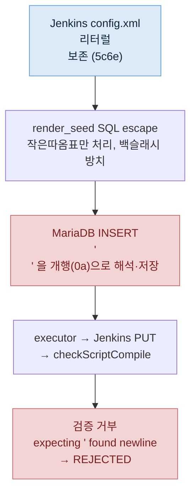

# 부하 테스트 시드의 SQL escape 가 백슬래시를 빠뜨려 Groovy `\n` 리터럴이 깨진 사고

- **발생일**: 2026-06-15 (load_orchestration 100건 burst 부하 테스트 중, REJECTED 50% 추적)
- **영향 범위**: `tps-gitlab2/qa/python` 부하 테스트 하네스 — `_lib/jenkins_pipeline_xml.py::sql_escape_single_quote`, 그 함수를 쓰는 `scripts/render_seed.py` 의 IJ_002.SCRPT 시드 경로. executor·dev 운영 코드는 무관(하네스만의 버그).
- **심각도**: 결함. 발현 시 → 시드한 Jenkins 스크립트에 `'\n'`/`"...\n..."` 같은 리터럴이 있으면 DB 적재 단계에서 실제 줄바꿈으로 풀려, executor 가 그 스크립트를 Jenkins 로 PUT 한 뒤 `checkScriptCompile` 이 거부하고 해당 빌드가 REJECTED 로 종결된다.
- **상태**: 해결. `sql_escape_single_quote` 에 백슬래시 이스케이프(`\` → `\\`)를 작은따옴표 치환보다 앞서 추가. 적용 후 100건 burst 에서 REJECTED 0 실증.
- **작성자**: bh.sim (Claude 보조)
- **곁다리 발견**: executor `JenkinsScriptAdapter` 의 응답 파싱이 객체를 가정하나 실제 응답은 배열이라, 진짜 오류 메시지를 못 읽고 빈 값으로 로깅한다. 원인 파악을 늦춘 요인. 본문 §4 참고.

---

## 1. 장애 현상 (Symptom)

dev 에서 가져온 "성공 기준" Jenkins 스크립트로 100개 job 을 한꺼번에 burst 했는데, 절반 가까이가 일관되게 REJECTED 로 떨어졌습니다. 거부 사유는 모두 `SCRIPT_VALIDATION_FAILED` 였고, executor 로그에는 `line=0, column=0, message=` 처럼 위치와 메시지가 전부 비어 있었습니다. 더 이상한 것은 holdout 패턴이었습니다. 홀수 번호 job(1, 3, 5, … 49)이 거의 전부 거부되고 짝수 번호는 전부 통과했습니다.

같은 스크립트를 `checkScriptCompile` API 에 단독으로 POST 하면 `{"status":"success"}` 로 멀쩡히 통과했습니다. 스크립트 자체에는 문법 오류가 없다는 뜻입니다. 그런데 executor 를 거쳐 dispatch 될 때만 실패했습니다.

## 2. 원인 추적 (Investigation) — 네 번의 빗나간 가설

원인을 좁히는 데 가설을 네 번 세웠고, 앞의 세 개는 직접 검증으로 반증됐습니다.

첫째, "스크립트가 `@Library` 공유 라이브러리를 참조하는데 dev Jenkins 에 그게 없어서"라고 봤습니다. 그러나 라이브러리를 안 쓰는 성공 스크립트로 바꿔도 거부는 계속됐습니다.

둘째, "Declarative pipeline 은 최상위에 `pipeline{}` 블록만 와야 하는데, 스크립트 맨 위에 `def writeJsonReport` 함수가 있어 검증 위반"이라고 봤습니다. 그러나 그 원본 스크립트를 `checkScriptCompile` 에 단독으로 보내니 `success` 였습니다. top-level def 는 문제가 아니었습니다.

셋째, "100건 동시 burst 라 검증 호출이 몰려 간헐적으로 비정상 응답을 받는 동시성 문제"라고 봤습니다. 그러나 실제 응답을 캡처해 보니 간헐적이지 않고 일관된 오류였습니다.

응답을 직접 캡처한 것이 전환점이었습니다. executor 가 받은 raw 응답은 다음과 같았습니다.

```json
[{"line":3,"column":67,"message":"expecting ''', found '\n'","status":"fail"}]
```

`expecting ' found newline` — 작은따옴표로 닫혀야 할 자리에 줄바꿈이 왔다는 문법 오류입니다. 그리고 `line 3, column 67` 은 스크립트 3번째 줄 `}.join(',\n')` 의 `\n` 위치를 정확히 가리켰습니다. 홀수 job 만 실패한 이유도 풀렸습니다. fixtures 를 두 스크립트(`\n` 을 쓰는 BUILD, 안 쓰는 TEST)로 라운드로빈 배정했기 때문에, `\n` 을 가진 BUILD 가 배정된 홀수 번호만 깨진 것이었습니다.

## 3. 근본 원인 (Root Cause) — SQL escape 가 백슬래시를 안 건드림

문제는 스크립트가 DB 로 들어가는 경로에 있었습니다. dev 운영에서는 executor 가 Jenkins 에 PUT 한 config.xml 이 DB(`TB_TRB_IJ_002.SCRPT`)에 그대로 보관되므로 깨질 일이 없습니다. 그러나 이 부하 테스트는 dev 의 DB 값을 그대로 쓰지 않고, **Jenkins config.xml 을 받아 → SQL 시드로 변환 → 로컬 DB 적재** 라는 다른 경로를 거쳤습니다. 깨짐은 이 변환에서 일어났습니다.

`render_seed.py` 가 스크립트를 SQL 문자열 리터럴로 감쌀 때 쓰는 이스케이프 함수는 작은따옴표만 두 배로 만들었습니다.

```python
def sql_escape_single_quote(value: str) -> str:
    return value.replace("'", "''")   # 백슬래시는 그대로 둠
```

MariaDB/MySQL 은 기본 모드에서 문자열 리터럴 안의 `\n` 을 개행 문자로 해석합니다. 백슬래시를 이스케이프하지 않으면, Groovy 스크립트의 `'\n'`(백슬래시+n, 두 문자)이 `INSERT ... VALUES('...\n...')` 로 들어갈 때 MariaDB 가 이를 실제 줄바꿈(0x0a)으로 바꿔 저장합니다. DB 에 적재된 SCRPT 를 16진수로 확인하면 분명했습니다. 원래 리터럴 `\n`(바이트 `5c 6e`)이어야 할 자리가 실제 개행(`0a`)으로 바뀌어 있었습니다.

그 깨진 스크립트를 executor 가 Jenkins 로 PUT 하고 `checkScriptCompile` 로 보내면, 검증기 입장에서는 `'` 안에서 갑자기 줄바꿈이 나타나므로 `expecting ' found newline` 으로 거부합니다.



## 4. 곁다리 결함 — 오류 메시지가 비어 보인 이유

원인 파악이 늦어진 데에는 executor 쪽 로깅도 한몫했습니다. `JenkinsScriptAdapter` 는 검증 응답을 JSON 객체로 보고 `root.path("status")` 로 읽습니다. 그런데 Jenkins 가 실제로 돌려준 응답은 객체가 아니라 배열 `[{...}]` 이었습니다. 배열에 대고 `.path("status")` 를 부르면 빈 문자열이 나오므로 success 가 아니라고 판정되고, 그때 line/column/message 도 전부 기본값(0/0/빈값)으로 찍힙니다. 그래서 진짜 오류(`line:3, message:expecting'`)가 로그에서 안 보였습니다. raw 응답을 그대로 찍는 임시 로그를 넣고 나서야 배열과 실제 메시지가 드러났습니다.

## 5. 해결 (Fix)

이스케이프 함수에 백슬래시 처리를 더했습니다. 백슬래시를 먼저 두 배로 만들어야 뒤이은 작은따옴표 치환 결과를 다시 건드리지 않습니다.

```python
def sql_escape_single_quote(value: str) -> str:
    return value.replace("\\", "\\\\").replace("'", "''")
```

적용 후 DB 에 적재된 SCRPT 를 16진수로 다시 확인하니 `\n` 이 리터럴(`5c 6e`)로 보존됐고, 100건 burst 에서 BUILD 스크립트도 검증을 통과해 REJECTED 가 0 으로 떨어졌습니다.

## 6. 교훈

dev 에서 "빌드가 성공한 스크립트"라는 사실이 "executor 를 거친 검증도 통과한다"를 보장하지 않습니다. 둘 사이에 DB 시드라는 변환 경로가 끼면, 그 경로의 인코딩 처리가 스크립트를 조용히 바꿀 수 있습니다. 특히 SQL 문자열 리터럴은 작은따옴표뿐 아니라 백슬래시도 이스케이프해야 합니다. MariaDB 는 `\n`, `\t`, `\\` 등을 리터럴 안에서 특수 처리하기 때문입니다.

추적 과정에서도 배울 점이 있었습니다. 가설을 세 번 세웠고 세 번 다 틀렸는데, 결정적이었던 것은 추측을 더 쌓는 대신 `checkScriptCompile` 을 직접 호출하고 DB 를 16진수로 들여다본 일이었습니다. "동시성 때문일 것"이라는 그럴듯한 가설도 raw 응답 한 줄 앞에서 무너졌습니다.
