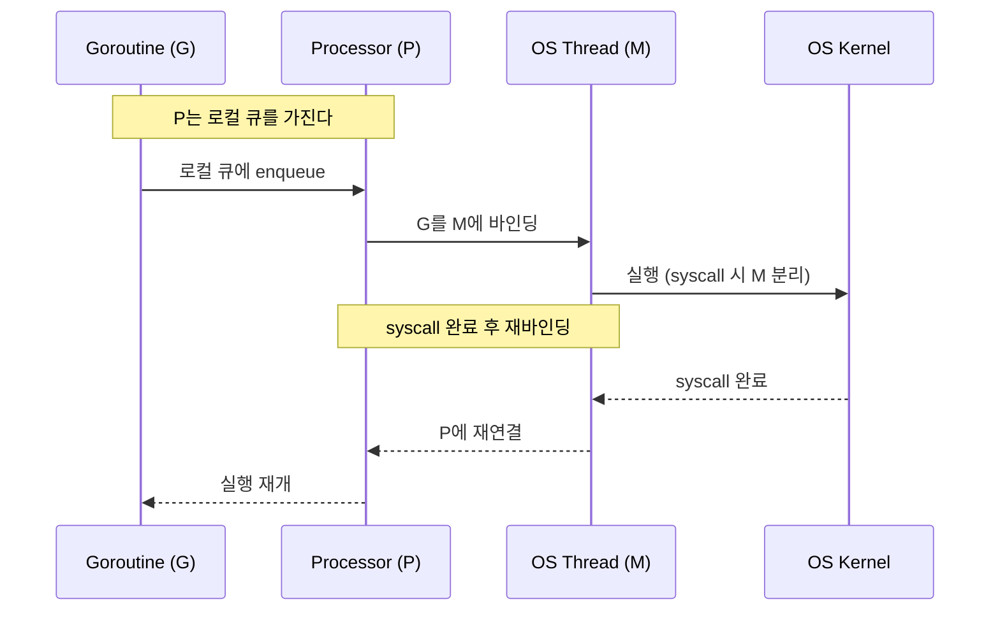
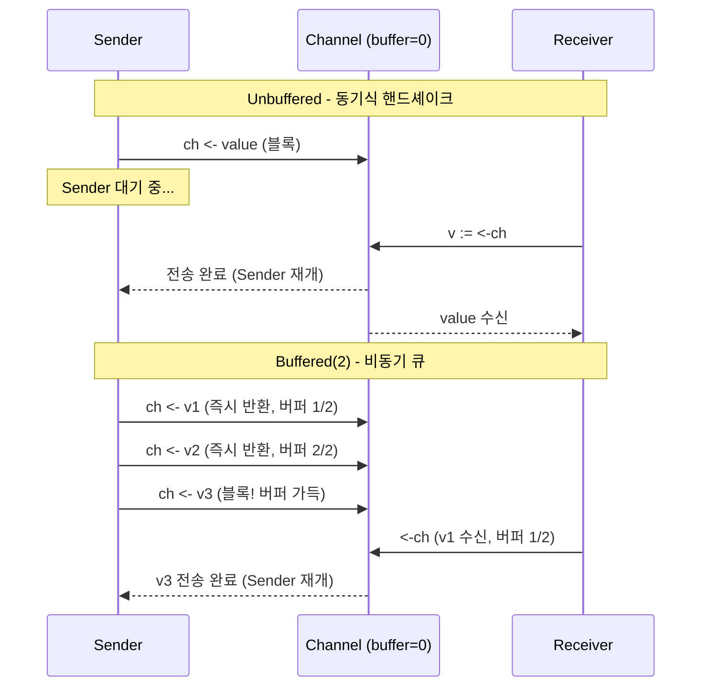
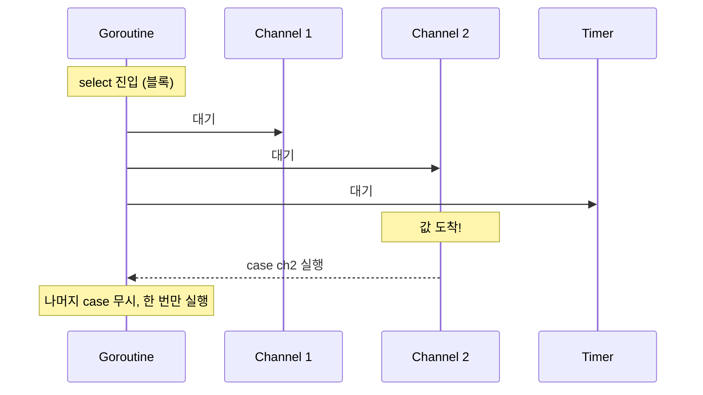

# Goroutine과 Channel 깊이 이해하기

```yaml
title: "Goroutine과 Channel 깊이 이해하기"
category: "09_goLang"
date: 2026-02-26
reading_time: "30-40분"
concepts:
  - Goroutine
  - Channel
  - Select와 동시성 패턴
```

---

## 서론

> **이 에세이를 읽고 나면:**
> - Goroutine이 OS 스레드와 어떻게 다른지 설명할 수 있다
> - Channel을 사용해 고루틴 간 안전하게 데이터를 주고받을 수 있다
> - select 문으로 여러 채널을 동시에 다루는 패턴을 이해한다

Java에서 스레드를 하나 만들려면 `new Thread()`를 호출하고, 스레드 풀을 관리하고, `synchronized` 블록으로 공유 상태를 보호해야 한다. 스레드 하나의 기본 스택 크기가 1MB이므로, 1만 개의 동시 작업을 처리하려면 메모리만 10GB가 필요하다. 현실적으로 불가능한 숫자는 아니지만, 대부분의 시간을 I/O 대기에 쓰는 웹 서버에서 이런 접근은 낭비에 가깝다.

Go는 이 문제를 언어 수준에서 해결했다. `go` 키워드 하나로 생성하는 goroutine은 스택이 2KB에서 시작하고, 런타임 스케줄러가 수천~수만 개의 goroutine을 소수의 OS 스레드 위에서 멀티플렉싱한다. 그리고 공유 메모리 대신 **channel**로 통신하면서 락 없이도 안전한 동시성을 달성한다.

이 에세이에서는 다음 핵심 개념을 다룬다:

1. **Goroutine**: Go 런타임이 관리하는 경량 실행 단위
2. **Channel**: goroutine 간 데이터를 주고받는 타입 안전한 파이프
3. **Select와 동시성 패턴**: 여러 채널을 동시에 다루는 제어 구조

---

## 본론

### 1. Goroutine

#### 1.1 정의와 배경

Goroutine은 Go 런타임이 스케줄링하는 경량 실행 단위다. OS 스레드 위에서 동작하지만 OS가 아닌 Go 런타임이 직접 관리한다는 점에서 "green thread"에 가깝다.

왜 OS 스레드를 그대로 쓰지 않았을까? 핵심은 **비용**이다. OS 스레드는 생성 시 커널 호출이 필요하고, 컨텍스트 스위칭마다 레지스터 전체를 저장/복원해야 하며, 고정 크기 스택(보통 1~8MB)을 미리 할당한다. 반면 goroutine은 사용자 공간에서 생성되고, 스택이 2KB로 시작하여 필요할 때 동적으로 늘어나며(최대 1GB), 컨텍스트 스위칭 비용이 OS 스레드의 1/10 수준이다.

| 비교 항목 | OS 스레드 | Goroutine |
|-----------|----------|-----------|
| 초기 스택 | 1~8MB (고정) | 2KB (동적 성장) |
| 생성 비용 | 커널 호출 (~1ms) | 사용자 공간 (~0.3us) |
| 컨텍스트 스위칭 | ~1-10us (커널) | ~0.2us (사용자 공간) |
| 동시 실행 가능 수 | 수천 개 | 수십만 개 |

#### 1.2 동작 원리 — GMP 모델

Go 런타임 스케줄러는 GMP 모델로 동작한다. G(Goroutine), M(Machine = OS 스레드), P(Processor = 논리 프로세서)의 세 요소가 핵심이다.



P의 개수는 `GOMAXPROCS`로 결정되며, 기본값은 CPU 코어 수다. 각 P는 로컬 실행 큐를 가지고 있어서 goroutine을 꺼내 M에 할당한다. 여기서 재미있는 점은 **work stealing**이다. 한 P의 로컬 큐가 비면 다른 P의 큐에서 goroutine을 절반 가져온다. 이 메커니즘 덕분에 별도의 로드 밸런싱 없이도 CPU 활용률이 균등해진다.

goroutine이 시스템 콜(파일 I/O, 네트워크 등)을 실행하면 어떻게 될까? 해당 M이 블록되면 P는 M과 분리되어 다른 유휴 M(또는 새로 생성한 M)에 붙는다. 시스템 콜이 끝나면 원래 M이 P를 다시 찾거나, 찾지 못하면 goroutine을 글로벌 큐에 넣고 M은 휴면한다. 이 구조 덕분에 하나의 goroutine이 블록 I/O를 해도 다른 goroutine은 멈추지 않는다.

#### 1.3 실무 적용

실제 프로젝트에서 goroutine 사용은 놀라울 정도로 단순하다.

**시나리오**: HTTP 서버에서 외부 API 3개를 동시에 호출하여 응답을 합친다.

```go
func fetchAll(ctx context.Context) (*Result, error) {
    var (
        wg      sync.WaitGroup
        mu      sync.Mutex
        result  Result
        firstErr error
    )

    apis := []struct {
        name string
        fn   func(context.Context) (string, error)
    }{
        {"user", fetchUser},
        {"order", fetchOrder},
        {"inventory", fetchInventory},
    }

    wg.Add(len(apis))
    for _, api := range apis {
        go func(name string, fn func(context.Context) (string, error)) {
            defer wg.Done()
            data, err := fn(ctx)
            mu.Lock()
            defer mu.Unlock()
            if err != nil && firstErr == nil {
                firstErr = fmt.Errorf("%s: %w", name, err)
                return
            }
            result.Set(name, data)
        }(api.name, api.fn)
    }

    wg.Wait()
    if firstErr != nil {
        return nil, firstErr
    }
    return &result, nil
}
```

`go func(){}()`로 goroutine을 시작하고, `sync.WaitGroup`으로 전부 끝나길 기다린다. 여기서 `mu sync.Mutex`가 보이는데, 이건 `result`라는 공유 구조체에 동시 접근하기 때문이다. 다만 이 패턴에는 한계가 있다. 에러 발생 시 다른 goroutine을 취소할 수 없고, 뮤텍스를 직접 관리해야 한다. 이 문제는 뒤에서 channel을 배우면 더 우아하게 해결할 수 있다.

---

### 2. Channel

#### 2.1 정의와 배경

Channel은 goroutine 간에 값을 주고받는 타입 안전한 통신 메커니즘이다. Go의 유명한 격언 "Do not communicate by sharing memory; instead, share memory by communicating"을 구현한 핵심 도구라고 할 수 있다.

왜 뮤텍스 대신 channel을 쓸까? 뮤텍스 기반 동시성의 문제는 **누가 언제 락을 잡고 있는지** 코드만 보고 추론하기 어렵다는 점이다. 데드락이 발생하면 어떤 goroutine이 어떤 순서로 락을 잡았는지 역추적해야 한다. Channel은 데이터의 흐름 자체가 동기화를 강제하므로, 코드를 읽으면 데이터가 어디서 어디로 흐르는지 바로 보인다. "데이터가 채널을 통해 이동한다"는 사실 자체가 소유권 이전을 의미하기 때문이다.

#### 2.2 동작 원리

Channel에는 두 종류가 있다. unbuffered channel(`make(chan T)`)과 buffered channel(`make(chan T, N)`)인데, 동작 방식이 상당히 다르다.

**Unbuffered channel**은 보내는 쪽과 받는 쪽이 동시에 준비되어야 통신이 성립한다. 보내는 goroutine은 받는 goroutine이 나타날 때까지 블록되고, 그 반대도 마찬가지다. 일종의 **핸드셰이크**인 셈이다.

**Buffered channel**은 내부에 N개 크기의 큐를 가진다. 큐가 가득 찰 때까지 보내는 쪽이 블록되지 않고, 큐가 빌 때까지 받는 쪽이 블록되지 않는다.



그렇다면 언제 어떤 걸 써야 할까? 경험적으로, **unbuffered가 기본**이다. 보내는 쪽이 "받는 쪽이 처리했다"는 보장을 원할 때, 즉 동기화가 중요할 때 unbuffered를 쓴다. Buffered는 생산 속도와 소비 속도의 일시적 불균형을 흡수할 때 사용한다. 다만 버퍼 크기를 잘못 설정하면 메모리만 낭비하거나 결국 블록되므로, "잘 모르면 unbuffered"가 안전한 선택이다.

channel의 또 다른 중요한 특성은 **close**다. `close(ch)`를 호출하면 더 이상 값을 보낼 수 없고, 받는 쪽은 남은 값을 모두 꺼낸 뒤 zero value를 받는다. `for v := range ch`는 채널이 닫힐 때 자동으로 루프가 종료되어 "생산 완료" 시그널로 자주 쓰인다. 주의할 점은 **보내는 쪽만 close해야** 한다는 것이다. 받는 쪽이 close하면 보내는 쪽에서 panic이 발생한다.

#### 2.3 실무 적용

**시나리오**: 앞서 뮤텍스로 작성했던 동시 API 호출을 channel로 리팩터링한다.

```go
type apiResult struct {
    name string
    data string
    err  error
}

func fetchAll(ctx context.Context) (*Result, error) {
    ch := make(chan apiResult, 3) // 3개 API 호출

    apis := map[string]func(context.Context) (string, error){
        "user":      fetchUser,
        "order":     fetchOrder,
        "inventory": fetchInventory,
    }

    for name, fn := range apis {
        go func(n string, f func(context.Context) (string, error)) {
            data, err := f(ctx)
            ch <- apiResult{name: n, data: data, err: err}
        }(name, fn)
    }

    var result Result
    for i := 0; i < len(apis); i++ {
        r := <-ch
        if r.err != nil {
            return nil, fmt.Errorf("%s: %w", r.name, r.err)
        }
        result.Set(r.name, r.data)
    }
    return &result, nil
}
```

뮤텍스 버전과 비교하면 `sync.Mutex`와 `sync.WaitGroup`이 모두 사라졌다. 각 goroutine은 결과를 channel에 보내고, 메인 goroutine은 정확히 3번 받으면 끝이다. 데이터 흐름이 "goroutine -> channel -> 메인"으로 단방향이므로 경쟁 조건이 구조적으로 불가능하다. WaitGroup 대신 "보낸 횟수 == 받는 횟수"로 동기화가 자연스럽게 이루어진다.

**주의사항**:
- 에러가 발생해도 나머지 goroutine은 계속 실행된다. 조기 종료가 필요하면 `context.WithCancel`과 조합해야 한다
- buffered channel의 크기를 goroutine 수와 맞추지 않으면 goroutine leak이 발생할 수 있다. 위 예시에서 `make(chan apiResult)` (unbuffered)로 만들면, 에러로 일찍 return할 때 나머지 goroutine이 channel에 보내려다 영원히 블록된다

---

### 3. Select와 동시성 패턴

#### 3.1 정의와 배경

`select`는 여러 channel 연산을 동시에 기다리는 제어 구조다. switch문과 생김새가 비슷하지만, 각 case가 channel 송수신 연산이라는 점이 다르다. 여러 case가 동시에 준비되면 **무작위로 하나**를 선택한다(공정성 보장).

네트워크 프로그래밍의 `epoll`이나 `select` 시스템 콜과 개념적으로 유사하다. "여러 I/O 소스 중 준비된 것부터 처리한다"는 동일한 문제를 언어 수준에서 해결한 것이라고 볼 수 있다.

#### 3.2 동작 원리

```go
select {
case v := <-ch1:
    // ch1에서 값을 받았을 때
case ch2 <- value:
    // ch2에 값을 보냈을 때
case <-time.After(5 * time.Second):
    // 5초 타임아웃
default:
    // 어떤 채널도 준비되지 않았을 때 (논블록킹)
}
```

`select`가 없다면 어떻게 될까? 두 채널에서 동시에 받으려면 goroutine 두 개를 따로 만들어야 하고, 결과를 다시 합치는 세 번째 채널이 필요하다. `select`는 이 복잡함을 한 블록으로 압축한다.

`default`가 있으면 논블록킹, 없으면 블록킹이다. 이 차이는 폴링(polling) 패턴을 만들 때 중요한데, `default` 안에서 `time.Sleep`을 넣으면 주기적으로 채널을 확인하는 루프가 된다. 다만 대부분의 경우 `default` 없이 블록킹으로 쓰는 것이 CPU 낭비를 줄인다.



#### 3.3 실무 적용 — 3가지 핵심 패턴

**패턴 1: 타임아웃**

외부 API를 호출하되, 3초 안에 응답이 없으면 포기하는 패턴이다.

```go
func fetchWithTimeout(ctx context.Context, url string) ([]byte, error) {
    ch := make(chan result, 1)

    go func() {
        data, err := http.Get(url)
        ch <- result{data, err}
    }()

    select {
    case r := <-ch:
        return r.data, r.err
    case <-time.After(3 * time.Second):
        return nil, fmt.Errorf("timeout after 3s: %s", url)
    case <-ctx.Done():
        return nil, ctx.Err()
    }
}
```

`time.After`와 `ctx.Done()`을 함께 쓴 이유가 있다. `time.After`는 이 함수 자체의 타임아웃이고, `ctx.Done()`은 상위 호출자가 취소할 때를 위한 것이다. 예를 들어 HTTP 핸들러에서 클라이언트가 연결을 끊으면 `ctx`가 취소되어 goroutine이 낭비되지 않는다.

**패턴 2: Fan-out, Fan-in**

여러 worker가 병렬로 처리하고 결과를 하나로 모으는 패턴이다. 배치 작업이나 파이프라인에서 자주 등장한다.

```go
func fanOutFanIn(jobs []Job, workerCount int) []Result {
    jobCh := make(chan Job, len(jobs))
    resultCh := make(chan Result, len(jobs))

    // Fan-out: N개 worker 시작
    for i := 0; i < workerCount; i++ {
        go func() {
            for job := range jobCh {
                resultCh <- process(job)
            }
        }()
    }

    // 작업 투입 후 채널 닫기
    for _, j := range jobs {
        jobCh <- j
    }
    close(jobCh) // worker들의 for-range 루프 종료

    // Fan-in: 결과 수집
    results := make([]Result, 0, len(jobs))
    for i := 0; i < len(jobs); i++ {
        results = append(results, <-resultCh)
    }
    return results
}
```

`close(jobCh)`가 핵심인데, 이걸 호출해야 worker goroutine들의 `for range jobCh` 루프가 종료된다. close하지 않으면 worker들이 영원히 다음 job을 기다리면서 goroutine leak이 발생한다.

**패턴 3: Done 채널로 종료 신호**

장시간 실행되는 goroutine을 외부에서 깔끔하게 종료하는 패턴이다.

```go
func startWorker(ctx context.Context) {
    ticker := time.NewTicker(1 * time.Second)
    defer ticker.Stop()

    for {
        select {
        case <-ctx.Done():
            log.Println("worker 종료:", ctx.Err())
            return
        case t := <-ticker.C:
            doPeriodicWork(t)
        }
    }
}
```

`context.WithCancel`이나 `context.WithTimeout`으로 생성한 ctx를 넘기면, 취소 시 `ctx.Done()` 채널이 닫히면서 select가 해당 case를 선택한다. 이 패턴은 Go 표준 라이브러리 전반에서 쓰이며, graceful shutdown의 기본 뼈대이기도 하다.

---

## 결론

### 핵심 요약

| 개념 | 정의 | 핵심 포인트 |
|------|------|-------------|
| Goroutine | Go 런타임이 스케줄링하는 경량 실행 단위 | 2KB 스택, GMP 모델, work stealing |
| Channel | goroutine 간 타입 안전한 통신 파이프 | unbuffered=핸드셰이크, buffered=큐, 보내는 쪽만 close |
| Select | 여러 channel 연산을 동시에 대기하는 제어 구조 | 타임아웃, fan-out/fan-in, done 채널 패턴 |

### 기억해야 할 3가지

1. **"go 키워드는 쉽지만 goroutine leak은 어렵다"**: goroutine을 만들 때 항상 "이 goroutine이 언제 종료되는가?"를 먼저 생각해야 한다. 종료 경로가 없으면 메모리 leak이다.
2. **"잘 모르면 unbuffered"**: buffered channel은 성능 최적화 도구이지 기본값이 아니다. 먼저 unbuffered로 정확성을 확보한 뒤, 프로파일링 결과를 보고 버퍼를 추가하는 순서가 안전하다.
3. **"context.Done()은 항상 select에 포함"**: 장시간 실행되는 goroutine에서 취소 신호를 무시하면 graceful shutdown이 불가능하다. select를 쓸 때 `case <-ctx.Done():`을 습관적으로 넣어라.

### 복습 카드

**Q1**: Goroutine이 OS 스레드보다 가벼운 이유 3가지는?
<details>
<summary>정답</summary>
(1) 초기 스택 2KB(vs 1~8MB), (2) 사용자 공간에서 생성하므로 커널 호출 불필요(~0.3us vs ~1ms), (3) 컨텍스트 스위칭이 Go 런타임 내에서 처리되어 레지스터 저장/복원 비용이 적다(~0.2us vs ~1-10us).
</details>

**Q2**: Unbuffered channel과 buffered channel의 차이는? 각각 언제 사용하나?
<details>
<summary>정답</summary>
Unbuffered는 송신/수신이 동시에 준비되어야 통신이 성립하는 동기식 핸드셰이크. Buffered는 내부 큐가 있어 비동기 통신이 가능하다. Unbuffered는 동기화 보장이 필요할 때(기본값), buffered는 생산/소비 속도 차이를 흡수할 때 사용한다.
</details>

**Q3**: goroutine leak이 발생하는 대표적인 상황과 방지법은?
<details>
<summary>정답</summary>
대표적 상황: unbuffered channel에 보내려는데 받는 goroutine이 없을 때(혹은 그 반대). 에러로 일찍 return하면 나머지 goroutine이 channel에서 영원히 블록된다. 방지법: (1) buffered channel 크기를 goroutine 수와 맞추기, (2) context 취소로 goroutine에 종료 신호 전달, (3) select에 default나 타임아웃 case 추가.
</details>

---

## 더 알아보기

- [Effective Go - Goroutines](https://go.dev/doc/effective_go#goroutines)
- [Go Blog - Share Memory By Communicating](https://go.dev/blog/codelab-share)
- [Go Blog - Go Concurrency Patterns](https://go.dev/blog/pipelines)

---

*작성일: 2026-02-26*
