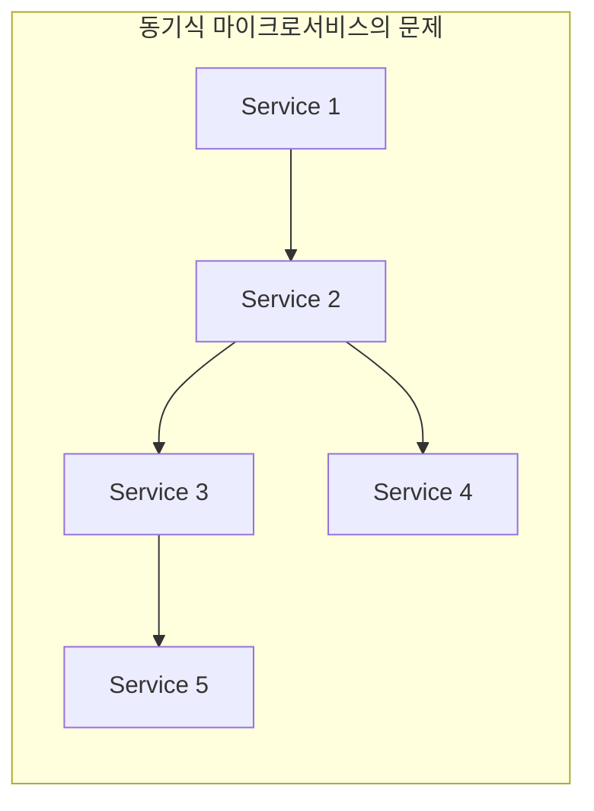
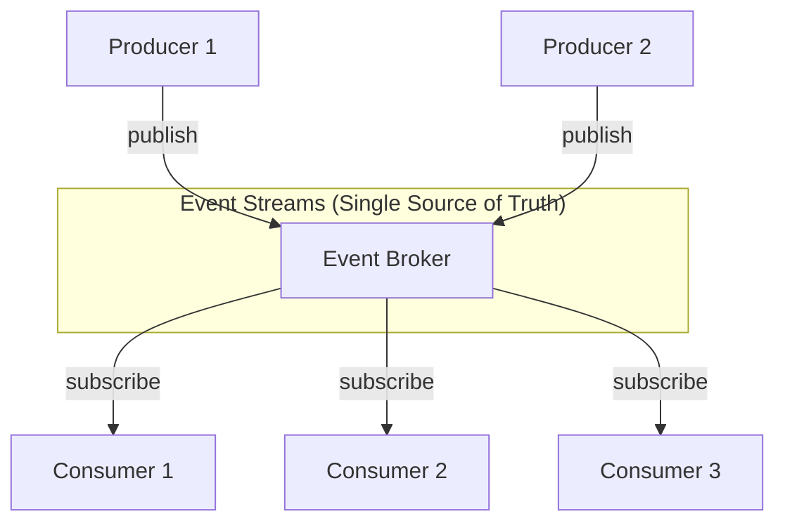
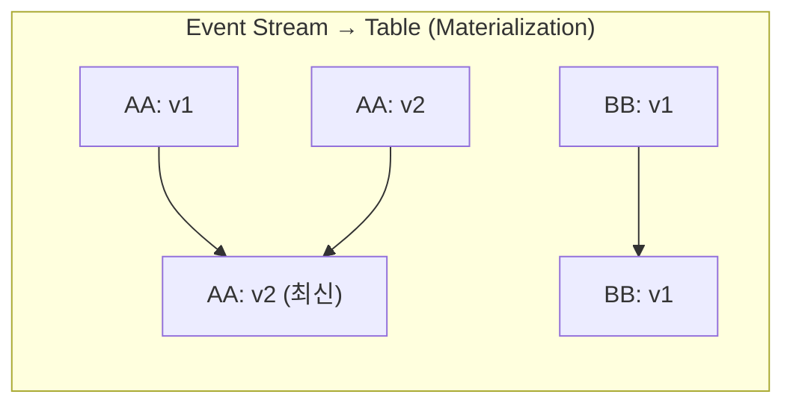

# 01. Why Event-Driven Architecture?

이벤트 기반 아키텍처(EDA)가 왜 필요한지, 그리고 핵심 개념들이 어떻게 연결되어 있는지 이해하는 첫 번째 챕터입니다. 동기식 마이크로서비스의 근본적인 한계를 파악하고, 이벤트 기반 접근이 어떻게 이 문제들을 해결하는지 배웁니다.

> **이론 매핑**: `docs/02_Architecture/03_EventDriven/` Ch.01 (이벤트 기반 마이크로서비스 필요성) + Ch.02 (기초)

---

## 학습 목표

이 챕터를 마치면 다음을 할 수 있습니다:
- 동기식 마이크로서비스가 왜 분산 모놀리스로 변질되는지, 그리고 이벤트 기반 아키텍처가 어떻게 이 문제를 해결하는지 설명할 수 있습니다
- 동기식 마이크로서비스의 네 가지 근본적 한계(point-to-point 결합, 종속적 확장, 장애 전파, 분산 모놀리스)를 이해하고, 실제 사례를 들어 설명할 수 있습니다
- Event Broker(Kafka/Redpanda)와 Message Broker(RabbitMQ)의 차이를 이해하고, 각각을 언제 사용해야 하는지 판단할 수 있습니다
- Table-Stream Duality 개념을 이해하고, Materialization, CDC, Tombstone의 역할을 설명할 수 있습니다
- Single Writer Principle이 왜 필요한지, 그리고 이것이 데이터 소유권과 책임을 어떻게 명확히 하는지 설명할 수 있습니다

---

## 1. 왜 이벤트 기반인가?

### 전통적 아키텍처의 문제

모놀리스 또는 동기식 마이크로서비스에서 발생하는 근본적인 문제는 **서비스 간 직접 호출 중심의 통신 구조로 인해 결합도가 높아지는 점**입니다. 각 서비스가 다른 서비스를 직접 호출하는 방식은 서비스 간 강한 결합을 만들고, 이는 마이크로서비스 아키텍처의 핵심 가치인 독립성과 확장성을 훼손합니다.

| 문제점 | 왜 문제인가? |
|--------|-------------|
| **Point-to-point 결합** | 서비스 A가 서비스 B를 직접 호출하면, B의 API 변경이 A에 즉시 영향을 주기 때문에 독립적인 배포와 버전 관리가 불가능해집니다. 서비스가 늘어날수록 의존성 그래프가 복잡해져서 변경의 영향 범위를 예측하기 어려워집니다. |
| **종속적 확장** | 주문 서비스가 재고 서비스를 호출한다면, 주문이 급증할 때 재고 서비스도 같이 확장해야 합니다. 하나의 서비스 부하가 다른 서비스의 인프라 결정에 영향을 주기 때문에, 각 서비스를 독립적으로 최적화할 수 없습니다. |
| **장애 전파** | 결제 서비스가 다운되면, 결제를 호출하는 주문 서비스도 타임아웃이나 에러로 멈추고, 주문을 호출하는 프론트엔드도 응답하지 못합니다. 하나의 장애가 도미노처럼 전체 시스템을 마비시킬 수 있는 구조입니다. |
| **분산 모놀리스** | 서비스를 나눠도 호출 결합이 높으면 분산 모놀리스가 됩니다. 복잡성은 늘고 독립성 이점은 줄어듭니다. |

### 이벤트 기반 접근의 해결책

이벤트 기반 아키텍처는 서비스 간 직접 호출을 제거하고, **이벤트 브로커**라는 중앙 허브를 통해 통신합니다. 서비스들은 서로를 알 필요 없이, 이벤트를 발행(publish)하거나 구독(subscribe)하기만 하면 됩니다. 이는 서비스 간 결합도를 극적으로 낮추고, 각 서비스가 진정으로 독립적으로 동작하게 만듭니다.

**핵심 특징과 그 이유:**
- **이벤트 = 데이터**: 이벤트는 단순한 알림이 아니라 비즈니스 데이터 자체를 포함합니다. 이벤트는 가능한 한 컨슈머가 추가 동기 호출 없이 처리할 수 있을 만큼의 맥락을 담는 것이 좋습니다. 이를 통해 프로듀서에게 추가 데이터를 요청하는 동기 호출을 피할 수 있습니다.
- **Integration Source of Truth**: 이벤트 스트림은 서비스 간 상태 공유를 위한 공통 사실 기록(integration source of truth)으로 동작합니다. 모든 서비스가 동일한 이벤트 순서를 보기 때문에, 시스템 전체에서 일관된 상태 이해를 공유할 수 있습니다.
- **비동기 통신**: 프로듀서는 이벤트를 발행한 후 즉시 다음 작업을 진행할 수 있습니다. 컨슈머가 언제 이벤트를 처리하는지, 심지어 컨슈머가 몇 개인지도 알 필요가 없기 때문에 진정한 느슨한 결합이 달성됩니다.
- **재생 가능**: 이벤트는 소비된 후에도 브로커에 보존됩니다. 새로운 서비스를 추가하거나 버그를 수정한 후 과거 데이터를 재처리해야 할 때, 처음부터 이벤트를 다시 읽어서 상태를 재구성할 수 있습니다.

---

## 2. 핵심 개념

### 2.1 Bounded Context와 DDD

이벤트 기반 마이크로서비스는 DDD(Domain-Driven Design)의 **Bounded Context** 개념과 자연스럽게 매핑됩니다. Bounded Context는 특정 도메인 모델이 유효한 범위를 명확히 정의하는데, 이는 마이크로서비스의 경계를 결정하는 핵심 기준이 됩니다.

| 개념 | 영역 | 왜 중요한가? |
|------|------|-------------|
| **Domain** | 문제 공간 | 비즈니스가 해결하려는 전체 문제 영역입니다. 예를 들어 이커머스라면 '온라인 쇼핑 경험 제공'이 도메인이 됩니다. 도메인을 이해해야 어떤 서브도메인으로 나눌지 판단할 수 있습니다. |
| **Subdomain** | 문제 공간 | 도메인을 구성하는 개별 비즈니스 영역입니다. 주문, 재고, 배송, 결제는 각각 독립적인 비즈니스 로직과 규칙을 가지기 때문에, 서브도메인으로 분리하면 팀이 각자의 영역에 집중할 수 있습니다. |
| **Bounded Context** | 솔루션 공간 | 입력, 출력, 이벤트, 데이터 모델이 일관된 의미를 갖는 논리적 경계입니다. '상품'이란 단어가 재고 컨텍스트에서는 '재고 수량'을 의미하고, 카탈로그 컨텍스트에서는 '상품 설명과 이미지'를 의미할 수 있습니다. 이 경계가 명확해야 서비스 간 오해 없이 통신할 수 있습니다. |

**설계 원칙과 그 이유:**
- **높은 응집도(High Cohesion)**: 서로 관련된 기능은 한 곳에 모아야 합니다. 주문 생성, 주문 취소, 주문 조회는 모두 주문 서비스에 있어야, 주문 관련 로직을 수정할 때 한 곳만 변경하면 되기 때문입니다.
- **느슨한 결합(Loose Coupling)**: 한 컨텍스트의 내부 변경이 다른 컨텍스트에 영향을 주지 않아야 합니다. 이벤트 기반 통신을 사용하면, 주문 서비스가 내부 데이터베이스 스키마를 바꿔도 발행하는 이벤트 형식만 유지되면 다른 서비스는 영향을 받지 않습니다.
- **비즈니스 정렬**: 기술이 아닌 비즈니스 요구사항으로 경계를 결정해야 합니다. '프론트엔드 팀'과 '백엔드 팀'으로 나누는 것이 아니라, '주문 팀', '재고 팀'으로 나누는 이유는, 각 팀이 비즈니스 가치를 독립적으로 전달할 수 있기 때문입니다.

### 2.2 이벤트 유형

이벤트를 어떻게 키(key)로 구분하느냐에 따라 순서 보장, 파티셔닝, 상태 관리 방식이 달라집니다. 각 유형을 선택하는 이유를 이해하는 것이 중요합니다.

| 유형 | Key | 왜 이렇게 설계하는가? | 예시 |
|------|-----|---------------------|------|
| **Unkeyed Event** | 없음 | 순서가 중요하지 않거나, 각 이벤트가 독립적인 사실을 기록할 때 사용합니다. 키가 없으면 파티션에 라운드로빈으로 분배되어 처리량이 높아지지만, 이벤트 간 순서는 보장되지 않습니다. | 사용자가 특정 페이지를 조회한 로그 (조회 순서가 비즈니스 로직에 영향 없음) |
| **Entity Event** | 엔티티 ID | 같은 엔티티에 대한 이벤트들이 순서대로 처리되어야 할 때 사용합니다. 주문 ID를 키로 사용하면, 같은 주문의 '생성→승인→배송' 이벤트가 같은 파티션에 들어가서 순서가 보장됩니다. 또한 이벤트 스트림을 테이블로 구체화(materialize)할 때, 키별로 최신 상태만 유지됩니다. | 주문 ID를 키로 하는 주문 생성/수정 이벤트 (주문 123의 상태 변화 순서 보장 필요) |
| **Keyed Event** | 비엔티티 키 | 집계나 그룹화를 위해 사용합니다. 사용자 ID를 키로 하면, 같은 사용자의 모든 주문이 같은 파티션에 들어가서, 사용자별 총 구매액 같은 통계를 효율적으로 계산할 수 있습니다. 엔티티 상태 전이가 아닌 분석/집계 목적으로 이벤트를 그룹화할 때 비엔티티 키를 사용합니다. | 사용자 ID를 키로 하는 주문 이벤트 (사용자별 주문 패턴 분석 시 유용) |

### 2.3 메시지의 의도에 따른 분류: Event vs Command vs Query

위 §2.2는 **키(파티셔닝)**를 기준으로 이벤트를 분류했습니다. 이와 직교하는 또 다른 축이 있는데, 메시지가 **무엇을 의도하는가**에 따른 분류입니다. 이벤트 기반 시스템에서 오가는 메시지는 크게 세 가지 의도를 가집니다.

| 구분 | Event | Command | Query |
|------|-------|---------|-------|
| **시제** | 과거형 — OrderCreated | 명령형 — CreateOrder | 요청형 — GetOrderStatus |
| **의미** | 이미 일어난 사실의 기록 | 특정 수신자에게 행동을 요청 | 데이터 조회 요청 |
| **거부 가능?** | 불가 (사실이므로) | 가능 (수신자가 검증 후 거부) | 해당 없음 |
| **프로듀서:컨슈머** | 1:N (브로드캐스트) | 1:1 (지정된 수신자) | 1:1 (응답 필요) |
| **결합도** | 낮음 (발행자는 구독자를 모름) | 높음 (발행자가 수신자를 의식) | 높음 |

**왜 이 구분이 중요한가?**

Choreography SAGA는 Event만으로 흐름을 조율합니다. "결제 완료됨(PaymentCompleted)"이라는 사실을 발행하면, 배송 서비스가 자발적으로 배송을 시작합니다. 발행자는 누가 듣는지 모릅니다. 반면 Orchestration SAGA는 Command를 사용합니다. 오케스트레이터가 "배송을 시작하라(StartShipment)"는 명령을 배송 서비스에 직접 보내고, 성공/실패 응답을 기다립니다.

같은 비즈니스 흐름이라도 Event로 설계하느냐 Command로 설계하느냐에 따라 결합도, 흐름 추적 난이도, 에러 처리 방식이 달라집니다. 이 차이는 [07-choreography-saga](07-choreography-saga.md)와 [08-orchestration-saga](08-orchestration-saga.md)에서 실제 코드로 비교합니다.

> **두 분류 축은 독립적**: Entity Event(키 분류)이면서 동시에 Command(의도 분류)일 수 있습니다. 예를 들어 `orderId`를 키로 하는 `CreatePayment` 메시지는 Entity 키를 사용한 Command입니다.

### 2.4 Table-Stream Duality

이벤트 스트림과 테이블은 동일한 데이터를 다른 관점에서 표현한 것입니다. 이 개념을 이해하면, 상태 관리와 이벤트 처리를 통합된 시각으로 볼 수 있습니다.

**핵심 개념과 그 이유:**

- **Materialization (구체화)**: 이벤트 스트림을 읽어서 테이블로 만드는 과정입니다. 왜냐하면 애플리케이션은 종종 "현재 상태"를 빠르게 조회해야 하기 때문입니다. 예를 들어 주문의 모든 변경 이력(이벤트)을 매번 읽는 대신, 최신 주문 상태만 담긴 테이블을 만들어두면 조회가 빠릅니다. Kafka Streams나 ksqlDB는 이를 자동으로 처리합니다.

- **CDC (Change Data Capture)**: 테이블의 변경 사항을 이벤트 스트림으로 변환하는 과정입니다. 레거시 데이터베이스가 있을 때, 테이블의 INSERT/UPDATE/DELETE를 이벤트로 발행하면, 다른 서비스들이 데이터베이스를 직접 조회하지 않고도 변경을 감지할 수 있습니다. Debezium 같은 도구가 이를 자동화합니다.

- **Tombstone (묘비)**: Value가 null인 이벤트로 삭제를 표현합니다. 이벤트는 append-only로 기록되므로, 삭제는 보통 tombstone과 보존 정책(compaction/retention)으로 표현·처리합니다. 대신 "키 AA는 이제 존재하지 않는다"는 의미의 null 이벤트를 발행하면, 구체화된 테이블에서 해당 키가 제거됩니다. 단, GDPR 등 규제 준수에는 tombstone 외에도 보존 기간, 백업, 스냅샷 삭제 정책이 함께 필요합니다.

### 2.5 Event Broker vs Message Broker

Message Broker와 Event Broker는 비슷해 보이지만, 근본적으로 다른 철학을 가지고 있습니다. 어떤 상황에 어떤 도구를 써야 하는지 이해하는 것이 중요합니다.

| 특성 | Message Broker (RabbitMQ) | Event Broker (Kafka/Redpanda) | 왜 이런 차이가 있는가? |
|------|--------------------------|-------------------------------|---------------------|
| **소비 후** | 메시지 삭제 | 이벤트 보존 | Message Broker는 '작업 분배(task distribution)'를 위해 설계되었습니다. 작업이 한 번 처리되면 끝이므로 메시지를 삭제합니다. Event Broker는 '상태 공유(state sharing)'를 위해 설계되어, 여러 컨슈머가 같은 데이터를 다른 시간에 읽을 수 있어야 하므로 보존합니다. |
| **다중 소비** | 각 컨슈머가 일부만 받음 (경쟁 컨슈머 패턴) | 모든 컨슈머가 전체 접근 (각자 독립적 오프셋) | Message Broker는 메시지를 여러 워커에게 분배해서 병렬 처리합니다. 메시지 1은 워커 A가, 메시지 2는 워커 B가 받습니다. Event Broker는 각 컨슈머 그룹이 전체 스트림을 독립적으로 읽습니다. 결제 서비스도, 재고 서비스도, 분석 서비스도 같은 주문 이벤트를 봅니다. |
| **재생** | 기본 모델에서 제한적 | 가능 (오프셋 리셋) | Message Broker는 기본 모델에서 제한적이고, Event Broker는 오프셋 기반 재처리가 기본 기능입니다. Event Broker는 이벤트를 보존하므로, 새 서비스를 추가하거나 버그를 수정한 후 과거 데이터를 다시 읽어서 상태를 재구성할 수 있습니다. |
| **순서 보장** | 단일 큐/단일 컨슈머에서 유지 | 파티션 레벨에서 엄격 | Message Broker도 단일 큐/단일 컨슈머 조건에서는 순서를 유지할 수 있지만, 병렬 소비 시 순서가 깨질 수 있습니다. Event Broker는 같은 키의 이벤트는 항상 같은 파티션에 들어가고, 파티션 내에서 순서가 보장되므로, 엔티티의 상태 변화 순서를 정확히 추적할 수 있습니다. |
| **상태 공유** | 부적합 | 적합 | Message Broker는 일회성 작업 처리에 적합합니다 (이메일 전송, 알림). Event Broker는 여러 서비스가 같은 비즈니스 데이터를 공유하고 각자의 뷰를 유지해야 할 때 적합합니다 (주문 상태를 주문 서비스, 배송 서비스, 분석 서비스가 각자의 방식으로 저장). |

### 2.6 Single Writer Principle

각 이벤트 스트림의 **핵심 도메인 이벤트는 보통 해당 애그리게잇을 소유한 서비스가 단독으로 발행하는 것이 바람직합니다.** 이는 이벤트 기반 아키텍처에서 데이터 소유권과 책임을 명확히 하는 핵심 원칙입니다.

**왜 단일 writer를 권장하는가?**

- **권위 있는 진실의 원천 보장**: 여러 서비스가 같은 토픽에 이벤트를 쓸 수 있다면, 충돌하는 정보가 발생했을 때 어느 것이 맞는지 판단할 수 없습니다. 예를 들어 주문 서비스만 'orders' 토픽에 쓸 수 있다면, 주문 데이터에 문제가 있을 때 책임 소재가 명확합니다.

- **데이터 계보(Data Lineage) 추적 가능**: 이벤트를 보면 어떤 서비스가 생성했는지 즉시 알 수 있습니다. 이는 디버깅, 감사(audit), 규제 준수에 필수적입니다. 데이터가 시스템을 통해 흐르는 경로를 명확히 추적할 수 있기 때문에, 데이터 품질 문제를 빠르게 찾고 수정할 수 있습니다.

- **소유권 경계 강제**: ACL(Access Control List)이나 IAM 정책으로 토픽 쓰기 권한을 주문 서비스에만 부여하면, 다른 서비스가 실수로나 악의적으로 주문 데이터를 변조하는 것을 방지할 수 있습니다. 이는 마이크로서비스의 경계를 기술적으로 강제하는 방법입니다.

**예외와 현실**: 운영 안정성과 소유권 명확성을 위해 단일 writer를 기본으로 하되, 예외 시에는 소유권·스키마·권한 정책을 명시해야 합니다. 동일한 팀이 관리하는 여러 인스턴스(같은 서비스의 여러 복제본)는 하나의 논리적 프로듀서로 간주됩니다. 또한 테스트나 데이터 마이그레이션 같은 임시 상황에서는 예외적으로 여러 프로듀서를 허용할 수 있지만, 프로덕션 정상 운영 시에는 반드시 단일 프로듀서 원칙을 지켜야 합니다.

---

## 3. Conway의 법칙과 조직 구조

> "시스템을 설계하는 조직은 그 조직의 통신 구조를 복사한 설계를 생산한다." — Melvin Conway

Conway의 법칙은 조직 구조와 소프트웨어 아키텍처가 불가분의 관계라는 통찰을 제공합니다. 이벤트 기반 아키텍처를 성공적으로 구현하려면, 기술뿐만 아니라 조직 구조도 함께 고려해야 합니다.

**이벤트 기반 아키텍처에서의 조직 설계 원칙:**

- **비즈니스 정렬 권장**: 팀 경계는 기술 스택보다 도메인 책임에 맞추는 편이 변경 영향도를 줄입니다. 팀을 비즈니스 도메인(주문, 재고, 결제)에 맞춰 구성하면, 각 팀이 고객에게 전달하는 가치를 독립적으로 책임질 수 있기 때문입니다. 주문 팀은 주문 서비스의 프론트엔드, 백엔드, 데이터베이스, 배포 파이프라인을 모두 소유하고, 주문 관련 기능을 다른 팀에 의존하지 않고 출시할 수 있습니다. 이는 자율성과 배포 속도를 극대화합니다.

- **기술 정렬 비권장**: 프론트엔드팀, 백엔드팀, DBA팀으로 분리하면 문제가 생깁니다. 왜냐하면 하나의 기능을 만들기 위해 세 팀이 모두 작업해야 하고, 서로의 일정을 조율하고 대기해야 하기 때문입니다. 이는 의존성을 높이고, 배포를 느리게 만들며, 결국 시스템 아키텍처도 팀 간 결합도가 높은 구조로 만들어집니다.

- **Inverse Conway Maneuver**: 원하는 아키텍처가 있다면, 조직 구조를 그에 맞게 역설계해야 합니다. 예를 들어 느슨하게 결합된 마이크로서비스 아키텍처를 원한다면, 각 서비스를 독립적으로 개발하고 배포할 수 있는 자율적인 팀을 만들어야 합니다. 조직 구조가 바뀌지 않으면, 아무리 이벤트 브로커를 도입해도 결국 분산 모놀리스가 됩니다.

**실전 예시**: Amazon의 "Two-pizza team" 원칙은 Inverse Conway Maneuver의 좋은 예입니다. 작은 팀(피자 두 판으로 먹일 수 있는 크기)이 서비스 전체를 소유하면, 팀 간 통신 비용이 줄고, 각 팀이 빠르게 의사결정하고 배포할 수 있습니다. 이는 자연스럽게 느슨하게 결합된 서비스 아키텍처를 만듭니다.

---

## 4. 이벤트 기반 아키텍처의 장단점

### 장점

| 장점 | 왜 이것이 중요한가? |
|------|------------------|
| **느슨한 결합** | 서비스들은 이벤트 스키마(도메인 데이터)에만 의존하고, 특정 서비스의 API나 구현에는 의존하지 않습니다. 주문 서비스가 내부 로직을 완전히 재작성해도, 발행하는 이벤트 형식만 유지되면 다른 서비스는 영향을 받지 않습니다. 이는 각 서비스를 독립적으로 진화시킬 수 있게 해줍니다. |
| **확장성** | 각 서비스는 자신의 부하에 따라 독립적으로 확장할 수 있습니다. 결제 서비스가 느리다고 해서 주문 서비스를 확장할 필요가 없습니다. 이벤트 브로커가 버퍼 역할을 하므로, 프로듀서와 컨슈머의 처리 속도가 달라도 시스템이 안정적으로 동작합니다. |
| **기술 유연성** | 각 팀은 자신의 서비스에 최적인 기술을 선택할 수 있습니다. 주문 서비스는 Java, 재고 서비스는 Go, 분석 서비스는 Python을 사용해도 문제없습니다. 이벤트 스키마(Avro, Protobuf)만 공유하면 되기 때문에, 새로운 기술을 도입하는 실험의 비용이 낮아집니다. |
| **테스트 용이성** | 서비스를 격리해서 테스트할 수 있습니다. 실제 이벤트 브로커 대신 테스트용 이벤트를 주입하면, 다른 서비스 없이도 단독으로 테스트할 수 있습니다. 단위 테스트 격리는 쉬워지지만, 비동기 흐름의 E2E/통합 테스트는 오히려 설계가 더 중요해집니다. 이벤트 순서, 타이밍, 재시도 로직 등을 고려한 테스트 전략이 필요합니다. |
| **재처리 가능** | 버그를 수정하거나 새로운 기능을 추가한 후, 과거 이벤트를 다시 읽어서 상태를 재구성할 수 있습니다. 예를 들어 추천 알고리즘을 개선했다면, 과거 1년치 주문 이벤트를 재처리해서 새로운 추천 결과를 만들 수 있습니다. 이는 전통적 아키텍처에서는 불가능한 강력한 기능입니다. |

### 주의점

**모든 것을 이벤트로 만들 필요는 없습니다.** 이벤트 기반 아키텍처는 강력하지만, 모든 문제의 해결책은 아닙니다. EDA가 강한 영역(상태 전파/감사/재처리)과 약한 영역(즉시 응답/강한 일관성)을 구분해야 합니다.

- **동기식이 더 적합한 경우**: 인증, 권한 확인, A/B 테스트 설정 조회 같은 경우는 즉각적인 응답이 필요하고, 이벤트 히스토리를 유지할 이유가 없습니다. 이런 경우 동기식 REST API가 더 단순하고 효율적입니다.

- **하이브리드 아키텍처가 현실적입니다**: 실제 프로덕션 시스템은 대부분 동기식과 비동기식을 혼합합니다. 주문 생성은 이벤트로 처리하지만, 사용자 프로필 조회는 REST API로 처리하는 식입니다. 각 상황에 맞는 도구를 선택하는 것이 실용적인 접근입니다.

- **마이크로서비스 세금을 고려하세요**: EDA는 운영 복잡도(브로커·스키마·관측성) 비용이 크므로, 시스템 복잡도와 팀 성숙도가 충분할 때 도입하는 게 안전합니다. 이벤트 브로커 클러스터를 운영하고, 스키마 레지스트리를 관리하고, 분산 추적을 설정하고, 각 서비스의 배포 파이프라인을 만드는 데는 상당한 비용이 듭니다. 팀이 작거나 시스템 복잡도가 낮다면, 모놀리스나 간단한 아키텍처가 더 나은 선택일 수 있습니다.

---

## 5. 실습 연결

이 챕터는 이론 중심의 개요 챕터입니다. 여기서 배운 개념들은 다음 챕터들에서 실제 코드로 구현하며 체험하게 됩니다.

| 다음 챕터 | 핵심 실습 내용 | 왜 이 순서인가? |
|----------|--------------|----------------|
| [14-basic-event-loop](14-basic-event-loop.md) | Consumer → Process → Producer 기본 루프 | 이벤트를 소비하고, 처리하고, 다시 발행하는 가장 기본적인 패턴을 먼저 익혀야 합니다. 이것이 모든 이벤트 기반 서비스의 뼈대가 됩니다. |
| [02-communication-contracts](02-communication-contracts.md) | Avro 스키마 진화, 호환성 모드 | 기본 루프를 이해한 후, 이벤트의 형식(스키마)을 어떻게 안전하게 진화시키는지 배웁니다. 프로덕션에서는 스키마 변경이 빈번하므로, 호환성 관리가 필수입니다. |

### 권장 학습 순서

1. **이 챕터(01)로 전체 그림 이해**: 왜 이벤트 기반인지, 핵심 개념들이 어떻게 연결되는지 파악합니다.
2. **[14-basic-event-loop](14-basic-event-loop.md)로 기본 이벤트 루프 실습**: 이론을 실제 코드로 구현하며 체득합니다.
3. **[02-communication-contracts](02-communication-contracts.md)로 스키마 관리 학습**: 이벤트 형식을 안전하게 관리하는 방법을 배웁니다.
4. **이후 챕터는 관심사별로 선택**: Saga, Outbox, Stream Processing 등 필요한 패턴을 선택적으로 학습합니다.

---

## 참고 자료

### 이론 문서
이 챕터는 다음 문서들을 기반으로 작성되었습니다. 더 깊은 이해를 원한다면 참고하세요.

- `docs/02_Architecture/03_EventDriven/01_이벤트_기반_마이크로서비스_필요성.md` - 왜 이벤트 기반 아키텍처가 필요한지, 동기식 마이크로서비스의 한계를 더 상세히 다룹니다.
- `docs/02_Architecture/03_EventDriven/02_이벤트_기반_마이크로서비스_기초.md` - Bounded Context, 이벤트 유형, Table-Stream Duality 등 핵심 개념을 더 깊이 있게 설명합니다.

### 서적
이벤트 기반 아키텍처를 체계적으로 학습하고 싶다면 다음 책들을 추천합니다.

- **Building Event-Driven Microservices** by Adam Bellemare (O'Reilly) - 이벤트 기반 마이크로서비스의 바이블입니다. 이론부터 실전 패턴까지 포괄적으로 다루며, 이 챕터의 많은 개념이 이 책에서 나왔습니다.
- **Domain-Driven Design** by Eric Evans - Bounded Context, Subdomain 같은 DDD 개념의 원전입니다. 이벤트 기반 아키텍처의 서비스 경계를 설계하는 데 필수적인 지식을 제공합니다.
- **Designing Data-Intensive Applications** by Martin Kleppmann - 분산 시스템의 근본 원리를 다룹니다. 이벤트 스트림, 복제, 파티셔닝 등의 개념을 깊이 있게 이해하고 싶다면 필독서입니다.
