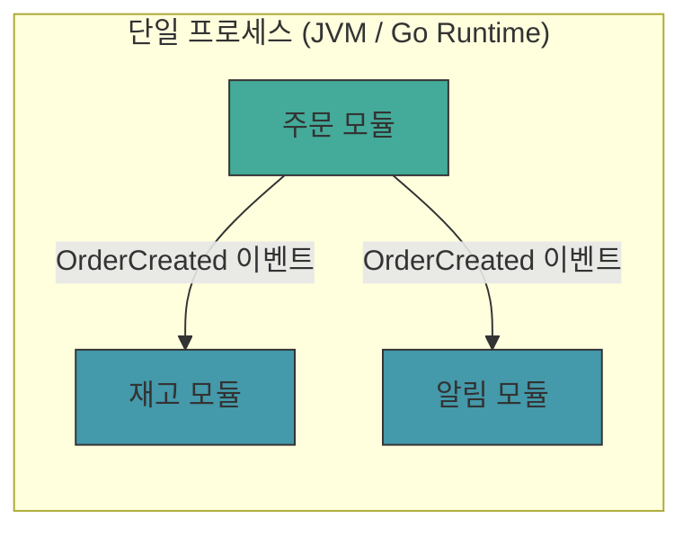
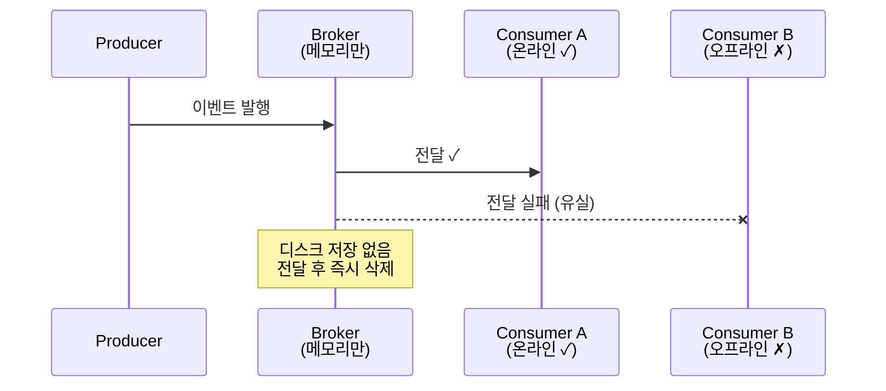
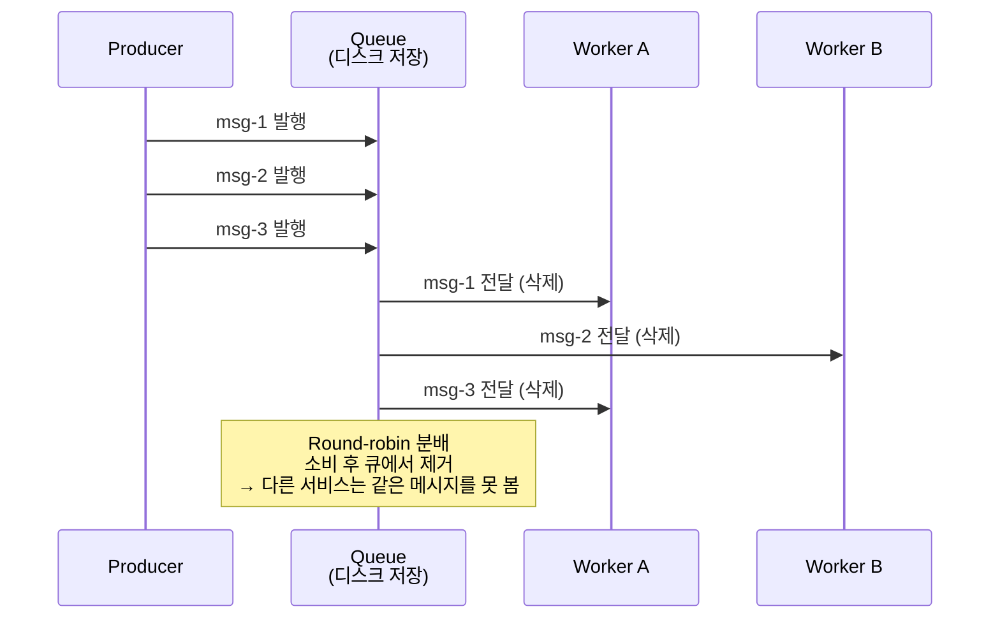
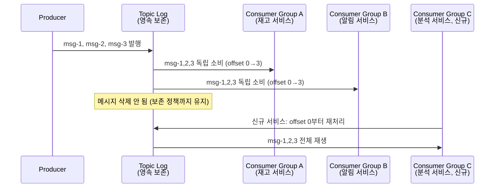
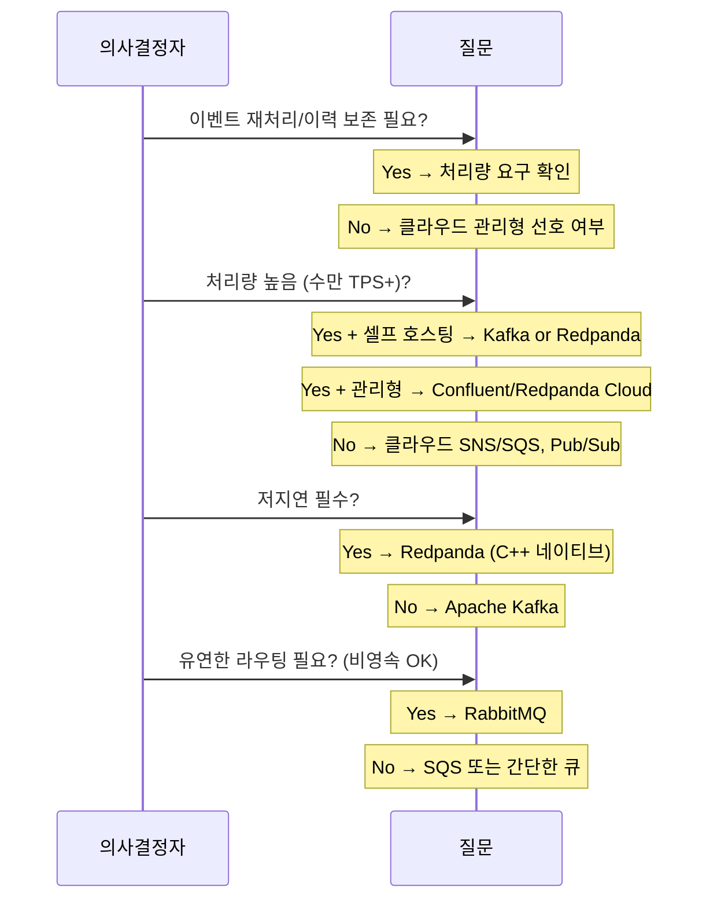

# 02. Event-Driven Architecture 기초 — 유형, 비교, 이벤트 처리

EDA(Event-Driven Architecture)는 이벤트의 생산, 감지, 소비를 중심으로 시스템을 설계하는 아키텍처 패턴이다. 이 문서에서는 EDA를 4가지 유형으로 분류하고, 전통적인 Request-Response 아키텍처와 6가지 기준으로 비교하며, 이벤트 처리 방식(SEP/CEP)과 메시징 도구 선택 기준을 다룬다.

> **선행 학습**: [01-why-event-driven.md](./01-why-event-driven.md)에서 EDA의 필요성, 핵심 개념(Bounded Context, 이벤트 유형, Table-Stream Duality, Event/Message Broker 차이, Single Writer Principle)을 먼저 학습한다.
>
> **원본**: Redpanda/Kafka에 국한되지 않는 범용 EDA 개념이므로 Architecture 카테고리에 배치했다.

---

## 학습 목표

이 문서를 학습한 뒤 다음 질문에 답할 수 있어야 한다:

- EDA의 4가지 유형을 구분하고, 각 유형이 적합한 상황을 판단할 수 있는가?
- EDA와 Request-Response 아키텍처를 6가지 기준으로 비교할 수 있는가?
- 단순 이벤트 처리(SEP)와 복잡 이벤트 처리(CEP)의 차이를 설명할 수 있는가?
- 주요 메시징 도구의 특성을 비교하여 프로젝트에 맞는 도구를 선택할 수 있는가?

---

## 1. 이벤트란 무엇인가

EDA를 이해하려면 먼저 "이벤트"와 "레코드"를 구분해야 한다.

**이벤트(Event)** 는 시스템에서 발생한 사실의 불변 기록이다. "주문이 생성되었다", "결제가 완료되었다"처럼 **이미 일어난 일**을 나타낸다. 이벤트는 되돌릴 수 없고, 시간순으로 쌓인다.

**레코드(Record)** 는 이벤트를 메시지 브로커에 저장할 때의 물리적 단위다. Kafka/Redpanda에서는 키, 값, 타임스탬프, 헤더로 구성된 바이너리 메시지를 레코드라 부른다.

이 구분이 중요한 이유는 EDA의 4가지 유형이 **이벤트의 전달 방식과 수명**에 따라 나뉘기 때문이다.

> 이벤트 유형(Unkeyed/Entity/Keyed)과 Table-Stream Duality 상세는 [01-why-event-driven.md §2](./01-why-event-driven.md) 참조.

---

## 2. EDA의 4가지 유형

모든 EDA가 같은 방식으로 동작하지는 않는다. 이벤트가 전달되는 범위, 영속성, 소비 모델에 따라 크게 4가지 유형으로 분류할 수 있다. 이 분류를 이해하면 "우리 시스템에 EDA를 도입하겠다"는 막연한 목표를 구체적인 기술 선택으로 좁힐 수 있다.

### 유형 1: Application Internal (프로세스 내부 이벤트)

단일 애플리케이션 내부에서 컴포넌트 간 이벤트를 전달하는 패턴이다. 네트워크를 거치지 않으므로 지연이 극히 낮고, 별도 인프라가 필요 없다.

대표적으로 Go의 채널(channel), Akka의 Actor 메시지, Java의 `ApplicationEventPublisher`(Spring Events), Node.js의 `EventEmitter`가 이 유형에 해당한다. 이벤트는 프로세스 메모리에만 존재하므로 프로세스가 종료되면 사라진다.

**적합한 상황**: 단일 서비스 내부에서 모듈 간 결합도를 낮추고 싶을 때. 예를 들어, 주문 서비스 내에서 주문 생성 → 재고 확인 → 알림 발송을 이벤트로 연결하면 각 모듈이 서로를 직접 호출하지 않아도 된다.

**한계**: 프로세스 경계를 넘을 수 없다. 다른 서비스와 이벤트를 공유하려면 유형 3 또는 4가 필요하다.



> 네트워크 없이 메모리에서 직접 전달. 프로세스가 종료되면 이벤트도 소멸한다.

### 유형 2: Ephemeral Messaging (비영속 메시징)

네트워크를 통해 이벤트를 전달하지만, **메시지를 디스크에 저장하지 않는** 방식이다. 수신자가 온라인이어야만 메시지를 받을 수 있고, 연결이 끊긴 동안 발생한 메시지는 유실된다.

ESB(Enterprise Service Bus)의 pub/sub 모드, WebSocket 브로드캐스트, Redis Pub/Sub(영속 모드 비활성 시)이 이 유형에 해당한다. "fire-and-forget" 시맨틱스라고도 부르는데, 발행자가 메시지를 보내면 브로커가 현재 연결된 구독자에게만 전달하고 메시지를 버린다.

**적합한 상황**: 실시간 알림, 채팅, 라이브 대시보드처럼 "지금 이 순간"의 데이터만 의미 있는 경우. 과거 메시지를 재처리할 필요가 없다면 영속 스토리지는 불필요한 비용이다.

**한계**: 메시지 유실 가능성을 감수해야 한다. 소비자가 잠시 다운되면 그 동안의 이벤트를 놓친다. 비즈니스 크리티컬한 이벤트(결제, 주문)에는 부적합하다.



### 유형 3: Queue (메시지 큐)

메시지를 디스크에 영속 저장하고, **소비자가 메시지를 가져가면 큐에서 제거**하는 방식이다. 하나의 메시지는 하나의 소비자만 처리한다(point-to-point).

JMS(Java Message Service), RabbitMQ, ActiveMQ, AWS SQS가 이 유형의 대표 도구다. 여러 소비자가 같은 큐를 구독하면 메시지가 round-robin으로 분배되어 작업 부하를 분산할 수 있다(competing consumers 패턴).

**적합한 상황**: 작업 분배(task distribution)가 핵심인 경우. 예를 들어, 이미지 리사이징 요청을 큐에 넣고 워커 풀이 하나씩 가져가 처리하는 패턴이다. 메시지가 반드시 한 번만 처리되어야 하고, 처리 순서가 엄격하지 않아도 될 때 적합하다.

**한계**: 메시지가 소비되면 사라지므로 같은 이벤트를 여러 서비스가 독립적으로 소비할 수 없다. "주문 생성" 이벤트를 재고 서비스, 알림 서비스, 분석 서비스가 각각 받아야 한다면 큐 3개를 만들거나 유형 4를 사용해야 한다.



### 유형 4: Pub/Sub Streaming (영속 스트리밍)

메시지를 영속 로그에 저장하고, **소비자가 읽어도 메시지가 삭제되지 않는** 방식이다. 여러 Consumer Group이 동일한 토픽을 독립적으로 읽을 수 있고, 과거 메시지를 오프셋 리셋으로 재처리할 수 있다.

Apache Kafka, Redpanda, Apache Pulsar, AWS Kinesis가 이 유형에 해당한다. 토픽 기반 pub/sub 모델과 Consumer Group을 통한 병렬 처리를 결합하여 높은 처리량과 유연한 소비 패턴을 동시에 제공한다.

**적합한 상황**: 이벤트 소싱, CQRS, 실시간 분석, 다수의 서비스가 같은 이벤트를 소비해야 하는 MSA 환경. 이벤트 로그를 영구 보존하면 새 서비스를 추가할 때 과거 데이터부터 재처리하여 상태를 구축할 수 있다.

**한계**: 운영 복잡성이 높다. 파티셔닝, 리밸런싱, 스키마 관리, 보존 정책 등을 설정하고 모니터링해야 한다. 소규모 시스템에서는 오버엔지니어링일 수 있다.



### 4가지 유형 비교

| 구분 | Internal | Ephemeral | Queue | Pub/Sub Streaming |
|------|----------|-----------|-------|-------------------|
| **범위** | 프로세스 내부 | 네트워크 (비영속) | 네트워크 (영속) | 네트워크 (영속 로그) |
| **영속성** | 없음 (메모리) | 없음 (전달 후 삭제) | 있음 (소비 시 삭제) | 있음 (보존 정책까지 유지) |
| **소비 모델** | Observer/Listener | 현재 구독자만 | Point-to-point (round-robin) | Consumer Group (독립 소비) |
| **재처리** | 불가 | 불가 | 불가 (소비 시 삭제) | 가능 (오프셋 리셋) |
| **대표 도구** | Go channel, Spring Events | Redis Pub/Sub, WebSocket | RabbitMQ, SQS, ActiveMQ | Kafka, Redpanda, Pulsar |
| **적합 사례** | 모듈 간 디커플링 | 실시간 알림, 채팅 | 작업 분배, 백그라운드 잡 | 이벤트 소싱, MSA, 분석 |

> **이 시리즈의 관련 문서**: [07-choreography-saga](./07-choreography-saga.md), [08-orchestration-saga](./08-orchestration-saga.md), [16-event-sourcing](./16-event-sourcing.md)은 유형 4(Pub/Sub Streaming) 위에서 동작하는 패턴들이다.

---

## 3. EDA vs Request-Response 비교

EDA와 Request-Response는 대체재가 아니라 **보완재**다. 대부분의 프로덕션 시스템은 둘을 혼용한다.

| 비교 기준 | Request-Response | Event-Driven |
|-----------|-----------------|--------------|
| **Reactivity** | 명시적 호출, 변경 시 호출자 수정 | 이벤트 구독, 발행자 변경 불필요 |
| **Coupling** | 공간+시간 결합 | 공간+시간 디커플링 |
| **Consistency** | 강한 일관성 가능 | 최종 일관성 전제 |
| **Historical State** | 현재 상태만, 감사 로그 별도 | 이벤트 로그가 이력 보존 |
| **Flexibility** | 서비스 추가 시 기존 코드 수정 | 토픽 구독만으로 서비스 추가 |
| **Data Reuse** | 서비스별 DB 격리 | 토픽이 데이터 허브 역할 |

> **실무 원칙**: 동기 응답이 필요한 API 호출(로그인, 검색)은 Request-Response로, 후속 처리(알림, 분석, 재고 차감)는 EDA로 처리하는 것이 일반적이다.

각 기준별 상세 비교(코드 예시, 가용성 수학, 일관성 타임라인, 프론트엔드 처리 패턴 포함)는 [10-request-response-bridge.md §EDA vs Request-Response](./10-request-response-bridge.md)에서 다룬다.

---

## 4. Simple vs Complex Event Processing

이벤트를 소비하는 방식은 크게 두 가지로 나뉜다. 하나의 이벤트에 즉각 반응하는 **단순 이벤트 처리(SEP)** 와, 여러 이벤트를 시간 창(window)으로 묶어 패턴을 감지하는 **복잡 이벤트 처리(CEP)** 다.

### SEP (Simple Event Processing)

단일 이벤트가 도착하면 단일 반응을 트리거하는 패턴이다. 대부분의 EDA 시스템이 이 방식으로 동작한다.

예시:
- `order.placed` → 재고 차감
- `payment.completed` → 배송 시작
- `user.signed_up` → 환영 이메일 발송

SEP는 구현이 간단하고 지연이 낮다. Kafka Consumer가 메시지를 읽고 비즈니스 로직을 실행하는 일반적인 패턴이 SEP에 해당한다.

### CEP (Complex Event Processing)

여러 이벤트를 시간 기반 창(window)으로 집계하여 **패턴**을 감지하는 처리 방식이다. 개별 이벤트 하나하나는 의미가 없지만, 조합하면 의미 있는 신호가 된다.

Uber의 surge pricing이 CEP의 전형적인 예시다:

```
입력 이벤트:
  - driver.location (GPS 좌표, 수천 건/초)
  - ride.requested (탑승 요청)
  - traffic.update (교통 정보)

CEP 처리 (5분 윈도우):
  IF 특정 지역의 ride.requested 수 > driver.available 수 × 1.5
  AND traffic.update가 "혼잡" 상태
  THEN surge_pricing 이벤트 발행 (배율 계산)

출력 이벤트:
  - surge.activated { zone: "강남", multiplier: 2.3 }
```

이 계산은 단일 이벤트로는 불가능하다. 수천 건의 GPS 이벤트, 탑승 요청, 교통 정보를 5분 윈도우로 집계해야 비로소 "이 지역에 운전자가 부족하다"는 패턴이 드러난다.

### SEP vs CEP 비교

| 구분 | SEP | CEP |
|------|-----|-----|
| **입력** | 단일 이벤트 | 복수 이벤트 (시간 창) |
| **처리** | 1:1 반응 | 패턴 감지, 집계 |
| **지연** | 낮음 (ms 단위) | 상대적으로 높음 (윈도우 크기에 비례) |
| **복잡도** | 낮음 | 높음 (상태 관리, 윈도우 전략) |
| **도구** | Kafka Consumer, Spring Kafka | Kafka Streams, Flink, Esper |
| **사례** | 주문→재고 차감 | 사기 탐지, surge pricing, 이상 감지 |

> 스트림 처리 프레임워크의 윈도우 연산이 CEP의 기술적 기반이 된다. Stateless 토폴로지는 [04-event-processing.md](./04-event-processing.md), Stateful 스트리밍은 [05-stateful-streaming.md](./05-stateful-streaming.md) 참조.

---

## 5. 메시징 도구 비교

EDA를 구현할 때 "어떤 브로커를 쓸 것인가"는 아키텍처의 근간을 결정하는 선택이다. 아래 비교는 각 도구의 설계 철학과 적합 환경을 중심으로 정리한다.

> Event Broker vs Message Broker의 개념적 차이는 [01-why-event-driven.md §2.4](./01-why-event-driven.md)에서 다뤘다. 이 섹션은 구체적인 도구 비교와 선택 기준에 집중한다.

### Apache Kafka / Redpanda

영속 로그 기반 스트리밍 플랫폼이다. 높은 처리량, 이벤트 재처리, Consumer Group 기반 수평 확장이 핵심 강점이다. 대규모 MSA 환경에서 이벤트 백본으로 사용된다.

Kafka와 Redpanda의 차이는 구현 언어와 운영 복잡성에 있다. Kafka는 JVM 기반으로 GC 튜닝이 필요하고, Redpanda는 C++ 네이티브로 단일 바이너리 운영이 가능하다.

### RabbitMQ / ActiveMQ

AMQP 프로토콜 기반의 전통적인 메시지 브로커다. 유연한 라우팅(exchange → queue 바인딩), 메시지 확인(ack/nack), TTL, 우선순위 큐 등 풍부한 메시징 시맨틱스를 제공한다. 소규모~중규모 시스템에서 설정이 간단하고 학습 곡선이 낮다.

다만 메시지가 소비되면 큐에서 삭제되므로 이벤트 재처리가 어렵고, 고처리량 시나리오에서 Kafka/Redpanda에 비해 확장성이 제한된다.

### AWS SNS/SQS

AWS 관리형 서비스다. SNS(Simple Notification Service)가 pub/sub 팬아웃을, SQS(Simple Queue Service)가 영속 큐를 담당한다. 서버리스 아키텍처와 자연스럽게 통합되며(Lambda 트리거), 인프라 운영 부담이 없다.

단점은 AWS 종속(vendor lock-in)과 메시지 크기 제한(256KB)이다. 또한 SQS의 순서 보장은 FIFO 큐에서만 지원되며, 처리량이 초당 3,000건으로 제한된다(배치 시 30,000건).

### Azure Service Bus / Google Pub/Sub

각각 Azure와 GCP의 관리형 메시징 서비스다. Service Bus는 엔터프라이즈 패턴(세션, 스케줄링, 데드 레터)에 강하고, Google Pub/Sub은 글로벌 분산과 자동 스케일링에 강하다. 해당 클라우드를 이미 사용 중이라면 통합이 수월하다.

### 도구 비교표

| 도구 | 프로토콜 | 영속성 | 처리량 | 운영 모델 | 적합 환경 |
|------|---------|--------|--------|----------|----------|
| **Kafka** | Kafka Protocol | 영속 로그 | 매우 높음 | 셀프 호스팅 / Confluent Cloud | 대규모 MSA, 이벤트 소싱 |
| **Redpanda** | Kafka Protocol | 영속 로그 | 매우 높음 | 셀프 호스팅 / Redpanda Cloud | Kafka 대안, 저지연, 간편 운영 |
| **RabbitMQ** | AMQP | 소비 시 삭제 | 중간 | 셀프 호스팅 / CloudAMQP | 유연한 라우팅, 소규모 시스템 |
| **AWS SQS/SNS** | HTTP API | 영속 (SQS) | 높음 | 완전 관리형 | AWS 서버리스, Lambda 통합 |
| **Azure Service Bus** | AMQP / HTTP | 영속 | 높음 | 완전 관리형 | Azure 엔터프라이즈 |
| **Google Pub/Sub** | gRPC / HTTP | 영속 | 높음 | 완전 관리형 | GCP, 글로벌 분산 |

### 선택 의사결정 흐름



---

## 6. EDA와 Service Mesh의 보완 관계

실제 프로덕션 시스템은 비동기 통신(EDA)만으로 구성되지 않는다. 동기 API 호출이 여전히 필요한 영역이 있고, 이 동기 통신을 관리하는 인프라가 Service Mesh다.

**Service Mesh**(Istio, Linkerd)는 서비스 간 동기 통신에 사이드카 프록시(Envoy)를 삽입하여 암호화(mTLS), 로드밸런싱, 서비스 디스커버리, 분산 추적을 투명하게 제공한다. 애플리케이션 코드를 수정하지 않고 인프라 레벨에서 통신 정책을 관리할 수 있다.

Netflix의 아키텍처가 이 조합의 대표적인 예시다:

- **EDA 영역**: 시청 이벤트 → 추천 알고리즘, A/B 테스트 결과 이벤트 → 콘텐츠 전략. 비동기 처리가 적합한 영역이므로 Kafka를 사용한다.
- **Service Mesh 영역**: 사용자가 "재생" 버튼을 누르면 카탈로그 API → 라이선스 확인 → CDN URL 반환. 동기 응답이 필수인 영역이므로 Service Mesh로 관리한다.

두 패턴이 배타적이지 않다는 점이 핵심이다. 하나의 비즈니스 플로우에서 동기 호출(즉시 응답 필요)과 비동기 이벤트(후속 처리)가 공존할 수 있다. 예를 들어 주문 API는 동기로 응답하되, 결제 완료 후 배송/알림/분석은 이벤트로 처리하는 방식이다.

| 영역 | EDA | Service Mesh |
|------|-----|-------------|
| **통신 방식** | 비동기 (토픽 기반) | 동기 (HTTP/gRPC) |
| **핵심 역할** | 후속 처리, 데이터 파이프라인, 분석 | API 호출 관리, 보안, 관찰성 |
| **인프라** | Kafka, Redpanda | Istio, Linkerd, Envoy |
| **결합도** | 느슨함 | 상대적으로 강함 (호출자가 서비스 알아야 함) |

---

## 참고 자료

### 이 문서의 출처
- *Unlock the Power of Event-Driven Architecture — Netflix & Uber* (YouTube)
- *EDA vs Request-Response: 6 Factors* (YouTube)
- *4 Key Types of Event-Driven Architecture* (YouTube)

### 연관 문서
- [01-why-event-driven.md](./01-why-event-driven.md): EDA 필요성, 핵심 개념, Conway의 법칙
- [03-communication-contracts.md](./03-communication-contracts.md): Avro 스키마 진화, 호환성 모드
- [04-event-processing.md](./04-event-processing.md): Stateless 토폴로지 (filter, map, branch)
- [05-stateful-streaming.md](./05-stateful-streaming.md): Stateful 스트리밍 (KTable, 윈도우)
- [16-event-sourcing.md](./16-event-sourcing.md): 이벤트 소싱 패턴
- [17-messaging-patterns.md](./17-messaging-patterns.md): EIP 메시징 패턴

### 다음 단계
- **SAGA 패턴**: [06-choreography-saga.md](./06-choreography-saga.md), [07-orchestration-saga.md](./07-orchestration-saga.md)
- **Outbox + CDC**: [09-transactional-messaging.md](./09-transactional-messaging.md)
- **멱등성 패턴**: [18-idempotency-patterns.md](./18-idempotency-patterns.md)
