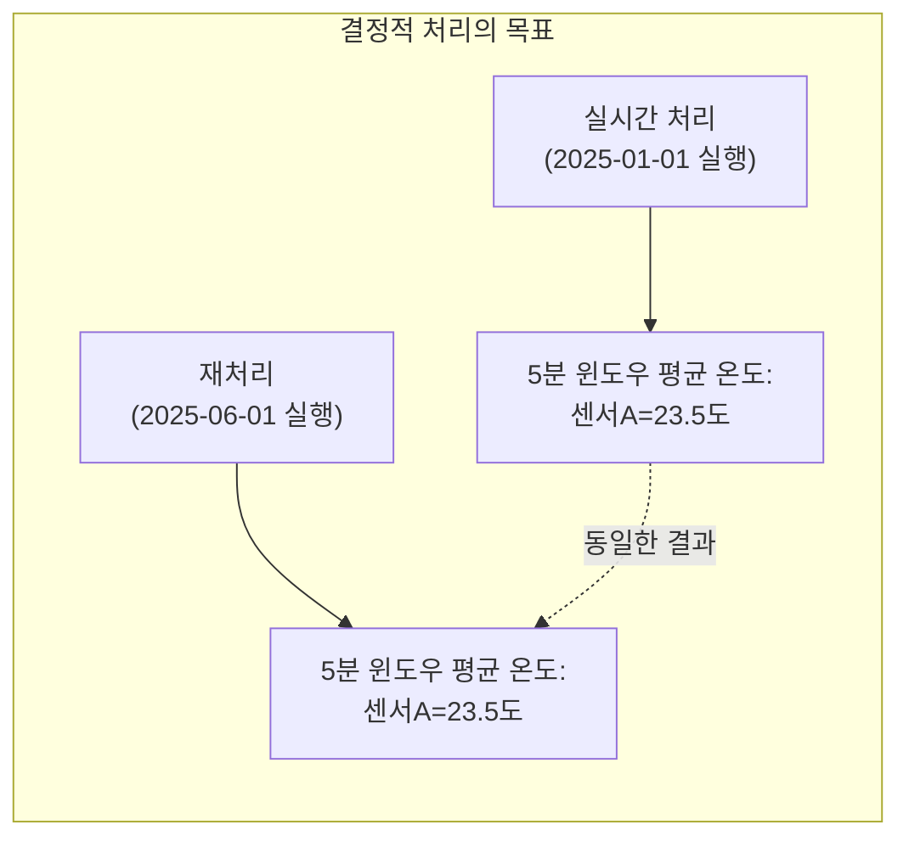
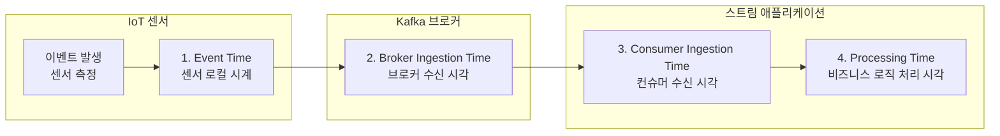
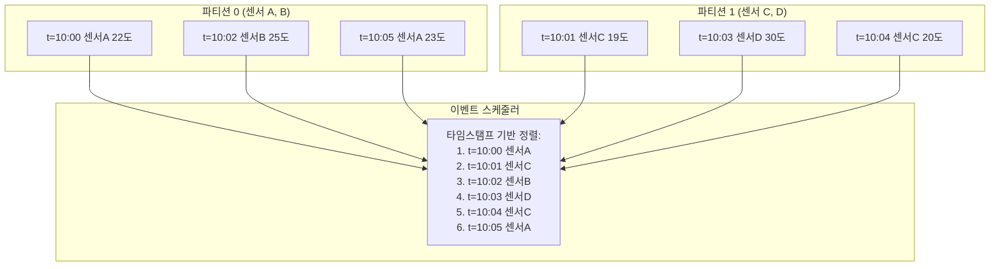
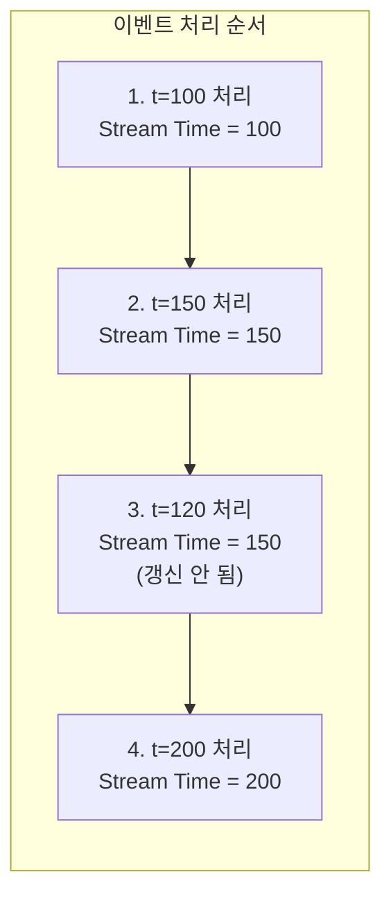
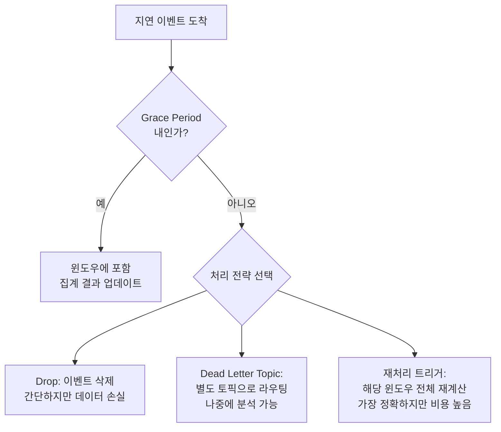
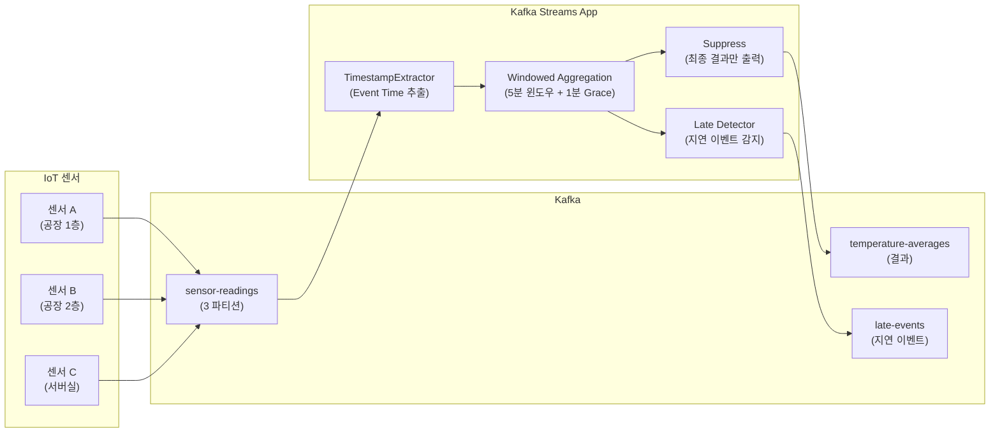

# 06. 결정적 스트림 처리 (Deterministic Stream Processing)

**실습 시간**: 3-4시간
**난이도**: 고급
**참조 문서**: Ch6 결정적 스트림 처리
**브로커**: Kafka (Kafka Streams 사용)

---

## 실습 목표

이 실습에서는 **결정적 스트림 처리(Deterministic Stream Processing)**를 구현합니다. 동일한 입력 이벤트에 대해 실시간 처리든 과거 데이터 재처리든 **항상 동일한 결과를 생성**하는 스트림 애플리케이션을 구축합니다.

왜 결정적 처리가 중요한가? 스트림 처리 시스템은 다음과 같은 상황에서 비결정적 결과를 만들 수 있습니다:

- **Processing Time 기반 윈도우**: 벽시계 시간(Wall-clock Time)에 따라 이벤트가 다른 윈도우에 배정되므로, 재처리 시 결과가 달라집니다.
- **지연 도착 이벤트(Late-arriving Events)**: 네트워크 지연으로 늦게 도착한 센서 데이터가 이미 닫힌 윈도우에 포함되지 못하면, 집계 결과가 부정확해집니다.
- **다중 파티션 이벤트 순서**: 여러 파티션에서 이벤트를 소비할 때, 어떤 파티션을 먼저 처리하느냐에 따라 중간 결과가 달라질 수 있습니다.

이 실습을 완료하면 다음을 할 수 있습니다:

1. **Event Time 기반 처리**: 커스텀 TimestampExtractor를 구현하여 이벤트 페이로드에서 타임스탬프를 추출합니다.
2. **윈도우 집계와 Grace Period**: 5분 텀블링 윈도우(Tumbling Window)에 유예 기간(Grace Period)을 설정하여 지연 이벤트를 수용합니다.
3. **Suppressed 결과**: 윈도우가 완전히 닫힌 후에만 최종 결과를 출력하여 중간 결과로 인한 혼란을 방지합니다.
4. **지연 이벤트 감지**: 유예 기간 이후에 도착한 이벤트를 별도 토픽으로 라우팅하여 추적합니다.
5. **재처리(Reprocessing)**: 애플리케이션 상태를 초기화하고 처음부터 이벤트를 다시 처리하여 동일한 결과를 확인합니다.

---

## 결정적 처리란?

### 핵심 개념

**결정적 처리(Deterministic Processing)**란 마이크로서비스가 **언제 실행되든 동일한 입력에 대해 동일한 출력**을 생성하는 것입니다. 이 개념이 중요한 이유는, 스트림 처리 시스템이 장애 복구나 버그 수정 후 과거 이벤트를 재처리해야 하는 상황이 빈번하게 발생하기 때문입니다. 재처리 결과가 실시간 처리 결과와 다르다면, 시스템의 신뢰성을 보장할 수 없습니다.



결정적 처리를 달성하기 위해 답해야 하는 세 가지 핵심 질문이 있습니다:

1. 여러 파티션에서 소비할 때, **이벤트 처리 순서**를 어떻게 결정하는가?
2. **지연 도착 이벤트**와 **순서가 맞지 않는 이벤트(Out-of-Order)**를 어떻게 다루는가?
3. 실시간 처리와 재처리 시 **동일한 결과**를 어떻게 보장하는가?

이 질문들에 답하는 핵심 구성 요소가 바로 **타임스탬프**, **이벤트 스케줄링**, **워터마크/스트림 타임**, **Grace Period**입니다.

### 비결정적 워크플로우

다음 두 가지 패턴은 본질적으로 비결정적이므로, 결정적 처리가 필요한 시스템에서는 피해야 합니다:

- **현재 벽시계 시간 기반 처리**: `System.currentTimeMillis()`로 윈도우를 배정하면, 재처리 시 이벤트가 다른 윈도우에 들어갑니다.
- **외부 서비스 실시간 쿼리**: 쿼리 시점에 따라 외부 서비스의 응답이 달라지므로 결과가 일관되지 않습니다.

---

## 4가지 타임스탬프 유형

분산 시스템에서 이벤트의 **시간**을 정의하는 방식은 여러 가지가 있습니다. 어떤 타임스탬프를 기준으로 삼느냐에 따라 윈도우 배정과 집계 결과가 완전히 달라지기 때문에, 각 타임스탬프의 특성을 정확히 이해하는 것이 결정적 처리의 출발점입니다.



### 타임스탬프 비교 테이블

| 타임스탬프 | 발생 시점 | 결정적? | 특징과 주의점 |
|-----------|----------|---------|-------------|
| **Event Time** | 프로듀서에서 이벤트가 발생한 순간 | O | 가장 정확한 실제 발생 시간입니다. NTP 동기화가 되어 있다면 이 타임스탬프를 기준으로 삼는 것이 권장됩니다. |
| **Broker Ingestion Time** | 브로커가 이벤트를 수신한 순간 | O | 프로듀서의 시계를 신뢰할 수 없을 때(IoT 디바이스 등) 대안으로 사용합니다. 네트워크 지연만큼 Event Time과 차이가 발생합니다. |
| **Consumer Ingestion Time** | 컨슈머가 이벤트를 읽은 순간 | X | 재처리 시 매번 달라지므로 결정적 처리에는 부적합합니다. |
| **Processing Time** | 비즈니스 로직을 실행한 순간 | X | 벽시계 시간에 의존하므로, 실행 환경과 시점에 따라 결과가 달라집니다. |

### 타임스탬프 선택 가이드

프로듀서의 시계를 신뢰할 수 있다면 **Event Time**을 사용하는 것이 최선입니다. IoT 디바이스처럼 시계 동기화가 불안정한 경우에는 **Broker Ingestion Time**이 차선책입니다. Consumer Ingestion Time과 Processing Time은 재처리 시 값이 변하므로, 결정적 처리가 필요한 윈도우 연산에서는 사용을 피해야 합니다.

---

## 이벤트 스케줄링 (Event Scheduling)

### 왜 이벤트 스케줄링이 필요한가?

하나의 Kafka Streams 인스턴스가 여러 파티션에서 이벤트를 소비할 때, **어떤 파티션의 이벤트를 먼저 처리할 것인가**를 결정해야 합니다. 이 결정이 중요한 이유는, 비즈니스 로직이 이벤트 처리 순서에 영향을 받는 경우가 많기 때문입니다.



Kafka Streams는 기본적으로 모든 할당된 입력 파티션에서 **가장 오래된 타임스탬프를 가진 이벤트**를 선택하여 처리합니다. 이 방식을 사용하면, 실시간 처리와 재처리 시 동일한 순서로 이벤트가 처리되어 결정적 결과를 얻을 수 있습니다.

### 스트림 타임 (Stream Time)

Kafka Streams에서는 **워터마크(Watermark)** 대신 **스트림 타임(Stream Time)**이라는 개념을 사용합니다. 스트림 타임은 **지금까지 처리된 이벤트 중 가장 높은 타임스탬프**입니다.



스트림 타임은 절대 뒤로 가지 않습니다. t=120 이벤트가 t=150 이후에 도착하더라도 스트림 타임은 150을 유지합니다. 이 특성 덕분에 "어떤 이벤트가 지연 도착했는가"를 판단할 수 있습니다. 현재 스트림 타임보다 타임스탬프가 작은 이벤트는 지연 이벤트(Late Event)로 간주됩니다.

---

## 워터마크 vs 스트림 타임

**워터마크(Watermark)**는 "이 시간 이전의 모든 이벤트가 도착했다"는 선언으로, Flink/Spark에서 사용합니다. Kafka Streams는 워터마크 대신 **스트림 타임**을 사용하며, **Grace Period**가 워터마크의 역할을 대신합니다.

| 특성 | 워터마크 (Flink, Spark) | 스트림 타임 (Kafka Streams) |
|------|------------------------|---------------------------|
| **시간 추적 단위** | 각 노드별 독립적 | 서브토폴로지별 단일 시간 |
| **셔플 방식** | 클러스터 내부 네트워크 통신 | Kafka 브로커를 경유하여 리파티셔닝 |
| **지연 이벤트 판단** | 워터마크 이후 도착 시 지연 | 스트림 타임을 초과한 윈도우에 속하면 지연 |
| **인프라 요구사항** | 전용 처리 클러스터(YARN, K8s) | Kafka 브로커만 필요 |

---

## 지연 도착 이벤트 (Late-Arriving Events)

### 지연 이벤트란?

지연 이벤트(Late-arriving Event)는 **소비하는 마이크로서비스 관점**에서 정의됩니다. 이벤트 자체가 늦게 생성된 것이 아니라, 네트워크 지연이나 프로듀서 장애 등으로 인해 **윈도우가 닫힌 후에 도착한 이벤트**를 의미합니다.

IoT 시나리오에서 이 문제는 특히 빈번합니다. 센서가 네트워크 연결을 잃으면, 복구 후 과거 데이터를 일괄 전송합니다. 이 데이터의 Event Time은 과거이지만, 스트림 타임은 이미 그 시간을 지나갔으므로 지연 이벤트로 판정됩니다.

### 지연 이벤트 처리 전략

지연 이벤트를 어떻게 다룰 것인지는 비즈니스 요구사항에 따라 결정합니다.



| 전략 | 설명 | 장점 | 단점 | 적합한 상황 |
|------|------|------|------|-----------|
| **Drop** | 유예 기간 초과 이벤트를 삭제합니다 | 구현이 간단하고 지연이 낮습니다 | 데이터가 영구적으로 손실됩니다 | 소량의 데이터 손실이 허용되는 실시간 대시보드 |
| **Grace Period** | 윈도우 종료 후 일정 시간 동안 추가 이벤트를 수용합니다 | 데이터 정확성과 지연 사이의 균형을 잡을 수 있습니다 | 유예 기간만큼 결과 출력이 지연됩니다 | 대부분의 프로덕션 시스템 |
| **Dead Letter Topic** | 지연 이벤트를 별도 토픽에 저장하여 나중에 처리합니다 | 데이터 손실이 없고 사후 분석이 가능합니다 | 별도의 처리 파이프라인이 필요합니다 | 데이터 완전성이 중요한 금융/의료 시스템 |

---

## 재처리 (Reprocessing)

불변 이벤트 스트림의 가장 큰 장점은, 오프셋을 되감아 **모든 이벤트를 다시 처리**할 수 있다는 점입니다. 버그 수정, 새로운 분석 요구사항, State Store 손상 시 재처리가 필요합니다.

Kafka Streams의 `kafka-streams-application-reset` 도구는 (1) 컨슈머 오프셋 초기화, (2) 내부 토픽(Changelog, Repartition) 삭제를 수행합니다. 로컬 State Store(`state.dir`)는 별도로 삭제해야 합니다. 재처리의 상세 절차는 아래 "재처리 실습" 섹션에서 실습합니다.

---

## 실습 시나리오: 실시간 IoT 센서 데이터 분석

### 시나리오 설명

공장에 설치된 온도 센서들이 매초 측정값을 Kafka로 전송합니다. 스트림 애플리케이션은 **5분 텀블링 윈도우**로 센서별 평균 온도를 계산합니다. 일부 센서는 네트워크 불안정으로 데이터가 지연 도착하며, 이를 **Grace Period**로 수용합니다. 유예 기간 이후에 도착한 이벤트는 **late-events 토픽**으로 라우팅하여 추적합니다.

### 데이터 흐름



---

## 환경 구성

### 1. docker-compose.yml

Kafka Streams를 사용하므로 Kafka 브로커를 구성합니다. 이전 PoC(03, 04)와 동일한 Confluent Kafka 이미지를 사용합니다.

```yaml
version: '3.8'
services:
  zookeeper:
    image: confluentinc/cp-zookeeper:7.5.1
    container_name: zookeeper
    environment:
      ZOOKEEPER_CLIENT_PORT: 2181
    ports: ["2181:2181"]

  kafka:
    image: confluentinc/cp-kafka:7.5.1
    container_name: kafka
    depends_on: [zookeeper]
    ports: ["9092:9092"]
    environment:
      KAFKA_BROKER_ID: 1
      KAFKA_ZOOKEEPER_CONNECT: zookeeper:2181
      KAFKA_ADVERTISED_LISTENERS: PLAINTEXT://localhost:9092
      KAFKA_OFFSETS_TOPIC_REPLICATION_FACTOR: 1
      KAFKA_TRANSACTION_STATE_LOG_MIN_ISR: 1
      KAFKA_TRANSACTION_STATE_LOG_REPLICATION_FACTOR: 1

  kafka-ui:
    image: provectuslabs/kafka-ui:latest
    container_name: kafka-ui
    depends_on: [kafka]
    ports: ["8080:8080"]
    environment:
      KAFKA_CLUSTERS_0_NAME: local
      KAFKA_CLUSTERS_0_BOOTSTRAPSERVERS: kafka:9092
```

### 2. 토픽 생성

```bash
docker-compose up -d

# 3개 파티션: 이벤트 스케줄링 동작을 관찰하기 위함
for topic in sensor-readings temperature-averages late-events; do
  docker exec -it kafka kafka-topics --create \
    --bootstrap-server localhost:9092 \
    --topic $topic --partitions 3 --replication-factor 1
done
```

---

## 프로젝트 의존성

### build.gradle (핵심 의존성)

```groovy
dependencies {
    implementation 'org.springframework.boot:spring-boot-starter-web'
    implementation 'org.springframework.kafka:spring-kafka'
    implementation 'org.apache.kafka:kafka-streams'
    compileOnly 'org.projectlombok:lombok'
    annotationProcessor 'org.projectlombok:lombok'
    implementation 'com.fasterxml.jackson.core:jackson-databind'
    testImplementation 'org.springframework.kafka:spring-kafka-test'
    testImplementation 'org.apache.kafka:kafka-streams-test-utils'
}
```

Spring Boot 3.3+, Java 17 기준입니다. 전체 build.gradle은 기존 PoC(03, 04)와 동일한 구조를 따릅니다.

### application.yml

```yaml
spring:
  application:
    name: deterministic-processing-app
  kafka:
    bootstrap-servers: localhost:9092
    streams:
      application-id: deterministic-sensor-app
      properties:
        default.timestamp.extractor: com.example.deterministic.config.SensorEventTimestampExtractor
        default.key.serde: org.apache.kafka.common.serialization.Serdes$StringSerde
        default.value.serde: org.apache.kafka.common.serialization.Serdes$StringSerde
        state.dir: /tmp/kafka-streams/deterministic-sensor-app
        commit.interval.ms: 1000
        num.stream.threads: 3
server:
  port: 8082
```

**핵심 설정**: `default.timestamp.extractor`를 커스텀 클래스로 지정합니다. 기본값(`FailOnInvalidTimestamp`)은 레코드 메타데이터 타임스탬프를 사용하지만, 이 실습에서는 JSON 페이로드의 `eventTime` 필드에서 추출하여 결정적 처리를 보장합니다.

---

## Domain 클래스

### 1. SensorReading

```java
package com.example.deterministic.domain;

import com.fasterxml.jackson.annotation.JsonCreator;
import com.fasterxml.jackson.annotation.JsonProperty;
import lombok.Data;

@Data
public class SensorReading {
    private String sensorId;
    private String location;
    private Double temperature;
    private Long eventTime;  // 센서가 측정한 시각 (epoch millis)

    @JsonCreator
    public SensorReading(
        @JsonProperty("sensorId") String sensorId,
        @JsonProperty("location") String location,
        @JsonProperty("temperature") Double temperature,
        @JsonProperty("eventTime") Long eventTime) {
        this.sensorId = sensorId;  this.location = location;
        this.temperature = temperature;  this.eventTime = eventTime;
    }
}
```

### 2. TemperatureAggregate

```java
package com.example.deterministic.domain;

import com.fasterxml.jackson.annotation.JsonCreator;
import com.fasterxml.jackson.annotation.JsonProperty;
import lombok.Data;

@Data
public class TemperatureAggregate {
    private String sensorId;
    private Double sumTemperature;
    private Integer count;
    private Long windowStart;
    private Long windowEnd;

    @JsonCreator
    public TemperatureAggregate(
        @JsonProperty("sensorId") String sensorId,
        @JsonProperty("sumTemperature") Double sumTemperature,
        @JsonProperty("count") Integer count,
        @JsonProperty("windowStart") Long windowStart,
        @JsonProperty("windowEnd") Long windowEnd) {
        this.sensorId = sensorId;  this.sumTemperature = sumTemperature;
        this.count = count;  this.windowStart = windowStart;  this.windowEnd = windowEnd;
    }

    public static TemperatureAggregate initial() {
        return new TemperatureAggregate(null, 0.0, 0, null, null);
    }

    public TemperatureAggregate add(SensorReading reading) {
        return new TemperatureAggregate(reading.getSensorId(),
            this.sumTemperature + reading.getTemperature(),
            this.count + 1, this.windowStart, this.windowEnd);
    }

    public Double getAverageTemperature() {
        return count == 0 ? 0.0 : Math.round(sumTemperature / count * 100.0) / 100.0;
    }
}
```

---

## 커스텀 TimestampExtractor

이 클래스가 결정적 처리의 핵심입니다. JSON 페이로드의 `eventTime` 필드에서 타임스탬프를 추출하여, 재처리 시에도 동일한 윈도우에 동일한 이벤트가 들어가도록 보장합니다.

```java
package com.example.deterministic.config;

import com.example.deterministic.domain.SensorReading;
import com.fasterxml.jackson.databind.ObjectMapper;
import lombok.extern.slf4j.Slf4j;
import org.apache.kafka.clients.consumer.ConsumerRecord;
import org.apache.kafka.streams.processor.TimestampExtractor;

@Slf4j
public class SensorEventTimestampExtractor implements TimestampExtractor {

    private final ObjectMapper mapper = new ObjectMapper();

    @Override
    public long extract(ConsumerRecord<Object, Object> record, long partitionTime) {
        if (record.value() == null) return partitionTime; // Tombstone

        try {
            SensorReading reading = mapper.readValue(
                record.value().toString(), SensorReading.class);
            if (reading.getEventTime() != null && reading.getEventTime() > 0) {
                return reading.getEventTime();
            }
            return record.timestamp(); // eventTime이 없으면 레코드 타임스탬프
        } catch (Exception e) {
            log.error("타임스탬프 추출 실패, partitionTime 사용: {}", e.getMessage());
            return partitionTime; // 스트림 타임을 뒤로 돌리지 않는 안전한 fallback
        }
    }
}
```

---

## 스트림 토폴로지 구현

### DeterministicTopology

이 토폴로지가 실습의 핵심 구현입니다. 5분 텀블링 윈도우에 1분 Grace Period를 설정하고, `Suppressed`를 사용하여 윈도우가 완전히 닫힌 후에만 결과를 출력합니다.

```java
package com.example.deterministic.topology;

import com.example.deterministic.domain.*;
import com.fasterxml.jackson.databind.ObjectMapper;
import lombok.extern.slf4j.Slf4j;
import org.apache.kafka.common.serialization.Serdes;
import org.apache.kafka.common.utils.Bytes;
import org.apache.kafka.streams.*;
import org.apache.kafka.streams.kstream.*;
import org.apache.kafka.streams.state.WindowStore;
import org.springframework.context.annotation.Bean;
import org.springframework.context.annotation.Configuration;
import org.springframework.kafka.annotation.EnableKafkaStreams;
import java.time.Duration;
import java.time.Instant;
import java.time.ZoneId;
import java.time.format.DateTimeFormatter;

@Slf4j
@Configuration
@EnableKafkaStreams
public class DeterministicTopology {

    private static final Duration WINDOW_SIZE = Duration.ofMinutes(5);
    private static final Duration GRACE_PERIOD = Duration.ofMinutes(1);
    private static final DateTimeFormatter FMT =
        DateTimeFormatter.ofPattern("HH:mm:ss").withZone(ZoneId.systemDefault());
    private final ObjectMapper mapper = new ObjectMapper();

    @Bean
    public KStream<String, String> sensorStream(StreamsBuilder builder) {
        KStream<String, String> input = builder.stream("sensor-readings");

        // 1. 센서 ID를 키로 설정 (파티셔닝 일관성 보장)
        KStream<String, String> keyed = input.selectKey((key, val) -> {
            try {
                return mapper.readValue(val, SensorReading.class).getSensorId();
            } catch (Exception e) { return "unknown"; }
        });

        // 2. 5분 텀블링 윈도우 + 1분 Grace Period
        //    예: 10:00-10:05 윈도우는 Stream Time이 10:06에 도달할 때 닫힘
        KTable<Windowed<String>, String> windowed = keyed
            .groupByKey(Grouped.with(Serdes.String(), Serdes.String()))
            .windowedBy(TimeWindows.ofSizeAndGrace(WINDOW_SIZE, GRACE_PERIOD))
            .aggregate(
                () -> toJson(TemperatureAggregate.initial()),
                (sensorId, readingJson, aggJson) -> {
                    try {
                        SensorReading r = mapper.readValue(readingJson, SensorReading.class);
                        TemperatureAggregate agg = mapper.readValue(aggJson, TemperatureAggregate.class);
                        return toJson(agg.add(r));
                    } catch (Exception e) { return aggJson; }
                },
                Materialized.<String, String, WindowStore<Bytes, byte[]>>
                    as("sensor-temperature-store")
                    .withKeySerde(Serdes.String())
                    .withValueSerde(Serdes.String()));

        // 3. Suppress: 윈도우가 완전히 닫힌 후에만 최종 결과 출력
        KTable<Windowed<String>, String> suppressed = windowed.suppress(
            Suppressed.untilWindowCloses(Suppressed.BufferConfig.unbounded()));

        // 4. 결과를 temperature-averages 토픽으로 출력
        suppressed.toStream().map((wKey, val) -> {
            try {
                TemperatureAggregate agg = mapper.readValue(val, TemperatureAggregate.class);
                TemperatureAggregate result = new TemperatureAggregate(
                    wKey.key(), agg.getSumTemperature(), agg.getCount(),
                    wKey.window().start(), wKey.window().end());
                log.info("윈도우 결과: sensor={}, [{} ~ {}], avg={}도",
                    wKey.key(),
                    FMT.format(Instant.ofEpochMilli(wKey.window().start())),
                    FMT.format(Instant.ofEpochMilli(wKey.window().end())),
                    result.getAverageTemperature());
                return KeyValue.pair(wKey.key(), toJson(result));
            } catch (Exception e) { return KeyValue.pair(wKey.key(), val); }
        }).to("temperature-averages", Produced.with(Serdes.String(), Serdes.String()));

        return keyed;
    }

    private String toJson(Object obj) {
        try { return mapper.writeValueAsString(obj); }
        catch (Exception e) { throw new RuntimeException("JSON 직렬화 실패", e); }
    }
}
```

### 코드의 핵심 포인트

**`TimeWindows.ofSizeAndGrace(WINDOW_SIZE, GRACE_PERIOD)`**: 5분 크기의 텀블링 윈도우를 생성하되, 윈도우 종료 후 1분 동안은 추가 이벤트를 받아들입니다. 예를 들어 10:00~10:05 윈도우는 스트림 타임이 10:06에 도달할 때 최종적으로 닫힙니다.

**`Suppressed.untilWindowCloses()`**: 이 설정이 없으면 Kafka Streams는 새로운 이벤트가 들어올 때마다 중간 결과를 출력합니다. Suppress를 사용하면 윈도우가 완전히 닫힌 후에 딱 한 번만 최종 결과를 출력합니다. 이는 다운스트림에서 중복 업데이트를 처리할 필요가 없으므로, 시스템 전체의 복잡도를 줄여줍니다.

---

## 지연 이벤트 감지 및 라우팅

### LateEventProcessor (Processor API)

프로덕션 환경에서는 **Processor API**를 사용하여 `context().currentStreamTimeMs()`로 정확한 스트림 타임을 기준으로 지연 여부를 판단합니다. 이벤트의 Event Time이 속하는 윈도우의 마감 시한(윈도우 종료 + Grace Period)과 현재 스트림 타임을 비교합니다.

```java
package com.example.deterministic.processor;

import com.example.deterministic.domain.SensorReading;
import com.fasterxml.jackson.databind.ObjectMapper;
import lombok.extern.slf4j.Slf4j;
import org.apache.kafka.streams.processor.api.Processor;
import org.apache.kafka.streams.processor.api.ProcessorContext;
import org.apache.kafka.streams.processor.api.Record;

import java.time.Duration;

@Slf4j
public class LateEventProcessor
    implements Processor<String, String, String, String> {

    private static final Duration WINDOW_SIZE = Duration.ofMinutes(5);
    private static final Duration GRACE_PERIOD = Duration.ofMinutes(1);

    private ProcessorContext<String, String> context;
    private final ObjectMapper objectMapper = new ObjectMapper();

    @Override
    public void init(ProcessorContext<String, String> context) {
        this.context = context;
    }

    @Override
    public void process(Record<String, String> record) {
        try {
            SensorReading reading = objectMapper.readValue(
                record.value(), SensorReading.class);
            long eventTime = reading.getEventTime();
            long currentStreamTime = context.currentStreamTimeMs();

            // 이벤트가 속하는 윈도우의 종료 시각
            long windowEnd = (eventTime / WINDOW_SIZE.toMillis() + 1)
                * WINDOW_SIZE.toMillis();
            // 해당 윈도우의 최종 마감 시한 (윈도우 종료 + Grace Period)
            long deadline = windowEnd + GRACE_PERIOD.toMillis();

            if (currentStreamTime > deadline) {
                log.warn("지연 이벤트: sensor={}, eventTime={}, "
                    + "streamTime={}, deadline={}",
                    reading.getSensorId(), eventTime,
                    currentStreamTime, deadline);
                context.forward(record, "late-sink");
            } else {
                context.forward(record, "normal-sink");
            }
        } catch (Exception e) {
            log.error("이벤트 처리 실패: {}", e.getMessage());
        }
    }

    @Override
    public void close() { }
}
```

**`context.forward(record, "late-sink")`**: 지연 이벤트를 `late-events` 토픽에 연결된 싱크 노드로 라우팅합니다. 정상 이벤트는 `normal-sink`를 통해 윈도우 집계 토폴로지로 전달됩니다.

---

## 테스트 데이터 생성

### SensorDataProducer

REST API를 통해 센서 데이터를 발행합니다. `eventTime`을 지정하지 않으면 현재 시각을 사용하고, 과거 시각을 지정하면 지연 이벤트를 시뮬레이션할 수 있습니다.

```java
package com.example.deterministic.controller;

import com.example.deterministic.domain.SensorReading;
import com.fasterxml.jackson.databind.ObjectMapper;
import lombok.RequiredArgsConstructor;
import lombok.extern.slf4j.Slf4j;
import org.springframework.kafka.core.KafkaTemplate;
import org.springframework.web.bind.annotation.*;
import java.time.Instant;

@Slf4j
@RestController
@RequestMapping("/api/sensors")
@RequiredArgsConstructor
public class SensorDataProducer {

    private final KafkaTemplate<String, String> kafkaTemplate;
    private final ObjectMapper objectMapper = new ObjectMapper();

    @PostMapping("/readings")
    public String publishReading(@RequestBody SensorReadingRequest request)
            throws Exception {
        long eventTime = request.eventTime() != null
            ? request.eventTime()
            : Instant.now().toEpochMilli();

        SensorReading reading = new SensorReading(
            request.sensorId(), request.location(),
            request.temperature(), eventTime);

        String json = objectMapper.writeValueAsString(reading);
        kafkaTemplate.send("sensor-readings", request.sensorId(), json);
        return String.format("Published: sensor=%s, temp=%.1f",
            request.sensorId(), request.temperature());
    }

    /** 배치 테스트 데이터: 정상 7건 + 지연 2건 + 윈도우 트리거 3건 */
    @PostMapping("/generate-test-data")
    public String generateTestData() throws Exception {
        long base = Instant.now().toEpochMilli();
        long _5min = 5 * 60_000;

        // 정상 이벤트 (현재 윈도우)
        publish("sensor-A", "공장1층", 22.5, base);
        publish("sensor-A", "공장1층", 23.0, base + 60_000);
        publish("sensor-A", "공장1층", 22.8, base + 120_000);
        publish("sensor-B", "공장2층", 25.0, base + 30_000);
        publish("sensor-B", "공장2층", 25.5, base + 90_000);
        publish("sensor-C", "서버실",  19.0, base + 45_000);
        publish("sensor-C", "서버실",  19.5, base + 150_000);

        // 지연 이벤트 (7-8분 전 데이터가 지금 도착)
        publish("sensor-A", "공장1층", 21.0, base - 7 * 60_000);
        publish("sensor-B", "공장2층", 24.0, base - 8 * 60_000);

        // 윈도우 트리거 (Stream Time을 앞으로 이동시켜 이전 윈도우를 닫음)
        publish("sensor-A", "공장1층", 23.5, base + _5min + 120_000);
        publish("sensor-B", "공장2층", 26.0, base + _5min + 120_000);
        publish("sensor-C", "서버실",  20.0, base + _5min + 120_000);

        return "테스트 데이터 생성 완료: 정상 7건, 지연 2건, 윈도우 트리거 3건";
    }

    private void publish(String id, String loc, Double temp, Long time)
            throws Exception {
        SensorReading r = new SensorReading(id, loc, temp, time);
        kafkaTemplate.send("sensor-readings", id,
            objectMapper.writeValueAsString(r));
    }

    record SensorReadingRequest(
        String sensorId, String location,
        Double temperature, Long eventTime) {}
}
```

---

## 실습 단계

### Step 1: 환경 시작 및 데이터 발행

```bash
# Docker 환경 시작
docker-compose up -d

# 토픽이 생성되었는지 확인
docker exec -it kafka kafka-topics --list --bootstrap-server localhost:9092

# Spring Boot 애플리케이션 빌드 및 실행
./gradlew bootRun

# 테스트 데이터 자동 생성
curl -X POST http://localhost:8082/api/sensors/generate-test-data
```

### Step 2: 개별 센서 데이터 발행

```bash
# 정상 이벤트 (eventTime 생략 시 현재 시각 사용)
curl -X POST http://localhost:8082/api/sensors/readings \
  -H "Content-Type: application/json" \
  -d '{"sensorId":"sensor-A","location":"공장1층","temperature":23.5}'

# 지연 이벤트 (과거 eventTime 지정)
curl -X POST http://localhost:8082/api/sensors/readings \
  -H "Content-Type: application/json" \
  -d '{"sensorId":"sensor-A","location":"공장1층","temperature":21.0,"eventTime":1738800000000}'
```

### Step 3: 결과 확인

```bash
# 윈도우 집계 결과
docker exec -it kafka kafka-console-consumer \
  --bootstrap-server localhost:9092 --topic temperature-averages \
  --from-beginning --property print.key=true --property print.timestamp=true
# 출력 예시:
# sensor-A  {"sensorId":"sensor-A","sumTemperature":68.3,"count":3,"windowStart":...,"windowEnd":...}

# 지연 이벤트
docker exec -it kafka kafka-console-consumer \
  --bootstrap-server localhost:9092 --topic late-events \
  --from-beginning --property print.key=true

# Kafka Streams 내부 토픽 (Changelog, Repartition)
docker exec -it kafka kafka-topics --list \
  --bootstrap-server localhost:9092 | grep deterministic
```

---

## 재처리 실습

이 섹션에서는 애플리케이션의 상태를 완전히 초기화하고, 처음부터 모든 이벤트를 다시 처리하여 **동일한 결과가 나오는지** 검증합니다. 결정적 처리가 올바르게 구현되었다면, 재처리 결과는 실시간 처리 결과와 정확히 일치해야 합니다.

### 재처리 절차

```bash
# 1. 현재 결과 기록 (비교용)
docker exec -it kafka kafka-console-consumer \
  --bootstrap-server localhost:9092 --topic temperature-averages \
  --from-beginning --timeout-ms 10000 > /tmp/original-results.txt

# 2. 애플리케이션 중지 (Ctrl+C)

# 3. 상태 초기화 (오프셋 + 내부 토픽)
docker exec -it kafka kafka-streams-application-reset \
  --application-id deterministic-sensor-app \
  --bootstrap-servers localhost:9092 \
  --input-topics sensor-readings --to-earliest

# 4. 로컬 State Store + 결과 토픽 삭제
rm -rf /tmp/kafka-streams/deterministic-sensor-app
docker exec -it kafka kafka-topics --delete \
  --bootstrap-server localhost:9092 --topic temperature-averages
docker exec -it kafka kafka-topics --create \
  --bootstrap-server localhost:9092 --topic temperature-averages \
  --partitions 3 --replication-factor 1

# 5. 재시작 후 결과 비교
./gradlew bootRun
# 로그에서 "State transition to RUNNING" 확인 후:
docker exec -it kafka kafka-console-consumer \
  --bootstrap-server localhost:9092 --topic temperature-averages \
  --from-beginning --timeout-ms 10000 > /tmp/reprocessed-results.txt

diff /tmp/original-results.txt /tmp/reprocessed-results.txt
# 차이가 없으면 결정적 처리가 올바르게 구현된 것입니다!
```

**재처리 시 주의사항**: 입력 토픽의 `retention.ms`가 충분해야 합니다(기본 7일). 다운스트림 컨슈머는 중복 결과를 멱등(Idempotent)하게 처리해야 하며, 알림 등 외부 호출은 재처리 중 비활성화하는 것이 안전합니다.

---

## 검증

### CLI 검증

```bash
# 1. 윈도우 집계 결과 (각 윈도우당 정확히 하나의 결과)
docker exec -it kafka kafka-console-consumer \
  --bootstrap-server localhost:9092 --topic temperature-averages \
  --from-beginning --property print.key=true

# 2. 지연 이벤트 확인
docker exec -it kafka kafka-console-consumer \
  --bootstrap-server localhost:9092 --topic late-events \
  --from-beginning --property print.key=true

# 3. Changelog 토픽 확인
docker exec -it kafka kafka-topics --list \
  --bootstrap-server localhost:9092 | grep changelog
```

### Kafka UI 검증 (http://localhost:8080)

1. **토픽 목록**: `sensor-readings`, `temperature-averages`, `late-events`, 내부 Changelog 토픽을 확인합니다.
2. **메시지 검사**: 각 토픽의 JSON 페이로드에서 `windowStart`, `windowEnd`, `count` 값을 확인합니다.
3. **컨슈머 그룹**: `deterministic-sensor-app`의 오프셋과 lag을 모니터링합니다.

---

## Event Time vs Processing Time 비교

| 비교 항목 | Event Time | Processing Time |
|----------|-----------|----------------|
| **결정적 처리** | 가능 (동일 이벤트 -> 동일 윈도우) | 불가능 (재처리 시 다른 윈도우 배정) |
| **지연 이벤트** | Event Time으로 올바른 윈도우 배정 가능 | 도착 즉시 현재 윈도우에 배정 |
| **순서 보정** | Event Time 기준 정렬로 논리적 순서 복원 | 도착 순서가 곧 처리 순서 |
| **구현 복잡도** | 높음 (TimestampExtractor, Grace Period 필요) | 낮음 (기본 동작) |
| **적합한 용도** | 정확한 시간 분석 (IoT, 금융, 로그) | 근사치로 충분한 실시간 모니터링 |

---

## 실무 적용 포인트

| 포인트 | 설명 |
|-------|------|
| **TimestampExtractor 커스텀 구현** | 기본 구현은 레코드 메타데이터 타임스탬프를 사용하므로 결정적이지 않을 수 있습니다. 페이로드의 명시적 Event Time 필드에서 추출하는 커스텀 구현을 반드시 사용하세요. |
| **Grace Period 튜닝** | 네트워크 지연의 p99 값을 측정하고 그보다 약간 긴 Grace Period를 설정합니다. 예: p99 지연 45초라면 Grace Period 1분. 너무 짧으면 데이터 손실, 너무 길면 불필요한 지연입니다. |
| **Suppress 메모리 관리** | `Suppressed.untilWindowCloses()`는 윈도우가 닫힐 때까지 중간 결과를 버퍼링합니다. `BufferConfig.maxBytes()`로 상한을 설정하되, 상한 도달 시 강제 출력으로 Suppress가 깨질 수 있음을 인지하세요. |
| **지연 이벤트 모니터링** | Drop 대신 Dead Letter Topic에 저장하세요. 특정 센서에서 지연 이벤트 급증은 네트워크 문제의 조기 경보입니다. 이 데이터가 Grace Period 튜닝의 근거가 됩니다. |
| **재처리 전 다운스트림 조율** | 재처리 시 출력 토픽에 중복 결과가 발행됩니다. 알림 서비스 등 다운스트림을 비활성화하거나 멱등 처리를 활성화해야 합니다. 재처리 절차서를 문서화하세요. |

---

## 실습 체크리스트

- [ ] Docker 환경 시작 및 토픽 생성 확인
- [ ] Spring Boot 애플리케이션 빌드 및 실행
- [ ] 테스트 데이터 생성 (`/api/sensors/generate-test-data`)
- [ ] `temperature-averages` 토픽에서 윈도우 집계 결과 확인
- [ ] `late-events` 토픽에서 지연 이벤트 확인
- [ ] Kafka UI에서 Changelog 토픽과 컨슈머 그룹 확인
- [ ] 개별 센서 데이터를 수동으로 발행하여 윈도우 동작 관찰
- [ ] 지연 이벤트 시뮬레이션: 과거 eventTime으로 데이터 발행
- [ ] 재처리 실행: application-reset + State Store 삭제 + 재시작
- [ ] 재처리 결과가 실시간 결과와 동일한지 비교

---

## 다음 단계

- **04-stateful-streaming**: KTable, State Store, Interactive Queries를 다룹니다.
- **12-testing-strategy**: TopologyTestDriver로 이 실습의 토폴로지를 단위 테스트합니다.

---

## 참고 자료

- **이론 문서**: Ch6 결정적 스트림 처리 (`docs/02_Architecture/03_EventDriven/06_결정적_스트림_처리.md`)
- [Kafka Streams Time Concepts](https://kafka.apache.org/documentation/streams/core-concepts#streams_time)
- [Windowing in Kafka Streams](https://kafka.apache.org/documentation/streams/developer-guide/dsl-api.html#windowing)
- [Suppressed (KIP-328)](https://cwiki.apache.org/confluence/display/KAFKA/KIP-328)
- [Streaming 101 by Tyler Akidau](https://www.oreilly.com/ideas/the-world-beyond-batch-streaming-101)
- "Streaming Systems" - Tyler Akidau, Slava Chernyak, Reuven Lax (O'Reilly)

---

## 핵심 용어 정리

| 용어 | 정의 |
|------|------|
| **Deterministic Processing** | 동일 입력에 대해 언제 실행해도 동일 출력을 생성하는 처리 방식 |
| **Event Time** | 프로듀서에서 이벤트가 발생한 시각 |
| **Stream Time** | Kafka Streams에서 처리된 이벤트 중 최고 타임스탬프 |
| **Watermark** | 특정 시간 이전 데이터가 모두 도착했다는 선언 (Flink, Spark) |
| **Grace Period** | 윈도우 종료 후 지연 이벤트를 수용하는 추가 시간 |
| **Suppress** | 윈도우가 완전히 닫힌 후에만 최종 결과를 출력하는 메커니즘 |
| **Late Event** | 마감 시한(Stream Time + Grace)을 넘어 도착한 이벤트 |
| **Tumbling Window** | 고정 크기의 겹치지 않는 시간 윈도우 |
| **Event Scheduling** | 여러 파티션에서 다음 처리할 이벤트를 선택하는 프로세스 |
| **Reprocessing** | 오프셋을 되감아 과거 이벤트를 처음부터 다시 처리하는 것 |
