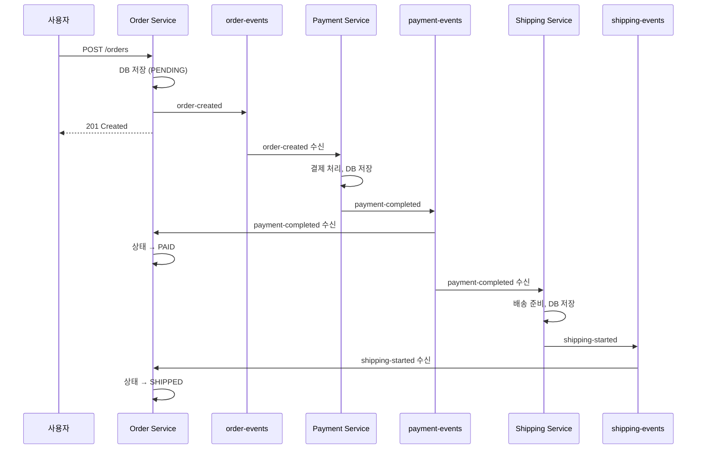
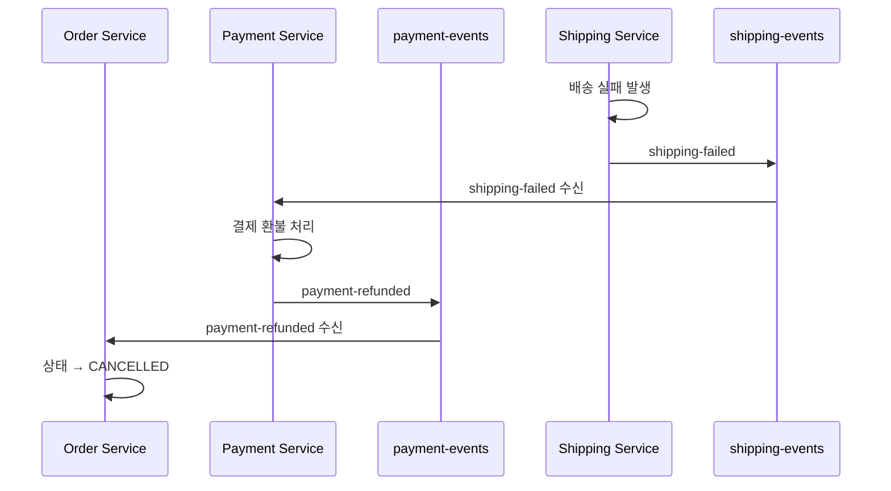
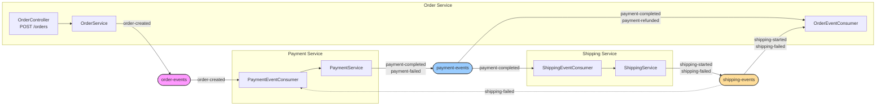

# 07. 코레오그래피 SAGA 패턴 (Choreography-based Saga)

마이크로서비스 간 분산 트랜잭션을 중앙 조정자 없이 이벤트로 협력하여 처리하는 패턴

## 실습 목표

- 주문/결제/배송 3개 서비스가 Redpanda 이벤트로 협력하는 SAGA 워크플로우
- 각 서비스가 독립적으로 이벤트를 발행하고 소비하는 탈중앙화 아키텍처
- 실패 시 보상 트랜잭션(Compensation)을 통한 데이터 일관성 유지
- 비동기 이벤트 기반 느슨한 결합

## 코레오그래피란 무엇인가?

코레오그래피는 중앙 조정자 없이 각 서비스가 이벤트에 독립적으로 반응하여 워크플로우를 완성하는 방식입니다. 마치 춤에서 안무가가 없어도 각 댄서가 음악과 다른 댄서의 동작을 보고 자신의 동작을 실행하는 것과 같습니다.

**왜 필요한가?**
분산 환경에서 여러 서비스가 협력해야 하지만 중앙 조정자를 두면 단일 장애점(Single Point of Failure)이 되고 결합도가 높아집니다. 코레오그래피는 각 서비스가 자율적으로 판단하고 행동하므로 더 유연하고 확장 가능합니다.

**핵심 특징**:
- **탈중앙화**: 누가 전체 흐름을 관리하는 주체가 없습니다.
- **느슨한 결합**: 서비스 간 직접 호출이 없고 이벤트를 통해서만 통신합니다.
- **자율성**: 각 서비스가 자신의 비즈니스 로직을 독립적으로 실행합니다.
- **이벤트 소싱**: 모든 상태 변화가 이벤트로 기록되어 추적 가능합니다.

## 왜 Saga인가? — 2PC의 한계

### 2PC (Two-Phase Commit)란?

분산 트랜잭션의 전통적 해결책은 2PC(Two-Phase Commit)입니다. Coordinator가 모든 참여자에게 Prepare → Commit/Rollback을 지시하여 원자성을 보장합니다.

```
Coordinator → Service A: PREPARE
Coordinator → Service B: PREPARE
Coordinator → Service C: PREPARE

모두 OK → Coordinator → 모든 서비스: COMMIT
하나라도 FAIL → Coordinator → 모든 서비스: ROLLBACK
```

### 왜 마이크로서비스에서 2PC가 부적합한가?

| 한계 | 설명 |
|------|------|
| **블로킹** | Prepare 후 Commit/Rollback을 기다리는 동안 참여 DB의 행이 잠기므로 처리량이 급감합니다. |
| **확장성 부족** | DB가 수십 개로 늘어나면 행 잠금의 복잡도가 폭증하고 지연이 기하급수적으로 증가합니다. |
| **서비스 자율성 위반** | 마이크로서비스는 각자 DB를 소유하는데, 2PC는 모든 DB가 하나의 트랜잭션에 참여해야 합니다. |
| **Coordinator SPoF** | Coordinator 장애 시 참여자들이 Prepare 상태에서 영원히 대기할 수 있습니다. |

### Saga: 2PC의 대안

Saga는 하나의 분산 트랜잭션을 여러 로컬 트랜잭션으로 분해합니다. 각 서비스는 자신의 DB에서 로컬 트랜잭션만 실행하고, 실패 시 이전 단계를 보상 트랜잭션(Compensation)으로 되돌립니다.

- **2PC**: 모든 서비스를 하나의 큰 트랜잭션으로 묶음 (강한 일관성, 낮은 가용성)
- **Saga**: 각 서비스가 로컬 트랜잭션 + 보상으로 최종 일관성 달성 (최종 일관성, 높은 가용성)

### 실무 대안: TCC (Try-Confirm/Cancel)

Saga 외에 실무에서 사용되는 대안이 TCC 패턴이다. Saga가 "일단 실행하고 실패하면 보상"이라면, TCC는 "먼저 예약하고 전부 성공할 때만 확정"하는 방식이다.

```
[Saga]
주문 생성(확정) → 결제 실행(확정) → 재고 차감(확정)
                                      ↑ 실패 시
                  결제 환불(보상) ← 주문 취소(보상)

[TCC]
주문 예약(Try) → 결제 예약(Try) → 재고 예약(Try)
                                      ↓ 전부 성공
주문 확정(Confirm) → 결제 확정(Confirm) → 재고 확정(Confirm)
                                      ↓ 하나라도 실패
주문 취소(Cancel) → 결제 취소(Cancel) → 재고 취소(Cancel)
```

**TCC의 핵심 차이점**: Saga에서는 결제가 즉시 실행되므로 실패 시 "환불"이라는 보상 트랜잭션이 필요하고, 고객에게 결제 → 환불 알림이 연속으로 갈 수 있다. TCC에서는 결제가 "예약" 상태이므로 전체 실패 시 예약만 취소하면 되고, 고객에게는 아무 알림도 가지 않는다.

| 기준 | Saga | TCC |
|------|------|-----|
| **실행 시점** | 각 단계를 즉시 확정 | 모든 단계를 예약 후 일괄 확정 |
| **실패 복구** | 보상 트랜잭션 (환불, 재입고 등) | 예약 취소 (부작용 없음) |
| **중간 상태 노출** | 있음 (결제됨 → 환불됨이 외부에 보임) | 없음 (예약은 외부에 비공개) |
| **구현 비용** | 각 서비스에 보상 API 1개 | 각 서비스에 Try/Confirm/Cancel API 3개 |
| **타임아웃 처리** | 보상 트랜잭션 실행 | 예약 자동 만료 (TTL) |
| **적합 케이스** | 범용 비즈니스 프로세스 | 좌석 예약, 재고 차감, 쿠폰 선점처럼 "잠금 → 확정" 시멘틱이 자연스러운 도메인 |

**왜 Saga가 더 보편적인가?** TCC는 모든 서비스가 "예약" 상태를 지원해야 한다. 결제 게이트웨이나 외부 API가 예약/확정 분리를 지원하지 않으면 TCC를 적용할 수 없다. 반면 Saga는 기존 API에 보상 로직만 추가하면 되므로 레거시 시스템과의 통합이 쉽다. 대부분의 프로젝트에서 Saga가 기본 선택이 되는 이유다.

**TCC를 고려해야 하는 순간**: "결제가 실행된 후 환불하는 것"과 "결제 예약을 취소하는 것"의 비즈니스 비용 차이가 클 때다. 항공권 예약처럼 중간 상태 노출이 고객 경험에 직접 영향을 주거나, 보상 트랜잭션 자체가 비용(환불 수수료 등)을 발생시키는 도메인에서 TCC가 가치를 갖는다.

## 정상 흐름 (Happy Path)



## 보상 트랜잭션 흐름 (Compensation)



**왜 이렇게 설계했는가?**
정상 흐름에서는 각 서비스가 앞 단계의 완료 이벤트를 받아 자신의 작업을 실행합니다. 실패 시에는 역순으로 보상 이벤트를 발행하여 이전 단계들이 자신의 작업을 되돌립니다. 이를 통해 중앙 조정자 없이도 데이터 일관성을 유지할 수 있습니다.

## 토픽 설계

| 토픽명 | 발행자 | 구독자 | 이벤트 타입 | 설명 |
|--------|--------|--------|-------------|------|
| `order-events` | Order Service | Payment Service | order-created<br>order-cancelled | 주문 생성/취소 이벤트 |
| `payment-events` | Payment Service | Order Service<br>Shipping Service | payment-completed<br>payment-refunded | 결제 완료/환불 이벤트 |
| `shipping-events` | Shipping Service | Order Service | shipping-started<br>shipping-failed | 배송 시작/실패 이벤트 |

**왜 이렇게 분리했는가?**
각 서비스가 자신의 도메인 이벤트만 발행하는 토픽을 소유합니다. 이는 책임을 명확히 하고, 구독자가 관심 있는 이벤트만 선택적으로 구독할 수 있게 합니다. 또한 각 토픽은 해당 도메인의 이벤트 로그 역할을 하므로 감사(Audit)와 디버깅이 쉽습니다.

### 토픽 흐름도



---

## 구현 — 공통 패턴

세 서비스 모두 동일한 구조를 따른다. **"로컬 DB 저장 → 이벤트 발행"**이 핵심이고, 나머지는 표준 Spring Boot boilerplate다.

```
┌─────────────────────────────────────────┐
│  @KafkaListener (이벤트 수신)             │
│    └→ @Transactional Service 메서드      │
│         ├─ 1. 엔티티 생성/상태 변경        │
│         ├─ 2. repository.save()          │
│         └─ 3. kafkaTemplate.send()       │
│              ⚠️ DB 트랜잭션 밖 (비동기)    │
└─────────────────────────────────────────┘
```

> **주의**: `kafkaTemplate.send()`는 `@Transactional` 범위 밖에서 비동기로 실행된다. DB 커밋은 성공했지만 Kafka 발행이 실패하거나 그 반대가 발생할 수 있다(Dual Write Problem). 프로덕션에서는 Transactional Outbox 패턴(08장)이 필수다.

---

## Order Service 구현

Saga의 시작점이자 상태를 추적하는 중심 서비스다.

### 주문 생성 (Command Side)

Controller는 표준 REST 엔드포인트이므로 핵심인 Service 로직만 보자.

```java
@Service
@RequiredArgsConstructor
public class OrderService {

    private final OrderRepository orderRepository;
    private final KafkaTemplate<String, OrderEvent> kafkaTemplate;

    @Transactional
    public Order createOrder(CreateOrderRequest request) {
        // 1. 엔티티 생성 + DB 저장
        Order order = Order.create(request);  // status = PENDING
        orderRepository.save(order);

        // 2. 이벤트 발행 — DB 트랜잭션과 별개로 비동기 실행
        kafkaTemplate.send("order-events", order.getOrderId(),
                OrderEvent.orderCreated(order));

        return order;
    }

    @Transactional
    public void updateOrderStatus(String orderId, OrderStatus newStatus) {
        Order order = orderRepository.findById(orderId).orElseThrow();
        order.setStatus(newStatus);
        orderRepository.save(order);
    }
}
```

핵심은 `createOrder`의 2단계 구조다. `save()` 후 `send()`를 호출하지만, `send()`는 Spring DB 트랜잭션과 무관하게 Kafka 브로커로 비동기 전송된다.

### 이벤트 소비 (Event Side)

Order Service는 payment-events와 shipping-events 두 토픽을 구독하여 주문 상태를 갱신한다.

```java
@Component
@RequiredArgsConstructor
public class OrderEventConsumer {

    private final OrderService orderService;

    @KafkaListener(topics = "payment-events", groupId = "order-service")
    public void handlePaymentEvent(PaymentEvent event) {
        switch (event.getEventType()) {
            case "payment-completed" ->
                orderService.updateOrderStatus(event.getOrderId(), OrderStatus.PAID);
            case "payment-refunded" ->
                orderService.updateOrderStatus(event.getOrderId(), OrderStatus.CANCELLED);
        }
    }

    @KafkaListener(topics = "shipping-events", groupId = "order-service")
    public void handleShippingEvent(ShippingEvent event) {
        if ("shipping-started".equals(event.getEventType())) {
            orderService.updateOrderStatus(event.getOrderId(), OrderStatus.SHIPPED);
        }
    }
}
```

**왜 이벤트 타입별로 분기하는가?**
하나의 토픽에 여러 이벤트 타입이 담길 수 있으므로 `eventType` 필드로 구분합니다. 이는 Schema Evolution을 용이하게 하고, 같은 도메인의 이벤트를 한 곳에서 관리할 수 있게 합니다.

---

## Payment Service 구현

Order Service와 동일한 "수신 → DB 저장 → 발행" 패턴을 따른다. 차이점은 **결제 성공/실패에 따라 다른 이벤트를 발행**하는 분기 로직이다.

### 이벤트 소비 (Event Side)

```java
@Component
@RequiredArgsConstructor
public class PaymentEventConsumer {

    private final PaymentService paymentService;

    @KafkaListener(topics = "order-events", groupId = "payment-service")
    public void handleOrderEvent(OrderEvent event) {
        if ("order-created".equals(event.getEventType())) {
            paymentService.processPayment(event);
        }
    }

    @KafkaListener(topics = "shipping-events", groupId = "payment-service")
    public void handleShippingEvent(ShippingEvent event) {
        if ("shipping-failed".equals(event.getEventType())) {
            paymentService.refundPayment(event.getOrderId());  // 보상 트랜잭션
        }
    }
}
```

### 결제 처리 로직

```java
@Service
@RequiredArgsConstructor
public class PaymentService {

    private final PaymentRepository paymentRepository;
    private final KafkaTemplate<String, PaymentEvent> kafkaTemplate;

    /** order-created 이벤트 수신 시 호출 */
    @Transactional
    public void processPayment(OrderEvent orderEvent) {
        Payment payment = Payment.from(orderEvent);  // status = PROCESSING
        paymentRepository.save(payment);

        boolean success = paymentGateway.charge(payment);

        if (success) {
            payment.complete();
            paymentRepository.save(payment);
            kafkaTemplate.send("payment-events", payment.getOrderId(),
                    PaymentEvent.completed(payment));
        } else {
            payment.fail("Insufficient funds");
            paymentRepository.save(payment);
            kafkaTemplate.send("payment-events", payment.getOrderId(),
                    PaymentEvent.failed(payment));
        }
    }

    /** shipping-failed 이벤트 수신 시 호출 (보상 트랜잭션) */
    @Transactional
    public void refundPayment(String orderId) {
        Payment payment = paymentRepository.findByOrderId(orderId).orElseThrow();

        if (payment.getStatus() != PaymentStatus.COMPLETED) return;

        payment.refund();
        paymentRepository.save(payment);
        kafkaTemplate.send("payment-events", orderId,
                PaymentEvent.refunded(payment));
    }
}
```

`refundPayment`이 보상 트랜잭션의 핵심이다. shipping-failed를 수신하면 결제를 환불하고 payment-refunded를 발행하여 Order Service가 주문을 취소하도록 한다.

---

## Shipping Service 구현

Payment Service와 동일한 패턴이다. payment-completed를 수신하여 배송을 처리하고, 성공/실패에 따라 이벤트를 발행한다.

### 이벤트 소비 (Event Side)

```java
@Component
@RequiredArgsConstructor
public class ShippingEventConsumer {

    private final ShippingService shippingService;

    @KafkaListener(topics = "payment-events", groupId = "shipping-service")
    public void handlePaymentEvent(PaymentEvent event) {
        if ("payment-completed".equals(event.getEventType())) {
            shippingService.processShipping(event);
        }
    }
}
```

### 배송 처리 로직

```java
@Service
@RequiredArgsConstructor
public class ShippingService {

    private final ShippingRepository shippingRepository;
    private final KafkaTemplate<String, ShippingEvent> kafkaTemplate;

    /** payment-completed 이벤트 수신 시 호출 */
    @Transactional
    public void processShipping(PaymentEvent paymentEvent) {
        Shipping shipping = Shipping.from(paymentEvent);  // status = PREPARING
        shippingRepository.save(shipping);

        boolean success = warehouseClient.prepare(shipping);

        if (success) {
            shipping.ship();
            shippingRepository.save(shipping);
            kafkaTemplate.send("shipping-events", shipping.getOrderId(),
                    ShippingEvent.started(shipping));
        } else {
            shipping.fail("Out of stock");
            shippingRepository.save(shipping);
            kafkaTemplate.send("shipping-events", shipping.getOrderId(),
                    ShippingEvent.failed(shipping));
        }
    }
}
```

세 서비스의 구조가 동일하다는 것이 코레오그래피의 특징이다. 각 서비스는 **"이벤트 수신 → 로컬 처리 → 결과 이벤트 발행"** 패턴만 반복하면 되고, 다른 서비스의 내부 구현을 알 필요가 없다.

---

## 장점과 한계

### 장점

| 장점 | 설명 | 이유 |
|------|------|------|
| **느슨한 결합** | 서비스 간 직접 의존 없음 | 이벤트를 통해서만 통신하므로 서비스 변경이 다른 서비스에 영향을 주지 않습니다. |
| **독립 배포** | 각 서비스 독립 배포 가능 | 중앙 조정자가 없으므로 각 서비스를 독립적으로 배포/스케일할 수 있습니다. |
| **장애 격리** | 한 서비스 장애가 전파 안 됨 | Payment Service가 다운되어도 Order Service는 정상 동작합니다. 이벤트는 Redpanda에 저장되어 나중에 처리됩니다. |
| **확장성** | 새 서비스 추가 용이 | 새로운 서비스가 필요하면 관심 있는 이벤트를 구독하기만 하면 됩니다. 기존 서비스 수정 불필요. |
| **이벤트 소싱** | 모든 상태 변화 기록 | 이벤트가 로그로 남아 감사(Audit), 디버깅, 이벤트 재생이 가능합니다. |

### 한계

| 한계 | 설명 | 완화 방법 |
|------|------|----------|
| **워크플로우 추적 어려움** | 전체 흐름을 한눈에 보기 어려움 | Correlation ID를 모든 이벤트에 포함하고, Distributed Tracing(Jaeger, Zipkin) 도입 |
| **순환 의존 위험** | 이벤트 체인이 복잡해지면 순환 발생 | 이벤트 다이어그램을 그려 순환 체크, 명확한 이벤트 네이밍 규칙 |
| **최종 일관성** | 즉시 일관성 보장 안 됨 | 사용자에게 "처리 중" 상태를 명확히 표시, 비즈니스 요구사항에 따라 오케스트레이션 고려 |
| **중복 처리 위험** | At-least-once 전달로 중복 가능 | Idempotent Consumer 패턴 적용 (이벤트 ID 기반 중복 제거) |
| **디버깅 복잡도** | 분산 환경에서 원인 추적 어려움 | 구조화된 로깅, Correlation ID, Observability 도구 활용 |

## Saga 베스트 프랙티스

### 1. 각 단계는 반드시 로컬 트랜잭션

각 Saga 단계는 해당 서비스의 DB에서 로컬 트랜잭션으로 완료되어야 합니다. 여러 서비스에 걸친 트랜잭션은 Saga의 존재 이유를 부정합니다.

### 2. 멱등성 키로 중복 처리 방지

At-least-once 전달 환경에서 같은 이벤트를 여러 번 받을 수 있으므로, 이벤트 헤더의 멱등성 키(eventId)로 중복 처리를 반드시 방지해야 합니다.

### 3. Outbox 패턴 필수 사용

DB 저장과 이벤트 발행의 원자성을 보장하려면 Transactional Outbox 패턴을 사용해야 합니다. 직접 Kafka에 발행하면 Dual Write Problem이 발생합니다. (상세: 08장)

### 4. 서비스 수에 따른 패턴 선택

| 서비스 수 | 권장 패턴 | 이유 |
|----------|----------|------|
| **2~3개** | Choreography | 워크플로우가 단순하므로 중앙 조정자 없이도 관리 가능 |
| **4개 이상** | Orchestration | 이벤트 체인이 복잡해지면 전체 흐름 파악이 어려워짐 |
| **10개 이상** | 아키텍처 재검토 | 하나의 Saga에 10개 이상 서비스가 참여하면 도메인 경계 재설계 필요 |

### 5. Dead Letter Queue 활용

반복적으로 실패하는 이벤트는 DLQ(Dead Letter Queue)로 격리하여 정상 이벤트 처리를 방해하지 않도록 합니다. DLQ에 쌓인 이벤트는 별도 모니터링과 수동 처리 프로세스를 마련합니다.

### 6. 장기 실행 Saga 회피

Saga가 오래 실행될수록 보상 트랜잭션의 복잡도가 증가합니다. 타임아웃을 설정하고, 일정 시간 초과 시 자동으로 보상 흐름을 시작하는 것이 안전합니다.

### 7. Correlation ID 사용

```java
@Data @Builder
public class OrderEvent {
    private String eventId;           // 이벤트 고유 ID (멱등성 키)
    private String correlationId;     // 워크플로우 추적 ID (Saga 전체에서 동일)
    private String eventType;
    private String orderId;
    private Instant timestamp;
}
```

Saga 시작 시 correlationId를 생성하고, 이후 모든 이벤트에 동일한 값을 전파한다. 분산 추적 도구에서 이 ID로 전체 워크플로우를 조회할 수 있다.

### 8. Idempotent Consumer

```java
@Transactional
public void processPayment(OrderEvent event) {
    // INSERT ... WHERE NOT EXISTS 패턴 (예외 없이 0/1 반환)
    if (processedEventRepo.tryAcquire(event.getEventId()) == 0) {
        return;  // 이미 처리된 이벤트
    }

    // 결제 처리 로직...
}
```

> check-then-act(`existsBy` → 로직 → `save`) 대신 preemptive acquire 패턴이 동시성 안전하다. 상세: [08_MessageQueue/red-panda/project 실습 Ch03](../../08_MessageQueue/red-panda/project/redpanda-spring-boot/)

### 9. 명확한 이벤트 네이밍

**규칙**: `{entity}-{past-tense-action}` 형식

| 좋은 예 | 나쁜 예 | 이유 |
|---------|---------|------|
| order-created | order | 상태 불명확 |
| payment-completed | process | 동작 불명확 |
| shipping-failed | event | 너무 일반적 |

## 실습 체크리스트

### 환경 구성
- [ ] Docker Compose로 Redpanda + 3개 서비스 실행
- [ ] Redpanda Console에서 토픽 확인
- [ ] 각 서비스 DB 연결 확인

### 코드 구현
- [ ] Order Service: POST /orders API 구현
- [ ] Order Service: payment-events, shipping-events 소비
- [ ] Payment Service: order-created 소비 및 결제 처리
- [ ] Payment Service: shipping-failed 소비 및 환불 처리
- [ ] Shipping Service: payment-completed 소비 및 배송 처리

### 정상 흐름 테스트
- [ ] 주문 생성 → 결제 완료 → 배송 시작 확인
- [ ] 각 단계별 이벤트 발행 확인 (rpk topic consume)
- [ ] 주문 상태가 PENDING → PAID → SHIPPED로 변경 확인

### 보상 흐름 테스트
- [ ] 배송 실패 강제 시뮬레이션
- [ ] shipping-failed → payment-refunded → order-cancelled 확인
- [ ] DB에서 각 엔티티 상태 확인

### 고급 기능
- [ ] Correlation ID 추가하여 워크플로우 추적
- [ ] Idempotent Consumer 구현하여 중복 처리 방지
- [ ] Dead Letter Topic 설정하여 실패 메시지 처리

## 다음 단계

- **07장**: 오케스트레이션 SAGA 패턴 - 중앙 조정자가 워크플로우를 관리하는 방식 학습
- **08장**: Transactional Outbox + CDC - DB 트랜잭션과 이벤트 발행의 원자성 보장
- **09장**: 이벤트 기반 + 요청-응답 통합 - REST API와 이벤트 시스템의 브릿지 패턴

## 참고 자료

- **Building Event-Driven Microservices** by Adam Bellemare (O'Reilly)
- **Microservices Patterns** by Chris Richardson (Manning)
- Redpanda 공식 문서: https://docs.redpanda.com
- Kafka Streams SAGA 패턴: https://www.confluent.io/blog/saga-orchestration-microservices/
