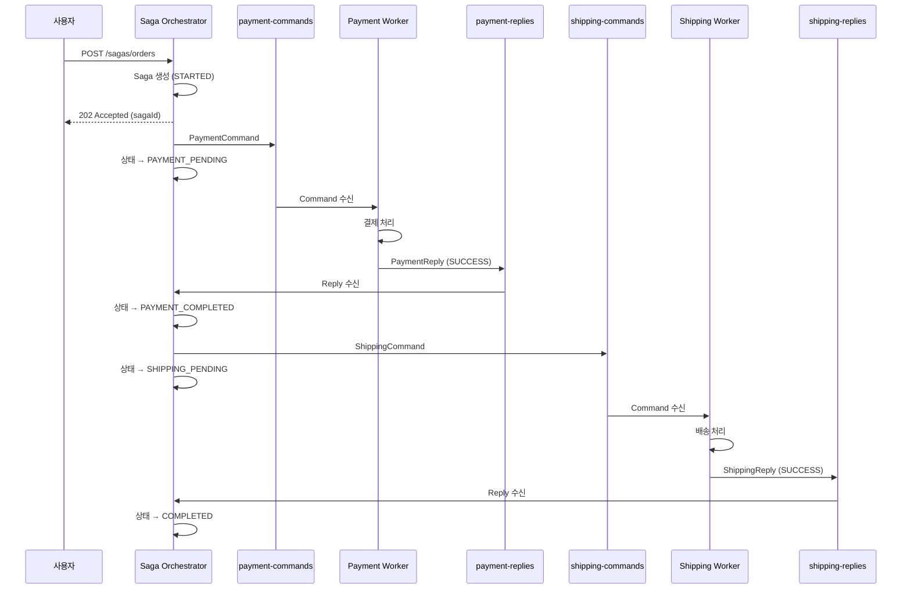
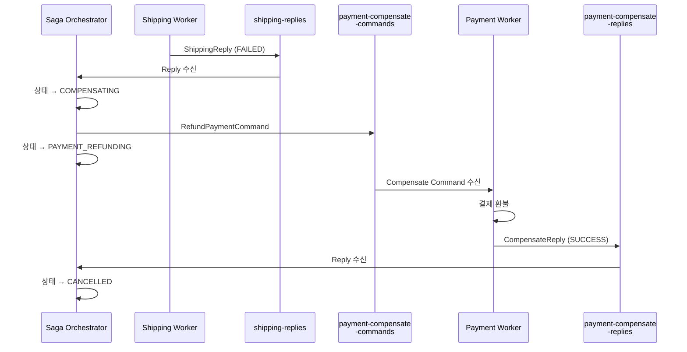
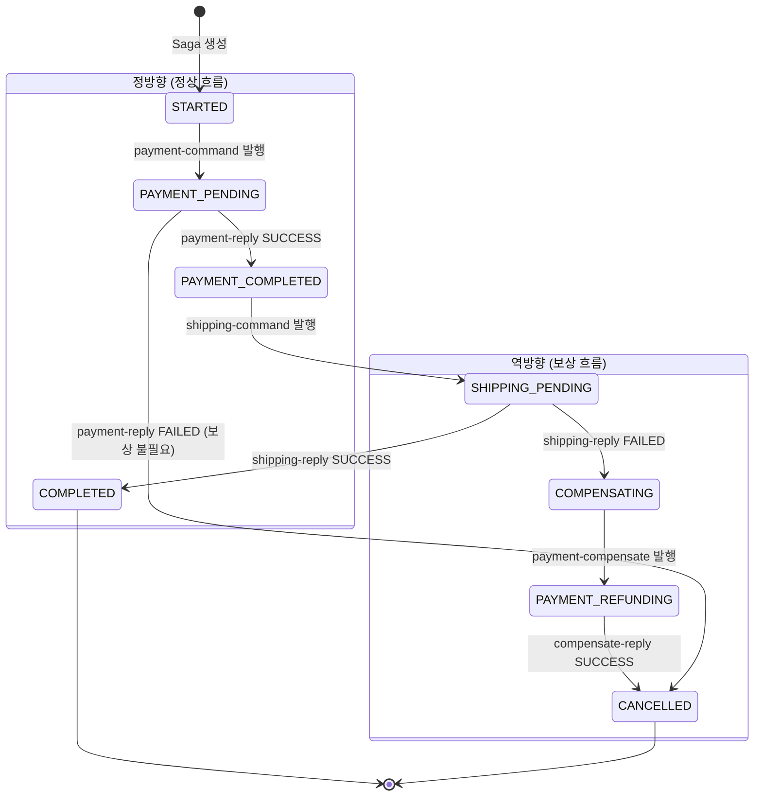
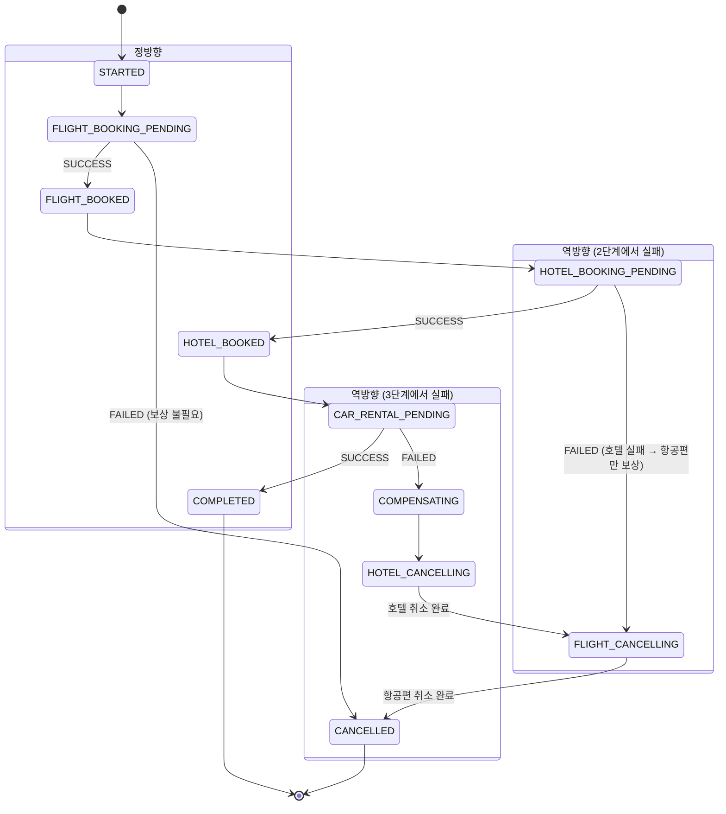
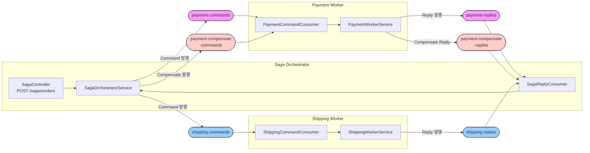

# 08. 오케스트레이션 SAGA 패턴 (Orchestration-based Saga)

중앙 Orchestrator가 워커 서비스들을 조율하여 분산 트랜잭션을 관리하는 패턴

## 실습 목표

- 중앙 Saga Orchestrator가 워크플로우 전체를 관리하는 아키텍처
- 상태 머신 기반 워크플로우 진행 및 보상 처리
- Command-Reply 패턴으로 워커 서비스와 통신
- 명확한 워크플로우 가시성과 모니터링

## 오케스트레이션이란 무엇인가?

오케스트레이션은 중앙 조정자(Orchestrator)가 워크플로우의 각 단계를 명시적으로 제어하는 방식입니다. 마치 오케스트라 지휘자가 각 악기의 연주 시점을 조율하는 것처럼, Orchestrator가 각 서비스에게 작업을 지시하고 결과를 수집합니다.

**왜 필요한가?**
코레오그래피 방식은 느슨한 결합을 제공하지만, 워크플로우가 복잡해지면 전체 흐름을 파악하기 어렵고 디버깅이 힘듭니다. 오케스트레이션은 워크플로우 로직을 한 곳에 모아 관리하므로 명확한 가시성을 제공합니다.

**핵심 특징**:
- **중앙 집중**: 워크플로우 로직이 Orchestrator에 집중됩니다.
- **명시적 제어**: 각 단계의 실행 순서와 조건이 명확합니다.
- **상태 관리**: Orchestrator가 전체 워크플로우 상태를 추적합니다.
- **모니터링 용이**: 한 곳에서 모든 워크플로우를 관찰할 수 있습니다.

## 코레오그래피와의 차이

| 측면 | 코레오그래피 | 오케스트레이션 |
|------|-------------|---------------|
| **제어 방식** | 각 서비스가 자율적으로 반응 | Orchestrator가 명시적으로 지시 |
| **워크플로우 위치** | 여러 서비스에 분산 | Orchestrator에 집중 |
| **통신 패턴** | Event (Pub/Sub) | Command-Reply (Request/Response) |
| **결합도** | 매우 낮음 | 중간 (Orchestrator와 결합) |
| **가시성** | 낮음 (이벤트 추적 필요) | 높음 (Orchestrator가 모든 상태 관리) |
| **디버깅** | 어려움 (분산됨) | 쉬움 (중앙 집중) |
| **확장성** | 서비스 추가 시 이벤트만 구독 | 서비스 추가 시 Orchestrator 수정 필요 |
| **단일 장애점** | 없음 | Orchestrator가 SPoF |

**언제 어떤 것을 선택할까?**
- **코레오그래피**: 서비스가 3개 이하이고, 워크플로우가 단순하며, 느슨한 결합이 최우선일 때
- **오케스트레이션**: 서비스가 5개 이상이거나, 복잡한 분기/반복이 있거나, 명확한 비즈니스 프로세스 관리가 필요할 때
- **하이브리드**: 도메인 내부는 오케스트레이션, 도메인 간은 코레오그래피

## 아키텍처

### 정상 흐름



### 보상 흐름



**핵심 메커니즘**:
Command 토픽과 Reply 토픽을 분리하여 요청과 응답을 명확히 구분합니다. Orchestrator는 Command를 발행하고 Reply를 수신하며, 워커 서비스는 반대로 동작합니다.

## 상태 머신 설계

### 왜 상태 머신을 사용하는가

Orchestrator의 핵심 역할은 "지금 이 Saga가 어디까지 진행되었는가"를 추적하는 것이다. if-else 분기로도 구현할 수 있지만, 워크플로우가 복잡해지면 어떤 상태에서 어떤 전이가 허용되는지 코드만으로 파악하기 어렵다. 상태 머신은 **허용된 전이만 명시적으로 정의**하여 이 문제를 해결한다. 정의되지 않은 전이는 아예 발생할 수 없으므로 예상치 못한 상태 변경이 원천 차단된다.

### 상태 정의

상태는 크게 세 그룹으로 나뉜다. 정방향(정상 흐름), 역방향(보상 흐름), 종료 상태다.

```java
public enum SagaState {
    // ── 정방향: 정상 흐름 ──
    STARTED,              // Saga 생성됨, 아직 아무 Command도 발행하지 않은 초기 상태
    PAYMENT_PENDING,      // 결제 Command 발행함, Worker의 Reply를 기다리는 중
    PAYMENT_COMPLETED,    // 결제 성공 Reply 수신, 다음 단계(배송) 진행 가능
    SHIPPING_PENDING,     // 배송 Command 발행함, Worker의 Reply를 기다리는 중

    // ── 역방향: 보상 흐름 ──
    COMPENSATING,         // 배송 실패 → 이전 단계의 보상이 필요한 상태
    PAYMENT_REFUNDING,    // 결제 환불 Command 발행함, 환불 Reply를 기다리는 중

    // ── 종료 상태 ──
    COMPLETED,            // 모든 단계 성공 (최종 성공)
    CANCELLED             // 실패 또는 보상 완료 (최종 실패)
}
```

`_PENDING` 접미사는 "Command를 발행했고 Reply를 기다리는 중"이라는 의미다. 이 상태에서 Orchestrator가 크래시되면 재시작 후 해당 Reply를 다시 기다리거나, 타임아웃 후 보상을 시작할 수 있다.

### 상태 전이 다이어그램



전이 규칙을 표로 정리하면 다음과 같다.

| 현재 상태 | 트리거 | 다음 상태 | Orchestrator 행동 |
|----------|--------|----------|-------------------|
| STARTED | Saga 생성 | PAYMENT_PENDING | payment-command 발행 |
| PAYMENT_PENDING | Reply SUCCESS | PAYMENT_COMPLETED | 상태 저장만 (중간 단계) |
| PAYMENT_PENDING | Reply FAILED | CANCELLED | 종료 (결제가 안 됐으므로 보상 불필요) |
| PAYMENT_COMPLETED | 자동 전이 | SHIPPING_PENDING | shipping-command 발행 |
| SHIPPING_PENDING | Reply SUCCESS | COMPLETED | 종료 (전체 성공) |
| SHIPPING_PENDING | Reply FAILED | COMPENSATING | 보상 흐름 진입 |
| COMPENSATING | 자동 전이 | PAYMENT_REFUNDING | payment-compensate 발행 |
| PAYMENT_REFUNDING | Reply SUCCESS | CANCELLED | 종료 (보상 완료) |

PAYMENT_PENDING에서 실패하면 바로 CANCELLED가 되는 이유는 아직 결제가 처리되지 않았으므로 되돌릴 것이 없기 때문이다. 반면 SHIPPING_PENDING에서 실패하면 이미 완료된 결제를 환불해야 하므로 COMPENSATING으로 진입한다. 보상이 필요한지 여부는 "이전 단계에서 부수효과가 발생했는가"로 판단한다.

### Saga 테이블 설계: 하나의 테이블에 상태를 바꿔쓴다

Saga 상태 추적은 **단일 테이블**에서 `state` 필드를 UPDATE하는 방식이다. 도메인별로 별도의 Saga 테이블을 만들지 않는다.

```
sagas 테이블 (1개)
┌──────────┬──────────┬────────────────────┬────────────┬─────────────┐
│ saga_id  │ order_id │ state              │ payment_id │ shipping_id │
├──────────┼──────────┼────────────────────┼────────────┼─────────────┤
│ abc-123  │ ord-456  │ SHIPPING_PENDING   │ pay-789    │ null        │
│ def-456  │ ord-789  │ COMPLETED          │ pay-012    │ ship-345    │
│ ghi-789  │ ord-012  │ PAYMENT_REFUNDING  │ pay-678    │ null        │
└──────────┴──────────┴────────────────────┴────────────┴─────────────┘
```

`transition()` 메서드가 동일 row의 `state`를 덮어쓴다:

```java
private void transition(Saga saga, SagaState state, String error) {
    saga.setState(state);       // STARTED → PAYMENT_PENDING → ... → COMPLETED
    saga.setErrorMessage(error);
    sagaRepository.save(saga);  // 같은 row UPDATE
}
```

**왜 도메인별 테이블이 아닌가?**

Orchestrator가 관리하는 것은 "워크플로우 흐름"이지 "도메인 데이터"가 아니다. 결제 금액이나 배송 주소 같은 비즈니스 데이터는 각 Worker의 도메인 테이블(`payments`, `shippings`)에 저장된다. Saga 테이블은 `paymentId`, `shippingId`를 참조값으로만 들고 있을 뿐이다.

```
역할 분리:
  sagas 테이블      → "이 주문이 지금 어느 단계인가?" (흐름 추적)
  payments 테이블   → "결제 금액, 카드번호, 처리일시" (Payment Worker 소유)
  shippings 테이블  → "배송지, 택배사, 운송장번호" (Shipping Worker 소유)
```

도메인별로 Saga 테이블을 분리하면 `payment_sagas` + `shipping_sagas`처럼 워크플로우가 분산되어 한눈에 파악할 수 없다. 이는 오케스트레이션을 선택한 이유("워크플로우를 한 곳에서 관리")를 무너뜨린다.

단일 테이블이기에 운영 쿼리도 간단해진다:

```sql
-- 보상 중인 Saga 조회
SELECT * FROM sagas WHERE state = 'COMPENSATING';

-- 미완료 Saga 전체 조회 (재시작 복구용)
SELECT * FROM sagas WHERE state NOT IN ('COMPLETED', 'CANCELLED');

-- 특정 주문의 현재 상태
SELECT state FROM sagas WHERE order_id = 'ord-456';
```

**Saga 타입이 여러 종류라면?**

주문 Saga, 환불 Saga, 회원가입 Saga 등 여러 워크플로우가 있을 때는 두 가지 접근이 있다.

| 접근 | 구조 | 적합 상황 |
|------|------|----------|
| 타입 컬럼 추가 | `sagas` 테이블에 `saga_type` 컬럼 | 상태 enum이 겹치거나 공통 필드가 많을 때 |
| 테이블 분리 | `order_sagas`, `refund_sagas` | 상태와 필드가 완전히 다를 때 |

일반적으로는 **Saga 타입별로 테이블을 분리**하는 것이 명확하다. 주문 Saga의 상태 머신(PAYMENT_PENDING → SHIPPING_PENDING)과 환불 Saga의 상태 머신(REFUND_PENDING → NOTIFICATION_PENDING)은 전이 규칙이 완전히 다르기 때문이다. 같은 테이블에 넣으면 `state` 컬럼의 값이 혼재되어 쿼리와 인덱스가 복잡해진다.

핵심 원칙을 정리하면: **하나의 워크플로우 = 하나의 Saga 테이블, 하나의 state 필드**다. 도메인(Payment/Shipping)별이 아니라 워크플로우 타입(주문/환불)별로 테이블을 나눈다.

### SagaState는 도메인 종속적이다

위 예시의 `SagaState`에는 `PAYMENT_PENDING`, `SHIPPING_PENDING`처럼 이커머스에 특화된 상태가 들어있다. 이것은 의도된 설계다. Saga 상태 머신은 **범용이 아니라 워크플로우별로 새로 정의하는 것이 정상**이다.

다른 도메인의 Saga를 만들어야 한다면, 해당 도메인의 단계를 반영한 새로운 enum을 정의한다.

```java
// ── 이커머스: 주문 Saga ──
public enum OrderSagaState {
    STARTED,
    PAYMENT_PENDING,        // 결제 요청 중
    PAYMENT_COMPLETED,      // 결제 완료
    SHIPPING_PENDING,       // 배송 요청 중
    COMPLETED,
    COMPENSATING,
    PAYMENT_REFUNDING,
    CANCELLED
}

// ── 여행: 예약 Saga ──
public enum TripSagaState {
    STARTED,
    FLIGHT_BOOKING_PENDING,    // 항공편 예약 중
    FLIGHT_BOOKED,             // 항공편 예약 완료
    HOTEL_BOOKING_PENDING,     // 호텔 예약 중
    HOTEL_BOOKED,              // 호텔 예약 완료
    CAR_RENTAL_PENDING,        // 렌터카 예약 중
    COMPLETED,
    COMPENSATING,
    HOTEL_CANCELLING,          // 호텔 취소 중
    FLIGHT_CANCELLING,         // 항공편 취소 중
    CANCELLED
}

// ── 채용: 온보딩 Saga ──
public enum OnboardingSagaState {
    STARTED,
    BACKGROUND_CHECK_PENDING,  // 신원 조회 중
    BACKGROUND_CHECK_PASSED,   // 신원 조회 통과
    ACCOUNT_CREATION_PENDING,  // 계정 생성 중
    ACCOUNT_CREATED,           // 계정 생성 완료
    EQUIPMENT_ORDER_PENDING,   // 장비 주문 중
    COMPLETED,
    COMPENSATING,
    ACCOUNT_DEACTIVATING,      // 계정 비활성화 중
    CANCELLED
}
```

패턴은 동일하다. `_PENDING`은 "Command 발행 후 Reply 대기", `_COMPLETED`/`_BOOKED`/`_PASSED`는 "성공 Reply 수신", `_CANCELLING`/`_REFUNDING`은 "보상 Command 발행 후 대기"를 의미한다. 달라지는 것은 **단계의 이름과 순서**뿐이다.

여행 Saga의 상태 전이를 보면 구조가 동일함을 알 수 있다:



보상의 핵심 규칙: **실패한 단계 이전의 완료된 단계들을 역순으로 취소**한다. 3단계(렌터카)에서 실패하면 2단계(호텔) → 1단계(항공편) 순으로 보상한다. 2단계에서 실패하면 1단계만 보상한다. 1단계에서 실패하면 보상할 것이 없다.

### 범용 Saga 프레임워크를 직접 만들지 않는 이유

"모든 도메인에 대응하는 범용 SagaState를 만들면 안 되나?"라는 생각이 들 수 있다.

```java
// ❌ 범용 상태 — 비즈니스 의미가 사라진다
public enum GenericSagaState {
    STARTED,
    STEP_1_PENDING, STEP_1_COMPLETED,
    STEP_2_PENDING, STEP_2_COMPLETED,
    STEP_3_PENDING, STEP_3_COMPLETED,
    COMPENSATING,
    STEP_2_COMPENSATING, STEP_1_COMPENSATING,
    COMPLETED, CANCELLED
}
```

이 방식의 문제점:

1. **로그/모니터링이 무의미해진다.** `state=STEP_2_PENDING`만 보고는 결제 중인지 배송 중인지 알 수 없다. `state=HOTEL_BOOKING_PENDING`이면 즉시 이해된다.
2. **단계 수가 고정된다.** 3단계 Saga와 5단계 Saga를 하나의 enum으로 표현할 수 없다.
3. **도메인별 분기가 복잡해진다.** 결제 실패 시 바로 CANCELLED이지만 배송 실패 시 COMPENSATING인 이유는 도메인 규칙이다. 범용 enum에서는 이런 분기를 표현하기 어렵다.

범용 워크플로우 관리가 필요하다면 Temporal, Camunda, Netflix Conductor 같은 전용 워크플로우 엔진을 사용하는 것이 맞다. 이 엔진들은 상태를 enum이 아닌 **워크플로우 정의(DSL/BPMN)**로 관리하며, 단계 추가/제거를 코드 변경 없이 할 수 있다. 직접 enum으로 만드는 Saga는 워크플로우가 3~5단계이고 자주 변경되지 않을 때 적합하다.

| 접근 | 적합 상황 | 예시 |
|------|----------|------|
| 도메인별 enum | 단계 3~5개, 변경 빈도 낮음 | 주문 처리, 회원가입 |
| 워크플로우 엔진 | 단계 10개+, 분기/반복 복잡, 자주 변경 | 보험 심사, 대출 승인, 복잡한 공급망 |

## 상태 다이어그램에서 메시지 설계하기

위 상태 전이를 정의했으면, 다음 단계는 각 전이에 필요한 메시지를 도출하는 것이다.

### 메시지 타입 분류

Orchestration SAGA에서 메시지는 4가지로 분류된다:

| 타입 | 정의 | 방향 | 네이밍 | 트리거 |
|------|------|------|--------|--------|
| **Command** | 상태 전이를 유발하는 **의도** | Orchestrator → Service | 명령형 (`Reserve~`, `Process~`, `Cancel~`) | 상태 다이어그램의 **화살표 시작** |
| **Success Event** | 상태 전이 **완료 사실** | Service → Orchestrator | 과거분사 (`~Reserved`, `~Completed`) | 상태 다이어그램의 **화살표 도착** |
| **Failure Event** | 상태 전이 **실패 사실** | Service → Orchestrator | `~Failed` 접미사 | 분기(alt) 경로 진입 |
| **Compensation Event** | **보상 완료** 사실 | Service → Orchestrator | 과거분사 (`~Released`, `~Refunded`) | 보상 화살표 도착 |

**왜 4가지로 분류하는가?** Orchestrator의 각 이벤트 핸들러가 정확히 하나의 메시지 타입에 대응하기 때문이다. 이 분류를 명시하면 "이 리스너가 어떤 종류의 메시지를 처리하는가?"가 코드에서 즉시 드러난다.

### 도출 규칙

상태 다이어그램의 각 요소에서 메시지를 도출하는 규칙:

1. **상태 노드** = `SagaState` enum 값 (`STARTED`, `PAYMENT_PENDING`, ...)
2. **정방향 화살표** = Command 발행 + Success/Failure Event 수신 (한 쌍)
3. **보상 화살표** = Compensation Command 발행 + Compensation Event 수신
4. **분기 조건** = Success Event → 다음 상태 / Failure Event → 보상 또는 실패 상태

**예시 — 위 상태 전이에 적용:**

| 전이 | Command | Success Event | Failure Event |
|------|---------|---------------|---------------|
| STARTED → PAYMENT_PENDING | `ProcessPaymentCommand` | `PaymentCompleted` | `PaymentFailed` |
| PAYMENT_COMPLETED → SHIPPING_PENDING | `RequestShippingCommand` | `ShippingRequested` | `ShippingFailed` |
| COMPENSATING → PAYMENT_REFUNDING | `RefundPaymentCommand` | `PaymentRefunded` | — |

### Choreography와의 메시지 차이

| 패턴 | Command | Event | 핵심 차이 |
|------|---------|-------|----------|
| Choreography | **없음** | 서비스 → 다음 서비스 | 중앙 조정자가 없으므로 "지시"할 주체 없음 |
| Orchestration | **있음** | Service → Orchestrator | 중앙 조정자가 명시적으로 지시 |

Choreography에서 Command가 없는 이유: 각 서비스가 이전 서비스의 Event를 듣고 **스스로** 다음 행동을 결정하기 때문이다. "결제 완료" 이벤트를 들은 배송 서비스가 자발적으로 배송을 시작한다.

> 토픽 설계 관점의 Command/Event 비교(시제, 거부 가능성, 프로듀서/컨슈머 수)는 [11-topic-design.md §7](../../08_MessageQueue/red-panda/learning/02-fundamentals/11-topic-design.md#7-토픽-유형-심화-entity--event--command) 참조

## 토픽 설계

| 토픽명 | 메시지 타입 | 발행자 | 구독자 | 설명 |
|--------|------------|--------|--------|------|
| `payment-commands` | PaymentCommand | Orchestrator | Payment Worker | 결제 요청 커맨드 |
| `payment-replies` | PaymentReply | Payment Worker | Orchestrator | 결제 처리 결과 |
| `payment-compensate-commands` | PaymentCompensateCommand | Orchestrator | Payment Worker | 결제 환불 커맨드 |
| `payment-compensate-replies` | PaymentCompensateReply | Payment Worker | Orchestrator | 환불 처리 결과 |
| `shipping-commands` | ShippingCommand | Orchestrator | Shipping Worker | 배송 요청 커맨드 |
| `shipping-replies` | ShippingReply | Shipping Worker | Orchestrator | 배송 처리 결과 |

**왜 토픽을 이렇게 많이 나누는가?**
각 워커별, 방향별(Command/Reply), 작업별(정상/보상)로 토픽을 분리하면 메시지 타입이 명확해지고, 각 토픽의 파티션/리텐션을 독립적으로 설정 가능하며, 모니터링 시 병목 파악이 쉽습니다.

### 토픽 흐름도



---

## Saga Log의 역할

Orchestrator는 각 Saga 단계를 **Saga Log**에 기록하여 장애 복구와 감사를 지원합니다.

### Saga Log 구조

```
[2026-02-06T12:00:00] sagaId=abc-123 | START_SAGA        | orderId=order-456
[2026-02-06T12:00:01] sagaId=abc-123 | START_PAYMENT      | commandId=cmd-001
[2026-02-06T12:00:03] sagaId=abc-123 | END_PAYMENT        | paymentId=pay-789, status=SUCCESS
[2026-02-06T12:00:04] sagaId=abc-123 | START_SHIPPING     | commandId=cmd-002
[2026-02-06T12:00:06] sagaId=abc-123 | END_SHIPPING       | shippingId=ship-321, status=SUCCESS
[2026-02-06T12:00:06] sagaId=abc-123 | COMPLETE_SAGA      |
```

### 장애 복구 메커니즘

Orchestrator가 크래시 후 재시작되면 Saga Log에서 마지막 성공 단계를 조회하고, 해당 단계부터 워크플로우를 재개합니다.

```java
// 재시작 시 미완료 Saga 복구
List<Saga> incomplete = sagaRepository
    .findByStateNotIn(List.of(SagaState.COMPLETED, SagaState.CANCELLED));

for (Saga saga : incomplete) {
    resumeFromLastState(saga);
}
```

### Choreography에서도 Saga Log 활용

Saga Log는 Orchestration 전용이 아닙니다. Choreography에서도 각 서비스가 자신의 Saga Log를 유지하면 디버깅과 장애 추적이 크게 개선됩니다. 이는 Choreography의 약점(워크플로우 추적 어려움)을 보완하는 하이브리드 접근입니다.

- **Orchestration**: Orchestrator가 중앙 Saga Log를 관리
- **Choreography + Saga Log**: 각 서비스가 로컬 Saga Log를 유지 → Correlation ID로 연결하여 전체 흐름 재구성

---

## 구현 — 공통 패턴

Orchestrator와 Worker는 역할이 다르지만 통신 구조는 동일하다.

```
┌──────────────────────────────────────────────────┐
│  Orchestrator                                     │
│    ├─ @KafkaListener (Reply 수신)                  │
│    │    └→ handleReply() — 상태 전이 + 다음 Command │
│    └─ kafkaTemplate.send() (Command 발행)          │
├──────────────────────────────────────────────────┤
│  Worker                                           │
│    ├─ @KafkaListener (Command 수신)                │
│    │    └→ processCommand() — 비즈니스 로직 실행     │
│    └─ kafkaTemplate.send() (Reply 발행)            │
└──────────────────────────────────────────────────┘
```

> **Dual Write 주의**: 07장과 동일하게 `kafkaTemplate.send()`는 `@Transactional` 밖에서 비동기 실행된다. 프로덕션에서는 Transactional Outbox 패턴(09장)이 필수다.

---

## Saga Orchestrator 구현

### Saga 엔티티

```java
@Entity @Table(name = "sagas")
@Data @Builder @NoArgsConstructor @AllArgsConstructor
public class Saga {

    @Id
    private String sagaId;
    private String orderId;
    private String userId;
    private String productId;
    private Integer quantity;
    private BigDecimal totalAmount;

    @Enumerated(EnumType.STRING)
    private SagaState state;

    private String paymentId;
    private String shippingId;
    private String errorMessage;

    @CreatedDate  private Instant createdAt;
    @LastModifiedDate private Instant updatedAt;
    @Version private Long version;  // 낙관적 락
}
```

**왜 @Version을 사용하는가?**
동시에 여러 Reply가 들어올 때 상태가 꼬이지 않도록 낙관적 락(Optimistic Locking)을 사용합니다. 동시 수정 시 먼저 커밋된 트랜잭션만 성공하고 나머지는 재시도됩니다.

### Orchestrator Service

핵심은 **상태 전이 + Command 발행** 쌍이다. 상태를 먼저 DB에 저장한 후 Command를 발행하여, 크래시 시 마지막 상태에서 재개할 수 있도록 한다.

```java
@Service
@RequiredArgsConstructor
public class SagaOrchestratorService {

    private final SagaRepository sagaRepository;
    private final KafkaTemplate<String, Object> commandTemplate;

    // ── Saga 시작 ──

    @Transactional
    public Saga startSaga(CreateOrderRequest request) {
        Saga saga = Saga.create(request);  // state = STARTED
        sagaRepository.save(saga);
        sendCommand(saga, SagaState.PAYMENT_PENDING,
                "payment-commands", PaymentCommand.from(saga));
        return saga;
    }

    // ── Reply 핸들러 (상태 머신의 전이) ──

    @Transactional
    public void handlePaymentReply(PaymentReply reply) {
        Saga saga = findSaga(reply.getSagaId());

        if (reply.isSuccess()) {
            saga.setPaymentId(reply.getPaymentId());
            sendCommand(saga, SagaState.SHIPPING_PENDING,
                    "shipping-commands", ShippingCommand.from(saga));
        } else {
            transition(saga, SagaState.CANCELLED, reply.getErrorMessage());
        }
    }

    @Transactional
    public void handleShippingReply(ShippingReply reply) {
        Saga saga = findSaga(reply.getSagaId());

        if (reply.isSuccess()) {
            saga.setShippingId(reply.getShippingId());
            transition(saga, SagaState.COMPLETED, null);
        } else {
            // 보상 흐름 시작
            sendCommand(saga, SagaState.PAYMENT_REFUNDING,
                    "payment-compensate-commands",
                    RefundPaymentCommand.from(saga));
        }
    }

    @Transactional
    public void handleCompensateReply(PaymentCompensateReply reply) {
        transition(findSaga(reply.getSagaId()), SagaState.CANCELLED, null);
    }

    // ── 공통 헬퍼 ──

    private void sendCommand(Saga saga, SagaState nextState,
                             String topic, Object command) {
        transition(saga, nextState, null);
        commandTemplate.send(topic, saga.getSagaId(), command);
    }

    private void transition(Saga saga, SagaState state, String error) {
        saga.setState(state);
        saga.setErrorMessage(error);
        sagaRepository.save(saga);
    }

    private Saga findSaga(String sagaId) {
        return sagaRepository.findById(sagaId)
                .orElseThrow(() -> new SagaNotFoundException(sagaId));
    }
}
```

**왜 `sendCommand`에서 상태를 먼저 저장하는가?**
Command 발행 전에 상태를 DB에 기록해야 Orchestrator가 재시작되어도 마지막 상태에서 재개 가능하다. 이는 Effectively-once 처리의 필수 조건이다(워커의 멱등성도 필요).

### Reply 리스너

Orchestrator는 3개 reply 토픽을 구독하여 Service의 handleReply 메서드를 호출한다.

```java
@Component
@RequiredArgsConstructor
public class SagaReplyConsumer {

    private final SagaOrchestratorService orchestrator;

    @KafkaListener(topics = "payment-replies", groupId = "saga-orchestrator")
    public void onPaymentReply(PaymentReply reply) {
        orchestrator.handlePaymentReply(reply);
    }

    @KafkaListener(topics = "shipping-replies", groupId = "saga-orchestrator")
    public void onShippingReply(ShippingReply reply) {
        orchestrator.handleShippingReply(reply);
    }

    @KafkaListener(topics = "payment-compensate-replies",
                   groupId = "saga-orchestrator")
    public void onCompensateReply(PaymentCompensateReply reply) {
        orchestrator.handleCompensateReply(reply);
    }
}
```

---

## Payment Worker 구현

Worker는 단순하다. Command를 수신하고, 비즈니스 로직을 실행하고, Reply를 발행한다.

### Command 리스너

```java
@Component
@RequiredArgsConstructor
public class PaymentCommandConsumer {

    private final PaymentWorkerService workerService;

    @KafkaListener(topics = "payment-commands", groupId = "payment-worker")
    public void onPaymentCommand(PaymentCommand command) {
        workerService.processPayment(command);
    }

    @KafkaListener(topics = "payment-compensate-commands",
                   groupId = "payment-worker")
    public void onCompensateCommand(PaymentCompensateCommand command) {
        workerService.processRefund(command);
    }
}
```

### 결제 처리 로직

```java
@Service
@RequiredArgsConstructor
public class PaymentWorkerService {

    private final PaymentRepository paymentRepository;
    private final KafkaTemplate<String, Object> replyTemplate;

    @Transactional
    public void processPayment(PaymentCommand command) {
        Payment payment = Payment.from(command);  // status = PROCESSING
        paymentRepository.save(payment);

        boolean success = paymentGateway.charge(payment);

        if (success) {
            payment.complete();
            paymentRepository.save(payment);
            replyTemplate.send("payment-replies", command.getSagaId(),
                    PaymentReply.success(command, payment));
        } else {
            payment.fail("Insufficient funds");
            paymentRepository.save(payment);
            replyTemplate.send("payment-replies", command.getSagaId(),
                    PaymentReply.failure(command, "Insufficient funds"));
        }
    }

    @Transactional
    public void processRefund(PaymentCompensateCommand command) {
        Payment payment = paymentRepository.findById(command.getPaymentId())
                .orElseThrow();

        if (payment.getStatus() != PaymentStatus.COMPLETED) return;

        payment.refund();
        paymentRepository.save(payment);
        replyTemplate.send("payment-compensate-replies", command.getSagaId(),
                PaymentCompensateReply.success(command, payment));
    }
}
```

---

## Shipping Worker 구현

Payment Worker와 동일한 패턴이다. shipping-commands를 수신하여 배송을 처리하고 Reply를 발행한다.

### Command 리스너

```java
@Component
@RequiredArgsConstructor
public class ShippingCommandConsumer {

    private final ShippingWorkerService workerService;

    @KafkaListener(topics = "shipping-commands", groupId = "shipping-worker")
    public void onShippingCommand(ShippingCommand command) {
        workerService.processShipping(command);
    }
}
```

### 배송 처리 로직

```java
@Service
@RequiredArgsConstructor
public class ShippingWorkerService {

    private final ShippingRepository shippingRepository;
    private final KafkaTemplate<String, Object> replyTemplate;

    @Transactional
    public void processShipping(ShippingCommand command) {
        Shipping shipping = Shipping.from(command);  // status = PREPARING
        shippingRepository.save(shipping);

        boolean success = warehouseClient.prepare(shipping);

        if (success) {
            shipping.ship();
            shippingRepository.save(shipping);
            replyTemplate.send("shipping-replies", command.getSagaId(),
                    ShippingReply.success(command, shipping));
        } else {
            shipping.fail("Out of stock");
            shippingRepository.save(shipping);
            replyTemplate.send("shipping-replies", command.getSagaId(),
                    ShippingReply.failure(command, "Out of stock"));
        }
    }
}
```

세 컴포넌트(Orchestrator, Payment Worker, Shipping Worker) 모두 동일한 구조를 따른다. **리스너 → 서비스 로직 → Reply/Command 발행**. Orchestrator만 상태 머신 전이가 추가될 뿐이다.

---

## 장점과 한계

### 장점

| 장점 | 설명 |
|------|------|
| **워크플로우 가시성** | Orchestrator의 상태 머신만 보면 워크플로우를 완전히 이해할 수 있습니다. |
| **쉬운 모니터링** | 현재 진행 중인 Saga, 실패한 Saga를 SQL로 쉽게 찾을 수 있습니다. |
| **명시적 제어** | 복잡한 분기나 반복 로직도 코드로 명확히 표현 가능합니다. |
| **디버깅 용이** | Orchestrator 로그만 확인하면 됩니다. |
| **재시도 관리** | 일관된 재시도 정책을 적용할 수 있습니다. |

### 한계

| 한계 | 완화 방법 |
|------|----------|
| **단일 장애점** | Active-Standby 구성, Kubernetes 자동 재시작 |
| **결합도 증가** | 워커는 Command만 처리하도록 단순화 |
| **확장성** | 동적 워크플로우 엔진(Temporal, Camunda) 고려 |
| **성능 오버헤드** | Orchestrator를 Stateless로 만들고 수평 확장 |

## 실습 체크리스트

### 환경 구성
- [ ] Docker Compose로 Orchestrator + 2개 Worker 실행
- [ ] 토픽 생성 (commands, replies, compensate-commands, compensate-replies)
- [ ] Saga DB 스키마 생성

### 코드 구현
- [ ] Saga 엔티티 및 상태 머신 정의
- [ ] Orchestrator: startSaga, handlePaymentReply, handleShippingReply
- [ ] Orchestrator: 보상 트랜잭션 로직
- [ ] SagaReplyConsumer: 3개 reply 토픽 리스너
- [ ] Payment Worker: Command 리스너 + 결제/환불 처리
- [ ] Shipping Worker: Command 리스너 + 배송 처리

### 정상 흐름 테스트
- [ ] Saga 시작 API 호출
- [ ] DB에서 상태 전이 확인 (STARTED → PAYMENT_PENDING → ...)
- [ ] Saga 완료 확인 (state = COMPLETED)

### 보상 흐름 테스트
- [ ] Shipping 실패 강제 시뮬레이션
- [ ] 보상 트랜잭션 실행 확인 (COMPENSATING → PAYMENT_REFUNDING → CANCELLED)
- [ ] Payment 환불 확인

### 고급 기능
- [ ] Orchestrator 재시작 후 재개 테스트
- [ ] 낙관적 락 동작 확인
- [ ] Saga 상태 대시보드 구현

## 다음 단계

- **09장**: Transactional Outbox + CDC - DB와 이벤트의 원자성 보장
- **10장**: 이벤트 기반 + 요청-응답 통합 - REST와 이벤트 브릿지

## 참고 자료

- **Microservices Patterns** by Chris Richardson - SAGA 패턴 상세 설명
- **Building Event-Driven Microservices** by Adam Bellemare
- Netflix Conductor: https://github.com/Netflix/conductor
- Temporal: https://temporal.io
- Camunda: https://camunda.com
