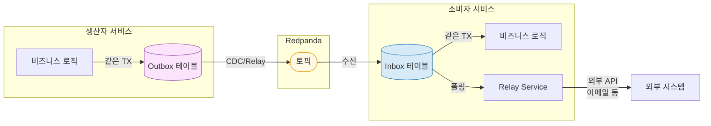
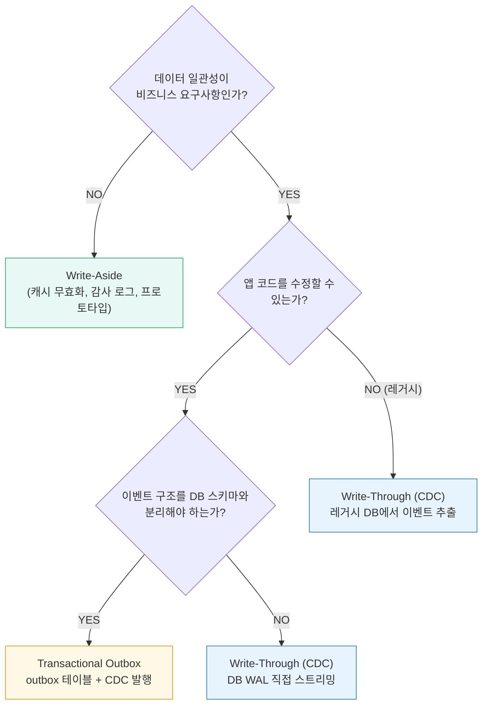
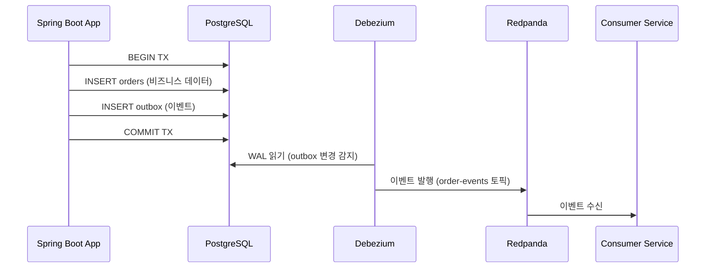
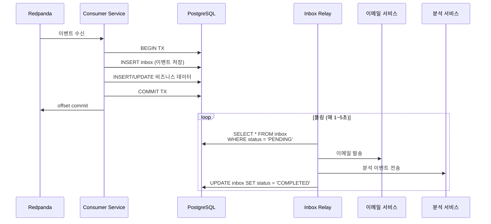
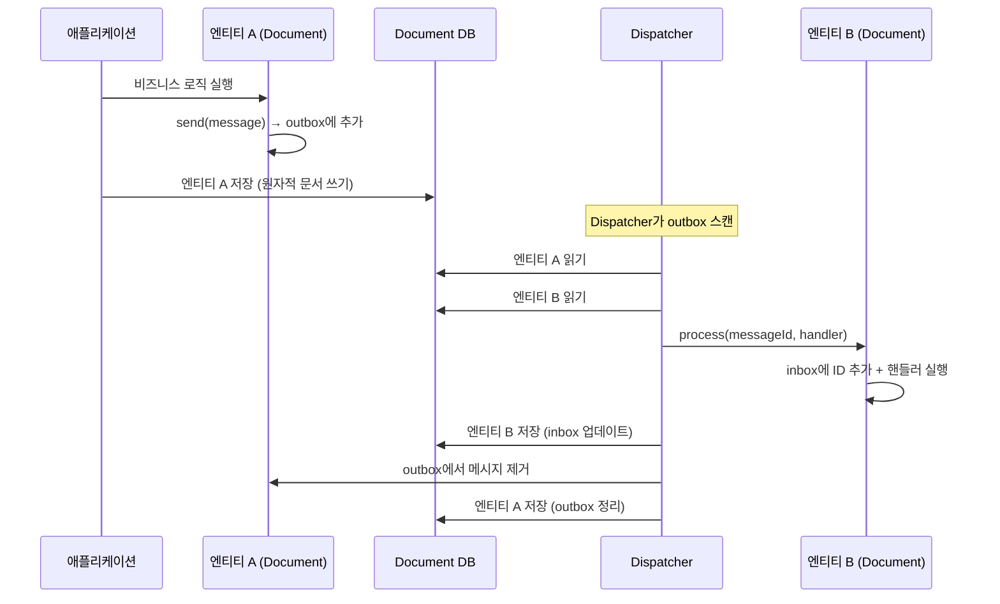
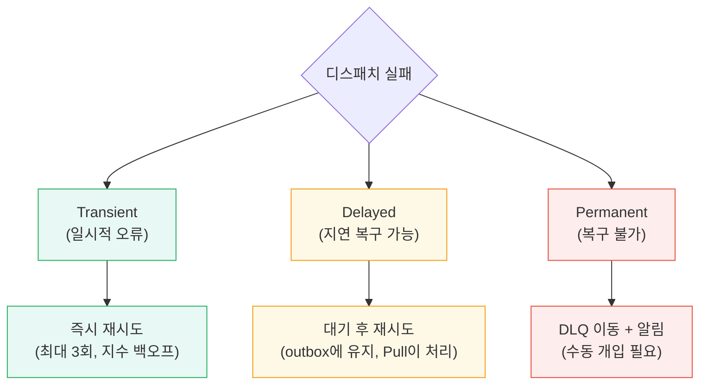

# 09. 트랜잭셔널 메시징 패턴 — Outbox, Inbox, CDC

DB 트랜잭션과 이벤트 발행/수신의 원자성을 확보하는 세 가지 패턴. 이중 쓰기(Write-Aside) 문제부터 Outbox/Inbox + Debezium CDC 해결까지.

## 실습 목표

- Transactional Outbox 패턴으로 DB 저장과 이벤트 발행을 하나의 트랜잭션으로 처리
- Transactional Inbox 패턴으로 이벤트 수신과 후속 처리의 원자성 확보
- Debezium CDC를 통해 Outbox 테이블 변경사항을 Redpanda로 자동 스트리밍
- 애플리케이션 코드에서 Kafka 의존성 완전 제거
- At-least-once 전달 지원 및 Idempotent Consumer 구현

---

## Outbox와 Inbox: 대칭 패턴

Outbox와 Inbox는 동일한 원리(DB 트랜잭션의 원자성 활용)를 **생산자 측**과 **소비자 측**에 각각 적용한 대칭 패턴이다.



| 측면 | Outbox | Inbox |
|------|--------|-------|
| **위치** | 생산자(Producer) 측 | 소비자(Consumer) 측 |
| **해결 문제** | DB 저장 + 이벤트 발행의 원자성 | 이벤트 수신 + 후속 처리의 원자성 |
| **핵심 원리** | 비즈니스 데이터와 이벤트를 같은 TX에 저장 | 수신 이벤트와 비즈니스 데이터를 같은 TX에 저장 |
| **전달 주체** | Debezium CDC 또는 Relay | Relay Service (폴링) |
| **정리 대상** | 발행 완료 레코드 | 처리 완료 레코드 |

---

## 이론적 배경: Pat Helland와 트랜잭션 너머의 삶

Outbox/Inbox 패턴은 어디서 나왔을까? 2007년 Pat Helland가 발표한 논문 *"Life Beyond Distributed Transactions: An Apostate's Opinion"*이 출발점이다. Helland는 Amazon에서 대규모 분산 시스템을 설계하면서 하나의 결론에 도달했다. **확장 가능한 시스템에서 분산 트랜잭션(2PC)은 실용적이지 않으며, 트랜잭션 범위를 단일 엔티티로 제한해야 한다**는 것이다.

### 핵심 통찰: 엔티티 내부에 메시지를 저장하라

트랜잭션이 단일 엔티티 범위로 제한되면, 엔티티 간 조정은 어떻게 할까? Helland의 답은 단순하다. **엔티티 내부에 보낼 메시지를 저장하고, 별도 메커니즘이 이를 꺼내서 전달하면 된다.** 이것이 Outbox 패턴의 이론적 근거다.

```
[엔티티 A의 트랜잭션 범위]
┌─────────────────────────────┐
│  비즈니스 데이터 변경        │
│  + 보낼 메시지를 내부에 저장  │  ← 단일 트랜잭션으로 원자성 확보
└─────────────────────────────┘
         │
         ▼ (별도 프로세스가 꺼내서 전달)
[엔티티 B의 트랜잭션 범위]
┌─────────────────────────────┐
│  수신 메시지를 내부에 저장    │
│  + 비즈니스 데이터 변경      │  ← 단일 트랜잭션으로 원자성 확보
└─────────────────────────────┘
```

수신 측도 동일한 원리를 적용한다. 메시지를 받으면 엔티티 내부(Inbox)에 저장하고, 같은 트랜잭션에서 비즈니스 로직을 처리한다. 이미 처리한 메시지 ID를 Inbox에 보관하므로 중복 수신 시 멱등성이 자동으로 보장된다.

### 시간적 결합을 끊는 질문

Helland의 논문에서 가장 실용적인 판단 기준은 이 질문이다.

> **"이 작업이 지금 즉시 일어나야 하는가, 아니면 결국 일어나면 되는가?"**

"지금 즉시"라면 동기 호출(REST, gRPC)이 맞고, "결국 일어나면 된다"면 비동기 메시징이 적합하다. 대부분의 비즈니스 프로세스는 후자에 해당한다. 주문이 생성되면 결제 요청이 "결국" 처리되면 되고, 재고 차감도 "결국" 반영되면 된다. 이 **시간적 결합(temporal coupling)**을 끊는 것이 분산 시스템 설계의 핵심이며, Outbox/Inbox는 그 구현 수단에 해당한다.

### Jimmy Bogard 시리즈: 이론에서 구현으로

Jimmy Bogard는 Helland의 논문을 9편의 블로그 시리즈 *"Life Beyond Distributed Transactions: An Apostate's Implementation"*으로 구체화했다. 이론을 실제 코드로 옮기면서 마주치는 문제들 — Document DB에서의 Outbox 임베딩, Dispatcher 설계, 실패 복구 전략 — 을 다룬다.

| 편 | 주제 | 핵심 내용 |
|----|------|----------|
| 1~3 | 문서 모델과 엔티티 조정 | Pat Helland 요약, 엔티티 경계 내 트랜잭션 제한 |
| 4~5 | Document DB에서의 Outbox/Inbox | 엔티티 내부에 outbox/inbox를 임베딩하는 패턴 |
| 6~7 | Dispatcher와 실패 복구 | 메시지 디스패치 전략, 실패 유형별 복구 |
| 8~9 | Rescuer와 프로덕션 고려사항 | 미처리 메시지 감지, 낙관적 동시성 제어 |

이 문서의 Part 1~4는 RDB + Debezium CDC 관점에서 Outbox/Inbox를 다뤘다. Part 5~6에서는 Bogard 시리즈의 핵심인 **Document DB 구현**과 **Dispatcher/실패 복구** 패턴을 보충한다.

---

## 배경: 이중 쓰기 문제와 해결 전략

Outbox/Inbox/CDC 패턴이 왜 필요한지 이해하려면, 그 이전에 존재하는 접근 방식과 한계를 알아야 한다.

### Write-Aside (이중 쓰기)

가장 직관적인 방법은 애플리케이션이 DB에 저장하면서 동시에 이벤트도 직접 발행하는 것이다. 추가 인프라 없이 코드 몇 줄이면 되니 빠르게 시작할 수 있지만, DB 트랜잭션과 Kafka 발행은 서로 다른 트랜잭션 시스템이므로 어느 한쪽이 실패하면 데이터가 어긋난다.

| 시나리오 | DB 상태 | Kafka 상태 | 결과 |
|----------|---------|-----------|------|
| DB 성공, Kafka 실패 | 주문 존재 | 이벤트 없음 | **유실**: 다운스트림이 주문을 모름 |
| DB 실패, Kafka 성공 | 주문 없음 | 이벤트 있음 | **유령 이벤트**: 존재하지 않는 주문 이벤트 |

이것이 **Dual Write Problem**이다. 두 시스템에 걸쳐 원자성을 보장하려면 분산 트랜잭션(2PC)이 필요한데, 성능과 복잡성 비용이 지나치게 크다.

### Kafka 트랜잭션으로 부분 완화가 가능한가?

`kafkaTemplate.executeInTransaction()`을 사용하면 Kafka 내부에서는 여러 토픽에 원자적으로 발행할 수 있다. 하지만 이것은 "Kafka 토픽 A → 토픽 B" 사이의 원자성이지, "DB ↔ Kafka" 사이의 원자성은 여전히 보장하지 않는다.

```java
@Transactional  // DB 트랜잭션
public Order placeOrder(CreateOrderRequest request) {
    Order order = orderRepository.save(Order.from(request));

    // Kafka 트랜잭션 — 두 토픽에 원자적 발행
    // 단, DB 커밋과 Kafka 커밋은 별개
    kafkaTemplate.executeInTransaction(ops -> {
        ops.send("orders", order.getId().toString(), OrderCreatedEvent.of(order));
        ops.send("order-audit", order.getId().toString(), AuditEvent.of(order));
        return null;
    });
    return order;
}
```

DB 커밋 직전에 프로세스가 죽으면 Kafka에는 이벤트가 발행되었지만 DB에는 데이터가 없는 상황이 생긴다. 진정한 DB↔Kafka 원자성은 Outbox 패턴이나 CDC만이 제공한다.

### 트랜잭션 내 네트워크 I/O 금지 원칙

Write-Aside의 근본 문제는 일관성만이 아니다. **트랜잭션 내에서 네트워크 I/O(브로커 전송, 외부 API 호출 등)를 수행하면 락 점유 시간이 네트워크 지연만큼 늘어난다.** 브로커가 느리거나 타임아웃이 발생하면 DB 행 잠금이 수십 초간 유지되어, 동일 행을 접근하는 다른 트랜잭션이 대기하거나 데드락이 발생할 수 있다.

이 문제의 해결 방향은 세 단계로 나뉜다.

**1단계: 커밋 후 전송 (Commit-then-Send)**

DB 변경을 멱등하게 만들고, 트랜잭션이 커밋된 **후에** 메시지를 전송한다. 전송이 실패하면 예외를 발생시키거나 500을 반환하여 호출자가 재시도하도록 한다. DB 변경이 멱등하므로 재시도해도 부작용이 없다.

```java
@Transactional
public Order createOrder(CreateOrderRequest request) {
    // DB 변경만 — 네트워크 I/O 없음
    return orderRepository.save(Order.create(request));
}

// 트랜잭션 밖에서 메시지 전송
public Order createOrderAndPublish(CreateOrderRequest request) {
    Order order = createOrder(request);  // TX 커밋 완료
    try {
        kafkaTemplate.send("order-events", OrderEvent.from(order)).get();
    } catch (Exception e) {
        // 전송 실패 → 500 반환 → 호출자가 재시도
        // DB 변경이 멱등하므로 재시도 시 중복 생성 없음
        throw new MessagePublishException("Failed to publish event", e);
    }
    return order;
}
```

이 방식은 단순하지만 한계가 있다. 커밋은 성공했는데 전송이 실패하면, 호출자가 재시도하지 않는 한 이벤트가 영구 유실된다.

**2단계: 앞에 큐를 두면 더 쉬워진다**

1단계의 약점은 전송 실패 시 **호출자가 재시도해야 한다**는 것이다. 호출자가 재시도하지 않으면 이벤트가 영구 유실된다. 이 책임을 호출자에서 인프라로 옮기는 방법이 "앞에 큐를 두는 것"이다.

서비스가 HTTP 요청을 직접 받는 대신, **앞단에 Kafka 토픽을 두고 요청 자체를 메시지로 수신한다.** 서비스는 이 메시지를 소비하여 DB에 쓰는데, 처리가 실패하면 offset을 커밋하지 않으므로 메시지가 토픽에 남아 다음 폴링에서 자동으로 재처리된다.

```
[1단계] Client --HTTP--> Service --TX--> DB
                            |
                            └-- 전송 실패 --> 500 반환 --> Client가 재시도해야 함

[2단계] Client --HTTP--> Kafka 토픽 --> Service --TX--> DB
                            ↑                              |
                            └──── 처리 실패 시 offset 미커밋 ──┘
                                  메시지가 토픽에 남아 자동 재처리
```

재시도 책임이 호출자에서 큐로 이동하므로, 호출자는 "토픽에 넣기만 하면 끝"이 된다. 다만 이 구조에서도 서비스가 DB 저장 후 **다른 서비스에 이벤트를 보내야 하는** 상황이면, 결국 "DB 쓰기 + 메시지 전송"이라는 이중 쓰기 문제가 되돌아온다. 그래서 3단계(Outbox)가 필요하다.

**3단계: Outbox 패턴으로 복잡성 제거**

DB I/O를 원자적으로 만들면서 트랜잭션의 필요성 자체를 없앨 수 있다면 가장 좋다. 하지만 트랜잭션을 제거할 수 없고 로직을 멱등하게 만들기 어려운 경우, **Outbox 패턴이 이 모든 복잡성을 제거한다.** 트랜잭션 안에서는 DB 쓰기만 하고(네트워크 I/O 없음), 메시지 전달은 CDC나 Relay에 위임하기 때문이다.

| 접근 방식 | 트랜잭션 내 네트워크 I/O | 멱등성 요구 | 전달 보장 |
|----------|----------------------|-----------|----------|
| Write-Aside | 있음 (락 문제) | 불필요 | 미보장 |
| Commit-then-Send | 없음 | 필수 | 호출자 재시도에 의존 |
| **Outbox** | **없음** | 불필요 | **CDC/Relay가 보장** |

결국 Outbox 패턴은 "트랜잭션 내 네트워크 I/O 금지" 원칙을 구조적으로 강제하는 패턴이기도 하다.

### Write-Aside가 여전히 적합한 경우

Write-Aside가 항상 나쁜 것은 아니다. 데이터 불일치가 수용 가능한 상황에서는 인프라를 단순하게 유지하는 현명한 선택이 된다.

- **캐시 무효화**: Kafka 발행이 실패해도 캐시 만료 후 자연 회복
- **감사 로그**: 일부 누락이 비즈니스에 치명적이지 않은 경우
- **프로토타입/초기 개발**: 인프라 단순성이 일관성보다 중요한 단계

### Write-Through (CDC)

Write-Aside의 대안이 **Write-Through**다. 애플리케이션은 DB에만 쓰고, DB 변경 로그(WAL/binlog)를 CDC 커넥터가 읽어서 이벤트를 자동 발행한다. DB 커밋과 WAL 기록은 같은 트랜잭션이므로 원자성이 보장된다. 다만 CDC 이벤트는 DB 스키마에 직접 종속되기 때문에, 이벤트 구조를 독립적으로 설계하고 싶다면 한계가 있다.

### Transactional Outbox

Write-Through의 원자성 보장과 Write-Aside의 이벤트 구조 독립성을 결합한 패턴이다. 애플리케이션이 비즈니스 테이블과 `outbox` 테이블에 같은 DB 트랜잭션으로 쓰고, CDC 커넥터가 `outbox` 테이블만 감시하여 이벤트를 발행한다. 이벤트 구조는 `outbox` 테이블의 `payload` 컬럼에서 자유롭게 정의할 수 있으므로 DB 스키마 변경에 영향받지 않는다. 이 문서의 Part 1에서 상세히 다룬다.

### 세 가지 전략 비교

| 기준 | Write-Aside (이중 쓰기) | Write-Through (CDC) | Outbox + CDC |
|------|------------------------|---------------------|--------------|
| **원자성** | 미보장 | 보장 (WAL 기반) | 보장 (단일 TX) |
| **지연 시간** | 낮음 (동기 발행) | 중간 (WAL → 커넥터) | 중간 (WAL → 커넥터) |
| **인프라 비용** | 낮음 | 높음 (CDC 운영) | 높음 (CDC 운영) |
| **스키마 결합** | 낮음 (앱이 이벤트 구조 제어) | 높음 (DB 스키마 종속) | 낮음 (Outbox 테이블로 분리) |
| **적합 사례** | 프로토타입, 일관성 허용 | 레거시 DB 이벤트 추출 | 정합성 필수 + 이벤트 구조 독립 |

### 패턴 선택 흐름



이 문서는 위 흐름에서 **Outbox**, **Inbox**, **CDC** 세 가지를 상세히 다룬다.

---

## Part 1: Transactional Outbox

### 왜 Outbox 패턴인가?

#### 문제 상황: Dual Write Problem

07-08장에서 반복적으로 등장한 문제다.

```java
@Transactional
public Order createOrder(CreateOrderRequest request) {
    Order order = orderRepository.save(order);          // DB 트랜잭션
    kafkaTemplate.send("order-events", orderEvent);     // ⚠️ 트랜잭션 밖
    return order;
}
```

DB 커밋은 성공했지만 Kafka 발행이 실패하면 이벤트가 유실된다. 반대로 DB가 롤백되었는데 Kafka에는 이미 발행되었다면 유령 이벤트가 발생한다. 두 저장소에 동시에 쓰는 것 자체가 원자성을 보장할 수 없다.

#### 해결책: Outbox 테이블 + CDC

```java
@Transactional
public Order createOrder(CreateOrderRequest request) {
    Order order = orderRepository.save(order);          // 같은 TX
    outboxRepository.save(OutboxEvent.from(order));     // 같은 TX ✅
    return order;
    // Debezium이 Outbox 변경을 감지하여 Kafka로 자동 발행
}
```

Kafka 코드가 사라진다. 애플리케이션은 DB만 알면 된다.

### 아키텍처



**핵심**: 애플리케이션은 DB 트랜잭션만 신경 쓰고, Debezium이 백그라운드에서 Outbox 변경사항을 감지하여 Kafka로 발행한다.

#### Outbox 전달 방식: CDC vs Relay

Outbox 테이블의 이벤트를 브로커로 전달하는 방법은 두 가지다.

- **CDC (Debezium)**: DB의 WAL/binlog를 실시간으로 읽어 토픽에 자동 발행. ms 수준 지연. Part 3에서 상세히 다룬다.
- **폴링 Relay**: 별도 스케줄러가 `SELECT ... WHERE status = 'PENDING'`으로 미전송 행을 조회하여 발행. Debezium 인프라 없이 앱 내부에서 처리 가능. Part 4에서 최적화 방법을 다룬다.

이 문서의 Part 1 예시는 CDC 방식 기준이다. Inbox의 Relay Service(Part 2)와 동일한 폴링 구조를 Outbox에도 적용할 수 있으며, 소규모 시스템에서는 이쪽이 운영 부담이 적다.

### Outbox 테이블 설계

```sql
CREATE TABLE outbox (
    id UUID PRIMARY KEY DEFAULT gen_random_uuid(),
    aggregate_type VARCHAR(255) NOT NULL,    -- 엔티티 타입 (Order, Payment 등)
    aggregate_id VARCHAR(255) NOT NULL,      -- 엔티티 ID (Kafka Key로 사용)
    event_type VARCHAR(255) NOT NULL,        -- 이벤트 타입 (order-created 등)
    payload JSONB NOT NULL,                  -- 이벤트 페이로드
    created_at TIMESTAMP NOT NULL DEFAULT NOW()
);

CREATE INDEX idx_outbox_created_at ON outbox(created_at);
```

| 컬럼 | 역할 |
|------|------|
| `aggregate_type` + `aggregate_id` | 어떤 엔티티의 이벤트인지 식별. EventRouter가 토픽 라우팅에 사용 |
| `event_type` | Debezium EventRouter SMT가 이를 기반으로 토픽 결정 |
| `payload` | JSON 형식으로 이벤트 전체 내용 저장 |
| `created_at` | 순서 보장을 위한 정렬 기준 |

#### 예시 데이터

```json
{
  "id": "550e8400-e29b-41d4-a716-446655440000",
  "aggregate_type": "Order",
  "aggregate_id": "order-123",
  "event_type": "order-created",
  "payload": {
    "orderId": "order-123",
    "userId": "user-456",
    "totalAmount": 50000,
    "timestamp": "2026-02-06T12:00:00Z"
  },
  "created_at": "2026-02-06T12:00:00.123456"
}
```

### 단일 Outbox vs 도메인별 Outbox

Outbox 테이블을 하나로 운영할지, 도메인마다 분리할지는 시스템 규모에 따라 달라진다.

**단일 Outbox 테이블 (권장 — 대부분의 경우)**

`aggregate_type` 컬럼 하나로 Order, Payment, Shipment 등 모든 도메인 이벤트를 구분한다. Debezium EventRouter SMT가 이 값을 기반으로 토픽을 자동 라우팅하므로 테이블을 분리할 필요가 없다. 커넥터도 하나, DDL도 하나, 정리 스케줄러도 하나면 된다.

**도메인별 Outbox 테이블 분리가 필요한 경우**

| 상황 | 이유 |
|------|------|
| 도메인별 DB 접근 권한을 분리해야 할 때 | Order 팀은 `order_outbox`만 쓰기 가능 |
| 특정 도메인의 이벤트 발생량이 압도적으로 많을 때 | 단일 테이블이 hot spot이 되면 파티셔닝 또는 분리로 부하 분산 |
| 도메인별 retention 정책이 다를 때 | 결제 이벤트는 30일 보관, 알림 이벤트는 1시간 후 삭제 |

분리하더라도 테이블 스키마는 동일하게 유지하고, Debezium `table.include.list`에 여러 테이블을 나열하면 커넥터 하나로 처리 가능하다. 분리할 명확한 이유가 없다면 단일 테이블이 운영 부담이 적다.

### 코드 구현

#### Outbox 엔티티

```java
@Entity @Table(name = "outbox")
@Data @Builder @NoArgsConstructor @AllArgsConstructor
public class OutboxEvent {

    @Id @GeneratedValue(strategy = GenerationType.UUID)
    private UUID id;

    private String aggregateType;
    private String aggregateId;
    private String eventType;

    @JdbcTypeCode(SqlTypes.JSON)
    @Column(columnDefinition = "jsonb")
    private JsonNode payload;

    @CreatedDate
    private Instant createdAt;

    /** 팩토리 메서드 — 비즈니스 엔티티에서 Outbox 이벤트 생성 */
    public static OutboxEvent from(String aggregateType, String aggregateId,
                                    String eventType, Object payload,
                                    ObjectMapper mapper) {
        return OutboxEvent.builder()
                .aggregateType(aggregateType)
                .aggregateId(aggregateId)
                .eventType(eventType)
                .payload(mapper.valueToTree(payload))
                .createdAt(Instant.now())
                .build();
    }
}
```

#### Order Service (Outbox 사용)

```java
@Service
@RequiredArgsConstructor
public class OrderService {

    private final OrderRepository orderRepository;
    private final OutboxRepository outboxRepository;
    private final ObjectMapper objectMapper;

    @Transactional
    public Order createOrder(CreateOrderRequest request) {
        // 1. 비즈니스 엔티티 저장
        Order order = Order.create(request);  // status = PENDING
        orderRepository.save(order);

        // 2. Outbox에 이벤트 저장 (같은 트랜잭션)
        outboxRepository.save(OutboxEvent.from(
                "Order", order.getOrderId(), "order-created",
                OrderCreatedEvent.from(order), objectMapper));

        return order;
        // 3. TX 커밋 → Debezium이 Kafka로 자동 발행
    }

    @Transactional
    public void updateOrderStatus(String orderId, OrderStatus newStatus) {
        Order order = orderRepository.findById(orderId).orElseThrow();
        OrderStatus oldStatus = order.getStatus();
        order.updateStatus(newStatus);
        orderRepository.save(order);

        outboxRepository.save(OutboxEvent.from(
                "Order", orderId, "order-status-changed",
                new OrderStatusChanged(orderId, oldStatus, newStatus),
                objectMapper));
    }
}
```

**Kafka 코드가 없다.** `KafkaTemplate` 의존성이 완전히 사라졌다. 테스트에서도 Kafka 브로커 없이 DB만으로 검증 가능하다.

---

## Part 2: Transactional Inbox

### 왜 Inbox 패턴인가?

Outbox가 생산자의 "발행 원자성"을 해결했다면, 소비자 측에도 비슷한 문제가 있다.

```java
@KafkaListener(topics = "order-events")
public void handleOrderEvent(OrderEvent event) {
    orderService.processOrder(event);       // DB 저장 ✅
    emailService.sendConfirmation(event);   // ⚠️ 외부 API — 실패하면?
    analyticsService.track(event);          // ⚠️ 외부 API — 실패하면?
}
```

DB 저장은 성공했지만 이메일 발송이 실패하면, 이벤트는 이미 소비(offset commit)되었으므로 재시도할 방법이 없다. 반대로 이메일은 발송되었는데 offset commit이 실패하면 이메일이 중복 발송된다.

### 해결책: Inbox 테이블

이벤트를 수신하면 **먼저 Inbox 테이블에 저장**하고, 후속 처리는 별도 Relay가 담당한다.



### Inbox 테이블 설계

```sql
CREATE TABLE inbox (
    id UUID PRIMARY KEY DEFAULT gen_random_uuid(),
    event_id VARCHAR(255) NOT NULL UNIQUE,  -- 원본 이벤트 ID (멱등성 키)
    event_type VARCHAR(255) NOT NULL,
    payload JSONB NOT NULL,
    status VARCHAR(50) NOT NULL DEFAULT 'PENDING',  -- PENDING → PROCESSING → COMPLETED / FAILED
    retry_count INTEGER NOT NULL DEFAULT 0,
    max_retries INTEGER NOT NULL DEFAULT 3,
    error_message TEXT,
    created_at TIMESTAMP NOT NULL DEFAULT NOW(),
    processed_at TIMESTAMP
);

CREATE INDEX idx_inbox_status ON inbox(status) WHERE status = 'PENDING';
CREATE UNIQUE INDEX idx_inbox_event_id ON inbox(event_id);
```

| 컬럼 | 역할 |
|------|------|
| `event_id` | 원본 이벤트 ID. UNIQUE 제약으로 멱등성 보장 (중복 수신 시 INSERT 실패 → 스킵) |
| `status` | Relay의 처리 상태 추적. Partial Index로 PENDING만 빠르게 조회 |
| `retry_count` / `max_retries` | 실패 시 재시도 횟수 제한. 초과 시 DLQ로 이동 |

### 코드 구현

패턴의 핵심은 SQL 수준의 `UNIQUE` 제약(멱등성)과 `status` 컬럼(상태 추적)이다. 아래는 Spring Data JPA 구현 예시지만, MyBatis, JDBC Template, 다른 언어/프레임워크에서도 동일한 SQL 구조로 구현할 수 있다.

#### Inbox 엔티티 (Spring Data JPA 예시)

```java
@Entity @Table(name = "inbox")
@Data @Builder @NoArgsConstructor @AllArgsConstructor
public class InboxEvent {

    @Id @GeneratedValue(strategy = GenerationType.UUID)
    private UUID id;

    @Column(unique = true)
    private String eventId;       // 멱등성 키

    private String eventType;

    @JdbcTypeCode(SqlTypes.JSON)
    @Column(columnDefinition = "jsonb")
    private JsonNode payload;

    @Enumerated(EnumType.STRING)
    private InboxStatus status;   // PENDING, PROCESSING, COMPLETED, FAILED

    private int retryCount;
    private int maxRetries;
    private String errorMessage;
    private Instant createdAt;
    private Instant processedAt;
}
```

#### Consumer (Inbox에 저장만)

```java
@Component
@RequiredArgsConstructor
public class OrderInboxConsumer {

    private final InboxRepository inboxRepository;
    private final OrderService orderService;

    @Transactional
    @KafkaListener(topics = "order-events", groupId = "payment-service")
    public void handleOrderEvent(ConsumerRecord<String, String> record) {
        JsonNode message = objectMapper.readTree(record.value());
        String eventId = message.get("id").asText();

        // 멱등성: event_id UNIQUE 제약으로 중복 INSERT 방지
        if (inboxRepository.existsByEventId(eventId)) return;

        // 1. Inbox에 저장 (같은 TX)
        inboxRepository.save(InboxEvent.builder()
                .eventId(eventId)
                .eventType(message.get("event_type").asText())
                .payload(message.get("payload"))
                .status(InboxStatus.PENDING)
                .retryCount(0)
                .maxRetries(3)
                .createdAt(Instant.now())
                .build());

        // 2. 핵심 비즈니스 로직도 같은 TX에서 처리
        orderService.processOrder(message);
    }
}
```

**핵심**: Consumer는 이벤트를 Inbox에 저장하고 핵심 비즈니스 로직만 처리한다. 이메일 발송 같은 부가 작업은 Relay에 위임한다.

#### Inbox Relay Service

```java
@Component
@RequiredArgsConstructor
public class InboxRelayService {

    private final InboxRepository inboxRepository;
    private final EmailService emailService;
    private final AnalyticsService analyticsService;

    @Scheduled(fixedDelay = 2000)  // 2초마다 폴링
    @Transactional
    public void processInbox() {
        // Relay 인스턴스가 2개 이상이면 행 잠금으로 중복 처리 방지
        // 단일 인스턴스라면 findByStatus(PENDING, limit) 으로 충분
        List<InboxEvent> pending = inboxRepository
                .findPendingWithLock(50);  // LIMIT 50 FOR UPDATE SKIP LOCKED

        for (InboxEvent event : pending) {
            try {
                event.setStatus(InboxStatus.PROCESSING);
                dispatch(event);
                event.setStatus(InboxStatus.COMPLETED);
                event.setProcessedAt(Instant.now());
            } catch (Exception e) {
                event.setRetryCount(event.getRetryCount() + 1);
                if (event.getRetryCount() >= event.getMaxRetries()) {
                    event.setStatus(InboxStatus.FAILED);  // DLQ 대상
                    event.setErrorMessage(e.getMessage());
                } else {
                    event.setStatus(InboxStatus.PENDING);  // 다음 폴링에서 재시도
                }
            }
            inboxRepository.save(event);
        }
    }

    private void dispatch(InboxEvent event) {
        switch (event.getEventType()) {
            case "order-created" -> {
                emailService.sendOrderConfirmation(event.getPayload());
                analyticsService.trackOrderCreated(event.getPayload());
            }
            // 다른 이벤트 타입 추가...
        }
    }
}
```

#### Lock이 필요한 경우와 아닌 경우

**단일 Relay 인스턴스**라면 Lock 없이 단순 조회로 충분하다.

```sql
SELECT * FROM inbox
WHERE status = 'PENDING'
ORDER BY created_at
LIMIT 50;
```

**Relay 인스턴스가 2개 이상**(수평 확장, 고가용성)이면 `FOR UPDATE SKIP LOCKED`를 추가한다. 이미 다른 트랜잭션이 잠근 행을 기다리지 않고 건너뛰므로, 여러 워커가 서로 다른 레코드를 병렬 처리할 수 있다.

```sql
SELECT * FROM inbox
WHERE status = 'PENDING'
ORDER BY created_at
LIMIT 50
FOR UPDATE SKIP LOCKED;
```

단일 인스턴스로 시작하고, 처리 지연이 발생하면 Lock을 추가하여 워커를 늘리는 방식이 실용적이다.

### Outbox vs Inbox 사용 시점

| 상황 | 패턴 | 이유 |
|------|------|------|
| DB 저장 + Kafka 발행 | **Outbox** | 생산자의 dual write 해결 |
| 이벤트 수신 + 외부 API 호출 | **Inbox** | 소비자의 후속 처리 안정성 |
| 이벤트 수신 + DB 저장만 | Inbox 없이 **Idempotent Consumer** | 같은 DB TX에서 처리 가능 |
| 양쪽 모두 | **Outbox + Inbox** | 완전한 end-to-end 원자성 |

단순히 이벤트를 수신해서 DB에 저장하는 것만으로 충분하다면 Inbox는 과도하다. Inbox는 **외부 시스템 호출(이메일, 결제 게이트웨이, 알림)이 후속 처리에 포함될 때** 가치가 있다.

### 왜 Inbox는 CDC가 아닌 Relay인가?

Outbox는 CDC(Debezium)로 전달하는데, Inbox도 CDC를 쓸 수 있지 않을까? 기술적으로 Inbox 테이블의 INSERT를 CDC로 감지하는 것은 가능하다. 하지만 실용적이지 않다.

Outbox의 목적은 "DB 변경을 브로커로 전달"하는 것이고, 이것이 정확히 CDC가 하는 일이다. 반면 Inbox의 목적은 "수신한 이벤트를 기반으로 외부 시스템을 호출"하는 것이다. CDC는 DB 변경을 다른 Kafka 토픽으로 스트리밍할 뿐, 이메일을 보내거나 결제 API를 호출하지 않는다. CDC로 Inbox INSERT를 감지하더라도 결국 그 이벤트를 소비하는 또 다른 Consumer가 필요하고, 그 Consumer에서 실패/재시도/상태 관리를 해야 하므로 Relay와 동일한 문제가 되돌아온다.

| 비교 | Outbox | Inbox |
|------|--------|-------|
| **목적** | DB 변경 → 브로커 전달 | 수신 이벤트 → 외부 시스템 호출 |
| **CDC 적합성** | CDC의 역할과 정확히 일치 | CDC는 "전달"만 하고 "실행"은 못 함 |
| **자연스러운 전달 방식** | CDC (Debezium) 또는 폴링 Relay | 폴링 Relay |

---

## Part 3: Debezium CDC 설정

### Debezium이란

Debezium은 Redpanda의 기술도, DB에 내장된 기능도 아니다. Red Hat이 2015년에 만든 **독립 오픈소스 CDC 플랫폼**으로, 2025년부터 Commonhaus Foundation 소속이다. Apache License 2.0이므로 개인/기업 모두 무료로 사용할 수 있고, Red Hat이 별도 상용 지원 배포판을 제공할 뿐 소프트웨어 자체는 동일하다.

Debezium은 DB의 변경 로그(WAL, binlog)를 읽어서 이벤트로 변환하는 역할을 한다. DB 자체가 CDC를 제공하는 것이 아니라, DB가 내부적으로 기록하는 변경 로그를 Debezium이 외부에서 읽는 구조다.

### DB별 CDC 메커니즘 차이

DB 종류에 따라 변경 감지 방식이 다르므로, Debezium 커넥터도 DB별로 분리되어 있다.

| DB | 변경 감지 | 커넥터 | DB 설정 | 비고 |
|----|----------|--------|---------|------|
| **PostgreSQL** | WAL + Logical Decoding (`pgoutput`) | `debezium-connector-postgresql` | `wal_level=logical` | Replication Slot 필수, PK 없는 테이블은 이벤트 미발행 |
| **MySQL** | Binlog | `debezium-connector-mysql` | `binlog_format=ROW` | DDL 변경도 자동 추적 |
| **MariaDB** | Binlog | `debezium-connector-mariadb` | `binlog_format=ROW` | Debezium 2.7부터 MySQL과 별도 커넥터로 분리 |

이 문서의 예시는 PostgreSQL 기준이다. MySQL/MariaDB는 `wal_level` 대신 `binlog_format=ROW` 설정만 다르고, 나머지 Debezium 커넥터 등록 흐름은 동일하다.

### Docker Compose

```yaml
services:
  postgres:
    image: postgres:15-alpine
    environment:
      POSTGRES_DB: orderdb
      POSTGRES_USER: orderuser
      POSTGRES_PASSWORD: orderpass
    command:
      - postgres
      - -c
      - wal_level=logical        # CDC 필수
      - -c
      - max_wal_senders=10
      - -c
      - max_replication_slots=10
    ports:
      - "5432:5432"

  redpanda:
    image: docker.redpanda.com/vectorized/redpanda:v25.3.1
    command:
      - redpanda start --smp 1 --memory 1G
      - --kafka-addr internal://0.0.0.0:9092,external://0.0.0.0:19092
    ports:
      - "19092:19092"

  kafka-connect:
    image: quay.io/debezium/connect:2.7
    depends_on: [redpanda, postgres]
    ports:
      - "8083:8083"
    environment:
      BOOTSTRAP_SERVERS: redpanda:9092
      GROUP_ID: "debezium-cluster"
      CONFIG_STORAGE_TOPIC: "debezium-config"
      OFFSET_STORAGE_TOPIC: "debezium-offset"
      STATUS_STORAGE_TOPIC: "debezium-status"
```

**왜 `wal_level=logical`인가?**
PostgreSQL의 WAL을 logical 수준으로 설정해야 Debezium이 행 단위 변경사항(INSERT, UPDATE, DELETE)을 읽을 수 있다. 기본값 `replica`로는 물리적 블록 수준만 읽힌다.

### Debezium Connector 생성

```bash
curl -X POST http://localhost:8083/connectors \
  -H "Content-Type: application/json" \
  -d '{
    "name": "order-outbox-connector",
    "config": {
      "connector.class": "io.debezium.connector.postgresql.PostgresConnector",
      "database.hostname": "postgres",
      "database.port": "5432",
      "database.user": "orderuser",
      "database.password": "orderpass",
      "database.dbname": "orderdb",
      "database.server.name": "orderdb",
      "table.include.list": "public.outbox",
      "plugin.name": "pgoutput",

      "transforms": "outbox",
      "transforms.outbox.type": "io.debezium.transforms.outbox.EventRouter",
      "transforms.outbox.table.field.event.key": "aggregate_id",
      "transforms.outbox.table.field.event.type": "event_type",
      "transforms.outbox.table.field.event.payload": "payload",
      "transforms.outbox.route.topic.replacement": "${routedByValue}-events"
    }
  }'
```

| 설정 | 값 | 설명 |
|------|-----|------|
| `table.include.list` | `public.outbox` | Outbox 테이블만 모니터링 |
| `transforms.outbox.type` | `EventRouter` | Outbox 전용 SMT |
| `route.topic.replacement` | `${routedByValue}-events` | `aggregate_type=Order` → `order-events` 토픽 |

EventRouter SMT 덕분에 하나의 Outbox 테이블로 여러 토픽에 이벤트를 발행할 수 있다. `aggregate_type`이 `Order`면 `order-events`, `Payment`면 `payment-events`로 라우팅된다.

### EventRouter 토픽 라우팅 전략

토픽을 얼마나 세분화할지에 따라 EventRouter 설정이 달라진다.

#### 전략 1: Aggregate 단위 토픽 (권장)

`aggregate_type`으로 라우팅한다. Order의 모든 이벤트(created, cancelled, updated)가 하나의 `order-events` 토픽에 들어가고, Consumer가 `event_type` 헤더로 필터링한다.

```json
{
  "transforms.outbox.route.by.field": "aggregate_type",
  "transforms.outbox.route.topic.replacement": "${routedByValue}-events"
}
```

```
outbox 행: aggregate_type=Order, event_type=order-created    → order-events 토픽
outbox 행: aggregate_type=Order, event_type=order-cancelled  → order-events 토픽
outbox 행: aggregate_type=Payment, event_type=payment-completed → payment-events 토픽
```

**헤더는 누가 설정하는가?** 애플리케이션이 아니라 EventRouter SMT가 자동으로 설정한다. 커넥터 설정의 `transforms.outbox.table.field.event.type` 속성이 outbox 테이블의 `event_type` 컬럼 값을 Kafka 메시지 헤더 `eventType`에 매핑한다. 애플리케이션 코드에서 헤더를 신경 쓸 필요가 없다.

Consumer 측에서 이벤트 타입별 분기:

```java
@KafkaListener(topics = "order-events")
public void handle(ConsumerRecord<String, String> record) {
    // EventRouter가 자동 설정한 헤더
    String eventType = new String(
        record.headers().lastHeader("eventType").value());

    switch (eventType) {
        case "order-created"   -> handleCreated(record);
        case "order-cancelled" -> handleCancelled(record);
    }
}
```

이 방식이 권장되는 이유는 세 가지다. 같은 Aggregate의 이벤트가 같은 토픽에 있으므로 `aggregate_id` 기준 파티셔닝으로 **순서가 보장**된다. 토픽 수가 적어 **운영 부담이 낮다**. 새 이벤트 타입을 추가해도 **토픽을 새로 만들 필요가 없다**.

#### 전략 2: Event Type 단위 토픽

`event_type`으로 라우팅한다. 이벤트 타입마다 전용 토픽이 생긴다.

```json
{
  "transforms.outbox.route.by.field": "event_type",
  "transforms.outbox.route.topic.replacement": "${routedByValue}"
}
```

```
outbox 행: event_type=order-created    → order-created 토픽
outbox 행: event_type=order-cancelled  → order-cancelled 토픽
outbox 행: event_type=payment-completed → payment-completed 토픽
```

Consumer가 필요한 이벤트만 구독할 수 있어 필터링 로직이 불필요하다.

```java
@KafkaListener(topics = "order-created")
public void handleOrderCreated(ConsumerRecord<String, String> record) {
    // order-created 이벤트만 수신 — 필터링 불필요
}
```

하지만 이벤트 타입이 늘어날수록 토픽 수가 폭발한다. 20개 도메인 × 평균 5개 이벤트 = 100개 토픽. 토픽마다 파티션/리플리카 관리가 필요하므로 운영 비용이 높아진다. 또한 같은 Order에 대한 `created` → `cancelled` 이벤트가 서로 다른 토픽에 있으므로, 하나의 Consumer에서 순서를 맞추려면 별도 조정이 필요하다.

#### 어떤 전략을 선택할까?

| 기준 | Aggregate 단위 (전략 1) | Event Type 단위 (전략 2) |
|------|----------------------|------------------------|
| **토픽 수** | 도메인 수만큼 (적음) | 이벤트 타입 수만큼 (많음) |
| **순서 보장** | 같은 Aggregate 내 자연스럽게 보장 | 토픽이 분리되어 별도 조정 필요 |
| **Consumer 구현** | `event_type` 헤더로 분기 필요 | 토픽 구독만으로 필터링 완료 |
| **새 이벤트 추가** | 토픽 변경 없음 | 새 토픽 생성 필요 |
| **적합 케이스** | 대부분의 시스템 | Consumer가 극소수 이벤트만 필요한 경우 |

대부분의 경우 **전략 1(Aggregate 단위)**이 적합하다. 전략 2는 이벤트 간 순서가 중요하지 않고, 특정 이벤트만 구독하는 독립적인 Consumer가 많을 때 고려한다.

#### 스키마 전략과의 관계

"토픽 1개 = Avro 스키마 1개" 원칙을 따르고 있다면, 전략 선택에 영향을 준다. Schema Registry의 기본 네이밍 전략(`TopicNameStrategy`)은 토픽당 하나의 스키마만 허용하기 때문이다.

전략 1(Aggregate 단위)에서 `order-events` 토픽에 `order-created`, `order-cancelled` 등 서로 다른 구조의 이벤트가 섞이면, 하나의 Avro 스키마로는 표현할 수 없다. 이 충돌을 해결하는 방법은 세 가지다.

| 방식 | 설명 | 토픽:스키마 |
|------|------|-----------|
| **Event Type 단위 토픽 (전략 2)** | 이벤트 타입별 토픽 분리. 토픽 = 스키마 1:1 자연스럽게 유지 | 1:1 |
| **TopicRecordNameStrategy** | SR 네이밍 전략 변경. 스키마 subject가 `{토픽}-{레코드명}`이 되어 같은 토픽에 여러 Avro 스키마 공존 | 1:N |
| **Envelope 스키마** | 외부 구조를 통일하고(`id`, `event_type`, `payload`), payload를 JSON 문자열로 저장. 토픽 스키마는 하나지만 payload 내부는 자유 | 1:1 (껍데기) |

Outbox 패턴에서는 **Envelope 방식이 가장 자연스럽다**. outbox 테이블의 `payload` 컬럼이 이미 JSONB이므로, Kafka 메시지의 value도 동일한 envelope 구조(`aggregate_type` + `event_type` + `payload` JSON 문자열)가 된다. Consumer는 `event_type`을 보고 payload를 적절한 타입으로 역직렬화한다.

"토픽 1 = 스키마 1"을 엄격하게 유지하면서 이벤트 타입별 Avro 스키마 검증까지 원한다면, **전략 2(Event Type 단위 토픽)**가 가장 명확한 선택이다.

### 커넥터 구성 전략: DB 단위 vs 도메인 단위

커넥터는 **DB 인스턴스 단위**로 생성한다. 도메인(Order, Payment 등)마다 curl을 따로 날리는 것이 아니다.

**모놀리스(하나의 DB)**: 커넥터 1개면 충분하다. `outbox` 테이블 하나에 모든 도메인의 이벤트가 쌓이고, EventRouter SMT가 `aggregate_type` 기반으로 토픽을 분기한다.

```
outbox 테이블 (하나)
┌──────────────────┬──────────────┬──────────────────┐
│ aggregate_type   │ aggregate_id │ event_type       │
├──────────────────┼──────────────┼──────────────────┤
│ Order            │ order-123    │ order-created    │  → order-events 토픽
│ Payment          │ pay-456      │ payment-completed│  → payment-events 토픽
│ Shipment         │ ship-789     │ shipment-started │  → shipment-events 토픽
└──────────────────┴──────────────┴──────────────────┘
         ↑ 커넥터 1개가 이 테이블만 감시, EventRouter가 라우팅
```

**마이크로서비스(DB가 분리된 경우)**: 서비스마다 DB가 다르므로 커넥터도 DB 수만큼 필요하다. 이건 Outbox 때문이 아니라 database-per-service 패턴의 자연스러운 결과다.

```
Order Service (orderdb)  → order-outbox-connector
Payment Service (paydb)  → payment-outbox-connector
Shipment Service (shipdb) → shipment-outbox-connector
```

도메인별 outbox 테이블을 분리(`order_outbox`, `payment_outbox`)하는 방식도 가능하지만, 같은 DB 안이라면 `table.include.list`에 여러 테이블을 나열하여 **커넥터 하나로 처리**할 수 있다. 테이블을 분리해야 할 이유(접근 권한, 파티셔닝 전략 등)가 없다면 단일 outbox 테이블 + EventRouter가 운영 부담이 가장 적다.

### CDC 이벤트 구조

Debezium이 발행하는 이벤트에는 변경 전(`before`)과 변경 후(`after`) 상태가 모두 담겨 있어, 다운스트림 서비스가 정확히 무엇이 바뀌었는지 판단할 수 있다.

```json
{
  "before": null,
  "after": {
    "id": "ord-123",
    "customer_id": "cust-456",
    "total": 59900,
    "status": "PENDING"
  },
  "op": "c",
  "ts_ms": 1708420000000,
  "source": {
    "db": "shop",
    "table": "orders",
    "lsn": 12345678
  }
}
```

| 필드 | 설명 |
|------|------|
| `op` | 변경 유형 — `c`(create), `u`(update), `d`(delete), `r`(snapshot read) |
| `before` | 변경 전 상태. INSERT(`c`)에서는 `null` |
| `after` | 변경 후 상태. DELETE(`d`)에서는 `null` |
| `source.lsn` | WAL 위치. Debezium이 재시작 시 이 위치부터 재개 |

### 복제 슬롯 모니터링 (필수)

**복제 슬롯(Replication Slot)**은 PostgreSQL이 "이 소비자가 WAL을 어디까지 읽었는지" 기억하는 북마크다. Debezium이 커넥터를 생성하면 PostgreSQL에 복제 슬롯이 하나 만들어지며, 두 가지 역할을 한다. 첫째, Debezium 재시작 시 슬롯에 기록된 LSN(Log Sequence Number) 위치부터 재개하여 이벤트 유실을 방지한다. 둘째, 슬롯의 소비자가 아직 읽지 않은 WAL을 PostgreSQL이 삭제하지 않고 보존한다.

문제는 두 번째 역할이다. Debezium이 장시간 중단되면 슬롯이 WAL을 계속 보유하려 해서 **디스크가 고갈**될 위험이 있다. 운영 환경에서 반드시 모니터링해야 한다.

```sql
-- 복제 슬롯 WAL 누적량 확인
SELECT slot_name,
       pg_size_pretty(pg_wal_lsn_diff(pg_current_wal_lsn(), restart_lsn)) AS wal_behind
FROM pg_replication_slots;

-- wal_behind가 수 GB를 넘으면 Debezium 커넥터 상태를 즉시 확인
```

```sql
-- 복제 슬롯 상태 확인
SELECT slot_name, plugin, slot_type, active, restart_lsn
FROM pg_replication_slots;
-- active: true → Debezium 정상 연결
-- active: false → Debezium 중단 → WAL 누적 시작
```

### MySQL/MariaDB는 다른 문제

PostgreSQL의 복제 슬롯은 소비자가 읽을 때까지 WAL을 보존하지만, MySQL/MariaDB의 binlog는 소비자와 무관하게 `binlog_expire_logs_seconds` 설정에 따라 자동 삭제된다. Debezium이 장시간 중단되면 문제의 방향이 반대다.

| DB | Debezium 중단 시 동작 | 위험 | 대응 |
|----|---------------------|------|------|
| **PostgreSQL** | 복제 슬롯이 WAL 삭제를 막음 → WAL 누적 | 디스크 고갈 | 슬롯 WAL 누적량 모니터링, 임계치 초과 시 알림 |
| **MySQL/MariaDB** | binlog가 보관 기한 후 자동 삭제 → Debezium 읽기 위치 유실 | 재개 불가, 전체 스냅샷 재수행 필요 | binlog 보관 기한을 충분히 설정 (기본 30일), Debezium 상태 모니터링 |

PostgreSQL은 "안 읽었으니 안 지울게"라서 디스크가 차고, MySQL/MariaDB는 "기한 지났으니 지울게"라서 데이터가 유실된다. 어느 쪽이든 Debezium 커넥터의 상태(RUNNING/FAILED)를 주기적으로 확인하는 것이 핵심이다.

---

## Part 4: Relay 서비스 최적화

Outbox/Inbox 패턴에서 CDC 대신 **폴링 기반 Relay**를 사용하는 경우(Debezium 없이), 다음 최적화가 필요하다.

### 1. 폴링 간격 조정

트래픽에 따라 폴링 간격을 조절한다. 지연 허용 시스템은 5~10초, 실시간 요구 시스템은 1초 이하로 설정한다.

### 2. 배치 처리

```sql
SELECT * FROM outbox
WHERE status = 'PENDING'
ORDER BY created_at
LIMIT 100;
```

한 번의 폴링에서 여러 레코드를 묶어 처리하면 DB 쿼리 횟수와 네트워크 왕복을 줄인다.

### 3. 병렬 워커 + 행 잠금

```sql
SELECT * FROM outbox
WHERE status = 'PENDING'
ORDER BY created_at
LIMIT 50
FOR UPDATE SKIP LOCKED;
```

`FOR UPDATE SKIP LOCKED`는 이미 다른 트랜잭션이 잠근 행을 기다리지 않고 건너뛰므로, 여러 워커가 서로 다른 레코드를 병렬 처리할 수 있다.

### CDC vs Relay 비교

| 측면 | Debezium CDC | 폴링 Relay |
|------|-------------|------------|
| **지연시간** | ms 수준 (WAL 실시간 읽기) | 폴링 간격에 비례 (1~10초) |
| **인프라** | Kafka Connect + Debezium 필요 | 앱 내부 @Scheduled로 충분 |
| **정렬 보장** | WAL 순서 보장 | created_at ORDER BY 필요 |
| **DB 부하** | WAL 읽기 (낮음) | 주기적 SELECT (중간) |
| **적합 케이스** | 실시간 요구, 대량 이벤트 | 소규모, 인프라 최소화 |

---

## Part 5: Document DB에서의 Outbox/Inbox — Bogard 구현

Part 1~4는 RDB의 별도 outbox/inbox 테이블을 사용했다. Document DB(MongoDB, Cosmos DB 등)에서는 접근 방식이 달라진다. 문서 모델은 엔티티 하나가 하나의 문서이므로, **outbox/inbox를 별도 컬렉션이 아닌 엔티티 문서 내부에 임베딩**할 수 있다. 문서 단위 쓰기가 원자적이므로 별도 트랜잭션 관리 없이도 비즈니스 데이터와 메시지의 원자성이 보장된다.

### 엔티티 내부 Outbox/Inbox 구조

Bogard의 설계에서 모든 도메인 엔티티는 `DocumentBase`를 상속하며, 각 엔티티 문서 안에 `outbox`(보낼 메시지)와 `inbox`(처리한 메시지 ID) 컬렉션을 포함한다.

```java
/**
 * Document DB용 엔티티 기반 클래스.
 * 모든 도메인 엔티티가 이를 상속하여 outbox/inbox를 내장한다.
 */
public abstract class DocumentBase {

    private String id;
    private String etag;  // 낙관적 동시성 제어용

    /** 외부로 보낼 메시지 목록 */
    private Set<DocumentMessage> outbox = new HashSet<>();

    /** 이미 처리한 메시지 ID 목록 (멱등성 보장) */
    private Set<UUID> inbox = new HashSet<>();

    /** 메시지를 outbox에 추가 */
    public void send(DocumentMessage message) {
        outbox.add(message);
    }

    /**
     * 수신 메시지를 처리한다.
     * inbox에 이미 있는 ID면 중복이므로 스킵하고,
     * 없으면 inbox에 추가한 후 핸들러를 실행한다.
     */
    public boolean process(UUID messageId, Consumer<DocumentBase> handler) {
        if (inbox.contains(messageId)) {
            return false;  // 이미 처리됨 — 멱등성
        }
        inbox.add(messageId);
        handler.accept(this);
        return true;
    }

    // getter/setter 생략
}
```

```java
/**
 * 엔티티 간 전달되는 메시지.
 * ID 기반 동등성으로 outbox Set에서 중복을 방지한다.
 */
public class DocumentMessage {

    private UUID id;
    private String destination;  // 대상 엔티티 타입
    private String destinationId;  // 대상 엔티티 ID
    private String messageType;
    private Map<String, Object> payload;

    // equals/hashCode: id 기반
    @Override
    public boolean equals(Object o) {
        if (this == o) return true;
        if (!(o instanceof DocumentMessage that)) return false;
        return Objects.equals(id, that.id);
    }

    @Override
    public int hashCode() {
        return Objects.hash(id);
    }
}
```

이 구조에서 메시지 송수신은 다음과 같이 동작한다.



### RDB Outbox vs Document DB Outbox 비교

| 기준 | RDB (Part 1~4) | Document DB (Part 5) |
|------|----------------|---------------------|
| **Outbox 위치** | 별도 `outbox` 테이블 | 엔티티 문서 내부 필드 |
| **원자성 확보** | DB 트랜잭션 (BEGIN/COMMIT) | 문서 단위 원자적 쓰기 |
| **멱등성 구현** | `event_id` UNIQUE 제약 | `inbox` Set에 메시지 ID 보관 |
| **전달 메커니즘** | Debezium CDC 또는 폴링 Relay | Dispatcher (Push/Pull) |
| **정리 방식** | 스케줄러로 오래된 행 삭제 | Dispatcher가 전달 후 outbox에서 제거 |
| **동시성 제어** | `FOR UPDATE SKIP LOCKED` | ETag 기반 낙관적 동시성 |
| **적합 환경** | PostgreSQL, MySQL 등 RDB | MongoDB, Cosmos DB 등 문서 DB |

Document DB 방식의 장점은 별도 테이블/컬렉션이 필요 없어 스키마가 단순하다는 것이다. 반면 엔티티 문서가 커질수록 outbox/inbox 데이터가 문서 크기를 증가시키므로, 대량 메시지가 발생하는 엔티티에서는 주기적 정리가 중요하다.

---

## Part 6: Dispatcher와 실패 복구

Part 1~4에서는 Debezium CDC나 폴링 Relay가 outbox 메시지를 전달했다. Bogard 시리즈에서는 이 역할을 **Dispatcher**라 부르며, 전달 전략과 실패 복구를 체계적으로 분류한다.

### Dispatcher의 역할

Dispatcher는 네 단계로 동작한다.

1. 엔티티의 outbox에서 메시지를 읽는다
2. 메시지의 `destination`과 `messageType`으로 적절한 핸들러를 찾는다
3. 대상 엔티티를 로드하고 `process()`를 호출한다
4. 성공하면 원본 엔티티의 outbox에서 해당 메시지를 제거한다

```java
@Component
@RequiredArgsConstructor
public class MessageDispatcher {

    private final DocumentRepository repository;
    private final HandlerRegistry handlerRegistry;

    /**
     * 단일 엔티티의 outbox 메시지를 모두 디스패치한다.
     * 요청 처리 직후(Push) 또는 폴링(Pull)에서 호출된다.
     */
    public void dispatchOutbox(DocumentBase source) {
        Set<DocumentMessage> messages = new HashSet<>(source.getOutbox());

        for (DocumentMessage message : messages) {
            try {
                // 대상 엔티티 로드
                DocumentBase target = repository.findById(
                    message.getDestination(), message.getDestinationId());

                // 핸들러 실행 (inbox 중복 체크 포함)
                MessageHandler handler = handlerRegistry.find(
                    message.getMessageType());
                target.process(message.getId(), doc -> handler.handle(doc, message));

                // 대상 저장 (inbox 업데이트)
                repository.save(target);

                // 원본 outbox에서 제거
                source.getOutbox().remove(message);
            } catch (Exception e) {
                handleFailure(source, message, e);
            }
        }
        repository.save(source);  // outbox 정리 반영
    }
}
```

### Push vs Pull 디스패치 전략

| 전략 | 동작 | 지연 시간 | 적합 상황 |
|------|------|----------|----------|
| **Push** | 요청 처리 완료 직후 즉시 디스패치 | 낮음 (요청 내 처리) | 대부분의 경우 기본 전략 |
| **Pull** | 스케줄러가 주기적으로 outbox를 스캔 | 폴링 간격에 비례 | Push 실패 시 폴백, 배치 처리 |

Push 전략은 비즈니스 로직 실행 → 엔티티 저장 → 즉시 디스패치 순서로 동작한다. 대부분의 메시지가 즉시 전달되므로 지연이 짧다. 다만 디스패치 중 실패하면 메시지가 outbox에 남게 되고, 이를 Pull 전략이 보완한다.

### 실패 유형과 복구 전략

분산 환경에서 디스패치 실패는 세 가지로 분류된다. 각 유형에 맞는 복구 전략을 적용해야 무한 재시도나 데이터 유실을 방지할 수 있다.



| 유형 | 예시 | 복구 전략 |
|------|------|----------|
| **Transient** | 네트워크 타임아웃, DB 일시 과부하 | 즉시 재시도 (지수 백오프, 최대 3회) |
| **Delayed** | 대상 서비스 배포 중, 의존 시스템 점검 | outbox에 유지 → Pull Dispatcher가 나중에 재시도 |
| **Permanent** | 메시지 형식 오류, 대상 엔티티 삭제됨 | DLQ(Dead Letter Queue)로 이동 + 운영팀 알림 |

Transient 실패에 지수 백오프 없이 즉시 재시도하면 장애 중인 서비스에 부하를 가중시킨다. Permanent 실패를 무한 재시도하면 outbox가 계속 쌓여 정상 메시지 처리까지 지연된다. 실패 유형 분류가 중요한 이유다.

### 낙관적 동시성 제어 (ETag)

Document DB에서 두 프로세스가 동시에 같은 엔티티를 수정하면 마지막 쓰기가 이전 쓰기를 덮어쓴다(lost update). Bogard는 **ETag 기반 낙관적 동시성 제어**로 이를 방지한다.

```java
public void save(DocumentBase entity) {
    // 저장 시 현재 ETag를 조건으로 걸어 충돌을 감지한다.
    // ETag가 변경되었으면 다른 프로세스가 먼저 수정한 것이므로
    // ConcurrentModificationException이 발생하고, 재시도한다.
    var result = collection.replaceOne(
        Filters.and(
            Filters.eq("_id", entity.getId()),
            Filters.eq("_etag", entity.getEtag())  // 낙관적 잠금
        ),
        entity
    );
    if (result.getModifiedCount() == 0) {
        throw new ConcurrentModificationException(
            "Entity modified by another process: " + entity.getId());
    }
}
```

RDB의 `FOR UPDATE SKIP LOCKED`(비관적 잠금)와 달리, 낙관적 잠금은 읽기 시점에 잠금을 걸지 않으므로 처리량이 높다. 충돌이 발생하면 재시도하는 방식인데, 같은 엔티티에 대한 동시 수정이 드문 환경에서 효과적이다.

### Dispatch Rescuer: 미처리 메시지 감지

Push 디스패치가 실패하고 Pull 폴링도 놓친 메시지는 어떻게 처리할까? **Dispatch Rescuer**가 이 문제를 해결한다. Rescuer는 outbox에 메시지가 남아 있는 엔티티를 찾아 재디스패치를 트리거하는 안전망이다.

```java
@Component
@RequiredArgsConstructor
public class DispatchRescuer {

    private final DocumentRepository repository;
    private final MessageDispatcher dispatcher;

    /**
     * outbox에 메시지가 남아있는 엔티티를 찾아 재디스패치한다.
     * Change Feed(Cosmos DB) 또는 주기적 폴링으로 실행된다.
     */
    @Scheduled(fixedDelay = 30_000)  // 30초마다
    public void rescueStaleMessages() {
        // outbox 배열이 비어있지 않은 문서를 조회
        List<DocumentBase> stale = repository.findWithNonEmptyOutbox();

        for (DocumentBase entity : stale) {
            try {
                dispatcher.dispatchOutbox(entity);
            } catch (Exception e) {
                // 로깅 후 다음 폴링에서 재시도
                log.warn("Rescue failed for entity {}: {}",
                    entity.getId(), e.getMessage());
            }
        }
    }
}
```

Cosmos DB를 사용한다면 Change Feed가 문서 변경을 실시간으로 알려주므로 폴링보다 효율적이다. MongoDB에서는 Change Streams가 동일한 역할을 한다.

### "즉시 시도하고, 실패하면 내구성 메시징으로 폴백"

Bogard 시리즈의 핵심 원칙은 **"try immediately, fall back on durable messaging"**이다. 정상 경로에서는 Push 디스패치로 즉시 전달하되, 실패하면 outbox에 메시지가 남아있으므로 Pull Dispatcher나 Rescuer가 복구한다. 최악의 경우 내구성 메시징 시스템(Kafka, NServiceBus 등)을 통해 전달을 보장할 수도 있다.

이 원칙은 RDB Outbox(Part 1~4)에도 동일하게 적용된다. CDC가 정상이면 ms 수준으로 전달되고, CDC가 중단되면 Outbox 테이블에 메시지가 쌓여있다가 CDC 복구 후 자동 재전송된다. 메커니즘은 다르지만 "즉시 시도 → 실패 시 내구성 보장" 패턴은 동일하다.

---

## 왜 Outbox/Inbox 테이블은 같은 DB에 있어야 하는가?

이 패턴의 핵심은 비즈니스 데이터와 이벤트 레코드가 **같은 DB 트랜잭션**에서 저장된다는 점이다.

1. **원자성 보장**: 같은 TX이므로 둘 다 성공하거나 둘 다 실패한다. 별도 DB를 사용하면 분산 트랜잭션(2PC)이 필요해지며, 이는 Outbox 패턴 도입의 의미를 무효화한다.

2. **브로커 장애 복원력**: Kafka가 다운되어도 Outbox에 이벤트가 안전하게 저장되어 있다. 브로커 복구 후 CDC/Relay가 미전송 레코드를 자동 재전송한다.

3. **앱 장애 복원력**: 앱이 크래시되어도 Outbox/Inbox에 데이터가 남아있으므로 재시작 후 정상 처리된다.

---

## Outbox 자동 정리

```java
@Component
@RequiredArgsConstructor
public class OutboxCleanupScheduler {

    private final OutboxRepository outboxRepository;

    @Scheduled(cron = "0 0 * * * *")  // 매시 정각
    public void cleanupOldEvents() {
        Instant cutoff = Instant.now().minus(1, ChronoUnit.HOURS);
        int deleted = outboxRepository.deleteByCreatedAtBefore(cutoff);
    }
}
```

Debezium은 WAL을 읽으므로 행을 삭제해도 이벤트 유실이 없다. Inbox도 동일한 방식으로 COMPLETED 레코드를 정리한다.

---

## 장점과 한계

### 장점

| 장점 | 이유 |
|------|------|
| **강력한 원자성** | Dual Write Problem 근본적 해결 |
| **Kafka 의존성 제거** | 테스트 간소화, 관심사 분리 |
| **At-least-once 지원** | Debezium이 커밋 오프셋 관리 |
| **재시작 안전** | 앱 중단 중 이벤트도 Outbox/Inbox에 보존 |
| **후속 처리 안정성** | Inbox + Relay로 외부 API 호출 실패 시 자동 재시도 |

### 한계

| 한계 | 완화 방법 |
|------|----------|
| **인프라 복잡도** | Docker Compose로 템플릿화, 폴링 Relay로 Debezium 대체 가능 |
| **DB 종류 제한** | PostgreSQL(WAL), MySQL(binlog) 지원. NoSQL은 별도 접근 |
| **Outbox/Inbox 크기** | 스케줄러로 주기적 정리 |
| **폴링 지연** | CDC 사용 시 ms 수준으로 해소 |

---

## 실습 체크리스트

### 환경 구성
- [ ] PostgreSQL WAL 레벨 `logical` 설정
- [ ] Kafka Connect + Debezium 컨테이너 실행
- [ ] Outbox + Inbox 테이블 DDL 실행

### Outbox 구현
- [ ] OutboxEvent 엔티티 정의
- [ ] Order Service에 Outbox 저장 로직 추가
- [ ] KafkaTemplate 코드 제거 확인

### Debezium 설정
- [ ] PostgreSQL Connector 생성
- [ ] EventRouter SMT 설정
- [ ] Connector 상태 확인 (RUNNING)
- [ ] Redpanda 토픽에 이벤트 발행 확인

### Inbox 구현
- [ ] InboxEvent 엔티티 정의
- [ ] Consumer에 Inbox 저장 로직 추가
- [ ] Inbox Relay Service 구현
- [ ] 외부 API 실패 시 재시도 확인

### 통합 테스트
- [ ] 주문 생성 → Outbox → Redpanda → Inbox → 후속 처리 전체 흐름
- [ ] 같은 이벤트 재전송 시 Inbox UNIQUE 제약 동작 확인
- [ ] Debezium 장애 → 복구 후 미전송 이벤트 자동 발행 확인

## 다음 단계

- **10장**: 이벤트 기반 + 요청-응답 통합 - REST API와 이벤트 브릿지 패턴

## 참고 자료

### 공식 문서

- **Debezium 공식**: https://debezium.io/documentation/
- **EventRouter SMT**: https://debezium.io/documentation/reference/transformations/outbox-event-router.html
- **Debezium PostgreSQL Connector**: https://debezium.io/documentation/reference/connectors/postgresql.html
- **Debezium MySQL Connector**: https://debezium.io/documentation/reference/connectors/mysql.html
- **Debezium MariaDB Connector**: https://debezium.io/documentation/reference/connectors/mariadb.html
- **Transactional Outbox Pattern**: https://microservices.io/patterns/data/transactional-outbox.html
- **PostgreSQL Logical Replication**: https://www.postgresql.org/docs/current/logical-replication.html

### 이론 및 시리즈

- **Pat Helland 논문**: "Life Beyond Distributed Transactions: An Apostate's Opinion" (2007, ACM Queue)
- **Jimmy Bogard 시리즈**: "Life Beyond Distributed Transactions: An Apostate's Implementation" — https://www.jimmybogard.com/life-beyond-transactions-implementation-primer/
- **Bogard GitHub 샘플**: https://github.com/jbogard/NServiceBusExtensions (Document Outbox 구현 예시)

### 관련 학습 문서

- [09-kafka-streams/05-normalized-vs-denormalized.md §6](../../08_MessageQueue/red-panda/learning/09-kafka-streams/05-normalized-vs-denormalized.md) — CDC와 Debezium/Redpanda Connect 상세 (설정 예시, 장애 시나리오, Redpanda Connect 대안)
- [07-connectors/02-redpanda-connect.md §4](../../08_MessageQueue/red-panda/learning/07-connectors/02-redpanda-connect.md) — MariaDB CDC 실습 (binlog 설정, CDC 사용자 생성, Debezium vs 폴링 비교)
