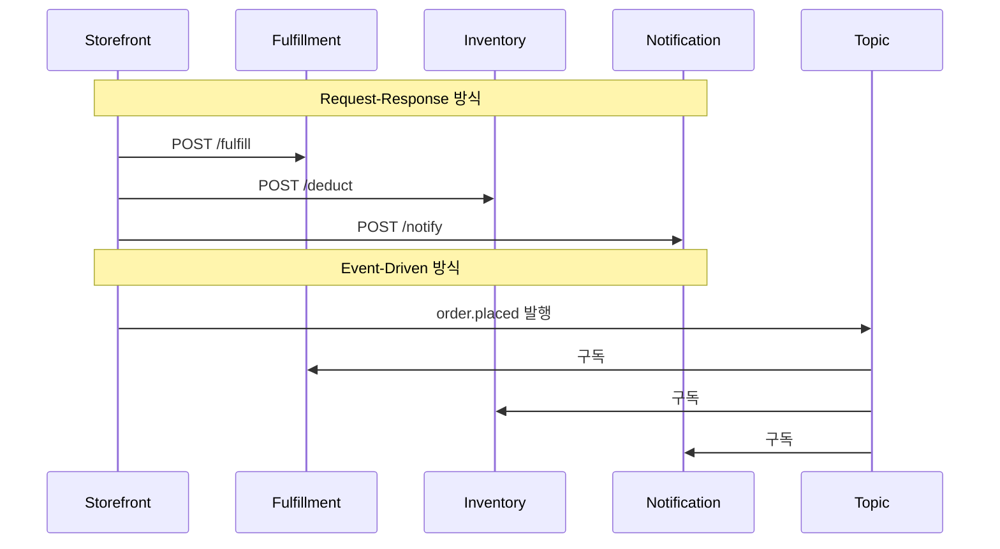
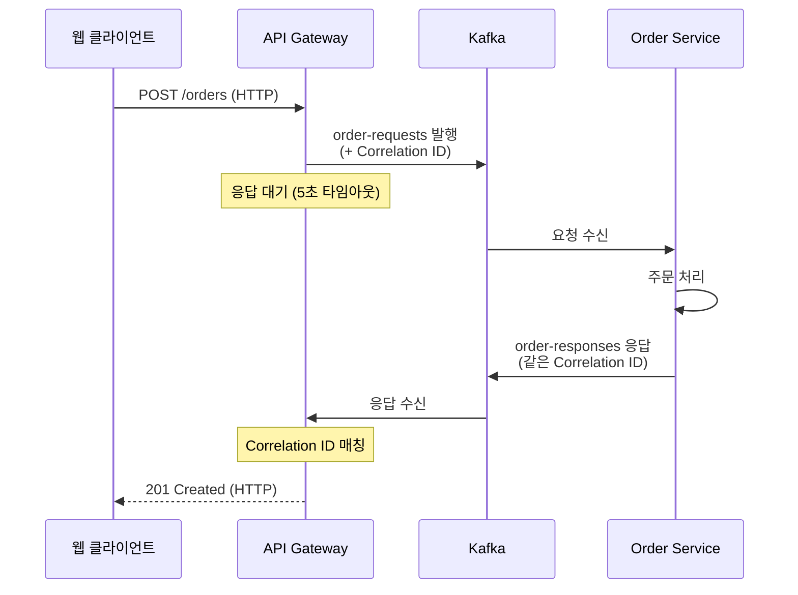
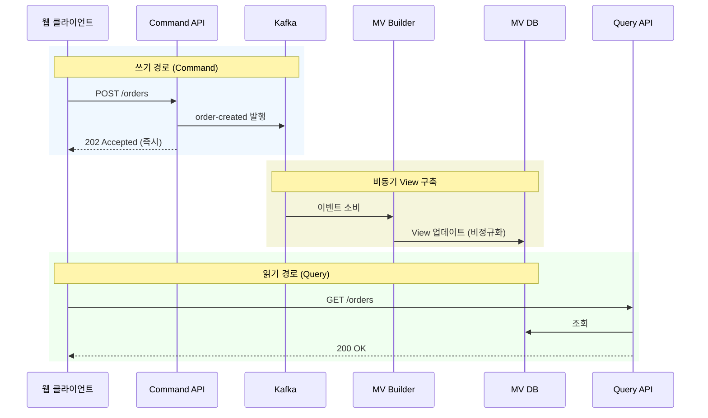
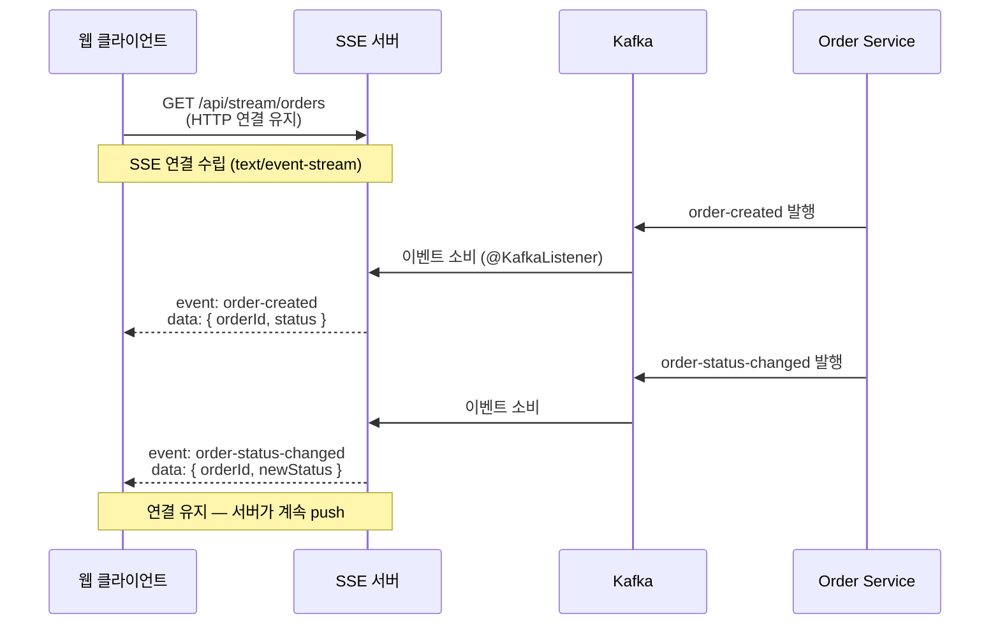
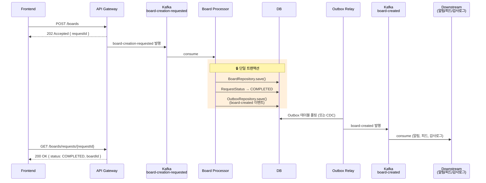
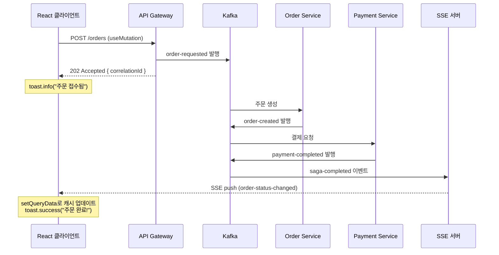

# 10. 이벤트 기반 + 요청-응답 통합 (Request-Response Bridge)

동기 REST API와 비동기 이벤트 시스템을 연결하여 외부 클라이언트와 이벤트 기반 마이크로서비스를 통합하는 패턴

## 실습 목표

- REST API와 Kafka 이벤트를 연결하는 브릿지 패턴 3가지
- ReplyingKafkaTemplate을 사용한 동기식 요청-응답
- CQRS 패턴으로 쓰기/읽기 분리 (Materialized View)
- Server-Sent Events (SSE)로 실시간 이벤트 스트리밍

## 왜 통합이 필요한가?

### 현실적인 문제

대부분의 애플리케이션은 하이브리드 구조를 가집니다:
- 외부 클라이언트는 REST API를 기대 (HTTP 요청 → 즉시 응답)
- 내부 서비스는 이벤트 기반 비동기 통신 (즉시 응답 불가)

**문제**: 두 패러다임을 어떻게 연결할 것인가? 이를 이해하려면 먼저 두 방식의 구조적 차이를 알아야 합니다.

### EDA vs Request-Response — 6가지 구조적 차이

e-commerce 시스템을 예로 들어봅니다. Storefront 서비스가 주문을 생성하면 Fulfillment, Inventory, Notification 서비스가 후속 작업을 처리해야 합니다.



두 방식의 구조적 차이를 6가지 축으로 정리하면 다음과 같다. 각 항목의 상세 비교(코드 예시, 가용성 계산 등)는 [01-why-event-driven.md](./01-why-event-driven.md)을 참조한다.

| 비교 기준 | Request-Response | Event-Driven |
|-----------|-----------------|--------------|
| **Reactivity** | 명시적 호출, 변경 시 호출자 수정 | 이벤트 구독, 발행자 변경 불필요 |
| **Coupling** | 공간+시간 결합 | 공간+시간 디커플링 |
| **Consistency** | 강한 일관성 가능 | 최종 일관성 전제 |
| **Historical State** | 현재 상태만, 감사 로그 별도 | 이벤트 로그가 이력 보존 |
| **Flexibility** | 서비스 추가 시 기존 코드 수정 | 토픽 구독만으로 서비스 추가 |
| **Data Reuse** | 서비스별 DB 격리 | 토픽이 데이터 허브 역할 |

> **실무 원칙**: 대부분의 프로덕션 시스템은 둘을 혼용합니다. 동기 응답이 필요한 API 호출(로그인, 검색)은 Request-Response로, 후속 처리(알림, 분석, 재고 차감)는 EDA로 처리하는 것이 일반적입니다.

### 네 가지 해결 패턴

이 두 방식을 연결하는 브릿지 패턴 4가지와, 각각의 트레이드오프입니다.

| 측면 | ReplyingKafkaTemplate | CQRS + Materialized View | Server-Sent Events | Event-First + Outbox |
|------|----------------------|-------------------------|-------------------|---------------------|
| **응답 방식** | 동기 (타임아웃 내) | 비동기 (쓰기), 동기 (읽기) | 단방향 스트림 | 202 Accepted + Polling |
| **지연시간** | 밀리초~초 | 쓰기: 즉시, 읽기: 즉시 | 실시간 | 수백ms~수초 (비동기) |
| **사용 사례** | 즉시 결과 필요 | 읽기 성능 최적화 | 실시간 대시보드 | 서비스 간 완전 분리 |
| **복잡도** | 낮음 | 높음 (View 관리) | 중간 | 중간 (Outbox + Relay) |
| **확장성** | 제한적 (요청당 대기) | 매우 높음 | 중간 (연결 유지) | 높음 (서비스 독립 확장) |
| **적용 예시** | 결제 승인, 재고 확인 | 주문 목록 조회 | 주문 상태 추적 | 게시판 글쓰기, 주문 생성 |

```
즉시 응답 필요? → 타임아웃 허용(5초 이내) → 패턴 1: ReplyingKafkaTemplate
                → 타임아웃 불가 → Polling API 또는 Webhook

실시간 업데이트? → 양방향 통신 필요 → WebSocket
                 → 단방향 → 패턴 3: Server-Sent Events

읽기 빈도 높음? → 읽기가 쓰기의 100배 → 패턴 2: CQRS + Materialized View
               → 읽기 빈도 낮음 → Direct Query

서비스 간 완전 분리? → Downstream 2개 이상 → 패턴 4: Event-First + Outbox
                     → DB+이벤트 원자성 필요 → 패턴 4: Event-First + Outbox
```

## 패턴 1: ReplyingKafkaTemplate (동기식 요청-응답)

### 개념

클라이언트가 REST 요청을 보내면 API Gateway가 Kafka에 요청 메시지를 발행하고, 응답 토픽에서 결과를 기다립니다. 일정 시간 내에 응답이 오면 클라이언트에게 반환합니다.

### 아키텍처



**핵심 메커니즘**: Gateway가 요청을 Kafka에 발행할 때 **Correlation ID**를 포함하고, 응답 토픽에서 동일한 ID를 가진 메시지를 대기합니다. Service가 처리 후 같은 ID로 응답을 발행하면 Gateway가 이를 매칭하여 HTTP 응답으로 변환합니다.

### 코드 구현

#### API Gateway (ReplyingKafkaTemplate)

```java
@RestController
@RequestMapping("/api/orders")
@RequiredArgsConstructor
@Slf4j
public class OrderGatewayController {

    private final ReplyingKafkaTemplate<String, OrderRequest, OrderResponse> replyingKafkaTemplate;

    @PostMapping
    public ResponseEntity<OrderResponse> createOrder(@RequestBody CreateOrderRequest request)
            throws ExecutionException, InterruptedException, TimeoutException {

        String correlationId = UUID.randomUUID().toString();
        OrderRequest kafkaRequest = OrderRequest.builder()
                .correlationId(correlationId)
                .userId(request.getUserId())
                .productId(request.getProductId())
                .quantity(request.getQuantity())
                .totalAmount(request.getTotalAmount())
                .timestamp(Instant.now())
                .build();

        ProducerRecord<String, OrderRequest> producerRecord =
                new ProducerRecord<>("order-requests", correlationId, kafkaRequest);
        producerRecord.headers().add(
                new RecordHeader(KafkaHeaders.REPLY_TOPIC, "order-responses".getBytes())
        );

        // 요청 발행 + 응답 대기 (5초 타임아웃)
        RequestReplyFuture<String, OrderRequest, OrderResponse> future =
                replyingKafkaTemplate.sendAndReceive(producerRecord);

        try {
            ConsumerRecord<String, OrderResponse> consumerRecord =
                    future.get(5, TimeUnit.SECONDS);

            OrderResponse response = consumerRecord.value();

            return ResponseEntity.status(HttpStatus.CREATED).body(response);

        } catch (TimeoutException e) {
            log.error("Request timeout: correlationId={}", correlationId, e);
            throw new ServiceTimeoutException("Order service did not respond in time");
        }
    }
}
```

**왜 타임아웃을 설정하는가?**
클라이언트는 무한정 기다릴 수 없습니다. 5초 이내에 응답이 없으면 타임아웃 예외를 발생시켜 503 Service Unavailable을 반환합니다.

#### Order Service (요청 처리 및 응답)

```java
@Service
@RequiredArgsConstructor
@Slf4j
public class OrderProcessingService {

    private final OrderRepository orderRepository;

    @Transactional
    @KafkaListener(
            topics = "order-requests",
            groupId = "order-service"
    )
    @SendTo  // 응답을 요청 메시지의 REPLY_TOPIC으로 발행
    public OrderResponse processOrderRequest(OrderRequest request) {
        Order order = Order.builder()
                .orderId(UUID.randomUUID().toString())
                .userId(request.getUserId())
                .productId(request.getProductId())
                .quantity(request.getQuantity())
                .totalAmount(request.getTotalAmount())
                .status(OrderStatus.PENDING)
                .createdAt(Instant.now())
                .build();

        orderRepository.save(order);

        return OrderResponse.builder()
                .correlationId(request.getCorrelationId())
                .orderId(order.getOrderId())
                .status(order.getStatus().name())
                .createdAt(order.getCreatedAt())
                .build();
    }
}
```

**@SendTo 어노테이션의 역할**:
메서드 반환값이 요청 메시지의 `REPLY_TOPIC` 헤더로 지정된 토픽에 자동 발행됩니다.

### 제약: 단일 서비스 처리에만 적합

ReplyingKafkaTemplate은 **요청 토픽 → 단일 서비스 처리 → 응답 토픽** 구조를 전제로 합니다. 만약 처리가 여러 토픽을 거치는 파이프라인(주문 → 결제 → 재고 차감)이라면 세 가지 문제가 생깁니다.

**타임아웃 폭발**: 파이프라인 총 지연 = 각 서비스 지연의 합입니다. 서비스 하나만 느려져도 5초 타임아웃을 초과합니다. 외부 PG 연동처럼 지연이 불확실한 단계가 끼면 타임아웃 설정 자체가 어려워집니다.

**Correlation ID 전파 부담**: 모든 중간 서비스가 Kafka 헤더의 Correlation ID와 REPLY_TOPIC을 다음 토픽으로 복사해야 합니다. `@SendTo`는 바로 응답 토픽에 쓰려고 하므로, 중간 단계에서는 수동으로 헤더를 전달하면서 다음 토픽에 발행해야 합니다. 파이프라인 참여 서비스 전체가 이 프로토콜에 결합됩니다.

**부분 실패 블랙박스**: Gateway는 타임아웃만 받을 뿐, 어느 단계에서 실패했는지 알 수 없습니다. 1단계(주문)가 성공한 후 2단계(결제)에서 실패하면 보상 트랜잭션이 필요하지만, ReplyingKafkaTemplate에는 그런 메커니즘이 없습니다.

```
단일 서비스 처리  → ReplyingKafkaTemplate ✅
파이프라인/Saga   → 패턴 2 (202 Accepted + CQRS/SSE)로 전환
```

### 타임아웃 에러 처리

Gateway Controller에서 던진 `TimeoutException`을 `@ExceptionHandler`로 잡아 503 응답으로 변환합니다.

```java
@ExceptionHandler(TimeoutException.class)
public ResponseEntity<ErrorResponse> handleTimeout(TimeoutException e) {
    ErrorResponse error = ErrorResponse.builder()
            .code("TIMEOUT")
            .message("The request did not complete in time. Please try again later.")
            .timestamp(Instant.now())
            .build();

    return ResponseEntity.status(HttpStatus.SERVICE_UNAVAILABLE).body(error);
}
```

## 패턴 2: CQRS + Materialized View

### 개념

Command와 Query를 분리:
- **쓰기(Command)**: REST API가 Kafka 이벤트를 발행하고 즉시 202 Accepted 반환
- **읽기(Query)**: 별도 서비스가 이벤트를 구독하여 로컬 DB에 Materialized View 생성, REST API가 이 View를 조회

### 아키텍처



### CQRS 없이 처리하면?

CQRS를 쓰지 않는 전통적 구조에서는 하나의 API + 하나의 DB가 쓰기와 읽기를 모두 담당합니다.

```java
// 동기 단일 DB 방식 — 단순하고 즉시 일관성 보장
@PostMapping
public ResponseEntity<Order> createOrder(@RequestBody CreateOrderRequest req) {
    Order order = orderService.create(req);  // DB INSERT
    return ResponseEntity.status(HttpStatus.CREATED).body(order);
}

@GetMapping("/{orderId}")
public ResponseEntity<Order> getOrder(@PathVariable String orderId) {
    return ResponseEntity.ok(orderService.findById(orderId));  // 같은 DB SELECT
}
```

단순하고 POST 직후 GET하면 바로 데이터가 보입니다. 하지만 EDA를 도입하면서 비동기 쓰기(`DB INSERT + Kafka 발행`)를 같은 DB에서 읽으려 하면 한계가 드러납니다.

**읽기 최적화 불가**: 주문 목록 화면에 `주문번호, 상품명, 사용자명, 결제상태`를 보여주려면 매 조회마다 3~4테이블 JOIN이 필요합니다. CQRS는 이벤트 소비 시점에 미리 JOIN하여 비정규화된 View를 만들어 두므로, 조회는 단일 테이블 SELECT로 끝납니다.

```sql
-- CQRS 없이: 매 조회마다 JOIN
SELECT o.order_id, p.name, u.username, pay.status
FROM orders o JOIN products p ON ... JOIN users u ON ... JOIN payments pay ON ...

-- CQRS: 비정규화 View
SELECT order_id, product_name, user_name, payment_status FROM order_view
```

**독립 확장 불가**: 쓰기 1,000 TPS + 읽기 100,000 TPS가 같은 DB에 몰립니다. CQRS에서는 Command DB(PostgreSQL)와 Query DB(Redis, Elasticsearch)를 분리하여 각각 스케일 아웃합니다.

**Dual Write 문제**: `orderService.create(req)` + `kafkaTemplate.send(...)` 를 순서대로 호출하면, DB INSERT는 성공했는데 Kafka 발행이 실패하는 경우가 생깁니다. DB에는 주문이 있지만 하류 서비스(결제, 재고)는 이 주문을 모르게 됩니다. CQRS에서는 Outbox 패턴(`08-outbox-cdc.md`)으로 DB 쓰기와 이벤트 발행의 원자성을 보장합니다.

| | 동기 단일 DB | CQRS + Materialized View |
|---|---|---|
| **일관성** | 즉시 | 최종 일관성 |
| **읽기 성능** | JOIN 필요 | 비정규화 View, JOIN 없음 |
| **확장성** | 쓰기+읽기 동일 DB | 독립 확장 |
| **Dual Write** | 없음 | Outbox로 해결 |
| **복잡도** | 낮음 | 높음 |

> 트래픽이 적고 읽기/쓰기 비율이 비슷하다면 굳이 CQRS가 필요 없습니다. 읽기가 압도적이거나 읽기 모델이 쓰기 모델과 크게 다를 때(다수 JOIN, 검색 기능) CQRS의 복잡도를 감수할 가치가 생깁니다.

### 코드 구현

#### Command API (쓰기)

```java
@RestController
@RequestMapping("/api/commands/orders")
@RequiredArgsConstructor
@Slf4j
public class OrderCommandController {

    private final KafkaTemplate<String, OrderEvent> kafkaTemplate;

    @PostMapping
    public ResponseEntity<CommandResponse> createOrder(@RequestBody CreateOrderRequest request) {
        String orderId = UUID.randomUUID().toString();

        OrderEvent event = OrderEvent.builder()
                .eventId(UUID.randomUUID().toString())
                .eventType("order-created")
                .orderId(orderId)
                .userId(request.getUserId())
                .productId(request.getProductId())
                .quantity(request.getQuantity())
                .totalAmount(request.getTotalAmount())
                .timestamp(Instant.now())
                .build();

        kafkaTemplate.send("order-events", orderId, event);

        CommandResponse response = CommandResponse.builder()
                .orderId(orderId)
                .message("Order is being processed")
                .build();

        return ResponseEntity.status(HttpStatus.ACCEPTED).body(response);
    }
}
```

#### Materialized View Builder

```java
@Entity
@Table(name = "order_view")
@Data
@Builder
public class OrderView {

    @Id
    private String orderId;

    private String userId;
    private String productId;
    private Integer quantity;
    private BigDecimal totalAmount;
    private String status;

    private Instant createdAt;
    private Instant updatedAt;

    // 비정규화: 관련 정보 포함
    private String userName;
    private String productName;
    private BigDecimal productPrice;
}
```

```java
@Service
@RequiredArgsConstructor
@Slf4j
public class OrderViewBuilder {

    private final OrderViewRepository orderViewRepository;
    private final UserServiceClient userServiceClient;
    private final ProductServiceClient productServiceClient;

    @Transactional
    @KafkaListener(
            topics = "order-events",
            groupId = "order-view-builder"
    )
    public void buildOrderView(OrderEvent event) {
        switch (event.getEventType()) {
            case "order-created":
                createOrderView(event);
                break;

            case "order-status-changed":
                updateOrderStatus(event);
                break;
        }
    }

    private void createOrderView(OrderEvent event) {
        // 추가 정보 조회 (비정규화)
        String userName = userServiceClient.getUserName(event.getUserId());
        ProductInfo productInfo = productServiceClient.getProduct(event.getProductId());

        OrderView view = OrderView.builder()
                .orderId(event.getOrderId())
                .userId(event.getUserId())
                .productId(event.getProductId())
                .quantity(event.getQuantity())
                .totalAmount(event.getTotalAmount())
                .status("PENDING")
                .createdAt(event.getTimestamp())
                .updatedAt(event.getTimestamp())
                .userName(userName)
                .productName(productInfo.getName())
                .productPrice(productInfo.getPrice())
                .build();

        orderViewRepository.save(view);
    }

    private void updateOrderStatus(OrderEvent event) {
        OrderView view = orderViewRepository.findById(event.getOrderId())
                .orElseThrow(() -> new OrderViewNotFoundException(event.getOrderId()));

        view.setStatus(event.getNewStatus());
        view.setUpdatedAt(event.getTimestamp());

        orderViewRepository.save(view);
    }
}
```

#### Query API (읽기)

```java
@RestController
@RequestMapping("/api/queries/orders")
@RequiredArgsConstructor
@Slf4j
public class OrderQueryController {

    private final OrderViewRepository orderViewRepository;

    @GetMapping("/{orderId}")
    public ResponseEntity<OrderView> getOrder(@PathVariable String orderId) {
        Optional<OrderView> viewOpt = orderViewRepository.findById(orderId);

        if (viewOpt.isEmpty()) {
            // View가 아직 생성되지 않았을 수 있음 (이벤트 지연)
            return ResponseEntity.status(HttpStatus.ACCEPTED)
                    .header("Retry-After", "2")  // 2초 후 재시도 권장
                    .body(null);
        }

        return ResponseEntity.ok(viewOpt.get());
    }

    @GetMapping
    public ResponseEntity<List<OrderView>> listOrders(
            @RequestParam(required = false) String userId,
            @RequestParam(defaultValue = "0") int page,
            @RequestParam(defaultValue = "20") int size) {

        Pageable pageable = PageRequest.of(page, size, Sort.by("createdAt").descending());

        Page<OrderView> orders = (userId != null)
                ? orderViewRepository.findByUserId(userId, pageable)
                : orderViewRepository.findAll(pageable);

        return ResponseEntity.ok(orders.getContent());
    }
}
```

> Read-Your-Own-Writes 문제(비동기 쓰기 직후 조회 시 데이터 미반영)와 4가지 해결 패턴은 [§Read-Your-Own-Writes](#read-your-own-writes-비동기-쓰기-후-즉시-조회-문제)에서 별도로 다룬다.

## 패턴 3: Server-Sent Events (SSE)

### 개념

클라이언트가 HTTP 연결을 열면 서버가 Kafka 이벤트를 실시간으로 스트리밍합니다. WebSocket과 달리 단방향 스트림이며, 표준 HTTP 프로토콜을 사용합니다.

### 아키텍처



### 코드 구현

#### SSE Controller (Spring WebFlux)

```java
@RestController
@RequestMapping("/api/stream")
@RequiredArgsConstructor
@Slf4j
public class OrderStreamController {

    private final Sinks.Many<OrderEvent> eventSink = Sinks.many().multicast().onBackpressureBuffer();

    @GetMapping(value = "/orders", produces = MediaType.TEXT_EVENT_STREAM_VALUE)
    public Flux<ServerSentEvent<OrderEvent>> streamOrders(
            @RequestParam(required = false) String userId) {

        Flux<OrderEvent> eventFlux = eventSink.asFlux();

        // userId 필터링 (선택)
        if (userId != null) {
            eventFlux = eventFlux.filter(event -> userId.equals(event.getUserId()));
        }

        return eventFlux
                .map(event -> ServerSentEvent.<OrderEvent>builder()
                        .id(event.getEventId())
                        .event(event.getEventType())
                        .data(event)
                        .build())
                .doOnCancel(() -> log.info("SSE stream closed: userId={}", userId));
    }

    @KafkaListener(
            topics = "order-events",
            groupId = "sse-broadcaster"
    )
    public void broadcastEvent(OrderEvent event) {
        eventSink.tryEmitNext(event);
    }
}
```

**Sinks.Many의 역할**:
Hot Publisher입니다. Kafka에서 이벤트를 받으면 연결된 모든 SSE 클라이언트에게 브로드캐스트합니다.

#### 클라이언트 (JavaScript)

```html
<!DOCTYPE html>
<html>
<head>
    <title>Order Stream</title>
</head>
<body>
    <h1>Real-time Order Stream</h1>
    <div id="events"></div>

    <script>
        const eventSource = new EventSource('http://localhost:8080/api/stream/orders?userId=user-123');

        eventSource.addEventListener('order-created', (event) => {
            const order = JSON.parse(event.data);
            console.log('Order created:', order);

            const div = document.getElementById('events');
            div.innerHTML += `<p>Order ${order.orderId} created - ${order.productId} x ${order.quantity}</p>`;
        });

        eventSource.addEventListener('order-status-changed', (event) => {
            const update = JSON.parse(event.data);
            console.log('Order status changed:', update);

            const div = document.getElementById('events');
            div.innerHTML += `<p>Order ${update.orderId} → ${update.newStatus}</p>`;
        });

        eventSource.onerror = (error) => {
            console.error('SSE error:', error);
            eventSource.close();
        };
    </script>
</body>
</html>
```

**EventSource API**:
브라우저 네이티브 API로 SSE를 지원합니다. WebSocket과 달리 자동 재연결, 이벤트 타입별 리스너 등의 기능이 내장되어 있습니다.

### 국내 SSE 적용 사례

이 문서에서 다룬 SSE 패턴이 국내 서비스에서 어떻게 적용되고 있는지 살펴봅니다.

**Flex(플렉스)**는 결재 승인, 출퇴근 기록 등 실시간 알림이 필요해졌을 때 SSE를 선택했습니다. B2B 고객사 프록시가 WebSocket/HTTP2를 지원하지 않는 경우가 많았기 때문입니다. 핵심은 **Service Worker를 SSE 서버와 브라우저 사이 프록시로 배치**하여 여러 탭이 하나의 TCP 연결만 사용하도록 한 것입니다. 모든 이벤트는 CloudEvents 인터페이스 + Avro 스키마로 정의하여 AWS Glue Schema Registry에 등록하고, TypeScript 인터페이스를 자동 생성합니다. 다중 서버 간 이벤트 전파에는 NATS 메시지 브로커를 사용합니다.

**우아한형제들**은 Spring WebFlux + Kotlin Coroutine 환경에서 SSE를 구현했습니다. 클라이언트가 `Last-Event-ID` 헤더와 함께 `text/event-stream`으로 연결하면, 서버가 Coroutine Flow로 응답합니다. 재연결 시 Last-Event-ID 기반으로 미전달 이벤트를 재전송하여 메시지 유실을 방지합니다.

**펜타시큐리티**는 SSE 연결이 특정 서버에 맺어져 있어 다른 서버에서 발생한 이벤트가 누락되는 문제를 Hazelcast Topic으로 해결했습니다. 서버 간 이벤트를 브로드캐스팅하여 어떤 서버에 연결된 클라이언트든 모든 이벤트를 수신할 수 있게 했습니다.

세 사례의 다중 서버 전략이 각각 다릅니다: Flex는 NATS, 우아한형제들은 Redis Pub/Sub(추정), 펜타시큐리티는 Hazelcast Topic. 도구는 달라도 "서버 간 이벤트 브로드캐스팅"이라는 패턴은 동일합니다.

> **참고**: [Flex — SSE 1개로 끝내는 전략](https://flex.team/blog/2025/10/23/serversentevents/) · [우아한형제들 — SSE로 실시간 알림 전달하기](https://techblog.woowahan.com/23199/) · [펜타시큐리티 — 다중 서버 SSE + Hazelcast](https://medium.com/tech-pentasecurity/sse를-활용한-다중서버-환경에서의-실시간-알람-기능-feat-hazelcast-topic-73ce4797f321)

## 패턴 4: Event-First (202 + Polling) + Outbox

### 개념

API 경계에서는 **Event-First(202 + Polling)**로 서비스 간 완전 분리를 달성하고, Processor 내부에서는 **Outbox 패턴**으로 DB 저장과 이벤트 발행의 원자성을 보장하는 구조입니다. 패턴 1~3이 "동기 세계와 비동기 세계를 어떻게 연결할까"에 초점을 맞춘다면, 패턴 4는 "**처음부터 비동기로 설계하되, 프론트엔드 UX와 데이터 정합성을 어떻게 보장할까**"에 초점을 맞춥니다.

### 아키텍처



이 구조는 두 가지 핵심 문제를 동시에 해결합니다:

1. **API 경계**: 프론트엔드는 202 응답만 받고, requestId로 Polling하여 결과를 확인합니다. API Gateway와 Processor가 완전히 분리되어 독립 배포·확장이 가능합니다.
2. **Processor 내부**: Board 저장, 요청 상태 갱신, Outbox 저장을 같은 트랜잭션으로 묶어 Dual-Write 문제를 원천 차단합니다.

### Dual-Write 문제와 Outbox 패턴

Processor가 Board를 DB에 저장한 뒤 Kafka에 `board-created`를 직접 발행하면, 두 시스템에 동시에 쓰는 **Dual-Write** 문제가 발생합니다. DB 커밋은 성공했는데 Kafka 발행이 실패하면 downstream 서비스는 게시글이 생성된 사실을 영원히 모릅니다.

Outbox 패턴은 이 문제를 **하나의 트랜잭션으로 축소**합니다:

```java
@Transactional
public void processCreateBoard(BoardCreationRequested event) {
    // 1. 게시글 저장
    Board board = boardRepository.save(
        Board.create(event.getTitle(), event.getContent(), event.getAuthorId())
    );

    // 2. 요청 상태 갱신 → 프론트엔드 Polling 응답용
    requestStatusRepository.updateStatus(
        event.getRequestId(), RequestStatus.COMPLETED, board.getId()
    );

    // 3. Outbox에 downstream 이벤트 저장 (같은 TX)
    outboxRepository.save(
        OutboxEvent.of("board-created", board.getId(), BoardCreatedPayload.from(board))
    );
    // → TX 커밋 시 1, 2, 3이 모두 성공하거나 모두 롤백
}
```

Outbox Relay(별도 프로세스)가 Outbox 테이블을 폴링하거나 CDC(Debezium)로 변경을 감지하여 Kafka에 `board-created` 이벤트를 발행합니다. Relay가 실패해도 Outbox 행은 DB에 남아 있으므로 재시도 시 발행됩니다. 상세 패턴은 `08-outbox-cdc.md`에서 다룹니다.

### 각 레이어의 역할

| 레이어 | 역할 | 해결하는 문제 |
|--------|------|-------------|
| **API 경계** (202 + Polling) | 프론트엔드와 백엔드 분리 | 비동기 처리의 UX — 클라이언트는 requestId로 상태 폴링 |
| **Processor 내부** (단일 TX) | Board 저장 + Outbox 저장 원자성 | Dual-Write — DB와 Kafka 간 정합성 |
| **Outbox Relay** | Outbox → Kafka 발행 | 이벤트 발행 신뢰성 — at-least-once 보장 |
| **Downstream Consumer** | 알림, 피드, 감사로그 등 | 서비스 간 디커플링 — Processor는 downstream을 모름 |

### 202 + Retry-After: 비동기 처리의 범용 Polling 패턴

`202 + Retry-After`는 CQRS나 특정 아키텍처에 종속되지 않는 **비동기 처리 전반의 범용 패턴**입니다. 서버가 "아직 처리 중이니 N초 후에 다시 확인하세요"라고 알려주는 HTTP 표준 방식입니다.

서버 측 Polling 엔드포인트:

```java
@GetMapping("/boards/requests/{requestId}")
public ResponseEntity<?> getRequestStatus(@PathVariable String requestId) {
    RequestStatus status = requestStatusRepository.findById(requestId)
            .orElseThrow(() -> new NotFoundException("Request not found"));

    return switch (status.getStatus()) {
        case PROCESSING -> ResponseEntity.status(HttpStatus.ACCEPTED)
                .header("Retry-After", "2")  // 2초 후 재시도 권장
                .body(Map.of("status", "PROCESSING"));
        case COMPLETED -> ResponseEntity.ok(
                Map.of("status", "COMPLETED", "boardId", status.getResultId()));
        case FAILED -> ResponseEntity.ok(
                Map.of("status", "FAILED", "reason", status.getFailReason()));
    };
}
```

클라이언트는 `Retry-After` 헤더를 읽어 폴링 간격을 조절합니다:

```typescript
// React Query 예시
const { mutate: createBoard } = useMutation({
  mutationFn: (data: CreateBoardRequest) =>
    api.post('/boards', data),  // → 202 { requestId }
  onSuccess: ({ requestId }) => {
    queryClient.invalidateQueries({ queryKey: ['boardRequest', requestId] });
  }
});

const { data: requestStatus } = useQuery({
  queryKey: ['boardRequest', requestId],
  queryFn: async () => {
    const res = await api.get(`/boards/requests/${requestId}`);
    const retryAfter = res.headers?.['retry-after'];
    if (retryAfter) res.data._retryAfter = Number(retryAfter) * 1000;
    return res.data;
  },
  refetchInterval: (query) => {
    const data = query.state.data;
    if (data?.status === 'COMPLETED' || data?.status === 'FAILED') return false;
    return data?._retryAfter ?? 2000;  // 서버 권장 간격 또는 기본 2초
  },
  enabled: !!requestId,
});
```

이 패턴은 게시판 글쓰기뿐 아니라 **주문 처리, 파일 업로드, 결제 승인, 배치 작업** 등 비동기 처리 후 결과를 확인해야 하는 모든 경우에 동일하게 적용됩니다.

### 실패 처리

Processor에서 예외가 발생하면 RequestStatus를 FAILED로 갱신합니다. 프론트엔드는 폴링 결과로 실패를 감지합니다:

```java
@Transactional
public void processCreateBoard(BoardCreationRequested event) {
    try {
        Board board = boardRepository.save(/* ... */);
        requestStatusRepository.updateStatus(event.getRequestId(), COMPLETED, board.getId());
        outboxRepository.save(/* ... */);
    } catch (Exception e) {
        requestStatusRepository.updateStatus(event.getRequestId(), FAILED, null);
        // Outbox에 실패 이벤트 저장 (보상이 필요한 경우)
    }
}
```

```
GET /boards/requests/{requestId}
→ { "status": "FAILED", "reason": "DUPLICATE_TITLE" }
→ 프론트엔드: 에러 메시지 표시 + 재시도 버튼
```

### 패턴 4가 적합한 경우

- **쓰기 결과를 즉시 보여줄 필요 없는 경우** — 글쓰기 후 "작성 중..." 표시가 허용됨
- **Downstream 서비스가 2개 이상** — 알림, 피드, 검색 인덱싱 등 후속 처리가 많을수록 이벤트 기반의 이점이 커짐
- **서비스 간 결합을 끊고 싶은 경우** — Board Processor는 downstream 서비스의 존재를 모름
- **DB + 이벤트 발행의 원자성이 필요한 경우** — Outbox로 Dual-Write 방지

반면 **쓰기 즉시 본인이 조회해야 하는 경우**(Read-Your-Own-Writes)에는 패턴 2의 "동기 쓰기 + 비동기 부수효과" 방식이 더 적합합니다.

## Read-Your-Own-Writes: 비동기 쓰기 후 즉시 조회 문제

비동기 쓰기(`POST → Kafka 발행 → 202 Accepted`)를 사용하면, Consumer가 DB에 적재하기 전에 클라이언트가 조회하여 데이터가 없는 상황이 생길 수 있습니다. 이를 해결하는 패턴이 4가지 있습니다.

**먼저 판단할 것**: 주요 데이터의 쓰기 자체를 비동기로 할 필요가 있는가? 대부분의 CRUD(게시판, 댓글)는 **동기 쓰기 + 비동기 사이드이펙트**로 충분합니다.

```java
// 가장 실용적: 동기 쓰기 + 비동기 사이드이펙트
@PostMapping
public ResponseEntity<Post> createPost(@RequestBody CreatePostRequest req) {
    Post post = postService.create(req);                              // 1. DB INSERT (동기)
    kafkaTemplate.send("post-events", post.getId(), toEvent(post));   // 2. 사이드이펙트 (비동기)
    return ResponseEntity.status(HttpStatus.CREATED).body(post);      // 3. 즉시 반환
}
// → 알림, 검색 인덱싱, 통계는 비동기이지만, 글 자체는 DB에 있으므로 조회 문제 없음
```

트래픽이 매우 높아 비동기 쓰기가 필요한 경우, 아래 4가지로 Read-Your-Own-Writes를 보장합니다.

### 1) Command 응답에 데이터 포함

POST 응답에 생성된 리소스를 담아 반환하면, 클라이언트는 DB 조회 없이 이미 데이터를 갖고 있습니다.

```java
@PostMapping
public ResponseEntity<PostResponse> createPost(@RequestBody CreatePostRequest req) {
    String postId = UUID.randomUUID().toString();
    kafkaTemplate.send("post-events", postId, PostEvent.of(postId, req));

    // 아직 DB에 없지만, 응답에 데이터를 포함
    return ResponseEntity.status(HttpStatus.ACCEPTED).body(
        PostResponse.builder().postId(postId).title(req.getTitle())
            .content(req.getContent()).status("PROCESSING").build()
    );
}
```

프론트엔드에서는 이 응답 데이터를 캐시에 주입하여 상세 페이지로 즉시 이동할 수 있습니다. 새로고침 시 아직 DB에 없으면 위의 `202 + Retry-After`가 동작합니다.

### 2) Write-Ahead Cache (선행 캐시)

Kafka 발행과 동시에 Redis에 먼저 쓰고, Query 측은 DB에 없으면 Redis를 확인합니다.

```java
// Command 측: Redis + Kafka 동시 쓰기
redisTemplate.opsForValue().set("post:" + postId, response, Duration.ofMinutes(5));
kafkaTemplate.send("post-events", postId, event);

// Query 측: DB → Redis 순서로 조회
Optional<Post> dbPost = postRepository.findById(postId);
if (dbPost.isPresent()) return ResponseEntity.ok(from(dbPost.get()));

PostResponse cached = redisTemplate.opsForValue().get("post:" + postId);
if (cached != null) return ResponseEntity.ok(cached);

return ResponseEntity.notFound().build();
```

다른 사용자도 즉시 데이터를 볼 수 있다는 점에서 가장 강력하지만, Redis 관리 복잡도가 증가합니다.

### 3) Optimistic UI

프론트엔드에서 해결하는 방식입니다. 서버 응답을 기다리지 않고 UI를 즉시 반영한 후 SSE/Polling으로 보정합니다. 이 문서의 [§프론트엔드 통합](#프론트엔드-통합-react-query로-eda-응답-처리하기) 패턴 D에서 상세히 다룹니다.

### 4) 202 + Retry-After

비동기 처리 전반에 적용되는 범용 Polling 패턴입니다. 상세 구현은 [§202 + Retry-After](#202--retry-after-비동기-처리의-범용-polling-패턴)에서 다룹니다.

### 선택 기준

| 패턴 | 복잡도 | 누가 즉시 보는가 | 적합한 경우 |
|------|-------|----------------|------------|
| 동기 쓰기 + 비동기 사이드이펙트 | 낮음 | 전체 | 게시판, 댓글, 대부분의 CRUD |
| 응답에 데이터 포함 | 낮음 | 작성자 본인 | 글 작성 후 상세 페이지 이동 |
| Write-Ahead Cache | 중간 | 전체 | 실시간 피드, 채팅 |
| Optimistic UI | 중간 | 작성자 본인 | 좋아요, 장바구니 |
| 202 + Retry-After | 낮음 | 지연 허용 | 주문 처리, 비동기 작업 |

## 프론트엔드 통합: React Query로 EDA 응답 처리하기

위 3가지 패턴은 모두 **백엔드** 관점입니다. 그런데 실제로 사용자가 "주문하기" 버튼을 누르는 **프론트엔드**에서는 어떻게 처리해야 할까요?

### REST vs EDA: 프론트엔드 개발자가 겪는 패러다임 전환

#### REST에서의 익숙한 패턴

```
사용자: "주문하기" 클릭
→ POST /orders
→ 200 OK { orderId: "123", status: "COMPLETED" }
→ 토스트: "주문이 완료되었습니다!"
```

`useMutation`의 `onSuccess`에서 토스트를 띄우면 끝입니다. API 응답 = 최종 결과이기 때문입니다.

#### EDA에서의 현실

```
사용자: "주문하기" 클릭
→ POST /orders
→ 202 Accepted { correlationId: "abc-123" }
→ 토스트: "주문이 ???되었습니다!"  ← 아직 모름!

(백그라운드)
→ 주문 서비스: 주문 생성 이벤트 발행
→ 결제 서비스: 결제 처리 이벤트 발행
→ 재고 서비스: 재고 차감 이벤트 발행
→ ... (수 초 ~ 수십 초 후)
→ 최종 결과: 성공 or 실패
```

**핵심 문제**: 202 Accepted는 "요청을 받았다"는 뜻이지, "주문이 완료되었다"는 뜻이 아닙니다. 프론트엔드는 Saga의 최종 결과를 어떻게 알 수 있을까요?

### 4가지 프론트엔드 응답 패턴

| 패턴 | 응답 시점 | React Query 활용 | 적합한 경우 | 대표 시나리오 |
|------|----------|-----------------|------------|-------------|
| **Sync Gateway** | 즉시 (타임아웃 내) | `useMutation` | 단순 명령, 결과 즉시 필요 | 재고 확인, 단일 서비스 |
| **Polling** | 주기적 조회 | `useQuery` + `refetchInterval` | 상태 조회 페이지 | 주문 내역 페이지 |
| **SSE** | 서버 push | `useEffect` + `setQueryData` | 실시간 알림 | 주문/결제, 실시간 대시보드 |
| **Optimistic + 보정** | 즉시 (추정) | `useMutation` + `onMutate` | 좋아요, 장바구니 | 좋아요/북마크 |

> 선택 기준: 즉시 결과 필요 + 동기 응답 가능 → Sync Gateway / 즉시 결과 필요 + 비동기 → Optimistic + SSE 보정 / 실시간 push → SSE / 지연 허용 → Polling

#### 패턴 A: Sync Gateway — 백엔드가 기다려주는 경우

위의 ReplyingKafkaTemplate 패턴을 사용하면, 백엔드 Gateway가 Kafka 응답을 기다린 후 HTTP 응답을 반환합니다. 프론트엔드 입장에서는 일반 REST API와 동일하게 느껴집니다.

```tsx
function useCreateOrder() {
  const queryClient = useQueryClient();

  return useMutation({
    mutationFn: (order: CreateOrderRequest) =>
      api.post<OrderResponse>('/api/orders', order),

    onSuccess: (data) => {
      // 백엔드가 Kafka 응답까지 기다린 후 반환했으므로
      // 이 시점에서 주문은 실제로 생성된 상태
      queryClient.invalidateQueries({ queryKey: ['orders'] });
      toast.success(`주문 ${data.orderId}이 완료되었습니다`);
    },

    onError: (error) => {
      if (error.status === 503) {
        toast.error('서비스가 응답하지 않습니다. 잠시 후 다시 시도해주세요.');
      } else {
        toast.error('주문에 실패했습니다.');
      }
    },
  });
}
```

**장점**: 프론트엔드 코드가 단순합니다. REST와 차이 없음.
**단점**: 백엔드 타임아웃(5초) 동안 사용자가 로딩 스피너를 봐야 합니다. Saga처럼 여러 서비스를 거치는 긴 처리에는 부적합합니다.

#### 패턴 B: Polling — 주기적으로 상태 확인

CQRS 패턴과 함께 사용합니다. API 호출 후 `correlationId`를 받고, 주기적으로 상태를 조회합니다.

```tsx
// 1단계: 주문 요청 (202 Accepted + correlationId 반환)
function useCreateOrder() {
  return useMutation({
    mutationFn: (order: CreateOrderRequest) =>
      api.post<{ correlationId: string }>('/api/commands/orders', order),

    onSuccess: (data) => {
      toast.info('주문을 처리하고 있습니다...');
      // correlationId를 상태로 저장 → Polling 시작 트리거
    },
  });
}

// 2단계: 상태 Polling (correlationId가 있을 때만 활성화)
function useOrderStatus(correlationId: string | null) {
  return useQuery({
    queryKey: ['order-status', correlationId],
    queryFn: () =>
      api.get<OrderStatus>(`/api/queries/orders/status/${correlationId}`),

    enabled: !!correlationId,       // correlationId 있을 때만 실행
    refetchInterval: 2000,          // 2초마다 재조회
    refetchIntervalInBackground: false, // 탭 비활성 시 중지
  });
}

// 3단계: 컴포넌트에서 조합
function OrderButton() {
  const [correlationId, setCorrelationId] = useState<string | null>(null);
  const createOrder = useCreateOrder();
  const { data: status } = useOrderStatus(correlationId);

  // 상태 변화 감지 → 토스트 + Polling 중지
  useEffect(() => {
    if (!status) return;

    if (status.state === 'COMPLETED') {
      toast.success(`주문이 완료되었습니다! 주문번호: ${status.orderId}`);
      setCorrelationId(null);  // Polling 중지
    } else if (status.state === 'FAILED') {
      toast.error(`주문 실패: ${status.reason}`);
      setCorrelationId(null);  // Polling 중지
    }
    // 'PROCESSING' 상태면 Polling 계속
  }, [status]);

  const handleOrder = () => {
    createOrder.mutate(orderData, {
      onSuccess: (data) => setCorrelationId(data.correlationId),
    });
  };

  return (
    <button onClick={handleOrder} disabled={createOrder.isPending || !!correlationId}>
      {correlationId ? '처리 중...' : '주문하기'}
    </button>
  );
}
```

**장점**: 구현이 직관적이고, 서버 부하를 제어할 수 있습니다 (간격 조절).
**단점**: 최대 `refetchInterval`만큼의 지연이 발생합니다. 2초 간격이면 최대 2초 늦게 결과를 알게 됩니다.

#### 패턴 C: SSE — 서버가 결과를 push

가장 실용적인 패턴입니다. API 호출 후 SSE 연결을 통해 서버가 결과를 실시간으로 push합니다.

```tsx
// SSE 연결 + React Query 캐시 업데이트 훅
function useOrderEvents(userId: string) {
  const queryClient = useQueryClient();

  useEffect(() => {
    const eventSource = new EventSource(
      `/api/stream/orders?userId=${userId}`
    );

    eventSource.addEventListener('order-created', (e) => {
      const event = JSON.parse(e.data) as OrderEvent;

      // React Query 캐시를 직접 업데이트 (네트워크 요청 없이)
      queryClient.setQueryData(
        ['order-status', event.correlationId],
        { state: 'COMPLETED', orderId: event.orderId }
      );

      toast.success(`주문 ${event.orderId}이 완료되었습니다!`);
    });

    eventSource.addEventListener('order-status-changed', (e) => {
      const event = JSON.parse(e.data) as OrderEvent;

      queryClient.setQueryData(
        ['order-status', event.correlationId],
        { state: event.state, reason: event.reason }
      );

      if (event.state === 'FAILED') {
        toast.error(`주문 실패: ${event.reason}`);
      }

      // 주문 목록 캐시도 갱신
      queryClient.invalidateQueries({ queryKey: ['orders'] });
    });

    return () => eventSource.close();
  }, [userId, queryClient]);
}

// 컴포넌트에서 사용
function OrderPage() {
  const { userId } = useAuth();

  // SSE 연결 (페이지 마운트 시 자동 연결, 언마운트 시 해제)
  useOrderEvents(userId);

  const createOrder = useMutation({
    mutationFn: (order: CreateOrderRequest) =>
      api.post('/api/commands/orders', order),

    onSuccess: () => {
      // 202 Accepted — "접수됨" 토스트만 표시
      // 최종 결과는 SSE로 수신
      toast.info('주문이 접수되었습니다. 처리 결과를 알려드리겠습니다.');
    },
  });

  return <OrderForm onSubmit={createOrder.mutate} />;
}
```

**왜 `queryClient.setQueryData`를 사용하는가?**
SSE로 받은 이벤트로 React Query 캐시를 직접 업데이트하면, 해당 데이터를 구독하는 모든 컴포넌트가 자동으로 리렌더링됩니다. 별도의 상태 관리나 이벤트 버스 없이 React Query가 그 역할을 합니다.

**장점**: 실시간 push이므로 지연 없이 결과를 받습니다. Polling 대비 네트워크 효율적.
**단점**: SSE 연결을 유지해야 하므로 서버 리소스를 소비합니다. 연결 관리 복잡도 증가.

#### 패턴 D: Optimistic Update + 보정

사용자 경험이 가장 중요한 경우, 즉시 성공을 가정하고 UI를 업데이트한 후 실패하면 rollback합니다.

```tsx
function useLikePost() {
  const queryClient = useQueryClient();

  return useMutation({
    mutationFn: (postId: string) =>
      api.post(`/api/commands/posts/${postId}/like`),

    // 1. 요청 전: 캐시를 미리 업데이트 (낙관적)
    onMutate: async (postId) => {
      await queryClient.cancelQueries({ queryKey: ['post', postId] });

      const previousPost = queryClient.getQueryData<Post>(['post', postId]);

      // 즉시 UI 반영: 좋아요 수 +1
      queryClient.setQueryData<Post>(['post', postId], (old) =>
        old ? { ...old, likeCount: old.likeCount + 1, isLiked: true } : old
      );

      return { previousPost };  // rollback용 스냅샷
    },

    // 2. 실패 시: 이전 상태로 복원
    onError: (_error, postId, context) => {
      if (context?.previousPost) {
        queryClient.setQueryData(['post', postId], context.previousPost);
      }
      toast.error('좋아요에 실패했습니다.');
    },

    // 3. 성공/실패 후: 서버 데이터로 동기화
    onSettled: (_data, _error, postId) => {
      queryClient.invalidateQueries({ queryKey: ['post', postId] });
    },
  });
}
```

**장점**: 사용자에게 즉각적인 피드백을 제공합니다. 네트워크 지연을 체감하지 못함.
**단점**: 실패 시 UI가 깜빡이는 현상(flash)이 발생할 수 있습니다. 복잡한 상태 변경에는 부적합.

### 실무 조합: 202 Accepted → SSE 알림 패턴

실무에서 가장 실용적인 조합은 **"API 호출 → 202 + correlationId → SSE로 최종 결과 수신"**입니다.



이 패턴에서 프론트엔드의 관심사는 두 가지뿐입니다:
1. **API 호출**: `useMutation`으로 요청, 202 받으면 "접수됨" 안내
2. **SSE 수신**: 최종 결과가 오면 캐시 업데이트 + 토스트

중간의 Saga 단계(주문→결제→재고)는 프론트엔드가 알 필요 없습니다.

### Optimistic + SSE 보정 패턴

사용자 경험을 극대화하려면, Optimistic Update와 SSE를 결합합니다.

```tsx
function useCreateOrderOptimistic() {
  const queryClient = useQueryClient();

  return useMutation({
    mutationFn: (order: CreateOrderRequest) =>
      api.post<{ correlationId: string }>('/api/commands/orders', order),

    onMutate: async (order) => {
      await queryClient.cancelQueries({ queryKey: ['orders'] });
      const previousOrders = queryClient.getQueryData<Order[]>(['orders']);

      // 낙관적 업데이트: 즉시 주문 목록에 추가
      const optimisticOrder: Order = {
        orderId: `temp-${Date.now()}`,
        ...order,
        status: 'PROCESSING',
        createdAt: new Date().toISOString(),
      };

      queryClient.setQueryData<Order[]>(['orders'], (old) =>
        old ? [optimisticOrder, ...old] : [optimisticOrder]
      );

      toast.info('주문을 처리하고 있습니다...');
      return { previousOrders };
    },

    onError: (_error, _order, context) => {
      // API 호출 자체가 실패하면 rollback
      if (context?.previousOrders) {
        queryClient.setQueryData(['orders'], context.previousOrders);
      }
      toast.error('주문 요청에 실패했습니다.');
    },
    // onSettled에서 invalidate하지 않음 — SSE가 보정 역할
  });
}

// SSE가 최종 결과를 보정
// useOrderEvents 훅의 'order-status-changed' 핸들러에서
// invalidateQueries로 서버 데이터를 가져오면
// temp- 접두사의 낙관적 항목이 실제 데이터로 교체됨
```

**흐름 정리**:
1. 사용자가 주문 → 즉시 "PROCESSING" 상태로 목록에 표시 (Optimistic)
2. 백엔드에서 Saga 진행 (수 초)
3. SSE로 `order-status-changed` 수신 → `invalidateQueries` → 서버 데이터로 교체
4. 사용자는 "PROCESSING" → "COMPLETED"로 자연스러운 상태 전이를 경험

### 관련 학습 자료

- **SSE + React 통합 상세**: `06_Frontend/09-sse/learning/06-react-integration/LEARN.md`
- **ReplyingKafkaTemplate 심화**: `08_MessageQueue/red-panda/learning/03-spring-boot-integration/13-topic-pipeline-architecture.md`
- **Saga 패턴**: `02_Architecture/01-event-driven/learning/06-choreography-saga.md`

## 실습 체크리스트

### 패턴 1: ReplyingKafkaTemplate
- [ ] ReplyingKafkaTemplate Bean 설정
- [ ] API Gateway: sendAndReceive 구현
- [ ] Order Processor: @SendTo로 응답 발행
- [ ] 타임아웃 처리 (5초)
- [ ] 동기 응답 확인

### 패턴 2: CQRS
- [ ] Command API: POST 즉시 202 반환
- [ ] Event 발행 및 Kafka 확인
- [ ] Materialized View Builder 구현
- [ ] Query API: GET으로 View 조회
- [ ] View 지연 시 202 응답 처리

### 패턴 3: SSE
- [ ] Spring WebFlux 설정
- [ ] Sinks.Many로 브로드캐스터 구현
- [ ] SSE 엔드포인트 구현
- [ ] 브라우저에서 EventSource 연결
- [ ] 실시간 이벤트 수신 확인

### 프론트엔드 통합
- [ ] Sync Gateway: useMutation으로 동기 응답 처리
- [ ] Polling: useQuery + refetchInterval로 상태 조회
- [ ] SSE: EventSource + setQueryData로 실시간 캐시 업데이트
- [ ] Optimistic Update + SSE 보정 패턴 구현

## 다음 단계

- **10장**: FaaS 기반 마이크로서비스 - 서버리스 이벤트 통합
- **11장**: 헤비웨이트 프레임워크 마이크로서비스 - Flink, Spark 기반 처리
- **12장**: 테스팅 전략 - 이벤트 기반 마이크로서비스 테스트
- **13장**: 운영 및 배포 전략 - 프로덕션 배포 패턴

## 참고 자료

- **Building Event-Driven Microservices** by Adam Bellemare - Ch13: 이벤트 기반과 요청-응답 통합
- **Spring Kafka ReplyingKafkaTemplate**: https://docs.spring.io/spring-kafka/reference/kafka/sending-messages.html#replying-template
- **CQRS Pattern**: https://martinfowler.com/bliki/CQRS.html
- **Server-Sent Events MDN**: https://developer.mozilla.org/en-US/docs/Web/API/Server-sent_events
