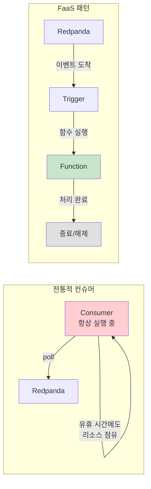
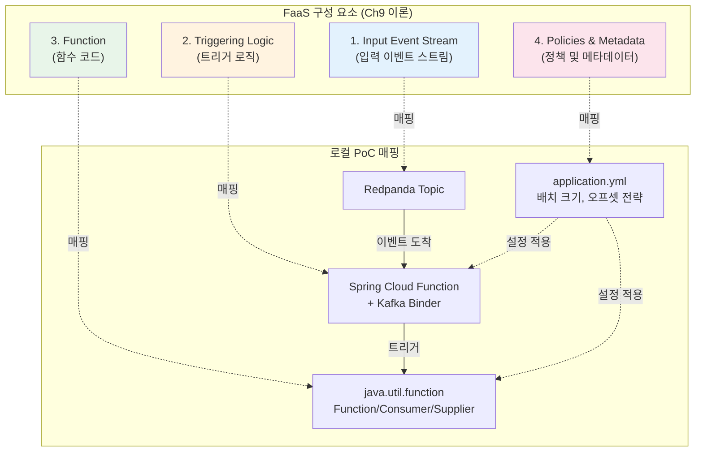
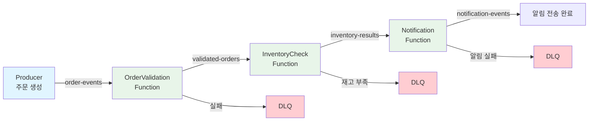
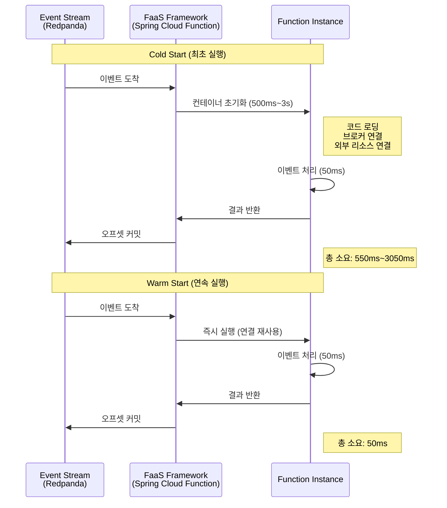
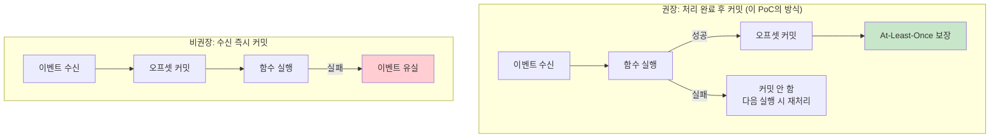
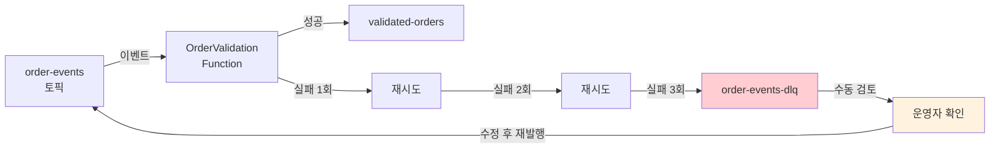
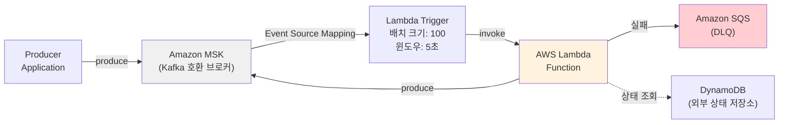
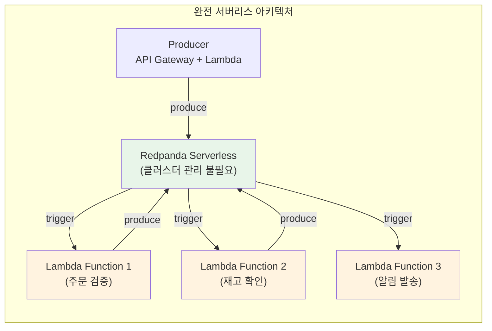
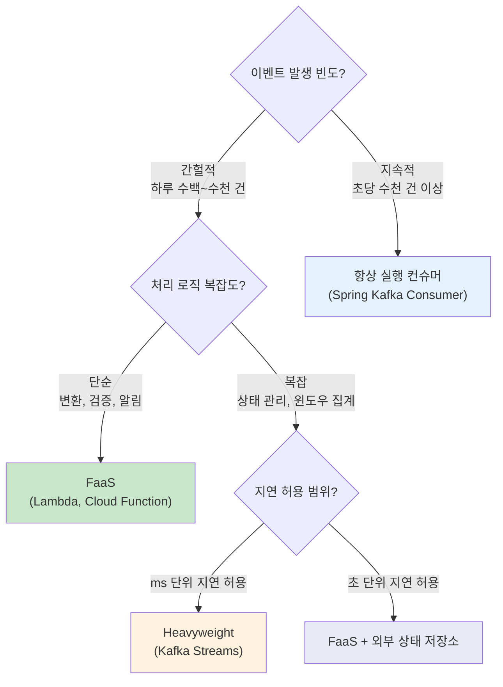

# 11. FaaS 기반 마이크로서비스 (FaaS-style Microservices with Event Integration)

**작성일**: 2026-02-06
**브로커**: Redpanda 전용
**레벨**: 중급~고급
**소요 시간**: 3-4시간
**참조 이론**: Ch9 FaaS 기반 마이크로서비스

---

## 실습 목표

FaaS(Function-as-a-Service) 패턴을 로컬 환경에서 Spring Cloud Function으로 시뮬레이션하여, 이벤트 스트림과 서버리스 함수가 결합되는 아키텍처를 직접 구현합니다.

AWS Lambda나 GCP Cloud Functions 같은 클라우드 FaaS를 실제로 사용하지 않아도, FaaS의 핵심 설계 원칙인 **무상태 함수**, **이벤트 트리거**, **함수 합성(Composition)**, **Cold Start 영향**을 체감할 수 있습니다.

**핵심 학습 내용**:
- Spring Cloud Function을 활용한 FaaS 스타일 함수 구현
- Redpanda 이벤트 스트림이 함수를 트리거하는 구조
- Cold Start vs Warm Start가 처리 지연에 미치는 영향
- 함수 합성(Function Composition)과 Less is More 원칙
- 함수 처리 완료 후 오프셋 커밋 전략
- 실패한 함수 실행을 위한 DLQ(Dead Letter Queue) 처리

---

## 왜 FaaS를 이벤트 기반 시스템에서 사용하는가?

### 전통적 컨슈머 vs FaaS 패턴

전통적인 이벤트 기반 시스템에서는 컨슈머가 항상 실행 상태를 유지하면서 이벤트를 기다립니다. 이 방식은 안정적이지만, 이벤트가 간헐적으로 발생하는 워크로드에서는 리소스를 낭비합니다.

FaaS 패턴은 이벤트가 도착했을 때만 함수를 실행하고, 처리가 끝나면 자원을 해제합니다. 변동이 큰 트래픽에서 비용 효율적이며, 각 함수가 하나의 관심사만 담당하므로 코드가 단순해집니다.



**언제 FaaS가 적합한가**:
- 이벤트 발생 빈도가 불규칙한 워크로드 (예: 주문 알림, 신규 가입 처리)
- 각 이벤트를 독립적으로 처리할 수 있는 무상태 작업
- 빠르게 스케일 아웃이 필요한 버스트성 트래픽

**언제 FaaS가 부적합한가**:
- 지속적으로 높은 처리량이 필요한 경우 (항상 실행 컨슈머가 더 효율적)
- 복잡한 상태 관리가 필요한 스트림 처리 (Kafka Streams가 더 적합)
- 밀리초 단위 지연이 허용되지 않는 경우 (Cold Start 오버헤드)

---

## FaaS 아키텍처

### 핵심 구성 요소

Ch9에서 설명하는 FaaS의 네 가지 핵심 구성 요소를 로컬 환경에서 다음과 같이 매핑합니다.



### 이벤트 처리 파이프라인

이 PoC에서 구현하는 주문 처리 파이프라인의 전체 흐름입니다. 각 함수는 하나의 관심사만 담당하며, Redpanda 토픽을 통해 느슨하게 연결됩니다.



---

## Cold Start vs Warm Start

### 왜 Cold Start가 중요한가?

FaaS에서 함수가 처음 실행되거나 오랫동안 유휴 상태였다가 깨어나면, 컨테이너 초기화, 코드 로딩, 브로커 연결 등의 작업이 필요합니다. 이것이 Cold Start이며, 수백 밀리초에서 수 초까지 지연을 유발합니다. 반면 최근에 실행된 함수가 다시 호출되면 이전 연결과 리소스를 재사용하여 빠르게 시작하는데, 이것이 Warm Start입니다.

이 PoC에서는 Cold Start를 인위적으로 시뮬레이션하여 지연 영향을 체감합니다.

### 타이밍 다이어그램



### Cold Start 영향 비교

| 항목 | Cold Start | Warm Start |
|------|-----------|------------|
| **초기화 시간** | 500ms ~ 3초 (언어, 의존성에 따라 다름) | 거의 0ms |
| **브로커 연결** | 새 연결 생성 필요 | 기존 연결 재사용 |
| **외부 리소스** | DB 커넥션 풀 초기화 | 이미 초기화됨 |
| **적용 상황** | 최초 실행, 장시간 유휴 후 | 연속 이벤트 처리 시 |
| **완화 방법** | Provisioned Concurrency, 코드 경량화 | 이벤트 빈도 유지 |

---

## 프레임워크 비교: FaaS vs BPC vs Heavyweight vs Lightweight

Ch9~Ch12에서 다루는 네 가지 마이크로서비스 구현 방식을 비교합니다. 각 방식은 서로 다른 트레이드오프를 가지며, 워크로드 특성에 따라 적합한 방식이 달라집니다.

| 항목 | FaaS (Ch9) | BPC (Ch10) | Heavyweight (Ch11) | Lightweight (Ch12) |
|------|-----------|-----------|--------------------|--------------------|
| **프레임워크 예시** | AWS Lambda, Spring Cloud Function | Spring Kafka Consumer | Kafka Streams, Apache Flink | Spring WebFlux + Kafka |
| **상태 관리** | 무상태 (외부 저장소 필수) | 무상태 또는 간단한 상태 | 풍부한 상태 관리 (State Store) | 무상태 또는 간단한 상태 |
| **스케일링** | 자동 (이벤트 기반) | 수동 (인스턴스 수 조정) | 자동 (파티션 기반) | 수동 (인스턴스 수 조정) |
| **Cold Start** | 있음 (500ms~3s) | 없음 (항상 실행) | 없음 (항상 실행) | 없음 (항상 실행) |
| **비용 모델** | 실행 시간 기준 과금 | 인스턴스 상시 비용 | 인스턴스 상시 비용 | 인스턴스 상시 비용 |
| **코드 복잡도** | 매우 낮음 | 낮음 | 높음 (토폴로지 설계) | 중간 |
| **적합한 워크로드** | 간헐적, 버스트성 | 단순 이벤트 처리 | 복잡한 스트림 처리 | 가벼운 실시간 처리 |
| **운영 복잡도** | 낮음 (인프라 위임) | 중간 | 높음 | 중간 |

**선택 기준 요약**: 이벤트가 간헐적이고 처리 로직이 단순하면 FaaS가 비용 효율적입니다. 지속적으로 높은 처리량이 필요하거나 복잡한 상태 관리가 필요하면 Heavyweight 프레임워크(Kafka Streams)가 적합합니다. 그 중간 영역은 BPC나 Lightweight 방식으로 커버할 수 있습니다.

---

## 실습 시나리오: 주문 처리 이벤트 파이프라인

전자상거래 시스템에서 주문이 생성되면 세 단계의 함수가 순차적으로 처리합니다. 각 함수는 하나의 관심사만 담당하는 무상태 함수이며, Redpanda 토픽을 통해 연결됩니다.

**파이프라인 단계**:
1. **OrderValidationFunction**: 주문 데이터의 유효성을 검증합니다. (필수 필드 확인, 금액 범위 검증)
2. **InventoryCheckFunction**: 재고 가용성을 확인합니다. (외부 상태 저장소 조회)
3. **NotificationFunction**: 처리 결과를 알림 이벤트로 발행합니다.

**설계 원칙 (Less is More)**: Ch9에서 강조하는 것처럼, 함수를 지나치게 세분화하면 소유권이 모호해지고 디버깅이 어려워집니다. 이 PoC에서는 주문 검증, 재고 확인, 알림의 세 함수만 사용하여 파이프라인을 구성합니다. 실무에서는 하나의 함수가 여러 관련 작업을 묶어 처리하는 것이 유지보수에 유리합니다.

---

## 환경 구성

### docker-compose.yml

```yaml
version: '3.8'

services:
  redpanda:
    image: docker.redpanda.com/redpandadata/redpanda:v25.3.1
    container_name: redpanda-faas
    command:
      - redpanda
      - start
      - --kafka-addr internal://0.0.0.0:9092,external://0.0.0.0:19092
      - --advertise-kafka-addr internal://redpanda:9092,external://localhost:19092
      - --schema-registry-addr internal://0.0.0.0:8081,external://0.0.0.0:18081
      - --rpc-addr redpanda:33145
      - --advertise-rpc-addr redpanda:33145
      - --smp 1
      - --memory 1G
      - --mode dev-container
    ports:
      - "18081:18081"   # Schema Registry
      - "19092:19092"   # Kafka API
      - "19644:9644"    # Admin API
    healthcheck:
      test: ["CMD-SHELL", "rpk cluster health | grep -E 'Healthy:.+true' || exit 1"]
      interval: 15s
      timeout: 3s
      retries: 5

  console:
    image: docker.redpanda.com/redpandadata/console:v2.7.2
    container_name: redpanda-console-faas
    entrypoint: /bin/sh
    command: -c 'echo "$$CONSOLE_CONFIG_FILE" > /tmp/config.yml; /app/console'
    environment:
      CONFIG_FILEPATH: /tmp/config.yml
      CONSOLE_CONFIG_FILE: |
        kafka:
          brokers: ["redpanda:9092"]
          schemaRegistry:
            enabled: true
            urls: ["http://redpanda:8081"]
        redpanda:
          adminApi:
            enabled: true
            urls: ["http://redpanda:9644"]
    ports:
      - "8080:8080"
    depends_on:
      redpanda:
        condition: service_healthy
```

### 토픽 생성

```bash
# 컨테이너 시작
docker-compose up -d

# 상태 확인
docker-compose ps

# 토픽 생성 (함수 간 연결 토픽)
docker exec -it redpanda-faas rpk topic create order-events --partitions 3
docker exec -it redpanda-faas rpk topic create validated-orders --partitions 3
docker exec -it redpanda-faas rpk topic create inventory-results --partitions 3
docker exec -it redpanda-faas rpk topic create notification-events --partitions 3

# DLQ 토픽 (실패한 이벤트 격리)
docker exec -it redpanda-faas rpk topic create order-events-dlq --partitions 1
docker exec -it redpanda-faas rpk topic create validated-orders-dlq --partitions 1
docker exec -it redpanda-faas rpk topic create inventory-results-dlq --partitions 1

# 토픽 목록 확인
docker exec -it redpanda-faas rpk topic list
```

**왜 DLQ 토픽의 파티션이 1개인가?**: DLQ는 실패 이벤트를 격리하는 용도이므로 높은 처리량이 필요하지 않습니다. 파티션 1개로 충분하며, 순서대로 실패 이벤트를 확인하는 것이 디버깅에 더 유리합니다.

---

## 구현

### 1. 프로젝트 설정 (build.gradle)

Spring Cloud Function은 `java.util.function` 인터페이스를 사용하여 비즈니스 로직을 순수 함수로 작성합니다. Spring Boot가 이 함수들을 자동으로 감지하여 Kafka/Redpanda 토픽에 바인딩합니다.

```groovy
plugins {
    id 'java'
    id 'org.springframework.boot' version '3.3.0'
    id 'io.spring.dependency-management' version '1.1.5'
}

group = 'com.example'
version = '0.0.1-SNAPSHOT'
java {
    sourceCompatibility = '17'
}

ext {
    set('springCloudVersion', "2024.0.0")
}

repositories {
    mavenCentral()
}

dependencies {
    // Spring Cloud Function + Kafka Binder
    implementation 'org.springframework.cloud:spring-cloud-function-context'
    implementation 'org.springframework.cloud:spring-cloud-stream-binder-kafka'

    // JSON 직렬화
    implementation 'com.fasterxml.jackson.core:jackson-databind'
    implementation 'com.fasterxml.jackson.datatype:jackson-datatype-jsr310'

    // Lombok
    compileOnly 'org.projectlombok:lombok'
    annotationProcessor 'org.projectlombok:lombok'

    // 테스트
    testImplementation 'org.springframework.boot:spring-boot-starter-test'
    testImplementation 'org.springframework.cloud:spring-cloud-stream-test-binder'
}

dependencyManagement {
    imports {
        mavenBom "org.springframework.cloud:spring-cloud-dependencies:${springCloudVersion}"
    }
}

tasks.named('test') {
    useJUnitPlatform()
}
```

**Spring Cloud Function을 선택한 이유**: AWS Lambda를 로컬에서 직접 실행할 수 없으므로, Spring Cloud Function으로 FaaS 패턴을 시뮬레이션합니다. `java.util.function.Function<I, O>` 인터페이스로 순수 함수를 작성하면, 같은 코드를 나중에 AWS Lambda, Azure Functions, GCP Cloud Functions에 그대로 배포할 수 있습니다.

### 2. application.yml

```yaml
spring:
  application:
    name: faas-event-integration
  cloud:
    function:
      # 실행할 함수들 정의
      definition: orderValidation;inventoryCheck;notification
    stream:
      # 함수별 입출력 토픽 바인딩
      bindings:
        # OrderValidationFunction
        orderValidation-in-0:
          destination: order-events
          group: order-validation-group
        orderValidation-out-0:
          destination: validated-orders

        # InventoryCheckFunction
        inventoryCheck-in-0:
          destination: validated-orders
          group: inventory-check-group
        inventoryCheck-out-0:
          destination: inventory-results

        # NotificationFunction
        notification-in-0:
          destination: inventory-results
          group: notification-group
        notification-out-0:
          destination: notification-events

      kafka:
        binder:
          brokers: localhost:19092
          # Redpanda에서는 트랜잭션을 사용하지 않음
          transaction:
            transaction-id-prefix: ""
        bindings:
          orderValidation-in-0:
            consumer:
              # 수동 오프셋 커밋 (처리 완료 후 커밋)
              ackMode: MANUAL
              enableDlq: true
              dlqName: order-events-dlq
          inventoryCheck-in-0:
            consumer:
              ackMode: MANUAL
              enableDlq: true
              dlqName: validated-orders-dlq
          notification-in-0:
            consumer:
              ackMode: MANUAL
              enableDlq: true
              dlqName: inventory-results-dlq

  kafka:
    consumer:
      auto-offset-reset: earliest
      enable-auto-commit: false
    producer:
      acks: all
      retries: 3

# Cold Start 시뮬레이션 설정
faas:
  cold-start:
    enabled: true
    delay-ms: 2000  # 최초 실행 시 2초 지연
  logging:
    timing: true    # 함수별 실행 시간 로깅

server:
  port: 8090

logging:
  level:
    com.example: DEBUG
    org.springframework.cloud.stream: INFO
```

**수동 오프셋 커밋(ackMode: MANUAL)을 사용하는 이유**: Ch9에서 권장하는 것처럼, 함수가 성공적으로 완료된 후에만 오프셋을 커밋합니다. 함수 실행 도중 실패하면 오프셋이 커밋되지 않아, 다음 실행 시 같은 이벤트를 다시 처리할 수 있습니다. 이는 At-Least-Once 의미론을 보장합니다.

### 3. 도메인 모델

```java
package com.example.faas.domain;

import com.fasterxml.jackson.annotation.JsonFormat;
import lombok.AllArgsConstructor;
import lombok.Builder;
import lombok.Data;
import lombok.NoArgsConstructor;

import java.time.Instant;
import java.util.List;

@Data
@Builder
@NoArgsConstructor
@AllArgsConstructor
public class OrderEvent {
    private String orderId;
    private String customerId;
    private List<OrderItem> items;
    private double totalAmount;

    @JsonFormat(shape = JsonFormat.Shape.STRING)
    private Instant createdAt;

    @Data
    @Builder
    @NoArgsConstructor
    @AllArgsConstructor
    public static class OrderItem {
        private String productId;
        private int quantity;
        private double unitPrice;
    }
}
```

```java
package com.example.faas.domain;

import com.fasterxml.jackson.annotation.JsonFormat;
import lombok.AllArgsConstructor;
import lombok.Builder;
import lombok.Data;
import lombok.NoArgsConstructor;

import java.time.Instant;

@Data
@Builder
@NoArgsConstructor
@AllArgsConstructor
public class ValidatedOrder {
    private String orderId;
    private String customerId;
    private double totalAmount;
    private boolean valid;
    private String validationMessage;

    @JsonFormat(shape = JsonFormat.Shape.STRING)
    private Instant validatedAt;
}
```

```java
package com.example.faas.domain;

import com.fasterxml.jackson.annotation.JsonFormat;
import lombok.AllArgsConstructor;
import lombok.Builder;
import lombok.Data;
import lombok.NoArgsConstructor;

import java.time.Instant;

@Data
@Builder
@NoArgsConstructor
@AllArgsConstructor
public class InventoryResult {
    private String orderId;
    private String customerId;
    private double totalAmount;
    private boolean inventoryAvailable;
    private String inventoryMessage;

    @JsonFormat(shape = JsonFormat.Shape.STRING)
    private Instant checkedAt;
}
```

```java
package com.example.faas.domain;

import com.fasterxml.jackson.annotation.JsonFormat;
import lombok.AllArgsConstructor;
import lombok.Builder;
import lombok.Data;
import lombok.NoArgsConstructor;

import java.time.Instant;

@Data
@Builder
@NoArgsConstructor
@AllArgsConstructor
public class NotificationEvent {
    private String orderId;
    private String customerId;
    private String channel;       // EMAIL, SMS, PUSH
    private String message;
    private String status;        // SENT, FAILED

    @JsonFormat(shape = JsonFormat.Shape.STRING)
    private Instant sentAt;
}
```

### 4. Cold Start 시뮬레이터

실제 클라우드 FaaS에서 발생하는 Cold Start를 로컬 환경에서 체감하기 위한 시뮬레이터입니다. 각 함수의 첫 번째 호출에서만 인위적 지연을 추가합니다.

```java
package com.example.faas.simulator;

import lombok.extern.slf4j.Slf4j;
import org.springframework.beans.factory.annotation.Value;
import org.springframework.stereotype.Component;

import java.util.concurrent.ConcurrentHashMap;
import java.util.concurrent.ConcurrentMap;

@Slf4j
@Component
public class ColdStartSimulator {

    @Value("${faas.cold-start.enabled:true}")
    private boolean enabled;

    @Value("${faas.cold-start.delay-ms:2000}")
    private long delayMs;

    /**
     * 각 함수별 최초 호출 여부를 추적합니다.
     * ConcurrentHashMap을 사용하는 이유: 여러 파티션의 이벤트가
     * 동시에 처리될 수 있으므로 스레드 안전성이 필요합니다.
     */
    private final ConcurrentMap<String, Boolean> warmedUp = new ConcurrentHashMap<>();

    /**
     * Cold Start를 시뮬레이션합니다.
     * 함수가 처음 호출되면 지연을 추가하고, 이후 호출에서는 즉시 반환합니다.
     *
     * 실제 AWS Lambda에서는 다음 작업이 Cold Start 시 발생합니다:
     * - 컨테이너(microVM) 시작: ~200ms
     * - 런타임 초기화 (JVM 시작): ~500ms~2s
     * - 코드 로딩 및 DI 컨테이너 초기화: ~200ms~1s
     * - 이벤트 브로커 연결: ~100ms~500ms
     *
     * @param functionName 함수 이름
     * @return Cold Start 여부
     */
    public boolean simulateColdStart(String functionName) {
        if (!enabled) {
            return false;
        }

        Boolean alreadyWarm = warmedUp.putIfAbsent(functionName, true);

        if (alreadyWarm == null) {
            // 최초 호출: Cold Start 시뮬레이션
            log.warn("[COLD START] {} 함수 초기화 중... ({}ms 지연)",
                functionName, delayMs);
            long startTime = System.currentTimeMillis();

            try {
                Thread.sleep(delayMs);
            } catch (InterruptedException e) {
                Thread.currentThread().interrupt();
            }

            long elapsed = System.currentTimeMillis() - startTime;
            log.warn("[COLD START] {} 함수 초기화 완료 (실제 지연: {}ms)",
                functionName, elapsed);
            return true;
        }

        // Warm Start: 즉시 실행
        log.debug("[WARM START] {} 함수 즉시 실행", functionName);
        return false;
    }

    /**
     * 특정 함수의 Warm 상태를 초기화합니다.
     * 테스트에서 Cold Start를 다시 시뮬레이션하고 싶을 때 사용합니다.
     */
    public void resetFunction(String functionName) {
        warmedUp.remove(functionName);
        log.info("[RESET] {} 함수의 Warm 상태가 초기화되었습니다.", functionName);
    }

    /**
     * 모든 함수의 Warm 상태를 초기화합니다.
     */
    public void resetAll() {
        warmedUp.clear();
        log.info("[RESET] 모든 함수의 Warm 상태가 초기화되었습니다.");
    }
}
```

### 5. OrderValidationFunction

주문 데이터의 유효성을 검증하는 첫 번째 함수입니다. 필수 필드 확인과 비즈니스 규칙(금액 범위, 수량 제한)을 적용합니다.

```java
package com.example.faas.function;

import com.example.faas.domain.OrderEvent;
import com.example.faas.domain.ValidatedOrder;
import com.example.faas.simulator.ColdStartSimulator;
import com.fasterxml.jackson.databind.ObjectMapper;
import lombok.RequiredArgsConstructor;
import lombok.extern.slf4j.Slf4j;
import org.springframework.context.annotation.Bean;
import org.springframework.context.annotation.Configuration;
import org.springframework.messaging.Message;
import org.springframework.messaging.support.MessageBuilder;

import java.time.Instant;
import java.util.function.Function;

@Slf4j
@Configuration
@RequiredArgsConstructor
public class OrderValidationConfig {

    private final ColdStartSimulator coldStartSimulator;
    private final ObjectMapper objectMapper;

    /**
     * 주문 검증 함수를 Bean으로 등록합니다.
     *
     * Spring Cloud Function은 java.util.function.Function<I, O> 타입의 Bean을
     * 자동으로 감지하여 Kafka 바인딩에 연결합니다.
     *
     * 이 함수가 FaaS에서 하나의 Lambda 함수에 해당합니다.
     * - 입력: order-events 토픽의 메시지
     * - 출력: validated-orders 토픽으로 발행
     * - 무상태: 외부 상태에 의존하지 않음
     */
    @Bean
    public Function<Message<String>, Message<String>> orderValidation() {
        return message -> {
            long startTime = System.currentTimeMillis();

            // Cold Start 시뮬레이션
            boolean wasCold = coldStartSimulator.simulateColdStart("orderValidation");

            try {
                OrderEvent order = objectMapper.readValue(
                    message.getPayload(), OrderEvent.class);

                log.info("[OrderValidation] 주문 검증 시작: orderId={}",
                    order.getOrderId());

                // 비즈니스 검증 로직
                ValidatedOrder result = validate(order);

                String resultJson = objectMapper.writeValueAsString(result);
                long elapsed = System.currentTimeMillis() - startTime;

                log.info("[OrderValidation] 주문 검증 완료: orderId={}, valid={}, " +
                    "소요시간={}ms, coldStart={}",
                    order.getOrderId(), result.isValid(), elapsed, wasCold);

                return MessageBuilder.withPayload(resultJson)
                    .setHeader("orderId", order.getOrderId())
                    .setHeader("functionName", "orderValidation")
                    .setHeader("processingTimeMs", elapsed)
                    .setHeader("coldStart", wasCold)
                    .build();

            } catch (Exception e) {
                log.error("[OrderValidation] 주문 검증 실패: {}",
                    e.getMessage(), e);
                throw new RuntimeException("주문 검증 실패", e);
            }
        };
    }

    private ValidatedOrder validate(OrderEvent order) {
        // 필수 필드 확인
        if (order.getOrderId() == null || order.getOrderId().isBlank()) {
            return ValidatedOrder.builder()
                .orderId(order.getOrderId())
                .valid(false)
                .validationMessage("주문 ID가 없습니다.")
                .validatedAt(Instant.now())
                .build();
        }

        if (order.getItems() == null || order.getItems().isEmpty()) {
            return ValidatedOrder.builder()
                .orderId(order.getOrderId())
                .customerId(order.getCustomerId())
                .valid(false)
                .validationMessage("주문 항목이 비어 있습니다.")
                .validatedAt(Instant.now())
                .build();
        }

        // 금액 범위 검증
        if (order.getTotalAmount() <= 0 || order.getTotalAmount() > 10_000_000) {
            return ValidatedOrder.builder()
                .orderId(order.getOrderId())
                .customerId(order.getCustomerId())
                .totalAmount(order.getTotalAmount())
                .valid(false)
                .validationMessage("주문 금액이 유효 범위를 벗어났습니다. (1원~1000만원)")
                .validatedAt(Instant.now())
                .build();
        }

        // 수량 검증
        boolean invalidQuantity = order.getItems().stream()
            .anyMatch(item -> item.getQuantity() <= 0 || item.getQuantity() > 100);
        if (invalidQuantity) {
            return ValidatedOrder.builder()
                .orderId(order.getOrderId())
                .customerId(order.getCustomerId())
                .totalAmount(order.getTotalAmount())
                .valid(false)
                .validationMessage("상품 수량이 유효 범위를 벗어났습니다. (1~100개)")
                .validatedAt(Instant.now())
                .build();
        }

        // 검증 통과
        return ValidatedOrder.builder()
            .orderId(order.getOrderId())
            .customerId(order.getCustomerId())
            .totalAmount(order.getTotalAmount())
            .valid(true)
            .validationMessage("검증 통과")
            .validatedAt(Instant.now())
            .build();
    }
}
```

### 6. InventoryCheckFunction

재고 가용성을 확인하는 두 번째 함수입니다. 실제 FaaS에서는 외부 상태 저장소(DynamoDB, Redis 등)를 조회하지만, 이 PoC에서는 인메모리 맵으로 시뮬레이션합니다.

```java
package com.example.faas.function;

import com.example.faas.domain.InventoryResult;
import com.example.faas.domain.ValidatedOrder;
import com.example.faas.simulator.ColdStartSimulator;
import com.fasterxml.jackson.databind.ObjectMapper;
import lombok.RequiredArgsConstructor;
import lombok.extern.slf4j.Slf4j;
import org.springframework.context.annotation.Bean;
import org.springframework.context.annotation.Configuration;
import org.springframework.messaging.Message;
import org.springframework.messaging.support.MessageBuilder;

import java.time.Instant;
import java.util.Map;
import java.util.concurrent.ConcurrentHashMap;
import java.util.function.Function;

@Slf4j
@Configuration
@RequiredArgsConstructor
public class InventoryCheckConfig {

    private final ColdStartSimulator coldStartSimulator;
    private final ObjectMapper objectMapper;

    /**
     * 재고를 시뮬레이션하는 인메모리 저장소입니다.
     *
     * 실제 FaaS 환경에서는 이 부분이 DynamoDB, Redis, 또는
     * 외부 API 호출로 대체됩니다. FaaS 함수는 무상태이므로
     * 로컬 변수에 상태를 저장하면 인스턴스가 교체될 때 사라집니다.
     */
    private final Map<String, Integer> inventoryStore = new ConcurrentHashMap<>(Map.of(
        "PROD-001", 100,
        "PROD-002", 50,
        "PROD-003", 0,    // 재고 없음
        "PROD-004", 200,
        "PROD-005", 10
    ));

    @Bean
    public Function<Message<String>, Message<String>> inventoryCheck() {
        return message -> {
            long startTime = System.currentTimeMillis();
            boolean wasCold = coldStartSimulator.simulateColdStart("inventoryCheck");

            try {
                ValidatedOrder validatedOrder = objectMapper.readValue(
                    message.getPayload(), ValidatedOrder.class);

                log.info("[InventoryCheck] 재고 확인 시작: orderId={}",
                    validatedOrder.getOrderId());

                // 검증 실패한 주문은 그대로 통과시킴
                if (!validatedOrder.isValid()) {
                    InventoryResult result = InventoryResult.builder()
                        .orderId(validatedOrder.getOrderId())
                        .customerId(validatedOrder.getCustomerId())
                        .totalAmount(validatedOrder.getTotalAmount())
                        .inventoryAvailable(false)
                        .inventoryMessage("주문 검증 실패로 재고 확인 건너뜀: "
                            + validatedOrder.getValidationMessage())
                        .checkedAt(Instant.now())
                        .build();

                    return buildResultMessage(result, startTime, wasCold);
                }

                // 재고 확인 (시뮬레이션)
                InventoryResult result = checkInventory(validatedOrder);

                long elapsed = System.currentTimeMillis() - startTime;
                log.info("[InventoryCheck] 재고 확인 완료: orderId={}, available={}, " +
                    "소요시간={}ms, coldStart={}",
                    validatedOrder.getOrderId(),
                    result.isInventoryAvailable(), elapsed, wasCold);

                return buildResultMessage(result, startTime, wasCold);

            } catch (Exception e) {
                log.error("[InventoryCheck] 재고 확인 실패: {}",
                    e.getMessage(), e);
                throw new RuntimeException("재고 확인 실패", e);
            }
        };
    }

    private InventoryResult checkInventory(ValidatedOrder order) {
        // 간단한 재고 확인 로직
        // 실제로는 주문 항목별로 재고를 확인해야 하지만,
        // PoC에서는 주문 금액 기반으로 재고 가용 여부를 판단합니다.
        boolean available = order.getTotalAmount() <= 5_000_000;

        return InventoryResult.builder()
            .orderId(order.getOrderId())
            .customerId(order.getCustomerId())
            .totalAmount(order.getTotalAmount())
            .inventoryAvailable(available)
            .inventoryMessage(available
                ? "재고 확인 완료 - 출고 가능"
                : "재고 부족 - 입고 대기 필요")
            .checkedAt(Instant.now())
            .build();
    }

    private Message<String> buildResultMessage(
            InventoryResult result, long startTime, boolean wasCold) {
        try {
            String resultJson = objectMapper.writeValueAsString(result);
            long elapsed = System.currentTimeMillis() - startTime;

            return MessageBuilder.withPayload(resultJson)
                .setHeader("orderId", result.getOrderId())
                .setHeader("functionName", "inventoryCheck")
                .setHeader("processingTimeMs", elapsed)
                .setHeader("coldStart", wasCold)
                .build();
        } catch (Exception e) {
            throw new RuntimeException("직렬화 실패", e);
        }
    }
}
```

### 7. NotificationFunction

처리 결과를 알림 이벤트로 변환하는 세 번째 함수입니다. 파이프라인의 마지막 단계로, 주문 처리 결과를 사용자에게 알립니다.

```java
package com.example.faas.function;

import com.example.faas.domain.InventoryResult;
import com.example.faas.domain.NotificationEvent;
import com.example.faas.simulator.ColdStartSimulator;
import com.fasterxml.jackson.databind.ObjectMapper;
import lombok.RequiredArgsConstructor;
import lombok.extern.slf4j.Slf4j;
import org.springframework.context.annotation.Bean;
import org.springframework.context.annotation.Configuration;
import org.springframework.messaging.Message;
import org.springframework.messaging.support.MessageBuilder;

import java.time.Instant;
import java.util.function.Function;

@Slf4j
@Configuration
@RequiredArgsConstructor
public class NotificationConfig {

    private final ColdStartSimulator coldStartSimulator;
    private final ObjectMapper objectMapper;

    @Bean
    public Function<Message<String>, Message<String>> notification() {
        return message -> {
            long startTime = System.currentTimeMillis();
            boolean wasCold = coldStartSimulator.simulateColdStart("notification");

            try {
                InventoryResult inventoryResult = objectMapper.readValue(
                    message.getPayload(), InventoryResult.class);

                log.info("[Notification] 알림 생성 시작: orderId={}",
                    inventoryResult.getOrderId());

                // 결과에 따른 알림 메시지 생성
                NotificationEvent notification = createNotification(inventoryResult);

                String resultJson = objectMapper.writeValueAsString(notification);
                long elapsed = System.currentTimeMillis() - startTime;

                log.info("[Notification] 알림 생성 완료: orderId={}, channel={}, " +
                    "status={}, 소요시간={}ms, coldStart={}",
                    notification.getOrderId(), notification.getChannel(),
                    notification.getStatus(), elapsed, wasCold);

                return MessageBuilder.withPayload(resultJson)
                    .setHeader("orderId", notification.getOrderId())
                    .setHeader("functionName", "notification")
                    .setHeader("processingTimeMs", elapsed)
                    .setHeader("coldStart", wasCold)
                    .build();

            } catch (Exception e) {
                log.error("[Notification] 알림 생성 실패: {}",
                    e.getMessage(), e);
                throw new RuntimeException("알림 생성 실패", e);
            }
        };
    }

    private NotificationEvent createNotification(InventoryResult result) {
        if (result.isInventoryAvailable()) {
            return NotificationEvent.builder()
                .orderId(result.getOrderId())
                .customerId(result.getCustomerId())
                .channel("EMAIL")
                .message(String.format(
                    "주문 %s이 확인되었습니다. 총 금액: %.0f원. 곧 배송이 시작됩니다.",
                    result.getOrderId(), result.getTotalAmount()))
                .status("SENT")
                .sentAt(Instant.now())
                .build();
        } else {
            return NotificationEvent.builder()
                .orderId(result.getOrderId())
                .customerId(result.getCustomerId())
                .channel("EMAIL")
                .message(String.format(
                    "주문 %s 처리 중 문제가 발생했습니다: %s",
                    result.getOrderId(), result.getInventoryMessage()))
                .status("SENT")
                .sentAt(Instant.now())
                .build();
        }
    }
}
```

### 8. 함수 합성 (Function Composition)

Spring Cloud Function은 여러 함수를 파이프라인으로 합성할 수 있습니다. 이 기능은 Ch9의 Direct-Call 오케스트레이션 패턴에 해당하며, 모든 함수가 성공한 후에만 오프셋을 커밋합니다.

**주의**: 함수 합성은 모든 함수가 동일 프로세스에서 실행됩니다. 이는 FaaS의 독립 배포 원칙과 상충하므로, 테스트와 프로토타이핑 용도로만 사용하고 프로덕션에서는 토픽 기반 분리를 권장합니다.

```java
package com.example.faas.function;

import com.example.faas.domain.InventoryResult;
import com.example.faas.domain.NotificationEvent;
import com.example.faas.domain.OrderEvent;
import com.example.faas.domain.ValidatedOrder;
import com.example.faas.simulator.ColdStartSimulator;
import com.fasterxml.jackson.databind.ObjectMapper;
import lombok.RequiredArgsConstructor;
import lombok.extern.slf4j.Slf4j;
import org.springframework.context.annotation.Bean;
import org.springframework.context.annotation.Configuration;
import org.springframework.context.annotation.Profile;

import java.time.Instant;
import java.util.function.Function;

/**
 * 함수 합성 프로파일.
 *
 * "composed" 프로파일로 실행하면 세 함수가 하나의 파이프라인으로 합성됩니다.
 * 이 방식은 중간 토픽 없이 직접 함수를 연결하므로 지연이 줄어들지만,
 * 개별 함수의 독립적 스케일링이 불가능합니다.
 *
 * 활성화: spring.profiles.active=composed
 * application-composed.yml에서
 *   spring.cloud.function.definition=composedOrderPipeline
 */
@Slf4j
@Configuration
@Profile("composed")
@RequiredArgsConstructor
public class ComposedFunctionConfig {

    private final ColdStartSimulator coldStartSimulator;
    private final ObjectMapper objectMapper;

    /**
     * 세 함수를 하나로 합성합니다.
     * OrderEvent -> ValidatedOrder -> InventoryResult -> NotificationEvent
     *
     * Java의 Function.andThen()을 사용하여 파이프라인을 구성합니다.
     * 이는 Ch9의 오케스트레이션 패턴과 유사합니다:
     * - 순서가 보장됩니다.
     * - 중간 단계 실패 시 전체 파이프라인이 실패합니다.
     * - 모든 단계 완료 후에만 오프셋이 커밋됩니다.
     */
    @Bean
    public Function<String, String> composedOrderPipeline() {
        return orderJson -> {
            long pipelineStart = System.currentTimeMillis();
            log.info("[Composed Pipeline] 파이프라인 시작");

            try {
                // Step 1: 주문 검증
                coldStartSimulator.simulateColdStart("composedOrderPipeline");
                OrderEvent order = objectMapper.readValue(orderJson, OrderEvent.class);
                ValidatedOrder validated = validateOrder(order);
                log.info("[Composed Pipeline] Step 1 완료: valid={}",
                    validated.isValid());

                // Step 2: 재고 확인
                InventoryResult inventory = checkInventory(validated);
                log.info("[Composed Pipeline] Step 2 완료: available={}",
                    inventory.isInventoryAvailable());

                // Step 3: 알림 생성
                NotificationEvent notification = createNotification(inventory);
                log.info("[Composed Pipeline] Step 3 완료: status={}",
                    notification.getStatus());

                long totalElapsed = System.currentTimeMillis() - pipelineStart;
                log.info("[Composed Pipeline] 파이프라인 완료: orderId={}, " +
                    "총 소요시간={}ms", order.getOrderId(), totalElapsed);

                return objectMapper.writeValueAsString(notification);

            } catch (Exception e) {
                log.error("[Composed Pipeline] 파이프라인 실패: {}",
                    e.getMessage(), e);
                throw new RuntimeException("파이프라인 실행 실패", e);
            }
        };
    }

    // validateOrder, checkInventory, createNotification은
    // 앞서 구현한 개별 함수의 로직과 동일합니다.
    // 코드 중복을 피하려면 공통 서비스 클래스로 추출할 수 있습니다.

    private ValidatedOrder validateOrder(OrderEvent order) {
        if (order.getItems() == null || order.getItems().isEmpty()) {
            return ValidatedOrder.builder()
                .orderId(order.getOrderId())
                .valid(false)
                .validationMessage("주문 항목이 비어 있습니다.")
                .validatedAt(Instant.now())
                .build();
        }
        return ValidatedOrder.builder()
            .orderId(order.getOrderId())
            .customerId(order.getCustomerId())
            .totalAmount(order.getTotalAmount())
            .valid(true)
            .validationMessage("검증 통과")
            .validatedAt(Instant.now())
            .build();
    }

    private InventoryResult checkInventory(ValidatedOrder order) {
        boolean available = order.isValid() && order.getTotalAmount() <= 5_000_000;
        return InventoryResult.builder()
            .orderId(order.getOrderId())
            .customerId(order.getCustomerId())
            .totalAmount(order.getTotalAmount())
            .inventoryAvailable(available)
            .inventoryMessage(available ? "재고 확인 완료" : "재고 부족")
            .checkedAt(Instant.now())
            .build();
    }

    private NotificationEvent createNotification(InventoryResult result) {
        return NotificationEvent.builder()
            .orderId(result.getOrderId())
            .customerId(result.getCustomerId())
            .channel("EMAIL")
            .message(result.isInventoryAvailable()
                ? "주문이 확인되었습니다."
                : "주문 처리 중 문제가 발생했습니다.")
            .status("SENT")
            .sentAt(Instant.now())
            .build();
    }
}
```

### 9. 오프셋 관리: 처리 완료 후 커밋

Ch9에서 강조하는 핵심 원칙 중 하나는 **함수가 성공적으로 완료된 후에만 오프셋을 커밋**하는 것입니다. Spring Cloud Stream의 수동 ACK 모드에서는 이를 다음과 같이 구현합니다.



Spring Cloud Stream에서 `ackMode: MANUAL`을 설정하면, 함수가 정상적으로 반환될 때 자동으로 오프셋이 커밋됩니다. 예외가 발생하면 오프셋이 커밋되지 않아, 다음 폴링 시 동일한 이벤트를 다시 수신합니다.

### 10. DLQ를 통한 에러 처리

함수가 반복적으로 실패하면 해당 이벤트를 DLQ(Dead Letter Queue)로 이동시켜 정상 흐름을 차단하지 않도록 합니다. Spring Cloud Stream은 `enableDlq: true` 설정으로 이를 자동 처리합니다.



**DLQ 처리 전략**:
1. DLQ에 쌓인 이벤트를 모니터링합니다.
2. 실패 원인을 분석합니다. (로그, 이벤트 내용 확인)
3. 원인을 수정한 후 이벤트를 원래 토픽에 재발행합니다.
4. 복구 불가능한 이벤트는 별도 저장소에 아카이빙합니다.

---

## 테스트용 Producer

함수 파이프라인을 테스트하기 위한 REST API Producer입니다.

```java
package com.example.faas.producer;

import com.example.faas.domain.OrderEvent;
import com.fasterxml.jackson.databind.ObjectMapper;
import lombok.RequiredArgsConstructor;
import lombok.extern.slf4j.Slf4j;
import org.springframework.kafka.core.KafkaTemplate;
import org.springframework.web.bind.annotation.*;

import java.time.Instant;
import java.util.List;
import java.util.UUID;

@Slf4j
@RestController
@RequestMapping("/api/orders")
@RequiredArgsConstructor
public class OrderProducerController {

    private final KafkaTemplate<String, String> kafkaTemplate;
    private final ObjectMapper objectMapper;

    @PostMapping
    public String createOrder(@RequestBody CreateOrderRequest request) throws Exception {
        OrderEvent order = OrderEvent.builder()
            .orderId(UUID.randomUUID().toString())
            .customerId(request.customerId())
            .items(request.items().stream()
                .map(item -> OrderEvent.OrderItem.builder()
                    .productId(item.productId())
                    .quantity(item.quantity())
                    .unitPrice(item.unitPrice())
                    .build())
                .toList())
            .totalAmount(request.items().stream()
                .mapToDouble(i -> i.quantity() * i.unitPrice())
                .sum())
            .createdAt(Instant.now())
            .build();

        String orderJson = objectMapper.writeValueAsString(order);
        kafkaTemplate.send("order-events", order.getOrderId(), orderJson);

        log.info("주문 이벤트 발행: orderId={}, amount={}",
            order.getOrderId(), order.getTotalAmount());

        return "Order created: " + order.getOrderId();
    }

    /**
     * 대량 주문 생성 (부하 테스트 및 Cold Start 영향 관찰용)
     */
    @PostMapping("/bulk")
    public String createBulkOrders(@RequestParam(defaultValue = "100") int count)
            throws Exception {
        for (int i = 0; i < count; i++) {
            OrderEvent order = OrderEvent.builder()
                .orderId(UUID.randomUUID().toString())
                .customerId("CUST-" + (i % 10))
                .items(List.of(
                    OrderEvent.OrderItem.builder()
                        .productId("PROD-" + ((i % 5) + 1))
                        .quantity((i % 10) + 1)
                        .unitPrice(10000 + (i * 100))
                        .build()
                ))
                .totalAmount((10000 + (i * 100)) * ((i % 10) + 1))
                .createdAt(Instant.now())
                .build();

            String orderJson = objectMapper.writeValueAsString(order);
            kafkaTemplate.send("order-events", order.getOrderId(), orderJson);
        }

        log.info("대량 주문 이벤트 발행 완료: {}건", count);
        return "Bulk orders created: " + count;
    }

    record CreateOrderRequest(
        String customerId,
        List<OrderItemRequest> items
    ) {}

    record OrderItemRequest(
        String productId,
        int quantity,
        double unitPrice
    ) {}
}
```

---

## 실제 AWS Lambda + MSK 트리거 (참조)

이 PoC는 로컬 환경에서 FaaS 패턴을 시뮬레이션하지만, 실제 클라우드 환경에서는 AWS Lambda와 Amazon MSK(Managed Streaming for Apache Kafka)를 연동하여 동일한 아키텍처를 구현할 수 있습니다.

### AWS Lambda + MSK 아키텍처



### AWS Lambda 설정 예시 (참조용, 이 PoC에서는 구현하지 않음)

```yaml
# serverless.yml (Serverless Framework)
service: order-processing

provider:
  name: aws
  runtime: java17
  region: ap-northeast-2
  memorySize: 512          # MB
  timeout: 60              # 초 (최대 900초)

functions:
  orderValidation:
    handler: com.example.lambda.OrderValidationHandler
    events:
      - msk:
          arn: arn:aws:kafka:ap-northeast-2:123456789:cluster/my-cluster
          topic: order-events
          batchSize: 100            # 한 번에 처리할 최대 이벤트 수
          maximumBatchingWindow: 5  # 추가 이벤트를 기다리는 초
          startingPosition: LATEST
          enabled: true

  inventoryCheck:
    handler: com.example.lambda.InventoryCheckHandler
    events:
      - msk:
          arn: arn:aws:kafka:ap-northeast-2:123456789:cluster/my-cluster
          topic: validated-orders
          batchSize: 100
          maximumBatchingWindow: 5
          startingPosition: LATEST
```

**PoC와의 차이점**:

| 항목 | 이 PoC (Spring Cloud Function) | 실제 AWS Lambda + MSK |
|------|-------------------------------|----------------------|
| **트리거** | Spring Cloud Stream 바인딩 | AWS Event Source Mapping |
| **Cold Start** | 시뮬레이션 (인위적 지연) | 실제 JVM 초기화 (3~10초) |
| **스케일링** | 단일 인스턴스 | 파티션 수 기반 자동 스케일링 |
| **상태 저장소** | 인메모리 Map | DynamoDB, ElastiCache |
| **DLQ** | Kafka DLQ 토픽 | Amazon SQS DLQ |
| **비용** | 로컬 리소스만 사용 | 실행 시간 + 요청 수 기준 과금 |
| **배포** | `./gradlew bootRun` | `serverless deploy` |

---

## Redpanda Serverless (2026 최신)

Redpanda는 2025년부터 **Redpanda Serverless** 제품을 제공하고 있습니다. 이는 Kafka 호환 브로커를 서버리스 방식으로 제공하여, 클러스터 관리 없이 토픽별로 사용한 만큼만 과금되는 서비스입니다.

FaaS 아키텍처에서 Redpanda Serverless를 사용하면, 브로커와 함수 모두 서버리스로 구성할 수 있어 완전한 서버리스 이벤트 파이프라인을 구현할 수 있습니다.



**Redpanda Serverless의 장점**:
- 클러스터 프로비저닝과 관리가 불필요합니다.
- 토픽 단위로 비용이 과금되어 간헐적 워크로드에 비용 효율적입니다.
- Kafka API와 완벽 호환되어 기존 코드를 그대로 사용할 수 있습니다.
- AWS MSK 대비 시작 비용이 낮아 PoC와 스타트업에 적합합니다.

---

## 검증

### 1. 환경 시작 및 확인

```bash
# Docker Compose 시작
docker-compose up -d

# Redpanda 상태 확인
docker exec -it redpanda-faas rpk cluster health

# 토픽 목록 확인
docker exec -it redpanda-faas rpk topic list
```

### 2. 애플리케이션 실행

```bash
# Spring Boot 애플리케이션 시작
./gradlew bootRun

# 또는 합성 모드로 실행
./gradlew bootRun --args='--spring.profiles.active=composed'
```

### 3. 단건 주문 테스트 (Cold Start 관찰)

```bash
# 첫 번째 주문 (Cold Start 발생)
curl -X POST http://localhost:8090/api/orders \
  -H "Content-Type: application/json" \
  -d '{
    "customerId": "CUST-001",
    "items": [
      {
        "productId": "PROD-001",
        "quantity": 2,
        "unitPrice": 15000
      }
    ]
  }'

# 두 번째 주문 (Warm Start - 빠른 처리)
curl -X POST http://localhost:8090/api/orders \
  -H "Content-Type: application/json" \
  -d '{
    "customerId": "CUST-002",
    "items": [
      {
        "productId": "PROD-002",
        "quantity": 1,
        "unitPrice": 25000
      }
    ]
  }'
```

**로그에서 확인할 내용**: 첫 번째 주문의 로그에서 `[COLD START]` 메시지와 약 2초의 지연이 발생하는 것을 확인합니다. 두 번째 주문은 `[WARM START]`로 즉시 처리됩니다.

### 4. 유효하지 않은 주문 테스트

```bash
# 금액 초과 주문 (검증 실패 -> DLQ 확인용은 아니지만 파이프라인 흐름 확인)
curl -X POST http://localhost:8090/api/orders \
  -H "Content-Type: application/json" \
  -d '{
    "customerId": "CUST-003",
    "items": [
      {
        "productId": "PROD-003",
        "quantity": 5,
        "unitPrice": 3000000
      }
    ]
  }'

# 빈 주문 항목 (검증 실패)
curl -X POST http://localhost:8090/api/orders \
  -H "Content-Type: application/json" \
  -d '{
    "customerId": "CUST-004",
    "items": []
  }'
```

### 5. 대량 주문 테스트 (처리량 관찰)

```bash
# 100건 주문 일괄 생성
curl -X POST "http://localhost:8090/api/orders/bulk?count=100"
```

### 6. 토픽별 메시지 확인

```bash
# 입력 토픽 (원본 주문)
docker exec -it redpanda-faas rpk topic consume order-events --num 5

# 검증 완료 토픽
docker exec -it redpanda-faas rpk topic consume validated-orders --num 5

# 재고 확인 결과 토픽
docker exec -it redpanda-faas rpk topic consume inventory-results --num 5

# 알림 이벤트 토픽
docker exec -it redpanda-faas rpk topic consume notification-events --num 5

# DLQ 확인 (실패한 이벤트)
docker exec -it redpanda-faas rpk topic consume order-events-dlq --num 5
```

### 7. Consumer Group 상태 확인

```bash
# Consumer Group 목록
docker exec -it redpanda-faas rpk group list

# 각 함수의 Consumer Group 상태
docker exec -it redpanda-faas rpk group describe order-validation-group
docker exec -it redpanda-faas rpk group describe inventory-check-group
docker exec -it redpanda-faas rpk group describe notification-group
```

출력 예시:

```
GROUP                    COORDINATOR  STATE  MEMBERS
order-validation-group   0            Stable 1

TOPIC          PARTITION  CURRENT-OFFSET  LOG-END-OFFSET  LAG
order-events   0          34              34              0
order-events   1          33              33              0
order-events   2          33              33              0
```

**LAG이 0이면** 모든 이벤트가 실시간으로 처리 중입니다. LAG이 지속적으로 증가하면 함수 처리 속도가 이벤트 유입 속도를 따라가지 못하는 것이므로, 파티션 수를 늘리거나 (실제 FaaS에서는) 함수 인스턴스를 스케일 아웃해야 합니다.

### 8. Redpanda Console

브라우저에서 `http://localhost:8080` 접속하여 다음을 확인합니다:

- **Topics**: 각 토픽별 메시지 수, 파티션 상태
- **Messages**: 토픽을 선택하여 실제 메시지 내용 확인
- **Consumer Groups**: 각 함수의 Consumer Group LAG 확인

---

## 실무 적용 포인트

### 1. FaaS vs 항상 실행 컨슈머: 언제 무엇을 선택하는가?

FaaS와 항상 실행되는 컨슈머는 서로 대체재가 아니라, 워크로드 특성에 따라 선택하는 도구입니다.



### 2. 비용 분석: 간헐적 vs 고처리량 워크로드

| 시나리오 | 월 이벤트 수 | AWS Lambda 비용 (예상) | EC2 t3.medium (항상 실행) |
|----------|-------------|----------------------|--------------------------|
| 간헐적 알림 | 10,000건 | ~$0.02 | ~$30/월 |
| 중간 트래픽 | 1,000,000건 | ~$2.00 | ~$30/월 |
| 높은 트래픽 | 100,000,000건 | ~$200 | ~$30/월 |
| 버스트 트래픽 | 평소 1만, 피크 1000만 | ~$20 (피크 시) | ~$60 (오버프로비저닝) |

**핵심 인사이트**: 월 100만 건 이하의 간헐적 워크로드에서는 FaaS가 압도적으로 비용 효율적입니다. 그러나 월 1억 건 이상의 지속적 고처리량 워크로드에서는 항상 실행되는 컨슈머가 더 저렴합니다. 버스트 트래픽(평소에는 적고 가끔 폭증)에서는 FaaS의 자동 스케일링이 오버프로비저닝 없이 비용을 절감합니다.

### 3. FaaS의 한계와 대응 방안

| 한계 | 원인 | 대응 방안 |
|------|------|----------|
| **로컬 상태 없음** | 함수가 종료되면 메모리가 사라짐 | DynamoDB, Redis 등 외부 상태 저장소 사용 |
| **실행 시간 제한** | AWS Lambda 최대 15분 | 장시간 작업은 Step Functions로 분할 |
| **Cold Start 지연** | JVM 초기화에 수 초 소요 | GraalVM Native Image, Provisioned Concurrency |
| **디버깅 어려움** | 분산 환경에서 로그 추적이 복잡 | CloudWatch, X-Ray 등 관찰가능성(Observability) 도구 |
| **벤더 종속** | 클라우드 제공자별 API 차이 | Spring Cloud Function으로 추상화 계층 유지 |

---

## 실습 체크리스트

- [ ] **환경 구성**
  - [ ] Docker Compose로 Redpanda 시작
  - [ ] 토픽 7개 생성 (함수 연결 4개 + DLQ 3개)
  - [ ] Redpanda Console에서 토픽 확인 (`http://localhost:8080`)
- [ ] **함수 구현**
  - [ ] OrderValidationFunction 구현 및 검증 로직 확인
  - [ ] InventoryCheckFunction 구현 및 재고 시뮬레이션 확인
  - [ ] NotificationFunction 구현 및 알림 생성 확인
- [ ] **Cold Start 체험**
  - [ ] 첫 번째 주문 생성 시 로그에서 `[COLD START]` 확인
  - [ ] 두 번째 주문 생성 시 `[WARM START]`로 빠른 처리 확인
  - [ ] 처리 시간 차이 비교 (Cold: ~2초 vs Warm: ~50ms)
- [ ] **파이프라인 검증**
  - [ ] 정상 주문: `order-events` -> `validated-orders` -> `inventory-results` -> `notification-events` 흐름 확인
  - [ ] 유효하지 않은 주문: 검증 실패 메시지가 파이프라인을 통과하는지 확인
  - [ ] 대량 주문: 100건 일괄 처리 시 처리량과 LAG 관찰
- [ ] **오프셋 관리**
  - [ ] Consumer Group LAG이 0인지 확인
  - [ ] 애플리케이션을 중지 후 재시작했을 때 이어서 처리되는지 확인
- [ ] **DLQ 확인**
  - [ ] 에러 발생 시 DLQ 토픽에 메시지가 도착하는지 확인
- [ ] **함수 합성** (선택)
  - [ ] `composed` 프로파일로 실행
  - [ ] 중간 토픽 없이 파이프라인이 동작하는지 확인

---

## 다음 단계

이 PoC에서 FaaS 패턴의 핵심 원리를 로컬에서 체험했습니다. 이 경험을 바탕으로 다음을 탐구할 수 있습니다.

**같은 시리즈 PoC와의 연결**:
- **14-basic-event-loop**: 이 PoC의 기초가 되는 Consume-Process-Produce 패턴입니다.
- **06-choreography-saga**: FaaS 함수들이 이벤트로 협력하는 패턴은 코레오그래피 Saga와 동일한 구조입니다.
- **07-orchestration-saga**: 함수 합성(Composed Pipeline)은 오케스트레이션 패턴의 경량 버전입니다.

**프로덕션 환경 확장**:
- AWS Lambda + MSK 연동으로 실제 서버리스 이벤트 파이프라인 구축
- Provisioned Concurrency로 Cold Start 제거
- AWS Step Functions로 복잡한 함수 오케스트레이션 구현
- CloudWatch + X-Ray로 분산 함수 추적 및 모니터링

---

## 참고 자료

- [Spring Cloud Function 공식 문서](https://spring.io/projects/spring-cloud-function)
- [Spring Cloud Stream Kafka Binder](https://docs.spring.io/spring-cloud-stream/reference/kafka/kafka-binder.html)
- [AWS Lambda + MSK Event Source Mapping](https://docs.aws.amazon.com/lambda/latest/dg/with-msk.html)
- [Redpanda Serverless](https://redpanda.com/serverless)
- [Ch9 FaaS 기반 마이크로서비스 이론 문서](../../../docs/02_Architecture/03_EventDriven/09_FaaS_기반_마이크로서비스.md)
