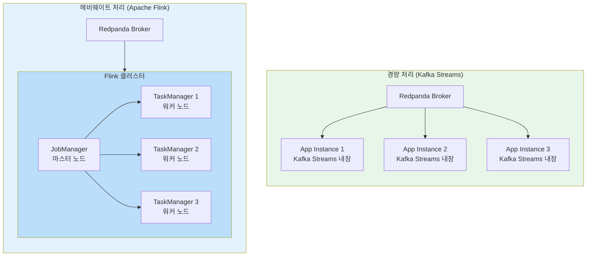
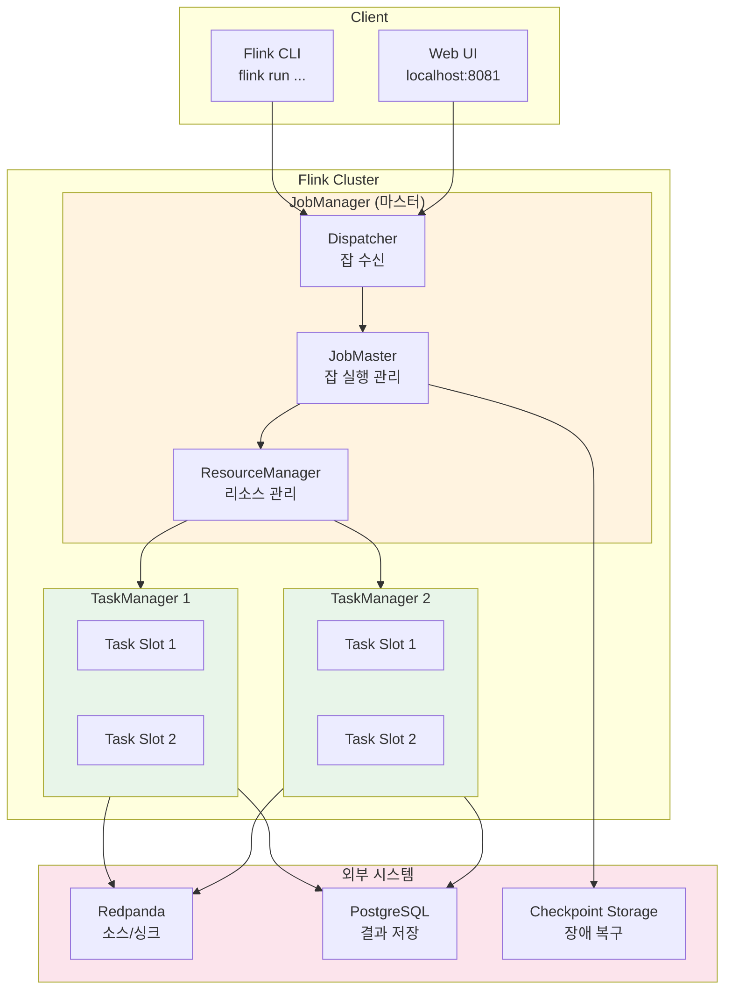
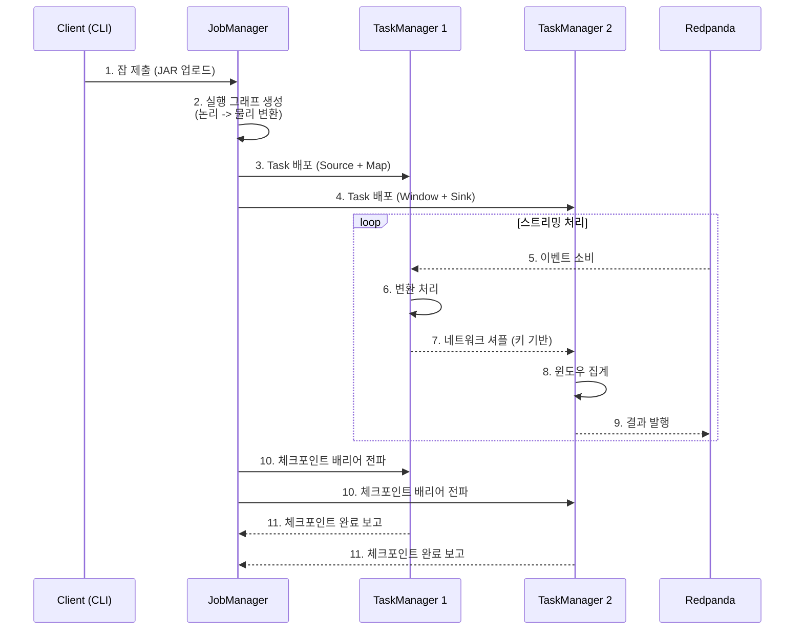
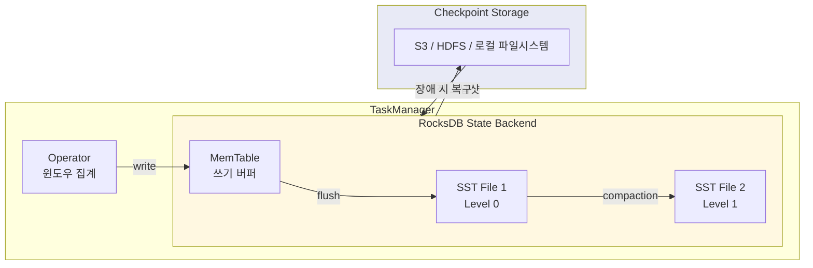
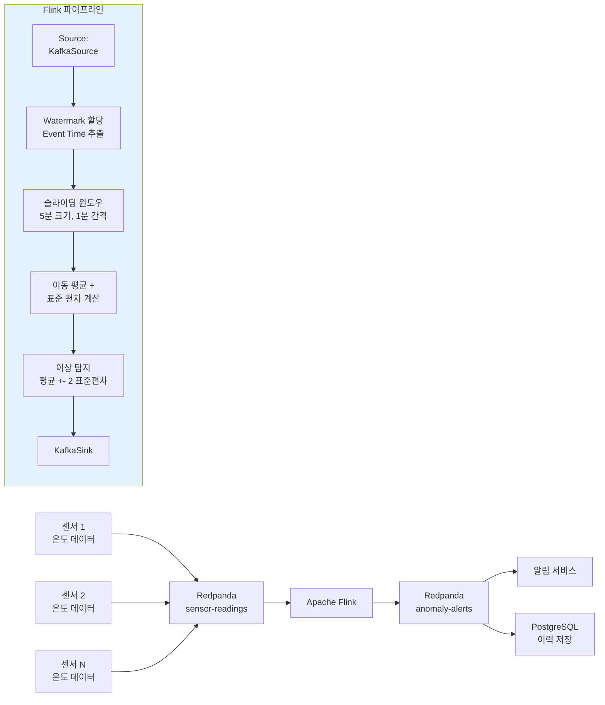
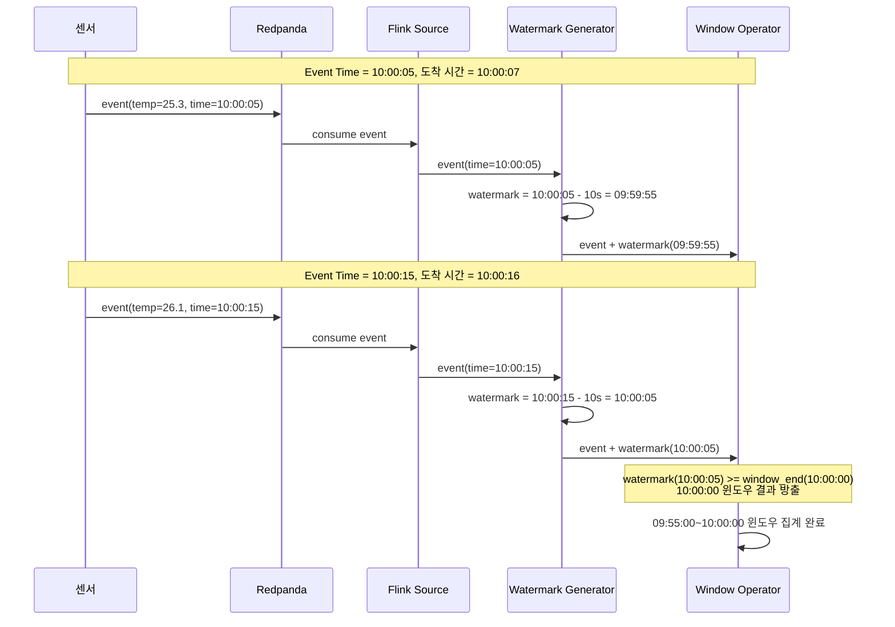
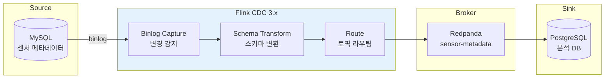
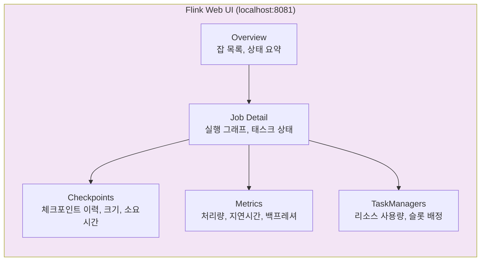
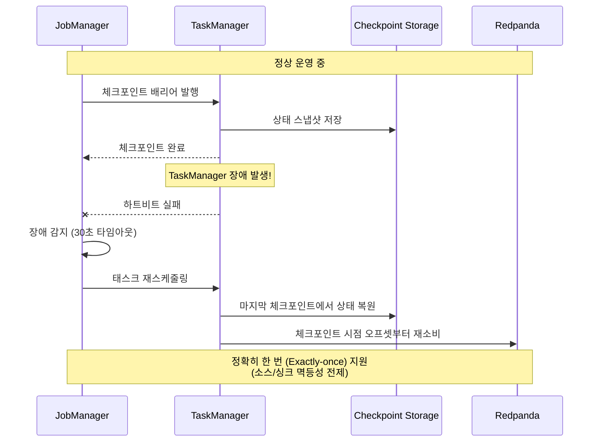
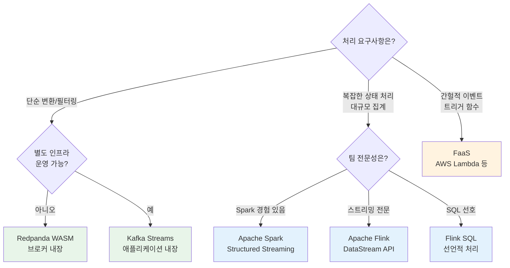

# 12. 헤비웨이트 프레임워크 마이크로서비스 (Heavyweight Framework Microservices)

**작성일**: 2026-02-06
**브로커**: Redpanda (Kafka API 호환)
**난이도**: 고급
**소요 시간**: 4-5시간
**참조 문서**: Ch11 헤비웨이트 프레임워크 마이크로서비스

---

## 실습 목표

이 실습에서는 **Apache Flink**를 사용하여 헤비웨이트 프레임워크 기반의 실시간 이상 탐지 시스템을 구축합니다. Flink가 Redpanda(Kafka 호환 브로커)에서 센서 데이터를 소비하고, 슬라이딩 윈도우를 활용한 이동 평균 계산과 표준 편차 기반 이상 탐지를 수행합니다.

왜 이 실습이 중요한가? Kafka Streams나 Redpanda WASM 같은 경량 처리 도구로는 대규모 상태 관리, 복잡한 윈도우 연산, 장애 복구가 필요한 시나리오를 감당하기 어렵습니다. 헤비웨이트 프레임워크는 자체 클러스터를 운영하는 대신 이러한 복잡한 처리를 안정적으로 수행할 수 있는 기반을 제공합니다.

**핵심 학습 내용**:
- 헤비웨이트 프레임워크가 존재하는 이유와 경량 도구와의 근본적 차이
- Apache Flink의 아키텍처 (JobManager + TaskManager + State Backend)
- Flink DataStream API를 사용한 실시간 이상 탐지 파이프라인
- Event Time 기반 워터마크와 슬라이딩 윈도우 집계
- RocksDB State Backend를 활용한 대규모 상태 관리
- Flink SQL과 CDC 파이프라인 구성

---

## 왜 헤비웨이트 프레임워크가 필요한가? (Ch11 이론)

### 경량 도구의 한계

Kafka Streams, Redpanda WASM, FaaS(Lambda) 같은 경량 처리 도구는 이벤트 브로커 위에 직접 동작하거나 개별 함수 단위로 실행됩니다. 이러한 도구는 간단한 변환, 필터링, 소규모 집계에는 훌륭하지만, 다음과 같은 시나리오에서는 한계에 부딪힙니다.

1. **대규모 상태 관리**: 수십 GB의 상태를 유지하면서 실시간 집계를 수행해야 하는 경우, Kafka Streams의 로컬 RocksDB만으로는 메모리와 디스크 관리가 어렵습니다.
2. **복잡한 윈도우 연산**: 여러 스트림을 조인하면서 동시에 이벤트 시간 기반 슬라이딩 윈도우, 세션 윈도우를 적용해야 하는 경우, 정교한 워터마크 관리가 필요합니다.
3. **탄력적 확장**: 트래픽이 10배 증가했을 때 처리 노드를 동적으로 추가하고, 상태를 재분배해야 합니다.
4. **정교한 장애 복구**: Exactly-once 의미를 지원하면서 체크포인트 기반으로 정확한 시점에서 복구해야 합니다.

### "헤비웨이트"의 의미

"헤비웨이트"라는 이름은 **이벤트 브로커와 별도로 자체 클러스터를 운영해야 하는 추가 오버헤드**에서 비롯됩니다. Kafka Streams는 애플리케이션에 라이브러리로 내장되어 별도 인프라가 필요 없지만, Apache Flink는 JobManager, TaskManager, ZooKeeper(또는 Kubernetes) 등 독립적인 처리 클러스터가 필요합니다.

이 추가 인프라 비용을 감수하는 이유는, 프레임워크 내부에서 다음 메커니즘을 자체적으로 관리하기 때문입니다.

| 내부 메커니즘 | 설명 | 경량 도구와의 차이 |
|--------------|------|-------------------|
| **장애 복구 (Fault Recovery)** | 체크포인트/세이브포인트로 정확한 시점 복구 | Kafka Streams는 changelog 토픽에 의존하여 복구 시간이 김 |
| **리소스 할당 (Resource Allocation)** | TaskManager별 CPU/메모리 슬롯을 명시적으로 관리 | Kafka Streams는 JVM 힙에 의존하여 세밀한 제어가 어려움 |
| **태스크 분배 (Task Distribution)** | 파이프라인을 논리적 태스크로 분할하고 병렬 실행 | FaaS는 함수 단위 실행으로 복잡한 DAG 구성이 불가능 |
| **자체 데이터 저장 (State Backend)** | RocksDB 또는 메모리 기반 상태 저장소를 내장 | WASM은 무상태 처리만 가능 |
| **내부 통신 (Internal Communication)** | 태스크 간 네트워크 셔플, 브로드캐스트 지원 | 경량 도구는 반드시 브로커를 통해 데이터 교환 |

### 아키텍처 비교: 경량 vs 헤비웨이트



**경량 처리**: 각 애플리케이션 인스턴스가 독립적으로 실행됩니다. 별도 인프라가 필요 없지만, 인스턴스 간 조율이 제한적입니다.

**헤비웨이트 처리**: JobManager가 중앙에서 태스크를 분배하고, TaskManager가 실제 처리를 수행합니다. 추가 클러스터가 필요하지만 정교한 분산 처리를 지원합니다.

---

## 프레임워크 비교

### 주요 헤비웨이트 프레임워크

| 특성 | Apache Flink | Apache Spark Streaming | Apache Storm |
|------|-------------|----------------------|--------------|
| **실행 모델** | 네이티브 스트리밍 (진정한 이벤트 단위 처리) | 마이크로 배치 (작은 배치를 빠르게 반복) | 네이티브 스트리밍 (튜플 단위) |
| **상태 관리** | RocksDB 기반 내장 상태, 체크포인트 자동 관리 | Spark 메모리에 상태 저장, DStream 기반 | 외부 저장소(Redis 등)에 직접 관리 |
| **지연시간** | 밀리초 단위 (진정한 실시간) | 초~분 단위 (마이크로 배치 간격) | 밀리초 단위 |
| **처리량** | 초당 수백만 이벤트 | 초당 수백만 이벤트 | 초당 수십만 이벤트 |
| **Exactly-Once** | 네이티브 지원 (체크포인트 기반) | Structured Streaming에서 지원 | At-least-once (Trident로 Exactly-once 가능) |
| **SQL 지원** | Flink SQL (완전한 스트리밍 SQL) | Spark SQL (강력한 배치 + 스트리밍) | 미지원 |
| **배치 + 스트리밍** | 통합 API (DataStream + Table API) | 통합 API (DataFrame + Structured Streaming) | 스트리밍 전용 |
| **학습 곡선** | 중간 (스트리밍 개념 이해 필요) | 낮음 (Spark 생태계 활용) | 높음 (저수준 API) |
| **Kafka 호환** | Flink Kafka Connector (공식 지원) | Spark Kafka Connector (공식 지원) | KafkaSpout (커뮤니티) |

### 경량 도구와의 비교

| 특성 | Apache Flink | Kafka Streams | Redpanda WASM | AWS Lambda (FaaS) |
|------|-------------|---------------|---------------|-------------------|
| **배포 모델** | 별도 클러스터 필요 | 애플리케이션 내장 라이브러리 | 브로커 내장 | 클라우드 관리형 |
| **상태 관리** | RocksDB + 체크포인트 | RocksDB + Changelog 토픽 | 무상태 | 외부 저장소 |
| **최대 상태 크기** | 수 TB (디스크 기반) | 수 GB (메모리 + 디스크) | 없음 (무상태) | 없음 (무상태) |
| **운영 복잡도** | 높음 (클러스터 관리) | 낮음 (JVM 프로세스) | 매우 낮음 (브로커 내장) | 매우 낮음 (서버리스) |
| **적합 시나리오** | 대규모 ETL, 이상 탐지, 복잡 집계 | 중규모 스트림 변환, 마이크로서비스 | 단순 변환, 필터링 | 이벤트 트리거 함수 |
| **비용 효율** | 대규모일 때 효율적 | 중규모일 때 효율적 | 소규모일 때 효율적 | 간헐적 트래픽에 효율적 |

### 왜 이 실습에서 Apache Flink를 선택하는가?

Apache Flink를 선택한 이유는 세 가지입니다.

1. **진정한 스트리밍 엔진**: Spark Streaming과 달리 마이크로 배치가 아닌 이벤트 단위 처리를 수행하여, 이상 탐지처럼 지연시간이 중요한 시나리오에 적합합니다.
2. **Kafka API 호환**: Flink의 Kafka Connector는 Redpanda와 기본 설정으로 호환됩니다. bootstrap.servers만 Redpanda 주소로 지정하면 됩니다.
3. **통합 배치/스트리밍 API**: DataStream API로 실시간 처리를 구현하고, Flink SQL로 동일한 데이터를 배치 분석할 수 있습니다.

---

## Apache Flink 아키텍처

### 클러스터 구성요소

Apache Flink 클러스터는 크게 세 가지 구성요소로 이루어집니다.



**JobManager (마스터 노드)**: 클러스터의 두뇌 역할을 합니다. 클라이언트가 제출한 잡(Job)을 수신하고, 실행 그래프로 변환하여 TaskManager에 분배합니다. 체크포인트를 조율하여 장애 복구 지점을 관리합니다.

**TaskManager (워커 노드)**: 실제 데이터 처리를 수행하는 노드입니다. 각 TaskManager는 여러 개의 Task Slot을 가지며, 하나의 Task Slot이 파이프라인의 한 병렬 단위를 실행합니다.

**Task Slot**: TaskManager 내에서 격리된 실행 단위입니다. 각 슬롯은 고정된 메모리를 할당받아 태스크를 실행합니다. 슬롯 수는 TaskManager가 동시에 실행할 수 있는 병렬 태스크 수를 결정합니다.

### 잡 실행 흐름



### State Backend: RocksDB

Flink는 상태를 저장하기 위해 RocksDB를 사용합니다. RocksDB는 임베디드 키-값 저장소로, 메모리보다 큰 상태도 디스크에 효율적으로 저장할 수 있습니다.



**왜 RocksDB인가?**: 메모리 기반 상태 저장소는 빠르지만, 상태 크기가 JVM 힙을 초과하면 OOM(Out of Memory)이 발생합니다. RocksDB는 LSM-Tree 구조를 사용하여 디스크에 효율적으로 저장하므로, 수 TB의 상태도 안정적으로 관리할 수 있습니다.

---

## 실습 시나리오: 실시간 이상 탐지 시스템

### 시나리오 설명

IoT 센서 네트워크에서 온도 데이터를 수집하고, 이동 평균 대비 2 표준 편차를 초과하는 이상 온도를 실시간으로 탐지합니다.

**데이터 흐름**:



**요구사항**:
- 센서별로 5분 슬라이딩 윈도우(1분 간격)의 이동 평균과 표준 편차를 계산합니다.
- 현재 온도가 이동 평균에서 2 표준 편차 이상 벗어나면 이상(Anomaly)으로 판정합니다.
- 이상 이벤트는 별도 토픽(`anomaly-alerts`)으로 발행합니다.
- Event Time 기반 처리로 늦게 도착한 이벤트도 정확하게 처리합니다.

---

## 환경 구성

### 1. docker-compose.yml

```yaml
version: '3.8'

services:
  # ──────────────────────────────────────────
  # Redpanda: Kafka API 호환 이벤트 브로커
  # ──────────────────────────────────────────
  redpanda:
    image: docker.redpanda.com/redpandadata/redpanda:v25.3.1
    container_name: redpanda
    command:
      - redpanda
      - start
      - --smp 1
      - --memory 1G
      - --overprovisioned
      - --kafka-addr internal://0.0.0.0:9092,external://0.0.0.0:19092
      - --advertise-kafka-addr internal://redpanda:9092,external://localhost:19092
      - --schema-registry-addr internal://0.0.0.0:8081,external://0.0.0.0:18081
    ports:
      - "19092:19092"   # Kafka API (호스트 접근용)
      - "18081:18081"   # Schema Registry
      - "19644:9644"    # Admin API
    healthcheck:
      test: ["CMD", "rpk", "cluster", "health"]
      interval: 10s
      timeout: 5s
      retries: 5

  # ──────────────────────────────────────────
  # Redpanda Console: 웹 UI
  # ──────────────────────────────────────────
  console:
    image: docker.redpanda.com/redpandadata/console:v2.7.2
    container_name: redpanda-console
    ports:
      - "8080:8080"
    environment:
      KAFKA_BROKERS: redpanda:9092
      KAFKA_SCHEMAREGISTRY_ENABLED: "true"
      KAFKA_SCHEMAREGISTRY_URLS: http://redpanda:8081
    depends_on:
      redpanda:
        condition: service_healthy

  # ──────────────────────────────────────────
  # Flink JobManager: 마스터 노드
  # 잡을 수신하고 실행 계획을 수립하며 체크포인트를 조율합니다.
  # ──────────────────────────────────────────
  flink-jobmanager:
    image: flink:1.20-java17
    container_name: flink-jobmanager
    ports:
      - "8081:8081"    # Flink Web UI
    command: jobmanager
    environment:
      - |
        FLINK_PROPERTIES=
        jobmanager.rpc.address: flink-jobmanager
        state.backend: rocksdb
        state.checkpoints.dir: file:///opt/flink/checkpoints
        state.savepoints.dir: file:///opt/flink/savepoints
        execution.checkpointing.interval: 60000
        execution.checkpointing.mode: EXACTLY_ONCE
        execution.checkpointing.min-pause: 30000
        restart-strategy: fixed-delay
        restart-strategy.fixed-delay.attempts: 3
        restart-strategy.fixed-delay.delay: 10s
    volumes:
      - flink-checkpoints:/opt/flink/checkpoints
      - flink-savepoints:/opt/flink/savepoints
      - ./jars:/opt/flink/usrlib
    depends_on:
      redpanda:
        condition: service_healthy

  # ──────────────────────────────────────────
  # Flink TaskManager: 워커 노드
  # 실제 데이터 처리를 수행합니다. 슬롯 수에 따라 병렬성을 조절합니다.
  # ──────────────────────────────────────────
  flink-taskmanager:
    image: flink:1.20-java17
    container_name: flink-taskmanager
    command: taskmanager
    environment:
      - |
        FLINK_PROPERTIES=
        jobmanager.rpc.address: flink-jobmanager
        taskmanager.numberOfTaskSlots: 4
        taskmanager.memory.process.size: 2048m
        state.backend: rocksdb
        state.checkpoints.dir: file:///opt/flink/checkpoints
    volumes:
      - flink-checkpoints:/opt/flink/checkpoints
      - ./jars:/opt/flink/usrlib
    depends_on:
      - flink-jobmanager

  # ──────────────────────────────────────────
  # PostgreSQL: 이상 탐지 결과를 영구 저장합니다.
  # ──────────────────────────────────────────
  postgres:
    image: postgres:16-alpine
    container_name: postgres
    ports:
      - "5432:5432"
    environment:
      POSTGRES_DB: anomaly_db
      POSTGRES_USER: flink
      POSTGRES_PASSWORD: flink123
    volumes:
      - ./init-db.sql:/docker-entrypoint-initdb.d/init.sql
      - pgdata:/var/lib/postgresql/data

volumes:
  flink-checkpoints:
  flink-savepoints:
  pgdata:
```

### 2. 데이터베이스 초기화 (init-db.sql)

```sql
-- init-db.sql
-- 이상 탐지 결과를 저장하는 테이블입니다.
-- Flink JDBC Sink가 이 테이블에 결과를 기록합니다.

CREATE TABLE IF NOT EXISTS anomaly_alerts (
    id              BIGSERIAL PRIMARY KEY,
    sensor_id       VARCHAR(50)    NOT NULL,
    temperature     DOUBLE PRECISION NOT NULL,
    moving_avg      DOUBLE PRECISION NOT NULL,
    std_dev         DOUBLE PRECISION NOT NULL,
    deviation       DOUBLE PRECISION NOT NULL,
    window_start    TIMESTAMP      NOT NULL,
    window_end      TIMESTAMP      NOT NULL,
    detected_at     TIMESTAMP      DEFAULT CURRENT_TIMESTAMP,
    severity        VARCHAR(20)    NOT NULL  -- 'WARNING' | 'CRITICAL'
);

CREATE INDEX idx_anomaly_sensor_time
    ON anomaly_alerts (sensor_id, detected_at DESC);

CREATE INDEX idx_anomaly_severity
    ON anomaly_alerts (severity, detected_at DESC);
```

### 3. 토픽 생성

```bash
# Docker Compose 실행
docker-compose up -d

# Redpanda가 준비될 때까지 대기
docker exec -it redpanda rpk cluster health --watch

# 센서 데이터 입력 토픽
docker exec -it redpanda rpk topic create sensor-readings \
  --partitions 6 \
  --config retention.ms=86400000

# 이상 탐지 알림 출력 토픽
docker exec -it redpanda rpk topic create anomaly-alerts \
  --partitions 3 \
  --config retention.ms=604800000

# 토픽 확인
docker exec -it redpanda rpk topic list
```

**파티션 수 설계**: `sensor-readings`를 6개 파티션으로 설정한 이유는 Flink TaskManager의 병렬 슬롯(4개)보다 파티션이 많아야 리밸런싱 시 유연성이 확보되기 때문입니다. 출력 토픽인 `anomaly-alerts`는 이상 이벤트 빈도가 입력보다 훨씬 낮으므로 3개면 충분합니다.

---

## Flink 프로젝트 설정

### 1. build.gradle

```groovy
plugins {
    id 'java'
    id 'application'
    id 'com.github.johnrengelman.shadow' version '8.1.1'
}

group = 'com.example'
version = '1.0.0'
sourceCompatibility = '17'

ext {
    flinkVersion = '1.20.0'
}

repositories {
    mavenCentral()
}

dependencies {
    // Flink 핵심 의존성
    implementation "org.apache.flink:flink-streaming-java:${flinkVersion}"
    implementation "org.apache.flink:flink-clients:${flinkVersion}"

    // Flink Kafka Connector (Redpanda 호환)
    implementation "org.apache.flink:flink-connector-kafka:3.3.0-1.20"

    // Flink JDBC Connector (PostgreSQL Sink)
    implementation "org.apache.flink:flink-connector-jdbc:3.2.0-1.20"
    implementation "org.postgresql:postgresql:42.7.4"

    // RocksDB State Backend
    implementation "org.apache.flink:flink-statebackend-rocksdb:${flinkVersion}"

    // JSON 직렬화
    implementation "com.fasterxml.jackson.core:jackson-databind:2.17.2"

    // Flink Table/SQL API (Flink SQL 실습용)
    implementation "org.apache.flink:flink-table-api-java-bridge:${flinkVersion}"
    implementation "org.apache.flink:flink-table-planner-loader:${flinkVersion}"
    implementation "org.apache.flink:flink-table-runtime:${flinkVersion}"

    // Lombok
    compileOnly 'org.projectlombok:lombok:1.18.34'
    annotationProcessor 'org.projectlombok:lombok:1.18.34'

    // 테스트
    testImplementation "org.apache.flink:flink-test-utils:${flinkVersion}"
    testImplementation 'org.junit.jupiter:junit-jupiter:5.10.3'
}

application {
    mainClass = 'com.example.anomaly.AnomalyDetectionJob'
}

// Fat JAR 생성 (Flink 클러스터에 배포용)
shadowJar {
    archiveBaseName.set('anomaly-detection')
    archiveClassifier.set('')
    mergeServiceFiles()
}

test {
    useJUnitPlatform()
}
```

### 2. 프로젝트 구조

```
15_heavyweight-frameworks/
├── docker-compose.yml
├── init-db.sql
├── build.gradle
├── jars/                          # 빌드된 JAR 배치 (Flink에 마운트)
├── flink-cdc/
│   └── pipeline.yaml              # Flink CDC 파이프라인 정의
└── src/main/java/com/example/anomaly/
    ├── AnomalyDetectionJob.java   # 메인 잡 진입점
    ├── model/
    │   ├── SensorReading.java     # 입력 이벤트
    │   ├── WindowStats.java       # 윈도우 집계 결과
    │   └── AnomalyAlert.java      # 이상 탐지 알림
    ├── function/
    │   ├── SensorStatsAggregator.java  # 윈도우 집계 함수
    │   └── AnomalyDetector.java        # 이상 판정 함수
    └── serialization/
        ├── SensorReadingDeserializer.java
        └── AnomalyAlertSerializer.java
```

---

## 도메인 모델

### 1. SensorReading (입력 이벤트)

```java
package com.example.anomaly.model;

import lombok.AllArgsConstructor;
import lombok.Data;
import lombok.NoArgsConstructor;

/**
 * IoT 센서에서 발행하는 온도 측정 이벤트입니다.
 * sensorId를 키로 사용하여 센서별 독립적인 윈도우 집계를 수행합니다.
 */
@Data
@NoArgsConstructor
@AllArgsConstructor
public class SensorReading {
    private String sensorId;      // 센서 고유 식별자
    private double temperature;   // 측정 온도 (섭씨)
    private long eventTime;       // 이벤트 발생 시간 (epoch millis)
    private String location;      // 센서 위치
}
```

### 2. WindowStats (윈도우 집계 결과)

```java
package com.example.anomaly.model;

import lombok.AllArgsConstructor;
import lombok.Data;
import lombok.NoArgsConstructor;

/**
 * 슬라이딩 윈도우 내 센서 데이터의 통계 정보입니다.
 * 이동 평균과 표준 편차를 함께 저장하여 이상 판정의 기준으로 사용합니다.
 */
@Data
@NoArgsConstructor
@AllArgsConstructor
public class WindowStats {
    private String sensorId;
    private double movingAvg;     // 윈도우 내 이동 평균
    private double stdDev;        // 윈도우 내 표준 편차
    private long count;           // 윈도우 내 측정 횟수
    private double latestTemp;    // 가장 최근 측정값
    private long windowStart;     // 윈도우 시작 시간
    private long windowEnd;       // 윈도우 종료 시간
}
```

### 3. AnomalyAlert (이상 탐지 알림)

```java
package com.example.anomaly.model;

import lombok.AllArgsConstructor;
import lombok.Data;
import lombok.NoArgsConstructor;

/**
 * 이상 온도가 탐지되었을 때 발행되는 알림 이벤트입니다.
 * 이동 평균 대비 편차 크기에 따라 WARNING(2 sigma) 또는 CRITICAL(3 sigma)로 구분합니다.
 */
@Data
@NoArgsConstructor
@AllArgsConstructor
public class AnomalyAlert {
    private String sensorId;
    private double temperature;   // 이상 측정값
    private double movingAvg;     // 기준 이동 평균
    private double stdDev;        // 기준 표준 편차
    private double deviation;     // 실제 편차 (sigma 배수)
    private long windowStart;
    private long windowEnd;
    private long detectedAt;      // 탐지 시간
    private String severity;      // "WARNING" | "CRITICAL"
}
```

---

## Flink DataStream API 구현

### 1. AnomalyDetectionJob (메인 진입점)

```java
package com.example.anomaly;

import com.example.anomaly.model.AnomalyAlert;
import com.example.anomaly.model.SensorReading;
import com.example.anomaly.model.WindowStats;
import com.example.anomaly.function.SensorStatsAggregator;
import com.example.anomaly.function.AnomalyDetector;
import com.example.anomaly.serialization.SensorReadingDeserializer;
import com.example.anomaly.serialization.AnomalyAlertSerializer;

import org.apache.flink.api.common.eventtime.WatermarkStrategy;
import org.apache.flink.connector.kafka.source.KafkaSource;
import org.apache.flink.connector.kafka.source.enumerator.initializer.OffsetsInitializer;
import org.apache.flink.connector.kafka.sink.KafkaSink;
import org.apache.flink.connector.kafka.sink.KafkaRecordSerializationSchema;
import org.apache.flink.streaming.api.datastream.DataStream;
import org.apache.flink.streaming.api.environment.StreamExecutionEnvironment;
import org.apache.flink.streaming.api.windowing.assigners.SlidingEventTimeWindows;
import org.apache.flink.streaming.api.windowing.time.Time;

import java.time.Duration;

/**
 * 실시간 이상 탐지 파이프라인의 메인 잡입니다.
 *
 * 파이프라인 흐름:
 * 1. Redpanda에서 센서 데이터를 소비합니다.
 * 2. Event Time 기반 워터마크를 할당합니다.
 * 3. 센서별로 5분 슬라이딩 윈도우(1분 간격)를 적용합니다.
 * 4. 윈도우 내 이동 평균과 표준 편차를 계산합니다.
 * 5. 최신 측정값이 2 표준 편차를 초과하면 이상으로 판정합니다.
 * 6. 이상 알림을 Redpanda 출력 토픽으로 발행합니다.
 */
public class AnomalyDetectionJob {

    public static void main(String[] args) throws Exception {

        // ── 1. 실행 환경 설정 ──
        StreamExecutionEnvironment env = StreamExecutionEnvironment.getExecutionEnvironment();
        env.setParallelism(4);  // TaskManager의 슬롯 수에 맞춤

        // ── 2. Kafka Source: Redpanda에서 센서 데이터 소비 ──
        // Flink의 KafkaSource는 Kafka API를 사용하므로 Redpanda와 호환됩니다.
        // bootstrap.servers에 Redpanda 주소를 지정하는 것만으로 연결됩니다.
        KafkaSource<SensorReading> source = KafkaSource.<SensorReading>builder()
            .setBootstrapServers("redpanda:9092")
            .setTopics("sensor-readings")
            .setGroupId("anomaly-detection-group")
            .setStartingOffsets(OffsetsInitializer.latest())
            .setDeserializer(new SensorReadingDeserializer())
            .build();

        // ── 3. Event Time + Watermark 전략 ──
        // forBoundedOutOfOrderness: 최대 10초의 지연을 허용합니다.
        // 센서 데이터가 네트워크 지연으로 최대 10초 늦게 도착할 수 있다고 가정합니다.
        // 이 설정으로 늦게 도착한 이벤트도 올바른 윈도우에 배치됩니다.
        WatermarkStrategy<SensorReading> watermarkStrategy = WatermarkStrategy
            .<SensorReading>forBoundedOutOfOrderness(Duration.ofSeconds(10))
            .withTimestampAssigner((reading, timestamp) -> reading.getEventTime());

        DataStream<SensorReading> sensorStream = env
            .fromSource(source, watermarkStrategy, "Redpanda Sensor Source");

        // ── 4. 센서별 슬라이딩 윈도우 집계 ──
        // 5분 크기의 윈도우를 1분 간격으로 슬라이딩합니다.
        // 이는 매 분마다 최근 5분간의 통계를 계산한다는 의미입니다.
        // 왜 슬라이딩 윈도우인가?
        // - Tumbling 윈도우는 5분마다 한 번 결과를 내보내므로 이상을 빠르게 감지하기 어렵습니다.
        // - 슬라이딩 윈도우는 1분마다 결과를 갱신하여 더 빠른 이상 탐지가 가능합니다.
        DataStream<WindowStats> windowedStats = sensorStream
            .keyBy(SensorReading::getSensorId)
            .window(SlidingEventTimeWindows.of(
                Time.minutes(5),   // 윈도우 크기: 5분
                Time.minutes(1)    // 슬라이드 간격: 1분
            ))
            .aggregate(new SensorStatsAggregator());

        // ── 5. 이상 탐지 ──
        // 윈도우 통계를 기반으로 최신 측정값이 이동 평균에서
        // 2 표준 편차 이상 벗어나면 이상으로 판정합니다.
        DataStream<AnomalyAlert> anomalies = windowedStats
            .process(new AnomalyDetector());

        // ── 6. Kafka Sink: Redpanda 출력 토픽으로 발행 ──
        KafkaSink<AnomalyAlert> sink = KafkaSink.<AnomalyAlert>builder()
            .setBootstrapServers("redpanda:9092")
            .setRecordSerializer(
                KafkaRecordSerializationSchema.builder()
                    .setTopic("anomaly-alerts")
                    .setValueSerializationSchema(new AnomalyAlertSerializer())
                    .build()
            )
            .build();

        anomalies.sinkTo(sink);

        // ── 7. 콘솔 출력 (디버깅용) ──
        anomalies.print("ANOMALY DETECTED");

        // ── 8. 잡 실행 ──
        env.execute("Real-Time Anomaly Detection");
    }
}
```

### 2. SensorStatsAggregator (윈도우 집계 함수)

```java
package com.example.anomaly.function;

import com.example.anomaly.model.SensorReading;
import com.example.anomaly.model.WindowStats;

import org.apache.flink.api.common.functions.AggregateFunction;

/**
 * 슬라이딩 윈도우 내 센서 데이터의 이동 평균과 표준 편차를 계산합니다.
 *
 * Welford's Online Algorithm을 사용하여 단일 패스로 평균과 분산을 계산합니다.
 * 이 알고리즘은 모든 데이터를 메모리에 저장하지 않고도 정확한 통계를 구하므로,
 * 스트리밍 환경에서 메모리 효율적입니다.
 *
 * AggregateFunction의 세 가지 타입 파라미터:
 * - IN (SensorReading): 입력 이벤트 타입
 * - ACC (StatsAccumulator): 중간 집계 상태 타입
 * - OUT (WindowStats): 최종 출력 타입
 */
public class SensorStatsAggregator
    implements AggregateFunction<SensorReading, StatsAccumulator, WindowStats> {

    @Override
    public StatsAccumulator createAccumulator() {
        return new StatsAccumulator();
    }

    @Override
    public StatsAccumulator add(SensorReading reading, StatsAccumulator acc) {
        acc.count++;
        // Welford's algorithm: 단일 패스로 평균과 분산 계산
        double delta = reading.getTemperature() - acc.mean;
        acc.mean += delta / acc.count;
        double delta2 = reading.getTemperature() - acc.mean;
        acc.m2 += delta * delta2;

        acc.latestTemp = reading.getTemperature();
        acc.sensorId = reading.getSensorId();
        return acc;
    }

    @Override
    public WindowStats getResult(StatsAccumulator acc) {
        double stdDev = acc.count > 1
            ? Math.sqrt(acc.m2 / (acc.count - 1))
            : 0.0;

        return new WindowStats(
            acc.sensorId,
            acc.mean,
            stdDev,
            acc.count,
            acc.latestTemp,
            0L,  // 윈도우 시작 시간 (ProcessWindowFunction에서 설정)
            0L   // 윈도우 종료 시간 (ProcessWindowFunction에서 설정)
        );
    }

    @Override
    public StatsAccumulator merge(StatsAccumulator a, StatsAccumulator b) {
        // 두 누산기를 병합합니다 (세션 윈도우 등에서 사용)
        StatsAccumulator merged = new StatsAccumulator();
        merged.count = a.count + b.count;
        double delta = b.mean - a.mean;
        merged.mean = (a.mean * a.count + b.mean * b.count) / merged.count;
        merged.m2 = a.m2 + b.m2 + delta * delta * a.count * b.count / merged.count;
        merged.latestTemp = Math.max(a.latestTemp, b.latestTemp);
        merged.sensorId = a.sensorId;
        return merged;
    }

    /**
     * 윈도우 집계의 중간 상태입니다.
     * Welford 알고리즘에 필요한 값들을 유지합니다.
     */
    public static class StatsAccumulator implements java.io.Serializable {
        public String sensorId = "";
        public long count = 0;
        public double mean = 0.0;
        public double m2 = 0.0;      // 편차 제곱합 (분산 계산용)
        public double latestTemp = 0.0;
    }
}
```

### 3. AnomalyDetector (이상 판정 함수)

```java
package com.example.anomaly.function;

import com.example.anomaly.model.AnomalyAlert;
import com.example.anomaly.model.WindowStats;

import org.apache.flink.streaming.api.functions.ProcessFunction;
import org.apache.flink.util.Collector;
import lombok.extern.slf4j.Slf4j;

/**
 * 윈도우 통계를 기반으로 이상을 판정합니다.
 *
 * 판정 기준:
 * - WARNING: 이동 평균에서 2 표준 편차 이상 벗어남
 * - CRITICAL: 이동 평균에서 3 표준 편차 이상 벗어남
 *
 * 왜 2 표준 편차인가?
 * 정규 분포에서 2 표준 편차를 벗어날 확률은 약 4.6%입니다.
 * 이는 통계적으로 "드문 이벤트"에 해당하며, 센서 이상의 합리적 기준입니다.
 * 3 표준 편차는 0.3% 확률로, 심각한 이상을 나타냅니다.
 */
@Slf4j
public class AnomalyDetector extends ProcessFunction<WindowStats, AnomalyAlert> {

    private static final double WARNING_THRESHOLD = 2.0;
    private static final double CRITICAL_THRESHOLD = 3.0;
    private static final long MIN_SAMPLES = 5;  // 최소 샘플 수

    @Override
    public void processElement(
            WindowStats stats,
            Context ctx,
            Collector<AnomalyAlert> out) {

        // 샘플이 부족하면 판정을 건너뜁니다.
        // 데이터가 적은 상태에서 표준 편차는 신뢰도가 낮기 때문입니다.
        if (stats.getCount() < MIN_SAMPLES) {
            return;
        }

        // 표준 편차가 0이면 (모든 값이 동일) 판정을 건너뜁니다.
        if (stats.getStdDev() == 0.0) {
            return;
        }

        // 편차 계산: 최신 측정값이 이동 평균에서 몇 표준 편차 떨어져 있는지
        double deviation = Math.abs(stats.getLatestTemp() - stats.getMovingAvg())
                         / stats.getStdDev();

        if (deviation >= WARNING_THRESHOLD) {
            String severity = deviation >= CRITICAL_THRESHOLD ? "CRITICAL" : "WARNING";

            AnomalyAlert alert = new AnomalyAlert(
                stats.getSensorId(),
                stats.getLatestTemp(),
                stats.getMovingAvg(),
                stats.getStdDev(),
                deviation,
                stats.getWindowStart(),
                stats.getWindowEnd(),
                System.currentTimeMillis(),
                severity
            );

            log.warn("[{}] Sensor={}, Temp={:.2f}, Avg={:.2f}, StdDev={:.2f}, Deviation={:.2f}sigma",
                severity, stats.getSensorId(), stats.getLatestTemp(),
                stats.getMovingAvg(), stats.getStdDev(), deviation);

            out.collect(alert);
        }
    }
}
```

### 4. 직렬화/역직렬화

```java
package com.example.anomaly.serialization;

import com.example.anomaly.model.SensorReading;
import com.fasterxml.jackson.databind.ObjectMapper;
import org.apache.flink.api.common.serialization.AbstractDeserializationSchema;

import java.io.IOException;

/**
 * Redpanda 토픽에서 JSON 메시지를 SensorReading 객체로 변환합니다.
 */
public class SensorReadingDeserializer
    extends AbstractDeserializationSchema<SensorReading> {

    private transient ObjectMapper objectMapper;

    @Override
    public void open(InitializationContext context) {
        objectMapper = new ObjectMapper();
    }

    @Override
    public SensorReading deserialize(byte[] message) throws IOException {
        if (objectMapper == null) {
            objectMapper = new ObjectMapper();
        }
        return objectMapper.readValue(message, SensorReading.class);
    }
}
```

```java
package com.example.anomaly.serialization;

import com.example.anomaly.model.AnomalyAlert;
import com.fasterxml.jackson.databind.ObjectMapper;
import org.apache.flink.api.common.serialization.SerializationSchema;

/**
 * AnomalyAlert 객체를 JSON 바이트 배열로 변환하여
 * Redpanda anomaly-alerts 토픽에 발행합니다.
 */
public class AnomalyAlertSerializer implements SerializationSchema<AnomalyAlert> {

    private transient ObjectMapper objectMapper;

    @Override
    public void open(InitializationContext context) {
        objectMapper = new ObjectMapper();
    }

    @Override
    public byte[] serialize(AnomalyAlert alert) {
        try {
            if (objectMapper == null) {
                objectMapper = new ObjectMapper();
            }
            return objectMapper.writeValueAsBytes(alert);
        } catch (Exception e) {
            throw new RuntimeException("Failed to serialize AnomalyAlert", e);
        }
    }
}
```

---

## Event Time과 Watermark

### 왜 Event Time이 중요한가?

스트림 처리에서 시간 기준은 두 가지가 있습니다.

| 시간 기준 | 정의 | 장점 | 단점 |
|----------|------|------|------|
| **Processing Time** | Flink가 이벤트를 처리하는 시점 | 간단하고 지연 없음 | 네트워크 지연으로 결과가 달라질 수 있음 |
| **Event Time** | 이벤트가 실제 발생한 시점 | 결과가 결정적(deterministic) | 워터마크 관리 필요, 약간의 지연 |

이상 탐지에서는 **Event Time**을 사용해야 합니다. 센서 데이터가 네트워크 지연으로 10초 늦게 도착하더라도, 실제 발생 시점 기준으로 올바른 윈도우에 배치되어야 정확한 이동 평균을 계산할 수 있기 때문입니다.

### Watermark의 동작 원리



**Watermark**는 "이 시점 이전의 모든 이벤트가 도착했다"는 신호입니다. `forBoundedOutOfOrderness(Duration.ofSeconds(10))`은 최대 10초까지 순서가 뒤바뀔 수 있음을 의미합니다. Flink는 현재까지 관측한 최대 이벤트 시간에서 10초를 뺀 값을 워터마크로 발행합니다.

---

## Flink SQL로 동일한 로직 구현

Flink SQL을 사용하면 DataStream API 없이 SQL만으로 동일한 이상 탐지 로직을 구현할 수 있습니다. SQL은 비즈니스 로직을 더 간결하게 표현할 수 있어, 복잡한 집계를 빠르게 프로토타이핑할 때 유용합니다.

### Flink SQL 환경 설정

```sql
-- Redpanda에서 센서 데이터를 읽는 소스 테이블 정의
CREATE TABLE sensor_readings (
    sensor_id    STRING,
    temperature  DOUBLE,
    event_time   TIMESTAMP(3),
    location     STRING,
    -- Event Time과 Watermark 선언
    -- 이벤트 시간에서 최대 10초의 지연을 허용합니다
    WATERMARK FOR event_time AS event_time - INTERVAL '10' SECOND
) WITH (
    'connector' = 'kafka',
    'topic' = 'sensor-readings',
    'properties.bootstrap.servers' = 'redpanda:9092',
    'properties.group.id' = 'flink-sql-anomaly',
    'scan.startup.mode' = 'latest-offset',
    'format' = 'json',
    'json.timestamp-format.standard' = 'ISO-8601'
);

-- 이상 알림을 발행하는 싱크 테이블 정의
CREATE TABLE anomaly_alerts (
    sensor_id    STRING,
    temperature  DOUBLE,
    moving_avg   DOUBLE,
    std_dev      DOUBLE,
    deviation    DOUBLE,
    window_start TIMESTAMP(3),
    window_end   TIMESTAMP(3),
    severity     STRING
) WITH (
    'connector' = 'kafka',
    'topic' = 'anomaly-alerts',
    'properties.bootstrap.servers' = 'redpanda:9092',
    'format' = 'json'
);
```

### Tumbling Window 집계 쿼리

```sql
-- 5분 Tumbling Window로 센서별 이동 평균과 표준 편차를 계산합니다.
-- TUMBLE 함수는 겹치지 않는 고정 크기 윈도우를 생성합니다.
--
-- 왜 SQL에서 Tumbling을 사용하는가?
-- Flink SQL의 TUMBLE은 성능 최적화가 잘 되어 있고,
-- 비즈니스 분석가도 이해하기 쉬운 구조입니다.

INSERT INTO anomaly_alerts
SELECT
    sensor_id,
    LAST_VALUE(temperature) AS temperature,
    AVG(temperature) AS moving_avg,
    STDDEV_SAMP(temperature) AS std_dev,
    ABS(LAST_VALUE(temperature) - AVG(temperature)) /
        NULLIF(STDDEV_SAMP(temperature), 0) AS deviation,
    TUMBLE_START(event_time, INTERVAL '5' MINUTE) AS window_start,
    TUMBLE_END(event_time, INTERVAL '5' MINUTE) AS window_end,
    CASE
        WHEN ABS(LAST_VALUE(temperature) - AVG(temperature)) /
             NULLIF(STDDEV_SAMP(temperature), 0) >= 3.0 THEN 'CRITICAL'
        WHEN ABS(LAST_VALUE(temperature) - AVG(temperature)) /
             NULLIF(STDDEV_SAMP(temperature), 0) >= 2.0 THEN 'WARNING'
        ELSE 'NORMAL'
    END AS severity
FROM sensor_readings
GROUP BY
    sensor_id,
    TUMBLE(event_time, INTERVAL '5' MINUTE)
HAVING
    COUNT(*) >= 5
    AND ABS(LAST_VALUE(temperature) - AVG(temperature)) /
        NULLIF(STDDEV_SAMP(temperature), 0) >= 2.0;
```

### Flink SQL 실행 방법

```bash
# Flink SQL CLI 접속
docker exec -it flink-jobmanager ./bin/sql-client.sh

# SQL 파일 실행
docker exec -it flink-jobmanager ./bin/sql-client.sh -f /opt/flink/usrlib/anomaly-detection.sql
```

---

## Flink CDC 파이프라인 (2026 최신)

Flink CDC 3.x는 YAML 기반의 선언적 파이프라인 정의를 지원합니다. 코드 작성 없이 데이터베이스 간 실시간 동기화를 구성할 수 있습니다.

### 왜 Flink CDC를 사용하는가?

이상 탐지 시스템에서 센서 메타데이터(위치, 임계값 등)가 MySQL에 저장되어 있다면, 이 데이터를 Redpanda를 거쳐 PostgreSQL의 분석 테이블로 실시간 동기화해야 합니다. Flink CDC는 MySQL의 binlog를 읽어 변경 사항을 즉시 캡처하고 전파합니다.

### 파이프라인 아키텍처



### YAML 파이프라인 정의 (flink-cdc/pipeline.yaml)

```yaml
# Flink CDC 3.x YAML Pipeline Definition
# MySQL 센서 메타데이터를 Redpanda를 거쳐 PostgreSQL로 동기화합니다.

################################################################################
# Source: MySQL (binlog 기반 CDC)
################################################################################
source:
  type: mysql
  hostname: mysql
  port: 3306
  username: root
  password: root123
  tables: sensor_db.sensors, sensor_db.sensor_thresholds
  server-id: 5400-5404
  server-time-zone: Asia/Seoul

################################################################################
# Sink: Kafka (Redpanda 호환)
# Redpanda는 Kafka API를 지원하므로 Kafka sink 타입을 그대로 사용합니다.
################################################################################
sink:
  type: kafka
  properties.bootstrap.servers: redpanda:9092
  # key.format과 value.format을 JSON으로 설정합니다.
  # Debezium envelope 형식으로 변경 유형(INSERT/UPDATE/DELETE)이 포함됩니다.
  key.format: json
  value.format: debezium-json

################################################################################
# Route: 테이블별로 다른 Redpanda 토픽으로 라우팅합니다.
################################################################################
route:
  - source-table: sensor_db.sensors
    sink-table: sensor-metadata
    description: 센서 기본 정보를 sensor-metadata 토픽으로 전달
  - source-table: sensor_db.sensor_thresholds
    sink-table: sensor-thresholds
    description: 센서 임계값 정보를 sensor-thresholds 토픽으로 전달

################################################################################
# Transform: 스키마 변환 및 필터링
################################################################################
transform:
  - source-table: sensor_db.sensors
    projection: sensor_id, location, type, installed_at, status
    # 비활성화된 센서는 제외합니다
    filter: status = 'ACTIVE'
    description: 활성 센서만 동기화

  - source-table: sensor_db.sensor_thresholds
    projection: sensor_id, min_temp, max_temp, warning_sigma, critical_sigma
    description: 센서별 이상 탐지 임계값

################################################################################
# Pipeline 설정
################################################################################
pipeline:
  name: Sensor Metadata CDC Pipeline
  parallelism: 2
  # 스키마 진화 처리
  # MySQL에서 ALTER TABLE로 컬럼이 추가되면 자동으로 감지하여
  # 다운스트림에 스키마 변경 이벤트를 전파합니다.
  schema.change.behavior: evolve
```

### Flink CDC 파이프라인 실행

```bash
# Flink CDC JAR 다운로드 (Flink 클러스터에 배치)
# Flink CDC 3.x는 독립 실행 바이너리를 제공합니다.
wget https://dlcdn.apache.org/flink/flink-cdc-3.2.1/flink-cdc-3.2.1-bin.tar.gz
tar -xzf flink-cdc-3.2.1-bin.tar.gz

# 필요한 커넥터 다운로드
cd flink-cdc-3.2.1/lib
wget https://repo1.maven.org/maven2/org/apache/flink/flink-cdc-pipeline-connector-mysql/3.2.1/flink-cdc-pipeline-connector-mysql-3.2.1.jar
wget https://repo1.maven.org/maven2/org/apache/flink/flink-cdc-pipeline-connector-kafka/3.2.1/flink-cdc-pipeline-connector-kafka-3.2.1.jar

# 파이프라인 실행
cd flink-cdc-3.2.1
./bin/flink-cdc.sh /path/to/pipeline.yaml

# 실행 결과 확인
# Pipeline has been submitted to cluster.
# Job ID: a1b2c3d4e5f6...
# Job Status: RUNNING
```

### 스키마 진화 처리

Flink CDC 3.x는 MySQL에서 `ALTER TABLE`로 스키마가 변경되면 자동으로 감지하여 다운스트림에 전파합니다.

```sql
-- MySQL에서 컬럼 추가
ALTER TABLE sensor_db.sensors ADD COLUMN firmware_version VARCHAR(50);

-- Flink CDC가 자동으로 감지하여:
-- 1. Redpanda 토픽에 스키마 변경 이벤트 발행
-- 2. 이후 메시지에 firmware_version 필드 포함
-- 3. PostgreSQL 싱크가 새 컬럼을 자동 추가 (schema.change.behavior: evolve)
```

---

## 배포 및 운영

### 1. 빌드 및 잡 제출

```bash
# Fat JAR 빌드
./gradlew shadowJar

# 빌드된 JAR을 jars/ 디렉토리로 복사 (Docker 볼륨 마운트됨)
cp build/libs/anomaly-detection-1.0.0.jar jars/

# Flink CLI로 잡 제출
docker exec -it flink-jobmanager ./bin/flink run \
  /opt/flink/usrlib/anomaly-detection-1.0.0.jar

# 잡 목록 확인
docker exec -it flink-jobmanager ./bin/flink list

# 출력 예시:
# --- Running/Restarting Jobs ---
# 06.02.2026 10:30:15 : a1b2c3d4 : Real-Time Anomaly Detection (RUNNING)
```

### 2. Flink Web UI 모니터링

Flink Web UI(`http://localhost:8081`)에서 잡 상태, 처리량, 지연시간을 실시간으로 모니터링할 수 있습니다.



**모니터링 주요 지표**:

| 지표 | 위치 | 정상 범위 | 이상 징후 |
|------|------|----------|----------|
| **Records In/Out** | Job Detail > Task | 초당 수천~수만 | 0이면 소스 문제 |
| **Checkpoint Duration** | Checkpoints 탭 | 수 초 이내 | 수십 초면 상태 크기 과다 |
| **Checkpoint Size** | Checkpoints 탭 | 수 MB~수 GB | 급격한 증가는 상태 누수 |
| **Back Pressure** | Job Detail > Back Pressure | LOW | HIGH면 싱크 병목 |
| **Watermark Lag** | Metrics > watermark | 수 초~수십 초 | 수 분이면 소스 지연 |

### 3. 체크포인트와 세이브포인트

**체크포인트(Checkpoint)**: Flink가 자동으로 생성하는 장애 복구 지점입니다. 설정에서 60초 간격으로 생성되며, 장애 발생 시 마지막 체크포인트에서 자동 복구합니다.

**세이브포인트(Savepoint)**: 사용자가 수동으로 생성하는 복구 지점입니다. 잡 업그레이드, Flink 버전 업그레이드, 클러스터 마이그레이션 시 사용합니다.

```bash
# 세이브포인트 생성 (잡 업그레이드 전)
docker exec -it flink-jobmanager ./bin/flink savepoint \
  a1b2c3d4 \
  /opt/flink/savepoints

# 출력: Savepoint completed. Path: file:///opt/flink/savepoints/savepoint-a1b2c3-1234567890

# 기존 잡 중지
docker exec -it flink-jobmanager ./bin/flink cancel a1b2c3d4

# 새 버전 JAR로 세이브포인트에서 재시작
docker exec -it flink-jobmanager ./bin/flink run \
  -s /opt/flink/savepoints/savepoint-a1b2c3-1234567890 \
  /opt/flink/usrlib/anomaly-detection-2.0.0.jar

# 새 잡이 세이브포인트 시점의 상태를 복원하여
# 데이터 손실을 방지하며 업그레이드를 수행합니다.
```

### 장애 복구 시퀀스



---

## 테스트 데이터 생성

### 센서 데이터 Producer (Python)

```python
#!/usr/bin/env python3
"""
센서 데이터 시뮬레이터입니다.
정상 온도(20~30도) 중간에 간헐적으로 이상 온도(50도 이상)를 발생시켜
Flink 이상 탐지 파이프라인을 검증합니다.
"""

import json
import time
import random
from datetime import datetime, timezone
from kafka import KafkaProducer

producer = KafkaProducer(
    bootstrap_servers=['localhost:19092'],  # Redpanda 외부 포트
    value_serializer=lambda v: json.dumps(v).encode('utf-8'),
    key_serializer=lambda k: k.encode('utf-8')
)

SENSORS = ['sensor-001', 'sensor-002', 'sensor-003', 'sensor-004', 'sensor-005']
LOCATIONS = ['서버실-A', '서버실-B', '창고-1', '사무실-3F', '공장-라인1']

def generate_normal_reading(sensor_id: str, location: str) -> dict:
    """정상 범위의 온도 데이터를 생성합니다 (평균 25도, 표준편차 2도)."""
    return {
        'sensorId': sensor_id,
        'temperature': round(random.gauss(25.0, 2.0), 2),
        'eventTime': int(datetime.now(timezone.utc).timestamp() * 1000),
        'location': location
    }

def generate_anomaly_reading(sensor_id: str, location: str) -> dict:
    """이상 온도 데이터를 생성합니다 (50도 이상)."""
    return {
        'sensorId': sensor_id,
        'temperature': round(random.uniform(50.0, 80.0), 2),
        'eventTime': int(datetime.now(timezone.utc).timestamp() * 1000),
        'location': location
    }

print("센서 데이터 시뮬레이션을 시작합니다...")
print("Ctrl+C로 중지할 수 있습니다.")

count = 0
try:
    while True:
        for i, sensor_id in enumerate(SENSORS):
            # 5% 확률로 이상 온도 발생
            if random.random() < 0.05:
                reading = generate_anomaly_reading(sensor_id, LOCATIONS[i])
                print(f"[ANOMALY] {sensor_id}: {reading['temperature']}도")
            else:
                reading = generate_normal_reading(sensor_id, LOCATIONS[i])

            producer.send(
                'sensor-readings',
                key=sensor_id,
                value=reading
            )
            count += 1

        if count % 50 == 0:
            print(f"전송 완료: {count}건")

        time.sleep(0.5)  # 0.5초마다 5개 센서 데이터 발행

except KeyboardInterrupt:
    print(f"\n시뮬레이션 종료. 총 {count}건 전송")
finally:
    producer.close()
```

### 실행

```bash
# Python kafka 클라이언트 설치
pip install kafka-python

# 시뮬레이터 실행
python sensor-simulator.py

# 출력 예시:
# 센서 데이터 시뮬레이션을 시작합니다...
# 전송 완료: 50건
# [ANOMALY] sensor-003: 62.45도
# 전송 완료: 100건
# 전송 완료: 150건
# [ANOMALY] sensor-001: 55.12도
```

---

## 검증 방법

### 1. 이상 탐지 결과 확인

```bash
# anomaly-alerts 토픽 소비
docker exec -it redpanda rpk topic consume anomaly-alerts --format json

# 출력 예시:
# {
#   "sensorId": "sensor-003",
#   "temperature": 62.45,
#   "movingAvg": 25.12,
#   "stdDev": 1.87,
#   "deviation": 19.96,
#   "windowStart": 1738828800000,
#   "windowEnd": 1738829100000,
#   "detectedAt": 1738829050000,
#   "severity": "CRITICAL"
# }
```

### 2. PostgreSQL 확인

```bash
# PostgreSQL 접속
docker exec -it postgres psql -U flink -d anomaly_db

# 이상 이력 조회
SELECT sensor_id, temperature, moving_avg, severity, detected_at
FROM anomaly_alerts
ORDER BY detected_at DESC
LIMIT 10;

# 센서별 이상 빈도
SELECT sensor_id, severity, COUNT(*) as count
FROM anomaly_alerts
GROUP BY sensor_id, severity
ORDER BY count DESC;
```

### 3. Flink Web UI 확인

1. `http://localhost:8081`에 접속합니다.
2. Running Jobs에서 "Real-Time Anomaly Detection"을 선택합니다.
3. 실행 그래프에서 각 오퍼레이터의 Records In/Out을 확인합니다.
4. Checkpoints 탭에서 체크포인트가 정상적으로 생성되는지 확인합니다.

### 4. Redpanda Console 확인

1. `http://localhost:8080`에 접속합니다.
2. Topics에서 `sensor-readings`의 메시지 수를 확인합니다.
3. Topics에서 `anomaly-alerts`의 메시지 내용을 확인합니다.

---

## 비교 분석: 언제 무엇을 사용할 것인가?

### 의사결정 매트릭스



### 상세 비교 매트릭스

| 판단 기준 | Apache Flink | Kafka Streams | Redpanda WASM | FaaS (Lambda) |
|----------|-------------|---------------|---------------|---------------|
| **데이터 규모** | 초당 수백만 이벤트 | 초당 수만~수십만 이벤트 | 초당 수만 이벤트 | 초당 수백~수천 이벤트 |
| **상태 크기** | 수 TB | 수 GB | 무상태 | 무상태 |
| **처리 복잡도** | 복잡한 CEP, ML 파이프라인 | 중간 수준 집계, 조인 | 단순 변환, 필터 | 단일 함수 |
| **지연시간 요구** | 밀리초 (실시간) | 밀리초~초 | 밀리초 | 수백 밀리초~초 (콜드 스타트) |
| **인프라 비용** | 높음 (별도 클러스터) | 낮음 (JVM 프로세스) | 없음 (브로커 내장) | 종량제 |
| **운영 복잡도** | 높음 | 낮음 | 매우 낮음 | 매우 낮음 |
| **팀 학습 비용** | 높음 (Flink 전용 개념) | 중간 (Kafka 생태계) | 낮음 (Rust/WASM) | 낮음 |

### 시나리오별 권장 도구

| 시나리오 | 권장 도구 | 이유 |
|---------|----------|------|
| **실시간 이상 탐지** (이 실습) | Apache Flink | 복잡한 윈도우 연산, 대규모 상태, 정교한 장애 복구 필요 |
| **ETL 파이프라인** | Apache Flink 또는 Spark | 대규모 데이터 변환, 배치/스트리밍 통합 |
| **세션 분석** | Apache Flink | 동적 세션 윈도우, Event Time 처리 |
| **마이크로서비스 이벤트 처리** | Kafka Streams | 별도 인프라 불필요, 간단한 배포 |
| **PII 마스킹** | Redpanda WASM | 무상태 변환, 브로커 수준 처리 |
| **이메일 알림 트리거** | FaaS | 간헐적 실행, 서버 관리 불필요 |

---

## 실무 적용 포인트

### 1. 프로덕션 체크리스트

프로덕션 환경에서 Flink를 운영하기 위한 핵심 고려사항입니다.

| 영역 | 체크 항목 | 설명 |
|------|---------|------|
| **고가용성** | JobManager HA | ZooKeeper 또는 Kubernetes 기반 리더 선출로 JobManager 단일 장애점 제거 |
| **체크포인트** | 외부 저장소 사용 | S3, HDFS 등 내구성 있는 스토리지에 체크포인트 저장 |
| **리소스** | TaskManager 크기 산정 | 상태 크기 + 처리 버퍼를 고려한 메모리 할당 |
| **모니터링** | Prometheus + Grafana | Flink 메트릭을 수집하여 처리량, 지연, 백프레셔 모니터링 |
| **배포** | Kubernetes Native | Flink Kubernetes Operator를 사용하여 선언적 배포 |

### 2. Kubernetes 배포

실무에서는 Docker Compose 대신 Kubernetes에서 Flink를 운영합니다. Flink Kubernetes Operator를 사용하면 CRD(Custom Resource Definition)로 잡을 선언적으로 관리할 수 있습니다.

```yaml
# FlinkDeployment CRD 예시 (Flink Kubernetes Operator)
apiVersion: flink.apache.org/v1beta1
kind: FlinkDeployment
metadata:
  name: anomaly-detection
  namespace: flink
spec:
  image: my-registry/anomaly-detection:1.0.0
  flinkVersion: v1_20
  flinkConfiguration:
    state.backend: rocksdb
    state.checkpoints.dir: s3://flink-checkpoints/anomaly-detection
    execution.checkpointing.interval: "60000"
    execution.checkpointing.mode: EXACTLY_ONCE
  serviceAccount: flink
  jobManager:
    resource:
      memory: "2048m"
      cpu: 1
  taskManager:
    resource:
      memory: "4096m"
      cpu: 2
    replicas: 3
  job:
    jarURI: local:///opt/flink/usrlib/anomaly-detection-1.0.0.jar
    parallelism: 6
    upgradeMode: savepoint
```

### 3. 성능 튜닝 가이드

| 병목 증상 | 원인 | 해결 방법 |
|----------|------|----------|
| Back Pressure: HIGH | 싱크가 처리 속도를 따라가지 못함 | 싱크 병렬성 증가, 배치 크기 확대 |
| Checkpoint 시간 증가 | 상태 크기가 너무 큼 | RocksDB 설정 튜닝, 상태 TTL 설정 |
| Watermark Lag 증가 | 소스의 특정 파티션에 데이터가 없음 | withIdleness() 설정으로 유휴 파티션 처리 |
| OOM (Out of Memory) | TaskManager 메모리 부족 | Managed Memory 비율 조정, 네트워크 버퍼 크기 조정 |

```java
// Watermark 유휴 파티션 처리 예시
// 특정 센서가 오랫동안 데이터를 보내지 않으면 해당 파티션의 워터마크가 진행되지 않아
// 전체 윈도우가 닫히지 않는 문제가 발생합니다.
// withIdleness()를 설정하면 60초간 데이터가 없는 파티션을 유휴 상태로 표시하여
// 다른 파티션의 워터마크만으로 윈도우를 진행시킵니다.

WatermarkStrategy<SensorReading> strategy = WatermarkStrategy
    .<SensorReading>forBoundedOutOfOrderness(Duration.ofSeconds(10))
    .withTimestampAssigner((reading, ts) -> reading.getEventTime())
    .withIdleness(Duration.ofSeconds(60));  // 60초간 데이터 없으면 유휴 처리
```

---

## 실습 체크리스트

### 환경 설정
- [ ] Docker Compose로 Redpanda + Flink + PostgreSQL 실행
- [ ] `sensor-readings`, `anomaly-alerts` 토픽 생성
- [ ] Flink Web UI (`http://localhost:8081`) 접근 확인
- [ ] Redpanda Console (`http://localhost:8080`) 접근 확인

### Flink 잡 실행
- [ ] Gradle Shadow JAR 빌드
- [ ] Flink CLI로 잡 제출
- [ ] Flink Web UI에서 잡 상태 RUNNING 확인
- [ ] 실행 그래프에서 오퍼레이터 체인 확인

### 데이터 검증
- [ ] 센서 시뮬레이터 실행 (정상 + 이상 데이터)
- [ ] `anomaly-alerts` 토픽에서 이상 알림 확인
- [ ] PostgreSQL에서 이상 이력 조회
- [ ] WARNING과 CRITICAL 구분 확인

### 장애 복구 검증
- [ ] 체크포인트가 정상 생성되는지 확인 (Flink Web UI)
- [ ] TaskManager 컨테이너 강제 종료 (`docker stop flink-taskmanager`)
- [ ] 자동 복구 후 잡이 재시작되는지 확인
- [ ] 세이브포인트 생성 및 복원 테스트

### 고급 기능
- [ ] Flink SQL로 동일 로직 구현 및 실행
- [ ] Flink CDC YAML 파이프라인 이해
- [ ] Flink Web UI에서 Back Pressure, Watermark Lag 확인

---

## 다음 단계

이 실습을 완료하면 헤비웨이트 프레임워크의 핵심 개념을 이해하게 됩니다. 다음 방향으로 학습을 확장할 수 있습니다.

**심화 학습**:
- **Flink CEP (Complex Event Processing)**: 패턴 매칭을 사용한 복합 이벤트 처리
- **Flink ML**: Flink 위에서 실시간 머신러닝 파이프라인 구축
- **Flink Table API**: DataStream과 Table API를 혼합한 하이브리드 파이프라인

**이전 PoC와의 연계**:
- **04_stateful-streaming**: Kafka Streams의 상태 관리와 Flink의 State Backend를 비교하면, 각 도구의 상태 관리 철학 차이를 더 깊이 이해할 수 있습니다.
- **09_wasm-transforms**: Flink의 복잡한 처리 전에 WASM으로 단순 전처리(필터링, 마스킹)를 수행하면 Flink의 처리 부하를 줄일 수 있습니다.
- **12_iceberg-topics**: Flink의 분석 결과를 Iceberg Topics로 저장하면 실시간 처리 + 배치 분석 통합 아키텍처를 구성할 수 있습니다.

---

## 참고 자료

- [Apache Flink 공식 문서](https://flink.apache.org/documentation/)
  - Flink의 아키텍처, API 레퍼런스, 운영 가이드를 제공합니다.
- [Flink Kafka Connector](https://nightlies.apache.org/flink/flink-docs-release-1.20/docs/connectors/datastream/kafka/)
  - Flink에서 Kafka/Redpanda를 소스와 싱크로 사용하는 방법을 다룹니다.
- [Flink CDC 공식 문서](https://nightlies.apache.org/flink/flink-cdc-docs-release-3.2/)
  - YAML 기반 CDC 파이프라인 정의와 지원 커넥터를 확인할 수 있습니다.
- [Flink Kubernetes Operator](https://nightlies.apache.org/flink/flink-kubernetes-operator-docs-stable/)
  - Kubernetes에서 Flink를 선언적으로 배포하고 관리하는 방법을 제공합니다.
- [Redpanda 공식 문서](https://docs.redpanda.com)
  - Flink Kafka Connector와 호환되는 Redpanda 설정을 확인할 수 있습니다.
- [Welford's Online Algorithm](https://en.wikipedia.org/wiki/Algorithms_for_calculating_variance#Welford's_online_algorithm)
  - 이 실습에서 사용한 단일 패스 평균/분산 계산 알고리즘의 수학적 배경입니다.
