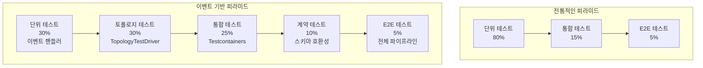

# 13. 이벤트 기반 마이크로서비스 테스팅 전략

**작성일**: 2026-02-06
**브로커**: Redpanda (Testcontainers)
**레벨**: 중급-고급
**소요 시간**: 4-5시간

---

## 실습 목표

이벤트 기반 마이크로서비스에서 신뢰성 있는 테스트 전략을 구축합니다. 단위 테스트부터 E2E 테스트까지 다계층 테스트 피라미드를 구현하여 프로덕션 배포 전 품질을 보장합니다.

**핵심 학습 내용**:
- 이벤트 기반 시스템의 테스트 피라미드
- Testcontainers로 실제 Redpanda 환경 구성
- Kafka Streams TopologyTestDriver 활용
- 스키마 계약 테스트 (Schema Contract Testing)
- 비동기 검증 전략 (Awaitility)

---

## 이벤트 기반 시스템의 테스트 피라미드

전통적인 테스트 피라미드를 이벤트 기반 시스템에 맞게 조정해야 합니다.

### 전통적인 테스트 피라미드 vs 이벤트 기반



### 계층별 특징

| 계층 | 목적 | 도구 | 실행 시간 | 비율 |
|------|------|------|-----------|------|
| **단위 테스트** | 개별 이벤트 핸들러 로직 검증 | JUnit, Mockito | < 1초 | 30% |
| **토폴로지 테스트** | Kafka Streams 처리 흐름 검증 | TopologyTestDriver | < 5초 | 30% |
| **통합 테스트** | 실제 브로커 연동 검증 | Testcontainers | 10-30초 | 25% |
| **계약 테스트** | 스키마 호환성 검증 | Schema Registry | < 5초 | 10% |
| **E2E 테스트** | 전체 시스템 동작 검증 | Docker Compose | 1-5분 | 5% |

---

## 1. 단위 테스트: MockProducer & MockConsumer

### 목적

Kafka/Redpanda에 의존하지 않고 순수한 비즈니스 로직만 테스트합니다.

### 예시: 주문 이벤트 핸들러

```java
// OrderEventHandler.java
public class OrderEventHandler {

    private final OrderRepository orderRepository;
    private final KafkaTemplate<String, OrderEvent> kafkaTemplate;

    public OrderEventHandler(
            OrderRepository orderRepository,
            KafkaTemplate<String, OrderEvent> kafkaTemplate) {
        this.orderRepository = orderRepository;
        this.kafkaTemplate = kafkaTemplate;
    }

    /**
     * 주문 생성 이벤트를 처리합니다.
     * 비즈니스 로직:
     * 1. 주문을 DB에 저장
     * 2. 금액이 10만원 이상이면 VIP 이벤트 발행
     */
    public void handleOrderCreated(OrderEvent event) {
        Order order = new Order(
            event.getOrderId(),
            event.getCustomerId(),
            event.getAmount(),
            OrderStatus.PENDING
        );

        orderRepository.save(order);

        // 고액 주문은 VIP 이벤트 발행
        if (event.getAmount() >= 100_000) {
            OrderEvent vipEvent = OrderEvent.builder()
                .orderId(event.getOrderId())
                .customerId(event.getCustomerId())
                .amount(event.getAmount())
                .type("VIP_ORDER")
                .build();

            kafkaTemplate.send("vip-orders", vipEvent.getOrderId(), vipEvent);
        }
    }
}
```

### 단위 테스트 구현

```java
// OrderEventHandlerTest.java
import org.junit.jupiter.api.Test;
import org.junit.jupiter.api.extension.ExtendWith;
import org.mockito.InjectMocks;
import org.mockito.Mock;
import org.mockito.junit.jupiter.MockitoExtension;

import static org.mockito.ArgumentMatchers.*;
import static org.mockito.Mockito.*;
import static org.assertj.core.api.Assertions.*;

@ExtendWith(MockitoExtension.class)
class OrderEventHandlerTest {

    @Mock
    private OrderRepository orderRepository;

    @Mock
    private KafkaTemplate<String, OrderEvent> kafkaTemplate;

    @InjectMocks
    private OrderEventHandler handler;

    @Test
    void 일반_주문은_저장만_수행한다() {
        // Given: 9만원 주문 (VIP 기준 미달)
        OrderEvent event = OrderEvent.builder()
            .orderId("ORD-001")
            .customerId("CUST-001")
            .amount(90_000)
            .build();

        // When: 핸들러 실행
        handler.handleOrderCreated(event);

        // Then: DB 저장만 수행, VIP 이벤트 발행 없음
        verify(orderRepository).save(any(Order.class));
        verify(kafkaTemplate, never()).send(anyString(), anyString(), any());
    }

    @Test
    void VIP_주문은_저장_후_VIP_이벤트_발행한다() {
        // Given: 10만원 이상 주문
        OrderEvent event = OrderEvent.builder()
            .orderId("ORD-002")
            .customerId("CUST-002")
            .amount(150_000)
            .build();

        // When: 핸들러 실행
        handler.handleOrderCreated(event);

        // Then: DB 저장 + VIP 이벤트 발행
        verify(orderRepository).save(argThat(order ->
            order.getOrderId().equals("ORD-002") &&
            order.getAmount() == 150_000
        ));

        verify(kafkaTemplate).send(
            eq("vip-orders"),
            eq("ORD-002"),
            argThat(vipEvent ->
                vipEvent.getType().equals("VIP_ORDER") &&
                vipEvent.getAmount() == 150_000
            )
        );
    }
}
```

**핵심 포인트**:
- **빠른 실행**: 외부 의존성 없음 (< 100ms)
- **격리된 테스트**: 다른 서비스 영향 없음
- **비즈니스 로직 집중**: Kafka 연결 문제와 분리

---

## 2. 토폴로지 테스트: Kafka Streams TopologyTestDriver

### 목적

Kafka Streams 애플리케이션의 처리 흐름을 브로커 없이 검증합니다.

### 예시: 주문 집계 Streams 애플리케이션

```java
// OrderAggregationTopology.java
public class OrderAggregationTopology {

    /**
     * 주문 이벤트를 고객별로 집계하는 토폴로지를 생성합니다.
     *
     * 처리 흐름:
     * 1. orders 토픽에서 주문 이벤트 읽기
     * 2. 고객 ID로 그룹화
     * 3. 주문 금액 합계 계산
     * 4. customer-totals 토픽에 결과 발행
     */
    public static Topology build() {
        StreamsBuilder builder = new StreamsBuilder();

        KStream<String, OrderEvent> orders = builder.stream(
            "orders",
            Consumed.with(Serdes.String(), new JsonSerde<>(OrderEvent.class))
        );

        orders
            .groupBy(
                (key, order) -> order.getCustomerId(),
                Grouped.with(Serdes.String(), new JsonSerde<>(OrderEvent.class))
            )
            .aggregate(
                CustomerTotal::new,
                (customerId, order, total) -> {
                    total.setCustomerId(customerId);
                    total.addOrder(order.getAmount());
                    return total;
                },
                Materialized.<String, CustomerTotal, KeyValueStore<Bytes, byte[]>>as("customer-totals-store")
                    .withKeySerde(Serdes.String())
                    .withValueSerde(new JsonSerde<>(CustomerTotal.class))
            )
            .toStream()
            .to("customer-totals", Produced.with(Serdes.String(), new JsonSerde<>(CustomerTotal.class)));

        return builder.build();
    }
}
```

### TopologyTestDriver 테스트

```java
// OrderAggregationTopologyTest.java
import org.apache.kafka.streams.*;
import org.apache.kafka.streams.test.*;
import org.junit.jupiter.api.*;

import static org.assertj.core.api.Assertions.*;

class OrderAggregationTopologyTest {

    private TopologyTestDriver testDriver;
    private TestInputTopic<String, OrderEvent> inputTopic;
    private TestOutputTopic<String, CustomerTotal> outputTopic;

    @BeforeEach
    void setUp() {
        // Given: 토폴로지 생성
        Topology topology = OrderAggregationTopology.build();

        Properties props = new Properties();
        props.put(StreamsConfig.APPLICATION_ID_CONFIG, "test");
        props.put(StreamsConfig.BOOTSTRAP_SERVERS_CONFIG, "dummy:1234");

        testDriver = new TopologyTestDriver(topology, props);

        // Input/Output 토픽 생성
        inputTopic = testDriver.createInputTopic(
            "orders",
            new StringSerializer(),
            new JsonSerializer<>()
        );

        outputTopic = testDriver.createOutputTopic(
            "customer-totals",
            new StringDeserializer(),
            new JsonDeserializer<>(CustomerTotal.class)
        );
    }

    @AfterEach
    void tearDown() {
        testDriver.close();
    }

    @Test
    void 고객별_주문금액을_집계한다() {
        // Given: 같은 고객의 주문 3건
        inputTopic.pipeInput("key1", createOrder("ORD-001", "CUST-A", 10_000));
        inputTopic.pipeInput("key2", createOrder("ORD-002", "CUST-A", 20_000));
        inputTopic.pipeInput("key3", createOrder("ORD-003", "CUST-A", 30_000));

        // When: 출력 토픽에서 결과 읽기
        var records = outputTopic.readRecordsToList();

        // Then: 3개의 중간 결과 (누적 집계)
        assertThat(records).hasSize(3);

        // 마지막 레코드가 최종 합계
        CustomerTotal finalTotal = records.get(2).getValue();
        assertThat(finalTotal.getCustomerId()).isEqualTo("CUST-A");
        assertThat(finalTotal.getTotalAmount()).isEqualTo(60_000);
        assertThat(finalTotal.getOrderCount()).isEqualTo(3);
    }

    @Test
    void 여러_고객의_주문을_독립적으로_집계한다() {
        // Given: 고객 A와 고객 B의 주문
        inputTopic.pipeInput(createOrder("ORD-001", "CUST-A", 10_000));
        inputTopic.pipeInput(createOrder("ORD-002", "CUST-B", 5_000));
        inputTopic.pipeInput(createOrder("ORD-003", "CUST-A", 15_000));

        // When: 출력 레코드 수집
        var records = outputTopic.readRecordsToList();

        // Then: 3개의 레코드 (A, B, A)
        assertThat(records).hasSize(3);

        // 고객 A의 최종 합계: 25,000
        assertThat(records.get(2).getValue())
            .satisfies(total -> {
                assertThat(total.getCustomerId()).isEqualTo("CUST-A");
                assertThat(total.getTotalAmount()).isEqualTo(25_000);
            });

        // 고객 B의 합계: 5,000
        assertThat(records.get(1).getValue())
            .satisfies(total -> {
                assertThat(total.getCustomerId()).isEqualTo("CUST-B");
                assertThat(total.getTotalAmount()).isEqualTo(5_000);
            });
    }

    @Test
    void State_Store에_집계_결과가_저장된다() {
        // Given: 주문 발행
        inputTopic.pipeInput(createOrder("ORD-001", "CUST-A", 10_000));

        // When: State Store 조회
        KeyValueStore<String, CustomerTotal> store = testDriver.getKeyValueStore("customer-totals-store");
        CustomerTotal total = store.get("CUST-A");

        // Then: State Store에 저장됨
        assertThat(total).isNotNull();
        assertThat(total.getTotalAmount()).isEqualTo(10_000);
    }

    private OrderEvent createOrder(String orderId, String customerId, int amount) {
        return OrderEvent.builder()
            .orderId(orderId)
            .customerId(customerId)
            .amount(amount)
            .build();
    }
}
```

**핵심 포인트**:
- **빠른 실행**: 실제 브로커 불필요 (< 1초)
- **디버깅 용이**: 단계별 중간 결과 확인 가능
- **State Store 검증**: 내부 상태 직접 접근

---

## 3. 통합 테스트: Testcontainers

### 목적

실제 Redpanda 브로커를 Docker 컨테이너로 실행하여 완전한 환경에서 테스트합니다.

### Spring Boot 통합 테스트

```java
// OrderServiceIntegrationTest.java
import org.junit.jupiter.api.Test;
import org.springframework.beans.factory.annotation.Autowired;
import org.springframework.boot.test.context.SpringBootTest;
import org.springframework.kafka.core.KafkaTemplate;
import org.springframework.test.context.DynamicPropertyRegistry;
import org.springframework.test.context.DynamicPropertySource;
import org.testcontainers.containers.GenericContainer;
import org.testcontainers.junit.jupiter.Container;
import org.testcontainers.junit.jupiter.Testcontainers;
import org.testcontainers.utility.DockerImageName;

import java.time.Duration;

import static org.assertj.core.api.Assertions.*;
import static org.awaitility.Awaitility.*;

@SpringBootTest
@Testcontainers
class OrderServiceIntegrationTest {

    /**
     * Testcontainers로 Redpanda 실행
     * 이유: 실제 브로커 환경에서 테스트하여 네트워크, 직렬화 등의 문제를 사전 발견
     */
    @Container
    static GenericContainer<?> redpanda = new GenericContainer<>(
            DockerImageName.parse("docker.redpanda.com/redpandadata/redpanda:v25.3.1"))
        .withExposedPorts(9092, 8081)
        .withCommand(
            "redpanda", "start",
            "--kafka-addr", "internal://0.0.0.0:9092,external://0.0.0.0:19092",
            "--advertise-kafka-addr", "internal://redpanda:9092,external://localhost:19092",
            "--schema-registry-addr", "internal://0.0.0.0:8081,external://0.0.0.0:18081",
            "--mode", "dev-container"
        );

    /**
     * Spring Boot 속성을 동적으로 설정합니다.
     * Testcontainers가 랜덤 포트를 할당하므로 런타임에 주소를 주입해야 합니다.
     */
    @DynamicPropertySource
    static void kafkaProperties(DynamicPropertyRegistry registry) {
        registry.add("spring.kafka.bootstrap-servers",
            () -> "localhost:" + redpanda.getMappedPort(9092));
        registry.add("spring.kafka.properties.schema.registry.url",
            () -> "http://localhost:" + redpanda.getMappedPort(8081));
    }

    @Autowired
    private OrderService orderService;

    @Autowired
    private OrderRepository orderRepository;

    @Autowired
    private KafkaTemplate<String, OrderEvent> kafkaTemplate;

    @Test
    void 주문_생성_이벤트를_처리하여_DB에_저장한다() {
        // Given: 주문 이벤트 발행
        OrderEvent event = OrderEvent.builder()
            .orderId("ORD-INT-001")
            .customerId("CUST-001")
            .amount(50_000)
            .status("PENDING")
            .build();

        kafkaTemplate.send("orders", event.getOrderId(), event);

        // When: 비동기 처리 대기 (최대 10초)
        // 이유: Kafka Consumer가 폴링하여 처리하는 시간이 필요
        await()
            .atMost(Duration.ofSeconds(10))
            .untilAsserted(() -> {
                // Then: DB에 주문 저장됨
                var savedOrder = orderRepository.findById("ORD-INT-001");
                assertThat(savedOrder).isPresent();
                assertThat(savedOrder.get().getAmount()).isEqualTo(50_000);
                assertThat(savedOrder.get().getStatus()).isEqualTo(OrderStatus.PENDING);
            });
    }

    @Test
    void VIP_주문은_별도_토픽에_발행된다() {
        // Given: 10만원 이상 VIP 주문
        OrderEvent event = OrderEvent.builder()
            .orderId("ORD-VIP-001")
            .customerId("CUST-VIP")
            .amount(150_000)
            .status("PENDING")
            .build();

        // Consumer로 vip-orders 토픽 구독 시작
        var consumer = createTestConsumer("vip-orders");

        // When: 주문 이벤트 발행
        kafkaTemplate.send("orders", event.getOrderId(), event);

        // Then: vip-orders 토픽에 이벤트 발행됨
        await()
            .atMost(Duration.ofSeconds(10))
            .untilAsserted(() -> {
                var records = consumer.poll(Duration.ofSeconds(1));
                assertThat(records).hasSize(1);

                var vipEvent = records.iterator().next().value();
                assertThat(vipEvent.getOrderId()).isEqualTo("ORD-VIP-001");
                assertThat(vipEvent.getType()).isEqualTo("VIP_ORDER");
            });
    }

    @Test
    void 잘못된_이벤트는_DLQ로_전송된다() {
        // Given: 필수 필드 누락된 잘못된 이벤트
        String malformedJson = "{\"orderId\":\"ORD-BAD\"}";  // amount 필드 없음

        kafkaTemplate.send("orders", "bad-key", malformedJson);

        // When: DLQ Consumer 구독
        var dlqConsumer = createTestConsumer("orders-dlq");

        // Then: DLQ에 에러 이벤트 전송됨
        await()
            .atMost(Duration.ofSeconds(10))
            .untilAsserted(() -> {
                var records = dlqConsumer.poll(Duration.ofSeconds(1));
                assertThat(records).hasSize(1);

                var headers = records.iterator().next().headers();
                assertThat(headers.lastHeader("error_type").value())
                    .asString()
                    .contains("DeserializationException");
            });
    }
}
```

**핵심 포인트**:
- **실제 브로커 사용**: 프로덕션과 동일한 환경
- **자동 리소스 관리**: 테스트 후 컨테이너 자동 종료
- **CI/CD 통합**: Docker만 있으면 어디서나 실행

---

## 4. 계약 테스트: 스키마 호환성 검증

### 목적

Producer와 Consumer 간 스키마 변경이 호환되는지 검증합니다.

### Avro 스키마 정의

```json
// OrderEvent-v1.avsc
{
  "type": "record",
  "name": "OrderEvent",
  "namespace": "com.example.events",
  "fields": [
    {"name": "orderId", "type": "string"},
    {"name": "customerId", "type": "string"},
    {"name": "amount", "type": "int"},
    {"name": "status", "type": "string"}
  ]
}
```

### 스키마 호환성 테스트

```java
// SchemaCompatibilityTest.java
import io.confluent.kafka.schemaregistry.client.SchemaRegistryClient;
import io.confluent.kafka.schemaregistry.client.rest.exceptions.RestClientException;
import org.apache.avro.Schema;
import org.junit.jupiter.api.Test;
import org.springframework.beans.factory.annotation.Autowired;
import org.springframework.boot.test.context.SpringBootTest;

import java.io.IOException;

import static org.assertj.core.api.Assertions.*;

@SpringBootTest
class SchemaCompatibilityTest {

    @Autowired
    private SchemaRegistryClient schemaRegistry;

    @Test
    void 새로운_스키마가_기존_스키마와_호환된다() throws IOException, RestClientException {
        // Given: 기존 스키마 (v1)
        Schema oldSchema = new Schema.Parser().parse(
            getClass().getResourceAsStream("/avro/OrderEvent-v1.avsc")
        );

        // When: 새 스키마 (v2 - 필드 추가)
        Schema newSchema = new Schema.Parser().parse("""
            {
              "type": "record",
              "name": "OrderEvent",
              "namespace": "com.example.events",
              "fields": [
                {"name": "orderId", "type": "string"},
                {"name": "customerId", "type": "string"},
                {"name": "amount", "type": "int"},
                {"name": "status", "type": "string"},
                {"name": "createdAt", "type": "string", "default": ""}
              ]
            }
        """);

        // Then: Schema Registry에 호환성 체크
        boolean isCompatible = schemaRegistry.testCompatibility(
            "orders-value",
            newSchema
        );

        assertThat(isCompatible).isTrue();
    }

    @Test
    void 필수_필드_제거는_호환되지_않는다() throws IOException {
        // Given: 기존 스키마
        Schema oldSchema = new Schema.Parser().parse(
            getClass().getResourceAsStream("/avro/OrderEvent-v1.avsc")
        );

        // When: 필수 필드 제거 (amount 삭제)
        Schema breakingSchema = new Schema.Parser().parse("""
            {
              "type": "record",
              "name": "OrderEvent",
              "namespace": "com.example.events",
              "fields": [
                {"name": "orderId", "type": "string"},
                {"name": "customerId", "type": "string"},
                {"name": "status", "type": "string"}
              ]
            }
        """);

        // Then: 호환되지 않음
        assertThatThrownBy(() ->
            schemaRegistry.testCompatibility("orders-value", breakingSchema)
        ).isInstanceOf(RestClientException.class)
         .hasMessageContaining("Schema is incompatible");
    }
}
```

**호환성 유형**:

| 유형 | 설명 | 허용 변경 |
|------|------|-----------|
| **BACKWARD** | Consumer가 이전 스키마 읽기 | 필드 추가 (default 필요) |
| **FORWARD** | Consumer가 다음 스키마 읽기 | 필드 삭제 |
| **FULL** | 양방향 호환 | 필드 추가 (default) + 삭제 |
| **NONE** | 호환성 체크 안 함 | 모든 변경 |

---

## 5. E2E 테스트: 전체 파이프라인

### 목적

Producer → Broker → Consumer → DB → Output 토픽 전체 흐름을 검증합니다.

### Docker Compose 테스트 환경

```yaml
# docker-compose.test.yml
version: '3.8'

services:
  redpanda:
    image: docker.redpanda.com/redpandadata/redpanda:v25.3.1
    command:
      - redpanda start
      - --mode dev-container
    ports:
      - "19092:19092"
      - "18081:18081"

  postgres:
    image: postgres:16
    environment:
      POSTGRES_USER: test
      POSTGRES_PASSWORD: test
      POSTGRES_DB: orders
    ports:
      - "5432:5432"

  order-service:
    build: .
    environment:
      SPRING_KAFKA_BOOTSTRAP_SERVERS: redpanda:9092
      SPRING_DATASOURCE_URL: jdbc:postgresql://postgres:5432/orders
    depends_on:
      - redpanda
      - postgres
```

### E2E 테스트 구현

```java
// OrderE2ETest.java
@SpringBootTest(webEnvironment = WebEnvironment.RANDOM_PORT)
@Testcontainers
class OrderE2ETest {

    @Container
    static DockerComposeContainer environment = new DockerComposeContainer(
        new File("docker-compose.test.yml")
    )
    .withExposedService("redpanda", 19092)
    .withExposedService("postgres", 5432);

    @Test
    void 주문_생성부터_알림_발송까지_전체_플로우() {
        // Given: 주문 생성 API 호출
        var orderRequest = new CreateOrderRequest("CUST-001", 150_000);
        var response = restTemplate.postForEntity(
            "/api/orders",
            orderRequest,
            OrderResponse.class
        );

        assertThat(response.getStatusCode()).isEqualTo(HttpStatus.CREATED);
        String orderId = response.getBody().getOrderId();

        // When: 비동기 처리 대기
        await().atMost(Duration.ofSeconds(30)).untilAsserted(() -> {
            // Then: 1. DB에 주문 저장됨
            var order = orderRepository.findById(orderId);
            assertThat(order).isPresent();

            // Then: 2. VIP 토픽에 이벤트 발행됨
            var vipEvents = consumeFromTopic("vip-orders");
            assertThat(vipEvents)
                .anyMatch(e -> e.getOrderId().equals(orderId));

            // Then: 3. 알림 발송됨 (외부 API 호출 Mock)
            verify(notificationClient).sendVipNotification(eq(orderId));
        });
    }
}
```

---

## Awaitility: 비동기 검증 라이브러리

이벤트 기반 시스템은 비동기 처리가 많아서 결과가 즉시 나타나지 않습니다. Awaitility는 조건이 충족될 때까지 재시도하며 기다립니다.

### 기본 사용법

```java
import static org.awaitility.Awaitility.*;

// 최대 10초 대기, 100ms마다 재시도
await()
    .atMost(Duration.ofSeconds(10))
    .pollInterval(Duration.ofMillis(100))
    .untilAsserted(() -> {
        assertThat(orderRepository.findById("ORD-001")).isPresent();
    });
```

### 고급 패턴

```java
// 1. 조건 만족까지 대기
await().until(() -> orderRepository.count() > 0);

// 2. 예외 무시하고 계속 재시도
await()
    .ignoreExceptions()
    .untilAsserted(() -> {
        var order = orderRepository.findById("ORD-001").orElseThrow();
        assertThat(order.getStatus()).isEqualTo(OrderStatus.COMPLETED);
    });

// 3. 커스텀 폴링 전략
await()
    .pollDelay(Duration.ofMillis(500))  // 첫 체크 전 500ms 대기
    .pollInterval(Duration.ofSeconds(1))  // 1초마다 재시도
    .atMost(Duration.ofMinutes(2))
    .until(() -> paymentService.isCompleted("PAY-001"));
```

---

## 실습 체크리스트

- [ ] **단위 테스트** (MockProducer/MockConsumer)
  - [ ] 이벤트 핸들러 로직 테스트
  - [ ] Mockito로 KafkaTemplate Mock
  - [ ] 비즈니스 로직 검증
- [ ] **토폴로지 테스트** (TopologyTestDriver)
  - [ ] Kafka Streams 토폴로지 생성
  - [ ] TestInputTopic/TestOutputTopic 사용
  - [ ] State Store 검증
  - [ ] 집계 로직 테스트
- [ ] **통합 테스트** (Testcontainers)
  - [ ] Redpanda 컨테이너 실행
  - [ ] Spring Boot 애플리케이션 통합
  - [ ] 실제 메시지 발행/소비
  - [ ] Awaitility로 비동기 검증
  - [ ] DLQ 동작 확인
- [ ] **계약 테스트** (Schema Registry)
  - [ ] Avro 스키마 정의
  - [ ] 호환성 테스트 작성
  - [ ] BACKWARD/FORWARD 호환성 확인
- [ ] **E2E 테스트** (Docker Compose)
  - [ ] 전체 인프라 구성
  - [ ] 전체 파이프라인 검증
  - [ ] 외부 시스템 Mock
- [ ] CI/CD 파이프라인 통합

---

## 다음 단계

- **13장**: 운영 및 배포 전략 - 프로덕션 운영과 배포 패턴

---

## 참고 자료

- [Testcontainers 공식 문서](https://testcontainers.com/)
- [Kafka Streams Testing](https://kafka.apache.org/documentation/streams/developer-guide/testing.html)
- [Awaitility 가이드](https://github.com/awaitility/awaitility)
- [Spring Kafka Testing](https://docs.spring.io/spring-kafka/reference/testing.html)
- [Schema Registry Testing](https://docs.confluent.io/platform/current/schema-registry/develop/maven-plugin.html)
