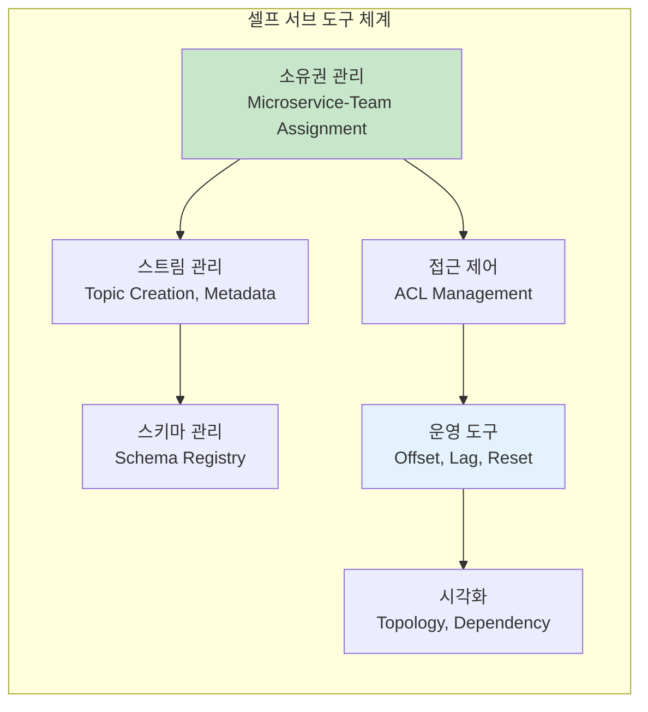
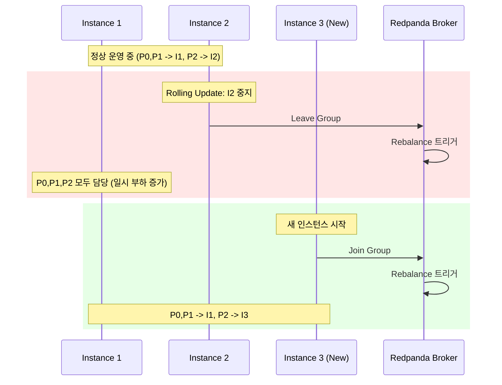
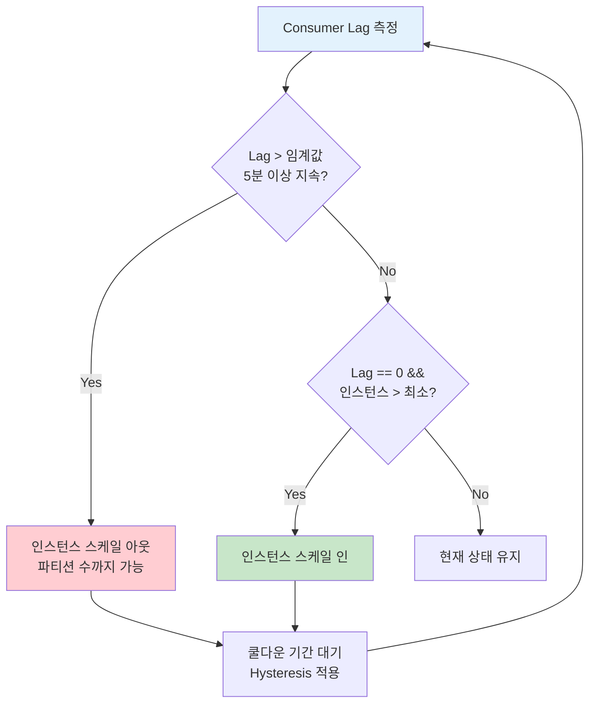
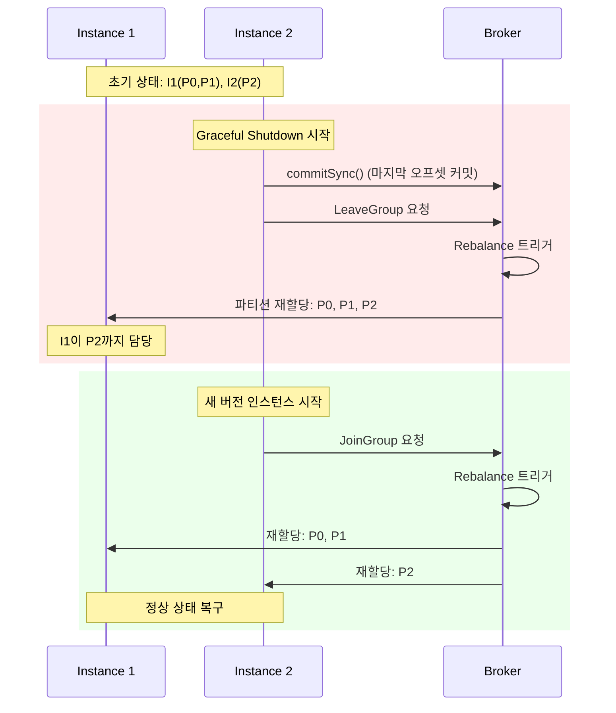
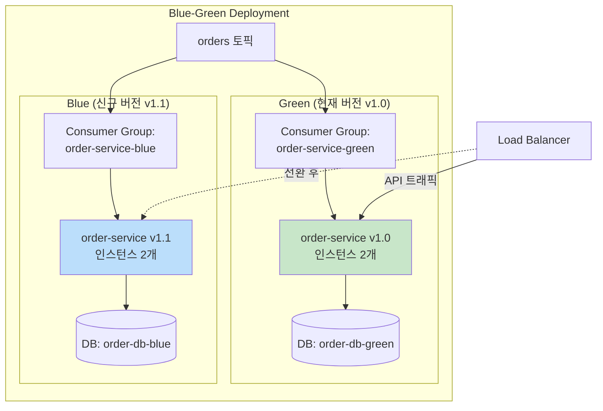
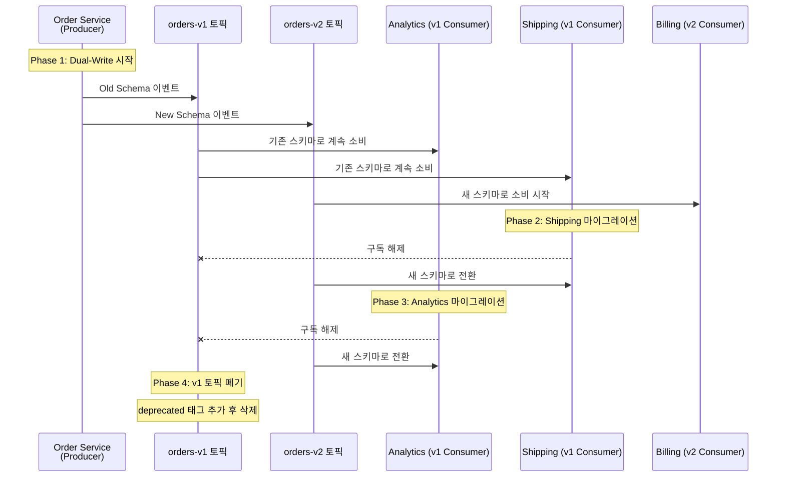
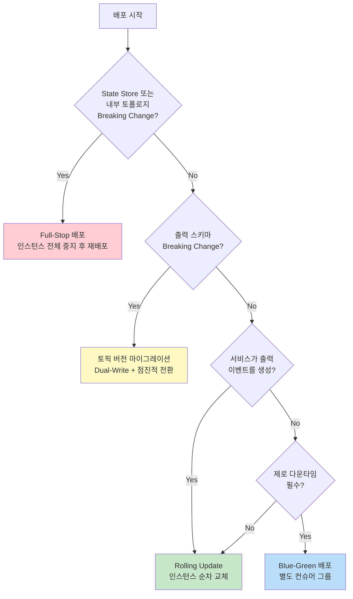

# 14. 지원 도구와 배포 전략 (Supportive Tooling & Deployment Patterns)

**작성일**: 2026-02-06
**브로커**: Redpanda
**레벨**: 중급~고급
**소요 시간**: 3-4시간
**참조 문서**: Ch14 지원 도구, Ch16 이벤트 기반 마이크로서비스 배포

---

## 실습 목표

이벤트 기반 마이크로서비스를 프로덕션에서 안정적으로 운영하기 위한 **지원 도구(Supportive Tooling)**와 **배포 전략(Deployment Patterns)**을 실습합니다.

마이크로서비스가 수십, 수백 개로 늘어나면 "코드를 잘 짜는 것"만으로는 부족합니다. 토픽을 누가 소유하는지, 컨슈머 그룹이 얼마나 뒤처져 있는지, 스키마가 변경되었을 때 어떤 서비스가 영향을 받는지 파악할 수 있는 도구가 필요합니다. 배포 시에는 컨슈머 그룹 리밸런싱(Rebalancing)과 오프셋 관리를 고려하지 않으면 메시지 중복이나 유실이 발생합니다.

**핵심 학습 내용**:
- rpk CLI를 사용한 토픽, 컨슈머 그룹, ACL 관리
- Redpanda Console로 실시간 모니터링
- Prometheus + Grafana 기반 메트릭 수집 및 대시보드 구성
- Rolling Update 시 컨슈머 그룹 리밸런싱 관찰
- Blue-Green 배포의 이벤트 기반 시스템 적용
- Breaking Schema Change의 토픽 버전 마이그레이션

---

## 이론 배경

### 왜 지원 도구가 중요한가?

마이크로서비스가 5개일 때는 팀원 모두가 "어떤 서비스가 어떤 토픽을 사용하는지" 암묵적으로 알고 있습니다. 하지만 50개, 200개로 늘어나면 더 이상 암묵적 지식으로 관리할 수 없습니다. 특정 토픽의 스키마를 변경하면 어떤 서비스가 깨지는지, 컨슈머 그룹 lag이 증가하는 원인이 무엇인지 즉시 파악해야 합니다.

Ch14에서 강조하는 핵심 원칙은 **셀프 서브(Self-Serve) 도구**입니다. 운영팀에 티켓을 걸고 기다리는 대신, 개발팀이 스스로 토픽을 생성하고, 오프셋을 리셋하고, 접근 권한을 설정할 수 있어야 합니다. 이러한 자율성이 마이크로서비스 아키텍처의 확장성을 보장합니다.



### 이벤트 기반 시스템의 배포 과제

전통적인 REST API 서비스의 배포와 이벤트 기반 서비스의 배포는 근본적으로 다릅니다. REST API는 인스턴스를 교체하면 로드 밸런서가 트래픽을 새 인스턴스로 보내면 됩니다. 하지만 이벤트 기반 서비스는 다음과 같은 고유한 과제가 있습니다.

**컨슈머 그룹 리밸런싱(Consumer Group Rebalancing)**: 컨슈머 인스턴스가 중지되면 해당 인스턴스에 할당된 파티션이 나머지 인스턴스에 재분배됩니다. 이 과정에서 일시적으로 메시지 처리가 중단됩니다. `session.timeout.ms`와 `max.poll.interval.ms` 설정을 적절히 튜닝하지 않으면 리밸런싱이 불필요하게 자주 발생하거나 너무 느리게 감지됩니다.

**오프셋 관리(Offset Management)**: 배포 중 인스턴스가 교체될 때, 마지막으로 커밋된 오프셋부터 다시 처리를 시작합니다. 오프셋 커밋 전략에 따라 메시지 중복 처리가 발생할 수 있으므로 멱등성(Idempotency) 보장이 필수입니다.

**State Store 관리**: Stateful 서비스는 배포 시 State Store를 재구축해야 할 수 있습니다. Changelog 토픽에서 상태를 복구하는 시간 동안 해당 서비스는 SLA를 충족하지 못할 수 있습니다.



---

## 환경 구성

### Docker Compose

이 실습에서는 Redpanda 브로커, Redpanda Console, Prometheus, Grafana, 그리고 두 개의 Spring Boot 애플리케이션 인스턴스를 실행합니다. 두 개의 인스턴스는 Rolling Update 시뮬레이션에 사용됩니다.

```yaml
# docker-compose.yml
version: '3.8'

services:
  redpanda:
    image: docker.redpanda.com/redpandadata/redpanda:v25.3.1
    container_name: redpanda
    command:
      - redpanda
      - start
      - --smp 1
      - --memory 1G
      - --overprovisioned
      - --kafka-addr internal://0.0.0.0:9092,external://0.0.0.0:19092
      - --advertise-kafka-addr internal://redpanda:9092,external://localhost:19092
      - --schema-registry-addr internal://0.0.0.0:8081,external://0.0.0.0:18081
      - --rpc-addr redpanda:33145
      - --advertise-rpc-addr redpanda:33145
      - --mode dev-container
    ports:
      - "19092:19092"   # Kafka API
      - "18081:18081"   # Schema Registry
      - "19644:9644"    # Admin API (Prometheus metrics)
    healthcheck:
      test: ["CMD", "rpk", "cluster", "health"]
      interval: 10s
      timeout: 5s
      retries: 5

  console:
    image: docker.redpanda.com/redpandadata/console:v2.7.2
    container_name: redpanda-console
    ports:
      - "8080:8080"
    environment:
      KAFKA_BROKERS: redpanda:9092
      KAFKA_SCHEMAREGISTRY_ENABLED: "true"
      KAFKA_SCHEMAREGISTRY_URLS: http://redpanda:8081
      REDPANDA_ADMINAPI_ENABLED: "true"
      REDPANDA_ADMINAPI_URLS: http://redpanda:9644
    depends_on:
      redpanda:
        condition: service_healthy

  prometheus:
    image: prom/prometheus:v2.53.0
    container_name: prometheus
    ports:
      - "9090:9090"
    volumes:
      - ./config/prometheus.yml:/etc/prometheus/prometheus.yml
    depends_on:
      redpanda:
        condition: service_healthy

  grafana:
    image: grafana/grafana:11.1.0
    container_name: grafana
    ports:
      - "3000:3000"
    environment:
      GF_SECURITY_ADMIN_USER: admin
      GF_SECURITY_ADMIN_PASSWORD: admin
      GF_AUTH_ANONYMOUS_ENABLED: "true"
    volumes:
      - ./config/grafana/provisioning:/etc/grafana/provisioning
      - grafana-data:/var/lib/grafana
    depends_on:
      - prometheus

  # Spring Boot App Instance 1
  order-service-1:
    build: .
    container_name: order-service-1
    ports:
      - "8081:8080"
    environment:
      SPRING_APPLICATION_NAME: order-service
      SPRING_KAFKA_BOOTSTRAP_SERVERS: redpanda:9092
      SPRING_KAFKA_CONSUMER_GROUP_ID: order-service-group
      SERVER_PORT: 8080
      INSTANCE_ID: instance-1
    depends_on:
      redpanda:
        condition: service_healthy

  # Spring Boot App Instance 2
  order-service-2:
    build: .
    container_name: order-service-2
    ports:
      - "8082:8080"
    environment:
      SPRING_APPLICATION_NAME: order-service
      SPRING_KAFKA_BOOTSTRAP_SERVERS: redpanda:9092
      SPRING_KAFKA_CONSUMER_GROUP_ID: order-service-group
      SERVER_PORT: 8080
      INSTANCE_ID: instance-2
    depends_on:
      redpanda:
        condition: service_healthy

volumes:
  grafana-data:
```

**구성 설명**:
- **redpanda**: 단일 노드 브로커입니다. Admin API(9644 포트)에서 Prometheus 메트릭을 노출합니다.
- **console**: Redpanda Console은 토픽 브라우징, 메시지 검사, 컨슈머 그룹 lag 모니터링을 웹 UI로 제공합니다.
- **prometheus**: Redpanda의 메트릭 엔드포인트를 주기적으로 수집합니다.
- **grafana**: Prometheus 데이터를 시각화하는 대시보드입니다.
- **order-service-1, order-service-2**: 같은 컨슈머 그룹에 속하는 두 인스턴스입니다. Rolling Update 시 한 인스턴스를 중지하고 새 버전으로 교체하는 시뮬레이션에 사용합니다.

### Prometheus 설정

```yaml
# config/prometheus.yml
global:
  scrape_interval: 10s
  evaluation_interval: 10s

scrape_configs:
  - job_name: 'redpanda'
    static_configs:
      - targets: ['redpanda:9644']
    metrics_path: /public_metrics

  - job_name: 'spring-boot'
    metrics_path: /actuator/prometheus
    static_configs:
      - targets:
          - 'order-service-1:8080'
          - 'order-service-2:8080'
```

**왜 `/public_metrics` 경로를 사용하나?**: Redpanda는 `/public_metrics` 경로에서 Prometheus 형식의 메트릭을 노출합니다. 이 엔드포인트는 인증 없이 접근 가능하며, 브로커 상태, 토픽별 처리량, 파티션 분포 등 핵심 지표를 제공합니다.

---

## Part 1: 지원 도구 (Supportive Tooling)

### 1.1 rpk CLI를 사용한 스트림 관리

rpk는 Redpanda의 공식 CLI 도구로, 토픽 생성부터 컨슈머 그룹 관리까지 모든 운영 작업을 명령줄에서 수행할 수 있습니다. 셀프 서브 도구의 핵심입니다.

#### 토픽 생성 및 설정

```bash
# 컨테이너 실행
docker-compose up -d

# 토픽 생성: 파티션 3개, 복제 팩터 1, 보존 기간 7일
docker exec -it redpanda rpk topic create orders \
  --partitions 3 \
  --replicas 1 \
  --config retention.ms=604800000 \
  --config cleanup.policy=delete

# 고보존 토픽: 무기한 보존 (감사 로그용)
docker exec -it redpanda rpk topic create audit-events \
  --partitions 1 \
  --replicas 1 \
  --config retention.ms=-1 \
  --config cleanup.policy=compact

# 대용량 토픽: 짧은 보존, 많은 파티션
docker exec -it redpanda rpk topic create click-events \
  --partitions 6 \
  --replicas 1 \
  --config retention.ms=86400000 \
  --config max.message.bytes=1048576
```

**토픽 설계 이유**: Ch14에서 강조하듯이, 토픽의 파티션 수, 보존 정책, 복제 팩터는 비즈니스 요구사항에 따라 달라야 합니다. `orders` 토픽은 3개 파티션으로 적절한 병렬 처리를 보장하면서 7일간 보존합니다. `audit-events`는 규정 준수를 위해 무기한 보존하고 compaction으로 최신 상태만 유지합니다.

#### 토픽 조회 및 메타데이터 확인

```bash
# 전체 토픽 목록
docker exec -it redpanda rpk topic list

# 특정 토픽 상세 정보
docker exec -it redpanda rpk topic describe orders

# 토픽 설정 확인
docker exec -it redpanda rpk topic describe orders --config
```

출력 예시:
```
NAMESPACE  TOPIC   PARTITIONS  REPLICAS
default    orders  3           1

PARTITION  LEADER  EPOCH  REPLICAS  LOG-START-OFFSET  HIGH-WATERMARK
0          0       1      [0]       0                  0
1          0       1      [0]       0                  0
2          0       1      [0]       0                  0
```

#### 컨슈머 그룹 관리

컨슈머 그룹은 이벤트 기반 시스템의 핵심 운영 대상입니다. 그룹의 상태, lag, 파티션 할당을 실시간으로 파악해야 합니다.

```bash
# 컨슈머 그룹 목록
docker exec -it redpanda rpk group list

# 특정 그룹 상세 정보 (파티션별 lag 확인)
docker exec -it redpanda rpk group describe order-service-group

# 오프셋 리셋: 토픽의 시작점부터 재처리
docker exec -it redpanda rpk group seek order-service-group \
  --to start \
  --topics orders

# 오프셋 리셋: 특정 시점으로 이동
docker exec -it redpanda rpk group seek order-service-group \
  --to 1706745600000 \
  --topics orders

# 오프셋 리셋: 최신 위치로 이동 (과거 메시지 건너뛰기)
docker exec -it redpanda rpk group seek order-service-group \
  --to end \
  --topics orders
```

**오프셋 리셋이 필요한 경우**: Ch14에서 설명하듯이 오프셋 리셋은 (1) 로직 변경 후 전체 재처리가 필요할 때, (2) 과거 데이터가 불필요하여 최신 시점부터 처리를 시작할 때, (3) 멀티 클러스터 장애 복구(Failover) 시 특정 시점으로 맞출 때 사용합니다. 반드시 해당 서비스의 소유 팀만 수행해야 합니다.

### 1.2 Redpanda Console (Web UI)

Redpanda Console은 브라우저에서 `http://localhost:8080`에 접속하여 사용합니다.

**토픽 브라우징과 메시지 검사**:
- Topics 메뉴에서 모든 토픽의 파티션 수, 메시지 수, 처리량을 한눈에 확인합니다.
- 특정 토픽을 선택하면 개별 메시지의 key, value, headers, timestamp를 검사할 수 있습니다.
- 메시지 검색 기능으로 특정 key나 value 패턴을 가진 메시지를 찾을 수 있습니다.

**컨슈머 그룹 Lag 모니터링**:
- Consumer Groups 메뉴에서 그룹별 상태(Stable, Rebalancing, Empty 등)를 확인합니다.
- 파티션별 current offset, log end offset, lag를 실시간으로 추적합니다.
- Lag이 지속적으로 증가하면 컨슈머 인스턴스를 스케일 아웃해야 한다는 신호입니다.

**Schema Registry 관리**:
- Schema Registry 메뉴에서 등록된 스키마 목록과 버전을 확인합니다.
- 스키마 호환성 모드(BACKWARD, FORWARD, FULL)를 설정할 수 있습니다.
- 스키마 변경 이력을 추적하여 어떤 필드가 언제 추가/삭제되었는지 파악합니다.

### 1.3 ACL 관리

접근 제어 목록(ACL)은 Ch14에서 강조하는 핵심 보안 도구입니다. ACL을 Day 1부터 적용하지 않으면, 서비스가 수백 개로 늘어난 후에 추가하는 것은 매우 고통스러운 작업입니다.

```bash
# SASL 사용자 생성
docker exec -it redpanda rpk security user create order-service \
  --password "order-secret" \
  --mechanism SCRAM-SHA-256

docker exec -it redpanda rpk security user create analytics-service \
  --password "analytics-secret" \
  --mechanism SCRAM-SHA-256

# 사용자 목록 확인
docker exec -it redpanda rpk security user list
```

#### 토픽 레벨 ACL 설정

```bash
# order-service에게 orders 토픽 쓰기 권한 부여
docker exec -it redpanda rpk security acl create \
  --allow-principal "User:order-service" \
  --operation write \
  --topic orders

# order-service에게 orders 토픽 읽기 권한도 부여
docker exec -it redpanda rpk security acl create \
  --allow-principal "User:order-service" \
  --operation read \
  --topic orders

# analytics-service에게 orders 토픽 읽기만 허용
docker exec -it redpanda rpk security acl create \
  --allow-principal "User:analytics-service" \
  --operation read \
  --topic orders

# analytics-service에게 orders 토픽 describe 권한 (메타데이터 조회)
docker exec -it redpanda rpk security acl create \
  --allow-principal "User:analytics-service" \
  --operation describe \
  --topic orders

# 컨슈머 그룹 ACL (읽기 서비스에 필수)
docker exec -it redpanda rpk security acl create \
  --allow-principal "User:analytics-service" \
  --operation read \
  --group analytics-group

# ACL 목록 확인
docker exec -it redpanda rpk security acl list
```

**ACL 설계 원칙**: Ch14의 Single Writer Principle에 따라, 하나의 토픽에는 하나의 서비스만 쓰기 권한을 가져야 합니다. 이는 이벤트 스트림의 소유권을 명확하게 만들고, 예기치 않은 데이터 오염을 방지합니다. 다른 서비스가 내부 토픽(changelog, internal stream)에 접근하는 것도 차단하여 Bounded Context를 보호합니다.

#### ACL 접근 제어 테스트

```bash
# order-service로 메시지 발행 (성공해야 함)
docker exec -it redpanda rpk topic produce orders \
  --user order-service \
  --password "order-secret" \
  --sasl-mechanism SCRAM-SHA-256 \
  <<< '{"orderId":"ORD-001","amount":50000}'

# analytics-service로 메시지 발행 시도 (실패해야 함)
docker exec -it redpanda rpk topic produce orders \
  --user analytics-service \
  --password "analytics-secret" \
  --sasl-mechanism SCRAM-SHA-256 \
  <<< '{"orderId":"ORD-002","amount":30000}'
# Expected: AUTHORIZATION_FAILED
```

### 1.4 모니터링 설정

#### Redpanda 핵심 메트릭

Redpanda는 Prometheus 형식으로 메트릭을 노출합니다. 프로덕션 운영에서 반드시 모니터링해야 하는 핵심 메트릭은 다음과 같습니다.

| 메트릭 | 설명 | 경보 기준 |
|--------|------|-----------|
| `redpanda_kafka_consumer_group_lag` | 컨슈머 그룹별 lag | lag > 1000 && 5분 이상 지속 |
| `redpanda_kafka_request_bytes_total` | 토픽별 처리량 (bytes) | 급격한 증가/감소 |
| `redpanda_kafka_partitions` | 토픽별 파티션 수 | 예상치와 불일치 |
| `redpanda_application_uptime` | 브로커 가동 시간 | 재시작 감지 |
| `redpanda_kafka_under_replicated_replicas` | 복제 지연 파티션 | > 0 |

```bash
# Prometheus 메트릭 직접 확인
curl -s http://localhost:19644/public_metrics | grep kafka_consumer_group
```

#### Grafana 대시보드 설정

Grafana(`http://localhost:3000`, admin/admin)에 접속하여 Prometheus 데이터소스를 추가합니다.

```yaml
# config/grafana/provisioning/datasources/prometheus.yml
apiVersion: 1

datasources:
  - name: Prometheus
    type: prometheus
    url: http://prometheus:9090
    access: proxy
    isDefault: true
```

주요 대시보드 패널 쿼리:

```promql
# 컨슈머 그룹 Lag (파티션별)
redpanda_kafka_consumer_group_lag{group="order-service-group"}

# 초당 메시지 처리량
rate(redpanda_kafka_request_bytes_total{topic="orders"}[1m])

# 파티션별 메시지 수
redpanda_kafka_partitions{topic="orders"}
```

**왜 Consumer Lag 모니터링이 가장 중요한가?**: Ch14에서 설명하듯이, Consumer Lag는 서비스 확장의 핵심 신호입니다. Lag이 지속적으로 증가하면 현재 컨슈머 인스턴스 수로는 처리량을 감당할 수 없다는 뜻입니다. 반대로 lag이 항상 0이고 인스턴스가 과도하게 많다면 스케일 다운을 고려해야 합니다.



---

## Part 2: 배포 전략 (Deployment Patterns)

### 2.1 Rolling Update와 컨슈머 그룹 리밸런싱

Rolling Update는 서비스 인스턴스를 하나씩 교체하여 다운타임 없이 배포하는 패턴입니다. Ch16에서 설명하듯이, 이 패턴은 State Store나 내부 토폴로지에 Breaking Change가 없는 경우에만 사용할 수 있습니다.

#### 컨슈머 인스턴스 중지 시 발생하는 일

컨슈머 그룹에 속한 인스턴스가 중지되면, 브로커는 `session.timeout.ms` 이내에 heartbeat를 받지 못한 것을 감지하고 리밸런싱을 트리거합니다. 중지된 인스턴스가 담당하던 파티션은 나머지 인스턴스에 재분배됩니다.



#### 핵심 설정 튜닝

```yaml
# application.yml - Rolling Update 최적화 설정
spring:
  kafka:
    bootstrap-servers: ${SPRING_KAFKA_BOOTSTRAP_SERVERS:localhost:19092}
    consumer:
      group-id: ${SPRING_KAFKA_CONSUMER_GROUP_ID:order-service-group}
      auto-offset-reset: earliest
      enable-auto-commit: false
      properties:
        # 세션 타임아웃: 브로커가 컨슈머 죽음을 감지하는 시간
        # 짧을수록 빠르게 감지하지만, 일시적 GC 등에 의해 오탐 가능
        session.timeout.ms: 10000

        # 하트비트 간격: session.timeout.ms의 1/3 권장
        heartbeat.interval.ms: 3000

        # poll 최대 간격: 이 시간 내에 poll()을 호출하지 않으면 리밸런싱
        # 메시지 처리가 오래 걸리면 이 값을 늘려야 함
        max.poll.interval.ms: 300000

        # 한 번에 가져올 최대 레코드 수
        max.poll.records: 100

        # 파티션 할당 전략: Cooperative 전략으로 점진적 리밸런싱
        partition.assignment.strategy: org.apache.kafka.clients.consumer.CooperativeStickyAssignor
    listener:
      ack-mode: manual
```

**`CooperativeStickyAssignor`를 사용하는 이유**: 기본 할당 전략인 `RangeAssignor`는 리밸런싱 시 모든 파티션을 먼저 회수(revoke)하고 다시 할당합니다. 이 과정에서 전체 컨슈머가 일시적으로 메시지 처리를 중단합니다. `CooperativeStickyAssignor`는 이동이 필요한 파티션만 재할당하여 리밸런싱 영향을 최소화합니다. Rolling Update 시 훨씬 부드러운 전환이 가능합니다.

#### Spring Boot Graceful Shutdown

배포 시 컨슈머가 갑자기 종료되면 처리 중이던 메시지의 오프셋이 커밋되지 않아 중복 처리가 발생합니다. Graceful Shutdown을 구성하면 현재 처리 중인 메시지를 완료하고 오프셋을 커밋한 후에 종료합니다.

```yaml
# application.yml
spring:
  lifecycle:
    timeout-per-shutdown-phase: 30s

server:
  shutdown: graceful
```

```java
// GracefulShutdownConfig.java
import org.apache.kafka.clients.consumer.ConsumerRebalanceListener;
import org.springframework.context.annotation.Bean;
import org.springframework.context.annotation.Configuration;
import org.springframework.kafka.config.ConcurrentKafkaListenerContainerFactory;
import org.springframework.kafka.core.ConsumerFactory;
import org.springframework.kafka.listener.ContainerProperties;

@Configuration
public class KafkaConsumerConfig {

    @Bean
    public ConcurrentKafkaListenerContainerFactory<String, String>
            kafkaListenerContainerFactory(
                ConsumerFactory<String, String> consumerFactory) {

        var factory = new ConcurrentKafkaListenerContainerFactory<String, String>();
        factory.setConsumerFactory(consumerFactory);
        factory.getContainerProperties().setAckMode(ContainerProperties.AckMode.MANUAL);

        // 동시 처리 스레드 수: 파티션 수와 동일하게 설정
        factory.setConcurrency(3);

        // Graceful Shutdown 시 현재 레코드 처리 완료 후 종료
        factory.getContainerProperties().setShutdownTimeout(25000L);

        return factory;
    }
}
```

```java
// OrderConsumer.java
import lombok.extern.slf4j.Slf4j;
import org.springframework.beans.factory.annotation.Value;
import org.springframework.kafka.annotation.KafkaListener;
import org.springframework.kafka.support.Acknowledgment;
import org.springframework.kafka.support.KafkaHeaders;
import org.springframework.messaging.handler.annotation.Header;
import org.springframework.messaging.handler.annotation.Payload;
import org.springframework.stereotype.Service;

@Slf4j
@Service
public class OrderConsumer {

    @Value("${INSTANCE_ID:unknown}")
    private String instanceId;

    @KafkaListener(
        topics = "orders",
        groupId = "${spring.kafka.consumer.group-id}"
    )
    public void consume(
            @Payload String message,
            @Header(KafkaHeaders.RECEIVED_PARTITION) int partition,
            @Header(KafkaHeaders.OFFSET) long offset,
            Acknowledgment ack) {

        log.info("[{}] Received: partition={}, offset={}, message={}",
            instanceId, partition, offset, message);

        // 비즈니스 로직 처리
        processOrder(message);

        // 처리 완료 후 수동 오프셋 커밋
        ack.acknowledge();
        log.info("[{}] Committed: partition={}, offset={}", instanceId, partition, offset);
    }

    private void processOrder(String message) {
        // 시뮬레이션: 처리 시간 100~500ms
        try {
            Thread.sleep((long) (Math.random() * 400 + 100));
        } catch (InterruptedException e) {
            Thread.currentThread().interrupt();
        }
    }
}
```

#### Health Check 엔드포인트

Kubernetes 스타일의 readiness/liveness probe를 구현하여 배포 시스템이 인스턴스 상태를 정확히 파악할 수 있도록 합니다.

```java
// HealthController.java
import org.springframework.beans.factory.annotation.Value;
import org.springframework.http.ResponseEntity;
import org.springframework.kafka.config.KafkaListenerEndpointRegistry;
import org.springframework.web.bind.annotation.GetMapping;
import org.springframework.web.bind.annotation.RestController;

import java.util.Map;

@RestController
public class HealthController {

    @Value("${INSTANCE_ID:unknown}")
    private String instanceId;

    private final KafkaListenerEndpointRegistry registry;

    public HealthController(KafkaListenerEndpointRegistry registry) {
        this.registry = registry;
    }

    /**
     * Liveness Probe: 애플리케이션이 살아있는지 확인합니다.
     * 이 엔드포인트가 실패하면 컨테이너를 재시작합니다.
     */
    @GetMapping("/health/live")
    public ResponseEntity<Map<String, String>> liveness() {
        return ResponseEntity.ok(Map.of(
            "status", "UP",
            "instance", instanceId
        ));
    }

    /**
     * Readiness Probe: 트래픽을 받을 준비가 되었는지 확인합니다.
     * Kafka 컨슈머가 실행 중이어야 Ready 상태입니다.
     * 배포 시 이 엔드포인트가 성공해야 "배포 완료"로 판단합니다.
     */
    @GetMapping("/health/ready")
    public ResponseEntity<Map<String, Object>> readiness() {
        boolean allRunning = registry.getListenerContainers().stream()
            .allMatch(container -> container.isRunning());

        if (allRunning) {
            return ResponseEntity.ok(Map.of(
                "status", "READY",
                "instance", instanceId,
                "consumers", registry.getListenerContainerIds()
            ));
        } else {
            return ResponseEntity.status(503).body(Map.of(
                "status", "NOT_READY",
                "instance", instanceId,
                "reason", "Kafka consumers not yet running"
            ));
        }
    }
}
```

#### Rolling Update 시뮬레이션 스크립트

```bash
#!/bin/bash
# scripts/rolling-update.sh
# Rolling Update 시뮬레이션 스크립트

set -e

echo "=== Rolling Update Simulation ==="
echo ""

# Step 1: 현재 상태 확인
echo "[Step 1] 현재 컨슈머 그룹 상태 확인"
docker exec redpanda rpk group describe order-service-group
echo ""

# Step 2: 테스트 메시지 발행
echo "[Step 2] 테스트 메시지 발행 (백그라운드)"
for i in $(seq 1 50); do
  docker exec redpanda rpk topic produce orders \
    <<< "{\"orderId\":\"ORD-$(printf '%03d' $i)\",\"amount\":$((RANDOM % 100000))}" \
    2>/dev/null
done &
PRODUCER_PID=$!
echo "Producer PID: $PRODUCER_PID"
echo ""

# Step 3: Instance 2 중지 (Rolling Update 시작)
echo "[Step 3] Instance 2 중지 (Graceful Shutdown)"
docker stop order-service-2
echo "Instance 2 stopped. Rebalancing in progress..."
sleep 5

# Step 4: 리밸런싱 후 상태 확인
echo "[Step 4] 리밸런싱 후 컨슈머 그룹 상태"
docker exec redpanda rpk group describe order-service-group
echo ""

# Step 5: Instance 2 재시작 (새 버전 배포)
echo "[Step 5] Instance 2 재시작 (새 버전 시뮬레이션)"
docker start order-service-2
echo "Instance 2 started. Waiting for rejoin..."
sleep 10

# Step 6: 최종 상태 확인
echo "[Step 6] 최종 컨슈머 그룹 상태"
docker exec redpanda rpk group describe order-service-group
echo ""

# Step 7: Lag 확인
echo "[Step 7] Consumer Lag 확인"
docker exec redpanda rpk group describe order-service-group | grep LAG
echo ""

# 정리
wait $PRODUCER_PID 2>/dev/null
echo "=== Rolling Update Simulation Complete ==="
```

### 2.2 Blue-Green 배포

Blue-Green 배포는 신규 버전(Blue)과 기존 버전(Green)을 동시에 운영하다가 트래픽을 전환하는 패턴입니다. 이벤트 기반 시스템에서는 **별도의 컨슈머 그룹**을 사용하여 두 버전이 동일한 토픽을 독립적으로 소비합니다.



#### 두 컨슈머 그룹 접근법

```yaml
# Blue 환경 설정 (docker-compose.blue.yml)
services:
  order-service-blue-1:
    build: ./v1.1
    environment:
      SPRING_KAFKA_CONSUMER_GROUP_ID: order-service-blue
      SPRING_APPLICATION_NAME: order-service-blue
      INSTANCE_ID: blue-1

  order-service-blue-2:
    build: ./v1.1
    environment:
      SPRING_KAFKA_CONSUMER_GROUP_ID: order-service-blue
      SPRING_APPLICATION_NAME: order-service-blue
      INSTANCE_ID: blue-2
```

#### Blue-Green 전환 프로세스

```bash
#!/bin/bash
# scripts/blue-green-deploy.sh

echo "=== Blue-Green Deployment ==="

# Step 1: Blue 환경 시작 (토픽 시작점부터 소비)
echo "[Step 1] Blue 환경 시작"
docker-compose -f docker-compose.blue.yml up -d

# Step 2: Blue가 Green과 동기화될 때까지 대기
echo "[Step 2] Blue Consumer Lag 모니터링"
while true; do
  LAG=$(docker exec redpanda rpk group describe order-service-blue \
    | awk '/LAG/{sum+=$NF} END{print sum}')
  echo "  Blue Consumer Lag: $LAG"
  if [ "$LAG" -eq 0 ] 2>/dev/null; then
    echo "  Blue is caught up!"
    break
  fi
  sleep 5
done

# Step 3: 트래픽 전환
echo "[Step 3] Load Balancer 트래픽을 Blue로 전환"
# 실제 환경에서는 Nginx, HAProxy, 또는 K8s Service를 업데이트
echo "  (시뮬레이션: API 트래픽 전환 완료)"

# Step 4: Green 환경 쿨다운
echo "[Step 4] Green 환경을 쿨다운 상태로 유지 (롤백용)"
echo "  Green은 5분간 대기 후 문제가 없으면 종료"

# Step 5: 검증
echo "[Step 5] 배포 검증"
docker exec redpanda rpk group describe order-service-blue
```

**Blue-Green의 제약**: Ch16에서 명확히 경고하듯이, Blue-Green 배포는 **입력 이벤트를 받아서 출력 이벤트를 생성하는 서비스**에는 적합하지 않습니다. 두 버전이 동시에 같은 출력 토픽에 이벤트를 쓰면 중복 이벤트가 발생하기 때문입니다. Blue-Green은 요청-응답 서비스나 이벤트를 소비만 하는(최종 싱크) 서비스에 적합합니다.

### 2.3 Breaking Schema Change 마이그레이션

스키마의 Breaking Change(호환되지 않는 변경)가 불가피할 때는 토픽 버전 마이그레이션 전략을 사용합니다.

#### 토픽 버전 전략 (Dual-Write)



#### 구현 단계

```bash
# Step 1: 새 버전 토픽 생성
docker exec -it redpanda rpk topic create orders-v2 \
  --partitions 3 \
  --replicas 1 \
  --config retention.ms=604800000

# Step 2: 기존 토픽에 deprecated 메타데이터 태깅
# Redpanda Console에서 설정하거나 rpk로 설정
docker exec -it redpanda rpk topic alter-config orders-v1 \
  --set custom.deprecated=true \
  --set custom.migration-target=orders-v2

# Step 3: 프로듀서에서 Dual-Write 활성화
# application.yml 또는 환경변수로 제어
# DUAL_WRITE_ENABLED=true
# DUAL_WRITE_TARGET_TOPIC=orders-v2
```

```java
// DualWriteProducer.java
import lombok.extern.slf4j.Slf4j;
import org.springframework.beans.factory.annotation.Value;
import org.springframework.kafka.core.KafkaTemplate;
import org.springframework.stereotype.Service;

@Slf4j
@Service
public class DualWriteProducer {

    private final KafkaTemplate<String, String> kafkaTemplate;

    @Value("${dual-write.enabled:false}")
    private boolean dualWriteEnabled;

    @Value("${dual-write.source-topic:orders-v1}")
    private String sourceTopic;

    @Value("${dual-write.target-topic:orders-v2}")
    private String targetTopic;

    public DualWriteProducer(KafkaTemplate<String, String> kafkaTemplate) {
        this.kafkaTemplate = kafkaTemplate;
    }

    /**
     * Dual-Write로 두 토픽에 동시에 이벤트를 발행합니다.
     * 왜 Dual-Write인가: 모든 컨슈머가 한 번에 마이그레이션할 수 없으므로,
     * 전환 기간 동안 두 형식으로 동시에 발행하여 점진적 마이그레이션을 지원합니다.
     */
    public void publish(String key, String v1Payload, String v2Payload) {
        // 항상 v1 토픽에 발행 (기존 컨슈머용)
        kafkaTemplate.send(sourceTopic, key, v1Payload);

        // Dual-Write 활성화 시 v2 토픽에도 발행
        if (dualWriteEnabled) {
            kafkaTemplate.send(targetTopic, key, v2Payload);
            log.info("Dual-write: key={} sent to {} and {}", key, sourceTopic, targetTopic);
        }
    }
}
```

#### 컨슈머 그룹 마이그레이션

```bash
# 각 컨슈머 서비스를 v2 토픽으로 전환
# 1. 환경변수로 토픽 변경
# ORDER_TOPIC=orders-v2

# 2. 새 컨슈머 그룹으로 시작 (처음부터 소비)
docker exec -it redpanda rpk group seek analytics-group \
  --to start \
  --topics orders-v2

# 3. 마이그레이션 완료 후 v1 토픽의 컨슈머 확인
docker exec -it redpanda rpk group list
# 모든 컨슈머가 v2로 전환되었는지 확인

# 4. v1 토픽 삭제 (모든 컨슈머 마이그레이션 확인 후)
docker exec -it redpanda rpk topic delete orders-v1
```

**마이그레이션 완료를 어떻게 확인하나?**: Ch14의 ACL 기반 의존성 추적이 여기서 빛을 발합니다. v1 토픽에 대한 읽기 ACL을 가진 서비스 목록을 확인하면, 아직 마이그레이션하지 않은 서비스를 정확히 파악할 수 있습니다. 자기 보고 방식보다 훨씬 신뢰할 수 있습니다.

---

## 배포 패턴 선택 가이드

어떤 배포 패턴을 선택할지는 변경의 성격에 따라 달라집니다. Ch16의 의사결정 트리를 Redpanda 환경에 맞게 재구성하면 다음과 같습니다.



| 패턴 | 다운타임 | 복잡도 | 적합한 시나리오 |
|------|---------|--------|----------------|
| **Full-Stop** | 있음 | 낮음 | State Store 리셋, 주요 내부 변경 |
| **Rolling Update** | 거의 없음 | 중간 | 마이너 업데이트, 버그 수정, 새 필드 추가 |
| **Blue-Green** | 없음 | 높음 | 요청-응답 서비스, 이벤트 최종 싱크 서비스 |
| **토픽 버전 마이그레이션** | 가변 | 높음 | Breaking Schema Change |

---

## 실습 시나리오: "프로덕션 운영 시뮬레이션"

다음 시나리오를 순서대로 진행하면서 지원 도구와 배포 전략을 종합적으로 실습합니다.

### 시나리오 1: 모니터링 환경 구축

```bash
# 1. 전체 인프라 시작
docker-compose up -d

# 2. 토픽 생성
docker exec -it redpanda rpk topic create orders --partitions 3
docker exec -it redpanda rpk topic create orders-dlq --partitions 1

# 3. Redpanda Console에서 확인 (http://localhost:8080)
# 4. Prometheus 확인 (http://localhost:9090)
#    - 쿼리: redpanda_kafka_consumer_group_lag
# 5. Grafana 대시보드 구성 (http://localhost:3000)
```

### 시나리오 2: ACL 기반 접근 제어

```bash
# 1. 사용자 생성
docker exec -it redpanda rpk security user create order-writer \
  --password "writer-pass" --mechanism SCRAM-SHA-256

docker exec -it redpanda rpk security user create order-reader \
  --password "reader-pass" --mechanism SCRAM-SHA-256

# 2. ACL 설정
docker exec -it redpanda rpk security acl create \
  --allow-principal "User:order-writer" \
  --operation write --topic orders

docker exec -it redpanda rpk security acl create \
  --allow-principal "User:order-reader" \
  --operation read --topic orders

# 3. 접근 제어 테스트
# writer로 발행 (성공)
docker exec -it redpanda rpk topic produce orders \
  --user order-writer --password "writer-pass" \
  --sasl-mechanism SCRAM-SHA-256 \
  <<< '{"orderId":"ORD-001","amount":50000}'

# reader로 발행 시도 (실패 확인)
docker exec -it redpanda rpk topic produce orders \
  --user order-reader --password "reader-pass" \
  --sasl-mechanism SCRAM-SHA-256 \
  <<< '{"orderId":"ORD-002","amount":30000}'
```

### 시나리오 3: Rolling Update 수행

```bash
# 1. 메시지 연속 발행 (백그라운드)
for i in $(seq 1 100); do
  docker exec redpanda rpk topic produce orders \
    <<< "{\"orderId\":\"ORD-$(printf '%03d' $i)\",\"amount\":$((RANDOM % 100000))}"
  sleep 0.5
done &

# 2. 컨슈머 그룹 상태 확인
docker exec redpanda rpk group describe order-service-group

# 3. Instance 2 중지 (Rolling Update)
docker stop order-service-2
sleep 5

# 4. 리밸런싱 확인 - Instance 1이 모든 파티션 담당
docker exec redpanda rpk group describe order-service-group

# 5. Lag 모니터링 - Redpanda Console 또는 rpk로 확인
docker exec redpanda rpk group describe order-service-group | grep -i lag

# 6. Instance 2 재시작
docker start order-service-2
sleep 10

# 7. 최종 상태 확인
docker exec redpanda rpk group describe order-service-group
```

### 시나리오 4: Breaking Schema Change 마이그레이션

```bash
# 1. v2 토픽 생성
docker exec -it redpanda rpk topic create orders-v2 --partitions 3

# 2. 기존 v1 토픽 deprecated 설정
docker exec -it redpanda rpk topic alter-config orders \
  --set custom.deprecated=true

# 3. Dual-Write 시작 (두 토픽에 동시 발행)
# v1 형식
docker exec redpanda rpk topic produce orders \
  <<< '{"orderId":"ORD-200","amount":50000}'

# v2 형식 (새 필드 추가)
docker exec redpanda rpk topic produce orders-v2 \
  <<< '{"orderId":"ORD-200","amount":50000,"currency":"KRW","region":"KR"}'

# 4. v2 토픽 컨슈머 확인
docker exec redpanda rpk topic consume orders-v2 --num 1

# 5. 모든 컨슈머 마이그레이션 확인 후 v1 삭제
docker exec redpanda rpk group list
# v1을 구독하는 그룹이 없으면 삭제
docker exec -it redpanda rpk topic delete orders
```

### 시나리오 5: 컨슈머 그룹 리밸런싱 관찰

```bash
# 1. 대량 메시지 발행
for i in $(seq 1 500); do
  docker exec redpanda rpk topic produce orders-v2 \
    <<< "{\"orderId\":\"BULK-$(printf '%04d' $i)\",\"amount\":$((RANDOM % 100000))}" \
    2>/dev/null
done

# 2. 컨슈머 그룹 Lag 관찰
watch -n 2 'docker exec redpanda rpk group describe order-service-group'

# 3. 인스턴스 추가로 스케일 아웃 시뮬레이션
docker-compose up -d --scale order-service-2=2

# 4. Lag 감소 속도 비교
```

---

## 실무 적용 포인트

### 1. 운영 도구 도입 우선순위

Ch14에서 제시하는 도구 구축 우선순위를 실무에 적용하면 다음과 같습니다.


- **1단계**: ACL과 모니터링은 서비스가 10개 미만일 때부터 적용합니다. 나중에 추가하면 모든 서비스를 업데이트해야 하므로 비용이 기하급수적으로 증가합니다.
- **2단계**: 서비스가 20개를 넘으면 Schema Registry와 스트림 관리 도구가 필수입니다. 스키마 변경의 영향 범위를 파악하지 못하면 장애가 확산됩니다.
- **3단계**: 서비스가 50개를 넘으면 운영팀에 의존하지 않는 셀프 서브 도구가 필요합니다. 오프셋 리셋, 상태 리셋을 팀이 직접 수행할 수 있어야 합니다.
- **4단계**: 서비스가 100개를 넘으면 토폴로지 시각화가 없으면 의존성을 파악할 수 없습니다. 팀 경계 최적화에도 필수적입니다.

### 2. 배포 전 검증 체크리스트

```
배포 전 필수 검증 항목:
  [ ] 입력 토픽 존재 여부 및 읽기 권한 확인
  [ ] 출력 토픽 존재 여부 및 쓰기 권한 확인
  [ ] 스키마 호환성 검사 (Schema Registry)
  [ ] 컨슈머 그룹 현재 Lag 확인
  [ ] State Store 변경 여부 확인 (Rolling vs Full-Stop 결정)
  [ ] 의존 서비스에 Breaking Change 알림
  [ ] 롤백 절차 확인
```

### 3. Rolling Update 설정 권장값

| 설정 | 권장값 | 이유 |
|------|--------|------|
| `session.timeout.ms` | 10000 (10초) | 빠른 장애 감지와 안정성 사이의 균형 |
| `heartbeat.interval.ms` | 3000 (3초) | session timeout의 1/3 |
| `max.poll.interval.ms` | 300000 (5분) | 메시지 처리 최대 시간 고려 |
| `partition.assignment.strategy` | CooperativeStickyAssignor | 점진적 리밸런싱으로 중단 최소화 |
| Spring `shutdown.graceful` | 30초 | 처리 중 메시지 완료 후 종료 |

### 4. 모니터링 경보 설정 가이드

| 경보 | 조건 | 심각도 | 대응 |
|------|------|--------|------|
| Consumer Lag 증가 | lag > 1000, 5분 지속 | Warning | 인스턴스 스케일 아웃 검토 |
| Consumer Lag 급증 | lag > 10000, 1분 이내 | Critical | 즉시 원인 조사 (장애?) |
| 컨슈머 그룹 비정상 | state != Stable, 2분 지속 | Warning | 리밸런싱 원인 확인 |
| 복제 지연 | under_replicated > 0 | Critical | 브로커 상태 확인 |
| 처리량 급감 | rate 50% 이상 감소 | Warning | 프로듀서/컨슈머 상태 확인 |

---

## 실습 체크리스트

### Part 1: 지원 도구
- [ ] Docker Compose로 전체 인프라 실행 (Redpanda, Console, Prometheus, Grafana)
- [ ] rpk로 토픽 생성 및 설정 확인
- [ ] rpk로 컨슈머 그룹 상태 조회 및 오프셋 리셋
- [ ] Redpanda Console에서 토픽 브라우징, 메시지 검사
- [ ] Redpanda Console에서 컨슈머 그룹 Lag 모니터링
- [ ] ACL 사용자 생성 및 토픽 레벨 권한 설정
- [ ] ACL 접근 제어 테스트 (허용/차단 확인)
- [ ] Prometheus 메트릭 수집 확인
- [ ] Grafana 대시보드에서 Consumer Lag 시각화

### Part 2: 배포 전략
- [ ] Spring Boot Graceful Shutdown 설정
- [ ] Health Check 엔드포인트 (liveness/readiness) 구현
- [ ] Rolling Update 시뮬레이션: 인스턴스 중지 후 리밸런싱 관찰
- [ ] Rolling Update 시뮬레이션: 인스턴스 재시작 후 정상화 확인
- [ ] `CooperativeStickyAssignor` 적용 전후 리밸런싱 비교
- [ ] Blue-Green 배포: 별도 컨슈머 그룹으로 신버전 실행
- [ ] Breaking Schema Change: v2 토픽 생성 및 Dual-Write
- [ ] Breaking Schema Change: 컨슈머 그룹 마이그레이션
- [ ] 배포 패턴 선택 의사결정 트리 이해

---

## 다음 단계

이 실습에서는 이벤트 기반 마이크로서비스의 프로덕션 운영에 필요한 지원 도구와 배포 전략을 학습했습니다. 실무에서는 이 패턴들을 Kubernetes 환경에 적용하고, Argo CD나 Flux 같은 GitOps 도구로 배포를 자동화합니다.

핵심 원칙은 간단합니다: **도구는 Day 1부터 갖추고, 배포는 변경의 성격에 맞는 패턴을 선택하라.**

---

## 참고 자료

- [Redpanda rpk CLI Reference](https://docs.redpanda.com/current/reference/rpk/)
- [Redpanda Console Documentation](https://docs.redpanda.com/current/manage/console/)
- [Redpanda Monitoring with Prometheus](https://docs.redpanda.com/current/manage/monitoring/)
- [Apache Kafka Consumer Configuration](https://kafka.apache.org/documentation/#consumerconfigs)
- [Spring Kafka - Graceful Shutdown](https://docs.spring.io/spring-kafka/reference/)
- [Kubernetes Deployment Strategies](https://kubernetes.io/docs/concepts/workloads/controllers/deployment/)
