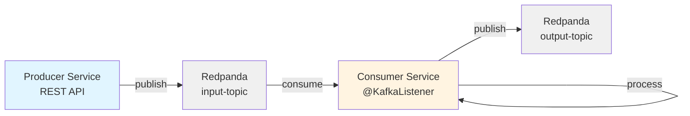

# 15. 기본 이벤트 처리 루프 (Basic Event Processing Loop)

**실습 시간**: 1-2시간
**난이도**: 초급
**참조 문서**: Ch5 이벤트 기반 처리 기초

---

## 실습 목표

이 실습에서는 이벤트 기반 시스템의 가장 기본적인 패턴인 **Consume → Process → Produce** 루프를 Spring Boot로 구현합니다.

왜 이 패턴이 중요한가? 대부분의 이벤트 기반 애플리케이션은 이 패턴을 기반으로 동작합니다. 외부 이벤트를 소비하고, 비즈니스 로직을 처리한 뒤, 결과를 다른 이벤트로 발행하는 것이 이벤트 기반 아키텍처의 핵심입니다.

학습 내용:
- Redpanda 브로커를 사용한 메시지 발행/소비
- Spring Boot KafkaTemplate과 @KafkaListener 패턴
- 오프셋 관리 전략 (auto-commit vs manual commit)
- At-least-once와 Exactly-once 시맨틱 이해

---

## 아키텍처



**흐름 설명**:
1. Producer Service가 REST API로 주문 이벤트를 받아 `input-topic`에 발행합니다.
2. Consumer Service가 `input-topic`에서 이벤트를 소비합니다.
3. Consumer는 비즈니스 로직을 수행합니다. (예: 주문 검증, 가격 계산)
4. 처리 결과를 `output-topic`에 발행합니다.

---

## 왜 Redpanda인가?

Redpanda는 Kafka API 호환 메시지 브로커로, 다음과 같은 장점이 있습니다:
- **빠른 시작**: ZooKeeper 없이 단일 바이너리로 실행 가능합니다.
- **낮은 지연**: C++로 작성되어 Kafka보다 10배 빠른 P99 레이턴시를 제공합니다.
- **Kafka 호환**: 기존 Kafka 클라이언트 라이브러리를 그대로 사용할 수 있습니다.

PoC 환경에서는 Redpanda를 사용하지만, 프로덕션에서는 Kafka를 사용해도 코드 변경이 거의 없습니다.

---

## 환경 구성

### 1. docker-compose.yml

```yaml
version: '3.8'

services:
  redpanda:
    image: docker.redpanda.com/redpandadata/redpanda:v25.3.6
    container_name: redpanda-0
    command:
      - redpanda
      - start
      - --kafka-addr internal://0.0.0.0:9092,external://0.0.0.0:19092
      - --advertise-kafka-addr internal://redpanda:9092,external://localhost:19092
      - --pandaproxy-addr internal://0.0.0.0:8082,external://0.0.0.0:18082
      - --advertise-pandaproxy-addr internal://redpanda:8082,external://localhost:18082
      - --schema-registry-addr internal://0.0.0.0:8081,external://0.0.0.0:18081
      - --rpc-addr redpanda:33145
      - --advertise-rpc-addr redpanda:33145
      - --smp 1
      - --memory 1G
      - --mode dev-container
    ports:
      - "18081:18081"  # Schema Registry
      - "18082:18082"  # HTTP Proxy
      - "19092:19092"  # Kafka API
      - "19644:9644"   # Admin API
    healthcheck:
      test: ["CMD-SHELL", "rpk cluster health | grep -E 'Healthy:.+true' || exit 1"]
      interval: 15s
      timeout: 3s
      retries: 5

  console:
    image: docker.redpanda.com/redpandadata/console:v3.5.1
    container_name: redpanda-console
    entrypoint: /bin/sh
    command: -c 'echo "$$CONSOLE_CONFIG_FILE" > /tmp/config.yml; /app/console'
    environment:
      CONFIG_FILEPATH: /tmp/config.yml
      CONSOLE_CONFIG_FILE: |
        kafka:
          brokers: ["redpanda:9092"]
          schemaRegistry:
            enabled: true
            urls: ["http://redpanda:8081"]
        redpanda:
          adminApi:
            enabled: true
            urls: ["http://redpanda:9644"]
    ports:
      - "8080:8080"
    depends_on:
      - redpanda
```

**설명**:
- `redpanda`: Kafka API를 19092 포트로 노출합니다.
- `console`: Redpanda Console 웹 UI를 8080 포트로 제공합니다.
- `--smp 1 --memory 1G`: 개발 환경용 경량 설정입니다.

### 2. 실행 및 토픽 생성

```bash
# 컨테이너 시작
docker-compose up -d

# 상태 확인
docker-compose ps

# 토픽 생성
docker exec -it redpanda-0 rpk topic create input-topic --partitions 3
docker exec -it redpanda-0 rpk topic create output-topic --partitions 3

# 토픽 목록 확인
docker exec -it redpanda-0 rpk topic list
```

**왜 파티션이 3개인가?**: 파티션 수는 병렬 처리 성능과 직결됩니다. 3개 파티션이면 최대 3개의 컨슈머가 동시에 처리할 수 있습니다. PoC에서는 3개로 충분하지만, 프로덕션에서는 트래픽 예측과 컨슈머 그룹 크기에 따라 조정해야 합니다.

---

## Producer Service 구현

### 1. build.gradle

```groovy
plugins {
    id 'java'
    id 'org.springframework.boot' version '3.3.0'
    id 'io.spring.dependency-management' version '1.1.5'
}

group = 'com.example'
version = '0.0.1-SNAPSHOT'
java {
    sourceCompatibility = '17'
}

repositories {
    mavenCentral()
}

dependencies {
    implementation 'org.springframework.boot:spring-boot-starter-web'
    implementation 'org.springframework.kafka:spring-kafka'
    compileOnly 'org.projectlombok:lombok'
    annotationProcessor 'org.projectlombok:lombok'
    testImplementation 'org.springframework.boot:spring-boot-starter-test'
    testImplementation 'org.springframework.kafka:spring-kafka-test'
}

tasks.named('test') {
    useJUnitPlatform()
}
```

### 2. application.yml

```yaml
spring:
  application:
    name: producer-service
  kafka:
    bootstrap-servers: localhost:19092
    producer:
      key-serializer: org.apache.kafka.common.serialization.StringSerializer
      value-serializer: org.apache.kafka.common.serialization.StringSerializer
      acks: all  # 모든 replica가 확인해야 성공
      retries: 3
      properties:
        enable.idempotence: true  # 중복 방지

server:
  port: 8081

logging:
  level:
    org.apache.kafka: INFO
```

**acks=all 설정 이유**: 메시지가 리더 브로커뿐만 아니라 모든 in-sync replica에 복제되어야 성공으로 처리합니다. 이는 데이터 유실 가능성을 최소화합니다. 성능이 다소 느려지지만, PoC에서는 신뢰성을 우선합니다.

### 3. Order 도메인

```java
package com.example.producer.domain;

import lombok.AllArgsConstructor;
import lombok.Data;
import lombok.NoArgsConstructor;

import java.time.Instant;

@Data
@NoArgsConstructor
@AllArgsConstructor
public class Order {
    private String orderId;
    private String productId;
    private Integer quantity;
    private Double price;
    private Instant timestamp;

    public static Order create(String productId, Integer quantity, Double price) {
        return new Order(
            java.util.UUID.randomUUID().toString(),
            productId,
            quantity,
            price,
            Instant.now()
        );
    }
}
```

### 4. OrderProducer

```java
package com.example.producer.service;

import com.example.producer.domain.Order;
import com.fasterxml.jackson.core.JsonProcessingException;
import com.fasterxml.jackson.databind.ObjectMapper;
import lombok.RequiredArgsConstructor;
import lombok.extern.slf4j.Slf4j;
import org.springframework.kafka.core.KafkaTemplate;
import org.springframework.kafka.support.SendResult;
import org.springframework.stereotype.Service;

import java.util.concurrent.CompletableFuture;

@Slf4j
@Service
@RequiredArgsConstructor
public class OrderProducer {

    private static final String TOPIC = "input-topic";
    private final KafkaTemplate<String, String> kafkaTemplate;
    private final ObjectMapper objectMapper = new ObjectMapper();

    public void sendOrder(Order order) {
        try {
            String orderJson = objectMapper.writeValueAsString(order);

            // 비동기 전송
            CompletableFuture<SendResult<String, String>> future =
                kafkaTemplate.send(TOPIC, order.getOrderId(), orderJson);

            // 콜백 처리
            future.whenComplete((result, ex) -> {
                if (ex == null) {
                    log.info("Order sent successfully: key={}, partition={}, offset={}",
                        order.getOrderId(),
                        result.getRecordMetadata().partition(),
                        result.getRecordMetadata().offset());
                } else {
                    log.error("Failed to send order: key={}", order.getOrderId(), ex);
                }
            });
        } catch (JsonProcessingException e) {
            log.error("Failed to serialize order", e);
            throw new RuntimeException("Serialization failed", e);
        }
    }
}
```

**비동기 전송 이유**: `kafkaTemplate.send()`는 비동기로 동작합니다. 이는 브로커 응답을 기다리지 않고 즉시 리턴하여, HTTP 요청 처리 시간을 단축시킵니다. 실패 시 재시도는 Kafka 클라이언트가 자동으로 처리합니다.

### 5. OrderController

```java
package com.example.producer.controller;

import com.example.producer.domain.Order;
import com.example.producer.service.OrderProducer;
import lombok.RequiredArgsConstructor;
import org.springframework.http.HttpStatus;
import org.springframework.http.ResponseEntity;
import org.springframework.web.bind.annotation.*;

@RestController
@RequestMapping("/api/orders")
@RequiredArgsConstructor
public class OrderController {

    private final OrderProducer orderProducer;

    @PostMapping
    public ResponseEntity<String> createOrder(@RequestBody OrderRequest request) {
        Order order = Order.create(
            request.getProductId(),
            request.getQuantity(),
            request.getPrice()
        );

        orderProducer.sendOrder(order);

        return ResponseEntity.status(HttpStatus.ACCEPTED)
            .body("Order accepted: " + order.getOrderId());
    }

    record OrderRequest(String productId, Integer quantity, Double price) {}
}
```

---

## Consumer Service 구현

### 1. application.yml

```yaml
spring:
  application:
    name: consumer-service
  kafka:
    bootstrap-servers: localhost:19092
    consumer:
      group-id: order-processor-group
      key-deserializer: org.apache.kafka.common.serialization.StringDeserializer
      value-deserializer: org.apache.kafka.common.serialization.StringDeserializer
      auto-offset-reset: earliest  # 처음부터 소비
      enable-auto-commit: false  # 수동 커밋 모드
    producer:
      key-serializer: org.apache.kafka.common.serialization.StringSerializer
      value-serializer: org.apache.kafka.common.serialization.StringSerializer
      acks: all

server:
  port: 8082

logging:
  level:
    org.apache.kafka: INFO
```

**enable-auto-commit: false 이유**: 자동 커밋은 메시지 처리 실패 시에도 오프셋이 커밋될 수 있습니다. 수동 커밋으로 설정하면, 비즈니스 로직이 성공했을 때만 오프셋을 커밋하여 at-least-once 시맨틱을 지원합니다.

### 2. OrderConsumer

```java
package com.example.consumer.service;

import com.example.consumer.domain.Order;
import com.example.consumer.domain.ProcessedOrder;
import com.fasterxml.jackson.databind.ObjectMapper;
import lombok.RequiredArgsConstructor;
import lombok.extern.slf4j.Slf4j;
import org.springframework.kafka.annotation.KafkaListener;
import org.springframework.kafka.core.KafkaTemplate;
import org.springframework.kafka.support.Acknowledgment;
import org.springframework.kafka.support.KafkaHeaders;
import org.springframework.messaging.handler.annotation.Header;
import org.springframework.messaging.handler.annotation.Payload;
import org.springframework.stereotype.Service;

@Slf4j
@Service
@RequiredArgsConstructor
public class OrderConsumer {

    private static final String OUTPUT_TOPIC = "output-topic";
    private final KafkaTemplate<String, String> kafkaTemplate;
    private final ObjectMapper objectMapper = new ObjectMapper();

    @KafkaListener(
        topics = "input-topic",
        groupId = "order-processor-group",
        containerFactory = "kafkaListenerContainerFactory"
    )
    public void consumeOrder(
        @Payload String message,
        @Header(KafkaHeaders.RECEIVED_KEY) String key,
        @Header(KafkaHeaders.RECEIVED_PARTITION) int partition,
        @Header(KafkaHeaders.OFFSET) long offset,
        Acknowledgment ack
    ) {
        log.info("Received order: key={}, partition={}, offset={}", key, partition, offset);

        try {
            // 1. 역직렬화
            Order order = objectMapper.readValue(message, Order.class);

            // 2. 비즈니스 로직 처리
            ProcessedOrder processedOrder = processOrder(order);

            // 3. 결과 발행
            String result = objectMapper.writeValueAsString(processedOrder);
            kafkaTemplate.send(OUTPUT_TOPIC, key, result);

            // 4. 오프셋 커밋 (성공 시에만)
            ack.acknowledge();

            log.info("Order processed successfully: orderId={}", order.getOrderId());
        } catch (Exception e) {
            log.error("Failed to process order: key={}, offset={}", key, offset, e);
            // 재처리를 위해 오프셋을 커밋하지 않음
            // Consumer는 다음 poll 시 같은 메시지를 다시 소비
        }
    }

    private ProcessedOrder processOrder(Order order) {
        // 비즈니스 로직: 가격 검증 및 총액 계산
        if (order.getPrice() <= 0 || order.getQuantity() <= 0) {
            throw new IllegalArgumentException("Invalid order parameters");
        }

        double totalAmount = order.getPrice() * order.getQuantity();

        return ProcessedOrder.builder()
            .orderId(order.getOrderId())
            .productId(order.getProductId())
            .quantity(order.getQuantity())
            .unitPrice(order.getPrice())
            .totalAmount(totalAmount)
            .status("PROCESSED")
            .processedAt(java.time.Instant.now())
            .build();
    }
}
```

**Acknowledgment 파라미터**: Spring Kafka는 `Acknowledgment` 객체로 수동 오프셋 커밋을 제공합니다. `ack.acknowledge()`를 호출하면 현재 메시지까지 오프셋이 커밋됩니다. 예외 발생 시 커밋하지 않으면, 컨슈머가 재시작될 때 같은 메시지를 다시 처리합니다.

### 3. KafkaConfig

```java
package com.example.consumer.config;

import org.springframework.context.annotation.Bean;
import org.springframework.context.annotation.Configuration;
import org.springframework.kafka.annotation.EnableKafka;
import org.springframework.kafka.config.ConcurrentKafkaListenerContainerFactory;
import org.springframework.kafka.core.ConsumerFactory;
import org.springframework.kafka.core.DefaultKafkaConsumerFactory;
import org.springframework.kafka.listener.ContainerProperties;

import java.util.HashMap;
import java.util.Map;

@EnableKafka
@Configuration
public class KafkaConfig {

    @Bean
    public ConcurrentKafkaListenerContainerFactory<String, String> kafkaListenerContainerFactory(
        ConsumerFactory<String, String> consumerFactory
    ) {
        ConcurrentKafkaListenerContainerFactory<String, String> factory =
            new ConcurrentKafkaListenerContainerFactory<>();
        factory.setConsumerFactory(consumerFactory);

        // 수동 오프셋 커밋 모드
        factory.getContainerProperties().setAckMode(ContainerProperties.AckMode.MANUAL);

        // 동시 처리 스레드 수 (파티션 수와 동일하게 설정)
        factory.setConcurrency(3);

        return factory;
    }
}
```

**Concurrency 설정**: `setConcurrency(3)`은 3개의 스레드가 동시에 메시지를 처리함을 의미합니다. 파티션이 3개이므로 각 스레드가 1개 파티션을 담당합니다. 이를 통해 병렬 처리 성능을 극대화합니다.

---

## 오프셋 관리 전략

### At-least-once vs Exactly-once

| 전략 | 설명 | 구현 방법 | 장점 | 단점 |
|------|------|----------|------|------|
| **At-least-once** | 메시지를 최소 1번 처리 | 수동 커밋 (enable-auto-commit: false) | 구현 간단, 메시지 유실 없음 | 중복 처리 가능 |
| **Exactly-once** | 메시지를 정확히 1번 처리 | Transactional Outbox 패턴 | 중복 없음 | 복잡도 높음, 성능 저하 |

이 실습에서는 **At-least-once**를 구현합니다. 왜냐하면:
- 대부분의 경우 중복 처리는 멱등성(idempotency)으로 해결 가능합니다.
- Exactly-once는 트랜잭션 코디네이터가 필요하여 복잡도가 높습니다.
- PoC 단계에서는 신뢰성과 단순성의 균형이 중요합니다.

---

## 검증 방법

### 1. Producer API 호출

```bash
curl -X POST http://localhost:8081/api/orders \
  -H "Content-Type: application/json" \
  -d '{
    "productId": "PROD-001",
    "quantity": 5,
    "price": 29.99
  }'
```

### 2. rpk로 메시지 확인

```bash
# input-topic 메시지 확인
docker exec -it redpanda-0 rpk topic consume input-topic --num 10

# output-topic 메시지 확인
docker exec -it redpanda-0 rpk topic consume output-topic --num 10
```

### 3. Redpanda Console

브라우저에서 `http://localhost:8080` 접속:
- Topics 메뉴에서 `input-topic`, `output-topic` 선택
- Messages 탭에서 메시지 내용 확인
- 파티션별 오프셋 확인

### 4. Consumer Group 상태 확인

```bash
# Consumer Group 목록
docker exec -it redpanda-0 rpk group list

# 상세 정보
docker exec -it redpanda-0 rpk group describe order-processor-group
```

출력 예시:
```
GROUP                  COORDINATOR  STATE  MEMBERS
order-processor-group  0            Stable 1

TOPIC        PARTITION  CURRENT-OFFSET  LOG-END-OFFSET  LAG
input-topic  0          10              10              0
input-topic  1          8               8               0
input-topic  2          12              12              0
```

**LAG 의미**: LAG은 컨슈머가 뒤처진 메시지 수입니다. LAG이 0이면 실시간으로 처리 중이고, LAG이 증가하면 처리 속도가 느린 것입니다.

---

## 실습 체크리스트

- [ ] Redpanda 컨테이너 정상 실행
- [ ] `input-topic`, `output-topic` 생성 확인
- [ ] Producer Service 빌드 및 실행 (포트 8081)
- [ ] Consumer Service 빌드 및 실행 (포트 8082)
- [ ] REST API로 주문 이벤트 발행
- [ ] Consumer 로그에서 메시지 처리 확인
- [ ] `output-topic`에 처리된 메시지 도착 확인
- [ ] Redpanda Console에서 메시지 내용 확인
- [ ] Consumer Group LAG이 0인지 확인
- [ ] Consumer를 중단하고 재시작했을 때 이어서 처리되는지 확인 (오프셋 복구)

---

## 다음 단계

이 실습에서는 기본적인 이벤트 루프를 구축했습니다. 다음 실습 `02-communication-contracts`에서는:
- Avro 스키마로 데이터 계약 관리
- 스키마 진화 시 호환성 검증
- Redpanda Schema Registry 활용

을 학습합니다.

---

## 참고 자료

- [Redpanda Documentation](https://docs.redpanda.com/)
- [Spring Kafka Reference](https://docs.spring.io/spring-kafka/reference/)
- [Kafka Consumer Offset Management](https://kafka.apache.org/documentation/#consumerconfigs)
