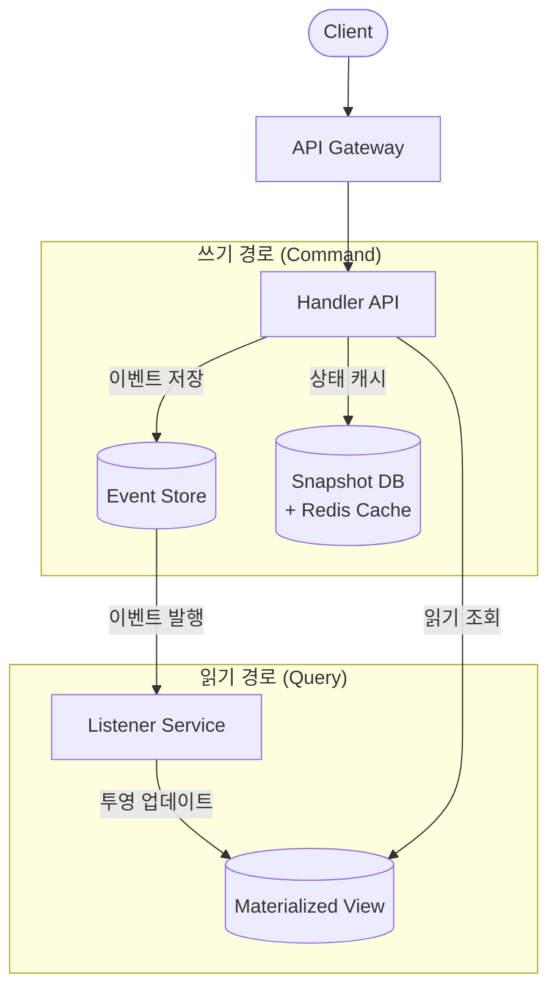

# 16. Event Sourcing (이벤트 소싱)

상태가 아닌 이벤트를 저장하여 시스템의 모든 변경 이력을 불변 로그로 관리하는 패턴

## 학습 목표

- Event Sourcing의 핵심 개념(불변 이벤트 저장)을 이해한다
- Event Store + Snapshot + CQRS 아키텍처를 설명할 수 있다
- Event Sourcing의 적합한 사용 사례와 단점을 판단할 수 있다

## 1. 핵심 개념: 상태가 아닌 이벤트를 저장한다

### 기존 방식 (상태 저장)

기존 시스템은 엔티티의 현재 상태만 저장합니다.

```
계좌 잔액: 50원
```

50원이 된 이유를 알 수 없습니다. 입금 100원 후 출금 50원인지, 입금 200원 후 출금 150원인지 구분할 방법이 없습니다.

### Event Sourcing 방식 (이벤트 저장)

Event Sourcing은 상태 변화를 일으킨 모든 이벤트를 시간순으로 저장합니다.

```
Event 1: AccountCreated  { accountId: "A-001", timestamp: "T1" }
Event 2: MoneyDeposited   { accountId: "A-001", amount: +100, timestamp: "T2" }
Event 3: MoneyWithdrawn   { accountId: "A-001", amount: -30,  timestamp: "T3" }
Event 4: MoneyWithdrawn   { accountId: "A-001", amount: -20,  timestamp: "T4" }
```

현재 잔액 = 0 + 100 - 30 - 20 = **50원**

**핵심 원칙**: 이벤트는 **불변(immutable)**입니다. 한 번 저장된 이벤트는 수정하거나 삭제할 수 없습니다. 잘못된 이벤트를 되돌리려면 보상 이벤트(예: `MoneyDeposited`)를 새로 추가합니다.

## 2. 언제 사용하는가?

| 사용 사례 | 설명 | 예시 |
|----------|------|------|
| **감사/컴플라이언스** | 모든 변경 이력을 법적으로 보존해야 할 때 | 은행, 보험, 정부 시스템 |
| **추적성** | "언제, 누가, 왜" 변경했는지 추적이 필요할 때 | 주문 이력, 의료 기록 |
| **재생 가능성** | 특정 시점으로 상태를 되돌려 디버깅할 때 | 장애 분석, A/B 테스트 |
| **사기 탐지** | 이벤트 패턴을 분석하여 이상 행위를 감지할 때 | 금융 거래 모니터링 |
| **높은 쓰기 부하** | CQRS와 결합하여 읽기/쓰기를 분리할 때 | 대규모 트래픽 시스템 |

**부적합한 경우**: 단순 CRUD 시스템, 이벤트 이력이 비즈니스 가치가 없는 경우, 즉시 일관성이 필수인 경우(주식 거래의 실시간 잔고 등).

## 3. 아키텍처



**두 가지 읽기 경로**:
- **즉시 일관성**: Handler → Snapshot DB (쓰기 직후 즉시 최신 상태 조회 가능)
- **최종 일관성**: Handler → Materialized View (비동기 전파이므로 약간의 지연 가능)

## 4. 핵심 구성요소

### Hydration과 Replay: 이벤트 재생의 두 가지 목적

Event Sourcing에서 "이벤트를 재생한다"는 말은 두 가지 서로 다른 맥락에서 사용됩니다.

**Hydration**은 특정 Aggregate의 현재 상태를 런타임에 복원하는 과정입니다. 사용자가 계좌 잔액을 조회하면, 해당 계좌의 이벤트 스트림(또는 Snapshot + 이후 이벤트)을 읽어 메모리에 현재 상태를 구성합니다. 요청마다 필요한 Aggregate 하나를 대상으로 하며, 응답 시간에 직접 영향을 주므로 Snapshot으로 최적화합니다.

**Replay**는 시스템 전체 또는 특정 범위의 이벤트를 처음부터 다시 처리하는 과정입니다. Materialized View의 스키마가 변경되어 전체 투영을 재구축하거나, 특정 시점의 시스템 상태를 디버깅 목적으로 재현할 때 사용합니다. 대량의 이벤트를 배치로 처리하므로 오프라인 또는 백그라운드에서 수행합니다.

| 구분 | Hydration | Replay |
|------|-----------|--------|
| **목적** | 엔티티의 현재 상태 로드 | 시스템 재구축, 디버깅, 마이그레이션 |
| **범위** | 단일 Aggregate | 전체 이벤트 스트림 또는 특정 범위 |
| **시점** | 런타임 (요청마다) | 오프라인/배치 |
| **최적화** | Snapshot으로 시작점 단축 | 병렬 처리, 파티셔닝 |

### Event Store

불변 이벤트 시퀀스를 저장하는 전용 저장소입니다.

```json
{
  "streamId": "account-A001",
  "eventType": "MoneyDeposited",
  "data": { "amount": 100, "source": "ATM" },
  "version": 3,
  "timestamp": "2026-02-06T12:00:00Z"
}
```

- **streamId**: Aggregate 단위로 이벤트를 그룹화하는 키
- **version**: 동일 스트림 내 이벤트 순서를 보장하는 시퀀스 번호
- **구현 선택지**: 전용 DB(EventStoreDB, Axon Server) 또는 일반 RDBMS 테이블

### Snapshot DB

특정 시점의 Aggregate 상태를 캐시하여 매번 전체 이벤트를 재생하지 않도록 합니다.

```json
{
  "aggregateId": "account-A001",
  "state": { "balance": 50, "status": "ACTIVE" },
  "version": 100,
  "snapshotAt": "2026-02-06T12:00:00Z"
}
```

**왜 필요한가?**
이벤트가 수천 개 쌓이면 매번 처음부터 재생하는 것은 비효율적입니다. Snapshot은 특정 시점의 상태를 저장하고, 이후 이벤트만 재생하면 되므로 성능이 크게 개선됩니다.

**상태 복원 과정**:
1. Snapshot 로드 (version 100의 상태)
2. version 101 이후의 이벤트만 재생
3. 현재 상태 계산 완료

### Materialized View

읽기에 최적화된 투영(Projection)입니다. Listener Service가 Event Store의 이벤트를 수신하여 목적에 맞는 형태로 변환합니다.

- 관계형 DB: 조인이 필요한 복잡한 조회
- 문서 DB: Aggregate 단위의 빠른 조회
- 검색 엔진: 전문 검색

**Listener Service**가 이벤트를 수신해 비동기로 Materialized View를 업데이트하므로, 최종 일관성(Eventual Consistency)이 적용됩니다.

## 5. Aggregate 패턴 (DDD 연계)

Aggregate는 하나의 트랜잭션 단위로 다루는 도메인 객체 클러스터입니다. Event Sourcing에서 각 Aggregate는 자신만의 이벤트 스트림을 가집니다.

```java
public class Account {
    private String accountId;
    private BigDecimal balance;
    private AccountStatus status;
    private int version;

    // 이벤트를 적용하여 상태 변경
    public void apply(MoneyDeposited event) {
        this.balance = this.balance.add(event.getAmount());
        this.version++;
    }

    public void apply(MoneyWithdrawn event) {
        this.balance = this.balance.subtract(event.getAmount());
        this.version++;
    }

    // 상태 복원: Snapshot + 이후 이벤트 재생
    public static Account reconstruct(AccountSnapshot snapshot, List<DomainEvent> events) {
        Account account = Account.fromSnapshot(snapshot);
        events.forEach(account::apply);
        return account;
    }
}
```

**왜 Aggregate 단위인가?**
`accountId`로 이벤트 스트림을 구분하면, 서로 다른 계좌의 이벤트가 섞이지 않고, 동시성 제어(version 기반 낙관적 락)가 간단해집니다.

## 6. 즉시 일관성 vs 최종 일관성

Event Sourcing 시스템에는 두 가지 읽기 경로가 존재합니다.

### 즉시 일관성 경로

```
Client → Handler API → Event Store에 이벤트 저장
                     → Snapshot DB 업데이트
                     → Snapshot DB에서 최신 상태 반환
```

쓰기 직후 최신 상태를 바로 읽을 수 있습니다. 잔액 조회, 주문 상태 확인 등 쓰기 직후 정확한 값이 필요한 경우에 사용합니다.

### 최종 일관성 경로

```
Event Store → (비동기) → Listener Service → Materialized View 업데이트
Client → Handler API → Materialized View에서 조회
```

이벤트가 비동기로 전파되므로 약간의 지연(밀리초~초)이 발생할 수 있습니다. 대시보드, 리포트, 검색 등 약간의 지연이 허용되는 읽기에 사용합니다.

## 7. CQRS와의 자연스러운 결합

Event Sourcing은 본질적으로 쓰기(이벤트 저장)와 읽기(상태 투영)를 분리하므로, CQRS(Command Query Responsibility Segregation)와 자연스럽게 결합됩니다.

- **Command 측**: Handler API가 이벤트를 Event Store에 저장
- **Query 측**: Materialized View에서 목적에 맞는 형태로 조회

**왜 잘 어울리는가?**
Event Sourcing 없이 CQRS를 구현하면 쓰기 DB와 읽기 DB 사이의 동기화가 복잡해집니다. Event Sourcing은 이벤트 자체가 동기화 수단이 되므로, Listener가 이벤트를 수신해 Materialized View를 업데이트하는 것만으로 동기화가 완성됩니다.

### Event Propagation: Command → Query 이벤트 전파 방식

Command 측에서 저장한 이벤트를 Query 측의 Materialized View에 전달하는 메커니즘은 크게 두 가지입니다.

**방식 1: 메시지 브로커 경유** — Event Store에 저장된 이벤트를 Kafka 같은 메시지 브로커에 발행하고, Listener가 브로커를 구독하여 Materialized View를 업데이트합니다. 브로커가 이벤트 분배, 순서 보장, Consumer Group 관리를 담당하므로 다수의 독립적인 Projection을 병렬로 운영하기 좋습니다. 대신 브로커라는 추가 인프라가 필요하고, Event Store → 브로커 발행 사이의 원자성을 보장해야 합니다(Transactional Outbox 등).

**방식 2: Event Store 직접 구독** — EventStoreDB의 Catch-up Subscription이나 RDBMS 기반 Event Store의 폴링처럼, Listener가 Event Store를 직접 구독(또는 주기적으로 폴링)합니다. 별도 브로커 없이 동작하므로 인프라가 단순하고, Event Store가 곧 이벤트의 단일 진실 공급원(Single Source of Truth)이 됩니다. 다만 구독자가 많아지면 Event Store에 읽기 부하가 집중될 수 있습니다.

| 구분 | 메시지 브로커 경유 | Event Store 직접 구독 |
|------|-------------------|---------------------|
| **인프라** | 브로커 필요 (Kafka, Redpanda) | Event Store만으로 충분 |
| **다중 Projection** | Consumer Group으로 독립 확장 용이 | 구독자 증가 시 Store 부하 집중 |
| **원자성** | Outbox/CDC로 보장 필요 | Store 내부에서 자연스럽게 보장 |
| **대표 구현** | Kafka + Spring @KafkaListener | EventStoreDB Catch-up Subscription |

## 8. 단점과 트레이드오프

| 단점 | 설명 | 완화 방법 |
|------|------|----------|
| **최종 일관성** | Materialized View 업데이트 지연으로 초정밀 실시간 시스템에 부적합 | 즉시 일관성 경로(Snapshot)를 병행 사용 |
| **복잡성 증가** | Event Store + Snapshot + Materialized View + Listener 등 구성요소 다수 | 프레임워크(Axon, EventStoreDB) 활용 |
| **이벤트 버전 관리** | 이벤트 구조 변경 시 이전 이벤트와의 호환성 유지 필요 | Upcaster 패턴으로 이전 버전 이벤트를 새 버전으로 변환 |
| **유지보수 부담** | 여러 저장소를 모두 관리해야 함 | 운영 자동화, 모니터링 체계 구축 |
| **저장소 증가** | 모든 이벤트를 영구 보존하므로 스토리지 비용 증가 | 아카이빙 정책, 오래된 스트림 Snapshot 후 이벤트 정리 |
| **도입 후 되돌리기 어려움** | 아키텍처 전체에 영향을 미치므로 부분 도입이 어려움 | 특정 Aggregate만 Event Sourcing 적용하는 점진적 도입 |

## 실습 체크리스트

- [ ] Event Store의 개념과 Snapshot의 역할을 설명할 수 있는가?
- [ ] 즉시 일관성 경로와 최종 일관성 경로의 차이를 설명할 수 있는가?
- [ ] CQRS와 Event Sourcing의 관계를 설명할 수 있는가?
- [ ] Event Sourcing이 적합한 도메인 3가지를 들 수 있는가?
- [ ] 이벤트 버전 관리(Upcaster) 전략을 설명할 수 있는가?
- [ ] Aggregate와 이벤트 스트림의 관계를 설명할 수 있는가?

## 다음 단계

- **06장**: Choreography SAGA 패턴 - 이벤트 기반 분산 트랜잭션
- **08장**: Transactional Outbox + CDC - DB와 이벤트의 원자성

## 참고 자료

- YouTube: "Event Sourcing: Genius or Just Over-Engineering?"
- Microsoft: Event Sourcing Pattern (https://learn.microsoft.com/en-us/azure/architecture/patterns/event-sourcing)
- Martin Fowler: Event Sourcing (https://martinfowler.com/eaaDev/EventSourcing.html)
- EventStoreDB: https://www.eventstore.com
- Axon Framework: https://developer.axoniq.io
