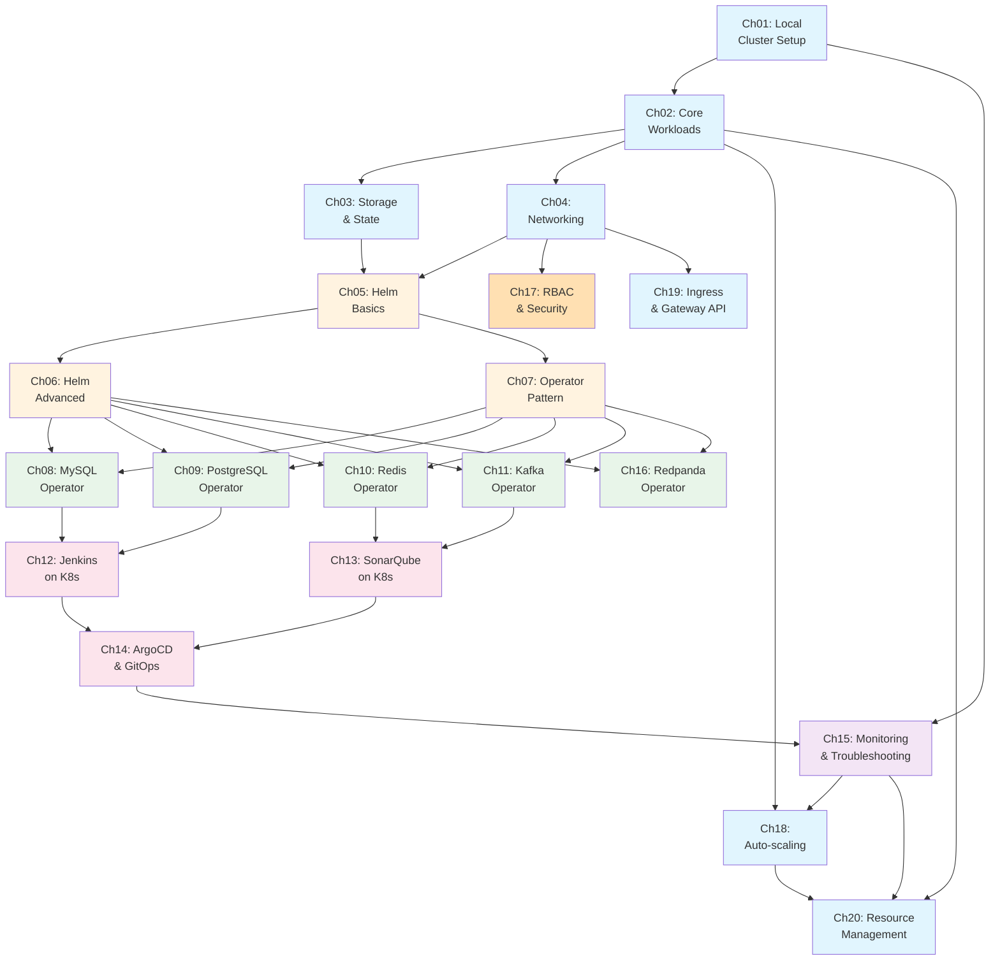

# 02-kubernetes: 쿠버네티스 실전 운영 실습

## 프로젝트 개요

쿠버네티스를 로컬 환경에서 직접 운영하며 핵심 개념과 패턴을 체득합니다. CKA 이론은 `docs/03_CloudNative/02_Kubernetes/`에서 이미 23챕터를 다루고 있지만, 이론만으로는 프로덕션 환경의 복잡성을 이해하기 어렵습니다. 이 프로젝트는 Minikube로 프로덕션 유사 환경을 구축하고, Helm과 Operator 패턴을 통해 MySQL/PostgreSQL/Redis/Kafka 같은 Stateful 워크로드를 직접 운영하면서 "왜 쿠버네티스가 필요한지"를 체감하는 것이 목표입니다.

단순히 YAML을 복사하는 수준이 아니라, 리소스 간 의존성을 이해하고, 장애 상황에서 로그를 추적하며, 운영 자동화 전략을 설계하는 능력을 기릅니다.

## 학습 목표

이 프로젝트를 완료하면 다음을 면접에서 자신있게 설명할 수 있어야 합니다:

1. **쿠버네티스 네트워킹**: Pod IP, Service ClusterIP, NodePort, Ingress 간 트래픽 흐름과 각 계층의 역할을 설명할 수 있다
2. **스토리지 전략**: PV/PVC/StorageClass로 Stateful 워크로드를 관리하는 방법과, Stateless와의 차이점을 설명할 수 있다
3. **Helm 차트 설계**: values.yaml로 환경별 설정을 분리하고, 템플릿 함수로 재사용성을 높이는 패턴을 구현할 수 있다
4. **Operator 패턴**: CRD(Custom Resource Definition)를 통해 복잡한 애플리케이션 라이프사이클을 어떻게 자동화하는지 설명할 수 있다
5. **DB 운영 자동화**: MySQL/PostgreSQL/Redis를 Operator로 운영할 때 HA(고가용성), 백업, 페일오버 전략을 어떻게 구현하는지 설명할 수 있다
6. **GitOps 워크플로우**: ArgoCD로 Git을 단일 진실 공급원(Single Source of Truth)으로 사용하는 배포 전략을 구현할 수 있다
7. **트러블슈팅**: kubectl logs, describe, events를 활용해 장애 원인을 체계적으로 추적하고, 리소스 부족 문제를 해결할 수 있다
8. **Mac 리소스 관리**: 로컬 환경에서 여러 Operator와 워크로드를 동시에 실행할 때 CPU/메모리 제약을 어떻게 다루는지 설명할 수 있다
9. **RBAC과 보안**: RBAC 모델과 Pod Security Standards로 클러스터 보안을 설계하고 적용할 수 있다
10. **리소스 관리와 오토스케일링**: Requests/Limits, HPA/VPA/KEDA로 안정적이고 비용 효율적인 클러스터를 운영할 수 있다

## 전제 조건

| 항목 | 최소 버전 | 확인 명령어 |
|------|----------|------------|
| Minikube | 1.32+ | `minikube version` |
| kubectl | 1.28+ | `kubectl version --client` |
| Helm | 3.13+ | `helm version` |
| Docker | 24.0+ | `docker --version` |

**Mac 권장 사양**: 8GB+ RAM, 4+ CPU cores (Minikube에 최소 4GB RAM, 2 CPU 할당 필요)

## 커리큘럼

| Ch | 주제 | 학습 시간 | 핵심 질문 | 상태 |
|----|------|----------|----------|------|
| 01 | [Local Cluster Setup](./learning/01-local-cluster-setup/) | 30min | 로컬에서 프로덕션과 유사한 K8s 환경을 어떻게 구성하는가? | ⬜ |
| 02 | [Core Workloads](./learning/02-core-workloads/) | 45min | Pod, Deployment, Service의 관계와 역할 분담은? | ⬜ |
| 03 | [Storage & State](./learning/03-storage-and-state/) | 45min | Stateless와 Stateful 워크로드의 스토리지 전략 차이는? | ⬜ |
| 04 | [Networking](./learning/04-networking/) | 45min | K8s 네트워킹 모델에서 트래픽은 어떻게 흐르는가? | ⬜ |
| 05 | [Helm Basics](./learning/05-helm-basics/) | 30min | 왜 매니페스트 대신 Helm 차트를 사용해야 하는가? | ⬜ |
| 06 | [Helm Advanced](./learning/06-helm-advanced/) | 60min | 재사용 가능한 Helm 차트를 어떻게 설계하는가? | ⬜ |
| 07 | [Operator Pattern](./learning/07-operator-pattern/) | 30min | Operator는 어떤 문제를 해결하고, CRD와 어떻게 연동하는가? | ⬜ |
| 08 | [MySQL Operator](./learning/08-mysql-operator/) | 45min | K8s 위에서 MySQL HA를 어떻게 자동화하는가? | ⬜ |
| 09 | [PostgreSQL Operator](./learning/09-postgresql-operator/) | 45min | CloudNativePG로 복제/페일오버/백업을 어떻게 관리하는가? | ⬜ |
| 10 | [Redis Operator](./learning/10-redis-operator/) | 30min | Redis Cluster/Sentinel을 K8s에서 어떻게 운영하는가? | ⬜ |
| 11 | [Kafka Operator](./learning/11-kafka-operator/) | 45min | Strimzi로 Kafka 클러스터를 어떻게 선언적으로 관리하는가? | ⬜ |
| 12 | [Jenkins on K8s](./learning/12-jenkins-on-k8s/) | 45min | Jenkins를 K8s 네이티브하게 운영하면 뭐가 달라지는가? | ⬜ |
| 13 | [SonarQube on K8s](./learning/13-sonarqube-on-k8s/) | 30min | SonarQube를 Helm으로 설치하고 프로젝트를 분석하는 방법은? | ⬜ |
| 14 | [ArgoCD & GitOps](./learning/14-argocd-gitops/) | 60min | GitOps 워크플로우에서 ArgoCD는 어떤 역할을 하는가? | ⬜ |
| 15 | [Monitoring & Troubleshooting](./learning/15-monitoring-troubleshooting/) | 45min | K8s 클러스터 문제를 체계적으로 진단하는 방법은? | ⬜ |
| 16 | [Redpanda Operator](./learning/16-redpanda-operator/) | 45min | Redpanda Operator는 Strimzi와 어떤 점이 다르고, 언제 선택하는가? | ⬜ |
| 17 | [RBAC & Security](./learning/17-rbac-and-security/) | 45min | K8s 보안의 핵심인 RBAC과 Pod Security Standards를 어떻게 적용하는가? | ⬜ |
| 18 | [Auto-scaling](./learning/18-auto-scaling/) | 45min | HPA/VPA/KEDA로 워크로드를 자동 확장하는 전략은? | ⬜ |
| 19 | [Ingress & Gateway API](./learning/19-ingress-gateway-api/) | 45min | 외부 트래픽을 K8s 내부로 라우팅하는 방법과 Gateway API의 이점은? | ⬜ |
| 20 | [Resource Management](./learning/20-resource-management/) | 45min | Requests/Limits, QoS, LimitRange로 클러스터 안정성을 어떻게 확보하는가? | ⬜ |

**총 학습 시간**: 약 14시간 30분

## 학습 로드맵



**범례**: 파란색=기초/인프라, 주황색=패키지 관리/보안, 초록색=DB/Operator 운영, 분홍색=DevTools, 보라색=관측성

## Mac 리소스 관리 전략

로컬 환경에서는 리소스가 제한적이므로 전략적으로 관리해야 합니다:

### Minikube 기본 설정
```bash
# 최소 권장 설정
minikube start --memory=4096 --cpus=2

# 여유가 있다면
minikube start --memory=8192 --cpus=4
```

### Namespace 격리 전략
```bash
# DB Operator는 각각 전용 namespace에 배치
kubectl create namespace mysql-operator-system
kubectl create namespace postgres-operator-system
kubectl create namespace redis-operator-system
kubectl create namespace kafka-operator-system

# DevTools는 별도 namespace
kubectl create namespace devtools
```

### 동시 실행 제한
- **권장**: DB Operator 1~2개 + DevTools 1개 동시 실행
- **비권장**: 모든 Operator를 동시에 띄우면 Mac이 느려짐
- **전략**: 챕터 완료 후 `kubectl delete namespace {name}` 으로 정리

### 리소스 확인 명령어
```bash
# 클러스터 전체 리소스 사용량
kubectl top nodes
kubectl top pods --all-namespaces

# Minikube 상태
minikube status
```

## Quick Start

```bash
# 클러스터 시작 (처음에만)
minikube start --memory=4096 --cpus=2

# Helm 레포지토리 추가 (Ch05부터 필요)
helm repo add bitnami https://charts.bitnami.com/bitnami
helm repo update

# 실습 진행
cd learning/01-local-cluster-setup
# LEARN.md 읽고 INVESTIGATE.md 실습

# 클러스터 정지 (재시작 가능)
minikube stop

# 완전 삭제 (초기화)
minikube delete
```

## 이론 매핑

이 PoC는 실습 중심이며, CKA 이론은 별도 문서에서 다룹니다:

| 이론 위치 | 챕터 수 | 내용 |
|----------|---------|------|
| `docs/03_CloudNative/02_Kubernetes/` | 23챕터 | CKA 시험 대비 이론 (아키텍처, 네트워킹, 스토리지, 스케줄링, 보안 등) |

이론 문서를 먼저 읽을 필요는 없으며, 실습 중 궁금한 개념이 생기면 이론 문서를 참조하세요.

## 디렉토리 구조

```
02-kubernetes/
├── README.md                          # 이 파일
├── learning/                          # 챕터별 학습 문서
│   ├── 01-local-cluster-setup/        # Minikube 설치, 클러스터 생성
│   │   ├── LEARN.md                   # 로컬 K8s 환경 구성 전략
│   │   └── INVESTIGATE.md             # 실습: minikube start, kubectl get nodes
│   ├── 02-core-workloads/             # Pod, Deployment, Service
│   │   ├── LEARN.md                   # 워크로드 리소스 역할과 관계
│   │   └── INVESTIGATE.md             # 실습: nginx deployment + service 배포
│   ├── 03-storage-and-state/          # PV, PVC, StatefulSet
│   │   ├── LEARN.md                   # 스토리지 추상화와 Stateful 패턴
│   │   └── INVESTIGATE.md             # 실습: MySQL StatefulSet + PVC
│   ├── 04-networking/                 # Service, Ingress, NetworkPolicy
│   │   ├── LEARN.md                   # K8s 네트워킹 모델 (Pod IP, ClusterIP, DNS)
│   │   └── INVESTIGATE.md             # 실습: Ingress로 외부 트래픽 라우팅
│   ├── 05-helm-basics/                # Helm 기초, Chart 구조
│   │   ├── LEARN.md                   # 왜 Helm을 사용하는가, 차트 구조
│   │   └── INVESTIGATE.md             # 실습: bitnami/nginx 설치
│   ├── 06-helm-advanced/              # 템플릿, values, 재사용 패턴
│   │   ├── LEARN.md                   # 템플릿 함수, values override
│   │   └── INVESTIGATE.md             # 실습: 커스텀 차트 작성
│   ├── 07-operator-pattern/           # Operator 개념, CRD
│   │   ├── LEARN.md                   # Operator가 해결하는 문제
│   │   └── INVESTIGATE.md             # 실습: CRD 생성 및 조회
│   ├── 08-mysql-operator/             # MySQL InnoDB Cluster Operator
│   │   ├── LEARN.md                   # MySQL HA 자동화 전략
│   │   └── INVESTIGATE.md             # 실습: MySQL Operator 배포
│   ├── 09-postgresql-operator/        # CloudNativePG
│   │   ├── LEARN.md                   # PostgreSQL 복제/백업 자동화
│   │   └── INVESTIGATE.md             # 실습: CloudNativePG 클러스터 생성
│   ├── 10-redis-operator/             # Redis Operator
│   │   ├── LEARN.md                   # Redis Cluster vs Sentinel
│   │   └── INVESTIGATE.md             # 실습: Redis Sentinel 배포
│   ├── 11-kafka-operator/             # Strimzi Kafka Operator
│   │   ├── LEARN.md                   # Kafka 선언적 관리
│   │   └── INVESTIGATE.md             # 실습: Kafka 클러스터 배포
│   ├── 12-jenkins-on-k8s/             # Jenkins Kubernetes Plugin
│   │   ├── LEARN.md                   # K8s 네이티브 Jenkins 운영
│   │   └── INVESTIGATE.md             # 실습: Jenkins Helm 차트 설치
│   ├── 13-sonarqube-on-k8s/           # SonarQube Helm 설치
│   │   ├── LEARN.md                   # SonarQube 영속성 전략
│   │   └── INVESTIGATE.md             # 실습: SonarQube 배포 및 프로젝트 분석
│   ├── 14-argocd-gitops/              # ArgoCD, GitOps 워크플로우
│   │   ├── LEARN.md                   # GitOps 원칙과 ArgoCD 역할
│   │   └── INVESTIGATE.md             # 실습: ArgoCD로 애플리케이션 배포
│   ├── 15-monitoring-troubleshooting/ # kubectl debug, 로그 추적
│   │   ├── LEARN.md                   # 체계적 트러블슈팅 프로세스
│   │   └── INVESTIGATE.md             # 실습: 의도적 장애 발생 및 해결
│   ├── 16-redpanda-operator/          # Redpanda Operator
│   │   ├── LEARN.md                   # Redpanda Operator vs Strimzi 비교
│   │   └── INVESTIGATE.md             # 실습: Redpanda 클러스터 배포
│   ├── 17-rbac-and-security/          # RBAC, Pod Security Standards
│   │   ├── LEARN.md                   # K8s 보안 모델과 RBAC 설계
│   │   └── INVESTIGATE.md             # 실습: RBAC 정책 설정
│   ├── 18-auto-scaling/               # HPA, VPA, KEDA
│   │   ├── LEARN.md                   # 오토스케일링 전략과 메트릭 기반 확장
│   │   └── INVESTIGATE.md             # 실습: HPA/VPA 설정 및 부하 테스트
│   ├── 19-ingress-gateway-api/        # Ingress, Gateway API
│   │   ├── LEARN.md                   # 외부 트래픽 라우팅과 Gateway API
│   │   └── INVESTIGATE.md             # 실습: Ingress Controller 설정
│   └── 20-resource-management/        # Requests, Limits, QoS, Quota
│       ├── LEARN.md                   # 리소스 관리와 Right-sizing 전략
│       └── INVESTIGATE.md             # 실습: 의도적 OOMKill 유발 및 Quota 설정
└── practice/                          # 실습 코드 및 환경
    ├── cluster/                       # Minikube 설정
    │   ├── start.sh                   # 클러스터 시작 스크립트
    │   └── config.yaml                # 리소스 할당 설정
    ├── helm-charts/                   # 커스텀 Helm 차트
    │   ├── myapp/                     # Ch06 실습용 차트
    │   └── values/                    # 환경별 values (dev/prod)
    ├── operators/                     # Operator 매니페스트
    │   ├── mysql/                     # MySQL Operator 설정
    │   ├── postgresql/                # CloudNativePG 설정
    │   ├── redis/                     # Redis Operator 설정
    │   └── kafka/                     # Strimzi 설정
    ├── devtools/                      # Jenkins/SonarQube 설정
    │   ├── jenkins/                   # Jenkins Helm values
    │   ├── sonarqube/                 # SonarQube Helm values
    │   └── argocd/                    # ArgoCD 설정
    └── monitoring/                    # 모니터링 설정
        ├── prometheus/                # Prometheus 설치
        └── grafana/                   # Grafana 대시보드
```
