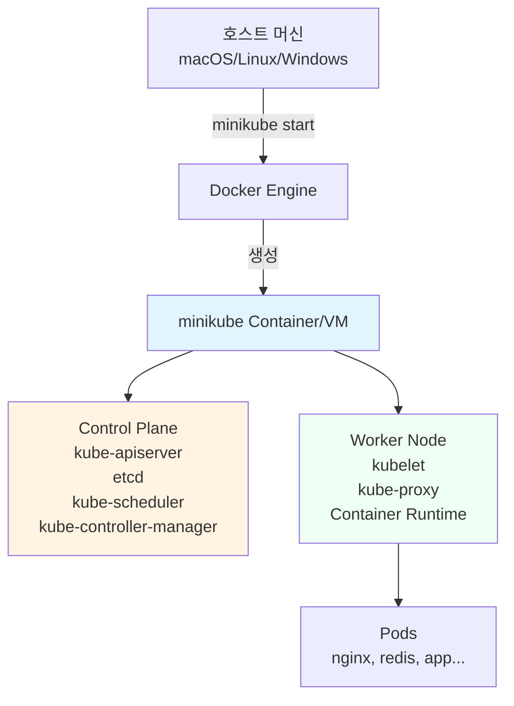

# Ch01. 로컬 클러스터 구성 - minikube로 시작하는 Kubernetes

> 📌 **핵심 요약**
>
> Kubernetes를 학습하고 개발하려면 로컬에서 빠르게 클러스터를 생성하고 삭제할 수 있는 환경이 필요하다. minikube는 단일 노드 클러스터를 제공하여 프로덕션 환경의 핵심 개념을 학습할 수 있게 해준다. 로컬 개발 환경에서는 minikube, kind, k3d 중 선택할 수 있으며, 각각은 서로 다른 강점을 가진다. 본 챕터에서는 minikube를 선택한 이유와 함께 설치, 구성, 필수 애드온 활성화, kubectl 기본 명령어를 다룬다.

## 🎯 학습 목표

1. 로컬 Kubernetes 클러스터의 필요성과 프로덕션과의 차이점 이해
2. minikube, kind, k3d의 차이를 비교하고 상황별 선택 기준 파악
3. minikube 설치 및 클러스터 생성, 리소스 할당 전략 실습
4. kubectl 기본 명령어로 클러스터 상태 조회 및 디버깅
5. 필수 애드온(ingress, metrics-server) 활성화 및 용도 이해
6. minikube 프로필 관리 및 스냅샷을 통한 환경 복구

---

## 1. 왜 로컬 클러스터가 필요한가

### 1.1 학습과 개발의 피드백 루프

클라우드에 Kubernetes 클러스터를 띄우면 시간당 비용이 발생한다. GKE(Google Kubernetes Engine)나 EKS(Amazon Elastic Kubernetes Service)는 컨트롤 플레인만 해도 시간당 $0.10 이상, 워커 노드까지 포함하면 월 $100 이상의 비용이 든다. 학습 목적으로 클러스터를 생성했다가 삭제하는 과정을 반복하면 비용이 누적될 뿐만 아니라, 클러스터 생성 자체가 5~10분 이상 소요되어 빠른 실험이 어렵다.

로컬 클러스터는 이러한 문제를 해결한다. 내 노트북에서 30초 안에 클러스터를 생성하고, Pod를 배포하고, 로그를 확인한 뒤, 클러스터를 삭제할 수 있다. 실수로 클러스터를 망가뜨려도 `minikube delete && minikube start`로 즉시 복구 가능하다. 이런 빠른 피드백 루프가 학습 속도를 결정한다.

### 1.2 프로덕션과의 차이점

로컬 클러스터는 프로덕션을 완전히 대체하지 못한다. 주요 차이점은 다음과 같다:

- **단일 노드**: minikube는 기본적으로 단일 노드 클러스터다. 멀티 노드 기능(`--nodes` 플래그)이 있지만, 실제 프로덕션의 노드 간 네트워크 지연, 장애 시나리오(노드 다운, 파티션)는 재현하기 어렵다.
- **리소스 제약**: 노트북의 CPU/메모리는 제한적이다. 프로덕션에서는 수백 개의 Pod가 동시에 실행되지만, 로컬에서는 10~20개 정도가 한계다.
- **네트워크**: 프로덕션 클러스터는 로드 밸런서(LoadBalancer Service), Ingress Controller, Service Mesh(Istio, Linkerd) 등 복잡한 네트워크 구성을 가진다. 로컬에서는 `minikube tunnel`이나 NodePort로 단순화된다.
- **스토리지**: 프로덕션은 EBS(AWS), Persistent Disk(GCP) 같은 네트워크 스토리지를 사용하지만, 로컬은 호스트 파일시스템을 마운트한다.

하지만 Kubernetes의 핵심 개념(Pod, Deployment, Service, ConfigMap, Secret, Namespace, RBAC)은 로컬 클러스터에서도 동일하게 작동한다. 따라서 학습 목적으로는 충분하며, 실제 애플리케이션의 매니페스트(YAML)를 작성하고 테스트하는 데 유용하다.

---

## 2. minikube vs kind vs k3d 비교

로컬 Kubernetes 클러스터를 제공하는 세 가지 주요 도구가 있다. 각각은 서로 다른 설계 철학과 사용 사례를 가진다.

### 2.1 비교 테이블

| 기준 | minikube | kind | k3d |
|------|----------|------|-----|
| **기반** | VM 또는 Container | Container (Docker-in-Docker) | Container (k3s) |
| **시작 속도** | 느림 (30~60초) | 보통 (20~40초) | 빠름 (10~20초) |
| **멀티 노드** | 지원 (--nodes) | 기본 지원 (HA 테스트) | 기본 지원 |
| **애드온** | 풍부 (ingress, dashboard 등) | 없음 (수동 설치) | 없음 (수동 설치) |
| **리소스 사용** | 높음 (VM 오버헤드) | 보통 (컨테이너만) | 낮음 (k3s 경량) |
| **LoadBalancer** | `minikube tunnel` 필요 | MetalLB 수동 설치 | 내장 (Traefik) |
| **CI/CD 통합** | 어려움 | 쉬움 (GitHub Actions) | 쉬움 |
| **용도** | 학습, 개발 | CI 테스트, HA 시뮬레이션 | 빠른 개발, Edge 환경 |

### 2.2 왜 minikube를 선택했는가?

본 PoC에서는 **minikube**를 선택했다. 이유는 다음과 같다:

1. **학습 친화성**: `minikube addons enable ingress` 한 줄로 Ingress Controller를 설치할 수 있다. kind/k3d는 Helm이나 kubectl apply로 수동 설치해야 한다. 학습 초반에 애드온 설치에 시간을 쓰는 것보다, Kubernetes의 핵심 개념에 집중하는 것이 낫다.
2. **대시보드**: `minikube dashboard` 명령으로 웹 UI를 바로 열 수 있다. 초보자에게 시각적 피드백은 중요하다.
3. **문서와 커뮤니티**: minikube는 가장 오래된 도구여서 Stack Overflow, GitHub Issues에 해결책이 많다.
4. **드라이버 선택**: Docker, Hyperkit, QEMU 등 여러 드라이버를 지원하여 환경에 맞게 선택할 수 있다.

하지만 CI/CD 파이프라인에서 테스트를 실행한다면 **kind**가 더 적합하다(GitHub Actions에서 3분 안에 클러스터 생성 가능). 엣지 디바이스나 리소스 제약 환경에서는 **k3d**가 유리하다(Raspberry Pi에서도 실행 가능).

---

## 3. minikube 설치 및 시작

### 3.1 설치 (macOS 기준)

```bash
# Homebrew로 설치
brew install minikube

# 버전 확인
minikube version
# 출력 예시: minikube version: v1.32.0

# kubectl도 함께 설치 (없다면)
brew install kubectl
```

Linux/Windows는 [공식 문서](https://minikube.sigs.k8s.io/docs/start/)를 참조한다. Windows의 경우 WSL2 환경에서 Docker Desktop과 함께 사용하는 것을 권장한다.

### 3.2 클러스터 시작

```bash
# 기본 시작 (Docker 드라이버, CPU 2개, 메모리 2GB)
minikube start

# 리소스 할당 조정 (권장: CPU 4개, 메모리 8GB)
minikube start --cpus=4 --memory=8192

# 특정 Kubernetes 버전 지정
minikube start --kubernetes-version=v1.28.0

# 멀티 노드 클러스터 (HA 테스트용)
minikube start --nodes=3
```

**리소스 할당 전략**:
- CPU 2개, 메모리 2GB: 최소 구성. Pod 5개 이하 실습 가능.
- CPU 4개, 메모리 8GB: 권장. Ingress, Monitoring(Prometheus) 포함 실습 가능.
- CPU 6개, 메모리 16GB: Service Mesh(Istio), CI/CD(Jenkins) 설치 가능.

### 3.3 minikube 아키텍처



minikube는 단일 컨테이너(또는 VM) 안에 Control Plane과 Worker Node를 모두 포함한다. 프로덕션에서는 Control Plane이 별도의 노드에 분리되지만, 로컬에서는 리소스 절약을 위해 같은 노드에 배치된다.

### 3.4 클러스터 상태 확인

```bash
# 클러스터 상태
minikube status
# 출력:
# minikube
# type: Control Plane
# host: Running
# kubelet: Running
# apiserver: Running
# kubeconfig: Configured

# 노드 목록
kubectl get nodes
# NAME       STATUS   ROLES           AGE   VERSION
# minikube   Ready    control-plane   5m    v1.28.0

# 시스템 Pod 확인 (kube-system namespace)
kubectl get pods -n kube-system
# coredns, etcd, kube-apiserver, kube-controller-manager 등
```

---

## 4. kubectl 기본 명령어

kubectl은 Kubernetes API 서버와 통신하는 CLI 도구다. 모든 작업(Pod 생성, 로그 조회, 디버깅)은 kubectl을 통해 이루어진다.

### 4.1 핵심 명령어

| 명령어 | 설명 | 예시 |
|--------|------|------|
| `get` | 리소스 목록 조회 | `kubectl get pods`, `kubectl get svc` |
| `describe` | 리소스 상세 정보 (이벤트 포함) | `kubectl describe pod nginx` |
| `logs` | Pod 로그 출력 | `kubectl logs nginx`, `kubectl logs -f nginx` (실시간) |
| `exec` | Pod 내부 명령어 실행 | `kubectl exec -it nginx -- /bin/bash` |
| `port-forward` | 로컬 포트를 Pod로 포워딩 | `kubectl port-forward pod/nginx 8080:80` |
| `apply` | YAML 매니페스트 적용 | `kubectl apply -f deployment.yaml` |
| `delete` | 리소스 삭제 | `kubectl delete pod nginx` |
| `edit` | 리소스 실시간 편집 (YAML) | `kubectl edit deployment nginx` |

### 4.2 실습 시퀀스: nginx Pod 생성 및 접근

```bash
# 1. nginx Pod 생성 (명령형)
kubectl run nginx --image=nginx:1.25

# 2. Pod 상태 확인
kubectl get pods
# NAME    READY   STATUS    RESTARTS   AGE
# nginx   1/1     Running   0          10s

# 3. Pod 상세 정보 (IP, 이벤트)
kubectl describe pod nginx
# Events:
#   Type    Reason     Age   From               Message
#   ----    ------     ----  ----               -------
#   Normal  Scheduled  20s   default-scheduler  Successfully assigned default/nginx to minikube
#   Normal  Pulling    19s   kubelet            Pulling image "nginx:1.25"
#   Normal  Pulled     15s   kubelet            Successfully pulled image
#   Normal  Created    15s   kubelet            Created container nginx
#   Normal  Started    15s   kubelet            Started container nginx

# 4. 로그 확인
kubectl logs nginx

# 5. Pod 내부 접속
kubectl exec -it nginx -- /bin/bash
# root@nginx:/# curl localhost
# (nginx 기본 페이지 HTML 출력)
# root@nginx:/# exit

# 6. 로컬에서 접근 (포트 포워딩)
kubectl port-forward pod/nginx 8080:80
# 브라우저에서 http://localhost:8080 접속
# Ctrl+C로 종료

# 7. Pod 삭제
kubectl delete pod nginx
```

### 4.3 디버깅 시 자주 쓰는 명령어

```bash
# Pod가 Pending 상태일 때 → 이벤트 확인
kubectl describe pod <pod-name>

# Pod가 CrashLoopBackOff 상태일 때 → 로그 확인
kubectl logs <pod-name>
kubectl logs <pod-name> --previous  # 이전 컨테이너 로그

# Pod 내부 네트워크 테스트
kubectl exec -it <pod-name> -- curl <service-name>

# 리소스 사용량 확인 (metrics-server 필요)
kubectl top nodes
kubectl top pods
```

---

## 5. 핵심 애드온

minikube는 자주 사용하는 도구를 애드온 형태로 제공한다. 한 줄 명령어로 활성화/비활성화할 수 있다.

### 5.1 애드온 목록 및 용도

| 애드온 | 용도 | 프로덕션 대응 |
|--------|------|--------------|
| **ingress** | HTTP(S) 라우팅, 도메인 기반 트래픽 분배 | NGINX Ingress, Traefik, Istio Gateway |
| **metrics-server** | 리소스 사용량 수집 (kubectl top) | Prometheus + Grafana |
| **dashboard** | 웹 UI로 클러스터 관리 | Kubernetes Dashboard, Lens |
| **storage-provisioner** | PersistentVolumeClaim 자동 프로비저닝 | EBS CSI Driver(AWS), Longhorn |
| **registry** | 로컬 Docker Registry | Harbor, Quay |
| **istio** | Service Mesh (트래픽 관리, 보안) | Istio, Linkerd |

### 5.2 필수 애드온 활성화

```bash
# 현재 애드온 상태 확인
minikube addons list

# Ingress 활성화 (NGINX Ingress Controller)
minikube addons enable ingress
# ✅ ingress was successfully enabled

# Metrics Server 활성화 (kubectl top 사용 가능)
minikube addons enable metrics-server

# Dashboard 활성화 (웹 UI)
minikube addons enable dashboard

# Dashboard 열기
minikube dashboard
# 브라우저에 http://127.0.0.1:xxxxx 자동 열림
```

### 5.3 Ingress 동작 확인

```bash
# nginx Deployment + Service 생성
kubectl create deployment nginx --image=nginx
kubectl expose deployment nginx --port=80

# Ingress 리소스 생성
cat <<EOF | kubectl apply -f -
apiVersion: networking.k8s.io/v1
kind: Ingress
metadata:
  name: nginx-ingress
spec:
  rules:
  - host: nginx.local
    http:
      paths:
      - path: /
        pathType: Prefix
        backend:
          service:
            name: nginx
            port:
              number: 80
EOF

# Ingress 주소 확인
kubectl get ingress
# NAME            CLASS   HOSTS         ADDRESS        PORTS   AGE
# nginx-ingress   nginx   nginx.local   192.168.49.2   80      10s

# /etc/hosts에 추가 (minikube ip 확인)
echo "$(minikube ip) nginx.local" | sudo tee -a /etc/hosts

# 접속 테스트
curl http://nginx.local
# (nginx 기본 페이지 출력)
```

### 5.4 Metrics Server 동작 확인

```bash
# 노드 리소스 사용량
kubectl top nodes
# NAME       CPU(cores)   CPU%   MEMORY(bytes)   MEMORY%
# minikube   250m         12%    1500Mi          18%

# Pod 리소스 사용량
kubectl top pods
# NAME                     CPU(cores)   MEMORY(bytes)
# nginx-85b98978db-abcde   1m           10Mi
```

---

## 6. minikube 관리

### 6.1 시작/중지/삭제

```bash
# 클러스터 중지 (상태 보존)
minikube stop
# ✋ Stopping node "minikube" ...
# 🛑 Powering off "minikube" via SSH ...

# 클러스터 재시작
minikube start
# (이전 상태 복원: Pod, Service 모두 유지)

# 클러스터 완전 삭제
minikube delete
# 🔥 Deleting "minikube" in docker ...
# 💀 Removed all traces of the "minikube" cluster.
```

### 6.2 프로필 관리 (여러 클러스터 동시 실행)

```bash
# 새 프로필로 클러스터 생성 (k8s 1.27)
minikube start -p dev --kubernetes-version=v1.27.0

# 다른 프로필로 클러스터 생성 (k8s 1.28)
minikube start -p prod --kubernetes-version=v1.28.0

# 프로필 목록
minikube profile list
# |---------|------------|---------|--------------|------|---------|---------|-------|
# | Profile | VM Driver  | Runtime |      IP      | Port | Version | Status  | Nodes |
# |---------|------------|---------|--------------|------|---------|---------|-------|
# | dev     | docker     | docker  | 192.168.49.2 | 8443 | v1.27.0 | Running |     1 |
# | prod    | docker     | docker  | 192.168.49.3 | 8443 | v1.28.0 | Running |     1 |
# |---------|------------|---------|--------------|------|---------|---------|-------|

# 프로필 전환
minikube profile dev
kubectl get nodes  # dev 클러스터의 노드

minikube profile prod
kubectl get nodes  # prod 클러스터의 노드

# 특정 프로필 삭제
minikube delete -p dev
```

### 6.3 스냅샷 (상태 저장 및 복구)

```bash
# 현재 상태 저장
minikube snapshot save my-state

# 스냅샷 목록
minikube snapshot list
# - my-state: 2024-02-13 15:30:00

# 스냅샷 복구 (모든 Pod, Service 복원)
minikube snapshot load my-state

# 스냅샷 삭제
minikube snapshot delete my-state
```

**사용 사례**: 복잡한 멀티 컴포넌트 환경(Kafka, Redis, PostgreSQL, App)을 구성한 후, 스냅샷을 저장해두면 나중에 `minikube delete && minikube snapshot load`로 즉시 복구할 수 있다.

### 6.4 기타 유용한 명령어

```bash
# minikube 내부 Docker 데몬 사용 (로컬 이미지 빌드 후 바로 사용)
eval $(minikube docker-env)
docker build -t my-app:v1 .
kubectl run my-app --image=my-app:v1 --image-pull-policy=Never

# Docker 데몬 원래대로 복구
eval $(minikube docker-env -u)

# minikube SSH 접속
minikube ssh
# (VM 내부에서 직접 컨테이너 확인 가능)

# LoadBalancer Service 접근 (터널 생성)
minikube tunnel
# (다른 터미널에서 LoadBalancer EXTERNAL-IP로 접근 가능)
```

---

## 7. 정리

### 배운 내용

1. **로컬 클러스터의 필요성**: 클라우드 비용 없이 빠른 피드백 루프 제공. 하지만 프로덕션의 멀티 노드, 네트워크 복잡성은 재현 불가.
2. **minikube vs kind vs k3d**: 학습/개발은 minikube(애드온 풍부), CI는 kind(빠른 시작), 엣지는 k3d(경량).
3. **minikube 설치 및 시작**: `brew install minikube`, `minikube start --cpus=4 --memory=8192`.
4. **kubectl 기본 명령어**: `get`, `describe`, `logs`, `exec`, `port-forward`로 Pod 조회 및 디버깅.
5. **핵심 애드온**: `ingress`(HTTP 라우팅), `metrics-server`(리소스 모니터링), `dashboard`(웹 UI).
6. **minikube 관리**: `stop`/`start`로 상태 보존, 프로필로 여러 클러스터 관리, 스냅샷으로 복구.

### 다음 단계

Ch02에서는 Kubernetes의 핵심 워크로드(Pod, Deployment, Service, ConfigMap, Secret)를 직접 생성하고 관리한다. nginx를 배포하고, 스케일링하고, 롤링 업데이트하며, Service로 외부 트래픽을 받는 과정을 실습한다. minikube 클러스터가 준비되었으므로, 이제 본격적으로 Kubernetes의 동작 원리를 체득할 차례다.
