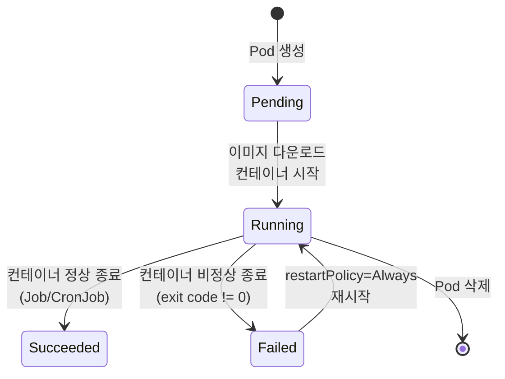
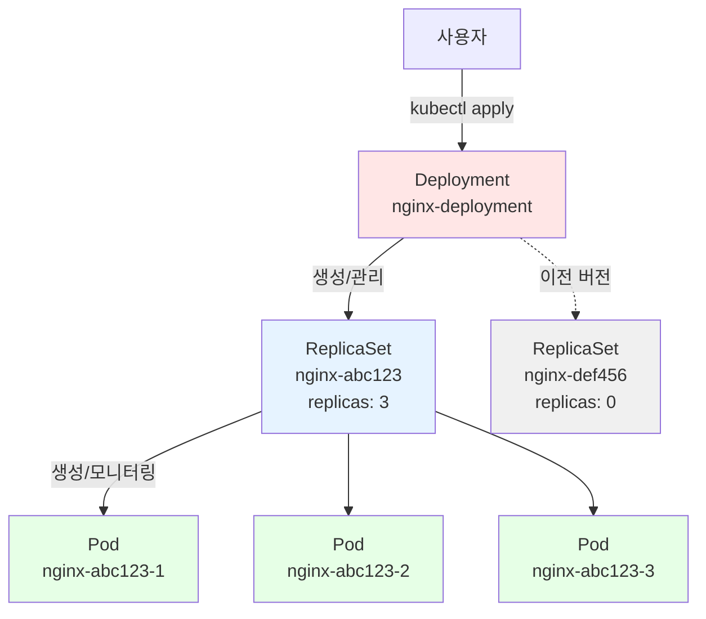
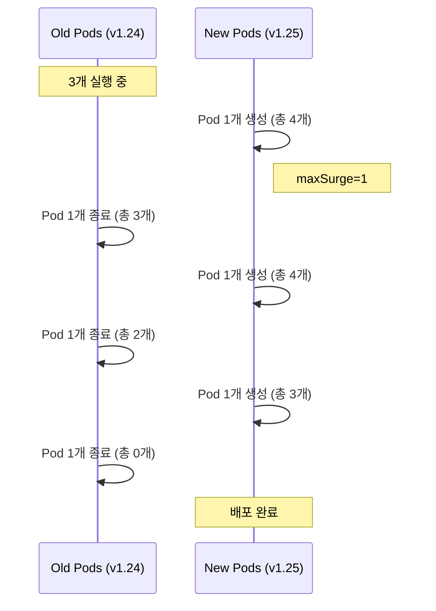
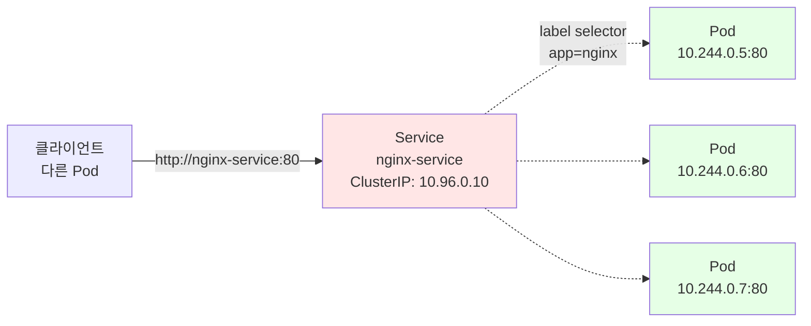
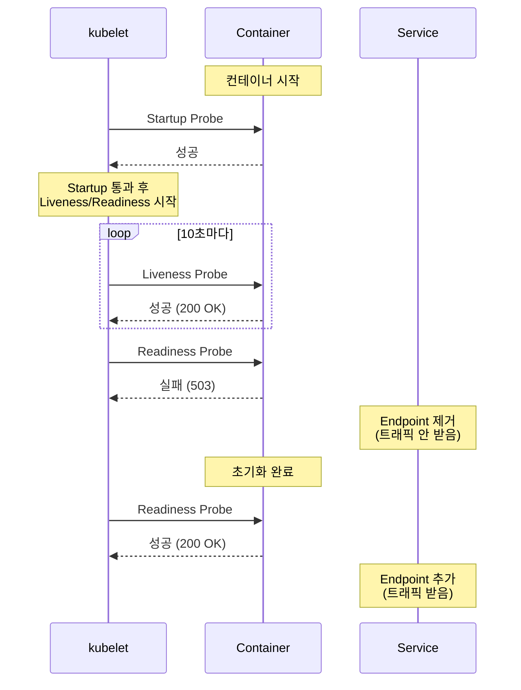

<!-- migrated: write/09_cloud/kubernetes/02-01.핵심 워크로드.md (2026-04-19) -->

# Ch02. 핵심 워크로드 - Pod, Deployment, Service의 삼각관계

> 📌 **핵심 요약**
>
> Kubernetes에서 컨테이너는 직접 실행되지 않는다. Pod라는 최소 실행 단위로 감싸지며, Pod는 Deployment가 관리하고, Service가 네트워크 진입점을 제공한다. 이 삼각관계를 이해하면 Kubernetes의 80%를 이해한 것이다. ConfigMap과 Secret은 애플리케이션 설정과 민감 정보를 주입하는 방법이며, Liveness/Readiness Probe는 Pod의 건강 상태를 관리한다. 본 챕터에서는 nginx를 배포하고, 3개로 스케일링하고, 이미지를 업데이트한 뒤, 문제가 생기면 롤백하는 전체 사이클을 실습한다.

## 🎯 학습 목표

1. Pod가 컨테이너를 감싸는 이유와 공유 네트워크/스토리지 이해
2. ReplicaSet과 Deployment의 관계, 왜 직접 Pod를 만들지 않는지 파악
3. Deployment 전략(RollingUpdate vs Recreate) 및 파라미터 튜닝
4. Service 타입(ClusterIP, NodePort, LoadBalancer)과 label selector 동작 원리
5. ConfigMap/Secret을 환경변수 또는 볼륨으로 주입하는 두 가지 방법
6. Liveness/Readiness Probe로 Pod 헬스체크 자동화
7. 실습: nginx 배포 → 스케일링 → 업데이트 → 롤백 전체 시퀀스 실행

---

## 1. 왜 Pod인가

### 1.1 컨테이너 vs Pod

Docker를 사용할 때는 `docker run nginx`로 컨테이너를 직접 실행했다. Kubernetes에서는 왜 Pod라는 개념이 필요할까?

**이유 1: 네트워크 공유**
하나의 Pod 안에 여러 컨테이너가 있을 때, 모두 같은 IP 주소를 공유한다. 따라서 `localhost`로 서로 통신할 수 있다. 예를 들어, nginx 컨테이너(80 포트)와 로그 수집기(sidecar) 컨테이너가 같은 Pod에 있으면, 로그 수집기는 `http://localhost:80`으로 nginx 로그를 가져올 수 있다.

```yaml
apiVersion: v1
kind: Pod
metadata:
  name: web-with-sidecar
spec:
  containers:
  - name: nginx
    image: nginx:1.25
    ports:
    - containerPort: 80
  - name: log-collector
    image: busybox
    command: ["sh", "-c", "while true; do wget -O- http://localhost:80 > /dev/null; sleep 10; done"]
```

**이유 2: 스토리지 공유**
Pod 내부 컨테이너는 emptyDir 볼륨을 공유할 수 있다. nginx가 `/var/log/nginx/`에 로그를 쓰면, 로그 수집기가 같은 볼륨을 마운트하여 읽는다.

**이유 3: 생명주기 동기화**
Pod 안의 모든 컨테이너는 같은 노드에 스케줄링되고, 함께 시작/종료된다. Init Container로 초기화 작업(DB 스키마 마이그레이션)을 실행한 뒤, 메인 컨테이너가 시작되도록 보장할 수 있다.

### 1.2 Pod 라이프사이클

Pod는 다음 단계를 거친다:



| Phase | 설명 | 원인 |
|-------|------|------|
| **Pending** | 스케줄링 대기 또는 이미지 다운로드 중 | 노드 리소스 부족, 이미지 pull 실패 |
| **Running** | 최소 1개 컨테이너 실행 중 | 정상 상태 |
| **Succeeded** | 모든 컨테이너가 성공적으로 종료 | Job/CronJob에서 사용 |
| **Failed** | 컨테이너가 오류로 종료 | 애플리케이션 크래시, OOMKilled |
| **Unknown** | Pod 상태를 알 수 없음 | kubelet과 통신 불가 |

**restartPolicy**:
- `Always` (기본값): 실패하면 항상 재시작 (웹 서버)
- `OnFailure`: 실패한 경우만 재시작 (배치 작업)
- `Never`: 재시작 안 함 (일회성 작업)

```bash
# Pod 상태 확인
kubectl get pods
# NAME    READY   STATUS    RESTARTS   AGE
# nginx   1/1     Running   0          10s

# Pod 상세 정보 (이벤트 포함)
kubectl describe pod nginx
# Events:
#   Type    Reason     Message
#   ----    ------     -------
#   Normal  Scheduled  Successfully assigned default/nginx to minikube
#   Normal  Pulling    Pulling image "nginx:1.25"
#   Normal  Pulled     Successfully pulled image
#   Normal  Created    Created container nginx
#   Normal  Started    Started container nginx
```

---

## 2. ReplicaSet과 Deployment

### 2.1 왜 직접 Pod를 만들지 않는가?

`kubectl run nginx --image=nginx`로 Pod를 생성하면, 해당 Pod가 죽었을 때 자동으로 재생성되지 않는다. 노드가 다운되거나, Pod를 실수로 삭제하면 끝이다.

**ReplicaSet**은 "항상 N개의 Pod를 유지"하는 컨트롤러다. Pod가 3개여야 하는데 2개만 있으면, 1개를 새로 생성한다. 하지만 ReplicaSet도 직접 만들지 않는다. 왜냐하면 **Deployment**가 ReplicaSet을 관리하며, 롤링 업데이트와 롤백 기능을 제공하기 때문이다.



### 2.2 Deployment 생성

```bash
# 명령형 방식
kubectl create deployment nginx --image=nginx:1.25 --replicas=3

# 선언형 방식 (권장)
cat <<EOF | kubectl apply -f -
apiVersion: apps/v1
kind: Deployment
metadata:
  name: nginx-deployment
  labels:
    app: nginx
spec:
  replicas: 3
  selector:
    matchLabels:
      app: nginx
  template:
    metadata:
      labels:
        app: nginx
    spec:
      containers:
      - name: nginx
        image: nginx:1.25
        ports:
        - containerPort: 80
        resources:
          requests:
            memory: "64Mi"
            cpu: "100m"
          limits:
            memory: "128Mi"
            cpu: "200m"
EOF
```

**주요 필드**:
- `replicas: 3`: 항상 3개 Pod 유지
- `selector.matchLabels`: ReplicaSet이 관리할 Pod를 선택 (label `app: nginx`)
- `template`: Pod 스펙 (컨테이너 이미지, 포트, 리소스)
- `resources.requests`: 스케줄러가 노드 선택 시 사용 (최소 보장)
- `resources.limits`: kubelet이 강제 제한 (초과 시 OOMKilled)

```bash
# Deployment 확인
kubectl get deployments
# NAME               READY   UP-TO-DATE   AVAILABLE   AGE
# nginx-deployment   3/3     3            3           1m

# ReplicaSet 확인
kubectl get replicasets
# NAME                          DESIRED   CURRENT   READY   AGE
# nginx-deployment-5d4c7b9f8c   3         3         3       1m

# Pod 확인 (label로 필터링)
kubectl get pods -l app=nginx
# NAME                                READY   STATUS    RESTARTS   AGE
# nginx-deployment-5d4c7b9f8c-abc12   1/1     Running   0          1m
# nginx-deployment-5d4c7b9f8c-def34   1/1     Running   0          1m
# nginx-deployment-5d4c7b9f8c-ghi56   1/1     Running   0          1m
```

---

## 3. Deployment 전략

### 3.1 RollingUpdate vs Recreate

| 전략 | 동작 방식 | 다운타임 | 리소스 사용 | 용도 |
|------|----------|---------|-----------|------|
| **RollingUpdate** | 새 Pod를 하나씩 생성하며 이전 Pod 종료 | 없음 | 높음 (일시적 2배) | 무중단 배포 (웹 서버) |
| **Recreate** | 모든 Pod를 즉시 종료 후 새 Pod 생성 | 있음 | 낮음 | DB 마이그레이션, 단일 인스턴스 |

```yaml
spec:
  strategy:
    type: RollingUpdate
    rollingUpdate:
      maxSurge: 1        # 동시에 생성할 수 있는 추가 Pod 수
      maxUnavailable: 0  # 동시에 삭제할 수 있는 Pod 수
```

**예시 시나리오** (replicas: 3, maxSurge: 1, maxUnavailable: 0):



### 3.2 롤링 업데이트 실습

```bash
# 이미지 업데이트
kubectl set image deployment/nginx-deployment nginx=nginx:1.26

# 롤아웃 상태 확인 (실시간)
kubectl rollout status deployment/nginx-deployment
# Waiting for deployment "nginx-deployment" rollout to finish: 1 out of 3 new replicas have been updated...
# Waiting for deployment "nginx-deployment" rollout to finish: 2 out of 3 new replicas have been updated...
# deployment "nginx-deployment" successfully rolled out

# ReplicaSet 히스토리 (이전 버전 유지)
kubectl get replicasets
# NAME                          DESIRED   CURRENT   READY   AGE
# nginx-deployment-5d4c7b9f8c   0         0         0       10m  (v1.25)
# nginx-deployment-7f8a9b1c2d   3         3         3       2m   (v1.26)
```

### 3.3 롤백

```bash
# 히스토리 확인
kubectl rollout history deployment/nginx-deployment
# REVISION  CHANGE-CAUSE
# 1         <none>
# 2         kubectl set image deployment/nginx-deployment nginx=nginx:1.26

# 이전 버전으로 롤백
kubectl rollout undo deployment/nginx-deployment

# 특정 리비전으로 롤백
kubectl rollout undo deployment/nginx-deployment --to-revision=1

# 롤백 후 ReplicaSet 확인
kubectl get replicasets
# nginx-deployment-5d4c7b9f8c   3         3         3       12m  (v1.25, 복구됨)
# nginx-deployment-7f8a9b1c2d   0         0         0       4m   (v1.26, 대기)
```

Deployment는 기본적으로 최근 10개 ReplicaSet을 보관한다(`spec.revisionHistoryLimit`). 롤백 시 이전 ReplicaSet의 `replicas`를 3으로, 현재 ReplicaSet의 `replicas`를 0으로 변경한다. Pod는 새로 생성되지 않고, 이미지만 이전 버전으로 바뀐다.

---

## 4. Service 타입과 역할

### 4.1 왜 Service가 필요한가?

Pod는 생성될 때마다 IP가 바뀐다. `10.244.0.5`라는 IP로 접근하던 Pod가 재시작되면 `10.244.0.8`로 바뀔 수 있다. Service는 고정된 ClusterIP를 제공하여, Pod IP가 바뀌어도 Service IP로 접근 가능하게 한다.



### 4.2 Service 타입

| 타입 | ClusterIP | 외부 접근 | 용도 |
|------|-----------|----------|------|
| **ClusterIP** | O (클러스터 내부만) | X | 내부 통신 (API → DB) |
| **NodePort** | O | O (NodeIP:Port) | 개발/테스트 |
| **LoadBalancer** | O | O (External IP) | 프로덕션 (클라우드) |
| **ExternalName** | X | X | DNS CNAME 매핑 |

### 4.3 ClusterIP Service (기본)

```yaml
apiVersion: v1
kind: Service
metadata:
  name: nginx-service
spec:
  type: ClusterIP  # 생략 가능 (기본값)
  selector:
    app: nginx
  ports:
  - protocol: TCP
    port: 80        # Service 포트
    targetPort: 80  # Pod 포트
```

```bash
kubectl apply -f service.yaml

# Service 확인
kubectl get svc nginx-service
# NAME            TYPE        CLUSTER-IP     EXTERNAL-IP   PORT(S)   AGE
# nginx-service   ClusterIP   10.96.0.10     <none>        80/TCP    10s

# 클러스터 내부에서 접근 (다른 Pod에서)
kubectl run test --image=curlimages/curl --rm -it -- curl http://nginx-service
# (nginx 기본 페이지 출력)

# DNS 해석 확인
kubectl run test --image=curlimages/curl --rm -it -- nslookup nginx-service
# Name:      nginx-service.default.svc.cluster.local
# Address 1: 10.96.0.10
```

### 4.4 NodePort Service

```yaml
spec:
  type: NodePort
  selector:
    app: nginx
  ports:
  - port: 80
    targetPort: 80
    nodePort: 30080  # 30000-32767 범위 (생략 시 자동 할당)
```

```bash
kubectl apply -f service-nodeport.yaml

kubectl get svc
# NAME            TYPE       CLUSTER-IP     EXTERNAL-IP   PORT(S)        AGE
# nginx-service   NodePort   10.96.0.10     <none>        80:30080/TCP   10s

# minikube에서 접근
curl http://$(minikube ip):30080
# (nginx 기본 페이지 출력)
```

### 4.5 LoadBalancer Service (minikube tunnel 필요)

```yaml
spec:
  type: LoadBalancer
  selector:
    app: nginx
  ports:
  - port: 80
    targetPort: 80
```

```bash
kubectl apply -f service-lb.yaml

# 터미널 1: minikube tunnel 실행 (sudo 필요)
minikube tunnel

# 터미널 2: EXTERNAL-IP 할당 확인
kubectl get svc nginx-service
# NAME            TYPE           CLUSTER-IP     EXTERNAL-IP   PORT(S)        AGE
# nginx-service   LoadBalancer   10.96.0.10     127.0.0.1     80:31234/TCP   20s

# 접근
curl http://127.0.0.1
```

---

## 5. ConfigMap과 Secret

### 5.1 환경변수 vs 볼륨 마운트

애플리케이션 설정(DB 호스트, API URL)을 하드코딩하면 환경(dev, staging, prod)마다 이미지를 다시 빌드해야 한다. ConfigMap은 설정을, Secret은 민감 정보(비밀번호, API 키)를 외부화한다.

**주입 방법**:
1. **환경변수**: 간단한 key-value (예: `DB_HOST=postgres.default.svc`)
2. **볼륨 마운트**: 파일로 주입 (예: `/etc/config/app.yaml`)

### 5.2 ConfigMap 생성 및 사용

```bash
# 명령형 생성
kubectl create configmap app-config \
  --from-literal=DB_HOST=postgres.default.svc \
  --from-literal=LOG_LEVEL=info

# 파일에서 생성
echo "key1=value1" > config.properties
kubectl create configmap app-config --from-file=config.properties
```

```yaml
# 선언형 생성
apiVersion: v1
kind: ConfigMap
metadata:
  name: app-config
data:
  DB_HOST: postgres.default.svc
  LOG_LEVEL: info
  app.yaml: |
    server:
      port: 8080
    database:
      host: postgres.default.svc
```

**환경변수로 주입**:

```yaml
spec:
  containers:
  - name: app
    image: my-app:v1
    env:
    - name: DB_HOST
      valueFrom:
        configMapKeyRef:
          name: app-config
          key: DB_HOST
    # 또는 모든 key를 환경변수로
    envFrom:
    - configMapRef:
        name: app-config
```

**볼륨으로 주입**:

```yaml
spec:
  containers:
  - name: app
    image: my-app:v1
    volumeMounts:
    - name: config-volume
      mountPath: /etc/config
  volumes:
  - name: config-volume
    configMap:
      name: app-config
```

```bash
# Pod 내부에서 확인
kubectl exec -it <pod-name> -- ls /etc/config
# DB_HOST  LOG_LEVEL  app.yaml

kubectl exec -it <pod-name> -- cat /etc/config/app.yaml
# server:
#   port: 8080
# ...
```

### 5.3 Secret

```bash
# Secret 생성 (base64 자동 인코딩)
kubectl create secret generic db-password \
  --from-literal=password=mysecretpassword

# YAML로 생성 (수동 base64 인코딩)
echo -n "mysecretpassword" | base64
# bXlzZWNyZXRwYXNzd29yZA==

cat <<EOF | kubectl apply -f -
apiVersion: v1
kind: Secret
metadata:
  name: db-password
type: Opaque
data:
  password: bXlzZWNyZXRwYXNzd29yZA==
EOF
```

```yaml
# 환경변수로 주입
spec:
  containers:
  - name: app
    env:
    - name: DB_PASSWORD
      valueFrom:
        secretKeyRef:
          name: db-password
          key: password
```

**주의**: Secret은 base64 인코딩일 뿐, 암호화가 아니다. etcd에 평문으로 저장되므로, 프로덕션에서는 etcd 암호화(`--encryption-provider-config`)와 RBAC를 반드시 설정해야 한다.

---

## 6. Liveness/Readiness/Startup Probe

### 6.1 세 가지 Probe의 차이

| Probe | 실패 시 동작 | 용도 |
|-------|------------|------|
| **Liveness** | Pod 재시작 | 데드락, 무한 루프 감지 |
| **Readiness** | Service Endpoint에서 제외 | 초기화 중, 일시적 과부하 |
| **Startup** | Liveness 체크 시작 지연 | 느린 시작 (Java 애플리케이션) |



### 6.2 HTTP Probe 예시

```yaml
spec:
  containers:
  - name: app
    image: my-app:v1
    ports:
    - containerPort: 8080
    livenessProbe:
      httpGet:
        path: /healthz
        port: 8080
      initialDelaySeconds: 10  # 컨테이너 시작 후 10초 대기
      periodSeconds: 10        # 10초마다 체크
      timeoutSeconds: 2        # 2초 안에 응답 없으면 실패
      failureThreshold: 3      # 3회 연속 실패 시 재시작
    readinessProbe:
      httpGet:
        path: /ready
        port: 8080
      initialDelaySeconds: 5
      periodSeconds: 5
    startupProbe:
      httpGet:
        path: /startup
        port: 8080
      failureThreshold: 30     # 30회 * 10초 = 5분 시작 시간 허용
      periodSeconds: 10
```

### 6.3 Exec Probe (명령어 실행)

```yaml
livenessProbe:
  exec:
    command:
    - cat
    - /tmp/healthy
  initialDelaySeconds: 5
  periodSeconds: 5
```

### 6.4 TCP Probe

```yaml
livenessProbe:
  tcpSocket:
    port: 3306  # MySQL
  initialDelaySeconds: 10
  periodSeconds: 10
```

---

## 7. 실습: nginx 배포 → 스케일링 → 업데이트 → 롤백

### 7.1 전체 시퀀스

```bash
# 1. Deployment 생성
kubectl create deployment nginx --image=nginx:1.25 --replicas=2

# 2. 상태 확인
kubectl get pods -w
# (CTRL+C로 종료)

# 3. Service 생성 (NodePort)
kubectl expose deployment nginx --type=NodePort --port=80

kubectl get svc nginx
# NAME    TYPE       CLUSTER-IP      EXTERNAL-IP   PORT(S)        AGE
# nginx   NodePort   10.96.100.200   <none>        80:30123/TCP   10s

# 4. 접근 테스트
curl http://$(minikube ip):30123
# (nginx 1.25 버전 응답)

# 5. 스케일 아웃 (2 → 5)
kubectl scale deployment nginx --replicas=5

kubectl get pods
# NAME                    READY   STATUS    RESTARTS   AGE
# nginx-5d4c7b9f8c-abc12  1/1     Running   0          2m
# nginx-5d4c7b9f8c-def34  1/1     Running   0          2m
# nginx-5d4c7b9f8c-ghi56  1/1     Running   0          10s
# nginx-5d4c7b9f8c-jkl78  1/1     Running   0          10s
# nginx-5d4c7b9f8c-mno90  1/1     Running   0          10s

# 6. 이미지 업데이트 (1.25 → 1.26)
kubectl set image deployment/nginx nginx=nginx:1.26

# 7. 롤아웃 모니터링
kubectl rollout status deployment/nginx
# Waiting for deployment "nginx" rollout to finish: 2 out of 5 new replicas have been updated...
# deployment "nginx" successfully rolled out

# 8. 버전 확인 (nginx 버전 응답 헤더 확인)
curl -I http://$(minikube ip):30123
# Server: nginx/1.26.0

# 9. 잘못된 이미지로 업데이트 (실패 시나리오)
kubectl set image deployment/nginx nginx=nginx:invalid-tag

kubectl get pods
# NAME                    READY   STATUS             RESTARTS   AGE
# nginx-7f8a9b1c2d-abc12  0/1     ImagePullBackOff   0          20s
# nginx-5d4c7b9f8c-def34  1/1     Running            0          5m
# nginx-5d4c7b9f8c-ghi56  1/1     Running            0          5m
# (일부 Pod만 실패, 나머지는 이전 버전 유지 → 무중단)

# 10. 롤백
kubectl rollout undo deployment/nginx

kubectl get pods
# (모든 Pod가 nginx:1.26으로 복구)

# 11. 히스토리 확인
kubectl rollout history deployment/nginx
# REVISION  CHANGE-CAUSE
# 1         <none>
# 3         kubectl set image deployment/nginx nginx=nginx:1.26
# 4         kubectl set image deployment/nginx nginx=nginx:invalid-tag

# 12. 정리
kubectl delete deployment nginx
kubectl delete service nginx
```

### 7.2 선언형 방식 (권장)

```yaml
# deployment.yaml
apiVersion: apps/v1
kind: Deployment
metadata:
  name: nginx
spec:
  replicas: 3
  selector:
    matchLabels:
      app: nginx
  template:
    metadata:
      labels:
        app: nginx
    spec:
      containers:
      - name: nginx
        image: nginx:1.25
        ports:
        - containerPort: 80
        livenessProbe:
          httpGet:
            path: /
            port: 80
          initialDelaySeconds: 10
          periodSeconds: 10
        readinessProbe:
          httpGet:
            path: /
            port: 80
          initialDelaySeconds: 5
          periodSeconds: 5
        resources:
          requests:
            memory: "64Mi"
            cpu: "100m"
          limits:
            memory: "128Mi"
            cpu: "200m"
---
apiVersion: v1
kind: Service
metadata:
  name: nginx
spec:
  type: NodePort
  selector:
    app: nginx
  ports:
  - port: 80
    targetPort: 80
    nodePort: 30080
```

```bash
# 적용
kubectl apply -f deployment.yaml

# 이미지 변경 (YAML 수정 후)
# image: nginx:1.25 → nginx:1.26
kubectl apply -f deployment.yaml

# Git으로 버전 관리 (GitOps)
git add deployment.yaml
git commit -m "Update nginx to 1.26"
git push
```

---

## 8. 정리

### 배운 내용

1. **Pod의 필요성**: 컨테이너를 감싸서 네트워크/스토리지 공유, 생명주기 동기화. Pending → Running → Succeeded/Failed 단계를 거침.
2. **ReplicaSet과 Deployment**: Pod를 직접 만들지 않고, Deployment가 ReplicaSet을 통해 관리. 롤링 업데이트와 롤백 기능 제공.
3. **Deployment 전략**: RollingUpdate(무중단, maxSurge/maxUnavailable 튜닝), Recreate(다운타임 허용).
4. **Service**: Pod IP는 변동되지만 Service IP는 고정. ClusterIP(내부), NodePort(개발), LoadBalancer(프로덕션).
5. **ConfigMap/Secret**: 환경변수 또는 볼륨으로 주입. Secret은 base64 인코딩이므로 etcd 암호화 필수.
6. **Probe**: Liveness(재시작), Readiness(트래픽 제어), Startup(느린 시작 허용).
7. **실습 사이클**: Deployment 생성 → Service 노출 → 스케일링 → 이미지 업데이트 → 롤백.

### 명령어 요약

| 작업 | 명령어 |
|------|--------|
| Deployment 생성 | `kubectl create deployment <name> --image=<image> --replicas=<n>` |
| Service 노출 | `kubectl expose deployment <name> --type=NodePort --port=80` |
| 스케일링 | `kubectl scale deployment <name> --replicas=<n>` |
| 이미지 업데이트 | `kubectl set image deployment/<name> <container>=<image>` |
| 롤아웃 상태 | `kubectl rollout status deployment/<name>` |
| 롤백 | `kubectl rollout undo deployment/<name>` |
| 히스토리 | `kubectl rollout history deployment/<name>` |
| ConfigMap 생성 | `kubectl create configmap <name> --from-literal=<key>=<value>` |
| Secret 생성 | `kubectl create secret generic <name> --from-literal=<key>=<value>` |

### 다음 단계

Ch03에서는 StatefulSet, DaemonSet, Job, CronJob 등 특수한 워크로드를 다룬다. StatefulSet은 데이터베이스처럼 고정된 네트워크 ID와 PersistentVolume이 필요한 애플리케이션을 위한 것이고, DaemonSet은 모든 노드에서 하나씩 실행해야 하는 로그 수집기나 모니터링 에이전트에 사용된다. Job/CronJob은 일회성 또는 주기적 배치 작업을 자동화한다. 지금까지 배운 Deployment/Service가 Stateless 애플리케이션의 기본이라면, 다음 챕터는 Stateful과 배치 워크로드의 세계다.
