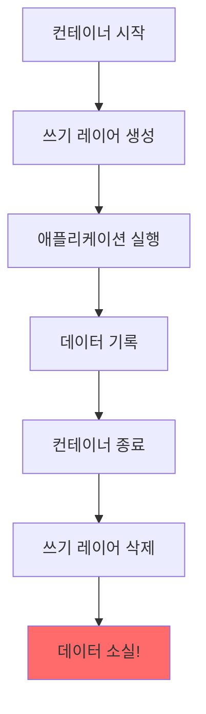
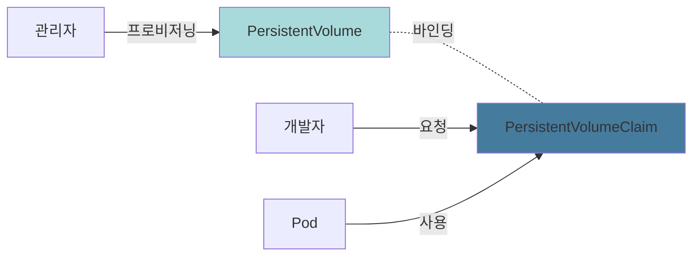
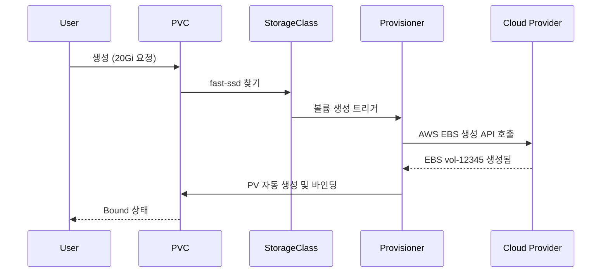
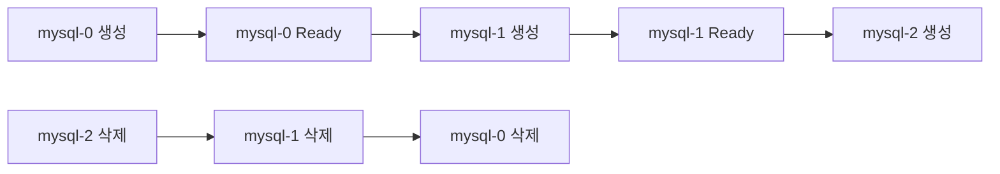
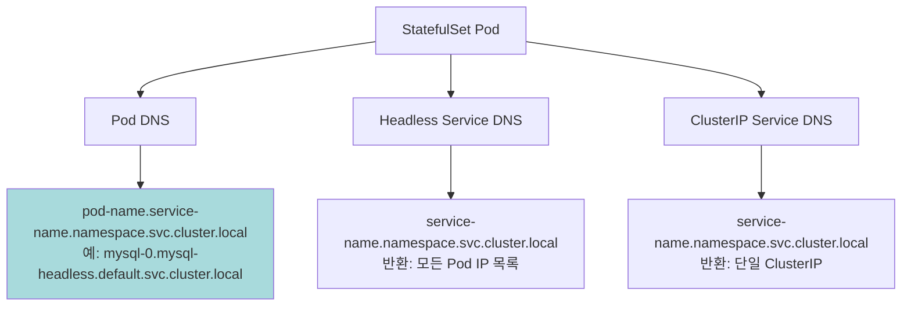

# Ch03. 스토리지와 상태 관리

> 📌 **핵심 요약**
>
> 컨테이너는 기본적으로 ephemeral(임시적) 특성을 가지며, 재시작 시 데이터가 소실됩니다. Kubernetes는 Volume, PersistentVolume/PersistentVolumeClaim을 통해 데이터 영속성을 제공하고, StatefulSet을 통해 상태를 가진 애플리케이션의 안정적인 배포를 지원합니다. Stateless 워크로드는 Deployment로, Stateful 워크로드는 StatefulSet으로 관리하며, 스토리지 전략은 데이터 생명주기와 애플리케이션 특성에 따라 달라집니다.

## 🎯 학습 목표

이 챕터를 완료하면 다음을 할 수 있습니다:

1. 컨테이너의 ephemeral 특성과 데이터 유실 시나리오 이해
2. Volume 타입별(emptyDir, hostPath, PVC 등) 사용 시나리오 구분
3. PV/PVC의 정적/동적 프로비저닝 차이와 StorageClass 역할 설명
4. StatefulSet의 특징(안정적 네트워크 ID, 순서 보장)과 사용 시점 판단
5. Headless Service와 StatefulSet의 DNS 패턴 활용
6. 실습을 통해 상태 유지 워크로드 배포 및 검증

---

## 📖 본문

### 1. 왜 스토리지가 문제인가

#### 1.1 컨테이너의 Ephemeral 특성

Docker와 Kubernetes의 컨테이너는 기본적으로 **일시적(ephemeral)** 입니다. 이는 다음을 의미합니다:

- 컨테이너 내부 파일시스템은 이미지 레이어와 쓰기 가능한 레이어(writable layer)로 구성
- 프로세스가 종료되면 쓰기 레이어의 데이터는 **영구적으로 소실**
- 새로운 컨테이너는 항상 이미지의 초기 상태에서 시작



#### 1.2 데이터 유실 시나리오

실제 운영 환경에서 데이터 유실이 발생하는 경우:

**시나리오 1: Pod 재시작**
```bash
# 로그를 로컬 파일에 저장하는 애플리케이션
kubectl run logger --image=nginx --restart=Always
kubectl exec logger -- sh -c "echo 'important log' > /var/log/app.log"
kubectl delete pod logger  # 자동 재생성
kubectl exec logger -- cat /var/log/app.log  # 파일 없음!
```

**시나리오 2: 크래시 루프**
```bash
# 데이터베이스 Pod이 OOM으로 종료
# Kubernetes가 자동으로 재시작하지만 데이터는 초기화됨
```

**시나리오 3: 노드 장애**
```bash
# 노드가 다운되면 Pod이 다른 노드로 이동
# 이전 노드의 로컬 스토리지는 접근 불가
```

#### 1.3 왜 모든 것을 영속화하지 않는가?

Stateless와 Stateful의 구분은 **의도적인 설계 결정**입니다:

| 측면 | Stateless (Deployment) | Stateful (StatefulSet) |
|------|------------------------|------------------------|
| **배포 속도** | 빠름 (데이터 초기화 불필요) | 느림 (순서 보장, 데이터 마운트) |
| **확장성** | 수평 확장 즉시 가능 | 복잡 (각 인스턴스 고유 상태) |
| **복구 시간** | 빠름 (어느 노드에서나 즉시 시작) | 느림 (볼륨 재마운트 필요) |
| **비용** | 낮음 (스토리지 불필요) | 높음 (영구 스토리지 비용) |

**실무 원칙**: 상태를 가질 필요가 없다면 Stateless로 설계합니다. 예를 들어, 세션 데이터를 Redis에 저장하면 웹 서버 자체는 Stateless로 유지할 수 있습니다.

---

### 2. Volume 타입

Kubernetes는 다양한 Volume 타입을 제공하며, 각각 특정 사용 사례에 최적화되어 있습니다.

#### 2.1 emptyDir: 임시 공유 스토리지

**특징**:
- Pod이 생성될 때 빈 디렉토리 생성
- **Pod이 삭제되면 함께 삭제** (재시작 시에는 유지)
- 같은 Pod 내 컨테이너 간 데이터 공유

**사용 시나리오**:
1. 사이드카 패턴의 로그 수집
2. 임시 캐시
3. 체크포인트 저장

```yaml
apiVersion: v1
kind: Pod
metadata:
  name: sidecar-logger
spec:
  containers:
  - name: app
    image: nginx
    volumeMounts:
    - name: shared-logs
      mountPath: /var/log/nginx
  - name: log-shipper
    image: busybox
    command: ['sh', '-c', 'tail -f /logs/access.log']
    volumeMounts:
    - name: shared-logs
      mountPath: /logs
  volumes:
  - name: shared-logs
    emptyDir: {}
```

**메모리 기반 emptyDir**:
```yaml
volumes:
- name: cache
  emptyDir:
    medium: Memory  # tmpfs 사용
    sizeLimit: 1Gi
```

#### 2.2 hostPath: 노드 파일시스템 마운트

**특징**:
- 호스트 노드의 파일/디렉토리를 Pod에 마운트
- Pod이 삭제되어도 데이터 유지
- **노드 종속적** (다른 노드로 이동 시 데이터 접근 불가)

**사용 시나리오**:
1. 노드의 Docker socket 접근 (`/var/run/docker.sock`)
2. 시스템 모니터링 에이전트
3. 단일 노드 개발 환경

```yaml
apiVersion: v1
kind: Pod
metadata:
  name: node-monitor
spec:
  containers:
  - name: monitor
    image: monitoring-agent
    volumeMounts:
    - name: host-root
      mountPath: /host
      readOnly: true
  volumes:
  - name: host-root
    hostPath:
      path: /
      type: Directory
```

**⚠️ 보안 주의**: hostPath는 노드 파일시스템에 대한 강력한 권한을 부여하므로, 프로덕션 환경에서는 신중하게 사용해야 합니다.

#### 2.3 configMap과 secret: 설정 주입

**특징**:
- 설정 파일이나 민감 정보를 Volume으로 마운트
- 읽기 전용
- 런타임에 업데이트 가능 (subPath 미사용 시)

```yaml
apiVersion: v1
kind: ConfigMap
metadata:
  name: app-config
data:
  app.conf: |
    server.port=8080
    db.host=mysql
---
apiVersion: v1
kind: Pod
metadata:
  name: app
spec:
  containers:
  - name: app
    image: myapp
    volumeMounts:
    - name: config
      mountPath: /etc/config
  volumes:
  - name: config
    configMap:
      name: app-config
```

**동적 업데이트 확인**:
```bash
# ConfigMap 수정
kubectl edit configmap app-config

# 컨테이너 내부에서 확인 (약 1분 후 반영)
kubectl exec app -- cat /etc/config/app.conf
```

#### 2.4 persistentVolumeClaim: 영구 스토리지

가장 중요한 타입으로, 다음 섹션에서 자세히 다룹니다.

#### 2.5 Volume 타입 비교

| 타입 | 수명 | 노드 이동 | 사용 사례 | 보안 위험 |
|------|------|-----------|-----------|-----------|
| **emptyDir** | Pod | ❌ | 임시 공유, 캐시 | 낮음 |
| **hostPath** | 영구 | ❌ | 시스템 접근, 개발 | 높음 |
| **configMap** | 외부 관리 | ✅ | 설정 주입 | 낮음 |
| **secret** | 외부 관리 | ✅ | 민감 정보 | 중간 |
| **PVC** | 외부 관리 | ✅ (설정에 따름) | 영구 데이터 | 낮음 |

---

### 3. PersistentVolume과 PersistentVolumeClaim

#### 3.1 왜 PV/PVC 추상화가 필요한가?

직접 Volume을 Pod에 정의하면 다음 문제가 발생합니다:

1. **인프라 종속성**: Pod 정의에 AWS EBS ID나 NFS 서버 주소가 하드코딩됨
2. **권한 분리 불가**: 개발자가 스토리지 프로비저닝을 직접 관리해야 함
3. **재사용 불가**: 같은 볼륨을 여러 Pod에서 사용하기 어려움

PV/PVC 모델은 **스토리지 공급자와 소비자를 분리**합니다:



#### 3.2 정적 프로비저닝

**Step 1: 관리자가 PV 생성**
```yaml
apiVersion: v1
kind: PersistentVolume
metadata:
  name: pv-static
spec:
  capacity:
    storage: 10Gi
  accessModes:
    - ReadWriteOnce
  persistentVolumeReclaimPolicy: Retain
  storageClassName: manual
  hostPath:
    path: /mnt/data
```

**Step 2: 개발자가 PVC 생성**
```yaml
apiVersion: v1
kind: PersistentVolumeClaim
metadata:
  name: pvc-static
spec:
  accessModes:
    - ReadWriteOnce
  resources:
    requests:
      storage: 5Gi
  storageClassName: manual
```

**Step 3: 바인딩 확인**
```bash
kubectl get pv,pvc
# NAME         CAPACITY   ACCESS MODES   RECLAIM POLICY   STATUS   CLAIM
# pv-static    10Gi       RWO            Retain           Bound    default/pvc-static
```

**바인딩 조건**:
- StorageClass가 일치 (또는 둘 다 비어있음)
- AccessMode가 호환
- 요청 용량 ≤ PV 용량

#### 3.3 동적 프로비저닝

정적 프로비저닝의 문제점:
- 개발자가 PVC를 만들 때마다 관리자가 수동으로 PV를 생성해야 함
- 리소스 낭비 (10Gi PV에 1Gi PVC 바인딩 시 9Gi 낭비)

**StorageClass를 통한 자동화**:
```yaml
apiVersion: storage.k8s.io/v1
kind: StorageClass
metadata:
  name: fast-ssd
provisioner: kubernetes.io/aws-ebs
parameters:
  type: gp3
  iopsPerGB: "50"
  encrypted: "true"
reclaimPolicy: Delete
volumeBindingMode: WaitForFirstConsumer
```

**동적 PVC**:
```yaml
apiVersion: v1
kind: PersistentVolumeClaim
metadata:
  name: pvc-dynamic
spec:
  accessModes:
    - ReadWriteOnce
  storageClassName: fast-ssd  # StorageClass 지정
  resources:
    requests:
      storage: 20Gi
```

**프로비저닝 흐름**:


---

### 4. StorageClass

#### 4.1 주요 필드 설명

**provisioner**: 볼륨을 생성할 드라이버

| 환경 | Provisioner | 설명 |
|------|-------------|------|
| AWS | `kubernetes.io/aws-ebs` | EBS 볼륨 |
| GCP | `kubernetes.io/gce-pd` | Persistent Disk |
| Azure | `kubernetes.io/azure-disk` | Azure Disk |
| Minikube | `k8s.io/minikube-hostpath` | 로컬 디렉토리 |
| NFS | `nfs.csi.k8s.io` | NFS 서버 |

**parameters**: 프로비저너별 옵션
```yaml
# AWS EBS 예시
parameters:
  type: gp3          # 볼륨 타입
  iopsPerGB: "50"    # IOPS 설정
  encrypted: "true"  # 암호화
  fsType: ext4       # 파일시스템
```

**reclaimPolicy**: PVC 삭제 시 동작

| 정책 | 동작 | 사용 시나리오 |
|------|------|---------------|
| **Delete** | PV와 실제 스토리지 삭제 | 개발 환경, 임시 데이터 |
| **Retain** | PV는 Released 상태로 유지 | 프로덕션, 데이터 백업 필요 |
| **Recycle** | 데이터 삭제 후 재사용 (deprecated) | 사용 안 함 |

**volumeBindingMode**: 바인딩 시점

```yaml
# Immediate: PVC 생성 즉시 바인딩
volumeBindingMode: Immediate

# WaitForFirstConsumer: Pod이 생성될 때까지 대기
volumeBindingMode: WaitForFirstConsumer  # 권장
```

**WaitForFirstConsumer의 장점**:
- Pod이 스케줄된 노드와 같은 가용 영역에 볼륨 생성 (네트워크 지연 감소)
- 불필요한 볼륨 생성 방지

#### 4.2 실무 StorageClass 설계

**계층별 StorageClass**:
```yaml
# 프로덕션 DB용
---
apiVersion: storage.k8s.io/v1
kind: StorageClass
metadata:
  name: prod-db
provisioner: kubernetes.io/aws-ebs
parameters:
  type: io2
  iopsPerGB: "100"
  encrypted: "true"
reclaimPolicy: Retain
volumeBindingMode: WaitForFirstConsumer
allowVolumeExpansion: true

# 개발 환경용
---
apiVersion: storage.k8s.io/v1
kind: StorageClass
metadata:
  name: dev-storage
provisioner: kubernetes.io/aws-ebs
parameters:
  type: gp2
reclaimPolicy: Delete
volumeBindingMode: Immediate

# 로그/캐시용 (빠른 I/O, 데이터 손실 허용)
---
apiVersion: storage.k8s.io/v1
kind: StorageClass
metadata:
  name: fast-cache
provisioner: kubernetes.io/aws-ebs
parameters:
  type: gp3
  iopsPerGB: "50"
reclaimPolicy: Delete
volumeBindingMode: WaitForFirstConsumer
```

---

### 5. StatefulSet의 특징

#### 5.1 StatefulSet vs Deployment

Deployment로 데이터베이스를 배포하면 문제가 발생합니다:

```yaml
# ❌ 잘못된 예시
apiVersion: apps/v1
kind: Deployment
metadata:
  name: mysql-wrong
spec:
  replicas: 3
  template:
    spec:
      containers:
      - name: mysql
        image: mysql:8.0
        volumeMounts:
        - name: data
          mountPath: /var/lib/mysql
      volumes:
      - name: data
        persistentVolumeClaim:
          claimName: mysql-pvc  # 모든 Pod이 같은 PVC 사용!
```

**문제점**:
1. 모든 Pod이 같은 볼륨을 공유 → 데이터 충돌
2. Pod 이름이 랜덤 (mysql-wrong-7f8d9-xkw2p) → 네트워크 식별 불가
3. 재시작 시 다른 PVC에 바인딩될 수 있음

#### 5.2 StatefulSet의 3대 보장

**1. 안정적인 네트워크 ID**
```bash
# Deployment Pod 이름 (랜덤)
nginx-deploy-7f8d9-xkw2p
nginx-deploy-7f8d9-mn4t5

# StatefulSet Pod 이름 (순서 보장)
mysql-0
mysql-1
mysql-2
```

**2. 순서 보장**


**3. 안정적인 스토리지**
- 각 Pod이 고유한 PVC를 가짐
- Pod이 재시작되어도 같은 PVC에 재연결

#### 5.3 StatefulSet 정의

```yaml
apiVersion: v1
kind: Service
metadata:
  name: mysql-headless
spec:
  clusterIP: None  # Headless Service
  selector:
    app: mysql
  ports:
  - port: 3306
---
apiVersion: apps/v1
kind: StatefulSet
metadata:
  name: mysql
spec:
  serviceName: mysql-headless  # 필수!
  replicas: 3
  selector:
    matchLabels:
      app: mysql
  template:
    metadata:
      labels:
        app: mysql
    spec:
      containers:
      - name: mysql
        image: mysql:8.0
        env:
        - name: MYSQL_ROOT_PASSWORD
          value: password
        ports:
        - containerPort: 3306
        volumeMounts:
        - name: data
          mountPath: /var/lib/mysql
  volumeClaimTemplates:  # 각 Pod이 고유 PVC 생성
  - metadata:
      name: data
    spec:
      accessModes: ["ReadWriteOnce"]
      storageClassName: fast-ssd
      resources:
        requests:
          storage: 10Gi
```

**생성된 리소스**:
```bash
kubectl get pods
# mysql-0   1/1   Running
# mysql-1   1/1   Running
# mysql-2   1/1   Running

kubectl get pvc
# data-mysql-0   Bound   pvc-abc123   10Gi
# data-mysql-1   Bound   pvc-def456   10Gi
# data-mysql-2   Bound   pvc-ghi789   10Gi
```

#### 5.4 순서 보장의 실무적 의미

**시나리오: MySQL 마스터-슬레이브 복제**

```yaml
apiVersion: apps/v1
kind: StatefulSet
metadata:
  name: mysql
spec:
  replicas: 3
  template:
    spec:
      initContainers:
      - name: init-mysql
        image: mysql:8.0
        command:
        - bash
        - "-c"
        - |
          set -ex
          # mysql-0은 마스터, 나머지는 슬레이브
          [[ $(hostname) =~ -([0-9]+)$ ]] || exit 1
          ordinal=${BASH_REMATCH[1]}
          if [[ $ordinal -eq 0 ]]; then
            echo "[mysqld]" > /mnt/conf.d/server-id.cnf
            echo "server-id=1" >> /mnt/conf.d/server-id.cnf
          else
            echo "[mysqld]" > /mnt/conf.d/server-id.cnf
            echo "server-id=$((100 + $ordinal))" >> /mnt/conf.d/server-id.cnf
            echo "relay-log=mysql-relay-bin" >> /mnt/conf.d/server-id.cnf
          fi
```

**순서 보장의 이점**:
- mysql-0이 먼저 시작되어 마스터로 초기화
- mysql-1, mysql-2는 mysql-0에서 데이터 복제
- 스케일 다운 시 mysql-2부터 삭제 (마스터 보호)

---

### 6. Headless Service와 StatefulSet

#### 6.1 일반 Service의 한계

일반 ClusterIP Service는 로드밸런싱을 제공합니다:
```bash
# mysql-service → 랜덤하게 mysql-0, mysql-1, mysql-2 중 하나로 연결
mysql -h mysql-service -u root -p
```

**문제**: MySQL 복제에서 읽기는 슬레이브, 쓰기는 마스터로 라우팅해야 하는데, 랜덤 연결은 불가능합니다.

#### 6.2 Headless Service의 동작

```yaml
apiVersion: v1
kind: Service
metadata:
  name: mysql-headless
spec:
  clusterIP: None  # 이 설정으로 Headless 활성화
  selector:
    app: mysql
  ports:
  - port: 3306
```

**DNS 레코드 생성**:
```bash
# 일반 Service
mysql-service.default.svc.cluster.local → 10.96.1.5 (ClusterIP)

# Headless Service (각 Pod의 IP 반환)
mysql-headless.default.svc.cluster.local → 10.244.1.10, 10.244.2.11, 10.244.3.12

# 개별 Pod DNS
mysql-0.mysql-headless.default.svc.cluster.local → 10.244.1.10
mysql-1.mysql-headless.default.svc.cluster.local → 10.244.2.11
mysql-2.mysql-headless.default.svc.cluster.local → 10.244.3.12
```

**활용 예시**:
```python
# 쓰기는 마스터로
master_conn = mysql.connect(host="mysql-0.mysql-headless")

# 읽기는 슬레이브로 분산
import random
replica_id = random.randint(1, 2)
replica_conn = mysql.connect(host=f"mysql-{replica_id}.mysql-headless")
```

#### 6.3 DNS 패턴 정리



---

### 7. 실습: StatefulSet + PVC로 상태 유지 확인

이 실습에서는 StatefulSet의 핵심 특성을 검증합니다.

#### 7.1 환경 준비

```bash
# Minikube 시작 (StorageClass 제공)
minikube start

# StorageClass 확인
kubectl get storageclass
# NAME                 PROVISIONER                RECLAIMPOLICY
# standard (default)   k8s.io/minikube-hostpath   Delete
```

#### 7.2 StatefulSet 배포

**파일: `statefulset-demo.yaml`**
```yaml
apiVersion: v1
kind: Service
metadata:
  name: nginx-headless
spec:
  clusterIP: None
  selector:
    app: nginx-stateful
  ports:
  - port: 80
---
apiVersion: apps/v1
kind: StatefulSet
metadata:
  name: web
spec:
  serviceName: nginx-headless
  replicas: 3
  selector:
    matchLabels:
      app: nginx-stateful
  template:
    metadata:
      labels:
        app: nginx-stateful
    spec:
      containers:
      - name: nginx
        image: nginx:1.21
        ports:
        - containerPort: 80
        volumeMounts:
        - name: www
          mountPath: /usr/share/nginx/html
  volumeClaimTemplates:
  - metadata:
      name: www
    spec:
      accessModes: ["ReadWriteOnce"]
      storageClassName: standard
      resources:
        requests:
          storage: 1Gi
```

**배포**:
```bash
kubectl apply -f statefulset-demo.yaml

# 순서대로 생성되는지 관찰
kubectl get pods -w
# web-0   0/1   Pending
# web-0   1/1   Running
# web-1   0/1   Pending
# web-1   1/1   Running
# web-2   0/1   Pending
# web-2   1/1   Running
```

#### 7.3 고유 데이터 기록

각 Pod에 고유한 데이터를 저장합니다:

```bash
# web-0에 데이터 기록
kubectl exec web-0 -- bash -c 'echo "I am web-0" > /usr/share/nginx/html/index.html'

# web-1에 데이터 기록
kubectl exec web-1 -- bash -c 'echo "I am web-1" > /usr/share/nginx/html/index.html'

# web-2에 데이터 기록
kubectl exec web-2 -- bash -c 'echo "I am web-2" > /usr/share/nginx/html/index.html'

# 확인
for i in 0 1 2; do
  echo "=== web-$i ==="
  kubectl exec web-$i -- cat /usr/share/nginx/html/index.html
done
# === web-0 ===
# I am web-0
# === web-1 ===
# I am web-1
# === web-2 ===
# I am web-2
```

#### 7.4 Pod 삭제 후 상태 유지 확인

```bash
# web-1 삭제
kubectl delete pod web-1

# 자동 재생성 확인
kubectl get pods -w
# web-1   0/1   Pending
# web-1   1/1   Running

# 데이터 유지 확인
kubectl exec web-1 -- cat /usr/share/nginx/html/index.html
# I am web-1  ← 여전히 같은 내용!
```

#### 7.5 PVC 바인딩 확인

```bash
# PVC와 Pod 매핑 확인
kubectl get pvc
# NAME        STATUS   VOLUME                                     CAPACITY
# www-web-0   Bound    pvc-abc123...                              1Gi
# www-web-1   Bound    pvc-def456...                              1Gi
# www-web-2   Bound    pvc-ghi789...                              1Gi

# Pod 삭제 후에도 PVC는 유지됨
kubectl delete pod web-1
kubectl get pvc
# www-web-1   Bound    pvc-def456...   1Gi  ← 여전히 존재

# 새로운 web-1 Pod이 같은 PVC에 다시 바인딩됨
kubectl describe pod web-1 | grep ClaimName
# ClaimName:  www-web-1
```

#### 7.6 스케일링 동작 확인

```bash
# 스케일 다운
kubectl scale statefulset web --replicas=1

# 역순으로 삭제 확인
kubectl get pods -w
# web-2   1/1   Terminating
# web-1   1/1   Terminating
# web-0   1/1   Running

# PVC는 삭제되지 않음!
kubectl get pvc
# www-web-0   Bound
# www-web-1   Bound
# www-web-2   Bound

# 다시 스케일 업
kubectl scale statefulset web --replicas=3

# 기존 PVC에 재연결
kubectl exec web-2 -- cat /usr/share/nginx/html/index.html
# I am web-2  ← 데이터 복구됨!
```

#### 7.7 Headless Service DNS 확인

```bash
# DNS 테스트용 Pod 생성
kubectl run dnstest --image=busybox:1.28 --restart=Never -- sleep 3600

# 개별 Pod DNS 조회
kubectl exec dnstest -- nslookup web-0.nginx-headless
# Name:      web-0.nginx-headless.default.svc.cluster.local
# Address 1: 10.244.1.5 web-0.nginx-headless.default.svc.cluster.local

# Headless Service DNS 조회 (모든 Pod IP 반환)
kubectl exec dnstest -- nslookup nginx-headless
# Name:      nginx-headless.default.svc.cluster.local
# Address 1: 10.244.1.5 web-0.nginx-headless.default.svc.cluster.local
# Address 2: 10.244.2.6 web-1.nginx-headless.default.svc.cluster.local
# Address 3: 10.244.3.7 web-2.nginx-headless.default.svc.cluster.local
```

#### 7.8 정리

```bash
# StatefulSet 삭제
kubectl delete statefulset web
kubectl delete service nginx-headless

# PVC는 수동으로 삭제해야 함
kubectl get pvc
# www-web-0   Bound
# www-web-1   Bound
# www-web-2   Bound

kubectl delete pvc www-web-0 www-web-1 www-web-2
```

---

## 🎓 정리

### 핵심 개념 요약

1. **Volume 선택 기준**
   - 임시 공유: emptyDir
   - 노드 접근: hostPath (보안 주의)
   - 영구 데이터: PVC

2. **PV/PVC 모델**
   - 정적 프로비저닝: 관리자가 미리 PV 생성
   - 동적 프로비저닝: StorageClass로 자동 생성 (권장)

3. **StorageClass 설계**
   - reclaimPolicy: Retain (프로덕션), Delete (개발)
   - volumeBindingMode: WaitForFirstConsumer (권장)
   - 계층별 StorageClass 분리 (성능/비용 트레이드오프)

4. **StatefulSet 사용 시점**
   - 안정적 네트워크 ID 필요 (예: Kafka, Zookeeper)
   - 순서 보장 필요 (예: 마스터-슬레이브 DB)
   - 각 인스턴스가 고유 상태 (예: 샤딩된 DB)

5. **Headless Service**
   - StatefulSet과 함께 사용
   - 개별 Pod DNS 제공 (pod-name.service-name)
   - 클라이언트가 직접 Pod 선택 가능

### 실무 체크리스트

#### Stateless 애플리케이션
- [ ] 세션을 외부 스토어(Redis)에 저장
- [ ] 로그를 사이드카로 수집 (emptyDir 사용)
- [ ] 설정은 ConfigMap/Secret으로 주입
- [ ] Deployment로 배포

#### Stateful 애플리케이션
- [ ] StorageClass 선택 (성능/비용 고려)
- [ ] PVC 용량 계획 (allowVolumeExpansion 활성화)
- [ ] Headless Service 정의
- [ ] StatefulSet로 배포
- [ ] 백업 전략 수립 (PV 스냅샷)

#### 스토리지 보안
- [ ] hostPath 사용 최소화 (PodSecurityPolicy로 제한)
- [ ] 민감 데이터는 암호화된 볼륨 사용 (StorageClass parameters)
- [ ] reclaimPolicy=Retain으로 실수 삭제 방지
- [ ] RBAC로 PVC 생성 권한 제한

### 다음 단계

- **Ch04-Networking**: Service, Ingress, NetworkPolicy로 트래픽 제어
- **Ch05-Observability**: Prometheus로 PV 사용량 모니터링
- **Ch06-Advanced**: Operator 패턴으로 StatefulSet 자동 관리
