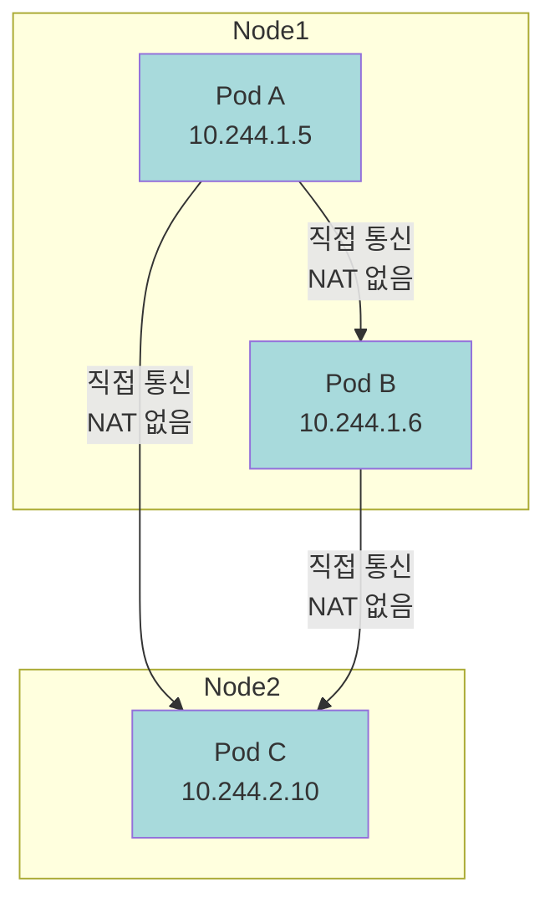
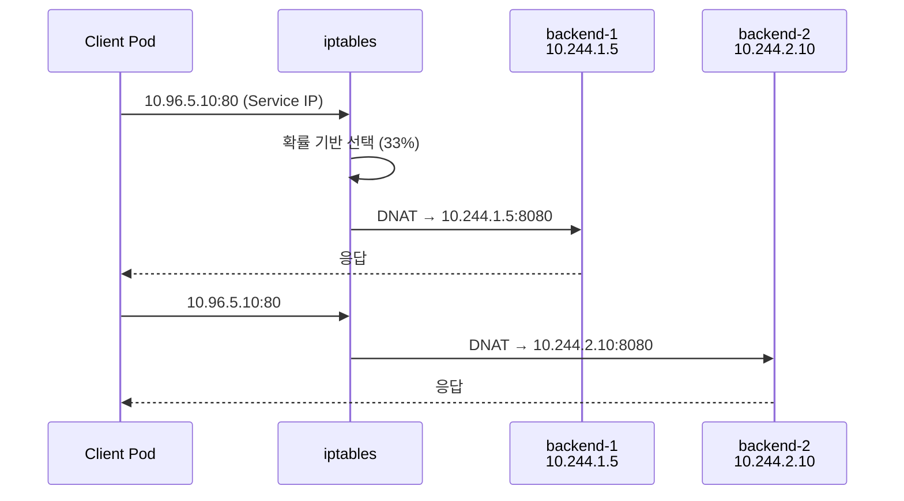
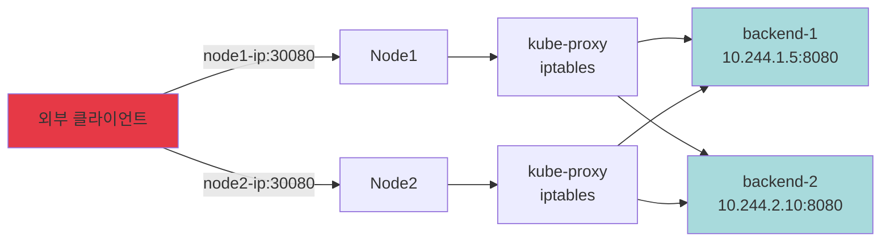
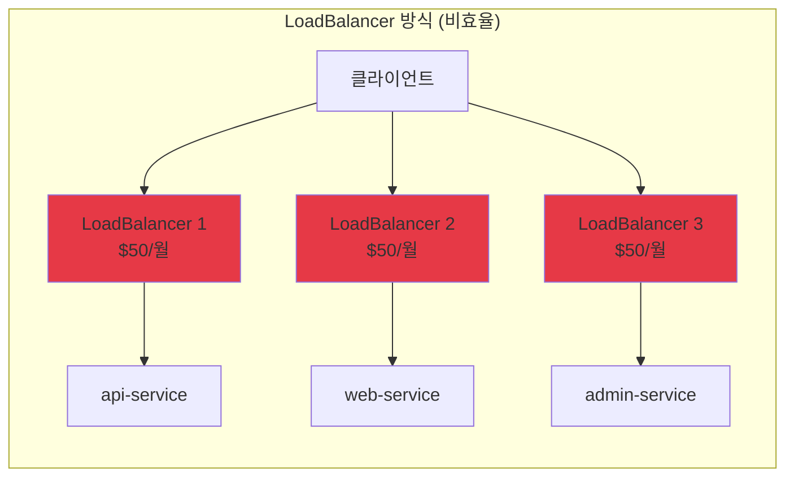
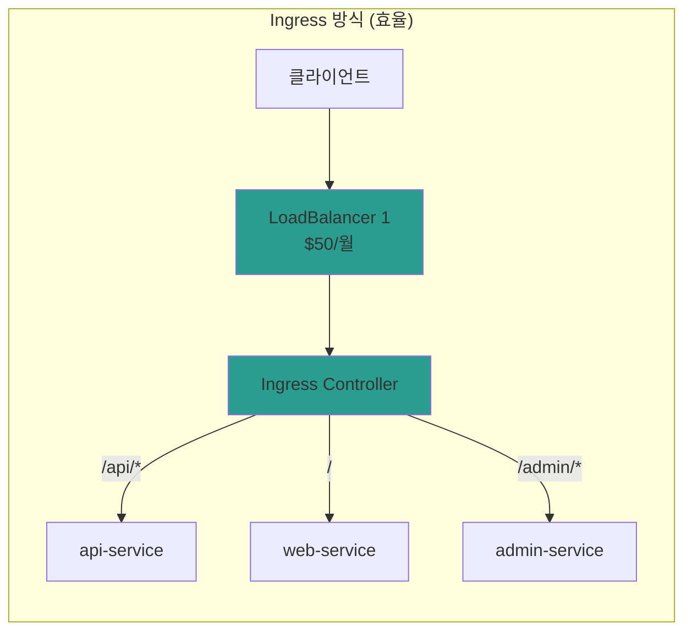
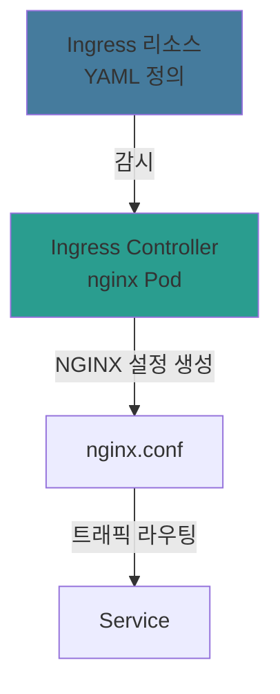
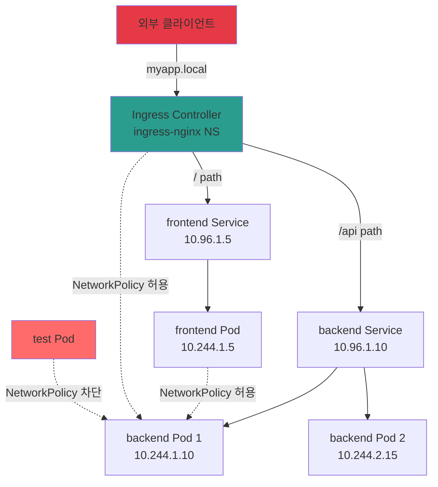

<!-- migrated: write/09_cloud/kubernetes/04-01.네트워킹.md (2026-04-19) -->

# Ch04. 네트워킹

> 📌 **핵심 요약**
>
> Kubernetes 네트워킹은 "모든 Pod은 NAT 없이 통신"이라는 단순한 원칙 위에 구축됩니다. Service는 kube-proxy를 통해 Pod 그룹에 대한 로드밸런싱을 제공하고, Ingress는 L7 라우팅으로 외부 트래픽을 제어하며, NetworkPolicy는 Pod 간 트래픽을 격리합니다. 트래픽 흐름을 이해하면 디버깅과 보안 설정이 명확해집니다.

## 🎯 학습 목표

이 챕터를 완료하면 다음을 할 수 있습니다:

1. Kubernetes 네트워킹 기본 원칙과 Pod 간 통신 모델 설명
2. Service의 내부 동작(kube-proxy, iptables/IPVS) 이해
3. ClusterIP, NodePort, LoadBalancer, Ingress의 사용 시점 구분
4. Ingress Controller와 Ingress 리소스의 역할 구분
5. NetworkPolicy로 Pod 간 트래픽 제어 규칙 작성
6. DNS 기반 서비스 디스커버리 패턴 활용
7. 실습을 통해 전체 트래픽 흐름 검증

---

## 📖 본문

### 1. K8s 네트워킹 기본 원칙

#### 1.1 네트워킹 모델의 3가지 규칙

Kubernetes는 네트워킹을 단순화하기 위해 다음 원칙을 강제합니다:

1. **모든 Pod은 고유한 IP 주소를 가진다**
   - 컨테이너끼리 포트 충돌 걱정 없음
   - Docker의 포트 매핑(-p 8080:80) 불필요

2. **Pod은 NAT 없이 다른 Pod과 통신한다**
   - Pod A에서 본 Pod B의 IP = Pod B에서 본 자신의 IP
   - 네트워크 추적이 단순해짐 (IP 변환 없음)

3. **Node에서 Pod으로, Pod에서 Node로 NAT 없이 통신한다**
   - kubelet이 Pod 상태를 확인할 때 직접 접근
   - 모니터링 에이전트가 Pod 메트릭 수집 시 직접 접근



#### 1.2 CNI(Container Network Interface)

Kubernetes는 네트워킹 구현을 CNI 플러그인에 위임합니다:

| CNI 플러그인 | 특징 | 사용 사례 |
|-------------|------|-----------|
| **Calico** | BGP 라우팅, NetworkPolicy 지원 | 프로덕션, 고성능 |
| **Flannel** | 간단한 오버레이 네트워크 | 개발, 간단한 클러스터 |
| **Cilium** | eBPF 기반, L7 정책 | 보안 중시, 마이크로서비스 |
| **Weave** | 멀티클러스터, 암호화 | 하이브리드 클라우드 |

**minikube에서 확인**:
```bash
minikube ssh
cat /etc/cni/net.d/87-podman-bridge.conflist
# bridge 플러그인 사용 (단순 L2 브릿지)
```

#### 1.3 Pod IP의 한계

Pod IP는 **일시적(ephemeral)** 입니다:

```bash
# Pod 생성
kubectl run nginx --image=nginx
kubectl get pod nginx -o wide
# NAME    READY   STATUS    IP
# nginx   1/1     Running   10.244.1.5

# Pod 삭제 후 재생성
kubectl delete pod nginx
kubectl run nginx --image=nginx
kubectl get pod nginx -o wide
# NAME    READY   STATUS    IP
# nginx   1/1     Running   10.244.1.8  ← IP 변경!
```

**문제**: 클라이언트가 Pod IP를 직접 사용하면 Pod 재시작 시 연결 끊김.

**해결**: Service가 안정적인 엔드포인트를 제공합니다.

---

### 2. Service 심화

#### 2.1 Service의 역할

Service는 다음을 제공합니다:

1. **안정적인 엔드포인트**: ClusterIP는 Service 생명주기 동안 유지
2. **로드밸런싱**: 여러 Pod에 트래픽 분산
3. **서비스 디스커버리**: DNS 이름으로 접근

```yaml
apiVersion: v1
kind: Service
metadata:
  name: my-service
spec:
  selector:
    app: backend  # 이 레이블을 가진 Pod에 트래픽 전달
  ports:
  - protocol: TCP
    port: 80        # Service가 노출하는 포트
    targetPort: 8080  # Pod의 실제 포트
  type: ClusterIP  # 기본값
```

**동작 확인**:
```bash
kubectl get service my-service
# NAME         TYPE        CLUSTER-IP     PORT(S)
# my-service   ClusterIP   10.96.5.10     80/TCP

kubectl get endpoints my-service
# NAME         ENDPOINTS
# my-service   10.244.1.5:8080,10.244.2.10:8080,10.244.3.15:8080
```

#### 2.2 kube-proxy의 내부 동작

**kube-proxy의 역할**:
- API 서버를 감시하여 Service/Endpoint 변경 감지
- 각 노드에서 트래픽 라우팅 규칙 생성
- 실제 Pod으로 트래픽 전달

**모드 비교**:

| 모드 | 동작 방식 | 성능 | 제약사항 |
|------|----------|------|----------|
| **iptables** | 리눅스 iptables 규칙 생성 | 중간 | 백엔드 Pod 수가 많으면 규칙 증가 → 지연 |
| **IPVS** | 리눅스 IPVS (L4 로드밸런서) | 높음 | 커널 모듈 필요 (ipvsadm) |
| **userspace** | 프록시 프로세스 경유 | 낮음 | deprecated |

**iptables 모드 동작**:
```bash
# Service 생성 후 iptables 규칙 확인
kubectl create deployment nginx --image=nginx --replicas=3
kubectl expose deployment nginx --port=80

minikube ssh
sudo iptables-save | grep nginx
# -A KUBE-SERVICES -d 10.96.5.10/32 -p tcp -m tcp --dport 80 -j KUBE-SVC-XXXX
# -A KUBE-SVC-XXXX -m statistic --mode random --probability 0.33 -j KUBE-SEP-AAA
# -A KUBE-SVC-XXXX -m statistic --mode random --probability 0.50 -j KUBE-SEP-BBB
# -A KUBE-SVC-XXXX -j KUBE-SEP-CCC
# -A KUBE-SEP-AAA -p tcp -j DNAT --to-destination 10.244.1.5:80
# -A KUBE-SEP-BBB -p tcp -j DNAT --to-destination 10.244.2.10:80
# -A KUBE-SEP-CCC -p tcp -j DNAT --to-destination 10.244.3.15:80
```

**트래픽 흐름**:


#### 2.3 SessionAffinity

기본적으로 Service는 요청마다 랜덤하게 Pod을 선택합니다. 세션 유지가 필요하면:

```yaml
apiVersion: v1
kind: Service
metadata:
  name: my-service
spec:
  selector:
    app: backend
  sessionAffinity: ClientIP  # 같은 클라이언트 IP는 같은 Pod으로
  sessionAffinityConfig:
    clientIP:
      timeoutSeconds: 10800  # 3시간
  ports:
  - port: 80
    targetPort: 8080
```

**주의**: ClientIP 기반이므로 NAT 뒤의 여러 클라이언트가 하나의 Pod으로 몰릴 수 있음.

---

### 3. NodePort와 LoadBalancer

#### 3.1 NodePort: 외부 트래픽 진입점

ClusterIP는 클러스터 내부에서만 접근 가능합니다. 외부에서 접근하려면 NodePort를 사용합니다.

```yaml
apiVersion: v1
kind: Service
metadata:
  name: my-nodeport
spec:
  type: NodePort
  selector:
    app: backend
  ports:
  - port: 80
    targetPort: 8080
    nodePort: 30080  # 생략 시 30000-32767 범위에서 자동 할당
```

**동작**:
```bash
kubectl get service my-nodeport
# NAME           TYPE       CLUSTER-IP     EXTERNAL-IP   PORT(S)
# my-nodeport    NodePort   10.96.5.10     <none>        80:30080/TCP

# 어떤 노드의 30080 포트로도 접근 가능
curl http://<node1-ip>:30080
curl http://<node2-ip>:30080  # 같은 서비스!
```

**트래픽 흐름**:


**제약사항**:
- 포트 범위 제한 (30000-32767)
- 노드 IP를 알아야 함 (동적 환경에서 불편)
- 노드 장애 시 해당 IP로는 접근 불가

#### 3.2 LoadBalancer: 클라우드 로드밸런서

클라우드 환경에서는 LoadBalancer 타입이 외부 로드밸런서를 자동 생성합니다.

```yaml
apiVersion: v1
kind: Service
metadata:
  name: my-lb
spec:
  type: LoadBalancer
  selector:
    app: backend
  ports:
  - port: 80
    targetPort: 8080
```

**클라우드 프로비저닝**:
```bash
kubectl get service my-lb
# NAME    TYPE           CLUSTER-IP     EXTERNAL-IP       PORT(S)
# my-lb   LoadBalancer   10.96.5.10     a1b2c3.elb.amazonaws.com   80:31234/TCP

# AWS에서는 ELB/ALB/NLB 자동 생성
# GCP에서는 Cloud Load Balancer 생성
```

**트래픽 흐름**:
```
외부 클라이언트
    ↓
클라우드 로드밸런서 (ELB)
    ↓
NodePort (31234)
    ↓
kube-proxy (iptables)
    ↓
Pod
```

**minikube에서 테스트**:
```bash
# minikube는 LoadBalancer를 지원하지 않음 (Pending 상태)
kubectl create deployment nginx --image=nginx
kubectl expose deployment nginx --type=LoadBalancer --port=80

kubectl get service nginx
# EXTERNAL-IP   <pending>

# minikube tunnel로 시뮬레이션
minikube tunnel  # 별도 터미널에서 실행

kubectl get service nginx
# EXTERNAL-IP   127.0.0.1

curl http://127.0.0.1
```

---

### 4. Ingress 컨트롤러

#### 4.1 왜 Ingress가 필요한가?

LoadBalancer의 문제점:
- Service마다 외부 로드밸런서 생성 → 비용 증가
- L4 로드밸런서 (IP:Port만 보고 라우팅)
- 호스트/경로 기반 라우팅 불가
- TLS 종료를 각 Service에서 처리해야 함





#### 4.2 Ingress Controller vs Ingress 리소스

**Ingress Controller**: 실제 트래픽을 라우팅하는 **구현체** (Pod으로 실행)

| Controller | 특징 | 사용 사례 |
|------------|------|-----------|
| **NGINX Ingress** | 가장 많이 사용, 성능 좋음 | 범용 |
| **Traefik** | 자동 서비스 디스커버리 | 마이크로서비스 |
| **HAProxy** | 고급 로드밸런싱 | 레거시 통합 |
| **AWS ALB Ingress** | AWS ALB 네이티브 통합 | AWS 전용 |
| **Istio Gateway** | 서비스 메시 통합 | 복잡한 트래픽 관리 |

**Ingress 리소스**: 라우팅 **규칙** (YAML 정의)

```yaml
apiVersion: networking.k8s.io/v1
kind: Ingress
metadata:
  name: my-ingress
spec:
  rules:
  - host: myapp.example.com
    http:
      paths:
      - path: /api
        pathType: Prefix
        backend:
          service:
            name: api-service
            port:
              number: 80
```

**관계**:


#### 4.3 minikube에서 Ingress 활성화

```bash
# NGINX Ingress Controller 설치
minikube addons enable ingress

# Controller Pod 확인
kubectl get pods -n ingress-nginx
# NAME                                        READY   STATUS
# ingress-nginx-controller-xxxxx              1/1     Running
```

---

### 5. Ingress 리소스 정의

#### 5.1 기본 라우팅

**경로 기반 라우팅**:
```yaml
apiVersion: networking.k8s.io/v1
kind: Ingress
metadata:
  name: path-based
spec:
  rules:
  - http:
      paths:
      - path: /api
        pathType: Prefix
        backend:
          service:
            name: api-service
            port:
              number: 80
      - path: /web
        pathType: Prefix
        backend:
          service:
            name: web-service
            port:
              number: 80
```

**호스트 기반 라우팅**:
```yaml
apiVersion: networking.k8s.io/v1
kind: Ingress
metadata:
  name: host-based
spec:
  rules:
  - host: api.example.com
    http:
      paths:
      - path: /
        pathType: Prefix
        backend:
          service:
            name: api-service
            port:
              number: 80
  - host: web.example.com
    http:
      paths:
      - path: /
        pathType: Prefix
        backend:
          service:
            name: web-service
            port:
              number: 80
```

#### 5.2 pathType 설명

| pathType | 동작 | 예시 |
|----------|------|------|
| **Prefix** | 경로 접두사 매칭 | `/api` → `/api/users`, `/api/orders` 모두 매칭 |
| **Exact** | 정확히 일치 | `/api` → `/api`만 매칭, `/api/users`는 불일치 |
| **ImplementationSpecific** | Controller에 위임 | NGINX: 정규표현식 지원 |

#### 5.3 TLS 설정

```yaml
apiVersion: v1
kind: Secret
metadata:
  name: tls-secret
type: kubernetes.io/tls
data:
  tls.crt: LS0tLS1CRUdJTi...  # base64 인코딩된 인증서
  tls.key: LS0tLS1CRUdJTi...  # base64 인코딩된 개인키
---
apiVersion: networking.k8s.io/v1
kind: Ingress
metadata:
  name: tls-ingress
spec:
  tls:
  - hosts:
    - myapp.example.com
    secretName: tls-secret
  rules:
  - host: myapp.example.com
    http:
      paths:
      - path: /
        pathType: Prefix
        backend:
          service:
            name: web-service
            port:
              number: 80
```

**동작**:
- HTTPS 요청 → Ingress Controller에서 TLS 종료
- 백엔드 Service로는 HTTP로 전달 (내부 네트워크는 평문)

#### 5.4 Annotation으로 고급 설정

```yaml
apiVersion: networking.k8s.io/v1
kind: Ingress
metadata:
  name: advanced
  annotations:
    nginx.ingress.kubernetes.io/rewrite-target: /$2
    nginx.ingress.kubernetes.io/ssl-redirect: "true"
    nginx.ingress.kubernetes.io/rate-limit: "100"
spec:
  rules:
  - http:
      paths:
      - path: /api(/|$)(.*)
        pathType: ImplementationSpecific
        backend:
          service:
            name: api-service
            port:
              number: 80
```

**rewrite-target 예시**:
- 클라이언트: `GET /api/users`
- 백엔드 Service: `GET /users` (경로 재작성)

---

### 6. NetworkPolicy

#### 6.1 기본 동작: 모든 트래픽 허용

NetworkPolicy가 없으면 모든 Pod 간 통신이 허용됩니다:

```bash
# 두 개의 Pod 생성
kubectl run frontend --image=nginx
kubectl run backend --image=nginx

# frontend에서 backend로 접근 가능
kubectl exec frontend -- curl backend
# 200 OK
```

#### 6.2 NetworkPolicy 적용

**백엔드 격리**:
```yaml
apiVersion: networking.k8s.io/v1
kind: NetworkPolicy
metadata:
  name: backend-policy
spec:
  podSelector:
    matchLabels:
      app: backend  # 이 정책은 backend Pod에 적용
  policyTypes:
  - Ingress  # 들어오는 트래픽 제어
  ingress:
  - from:
    - podSelector:
        matchLabels:
          app: frontend  # frontend Pod에서 오는 트래픽만 허용
    ports:
    - protocol: TCP
      port: 80
```

**효과**:
```bash
# frontend → backend: 허용
kubectl exec frontend -- curl backend
# 200 OK

# 다른 Pod → backend: 차단
kubectl run attacker --image=nginx
kubectl exec attacker -- curl backend
# 타임아웃 (연결 차단)
```

#### 6.3 Egress 정책

```yaml
apiVersion: networking.k8s.io/v1
kind: NetworkPolicy
metadata:
  name: frontend-egress
spec:
  podSelector:
    matchLabels:
      app: frontend
  policyTypes:
  - Egress  # 나가는 트래픽 제어
  egress:
  - to:
    - podSelector:
        matchLabels:
          app: backend  # backend Pod으로만 나가는 트래픽 허용
    ports:
    - protocol: TCP
      port: 80
  - to:  # DNS 쿼리 허용 (필수!)
    - namespaceSelector: {}
      podSelector:
        matchLabels:
          k8s-app: kube-dns
    ports:
    - protocol: UDP
      port: 53
```

**⚠️ 주의**: Egress 정책 적용 시 DNS 허용을 빠뜨리면 모든 도메인 해석 실패!

#### 6.4 네임스페이스 간 격리

```yaml
apiVersion: networking.k8s.io/v1
kind: NetworkPolicy
metadata:
  name: db-policy
  namespace: production
spec:
  podSelector:
    matchLabels:
      app: database
  policyTypes:
  - Ingress
  ingress:
  - from:
    - namespaceSelector:
        matchLabels:
          env: production  # production 네임스페이스에서만 허용
      podSelector:
        matchLabels:
          app: backend
    ports:
    - protocol: TCP
      port: 5432
```

#### 6.5 NetworkPolicy 패턴

**1. Deny All (기본 거부)**:
```yaml
apiVersion: networking.k8s.io/v1
kind: NetworkPolicy
metadata:
  name: deny-all
spec:
  podSelector: {}  # 모든 Pod
  policyTypes:
  - Ingress
  - Egress
  # ingress/egress 규칙 없음 → 모두 차단
```

**2. Allow from Ingress Controller**:
```yaml
apiVersion: networking.k8s.io/v1
kind: NetworkPolicy
metadata:
  name: allow-ingress
spec:
  podSelector:
    matchLabels:
      app: web
  ingress:
  - from:
    - namespaceSelector:
        matchLabels:
          name: ingress-nginx
      podSelector:
        matchLabels:
          app.kubernetes.io/name: ingress-nginx
```

---

### 7. DNS 서비스 디스커버리

#### 7.1 CoreDNS

Kubernetes는 CoreDNS를 통해 Service 이름을 IP로 해석합니다:

```bash
kubectl get service -n kube-system
# NAME       TYPE        CLUSTER-IP
# kube-dns   ClusterIP   10.96.0.10
```

**DNS 레코드 패턴**:
```
# Service
<service-name>.<namespace>.svc.cluster.local → ClusterIP

# Headless Service (StatefulSet)
<pod-name>.<service-name>.<namespace>.svc.cluster.local → Pod IP
```

#### 7.2 같은 네임스페이스 내 접근

```bash
# Service 생성
kubectl create deployment nginx --image=nginx
kubectl expose deployment nginx --port=80

# 같은 네임스페이스에서는 Service 이름만으로 접근
kubectl run test --image=busybox -it --rm -- wget -O- http://nginx
# 200 OK

# 전체 FQDN으로도 접근 가능
kubectl run test --image=busybox -it --rm -- wget -O- http://nginx.default.svc.cluster.local
```

#### 7.3 다른 네임스페이스 접근

```bash
# production 네임스페이스에 Service 생성
kubectl create namespace production
kubectl create deployment api -n production --image=nginx
kubectl expose deployment api -n production --port=80

# default 네임스페이스에서 접근
kubectl run test --image=busybox -it --rm -- wget -O- http://api.production.svc.cluster.local
```

#### 7.4 외부 서비스 접근

```yaml
# 외부 데이터베이스를 Service로 등록
apiVersion: v1
kind: Service
metadata:
  name: external-db
spec:
  type: ExternalName
  externalName: db.example.com  # 외부 DNS 이름
---
# 애플리케이션에서는 동일하게 접근
apiVersion: v1
kind: Pod
metadata:
  name: app
spec:
  containers:
  - name: app
    image: myapp
    env:
    - name: DB_HOST
      value: external-db  # Kubernetes 내부 이름 사용
```

---

### 8. 실습: Ingress + NetworkPolicy 적용

이 실습에서는 전체 트래픽 흐름을 검증합니다.

#### 8.1 환경 준비

```bash
# minikube 시작 및 Ingress 활성화
minikube start
minikube addons enable ingress

# 네임스페이스 생성
kubectl create namespace app
```

#### 8.2 백엔드 애플리케이션 배포

**파일: `backend.yaml`**
```yaml
apiVersion: apps/v1
kind: Deployment
metadata:
  name: backend
  namespace: app
spec:
  replicas: 2
  selector:
    matchLabels:
      app: backend
  template:
    metadata:
      labels:
        app: backend
    spec:
      containers:
      - name: nginx
        image: nginx:1.21
        ports:
        - containerPort: 80
---
apiVersion: v1
kind: Service
metadata:
  name: backend
  namespace: app
spec:
  selector:
    app: backend
  ports:
  - port: 80
    targetPort: 80
```

```bash
kubectl apply -f backend.yaml

kubectl get pods -n app
# NAME                       READY   STATUS
# backend-xxx-yyy            1/1     Running
# backend-xxx-zzz            1/1     Running
```

#### 8.3 프론트엔드 애플리케이션 배포

**파일: `frontend.yaml`**
```yaml
apiVersion: apps/v1
kind: Deployment
metadata:
  name: frontend
  namespace: app
spec:
  replicas: 1
  selector:
    matchLabels:
      app: frontend
  template:
    metadata:
      labels:
        app: frontend
    spec:
      containers:
      - name: nginx
        image: nginx:1.21
        ports:
        - containerPort: 80
---
apiVersion: v1
kind: Service
metadata:
  name: frontend
  namespace: app
spec:
  selector:
    app: frontend
  ports:
  - port: 80
    targetPort: 80
```

```bash
kubectl apply -f frontend.yaml
```

#### 8.4 Ingress 설정

**파일: `ingress.yaml`**
```yaml
apiVersion: networking.k8s.io/v1
kind: Ingress
metadata:
  name: app-ingress
  namespace: app
  annotations:
    nginx.ingress.kubernetes.io/rewrite-target: /
spec:
  rules:
  - host: myapp.local
    http:
      paths:
      - path: /
        pathType: Prefix
        backend:
          service:
            name: frontend
            port:
              number: 80
      - path: /api
        pathType: Prefix
        backend:
          service:
            name: backend
            port:
              number: 80
```

```bash
kubectl apply -f ingress.yaml

kubectl get ingress -n app
# NAME          HOSTS         ADDRESS
# app-ingress   myapp.local   192.168.49.2
```

#### 8.5 /etc/hosts 설정

```bash
# minikube IP 확인
minikube ip
# 192.168.49.2

# /etc/hosts 추가
echo "192.168.49.2 myapp.local" | sudo tee -a /etc/hosts
```

#### 8.6 Ingress 동작 확인

```bash
# 프론트엔드 접근
curl http://myapp.local/
# <html>... (nginx 기본 페이지)

# 백엔드 접근
curl http://myapp.local/api
# <html>... (nginx 기본 페이지)
```

#### 8.7 NetworkPolicy 적용

**파일: `network-policy.yaml`**
```yaml
# 1. 백엔드는 프론트엔드와 Ingress Controller에서만 접근 허용
apiVersion: networking.k8s.io/v1
kind: NetworkPolicy
metadata:
  name: backend-policy
  namespace: app
spec:
  podSelector:
    matchLabels:
      app: backend
  policyTypes:
  - Ingress
  ingress:
  - from:
    - podSelector:
        matchLabels:
          app: frontend
    - namespaceSelector:
        matchLabels:
          name: ingress-nginx
    ports:
    - protocol: TCP
      port: 80
---
# 2. 프론트엔드는 백엔드로만 나가는 트래픽 허용
apiVersion: networking.k8s.io/v1
kind: NetworkPolicy
metadata:
  name: frontend-policy
  namespace: app
spec:
  podSelector:
    matchLabels:
      app: frontend
  policyTypes:
  - Egress
  egress:
  - to:
    - podSelector:
        matchLabels:
          app: backend
    ports:
    - protocol: TCP
      port: 80
  - to:  # DNS 허용
    ports:
    - protocol: UDP
      port: 53
```

```bash
kubectl apply -f network-policy.yaml

# NetworkPolicy 확인
kubectl get networkpolicy -n app
# NAME              POD-SELECTOR    AGE
# backend-policy    app=backend     10s
# frontend-policy   app=frontend    10s
```

#### 8.8 NetworkPolicy 검증

```bash
# 허용: 프론트엔드 → 백엔드
kubectl exec -n app deployment/frontend -- curl -s backend
# 200 OK

# 차단: 외부 Pod → 백엔드
kubectl run test -n app --image=busybox -it --rm -- wget -T 5 -O- http://backend
# 타임아웃 (연결 차단)

# 허용: Ingress → 백엔드 (브라우저 접근)
curl http://myapp.local/api
# 200 OK
```

#### 8.9 트래픽 흐름 시각화



#### 8.10 정리

```bash
kubectl delete namespace app
sudo sed -i '' '/myapp.local/d' /etc/hosts
```

---

## 🎓 정리

### 핵심 개념 요약

1. **네트워킹 원칙**
   - 모든 Pod은 고유 IP
   - NAT 없는 직접 통신
   - CNI 플러그인으로 구현

2. **Service 타입**
   - ClusterIP: 내부 전용 (기본값)
   - NodePort: 외부 접근 (포트 제약)
   - LoadBalancer: 클라우드 LB 자동 생성
   - ExternalName: 외부 서비스 별칭

3. **kube-proxy**
   - iptables 모드: 규칙 기반 (기본값)
   - IPVS 모드: 고성능 (Pod 수 많을 때)
   - Service IP → Pod IP로 DNAT

4. **Ingress**
   - 여러 Service를 하나의 진입점으로 통합
   - L7 라우팅 (호스트/경로 기반)
   - TLS 종료
   - Annotation으로 고급 설정

5. **NetworkPolicy**
   - 기본: 모든 트래픽 허용
   - 정책 적용 시: 명시적 허용만
   - Ingress/Egress 독립 제어
   - 네임스페이스 격리

6. **DNS**
   - Service: `<name>.<ns>.svc.cluster.local`
   - Pod (StatefulSet): `<pod>.<service>.<ns>.svc.cluster.local`
   - 같은 NS에서는 짧은 이름 사용 가능

### 트래픽 흐름 디버깅 체크리스트

#### 외부 → 클러스터
- [ ] Ingress Controller Pod이 Running 상태인가?
- [ ] Ingress 리소스의 호스트/경로 설정이 올바른가?
- [ ] 백엔드 Service가 존재하고 Endpoint가 있는가?
- [ ] NetworkPolicy가 Ingress Controller를 허용하는가?

#### Pod → Pod
- [ ] 대상 Pod이 Running 상태인가?
- [ ] Service 이름 해석이 되는가? (nslookup 테스트)
- [ ] NetworkPolicy가 출발지 Pod을 허용하는가?
- [ ] Egress 정책에서 DNS(UDP 53)를 허용했는가?

#### Pod → 외부
- [ ] Egress NetworkPolicy가 외부 트래픽을 허용하는가?
- [ ] DNS 해석이 되는가?
- [ ] 방화벽/시큐리티 그룹이 아웃바운드를 허용하는가?

### 디버깅 명령어

```bash
# Service Endpoint 확인
kubectl get endpoints <service-name>

# DNS 테스트
kubectl run dnstest --image=busybox:1.28 -it --rm -- nslookup <service-name>

# NetworkPolicy 확인
kubectl describe networkpolicy <policy-name>

# kube-proxy 로그
kubectl logs -n kube-system -l k8s-app=kube-proxy

# Ingress Controller 로그
kubectl logs -n ingress-nginx -l app.kubernetes.io/name=ingress-nginx

# Pod 간 연결 테스트
kubectl exec <source-pod> -- curl -v <target-service>
```

### 보안 모범 사례

1. **NetworkPolicy 기본 전략**
   - 민감한 네임스페이스는 Deny All → Allow 명시
   - DB, 캐시는 백엔드에서만 접근 허용
   - 프론트엔드는 인터넷 나가는 트래픽 제한

2. **Ingress 보안**
   - TLS 강제 (ssl-redirect annotation)
   - Rate limiting으로 DDoS 방어
   - OAuth/OIDC 통합 (oauth2-proxy)

3. **Service 노출 최소화**
   - 내부 통신은 ClusterIP만 사용
   - NodePort는 개발 환경에만
   - LoadBalancer는 필수 서비스만

### 다음 단계

- **Ch05-Config**: ConfigMap/Secret으로 설정 관리
- **Ch06-Observability**: Service Mesh(Istio)로 트래픽 가시성 확보
- **Ch07-Security**: PodSecurityPolicy, RBAC로 보안 강화
