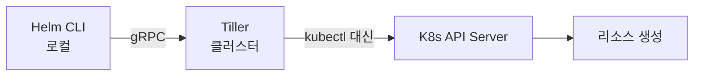
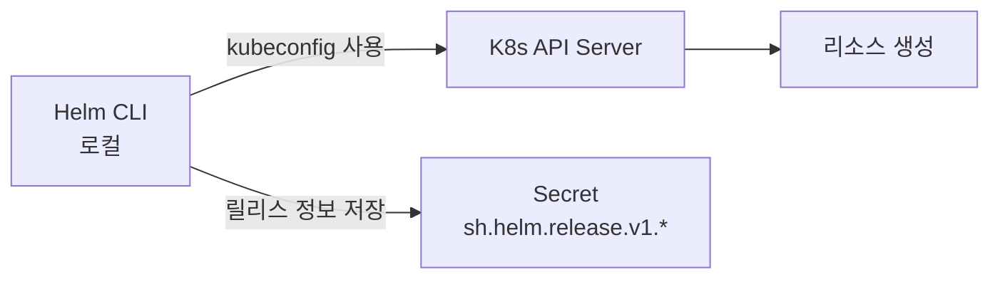
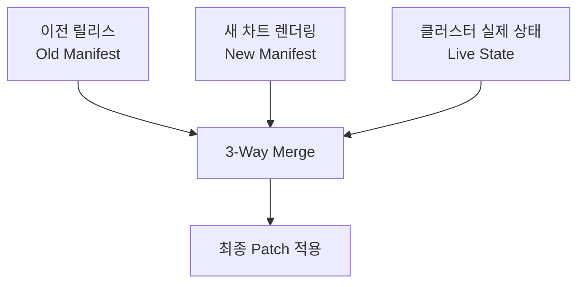
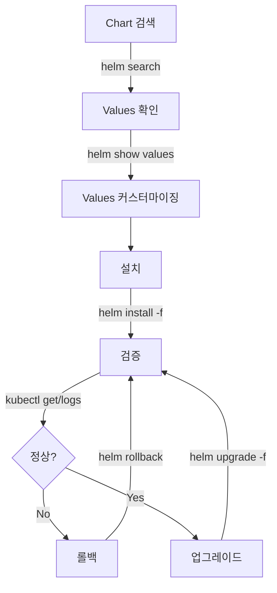

<!-- migrated: write/09_cloud/kubernetes/05-01.Helm 기초.md (2026-04-19) -->

# Ch05: Helm 기초 - 쿠버네티스 패키지 관리자

> 📌 **핵심 요약**
>
> Helm은 쿠버네티스 애플리케이션의 패키지 관리자입니다. 수십 개의 YAML 매니페스트를 하나의 차트로 관리하고, 환경별 설정을 values 파일로 분리하며, 릴리스 히스토리를 통해 안전한 배포와 롤백을 제공합니다. Helm v3는 Tiller를 제거하여 보안을 강화하고 RBAC와 완전히 통합되었습니다. 이 장에서는 Helm을 설치하고 차트를 검색/설치/업그레이드/롤백하는 전체 워크플로우를 실습합니다.

## 🎯 학습 목표

이 장을 마치면 다음을 할 수 있습니다:

1. **Helm의 필요성 이해**: 왜 kubectl apply로 관리하던 방식에서 Helm으로 전환하는지 설명할 수 있습니다
2. **Helm 아키텍처 파악**: Helm v3의 3-way merge와 릴리스 관리 메커니즘을 이해합니다
3. **기본 명령어 숙달**: repo 관리, 차트 검색, 설치, 업그레이드, 롤백을 실행할 수 있습니다
4. **Values 오버라이드**: `--set`과 `-f` 플래그로 환경별 설정을 적용할 수 있습니다
5. **릴리스 관리**: 설치된 릴리스의 상태를 조회하고 히스토리를 추적할 수 있습니다
6. **실전 워크플로우**: nginx 차트를 설치하고 업그레이드한 뒤 이전 버전으로 롤백하는 전체 사이클을 경험합니다

---

## 📖 본문

### 1. 왜 Helm이 필요한가

쿠버네티스를 처음 사용할 때는 `kubectl apply -f deployment.yaml`로 시작합니다. 하지만 프로젝트가 커지면서 다음과 같은 고통이 시작됩니다.

#### 1.1 YAML 관리의 복잡성

단일 애플리케이션을 배포하려면 Deployment, Service, ConfigMap, Secret, Ingress, ServiceAccount, PersistentVolumeClaim 등 여러 리소스가 필요합니다. 이를 개별 파일로 관리하면:

- **파일 개수 폭증**: 20-30개의 YAML 파일을 수동으로 `kubectl apply`
- **의존성 순서**: ConfigMap을 먼저 만들어야 Deployment가 참조 가능 (순서 관리 필요)
- **변경 추적 어려움**: 어떤 파일이 변경되었는지, 어떤 버전이 배포되었는지 파악 곤란

```yaml
# 전형적인 프로젝트 구조 - 관리가 점점 어려워진다
k8s/
├── 01-namespace.yaml
├── 02-configmap.yaml
├── 03-secret.yaml
├── 04-pvc.yaml
├── 05-deployment.yaml
├── 06-service.yaml
├── 07-ingress.yaml
├── 08-hpa.yaml
└── 09-networkpolicy.yaml
```

#### 1.2 환경별 설정 중복

개발/스테이징/프로덕션 환경마다 설정이 다릅니다. 동일한 YAML을 복사해서 값만 바꾸면:

```yaml
# dev-deployment.yaml
replicas: 1
image: myapp:dev
resources:
  limits:
    memory: "512Mi"

# prod-deployment.yaml - 거의 동일한데 값만 다름 (DRY 원칙 위반)
replicas: 3
image: myapp:v1.2.3
resources:
  limits:
    memory: "2Gi"
```

이런 방식은 **중복 코드가 많고, 수정 시 모든 환경 파일을 일일이 업데이트**해야 합니다. 하나를 빼먹으면 환경 간 불일치가 발생합니다.

#### 1.3 버전 관리와 롤백의 부재

`kubectl apply`로 배포하면:

- **배포 히스토리 없음**: 이전에 무엇이 배포되었는지 Git 커밋 기록에만 의존
- **롤백 불가**: `kubectl rollout undo`는 Deployment만 롤백 (Service, ConfigMap 등은 수동 관리)
- **멀티 리소스 원자성 부족**: Deployment는 성공했는데 ConfigMap 적용 실패 시 일관성 깨짐

#### 1.4 재사용과 공유의 어려움

같은 스택(예: PostgreSQL + Redis + 모니터링)을 여러 프로젝트에서 사용하려면:

- 매번 YAML을 복사해서 프로젝트에 맞게 수정
- 베스트 프랙티스 업데이트 시 모든 프로젝트를 수동으로 수정
- 팀 간 설정 공유가 어렵고, 각자 다른 구성으로 배포

#### 1.5 Helm의 해결책

Helm은 이러한 문제를 다음과 같이 해결합니다:

| 문제 | Helm 솔루션 |
|------|------------|
| YAML 관리 복잡성 | **차트(Chart)**: 관련 리소스를 하나의 패키지로 묶어 버전 관리 |
| 환경별 설정 중복 | **Values**: 템플릿 + values 파일로 설정 분리 (DRY 원칙) |
| 버전/롤백 부재 | **릴리스(Release)**: 배포 히스토리 자동 추적, 명령어 하나로 롤백 |
| 재사용/공유 어려움 | **레포지토리**: 차트를 저장소에 퍼블리시하여 `helm install`로 간단 설치 |

**비유**: Helm은 쿠버네티스의 apt/yum/brew입니다. `apt install nginx`처럼 `helm install my-nginx bitnami/nginx`로 복잡한 애플리케이션을 한 줄로 설치합니다.

---

### 2. Helm 아키텍처

Helm v3의 핵심 구조를 이해하면 명령어의 동작 원리가 명확해집니다.

#### 2.1 Helm v2 vs v3: Tiller 제거

**Helm v2 (레거시)** 시절에는 클러스터 내부에 **Tiller**라는 서버 컴포넌트가 필요했습니다:



**문제점**:
- Tiller가 cluster-admin 권한을 가지므로 **보안 취약** (모든 사용자가 Tiller를 통해 클러스터 전체 접근)
- RBAC 적용이 어려움 (사용자 권한 제어가 Tiller 레벨에서 막힘)
- Tiller 자체를 관리해야 하는 운영 부담

**Helm v3의 혁신**:



- **Tiller 제거**: Helm CLI가 직접 kubeconfig를 사용해 API 서버와 통신
- **RBAC 완벽 통합**: 사용자의 kubectl 권한이 그대로 Helm에 적용
- **릴리스 저장소 변경**: ConfigMap → **Secret** (보안 강화)

**결론**: Helm v3는 클라이언트 전용 도구가 되어 설치/관리가 간단해지고 보안이 강화되었습니다.

#### 2.2 3-Way Merge: Helm의 차별화된 업그레이드

Helm v3의 가장 중요한 특징은 **3-way merge** 전략입니다:



**비교**:

| 방식 | kubectl apply | Helm upgrade |
|------|--------------|-------------|
| **비교 대상** | 이전 적용 내용(last-applied-config) vs 새 매니페스트 | **이전 릴리스 + 새 렌더링 + 실제 상태** 3가지 비교 |
| **수동 변경 감지** | 수동 변경 덮어씀 (last-applied에 없으면 무시) | 수동 변경 인식하고 병합 시도 |
| **롤백** | Deployment만 가능 (`rollout undo`) | 모든 리소스 원자적 롤백 |
| **히스토리** | 없음 (Git에 의존) | 릴리스 버전별 자동 저장 |

**예시**: 운영자가 `kubectl scale`로 replicas를 수동 변경한 상황

```bash
# kubectl apply는 매니페스트에 replicas: 2가 있으면 무조건 2로 덮어씀
kubectl apply -f deployment.yaml  # replicas 3 → 2 (수동 변경 무시)

# Helm은 live state를 확인하고 conflict 경고 또는 병합 시도
helm upgrade myapp ./chart  # 수동 변경 인식 가능
```

#### 2.3 릴리스(Release) 관리

**릴리스**: Helm이 클러스터에 차트를 설치한 인스턴스입니다. 하나의 차트에서 여러 릴리스를 만들 수 있습니다.

```bash
# 동일한 nginx 차트로 2개 릴리스 생성
helm install frontend bitnami/nginx --set service.type=LoadBalancer
helm install backend bitnami/nginx --set service.type=ClusterIP
```

**릴리스 정보 저장 위치**: 각 릴리스는 클러스터의 Secret으로 저장됩니다.

```bash
kubectl get secrets -A | grep helm
# default       sh.helm.release.v1.frontend.v1       helm.sh/release.v1
# default       sh.helm.release.v1.frontend.v2       helm.sh/release.v1
# default       sh.helm.release.v1.backend.v1        helm.sh/release.v1
```

**Secret 내용 예시**:

```yaml
apiVersion: v1
kind: Secret
type: helm.sh/release.v1
metadata:
  name: sh.helm.release.v1.frontend.v1
  labels:
    name: frontend
    owner: helm
    status: deployed
    version: "1"
data:
  release: <base64-encoded-release-data>
```

인코딩된 데이터에는 다음이 포함됩니다:
- **Manifest**: 렌더링된 최종 YAML
- **Values**: 사용된 values (default + override)
- **Chart metadata**: Chart.yaml 정보
- **Hooks**: 실행된 훅 정보

---

### 3. Helm 설치 및 기본 명령어

#### 3.1 Helm 설치

**macOS**:
```bash
brew install helm
helm version
# version.BuildInfo{Version:"v3.14.0", GitCommit:"...", GoVersion:"go1.21.5"}
```

**Linux**:
```bash
curl https://raw.githubusercontent.com/helm/helm/main/scripts/get-helm-3 | bash
```

**Windows**:
```powershell
choco install kubernetes-helm
```

**설치 확인**:
```bash
helm version --short
# v3.14.0+g3fc9f4b
```

#### 3.2 레포지토리 관리

Helm 차트는 **레포지토리**(HTTP 서버)에 저장됩니다. 주요 퍼블릭 레포지토리를 추가합니다.

```bash
# Bitnami (가장 큰 차트 모음)
helm repo add bitnami https://charts.bitnami.com/bitnami

# Ingress-Nginx
helm repo add ingress-nginx https://kubernetes.github.io/ingress-nginx

# Prometheus 커뮤니티
helm repo add prometheus-community https://prometheus-community.github.io/helm-charts

# Jetstack (cert-manager)
helm repo add jetstack https://charts.jetstack.io

# 레포지토리 목록 확인
helm repo list
# NAME                    URL
# bitnami                 https://charts.bitnami.com/bitnami
# ingress-nginx           https://kubernetes.github.io/ingress-nginx
# prometheus-community    https://prometheus-community.github.io/helm-charts
# jetstack                https://charts.jetstack.io

# 레포지토리 업데이트 (최신 차트 정보 동기화)
helm repo update
# Hang tight while we grab the latest from your chart repositories...
# ...Successfully got an update from the "bitnami" chart repository
```

**레포지토리 구조**: 각 레포지토리는 `index.yaml` (차트 메타데이터)과 `.tgz` 파일(차트 아카이브)을 제공합니다.

```
https://charts.bitnami.com/bitnami/
├── index.yaml          # 전체 차트 목록 + 버전 정보
├── nginx-15.1.0.tgz    # nginx 차트 압축 파일
└── postgresql-12.5.0.tgz
```

#### 3.3 차트 검색

```bash
# 레포지토리에서 검색
helm search repo nginx
# NAME                    CHART VERSION   APP VERSION     DESCRIPTION
# bitnami/nginx           15.1.0          1.25.1          NGINX Open Source is a web server...
# ingress-nginx/ingress-nginx  4.7.1      1.8.1           Ingress controller...

# Artifact Hub (중앙 허브)에서 검색
helm search hub nginx
# URL                                                     CHART VERSION   APP VERSION     DESCRIPTION
# https://artifacthub.io/packages/helm/bitnami/nginx     15.1.0          1.25.1          NGINX Open Source...

# 특정 차트의 모든 버전 보기
helm search repo bitnami/nginx --versions
# NAME                    CHART VERSION   APP VERSION
# bitnami/nginx           15.1.0          1.25.1
# bitnami/nginx           15.0.2          1.25.0
# bitnami/nginx           14.2.0          1.24.0
```

#### 3.4 차트 정보 확인

설치 전에 차트의 기본 values와 README를 확인합니다.

```bash
# 차트 상세 정보 (Chart.yaml)
helm show chart bitnami/nginx
# apiVersion: v2
# name: nginx
# version: 15.1.0
# appVersion: "1.25.1"
# description: NGINX Open Source is a web server...

# 기본 values 확인 (중요!)
helm show values bitnami/nginx > nginx-default-values.yaml
# 600줄 정도의 설정 옵션 출력

# README 확인
helm show readme bitnami/nginx

# 전체 정보 (chart + values + readme)
helm show all bitnami/nginx
```

**values 예시** (bitnami/nginx의 일부):

```yaml
replicaCount: 1

image:
  registry: docker.io
  repository: bitnami/nginx
  tag: 1.25.1-debian-11-r0

service:
  type: LoadBalancer
  ports:
    http: 80

resources:
  limits: {}
  requests: {}

autoscaling:
  enabled: false
  minReplicas: 1
  maxReplicas: 11
```

---

### 4. Chart 설치/업그레이드/롤백

#### 4.1 기본 설치

```bash
# 기본 문법
helm install [RELEASE_NAME] [CHART] [FLAGS]

# 예시: bitnami/nginx 설치
helm install my-nginx bitnami/nginx

# 출력:
# NAME: my-nginx
# NAMESPACE: default
# STATUS: deployed
# REVISION: 1
# NOTES:
# ** Please be patient while the chart is being deployed **
# NGINX can be accessed through the following DNS name:
#   my-nginx.default.svc.cluster.local (port 80)
```

**생성된 리소스 확인**:

```bash
kubectl get all -l app.kubernetes.io/instance=my-nginx
# NAME                            READY   STATUS    RESTARTS   AGE
# pod/my-nginx-7d8b4c9d8f-xkz4p   1/1     Running   0          30s
#
# NAME               TYPE           CLUSTER-IP      EXTERNAL-IP   PORT(S)
# service/my-nginx   LoadBalancer   10.96.123.45    <pending>     80:31234/TCP
#
# NAME                       READY   UP-TO-DATE   AVAILABLE   AGE
# deployment.apps/my-nginx   1/1     1            1           30s
```

#### 4.2 Values 오버라이드

**방법 1: `--set` 플래그** (단순한 값 변경)

```bash
helm install my-nginx bitnami/nginx \
  --set replicaCount=3 \
  --set service.type=ClusterIP \
  --set image.tag=1.24.0
```

**중첩된 값 설정**:
```bash
--set resources.limits.memory=512Mi
--set autoscaling.enabled=true
```

**배열 설정**:
```bash
--set ingress.hosts[0].host=example.com
--set ingress.hosts[0].paths[0]=/
```

**방법 2: `-f` 플래그** (복잡한 설정, 추천)

```yaml
# my-values.yaml
replicaCount: 3

service:
  type: ClusterIP

resources:
  limits:
    memory: 512Mi
    cpu: 500m
  requests:
    memory: 256Mi
    cpu: 250m

ingress:
  enabled: true
  hostname: nginx.example.com
  tls: true
```

```bash
helm install my-nginx bitnami/nginx -f my-values.yaml
```

**여러 values 파일 병합**:

```bash
# base-values.yaml (공통)
# prod-values.yaml (프로덕션 전용)

helm install my-nginx bitnami/nginx \
  -f base-values.yaml \
  -f prod-values.yaml  # 나중 파일이 우선순위 높음
```

**우선순위**: `차트 기본값` < `-f values.yaml` < `--set key=value` (오른쪽이 더 높음)

#### 4.3 네임스페이스와 릴리스 이름

```bash
# 특정 네임스페이스에 설치
helm install my-nginx bitnami/nginx -n production --create-namespace

# 릴리스 이름 자동 생성
helm install bitnami/nginx --generate-name
# NAME: nginx-1686543210

# Dry-run (실제 설치 없이 렌더링만 확인)
helm install my-nginx bitnami/nginx --dry-run --debug
```

#### 4.4 업그레이드

설정을 변경하거나 차트 버전을 업데이트할 때 사용합니다.

```bash
# values 변경
helm upgrade my-nginx bitnami/nginx --set replicaCount=5

# 차트 버전 업그레이드
helm upgrade my-nginx bitnami/nginx --version 15.1.1

# values 파일로 업그레이드
helm upgrade my-nginx bitnami/nginx -f updated-values.yaml

# 설치되지 않았으면 설치, 있으면 업그레이드 (CI/CD에서 유용)
helm upgrade --install my-nginx bitnami/nginx -f values.yaml
```

**업그레이드 시 주의사항**:

```bash
# 기존 values 재사용 + 새 값 추가
helm upgrade my-nginx bitnami/nginx --reuse-values --set newKey=newValue

# 기존 values 무시하고 새로 설정 (위험!)
helm upgrade my-nginx bitnami/nginx --reset-values -f new-values.yaml
```

**권장**: `--reuse-values` 없이 항상 `-f values.yaml`로 모든 설정을 명시하는 것이 안전합니다.

#### 4.5 롤백

업그레이드 후 문제가 발생하면 이전 버전으로 돌아갑니다.

```bash
# 릴리스 히스토리 확인
helm history my-nginx
# REVISION  UPDATED                   STATUS      CHART           APP VERSION  DESCRIPTION
# 1         Mon Jun 12 10:00:00 2023  superseded  nginx-15.0.0    1.25.0       Install complete
# 2         Mon Jun 12 11:00:00 2023  superseded  nginx-15.1.0    1.25.1       Upgrade complete
# 3         Mon Jun 12 12:00:00 2023  deployed    nginx-15.1.0    1.25.1       Upgrade complete

# 이전 버전으로 롤백
helm rollback my-nginx 2
# Rollback was a success! Happy Helming!

# 바로 직전 버전으로 롤백
helm rollback my-nginx
# (REVISION 지정 안 하면 -1 버전)

# 롤백 후 히스토리
helm history my-nginx
# REVISION  STATUS      CHART           DESCRIPTION
# 1         superseded  nginx-15.0.0    Install complete
# 2         superseded  nginx-15.1.0    Upgrade complete
# 3         superseded  nginx-15.1.0    Upgrade complete
# 4         deployed    nginx-15.1.0    Rollback to 2
```

**중요**: 롤백은 새로운 REVISION을 생성합니다 (히스토리 보존).

#### 4.6 삭제

```bash
# 릴리스 삭제
helm uninstall my-nginx
# release "my-nginx" uninstalled

# 네임스페이스 지정
helm uninstall my-nginx -n production

# 삭제해도 히스토리 유지 (나중에 복구 가능)
helm uninstall my-nginx --keep-history

# 히스토리 포함 완전 삭제
helm uninstall my-nginx
```

---

### 5. Release 관리

#### 5.1 릴리스 목록 조회

```bash
# 현재 네임스페이스의 릴리스
helm list

# 모든 네임스페이스
helm list -A

# 특정 네임스페이스
helm list -n production

# 삭제된 릴리스 포함
helm list --uninstalled

# 모든 상태 (deployed, failed, uninstalled 등)
helm list --all

# 출력 예시:
# NAME       NAMESPACE  REVISION  UPDATED                   STATUS    CHART           APP VERSION
# my-nginx   default    3         2023-06-12 12:00:00       deployed  nginx-15.1.0    1.25.1
# frontend   default    1         2023-06-10 09:00:00       deployed  nginx-15.0.0    1.25.0
```

#### 5.2 릴리스 상태 확인

```bash
# 기본 상태
helm status my-nginx

# 출력:
# NAME: my-nginx
# NAMESPACE: default
# STATUS: deployed
# REVISION: 3
# LAST DEPLOYED: Mon Jun 12 12:00:00 2023
# NOTES:
# (차트의 NOTES.txt 내용)

# JSON 형식으로
helm status my-nginx -o json
```

#### 5.3 릴리스 정보 추출

```bash
# 사용된 values 확인
helm get values my-nginx
# USER-SUPPLIED VALUES:
# replicaCount: 3
# service:
#   type: ClusterIP

# 기본값 포함 전체 values
helm get values my-nginx --all

# 렌더링된 최종 매니페스트
helm get manifest my-nginx
# (실제 적용된 YAML 출력)

# 사용된 차트 메타데이터
helm get notes my-nginx
helm get hooks my-nginx
```

**실전 활용**: 프로덕션에 배포된 릴리스의 정확한 설정을 확인하여 로컬 재현이나 디버깅에 사용합니다.

```bash
# 프로덕션 설정 추출 → 로컬 테스트
helm get values prod-app -n production > prod-values.yaml
helm install test-app ./chart -f prod-values.yaml -n test
```

---

### 6. 주요 Helm 레포지토리

| 레포지토리 | URL | 주요 차트 | 용도 |
|-----------|-----|----------|------|
| **Bitnami** | charts.bitnami.com/bitnami | nginx, postgresql, mysql, redis, mongodb, kafka | 가장 큰 오픈소스 차트 컬렉션, 프로덕션 레디 |
| **Ingress-Nginx** | kubernetes.github.io/ingress-nginx | ingress-nginx | 인그레스 컨트롤러 |
| **Prometheus Community** | prometheus-community.github.io/helm-charts | kube-prometheus-stack, prometheus, grafana | 모니터링 스택 |
| **Jetstack** | charts.jetstack.io | cert-manager | TLS 인증서 자동화 |
| **Elastic** | helm.elastic.co | elasticsearch, kibana, logstash | 로깅 스택 |
| **Hashicorp** | helm.releases.hashicorp.com | vault, consul | 시크릿 관리, 서비스 메시 |
| **Traefik** | traefik.github.io/charts | traefik | 인그레스/API 게이트웨이 |
| **Argo** | argoproj.github.io/argo-helm | argo-cd, argo-workflows | GitOps, 워크플로우 엔진 |

**차트 선택 기준**:
1. **Bitnami 우선**: 대부분의 오픈소스 소프트웨어는 Bitnami 버전이 가장 잘 유지보수됨
2. **공식 차트**: Ingress-Nginx, Prometheus 등은 각 프로젝트의 공식 레포지토리 사용
3. **커뮤니티 평가**: Artifact Hub에서 다운로드 수, 최근 업데이트, 이슈 확인

**레포지토리 추가 스크립트**:

```bash
#!/bin/bash
# add-helm-repos.sh

helm repo add bitnami https://charts.bitnami.com/bitnami
helm repo add ingress-nginx https://kubernetes.github.io/ingress-nginx
helm repo add prometheus-community https://prometheus-community.github.io/helm-charts
helm repo add jetstack https://charts.jetstack.io
helm repo add elastic https://helm.elastic.co
helm repo add hashicorp https://helm.releases.hashicorp.com
helm repo add traefik https://traefik.github.io/charts
helm repo add argo https://argoproj.github.io/argo-helm

helm repo update
echo "✅ All repositories added and updated"
```

---

### 7. 실습: bitnami/nginx 차트로 Install → Upgrade → Rollback 사이클

이 실습에서는 Helm의 전체 워크플로우를 경험합니다.

#### 7.1 클러스터 준비

```bash
# Minikube 실행 (없으면 Docker Desktop의 K8s 사용)
minikube start

# Helm 레포지토리 추가
helm repo add bitnami https://charts.bitnami.com/bitnami
helm repo update
```

#### 7.2 1단계: 기본 설치

```bash
# nginx 차트 설치 (replica 1개, LoadBalancer)
helm install web-server bitnami/nginx

# 설치 확인
kubectl get pods -l app.kubernetes.io/instance=web-server
# NAME                          READY   STATUS    RESTARTS   AGE
# web-server-6d8c9f4b5d-x7z9k   1/1     Running   0          30s

# 서비스 확인
kubectl get svc web-server
# NAME         TYPE           CLUSTER-IP     EXTERNAL-IP   PORT(S)
# web-server   LoadBalancer   10.96.123.45   <pending>     80:31234/TCP

# Minikube에서 접근 (터널 실행)
minikube service web-server --url
# http://192.168.49.2:31234

# 브라우저로 접속하면 nginx 기본 페이지 표시
```

#### 7.3 2단계: Upgrade - Replica 증가

```bash
# values 파일 작성
cat > upgrade-values.yaml <<EOF
replicaCount: 3

resources:
  limits:
    memory: 256Mi
    cpu: 200m
  requests:
    memory: 128Mi
    cpu: 100m

service:
  type: NodePort
EOF

# 업그레이드 실행
helm upgrade web-server bitnami/nginx -f upgrade-values.yaml

# 변경 확인
kubectl get pods -l app.kubernetes.io/instance=web-server
# NAME                          READY   STATUS    RESTARTS   AGE
# web-server-6d8c9f4b5d-x7z9k   1/1     Running   0          2m
# web-server-6d8c9f4b5d-m4k2p   1/1     Running   0          10s
# web-server-6d8c9f4b5d-n8q3r   1/1     Running   0          10s

# 히스토리 확인
helm history web-server
# REVISION  UPDATED                   STATUS      CHART         DESCRIPTION
# 1         2023-06-12 10:00:00       superseded  nginx-15.1.0  Install complete
# 2         2023-06-12 10:05:00       deployed    nginx-15.1.0  Upgrade complete
```

#### 7.4 3단계: 문제 상황 시뮬레이션

```bash
# 잘못된 설정으로 업그레이드 (존재하지 않는 이미지 태그)
cat > bad-values.yaml <<EOF
image:
  tag: "99.99.99-nonexistent"
EOF

helm upgrade web-server bitnami/nginx -f bad-values.yaml

# Pod 상태 확인
kubectl get pods -l app.kubernetes.io/instance=web-server
# NAME                          READY   STATUS             RESTARTS   AGE
# web-server-7f5c8d9e6a-p5q7w   0/1     ImagePullBackOff   0          30s
# web-server-6d8c9f4b5d-x7z9k   1/1     Running            0          5m  (old pod still running)

# Deployment 상태
kubectl rollout status deployment web-server
# Waiting for deployment "web-server" rollout to finish: 1 out of 3 new replicas have been updated...
# (타임아웃까지 대기 - 실패)
```

#### 7.5 4단계: Rollback

```bash
# 히스토리 확인 (현재 REVISION 3은 실패 상태)
helm history web-server
# REVISION  STATUS      CHART         DESCRIPTION
# 1         superseded  nginx-15.1.0  Install complete
# 2         superseded  nginx-15.1.0  Upgrade complete
# 3         deployed    nginx-15.1.0  Upgrade complete (but failing)

# REVISION 2로 롤백
helm rollback web-server 2
# Rollback was a success! Happy Helming!

# Pod 복구 확인
kubectl get pods -l app.kubernetes.io/instance=web-server
# NAME                          READY   STATUS    RESTARTS   AGE
# web-server-6d8c9f4b5d-x7z9k   1/1     Running   0          8m
# web-server-6d8c9f4b5d-m4k2p   1/1     Running   0          3m
# web-server-6d8c9f4b5d-n8q3r   1/1     Running   0          3m
# (모두 Running 상태로 복구)

# 롤백 후 히스토리
helm history web-server
# REVISION  STATUS      CHART         DESCRIPTION
# 1         superseded  nginx-15.1.0  Install complete
# 2         superseded  nginx-15.1.0  Upgrade complete
# 3         superseded  nginx-15.1.0  Upgrade complete
# 4         deployed    nginx-15.1.0  Rollback to 2
```

**중요 관찰**:
- 롤백은 즉시 이전 상태로 복구 (Pod, Service, ConfigMap 모두)
- 히스토리가 보존되므로 언제든 특정 버전으로 돌아갈 수 있음
- REVISION 4는 REVISION 2와 동일한 설정이지만 새로운 릴리스로 기록

#### 7.6 5단계: 릴리스 정보 분석

```bash
# 사용된 values 확인 (REVISION 4 = REVISION 2)
helm get values web-server
# USER-SUPPLIED VALUES:
# replicaCount: 3
# resources:
#   limits:
#     memory: 256Mi
#     cpu: 200m

# 실제 배포된 매니페스트
helm get manifest web-server > current-manifest.yaml
cat current-manifest.yaml
# (Deployment, Service 등 렌더링된 최종 YAML)

# 특정 REVISION의 values 확인
helm get values web-server --revision 3
# (잘못된 image tag 확인 가능)
```

#### 7.7 6단계: 정리

```bash
# 릴리스 삭제
helm uninstall web-server
# release "web-server" uninstalled

# 리소스 삭제 확인
kubectl get all -l app.kubernetes.io/instance=web-server
# No resources found in default namespace.
```

**실습 정리**:

| 단계 | 명령어 | 결과 | REVISION |
|------|--------|------|----------|
| 설치 | `helm install` | Replica 1, LoadBalancer | 1 |
| 업그레이드 | `helm upgrade -f` | Replica 3, NodePort | 2 |
| 잘못된 업그레이드 | `helm upgrade -f bad-values.yaml` | ImagePullBackOff | 3 |
| 롤백 | `helm rollback 2` | 정상 상태로 복구 | 4 |

---

### 8. 정리

#### 핵심 개념 요약

**Helm이 해결하는 문제**:
- YAML 관리 복잡성 → **차트**로 패키징
- 환경별 설정 중복 → **Values**로 분리
- 버전 관리 부재 → **릴리스 히스토리** 자동 추적
- 롤백 불가 → **명령어 하나로 원자적 롤백**

**Helm v3의 혁신**:
- Tiller 제거 → RBAC 완벽 통합, 보안 강화
- 3-way merge → 수동 변경 감지, 안전한 업그레이드
- Secret 저장 → 릴리스 정보 보안 강화

**핵심 명령어**:

```bash
# 레포지토리 관리
helm repo add <name> <url>
helm repo update
helm search repo <keyword>

# 설치/업그레이드/롤백
helm install <release> <chart> [-f values.yaml] [--set key=value]
helm upgrade <release> <chart> [-f values.yaml]
helm rollback <release> [revision]
helm uninstall <release>

# 릴리스 관리
helm list [-A]
helm status <release>
helm history <release>
helm get values <release>
helm get manifest <release>
```

**실전 워크플로우**:



**다음 단계**: Ch06에서는 자신만의 Helm 차트를 만들고, 템플릿 언어를 사용하여 재사용 가능한 패키지를 설계하는 방법을 배웁니다. Hooks를 통한 배포 전후 작업, 차트 의존성 관리, 테스트 작성까지 다룹니다.

#### 체크포인트

- [ ] Helm v2와 v3의 차이(Tiller 제거)를 설명할 수 있다
- [ ] 3-way merge가 kubectl apply와 다른 점을 이해했다
- [ ] `helm repo add/update`, `helm search repo`로 차트를 찾을 수 있다
- [ ] `helm install`, `helm upgrade`, `helm rollback`을 실행해봤다
- [ ] `-f values.yaml`과 `--set`으로 설정을 오버라이드할 수 있다
- [ ] `helm history`, `helm get values/manifest`로 릴리스를 분석할 수 있다
- [ ] Bitnami/nginx 차트로 설치-업그레이드-롤백 사이클을 완료했다

**다음 단계 준비**: Ch06를 시작하기 전에 간단한 웹 애플리케이션(Go, Node.js, Python 등)의 Dockerfile과 K8s Deployment YAML을 준비하면, 이를 Helm 차트로 변환하는 실습이 더 효과적입니다.
