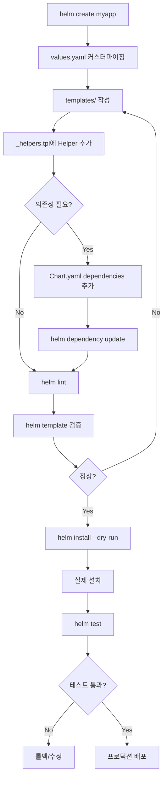

<!-- migrated: write/09_cloud/kubernetes/06-01.Helm 고급.md (2026-04-19) -->

# Ch06: Helm 고급 - 차트 개발과 템플릿 설계

> 📌 **핵심 요약**
>
> Helm 차트를 직접 만들면 애플리케이션을 재사용 가능한 패키지로 배포할 수 있습니다. Go 템플릿 언어로 values를 동적으로 주입하고, 조건문/반복문으로 환경별 리소스를 제어하며, Named Templates로 중복을 제거합니다. Helm Hooks는 배포 전후에 Job을 실행하여 DB 마이그레이션 같은 작업을 자동화하고, 차트 의존성을 통해 PostgreSQL 같은 서브차트를 함께 배포할 수 있습니다. 이 장에서는 실전 차트를 설계하고 테스트하는 전체 프로세스를 다룹니다.

## 🎯 학습 목표

이 장을 마치면 다음을 할 수 있습니다:

1. **차트 구조 이해**: Chart.yaml, values.yaml, templates/ 디렉토리의 역할을 파악합니다
2. **템플릿 언어 숙달**: `{{ .Values }}`, `{{ .Release }}` 등의 내장 객체와 함수를 사용할 수 있습니다
3. **조건부 렌더링**: if/else, range로 환경별 리소스를 동적으로 생성합니다
4. **Named Templates 작성**: _helpers.tpl로 중복 코드를 제거하고 재사용 가능한 템플릿을 만듭니다
5. **Hooks 활용**: pre-install, post-upgrade 등의 Hook으로 배포 라이프사이클을 제어합니다
6. **차트 의존성 관리**: Chart.yaml의 dependencies로 서브차트를 통합합니다
7. **차트 검증**: helm lint, helm template, helm test로 차트 품질을 보장합니다
8. **실전 차트 작성**: sample-app의 Deployment, Service, Ingress를 차트로 패키징합니다 (TODO)

---

## 📖 본문

### 1. Helm 차트 구조

`helm create` 명령어로 차트 스캐폴딩을 생성하면 다음과 같은 구조가 만들어집니다:

```bash
helm create sample-app
tree sample-app/
```

```
sample-app/
├── Chart.yaml          # 차트 메타데이터
├── values.yaml         # 기본 설정값
├── charts/             # 의존성 차트 (서브차트)
├── templates/          # K8s 매니페스트 템플릿
│   ├── NOTES.txt       # helm install 후 출력 메시지
│   ├── _helpers.tpl    # Named Templates (재사용 함수)
│   ├── deployment.yaml
│   ├── service.yaml
│   ├── ingress.yaml
│   ├── serviceaccount.yaml
│   ├── hpa.yaml
│   └── tests/
│       └── test-connection.yaml
└── .helmignore         # 차트 패키징 시 제외 파일
```

#### 1.1 Chart.yaml: 차트 메타데이터

```yaml
apiVersion: v2              # Helm 3: v2, Helm 2: v1
name: sample-app            # 차트 이름 (디렉토리명과 동일 권장)
version: 0.1.0              # 차트 버전 (SemVer)
appVersion: "1.0.0"         # 애플리케이션 버전
description: A Helm chart for sample application
type: application           # application 또는 library
keywords:
  - web
  - golang
home: https://example.com/sample-app
sources:
  - https://github.com/example/sample-app
maintainers:
  - name: John Doe
    email: john@example.com
dependencies:               # 의존 차트 (섹션 7에서 상세)
  - name: postgresql
    version: 12.5.0
    repository: https://charts.bitnami.com/bitnami
    condition: postgresql.enabled
```

**중요 필드**:
- **version**: 차트 자체의 버전. 템플릿이나 values 변경 시 증가
- **appVersion**: 패키징하는 애플리케이션의 버전 (보통 이미지 태그)
- **type**: `application` (배포용) vs `library` (재사용 템플릿만 제공)

#### 1.2 values.yaml: 기본 설정

```yaml
# 사용자가 오버라이드할 수 있는 기본값
replicaCount: 1

image:
  repository: myapp
  pullPolicy: IfNotPresent
  tag: ""  # 비어있으면 Chart.appVersion 사용

service:
  type: ClusterIP
  port: 80

ingress:
  enabled: false
  className: nginx
  hosts:
    - host: myapp.local
      paths:
        - path: /
          pathType: Prefix

resources:
  limits:
    cpu: 100m
    memory: 128Mi
  requests:
    cpu: 100m
    memory: 128Mi

autoscaling:
  enabled: false
  minReplicas: 1
  maxReplicas: 10
  targetCPUUtilizationPercentage: 80
```

**설계 원칙**:
- **모든 하드코딩 값을 values로 추출**: 이미지 이름, 포트, 리소스 제한 등
- **합리적인 기본값 제공**: 대부분의 경우 그대로 사용 가능하도록
- **중첩 구조 사용**: `image.repository`처럼 관련 설정을 그룹화

#### 1.3 templates/ 디렉토리

**주요 파일**:
- **deployment.yaml**: Pod 배포 정의
- **service.yaml**: 서비스 노출
- **ingress.yaml**: 외부 접근 (조건부)
- **_helpers.tpl**: 재사용 템플릿 (언더스코어로 시작 = 리소스 아님)
- **NOTES.txt**: 설치 후 사용자에게 보여줄 안내 메시지

**NOTES.txt 예시**:
```
Thank you for installing {{ .Chart.Name }}.

Your release is named {{ .Release.Name }}.

To learn more about the release, try:

  $ helm status {{ .Release.Name }}
  $ helm get all {{ .Release.Name }}

{{- if .Values.ingress.enabled }}
The application is available at:
  http://{{ index .Values.ingress.hosts 0 "host" }}
{{- else }}
Get the application URL by running:
  export POD_NAME=$(kubectl get pods -l "app={{ .Release.Name }}" -o jsonpath="{.items[0].metadata.name}")
  kubectl port-forward $POD_NAME 8080:80
{{- end }}
```

#### 1.4 .helmignore

패키징 시 제외할 파일 패턴:

```
# .helmignore
.git/
.gitignore
*.md
.DS_Store
*.swp
*.bak
docs/
examples/
```

---

### 2. 템플릿 언어 기초

Helm은 Go 템플릿 엔진을 사용합니다. 이중 중괄호 `{{ }}` 안에 표현식을 작성합니다.

#### 2.1 내장 객체

| 객체 | 설명 | 예시 |
|------|------|------|
| `.Values` | values.yaml + 오버라이드 값 | `{{ .Values.replicaCount }}` |
| `.Release` | 릴리스 정보 | `{{ .Release.Name }}`, `{{ .Release.Namespace }}` |
| `.Chart` | Chart.yaml 내용 | `{{ .Chart.Name }}`, `{{ .Chart.Version }}` |
| `.Files` | 차트 내 파일 접근 | `{{ .Files.Get "config.yaml" }}` |
| `.Capabilities` | K8s 클러스터 정보 | `{{ .Capabilities.KubeVersion.GitVersion }}` |
| `.Template` | 현재 템플릿 정보 | `{{ .Template.Name }}` |

**예시 (deployment.yaml)**:

```yaml
apiVersion: apps/v1
kind: Deployment
metadata:
  name: {{ .Release.Name }}-deployment
  labels:
    app: {{ .Chart.Name }}
    version: {{ .Chart.AppVersion }}
spec:
  replicas: {{ .Values.replicaCount }}
  selector:
    matchLabels:
      app: {{ .Release.Name }}
  template:
    metadata:
      labels:
        app: {{ .Release.Name }}
    spec:
      containers:
      - name: {{ .Chart.Name }}
        image: "{{ .Values.image.repository }}:{{ .Values.image.tag | default .Chart.AppVersion }}"
        ports:
        - containerPort: 80
```

**렌더링 결과** (values: `replicaCount: 3`, `image.repository: nginx`, release: `myapp`):

```yaml
apiVersion: apps/v1
kind: Deployment
metadata:
  name: myapp-deployment
  labels:
    app: sample-app
    version: 1.0.0
spec:
  replicas: 3
  selector:
    matchLabels:
      app: myapp
  template:
    metadata:
      labels:
        app: myapp
    spec:
      containers:
      - name: sample-app
        image: "nginx:1.0.0"
        ports:
        - containerPort: 80
```

#### 2.2 주석과 공백 제어

- **주석**: `{{/* comment */}}`
- **공백 제거**: `-` 기호로 앞뒤 줄바꿈/공백 제거

```yaml
# 공백 제어 없음
{{ .Values.name }}

# 좌측 공백 제거
{{- .Values.name }}

# 우측 공백 제거
{{ .Values.name -}}

# 양쪽 제거
{{- .Values.name -}}
```

**실전 예시**:
```yaml
{{- if .Values.ingress.enabled }}
apiVersion: networking.k8s.io/v1
kind: Ingress
{{- end }}
```

`{{-`를 사용하면 `if`가 false일 때 빈 줄이 생기지 않습니다.

---

### 3. 템플릿 함수와 파이프라인

Helm은 60개 이상의 내장 함수를 제공합니다 (Sprig 라이브러리 기반).

#### 3.1 자주 사용하는 함수

| 함수 | 설명 | 예시 |
|------|------|------|
| `default` | 값이 없으면 기본값 | `{{ .Values.tag \| default "latest" }}` |
| `quote` | 문자열을 따옴표로 감싸기 | `{{ .Values.name \| quote }}` → `"myapp"` |
| `upper/lower` | 대소문자 변환 | `{{ .Values.env \| upper }}` → `PRODUCTION` |
| `trim` | 공백 제거 | `{{ .Values.name \| trim }}` |
| `toYaml` | 객체를 YAML로 변환 | `{{ .Values.resources \| toYaml }}` |
| `nindent` | n칸 들여쓰기 + YAML 출력 | `{{ .Values.resources \| nindent 8 }}` |
| `include` | Named Template 호출 | `{{ include "myapp.labels" . }}` |
| `required` | 필수 값 검증 | `{{ required "image.tag is required" .Values.image.tag }}` |

#### 3.2 파이프라인

Unix 파이프처럼 값을 연쇄 변환합니다:

```yaml
# 여러 함수 체인
name: {{ .Values.name | upper | quote }}
# .Values.name = "myapp" → "MYAPP"

# 복잡한 예시
env: {{ .Values.environment | default "dev" | upper | quote }}
# .Values.environment이 없으면 "dev" → "DEV"
```

#### 3.3 toYaml과 nindent

**문제 상황**: values.yaml의 중첩된 객체를 템플릿에 삽입할 때 들여쓰기가 깨집니다.

```yaml
# values.yaml
resources:
  limits:
    cpu: 200m
    memory: 256Mi
  requests:
    cpu: 100m
    memory: 128Mi
```

**잘못된 방법**:
```yaml
# deployment.yaml
spec:
  containers:
  - name: app
    resources: {{ .Values.resources }}  # ❌ YAML 구문 오류
```

**올바른 방법** (`toYaml` + `nindent`):
```yaml
spec:
  containers:
  - name: app
    resources:
{{ .Values.resources | toYaml | nindent 6 }}
```

**렌더링 결과**:
```yaml
spec:
  containers:
  - name: app
    resources:
      limits:
        cpu: 200m
        memory: 256Mi
      requests:
        cpu: 100m
        memory: 128Mi
```

**`nindent N`**: N칸 들여쓰기. 위 예시에서 `resources:` 아래 레벨이 6칸이므로 `nindent 6`.

#### 3.4 required: 필수 값 검증

사용자가 반드시 제공해야 하는 값을 검증합니다:

```yaml
image: "{{ .Values.image.repository }}:{{ required "image.tag must be set" .Values.image.tag }}"
```

values.yaml에 `image.tag`가 없으면:
```
Error: execution error at (sample-app/templates/deployment.yaml:20:50): image.tag must be set
```

---

### 4. 조건문과 반복문

#### 4.1 if/else: 조건부 렌더링

```yaml
{{- if .Values.ingress.enabled }}
apiVersion: networking.k8s.io/v1
kind: Ingress
metadata:
  name: {{ .Release.Name }}-ingress
spec:
  # ...
{{- end }}
```

**else if, else**:
```yaml
env:
- name: LOG_LEVEL
  value: {{ if eq .Values.environment "production" }}
           "error"
         {{ else if eq .Values.environment "staging" }}
           "warn"
         {{ else }}
           "debug"
         {{ end }}
```

**비교 연산자**:
- `eq`: equal (==)
- `ne`: not equal (!=)
- `lt/gt`: less/greater than (<, >)
- `and/or/not`: 논리 연산

**예시**:
```yaml
{{- if and .Values.ingress.enabled .Values.tls.enabled }}
tls:
  - secretName: {{ .Values.tls.secretName }}
{{- end }}
```

#### 4.2 range: 반복문

**배열 순회**:
```yaml
# values.yaml
env:
  - name: DB_HOST
    value: postgres.local
  - name: DB_PORT
    value: "5432"

# deployment.yaml
env:
{{- range .Values.env }}
- name: {{ .name }}
  value: {{ .value | quote }}
{{- end }}
```

**맵 순회**:
```yaml
# values.yaml
annotations:
  nginx.ingress.kubernetes.io/rewrite-target: /
  cert-manager.io/cluster-issuer: letsencrypt

# ingress.yaml
metadata:
  annotations:
  {{- range $key, $value := .Values.annotations }}
    {{ $key }}: {{ $value | quote }}
  {{- end }}
```

**인덱스 사용**:
```yaml
{{- range $index, $host := .Values.ingress.hosts }}
- host: {{ $host.name }}
  paths:
  {{- range $host.paths }}
    - path: {{ . }}
  {{- end }}
{{- end }}
```

#### 4.3 with: 스코프 변경

`with`는 `.` (현재 스코프)를 특정 값으로 변경합니다:

```yaml
# 반복적인 .Values.resources. 대신
{{- with .Values.resources }}
resources:
  limits:
    cpu: {{ .limits.cpu }}
    memory: {{ .limits.memory }}
  requests:
    cpu: {{ .requests.cpu }}
    memory: {{ .requests.memory }}
{{- end }}
```

**주의**: `with` 안에서 `.Release`, `.Chart`에 접근하려면 `$.`를 사용:

```yaml
{{- with .Values.service }}
metadata:
  name: {{ $.Release.Name }}-svc  # $ = 루트 스코프
spec:
  type: {{ .type }}
  port: {{ .port }}
{{- end }}
```

---

### 5. Named Templates과 _helpers.tpl

Named Template은 재사용 가능한 템플릿 조각입니다. `_helpers.tpl`에 정의하고 `include`나 `template`으로 호출합니다.

#### 5.1 define과 include

**_helpers.tpl**:
```yaml
{{/*
표준 라벨 셋
*/}}
{{- define "sample-app.labels" -}}
app.kubernetes.io/name: {{ .Chart.Name }}
app.kubernetes.io/instance: {{ .Release.Name }}
app.kubernetes.io/version: {{ .Chart.AppVersion | quote }}
app.kubernetes.io/managed-by: {{ .Release.Service }}
{{- end }}

{{/*
Selector 라벨
*/}}
{{- define "sample-app.selectorLabels" -}}
app.kubernetes.io/name: {{ .Chart.Name }}
app.kubernetes.io/instance: {{ .Release.Name }}
{{- end }}

{{/*
전체 이름 생성 (릴리스명-차트명)
*/}}
{{- define "sample-app.fullname" -}}
{{- printf "%s-%s" .Release.Name .Chart.Name | trunc 63 | trimSuffix "-" }}
{{- end }}
```

**deployment.yaml에서 사용**:
```yaml
apiVersion: apps/v1
kind: Deployment
metadata:
  name: {{ include "sample-app.fullname" . }}
  labels:
    {{- include "sample-app.labels" . | nindent 4 }}
spec:
  selector:
    matchLabels:
      {{- include "sample-app.selectorLabels" . | nindent 6 }}
  template:
    metadata:
      labels:
        {{- include "sample-app.selectorLabels" . | nindent 8 }}
    spec:
      containers:
      - name: {{ .Chart.Name }}
        image: "{{ .Values.image.repository }}:{{ .Values.image.tag }}"
```

**렌더링 결과**:
```yaml
apiVersion: apps/v1
kind: Deployment
metadata:
  name: myapp-sample-app
  labels:
    app.kubernetes.io/name: sample-app
    app.kubernetes.io/instance: myapp
    app.kubernetes.io/version: "1.0.0"
    app.kubernetes.io/managed-by: Helm
spec:
  selector:
    matchLabels:
      app.kubernetes.io/name: sample-app
      app.kubernetes.io/instance: myapp
  template:
    metadata:
      labels:
        app.kubernetes.io/name: sample-app
        app.kubernetes.io/instance: myapp
```

#### 5.2 template vs include

| 명령 | 설명 | 파이프라인 지원 | 들여쓰기 |
|------|------|----------------|---------|
| `template` | 템플릿 호출 (레거시) | 불가능 | 수동 관리 |
| `include` | 템플릿 호출 (권장) | 가능 | `nindent` 사용 가능 |

**template의 문제**:
```yaml
metadata:
  labels:
    {{ template "sample-app.labels" . }}  # 들여쓰기 안 됨
# 결과: YAML 구문 오류
```

**include 사용**:
```yaml
metadata:
  labels:
    {{- include "sample-app.labels" . | nindent 4 }}  # 4칸 들여쓰기
```

**권장**: 항상 `include`를 사용하고 `| nindent`로 들여쓰기 제어.

#### 5.3 실전 Helper 예시

**이미지 풀 시크릿 생성**:
```yaml
{{- define "sample-app.imagePullSecrets" -}}
{{- if .Values.imagePullSecrets }}
imagePullSecrets:
{{- range .Values.imagePullSecrets }}
  - name: {{ . }}
{{- end }}
{{- end }}
{{- end }}
```

**서비스 어카운트 이름**:
```yaml
{{- define "sample-app.serviceAccountName" -}}
{{- if .Values.serviceAccount.create }}
{{- default (include "sample-app.fullname" .) .Values.serviceAccount.name }}
{{- else }}
{{- default "default" .Values.serviceAccount.name }}
{{- end }}
{{- end }}
```

---

### 6. Helm Hooks: 배포 라이프사이클 제어

Hooks는 Helm의 배포 프로세스 특정 시점에 Job을 실행합니다. DB 마이그레이션, 백업, 헬스체크 등에 사용됩니다.

#### 6.1 Hook 종류

| Hook | 실행 시점 | 용도 |
|------|----------|------|
| `pre-install` | 설치 전 (리소스 생성 전) | 사전 조건 확인 |
| `post-install` | 설치 후 (모든 리소스 생성 후) | 초기 데이터 로딩 |
| `pre-upgrade` | 업그레이드 전 | DB 백업 |
| `post-upgrade` | 업그레이드 후 | DB 마이그레이션 |
| `pre-rollback` | 롤백 전 | 롤백 사전 검증 |
| `post-rollback` | 롤백 후 | 롤백 후처리 |
| `pre-delete` | 삭제 전 | 최종 백업 |
| `post-delete` | 삭제 후 | 정리 작업 |
| `test` | `helm test` 실행 시 | 배포 검증 |

#### 6.2 Hook 예시: DB 마이그레이션

**templates/hooks/db-migrate-job.yaml**:
```yaml
apiVersion: batch/v1
kind: Job
metadata:
  name: {{ include "sample-app.fullname" . }}-db-migrate
  annotations:
    "helm.sh/hook": post-upgrade
    "helm.sh/hook-weight": "1"
    "helm.sh/hook-delete-policy": before-hook-creation
spec:
  template:
    metadata:
      name: db-migrate
    spec:
      restartPolicy: Never
      containers:
      - name: migrate
        image: "{{ .Values.image.repository }}:{{ .Values.image.tag }}"
        command: ["/bin/sh"]
        args:
          - -c
          - |
            echo "Running database migrations..."
            ./migrate up
            echo "Migration completed"
        env:
        - name: DB_HOST
          value: {{ .Values.database.host }}
        - name: DB_PASSWORD
          valueFrom:
            secretKeyRef:
              name: db-secret
              key: password
```

**어노테이션 설명**:
- **helm.sh/hook**: Hook 타입 (쉼표로 여러 개 지정 가능: `post-install,post-upgrade`)
- **helm.sh/hook-weight**: 실행 순서 (-5 ~ 5, 낮을수록 먼저 실행). 기본값 0
- **helm.sh/hook-delete-policy**: Hook 리소스 삭제 정책

#### 6.3 Hook Delete Policy

| 정책 | 설명 |
|------|------|
| `before-hook-creation` | 새 Hook 실행 전에 이전 Hook 삭제 (재실행 시 충돌 방지) |
| `hook-succeeded` | Hook이 성공하면 삭제 |
| `hook-failed` | Hook이 실패하면 삭제 |
| 정책 없음 | Hook 리소스를 삭제하지 않음 (수동 삭제 필요) |

**권장**: `before-hook-creation` - 재배포 시 Job 이름 충돌 방지.

#### 6.4 Hook Weight로 순서 제어

```yaml
# 1. DB 백업 (weight: -1)
apiVersion: batch/v1
kind: Job
metadata:
  name: db-backup
  annotations:
    "helm.sh/hook": pre-upgrade
    "helm.sh/hook-weight": "-1"

# 2. 애플리케이션 중지 (weight: 0, 기본값)
apiVersion: batch/v1
kind: Job
metadata:
  name: app-stop
  annotations:
    "helm.sh/hook": pre-upgrade

# 3. 마이그레이션 실행 (weight: 1)
apiVersion: batch/v1
kind: Job
metadata:
  name: db-migrate
  annotations:
    "helm.sh/hook": post-upgrade
    "helm.sh/hook-weight": "1"
```

**실행 순서**: DB 백업 → 앱 중지 → (Helm 업그레이드) → 마이그레이션

#### 6.5 Hook 디버깅

Hook이 실패하면 릴리스가 "failed" 상태가 됩니다:

```bash
# Hook Job 확인
kubectl get jobs -l app.kubernetes.io/instance=myapp

# Hook Pod 로그
kubectl logs job/myapp-db-migrate

# 실패한 Hook 수동 삭제 (재시도 전)
kubectl delete job myapp-db-migrate
helm upgrade myapp ./chart  # 재시도
```

---

### 7. 차트 의존성 관리

복잡한 애플리케이션은 PostgreSQL, Redis 같은 외부 서비스를 필요로 합니다. Helm 차트의 의존성 기능으로 이를 함께 관리할 수 있습니다.

#### 7.1 Chart.yaml에 의존성 선언

```yaml
# Chart.yaml
dependencies:
  - name: postgresql
    version: 12.5.0
    repository: https://charts.bitnami.com/bitnami
    condition: postgresql.enabled
    alias: db

  - name: redis
    version: 17.11.0
    repository: https://charts.bitnami.com/bitnami
    condition: redis.enabled
```

**필드 설명**:
- **name**: 차트 이름
- **version**: 차트 버전 (SemVer 범위 가능: `^12.0.0`)
- **repository**: 차트 레포지토리 URL (또는 `file://../local-chart`)
- **condition**: values에서 활성화 여부 제어 (선택)
- **alias**: values에서 사용할 별칭 (선택, 기본값은 name)

#### 7.2 의존성 다운로드

```bash
# 의존성 차트 다운로드
helm dependency update ./sample-app

# charts/ 디렉토리에 .tgz 파일 생성
tree sample-app/charts/
# charts/
# ├── postgresql-12.5.0.tgz
# └── redis-17.11.0.tgz
```

#### 7.3 Subchart Values 설정

서브차트의 values를 부모 차트의 values.yaml에서 제어합니다:

```yaml
# sample-app/values.yaml

# 메인 애플리케이션 설정
image:
  repository: myapp
  tag: "1.0.0"

# PostgreSQL 서브차트 설정 (alias: db)
db:
  enabled: true
  auth:
    username: myapp
    password: secret123
    database: myapp_db
  primary:
    persistence:
      enabled: true
      size: 10Gi

# Redis 서브차트 설정
redis:
  enabled: false  # 비활성화
```

**렌더링 시**:
- `db.enabled: true` → PostgreSQL 차트의 리소스 생성
- `redis.enabled: false` → Redis 차트 무시

#### 7.4 Subchart 리소스 접근

서브차트가 생성한 리소스는 릴리스 내에서 접근 가능합니다:

```yaml
# deployment.yaml - PostgreSQL 서비스 참조
env:
- name: DB_HOST
  value: {{ .Release.Name }}-db-postgresql  # alias가 db이므로
- name: DB_PORT
  value: "5432"
- name: DB_NAME
  value: {{ .Values.db.auth.database }}
- name: DB_USER
  value: {{ .Values.db.auth.username }}
- name: DB_PASSWORD
  valueFrom:
    secretKeyRef:
      name: {{ .Release.Name }}-db-postgresql
      key: password
```

#### 7.5 의존성 조건과 태그

**condition**: 여러 조건 중 하나라도 true면 활성화 (OR)

```yaml
dependencies:
  - name: postgresql
    condition: postgresql.enabled, global.database.enabled
```

**tags**: 여러 차트를 그룹으로 활성화/비활성화

```yaml
# Chart.yaml
dependencies:
  - name: postgresql
    tags:
      - database
  - name: mongodb
    tags:
      - database

# values.yaml
tags:
  database: true  # postgresql, mongodb 모두 활성화
```

#### 7.6 로컬 차트 의존성

외부 레포지토리 대신 로컬 차트를 의존성으로 사용:

```yaml
dependencies:
  - name: common-lib
    version: 0.1.0
    repository: file://../common-lib
```

```bash
# 디렉토리 구조
charts/
├── sample-app/
│   ├── Chart.yaml  (depends on common-lib)
│   └── templates/
└── common-lib/
    ├── Chart.yaml
    └── templates/
        └── _helpers.tpl

# 의존성 업데이트
cd sample-app
helm dependency update
```

---

### 8. 차트 테스트

#### 8.1 helm lint: 문법 검증

```bash
helm lint ./sample-app

# 출력:
# ==> Linting sample-app
# [INFO] Chart.yaml: icon is recommended
# [ERROR] templates/deployment.yaml: unable to parse YAML
#   error converting YAML to JSON: yaml: line 15: did not find expected key
#
# Error: 1 chart(s) linted, 1 chart(s) failed
```

**검증 항목**:
- Chart.yaml 필수 필드 확인
- values.yaml YAML 문법
- templates/ 파일 파싱 가능 여부
- K8s API 스키마 검증 (간단한 수준)

#### 8.2 helm template: 렌더링 검증

```bash
# 전체 렌더링 결과 출력
helm template myapp ./sample-app -f values-prod.yaml

# 특정 템플릿만 렌더링
helm template myapp ./sample-app -s templates/deployment.yaml

# 결과를 파일로 저장 후 kubectl 검증
helm template myapp ./sample-app > rendered.yaml
kubectl apply --dry-run=client -f rendered.yaml
```

**활용**:
- CI/CD에서 PR 변경사항 검증
- 렌더링 결과를 GitOps 레포지토리에 커밋

#### 8.3 helm test: 배포 후 검증

`templates/tests/` 디렉토리에 테스트 Pod를 정의합니다:

**templates/tests/test-connection.yaml**:
```yaml
apiVersion: v1
kind: Pod
metadata:
  name: {{ include "sample-app.fullname" . }}-test-connection
  annotations:
    "helm.sh/hook": test
spec:
  restartPolicy: Never
  containers:
  - name: wget
    image: busybox
    command: ['wget']
    args: ['{{ include "sample-app.fullname" . }}:{{ .Values.service.port }}']
```

**실행**:
```bash
# 차트 설치
helm install myapp ./sample-app

# 테스트 실행
helm test myapp

# 출력:
# NAME: myapp
# NAMESPACE: default
# STATUS: deployed
# TEST SUITE:     myapp-sample-app-test-connection
# Last Started:   Mon Jun 12 10:00:00 2023
# Last Completed: Mon Jun 12 10:00:05 2023
# Phase:          Succeeded

# 테스트 Pod 로그
kubectl logs myapp-sample-app-test-connection
# Connecting to myapp-sample-app:80
# index.html           100% |***************************|
```

**실전 테스트 예시**:
- HTTP 엔드포인트 응답 확인
- DB 연결 테스트
- 헬스체크 검증

#### 8.4 Kubeconform/Kubeval: 정적 검증

Helm이 제공하지 않는 엄격한 스키마 검증:

```bash
# kubeconform 설치
brew install kubeconform

# 렌더링 후 검증
helm template myapp ./sample-app | kubeconform -strict -summary
# Summary: 5 resources found parsing stdin - Valid: 5, Invalid: 0, Errors: 0, Skipped: 0
```

**장점**: API 서버 없이도 deprecated API 사용 여부 확인 가능.

---

### 9. 실습: sample-app 차트 직접 생성 (TODO - 사용자 작성)

이 섹션은 사용자가 직접 작성하는 실습입니다. 아래는 가이드라인입니다.

#### 9.1 목표

간단한 웹 애플리케이션(Go, Node.js, Python 등)을 Helm 차트로 패키징하여 다음을 포함합니다:

- **Deployment**: 애플리케이션 Pod 배포
- **Service**: ClusterIP로 내부 노출
- **Ingress**: (선택) 외부 접근
- **ConfigMap**: 환경 설정
- **Secret**: DB 비밀번호 (옵션)
- **HPA**: (선택) 오토스케일링
- **Hook**: post-install로 헬스체크 Job
- **Dependency**: PostgreSQL 서브차트

#### 9.2 단계별 가이드

**1단계: 차트 스캐폴딩 생성**
```bash
helm create sample-app
cd sample-app
```

**2단계: values.yaml 커스터마이징**
- 애플리케이션 이미지 설정
- 리소스 제한 정의
- Ingress 호스트 설정

**3단계: templates/ 수정**
- deployment.yaml에 ConfigMap 참조 추가
- service.yaml 포트 조정
- ingress.yaml 활성화 조건 추가

**4단계: _helpers.tpl에 Helper 추가**
- 표준 라벨 함수
- 전체 이름 생성 함수

**5단계: ConfigMap 추가**
```yaml
# templates/configmap.yaml
apiVersion: v1
kind: ConfigMap
metadata:
  name: {{ include "sample-app.fullname" . }}-config
data:
  APP_ENV: {{ .Values.environment | default "production" | quote }}
  LOG_LEVEL: {{ .Values.logLevel | default "info" | quote }}
```

**6단계: Hook 작성**
```yaml
# templates/hooks/healthcheck-job.yaml
# post-install hook으로 배포 후 HTTP 200 응답 확인
```

**7단계: PostgreSQL 의존성 추가**
```yaml
# Chart.yaml
dependencies:
  - name: postgresql
    version: 12.5.0
    repository: https://charts.bitnami.com/bitnami
    condition: postgresql.enabled

# values.yaml
postgresql:
  enabled: true
  auth:
    database: myapp_db
    username: myapp
```

**8단계: 검증**
```bash
helm lint ./sample-app
helm template myapp ./sample-app
helm install myapp ./sample-app --dry-run --debug
```

**9단계: 실제 설치 및 테스트**
```bash
helm dependency update ./sample-app
helm install myapp ./sample-app -f my-values.yaml
helm test myapp
```

**10단계: 업그레이드 및 롤백 연습**
```bash
# values 변경 후 업그레이드
helm upgrade myapp ./sample-app --set replicaCount=3

# 롤백
helm rollback myapp
```

---

### 10. 정리

#### 핵심 개념 요약

**차트 구조**:
- **Chart.yaml**: 메타데이터 (버전, 의존성)
- **values.yaml**: 기본 설정 (사용자가 오버라이드)
- **templates/**: K8s 리소스 템플릿
- **_helpers.tpl**: Named Templates (재사용 코드)

**템플릿 언어**:
- **내장 객체**: `.Values`, `.Release`, `.Chart`
- **함수**: `default`, `quote`, `toYaml`, `nindent`, `required`
- **파이프라인**: `{{ .Values.name | upper | quote }}`
- **조건문**: `{{- if .Values.enabled }}...{{- end }}`
- **반복문**: `{{- range .Values.items }}...{{- end }}`

**Named Templates**:
- **정의**: `{{- define "chart.name" -}}...{{- end }}`
- **호출**: `{{ include "chart.name" . | nindent 4 }}`
- **권장**: `template` 대신 `include` 사용

**Hooks**:
- **시점**: pre/post-install, pre/post-upgrade, pre/post-delete, test
- **순서**: `helm.sh/hook-weight` (낮을수록 먼저)
- **삭제**: `helm.sh/hook-delete-policy` (before-hook-creation 권장)
- **용도**: DB 마이그레이션, 백업, 헬스체크

**의존성**:
- **Chart.yaml**: `dependencies` 섹션에 서브차트 선언
- **다운로드**: `helm dependency update`
- **제어**: `condition`, `tags`로 활성화/비활성화
- **Values**: 부모 차트에서 서브차트 설정 오버라이드

**검증**:
- **helm lint**: 문법 검증
- **helm template**: 렌더링 결과 확인
- **helm test**: 배포 후 기능 테스트
- **kubeconform**: 엄격한 스키마 검증

#### 실전 워크플로우



#### 베스트 프랙티스

1. **values.yaml 설계**:
   - 합리적인 기본값 제공
   - 중첩 구조로 관련 설정 그룹화
   - 주석으로 각 필드 설명

2. **템플릿 작성**:
   - 항상 `include` + `nindent` 사용 (template 지양)
   - 복잡한 로직은 _helpers.tpl로 분리
   - `required`로 필수 값 검증

3. **라벨 표준화**:
   - `app.kubernetes.io/*` 레이블 사용
   - selector 라벨과 metadata 라벨 분리

4. **Hooks**:
   - `before-hook-creation` 정책으로 재실행 안전성 보장
   - weight로 순서 명확히 정의
   - 실패 시 롤백 전략 수립

5. **의존성**:
   - 버전 범위 신중히 설정 (major 버전 고정 권장)
   - condition으로 선택적 활성화
   - 서브차트 values는 부모에서 명시적 설정

6. **테스트**:
   - CI/CD에 `helm lint` + `helm template` 포함
   - `helm test`로 배포 후 검증 자동화
   - 프로덕션 배포 전 staging 환경 검증

#### 다음 단계

Ch07에서는 프로덕션 환경에서 Helm을 운영하는 방법을 다룹니다:
- Chart Museum으로 프라이빗 레포지토리 구축
- ArgoCD/Flux로 GitOps 통합
- Helmfile로 멀티 차트 배포 관리
- 보안 (Sealed Secrets, Policy as Code)
- 모니터링 및 롤백 자동화

#### 체크포인트

- [ ] `helm create`로 차트 스캐폴딩을 생성할 수 있다
- [ ] values.yaml과 템플릿의 관계를 이해했다
- [ ] `.Values`, `.Release`, `.Chart` 객체를 사용할 수 있다
- [ ] `toYaml | nindent`로 중첩 객체를 삽입할 수 있다
- [ ] if/range로 조건부/반복 렌더링을 구현할 수 있다
- [ ] _helpers.tpl에 Named Template을 정의하고 `include`로 호출할 수 있다
- [ ] Helm Hook으로 post-upgrade Job을 작성할 수 있다
- [ ] Chart.yaml에 의존성을 선언하고 `helm dependency update`를 실행했다
- [ ] `helm lint`, `helm template`, `helm test`로 차트를 검증할 수 있다
- [ ] sample-app 차트를 직접 작성하여 설치/업그레이드/롤백했다 (TODO 완료 시)
