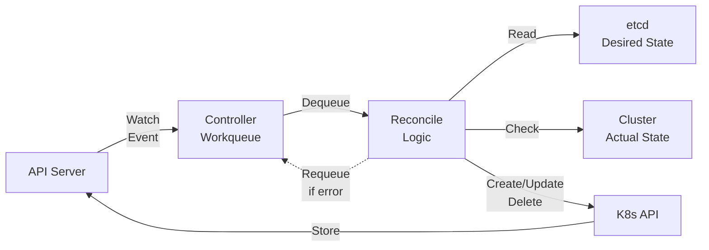
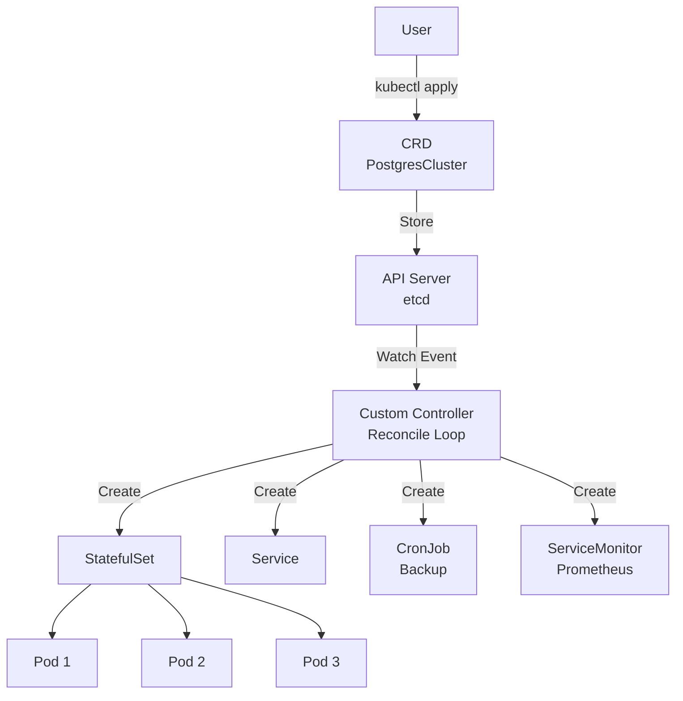
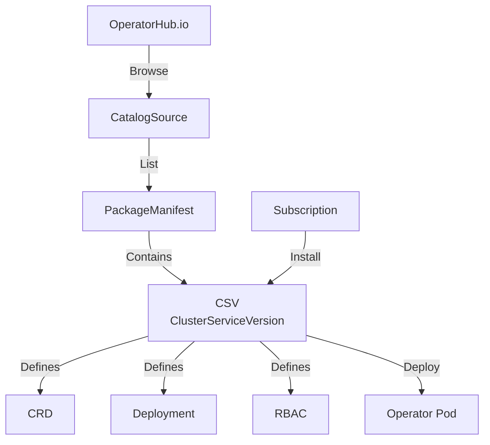

# Ch07: Operator 패턴 - Kubernetes의 운영 지식 자동화

> 📌 **핵심 요약**
>
> Operator는 **CRD(Custom Resource Definition) + Custom Controller**의 조합으로, 애플리케이션 운영 지식을 코드로 자동화하는 패턴이다. Kubernetes는 기본 리소스(Pod, Service)만으로 복잡한 상태 저장 애플리케이션의 Day-2 Operation(백업, 장애 복구, 업그레이드)을 처리하기 어렵다. Operator는 이러한 운영 작업을 **선언적 API**로 제공하고, **Reconciliation Loop**를 통해 desired state를 자동으로 유지한다.
>
> 핵심 개념: **CRD로 API 확장 → Controller가 Reconcile → 운영 지식이 코드로 실행**

## 🎯 학습 목표

이 챕터를 마치면 다음을 할 수 있다:

1. **Operator가 해결하는 문제**를 설명하고, 기본 K8s 리소스로 부족한 이유 이해
2. **CRD의 역할**과 kubectl로 Custom Resource를 관리하는 방법 파악
3. **Reconciliation Loop 동작 원리**를 Mermaid 다이어그램으로 설명
4. **Operator 성숙도 모델**(Level 1~5) 각 단계별 자동화 범위 구분
5. **Operator 개발 프레임워크**(Operator SDK, Kubebuilder) 차이와 선택 기준 비교
6. **OLM(Operator Lifecycle Manager)** 필요성과 설치/업그레이드 관리 방식 이해
7. 실습: OperatorHub에서 Operator 탐색 및 설치, CRD 생성 실험

---

## 1. 왜 Operator가 필요한가

### 1.1 Kubernetes 기본 리소스의 한계

Kubernetes는 **무상태(stateless) 애플리케이션**을 쉽게 관리한다. Deployment는 원하는 레플리카 수를 유지하고, Service는 로드 밸런싱을 제공한다. 하지만 **상태 저장(stateful) 애플리케이션**은 다르다.

예를 들어 PostgreSQL 클러스터를 K8s에 배포한다고 가정하자:

- **초기 배포**: StatefulSet으로 가능하다. 각 Pod에 고정 ID와 PersistentVolume을 할당할 수 있다.
- **백업 수행**: 누가 언제 pg_dump를 실행하는가? CronJob으로 스크립트를 짤 수 있지만, 장애 시 재시도 로직은?
- **장애 복구**: Primary가 죽으면 누가 Standby를 승격시키는가? StatefulSet은 이 로직을 모른다.
- **버전 업그레이드**: 9.6 → 12.0으로 업그레이드할 때 데이터 마이그레이션은? 롤링 업데이트로는 불가능하다.
- **모니터링 연동**: Prometheus가 각 Pod의 메트릭을 수집하려면 ServiceMonitor를 별도 관리해야 한다.

이 모든 작업은 **운영 지식(operational knowledge)** 이 필요하다. 기존에는 사람이 kubectl과 스크립트로 수동 실행했다. Operator는 이 지식을 **코드로 자동화**한다.

### 1.2 Operator의 정의

> **Operator = 애플리케이션별 운영 지식을 담은 Kubernetes Controller**

Operator는 다음 두 요소로 구성된다:

1. **CRD (Custom Resource Definition)**: 사용자 정의 리소스 스키마 (예: `PostgresCluster`)
2. **Custom Controller**: CRD의 desired state를 실제 상태로 만드는 로직

사용자는 `PostgresCluster` 리소스를 YAML로 선언하고, Operator는 이를 보고 다음을 자동 수행한다:

- StatefulSet, Service, ConfigMap, PVC 생성
- 백업 CronJob 스케줄링
- 장애 시 Failover 실행
- 업그레이드 시 데이터 마이그레이션

**핵심 차이**: 사람이 kubectl 명령을 반복 실행하는 대신, **선언적 API**로 "원하는 상태"만 명시하면 Operator가 알아서 처리한다.

### 1.3 Day-1 vs Day-2 Operation

| 단계 | 작업 예시 | 기본 K8s | Operator |
|------|-----------|----------|----------|
| **Day-0** | 클러스터 설치 | kubeadm, EKS | Cluster API Operator |
| **Day-1** | 애플리케이션 배포 | Deployment, Service | ✅ 충분 | ✅ 자동화 가능 |
| **Day-2** | 백업, 복구, 업그레이드 | ❌ 수동 스크립트 | ✅ Operator가 자동화 |

Operator는 특히 **Day-2 Operation**을 자동화한다. 예를 들어:

- **Backup Operator**: 매일 새벽 2시 백업, S3 업로드, 7일 이상 데이터 삭제
- **Certificate Operator**: TLS 인증서 자동 갱신 (Let's Encrypt)
- **Monitoring Operator**: Prometheus + Grafana 설정 자동 생성

---

## 2. Custom Resource Definition (CRD) 이해

### 2.1 CRD란 무엇인가

Kubernetes API는 기본적으로 Pod, Service, Deployment 등을 제공한다. **CRD는 이 API를 확장**하여 새로운 리소스 타입을 추가한다.

예를 들어 `PostgresCluster`라는 CRD를 정의하면:

```yaml
apiVersion: postgres.example.com/v1
kind: PostgresCluster
metadata:
  name: my-db
spec:
  version: "12.0"
  replicas: 3
  storage: 10Gi
```

이제 `kubectl get postgrescluster`로 조회하고, `kubectl apply -f`로 생성할 수 있다. **API Server는 이 리소스를 etcd에 저장**하고, Custom Controller가 watch한다.

### 2.2 CRD 정의 구조

CRD 자체도 YAML로 정의한다:

```yaml
apiVersion: apiextensions.k8s.io/v1
kind: CustomResourceDefinition
metadata:
  name: postgresclusters.postgres.example.com
spec:
  group: postgres.example.com
  versions:
    - name: v1
      served: true
      storage: true
      schema:
        openAPIV3Schema:
          type: object
          properties:
            spec:
              type: object
              properties:
                version:
                  type: string
                replicas:
                  type: integer
                  minimum: 1
                storage:
                  type: string
  scope: Namespaced
  names:
    plural: postgresclusters
    singular: postgrescluster
    kind: PostgresCluster
    shortNames:
      - pgc
```

**주요 필드**:

- `group`: API 그룹 (예: `postgres.example.com`)
- `versions`: 버전별 스키마 (v1, v1alpha1 등)
- `schema`: OpenAPI v3 스키마 (필드 타입, 필수 여부)
- `scope`: Namespaced (네임스페이스별) vs Cluster (전역)
- `names`: kubectl에서 사용할 이름 (복수형, 단수형, 축약형)

### 2.3 CRD vs ConfigMap 차이

| 항목 | ConfigMap | CRD |
|------|-----------|-----|
| **용도** | 설정 데이터 저장 | API 확장, 리소스 정의 |
| **스키마 검증** | ❌ 없음 (자유 형식) | ✅ OpenAPI 스키마 |
| **kubectl 통합** | `get configmap` | `get postgrescluster` (타입별 조회) |
| **버전 관리** | ❌ 없음 | ✅ v1, v1alpha1 등 |
| **Controller 연동** | 수동 파싱 필요 | API Server가 watch 이벤트 제공 |

**핵심 차이**: ConfigMap은 "데이터 저장소"이고, CRD는 "Kubernetes API의 일급 시민(first-class citizen)"이다. CRD는 RBAC, 버전 관리, admission webhook 등 K8s API의 모든 기능을 사용할 수 있다.

### 2.4 CRD 생성 실습

```bash
# CRD 정의 적용
kubectl apply -f postgrescluster-crd.yaml

# CRD 확인
kubectl get crd
kubectl describe crd postgresclusters.postgres.example.com

# Custom Resource 생성
kubectl apply -f my-postgres.yaml

# 조회
kubectl get postgrescluster
kubectl get pgc  # shortName 사용
kubectl describe postgrescluster my-db
```

이 시점에서 **Custom Resource는 etcd에 저장만 되고, 실제 동작은 하지 않는다**. Controller가 없기 때문이다.

---

## 3. Controller 패턴과 Reconciliation Loop

### 3.1 Controller의 역할

Kubernetes Controller는 **desired state를 actual state로 만드는 프로그램**이다. 예를 들어 Deployment Controller는:

1. Deployment 리소스의 `replicas: 3`을 읽는다 (desired state)
2. 현재 실행 중인 Pod 개수를 확인한다 (actual state)
3. 차이가 있으면 Pod를 생성하거나 삭제한다 (reconcile)

Custom Controller는 동일한 패턴을 CRD에 적용한다.

### 3.2 Reconciliation Loop 동작 원리



**단계 설명**:

1. **Watch**: Controller는 API Server에 특정 리소스(예: PostgresCluster)를 watch 요청한다.
2. **Event**: 리소스가 생성/수정/삭제되면 API Server가 이벤트를 보낸다.
3. **Workqueue**: Controller는 이벤트를 큐에 넣는다 (동시성 제어).
4. **Dequeue**: Worker goroutine이 큐에서 하나씩 꺼낸다.
5. **Reconcile**:
   - etcd에서 desired state 읽기 (`spec.replicas: 3`)
   - 클러스터에서 actual state 확인 (`현재 Pod 2개`)
   - 차이를 해소 (`Pod 1개 추가 생성`)
6. **Requeue**: 에러 발생 시 exponential backoff로 재시도.

### 3.3 Reconcile 함수 예시 (의사 코드)

```go
func (r *PostgresClusterReconciler) Reconcile(ctx context.Context, req ctrl.Request) (ctrl.Result, error) {
    // 1. Desired state 읽기
    pgCluster := &PostgresCluster{}
    if err := r.Get(ctx, req.NamespacedName, pgCluster); err != nil {
        return ctrl.Result{}, client.IgnoreNotFound(err)
    }

    // 2. Actual state 확인
    statefulSet := &appsv1.StatefulSet{}
    err := r.Get(ctx, types.NamespacedName{
        Name: pgCluster.Name,
        Namespace: pgCluster.Namespace,
    }, statefulSet)

    // 3. StatefulSet이 없으면 생성
    if errors.IsNotFound(err) {
        newSts := buildStatefulSet(pgCluster)
        return ctrl.Result{}, r.Create(ctx, newSts)
    }

    // 4. Spec이 다르면 업데이트
    if statefulSet.Spec.Replicas != &pgCluster.Spec.Replicas {
        statefulSet.Spec.Replicas = &pgCluster.Spec.Replicas
        return ctrl.Result{}, r.Update(ctx, statefulSet)
    }

    // 5. 백업 CronJob 확인 및 생성
    // 6. Monitoring ServiceMonitor 생성
    // ...

    // 완료
    return ctrl.Result{}, nil
}
```

**핵심 특징**:

- **선언적**: "Pod 1개 추가해"가 아니라 "총 3개여야 함"으로 판단.
- **멱등성(Idempotency)**: 같은 입력에 여러 번 호출해도 결과가 같다.
- **재시도**: 에러 시 자동 재시도 (네트워크 장애, API 제한 등).

### 3.4 왜 Reconciliation Loop인가

**대안 1: Imperative 명령**
```bash
kubectl scale sts my-db --replicas=3
kubectl create cronjob backup --schedule="0 2 * * *"
```

문제: 명령이 실패하면? 사람이 다시 실행해야 한다. 중간에 누군가 수동으로 수정하면 상태가 엇갈린다.

**Reconciliation Loop의 장점**:
- **자가 치유(Self-Healing)**: 누군가 Pod를 수동 삭제해도 Controller가 다시 생성한다.
- **최종 일관성(Eventual Consistency)**: 일시적 에러가 있어도 결국 desired state로 수렴한다.
- **운영 부담 감소**: 사람이 상태를 감시하지 않아도 된다.

---

## 4. Operator = CRD + Custom Controller

### 4.1 Operator의 구성 요소



**작동 흐름**:

1. 사용자는 `PostgresCluster` 리소스를 YAML로 정의하고 `kubectl apply`
2. API Server는 이를 etcd에 저장
3. Custom Controller는 watch 이벤트를 받음
4. Reconcile 로직 실행:
   - StatefulSet 생성 (DB Pod 관리)
   - Service 생성 (DNS와 로드 밸런싱)
   - CronJob 생성 (백업 스케줄)
   - ServiceMonitor 생성 (Prometheus 연동)
5. 사용자는 `spec.replicas`만 수정하면 Controller가 알아서 스케일링

### 4.2 운영 지식의 코드화

기존 수동 운영:

```bash
# 1. StatefulSet 생성
kubectl apply -f postgres-sts.yaml

# 2. ConfigMap에 postgresql.conf 설정
kubectl create configmap pg-config --from-file=postgresql.conf

# 3. 백업 스크립트 작성
cat > backup.sh <<EOF
#!/bin/bash
pg_dump -U postgres > /backup/$(date +%Y%m%d).sql
EOF

# 4. CronJob 생성
kubectl create cronjob backup --schedule="0 2 * * *" --image=postgres:12 \
  --command -- /bin/bash /scripts/backup.sh

# 5. Primary 장애 시 수동 Failover
kubectl exec standby-0 -- psql -c "SELECT pg_promote()"
```

**Operator로 자동화**:

```yaml
apiVersion: postgres.example.com/v1
kind: PostgresCluster
metadata:
  name: my-db
spec:
  version: "12.0"
  replicas: 3
  backup:
    schedule: "0 2 * * *"
    retention: 7d
  highAvailability:
    enabled: true
    failoverTimeout: 30s
```

Controller는 이 선언을 보고:

- StatefulSet + ConfigMap 자동 생성
- 백업 CronJob + PVC 자동 생성
- Primary Pod에 liveness probe 설정, 장애 시 자동 Failover

**효과**: 5단계 수동 작업 → 1개 YAML 선언

---

## 5. Operator 개발 프레임워크

Operator를 직접 개발하려면 다음이 필요하다:

1. CRD 정의 (YAML 작성)
2. Controller 코드 (Go로 Reconcile 로직)
3. RBAC 설정 (Controller가 Pod, Service 생성 권한)
4. Deployment 매니페스트 (Controller를 Pod로 배포)

이를 쉽게 만들어주는 도구들이 있다.

### 5.1 주요 프레임워크 비교

| 프레임워크 | 언어 | 특징 | 추천 대상 |
|-----------|------|------|----------|
| **Operator SDK** | Go, Ansible, Helm | Red Hat 지원, 3가지 방식 제공 | 기존 Ansible/Helm 활용 |
| **Kubebuilder** | Go | Controller Runtime 기반, 표준 | Go 개발자, 복잡한 로직 |
| **KUDO** | Declarative YAML | 코드 없이 YAML만 사용 | 간단한 Operator, 빠른 프로토타입 |
| **Metacontroller** | Lambda/Webhook | 외부 함수로 Reconcile 로직 | 다양한 언어 지원 필요 시 |

### 5.2 Operator SDK - 3가지 개발 방식

#### (1) Go 기반 Operator

가장 강력하고 유연하다. Controller Runtime 라이브러리 사용.

```bash
operator-sdk init --domain=example.com --repo=github.com/myorg/postgres-operator
operator-sdk create api --group=postgres --version=v1 --kind=PostgresCluster
```

생성되는 파일:
- `api/v1/postgrescluster_types.go`: CRD 스키마
- `controllers/postgrescluster_controller.go`: Reconcile 로직
- `config/`: CRD, RBAC, Deployment YAML

#### (2) Ansible 기반 Operator

기존 Ansible playbook을 재사용할 수 있다.

```yaml
# playbook.yaml
- name: Create PostgreSQL StatefulSet
  k8s:
    definition:
      apiVersion: apps/v1
      kind: StatefulSet
      metadata:
        name: "{{ meta.name }}"
      spec:
        replicas: "{{ spec.replicas }}"
```

Ansible Operator는 이 playbook을 CRD 이벤트에 매핑한다. 단점: 복잡한 로직은 어렵다.

#### (3) Helm 기반 Operator

Helm Chart를 CRD로 감싼다.

```bash
operator-sdk create api --group=postgres --version=v1 --kind=PostgresCluster \
  --helm-chart=./postgres-chart
```

Chart의 values를 CRD의 `spec`에 매핑한다. 단점: 단순 배포만 가능, 복잡한 Day-2 작업은 불가.

### 5.3 Kubebuilder

Operator SDK의 Go 방식과 거의 동일하다 (내부적으로 Controller Runtime 공유).

```bash
kubebuilder init --domain=example.com --repo=github.com/myorg/postgres-operator
kubebuilder create api --group=postgres --version=v1 --kind=PostgresCluster
```

**차이점**:
- Operator SDK: Red Hat이 유지 보수, Ansible/Helm 옵션 제공
- Kubebuilder: Kubernetes SIG가 유지 보수, Go 전용, 더 가볍다

**선택 기준**:
- 기존 Ansible/Helm이 있으면 → Operator SDK
- 순수 Go 개발이면 → Kubebuilder (약간 더 최신)

### 5.4 실습: Operator SDK로 CRD 생성

```bash
# 1. 프로젝트 초기화
operator-sdk init --domain=example.com --repo=github.com/myuser/simple-operator

# 2. API 생성
operator-sdk create api --group=app --version=v1 --kind=MyApp --resource --controller

# 3. CRD 정의 수정 (api/v1/myapp_types.go)
type MyAppSpec struct {
    Size int32 `json:"size"`
}

# 4. CRD 생성
make manifests
kubectl apply -f config/crd/bases/

# 5. Controller 로직 작성 (controllers/myapp_controller.go)
func (r *MyAppReconciler) Reconcile(ctx context.Context, req ctrl.Request) (ctrl.Result, error) {
    // Reconcile 로직 구현
}

# 6. 로컬 실행
make install run
```

이제 다른 터미널에서:

```bash
kubectl apply -f config/samples/app_v1_myapp.yaml
kubectl get myapp
```

Controller 로그에 Reconcile 실행 메시지가 나타난다.

---

## 6. Operator Lifecycle Manager (OLM)

### 6.1 OLM이 해결하는 문제

Operator를 배포하려면:

1. CRD를 `kubectl apply`
2. Controller Deployment를 `kubectl apply`
3. RBAC (ServiceAccount, Role, RoleBinding) 생성
4. 업그레이드 시 CRD 변경 → Controller 재배포 순서 관리
5. 의존성: Operator A가 Operator B를 필요로 하는 경우

이 모든 과정을 **수동 관리하면 복잡**하다. OLM은 이를 자동화한다.

### 6.2 OLM의 핵심 개념



**주요 리소스**:

1. **CatalogSource**: Operator 목록을 제공하는 레지스트리 (예: OperatorHub.io)
2. **PackageManifest**: Operator의 메타데이터 (이름, 설명, 버전)
3. **CSV (ClusterServiceVersion)**: Operator의 설치 매니페스트 (CRD, Deployment, RBAC 포함)
4. **Subscription**: 사용자가 특정 Operator를 구독 (자동 업그레이드 설정)
5. **InstallPlan**: 실제 설치 작업 (CSV → CRD, Deployment 생성)

### 6.3 OLM 설치 및 Operator 배포

```bash
# 1. OLM 설치 (클러스터에 한 번)
operator-sdk olm install

# 2. OperatorHub 확인
kubectl get catalogsource -n olm

# 3. 사용 가능한 Operator 조회
kubectl get packagemanifests

# 4. Prometheus Operator 설치 예시
cat <<EOF | kubectl apply -f -
apiVersion: operators.coreos.com/v1alpha1
kind: Subscription
metadata:
  name: prometheus
  namespace: operators
spec:
  channel: beta
  name: prometheus
  source: operatorhubio-catalog
  sourceNamespace: olm
EOF

# 5. 설치 진행 확인
kubectl get csv -n operators
kubectl get installplan -n operators
```

### 6.4 OLM vs 수동 설치 비교

| 항목 | 수동 설치 | OLM |
|------|----------|-----|
| **설치** | kubectl apply -f 10개 파일 | Subscription 1개 YAML |
| **업그레이드** | CRD → Controller 순서 수동 | 자동, 버전 관리 |
| **의존성** | 수동 확인 | 자동 해결 |
| **롤백** | 수동 백업 복원 | 이전 CSV로 자동 |
| **멀티 테넌트** | 네임스페이스별 RBAC 수동 | AllNamespaces vs OwnNamespace 옵션 |

**OLM 없이 설치해야 하는 경우**:
- 프로덕션 환경에서 자동 업그레이드를 원하지 않음
- Air-gapped 환경 (외부 레지스트리 접근 불가)
- 커스터마이징이 많이 필요한 경우

---

## 7. Operator 성숙도 모델

Operator의 자동화 수준은 5단계로 나뉜다.

### 7.1 Level 1: Basic Install

**자동화 범위**: 초기 배포만 자동화

- CRD로 애플리케이션을 정의하면 Controller가 Pod, Service 생성
- 예: `spec.replicas: 3` → StatefulSet 생성

**수동 작업**:
- 백업: 사람이 CronJob 따로 생성
- 업그레이드: 사람이 이미지 태그 변경
- 모니터링: 사람이 Prometheus 설정

**예시**: Helm Chart를 CRD로 감싼 Operator

### 7.2 Level 2: Seamless Upgrades

**자동화 범위**: 애플리케이션 버전 업그레이드 자동화

- `spec.version: "12.0"` → `"13.0"` 변경 시 Controller가 롤링 업데이트
- 데이터 마이그레이션 스크립트 자동 실행

**수동 작업**:
- 장애 복구: 사람이 Failover 실행
- 백업 복원: 사람이 수동 실행

**예시**: Postgres Operator (Zalando)

### 7.3 Level 3: Full Lifecycle

**자동화 범위**: 백업, 복원, 모니터링 자동화

- 백업 스케줄 자동 생성 (`spec.backup.schedule`)
- 복원 요청 시 자동 실행 (`spec.restore.from: backup-20230601`)
- Prometheus ServiceMonitor 자동 생성

**수동 작업**:
- 장애 대응: 사람이 판단하고 복구 트리거

**예시**: Percona XtraDB Cluster Operator

### 7.4 Level 4: Deep Insights

**자동화 범위**: 메트릭 기반 이상 탐지

- Prometheus 메트릭을 분석하여 성능 저하 탐지
- 로그를 파싱하여 에러 패턴 인식
- 알림 발송 (Slack, PagerDuty)

**수동 작업**:
- 최종 복구 조치: 사람이 승인

**예시**: CockroachDB Operator

### 7.5 Level 5: Auto Pilot

**자동화 범위**: 완전 자율 운영

- 장애 시 자동 Failover (Primary → Standby 승격)
- 디스크 부족 시 자동 스케일 업 (PVC 확장)
- 트래픽 증가 시 자동 레플리카 추가

**예시**: Google Cloud SQL Operator, AWS RDS (K8s 외부지만 개념 유사)

### 7.6 성숙도 모델 비교표

| Level | 설치 | 업그레이드 | 백업 | 복원 | 모니터링 | 장애 복구 | 자동 스케일링 |
|-------|------|-----------|------|------|----------|----------|--------------|
| **1** | ✅ | ❌ | ❌ | ❌ | ❌ | ❌ | ❌ |
| **2** | ✅ | ✅ | ❌ | ❌ | ❌ | ❌ | ❌ |
| **3** | ✅ | ✅ | ✅ | ✅ | ✅ | ❌ | ❌ |
| **4** | ✅ | ✅ | ✅ | ✅ | ✅ | 🔶 감지 | ❌ |
| **5** | ✅ | ✅ | ✅ | ✅ | ✅ | ✅ | ✅ |

**현실적 목표**:
- 대부분의 Operator는 Level 2~3
- Level 5는 매우 복잡하고, 비즈니스 로직에 따라 판단이 다름 (자동 스케일링 시 비용 증가 등)

---

## 8. 실습: 기존 Operator 탐색

### 8.1 OperatorHub에서 Operator 검색

```bash
# OperatorHub 카탈로그 추가 (OLM 설치 시 자동)
kubectl get catalogsource -n olm

# 사용 가능한 Operator 목록
kubectl get packagemanifests | grep -i postgres
# 출력 예시:
# postgres-operator    Community Operators   7d
# percona-postgres     Community Operators   7d
```

웹에서 탐색: [OperatorHub.io](https://operatorhub.io/)

- Postgres Operator (Zalando): Level 3, 자동 백업/복원
- Prometheus Operator: Level 3, ServiceMonitor로 자동 수집
- Cert Manager: Level 2, TLS 인증서 자동 갱신

### 8.2 Prometheus Operator 설치 및 확인

```bash
# Subscription 생성
cat <<EOF | kubectl apply -f -
apiVersion: operators.coreos.com/v1alpha1
kind: Subscription
metadata:
  name: prometheus
  namespace: operators
spec:
  channel: beta
  name: prometheus
  source: operatorhubio-catalog
  sourceNamespace: olm
EOF

# CSV 확인 (설치 완료까지 1~2분)
kubectl get csv -n operators

# CRD 확인
kubectl get crd | grep monitoring
# 출력:
# prometheuses.monitoring.coreos.com
# servicemonitors.monitoring.coreos.com
# alertmanagers.monitoring.coreos.com
```

### 8.3 ServiceMonitor 생성 실습

Prometheus Operator는 `ServiceMonitor` CRD를 제공한다. 이 리소스를 생성하면 Prometheus가 자동으로 타겟을 수집한다.

```yaml
# 1. 샘플 애플리케이션 배포
kubectl create deployment web --image=nginx --port=80
kubectl expose deployment web --port=80

# 2. ServiceMonitor 생성
cat <<EOF | kubectl apply -f -
apiVersion: monitoring.coreos.com/v1
kind: ServiceMonitor
metadata:
  name: web-monitor
  namespace: default
spec:
  selector:
    matchLabels:
      app: web
  endpoints:
    - port: http
      interval: 30s
EOF

# 3. Prometheus에서 확인
kubectl port-forward svc/prometheus-operated 9090:9090 -n operators
# 브라우저: http://localhost:9090/targets
# web-monitor가 자동 추가됨
```

**핵심**: ServiceMonitor만 생성하면 Operator가 Prometheus 설정을 자동 업데이트한다. 수동으로 `prometheus.yml`을 수정할 필요 없다.

### 8.4 CRD 분석 실습

```bash
# 특정 CRD 상세 확인
kubectl explain prometheus.spec
kubectl explain prometheus.spec.replicas
kubectl explain prometheus.spec.storage

# 샘플 확인
kubectl get prometheus -o yaml
```

**발견할 내용**:
- `spec.replicas`: Prometheus Pod 개수 (HA 구성)
- `spec.retention`: 데이터 보관 기간
- `spec.storage`: PVC 설정

이 모든 것이 **선언적**으로 관리된다. 사람이 Pod를 직접 관리하지 않는다.

---

## 9. 정리

### 핵심 개념 요약

| 개념 | 설명 |
|------|------|
| **CRD** | Kubernetes API 확장, 사용자 정의 리소스 타입 |
| **Custom Controller** | CRD의 desired state를 actual state로 만드는 Reconcile 로직 |
| **Operator** | CRD + Controller, 운영 지식을 코드로 자동화 |
| **Reconciliation Loop** | Watch → Queue → Reconcile 반복, 최종 일관성 보장 |
| **Operator SDK** | Go/Ansible/Helm 기반 Operator 개발 도구 |
| **OLM** | Operator 설치/업그레이드/의존성 관리 자동화 |
| **성숙도 모델** | Level 1~5, 설치 → 업그레이드 → 백업 → 감지 → 자율 복구 |

### Operator가 적합한 경우

✅ **적합**:
- 복잡한 상태 저장 애플리케이션 (DB, 메시지 큐)
- 반복적인 운영 작업 (백업, 인증서 갱신)
- 도메인 특화 자동화 (ML 파이프라인, 데이터 처리)

❌ **부적합**:
- 단순 무상태 애플리케이션 (Deployment로 충분)
- 일회성 작업 (Job, CronJob 사용)
- 운영 로직이 없는 경우 (CRD만 만들면 오버엔지니어링)

### 다음 단계

1. **실습**: 간단한 Operator를 Operator SDK로 만들어보기 (예: ConfigMap을 자동 생성하는 Operator)
2. **탐색**: OperatorHub에서 본인 프로젝트에 필요한 Operator 찾기 (Postgres, Redis, Kafka 등)
3. **성숙도 분석**: 기존 Operator가 Level 몇인지 판단하고, 부족한 자동화 찾기
4. **OLM 도입 검토**: 여러 Operator를 관리 중이라면 OLM 설치 고려

### 실전 적용 체크리스트

- [ ] 내 애플리케이션에 반복적인 운영 작업이 있는가? (백업, 스케일링, 업그레이드)
- [ ] 이 작업을 선언적으로 표현할 수 있는가? (YAML로 desired state 정의 가능)
- [ ] 기존 Operator가 있는지 확인했는가? (OperatorHub 검색)
- [ ] 직접 만든다면 Operator SDK/Kubebuilder 중 어느 것이 적합한가?
- [ ] 성숙도 목표는? (Level 2면 충분한가, Level 4가 필요한가?)
- [ ] OLM을 사용할 것인가? (팀 규모, 업그레이드 정책 고려)

Operator는 **"Kubernetes의 운영 자동화 최종 형태"**이다. 복잡도는 높지만, Day-2 Operation을 선언적으로 관리할 수 있다는 점에서 상태 저장 애플리케이션의 표준이 되고 있다.
