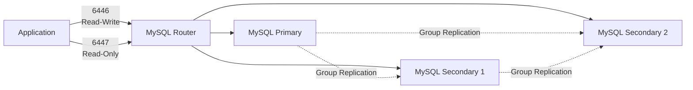
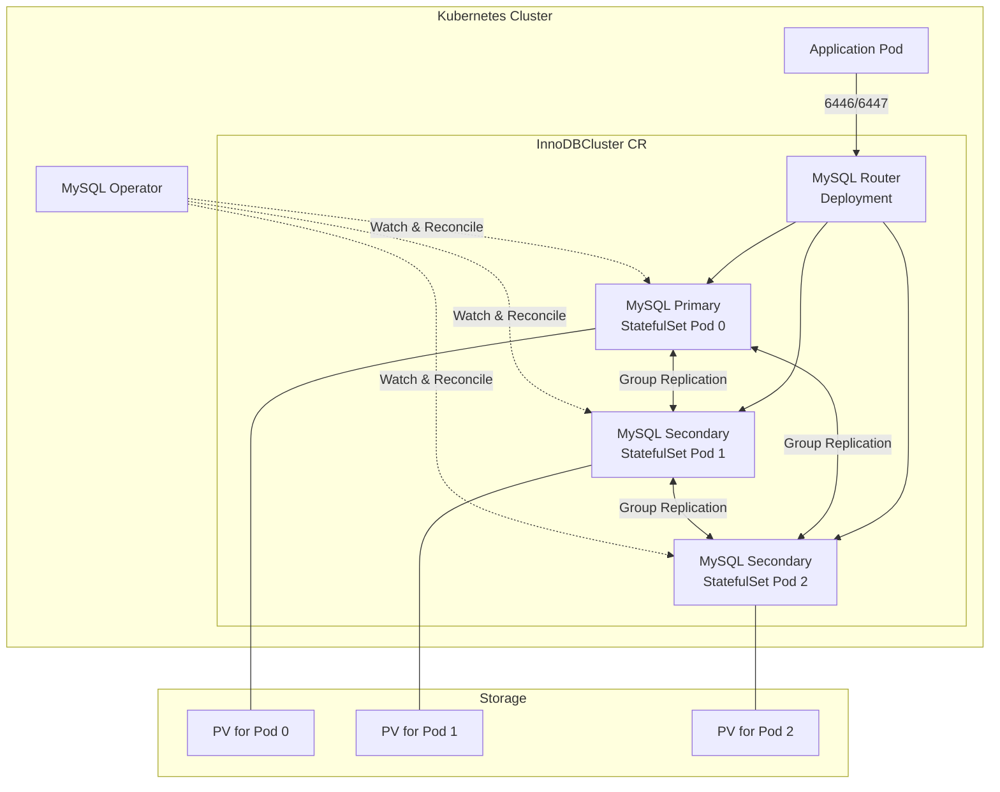

<!-- migrated: write/09_cloud/kubernetes/08-01.MySQL Operator.md (2026-04-19) -->

# Ch08. MySQL Operator for Kubernetes - K8s 위에서 MySQL HA 자동화하기

> 📌 **핵심 요약**
>
> MySQL Operator for Kubernetes는 Oracle이 공식 제공하는 Operator로, InnoDB Cluster 기반의 고가용성 MySQL 환경을 K8s 위에서 자동으로 관리한다. Group Replication으로 데이터를 동기화하고, MySQL Router가 애플리케이션의 연결을 Primary/Secondary로 자동 라우팅하며, Operator가 장애 복구와 백업을 선언적으로 관리한다. "데이터베이스를 Stateless 애플리케이션처럼 배포하고 관리할 수 있는가?"라는 질문에 대한 실용적 답이다.

## 🎯 학습 목표

1. K8s 위에서 데이터베이스를 운영하는 장점과 한계를 이해한다
2. InnoDB Cluster의 아키텍처(Group Replication, MySQL Router, MySQL Shell)를 파악한다
3. MySQL Operator로 InnoDBCluster CR을 정의하고 클러스터를 생성한다
4. Primary 장애 시 자동 페일오버 동작을 실습으로 확인한다
5. MySQLBackup CR로 백업과 복원을 선언적으로 관리한다
6. minikube 같은 제한된 환경에서 DB 클러스터를 테스트하는 전략을 수립한다

---

## 📖 본문

### 1. 왜 데이터베이스를 K8s 위에 올리는가

"데이터베이스는 K8s에 올리지 말라"는 말을 들어봤을 것이다. 실제로 초기 K8s는 Stateless 애플리케이션을 위해 설계되었고, StatefulSet이 안정화되기까지 시간이 걸렸다. 하지만 2025년 현재, K8s 위에서 데이터베이스를 운영하는 것은 더 이상 금기가 아니다.

**왜 DB를 K8s로 가져가려는가?**

첫째, Day-2 Operation의 자동화다. 데이터베이스 운영에서 가장 고통스러운 부분은 초기 설치가 아니라 "어제 잘 돌던 DB가 오늘 왜 안 돌아가는가"에 대응하는 것이다. 디스크가 꽉 차거나, Primary 서버가 죽거나, 백업이 실패하거나, 복제가 지연되거나... 이런 상황들이 새벽 3시에 발생하면 운영자는 SSH로 접속해서 수동으로 복구해야 한다.

Operator 패턴은 이런 Day-2 Operation을 코드로 만든다. "Primary가 죽으면 Replica 중 하나를 승격시킨다", "백업이 실패하면 재시도한다", "디스크 사용률이 80%를 넘으면 알림을 보낸다" 같은 로직을 Go 언어로 구현하고, 24시간 감시하도록 배포한다. 운영자는 선언적 명세(CR)만 작성하면 된다.

둘째, 인프라 통합이다. 애플리케이션은 K8s에서 돌고, DB는 별도 VM이나 RDS에서 돌면 네트워크 설정, 인증서 관리, 모니터링 스택이 이원화된다. DB를 K8s로 가져오면 Helm Chart로 배포하고, kubectl로 관리하고, Prometheus로 모니터링하고, Istio로 mTLS를 적용하는 것이 모두 일관된 방식으로 가능해진다.

셋째, 비용과 유연성이다. 클라우드 RDS는 편리하지만 비싸다. 특히 개발/테스트 환경에서는 과도한 비용이다. K8s 위에서 돌리면 노드의 자원을 효율적으로 공유할 수 있고, 필요할 때 스케일 아웃하고, 필요 없을 때 스케일 인할 수 있다.

**그렇다면 논쟁은 끝났는가?**

아니다. 여전히 "프로덕션 DB는 K8s 밖에 두는 것이 안전하다"는 의견이 많다. 그 이유는:

- **Storage 레이어의 복잡도**: K8s의 PersistentVolume은 클라우드 스토리지(EBS, PD, Azure Disk)에 의존한다. 이 레이어가 불안정하면 DB도 불안정해진다.
- **Network 레이어의 복잡도**: CNI, Service Mesh, Ingress가 쌓이면서 네트워크 경로가 복잡해진다. DB는 레이턴시에 민감하다.
- **운영 숙련도**: Operator가 자동화를 제공하지만, 문제가 생겼을 때 디버깅하려면 K8s + DB + Operator를 모두 이해해야 한다.

결론은 "상황에 따라 다르다"다. 작은 팀이 수십 개의 마이크로서비스와 DB를 관리해야 한다면 K8s Operator는 구원이다. 반면 대규모 금융 시스템처럼 안정성이 최우선이라면 전통적인 방식(별도 VM, 전문 DBA 팀)이 여전히 유효하다.

우리는 이 장에서 "MySQL Operator가 어떻게 Day-2 Operation을 자동화하는가"를 실습하면서, 이 도구가 언제 유용하고 언제 과도한지 판단할 수 있는 기준을 만들 것이다.

---

### 2. MySQL Operator for Kubernetes 소개

MySQL Operator for Kubernetes는 Oracle이 공식적으로 개발하고 유지보수하는 오픈소스 Operator다. GitHub 저장소는 `mysql/mysql-operator`이고, Apache 2.0 라이선스로 배포된다.

**핵심 특징은 세 가지다:**

첫째, **InnoDB Cluster 기반이다**. MySQL InnoDB Cluster는 Group Replication + MySQL Router + MySQL Shell을 결합한 고가용성 솔루션이다. 이미 MySQL 생태계에서 검증된 기술을 K8s 위로 가져온 것이다.

둘째, **선언적 관리다**. `InnoDBCluster` CR을 작성하면 Operator가 알아서 StatefulSet, Service, Secret, ConfigMap을 생성한다. 사용자는 "3개 인스턴스로 구성된 클러스터를 원한다"고 선언하고, Operator가 구현한다.

셋째, **자동 복구다**. Primary Pod가 죽으면 Operator가 Secondary 중 하나를 Primary로 승격시킨다. 네트워크 파티션이 발생하면 Quorum을 재계산해서 스플릿 브레인을 방지한다. 이런 로직이 Go 코드로 구현되어 있다.

**왜 다른 MySQL Operator가 아닌가?**

Vitess, Percona XtraDB Cluster, MariaDB Operator 같은 대안들도 있다. 하지만 MySQL Operator는 Oracle이 직접 관리하고, MySQL 8.0+의 최신 기능(Clone Plugin, Group Replication 개선 등)을 빠르게 반영한다. 복잡한 샤딩이나 대규모 분산보다는 "중소 규모 클러스터의 안정적 운영"에 최적화되어 있다.

**설치 방법은 두 가지다:**

```bash
# 방법 1: kubectl apply
kubectl apply -f https://raw.githubusercontent.com/mysql/mysql-operator/trunk/deploy/deploy-crds.yaml
kubectl apply -f https://raw.githubusercontent.com/mysql/mysql-operator/trunk/deploy/deploy-operator.yaml

# 방법 2: Helm (권장)
helm repo add mysql-operator https://mysql.github.io/mysql-operator/
helm install mysql-operator mysql-operator/mysql-operator --namespace mysql-operator --create-namespace
```

Helm 방식이 권장되는 이유는 설정 커스터마이징이 쉽고, 업그레이드 관리가 편하기 때문이다.

설치가 완료되면 `mysql-operator` 네임스페이스에 Operator Pod가 배포된다:

```bash
kubectl get pods -n mysql-operator
# mysql-operator-7d8c9f8b6-xh2k9   1/1     Running   0          2m
```

이 Pod가 InnoDBCluster CR을 감시하고, 필요한 리소스를 생성/수정/삭제한다.

---

### 3. InnoDB Cluster 아키텍처

MySQL Operator를 이해하려면 먼저 InnoDB Cluster의 아키�크처를 알아야 한다. InnoDB Cluster는 세 가지 컴포넌트로 구성된다.

#### 3.1 Group Replication

Group Replication은 MySQL의 Multi-Primary 또는 Single-Primary 복제 솔루션이다. 전통적인 비동기 복제와 달리, Paxos 기반의 합의 알고리즘을 사용해서 데이터 일관성을 보장한다.

**동작 원리:**

1. 클라이언트가 Primary에 쓰기 요청을 보낸다.
2. Primary는 트랜잭션을 로컬에서 실행하고, 변경 내용(binlog event)을 Group에 브로드캐스트한다.
3. 다른 멤버들은 이 이벤트를 받아서 검증한다(충돌 감지).
4. 과반수(Quorum)가 승인하면 트랜잭션이 커밋된다.
5. 모든 멤버가 동일한 순서로 트랜잭션을 적용한다.

**Single-Primary vs Multi-Primary:**

- **Single-Primary 모드** (기본값): 하나의 Primary만 쓰기를 받고, 나머지는 Secondary로 읽기 전용이다. 장애 시 Secondary 중 하나가 자동으로 Primary로 승격된다.
- **Multi-Primary 모드**: 모든 멤버가 쓰기를 받을 수 있다. 하지만 충돌 감지 로직이 복잡하고, 애플리케이션이 충돌을 처리해야 한다. 대부분의 경우 Single-Primary가 더 안전하다.

MySQL Operator는 Single-Primary 모드를 기본으로 사용한다.

#### 3.2 MySQL Router

MySQL Router는 애플리케이션과 MySQL 클러스터 사이에서 프록시 역할을 한다. 애플리케이션은 Router에 연결하고, Router가 요청을 Primary 또는 Secondary로 라우팅한다.

**왜 Router가 필요한가?**

Group Replication에서 Primary는 언제든지 바뀔 수 있다. Pod가 죽거나, 네트워크 파티션이 발생하면 Secondary가 Primary로 승격된다. 애플리케이션이 직접 MySQL 서버에 연결하면 Primary IP를 추적해야 하는데, 이건 애플리케이션의 책임이 아니다.

Router는 두 가지 포트를 제공한다:

- **6446**: Read-Write 포트. Primary로만 라우팅한다.
- **6447**: Read-Only 포트. Primary + Secondary 중에서 라운드 로빈으로 라우팅한다.

애플리케이션은 "쓰기는 6446으로, 읽기는 6447로" 연결하면 된다. Primary가 바뀌어도 Router가 자동으로 추적해준다.



#### 3.3 MySQL Shell

MySQL Shell은 관리 도구다. InnoDB Cluster를 생성하고, 상태를 확인하고, 설정을 변경하는 데 사용된다.

Operator 환경에서는 사용자가 직접 MySQL Shell을 실행할 일이 적다. Operator가 내부적으로 Shell을 호출해서 클러스터를 관리하기 때문이다. 하지만 디버깅 시에는 Shell로 클러스터 상태를 확인하는 것이 유용하다:

```bash
# MySQL Shell로 클러스터 상태 확인
mysqlsh --uri root@mycluster-0.mycluster-instances:3306
> var cluster = dba.getCluster()
> cluster.status()
```

이 명령은 현재 Primary가 누구인지, Secondary들의 복제 지연은 얼마인지, Quorum 상태는 어떤지 등을 JSON으로 보여준다.

#### 3.4 전체 아키텍처 다이어그램



이 다이어그램에서 핵심은:

1. Operator가 CR을 감시하고, StatefulSet과 Deployment를 생성한다.
2. StatefulSet의 각 Pod는 독립적인 PV를 갖는다.
3. Group Replication이 Pod 간 데이터를 동기화한다.
4. Router가 애플리케이션의 연결을 Primary/Secondary로 분배한다.

---

### 4. Operator 설치

실습 환경으로 minikube를 사용한다고 가정하자. MySQL InnoDB Cluster는 최소 3개 인스턴스를 권장하므로, minikube에 충분한 리소스를 할당해야 한다:

```bash
minikube start --cpus=4 --memory=8192 --disk-size=20g
```

Helm으로 Operator를 설치한다:

```bash
# Helm repo 추가
helm repo add mysql-operator https://mysql.github.io/mysql-operator/
helm repo update

# Operator 설치
helm install mysql-operator mysql-operator/mysql-operator \
  --namespace mysql-operator \
  --create-namespace \
  --set image.pullPolicy=IfNotPresent
```

설치 확인:

```bash
kubectl get pods -n mysql-operator
# NAME                              READY   STATUS    RESTARTS   AGE
# mysql-operator-7d8c9f8b6-xh2k9   1/1     Running   0          1m
```

Operator가 정상 동작하면 이제 InnoDBCluster CR을 생성할 수 있다.

---

### 5. InnoDBCluster CR 정의

InnoDBCluster CR은 다음과 같은 구조를 갖는다:

```yaml
apiVersion: mysql.oracle.com/v2
kind: InnoDBCluster
metadata:
  name: mycluster
  namespace: default
spec:
  secretName: mycluster-secret
  instances: 3
  router:
    instances: 1
  tlsUseSelfSigned: true
  version: "8.0.35"
  podSpec:
    resources:
      requests:
        memory: "512Mi"
        cpu: "500m"
      limits:
        memory: "1Gi"
        cpu: "1000m"
  datadirVolumeClaimTemplate:
    accessModes:
      - ReadWriteOnce
    resources:
      requests:
        storage: 2Gi
```

각 필드를 하나씩 뜯어보자.

| 필드 | 설명 | 기본값 |
|------|------|--------|
| `secretName` | root 비밀번호가 저장된 Secret 이름. 미리 생성해야 함 | 필수 |
| `instances` | MySQL 인스턴스 개수 (StatefulSet replicas) | 1 (최소 3 권장) |
| `router.instances` | MySQL Router 개수 (Deployment replicas) | 1 |
| `tlsUseSelfSigned` | 자체 서명 인증서 사용 여부 | false |
| `version` | MySQL 버전 (8.0.x, 8.4.x 등) | latest |
| `podSpec.resources` | Pod의 CPU/메모리 제한 | - |
| `datadirVolumeClaimTemplate` | PVC 템플릿 (용량, StorageClass 등) | - |

**Secret 먼저 생성:**

```bash
kubectl create secret generic mycluster-secret \
  --from-literal=rootUser=root \
  --from-literal=rootPassword=MySecretPassword123 \
  --from-literal=rootHost=%
```

`rootHost=%`는 모든 호스트에서 접속 가능하다는 의미다. 프로덕션에서는 제한해야 한다.

**CR 적용:**

```bash
kubectl apply -f mycluster.yaml
```

Operator가 이 CR을 감지하고 다음을 수행한다:

1. `mycluster-instances` StatefulSet 생성 (replicas=3)
2. 각 Pod에 `mycluster-instances-{0,1,2}` PVC 자동 생성
3. Pod 0을 Primary로 초기화
4. Pod 1, 2를 Secondary로 초기화하고 Group Replication 설정
5. `mycluster-router` Deployment 생성 (replicas=1)
6. `mycluster`, `mycluster-instances` Service 생성

이 과정은 5~10분 정도 걸린다. 진행 상황 확인:

```bash
kubectl get innodbcluster mycluster -w
# NAME        STATUS   ONLINE   INSTANCES   ROUTERS   AGE
# mycluster   PENDING  0        3           1         10s
# mycluster   ONLINE   3        3           1         5m
```

`STATUS`가 `ONLINE`이고 `ONLINE` 컬럼이 `3`이면 성공이다.

**생성된 리소스 확인:**

```bash
kubectl get pods
# mycluster-0                1/1     Running   0          6m
# mycluster-1                1/1     Running   0          5m
# mycluster-2                1/1     Running   0          4m
# mycluster-router-xxx-yyy   1/1     Running   0          3m

kubectl get svc
# mycluster             ClusterIP   10.96.100.1    <none>        6446/TCP,6447/TCP,6448/TCP,6449/TCP   6m
# mycluster-instances   ClusterIP   None           <none>        3306/TCP,33060/TCP,33061/TCP         6m
```

`mycluster` Service는 Router의 엔드포인트고, `mycluster-instances`는 Headless Service로 각 Pod에 직접 접근할 때 사용된다.

---

### 6. 클러스터 접속

애플리케이션은 MySQL Router를 통해 접속한다. 두 가지 포트가 있다:

- **6446**: Read-Write 포트 (Primary로만 라우팅)
- **6447**: Read-Only 포트 (Primary + Secondary 라운드 로빈)

**쓰기 트랜잭션:**

```bash
kubectl run mysql-client --image=mysql:8.0 -it --rm --restart=Never -- \
  mysql -h mycluster -P 6446 -u root -pMySecretPassword123 -e "CREATE DATABASE testdb;"
```

이 명령은 Router의 6446 포트로 연결해서 `testdb`를 생성한다. Router가 Primary로 라우팅한다.

**읽기 트랜잭션:**

```bash
kubectl run mysql-client --image=mysql:8.0 -it --rm --restart=Never -- \
  mysql -h mycluster -P 6447 -u root -pMySecretPassword123 -e "SHOW DATABASES;"
```

이 명령은 6447 포트로 연결해서 데이터베이스 목록을 조회한다. Router가 Primary 또는 Secondary 중 하나로 라우팅한다.

**애플리케이션 설정 예시 (Spring Boot):**

```yaml
spring:
  datasource:
    write:
      url: jdbc:mysql://mycluster.default.svc.cluster.local:6446/mydb
      username: root
      password: ${DB_PASSWORD}
    read:
      url: jdbc:mysql://mycluster.default.svc.cluster.local:6447/mydb
      username: root
      password: ${DB_PASSWORD}
```

Read-Write 분리를 애플리케이션 레벨에서 구현하면 성능을 최적화할 수 있다.

**직접 Pod 접속 (디버깅용):**

```bash
kubectl exec -it mycluster-0 -- mysql -u root -pMySecretPassword123
> SELECT @@hostname, @@server_id;
+------------+-------------+
| @@hostname | @@server_id |
+------------+-------------+
| mycluster-0 | 1           |
+------------+-------------+
```

이 방법은 Router를 거치지 않고 Pod에 직접 연결한다. 프로덕션에서는 권장하지 않지만, 디버깅 시 유용하다.

---

### 7. 장애 테스트

고가용성의 핵심은 장애 복구다. Primary Pod를 강제로 삭제해서 Operator의 자동 복구를 확인해보자.

#### 7.1 시나리오 1: Primary Pod 삭제

**현재 Primary 확인:**

```bash
kubectl exec -it mycluster-0 -- mysql -u root -pMySecretPassword123 -e \
  "SELECT MEMBER_HOST, MEMBER_ROLE FROM performance_schema.replication_group_members;"
```

출력 예시:

```
+------------------------+-------------+
| MEMBER_HOST            | MEMBER_ROLE |
+------------------------+-------------+
| mycluster-0.mycluster-instances | PRIMARY     |
| mycluster-1.mycluster-instances | SECONDARY   |
| mycluster-2.mycluster-instances | SECONDARY   |
+------------------------+-------------+
```

`mycluster-0`이 Primary다.

**Primary Pod 삭제:**

```bash
kubectl delete pod mycluster-0
```

StatefulSet이 즉시 새 Pod를 생성하지만, 이 Pod가 클러스터에 재합류하는 데는 시간이 걸린다. 그동안 Group Replication이 새 Primary를 선출한다.

**30초 후 상태 확인:**

```bash
kubectl exec -it mycluster-1 -- mysql -u root -pMySecretPassword123 -e \
  "SELECT MEMBER_HOST, MEMBER_ROLE FROM performance_schema.replication_group_members;"
```

출력:

```
+------------------------+-------------+
| MEMBER_HOST            | MEMBER_ROLE |
+------------------------+-------------+
| mycluster-1.mycluster-instances | PRIMARY     |
| mycluster-2.mycluster-instances | SECONDARY   |
+------------------------+-------------+
```

`mycluster-1`이 새 Primary로 승격되었다. `mycluster-0`은 아직 복구 중이므로 목록에 없다.

**2분 후 mycluster-0 재합류:**

```bash
kubectl exec -it mycluster-1 -- mysql -u root -pMySecretPassword123 -e \
  "SELECT MEMBER_HOST, MEMBER_ROLE FROM performance_schema.replication_group_members;"
```

출력:

```
+------------------------+-------------+
| MEMBER_HOST            | MEMBER_ROLE |
+------------------------+-------------+
| mycluster-0.mycluster-instances | SECONDARY   |
| mycluster-1.mycluster-instances | PRIMARY     |
| mycluster-2.mycluster-instances | SECONDARY   |
+------------------------+-------------+
```

`mycluster-0`이 Secondary로 재합류했다. 이제 클러스터는 다시 3개 멤버를 갖는다.

**애플리케이션 영향:**

Router를 통해 연결된 애플리케이션은 이 과정에서 약 5~10초의 쓰기 중단을 경험한다. Primary 선출이 완료되면 Router가 자동으로 새 Primary로 라우팅한다. 애플리케이션은 연결을 재시도하면 된다.

#### 7.2 시나리오 2: 네트워크 파티션 (Quorum 손실)

3개 클러스터에서 2개 Pod가 동시에 죽으면 Quorum이 깨진다. 이 경우 클러스터는 읽기 전용 모드로 전환된다.

**테스트:**

```bash
kubectl delete pod mycluster-1 mycluster-2 --grace-period=0 --force
```

**즉시 상태 확인:**

```bash
kubectl exec -it mycluster-0 -- mysql -u root -pMySecretPassword123 -e \
  "SELECT MEMBER_HOST, MEMBER_ROLE FROM performance_schema.replication_group_members;"
```

출력:

```
+------------------------+-------------+
| MEMBER_HOST            | MEMBER_ROLE |
+------------------------+-------------+
| mycluster-0.mycluster-instances | PRIMARY     |
+------------------------+-------------+
```

`mycluster-0`만 남았지만, Quorum이 없으므로 쓰기는 실패한다:

```bash
kubectl exec -it mycluster-0 -- mysql -u root -pMySecretPassword123 -e "CREATE DATABASE test2;"
# ERROR 3100 (HY000): Error on observer while running replication hook 'before_commit'.
```

**2분 후 Pod들이 복구되면 클러스터 재구성:**

```bash
kubectl get innodbcluster mycluster
# NAME        STATUS   ONLINE   INSTANCES   ROUTERS   AGE
# mycluster   ONLINE   3        3           1         15m
```

Operator가 자동으로 클러스터를 재구성하고 정상 상태로 복구한다.

#### 7.3 장애 시나리오 요약 테이블

| 장애 유형 | Quorum | Primary 선출 | 복구 시간 | 쓰기 가용성 |
|-----------|--------|--------------|-----------|-------------|
| Primary Pod 삭제 | 유지 (2/3) | 자동 (Secondary 승격) | 5~10초 | 5~10초 중단 |
| Secondary 1개 삭제 | 유지 (2/3) | 불필요 | 즉시 | 영향 없음 |
| Secondary 2개 삭제 | 손실 (1/3) | 불가능 | Pod 복구 후 자동 | 완전 중단 |
| 전체 Pod 삭제 | 손실 (0/3) | 불가능 | StatefulSet 재생성 후 수동 복구 | 완전 중단 |

---

### 8. 백업과 복원

MySQL Operator는 `MySQLBackup` CR로 백업을 관리한다. 백업 대상은 특정 Pod이고, `mysqldump` 또는 MySQL Enterprise Backup을 사용한다.

#### 8.1 On-Demand 백업

```yaml
apiVersion: mysql.oracle.com/v2
kind: MySQLBackup
metadata:
  name: mycluster-backup-20260213
  namespace: default
spec:
  clusterName: mycluster
  backupProfileName: dump-instance
  deleteBackupData: false
  storage:
    persistentVolumeClaim:
      claimName: backup-pvc
```

`backupProfileName`은 백업 방식을 지정한다:

- `dump-instance`: mysqldump를 사용한 논리 백업
- `clone-instance`: MySQL Clone Plugin을 사용한 물리 백업

**PVC 먼저 생성:**

```yaml
apiVersion: v1
kind: PersistentVolumeClaim
metadata:
  name: backup-pvc
spec:
  accessModes:
    - ReadWriteOnce
  resources:
    requests:
      storage: 5Gi
```

**백업 실행:**

```bash
kubectl apply -f backup-pvc.yaml
kubectl apply -f backup.yaml
```

**백업 진행 상황 확인:**

```bash
kubectl get mysqlbackup mycluster-backup-20260213
# NAME                          CLUSTER     STATUS      OUTPUT                          AGE
# mycluster-backup-20260213     mycluster   Completed   /backup/mycluster-20260213.sql  2m
```

백업 파일은 PVC의 `/backup/` 경로에 저장된다.

#### 8.2 스케줄 백업

CronJob처럼 주기적 백업도 가능하다:

```yaml
apiVersion: mysql.oracle.com/v2
kind: MySQLBackupSchedule
metadata:
  name: mycluster-daily-backup
  namespace: default
spec:
  clusterName: mycluster
  schedule: "0 2 * * *"  # 매일 새벽 2시
  backupProfileName: dump-instance
  deleteBackupData: false
  storage:
    persistentVolumeClaim:
      claimName: backup-pvc
  backupRetentionPolicy: 7  # 7일 보관
```

Operator가 내부적으로 CronJob을 생성해서 스케줄에 맞춰 백업을 실행한다.

#### 8.3 복원

복원은 새 InnoDBCluster를 생성하면서 백업 파일을 지정한다:

```yaml
apiVersion: mysql.oracle.com/v2
kind: InnoDBCluster
metadata:
  name: mycluster-restored
spec:
  secretName: mycluster-secret
  instances: 3
  initDB:
    dump:
      name: mycluster-backup-20260213  # MySQLBackup 리소스 이름
      storage:
        persistentVolumeClaim:
          claimName: backup-pvc
```

Operator가 백업 파일을 읽어서 새 클러스터를 초기화한다. 기존 클러스터는 영향을 받지 않는다.

---

### 9. minikube 리소스 고려

minikube는 로컬 개발 환경이므로 리소스가 제한적이다. 3개 MySQL 인스턴스 + Router를 돌리려면 최소 8GB 메모리가 필요하다.

**리소스 프로파일:**

| 컴포넌트 | CPU 요청 | 메모리 요청 | CPU 제한 | 메모리 제한 |
|----------|----------|-------------|----------|-------------|
| MySQL Pod (각) | 500m | 512Mi | 1000m | 1Gi |
| Router Pod | 100m | 128Mi | 200m | 256Mi |
| 합계 (3 MySQL + 1 Router) | 1600m | 1664Mi | 3200m | 3328Mi |

minikube에 4 CPU / 8GB 메모리를 할당하면 여유롭게 돌아간다. 하지만 다른 워크로드(Prometheus, Grafana 등)를 함께 돌리면 부족할 수 있다.

**리소스 부족 시 대응:**

1. **인스턴스 수 줄이기**: `instances: 2`로 설정. Quorum은 2/2이므로 HA는 제한적이다.
2. **메모리 제한 줄이기**: `requests.memory: 256Mi`, `limits.memory: 512Mi`로 설정. InnoDB Buffer Pool이 작아져서 성능이 떨어진다.
3. **Router 제거**: Router 없이 직접 Pod에 연결. 하지만 Primary 추적을 애플리케이션이 해야 한다.

프로덕션에서는 이런 타협을 하지 말아야 한다. 최소 3개 인스턴스, 충분한 메모리, Router 사용이 필수다.

---

### 10. 정리

MySQL Operator for Kubernetes는 InnoDB Cluster를 K8s 위에서 선언적으로 관리하는 도구다. Group Replication으로 데이터를 동기화하고, MySQL Router로 연결을 라우팅하며, Operator가 장애 복구와 백업을 자동화한다.

**핵심 개념 체크리스트:**

- [ ] InnoDB Cluster = Group Replication + MySQL Router + MySQL Shell
- [ ] Single-Primary 모드에서 하나의 Primary만 쓰기를 받는다
- [ ] Quorum이 유지되면 (과반수) Primary 선출이 자동으로 이루어진다
- [ ] Router는 6446(RW), 6447(RO) 포트로 연결을 분배한다
- [ ] InnoDBCluster CR의 `instances` 필드로 클러스터 크기를 선언한다
- [ ] MySQLBackup CR로 백업을 선언적으로 관리한다
- [ ] Primary Pod 삭제 시 5~10초 내에 Secondary가 승격된다
- [ ] Quorum 손실 시 쓰기가 완전히 중단된다 (읽기 전용 모드)

**언제 MySQL Operator를 사용해야 하는가?**

- 중소 규모 MySQL 클러스터(3~7 인스턴스)를 운영할 때
- Day-2 Operation(장애 복구, 백업, 모니터링)을 자동화하고 싶을 때
- K8s 생태계로 인프라를 통합하고 싶을 때

**언제 사용하지 말아야 하는가?**

- 대규모 샤딩이 필요할 때 (Vitess 같은 대안 고려)
- 초저지연이 필수일 때 (K8s 네트워크 오버헤드 고려)
- 팀이 K8s와 MySQL을 모두 깊이 이해하지 못할 때 (디버깅 난이도 상승)

다음 장에서는 PostgreSQL의 CloudNativePG Operator를 살펴본다. MySQL과 비교하면서 "어떤 DB를 언제 K8s 위로 가져가야 하는가"에 대한 감각을 키울 것이다.
