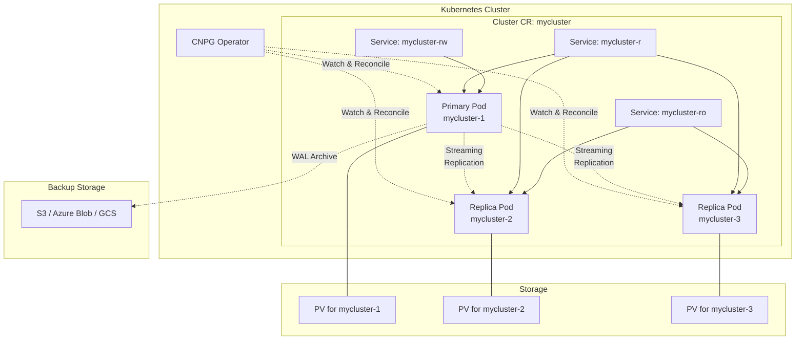

# Ch09. CloudNativePG Operator - PostgreSQL을 K8s 네이티브하게 관리하기

> 📌 **핵심 요약**
>
> CloudNativePG(CNPG)는 PostgreSQL을 K8s 위에서 선언적으로 관리하는 Operator로, CNCF Sandbox 프로젝트다. Streaming Replication으로 Primary와 Replica를 동기화하고, 자동 페일오버로 고가용성을 보장하며, Barman 기반 백업과 WAL 아카이빙으로 PITR(Point-in-Time Recovery)을 지원한다. "PostgreSQL을 단순한 Pod가 아니라 진짜 클라우드 네이티브 리소스로 다룰 수 있는가?"라는 질문에 대한 실용적 답이다.

## 🎯 학습 목표

1. PostgreSQL Operator 선택지(CloudNativePG, Zalando, CrunchyData)를 비교하고 선택 기준을 이해한다
2. CloudNativePG의 아키텍처(Primary/Replica, Streaming Replication, 자동 페일오버)를 파악한다
3. Cluster CR로 PostgreSQL 클러스터를 선언적으로 정의하고 배포한다
4. Primary Pod 삭제 시 Replica 승격과 자동 페일오버를 실습으로 확인한다
5. Barman 기반 백업과 WAL 아카이빙으로 PITR을 구현한다
6. Prometheus 메트릭으로 PostgreSQL을 모니터링하는 방법을 익힌다

---

## 📖 본문

### 1. PostgreSQL Operator 선택지 비교

K8s 위에서 PostgreSQL을 운영하려면 Operator가 거의 필수다. 수동으로 Replication을 설정하고, 페일오버를 처리하고, 백업을 관리하는 것은 너무 복잡하기 때문이다. 2025년 현재, 주요 PostgreSQL Operator는 세 가지다.

#### 1.1 CloudNativePG (CNPG)

**출처:** EDB(EnterpriseDB)가 개발하고, CNCF Sandbox 프로젝트로 승격되었다.

**특징:**

- **경량 설계**: Go로 작성되었고, 단일 바이너리로 배포된다. 의존성이 적고, 설치가 간단하다.
- **K8s 네이티브**: CRD만으로 모든 설정을 관리한다. ConfigMap이나 외부 도구가 최소화된다.
- **Barman 통합**: Barman은 PostgreSQL 백업 도구의 사실상 표준이다. CNPG는 이를 내장해서 백업과 WAL 아카이빙을 자동화한다.
- **활발한 개발**: 2023년 CNCF에 들어온 이후 릴리스 주기가 빠르고, 커뮤니티가 성장하고 있다.

**적합한 경우:** 새로 시작하는 프로젝트, K8s 생태계에 깊이 통합하고 싶을 때, 최신 기능을 빠르게 적용하고 싶을 때.

#### 1.2 Zalando Postgres Operator

**출처:** Zalando(독일 이커머스 회사)가 내부용으로 개발하고 오픈소스로 공개했다.

**특징:**

- **검증된 안정성**: Zalando가 수년간 프로덕션에서 사용했다. 대규모 배포 사례가 많다.
- **Patroni 기반**: Patroni는 PostgreSQL HA 솔루션으로, etcd/Consul/Zookeeper를 사용한다. Zalando Operator는 Patroni를 K8s에 통합한다.
- **UI 제공**: Postgres Operator UI가 있어서 클러스터를 웹에서 관리할 수 있다.
- **복잡도**: Patroni와 etcd 같은 추가 컴포넌트가 필요하므로 아키텍처가 복잡하다.

**적합한 경우:** 이미 Patroni를 사용 중이거나, 대규모 멀티 테넌트 환경, UI가 필요할 때.

#### 1.3 Crunchy Data Postgres Operator (PGO)

**출처:** Crunchy Data(PostgreSQL 전문 회사)가 개발했다.

**특징:**

- **엔터프라이즈 기능**: 고급 모니터링, 감사 로그, 암호화 같은 엔터프라이즈 기능이 강력하다.
- **pgBackRest 통합**: pgBackRest는 PostgreSQL 백업 도구로, Barman과 유사하지만 병렬 처리와 증분 백업에 강점이 있다.
- **복잡한 설정**: 기능이 많은 만큼 설정이 복잡하고, 학습 곡선이 가파르다.
- **상업 지원**: Crunchy Data의 상업 지원을 받을 수 있다.

**적합한 경우:** 엔터프라이즈 요구사항(컴플라이언스, 감사, 고급 암호화)이 있을 때, 상업 지원이 필요할 때.

#### 1.4 비교 테이블

| 항목 | CloudNativePG | Zalando | Crunchy PGO |
|------|---------------|---------|-------------|
| **설치 복잡도** | 낮음 (kubectl apply) | 중간 (Patroni 필요) | 높음 (많은 CRD) |
| **의존성** | 없음 | etcd/Consul | pgBackRest |
| **백업 도구** | Barman | WAL-G | pgBackRest |
| **CNCF 프로젝트** | Yes (Sandbox) | No | No |
| **커뮤니티** | 빠른 성장 | 안정적 | 틈새 시장 |
| **상업 지원** | EDB | Zalando (제한적) | Crunchy Data |
| **권장 사용처** | 새 프로젝트, 간결함 우선 | 대규모 검증된 환경 | 엔터프라이즈 요구사항 |

**이 장에서는 CloudNativePG를 선택한다.** 이유는:

1. CNCF 프로젝트라서 벤더 중립적이다.
2. 설치와 설정이 간단해서 학습 곡선이 낮다.
3. 활발한 개발로 최신 PostgreSQL 버전을 빠르게 지원한다.
4. Barman 통합으로 백업이 쉽다.

---

### 2. CloudNativePG 소개

CloudNativePG(줄여서 CNPG)는 "PostgreSQL을 K8s의 일급 시민(First-Class Citizen)으로 만들자"는 철학으로 설계되었다. 전통적인 Operator들은 PostgreSQL을 "K8s 위에 올린 VM"처럼 다루지만, CNPG는 "K8s 네이티브 리소스"로 다룬다.

**핵심 철학:**

- **선언적 관리**: `Cluster` CR 하나로 PostgreSQL 클러스터를 정의한다. Primary/Replica 구분, Replication 설정, 백업 스케줄 등이 모두 CR 안에 들어간다.
- **자동화**: Operator가 감시하면서 Primary 장애 시 Replica를 자동 승격시키고, WAL을 자동 아카이빙하고, 백업을 자동 실행한다.
- **투명성**: 복잡한 외부 도구 없이, PostgreSQL 자체 기능(Streaming Replication, Physical Replication Slots)을 최대한 활용한다.

**주요 기능:**

1. **고가용성**: Primary + Replica 구성, 자동 페일오버
2. **백업/복원**: Barman 기반, PITR 지원
3. **롤링 업데이트**: PostgreSQL 버전 업그레이드를 무중단으로 수행
4. **연결 풀링**: PgBouncer 통합 (선택적)
5. **모니터링**: Prometheus 메트릭 내장
6. **보안**: TLS, Pod Security Standards 준수

**아키텍처 개요:**

CNPG는 Operator Pod 하나가 클러스터 전체를 감시한다. Cluster CR을 생성하면 Operator가 StatefulSet이 아니라 **개별 Pod**들을 직접 생성한다. 각 Pod는 PostgreSQL 인스턴스고, Primary 1개 + Replica N개로 구성된다.



이 다이어그램에서 핵심은:

1. Operator가 Pod를 직접 관리한다 (StatefulSet 없음).
2. Primary가 Replica로 Streaming Replication을 전송한다.
3. 세 가지 Service가 있다: `-rw`(Primary), `-ro`(Replica only), `-r`(Primary + Replica).
4. WAL은 S3 같은 외부 스토리지에 아카이빙된다.

---

### 3. 아키텍처 상세

#### 3.1 Primary와 Replica

PostgreSQL은 Master-Slave(또는 Primary-Standby) 아키텍처다. Primary는 쓰기를 받고, Replica는 Primary의 변경 사항을 복제해서 읽기를 처리한다.

**Streaming Replication:**

PostgreSQL의 Streaming Replication은 WAL(Write-Ahead Log)을 실시간으로 전송하는 방식이다. Primary에서 트랜잭션이 커밋되면:

1. WAL 레코드가 디스크에 쓰인다.
2. WAL 레코드가 Replica로 스트리밍된다.
3. Replica가 WAL을 받아서 자신의 데이터베이스에 적용한다.

이 과정은 비동기 또는 동기로 설정할 수 있다.

- **비동기(async)**: Primary는 Replica의 확인을 기다리지 않고 커밋한다. 빠르지만 Primary가 죽으면 일부 데이터가 손실될 수 있다.
- **동기(sync)**: Primary는 최소 N개 Replica가 WAL을 받았음을 확인한 후 커밋한다. 느리지만 데이터 손실이 없다.

CNPG는 기본값으로 비동기를 사용하지만, `synchronous_standby_names` 설정으로 동기 모드를 활성화할 수 있다.

#### 3.2 자동 페일오버

Primary Pod가 죽으면 CNPG Operator가 즉시 감지하고, Replica 중 하나를 새 Primary로 승격시킨다.

**승격 과정:**

1. Operator가 Primary Pod의 상태를 주기적으로 체크한다 (Liveness Probe).
2. Primary가 응답하지 않으면 Operator는 "장애"로 판단한다.
3. Replica 중에서 WAL 위치가 가장 앞선(가장 최신 데이터를 가진) 것을 선택한다.
4. 선택된 Replica에서 `pg_ctl promote` 명령을 실행한다.
5. Replica가 Primary로 승격되고, 쓰기를 받을 수 있게 된다.
6. 나머지 Replica들은 새 Primary를 따라가도록 재설정된다.
7. Service `-rw`의 엔드포인트가 새 Primary로 업데이트된다.

이 과정은 보통 **10~30초** 안에 완료된다. MySQL Operator의 Group Replication보다는 약간 느리지만, 충분히 빠르다.

#### 3.3 세 가지 Service

CNPG는 Cluster CR마다 세 가지 Service를 자동 생성한다:

| Service 이름 | Selector | 용도 |
|--------------|----------|------|
| `{cluster}-rw` | Primary만 | 쓰기 트랜잭션. 항상 Primary로 연결된다. |
| `{cluster}-ro` | Replica만 | 읽기 전용 트랜잭션. Replica로만 분산된다. |
| `{cluster}-r` | Primary + Replica | 읽기 트랜잭션. Primary와 Replica 모두 포함. |

**왜 `-r`과 `-ro`가 따로 있는가?**

- `-ro`는 Replica에만 연결하므로, Primary의 쓰기 부하에 영향을 받지 않는다. 대시보드, 분석 쿼리 같은 무거운 읽기에 적합하다.
- `-r`은 Primary도 포함하므로, Replica가 부족할 때 Primary가 읽기도 처리한다. 최종 일관성이 중요하지 않은 쿼리에 적합하다.

대부분의 경우 애플리케이션은 `-rw`(쓰기)와 `-ro`(읽기)를 사용한다.

#### 3.4 Replication Slots

CNPG는 PostgreSQL의 Physical Replication Slots을 사용한다. Replication Slot은 "이 Replica가 어디까지 WAL을 받았는가"를 Primary가 추적하도록 한다.

**장점:**

- Primary는 Replica가 아직 받지 않은 WAL을 삭제하지 않는다. Replica가 일시적으로 중단되어도 복구 가능하다.

**단점:**

- Replica가 오래 중단되면 Primary의 디스크가 WAL로 가득 찰 수 있다. CNPG는 이를 모니터링해서 알림을 보낸다.

---

### 4. Operator 설치

CNPG Operator는 kubectl apply 또는 Helm으로 설치할 수 있다.

#### 4.1 kubectl apply 방식 (권장)

```bash
kubectl apply -f \
  https://raw.githubusercontent.com/cloudnative-pg/cloudnative-pg/release-1.22/releases/cnpg-1.22.0.yaml
```

버전은 최신 릴리스로 교체한다. 2025년 2월 기준 최신은 1.22.x다.

**설치 확인:**

```bash
kubectl get deployment -n cnpg-system cnpg-controller-manager
# NAME                      READY   UP-TO-DATE   AVAILABLE   AGE
# cnpg-controller-manager   1/1     1            1           30s

kubectl get crd | grep postgresql
# backups.postgresql.cnpg.io
# clusters.postgresql.cnpg.io
# poolers.postgresql.cnpg.io
# scheduledbackups.postgresql.cnpg.io
```

CRD가 4개 생성되었다: Cluster, Backup, ScheduledBackup, Pooler.

#### 4.2 Helm 방식

```bash
helm repo add cnpg https://cloudnative-pg.github.io/charts
helm repo update
helm install cnpg cnpg/cloudnative-pg --namespace cnpg-system --create-namespace
```

Helm 방식은 설정 커스터마이징이 쉽고, 업그레이드 관리가 편하다.

---

### 5. Cluster CR 정의

Cluster CR은 PostgreSQL 클러스터의 모든 설정을 담는다. 최소 설정부터 시작해서 점차 확장해보자.

#### 5.1 최소 설정

```yaml
apiVersion: postgresql.cnpg.io/v1
kind: Cluster
metadata:
  name: mycluster
  namespace: default
spec:
  instances: 3
  storage:
    size: 5Gi
```

이것만으로도 3개 인스턴스(Primary 1 + Replica 2) 클러스터가 생성된다.

**적용:**

```bash
kubectl apply -f cluster-minimal.yaml
```

**생성된 리소스 확인:**

```bash
kubectl get pods
# mycluster-1   1/1     Running   0          2m
# mycluster-2   1/1     Running   0          1m
# mycluster-3   1/1     Running   0          1m

kubectl get svc
# mycluster-r    ClusterIP   10.96.10.1   <none>        5432/TCP   2m
# mycluster-ro   ClusterIP   10.96.10.2   <none>        5432/TCP   2m
# mycluster-rw   ClusterIP   10.96.10.3   <none>        5432/TCP   2m
```

Pod 이름은 `{cluster}-{number}`고, 번호가 작을수록 먼저 생성된다. 보통 `{cluster}-1`이 Primary다.

#### 5.2 실전 설정

```yaml
apiVersion: postgresql.cnpg.io/v1
kind: Cluster
metadata:
  name: mycluster
  namespace: default
spec:
  instances: 3

  postgresql:
    parameters:
      max_connections: "200"
      shared_buffers: "256MB"
      work_mem: "8MB"
      maintenance_work_mem: "64MB"
      effective_cache_size: "1GB"
      log_min_duration_statement: "1000"  # 1초 이상 쿼리 로깅

  bootstrap:
    initdb:
      database: myapp
      owner: myapp
      secret:
        name: myapp-secret

  storage:
    size: 10Gi
    storageClass: standard

  resources:
    requests:
      memory: "1Gi"
      cpu: "500m"
    limits:
      memory: "2Gi"
      cpu: "1000m"

  backup:
    barmanObjectStore:
      destinationPath: s3://my-backup-bucket/mycluster
      s3Credentials:
        accessKeyId:
          name: s3-credentials
          key: ACCESS_KEY_ID
        secretAccessKey:
          name: s3-credentials
          key: SECRET_ACCESS_KEY
      wal:
        compression: gzip
        maxParallel: 2
    retentionPolicy: "30d"

  monitoring:
    enablePodMonitor: true
```

#### 5.3 주요 필드 설명

| 필드 | 설명 | 기본값 |
|------|------|--------|
| `instances` | PostgreSQL 인스턴스 개수 (Primary 1 + Replica N-1) | 1 |
| `postgresql.parameters` | postgresql.conf 설정. Key-value 형식 | 기본 설정 |
| `bootstrap.initdb` | 초기 데이터베이스 생성. database, owner, 비밀번호 지정 | postgres/postgres |
| `storage.size` | PVC 크기 | 필수 |
| `storage.storageClass` | StorageClass 이름 | 클러스터 기본값 |
| `resources` | Pod CPU/메모리 제한 | - |
| `backup.barmanObjectStore` | Barman 백업 대상 (S3, Azure Blob, GCS 등) | - |
| `backup.retentionPolicy` | 백업 보관 기간 (예: 30d, 7d) | - |
| `monitoring.enablePodMonitor` | Prometheus PodMonitor 생성 여부 | false |

**Secret 먼저 생성:**

```bash
kubectl create secret generic myapp-secret \
  --from-literal=username=myapp \
  --from-literal=password=MySecurePassword123

kubectl create secret generic s3-credentials \
  --from-literal=ACCESS_KEY_ID=AKIAxxxxx \
  --from-literal=SECRET_ACCESS_KEY=yyyyyyy
```

**CR 적용:**

```bash
kubectl apply -f cluster-full.yaml
```

**진행 상황 확인:**

```bash
kubectl get cluster mycluster
# NAME        AGE   INSTANCES   READY   STATUS                     PRIMARY
# mycluster   2m    3           3       Cluster in healthy state   mycluster-1
```

`READY` 컬럼이 `3`이고 `STATUS`가 `Cluster in healthy state`면 성공이다.

---

### 6. 연결과 인증

#### 6.1 애플리케이션 연결

애플리케이션은 Service를 통해 연결한다.

**쓰기 연결 (Primary):**

```bash
psql -h mycluster-rw.default.svc.cluster.local -U myapp -d myapp
```

**읽기 연결 (Replica):**

```bash
psql -h mycluster-ro.default.svc.cluster.local -U myapp -d myapp
```

**Spring Boot 설정 예시:**

```yaml
spring:
  datasource:
    write:
      url: jdbc:postgresql://mycluster-rw.default.svc.cluster.local:5432/myapp
      username: myapp
      password: ${DB_PASSWORD}
    read:
      url: jdbc:postgresql://mycluster-ro.default.svc.cluster.local:5432/myapp
      username: myapp
      password: ${DB_PASSWORD}
```

#### 6.2 Superuser vs App User

CNPG는 두 가지 사용자를 생성한다:

- **postgres** (superuser): 관리 작업용. 비밀번호는 자동 생성되고 Secret에 저장된다.
- **app user** (위 예시에서는 myapp): 애플리케이션용. bootstrap.initdb.secret에서 지정한 비밀번호를 사용한다.

**Superuser 비밀번호 확인:**

```bash
kubectl get secret mycluster-superuser -o jsonpath='{.data.password}' | base64 -d
```

**Superuser로 접속 (디버깅용):**

```bash
kubectl exec -it mycluster-1 -- psql -U postgres
```

프로덕션에서는 애플리케이션이 superuser를 사용하면 안 된다. 권한을 최소화한 app user를 사용해야 한다.

---

### 7. 페일오버 테스트

Primary Pod를 강제로 삭제해서 자동 페일오버를 확인해보자.

#### 7.1 현재 Primary 확인

```bash
kubectl get cluster mycluster -o jsonpath='{.status.currentPrimary}'
# mycluster-1
```

또는:

```bash
kubectl exec -it mycluster-1 -- psql -U postgres -c "SELECT pg_is_in_recovery();"
# pg_is_in_recovery
# -------------------
#  f
# (1 row)
```

`f`(false)는 Primary를 의미한다. `t`(true)는 Replica(복구 모드)다.

#### 7.2 Primary Pod 삭제

```bash
kubectl delete pod mycluster-1
```

Pod는 즉시 삭제되지만, CNPG Operator가 이를 감지하고 Replica 중 하나를 승격시킨다.

**30초 후 상태 확인:**

```bash
kubectl get cluster mycluster -o jsonpath='{.status.currentPrimary}'
# mycluster-2
```

`mycluster-2`가 새 Primary로 승격되었다.

**1분 후 Pod 상태 확인:**

```bash
kubectl get pods
# mycluster-1   1/1     Running   0          30s  (재생성된 Pod)
# mycluster-2   1/1     Running   0          10m  (새 Primary)
# mycluster-3   1/1     Running   0          10m  (Replica)
```

`mycluster-1`이 재생성되었고, 이번에는 Replica로 합류했다.

**Replication 상태 확인:**

```bash
kubectl exec -it mycluster-2 -- psql -U postgres -c \
  "SELECT client_addr, state, sync_state FROM pg_stat_replication;"
```

출력:

```
 client_addr | state     | sync_state
-------------+-----------+------------
 10.244.0.10 | streaming | async
 10.244.0.11 | streaming | async
```

두 Replica가 모두 `streaming` 상태로 정상 복제 중이다.

#### 7.3 애플리케이션 영향

애플리케이션이 `-rw` Service로 연결되어 있다면:

1. Primary Pod 삭제 후 10~30초 동안 쓰기가 실패한다.
2. 새 Primary가 승격되면 Service 엔드포인트가 자동 업데이트된다.
3. 애플리케이션은 연결을 재시도하면 새 Primary에 연결된다.

읽기 트랜잭션(`-ro`, `-r` Service)은 Replica가 살아있으므로 영향이 거의 없다.

---

### 8. 백업 (Barman 기반)

CNPG는 Barman을 내장해서 백업을 자동화한다. Barman은 PostgreSQL 백업 도구로, WAL 아카이빙과 PITR을 지원한다.

#### 8.1 WAL 아카이빙

WAL(Write-Ahead Log)은 PostgreSQL의 트랜잭션 로그다. 모든 변경 사항이 WAL에 먼저 쓰이고, 나중에 데이터 파일에 반영된다.

**왜 WAL을 아카이빙하는가?**

- **PITR**: 특정 시점으로 복원할 수 있다. 예를 들어 "오늘 오후 2시 30분 상태"로 돌아갈 수 있다.
- **복제 지연 복구**: Replica가 오래 중단되었을 때, Base Backup + WAL로 빠르게 복구할 수 있다.

CNPG는 Primary에서 생성된 WAL 파일을 자동으로 S3(또는 Azure Blob, GCS)로 업로드한다.

**Cluster CR에 백업 설정 추가:**

```yaml
spec:
  backup:
    barmanObjectStore:
      destinationPath: s3://my-backup-bucket/mycluster
      s3Credentials:
        accessKeyId:
          name: s3-credentials
          key: ACCESS_KEY_ID
        secretAccessKey:
          name: s3-credentials
          key: SECRET_ACCESS_KEY
      wal:
        compression: gzip
        maxParallel: 2
    retentionPolicy: "30d"
```

이 설정으로 WAL이 자동으로 S3에 업로드된다.

#### 8.2 On-Demand 백업

Base Backup(전체 백업)을 수동으로 실행한다:

```yaml
apiVersion: postgresql.cnpg.io/v1
kind: Backup
metadata:
  name: mycluster-backup-20260213
  namespace: default
spec:
  cluster:
    name: mycluster
```

```bash
kubectl apply -f backup.yaml
```

**진행 상황 확인:**

```bash
kubectl get backup mycluster-backup-20260213
# NAME                          AGE   CLUSTER     PHASE       TYPE
# mycluster-backup-20260213     1m    mycluster   completed   full
```

백업 파일은 S3의 `destinationPath`에 저장된다.

#### 8.3 스케줄 백업

CronJob처럼 주기적 백업을 설정한다:

```yaml
apiVersion: postgresql.cnpg.io/v1
kind: ScheduledBackup
metadata:
  name: mycluster-daily-backup
  namespace: default
spec:
  schedule: "0 2 * * *"  # 매일 새벽 2시
  backupOwnerReference: self
  cluster:
    name: mycluster
```

```bash
kubectl apply -f scheduled-backup.yaml
```

Operator가 내부적으로 CronJob을 생성해서 스케줄에 맞춰 백업을 실행한다.

#### 8.4 복원 (PITR)

백업에서 새 클러스터를 복원한다. 특정 시점으로 복원하려면 `recoveryTarget`을 지정한다:

```yaml
apiVersion: postgresql.cnpg.io/v1
kind: Cluster
metadata:
  name: mycluster-restored
spec:
  instances: 3

  bootstrap:
    recovery:
      source: mycluster
      recoveryTarget:
        targetTime: "2026-02-13 14:30:00+00:00"  # 이 시점으로 복원

  externalClusters:
    - name: mycluster
      barmanObjectStore:
        destinationPath: s3://my-backup-bucket/mycluster
        s3Credentials:
          accessKeyId:
            name: s3-credentials
            key: ACCESS_KEY_ID
          secretAccessKey:
            name: s3-credentials
            key: SECRET_ACCESS_KEY

  storage:
    size: 10Gi
```

```bash
kubectl apply -f cluster-restored.yaml
```

Operator가 Base Backup을 다운로드하고, WAL을 재생해서 지정된 시점까지 복원한다.

**복원 확인:**

```bash
kubectl get cluster mycluster-restored
# NAME                 AGE   INSTANCES   READY   STATUS                     PRIMARY
# mycluster-restored   5m    3           3       Cluster in healthy state   mycluster-restored-1
```

복원된 클러스터는 독립적으로 동작한다. 원본 클러스터는 영향을 받지 않는다.

---

### 9. 모니터링 (내장 Prometheus 메트릭)

CNPG는 PostgreSQL 메트릭을 Prometheus 형식으로 제공한다.

#### 9.1 PodMonitor 활성화

Cluster CR에 모니터링을 활성화한다:

```yaml
spec:
  monitoring:
    enablePodMonitor: true
```

Operator가 자동으로 PodMonitor 리소스를 생성한다. Prometheus Operator가 설치되어 있다면 자동으로 메트릭을 수집한다.

#### 9.2 주요 메트릭

| 메트릭 | 설명 |
|--------|------|
| `cnpg_pg_stat_replication_lag_bytes` | Replica의 복제 지연 (바이트) |
| `cnpg_pg_database_size_bytes` | 데이터베이스 크기 |
| `cnpg_pg_stat_database_xact_commit` | 커밋된 트랜잭션 수 |
| `cnpg_pg_stat_database_xact_rollback` | 롤백된 트랜잭션 수 |
| `cnpg_pg_stat_database_blks_read` | 디스크에서 읽은 블록 수 |
| `cnpg_pg_stat_database_blks_hit` | 캐시에서 읽은 블록 수 (Buffer Cache Hit) |
| `cnpg_pg_locks_count` | 현재 락 개수 |
| `cnpg_pg_stat_activity_count` | 활성 연결 수 |

#### 9.3 Grafana 대시보드

CNPG 커뮤니티는 공식 Grafana 대시보드를 제공한다:

- Dashboard ID: `20417` (Grafana.com에서 import)

이 대시보드는 클러스터 상태, Replication Lag, 쿼리 성능, 연결 풀 등을 시각화한다.

#### 9.4 직접 메트릭 확인

Prometheus 없이 직접 메트릭 엔드포인트를 확인할 수 있다:

```bash
kubectl port-forward mycluster-1 9187:9187
curl http://localhost:9187/metrics
```

출력 예시:

```
# HELP cnpg_pg_stat_replication_lag_bytes Replication lag in bytes
# TYPE cnpg_pg_stat_replication_lag_bytes gauge
cnpg_pg_stat_replication_lag_bytes{application_name="mycluster-2"} 0
cnpg_pg_stat_replication_lag_bytes{application_name="mycluster-3"} 0

# HELP cnpg_pg_database_size_bytes Database size in bytes
# TYPE cnpg_pg_database_size_bytes gauge
cnpg_pg_database_size_bytes{datname="myapp"} 8388608
```

---

### 10. 정리

CloudNativePG는 PostgreSQL을 K8s 위에서 선언적으로 관리하는 경량 Operator다. Streaming Replication으로 데이터를 동기화하고, 자동 페일오버로 고가용성을 보장하며, Barman 기반 백업과 WAL 아카이빙으로 PITR을 지원한다.

**핵심 개념 체크리스트:**

- [ ] CNPG는 CNCF Sandbox 프로젝트로, K8s 네이티브 설계를 따른다
- [ ] Primary 1개 + Replica N개 구성, Streaming Replication으로 동기화
- [ ] 세 가지 Service: `-rw`(Primary), `-ro`(Replica), `-r`(Primary+Replica)
- [ ] Primary 장애 시 Operator가 10~30초 내에 Replica를 승격시킨다
- [ ] Barman으로 WAL을 S3에 자동 아카이빙하고, PITR을 지원한다
- [ ] Cluster CR의 `postgresql.parameters`로 postgresql.conf를 관리한다
- [ ] PodMonitor로 Prometheus 메트릭을 자동 수집한다
- [ ] Superuser(postgres)와 App User를 분리해서 권한을 최소화한다

**MySQL Operator와 비교:**

| 항목 | MySQL Operator | CloudNativePG |
|------|----------------|---------------|
| **복제 방식** | Group Replication (Paxos 기반) | Streaming Replication (WAL 전송) |
| **페일오버 시간** | 5~10초 | 10~30초 |
| **백업 도구** | mysqldump / Clone Plugin | Barman (WAL 기반) |
| **PITR** | 제한적 (Clone Plugin) | 완전 지원 (WAL 재생) |
| **Router** | MySQL Router (별도 Deployment) | Service로 충분 (프록시 불필요) |
| **동기 복제** | 기본 지원 (Quorum 기반) | 선택적 (synchronous_standby_names) |
| **설정 복잡도** | 중간 (InnoDB Cluster 개념 필요) | 낮음 (PostgreSQL 기본 지식) |

**언제 CNPG를 사용해야 하는가?**

- PostgreSQL을 K8s 위에서 간단하게 운영하고 싶을 때
- PITR과 WAL 기반 백업이 필요할 때
- CNCF 프로젝트로 벤더 중립성을 원할 때
- Prometheus/Grafana 모니터링 스택과 통합하고 싶을 때

**언제 사용하지 말아야 하는가?**

- 초저지연이 필수일 때 (K8s 네트워크 오버헤드 고려)
- 대규모 샤딩이 필요할 때 (Citus 같은 대안 고려)
- 상업 지원이 반드시 필요할 때 (CrunchyData PGO 고려)

다음 장에서는 Monitoring과 Logging을 K8s 위에서 구축하는 방법을 다룬다. Prometheus + Grafana로 MySQL/PostgreSQL을 모니터링하고, Loki로 로그를 수집하는 실습을 진행할 것이다.
