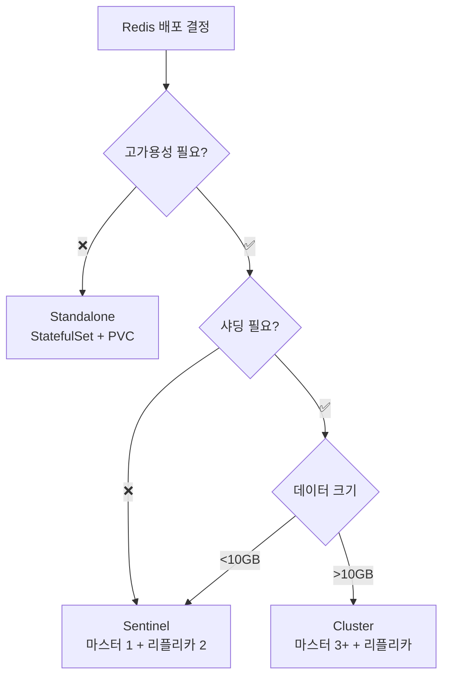

<!-- migrated: write/09_cloud/kubernetes/10-01.Redis Operator.md (2026-04-19) -->

# Ch10: Redis Operator로 Redis Cluster/Sentinel 운영하기

> 📌 **핵심 요약**
>
> Redis Operator는 Redis Cluster/Sentinel을 Kubernetes 네이티브 방식으로 관리하는 도구다. Standalone 배포는 StatefulSet만으로 가능하지만, 고가용성이 필요한 프로덕션 환경에서는 Sentinel(마스터 1개 + 자동 페일오버) 또는 Cluster(샤딩 + 고가용성)를 사용해야 한다. OpsTree Redis Operator는 CR(Custom Resource)로 Redis 인스턴스를 선언하면 Pod, Service, ConfigMap을 자동으로 생성하고 장애 발생 시 페일오버를 처리한다. minikube에서는 리소스 제약으로 Sentinel 모드를 추천하며, 클라이언트는 Sentinel discovery 또는 Cluster slots 프로토콜로 연결한다.

---

## 🎯 학습 목표

이번 챕터를 마치면 다음을 할 수 있다:

1. Redis Standalone/Sentinel/Cluster 모드의 차이를 설명할 수 있다.
2. OpsTree Redis Operator를 Helm으로 설치하고 Redis Sentinel CR을 배포할 수 있다.
3. Redis 마스터 Pod를 삭제했을 때 Sentinel이 자동으로 페일오버하는 과정을 관찰할 수 있다.
4. Redis Cluster CR을 정의하고 해시 슬롯 분배를 이해할 수 있다.
5. 클라이언트에서 Sentinel discovery 또는 Cluster 모드로 연결하는 방법을 설명할 수 있다.

---

## 📖 본문

### 1. 왜 Redis를 Kubernetes에 올리는가

Redis는 캐시, 세션 스토어, Pub/Sub, Rate Limiting 등 다양한 용도로 사용되는 인메모리 데이터 저장소다. 전통적으로 VM에 Redis 인스턴스를 직접 설치하고 운영했지만, Kubernetes 환경에서는 다음과 같은 이유로 Redis를 컨테이너로 올린다:

- **생명주기 통합**: 애플리케이션 Pod와 Redis Pod를 같은 Namespace에서 관리하면 네트워크 정책, Secret, ConfigMap을 일관되게 적용할 수 있다.
- **운영 자동화**: Redis 재시작, 스케일링, 버전 업그레이드를 Kubernetes API로 통합한다. Operator가 장애 감지와 페일오버를 자동화한다.
- **리소스 효율**: Pod의 CPU/메모리 제한과 QoS를 활용하여 멀티테넌시 환경에서 Redis 인스턴스를 안전하게 격리한다.
- **개발/스테이징 환경 복제**: Helm Chart로 Redis를 설치하면 개발 환경과 프로덕션 환경의 설정 차이를 최소화할 수 있다.

하지만 Kubernetes에 Redis를 올릴 때는 다음을 고려해야 한다:

1. **영속성(Persistence)**: Redis는 기본적으로 인메모리이지만, AOF/RDB 백업을 사용하면 PersistentVolume이 필요하다.
2. **네트워크 레이턴시**: Pod 네트워크(CNI)를 거치므로 베어메탈 대비 약간의 레이턴시 증가가 있다.
3. **고가용성 복잡도**: Sentinel/Cluster 모드는 여러 Pod를 조율해야 하므로 Standalone보다 설정이 복잡하다.

### 2. Redis 배포 모드 비교

Redis는 세 가지 배포 모드를 제공한다:

| 모드 | 구조 | 고가용성 | 샤딩 | 사용 사례 |
|------|------|---------|------|----------|
| **Standalone** | 단일 인스턴스 | ❌ | ❌ | 개발 환경, 간단한 캐시 |
| **Sentinel** | 마스터 1 + 리플리카 N + Sentinel 3 | ✅ (자동 페일오버) | ❌ | 세션 스토어, 중소규모 캐시 |
| **Cluster** | 마스터 3+ + 리플리카 N | ✅ (샤드별 페일오버) | ✅ (16384 슬롯) | 대규모 캐시, 샤딩 필요 시 |

#### Standalone
- **구조**: Redis 인스턴스 1개만 실행. StatefulSet으로 배포하고 PVC로 데이터를 보존할 수 있다.
- **장점**: 설정이 간단하고 리소스 사용이 적다.
- **단점**: 마스터가 죽으면 서비스 중단. 수동으로 Pod를 재시작해야 한다.
- **Kubernetes 배포**: `redis:7-alpine` 이미지를 StatefulSet으로 배포하고 Service로 노출.

#### Sentinel
- **구조**: 마스터 1개 + 리플리카 N개 + Sentinel 3개. Sentinel은 마스터를 모니터링하고 장애 시 리플리카를 마스터로 승격시킨다.
- **장점**: 자동 페일오버, 읽기 부하를 리플리카로 분산 가능.
- **단점**: 데이터는 단일 마스터에 집중되므로 샤딩 불가. 쓰기 성능은 마스터 1개에 제한.
- **Kubernetes 배포**: Redis Operator가 마스터/리플리카 StatefulSet + Sentinel Deployment를 생성하고, Sentinel Service를 통해 클라이언트가 현재 마스터를 발견한다.

#### Cluster
- **구조**: 최소 마스터 3개 (각각 0~16383 슬롯 중 일부를 담당) + 리플리카. 각 마스터는 샤드를 담당하고, 마스터가 죽으면 해당 샤드의 리플리카가 승격된다.
- **장점**: 수평 확장(샤딩) + 고가용성. 대규모 데이터를 여러 노드에 분산.
- **단점**: 멀티키 연산(MGET, 트랜잭션)이 제한되고, 클라이언트가 Cluster 프로토콜을 지원해야 한다.
- **Kubernetes 배포**: Redis Operator가 마스터 3 + 리플리카 3 StatefulSet을 생성하고, `redis-cli --cluster create`로 클러스터를 초기화한다.

#### 언제 어떤 모드를 선택할까?



- **개발/테스트 환경**: Standalone (minikube에서 1 Pod로 충분)
- **세션 스토어, 소규모 캐시**: Sentinel (자동 페일오버 + 읽기 부하 분산)
- **대규모 캐시, 샤딩 필요**: Cluster (데이터를 여러 노드에 분산)

### 3. Redis Operator 선택지

Kubernetes에서 Redis를 운영하는 방법은 세 가지다:

1. **Helm Chart (Bitnami)**: StatefulSet + ConfigMap으로 Redis를 배포. Sentinel/Cluster 모드를 지원하지만, 설정이 복잡하고 Day-2 Operation(장애 복구, 스케일링)은 수동.
2. **Spotahome Redis Operator**: 초기 Redis Operator 중 하나. Sentinel 모드만 지원하고 최근 업데이트가 적다.
3. **OpsTree Redis Operator**: Sentinel/Cluster 모두 지원, CR 기반 선언적 관리, 활발한 유지보수.

이번 챕터에서는 **OpsTree Redis Operator**를 사용한다. 이유는:

- **CR 기반 선언적 관리**: `kind: Redis` CR만 작성하면 Operator가 StatefulSet, Service, ConfigMap을 자동 생성.
- **Sentinel/Cluster 모두 지원**: `spec.mode: sentinel` 또는 `cluster`로 전환 가능.
- **장애 복구 자동화**: 마스터 Pod가 죽으면 Sentinel이 페일오버를 수행하고, Operator가 CR 상태를 업데이트.
- **활발한 커뮤니티**: GitHub 2k+ stars, 정기적 릴리스.

| Operator | Sentinel | Cluster | CR 관리 | 활성도 | 추천도 |
|----------|----------|---------|---------|--------|--------|
| Bitnami Helm | ✅ | ✅ | ❌ (Helm values) | 높음 | 중간 (수동 운영) |
| Spotahome | ✅ | ❌ | ✅ | 낮음 | 낮음 |
| **OpsTree** | ✅ | ✅ | ✅ | 높음 | **높음** |

### 4. OpsTree Redis Operator 설치

OpsTree Redis Operator는 Helm Chart로 설치한다. 이 Operator는 Cluster-scoped CRD를 생성하므로, 한 번 설치하면 모든 Namespace에서 Redis CR을 생성할 수 있다.

#### 4.1 Helm Repository 추가

```bash
helm repo add ot-helm https://ot-container-kit.github.io/helm-charts/
helm repo update
```

#### 4.2 Operator 설치

```bash
kubectl create namespace redis-operator
helm install redis-operator ot-helm/redis-operator \
  --namespace redis-operator \
  --set redisOperator.replicas=1
```

설치되는 리소스:
- **Deployment**: `redis-operator` (Operator Pod)
- **CRD**: `redis.redis.redis.opstreelabs.in`, `redisclusters.redis.redis.opstreelabs.in`, `redisreplications.redis.redis.opstreelabs.in`
- **RBAC**: ClusterRole, ClusterRoleBinding (Operator가 전체 클러스터의 Redis CR을 관리할 수 있도록)

확인:

```bash
kubectl get pods -n redis-operator
# NAME                              READY   STATUS    RESTARTS   AGE
# redis-operator-5f8c8b7d9c-x7k2m   1/1     Running   0          30s

kubectl get crd | grep redis
# redis.redis.redis.opstreelabs.in
# redisclusters.redis.redis.opstreelabs.in
# redisreplications.redis.redis.opstreelabs.in
```

### 5. Redis Sentinel CR 배포

Sentinel 모드는 마스터 1개 + 리플리카 2개 + Sentinel 3개로 구성된다. Sentinel은 마스터를 모니터링하고, 마스터가 30초 이상 응답하지 않으면 리플리카를 마스터로 승격시킨다.

#### 5.1 Redis CR 정의

```yaml
# redis-sentinel.yaml
apiVersion: redis.redis.opstreelabs.in/v1beta2
kind: Redis
metadata:
  name: redis-sentinel
  namespace: default
spec:
  kubernetesConfig:
    image: quay.io/opstree/redis:v7.0.12
    imagePullPolicy: IfNotPresent
    resources:
      requests:
        cpu: 100m
        memory: 128Mi
      limits:
        cpu: 200m
        memory: 256Mi
    redisSecret:
      name: redis-secret
      key: password
  storage:
    volumeClaimTemplate:
      spec:
        accessModes: ["ReadWriteOnce"]
        resources:
          requests:
            storage: 1Gi
  redisExporter:
    enabled: true
    image: quay.io/opstree/redis-exporter:v1.44.0
  redisConfig:
    additionalRedisConfig: |
      maxmemory 200mb
      maxmemory-policy allkeys-lru
  redisSentinel:
    enabled: true
    replicas: 3
    quorum: 2
    sentinelConfig:
      downAfterMilliseconds: 30000
      failoverTimeout: 180000
      parallelSyncs: 1
```

주요 필드:

- **`kubernetesConfig.image`**: Redis 이미지. OpsTree는 자체 이미지를 제공하지만, 공식 `redis:7-alpine`도 사용 가능.
- **`resources`**: Pod CPU/메모리 제한. minikube에서는 100m/128Mi로 충분.
- **`storage.volumeClaimTemplate`**: Redis 데이터를 PVC로 보존. AOF/RDB 백업이 이 볼륨에 저장된다.
- **`redisExporter`**: Prometheus 메트릭 수집. Grafana 대시보드에서 Redis 모니터링 가능.
- **`redisSentinel.enabled: true`**: Sentinel 모드 활성화.
- **`redisSentinel.replicas: 3`**: Sentinel Pod 3개. 쿼럼(quorum) 2로 설정하면 Sentinel 2개 이상이 동의해야 페일오버.
- **`redisSentinel.sentinelConfig.downAfterMilliseconds`**: 마스터가 30초 응답 없으면 장애로 판단.

#### 5.2 Secret 생성

Redis는 `requirepass` 설정으로 비밀번호를 요구한다. Secret을 먼저 생성해야 한다:

```bash
kubectl create secret generic redis-secret \
  --from-literal=password=my-redis-password \
  --namespace default
```

#### 5.3 CR 배포

```bash
kubectl apply -f redis-sentinel.yaml
```

Operator가 다음 리소스를 생성한다:

- **StatefulSet**: `redis-sentinel` (마스터 1 + 리플리카 2, 총 3 Pod)
- **Deployment**: `redis-sentinel-sentinel` (Sentinel 3 Pod)
- **Service**:
  - `redis-sentinel`: 마스터 Service (6379 포트)
  - `redis-sentinel-sentinel`: Sentinel Service (26379 포트)
  - `redis-sentinel-additional`: 헤드리스 Service (StatefulSet Pod discovery)
- **ConfigMap**: `redis-sentinel-config` (Redis/Sentinel 설정)

확인:

```bash
kubectl get pods
# NAME                                       READY   STATUS    RESTARTS   AGE
# redis-sentinel-0                           2/2     Running   0          1m
# redis-sentinel-1                           2/2     Running   0          50s
# redis-sentinel-2                           2/2     Running   0          40s
# redis-sentinel-sentinel-7d8f9c8d4b-5x2k7   1/1     Running   0          1m
# redis-sentinel-sentinel-7d8f9c8d4b-8q3l9   1/1     Running   0          1m
# redis-sentinel-sentinel-7d8f9c8d4b-m7n4k   1/1     Running   0          1m

kubectl get svc
# NAME                         TYPE        CLUSTER-IP      EXTERNAL-IP   PORT(S)              AGE
# redis-sentinel               ClusterIP   10.96.100.200   <none>        6379/TCP,9121/TCP    1m
# redis-sentinel-sentinel      ClusterIP   10.96.100.201   <none>        26379/TCP            1m
# redis-sentinel-additional    ClusterIP   None            <none>        6379/TCP             1m
```

각 Redis Pod는 2개 컨테이너를 실행한다:
1. **redis**: Redis 서버 (6379 포트)
2. **redis-exporter**: Prometheus 메트릭 (9121 포트)

Sentinel Pod는 1개 컨테이너만 실행한다:
1. **sentinel**: Redis Sentinel (26379 포트)

#### 5.4 마스터 확인

Sentinel에게 현재 마스터를 물어본다:

```bash
kubectl exec -it redis-sentinel-sentinel-7d8f9c8d4b-5x2k7 -- sh
# Sentinel Pod 내부

redis-cli -p 26379
sentinel master mymaster
# 1) "name"
# 2) "mymaster"
# 3) "ip"
# 4) "redis-sentinel-0.redis-sentinel-additional.default.svc.cluster.local"
# 5) "port"
# 6) "6379"
# ...
```

`redis-sentinel-0`이 마스터임을 확인. `redis-sentinel-1`, `redis-sentinel-2`는 리플리카다.

### 6. Redis Cluster CR 배포

Cluster 모드는 최소 마스터 3개가 필요하다. 각 마스터는 16384개 슬롯 중 일부를 담당하고, 클라이언트는 키의 해시를 계산하여 해당 슬롯을 담당하는 마스터에 요청을 보낸다.

#### 6.1 Redis Cluster CR 정의

```yaml
# redis-cluster.yaml
apiVersion: redis.redis.opstreelabs.in/v1beta2
kind: RedisCluster
metadata:
  name: redis-cluster
  namespace: default
spec:
  clusterSize: 3  # 마스터 3개
  clusterReplicas: 1  # 마스터당 리플리카 1개 (총 6 Pod)
  kubernetesConfig:
    image: quay.io/opstree/redis:v7.0.12
    imagePullPolicy: IfNotPresent
    resources:
      requests:
        cpu: 100m
        memory: 128Mi
      limits:
        cpu: 200m
        memory: 256Mi
    redisSecret:
      name: redis-secret
      key: password
  storage:
    volumeClaimTemplate:
      spec:
        accessModes: ["ReadWriteOnce"]
        resources:
          requests:
            storage: 1Gi
  redisExporter:
    enabled: true
    image: quay.io/opstree/redis-exporter:v1.44.0
  redisConfig:
    additionalRedisConfig: |
      cluster-enabled yes
      cluster-node-timeout 5000
      maxmemory 200mb
      maxmemory-policy allkeys-lru
```

주요 필드:

- **`clusterSize: 3`**: 마스터 3개. 각각 슬롯 0~5460, 5461~10922, 10923~16383을 담당.
- **`clusterReplicas: 1`**: 마스터당 리플리카 1개. 총 6 Pod (마스터 3 + 리플리카 3).
- **`redisConfig.additionalRedisConfig`**: `cluster-enabled yes`로 Cluster 모드 활성화.

#### 6.2 CR 배포

```bash
kubectl apply -f redis-cluster.yaml
```

Operator가 다음 리소스를 생성한다:

- **StatefulSet**: `redis-cluster-leader` (마스터 3 Pod), `redis-cluster-follower` (리플리카 3 Pod)
- **Service**:
  - `redis-cluster`: ClusterIP Service (6379 포트)
  - `redis-cluster-leader-headless`: 헤드리스 Service (마스터 Pod discovery)
  - `redis-cluster-follower-headless`: 헤드리스 Service (리플리카 Pod discovery)
- **ConfigMap**: `redis-cluster-config`

확인:

```bash
kubectl get pods
# NAME                        READY   STATUS    RESTARTS   AGE
# redis-cluster-leader-0      2/2     Running   0          2m
# redis-cluster-leader-1      2/2     Running   0          1m50s
# redis-cluster-leader-2      2/2     Running   0          1m40s
# redis-cluster-follower-0    2/2     Running   0          2m
# redis-cluster-follower-1    2/2     Running   0          1m50s
# redis-cluster-follower-2    2/2     Running   0          1m40s
```

#### 6.3 클러스터 초기화

Operator가 자동으로 `redis-cli --cluster create`를 실행하여 클러스터를 초기화한다. 하지만 수동으로 확인하려면:

```bash
kubectl exec -it redis-cluster-leader-0 -c redis -- sh
redis-cli --cluster info redis-cluster-leader-0.redis-cluster-leader-headless.default.svc.cluster.local:6379
# redis-cluster-leader-0.redis-cluster-leader-headless.default.svc.cluster.local:6379 (a1b2c3d4...) -> 0 keys | 5461 slots | 1 slaves.
# redis-cluster-leader-1.redis-cluster-leader-headless.default.svc.cluster.local:6379 (e5f6g7h8...) -> 0 keys | 5462 slots | 1 slaves.
# redis-cluster-leader-2.redis-cluster-leader-headless.default.svc.cluster.local:6379 (i9j0k1l2...) -> 0 keys | 5461 slots | 1 slaves.
```

각 마스터가 약 5461개 슬롯을 담당하고, 리플리카 1개씩 보유.

#### 6.4 해시 슬롯 동작

Redis Cluster는 키를 CRC16 해시로 변환하고 16384로 나눈 나머지를 슬롯 번호로 사용한다. 예를 들어:

```bash
SET user:1000 "Alice"
# CRC16("user:1000") % 16384 = 12345
# 슬롯 12345는 leader-2가 담당 → leader-2에 쓰기
```

클라이언트는 첫 요청 시 모든 노드에게 `CLUSTER SLOTS` 명령으로 슬롯 매핑을 받아오고, 이후 키를 직접 계산하여 해당 마스터에 요청을 보낸다. 만약 잘못된 노드에 요청하면 `-MOVED 12345 redis-cluster-leader-2:6379` 응답을 받고 리다이렉트한다.

### 7. 클라이언트 연결

#### 7.1 Sentinel 모드 연결

Sentinel 모드에서는 클라이언트가 Sentinel Service(26379 포트)에 연결하여 현재 마스터 주소를 받아온다. 이를 "Sentinel discovery"라고 한다.

**Go 클라이언트 예시 (go-redis)**:

```go
import "github.com/redis/go-redis/v9"

client := redis.NewFailoverClient(&redis.FailoverOptions{
    MasterName:    "mymaster",
    SentinelAddrs: []string{
        "redis-sentinel-sentinel.default.svc.cluster.local:26379",
    },
    Password:      "my-redis-password",
    DB:            0,
})

ctx := context.Background()
err := client.Set(ctx, "key", "value", 0).Err()
```

동작 과정:
1. 클라이언트가 Sentinel에게 `SENTINEL get-master-addr-by-name mymaster` 요청.
2. Sentinel이 현재 마스터 주소 반환 (`redis-sentinel-0.redis-sentinel-additional:6379`).
3. 클라이언트가 마스터에 연결하여 쓰기 수행.
4. 마스터가 죽으면 Sentinel이 페일오버 수행 → 클라이언트가 자동으로 새 마스터를 발견.

#### 7.2 Cluster 모드 연결

Cluster 모드에서는 클라이언트가 아무 노드에나 연결하여 `CLUSTER SLOTS`로 슬롯 매핑을 받아온다. 이후 키의 슬롯을 계산하여 해당 마스터에 직접 요청.

**Go 클라이언트 예시**:

```go
client := redis.NewClusterClient(&redis.ClusterOptions{
    Addrs: []string{
        "redis-cluster-leader-0.redis-cluster-leader-headless.default.svc.cluster.local:6379",
        "redis-cluster-leader-1.redis-cluster-leader-headless.default.svc.cluster.local:6379",
        "redis-cluster-leader-2.redis-cluster-leader-headless.default.svc.cluster.local:6379",
    },
    Password: "my-redis-password",
})

ctx := context.Background()
err := client.Set(ctx, "key", "value", 0).Err()
```

클라이언트는 3개 마스터 중 하나에 연결하여 슬롯 매핑을 캐시하고, 이후 요청은 해당 슬롯의 마스터로 직접 보낸다.

#### 7.3 Kubernetes Service vs Headless Service

- **ClusterIP Service** (`redis-sentinel`, `redis-cluster`): 여러 Pod를 로드밸런싱. 읽기 전용 연결에 유용 (리플리카로 분산).
- **Headless Service** (`redis-sentinel-additional`): DNS가 Pod IP를 직접 반환. StatefulSet Pod의 고정 DNS 이름 (`redis-sentinel-0.redis-sentinel-additional`) 제공.

Sentinel/Cluster 모드에서는 클라이언트가 특정 마스터에 연결해야 하므로, **Headless Service DNS 이름**을 사용한다.

### 8. 장애 테스트: Sentinel 자동 페일오버

Sentinel 모드의 핵심 기능은 마스터 장애 시 자동으로 리플리카를 마스터로 승격시키는 것이다. 이를 테스트해보자.

#### 8.1 현재 마스터 확인

```bash
kubectl exec -it redis-sentinel-sentinel-7d8f9c8d4b-5x2k7 -- redis-cli -p 26379 sentinel master mymaster | grep -E "^(name|ip|port)"
# name
# mymaster
# ip
# redis-sentinel-0.redis-sentinel-additional.default.svc.cluster.local
# port
# 6379
```

`redis-sentinel-0`이 마스터.

#### 8.2 마스터 Pod 삭제

```bash
kubectl delete pod redis-sentinel-0
# pod "redis-sentinel-0" deleted
```

#### 8.3 페일오버 관찰

Sentinel 로그를 확인:

```bash
kubectl logs redis-sentinel-sentinel-7d8f9c8d4b-5x2k7 -f
# +sdown master mymaster redis-sentinel-0.redis-sentinel-additional.default.svc.cluster.local 6379
# +odown master mymaster redis-sentinel-0.redis-sentinel-additional.default.svc.cluster.local 6379 #quorum 2/2
# +failover-triggered master mymaster redis-sentinel-0.redis-sentinel-additional.default.svc.cluster.local 6379
# +failover-state-select-slave master mymaster redis-sentinel-0.redis-sentinel-additional.default.svc.cluster.local 6379
# +selected-slave slave redis-sentinel-1.redis-sentinel-additional.default.svc.cluster.local:6379
# +failover-state-send-slaveof-noone slave redis-sentinel-1.redis-sentinel-additional.default.svc.cluster.local:6379
# +failover-state-wait-promotion slave redis-sentinel-1.redis-sentinel-additional.default.svc.cluster.local:6379
# +promoted-slave slave redis-sentinel-1.redis-sentinel-additional.default.svc.cluster.local:6379
# +failover-state-reconf-slaves master mymaster redis-sentinel-0.redis-sentinel-additional.default.svc.cluster.local 6379
# +slave-reconf-sent slave redis-sentinel-2.redis-sentinel-additional.default.svc.cluster.local:6379
# +slave-reconf-done slave redis-sentinel-2.redis-sentinel-additional.default.svc.cluster.local:6379
# +failover-end master mymaster redis-sentinel-0.redis-sentinel-additional.default.svc.cluster.local 6379
# +switch-master mymaster redis-sentinel-0.redis-sentinel-additional.default.svc.cluster.local 6379 redis-sentinel-1.redis-sentinel-additional.default.svc.cluster.local 6379
```

과정:
1. **+sdown**: Sentinel이 마스터 응답 없음 감지 (subjectively down).
2. **+odown**: Sentinel 2개 이상이 동의 (objectively down), 쿼럼 충족.
3. **+failover-triggered**: 페일오버 시작.
4. **+selected-slave**: `redis-sentinel-1`을 새 마스터로 선택.
5. **+failover-state-send-slaveof-noone**: `redis-sentinel-1`에게 `SLAVEOF NO ONE` 명령 (마스터로 승격).
6. **+promoted-slave**: `redis-sentinel-1`이 마스터로 승격 완료.
7. **+slave-reconf-sent**: 나머지 리플리카(`redis-sentinel-2`)에게 새 마스터를 따르라고 지시.
8. **+failover-end**: 페일오버 완료.
9. **+switch-master**: 마스터가 `redis-sentinel-1`로 변경.

#### 8.4 새 마스터 확인

```bash
kubectl exec -it redis-sentinel-sentinel-7d8f9c8d4b-5x2k7 -- redis-cli -p 26379 sentinel master mymaster | grep -E "^(name|ip|port)"
# name
# mymaster
# ip
# redis-sentinel-1.redis-sentinel-additional.default.svc.cluster.local
# port
# 6379
```

`redis-sentinel-1`이 새 마스터.

#### 8.5 원래 마스터 복구

StatefulSet이 `redis-sentinel-0`을 자동으로 재생성한다. 이 Pod는 리플리카로 합류한다:

```bash
kubectl get pods
# NAME                                       READY   STATUS    RESTARTS   AGE
# redis-sentinel-0                           2/2     Running   0          30s  # 리플리카로 복구
# redis-sentinel-1                           2/2     Running   0          10m  # 현재 마스터
# redis-sentinel-2                           2/2     Running   0          10m  # 리플리카
```

`redis-sentinel-0` 내부에서 확인:

```bash
kubectl exec -it redis-sentinel-0 -c redis -- redis-cli -a my-redis-password INFO replication | grep role
# role:slave
```

`redis-sentinel-0`은 이제 리플리카다. Sentinel이 `SLAVEOF redis-sentinel-1.redis-sentinel-additional 6379` 명령을 보내서 새 마스터를 따르도록 했다.

#### 8.6 Cluster 모드 페일오버

Cluster 모드에서는 Sentinel 없이도 마스터 장애 시 자동 페일오버가 발생한다. 각 마스터의 리플리카가 마스터를 모니터링하고, 마스터가 죽으면 리플리카가 마스터로 승격된다.

```bash
kubectl delete pod redis-cluster-leader-0
```

30초 후 `redis-cluster-follower-0`이 마스터로 승격된다. 클라이언트는 `CLUSTER SLOTS` 응답 업데이트로 새 마스터를 발견한다.

### 9. minikube 고려사항

minikube는 단일 노드 클러스터이므로 Redis Cluster의 6 Pod(마스터 3 + 리플리카 3)을 실행하면 리소스가 부족할 수 있다. 다음을 권장한다:

#### 9.1 Sentinel 모드 선택

- **Sentinel 모드**: 총 6 Pod (Redis 3 + Sentinel 3). 각 Redis Pod는 100m CPU + 128Mi 메모리 → 총 600m CPU + 768Mi 메모리.
- **Cluster 모드**: 총 6 Pod (마스터 3 + 리플리카 3). 리소스는 Sentinel과 비슷하지만, Cluster 프로토콜 오버헤드가 추가.

minikube에서는 **Sentinel 모드**를 추천한다. 이유는:
1. Pod 수가 같지만, Sentinel이 경량 프로세스(Redis Exporter보다 가벼움).
2. 클라이언트 라이브러리가 Sentinel discovery를 더 잘 지원 (Cluster 프로토콜은 일부 언어에서 미지원).
3. 개발 환경에서는 샤딩이 필요 없다. Sentinel의 자동 페일오버만 테스트하면 충분.

#### 9.2 리소스 제한 완화

minikube에서 메모리 부족 시 Redis Pod의 리소스 제한을 줄인다:

```yaml
resources:
  requests:
    cpu: 50m
    memory: 64Mi
  limits:
    cpu: 100m
    memory: 128Mi
```

또는 Redis Exporter를 비활성화:

```yaml
redisExporter:
  enabled: false
```

이렇게 하면 각 Redis Pod가 단일 컨테이너만 실행하여 메모리 사용량이 50% 감소.

#### 9.3 Ephemeral Storage

minikube에서는 PVC를 프로비저닝할 수 없을 수 있다. 이 경우 `emptyDir`로 대체:

```yaml
storage:
  volumeMode: Filesystem
  emptyDir: {}
```

단, Pod가 재시작되면 데이터가 사라진다. 개발 환경에서는 문제없지만, 프로덕션에서는 PVC 필수.

### 10. 정리

이번 챕터에서는 Redis Operator로 Redis Sentinel/Cluster를 Kubernetes에 배포하는 방법을 배웠다. 핵심 내용:

1. **Redis 배포 모드**: Standalone(개발), Sentinel(자동 페일오버), Cluster(샤딩 + 고가용성).
2. **OpsTree Redis Operator**: CR 기반 선언적 관리. Sentinel/Cluster 모두 지원.
3. **Sentinel 모드**: 마스터 1 + 리플리카 2 + Sentinel 3. Sentinel이 마스터 장애 감지 → 리플리카 승격.
4. **Cluster 모드**: 마스터 3 + 리플리카 3. 16384 슬롯을 마스터가 분담. 클라이언트가 슬롯 매핑 캐시.
5. **클라이언트 연결**: Sentinel discovery(26379 포트) 또는 Cluster slots(6379 포트).
6. **장애 테스트**: 마스터 Pod 삭제 → Sentinel/Cluster가 30초 내 페일오버.
7. **minikube**: Sentinel 모드 추천, 리소스 제한 완화, Ephemeral storage.

다음 챕터에서는 Strimzi Kafka Operator로 Kafka 클러스터를 배포하고, KRaft 모드(ZooKeeper 제거)를 실습한다. Kafka는 Redis보다 훨씬 무거우므로, minikube에서는 1 broker + ephemeral storage로 시작한다.

**실습 체크포인트**:
- [ ] OpsTree Redis Operator를 Helm으로 설치했다.
- [ ] Redis Sentinel CR을 배포하고 마스터/리플리카/Sentinel Pod를 확인했다.
- [ ] Sentinel에게 현재 마스터를 조회했다.
- [ ] 마스터 Pod를 삭제하고 Sentinel이 페일오버하는 로그를 확인했다.
- [ ] 새 마스터가 승격되고, 원래 마스터가 리플리카로 복구되는 것을 확인했다.
- [ ] (선택) Redis Cluster CR을 배포하고 `CLUSTER INFO`로 슬롯 분배를 확인했다.
