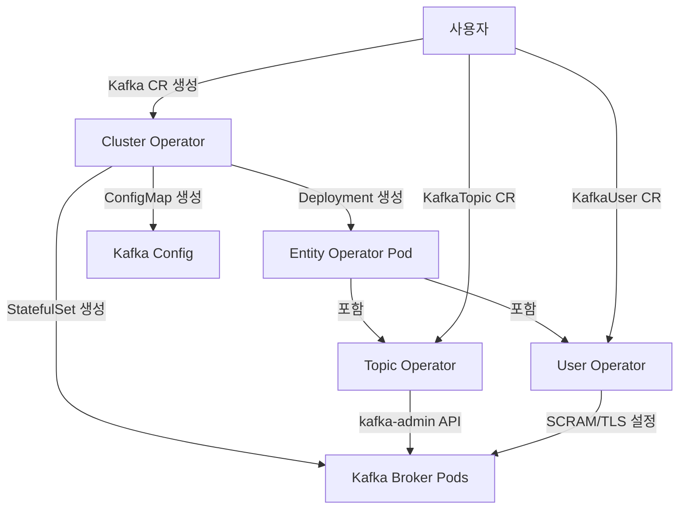

# Ch11: Strimzi Kafka Operator로 Kafka 클러스터 관리하기

> 📌 **핵심 요약**
>
> Strimzi는 Kafka를 Kubernetes 네이티브 방식으로 운영하는 CNCF Sandbox 프로젝트다. Kafka CR(Custom Resource)로 브로커 수, 리스너, 스토리지, 리소스를 선언하면 Cluster Operator가 StatefulSet, Service, ConfigMap을 자동 생성한다. Kafka 4.0부터 기본이 될 KRaft 모드는 ZooKeeper를 제거하고 Kafka 자체가 메타데이터를 관리하여 아키텍처를 단순화한다. Strimzi는 KafkaTopic/KafkaUser CR로 토픽과 사용자를 선언적으로 관리하고, Kafka Connect/MirrorMaker2 CR로 데이터 통합 파이프라인을 구축할 수 있다. minikube에서는 리소스 제약으로 1 broker + ephemeral storage를 추천한다.

---

## 🎯 학습 목표

이번 챕터를 마치면 다음을 할 수 있다:

1. Kafka를 Kubernetes에 올리는 이유와 Strimzi의 장점을 설명할 수 있다.
2. Strimzi Operator 아키텍처(Cluster/Entity/Topic/User Operator)를 이해할 수 있다.
3. Kafka CR을 정의하고 KRaft 모드로 Kafka 클러스터를 배포할 수 있다.
4. KafkaTopic CR로 토픽을 생성하고, kafka-console-producer/consumer로 메시지를 송수신할 수 있다.
5. Kafka listener 타입(internal, route, nodeport, loadbalancer)의 차이를 설명할 수 있다.
6. minikube에서 1 broker Kafka의 한계를 이해하고, 프로덕션 설정과 비교할 수 있다.

---

## 📖 본문

### 1. 왜 Kafka를 Kubernetes에 올리는가

Apache Kafka는 분산 이벤트 스트리밍 플랫폼으로, 대규모 메시지 처리, 이벤트 소싱, CDC(Change Data Capture), 로그 수집 등에 사용된다. 전통적으로 VM에 Kafka 클러스터를 직접 구축했지만, Kubernetes 환경에서는 다음 이유로 컨테이너화한다:

- **오케스트레이션 통합**: Kafka 브로커, ZooKeeper/KRaft, Kafka Connect, Schema Registry를 Kubernetes Pod로 관리하면 스케일링, 재시작, 롤링 업데이트를 Kubernetes API로 통합할 수 있다.
- **선언적 관리**: Kafka 클러스터를 YAML로 정의하고, GitOps(Argo CD, Flux)로 버전 관리. 환경 간 설정 차이를 최소화.
- **리소스 격리**: 멀티테넌시 환경에서 Namespace, ResourceQuota, LimitRange로 Kafka 클러스터를 격리.
- **관측성 통합**: Prometheus, Grafana, Jaeger와 통합하여 Kafka 메트릭, 로그, 트레이스를 중앙 집중식으로 수집.

하지만 Kafka를 Kubernetes에 올릴 때는 다음을 고려해야 한다:

1. **스토리지 성능**: Kafka는 디스크 I/O가 중요. PersistentVolume의 성능(IOPS, 처리량)이 프로덕션 요구사항을 충족하는지 확인 필요.
2. **네트워크 레이턴시**: Pod 네트워크와 Service 계층을 거치므로 베어메탈 대비 약간의 레이턴시 증가.
3. **StatefulSet 복잡도**: Kafka는 브로커 ID와 데이터가 고정되어야 하므로 StatefulSet 필수. Pod가 재스케줄되면 같은 PVC를 재사용해야 함.

#### Confluent vs Strimzi

Kafka를 Kubernetes에서 운영하는 방법은 크게 두 가지다:

| 항목 | Confluent for Kubernetes | Strimzi |
|------|--------------------------|---------|
| **라이선스** | 상용(Confluent Platform) | Apache 2.0 (오픈소스) |
| **Kafka 버전** | Confluent Kafka (Apache Kafka 포크) | Apache Kafka (공식) |
| **추가 기능** | Schema Registry, ksqlDB, Control Center | Kafka Connect, MirrorMaker2 |
| **커뮤니티** | Confluent 주도 | CNCF Sandbox, Red Hat 주도 |
| **KRaft 지원** | ✅ | ✅ |
| **가격** | 브로커당 과금 (엔터프라이즈) | 무료 |

이번 챕터에서는 **Strimzi**를 사용한다. 이유는:

- **오픈소스**: Apache 2.0 라이선스, 상용 라이선스 없음.
- **공식 Kafka**: Confluent 포크가 아닌 Apache Kafka 공식 배포판 사용.
- **CNCF Sandbox**: Kubernetes 생태계에서 인정받은 프로젝트.
- **활발한 커뮤니티**: Red Hat, IBM 등이 기여, 정기적 릴리스.

### 2. Strimzi 소개

Strimzi는 Kubernetes Operator 패턴으로 Kafka를 관리하는 오픈소스 프로젝트다. 2018년 시작되어 2021년 CNCF Sandbox에 진입했고, 현재 GitHub 4.5k+ stars를 보유한다.

Strimzi는 다음을 제공한다:

1. **Kafka Operator**: Kafka 클러스터(브로커 + KRaft/ZooKeeper) 관리.
2. **Topic Operator**: KafkaTopic CR로 토픽 생명주기 관리.
3. **User Operator**: KafkaUser CR로 사용자 인증/권한 관리.
4. **Kafka Connect Operator**: Kafka Connect 클러스터 관리(소스/싱크 커넥터).
5. **MirrorMaker2 Operator**: 클러스터 간 데이터 미러링.

Strimzi의 핵심 개념은 **CR(Custom Resource) 기반 선언적 관리**다. 예를 들어:

```yaml
apiVersion: kafka.strimzi.io/v1beta2
kind: Kafka
metadata:
  name: my-cluster
spec:
  kafka:
    replicas: 3
    listeners:
      - name: plain
        port: 9092
        type: internal
```

이 CR을 생성하면 Strimzi Operator가 StatefulSet, Service, ConfigMap을 자동으로 생성하고, 브로커 3개를 시작한다.

### 3. Strimzi 아키텍처

Strimzi는 여러 Operator로 구성되어 있으며, 각 Operator는 특정 리소스를 관리한다.



#### 3.1 Cluster Operator

Cluster Operator는 Strimzi의 핵심 Operator다. 다음 CR을 감시한다:

- **Kafka**: Kafka 클러스터(브로커 + KRaft/ZooKeeper) 배포 및 관리.
- **KafkaConnect**: Kafka Connect 클러스터 배포.
- **KafkaMirrorMaker2**: 클러스터 간 미러링.
- **KafkaBridge**: HTTP REST API로 Kafka 접근.
- **KafkaRebalance**: Cruise Control로 파티션 리밸런싱.

Cluster Operator는 Kafka CR을 읽고 다음을 생성한다:

1. **StatefulSet**: Kafka 브로커 Pod (또는 KRaft Controller/Broker)
2. **Service**:
   - `my-cluster-kafka-bootstrap`: 클라이언트가 연결하는 Service (9092 포트)
   - `my-cluster-kafka-brokers`: 헤드리스 Service (브로커 간 통신)
3. **ConfigMap**: Kafka 설정 (`server.properties`)
4. **Secret**: TLS 인증서, SCRAM 비밀번호
5. **PVC**: 브로커당 PVC (로그 세그먼트 저장)

#### 3.2 Entity Operator

Entity Operator는 단일 Pod에서 Topic Operator와 User Operator를 실행한다. Cluster Operator가 Kafka CR을 생성할 때 Entity Operator Deployment도 자동으로 생성한다.

**Topic Operator**:
- **역할**: KafkaTopic CR을 감시하고, Kafka Admin API로 토픽 생성/수정/삭제.
- **양방향 동기화**: CR → Kafka 토픽 생성, Kafka 토픽 변경 → CR 상태 업데이트.
- **충돌 방지**: `kafka-topics.sh`로 직접 토픽을 생성하면 CR과 충돌 가능. Strimzi 사용 시 KafkaTopic CR만 사용 권장.

**User Operator**:
- **역할**: KafkaUser CR을 감시하고, 사용자 인증(SCRAM-SHA-512, TLS mTLS) 및 권한(ACL) 설정.
- **Secret 생성**: SCRAM 사용자 생성 시 비밀번호를 Secret으로 저장. 클라이언트는 이 Secret을 마운트하여 인증.

#### 3.3 Operator 간 관계

| Operator | 관리 대상 | 생성 리소스 | 예시 CR |
|----------|----------|------------|---------|
| **Cluster Operator** | Kafka 클러스터 | StatefulSet, Service, ConfigMap | `Kafka`, `KafkaConnect` |
| **Topic Operator** | Kafka 토픽 | (Kafka 내부 토픽) | `KafkaTopic` |
| **User Operator** | Kafka 사용자 | Secret (SCRAM 비밀번호) | `KafkaUser` |

### 4. Strimzi 설치

Strimzi는 Helm Chart 또는 YAML 매니페스트로 설치할 수 있다. Helm을 추천한다.

#### 4.1 Helm Repository 추가

```bash
helm repo add strimzi https://strimzi.io/charts/
helm repo update
```

#### 4.2 Cluster Operator 설치

```bash
kubectl create namespace kafka
helm install strimzi-kafka-operator strimzi/strimzi-kafka-operator \
  --namespace kafka \
  --set watchNamespaces="{kafka}" \
  --set logLevel=INFO
```

주요 옵션:

- **`watchNamespaces`**: Operator가 감시할 Namespace. `{kafka}`로 설정하면 kafka Namespace만 감시. 전체 클러스터를 감시하려면 빈 문자열(`""`) 사용.
- **`logLevel`**: Operator 로그 레벨. DEBUG, INFO, WARN, ERROR 중 선택.

설치되는 리소스:

- **Deployment**: `strimzi-cluster-operator` (Cluster Operator Pod)
- **CRD**: `kafkas.kafka.strimzi.io`, `kafkatopics.kafka.strimzi.io`, `kafkausers.kafka.strimzi.io`, `kafkaconnects.kafka.strimzi.io`, `kafkamirrormaker2s.kafka.strimzi.io` 등
- **RBAC**: ClusterRole, ClusterRoleBinding (Operator가 Kafka CR을 관리할 수 있도록)

확인:

```bash
kubectl get pods -n kafka
# NAME                                        READY   STATUS    RESTARTS   AGE
# strimzi-cluster-operator-7d8b9c8d4b-x7k2m   1/1     Running   0          30s

kubectl get crd | grep strimzi
# kafkas.kafka.strimzi.io
# kafkatopics.kafka.strimzi.io
# kafkausers.kafka.strimzi.io
# kafkaconnects.kafka.strimzi.io
# kafkamirrormaker2s.kafka.strimzi.io
```

### 5. Kafka CR 정의 (KRaft 모드)

Kafka 4.0부터는 ZooKeeper가 제거되고 KRaft(Kafka Raft)가 기본이 된다. KRaft 모드는 Kafka 브로커가 Raft 프로토콜로 메타데이터를 관리하여 아키텍처를 단순화한다.

#### 5.1 KRaft vs ZooKeeper 비교

| 항목 | ZooKeeper 모드 | KRaft 모드 |
|------|---------------|-----------|
| **메타데이터 저장** | ZooKeeper (별도 클러스터) | Kafka 자체 (Raft 로그) |
| **아키텍처** | Kafka 브로커 + ZooKeeper 앙상블 | Kafka 브로커/컨트롤러 통합 |
| **복잡도** | 높음 (2개 시스템 운영) | 낮음 (단일 시스템) |
| **파티션 수 제한** | ~20만 (ZooKeeper 메모리 제약) | 수백만 (Raft 로그) |
| **리더 선출 속도** | 느림 (수초) | 빠름 (수백ms) |
| **Kafka 버전** | 3.x 이하 기본 | 3.3+ (실험), 4.0+ (기본) |

KRaft 모드의 장점:

1. **단일 시스템**: ZooKeeper를 제거하여 운영 복잡도 감소. 브로커와 컨트롤러를 통합하거나 분리 가능.
2. **메타데이터 확장성**: Raft 로그는 ZooKeeper보다 파티션 수 제한이 크다. 수백만 파티션 지원.
3. **빠른 페일오버**: 리더 선출이 수백ms로 단축되어 고가용성 향상.
4. **간단한 배포**: Pod 수 감소 (ZooKeeper 3 Pod 제거).

#### 5.2 KRaft 모드 Kafka CR

```yaml
# kafka-kraft.yaml
apiVersion: kafka.strimzi.io/v1beta2
kind: Kafka
metadata:
  name: my-cluster
  namespace: kafka
spec:
  kafka:
    version: 3.8.0
    replicas: 1  # minikube에서는 1 broker
    listeners:
      - name: plain
        port: 9092
        type: internal
        tls: false
      - name: tls
        port: 9093
        type: internal
        tls: true
    config:
      offsets.topic.replication.factor: 1  # 1 broker이므로 replication factor 1
      transaction.state.log.replication.factor: 1
      transaction.state.log.min.isr: 1
      default.replication.factor: 1
      min.insync.replicas: 1
      log.retention.hours: 168
      log.segment.bytes: 1073741824
      compression.type: producer
    storage:
      type: ephemeral  # minikube에서는 ephemeral, 프로덕션은 persistent-claim
    resources:
      requests:
        memory: 512Mi
        cpu: 250m
      limits:
        memory: 1Gi
        cpu: 500m
    metricsConfig:
      type: jmxPrometheusExporter
      valueFrom:
        configMapKeyRef:
          name: kafka-metrics
          key: kafka-metrics-config.yml
  entityOperator:
    topicOperator:
      resources:
        requests:
          memory: 128Mi
          cpu: 100m
        limits:
          memory: 256Mi
          cpu: 200m
    userOperator:
      resources:
        requests:
          memory: 128Mi
          cpu: 100m
        limits:
          memory: 256Mi
          cpu: 200m
```

주요 필드:

- **`kafka.version`**: Kafka 버전. 3.3+ 이상이면 KRaft 모드 사용 가능.
- **`kafka.replicas`**: 브로커 수. minikube에서는 1, 프로덕션에서는 3+ 권장.
- **`kafka.listeners`**: 클라이언트 연결 리스너. `plain`(암호화 없음), `tls`(TLS 암호화) 등.
- **`kafka.config`**: Kafka 설정. `server.properties`에 들어갈 내용.
  - `offsets.topic.replication.factor`: __consumer_offsets 토픽의 복제 계수. 1 broker이므로 1로 설정.
  - `default.replication.factor`: 새 토픽의 기본 복제 계수.
  - `min.insync.replicas`: 프로듀서가 `acks=all` 사용 시 최소 ISR(In-Sync Replica) 수.
- **`kafka.storage`**: 스토리지 타입.
  - `ephemeral`: emptyDir (Pod 재시작 시 데이터 손실)
  - `persistent-claim`: PVC (데이터 보존)
  - `jbod`: 여러 디스크를 JBOD(Just a Bunch Of Disks)로 사용
- **`kafka.resources`**: Pod CPU/메모리 제한.
- **`kafka.metricsConfig`**: Prometheus 메트릭 수집 설정. JMX Exporter를 사이드카로 실행.
- **`entityOperator`**: Topic Operator와 User Operator 활성화. 리소스 제한 설정.

#### 5.3 KRaft 메타데이터 디렉토리

KRaft 모드는 기본적으로 활성화된다. Strimzi 0.32+ 버전에서 Kafka 3.3+ 사용 시 자동으로 KRaft 모드로 전환된다. ZooKeeper 모드를 사용하려면 명시적으로 `spec.zookeeper` 섹션을 추가해야 한다.

KRaft 모드에서는 브로커가 두 역할을 할 수 있다:

1. **Controller**: 메타데이터(토픽, 파티션, 설정)를 Raft 로그로 관리. 리더 선출, 클러스터 상태 유지.
2. **Broker**: 클라이언트 요청 처리, 로그 세그먼트 저장.

Strimzi는 기본적으로 **Combined 모드**(브로커 + 컨트롤러 통합)를 사용한다. 3 broker 클러스터에서는 3개 브로커가 모두 컨트롤러 역할도 수행한다.

프로덕션에서는 **Dedicated 모드**(컨트롤러 전용 Pod)를 사용할 수 있지만, Strimzi에서는 이를 직접 설정하기 어렵다. Kafka 4.0 이후 Strimzi 업데이트를 기다려야 한다.

#### 5.4 Listener 타입

Kafka listener는 클라이언트가 브로커에 연결하는 방법을 정의한다. Strimzi는 다음 타입을 지원한다:

| 타입 | 설명 | 사용 사례 | 프로덕션 |
|------|------|----------|---------|
| **internal** | ClusterIP Service | Pod 간 통신 | ✅ |
| **route** | OpenShift Route | 클러스터 외부 접근 (OpenShift 전용) | ✅ |
| **nodeport** | NodePort Service | 클러스터 외부 접근 (NodePort) | ⚠️ (개발) |
| **loadbalancer** | LoadBalancer Service | 클러스터 외부 접근 (Cloud LB) | ✅ |
| **ingress** | Ingress | 클러스터 외부 접근 (Ingress Controller) | ✅ |

**internal**: Kafka를 클러스터 내부 Pod만 사용하는 경우. ClusterIP Service(`my-cluster-kafka-bootstrap:9092`)로 노출.

**loadbalancer**: AWS ELB, GCP Load Balancer, Azure Load Balancer를 사용하여 외부 접근. 각 브로커당 LoadBalancer Service 생성.

**nodeport**: NodePort로 외부 접근. minikube에서 테스트용으로 사용 가능.

**route**: OpenShift에서 Route 리소스로 외부 접근. Kubernetes에서는 지원 안 됨.

**ingress**: Nginx Ingress Controller 등으로 외부 접근. TLS Passthrough 필요.

minikube에서는 **internal**만 사용한다. 외부 접근이 필요하면 `kubectl port-forward`로 로컬 포트를 포워딩:

```bash
kubectl port-forward svc/my-cluster-kafka-bootstrap 9092:9092 -n kafka
```

#### 5.5 메트릭 ConfigMap 생성

Kafka 메트릭을 Prometheus로 수집하려면 JMX Exporter 설정을 ConfigMap으로 생성해야 한다:

```yaml
# kafka-metrics-config.yaml
apiVersion: v1
kind: ConfigMap
metadata:
  name: kafka-metrics
  namespace: kafka
data:
  kafka-metrics-config.yml: |
    lowercaseOutputName: true
    rules:
    - pattern: kafka.server<type=(.+), name=(.+), clientId=(.+), topic=(.+), partition=(.*)><>Value
      name: kafka_server_$1_$2
      labels:
        clientId: "$3"
        topic: "$4"
        partition: "$5"
    - pattern: kafka.server<type=(.+), name=(.+), clientId=(.+), brokerHost=(.+), brokerPort=(.+)><>Value
      name: kafka_server_$1_$2
      labels:
        clientId: "$3"
        broker: "$4:$5"
```

이 ConfigMap을 먼저 생성한 후 Kafka CR을 배포해야 한다.

#### 5.6 Kafka CR 배포

```bash
kubectl apply -f kafka-metrics-config.yaml
kubectl apply -f kafka-kraft.yaml
```

Cluster Operator가 다음 리소스를 생성한다:

- **StatefulSet**: `my-cluster-kafka` (브로커 1 Pod)
- **Service**:
  - `my-cluster-kafka-bootstrap`: ClusterIP (9092, 9093 포트, 클라이언트 연결)
  - `my-cluster-kafka-brokers`: 헤드리스 Service (브로커 간 통신)
- **Deployment**: `my-cluster-entity-operator` (Topic Operator + User Operator)
- **ConfigMap**: `my-cluster-kafka-config` (server.properties)
- **Secret**: `my-cluster-cluster-ca-cert`, `my-cluster-clients-ca-cert` (TLS 인증서)

확인:

```bash
kubectl get pods -n kafka
# NAME                                          READY   STATUS    RESTARTS   AGE
# my-cluster-entity-operator-5f8c8b7d9c-x7k2m   2/2     Running   0          2m
# my-cluster-kafka-0                            1/1     Running   0          3m

kubectl get svc -n kafka
# NAME                          TYPE        CLUSTER-IP      EXTERNAL-IP   PORT(S)                      AGE
# my-cluster-kafka-bootstrap    ClusterIP   10.96.100.200   <none>        9092/TCP,9093/TCP            3m
# my-cluster-kafka-brokers      ClusterIP   None            <none>        9090/TCP,9091/TCP,9092/TCP   3m
```

`my-cluster-kafka-0` Pod는 단일 컨테이너(Kafka 브로커)를 실행한다. `my-cluster-entity-operator` Pod는 2개 컨테이너(Topic Operator + User Operator)를 실행한다.

### 6. KRaft 모드와 ZooKeeper 모드의 차이

#### 6.1 아키텍처 차이

**ZooKeeper 모드**:
```
Kafka 브로커 3개 (StatefulSet)
  ↓ 메타데이터 저장/읽기
ZooKeeper 앙상블 3개 (StatefulSet)
```

**KRaft 모드**:
```
Kafka 브로커 3개 (StatefulSet)
  - 각 브로커가 컨트롤러 역할도 수행
  - Raft 로그로 메타데이터 관리
```

ZooKeeper 모드는 Kafka CR에 `spec.zookeeper` 섹션을 추가한다:

```yaml
apiVersion: kafka.strimzi.io/v1beta2
kind: Kafka
metadata:
  name: my-cluster
spec:
  kafka:
    replicas: 3
    # ... Kafka 설정
  zookeeper:
    replicas: 3
    storage:
      type: persistent-claim
      size: 10Gi
    resources:
      requests:
        memory: 512Mi
        cpu: 250m
```

Cluster Operator가 ZooKeeper StatefulSet(`my-cluster-zookeeper`)도 생성한다. 총 6 Pod(Kafka 3 + ZooKeeper 3).

KRaft 모드는 `spec.zookeeper` 섹션이 없으면 자동으로 활성화된다. 총 3 Pod(Kafka 3)만 필요.

#### 6.2 메타데이터 관리 차이

**ZooKeeper 모드**:
- 토픽, 파티션, 리더, ISR, ACL 등 메타데이터를 ZooKeeper에 저장.
- 브로커가 시작될 때 ZooKeeper에 등록, 종료될 때 해제.
- 컨트롤러 브로커가 ZooKeeper Watch로 메타데이터 변경을 감지하고 다른 브로커에게 전파.

**KRaft 모드**:
- 메타데이터를 Raft 로그(`__cluster_metadata` 토픽)에 저장.
- 컨트롤러 쿼럼(3개 중 과반수)이 Raft 프로토콜로 합의.
- 브로커는 컨트롤러로부터 메타데이터를 스트리밍으로 수신.

#### 6.3 리더 선출 차이

**ZooKeeper 모드**:
- 컨트롤러 브로커가 ZooKeeper에 임시 노드(`/controller`)를 생성.
- 컨트롤러가 죽으면 ZooKeeper Watch로 감지, 다른 브로커가 경쟁(race)하여 새 컨트롤러 선출.
- 선출 시간: 수초.

**KRaft 모드**:
- 컨트롤러 쿼럼이 Raft 프로토콜로 리더 선출.
- 리더가 죽으면 과반수 투표로 새 리더 선출.
- 선출 시간: 수백ms.

### 7. KafkaTopic CR과 KafkaUser CR

#### 7.1 KafkaTopic CR

KafkaTopic CR로 토픽을 선언적으로 관리할 수 있다. Topic Operator가 CR을 감시하고 Kafka Admin API로 토픽을 생성한다.

```yaml
# kafka-topic.yaml
apiVersion: kafka.strimzi.io/v1beta2
kind: KafkaTopic
metadata:
  name: my-topic
  namespace: kafka
  labels:
    strimzi.io/cluster: my-cluster  # Kafka 클러스터 이름
spec:
  partitions: 3
  replicas: 1  # 1 broker이므로 1
  config:
    retention.ms: 604800000  # 7일
    segment.bytes: 1073741824  # 1GB
    compression.type: producer
```

배포:

```bash
kubectl apply -f kafka-topic.yaml
```

Topic Operator가 Kafka에 토픽을 생성하고, CR 상태를 업데이트한다:

```bash
kubectl get kafkatopic -n kafka
# NAME       CLUSTER      PARTITIONS   REPLICATION FACTOR   READY
# my-topic   my-cluster   3            1                    True
```

토픽 확인:

```bash
kubectl exec -it my-cluster-kafka-0 -n kafka -- bin/kafka-topics.sh \
  --bootstrap-server localhost:9092 \
  --describe --topic my-topic
# Topic: my-topic	PartitionCount: 3	ReplicationFactor: 1	Configs: segment.bytes=1073741824,retention.ms=604800000,compression.type=producer
# 	Topic: my-topic	Partition: 0	Leader: 0	Replicas: 0	Isr: 0
# 	Topic: my-topic	Partition: 1	Leader: 0	Replicas: 0	Isr: 0
# 	Topic: my-topic	Partition: 2	Leader: 0	Replicas: 0	Isr: 0
```

모든 파티션의 리더가 브로커 0(1 broker이므로).

#### 7.2 KafkaUser CR (SCRAM 인증)

KafkaUser CR로 사용자 인증과 ACL을 관리할 수 있다. 먼저 Kafka CR의 listener에 인증을 활성화해야 한다:

```yaml
# kafka-kraft.yaml 수정
spec:
  kafka:
    listeners:
      - name: plain
        port: 9092
        type: internal
        tls: false
        authentication:
          type: scram-sha-512  # SCRAM-SHA-512 인증 활성화
    authorization:
      type: simple  # ACL 활성화
```

Kafka CR 업데이트:

```bash
kubectl apply -f kafka-kraft.yaml
```

Cluster Operator가 Rolling Update를 수행하여 인증을 활성화한다.

KafkaUser CR 생성:

```yaml
# kafka-user.yaml
apiVersion: kafka.strimzi.io/v1beta2
kind: KafkaUser
metadata:
  name: my-user
  namespace: kafka
  labels:
    strimzi.io/cluster: my-cluster
spec:
  authentication:
    type: scram-sha-512
  authorization:
    type: simple
    acls:
      - resource:
          type: topic
          name: my-topic
        operations: [Read, Write, Describe]
      - resource:
          type: group
          name: my-consumer-group
        operations: [Read]
```

배포:

```bash
kubectl apply -f kafka-user.yaml
```

User Operator가 SCRAM 사용자를 생성하고, Secret(`my-user`)에 비밀번호를 저장한다:

```bash
kubectl get secret my-user -n kafka -o jsonpath='{.data.password}' | base64 -d
# (랜덤 비밀번호 출력)
```

클라이언트는 이 Secret을 마운트하여 인증할 수 있다.

### 8. Kafka Connect와 MirrorMaker2

#### 8.1 Kafka Connect

Kafka Connect는 외부 시스템(DB, 파일, API)과 Kafka 간 데이터 통합 프레임워크다. 소스 커넥터(DB → Kafka), 싱크 커넥터(Kafka → DB)로 CDC, ETL 파이프라인을 구축한다.

Strimzi는 KafkaConnect CR로 Kafka Connect 클러스터를 배포한다:

```yaml
apiVersion: kafka.strimzi.io/v1beta2
kind: KafkaConnect
metadata:
  name: my-connect
  namespace: kafka
spec:
  replicas: 1
  bootstrapServers: my-cluster-kafka-bootstrap:9092
  config:
    group.id: my-connect-cluster
    offset.storage.topic: connect-cluster-offsets
    config.storage.topic: connect-cluster-configs
    status.storage.topic: connect-cluster-status
```

Cluster Operator가 Kafka Connect Deployment를 생성한다. 커넥터는 Kafka Connect REST API로 배포한다.

#### 8.2 MirrorMaker2

MirrorMaker2는 클러스터 간 데이터 미러링 도구다. A 클러스터의 토픽을 B 클러스터로 복제하여 재해 복구(DR), 멀티 리전 배포에 사용한다.

Strimzi는 KafkaMirrorMaker2 CR로 MirrorMaker2를 배포한다:

```yaml
apiVersion: kafka.strimzi.io/v1beta2
kind: KafkaMirrorMaker2
metadata:
  name: my-mirror-maker2
  namespace: kafka
spec:
  replicas: 1
  connectCluster: target-cluster
  clusters:
    - alias: source-cluster
      bootstrapServers: source-kafka:9092
    - alias: target-cluster
      bootstrapServers: my-cluster-kafka-bootstrap:9092
  mirrors:
    - sourceCluster: source-cluster
      targetCluster: target-cluster
      sourceConnector: {}
```

MirrorMaker2가 source-cluster의 모든 토픽을 target-cluster로 복제한다.

### 9. 프로듀서/컨슈머 테스트

#### 9.1 프로듀서 테스트

Kafka Pod 내부에서 `kafka-console-producer.sh`로 메시지를 전송한다:

```bash
kubectl exec -it my-cluster-kafka-0 -n kafka -- bin/kafka-console-producer.sh \
  --bootstrap-server localhost:9092 \
  --topic my-topic
# > Hello Kafka
# > This is a test message
# > (Ctrl+C로 종료)
```

#### 9.2 컨슈머 테스트

다른 터미널에서 `kafka-console-consumer.sh`로 메시지를 수신한다:

```bash
kubectl exec -it my-cluster-kafka-0 -n kafka -- bin/kafka-console-consumer.sh \
  --bootstrap-server localhost:9092 \
  --topic my-topic \
  --from-beginning
# Hello Kafka
# This is a test message
```

메시지가 정상적으로 전송/수신됨을 확인.

#### 9.3 외부 클라이언트 연결

클러스터 외부에서 Kafka에 연결하려면 `kubectl port-forward`로 포트를 포워딩한다:

```bash
kubectl port-forward svc/my-cluster-kafka-bootstrap 9092:9092 -n kafka
```

로컬 머신에서 Kafka 클라이언트(Go, Java, Python)로 `localhost:9092`에 연결할 수 있다.

**Go 클라이언트 예시**:

```go
import "github.com/IBM/sarama"

config := sarama.NewConfig()
config.Producer.Return.Successes = true

producer, err := sarama.NewSyncProducer([]string{"localhost:9092"}, config)
if err != nil {
    log.Fatal(err)
}
defer producer.Close()

msg := &sarama.ProducerMessage{
    Topic: "my-topic",
    Value: sarama.StringEncoder("Hello from Go"),
}
partition, offset, err := producer.SendMessage(msg)
fmt.Printf("Message sent to partition %d at offset %d\n", partition, offset)
```

### 10. minikube 고려사항

minikube는 단일 노드 클러스터이므로 Kafka 3 broker + ZooKeeper 3 Pod을 실행하면 리소스가 부족하다. 다음을 권장한다:

#### 10.1 1 Broker + KRaft 모드

- **Kafka 1 broker**: `spec.kafka.replicas: 1`. CPU 250m + 메모리 512Mi.
- **KRaft 모드**: ZooKeeper Pod 제거 → 리소스 절약.
- **Ephemeral storage**: `spec.kafka.storage.type: ephemeral`. PVC 프로비저닝 불필요.

이렇게 하면 총 2 Pod(Kafka 1 + Entity Operator 1)만 실행.

#### 10.2 Replication Factor 1

1 broker이므로 복제 계수를 1로 설정해야 한다:

```yaml
config:
  offsets.topic.replication.factor: 1
  transaction.state.log.replication.factor: 1
  default.replication.factor: 1
  min.insync.replicas: 1
```

프로덕션에서는 최소 3으로 설정.

#### 10.3 리소스 제한 완화

메모리 부족 시 Kafka Pod의 리소스 제한을 줄인다:

```yaml
resources:
  requests:
    memory: 256Mi
    cpu: 200m
  limits:
    memory: 512Mi
    cpu: 400m
```

단, Kafka는 메모리 사용량이 많으므로 256Mi 이하로 내리면 OOMKilled 발생 가능.

#### 10.4 메트릭 비활성화

JMX Exporter를 비활성화하면 메모리 사용량이 약 100Mi 감소:

```yaml
kafka:
  metricsConfig: {}  # 메트릭 비활성화
```

#### 10.5 프로덕션 vs minikube 비교

| 항목 | minikube | 프로덕션 |
|------|----------|---------|
| **브로커 수** | 1 | 3+ |
| **ZooKeeper/KRaft** | KRaft | KRaft (Kafka 4.0+) |
| **스토리지** | ephemeral | persistent-claim (10GB+) |
| **Replication Factor** | 1 | 3 |
| **Min ISR** | 1 | 2 |
| **리소스** | 250m/512Mi | 1000m/4Gi |
| **Listener** | internal | loadbalancer/ingress |
| **메트릭** | 비활성화 | JMX Exporter + Prometheus |

minikube에서는 Kafka 기능 테스트만 가능하고, 고가용성/성능은 검증 불가.

### 11. 정리

이번 챕터에서는 Strimzi Kafka Operator로 Kafka 클러스터를 Kubernetes에 배포하는 방법을 배웠다. 핵심 내용:

1. **Strimzi**: Kafka on Kubernetes를 위한 CNCF Sandbox 프로젝트. Cluster/Topic/User Operator로 선언적 관리.
2. **Operator 아키텍처**: Cluster Operator(Kafka 클러스터), Topic Operator(토픽), User Operator(사용자/ACL).
3. **KRaft 모드**: ZooKeeper 제거, Kafka 자체가 Raft 프로토콜로 메타데이터 관리. Kafka 4.0부터 기본.
4. **Kafka CR**: `spec.kafka.replicas`, `listeners`, `storage`, `config`로 브로커 설정 정의.
5. **Listener 타입**: internal(ClusterIP), loadbalancer(Cloud LB), nodeport(NodePort), ingress(Ingress).
6. **KafkaTopic CR**: 토픽을 선언적으로 관리. Topic Operator가 Kafka Admin API 호출.
7. **KafkaUser CR**: SCRAM/TLS 인증, ACL 관리. User Operator가 Secret 생성.
8. **Kafka Connect/MirrorMaker2**: 외부 시스템 통합, 클러스터 미러링.
9. **minikube**: 1 broker + KRaft + ephemeral storage + replication factor 1 권장.

다음 챕터에서는 Strimzi로 배포한 Kafka 클러스터를 프로덕션 수준으로 확장하고, Kafka Streams, ksqlDB 등 스트림 처리 프레임워크를 실습한다.

**실습 체크포인트**:
- [ ] Strimzi Kafka Operator를 Helm으로 설치했다.
- [ ] Kafka CR을 KRaft 모드로 배포하고 브로커 Pod를 확인했다.
- [ ] KafkaTopic CR로 토픽을 생성하고 `kafka-topics.sh`로 확인했다.
- [ ] `kafka-console-producer.sh`와 `kafka-console-consumer.sh`로 메시지를 송수신했다.
- [ ] (선택) KafkaUser CR로 SCRAM 사용자를 생성하고 ACL을 설정했다.
- [ ] ZooKeeper 모드와 KRaft 모드의 차이를 설명할 수 있다.
