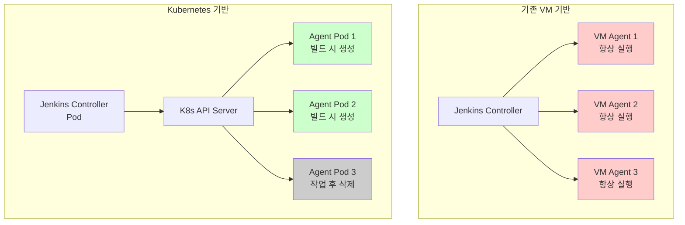
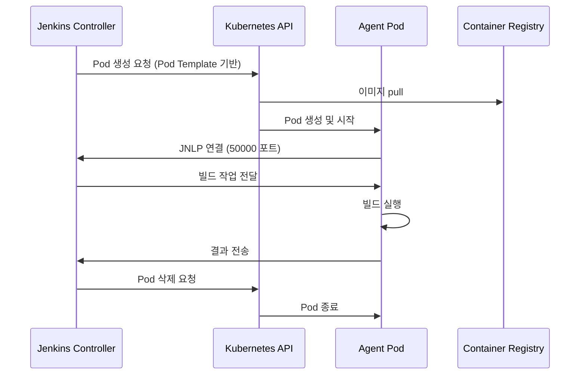

# Ch12. Jenkins on Kubernetes - 네이티브 CI/CD 플랫폼 구축

> 📌 **핵심 요약**
>
> Jenkins를 Kubernetes 위에 올리면 CI/CD 인프라의 패러다임이 바뀐다. VM 기반 고정 에이전트 대신 빌드마다 새로운 Pod를 생성하고 작업이 끝나면 삭제한다. Helm 차트로 설치하고, Configuration as Code(JCasC)로 설정을 버전 관리하며, Kubernetes Plugin으로 동적 에이전트를 관리한다. 리소스 효율성과 격리, 스케일링이 핵심 이점이다.

---

## 🎯 학습 목표

이번 챕터에서는 다음을 학습한다:

1. Jenkins를 Kubernetes에 배포하는 이유와 아키텍처 변화
2. Helm 차트를 사용한 Jenkins 설치 및 구성
3. Configuration as Code(JCasC)로 Jenkins 설정 자동화
4. Kubernetes Plugin과 동적 에이전트 Pod 운영
5. Jenkinsfile에서 kubernetes agent를 사용하는 파이프라인 작성
6. PVC를 통한 Jenkins Home 영속성 관리
7. RBAC과 ServiceAccount를 활용한 보안 설정
8. minikube에서의 리소스 제약 대응

---

## 📖 본문

### 1. 왜 Jenkins를 Kubernetes에 올리는가

전통적인 Jenkins 운영 방식은 고정된 VM 에이전트를 미리 프로비저닝하고, 빌드 작업이 들어오면 idle 상태의 에이전트에 할당하는 구조다. 이 방식은 몇 가지 문제를 안고 있다:

- **리소스 낭비**: 피크 타임을 대비해 에이전트를 많이 띄워두면, 대부분의 시간 동안 idle 상태로 리소스를 소비한다.
- **환경 오염**: 같은 에이전트에서 여러 빌드가 실행되면서 파일 시스템, 캐시, 네트워크 포트 등이 오염된다.
- **확장 한계**: 트래픽이 갑자기 증가하면 에이전트를 수동으로 추가해야 하고, 감소하면 다시 제거해야 한다.
- **일관성 부족**: 에이전트마다 설치된 도구 버전, 환경 변수가 다르면 "내 컴퓨터에서는 되는데" 문제가 발생한다.

Kubernetes에 Jenkins를 올리면 이 문제들이 자연스럽게 해결된다:

**동적 에이전트**: 빌드가 시작되면 새로운 Pod를 생성하고, 끝나면 삭제한다. 매번 깨끗한 환경에서 시작하므로 환경 오염이 없다.

**리소스 효율**: 필요할 때만 Pod를 생성하므로, 평균 리소스 사용량이 크게 줄어든다. 100개의 빌드가 동시에 발생하면 100개의 Pod를, 1개만 발생하면 1개의 Pod만 사용한다.

**선언적 환경**: Pod Template에 컨테이너 이미지, 리소스 요청, 볼륨 마운트를 선언하면, 모든 에이전트가 동일한 환경을 갖는다.

**오토스케일링**: Kubernetes Cluster Autoscaler와 결합하면, 빌드 트래픽이 급증할 때 노드 자체를 자동으로 추가할 수 있다.

**격리와 보안**: 각 빌드가 별도의 Pod에서 실행되므로, 한 빌드의 문제가 다른 빌드에 영향을 주지 않는다. Network Policy로 통신을 제한할 수도 있다.

Jenkins on Kubernetes는 단순히 Jenkins를 K8s 위에 올린 것이 아니라, CI/CD 인프라의 운영 철학을 바꾸는 것이다.



### 2. Jenkins Helm 차트 구조

Jenkins를 Kubernetes에 수동으로 배포하려면 Deployment, Service, ConfigMap, Secret, PVC, ServiceAccount, RBAC 등 수십 개의 리소스를 작성해야 한다. Helm 차트는 이 모든 것을 패키징하고, `values.yaml`로 커스터마이징할 수 있게 해준다.

공식 Jenkins Helm 차트는 `jenkinsci/jenkins`다. 주요 구성 요소는:

**Controller**: Jenkins 마스터 노드를 Deployment로 배포한다. 웹 UI, 작업 스케줄링, 플러그인 관리를 담당한다.

**Service**: Controller에 접근하기 위한 ClusterIP 또는 LoadBalancer Service.

**Ingress**: 외부에서 Jenkins UI에 접근하려면 Ingress 리소스를 생성할 수 있다.

**PVC**: Jenkins Home 디렉토리(`/var/jenkins_home`)를 영속화하기 위한 PersistentVolumeClaim. 작업 기록, 플러그인, 자격 증명 등이 여기에 저장된다.

**ServiceAccount**: Jenkins Controller가 Kubernetes API를 호출할 때 사용할 계정.

**RBAC**: ServiceAccount에 부여할 권한(Role, RoleBinding).

**ConfigMap (JCasC)**: Configuration as Code 설정을 담는다. `jenkins.yaml` 파일로 Jenkins의 전체 설정을 자동화한다.

**Secrets**: 초기 admin 비밀번호, API 토큰 등을 저장한다.

차트의 `values.yaml`은 수백 개의 옵션을 제공한다. 자주 사용하는 파라미터는:

| 파라미터 | 설명 | 기본값 |
|----------|------|--------|
| `controller.image` | Controller 이미지 | `jenkins/jenkins` |
| `controller.resources` | CPU/메모리 요청/제한 | requests: 256Mi/50m |
| `controller.serviceType` | Service 타입 | `ClusterIP` |
| `controller.installPlugins` | 설치할 플러그인 목록 | kubernetes, workflow 등 |
| `controller.JCasC.configScripts` | JCasC 설정 | `{}` |
| `persistence.enabled` | PVC 사용 여부 | `true` |
| `persistence.size` | PVC 크기 | `8Gi` |
| `rbac.create` | RBAC 리소스 생성 | `true` |

Helm 차트의 장점은 업그레이드가 간단하다는 것이다. `helm upgrade`로 새 버전을 적용하고, 문제가 생기면 `helm rollback`으로 이전 버전으로 돌아갈 수 있다.

### 3. Configuration as Code (JCasC)

Jenkins는 전통적으로 웹 UI에서 수동으로 설정한다. 시스템 설정, 자격 증명, 플러그인 설정 등을 클릭하며 입력하고, 이 설정은 파일 시스템에 XML로 저장된다. 이 방식의 문제는:

- **재현 불가**: 새로운 Jenkins 인스턴스를 구축하려면 설정을 다시 클릭해야 한다.
- **버전 관리 어려움**: XML 파일을 Git에 커밋할 수는 있지만, 수동 변경과 혼재된다.
- **오류 발생**: 수동 설정은 실수하기 쉽고, 환경마다 다르게 설정할 수 있다.

**Configuration as Code (JCasC)** 플러그인은 이 문제를 해결한다. `jenkins.yaml` 파일 하나에 모든 설정을 선언하면, Jenkins가 시작할 때 자동으로 적용한다.

예를 들어, Kubernetes Plugin 설정을 JCasC로 작성하면:

```yaml
jenkins:
  clouds:
    - kubernetes:
        name: "kubernetes"
        serverUrl: "https://kubernetes.default"
        namespace: "jenkins"
        jenkinsUrl: "http://jenkins:8080"
        jenkinsTunnel: "jenkins-agent:50000"
        templates:
          - name: "default-agent"
            label: "default"
            containers:
              - name: "jnlp"
                image: "jenkins/inbound-agent:latest"
                workingDir: "/home/jenkins/agent"
                resourceRequestCpu: "100m"
                resourceRequestMemory: "256Mi"
                resourceLimitCpu: "200m"
                resourceLimitMemory: "512Mi"
```

이 설정은 `values.yaml`의 `controller.JCasC.configScripts`에 넣으면 된다:

```yaml
controller:
  JCasC:
    configScripts:
      kubernetes-cloud: |
        jenkins:
          clouds:
            - kubernetes:
                name: "kubernetes"
                # ... (위와 동일)
```

Helm install 시 이 `values.yaml`을 전달하면, Jenkins가 시작할 때 자동으로 Kubernetes 클라우드가 설정된다. 더 이상 웹 UI에서 클릭할 필요가 없다.

JCasC의 장점:

- **Infrastructure as Code**: Jenkins 설정을 Git에 커밋하고, PR 리뷰를 거쳐 변경할 수 있다.
- **재현 가능**: 동일한 `jenkins.yaml`로 개발/스테이징/프로덕션 환경을 구축할 수 있다.
- **자동화**: CI/CD 파이프라인에서 Jenkins를 배포하고 설정까지 자동화할 수 있다.
- **검증 가능**: YAML 스키마로 설정을 검증하고, 틀린 설정은 시작 시 에러로 잡을 수 있다.

JCasC는 Kubernetes와 찰떡궁합이다. Helm 차트의 `values.yaml`에 JCasC 설정을 넣으면, GitOps 방식으로 Jenkins 전체를 관리할 수 있다.

### 4. Kubernetes Plugin과 동적 에이전트

Jenkins Kubernetes Plugin은 Jenkins와 Kubernetes API를 연결해준다. Controller가 빌드를 스케줄링하면, 플러그인이 Kubernetes API에 Pod 생성 요청을 보내고, 새로운 에이전트 Pod가 뜬다. 빌드가 끝나면 Pod는 자동으로 삭제된다.

핵심 개념은 **Pod Template**이다. Pod Template은 에이전트 Pod의 명세(spec)를 정의한다:

- **컨테이너 이미지**: 어떤 이미지를 사용할지 (예: `maven:3.8-jdk11`, `node:16`)
- **리소스 요청/제한**: CPU와 메모리 requests/limits
- **볼륨**: ConfigMap, Secret, PVC를 마운트
- **환경 변수**: 빌드에서 사용할 변수
- **Label**: Jenkinsfile에서 이 Pod Template을 선택할 때 사용할 레이블

Pod Template은 두 가지 방식으로 정의할 수 있다:

**1) JCasC에서 정적으로 정의**:

```yaml
jenkins:
  clouds:
    - kubernetes:
        templates:
          - name: "maven-agent"
            label: "maven"
            containers:
              - name: "maven"
                image: "maven:3.8-jdk11"
                command: "sleep"
                args: "infinity"
```

이렇게 하면 웹 UI에서 "maven" 레이블을 선택할 수 있다.

**2) Jenkinsfile에서 동적으로 정의**:

```groovy
pipeline {
  agent {
    kubernetes {
      yaml """
apiVersion: v1
kind: Pod
spec:
  containers:
  - name: maven
    image: maven:3.8-jdk11
    command: ['sleep']
    args: ['infinity']
"""
    }
  }
  stages {
    stage('Build') {
      steps {
        container('maven') {
          sh 'mvn clean package'
        }
      }
    }
  }
}
```

Jenkinsfile에 Pod 명세를 직접 넣으면, 프로젝트마다 다른 환경을 사용할 수 있다. 예를 들어, A 프로젝트는 JDK 11, B 프로젝트는 JDK 17을 사용하는 식이다.

**동작 흐름**:



1. Controller가 빌드를 스케줄링하면, Kubernetes Plugin이 Pod Template을 읽는다.
2. Kubernetes API에 Pod 생성 요청을 보낸다.
3. Kubernetes가 이미지를 pull하고 Pod를 시작한다.
4. Pod 안의 JNLP 에이전트가 Controller의 50000 포트로 연결한다.
5. Controller가 빌드 명령을 전달하고, 에이전트가 실행한다.
6. 빌드가 끝나면 Controller가 Pod 삭제를 요청한다.

**JNLP (Java Network Launch Protocol)**: Jenkins 에이전트가 Controller와 통신하는 프로토콜이다. 에이전트가 먼저 Controller에 연결을 맺고, Controller가 명령을 push하는 방식이다. SSH와 달리 방화벽 뒤의 에이전트도 연결할 수 있다.

### 5. 설치 과정

실제로 minikube에 Jenkins를 설치해보자.

**Step 1: Helm 차트 저장소 추가**

```bash
helm repo add jenkinsci https://charts.jenkins.io
helm repo update
```

**Step 2: values.yaml 작성**

```yaml
controller:
  # 컨트롤러 이미지
  image: "jenkins/jenkins"
  tag: "2.440-jdk17"

  # 리소스 설정 (minikube 환경 고려)
  resources:
    requests:
      cpu: "100m"
      memory: "512Mi"
    limits:
      cpu: "500m"
      memory: "1Gi"

  # Service 타입 (NodePort로 외부 접근)
  serviceType: NodePort
  nodePort: 32000

  # 플러그인 자동 설치
  installPlugins:
    - kubernetes:4253.v7700d91739e5
    - workflow-aggregator:600.vb_57cdd26fdd7
    - git:5.6.0
    - configuration-as-code:1810.v9b_c30a_249a_4c

  # JCasC 설정
  JCasC:
    defaultConfig: true
    configScripts:
      kubernetes-cloud: |
        jenkins:
          clouds:
            - kubernetes:
                name: "kubernetes"
                serverUrl: "https://kubernetes.default"
                namespace: "jenkins"
                jenkinsUrl: "http://jenkins:8080"
                jenkinsTunnel: "jenkins-agent:50000"
                templates:
                  - name: "default-agent"
                    label: "default"
                    nodeUsageMode: NORMAL
                    containers:
                      - name: "jnlp"
                        image: "jenkins/inbound-agent:latest"
                        workingDir: "/home/jenkins/agent"
                        resourceRequestCpu: "100m"
                        resourceRequestMemory: "256Mi"
                        resourceLimitCpu: "200m"
                        resourceLimitMemory: "512Mi"

# 영속성 설정
persistence:
  enabled: true
  size: "5Gi"
  storageClass: "standard"

# RBAC 설정
rbac:
  create: true

serviceAccount:
  create: true
  name: jenkins

# Agent 리소스 (Pod Template에서 재정의 가능)
agent:
  resources:
    requests:
      cpu: "100m"
      memory: "256Mi"
    limits:
      cpu: "200m"
      memory: "512Mi"
```

**Step 3: Namespace 생성 및 설치**

```bash
kubectl create namespace jenkins

helm install jenkins jenkinsci/jenkins \
  --namespace jenkins \
  --values values.yaml \
  --wait
```

**Step 4: 초기 Admin 비밀번호 확인**

```bash
kubectl exec -n jenkins jenkins-0 -- \
  cat /run/secrets/additional/chart-admin-password && echo
```

**Step 5: Jenkins UI 접근**

```bash
minikube service jenkins -n jenkins
```

브라우저가 열리면, admin 계정과 위에서 확인한 비밀번호로 로그인한다.

**Step 6: JCasC 적용 확인**

- Manage Jenkins → System Configuration → Clouds 메뉴로 이동
- "kubernetes" 클라우드가 자동으로 설정되어 있고, "default-agent" Pod Template이 보이면 성공

### 6. 파이프라인 실행

Jenkinsfile에서 kubernetes agent를 사용하는 파이프라인을 작성해보자.

**예제 1: 기본 Pod Template 사용**

```groovy
pipeline {
  agent {
    label 'default'
  }
  stages {
    stage('Hello') {
      steps {
        sh 'echo "Hello from Kubernetes Pod"'
        sh 'hostname'
      }
    }
  }
}
```

이 파이프라인을 실행하면:
1. Jenkins가 "default" 레이블을 가진 Pod Template을 찾는다 (JCasC에서 정의한 것).
2. 새로운 Pod를 생성하고, JNLP 컨테이너가 뜬다.
3. `sh` 명령이 해당 컨테이너에서 실행된다.
4. 파이프라인이 끝나면 Pod가 삭제된다.

**예제 2: Jenkinsfile에 Pod 정의**

```groovy
pipeline {
  agent {
    kubernetes {
      yaml """
apiVersion: v1
kind: Pod
metadata:
  labels:
    jenkins: agent
spec:
  containers:
  - name: maven
    image: maven:3.8-jdk11
    command: ['sleep']
    args: ['infinity']
    resources:
      requests:
        memory: "256Mi"
        cpu: "100m"
      limits:
        memory: "512Mi"
        cpu: "200m"
  - name: docker
    image: docker:24-dind
    securityContext:
      privileged: true
    volumeMounts:
      - name: docker-sock
        mountPath: /var/run
  volumes:
    - name: docker-sock
      emptyDir: {}
"""
    }
  }
  stages {
    stage('Build') {
      steps {
        container('maven') {
          sh 'mvn --version'
          sh 'mvn clean package'
        }
      }
    }
    stage('Docker Build') {
      steps {
        container('docker') {
          sh 'docker version'
          sh 'docker build -t myapp:latest .'
        }
      }
    }
  }
}
```

이 파이프라인은:
- Maven 컨테이너에서 빌드를 실행한다.
- Docker 컨테이너(DinD)에서 이미지를 빌드한다.
- 두 컨테이너가 같은 Pod에 있으므로 localhost로 통신할 수 있다.

**멀티 컨테이너 전략**: 한 Pod에 여러 컨테이너를 띄우면, 각 컨테이너가 특정 도구를 담당한다. Maven, Node.js, Docker, kubectl 등을 각각의 컨테이너로 분리하면, 이미지 크기가 작아지고 캐싱 효율이 좋아진다.

### 7. 영속성 (PVC로 Jenkins Home 유지)

Jenkins Controller의 `/var/jenkins_home` 디렉토리에는 중요한 데이터가 저장된다:
- 작업 정의(Job XML)
- 빌드 기록
- 플러그인
- 자격 증명
- 사용자 설정

Pod가 재시작되면 이 데이터가 모두 사라지므로, PersistentVolume을 사용해야 한다.

Helm 차트는 기본적으로 PVC를 생성한다 (`persistence.enabled: true`). PVC가 PV와 바인딩되고, Jenkins Home이 여기에 마운트된다.

**PVC 확인**:

```bash
kubectl get pvc -n jenkins
```

출력 예시:

```
NAME      STATUS   VOLUME                                     CAPACITY   ACCESS MODES
jenkins   Bound    pvc-12345678-abcd-1234-5678-123456789abc   5Gi        RWO
```

**백업 전략**:

Jenkins Home을 정기적으로 백업해야 한다. 방법은:

1. **VolumeSnapshot**: Kubernetes VolumeSnapshot 기능으로 PV 스냅샷을 생성.
2. **CronJob**: `kubectl cp` 또는 `rsync`로 데이터를 외부 스토리지(S3, NFS)에 복사하는 CronJob.
3. **Velero**: Kubernetes 백업 도구로 전체 네임스페이스를 백업.

JCasC를 사용하면 설정은 Git에 있으므로, 백업할 필요가 있는 것은 주로 빌드 기록과 자격 증명이다.

### 8. 보안 고려사항 (RBAC, ServiceAccount, Secret 관리)

Jenkins Controller는 Kubernetes API를 호출해서 Pod를 생성하고 삭제한다. 이 권한을 제한하지 않으면 보안 위험이 크다.

**RBAC 설정**:

Helm 차트는 `rbac.create: true`로 자동으로 Role과 RoleBinding을 생성한다. 기본 권한은:

```yaml
rules:
  - apiGroups: [""]
    resources: ["pods"]
    verbs: ["create", "delete", "get", "list", "watch"]
  - apiGroups: [""]
    resources: ["pods/exec"]
    verbs: ["create", "get"]
  - apiGroups: [""]
    resources: ["pods/log"]
    verbs: ["get", "list"]
  - apiGroups: [""]
    resources: ["secrets"]
    verbs: ["get", "list"]
```

이 권한은 Jenkins가 Pod를 관리하는 데 필요한 최소 권한이다. 더 많은 권한이 필요하면 `values.yaml`의 `rbac.readSecrets`나 커스텀 Role을 추가한다.

**ServiceAccount**:

Jenkins Controller Pod는 `jenkins` ServiceAccount로 실행된다. 이 ServiceAccount에 Role이 바인딩되어, Pod 내부에서 Kubernetes API를 호출할 수 있다.

```bash
kubectl get serviceaccount -n jenkins
kubectl describe role jenkins -n jenkins
```

**Secret 관리**:

Jenkins에 자격 증명(Git 토큰, Docker 레지스트리 비밀번호 등)을 저장할 때, Kubernetes Secret으로 관리하는 것이 안전하다.

```bash
kubectl create secret generic git-token \
  --from-literal=token=ghp_abcd1234 \
  -n jenkins
```

Jenkinsfile에서 Secret을 사용:

```groovy
pipeline {
  agent { label 'default' }
  environment {
    GIT_TOKEN = credentials('git-token')
  }
  stages {
    stage('Clone') {
      steps {
        sh 'git clone https://${GIT_TOKEN}@github.com/user/repo.git'
      }
    }
  }
}
```

또는 JCasC에서 Secret을 자격 증명으로 자동 등록할 수 있다:

```yaml
controller:
  JCasC:
    configScripts:
      credentials: |
        credentials:
          system:
            domainCredentials:
              - credentials:
                  - string:
                      scope: GLOBAL
                      id: "git-token"
                      secret: "${GIT_TOKEN}"
                      description: "GitHub Token"
```

Pod에 환경 변수로 Secret을 주입:

```yaml
controller:
  containerEnv:
    - name: GIT_TOKEN
      valueFrom:
        secretKeyRef:
          name: git-token
          key: token
```

**Network Policy**:

Jenkins Controller와 에이전트 Pod 간의 통신을 제한하려면 Network Policy를 사용한다. 예를 들어, 에이전트 Pod가 외부 인터넷에 접근하지 못하게 막고, Controller와 Kubernetes API하고만 통신하도록 제한할 수 있다.

### 9. minikube 리소스 설정

minikube는 기본적으로 제한된 리소스를 사용한다 (2 CPU, 2Gi 메모리). Jenkins Controller와 에이전트 Pod를 동시에 띄우려면 리소스를 조정해야 한다.

**minikube 시작 시 리소스 지정**:

```bash
minikube start --cpus=4 --memory=4096 --disk-size=20g
```

**권장 리소스 설정**:

| 구성 요소 | Requests | Limits |
|----------|----------|--------|
| Jenkins Controller | CPU 100m, Memory 512Mi | CPU 500m, Memory 1Gi |
| Default Agent | CPU 100m, Memory 256Mi | CPU 200m, Memory 512Mi |
| Maven Agent | CPU 200m, Memory 512Mi | CPU 500m, Memory 1Gi |

이 설정으로 minikube 4Gi 메모리에 Controller 1개 + 에이전트 3~4개를 동시에 띄울 수 있다.

**리소스 부족 시 증상**:

- Pod가 Pending 상태로 머물면서 "Insufficient memory" 이벤트 발생
- 빌드가 큐에 쌓이지만 시작되지 않음
- `kubectl describe pod`로 이벤트 확인:

```bash
kubectl describe pod -n jenkins <pod-name>
```

**해결 방법**:

1. minikube 리소스 증가
2. Pod의 requests 값 감소 (단, OOMKilled 위험 증가)
3. 동시 빌드 수 제한 (Jenkinsfile에 `options { disableConcurrentBuilds() }`)

### 10. 정리

Jenkins on Kubernetes는 CI/CD 인프라를 클라우드 네이티브하게 운영하는 방법이다. 핵심은 동적 에이전트다. 빌드마다 새로운 Pod를 생성하고 작업이 끝나면 삭제하므로, 리소스 효율성과 환경 일관성이 크게 개선된다.

Helm 차트로 설치하면 수십 개의 Kubernetes 리소스를 한 번에 배포할 수 있고, `values.yaml`로 커스터마이징한다. Configuration as Code(JCasC)로 Jenkins 설정을 YAML로 관리하면, Infrastructure as Code와 GitOps를 실현할 수 있다.

Kubernetes Plugin이 Jenkins와 K8s API를 연결하고, Pod Template으로 에이전트 환경을 선언한다. Jenkinsfile에서 직접 Pod 명세를 작성하면, 프로젝트마다 다른 도구와 버전을 사용할 수 있다.

보안은 RBAC과 ServiceAccount로 관리하고, Secret은 Kubernetes Secret으로 저장한다. PVC로 Jenkins Home을 영속화하고, 정기적으로 백업한다.

minikube 같은 로컬 환경에서는 리소스를 적절히 조정해야 한다. Controller와 에이전트의 requests/limits를 낮추고, 동시 빌드 수를 제한하면 4Gi 메모리로도 충분히 실습할 수 있다.

다음 챕터에서는 SonarQube를 Kubernetes에 배포하고, Jenkins 파이프라인과 통합하여 코드 품질 게이트를 구축해본다.

---

## 주요 테이블

### VM Agent vs K8s Agent 비교

| 특성 | VM 기반 Agent | Kubernetes Pod Agent |
|------|---------------|----------------------|
| **프로비저닝** | 수동, 느림 (분 단위) | 자동, 빠름 (초 단위) |
| **리소스 사용** | 항상 실행, 높은 idle 비용 | 필요 시만 생성, 낮은 비용 |
| **환경 일관성** | 에이전트마다 다를 수 있음 | Pod Template으로 동일 |
| **격리** | 프로세스 레벨 | 컨테이너 레벨 |
| **스케일링** | 수동 또는 VM 오토스케일링 | K8s 오토스케일링 |
| **환경 오염** | 빌드 간 파일 시스템 공유 | 매번 새로운 Pod |
| **보안** | SSH 키 관리 | RBAC + ServiceAccount |
| **유지보수** | OS 패치, 도구 업데이트 | 이미지 업데이트 |

### JCasC 설정 구조

| 섹션 | 설명 | 예시 |
|------|------|------|
| `jenkins.clouds` | 클라우드 프로바이더 설정 | Kubernetes, Docker, AWS EC2 |
| `jenkins.securityRealm` | 인증 방식 | Local, LDAP, GitHub OAuth |
| `jenkins.authorizationStrategy` | 권한 관리 | Matrix-based, Role-based |
| `credentials.system` | 자격 증명 | SSH 키, API 토큰, Secret text |
| `tool` | 도구 자동 설치 | JDK, Maven, Git |
| `unclassified` | 플러그인별 설정 | GitHub 서버, Slack 설정 |

### Jenkins Helm Chart 주요 values 파라미터

| 파라미터 | 설명 | 기본값 | 권장 값 (minikube) |
|----------|------|--------|---------------------|
| `controller.image` | Controller 이미지 | `jenkins/jenkins` | 동일 |
| `controller.tag` | 이미지 태그 | `lts` | `2.440-jdk17` |
| `controller.resources.requests.cpu` | CPU 요청 | `50m` | `100m` |
| `controller.resources.requests.memory` | 메모리 요청 | `256Mi` | `512Mi` |
| `controller.resources.limits.memory` | 메모리 제한 | `4Gi` | `1Gi` |
| `controller.serviceType` | Service 타입 | `ClusterIP` | `NodePort` |
| `controller.installPlugins` | 플러그인 목록 | 기본 플러그인 | + `kubernetes` |
| `controller.JCasC.configScripts` | JCasC 설정 | `{}` | Kubernetes cloud 설정 |
| `persistence.enabled` | PVC 사용 | `true` | `true` |
| `persistence.size` | PVC 크기 | `8Gi` | `5Gi` |
| `rbac.create` | RBAC 리소스 생성 | `true` | `true` |
| `agent.resources.requests.memory` | 에이전트 메모리 요청 | `256Mi` | `256Mi` |

---

## 체크포인트

- [ ] Helm으로 Jenkins를 설치하고 웹 UI에 접근할 수 있다
- [ ] JCasC로 Kubernetes 클라우드가 자동 설정되는 것을 확인했다
- [ ] Jenkinsfile에서 `agent { label 'default' }`로 Pod가 생성되는 것을 확인했다
- [ ] Jenkinsfile에 Pod 명세를 직접 작성하고 멀티 컨테이너 빌드를 실행했다
- [ ] PVC로 Jenkins Home이 영속화되는 것을 확인했다 (Pod 재시작 후 작업 기록 유지)
- [ ] ServiceAccount와 RBAC를 확인하고, 최소 권한 원칙을 이해했다
- [ ] minikube 리소스 제약 하에서 Controller와 에이전트를 동시에 운영할 수 있다
