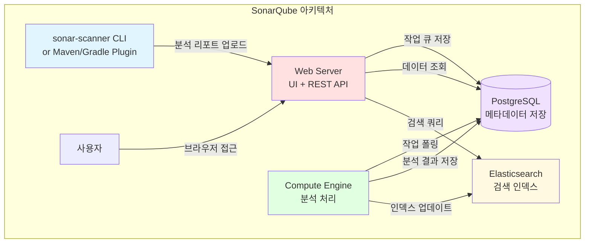

# Ch13. SonarQube on Kubernetes - 코드 품질 자동화

> 📌 **핵심 요약**
>
> SonarQube는 정적 분석으로 코드 품질을 측정하고, Quality Gate로 배포 가부를 자동 판단한다. Helm 차트로 Kubernetes에 설치하고, PostgreSQL과 연동하며, Jenkins 파이프라인에 통합한다. 코드 커버리지, 버그, 보안 취약점, 코드 스멜을 추적하고, 팀의 품질 기준을 강제할 수 있다.

---

## 🎯 학습 목표

이번 챕터에서는 다음을 학습한다:

1. SonarQube의 가치와 정적 분석의 필요성
2. SonarQube 아키텍처 (Web Server, Compute Engine, Search, DB)
3. Edition 간 차이 (Community vs Developer vs Enterprise)
4. Helm 차트로 SonarQube 설치 및 PostgreSQL 연동
5. sonar-scanner로 프로젝트 분석 실행
6. Quality Gate와 Quality Profile 설정 및 커스터마이징
7. Jenkins 파이프라인과 통합하여 자동화
8. minikube 리소스 제약 하에서 운영하기

---

## 📖 본문

### 1. 왜 SonarQube인가

코드 리뷰는 버그를 잡고 품질을 높이는 강력한 방법이지만, 사람의 시간은 유한하다. 리뷰어는 비즈니스 로직, 아키텍처, 엣지 케이스에 집중해야 하는데, "이 변수는 안 쓰이네요", "null 체크가 없어요", "이 메서드는 너무 길어요" 같은 기계적인 지적에 시간을 쓰게 된다.

**정적 분석(Static Analysis)** 은 코드를 실행하지 않고 소스코드를 읽어서 문제를 찾는다. 컴파일러가 문법 오류를 잡는 것처럼, 정적 분석 도구는 잠재적 버그, 보안 취약점, 코드 스멜을 잡는다. SonarQube는 이런 정적 분석을 자동화하고, 결과를 시각화하며, 품질 기준을 강제하는 플랫폼이다.

**SonarQube가 제공하는 가치:**

**자동화된 코드 리뷰**: null pointer 역참조, SQL injection, 사용하지 않는 import 같은 수백 가지 규칙을 자동으로 체크한다. 사람은 이런 것을 신경 쓰지 않고, 도메인 로직에 집중할 수 있다.

**품질 게이트**: "커버리지 80% 미만이면 배포 금지", "Critical 버그가 1개라도 있으면 PR merge 금지" 같은 기준을 설정하고, CI/CD 파이프라인에서 자동으로 체크한다. 품질이 떨어지는 코드는 프로덕션에 도달하지 못한다.

**트렌드 추적**: 시간에 따른 버그 수, 커버리지, 기술 부채를 그래프로 보여준다. "이번 스프린트에 버그가 10개 추가되었습니다"라는 객관적인 데이터로 팀의 품질 개선을 측정할 수 있다.

**보안 취약점 탐지**: OWASP Top 10, CWE(Common Weakness Enumeration) 같은 알려진 취약점 패턴을 찾는다. 예를 들어, `PreparedStatement` 대신 문자열 연결로 SQL을 만들면 경고한다.

**기술 부채 가시화**: "이 메서드를 리팩토링하는 데 30분 걸립니다"라는 추정치를 제공한다. 팀 전체의 기술 부채를 합산하면 "이 프로젝트를 깨끗하게 만드는 데 200시간 필요"라는 숫자가 나온다. 이 숫자로 리팩토링 우선순위를 정할 수 있다.

SonarQube는 "코드 품질"이라는 추상적인 개념을 구체적인 지표로 만들어준다. 개발자는 자신의 코드가 어떻게 평가받는지 즉시 알 수 있고, 팀은 일관된 기준으로 품질을 관리할 수 있다.

### 2. SonarQube 아키텍처

SonarQube는 단일 바이너리가 아니라 여러 컴포넌트로 구성된 분산 시스템이다.



**Web Server**: 사용자가 브라우저로 접근하는 UI를 제공하고, REST API를 노출한다. 프로젝트 목록, 이슈 조회, Quality Gate 설정 등의 요청을 처리한다. Java(Spring Boot)로 작성되어 있고, 기본 포트는 9000이다.

**Compute Engine**: 백그라운드 워커다. sonar-scanner가 분석 리포트를 업로드하면, Web Server가 작업 큐에 넣고, Compute Engine이 이를 폴링해서 처리한다. 리포트를 파싱하고, 규칙을 적용하고, 이슈를 생성하고, 메트릭을 계산한다. CPU 집약적인 작업이므로, 대규모 프로젝트에서는 여러 개의 CE를 띄울 수 있다.

**Elasticsearch**: 코드 검색과 이슈 검색에 사용된다. "NullPointerException이 발생하는 모든 코드를 찾아줘" 같은 쿼리를 빠르게 처리한다. SonarQube 7.x부터 내장되어 있고, 별도로 설치할 필요 없다. 메모리를 많이 사용하므로, JVM 힙 사이즈를 적절히 설정해야 한다.

**Database**: PostgreSQL을 권장한다(MySQL, Oracle, MS SQL도 지원). 프로젝트 메타데이터, 이슈, 측정값, 사용자, 설정 등이 저장된다. H2(인메모리 DB)도 포함되어 있지만, 테스트 용도일 뿐 프로덕션에서는 사용하면 안 된다. SonarQube가 재시작되면 모든 데이터가 사라진다.

**sonar-scanner**: 클라이언트 도구다. 프로젝트 소스코드를 읽고, 규칙을 적용하고, 분석 리포트를 생성해서 SonarQube 서버에 업로드한다. CLI 버전도 있고, Maven/Gradle 플러그인도 있다. Jenkins나 GitHub Actions 같은 CI 도구에서 실행한다.

**동작 흐름:**

1. 개발자가 코드를 커밋하고, Jenkins 빌드가 시작된다.
2. Jenkins에서 `sonar-scanner` 또는 `mvn sonar:sonar`를 실행한다.
3. sonar-scanner가 소스코드를 분석하고, 리포트를 SonarQube Web Server에 업로드한다.
4. Web Server가 작업을 DB에 저장하고, Compute Engine이 이를 가져와서 처리한다.
5. Compute Engine이 이슈를 생성하고, 메트릭을 계산하고, Elasticsearch에 인덱싱한다.
6. 사용자가 브라우저로 SonarQube에 접속하면, 분석 결과를 볼 수 있다.
7. Quality Gate 결과가 Jenkins로 리턴되고, 실패하면 빌드가 실패한다.

### 3. Edition 비교 (Community vs Developer vs Enterprise)

SonarQube는 오픈소스(Community Edition)와 상용(Developer, Enterprise, Data Center Edition)으로 나뉜다.

| 기능 | Community | Developer | Enterprise | Data Center |
|------|-----------|-----------|------------|-------------|
| **가격** | 무료 | 유료 | 유료 | 유료 |
| **언어 지원** | 29개 (Java, JS, Python 등) | 동일 + 추가 (Apex, COBOL 등) | 동일 | 동일 |
| **브랜치 분석** | ❌ (main만) | ✅ (PR, feature 브랜치) | ✅ | ✅ |
| **PR 데코레이션** | ❌ | ✅ (GitHub, GitLab, Bitbucket에 코멘트) | ✅ | ✅ |
| **보안 리포트** | 기본 | OWASP, CWE 리포트 | + PCI-DSS, 감사 로그 | 동일 |
| **Portfolio 관리** | ❌ | ❌ | ✅ (프로젝트 그룹화) | ✅ |
| **고가용성(HA)** | ❌ | ❌ | ❌ | ✅ (여러 노드) |
| **스케일링** | 단일 인스턴스 | 단일 인스턴스 | 단일 인스턴스 | 클러스터 |

**Community Edition의 한계:**

- **브랜치 분석 불가**: `main` 또는 `master` 브랜치만 분석할 수 있다. Feature 브랜치나 PR을 분석하려면 Developer 이상이 필요하다. 이 제약이 가장 아프다. PR마다 코드 품질을 체크하려면 유료 버전을 사야 한다.
- **PR 데코레이션 없음**: GitHub PR에 "3개의 버그가 발견되었습니다" 같은 코멘트를 자동으로 달아주는 기능이 없다. 개발자가 직접 SonarQube 서버에 가서 확인해야 한다.
- **보안 리포트 제한**: OWASP Top 10, CWE 카테고리별 리포트를 볼 수 없다. 개별 취약점은 보이지만, 전체 보안 상태를 한눈에 파악하기 어렵다.

**언제 유료 버전이 필요한가:**

- 브랜치가 많은 팀 (feature 브랜치 전략)
- PR 리뷰에 자동화된 품질 체크를 넣고 싶을 때
- 수십 개의 프로젝트를 Portfolio로 묶어서 관리해야 할 때
- HA와 스케일링이 필요한 대규모 조직

소규모 팀이나 개인 프로젝트라면 Community Edition으로 충분하다. 브랜치 분석이 없어도, `main` 브랜치를 분석해서 품질 트렌드를 추적하고, 배포 전에 Quality Gate를 체크할 수 있다.

### 4. Helm 차트로 설치

SonarQube를 Kubernetes에 설치하는 방법은 여러 가지다. 공식 Helm 차트를 사용하는 것이 가장 간단하다.

**Step 1: Helm 저장소 추가**

```bash
helm repo add sonarqube https://SonarSource.github.io/helm-chart-sonarqube
helm repo update
```

**Step 2: values.yaml 작성**

```yaml
# SonarQube 이미지
image:
  repository: sonarqube
  tag: "10.3.0-community"

# 리소스 설정 (minikube 환경 고려)
resources:
  requests:
    cpu: "200m"
    memory: "1Gi"
  limits:
    cpu: "1000m"
    memory: "2Gi"

# JVM 옵션 (힙 크기 조정)
jvmOpts: "-Xmx1024m -Xms512m"

# Elasticsearch JVM 옵션
elasticsearch:
  javaOpts: "-Xmx512m -Xms512m"

# Service 타입
service:
  type: NodePort
  externalPort: 9000
  nodePort: 32001

# Ingress (프로덕션에서는 활성화)
ingress:
  enabled: false

# 영속성 (PVC)
persistence:
  enabled: true
  size: 5Gi
  storageClass: "standard"

# PostgreSQL 연동 (외부 DB)
postgresql:
  enabled: false

jdbcOverwrite:
  enable: true
  jdbcUrl: "jdbc:postgresql://postgres:5432/sonarqube"
  jdbcUsername: "sonarqube"
  jdbcSecretName: "sonarqube-postgres-secret"
  jdbcSecretPasswordKey: "password"

# 초기 플러그인 설치 (선택)
plugins:
  install: []
  # - "https://github.com/user/plugin/releases/download/v1.0/plugin.jar"

# 리소스 제약이 있는 환경에서 readiness/liveness 타임아웃 증가
livenessProbe:
  initialDelaySeconds: 60
  periodSeconds: 30
  failureThreshold: 6

readinessProbe:
  initialDelaySeconds: 60
  periodSeconds: 30
  failureThreshold: 6
```

**Step 3: PostgreSQL 설치 (별도 차트)**

SonarQube는 PostgreSQL을 필요로 한다. Helm 차트에 내장된 PostgreSQL을 사용하거나, 별도로 설치할 수 있다.

```bash
# PostgreSQL Helm 차트 설치
helm repo add bitnami https://charts.bitnami.com/bitnami

helm install postgres bitnami/postgresql \
  --namespace sonarqube \
  --create-namespace \
  --set auth.username=sonarqube \
  --set auth.password=sonarqube123 \
  --set auth.database=sonarqube \
  --set primary.persistence.size=5Gi
```

**Step 4: Secret 생성 (DB 비밀번호)**

```bash
kubectl create secret generic sonarqube-postgres-secret \
  --from-literal=password=sonarqube123 \
  -n sonarqube
```

**Step 5: SonarQube 설치**

```bash
helm install sonarqube sonarqube/sonarqube \
  --namespace sonarqube \
  --values values.yaml \
  --wait \
  --timeout 10m
```

설치가 완료되면 Pod가 Running 상태가 될 때까지 기다린다. SonarQube는 시작 시 DB 스키마를 생성하고 Elasticsearch를 초기화하므로, 첫 시작은 2~3분 걸릴 수 있다.

**Step 6: 접속 확인**

```bash
minikube service sonarqube -n sonarqube
```

브라우저가 열리면 기본 자격 증명으로 로그인한다:
- Username: `admin`
- Password: `admin`

첫 로그인 시 비밀번호를 변경하라는 프롬프트가 나온다.

### 5. PostgreSQL 연동

SonarQube는 세 가지 DB 옵션을 제공한다:

**H2 (내장)**: 개발과 테스트용. 프로덕션에서는 사용 금지. SonarQube를 재시작하면 모든 데이터가 사라진다.

**PostgreSQL (권장)**: 안정적이고 성능이 좋다. SonarQube 공식 문서에서 권장하는 DB다. PostgreSQL 11 이상을 사용해야 한다.

**MySQL, Oracle, MS SQL Server**: 지원하지만, PostgreSQL만큼 최적화되지 않았다. 특별한 이유가 없으면 PostgreSQL을 사용하는 것이 좋다.

**PostgreSQL 연동 설정:**

SonarQube가 시작할 때 환경 변수로 JDBC URL을 읽는다. Helm 차트는 `jdbcOverwrite` 섹션으로 이를 설정한다.

```yaml
jdbcOverwrite:
  enable: true
  jdbcUrl: "jdbc:postgresql://postgres-postgresql:5432/sonarqube"
  jdbcUsername: "sonarqube"
  jdbcSecretName: "sonarqube-postgres-secret"
  jdbcSecretPasswordKey: "password"
```

이 설정은 다음과 같은 환경 변수로 변환된다:

```bash
SONAR_JDBC_URL=jdbc:postgresql://postgres-postgresql:5432/sonarqube
SONAR_JDBC_USERNAME=sonarqube
SONAR_JDBC_PASSWORD=<secret에서 읽음>
```

**CNPG (CloudNativePG) 활용 가능성:**

프로덕션 환경에서는 PostgreSQL도 고가용성(HA)이 필요하다. CloudNativePG(CNPG) Operator를 사용하면 PostgreSQL 클러스터를 Kubernetes 네이티브하게 운영할 수 있다. Primary-Standby 복제, 자동 페일오버, 백업/복원을 선언적으로 관리한다.

```yaml
apiVersion: postgresql.cnpg.io/v1
kind: Cluster
metadata:
  name: sonarqube-db
spec:
  instances: 3
  primaryUpdateStrategy: unsupervised
  storage:
    size: 10Gi
  bootstrap:
    initdb:
      database: sonarqube
      owner: sonarqube
```

CNPG를 사용하면 PostgreSQL Pod가 죽어도 자동으로 새 Primary를 선출하고, SonarQube의 다운타임을 최소화할 수 있다.

### 6. 프로젝트 분석 실행

SonarQube 서버가 준비되었으면, 프로젝트를 분석해보자.

**Step 1: 프로젝트 생성**

SonarQube UI에서 "Create Project" → "Manually" → 프로젝트 키와 이름 입력 → "Set Up".

프로젝트 키는 고유 식별자로, 예: `my-app`. 이 키는 나중에 sonar-scanner에서 사용한다.

**Step 2: 토큰 생성**

"My Account" → "Security" → "Generate Tokens" → 이름 입력 → "Generate".

토큰을 복사해서 안전하게 저장한다. 이 토큰은 sonar-scanner가 SonarQube API에 인증할 때 사용한다.

**Step 3: sonar-scanner 설치**

로컬에서 분석하려면 sonar-scanner CLI를 설치한다.

```bash
# macOS
brew install sonar-scanner

# Linux
wget https://binaries.sonarsource.com/Distribution/sonar-scanner-cli/sonar-scanner-cli-5.0.1.3006-linux.zip
unzip sonar-scanner-cli-5.0.1.3006-linux.zip
export PATH=$PATH:$(pwd)/sonar-scanner-5.0.1.3006-linux/bin
```

**Step 4: 프로젝트 루트에 sonar-project.properties 작성**

```properties
sonar.projectKey=my-app
sonar.projectName=My Application
sonar.projectVersion=1.0

sonar.sources=src
sonar.tests=src/test
sonar.java.binaries=target/classes

sonar.host.url=http://localhost:32001
sonar.login=<토큰>
```

**Step 5: 분석 실행**

```bash
cd /path/to/my-app
sonar-scanner
```

출력:

```
INFO: Scanner configuration file: /usr/local/Cellar/sonar-scanner/5.0.1/libexec/conf/sonar-scanner.properties
INFO: Project root configuration file: /path/to/my-app/sonar-project.properties
INFO: SonarScanner 5.0.1.3006
INFO: Java 17.0.7 Homebrew (64-bit)
INFO: Analyzing on SonarQube server 10.3.0
INFO: Default locale: "en_US", source code encoding: "UTF-8"
INFO: Load global settings
INFO: Load global settings (done) | time=123ms
...
INFO: ANALYSIS SUCCESSFUL, you can browse http://localhost:32001/dashboard?id=my-app
INFO: Note that you will be able to access the updated dashboard once the server has processed the submitted analysis report
```

**Step 6: 결과 확인**

브라우저로 SonarQube에 접속하면, "my-app" 프로젝트의 대시보드가 보인다. 버그, 취약점, 코드 스멜, 커버리지, 중복 등의 메트릭이 표시된다.

**Maven/Gradle 통합:**

sonar-scanner CLI 대신 Maven이나 Gradle 플러그인을 사용할 수 있다.

```bash
# Maven
mvn clean verify sonar:sonar \
  -Dsonar.projectKey=my-app \
  -Dsonar.host.url=http://localhost:32001 \
  -Dsonar.login=<토큰>

# Gradle
./gradlew sonarqube \
  -Dsonar.projectKey=my-app \
  -Dsonar.host.url=http://localhost:32001 \
  -Dsonar.login=<토큰>
```

플러그인이 자동으로 바이너리 위치, 소스 디렉토리, 테스트 리포트 경로를 인식하므로, `sonar-project.properties`가 필요 없다.

### 7. Quality Gate와 Quality Profile 설정

**Quality Gate (품질 게이트):**

품질 게이트는 "이 코드를 배포해도 되는가?"를 판단하는 기준이다. 조건들의 집합이고, 모든 조건을 만족하면 "Passed", 하나라도 실패하면 "Failed"다.

기본 Quality Gate (Sonar way):

| 조건 | 기준 |
|------|------|
| Coverage | 신규 코드 커버리지 < 80% → Failed |
| Duplications | 신규 코드 중복 > 3% → Failed |
| Maintainability Rating | 신규 코드 유지보수성 등급 > A → Failed |
| Reliability Rating | 신규 코드 신뢰성 등급 > A → Failed |
| Security Rating | 신규 코드 보안 등급 > A → Failed |
| Security Hotspots Reviewed | 보안 핫스팟 리뷰율 < 100% → Failed |

**신규 코드 (New Code)**: 지난 분석 이후 변경된 코드만 보는 것이 핵심이다. 레거시 프로젝트는 기술 부채가 쌓여 있어서, 전체 코드를 기준으로 하면 항상 실패한다. 신규 코드만 체크하면, "앞으로는 깨끗하게 작성하자"는 철학을 실천할 수 있다.

**Quality Gate 커스터마이징:**

"Quality Gates" 메뉴 → "Create" → 이름 입력 → "Add Condition".

예를 들어, "Critical 버그가 1개라도 있으면 실패"라는 조건을 추가하려면:

- Metric: Bugs
- Operator: is greater than
- Value: 0
- On New Code: 체크

프로젝트에 Quality Gate를 적용:
"Project Settings" → "Quality Gate" → 원하는 게이트 선택.

**Quality Profile (품질 프로필):**

품질 프로필은 어떤 규칙(Rules)을 활성화할지 정의한다. SonarQube는 언어별로 수백 개의 규칙을 제공하고, 기본 프로필(Sonar way)은 그중 일부만 활성화한다.

예를 들어, Java용 Sonar way 프로필은:
- 총 600+ 규칙 중 300개 활성화
- Blocker, Critical, Major 등급의 규칙 우선
- 팀이 원하지 않는 규칙(예: "주석은 // 대신 /* */를 써라")은 비활성화

**커스터마이징:**

"Quality Profiles" 메뉴 → 언어 선택 (예: Java) → "Copy" → 이름 입력 (예: "My Java Profile").

"Activate More" 버튼으로 규칙을 검색해서 추가하거나, 기존 규칙을 "Deactivate"할 수 있다.

예를 들어, "Cognitive Complexity should not be too high" 규칙의 임계값을 기본 15에서 20으로 변경:
규칙 검색 → 규칙 클릭 → "Change" → Threshold 수정.

프로젝트에 프로필 적용:
"Project Settings" → "Quality Profiles" → 언어별로 프로필 선택.

**팀 표준화:**

Quality Profile과 Quality Gate를 Git에 백업하고 싶다면, "Backup" 기능을 사용한다. XML로 내보내고, 다른 SonarQube 인스턴스에 "Restore"할 수 있다. 또는 API로 자동화할 수 있다:

```bash
# Quality Profile 백업
curl -u admin:admin \
  "http://localhost:9000/api/qualityprofiles/backup?language=java&qualityProfile=My+Java+Profile" \
  -o my-profile.xml

# Quality Profile 복원
curl -u admin:admin \
  -F backup=@my-profile.xml \
  "http://localhost:9000/api/qualityprofiles/restore"
```

### 8. Jenkins 통합

SonarQube의 진가는 CI/CD 파이프라인에 통합했을 때 나타난다. 모든 PR과 커밋마다 자동으로 분석하고, Quality Gate를 체크하고, 실패하면 빌드를 멈춘다.

**Step 1: SonarQube Scanner 플러그인 설치**

Jenkins → "Manage Jenkins" → "Plugins" → "Available" → "SonarQube Scanner" 검색 → 설치.

**Step 2: SonarQube 서버 설정**

Jenkins → "Manage Jenkins" → "System" → "SonarQube servers" 섹션.

- Name: `sonarqube`
- Server URL: `http://sonarqube:9000` (Kubernetes Service 이름)
- Server authentication token: "Add" → "Secret text" → SonarQube 토큰 입력

**Step 3: Jenkinsfile 작성**

```groovy
pipeline {
  agent {
    kubernetes {
      yaml """
apiVersion: v1
kind: Pod
spec:
  containers:
  - name: maven
    image: maven:3.8-jdk11
    command: ['sleep']
    args: ['infinity']
"""
    }
  }

  environment {
    SONAR_TOKEN = credentials('sonarqube-token')
  }

  stages {
    stage('Checkout') {
      steps {
        git 'https://github.com/user/my-app.git'
      }
    }

    stage('Build') {
      steps {
        container('maven') {
          sh 'mvn clean package'
        }
      }
    }

    stage('SonarQube Analysis') {
      steps {
        container('maven') {
          withSonarQubeEnv('sonarqube') {
            sh '''
              mvn sonar:sonar \
                -Dsonar.projectKey=my-app \
                -Dsonar.host.url=${SONAR_HOST_URL} \
                -Dsonar.login=${SONAR_TOKEN}
            '''
          }
        }
      }
    }

    stage('Quality Gate') {
      steps {
        timeout(time: 5, unit: 'MINUTES') {
          waitForQualityGate abortPipeline: true
        }
      }
    }

    stage('Deploy') {
      steps {
        echo 'Deploying to production...'
      }
    }
  }
}
```

**동작 흐름:**

1. 코드 체크아웃
2. Maven으로 빌드 (테스트 포함)
3. `mvn sonar:sonar`로 SonarQube 분석 실행
4. `waitForQualityGate`로 Quality Gate 결과를 폴링
5. Quality Gate가 "Passed"면 다음 단계 진행, "Failed"면 파이프라인 중단
6. 배포

**Quality Gate 실패 시 출력:**

```
[Pipeline] waitForQualityGate
Checking status of SonarQube task 'AYzAbCdEfGhIjKlMnOpQ' on server 'sonarqube'
SonarQube task 'AYzAbCdEfGhIjKlMnOpQ' status is 'SUCCESS'
Quality Gate status: FAILED
ERROR: Quality gate failure: Coverage on New Code is less than 80%
```

이렇게 하면 품질이 떨어지는 코드는 프로덕션에 배포되지 않는다.

### 9. minikube 리소스 설정

SonarQube는 리소스를 많이 사용한다. 특히 Elasticsearch가 메모리를 많이 먹는다. minikube 환경에서 안정적으로 운영하려면:

**minikube 시작 옵션:**

```bash
minikube start --cpus=4 --memory=6144 --disk-size=20g
```

**권장 리소스 설정:**

| 구성 요소 | Requests | Limits |
|----------|----------|--------|
| SonarQube Web Server | CPU 200m, Memory 1Gi | CPU 1000m, Memory 2Gi |
| Elasticsearch (내장) | CPU 100m, Memory 512Mi | CPU 500m, Memory 1Gi |
| PostgreSQL | CPU 100m, Memory 256Mi | CPU 500m, Memory 512Mi |

**JVM 힙 조정:**

SonarQube와 Elasticsearch는 Java 애플리케이션이므로, JVM 힙 크기를 조정할 수 있다.

```yaml
# values.yaml
jvmOpts: "-Xmx1024m -Xms512m"
elasticsearch:
  javaOpts: "-Xmx512m -Xms512m"
```

힙을 너무 크게 잡으면 컨테이너가 OOMKilled되고, 너무 작게 잡으면 GC가 빈번해서 느려진다. 메모리 limits의 50~75%를 힙에 할당하는 것이 일반적이다.

**시작 시간 증가:**

리소스가 제한되면 SonarQube 시작이 느려진다. Readiness Probe가 실패해서 Pod가 계속 재시작될 수 있다. `initialDelaySeconds`와 `failureThreshold`를 늘려준다:

```yaml
readinessProbe:
  initialDelaySeconds: 60
  periodSeconds: 30
  failureThreshold: 6
```

이렇게 하면 최대 60 + 30*6 = 240초(4분)를 기다린다.

### 10. 정리

SonarQube는 코드 품질을 자동화하는 강력한 도구다. 정적 분석으로 버그, 취약점, 코드 스멜을 찾고, Quality Gate로 배포 기준을 강제하며, 시간에 따른 품질 트렌드를 추적한다.

Helm 차트로 Kubernetes에 설치하고, PostgreSQL과 연동하며, sonar-scanner로 프로젝트를 분석한다. Quality Profile로 어떤 규칙을 적용할지 정의하고, Quality Gate로 통과 기준을 설정한다.

Jenkins 파이프라인에 통합하면, 모든 빌드마다 자동으로 분석하고, Quality Gate를 체크하고, 실패하면 배포를 막을 수 있다. 코드 품질이 "개발자의 양심"에서 "자동화된 강제 사항"이 된다.

minikube 같은 리소스 제약 환경에서는 JVM 힙 크기를 적절히 조정하고, Probe 타임아웃을 늘려야 한다. 프로덕션에서는 PostgreSQL HA(CNPG), Compute Engine 스케일링, Elasticsearch 외부화 등을 고려한다.

다음 챕터부터는 Kubernetes 고급 주제(Operator, CRD, Helm 차트 개발 등)를 다룬다. Jenkins와 SonarQube를 통해 K8s 위에서 실무 CI/CD 인프라를 구축하는 경험을 쌓았으므로, 더 깊은 주제로 나아갈 준비가 되었다.

---

## 주요 테이블

### SonarQube Edition 비교

| 기능 | Community | Developer | Enterprise | Data Center |
|------|-----------|-----------|------------|-------------|
| **가격** | 무료 (오픈소스) | $150/year (100k LoC) | $20k/year | $150k/year |
| **브랜치 분석** | ❌ (main만) | ✅ (전체 브랜치) | ✅ | ✅ |
| **PR 데코레이션** | ❌ | ✅ (GitHub/GitLab 코멘트) | ✅ | ✅ |
| **언어 지원** | 29개 | 29개 + Apex/COBOL/PL/SQL | 동일 | 동일 |
| **보안 리포트** | 기본 | OWASP Top 10, CWE | + PCI-DSS, 감사 로그 | 동일 |
| **Portfolio** | ❌ | ❌ | ✅ (프로젝트 그룹) | ✅ |
| **고가용성** | ❌ | ❌ | ❌ | ✅ (클러스터) |
| **지원** | 커뮤니티 | 이메일 | 이메일 + 전화 | 24/7 전담 팀 |

### Quality Gate 기본 조건

| 조건 | 메트릭 | 연산자 | 값 | 적용 대상 |
|------|--------|--------|-----|----------|
| 커버리지 | Coverage | < | 80% | New Code |
| 중복 | Duplicated Lines (%) | > | 3% | New Code |
| 유지보수성 | Maintainability Rating | worse than | A | New Code |
| 신뢰성 | Reliability Rating | worse than | A | New Code |
| 보안 | Security Rating | worse than | A | New Code |
| 보안 핫스팟 리뷰 | Security Hotspots Reviewed | < | 100% | New Code |

**등급 시스템:**
- A: 0~5% (최고)
- B: 6~10%
- C: 11~20%
- D: 21~50%
- E: 51~100% (최악)

### SonarQube 아키텍처 구성 요소

| 구성 요소 | 역할 | 기술 | 메모리 사용 |
|----------|------|------|-------------|
| Web Server | UI + REST API 제공 | Spring Boot | 512Mi~1Gi |
| Compute Engine | 백그라운드 분석 처리 | Java | 512Mi~2Gi |
| Elasticsearch | 코드/이슈 검색 인덱스 | Elasticsearch 7.x | 512Mi~1Gi |
| Database | 메타데이터 영속화 | PostgreSQL (권장) | 256Mi~512Mi |
| sonar-scanner | 클라이언트 분석 도구 | Java CLI | 로컬 실행 |

---

## 체크포인트

- [ ] Helm으로 SonarQube를 설치하고 웹 UI에 접근할 수 있다
- [ ] PostgreSQL을 외부 DB로 연동하고, H2가 아닌 PostgreSQL에 데이터가 저장되는 것을 확인했다
- [ ] sonar-scanner로 로컬 프로젝트를 분석하고, SonarQube 대시보드에서 결과를 확인했다
- [ ] Quality Gate를 커스터마이징하고, 조건을 만족하지 않으면 "Failed"가 되는 것을 테스트했다
- [ ] Quality Profile에서 규칙을 추가/제거하고, 분석 결과가 달라지는 것을 확인했다
- [ ] Jenkins 파이프라인에서 `mvn sonar:sonar`와 `waitForQualityGate`를 실행하고, Quality Gate 실패 시 빌드가 중단되는 것을 확인했다
- [ ] minikube 리소스 제약 하에서 SonarQube가 안정적으로 실행되도록 JVM 힙과 Probe를 조정했다
