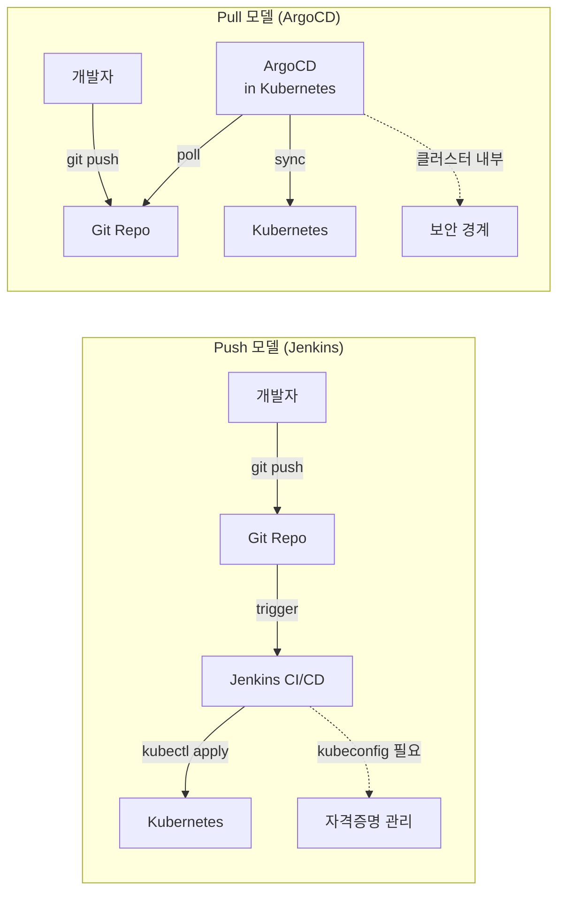
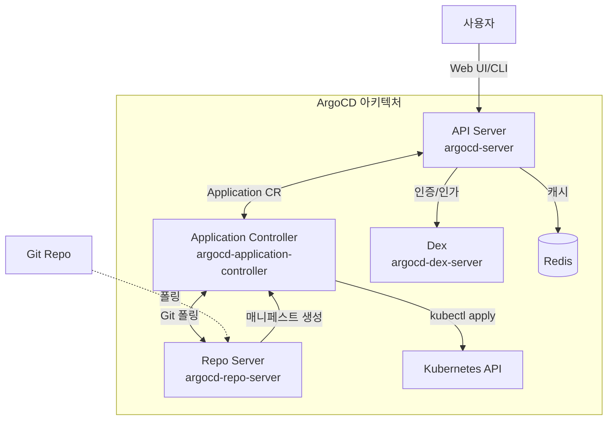

# Ch14. ArgoCD와 GitOps - Git을 진실의 원천으로

> 📌 **핵심 요약**
>
> GitOps는 Git 저장소를 애플리케이션과 인프라의 단일 진실 원천(Single Source of Truth)으로 삼아, 선언적 매니페스트를 Git에 저장하고 자동으로 클러스터에 동기화하는 운영 방식이다. ArgoCD는 Kubernetes 전용 GitOps CD 도구로, Git 저장소의 변경사항을 감지하여 클러스터 상태를 자동으로 일치시킨다. Push 방식(Jenkins가 kubectl apply)과 달리 Pull 방식(ArgoCD가 주기적으로 Git 폴링)을 사용하여 보안성과 감사 추적이 향상된다. 본 챕터에서는 GitOps 원칙, ArgoCD 아키텍처, 설치, Application CR 정의, Sync 전략, App of Apps 패턴을 다룬다.

## 🎯 학습 목표

1. GitOps의 4가지 핵심 원칙과 Push/Pull 배포 모델 차이 이해
2. ArgoCD의 아키텍처 구성 요소(API Server, Repo Server, Application Controller) 파악
3. Helm으로 ArgoCD 설치 및 초기 설정 실습
4. Application CR로 Git 저장소와 클러스터 연결 정의
5. Sync 전략(Manual/Auto, Self-Heal, Prune) 비교 및 선택 기준
6. Sync Waves와 Hooks로 리소스 배포 순서 제어
7. App of Apps 패턴으로 여러 애플리케이션 관리
8. Rollback과 히스토리 추적을 통한 안전한 배포 운영

---

## 1. 왜 GitOps인가

### 1.1 전통적인 배포의 문제점

Kubernetes 클러스터에 애플리케이션을 배포하는 전통적인 방식은 다음과 같다:

1. 개발자가 코드를 Git에 푸시
2. CI 파이프라인(Jenkins, GitHub Actions)이 Docker 이미지 빌드
3. CD 스크립트가 `kubectl apply -f deployment.yaml` 실행
4. 클러스터에 리소스 생성

이 방식은 간단해 보이지만 몇 가지 문제가 있다:

- **상태 불일치**: Git에 있는 매니페스트와 클러스터의 실제 상태가 다를 수 있다. 누군가 `kubectl edit`로 직접 수정하면 Git과 동기화되지 않는다.
- **감사 추적 부족**: 누가, 언제, 왜 배포했는지 추적하려면 CI 로그를 뒤져야 한다. Git 커밋 히스토리만으로는 클러스터 상태를 알 수 없다.
- **보안 위험**: CI 파이프라인이 클러스터에 직접 접근하려면 kubeconfig나 서비스 어카운트 토큰이 필요하다. 이 자격증명이 유출되면 클러스터 전체가 위험하다.
- **복구 어려움**: 클러스터가 망가졌을 때 어느 시점으로 돌아가야 하는지 불명확하다. Git 커밋을 revert해도 클러스터는 자동으로 롤백되지 않는다.

### 1.2 GitOps의 접근 방식

GitOps는 **Git을 진실의 원천(Single Source of Truth)**으로 삼는다. 클러스터 상태는 항상 Git 저장소의 매니페스트와 일치해야 하며, 모든 변경은 Git 커밋을 통해 이루어진다.

**핵심 개념**:
- **선언적 정의**: 원하는 상태를 YAML로 선언 (Deployment, Service 등)
- **버전 관리**: 모든 변경사항이 Git 커밋으로 기록됨 (누가, 언제, 무엇을)
- **자동 적용**: Git 변경사항이 자동으로 클러스터에 반영됨
- **자가 치유**: 클러스터 상태가 Git과 달라지면 자동으로 복구

이 접근 방식의 장점:
- **투명성**: Git 히스토리가 곧 배포 히스토리다.
- **롤백 용이**: `git revert` 후 ArgoCD가 자동으로 이전 상태로 복구한다.
- **보안**: 클러스터 내부의 ArgoCD가 Git을 폴링하므로, CI는 클러스터 자격증명이 필요 없다.
- **재현성**: Git 저장소만 있으면 언제든 동일한 클러스터 상태를 재현할 수 있다.

### 1.3 Push vs Pull 배포 모델



**Push 모델 (전통적 CD)**:
- CI/CD 파이프라인이 클러스터 외부에서 `kubectl apply` 실행
- 클러스터 접근 자격증명 필요 (보안 위험)
- Git → CI → Cluster 단방향 흐름
- 클러스터 상태가 Git과 불일치 가능 (drift)

**Pull 모델 (GitOps)**:
- ArgoCD가 클러스터 내부에서 Git 저장소를 주기적으로 폴링
- 클러스터 외부로 자격증명 노출 불필요
- Git ← ArgoCD → Cluster 양방향 동기화
- Drift 자동 감지 및 복구 (Self-Heal)

---

## 2. GitOps 원칙

Weaveworks가 정의한 GitOps의 4가지 핵심 원칙은 다음과 같다:

### 2.1 선언적 정의 (Declarative)

시스템의 원하는 상태를 선언적으로 정의해야 한다. Kubernetes는 이미 선언적 API를 제공한다 (Deployment, Service, ConfigMap 등). 명령형(Imperative) 방식인 `kubectl create`, `kubectl scale`은 GitOps에 적합하지 않다.

**예시**:
```yaml
# 선언적 - GitOps 적합
apiVersion: apps/v1
kind: Deployment
metadata:
  name: nginx
spec:
  replicas: 3
```

```bash
# 명령형 - GitOps 부적합
kubectl scale deployment nginx --replicas=3
```

### 2.2 버전 관리 (Versioned and Immutable)

모든 선언적 정의는 Git 같은 버전 관리 시스템에 저장되어야 한다. Git 커밋은 불변(Immutable)이므로, 특정 시점의 상태를 정확히 재현할 수 있다.

**이점**:
- 누가 무엇을 변경했는지 추적 (git blame, git log)
- 잘못된 변경은 `git revert`로 즉시 복구
- PR(Pull Request) 리뷰로 배포 전 검증

### 2.3 자동 적용 (Pulled Automatically)

Git 저장소의 변경사항은 자동으로 시스템에 적용되어야 한다. ArgoCD는 Git을 주기적으로 폴링(기본 3분)하여 변경사항을 감지하고 클러스터에 적용한다.

**Webhook 옵션**: Git 저장소에 Webhook을 설정하면 커밋 즉시 ArgoCD에 알림을 보내 동기화 지연을 줄일 수 있다 (3분 → 수 초).

### 2.4 지속적 조정 (Continuously Reconciled)

시스템의 실제 상태가 Git에 정의된 상태와 다르면, 자동으로 조정(Reconcile)되어야 한다. 이를 **자가 치유(Self-Healing)**라고 한다.

**시나리오**:
1. Git에 `replicas: 3`으로 정의됨
2. 누군가 `kubectl scale --replicas=5`로 수동 변경
3. ArgoCD가 Drift 감지 (OutOfSync 상태)
4. Self-Heal이 활성화되어 있으면 자동으로 `replicas: 3`으로 복구

---

## 3. ArgoCD 아키텍처

ArgoCD는 Kubernetes Controller 패턴을 따르며, 다음 구성 요소로 이루어져 있다.



### 3.1 API Server (argocd-server)

- **역할**: 웹 UI, CLI, API 엔드포인트 제공
- **기능**:
  - 사용자 인증/인가 (Dex SSO 연동 가능)
  - Application CR CRUD 작업
  - Sync/Refresh 수동 트리거
  - 실시간 상태 조회

**포트**: 기본적으로 ClusterIP Service (외부 접근은 Ingress나 Port-Forward 필요)

### 3.2 Repository Server (argocd-repo-server)

- **역할**: Git 저장소 접근 및 매니페스트 생성
- **기능**:
  - Git clone/pull 수행 (SSH, HTTPS 인증)
  - Helm 차트 렌더링 (`helm template`)
  - Kustomize 빌드 (`kustomize build`)
  - Jsonnet/YAML 파싱
  - 생성된 매니페스트를 Application Controller에 전달

**캐싱**: Redis를 사용하여 Git 클론 결과를 캐싱 (반복적인 폴링 시 성능 향상)

### 3.3 Application Controller (argocd-application-controller)

- **역할**: 핵심 Reconciliation 루프 실행
- **기능**:
  - Application CR 감시 (Kubernetes Watch API)
  - Git 저장소 주기적 폴링 (기본 3분)
  - 클러스터 실제 상태와 Git 상태 비교 (Diff)
  - Sync 작업 수행 (kubectl apply/delete)
  - Health Check (Pod가 Running인지, Service에 Endpoint 있는지)
  - Prune/Self-Heal 실행

**병렬 처리**: 여러 Application을 동시에 관리하기 위해 Worker 수 조정 가능 (`--repo-server-timeout-seconds`, `--status-processors`)

### 3.4 Dex (argocd-dex-server)

- **역할**: SSO(Single Sign-On) 통합
- **지원 IdP**: GitHub, GitLab, Google, LDAP, SAML, OIDC
- **기능**: 외부 인증 제공자와 연동하여 ArgoCD에 로그인

**예시**: GitHub Organization의 멤버만 ArgoCD 접근 허용

### 3.5 Redis

- **역할**: 캐싱 및 일시 데이터 저장
- **사용처**:
  - Git 저장소 클론 결과 캐싱
  - Application 상태 일시 저장
  - Webhook 이벤트 큐

---

## 4. ArgoCD 설치

### 4.1 Helm으로 설치

ArgoCD 공식 Helm 차트를 사용하여 설치한다.

```bash
# Argo Helm Repository 추가
helm repo add argo https://argoproj.github.io/argo-helm
helm repo update

# argocd 네임스페이스 생성
kubectl create namespace argocd

# Helm 설치 (기본 설정)
helm install argocd argo/argo-cd \
  --namespace argocd \
  --version 5.51.0
```

**주요 컴포넌트 확인**:
```bash
kubectl get pods -n argocd
# 출력 예시:
# argocd-application-controller-0
# argocd-dex-server-xxx
# argocd-redis-xxx
# argocd-repo-server-xxx
# argocd-server-xxx
```

### 4.2 초기 비밀번호 확인

ArgoCD는 초기 설치 시 `admin` 계정의 비밀번호를 Secret에 저장한다.

```bash
# 초기 비밀번호 확인
kubectl -n argocd get secret argocd-initial-admin-secret \
  -o jsonpath="{.data.password}" | base64 -d
```

### 4.3 Web UI 접근

```bash
# Port-Forward로 로컬 접근
kubectl port-forward svc/argocd-server -n argocd 8080:443

# 브라우저에서 https://localhost:8080 접속
# ID: admin
# PW: (위에서 확인한 비밀번호)
```

**프로덕션 환경**: Ingress를 설정하여 도메인으로 접근 (TLS 인증서 필수)

```yaml
# values.yaml
server:
  ingress:
    enabled: true
    hosts:
      - argocd.example.com
    tls:
      - secretName: argocd-tls
        hosts:
          - argocd.example.com
```

### 4.4 CLI 설치

```bash
# macOS
brew install argocd

# 로그인
argocd login localhost:8080 \
  --username admin \
  --password <초기-비밀번호> \
  --insecure

# 비밀번호 변경
argocd account update-password
```

---

## 5. Application CR 정의

ArgoCD는 Kubernetes Custom Resource인 `Application`을 사용하여 Git 저장소와 클러스터를 연결한다.

### 5.1 Application CR 구조

```yaml
apiVersion: argoproj.io/v1alpha1
kind: Application
metadata:
  name: my-app
  namespace: argocd
spec:
  # Git 저장소 정보
  source:
    repoURL: https://github.com/user/repo.git
    targetRevision: main
    path: manifests/dev

  # 배포 대상 클러스터
  destination:
    server: https://kubernetes.default.svc
    namespace: default

  # Sync 정책
  syncPolicy:
    automated:
      prune: true
      selfHeal: true
```

### 5.2 주요 필드 설명

| 필드 | 설명 | 예시 |
|------|------|------|
| `source.repoURL` | Git 저장소 URL | `https://github.com/user/repo.git` |
| `source.targetRevision` | 브랜치/태그/커밋 | `main`, `v1.2.3`, `abc123` |
| `source.path` | 저장소 내 경로 | `manifests/dev`, `charts/myapp` |
| `source.helm` | Helm 차트 설정 | `valueFiles: [values.yaml]` |
| `destination.server` | 타겟 클러스터 | `https://kubernetes.default.svc` (자기 자신) |
| `destination.namespace` | 배포 네임스페이스 | `default`, `production` |
| `syncPolicy.automated` | 자동 Sync 여부 | `prune`, `selfHeal` 옵션 |

### 5.3 Helm 차트 배포 예시

```yaml
apiVersion: argoproj.io/v1alpha1
kind: Application
metadata:
  name: nginx-helm
  namespace: argocd
spec:
  source:
    repoURL: https://charts.bitnami.com/bitnami
    chart: nginx
    targetRevision: 15.4.0
    helm:
      values: |
        replicaCount: 3
        service:
          type: LoadBalancer
  destination:
    server: https://kubernetes.default.svc
    namespace: web
  syncPolicy:
    automated: {}
    syncOptions:
      - CreateNamespace=true
```

**특징**:
- `source.chart`: Helm 차트 이름 (path 대신 사용)
- `helm.values`: values.yaml 내용을 인라인으로 정의
- `syncOptions.CreateNamespace`: 네임스페이스가 없으면 자동 생성

---

## 6. Sync 전략

ArgoCD의 핵심은 Git 상태와 클러스터 상태를 **동기화(Sync)**하는 것이다. Sync 전략에 따라 자동화 수준과 위험도가 달라진다.

### 6.1 Manual vs Automated Sync

**Manual Sync**:
```yaml
syncPolicy: {}  # 빈 객체 = Manual
```
- Git 변경사항이 있어도 자동으로 적용하지 않음
- 웹 UI 또는 CLI에서 수동으로 "Sync" 버튼 클릭 필요
- **사용 사례**: 프로덕션 환경에서 배포 전 검토 필요

**Automated Sync**:
```yaml
syncPolicy:
  automated: {}
```
- Git 변경사항 감지 시 자동으로 클러스터에 적용
- 3분마다 폴링 (또는 Webhook으로 즉시)
- **사용 사례**: 개발/스테이징 환경, 빠른 피드백 필요

### 6.2 Self-Heal

```yaml
syncPolicy:
  automated:
    selfHeal: true
```

**동작 방식**:
1. 클러스터 리소스가 Git과 다르면 OutOfSync 상태로 표시
2. `selfHeal: true`이면 ArgoCD가 자동으로 Git 상태로 복구
3. 예: `kubectl scale deployment nginx --replicas=5` 실행 → ArgoCD가 Git의 `replicas: 3`으로 되돌림

**주의사항**:
- HPA(Horizontal Pod Autoscaler)와 충돌 가능
  - HPA가 replicas를 변경 → ArgoCD가 원래대로 복구 → 무한 루프
  - 해결: ArgoCD에서 `ignoreDifferences`로 replicas 필드 무시

```yaml
ignoreDifferences:
  - group: apps
    kind: Deployment
    jsonPointers:
      - /spec/replicas
```

### 6.3 Prune

```yaml
syncPolicy:
  automated:
    prune: true
```

**동작 방식**:
- Git에서 삭제된 리소스를 클러스터에서도 자동 삭제
- 예: `deployment.yaml`을 Git에서 삭제 → ArgoCD가 클러스터의 Deployment도 삭제

**위험성**:
- 실수로 파일 삭제 시 프로덕션 리소스도 즉시 삭제됨
- **권장**: 프로덕션에서는 `prune: false` + Manual Sync

### 6.4 Sync 전략 비교 테이블

| 전략 | Manual Sync | Automated Sync | Automated + SelfHeal | Automated + Prune |
|------|-------------|----------------|----------------------|-------------------|
| **Git 변경 → 클러스터** | 수동 클릭 | 자동 | 자동 | 자동 |
| **클러스터 수동 변경** | 유지 (Drift) | 유지 (OutOfSync 표시) | 자동 복구 | 유지 |
| **Git 리소스 삭제** | 수동 삭제 필요 | 수동 삭제 필요 | 수동 삭제 필요 | 자동 삭제 |
| **안전성** | 높음 | 중간 | 낮음 (HPA 충돌) | 낮음 (실수 즉시 반영) |
| **사용 환경** | 프로덕션 | 스테이징 | 개발 | 개발 (조심해서) |

---

## 7. Sync Waves와 Hooks

### 7.1 왜 순서가 중요한가

Kubernetes 리소스는 의존성이 있다. 예를 들어:
1. Namespace를 먼저 생성
2. ConfigMap/Secret 생성
3. Deployment 생성 (ConfigMap을 참조)
4. Service 생성

ArgoCD는 기본적으로 모든 리소스를 병렬로 생성하므로, Deployment가 ConfigMap보다 먼저 생성되면 실패할 수 있다.

### 7.2 Sync Waves

**Annotation**으로 리소스 생성 순서를 제어한다.

```yaml
# 1. Namespace (Wave 0)
apiVersion: v1
kind: Namespace
metadata:
  name: myapp
  annotations:
    argocd.argoproj.io/sync-wave: "0"
---
# 2. ConfigMap (Wave 1)
apiVersion: v1
kind: ConfigMap
metadata:
  name: app-config
  annotations:
    argocd.argoproj.io/sync-wave: "1"
---
# 3. Deployment (Wave 2)
apiVersion: apps/v1
kind: Deployment
metadata:
  name: myapp
  annotations:
    argocd.argoproj.io/sync-wave: "2"
```

**동작 방식**:
- Wave 번호가 낮은 순서대로 생성 (음수 가능: -5, 0, 1, 10)
- 같은 Wave 내 리소스는 병렬 생성
- 이전 Wave의 모든 리소스가 Healthy 상태가 되어야 다음 Wave 시작

### 7.3 Hooks

특정 시점에 일회성 작업을 실행하는 리소스 (주로 Job, Pod).

**Hook 종류**:
- `PreSync`: Sync 전 실행 (예: DB 백업)
- `Sync`: 일반 리소스와 함께 실행
- `PostSync`: Sync 후 실행 (예: DB 마이그레이션)
- `SyncFail`: Sync 실패 시 실행 (예: 알림)

**예시**:
```yaml
apiVersion: batch/v1
kind: Job
metadata:
  name: db-migration
  annotations:
    argocd.argoproj.io/hook: PostSync
    argocd.argoproj.io/hook-delete-policy: HookSucceeded
spec:
  template:
    spec:
      containers:
      - name: migrate
        image: migrate/migrate
        command: ["migrate", "-path", "/migrations", "-database", "$DB_URL", "up"]
      restartPolicy: Never
```

**delete-policy**:
- `HookSucceeded`: Job 성공 시 삭제
- `HookFailed`: Job 실패 시 삭제
- `BeforeHookCreation`: 다음 Sync 전 삭제

---

## 8. App of Apps 패턴

### 8.1 문제 상황

마이크로서비스 아키텍처에서는 수십 개의 Application을 관리해야 한다. 각 Application마다 별도의 Application CR을 수동으로 생성하면 관리가 어렵다.

### 8.2 App of Apps 패턴

**핵심 아이디어**: Application CR 자체를 Git에 저장하고, 이를 배포하는 "Root Application"을 만든다.

```
apps/
├── root-app.yaml          # Root Application
└── applications/
    ├── frontend-app.yaml
    ├── backend-app.yaml
    └── redis-app.yaml
```

**Root Application**:
```yaml
apiVersion: argoproj.io/v1alpha1
kind: Application
metadata:
  name: root-app
  namespace: argocd
spec:
  source:
    repoURL: https://github.com/user/argocd-apps.git
    path: applications
    targetRevision: main
  destination:
    server: https://kubernetes.default.svc
    namespace: argocd
  syncPolicy:
    automated: {}
```

**Child Application 예시**:
```yaml
# applications/frontend-app.yaml
apiVersion: argoproj.io/v1alpha1
kind: Application
metadata:
  name: frontend
  namespace: argocd
spec:
  source:
    repoURL: https://github.com/user/frontend.git
    path: k8s
    targetRevision: main
  destination:
    server: https://kubernetes.default.svc
    namespace: production
  syncPolicy:
    automated:
      prune: true
```

**동작 흐름**:
1. `root-app`이 `applications/` 디렉토리를 폴링
2. `frontend-app.yaml` 변경 감지 → Application CR 생성
3. `frontend` Application이 자신의 Git 저장소를 폴링
4. 실제 Frontend 리소스 배포

**이점**:
- Application 추가 시 YAML 파일 하나만 커밋하면 됨
- 모든 Application을 한 곳에서 관리
- Git 히스토리로 어떤 Application이 언제 추가/삭제되었는지 추적

---

## 9. Rollback과 히스토리

### 9.1 History 조회

ArgoCD는 각 Sync 작업마다 히스토리를 저장한다.

```bash
# Application 히스토리 조회
argocd app history myapp

# 출력 예시:
# ID  DATE                REVISION
# 0   2024-02-10 10:00    abc123  (Initial deployment)
# 1   2024-02-10 11:00    def456  (Update replicas to 3)
# 2   2024-02-10 12:00    ghi789  (Add healthcheck)
```

**각 히스토리는**:
- Git 커밋 해시 (Revision)
- 배포 시각
- Sync 결과 (성공/실패)

### 9.2 Rollback 수행

```bash
# 특정 히스토리로 롤백
argocd app rollback myapp 1

# 또는 Git 커밋으로 롤백
argocd app rollback myapp --revision def456
```

**동작 방식**:
1. ArgoCD가 해당 Revision의 매니페스트를 다시 가져옴
2. 클러스터에 적용 (kubectl apply)
3. 새로운 히스토리 생성 (Rollback to ID 1)

**주의**: Git 저장소는 변경되지 않는다. 클러스터만 이전 상태로 되돌아간다. Git도 일치시키려면 `git revert` 필요.

### 9.3 Git Revert를 통한 롤백 (권장)

```bash
# Git에서 커밋 되돌리기
git revert ghi789
git push

# ArgoCD가 자동으로 감지하여 클러스터 롤백 (Automated Sync 경우)
```

**이점**:
- Git 히스토리에 Rollback도 기록됨
- 감사 추적 유지
- GitOps 원칙 준수 (Git이 진실의 원천)

---

## 10. 실습: 샘플 앱 GitOps 배포

### 10.1 Git 저장소 준비

**TODO (사용자 직접 수행)**:

1. GitHub에 새 저장소 생성 (예: `argocd-demo`)
2. 다음 디렉토리 구조 생성:

```
argocd-demo/
├── manifests/
│   ├── deployment.yaml
│   ├── service.yaml
│   └── configmap.yaml
└── argocd/
    └── application.yaml
```

3. `manifests/deployment.yaml`:
```yaml
apiVersion: apps/v1
kind: Deployment
metadata:
  name: nginx-demo
spec:
  replicas: 2
  selector:
    matchLabels:
      app: nginx
  template:
    metadata:
      labels:
        app: nginx
    spec:
      containers:
      - name: nginx
        image: nginx:1.21
        ports:
        - containerPort: 80
```

4. `manifests/service.yaml`:
```yaml
apiVersion: v1
kind: Service
metadata:
  name: nginx-demo
spec:
  selector:
    app: nginx
  ports:
  - port: 80
    targetPort: 80
  type: ClusterIP
```

5. Git 푸시:
```bash
git add .
git commit -m "Initial GitOps setup"
git push
```

### 10.2 Application 생성

```bash
# CLI로 Application 생성
argocd app create nginx-demo \
  --repo https://github.com/<your-username>/argocd-demo.git \
  --path manifests \
  --dest-server https://kubernetes.default.svc \
  --dest-namespace default \
  --sync-policy automated \
  --auto-prune \
  --self-heal

# 상태 확인
argocd app get nginx-demo
```

**또는 YAML로 생성**:
```yaml
# argocd/application.yaml
apiVersion: argoproj.io/v1alpha1
kind: Application
metadata:
  name: nginx-demo
  namespace: argocd
spec:
  source:
    repoURL: https://github.com/<your-username>/argocd-demo.git
    path: manifests
    targetRevision: HEAD
  destination:
    server: https://kubernetes.default.svc
    namespace: default
  syncPolicy:
    automated:
      prune: true
      selfHeal: true
```

```bash
kubectl apply -f argocd/application.yaml
```

### 10.3 변경사항 적용 테스트

**Git에서 replicas 변경**:
```yaml
# manifests/deployment.yaml
spec:
  replicas: 5  # 2 → 5로 변경
```

```bash
git add manifests/deployment.yaml
git commit -m "Scale to 5 replicas"
git push
```

**ArgoCD 확인**:
```bash
# 3분 이내 자동 동기화 확인
argocd app get nginx-demo

# Pod 수 확인
kubectl get pods -l app=nginx
# 5개의 Pod가 Running 상태여야 함
```

### 10.4 Self-Heal 테스트

```bash
# 수동으로 replicas 변경
kubectl scale deployment nginx-demo --replicas=1

# ArgoCD가 OutOfSync 감지 후 자동 복구 (약 5초 이내)
kubectl get pods -l app=nginx
# 다시 5개의 Pod로 복구됨
```

---

## 정리

GitOps는 단순히 배포 자동화를 넘어, 클러스터 운영의 투명성과 안정성을 높이는 패러다임이다. ArgoCD는 Kubernetes 네이티브 GitOps 도구로, Pull 모델을 통해 보안성을 강화하고 선언적 Application CR로 Git과 클러스터를 연결한다.

**핵심 포인트**:

1. **GitOps 원칙**: 선언적 정의, 버전 관리, 자동 적용, 지속적 조정
2. **Pull vs Push**: ArgoCD는 클러스터 내부에서 Git을 폴링하여 외부 자격증명 노출 방지
3. **Application CR**: `source`(Git 저장소) + `destination`(클러스터/네임스페이스) + `syncPolicy`
4. **Sync 전략**:
   - Manual: 프로덕션 (검토 후 배포)
   - Automated: 스테이징 (빠른 피드백)
   - SelfHeal: 개발 (Drift 자동 복구, HPA 주의)
   - Prune: 개발 (실수 위험, 조심)
5. **Sync Waves**: Annotation으로 리소스 생성 순서 제어 (Namespace → ConfigMap → Deployment)
6. **Hooks**: PreSync/PostSync로 일회성 작업 실행 (DB 마이그레이션, 백업)
7. **App of Apps**: Application CR을 Git에 저장하여 여러 앱을 한 번에 관리
8. **Rollback**: `argocd app rollback` 또는 `git revert` (후자 권장)

**다음 단계**: Ch15에서 kube-prometheus-stack으로 ArgoCD 자체를 모니터링하고, Sync 실패 시 AlertManager로 알림을 받는 방법을 다룬다. GitOps로 배포한 애플리케이션의 헬스체크, 로그 수집, 트러블슈팅 기법을 학습한다.
