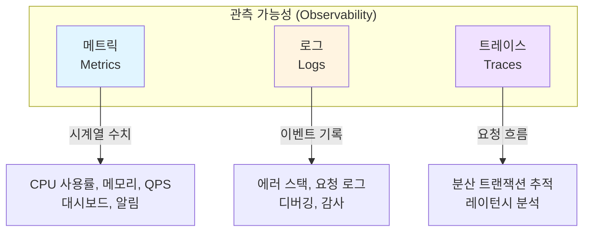
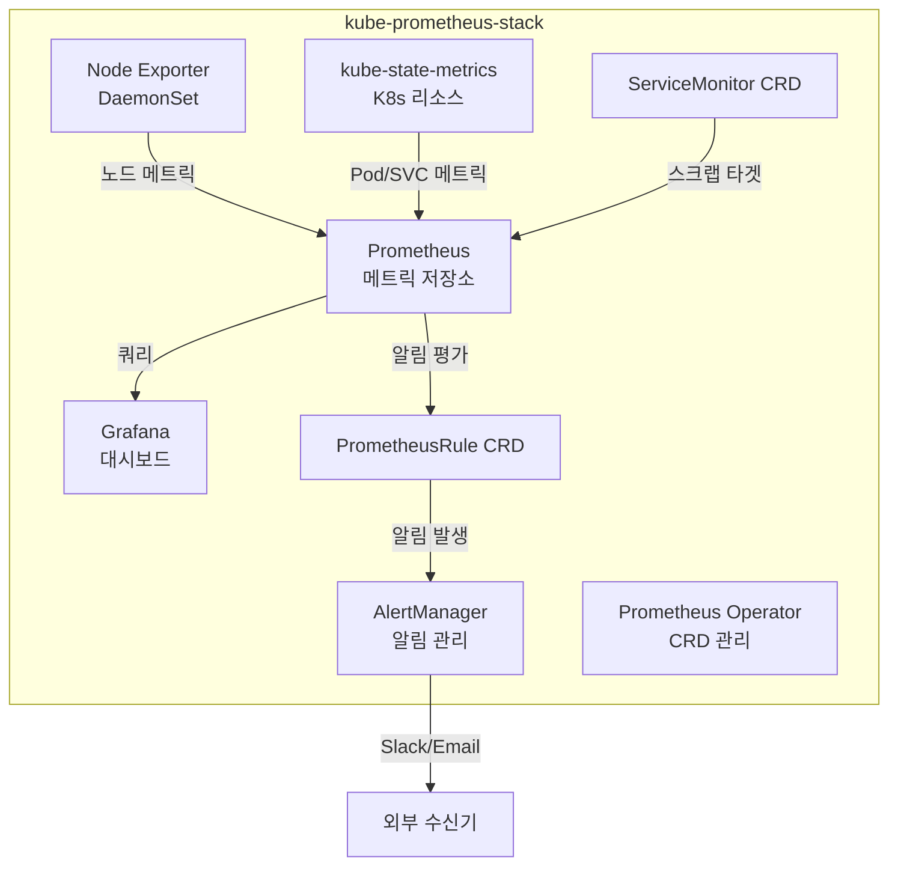
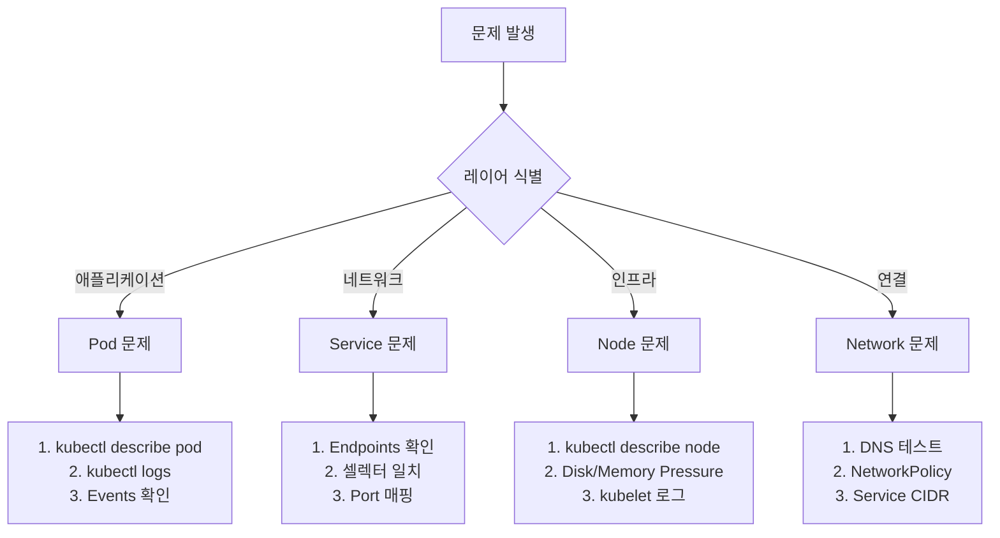

# Ch15. Kubernetes 모니터링과 트러블슈팅 - 관측 가능성 확보

> 📌 **핵심 요약**
>
> Kubernetes 클러스터를 안정적으로 운영하려면 시스템의 상태를 지속적으로 관찰하고, 문제 발생 시 빠르게 원인을 파악할 수 있어야 한다. 관측 가능성(Observability)은 메트릭, 로그, 트레이스라는 세 가지 기둥으로 구성되며, 각각은 시스템의 다른 측면을 보여준다. kube-prometheus-stack은 Prometheus, Grafana, AlertManager를 통합하여 Kubernetes 네이티브 모니터링 스택을 제공한다. 본 챕터에서는 모니터링 스택 설치, PromQL 기본 쿼리, 대시보드 구성, 알림 설정, 그리고 Pod/Service/Node/Network 문제를 체계적으로 진단하는 트러블슈팅 기법을 다룬다.

## 🎯 학습 목표

1. 관측 가능성의 3요소(메트릭, 로그, 트레이스)와 각각의 역할 이해
2. kube-prometheus-stack 설치 및 구성 요소 파악
3. Prometheus로 메트릭 수집 및 ServiceMonitor 동작 원리 이해
4. Grafana 대시보드로 클러스터 상태 시각화
5. AlertManager로 알림 규칙, 라우팅, 수신기 설정
6. 로그 수집 전략 및 Loki 소개
7. Pod, Service, Node, Network 문제를 체계적으로 진단하는 기법
8. 유용한 kubectl 디버깅 명령어 및 ephemeral container 활용

---

## 1. 왜 모니터링이 중요한가

### 1.1 운영 환경의 불확실성

프로덕션 Kubernetes 클러스터는 수백 개의 Pod, 수십 개의 Node, 복잡한 네트워크 구성으로 이루어져 있다. 이 환경에서는 다양한 문제가 발생할 수 있다:

- **리소스 부족**: 메모리 부족으로 Pod가 OOMKilled, CPU 부족으로 응답 지연
- **네트워크 문제**: DNS 장애, Service 엔드포인트 누락, NetworkPolicy 차단
- **애플리케이션 버그**: NullPointerException, 데드락, 메모리 누수
- **인프라 장애**: Node 다운, 디스크 풀, 네트워크 파티션

이러한 문제를 사전에 감지하고 빠르게 해결하려면, 시스템의 내부 상태를 지속적으로 관찰할 수 있어야 한다. "관측 가능성(Observability)"은 시스템 외부에서 출력되는 데이터만으로 내부 상태를 추론할 수 있는 능력을 의미한다.

### 1.2 관측 가능성의 3요소



**메트릭 (Metrics)**:
- **정의**: 시간에 따른 수치 데이터 (CPU, 메모리, QPS, 레이턴시)
- **형식**: 시계열 데이터베이스에 저장 (Prometheus, InfluxDB)
- **용도**: 대시보드 시각화, 임계값 기반 알림, 트렌드 분석
- **예시**: `container_memory_usage_bytes`, `http_requests_total`

**로그 (Logs)**:
- **정의**: 이벤트의 기록 (애플리케이션 로그, 시스템 로그)
- **형식**: 텍스트 (JSON, Plain text) → 로그 수집기(Loki, Elasticsearch)
- **용도**: 특정 요청의 상세 정보 확인, 에러 스택 트레이스, 감사 추적
- **예시**: `ERROR: NullPointerException at line 42`

**트레이스 (Traces)**:
- **정의**: 분산 시스템에서 단일 요청의 전체 경로 추적
- **형식**: Span 그래프 (Jaeger, Zipkin)
- **용도**: 마이크로서비스 간 레이턴시 분석, 병목 구간 파악
- **예시**: API Gateway (10ms) → Auth Service (50ms) → DB (200ms)

**언제 무엇을 사용하는가**:
- **메트릭**: "CPU 사용률이 80%를 넘었나?" (시스템 전체 상태)
- **로그**: "왜 이 요청이 실패했나?" (특정 이벤트 디버깅)
- **트레이스**: "왜 이 API가 느린가?" (분산 시스템 병목)

---

## 2. kube-prometheus-stack 소개

### 2.1 구성 요소

kube-prometheus-stack은 Kubernetes 모니터링에 필요한 모든 컴포넌트를 하나의 Helm 차트로 제공한다.

**포함된 도구**:
1. **Prometheus**: 메트릭 수집 및 저장 (시계열 DB)
2. **Grafana**: 대시보드 및 시각화
3. **AlertManager**: 알림 관리 (라우팅, 그룹핑, 억제)
4. **Prometheus Operator**: ServiceMonitor, PrometheusRule CRD 관리
5. **Node Exporter**: 노드 수준 메트릭 (CPU, 메모리, 디스크, 네트워크)
6. **kube-state-metrics**: Kubernetes 리소스 메트릭 (Pod, Deployment 상태)
7. **Grafana 대시보드**: 사전 구성된 Kubernetes 대시보드 (15개 이상)



### 2.2 메트릭 수집 방식

Prometheus는 **Pull 모델**을 사용한다. 모니터링 대상(Target)이 메트릭을 Prometheus에 보내는 것이 아니라, Prometheus가 주기적으로 Target의 `/metrics` 엔드포인트에 HTTP 요청을 보내 메트릭을 가져온다.

**장점**:
- **타겟 상태 확인**: Target이 다운되면 Prometheus가 즉시 감지 (스크랩 실패)
- **중앙 집중식 설정**: 타겟 목록을 Prometheus가 관리 (Service Discovery)
- **백프레셔 방지**: 타겟이 메트릭을 밀어 넣지 않으므로 Prometheus 부하 제어 가능

**대안 (Push 모델)**: StatsD, Graphite는 애플리케이션이 메트릭을 Push한다. 단기 실행 작업(Batch Job)에 적합하지만, Kubernetes 환경에서는 Pull 모델이 더 자연스럽다.

---

## 3. Helm으로 설치

### 3.1 기본 설치

```bash
# Helm Repository 추가
helm repo add prometheus-community https://prometheus-community.github.io/helm-charts
helm repo update

# monitoring 네임스페이스 생성
kubectl create namespace monitoring

# Helm 설치 (기본 설정)
helm install kube-prometheus prometheus-community/kube-prometheus-stack \
  --namespace monitoring \
  --version 56.0.0
```

**설치 확인**:
```bash
kubectl get pods -n monitoring
# 출력 예시:
# kube-prometheus-kube-state-metrics-xxx
# kube-prometheus-prometheus-node-exporter-xxx (각 노드마다)
# prometheus-kube-prometheus-prometheus-0
# alertmanager-kube-prometheus-alertmanager-0
# kube-prometheus-grafana-xxx
```

### 3.2 커스터마이징 (values.yaml)

프로덕션 환경에서는 리소스 제한, 스토리지, Ingress를 설정해야 한다.

```yaml
# values.yaml
prometheus:
  prometheusSpec:
    # 메트릭 보관 기간
    retention: 30d
    # 스토리지 (PVC)
    storageSpec:
      volumeClaimTemplate:
        spec:
          accessModes: ["ReadWriteOnce"]
          resources:
            requests:
              storage: 50Gi
    # 리소스 제한
    resources:
      requests:
        memory: 2Gi
        cpu: 1000m
      limits:
        memory: 4Gi
        cpu: 2000m

grafana:
  adminPassword: "your-secure-password"
  ingress:
    enabled: true
    hosts:
      - grafana.example.com
    tls:
      - secretName: grafana-tls
        hosts:
          - grafana.example.com
  persistence:
    enabled: true
    size: 10Gi

alertmanager:
  config:
    global:
      slack_api_url: 'https://hooks.slack.com/services/YOUR/SLACK/WEBHOOK'
    route:
      receiver: 'slack-notifications'
      group_by: ['alertname', 'cluster']
      group_wait: 10s
      group_interval: 5m
      repeat_interval: 12h
    receivers:
      - name: 'slack-notifications'
        slack_configs:
          - channel: '#alerts'
            title: '{{ .GroupLabels.alertname }}'
            text: '{{ range .Alerts }}{{ .Annotations.summary }}{{ end }}'
```

```bash
# 커스텀 values로 설치
helm install kube-prometheus prometheus-community/kube-prometheus-stack \
  --namespace monitoring \
  --values values.yaml
```

### 3.3 접근 방법

**Grafana 웹 UI**:
```bash
# Port-Forward
kubectl port-forward -n monitoring svc/kube-prometheus-grafana 3000:80

# 브라우저에서 http://localhost:3000
# ID: admin
# PW: (values.yaml의 adminPassword 또는 기본값 "prom-operator")
```

**Prometheus UI**:
```bash
kubectl port-forward -n monitoring svc/prometheus-kube-prometheus-prometheus 9090:9090
# http://localhost:9090
```

**AlertManager UI**:
```bash
kubectl port-forward -n monitoring svc/alertmanager-kube-prometheus-alertmanager 9093:9093
# http://localhost:9093
```

---

## 4. Prometheus 기본

### 4.1 메트릭 수집 확인

Prometheus UI에서 **Status → Targets**를 확인하면, 현재 스크랩 중인 타겟 목록을 볼 수 있다.

**기본 타겟**:
- `kubernetes-apiservers`: Kubernetes API Server 메트릭
- `kubernetes-nodes`: kubelet 메트릭 (각 노드)
- `kubernetes-pods`: Pod의 `/metrics` 엔드포인트 (Annotation으로 자동 발견)
- `kube-state-metrics`: Kubernetes 리소스 상태

### 4.2 PromQL 기본 쿼리

PromQL(Prometheus Query Language)은 시계열 데이터를 조회하는 함수형 쿼리 언어다.

**예시 1: 현재 메모리 사용량**
```promql
container_memory_usage_bytes{namespace="default"}
```

**예시 2: CPU 사용률 (최근 5분 평균)**
```promql
rate(container_cpu_usage_seconds_total{namespace="default"}[5m])
```

**예시 3: Pod별 네트워크 수신량 (초당 바이트)**
```promql
rate(container_network_receive_bytes_total[1m])
```

**예시 4: Deployment의 replica 수**
```promql
kube_deployment_spec_replicas{namespace="default"}
```

**예시 5: 5분간 재시작된 Pod 수**
```promql
increase(kube_pod_container_status_restarts_total[5m]) > 0
```

**주요 함수**:
- `rate()`: 시간당 변화율 (Counter 메트릭에 사용)
- `increase()`: 기간 내 총 증가량
- `sum()`: 합계 (예: `sum by (namespace)`)
- `avg()`: 평균
- `max()`, `min()`: 최대, 최소

### 4.3 ServiceMonitor

**문제**: 사용자가 만든 애플리케이션의 메트릭을 Prometheus가 어떻게 발견하는가?

**해결**: Prometheus Operator는 **ServiceMonitor** CRD를 감시하여, 자동으로 스크랩 타겟을 추가한다.

**예시**: Nginx Exporter 배포 + ServiceMonitor

```yaml
# 1. Nginx Exporter Deployment
apiVersion: apps/v1
kind: Deployment
metadata:
  name: nginx-exporter
spec:
  replicas: 1
  selector:
    matchLabels:
      app: nginx-exporter
  template:
    metadata:
      labels:
        app: nginx-exporter
    spec:
      containers:
      - name: exporter
        image: nginx/nginx-prometheus-exporter:0.11
        args: ["-nginx.scrape-uri=http://nginx/stub_status"]
        ports:
        - containerPort: 9113
          name: metrics
---
# 2. Service
apiVersion: v1
kind: Service
metadata:
  name: nginx-exporter
  labels:
    app: nginx-exporter
spec:
  selector:
    app: nginx-exporter
  ports:
  - port: 9113
    name: metrics
---
# 3. ServiceMonitor
apiVersion: monitoring.coreos.com/v1
kind: ServiceMonitor
metadata:
  name: nginx-exporter
  labels:
    release: kube-prometheus  # Prometheus가 이 라벨을 가진 ServiceMonitor 선택
spec:
  selector:
    matchLabels:
      app: nginx-exporter
  endpoints:
  - port: metrics
    interval: 30s
    path: /metrics
```

**동작 흐름**:
1. ServiceMonitor CR 생성
2. Prometheus Operator가 ServiceMonitor 감지
3. Service의 셀렉터로 Pod 엔드포인트 발견
4. Prometheus가 30초마다 `http://nginx-exporter:9113/metrics` 스크랩
5. Prometheus UI의 Targets에 `nginx-exporter` 추가됨

**주의**: `labels.release: kube-prometheus`는 Prometheus가 이 ServiceMonitor를 선택하기 위한 라벨이다. Helm values의 `prometheus.prometheusSpec.serviceMonitorSelector`에서 설정할 수 있다.

---

## 5. Grafana 대시보드

### 5.1 기본 제공 대시보드

kube-prometheus-stack은 사전 구성된 대시보드를 제공한다.

**주요 대시보드**:
- **Kubernetes / Compute Resources / Cluster**: 클러스터 전체 CPU, 메모리, 네트워크
- **Kubernetes / Compute Resources / Namespace (Pods)**: 네임스페이스별 Pod 리소스 사용량
- **Kubernetes / Compute Resources / Node (Pods)**: 노드별 Pod 분포
- **Kubernetes / Networking / Cluster**: 네트워크 I/O, 패킷 드롭
- **Node Exporter / Nodes**: 노드 수준 상세 메트릭 (CPU, 메모리, 디스크, 네트워크)

**접근 방법**:
1. Grafana 로그인 → 왼쪽 메뉴 "Dashboards"
2. "Kubernetes"로 검색
3. 원하는 대시보드 클릭

### 5.2 커스텀 대시보드 추가

**방법 1: JSON 임포트**

1. Grafana.com에서 대시보드 검색 (예: ID 13770 "Kubernetes Cluster Monitoring")
2. Grafana UI → "+" → "Import"
3. Dashboard ID 입력 또는 JSON 붙여넣기
4. Prometheus 데이터 소스 선택 → "Import"

**방법 2: Helm values로 추가**

```yaml
# values.yaml
grafana:
  dashboardProviders:
    dashboardproviders.yaml:
      apiVersion: 1
      providers:
      - name: 'custom'
        orgId: 1
        folder: 'Custom'
        type: file
        disableDeletion: false
        editable: true
        options:
          path: /var/lib/grafana/dashboards/custom
  dashboards:
    custom:
      my-app-dashboard:
        url: https://example.com/dashboards/my-app.json
```

### 5.3 유용한 PromQL 쿼리 (대시보드 패널용)

**패널 1: Pod 메모리 사용률 Top 10**
```promql
topk(10,
  container_memory_usage_bytes{namespace="production"}
  /
  container_spec_memory_limit_bytes{namespace="production"} * 100
)
```

**패널 2: HTTP 요청률 (초당)**
```promql
sum(rate(http_requests_total[1m])) by (service, status_code)
```

**패널 3: Pod 재시작 횟수 (최근 1시간)**
```promql
increase(kube_pod_container_status_restarts_total{namespace="production"}[1h])
```

**패널 4: Persistent Volume 사용률**
```promql
kubelet_volume_stats_used_bytes / kubelet_volume_stats_capacity_bytes * 100
```

---

## 6. AlertManager

### 6.1 알림 규칙 (PrometheusRule)

**예시: Pod가 30분 이상 Pending 상태**

```yaml
apiVersion: monitoring.coreos.com/v1
kind: PrometheusRule
metadata:
  name: pod-alerts
  namespace: monitoring
  labels:
    release: kube-prometheus
spec:
  groups:
  - name: pod.rules
    interval: 30s
    rules:
    - alert: PodStuckInPending
      expr: |
        kube_pod_status_phase{phase="Pending"} == 1
      for: 30m
      labels:
        severity: warning
      annotations:
        summary: "Pod {{ $labels.namespace }}/{{ $labels.pod }} stuck in Pending"
        description: "Pod has been in Pending state for more than 30 minutes."

    - alert: HighPodRestartRate
      expr: |
        rate(kube_pod_container_status_restarts_total[15m]) > 0.05
      for: 5m
      labels:
        severity: critical
      annotations:
        summary: "High restart rate for {{ $labels.namespace }}/{{ $labels.pod }}"
        description: "Pod is restarting {{ $value }} times per second."
```

**동작 흐름**:
1. Prometheus가 30초마다 `expr` 쿼리 평가
2. 결과가 `true`이고 `for` 기간(30m) 동안 지속되면 알림 발생
3. AlertManager로 알림 전송 (labels, annotations 포함)

### 6.2 라우팅 (Routing)

AlertManager는 알림을 라벨 기반으로 라우팅한다.

**예시 설정**:
```yaml
# values.yaml의 alertmanager.config
route:
  receiver: 'default'
  group_by: ['alertname', 'namespace']
  group_wait: 10s        # 첫 알림 대기 시간
  group_interval: 5m     # 같은 그룹 재전송 간격
  repeat_interval: 12h   # 동일 알림 반복 간격

  routes:
  # critical 알림은 Slack + PagerDuty
  - match:
      severity: critical
    receiver: 'critical-team'
    group_wait: 0s

  # warning 알림은 Slack만
  - match:
      severity: warning
    receiver: 'slack-notifications'

  # production 네임스페이스는 별도 채널
  - match:
      namespace: production
    receiver: 'production-slack'

receivers:
  - name: 'default'
    slack_configs:
      - channel: '#alerts'

  - name: 'critical-team'
    slack_configs:
      - channel: '#critical-alerts'
        send_resolved: true
    pagerduty_configs:
      - service_key: 'YOUR_PAGERDUTY_KEY'

  - name: 'slack-notifications'
    slack_configs:
      - channel: '#warnings'

  - name: 'production-slack'
    slack_configs:
      - channel: '#production-alerts'
```

### 6.3 Grouping, Inhibition, Silencing

**Grouping**: 같은 그룹의 알림을 하나의 메시지로 묶는다.
- 예: 10개 Pod가 동시에 CrashLoop → 10개 메시지 대신 1개 그룹 메시지

**Inhibition**: 특정 알림이 발생하면 다른 알림을 억제한다.
```yaml
inhibit_rules:
  - source_match:
      severity: 'critical'
    target_match:
      severity: 'warning'
    equal: ['namespace', 'pod']
```
- 예: critical 알림이 발생하면 같은 Pod의 warning 알림은 억제

**Silencing**: 특정 기간 동안 알림을 임시로 무시한다.
- 사용 사례: 계획된 점검 중, 배포 중
- AlertManager UI → "Silences" → "New Silence" → 라벨 조건 설정

---

## 7. 로그 수집 전략

### 7.1 kubectl logs

가장 기본적인 방법은 `kubectl logs`다.

```bash
# Pod 로그 확인
kubectl logs <pod-name>

# 특정 컨테이너 (멀티 컨테이너 Pod)
kubectl logs <pod-name> -c <container-name>

# 이전 컨테이너 로그 (재시작 후)
kubectl logs <pod-name> --previous

# 실시간 스트리밍
kubectl logs -f <pod-name>

# 최근 100줄
kubectl logs <pod-name> --tail=100

# 타임스탬프 포함
kubectl logs <pod-name> --timestamps
```

**한계**: Pod가 삭제되면 로그도 사라진다. 여러 Pod의 로그를 동시에 보기 어렵다.

### 7.2 stern

여러 Pod의 로그를 동시에 볼 수 있는 도구다.

```bash
# 설치 (macOS)
brew install stern

# Deployment의 모든 Pod 로그
stern <deployment-name>

# 네임스페이스 전체
stern . -n production

# 라벨 셀렉터
stern -l app=nginx

# 정규식 필터
stern "^backend-.*"
```

### 7.3 Loki 소개

**Loki**는 Grafana Labs가 만든 로그 수집 시스템으로, Prometheus와 유사한 아키텍처를 가진다.

**특징**:
- **라벨 기반 인덱싱**: 로그 내용 전체를 인덱싱하지 않고, 라벨(namespace, pod, container)만 인덱싱하여 경량화
- **Grafana 통합**: Grafana 대시보드에서 메트릭과 로그를 함께 조회 (Explore 탭)
- **PromQL 스타일 쿼리**: LogQL 쿼리 언어 사용

**설치 (Helm)**:
```bash
helm repo add grafana https://grafana.github.io/helm-charts
helm install loki grafana/loki-stack \
  --namespace monitoring \
  --set grafana.enabled=false  # 기존 Grafana 사용
```

**Grafana에서 Loki 데이터 소스 추가**:
1. Grafana → Configuration → Data Sources → Add data source
2. Loki 선택
3. URL: `http://loki:3100`

**LogQL 예시**:
```logql
# production 네임스페이스의 모든 로그
{namespace="production"}

# 에러 로그만 필터
{namespace="production"} |= "ERROR"

# 초당 에러 수
rate({namespace="production"} |= "ERROR" [5m])
```

---

## 8. 체계적 트러블슈팅 기법

Kubernetes 문제는 크게 **Pod**, **Service**, **Node**, **Network** 레이어로 나눌 수 있다.



### 8.1 Pod 문제 진단

#### CrashLoopBackOff

**증상**: Pod가 시작 후 즉시 종료되고 재시작을 반복한다.

**원인**:
1. 애플리케이션 크래시 (NullPointerException, 설정 오류)
2. Liveness Probe 실패
3. 의존성 누락 (ConfigMap, Secret)

**진단 순서**:
```bash
# 1. Pod 상태 확인
kubectl get pod <pod-name>

# 2. 상세 정보
kubectl describe pod <pod-name>
# → Events 섹션에서 재시작 이유 확인

# 3. 현재 로그
kubectl logs <pod-name>

# 4. 이전 컨테이너 로그 (재시작 전)
kubectl logs <pod-name> --previous
```

**해결**:
- 로그에서 에러 메시지 확인 → 애플리케이션 수정
- Liveness Probe 주기 늘리기 (`initialDelaySeconds`, `periodSeconds`)

#### ImagePullBackOff

**증상**: 컨테이너 이미지를 pull하지 못함.

**원인**:
1. 이미지 이름 오타 (`nginx:latset` → `nginx:latest`)
2. Private 레지스트리 인증 실패
3. 네트워크 문제 (레지스트리 접근 불가)

**진단**:
```bash
kubectl describe pod <pod-name>
# → Events: "Failed to pull image" → 이유 확인
```

**해결**:
- 이미지 이름 확인: `docker pull <image>` 테스트
- Private 레지스트리: imagePullSecrets 설정

```yaml
spec:
  imagePullSecrets:
  - name: regcred
```

```bash
# regcred Secret 생성
kubectl create secret docker-registry regcred \
  --docker-server=<registry> \
  --docker-username=<user> \
  --docker-password=<pass>
```

#### Pending

**증상**: Pod가 스케줄링되지 않음.

**원인**:
1. 리소스 부족 (CPU, 메모리)
2. Node Selector/Affinity 불일치
3. Taint/Toleration 문제
4. PVC Pending (스토리지 없음)

**진단**:
```bash
kubectl describe pod <pod-name>
# → Events: "0/3 nodes are available: insufficient cpu"
```

**해결**:
- 리소스 부족: 노드 추가 또는 다른 Pod 삭제
- Node Selector: `kubectl get nodes --show-labels`로 라벨 확인
- PVC: `kubectl get pvc`로 Bound 상태 확인

#### OOMKilled

**증상**: 메모리 부족으로 컨테이너 종료.

**원인**:
- 메모리 limits가 너무 낮음
- 애플리케이션 메모리 누수

**진단**:
```bash
kubectl describe pod <pod-name>
# → Last State: Terminated, Reason: OOMKilled

# 메트릭 확인 (metrics-server 필요)
kubectl top pod <pod-name>
```

**해결**:
- limits 증가
```yaml
resources:
  limits:
    memory: 512Mi  # 256Mi → 512Mi
```
- 메모리 누수 분석 (Heap Dump, Profiler)

### 8.2 Service 문제 진단

#### Endpoints 없음

**증상**: Service가 생성되었지만 트래픽이 Pod에 도달하지 않음.

**진단**:
```bash
# Service 확인
kubectl get svc <service-name>

# Endpoints 확인
kubectl get endpoints <service-name>
# → ADDRESS가 비어 있으면 Pod가 선택되지 않음
```

**원인**:
1. Service selector와 Pod label 불일치
2. Pod가 Ready 상태가 아님 (Readiness Probe 실패)

**해결**:
```bash
# Pod 라벨 확인
kubectl get pods --show-labels

# Service selector 확인
kubectl get svc <service-name> -o yaml | grep selector

# 라벨 일치 여부 확인
kubectl get pods -l app=nginx
```

#### Port 매핑 오류

**증상**: Service에 접근하면 connection refused.

**원인**: Service의 `targetPort`와 Pod의 `containerPort` 불일치

**진단**:
```yaml
# Service
spec:
  ports:
  - port: 80
    targetPort: 8080  # ← Pod의 컨테이너 포트

# Deployment
spec:
  containers:
  - ports:
    - containerPort: 8080  # ← 일치해야 함
```

### 8.3 Node 문제 진단

#### NotReady

**증상**: 노드가 NotReady 상태.

**진단**:
```bash
kubectl get nodes

kubectl describe node <node-name>
# → Conditions 섹션 확인
```

**Conditions**:
- `DiskPressure`: 디스크 부족 (5% 미만)
- `MemoryPressure`: 메모리 부족
- `PIDPressure`: 프로세스 수 제한 도달
- `Ready: False`: kubelet 통신 실패

**해결**:
- Disk Pressure: 사용하지 않는 이미지 삭제 (`docker system prune`)
- kubelet 재시작: `systemctl restart kubelet` (노드 SSH 접근 필요)

### 8.4 Network 문제 진단

#### DNS 실패

**증상**: Pod에서 Service 이름으로 접근 불가.

**진단**:
```bash
# DNS 테스트 Pod 실행
kubectl run -it --rm debug --image=busybox --restart=Never -- sh

# Service DNS 확인
nslookup <service-name>
nslookup <service-name>.<namespace>.svc.cluster.local
```

**원인**:
- CoreDNS Pod 문제
```bash
kubectl get pods -n kube-system -l k8s-app=kube-dns
kubectl logs -n kube-system -l k8s-app=kube-dns
```

#### NetworkPolicy 차단

**증상**: 특정 Pod 간 통신 불가.

**진단**:
```bash
# NetworkPolicy 확인
kubectl get networkpolicy -A

kubectl describe networkpolicy <policy-name>
```

**테스트**:
```bash
# Pod에서 curl 테스트
kubectl exec -it <pod-name> -- curl http://<target-service>
```

---

## 9. 유용한 디버깅 명령어 모음

### 9.1 상태 조회

| 명령어 | 설명 |
|--------|------|
| `kubectl get pods -A` | 모든 네임스페이스의 Pod |
| `kubectl get events --sort-by='.lastTimestamp'` | 최근 이벤트 정렬 |
| `kubectl top nodes` | 노드 리소스 사용량 |
| `kubectl top pods -A --sort-by=memory` | Pod 메모리 사용량 정렬 |
| `kubectl get pod <name> -o yaml` | Pod 전체 YAML |
| `kubectl describe pod <name>` | Pod 상세 정보 + Events |

### 9.2 로그 및 디버깅

| 명령어 | 설명 |
|--------|------|
| `kubectl logs <pod> --previous` | 이전 컨테이너 로그 (재시작 후) |
| `kubectl logs <pod> -c <container>` | 특정 컨테이너 로그 |
| `kubectl logs -f <pod>` | 실시간 로그 스트리밍 |
| `kubectl exec -it <pod> -- sh` | Pod 셸 접속 |
| `kubectl debug <pod> -it --image=busybox` | Ephemeral Container 추가 |
| `kubectl cp <pod>:/path/to/file ./local` | Pod에서 파일 복사 |

### 9.3 kubectl debug (Ephemeral Container)

Kubernetes 1.23+에서 지원하는 기능으로, 실행 중인 Pod에 임시 디버그 컨테이너를 추가할 수 있다.

**사용 사례**: Distroless 이미지 (셸 없음) 디버깅

```bash
# Pod에 busybox 디버그 컨테이너 추가
kubectl debug <pod-name> -it --image=busybox --target=<container-name>

# Node 디버깅 (호스트 네임스페이스 접근)
kubectl debug node/<node-name> -it --image=ubuntu
```

**동작 방식**:
1. 기존 Pod에 새 컨테이너 추가 (Pod Spec 수정 없음)
2. 같은 네트워크/PID 네임스페이스 공유
3. 디버깅 종료 시 컨테이너 자동 삭제

---

## 정리

Kubernetes 클러스터를 안정적으로 운영하려면 관측 가능성 확보가 필수다. 메트릭으로 시스템 전체 상태를 파악하고, 로그로 특정 이벤트를 디버깅하며, 트레이스로 분산 시스템의 병목을 찾는다.

**핵심 포인트**:

1. **관측 가능성 3요소**:
   - 메트릭: 시계열 수치 (대시보드, 알림)
   - 로그: 이벤트 기록 (디버깅, 감사)
   - 트레이스: 분산 트랜잭션 추적 (레이턴시 분석)

2. **kube-prometheus-stack**: Prometheus + Grafana + AlertManager + Node Exporter + kube-state-metrics를 통합 제공

3. **ServiceMonitor**: 애플리케이션 메트릭을 Prometheus가 자동 발견하도록 CRD로 정의

4. **PromQL**: `rate()`, `increase()`, `sum()` 등으로 시계열 데이터 쿼리

5. **AlertManager**: 라벨 기반 라우팅, Grouping, Inhibition, Silencing

6. **로그 수집**: kubectl logs → stern → Loki (Grafana 통합)

7. **트러블슈팅 레이어**:
   - Pod: CrashLoopBackOff (로그 확인), ImagePullBackOff (이미지 이름), Pending (리소스 부족), OOMKilled (메모리 limits)
   - Service: Endpoints 없음 (selector 불일치), Port 매핑 오류
   - Node: NotReady (Disk/Memory Pressure, kubelet)
   - Network: DNS 실패 (CoreDNS), NetworkPolicy 차단

8. **디버깅 도구**: `kubectl describe`, `kubectl logs --previous`, `kubectl top`, `kubectl debug` (Ephemeral Container)

**다음 단계**: 실제 프로덕션 클러스터에 kube-prometheus-stack을 설치하고, 커스텀 ServiceMonitor로 애플리케이션 메트릭을 수집한다. PrometheusRule로 비즈니스 메트릭 기반 알림을 설정하고, Grafana 대시보드로 팀과 공유한다. 또한 Loki를 추가하여 로그와 메트릭을 통합 조회하는 환경을 구축한다.
