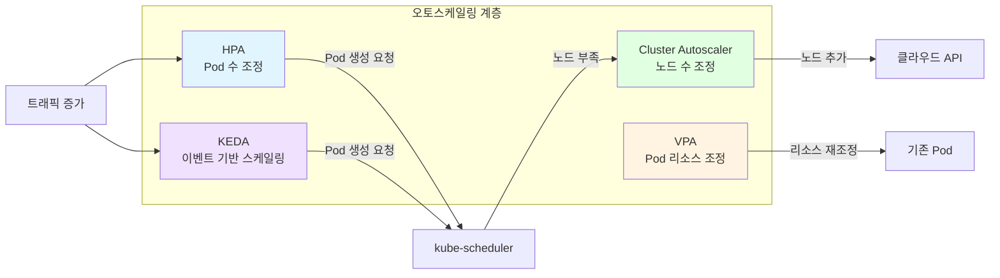
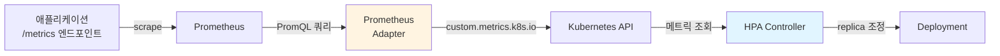
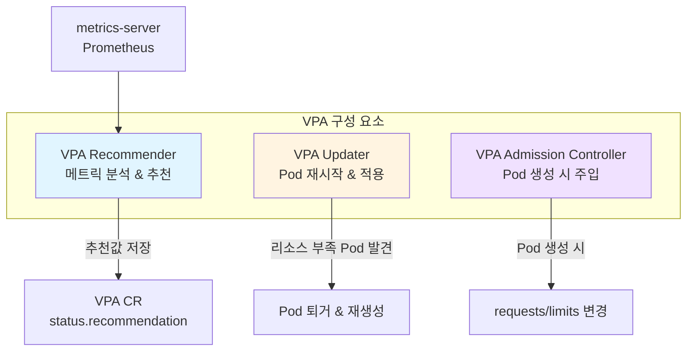
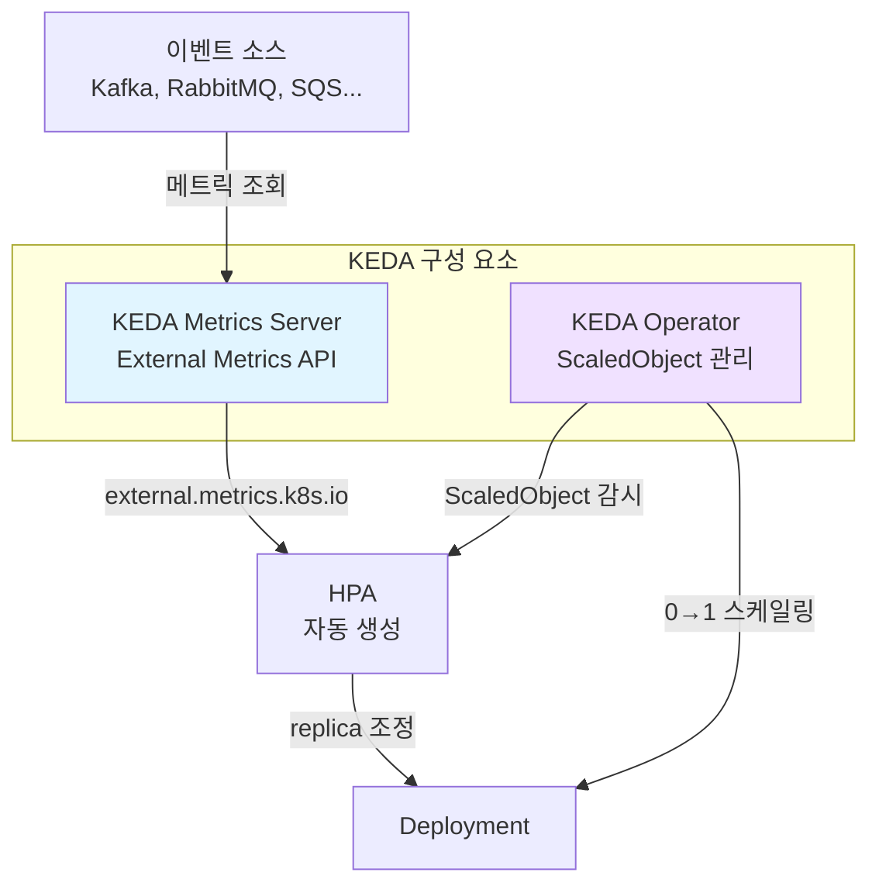
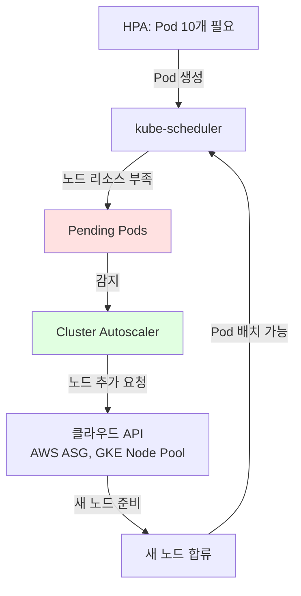
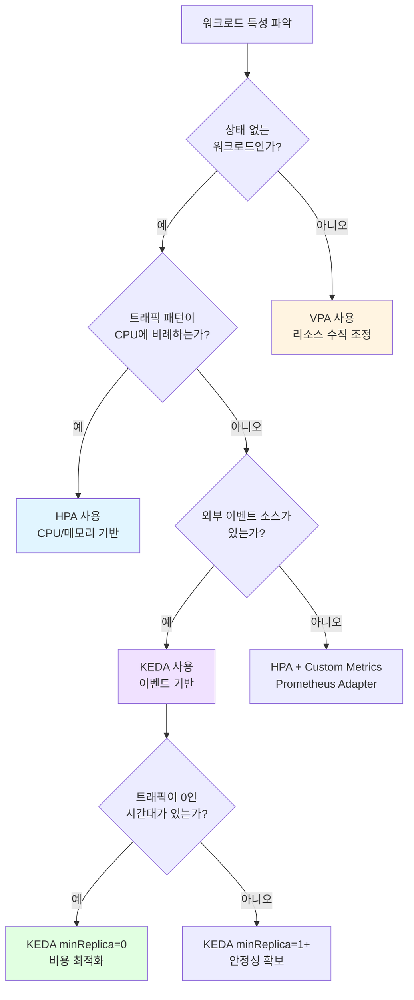

# Ch18. Auto-scaling - 비용과 가용성 사이의 균형

> 📌 **핵심 요약**
>
> Kubernetes 오토스케일링은 워크로드의 실제 부하에 따라 리소스를 자동으로 조정하여, 비용 낭비와 서비스 장애 사이의 균형을 찾는 메커니즘이다. HPA(Horizontal Pod Autoscaler)는 Pod 수를 수평으로 늘리고, VPA(Vertical Pod Autoscaler)는 개별 Pod의 리소스를 수직으로 조정하며, KEDA(Kubernetes Event-Driven Autoscaling)는 Kafka 큐 길이나 HTTP 요청 수 같은 이벤트 소스를 기반으로 스케일링한다. Cluster Autoscaler는 노드 레벨에서 클러스터 자체를 확장한다. 본 챕터에서는 각 스케일러의 동작 원리, 설정 방법, 그리고 실무에서 이들을 조합하는 전략을 다룬다.

## 🎯 학습 목표

1. 오토스케일링이 필요한 이유와 비용-가용성 트레이드오프 이해
2. HPA의 동작 원리와 CPU/메모리 기반 스케일링 설정
3. Custom Metrics를 활용한 HPA 확장 (Prometheus Adapter)
4. VPA의 리소스 추천 메커니즘과 업데이트 정책 이해
5. KEDA의 이벤트 기반 스케일링 아키텍처와 ScaledObject 설정
6. Cluster Autoscaler의 노드 확장/축소 판단 로직 이해

---

## 1. 왜 오토스케일링이 필요한가

### 1.1 고정 리소스 할당의 문제

전통적인 인프라 운영에서는 예상 최대 부하(Peak Load)에 맞춰 서버를 미리 프로비저닝한다. 블랙 프라이데이에 트래픽이 10배 증가할 것을 대비하여 평소에도 10배의 서버를 유지하는 것이다. 이 방식은 두 가지 문제를 야기한다.

**과잉 프로비저닝(Over-provisioning)**:
- 평소 CPU 사용률 10~20%에서 서버 비용을 100% 지불한다
- 클라우드 환경에서 불필요한 인스턴스 비용이 월 수백만 원에 달할 수 있다
- 리소스가 유휴 상태로 낭비된다

**부족 프로비저닝(Under-provisioning)**:
- 예상치 못한 트래픽 급증 시 서비스가 다운된다
- Pod가 OOMKilled되거나 CPU 스로틀링으로 응답 시간이 급증한다
- 수동으로 서버를 추가하는 동안 사용자 이탈이 발생한다

### 1.2 오토스케일링의 목표

오토스케일링은 이 트레이드오프를 자동으로 관리한다. 핵심 목표는 다음과 같다:

- **가용성 보장**: 부하 증가 시 자동으로 리소스를 확장하여 SLA를 유지한다
- **비용 최적화**: 부하 감소 시 불필요한 리소스를 자동으로 회수한다
- **운영 부담 감소**: 수동 스케일링 작업을 자동화하여 운영자의 개입을 줄인다



### 1.3 스케일링 방향: 수평 vs 수직

**수평 스케일링(Horizontal Scaling)**은 동일한 Pod의 복제본(replica) 수를 늘리거나 줄이는 것이다. 웹 서버 3개를 10개로 늘리는 것이 대표적이다. 상태가 없는(stateless) 워크로드에 적합하며, 이론적으로 무한히 확장 가능하다.

**수직 스케일링(Vertical Scaling)**은 개별 Pod의 CPU/메모리 할당량을 늘리거나 줄이는 것이다. Pod의 `resources.requests`를 500m CPU에서 2000m CPU로 올리는 것이 대표적이다. 단일 인스턴스로 실행해야 하는 워크로드(예: 레거시 애플리케이션, 일부 데이터베이스)에 적합하지만, 노드의 물리적 리소스 한계에 제약받는다.

---

## 2. HPA (Horizontal Pod Autoscaler)

### 2.1 HPA의 동작 원리

HPA는 Kubernetes에 내장된 오토스케일러로, Pod의 메트릭을 주기적으로 확인하여 Deployment/StatefulSet의 replica 수를 자동 조정한다. HPA Controller는 기본적으로 15초 간격으로 메트릭을 확인한다.

**스케일링 판단 공식**:

```
desiredReplicas = ceil[currentReplicas × (currentMetricValue / desiredMetricValue)]
```

예를 들어, 현재 3개의 Pod가 평균 CPU 80%를 사용하고, 목표가 50%라면:

```
desiredReplicas = ceil[3 × (80 / 50)] = ceil[4.8] = 5
```

HPA는 5개로 스케일 아웃한다.

### 2.2 HPA 설정: CPU/메모리 기반

**metrics-server 필수**: HPA가 Pod의 CPU/메모리 사용량을 조회하려면 metrics-server가 클러스터에 설치되어 있어야 한다. metrics-server는 각 노드의 kubelet에서 메트릭을 수집하여 Kubernetes API(`metrics.k8s.io`)로 제공한다.

```yaml
# hpa-cpu.yaml
apiVersion: autoscaling/v2
kind: HorizontalPodAutoscaler
metadata:
  name: web-app-hpa
spec:
  scaleTargetRef:
    apiVersion: apps/v1
    kind: Deployment
    name: web-app
  minReplicas: 2
  maxReplicas: 10
  metrics:
    - type: Resource
      resource:
        name: cpu
        target:
          type: Utilization
          averageUtilization: 50  # 평균 CPU 사용률 50% 유지
    - type: Resource
      resource:
        name: memory
        target:
          type: Utilization
          averageUtilization: 70  # 평균 메모리 사용률 70% 유지
```

**핵심 필드 설명**:

- `scaleTargetRef`: 스케일링 대상 (Deployment, StatefulSet, ReplicaSet)
- `minReplicas`: 최소 Pod 수. 트래픽이 0이어도 이 수 이하로 줄이지 않는다
- `maxReplicas`: 최대 Pod 수. 무한 확장을 방지하여 비용을 제어한다
- `metrics`: 스케일링 판단 기준. 여러 메트릭을 동시에 지정하면 가장 높은 replica 수를 채택한다

**주의**: HPA가 CPU 사용률을 계산하려면 대상 Pod에 `resources.requests`가 반드시 설정되어 있어야 한다. requests가 없으면 HPA는 사용률을 계산할 수 없어 동작하지 않는다.

```yaml
# Deployment에 resources.requests 필수
containers:
  - name: web-app
    image: nginx
    resources:
      requests:
        cpu: 200m      # HPA가 이 값을 기준으로 사용률 계산
        memory: 256Mi
      limits:
        cpu: 500m
        memory: 512Mi
```

### 2.3 HPA 동작 확인

```bash
# HPA 상태 확인
kubectl get hpa web-app-hpa
# NAME          REFERENCE          TARGETS   MINPODS   MAXPODS   REPLICAS
# web-app-hpa   Deployment/web-app  35%/50%   2         10        3

# 상세 이벤트 확인
kubectl describe hpa web-app-hpa
# Events:
#   Type    Reason              Message
#   Normal  SuccessfulRescale   New size: 5; reason: cpu resource utilization above target
```

### 2.4 스케일링 동작(Behavior) 제어

HPA v2에서는 `behavior` 필드로 스케일 아웃/인의 속도를 세밀하게 제어할 수 있다. 이는 갑작스러운 트래픽 변동에 과도하게 반응하는 것을 방지하는 데 중요하다.

```yaml
spec:
  behavior:
    scaleUp:
      stabilizationWindowSeconds: 60    # 60초간 안정화 후 스케일 업
      policies:
        - type: Percent
          value: 100                     # 최대 100%씩 증가 (3→6)
          periodSeconds: 60
        - type: Pods
          value: 4                       # 또는 최대 4개씩 증가
          periodSeconds: 60
      selectPolicy: Max                  # 두 정책 중 큰 값 채택
    scaleDown:
      stabilizationWindowSeconds: 300   # 5분간 안정화 후 스케일 다운
      policies:
        - type: Percent
          value: 10                      # 최대 10%씩 감소
          periodSeconds: 60
```

**왜 scaleDown을 보수적으로 설정하는가?** 트래픽이 일시적으로 감소했다가 다시 급증하는 패턴(예: 점심 시간 후 잠시 줄었다가 다시 증가)에서 성급하게 Pod를 줄이면, 재확장 시 Cold Start 지연이 발생한다. JVM 기반 애플리케이션은 워밍업에 수십 초가 걸리므로, 줄였다 늘리는 비용이 유지하는 비용보다 클 수 있다.

---

## 3. HPA with Custom Metrics

### 3.1 CPU/메모리의 한계

CPU/메모리 기반 HPA는 가장 기본적인 스케일링 전략이지만, 모든 상황에 적합하지는 않다.

**문제 시나리오**: 메시지 큐 컨슈머(Consumer) 애플리케이션이 있다고 하자. Kafka 토픽에 메시지가 100만 건 쌓여 있지만, 컨슈머의 CPU 사용률은 10%에 불과하다. 왜냐하면 컨슈머는 대부분의 시간을 I/O 대기(네트워크, 디스크)에 쓰고 있기 때문이다. CPU 기반 HPA는 "CPU 사용률이 낮으니 스케일 아웃할 필요 없다"고 판단하지만, 실제로는 메시지 처리가 심각하게 밀리고 있다.

이러한 경우 **비즈니스 메트릭**(큐 길이, 초당 요청 수, 응답 시간 등)을 기반으로 스케일링해야 한다.

### 3.2 Prometheus Adapter 아키텍처

Custom Metrics 기반 HPA를 구현하려면 Prometheus Adapter가 필요하다. 이 어댑터는 Prometheus에 저장된 메트릭을 Kubernetes Custom Metrics API(`custom.metrics.k8s.io`)로 변환하여 HPA가 조회할 수 있게 한다.



**동작 흐름**:
1. 애플리케이션이 `/metrics` 엔드포인트로 Prometheus 메트릭을 노출한다
2. Prometheus가 주기적으로 스크랩하여 시계열 데이터를 저장한다
3. Prometheus Adapter가 설정된 PromQL 쿼리를 Prometheus에 실행한다
4. 쿼리 결과를 Kubernetes Custom Metrics API 형식으로 변환한다
5. HPA Controller가 Custom Metrics API에서 메트릭 값을 조회한다
6. 조회된 값을 기준으로 스케일링을 판단한다

### 3.3 Custom Metrics HPA 설정

```yaml
# Prometheus Adapter 규칙 (ConfigMap)
rules:
  - seriesQuery: 'http_requests_per_second{namespace!="",pod!=""}'
    resources:
      overrides:
        namespace: {resource: "namespace"}
        pod: {resource: "pod"}
    name:
      matches: "^(.*)$"
      as: "http_requests_per_second"
    metricsQuery: 'sum(rate(http_requests_total{<<.LabelMatchers>>}[2m])) by (<<.GroupBy>>)'
```

```yaml
# Custom Metrics 기반 HPA
apiVersion: autoscaling/v2
kind: HorizontalPodAutoscaler
metadata:
  name: web-app-hpa-custom
spec:
  scaleTargetRef:
    apiVersion: apps/v1
    kind: Deployment
    name: web-app
  minReplicas: 2
  maxReplicas: 20
  metrics:
    - type: Pods
      pods:
        metric:
          name: http_requests_per_second
        target:
          type: AverageValue
          averageValue: 1000    # Pod당 평균 1000 RPS 유지
```

이 설정은 "각 Pod가 평균 1000 RPS를 처리하도록 Pod 수를 조정하라"는 의미다. 전체 트래픽이 5000 RPS라면 5개의 Pod가, 10000 RPS라면 10개의 Pod가 필요하다.

---

## 4. VPA (Vertical Pod Autoscaler)

### 4.1 VPA가 필요한 이유

HPA는 Pod의 수를 조정하지만, 각 Pod에 할당된 리소스(requests/limits)는 변경하지 않는다. 개발자가 처음에 설정한 `requests: cpu=200m, memory=256Mi`가 실제 워크로드에 적합한지는 별개의 문제다.

**실무에서 흔한 상황**:
- 개발자가 "잘 모르겠으니까" CPU 1000m, 메모리 2Gi로 넉넉하게 설정 → 실제 사용량은 100m, 256Mi → 리소스 낭비
- 반대로 CPU 100m으로 설정했는데 실제 피크 시 500m 필요 → CPU 스로틀링 → 응답 지연

VPA는 Pod의 실제 리소스 사용 패턴을 관찰하고, 최적의 `requests`와 `limits` 값을 추천하거나 자동으로 조정한다.

### 4.2 VPA 구성 요소

VPA는 세 가지 컴포넌트로 구성된다:



- **Recommender**: Pod의 과거 리소스 사용 데이터를 분석하여 최적의 requests/limits를 계산한다. 최소 24시간의 데이터를 수집한 후 안정적인 추천을 제공한다.
- **Updater**: 현재 실행 중인 Pod의 리소스가 추천값과 크게 다르면, Pod를 퇴거(evict)시켜 새 리소스로 재생성하도록 트리거한다.
- **Admission Controller**: 새로 생성되는 Pod에 추천된 리소스 값을 자동으로 주입한다.

### 4.3 VPA 설정과 업데이트 정책

```yaml
apiVersion: autoscaling.k8s.io/v1
kind: VerticalPodAutoscaler
metadata:
  name: web-app-vpa
spec:
  targetRef:
    apiVersion: apps/v1
    kind: Deployment
    name: web-app
  updatePolicy:
    updateMode: "Auto"        # Off, Initial, Recreate, Auto
  resourcePolicy:
    containerPolicies:
      - containerName: web-app
        minAllowed:
          cpu: 100m
          memory: 128Mi
        maxAllowed:
          cpu: 4000m
          memory: 8Gi
        controlledResources: ["cpu", "memory"]
```

**업데이트 모드 비교**:

| 모드 | 동작 | 사용 시점 |
|------|------|----------|
| `Off` | 추천값만 계산, 적용하지 않음 | 처음 도입 시 추천값을 먼저 검토할 때 |
| `Initial` | Pod 생성 시에만 추천값 적용 | 실행 중 재시작을 원하지 않을 때 |
| `Recreate` | 리소스 변경 필요 시 Pod를 재생성 | 일반적인 프로덕션 사용 |
| `Auto` | 가능하면 In-Place, 아니면 Recreate | 최신 K8s (In-Place Resource Resize 지원 시) |

**VPA 추천값 확인**:

```bash
kubectl describe vpa web-app-vpa
# Recommendation:
#   Container Recommendations:
#     Container Name: web-app
#     Lower Bound:    Cpu: 100m,  Memory: 262144k
#     Target:         Cpu: 250m,  Memory: 524288k    ← 추천값
#     Upper Bound:    Cpu: 1000m, Memory: 2097152k
#     Uncapped Target: Cpu: 250m, Memory: 524288k
```

- **Lower Bound**: 최소한 이 정도는 필요하다 (P10 수준)
- **Target**: 대부분의 상황에서 적절한 값 (P50~P90 수준)
- **Upper Bound**: 피크 부하까지 고려한 값 (P95 수준)
- **Uncapped Target**: `minAllowed`/`maxAllowed` 제한 없이 계산한 추천값

### 4.4 VPA와 HPA의 충돌 문제

VPA와 HPA를 **같은 CPU/메모리 메트릭**으로 동시에 사용하면 충돌이 발생한다. 왜냐하면 둘 다 CPU 사용률에 반응하기 때문이다:

1. CPU 사용률이 높아진다
2. HPA: "Pod를 더 만들어야 해" → replica 증가
3. VPA: "Pod의 CPU를 더 줘야 해" → requests 증가 → Pod 재시작
4. Pod 재시작으로 일시적으로 부하가 다른 Pod에 집중 → CPU 더 증가
5. HPA와 VPA가 동시에 반응하며 진동(oscillation) 발생

**해결 방법**:
- HPA는 Custom Metrics(RPS, 큐 길이 등)로, VPA는 CPU/메모리로 분리한다
- 또는 VPA를 `Off` 모드로 설정하고 추천값만 참고하여 수동으로 requests를 조정한다
- Kubernetes 1.27+에서는 HPA가 Container Resource 메트릭을, VPA가 다른 컨테이너를 담당하도록 분리할 수도 있다

---

## 5. KEDA (Kubernetes Event-Driven Autoscaling)

### 5.1 KEDA가 해결하는 문제

HPA의 Custom Metrics 방식은 Prometheus Adapter 설정이 복잡하고, 지원하는 이벤트 소스가 제한적이다. KEDA는 이 문제를 해결하기 위해 만들어진 프로젝트로, CNCF Graduated 프로젝트다.

KEDA는 60개 이상의 이벤트 소스(Kafka, RabbitMQ, AWS SQS, Azure Service Bus, Prometheus, Cron 등)를 기본 지원하며, 이벤트 소스에서 메트릭을 가져와 HPA를 자동으로 생성하고 관리한다.

### 5.2 KEDA 아키텍처



**KEDA의 핵심 차별점: 0으로 스케일 다운**

HPA는 `minReplicas`를 1 이하로 설정할 수 없다. 항상 최소 1개의 Pod가 실행되어야 한다. 그러나 KEDA는 이벤트가 없으면 replica를 0으로 줄일 수 있다. 이벤트가 발생하면 KEDA Operator가 먼저 0→1로 스케일 업하고, 이후 HPA가 1→N으로 관리한다.

이는 비용 절감에 매우 효과적이다. 야간에 트래픽이 0인 서비스, 이벤트가 간헐적으로 발생하는 배치 처리 워크로드 등에서 Pod를 완전히 제거할 수 있다.

### 5.3 ScaledObject 설정

```yaml
apiVersion: keda.sh/v1alpha1
kind: ScaledObject
metadata:
  name: kafka-consumer-scaler
spec:
  scaleTargetRef:
    name: kafka-consumer          # 대상 Deployment
  pollingInterval: 15              # 15초마다 메트릭 확인
  cooldownPeriod: 300              # 스케일 다운 전 5분 대기
  minReplicaCount: 0               # 이벤트 없으면 0으로 축소!
  maxReplicaCount: 30
  triggers:
    - type: kafka
      metadata:
        bootstrapServers: kafka:9092
        consumerGroup: my-group
        topic: orders
        lagThreshold: "100"        # Consumer Lag 100 이상이면 스케일 아웃
```

**주요 필드 설명**:

- `pollingInterval`: KEDA가 이벤트 소스를 확인하는 주기 (초). 짧을수록 반응이 빠르지만, 이벤트 소스에 부하를 줄 수 있다
- `cooldownPeriod`: 마지막 이벤트 이후 스케일 다운까지 대기하는 시간. 간헐적 이벤트에서 불필요한 스케일 업/다운 반복을 방지한다
- `lagThreshold`: Kafka Consumer의 경우, Consumer Lag(처리하지 못한 메시지 수)이 이 값을 초과하면 스케일 아웃한다

### 5.4 다양한 KEDA 트리거 예시

**Prometheus 메트릭 기반**:

```yaml
triggers:
  - type: prometheus
    metadata:
      serverAddress: http://prometheus:9090
      metricName: http_requests_total
      query: sum(rate(http_requests_total{service="web-app"}[2m]))
      threshold: "100"            # RPS 100 이상이면 스케일
```

**Cron 기반 (예측 가능한 트래픽)**:

```yaml
triggers:
  - type: cron
    metadata:
      timezone: Asia/Seoul
      start: 0 9 * * 1-5          # 평일 09:00
      end: 0 18 * * 1-5           # 평일 18:00
      desiredReplicas: "10"       # 업무 시간에 10개 유지
```

**HTTP 요청 수 기반 (KEDA HTTP Add-on)**:

```yaml
triggers:
  - type: external
    metadata:
      scalerAddress: keda-http-add-on-interceptor-proxy:8080
      hosts: "myapp.example.com"
      targetPendingRequests: "100"
```

---

## 6. Cluster Autoscaler

### 6.1 노드 레벨 스케일링의 필요성

HPA와 KEDA가 Pod 수를 늘려도, 클러스터에 Pod를 배치할 노드가 없으면 Pod는 `Pending` 상태에 머문다. Cluster Autoscaler(CA)는 이 문제를 해결하기 위해 노드 자체를 동적으로 추가/제거한다.



### 6.2 스케일 업 (노드 추가) 판단

Cluster Autoscaler는 다음 조건에서 노드를 추가한다:

1. **Pending Pod 감지**: `kube-scheduler`가 리소스 부족으로 Pod를 스케줄링하지 못하고 `Pending` 상태로 남겨둔다
2. **시뮬레이션**: CA가 Node Group(AWS ASG, GKE Node Pool)에 노드를 추가하면 Pending Pod가 배치 가능한지 시뮬레이션한다
3. **노드 추가**: 시뮬레이션 성공 시 클라우드 API를 호출하여 노드를 생성한다
4. **Pod 배치**: 새 노드가 Ready 상태가 되면 `kube-scheduler`가 Pending Pod를 배치한다

**주의**: CA의 스케일 업은 즉각적이지 않다. 클라우드에서 노드를 프로비저닝하는 데 2~5분이 소요될 수 있다. 이 지연 시간 동안 서비스 품질이 저하될 수 있으므로, 여유 리소스(buffer)를 미리 확보해두는 전략이 필요하다.

### 6.3 스케일 다운 (노드 제거) 판단

CA는 다음 조건을 **모두** 만족하는 노드를 제거 대상으로 판단한다:

1. **리소스 사용률이 낮음**: 노드의 requests 합계가 전체 용량의 50% 미만 (기본값, `--scale-down-utilization-threshold`)
2. **모든 Pod가 이동 가능**: 해당 노드의 모든 Pod가 다른 노드로 재배치 가능해야 한다
3. **안정화 기간 경과**: 노드가 10분 이상 (기본값, `--scale-down-unneeded-time`) 저사용률 상태를 유지해야 한다

**이동 불가능한 Pod** (CA가 노드를 제거하지 못하는 경우):

- `PodDisruptionBudget(PDB)`를 위반하는 경우
- `kube-system` 네임스페이스의 Pod (controller가 관리하지 않는 경우)
- 로컬 스토리지(`emptyDir` 외)를 사용하는 Pod
- Node Affinity/Anti-Affinity로 특정 노드에 고정된 Pod
- `cluster-autoscaler.kubernetes.io/safe-to-evict: "false"` 어노테이션이 있는 Pod

### 6.4 Cluster Autoscaler 설정 (AWS EKS 예시)

```yaml
# Cluster Autoscaler Deployment 주요 설정
containers:
  - name: cluster-autoscaler
    image: registry.k8s.io/autoscaling/cluster-autoscaler:v1.28.0
    command:
      - ./cluster-autoscaler
      - --v=4
      - --stderrthreshold=info
      - --cloud-provider=aws
      - --skip-nodes-with-local-storage=false
      - --expander=least-waste          # 노드 선택 전략
      - --scale-down-delay-after-add=10m
      - --scale-down-unneeded-time=10m
      - --scale-down-utilization-threshold=0.5
```

**Expander 전략** (여러 Node Group이 있을 때 어떤 그룹을 확장할지):

| 전략 | 설명 |
|------|------|
| `random` | 무작위 선택 |
| `most-pods` | 가장 많은 Pending Pod를 배치할 수 있는 그룹 |
| `least-waste` | 리소스 낭비가 가장 적은 그룹 |
| `price` | 비용이 가장 저렴한 그룹 (Spot Instance 우선) |
| `priority` | 사용자 정의 우선순위 |

---

## 7. HPA vs VPA vs KEDA 비교

### 7.1 기능 비교표

| 특성 | HPA | VPA | KEDA |
|------|-----|-----|------|
| **스케일링 방향** | 수평 (Pod 수) | 수직 (Pod 리소스) | 수평 (Pod 수) |
| **기본 메트릭** | CPU, 메모리 | CPU, 메모리 | 60+ 이벤트 소스 |
| **Custom Metrics** | Prometheus Adapter 필요 | 지원 안 함 | 내장 지원 |
| **0으로 스케일 다운** | 불가 (min=1) | 불가 | 가능 (min=0) |
| **Pod 재시작 필요** | 아니오 | 예 (리소스 변경 시) | 아니오 |
| **K8s 내장** | 예 | 아니오 (별도 설치) | 아니오 (별도 설치) |
| **복잡도** | 낮음 | 중간 | 중간~높음 |
| **적합한 워크로드** | Stateless 웹 서비스 | 리소스 최적화 필요 | 이벤트 기반 처리 |

### 7.2 의사결정 플로우차트



---

## 8. 실무 패턴

### 8.1 패턴 1: HPA + VPA 조합 (리소스 최적화)

가장 보편적인 조합이다. HPA는 Custom Metrics(RPS)로 Pod 수를 조정하고, VPA는 `Off` 모드로 추천값만 제공한다.

```yaml
# HPA: RPS 기반 수평 스케일링
apiVersion: autoscaling/v2
kind: HorizontalPodAutoscaler
metadata:
  name: web-app-hpa
spec:
  scaleTargetRef:
    apiVersion: apps/v1
    kind: Deployment
    name: web-app
  minReplicas: 3
  maxReplicas: 20
  metrics:
    - type: Pods
      pods:
        metric:
          name: http_requests_per_second
        target:
          type: AverageValue
          averageValue: 500
---
# VPA: 추천값만 계산 (Off 모드)
apiVersion: autoscaling.k8s.io/v1
kind: VerticalPodAutoscaler
metadata:
  name: web-app-vpa
spec:
  targetRef:
    apiVersion: apps/v1
    kind: Deployment
    name: web-app
  updatePolicy:
    updateMode: "Off"             # 적용하지 않고 추천만
```

운영팀은 주기적으로 VPA 추천값을 확인하고, Deployment의 requests/limits를 수동으로 조정한다. 이 방식은 HPA와 VPA의 충돌을 완전히 방지하면서도 리소스 최적화의 이점을 누릴 수 있다.

### 8.2 패턴 2: KEDA + Kafka Consumer 스케일링

메시지 큐 기반 워크로드에서 가장 효과적인 패턴이다. Kafka Consumer의 Consumer Lag에 따라 Pod 수를 자동 조정한다.

```yaml
apiVersion: keda.sh/v1alpha1
kind: ScaledObject
metadata:
  name: order-processor-scaler
spec:
  scaleTargetRef:
    name: order-processor
  pollingInterval: 10
  cooldownPeriod: 300
  minReplicaCount: 0              # 야간에 메시지 없으면 0
  maxReplicaCount: 50
  advanced:
    horizontalPodAutoscalerConfig:
      behavior:
        scaleDown:
          stabilizationWindowSeconds: 300
          policies:
            - type: Percent
              value: 25
              periodSeconds: 60
  triggers:
    - type: kafka
      metadata:
        bootstrapServers: kafka-cluster:9092
        consumerGroup: order-processor-group
        topic: orders
        lagThreshold: "50"
        offsetResetPolicy: latest
```

**핵심 포인트**:
- `lagThreshold: "50"`은 파티션당 Lag 임계값이다. 토픽에 10개 파티션이 있고 각 파티션의 Lag이 50이면, 전체 Lag은 500이 된다
- KEDA는 Kafka 파티션 수를 `maxReplicaCount`의 상한으로 사용한다. 10개 파티션이면 컨슈머를 10개 이상 만들어도 의미가 없다 (Kafka 컨슈머 그룹 특성)
- `cooldownPeriod: 300`은 5분간 Lag이 0이어야 스케일 다운한다. 간헐적 메시지에 대응하기 위함이다

### 8.3 패턴 3: Cron + Event 기반 복합 스케일링

예측 가능한 트래픽 패턴과 돌발 트래픽을 동시에 처리하는 패턴이다.

```yaml
apiVersion: keda.sh/v1alpha1
kind: ScaledObject
metadata:
  name: api-server-scaler
spec:
  scaleTargetRef:
    name: api-server
  minReplicaCount: 2
  maxReplicaCount: 50
  triggers:
    # 트리거 1: 업무 시간 기본 용량 확보
    - type: cron
      metadata:
        timezone: Asia/Seoul
        start: 0 8 * * 1-5
        end: 0 20 * * 1-5
        desiredReplicas: "10"
    # 트리거 2: 실제 트래픽 기반 추가 스케일링
    - type: prometheus
      metadata:
        serverAddress: http://prometheus:9090
        metricName: http_requests_total
        query: sum(rate(http_requests_total{app="api-server"}[2m]))
        threshold: "200"
```

KEDA는 여러 트리거 중 **가장 높은 replica 수**를 채택한다. 업무 시간에 Cron이 10개를 요구하고, Prometheus가 15개를 요구하면 15개가 된다. 야간에 Cron 트리거가 비활성화되어도 Prometheus 트리거가 트래픽에 따라 스케일링한다.

---

## 9. minikube에서 HPA 테스트

### 9.1 환경 준비

```bash
# metrics-server 활성화 (HPA 필수)
minikube addons enable metrics-server

# metrics-server 동작 확인 (1~2분 대기 후)
kubectl top nodes
kubectl top pods
```

### 9.2 부하 테스트용 애플리케이션 배포

```yaml
# php-apache.yaml
apiVersion: apps/v1
kind: Deployment
metadata:
  name: php-apache
spec:
  selector:
    matchLabels:
      app: php-apache
  template:
    metadata:
      labels:
        app: php-apache
    spec:
      containers:
        - name: php-apache
          image: registry.k8s.io/hpa-example
          ports:
            - containerPort: 80
          resources:
            requests:
              cpu: 200m           # HPA 계산의 기준값
            limits:
              cpu: 500m
---
apiVersion: v1
kind: Service
metadata:
  name: php-apache
spec:
  ports:
    - port: 80
  selector:
    app: php-apache
```

### 9.3 HPA 생성 및 부하 테스트

```bash
# Deployment & Service 배포
kubectl apply -f php-apache.yaml

# HPA 생성 (CPU 50% 목표, 1~10개)
kubectl autoscale deployment php-apache --cpu-percent=50 --min=1 --max=10

# HPA 상태 확인 (초기에는 <unknown>/50%로 표시될 수 있음, 1~2분 대기)
kubectl get hpa php-apache --watch

# 부하 생성 (별도 터미널)
kubectl run -i --tty load-generator --rm --image=busybox:1.28 \
  --restart=Never -- /bin/sh -c \
  "while sleep 0.01; do wget -q -O- http://php-apache; done"

# HPA 반응 관찰 (1~2분 후 replica 증가)
kubectl get hpa php-apache --watch
# NAME         REFERENCE               TARGETS    MINPODS   MAXPODS   REPLICAS
# php-apache   Deployment/php-apache   245%/50%   1         10        1
# php-apache   Deployment/php-apache   245%/50%   1         10        5
# php-apache   Deployment/php-apache   62%/50%    1         10        7

# 부하 중단 후 (load-generator Ctrl+C) 5~10분 뒤 스케일 다운
kubectl get hpa php-apache --watch
# php-apache   Deployment/php-apache   0%/50%     1         10        7
# php-apache   Deployment/php-apache   0%/50%     1         10        1
```

### 9.4 관찰 포인트

- **스케일 아웃 속도**: 부하 시작 후 약 30~60초 이내에 replica가 증가하기 시작한다
- **스케일 인 속도**: 부하 중단 후 기본 5분(`stabilizationWindowSeconds`) 대기 후 서서히 감소한다
- **overshoot**: 처음에 필요 이상으로 Pod가 생성되었다가 안정화되는 현상이 있을 수 있다
- **metrics-server 지연**: 메트릭 수집에 약 15~30초 지연이 있으므로, HPA 반응도 그만큼 지연된다

---

## 10. 정리: 오토스케일링 도입 전략

### 10.1 단계별 도입 권장 순서

| 단계 | 도구 | 목적 | 난이도 |
|------|------|------|--------|
| 1단계 | **HPA (CPU/메모리)** | 기본 수평 스케일링 확보 | 낮음 |
| 2단계 | **VPA (Off 모드)** | 리소스 추천으로 requests 최적화 | 낮음 |
| 3단계 | **HPA (Custom Metrics)** | 비즈니스 메트릭 기반 스케일링 | 중간 |
| 4단계 | **KEDA** | 이벤트 기반 + 0 스케일 | 중간 |
| 5단계 | **Cluster Autoscaler** | 노드 자동 확장 (클라우드 환경) | 높음 |

### 10.2 공통 주의사항

**requests 설정이 핵심이다**: HPA의 CPU 사용률 계산, Cluster Autoscaler의 노드 용량 판단, VPA의 추천값 기준 모두 `resources.requests`에 의존한다. requests를 설정하지 않거나 비현실적으로 설정하면 모든 오토스케일링이 제대로 동작하지 않는다.

**Readiness Probe 필수**: HPA가 새 Pod를 생성해도, Readiness Probe가 통과할 때까지 Service의 Endpoints에 추가되지 않는다. Readiness Probe가 없으면 준비되지 않은 Pod에 트래픽이 전달되어 에러가 발생한다.

**PodDisruptionBudget(PDB) 설정**: VPA가 Pod를 재시작하거나 Cluster Autoscaler가 노드를 축소할 때, PDB를 설정하지 않으면 모든 Pod가 동시에 종료될 수 있다. 최소 가용 Pod 수를 PDB로 보장해야 한다.

```yaml
apiVersion: policy/v1
kind: PodDisruptionBudget
metadata:
  name: web-app-pdb
spec:
  minAvailable: 2                 # 항상 최소 2개 Pod 유지
  selector:
    matchLabels:
      app: web-app
```

**Graceful Shutdown**: Pod가 축소될 때 처리 중인 요청을 정상적으로 완료해야 한다. `terminationGracePeriodSeconds`를 충분히 설정하고, 애플리케이션에서 SIGTERM 시그널을 처리하여 진행 중인 작업을 마무리하도록 구현해야 한다.
