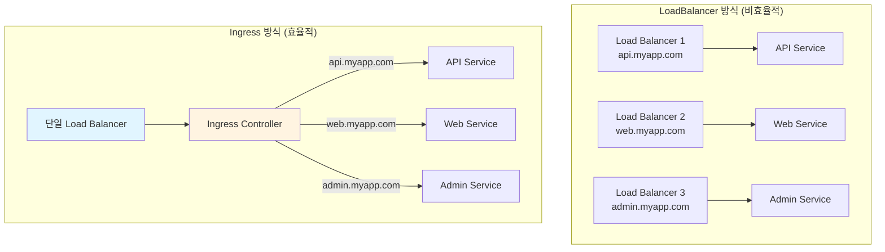
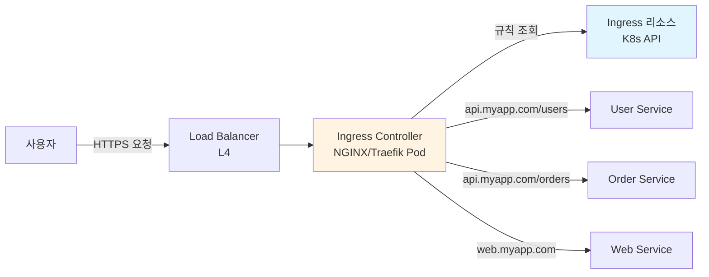
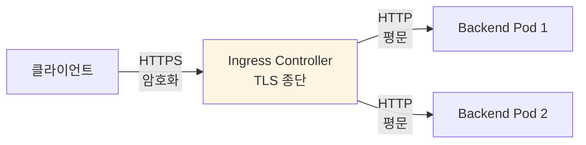
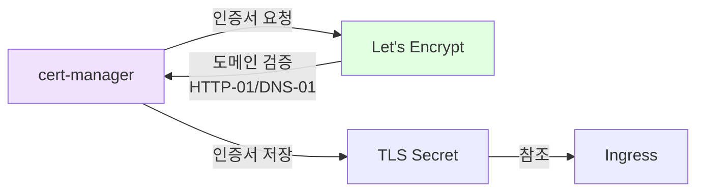
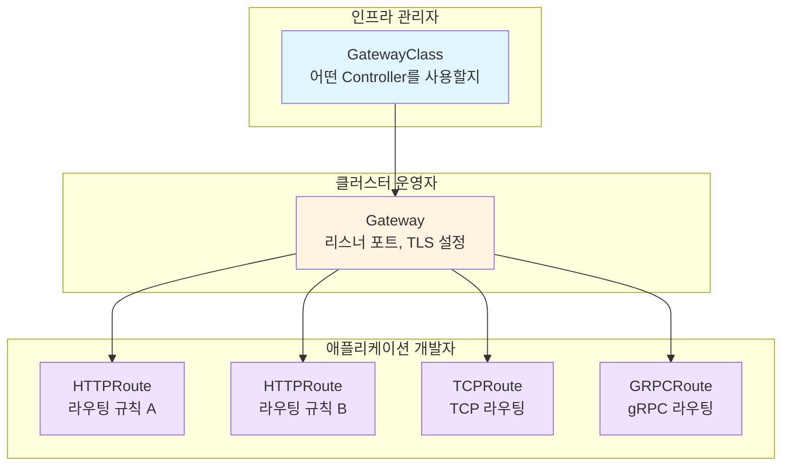
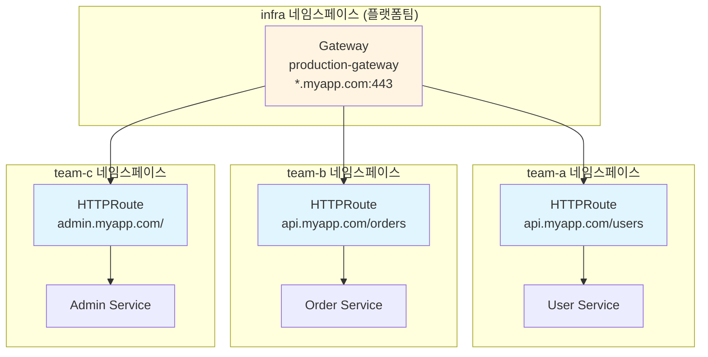

# Ch19. Ingress & Gateway API - 외부 트래픽을 클러스터로 안내하기

> 📌 **핵심 요약**
>
> Kubernetes의 Service(ClusterIP, NodePort, LoadBalancer)만으로는 외부 트래픽의 정교한 라우팅, TLS 종단, 호스트 기반 분기를 처리하기 어렵다. Ingress는 L7(HTTP/HTTPS) 수준에서 호스트명과 경로 기반의 라우팅 규칙을 선언적으로 정의하며, Ingress Controller(NGINX, Traefik 등)가 이를 실제로 실행한다. Gateway API는 Ingress의 후계자로서, 역할 분리(인프라팀 vs 개발팀), 다중 프로토콜 지원(HTTP, TCP, UDP, gRPC), 확장성을 대폭 개선한 차세대 표준이다. 본 챕터에서는 Ingress의 기본 개념부터 Gateway API로의 전환 이유, 그리고 실무에서 이들을 운영하는 전략을 다룬다.

## 🎯 학습 목표

1. NodePort/LoadBalancer Service의 한계와 Ingress가 필요한 이유 이해
2. Ingress 리소스와 Ingress Controller의 관계 및 동작 원리 파악
3. 호스트 기반, 경로 기반 라우팅 규칙 작성
4. TLS 종단과 cert-manager를 활용한 인증서 자동 관리 이해
5. Gateway API의 리소스 모델(GatewayClass, Gateway, HTTPRoute)과 역할 분리 모델 이해
6. Ingress에서 Gateway API로 전환해야 하는 이유와 마이그레이션 전략 파악

---

## 1. 왜 Service만으로는 부족한가

### 1.1 Service 타입별 한계

Ch04(네트워킹)에서 Service의 ClusterIP, NodePort, LoadBalancer를 학습했다. 외부 트래픽을 클러스터 내부로 전달하는 데 NodePort와 LoadBalancer를 사용할 수 있지만, 프로덕션 환경에서는 여러 한계가 있다.

**NodePort의 한계**:
- 포트 범위가 30000~32767로 제한되어 있다. `https://myapp.com:31234`처럼 비표준 포트를 사용해야 한다
- TLS 종단을 애플리케이션에서 직접 처리해야 한다
- 여러 서비스를 노출하면 각각 다른 NodePort를 기억해야 한다
- L7 라우팅(호스트명, 경로 기반 분기)을 지원하지 않는다

**LoadBalancer의 한계**:
- 서비스당 하나의 외부 IP(또는 Load Balancer 인스턴스)가 필요하다
- 클라우드 환경에서 Load Balancer는 유료 리소스이므로, 10개의 마이크로서비스를 노출하면 10개의 Load Balancer 비용이 발생한다
- L4(TCP/UDP) 수준의 로드밸런싱만 제공한다. 호스트명이나 URL 경로에 따라 다른 백엔드로 분기할 수 없다



### 1.2 Ingress가 제공하는 가치

Ingress는 하나의 진입점(Single Entry Point)을 통해 여러 서비스를 호스트명과 경로로 구분하여 라우팅한다. 이를 통해 다음을 달성한다:

- **비용 절감**: Load Balancer 1개로 모든 서비스를 노출할 수 있다
- **중앙화된 TLS 종단**: 각 애플리케이션이 인증서를 관리할 필요 없이, Ingress에서 TLS를 처리한다
- **L7 라우팅**: 호스트명(`api.myapp.com`), 경로(`/api/v1/users`), 헤더 등을 기반으로 트래픽을 분기한다
- **공통 기능 집중**: 인증, 속도 제한(Rate Limiting), CORS, 압축 등을 Ingress Controller에서 일괄 처리한다

---

## 2. Ingress 리소스와 Ingress Controller

### 2.1 두 가지 구성 요소의 관계

Ingress를 이해하려면 두 가지를 명확히 구분해야 한다:

**Ingress 리소스**: "이런 규칙으로 트래픽을 라우팅해 주세요"라는 선언적 정의다. Kubernetes API 오브젝트(`kind: Ingress`)로 생성한다. 라우팅 규칙을 정의할 뿐, 실제로 트래픽을 처리하지는 않는다.

**Ingress Controller**: Ingress 리소스에 정의된 규칙을 실제로 실행하는 소프트웨어다. NGINX, Traefik, HAProxy, AWS ALB 등 다양한 구현체가 있다. Ingress Controller가 없으면 Ingress 리소스를 아무리 만들어도 아무 일도 일어나지 않는다.



**Ingress Controller의 동작 방식**:
1. Kubernetes API를 Watch하여 Ingress 리소스의 변경을 감지한다
2. Ingress 규칙을 파싱하여 자체 설정(예: NGINX의 `nginx.conf`)을 업데이트한다
3. 설정 리로드(NGINX: `nginx -s reload`) 또는 동적 업데이트를 수행한다
4. 외부 요청이 들어오면 업데이트된 설정에 따라 적절한 Service(Backend)로 프록시한다

### 2.2 주요 Ingress Controller 비교

| Controller | 특징 | 사용 시점 |
|-----------|------|----------|
| **NGINX Ingress** | 가장 널리 사용됨, 안정적, 풍부한 어노테이션 | 범용 프로덕션 |
| **Traefik** | 자동 서비스 디스커버리, 미들웨어 체인, Let's Encrypt 내장 | 마이크로서비스, 간편한 설정 |
| **HAProxy** | 고성능 L4/L7 프록시, 낮은 레이턴시 | 고성능 요구 |
| **AWS ALB Ingress** | AWS Application Load Balancer와 직접 통합 | AWS EKS 환경 |
| **Istio Gateway** | Service Mesh의 Ingress 기능, mTLS, 트래픽 관리 | Istio 사용 환경 |
| **Contour** | Envoy 기반, Gateway API 얼리 어답터 | Gateway API 전환 계획 시 |

**주의: NGINX Ingress Controller는 두 가지 버전이 있다**:
- `kubernetes/ingress-nginx`: Kubernetes 커뮤니티 관리 (Ingress-NGINX)
- `nginxinc/kubernetes-ingress`: NGINX Inc 관리 (NGINX Ingress Controller)

둘은 설정 방식과 어노테이션이 다르다. 대부분의 문서와 예제는 커뮤니티 버전(`kubernetes/ingress-nginx`)을 기준으로 한다.

---

## 3. Ingress 규칙 작성

### 3.1 기본 구조

```yaml
apiVersion: networking.k8s.io/v1
kind: Ingress
metadata:
  name: myapp-ingress
  annotations:
    nginx.ingress.kubernetes.io/rewrite-target: /
spec:
  ingressClassName: nginx          # 어떤 Ingress Controller를 사용할지
  rules:
    - host: myapp.example.com      # 호스트 기반 라우팅
      http:
        paths:
          - path: /api              # 경로 기반 라우팅
            pathType: Prefix
            backend:
              service:
                name: api-service
                port:
                  number: 80
          - path: /
            pathType: Prefix
            backend:
              service:
                name: web-service
                port:
                  number: 80
```

### 3.2 호스트 기반 라우팅

서로 다른 도메인(또는 서브도메인)으로 들어오는 요청을 다른 서비스로 분기한다.

```yaml
spec:
  rules:
    - host: api.myapp.com
      http:
        paths:
          - path: /
            pathType: Prefix
            backend:
              service:
                name: api-service
                port:
                  number: 80
    - host: admin.myapp.com
      http:
        paths:
          - path: /
            pathType: Prefix
            backend:
              service:
                name: admin-service
                port:
                  number: 80
    - host: "*.myapp.com"           # 와일드카드 호스트
      http:
        paths:
          - path: /
            pathType: Prefix
            backend:
              service:
                name: default-service
                port:
                  number: 80
```

**와일드카드 호스트**(`*.myapp.com`)는 `foo.myapp.com`, `bar.myapp.com` 등 모든 서브도메인에 매칭된다. 단, `foo.bar.myapp.com`처럼 다중 레벨 서브도메인에는 매칭되지 않는다.

### 3.3 경로 기반 라우팅과 PathType

경로 기반 라우팅에서 `pathType`은 경로 매칭 방식을 결정한다. 이 설정을 잘못하면 예기치 않은 라우팅이 발생할 수 있으므로 정확히 이해해야 한다.

| PathType | 설명 | 예시 (`path: /api`) |
|----------|------|---------------------|
| `Exact` | 정확히 일치하는 경로만 매칭 | `/api` (O), `/api/` (X), `/api/users` (X) |
| `Prefix` | 접두사 기반 매칭 (경로 세그먼트 단위) | `/api` (O), `/api/` (O), `/api/users` (O), `/apiV2` (X) |
| `ImplementationSpecific` | Ingress Controller 구현에 따라 다름 | Controller마다 동작이 다를 수 있음 |

**Prefix 매칭의 세그먼트 규칙**: `path: /api`는 `/api`, `/api/`, `/api/users`에 매칭되지만 `/apiV2`에는 매칭되지 않는다. 경로 세그먼트(`/`로 구분)가 접두사인 경우에만 매칭된다. 이는 단순 문자열 접두사 매칭과 다르다.

**다중 경로 우선순위**: 여러 규칙이 동일한 요청에 매칭될 수 있다면, 가장 긴(구체적인) 경로가 우선한다.

```yaml
paths:
  - path: /api/v1/users     # 3순위 (가장 구체적)
    pathType: Prefix
    backend:
      service:
        name: user-service
        port:
          number: 80
  - path: /api/v1            # 2순위
    pathType: Prefix
    backend:
      service:
        name: api-v1-service
        port:
          number: 80
  - path: /                  # 1순위 (가장 넓음, fallback)
    pathType: Prefix
    backend:
      service:
        name: default-service
        port:
          number: 80
```

### 3.4 Default Backend

어떤 규칙에도 매칭되지 않는 요청을 처리하는 기본 백엔드를 설정할 수 있다. 보통 404 페이지를 반환하는 서비스를 지정한다.

```yaml
spec:
  defaultBackend:
    service:
      name: default-backend
      port:
        number: 80
  rules:
    - host: myapp.example.com
      http:
        paths:
          - path: /api
            pathType: Prefix
            backend:
              service:
                name: api-service
                port:
                  number: 80
```

### 3.5 유용한 NGINX Ingress 어노테이션

```yaml
metadata:
  annotations:
    # URL 재작성
    nginx.ingress.kubernetes.io/rewrite-target: /$2
    # 속도 제한 (초당 10 요청)
    nginx.ingress.kubernetes.io/limit-rps: "10"
    # CORS 허용
    nginx.ingress.kubernetes.io/enable-cors: "true"
    nginx.ingress.kubernetes.io/cors-allow-origin: "https://myapp.com"
    # 요청 크기 제한 (파일 업로드)
    nginx.ingress.kubernetes.io/proxy-body-size: "50m"
    # WebSocket 지원
    nginx.ingress.kubernetes.io/proxy-read-timeout: "3600"
    nginx.ingress.kubernetes.io/proxy-send-timeout: "3600"
    # 커스텀 에러 페이지
    nginx.ingress.kubernetes.io/custom-http-errors: "404,503"
    nginx.ingress.kubernetes.io/default-backend: error-pages
```

**어노테이션의 문제점**: 이러한 설정들은 표준화되어 있지 않다. NGINX와 Traefik의 어노테이션은 완전히 다르며, Controller를 교체하면 모든 어노테이션을 재작성해야 한다. 이것이 바로 Gateway API가 등장한 주요 이유 중 하나다.

---

## 4. TLS 종단 (TLS Termination)

### 4.1 TLS 종단이란

TLS 종단은 클라이언트와의 HTTPS 연결을 Ingress Controller에서 복호화하고, 백엔드 Pod에는 평문 HTTP로 전달하는 것이다. 이를 통해 각 애플리케이션이 개별적으로 인증서를 관리할 필요가 없어진다.



### 4.2 TLS Secret 생성

```bash
# 자체 서명 인증서 생성 (개발/테스트용)
openssl req -x509 -nodes -days 365 \
  -newkey rsa:2048 \
  -keyout tls.key \
  -out tls.crt \
  -subj "/CN=myapp.example.com"

# Kubernetes Secret으로 저장
kubectl create secret tls myapp-tls \
  --cert=tls.crt \
  --key=tls.key
```

### 4.3 Ingress에 TLS 적용

```yaml
apiVersion: networking.k8s.io/v1
kind: Ingress
metadata:
  name: myapp-ingress-tls
spec:
  ingressClassName: nginx
  tls:
    - hosts:
        - myapp.example.com
        - api.myapp.example.com
      secretName: myapp-tls         # TLS Secret 참조
  rules:
    - host: myapp.example.com
      http:
        paths:
          - path: /
            pathType: Prefix
            backend:
              service:
                name: web-service
                port:
                  number: 80
    - host: api.myapp.example.com
      http:
        paths:
          - path: /
            pathType: Prefix
            backend:
              service:
                name: api-service
                port:
                  number: 80
```

### 4.4 cert-manager로 인증서 자동 관리

프로덕션에서 자체 서명 인증서는 사용할 수 없다. cert-manager는 Let's Encrypt 같은 CA(Certificate Authority)에서 인증서를 자동으로 발급하고 갱신하는 Kubernetes 도구다.



**cert-manager 설정**:

```yaml
# ClusterIssuer (클러스터 전체에서 사용할 인증서 발급자)
apiVersion: cert-manager.io/v1
kind: ClusterIssuer
metadata:
  name: letsencrypt-prod
spec:
  acme:
    server: https://acme-v02.api.letsencrypt.org/directory
    email: admin@myapp.com
    privateKeySecretRef:
      name: letsencrypt-prod-key
    solvers:
      - http01:
          ingress:
            class: nginx
---
# Ingress에 cert-manager 어노테이션 추가
apiVersion: networking.k8s.io/v1
kind: Ingress
metadata:
  name: myapp-ingress-auto-tls
  annotations:
    cert-manager.io/cluster-issuer: letsencrypt-prod    # 자동 인증서 발급
spec:
  ingressClassName: nginx
  tls:
    - hosts:
        - myapp.example.com
      secretName: myapp-auto-tls    # cert-manager가 자동 생성
  rules:
    - host: myapp.example.com
      http:
        paths:
          - path: /
            pathType: Prefix
            backend:
              service:
                name: web-service
                port:
                  number: 80
```

**동작 흐름**:
1. Ingress에 `cert-manager.io/cluster-issuer` 어노테이션이 있으면 cert-manager가 감지한다
2. cert-manager가 Let's Encrypt에 인증서를 요청한다
3. Let's Encrypt가 HTTP-01 Challenge로 도메인 소유권을 검증한다 (cert-manager가 임시 Ingress 생성)
4. 검증 통과 후 인증서를 발급한다
5. cert-manager가 `myapp-auto-tls` Secret을 자동 생성하고 인증서를 저장한다
6. Ingress Controller가 Secret을 참조하여 TLS를 적용한다
7. 인증서 만료 30일 전에 자동으로 갱신한다

---

## 5. Gateway API: Ingress의 후계자

### 5.1 Ingress의 한계와 Gateway API의 등장 배경

Ingress는 Kubernetes 초기부터 존재했지만, 시간이 지나면서 여러 한계가 드러났다:

**표준화 부족**: Ingress 스펙은 매우 단순하다 (호스트, 경로, TLS). 속도 제한, 인증, 헤더 조작, 트래픽 분할 같은 기능은 각 Controller가 어노테이션으로 독자 구현한다. NGINX의 어노테이션은 Traefik에서 작동하지 않으며, Controller를 교체하면 모든 어노테이션을 재작성해야 한다.

**역할 분리 불가**: Ingress는 단일 리소스에 인프라 설정(TLS, 리스너)과 애플리케이션 설정(라우팅 규칙)이 혼재되어 있다. 대규모 조직에서 인프라팀과 개발팀이 같은 Ingress 리소스를 수정하면 충돌이 발생한다.

**HTTP 전용**: Ingress는 HTTP/HTTPS만 지원한다. TCP, UDP, gRPC 트래픽을 라우팅하려면 비표준 확장을 사용해야 한다.

**단일 게이트웨이**: 하나의 Ingress Controller가 모든 팀의 트래픽을 처리하므로, 팀 간 격리가 어렵다.

### 5.2 Gateway API 개요

Gateway API는 Kubernetes SIG-Network이 주도하는 차세대 트래픽 관리 표준으로, Ingress의 한계를 근본적으로 해결한다. 2023년에 GA(v1.0)가 되었으며, 주요 Ingress Controller들이 Gateway API를 지원하고 있다.

**핵심 설계 원칙**:
- **역할 기반 설계**: 인프라 관리자, 클러스터 운영자, 애플리케이션 개발자의 역할을 명확히 분리한다
- **이식성**: Controller 간 동작 차이를 최소화하는 표준화된 스펙
- **표현력**: 헤더 기반 라우팅, 트래픽 분할, 요청/응답 변환 등을 스펙에 포함
- **확장성**: CRD 기반으로 새로운 프로토콜과 기능을 추가할 수 있다

### 5.3 Gateway API 리소스 모델

Gateway API는 세 가지 주요 리소스로 구성된다. 각 리소스는 서로 다른 역할의 담당자가 관리한다.



**GatewayClass**: Ingress의 `ingressClassName`에 해당한다. 어떤 Controller 구현체(NGINX, Envoy, Istio 등)를 사용할지 정의한다. 인프라 관리자가 설정한다.

```yaml
apiVersion: gateway.networking.k8s.io/v1
kind: GatewayClass
metadata:
  name: nginx
spec:
  controllerName: gateway.nginx.org/nginx-gateway-controller
```

**Gateway**: 실제 네트워크 게이트웨이 인스턴스를 정의한다. 리스닝 포트, 프로토콜, TLS 설정을 포함한다. 클러스터 운영자가 설정한다.

```yaml
apiVersion: gateway.networking.k8s.io/v1
kind: Gateway
metadata:
  name: production-gateway
  namespace: infra
spec:
  gatewayClassName: nginx
  listeners:
    - name: http
      protocol: HTTP
      port: 80
    - name: https
      protocol: HTTPS
      port: 443
      tls:
        mode: Terminate
        certificateRefs:
          - name: wildcard-tls
      allowedRoutes:
        namespaces:
          from: All              # 모든 네임스페이스의 Route 허용
```

**HTTPRoute**: 실제 라우팅 규칙을 정의한다. 애플리케이션 개발자가 자신의 네임스페이스에서 설정한다.

```yaml
apiVersion: gateway.networking.k8s.io/v1
kind: HTTPRoute
metadata:
  name: user-service-route
  namespace: team-a              # 팀 A의 네임스페이스
spec:
  parentRefs:
    - name: production-gateway
      namespace: infra           # 공유 Gateway 참조
  hostnames:
    - "api.myapp.com"
  rules:
    - matches:
        - path:
            type: PathPrefix
            value: /users
      backendRefs:
        - name: user-service
          port: 80
```

### 5.4 Gateway API의 고급 라우팅 기능

Ingress에서는 어노테이션으로만 가능했던 기능들이 Gateway API에서는 스펙에 표준으로 포함되어 있다.

**헤더 기반 라우팅**:

```yaml
rules:
  - matches:
      - headers:
          - name: X-Canary
            value: "true"
    backendRefs:
      - name: user-service-canary
        port: 80
  - matches:
      - path:
            type: PathPrefix
            value: /users
    backendRefs:
      - name: user-service-stable
        port: 80
```

**트래픽 분할 (Canary/Blue-Green)**:

```yaml
rules:
  - matches:
      - path:
            type: PathPrefix
            value: /users
    backendRefs:
      - name: user-service-v1
        port: 80
        weight: 90               # 90% 트래픽
      - name: user-service-v2
        port: 80
        weight: 10               # 10% 트래픽 (카나리)
```

**요청/응답 헤더 조작**:

```yaml
rules:
  - matches:
      - path:
            type: PathPrefix
            value: /api
    filters:
      - type: RequestHeaderModifier
        requestHeaderModifier:
          add:
            - name: X-Request-ID
              value: "generated-uuid"
          remove:
            - X-Internal-Header
      - type: ResponseHeaderModifier
        responseHeaderModifier:
          set:
            - name: X-Frame-Options
              value: DENY
    backendRefs:
      - name: api-service
        port: 80
```

**URL 리다이렉트와 리라이트**:

```yaml
rules:
  # HTTP → HTTPS 리다이렉트
  - matches:
      - path:
            type: PathPrefix
            value: /
    filters:
      - type: RequestRedirect
        requestRedirect:
          scheme: https
          statusCode: 301
---
  # URL 리라이트
  - matches:
      - path:
            type: PathPrefix
            value: /old-api
    filters:
      - type: URLRewrite
        urlRewrite:
          path:
            type: ReplacePrefixMatch
            replacePrefixMatch: /new-api
    backendRefs:
      - name: api-service
        port: 80
```

---

## 6. Ingress vs Gateway API 비교

### 6.1 기능 비교표

| 특성 | Ingress | Gateway API |
|------|---------|-------------|
| **역할 분리** | 단일 리소스 | GatewayClass/Gateway/Route 분리 |
| **지원 프로토콜** | HTTP/HTTPS만 | HTTP, HTTPS, TCP, UDP, gRPC, TLS |
| **표준 라우팅** | 호스트, 경로 | 호스트, 경로, 헤더, 쿼리, 메서드 |
| **트래픽 분할** | 어노테이션 (비표준) | 스펙에 포함 (weight) |
| **헤더 조작** | 어노테이션 (비표준) | 스펙에 포함 (filters) |
| **크로스 네임스페이스** | 제한적 | parentRefs로 자연스럽게 지원 |
| **상태 확인** | `status.loadBalancer` | 상세한 Conditions (Accepted, Programmed) |
| **확장성** | 어노테이션 | Policy Attachment (BackendTLSPolicy 등) |
| **성숙도** | GA (안정적) | v1.0 GA (2023~), 활발히 발전 중 |

### 6.2 왜 전환해야 하는가

**이식성**: 동일한 HTTPRoute 정의가 NGINX, Envoy, Istio, Traefik 어디에서나 동일하게 동작한다. 어노테이션에 종속되지 않으므로 Controller 교체가 용이하다.

**멀티테넌시**: 인프라팀이 Gateway를 관리하고, 각 개발팀이 자신의 네임스페이스에서 HTTPRoute만 정의하면 된다. 팀 간 설정 충돌이 원천적으로 방지된다.

**표현력**: Ingress에서 어노테이션으로 비표준 처리하던 기능(트래픽 분할, 헤더 라우팅, URL 리라이트)이 모두 표준 스펙에 포함되어 있다.

**향후 방향**: Kubernetes 커뮤니티는 Ingress를 더 이상 발전시키지 않을 것이며, 새로운 기능은 Gateway API에만 추가된다. 장기적으로 Gateway API가 Ingress를 대체할 것이다.

---

## 7. 실무 패턴: 여러 팀이 하나의 Gateway를 공유하는 구조

### 7.1 멀티팀 아키텍처

대규모 조직에서 가장 일반적인 패턴은, 플랫폼팀이 Gateway를 중앙에서 관리하고 각 제품팀이 HTTPRoute를 자유롭게 추가하는 구조다.



### 7.2 네임스페이스 기반 접근 제어

Gateway의 `allowedRoutes`로 어떤 네임스페이스의 Route를 허용할지 제어한다.

```yaml
# 플랫폼팀이 관리하는 Gateway
apiVersion: gateway.networking.k8s.io/v1
kind: Gateway
metadata:
  name: production-gateway
  namespace: infra
spec:
  gatewayClassName: nginx
  listeners:
    - name: https-api
      hostname: "api.myapp.com"
      protocol: HTTPS
      port: 443
      tls:
        mode: Terminate
        certificateRefs:
          - name: api-tls
      allowedRoutes:
        namespaces:
          from: Selector
          selector:
            matchLabels:
              gateway-access: "true"    # 이 라벨이 있는 네임스페이스만 허용
    - name: https-admin
      hostname: "admin.myapp.com"
      protocol: HTTPS
      port: 443
      tls:
        mode: Terminate
        certificateRefs:
          - name: admin-tls
      allowedRoutes:
        namespaces:
          from: Same              # 같은 네임스페이스(infra)의 Route만 허용
```

```yaml
# team-a 네임스페이스에 라벨 부여
apiVersion: v1
kind: Namespace
metadata:
  name: team-a
  labels:
    gateway-access: "true"          # Gateway 접근 허용
```

이 구조에서 team-a는 `api.myapp.com`에 대한 HTTPRoute를 생성할 수 있지만, `admin.myapp.com`에 대한 Route는 생성할 수 없다 (`from: Same`이므로 infra 네임스페이스만 허용).

### 7.3 ReferenceGrant: 크로스 네임스페이스 백엔드 참조

HTTPRoute가 다른 네임스페이스의 Service를 백엔드로 참조하려면 `ReferenceGrant`가 필요하다.

```yaml
# team-b 네임스페이스의 Service를 team-a에서 참조 허용
apiVersion: gateway.networking.k8s.io/v1beta1
kind: ReferenceGrant
metadata:
  name: allow-team-a
  namespace: team-b               # 참조 대상이 있는 네임스페이스
spec:
  from:
    - group: gateway.networking.k8s.io
      kind: HTTPRoute
      namespace: team-a            # 참조를 허용할 네임스페이스
  to:
    - group: ""
      kind: Service
```

---

## 8. minikube에서 Ingress 테스트

### 8.1 환경 준비

```bash
# Ingress Controller 활성화 (NGINX Ingress Controller 설치)
minikube addons enable ingress

# Ingress Controller Pod 확인
kubectl get pods -n ingress-nginx
# NAME                                        READY   STATUS
# ingress-nginx-controller-xxxxx              1/1     Running

# minikube IP 확인
minikube ip
# 192.168.49.2
```

### 8.2 테스트 애플리케이션 배포

```yaml
# test-apps.yaml
apiVersion: apps/v1
kind: Deployment
metadata:
  name: app-v1
spec:
  replicas: 1
  selector:
    matchLabels:
      app: web
      version: v1
  template:
    metadata:
      labels:
        app: web
        version: v1
    spec:
      containers:
        - name: web
          image: hashicorp/http-echo
          args: ["-text=Hello from V1"]
          ports:
            - containerPort: 5678
---
apiVersion: v1
kind: Service
metadata:
  name: app-v1-svc
spec:
  selector:
    app: web
    version: v1
  ports:
    - port: 80
      targetPort: 5678
---
apiVersion: apps/v1
kind: Deployment
metadata:
  name: app-v2
spec:
  replicas: 1
  selector:
    matchLabels:
      app: web
      version: v2
  template:
    metadata:
      labels:
        app: web
        version: v2
    spec:
      containers:
        - name: web
          image: hashicorp/http-echo
          args: ["-text=Hello from V2"]
          ports:
            - containerPort: 5678
---
apiVersion: v1
kind: Service
metadata:
  name: app-v2-svc
spec:
  selector:
    app: web
    version: v2
  ports:
    - port: 80
      targetPort: 5678
```

### 8.3 Ingress 규칙 생성 및 테스트

```yaml
# test-ingress.yaml
apiVersion: networking.k8s.io/v1
kind: Ingress
metadata:
  name: test-ingress
spec:
  ingressClassName: nginx
  rules:
    - host: v1.test.local
      http:
        paths:
          - path: /
            pathType: Prefix
            backend:
              service:
                name: app-v1-svc
                port:
                  number: 80
    - host: v2.test.local
      http:
        paths:
          - path: /
            pathType: Prefix
            backend:
              service:
                name: app-v2-svc
                port:
                  number: 80
```

```bash
# 배포
kubectl apply -f test-apps.yaml
kubectl apply -f test-ingress.yaml

# /etc/hosts에 도메인 추가 (minikube IP 사용)
echo "$(minikube ip) v1.test.local v2.test.local" | sudo tee -a /etc/hosts

# 테스트
curl v1.test.local
# Hello from V1

curl v2.test.local
# Hello from V2

# Ingress 상태 확인
kubectl get ingress
# NAME           CLASS   HOSTS                        ADDRESS        PORTS
# test-ingress   nginx   v1.test.local,v2.test.local  192.168.49.2   80
```

### 8.4 경로 기반 라우팅 테스트

```yaml
# path-ingress.yaml
apiVersion: networking.k8s.io/v1
kind: Ingress
metadata:
  name: path-ingress
spec:
  ingressClassName: nginx
  rules:
    - host: myapp.test.local
      http:
        paths:
          - path: /v1
            pathType: Prefix
            backend:
              service:
                name: app-v1-svc
                port:
                  number: 80
          - path: /v2
            pathType: Prefix
            backend:
              service:
                name: app-v2-svc
                port:
                  number: 80
```

```bash
echo "$(minikube ip) myapp.test.local" | sudo tee -a /etc/hosts

curl myapp.test.local/v1
# Hello from V1

curl myapp.test.local/v2
# Hello from V2
```

---

## 9. 정리: Ingress에서 Gateway API로의 전환 전략

### 9.1 단계별 전환 권장 순서

| 단계 | 작업 | 설명 |
|------|------|------|
| 1단계 | **현황 파악** | 기존 Ingress 리소스 목록, 사용 중인 어노테이션 정리 |
| 2단계 | **Gateway API CRD 설치** | `kubectl apply -f https://github.com/kubernetes-sigs/gateway-api/releases/.../standard-install.yaml` |
| 3단계 | **GatewayClass + Gateway 생성** | 인프라팀이 공유 Gateway를 설정 |
| 4단계 | **HTTPRoute 병렬 운영** | 기존 Ingress를 유지하면서 HTTPRoute를 추가하여 동일한 라우팅을 테스트 |
| 5단계 | **Ingress 제거** | HTTPRoute 검증 완료 후 기존 Ingress를 삭제 |

### 9.2 공존 기간의 주의사항

대부분의 Ingress Controller는 Ingress와 Gateway API를 동시에 지원한다. 전환 기간 동안 둘 다 운영할 수 있지만, 같은 호스트/경로에 대해 Ingress와 HTTPRoute가 모두 존재하면 Controller에 따라 동작이 달라질 수 있다. 따라서 서비스 단위로 순차적으로 전환하는 것이 안전하다.

### 9.3 핵심 요약

- **소규모 프로젝트, 간단한 라우팅**: Ingress로 충분하다. 복잡한 요구사항이 없다면 굳이 Gateway API를 도입할 필요 없다
- **멀티팀, 복잡한 라우팅, 다중 프로토콜**: Gateway API가 적합하다. 역할 분리와 표준화된 기능이 운영 효율성을 높인다
- **새 프로젝트**: Gateway API로 시작하는 것을 권장한다. Ingress는 더 이상 새로운 기능이 추가되지 않는다
- **기존 프로젝트**: 어노테이션 의존도가 높으면 점진적 전환, 낮으면 전면 전환을 고려한다


---

> **[이관 완료]** write/09_cloud/kubernetes/04-02.Ingress와 Gateway API.md · deepdive/04-02.Ingress와 Gateway API 점검.md (2026-04-19)
