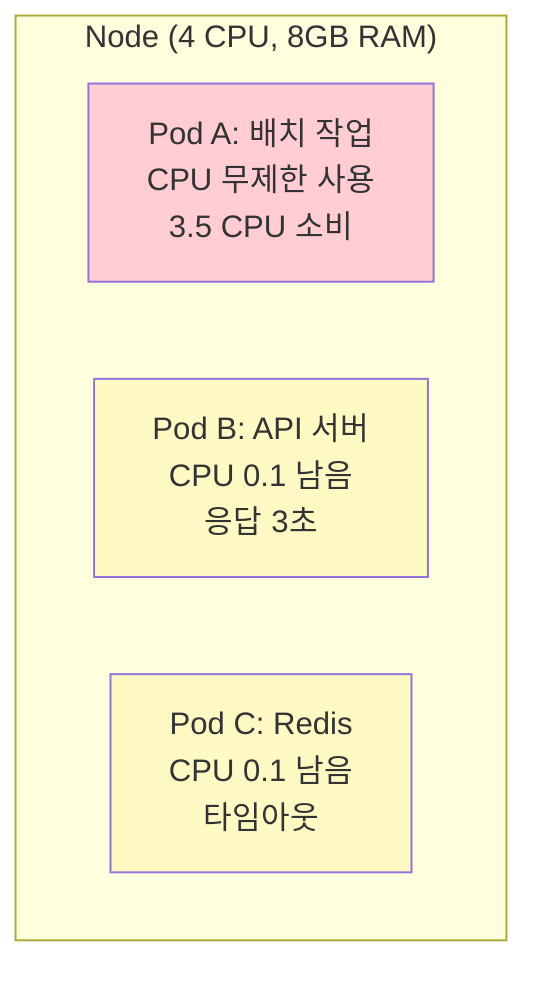
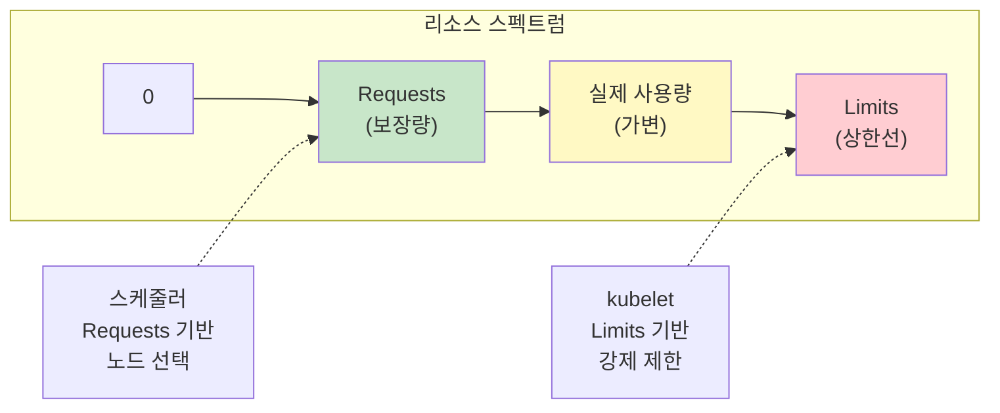
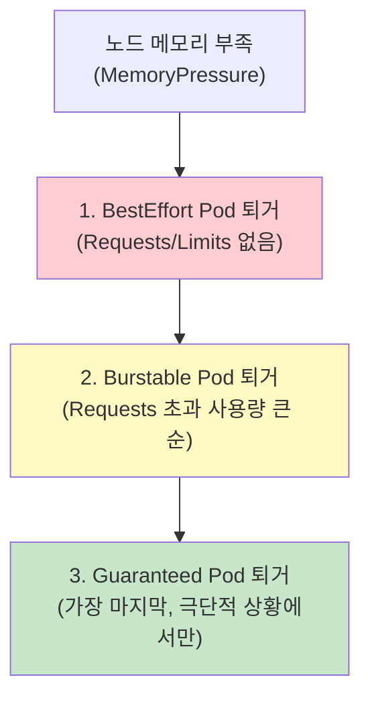
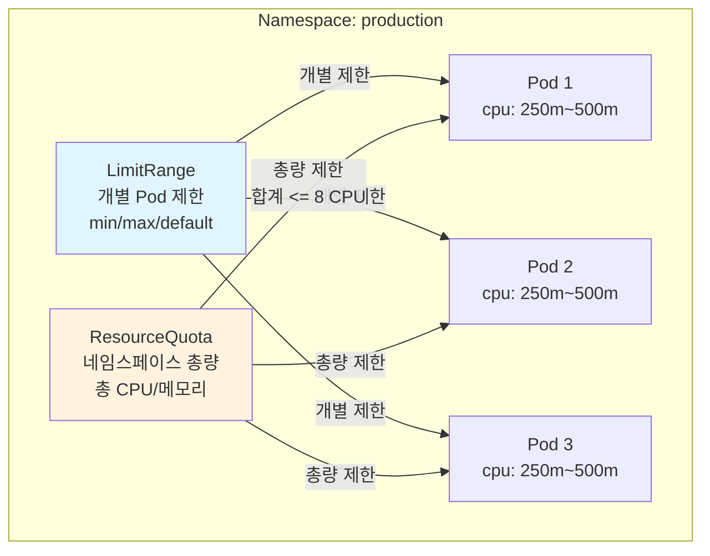

# Ch20. Kubernetes Resource Management - 클러스터 안정성의 기반

> **핵심 요약**
>
> Kubernetes 클러스터에서 리소스 관리는 안정적인 운영의 핵심이다. Pod에 적절한 CPU/메모리 Requests와 Limits를 설정하지 않으면, 하나의 워크로드가 노드의 모든 리소스를 독점하여 다른 워크로드에 영향을 주는 Noisy Neighbor 문제가 발생한다. Kubernetes는 Requests/Limits, QoS 클래스, LimitRange, ResourceQuota라는 네 가지 메커니즘으로 리소스를 계층적으로 관리한다. CPU는 throttling으로 제한되고 메모리는 OOMKill로 제한되므로, 각 리소스의 특성을 이해하고 적절한 값을 설정하는 것이 중요하다. 본 챕터에서는 리소스 관리의 핵심 개념부터 Right-sizing 전략, 모니터링, 그리고 Minikube에서의 실험까지 다룬다.

## 학습 목표

1. Requests와 Limits의 의미 차이를 이해하고, 스케줄러와 kubelet이 각각을 어떻게 사용하는지 설명할 수 있다
2. QoS 클래스(Guaranteed, Burstable, BestEffort)의 결정 기준과 Pod 퇴거(Eviction) 순서를 설명할 수 있다
3. LimitRange로 네임스페이스 레벨 기본값과 제한을 설정할 수 있다
4. ResourceQuota로 네임스페이스별 총량을 제한하는 전략을 설계할 수 있다
5. CPU throttling과 Memory OOMKill의 차이를 이해하고, 각각에 대한 대응 전략을 수립할 수 있다
6. VPA recommendations와 모니터링 도구를 활용한 Right-sizing 전략을 적용할 수 있다

---

## 1. 왜 리소스 관리가 중요한가

### 1.1 Noisy Neighbor 문제

멀티 테넌트 환경에서 여러 팀이 하나의 Kubernetes 클러스터를 공유할 때, 리소스 관리가 없으면 심각한 문제가 발생한다. 하나의 Pod가 노드의 CPU를 100% 소비하면, 같은 노드의 다른 Pod는 CPU를 할당받지 못해 응답 시간이 급격히 늘어난다. 이를 "Noisy Neighbor(시끄러운 이웃)" 문제라 부른다.

**실제 시나리오**: 개발팀 A의 배치 작업이 CPU를 무한히 사용하면서, 같은 노드에서 실행 중인 개발팀 B의 API 서버 응답 시간이 10ms에서 3초로 증가했다. 리소스 제한이 없었기 때문에, 스케줄러는 노드에 충분한 여유가 있다고 판단하여 두 워크로드를 같은 노드에 배치했다.



이 문제를 방지하려면, 각 Pod에 적절한 리소스 Requests와 Limits를 설정해야 한다. Requests는 스케줄러에게 "이 Pod는 최소한 이만큼의 리소스가 필요하다"고 알려주고, Limits는 kubelet에게 "이 Pod가 사용할 수 있는 최대치"를 알려준다.

### 1.2 OOMKilled - 메모리 부족으로 인한 강제 종료

메모리는 CPU와 달리 "압축 불가능한(incompressible)" 리소스다. CPU가 부족하면 프로세스가 느려지지만, 메모리가 부족하면 프로세스가 즉시 종료된다. Kubernetes에서 Pod가 메모리 Limits를 초과하면, Linux Kernel의 OOM Killer가 컨테이너의 메인 프로세스를 SIGKILL(Exit Code 137)로 강제 종료한다.

**OOMKilled가 발생하는 시나리오**:
- Java 애플리케이션의 Heap이 컨테이너 메모리 Limits를 초과
- 메모리 누수로 시간이 지남에 따라 사용량이 증가
- 트래픽 급증으로 동시 요청 처리에 필요한 메모리가 증가
- Off-heap 메모리(Native, Thread Stack)를 고려하지 않은 설정

```bash
# OOMKilled 확인
kubectl describe pod <pod-name>
# Last State:     Terminated
#   Reason:       OOMKilled
#   Exit Code:    137
```

이처럼 리소스 관리는 "좋으면 하는 것"이 아니라, 클러스터 안정성을 위한 필수 요소다.

---

## 2. Requests vs Limits: 의미와 차이

### 2.1 Requests - 스케줄러에게 보내는 보장 요청

**Requests**는 Pod가 정상 동작하기 위해 필요한 최소 리소스 양이다. Kubernetes 스케줄러(kube-scheduler)는 Requests를 기반으로 Pod를 어느 노드에 배치할지 결정한다.

```yaml
apiVersion: v1
kind: Pod
metadata:
  name: web-server
spec:
  containers:
  - name: nginx
    image: nginx:1.25
    resources:
      requests:
        cpu: "250m"      # 0.25 CPU core
        memory: "128Mi"  # 128 MiB
```

**동작 방식**:
1. Pod 생성 요청이 API Server에 도착한다
2. kube-scheduler가 모든 노드의 "할당 가능한(allocatable)" 리소스를 확인한다
3. 각 노드에서 이미 스케줄링된 Pod의 Requests 합계를 뺀 잔여 리소스를 계산한다
4. 잔여 리소스가 새 Pod의 Requests보다 크거나 같은 노드 중 최적의 노드를 선택한다
5. 어떤 노드도 Requests를 만족하지 못하면 Pod는 Pending 상태가 된다

**핵심**: Requests는 "보장(Guarantee)"이다. 스케줄러가 Requests만큼의 리소스를 확보한 노드에 Pod를 배치하므로, Pod는 최소한 Requests만큼은 항상 사용할 수 있다.

### 2.2 Limits - kubelet이 강제하는 상한선

**Limits**는 Pod가 사용할 수 있는 리소스의 최대치다. 런타임(containerd, CRI-O)이 cgroup을 통해 이 제한을 강제한다.

```yaml
resources:
  requests:
    cpu: "250m"
    memory: "128Mi"
  limits:
    cpu: "500m"      # 최대 0.5 CPU core
    memory: "256Mi"  # 최대 256 MiB
```

**CPU Limits 동작**: CPU는 "압축 가능한(compressible)" 리소스이므로, Limits를 초과하면 프로세스가 종료되는 것이 아니라 **throttling(쓰로틀링)**된다. 컨테이너가 100ms 주기(CFS period) 동안 사용할 수 있는 CPU 시간이 제한되며, 한도를 소진하면 해당 주기가 끝날 때까지 대기한다.

**Memory Limits 동작**: 메모리는 "압축 불가능한(incompressible)" 리소스이므로, Limits를 초과하면 **OOMKill**이 발생한다. Linux Kernel의 cgroup이 메모리 사용량을 감시하고, 한도를 넘는 순간 SIGKILL 신호를 보내 프로세스를 강제 종료한다.

### 2.3 Requests와 Limits의 관계



**규칙**:
- `Requests <= Limits` 이어야 한다 (Requests > Limits는 API Server가 거부)
- Requests만 설정하면 Limits는 무제한이 된다
- Limits만 설정하면 Requests가 Limits와 동일하게 자동 설정된다
- 둘 다 미설정이면 BestEffort QoS 클래스가 된다

### 2.4 CPU 단위와 메모리 단위

**CPU 단위**:
- `1` = 1 CPU core (AWS vCPU, GCP core, Azure vCore)
- `1000m` = 1 CPU core (millicpu)
- `250m` = 0.25 CPU core
- 최소 단위: `1m` (0.001 core)

**메모리 단위**:
- `128Mi` = 128 MiB (Mebibytes, 2^20)
- `256M` = 256 MB (Megabytes, 10^6)
- `1Gi` = 1 GiB (Gibibytes, 2^30)
- `Mi`와 `M`의 차이: 128Mi = 134,217,728 bytes, 128M = 128,000,000 bytes (약 4.9% 차이)

> **실무 팁**: 메모리는 항상 `Mi`, `Gi` (이진 단위)를 사용하는 것이 안전하다. 십진 단위(`M`, `G`)를 사용하면 예상보다 적은 메모리가 할당되어 OOMKilled가 발생할 수 있다.

---

## 3. QoS 클래스: Guaranteed, Burstable, BestEffort

### 3.1 QoS 클래스란

Kubernetes는 Pod의 Requests/Limits 설정에 따라 자동으로 **QoS(Quality of Service) 클래스**를 부여한다. 이 클래스는 노드에 리소스 압박(Resource Pressure)이 발생했을 때, 어떤 Pod를 먼저 퇴거(Evict)할지 결정하는 우선순위로 사용된다.

### 3.2 세 가지 QoS 클래스

**1. Guaranteed (최고 우선순위)**

모든 컨테이너의 CPU/메모리 Requests와 Limits가 동일하게 설정된 경우 부여된다. 가장 마지막에 퇴거되며, 리소스가 보장된다.

```yaml
# Guaranteed 예시
resources:
  requests:
    cpu: "500m"
    memory: "256Mi"
  limits:
    cpu: "500m"       # requests == limits
    memory: "256Mi"   # requests == limits
```

**2. Burstable (중간 우선순위)**

Requests와 Limits가 설정되었지만, 값이 다른 경우 부여된다. 평상시에는 Requests 이상을 사용할 수 있지만, 노드 리소스가 부족해지면 Guaranteed보다 먼저 퇴거된다.

```yaml
# Burstable 예시
resources:
  requests:
    cpu: "250m"
    memory: "128Mi"
  limits:
    cpu: "500m"       # requests < limits
    memory: "256Mi"   # requests < limits
```

**3. BestEffort (최저 우선순위)**

Requests와 Limits가 모두 설정되지 않은 경우 부여된다. 노드에 여유 리소스가 있으면 무제한으로 사용할 수 있지만, 리소스 압박 시 가장 먼저 퇴거된다.

```yaml
# BestEffort 예시
resources: {}  # 아무것도 설정하지 않음
```

### 3.3 QoS 클래스별 Eviction 순서

노드의 메모리가 부족해지면(MemoryPressure), kubelet은 다음 순서로 Pod를 퇴거한다:



**Burstable Pod 간 퇴거 순서**: Requests 대비 실제 사용량의 비율이 높은 Pod부터 퇴거한다. 예를 들어 Pod A가 128Mi Requests에 250Mi를 사용하고 있고(195% 초과), Pod B가 256Mi Requests에 300Mi를 사용하고 있다면(117% 초과), Pod A가 먼저 퇴거된다.

### 3.4 QoS 클래스 확인

```bash
# Pod의 QoS 클래스 확인
kubectl get pod <pod-name> -o jsonpath='{.status.qosClass}'

# 모든 Pod의 QoS 클래스 조회
kubectl get pods -o custom-columns="NAME:.metadata.name,QOS:.status.qosClass"
```

> **실무 권장**: 프로덕션의 핵심 워크로드(DB, API Server)는 Guaranteed로, 배치/크론 작업은 Burstable로, 개발/테스트 환경은 BestEffort 허용으로 운영한다.

---

## 4. LimitRange: 네임스페이스 레벨 기본값 설정

### 4.1 왜 LimitRange가 필요한가

모든 개발자가 Pod 매니페스트에 Requests/Limits를 설정한다는 보장이 없다. 설정을 누락하면 BestEffort Pod가 되어 클러스터 안정성을 위협한다. **LimitRange**는 네임스페이스에 기본 Requests/Limits를 설정하고, 허용 범위를 제한하여 이 문제를 방지한다.

### 4.2 LimitRange 설정

```yaml
apiVersion: v1
kind: LimitRange
metadata:
  name: default-limits
  namespace: production
spec:
  limits:
  # 컨테이너 레벨 기본값 및 제한
  - type: Container
    default:           # Limits 기본값 (미설정 시 자동 적용)
      cpu: "500m"
      memory: "256Mi"
    defaultRequest:    # Requests 기본값 (미설정 시 자동 적용)
      cpu: "100m"
      memory: "128Mi"
    min:               # 최소값 (이보다 낮게 설정 불가)
      cpu: "50m"
      memory: "64Mi"
    max:               # 최대값 (이보다 높게 설정 불가)
      cpu: "2000m"
      memory: "2Gi"
    maxLimitRequestRatio:  # Limits/Requests 비율 제한
      cpu: "4"             # CPU Limits가 Requests의 4배를 초과할 수 없음

  # Pod 레벨 제한 (모든 컨테이너 합계)
  - type: Pod
    max:
      cpu: "4000m"
      memory: "4Gi"
```

### 4.3 LimitRange 동작 방식

1. **기본값 주입**: Pod 생성 시 Requests/Limits가 없으면 `default`와 `defaultRequest` 값을 자동 주입한다
2. **유효성 검사**: Pod의 값이 `min`~`max` 범위를 벗어나면 API Server가 거부한다
3. **비율 제한**: `maxLimitRequestRatio`를 초과하면 거부한다 (과도한 Burstable 방지)

**적용 확인**:
```bash
# LimitRange 조회
kubectl get limitrange -n production

# 상세 확인
kubectl describe limitrange default-limits -n production

# Requests/Limits 없이 Pod 생성 후 확인
kubectl run test --image=nginx -n production
kubectl get pod test -n production -o yaml | grep -A 10 resources
# → default값이 자동으로 주입됨
```

### 4.4 LimitRange 설계 가이드라인

- **defaultRequest**: 워크로드의 평균 사용량을 기반으로 설정한다. 너무 높으면 노드 활용률이 떨어지고, 너무 낮으면 실제 사용량과 괴리가 생긴다
- **max**: 단일 Pod가 노드 리소스를 독점하지 못하도록 노드 용량의 50% 이하로 설정한다
- **maxLimitRequestRatio**: 2~4배가 적절하다. 비율이 너무 높으면 과도한 overcommit으로 노드 안정성이 저하된다

---

## 5. ResourceQuota: 네임스페이스별 총량 제한

### 5.1 왜 ResourceQuota가 필요한가

LimitRange가 개별 Pod의 리소스를 제한한다면, **ResourceQuota**는 네임스페이스 전체의 리소스 총량을 제한한다. 멀티 테넌트 환경에서 각 팀(네임스페이스)이 사용할 수 있는 리소스의 상한선을 설정하여, 한 팀이 클러스터 리소스를 과도하게 사용하는 것을 방지한다.

### 5.2 ResourceQuota 설정

```yaml
apiVersion: v1
kind: ResourceQuota
metadata:
  name: team-a-quota
  namespace: team-a
spec:
  hard:
    # 리소스 제한
    requests.cpu: "8"         # CPU Requests 합계 최대 8 core
    requests.memory: "16Gi"   # 메모리 Requests 합계 최대 16 GiB
    limits.cpu: "16"          # CPU Limits 합계 최대 16 core
    limits.memory: "32Gi"     # 메모리 Limits 합계 최대 32 GiB

    # 오브젝트 수 제한
    pods: "50"                # Pod 최대 50개
    services: "20"            # Service 최대 20개
    secrets: "100"            # Secret 최대 100개
    configmaps: "100"         # ConfigMap 최대 100개
    persistentvolumeclaims: "20"  # PVC 최대 20개

    # 스토리지 제한
    requests.storage: "100Gi"     # 전체 PVC 스토리지 합계
```

### 5.3 ResourceQuota 동작 방식

1. ResourceQuota가 설정된 네임스페이스에서 Pod를 생성할 때, 기존 Pod의 Requests/Limits 합계 + 새 Pod의 Requests/Limits가 Quota를 초과하면 API Server가 거부한다
2. Quota가 설정된 네임스페이스에서는 **모든 Pod에 Requests/Limits가 필수**다. 미설정 시 Pod 생성이 거부된다 (LimitRange의 기본값과 함께 사용하면 해결)
3. 현재 사용량은 실시간으로 추적된다

**사용량 확인**:
```bash
# ResourceQuota 현재 사용량 조회
kubectl get resourcequota team-a-quota -n team-a

# 출력 예시:
# NAME           AGE   REQUEST                                      LIMIT
# team-a-quota   30d   requests.cpu: 4/8, requests.memory: 8Gi/16Gi   limits.cpu: 8/16, limits.memory: 16Gi/32Gi

# 상세 조회
kubectl describe resourcequota team-a-quota -n team-a
```

### 5.4 LimitRange + ResourceQuota 조합

실무에서는 LimitRange와 ResourceQuota를 함께 사용한다. LimitRange가 개별 Pod에 기본값과 범위를 설정하고, ResourceQuota가 네임스페이스 전체의 총량을 제한한다.



**조합 전략**:
- LimitRange `max.cpu: 2000m` → 단일 Pod 최대 2 core
- ResourceQuota `requests.cpu: 8` → 네임스페이스 전체 최대 8 core
- 결과: 최대 4개의 2-core Pod 또는 32개의 250m Pod를 배포할 수 있다

---

## 6. CPU Throttling vs Memory OOMKill의 차이

### 6.1 CPU Throttling

CPU는 압축 가능한(compressible) 리소스이므로, Limits를 초과하면 **프로세스가 종료되지 않고 속도가 느려진다**. Linux Kernel의 CFS(Completely Fair Scheduler)가 컨테이너에 할당된 CPU 시간(quota)을 초과하면, 해당 주기(period, 기본 100ms)가 끝날 때까지 CPU를 사용하지 못하게 한다.

**예시**: CPU Limits가 `500m`인 컨테이너는 100ms 주기 동안 50ms의 CPU 시간을 사용할 수 있다. 50ms를 모두 소진하면 나머지 50ms 동안 대기(throttle)한다.

**throttling의 영향**:
- API 응답 시간 증가 (p99 레이턴시 급증)
- 요청 처리 지연으로 타임아웃 발생
- Garbage Collection 시간 증가 (Java, Go)
- 스케줄링 지연으로 실시간 처리 성능 저하

**throttling 감지**:
```bash
# Pod의 CPU throttling 확인 (Prometheus 메트릭)
# container_cpu_cfs_throttled_periods_total: throttle된 주기 수
# container_cpu_cfs_periods_total: 전체 주기 수

# PromQL: throttling 비율
rate(container_cpu_cfs_throttled_periods_total[5m])
/
rate(container_cpu_cfs_periods_total[5m]) * 100
```

> **실무 팁**: throttling 비율이 25%를 넘으면 CPU Limits를 증가시켜야 한다. 일부 조직에서는 CPU Limits를 아예 설정하지 않고 Requests만 설정하는 전략을 사용한다. 이는 throttling을 방지하지만, 노드 CPU 경합 시 다른 Pod에 영향을 줄 수 있다.

### 6.2 Memory OOMKill

메모리는 압축 불가능한(incompressible) 리소스이므로, Limits를 초과하면 **프로세스가 즉시 종료된다**. Linux Kernel의 OOM Killer가 cgroup의 메모리 한도를 초과한 프로세스에 SIGKILL(신호 9)을 보낸다.

**OOMKill의 특성**:
- 경고 없이 즉시 종료 (graceful shutdown 불가)
- 메모리에 있던 데이터가 유실된다 (캐시, 세션 등)
- Kubernetes가 컨테이너를 자동 재시작한다 (restartPolicy에 따라)
- 반복되면 CrashLoopBackOff 상태가 된다

**OOMKill 진단**:
```bash
# Pod 상태 확인
kubectl describe pod <pod-name>
# Last State:     Terminated
#   Reason:       OOMKilled
#   Exit Code:    137

# 노드 레벨 OOM 이벤트 확인
kubectl get events --field-selector reason=OOMKilling

# 메모리 사용량 추적 (OOMKill 전에)
kubectl top pod <pod-name>
```

### 6.3 비교 요약

| 속성 | CPU | Memory |
|------|-----|--------|
| 리소스 유형 | 압축 가능 (compressible) | 압축 불가능 (incompressible) |
| Limits 초과 시 | Throttling (느려짐) | OOMKill (종료) |
| 프로세스 영향 | 지연 증가, 타임아웃 | 즉시 종료, 데이터 유실 |
| 감지 방법 | CFS throttled 메트릭 | Exit Code 137, OOMKilled 이벤트 |
| 대응 전략 | Limits 증가 또는 제거 | Limits 증가, 메모리 최적화 |
| 위험도 | 중간 (성능 저하) | 높음 (서비스 중단) |

---

## 7. 실무 가이드라인: Requests는 평균, Limits는 피크

### 7.1 Requests 설정 전략

Requests는 Pod의 **평균 사용량**을 기반으로 설정한다. 너무 높게 설정하면 노드 활용률이 떨어지고(리소스 낭비), 너무 낮게 설정하면 노드에 과다 스케줄링되어 성능이 저하된다.

**Requests 산정 공식**:
```
CPU Requests = P50(중앙값) CPU 사용량 * 1.1 (10% 마진)
Memory Requests = P50 메모리 사용량 * 1.2 (20% 마진)
```

**왜 메모리는 마진이 더 큰가**: CPU는 throttling으로 대응하지만, 메모리는 OOMKill이 발생하므로 여유를 더 둔다.

### 7.2 Limits 설정 전략

Limits는 Pod의 **피크(최대) 사용량**을 기반으로 설정한다.

**Limits 산정 공식**:
```
CPU Limits = P99 CPU 사용량 * 1.2 (또는 미설정)
Memory Limits = P99 메모리 사용량 * 1.3 (30% 마진)
```

**CPU Limits를 설정하지 않는 전략**: Google, Meta 등 일부 대규모 운영 환경에서는 CPU Limits를 설정하지 않는다. CPU throttling이 마이크로서비스의 tail latency를 악화시키기 때문이다. 대신 CPU Requests를 정확히 설정하여 스케줄러가 적절히 배치하도록 한다.

### 7.3 워크로드별 권장 설정

| 워크로드 유형 | CPU Requests | CPU Limits | Memory Requests | Memory Limits |
|--------------|-------------|------------|-----------------|---------------|
| API Server | P50 * 1.1 | P99 * 1.5 또는 미설정 | P50 * 1.2 | P99 * 1.3 |
| 배치 작업 | P50 * 1.0 | P99 * 1.2 | P50 * 1.1 | P99 * 1.2 |
| DB (Stateful) | P75 * 1.2 | = Requests (Guaranteed) | P75 * 1.2 | = Requests (Guaranteed) |
| 캐시 (Redis) | P50 * 1.1 | = Requests (Guaranteed) | 최대 데이터 크기 * 1.5 | = Requests (Guaranteed) |
| CronJob | 낮게 설정 | P99 * 1.5 | 낮게 설정 | P99 * 1.5 |

> **핵심 원칙**: 중요한 Stateful 워크로드(DB, 캐시)는 Guaranteed(Requests = Limits)로, Stateless API 서버는 Burstable로 운영한다.

---

## 8. Right-sizing 전략: VPA Recommendations 활용

### 8.1 문제: 초기 리소스 설정의 어려움

새 서비스를 배포할 때 CPU/메모리 사용량을 정확히 예측하기 어렵다. 개발자는 보통 "넉넉하게" 설정하여 리소스를 낭비하거나, "최소한으로" 설정하여 OOMKill이 발생한다. Right-sizing은 실제 사용 데이터를 기반으로 최적의 Requests/Limits를 찾는 과정이다.

### 8.2 Vertical Pod Autoscaler (VPA)

VPA는 Pod의 리소스 사용 패턴을 분석하여 최적의 Requests/Limits를 추천한다.

```yaml
apiVersion: autoscaling.k8s.io/v1
kind: VerticalPodAutoscaler
metadata:
  name: web-server-vpa
spec:
  targetRef:
    apiVersion: apps/v1
    kind: Deployment
    name: web-server
  updatePolicy:
    updateMode: "Off"  # 추천만 받고 자동 적용하지 않음
  resourcePolicy:
    containerPolicies:
    - containerName: nginx
      minAllowed:
        cpu: "50m"
        memory: "64Mi"
      maxAllowed:
        cpu: "2000m"
        memory: "2Gi"
```

**VPA 모드**:
- `Off`: 추천만 제공하고 자동 적용하지 않음 (안전, 초기 운영에 권장)
- `Initial`: Pod 생성 시에만 추천값 적용 (실행 중 변경 없음)
- `Auto`: 추천값을 자동 적용 (Pod 재시작 발생)

**추천값 확인**:
```bash
# VPA 추천 조회
kubectl get vpa web-server-vpa -o yaml

# 출력 예시:
# recommendation:
#   containerRecommendations:
#   - containerName: nginx
#     lowerBound:
#       cpu: "100m"
#       memory: "128Mi"
#     target:            # 권장값
#       cpu: "250m"
#       memory: "192Mi"
#     upperBound:
#       cpu: "500m"
#       memory: "384Mi"
#     uncappedTarget:    # 정책 제한 무시 시 권장값
#       cpu: "250m"
#       memory: "192Mi"
```

### 8.3 수동 Right-sizing 프로세스

VPA를 사용하지 않는 경우, 다음 프로세스로 수동 최적화를 수행한다:

1. **데이터 수집 (1~2주)**: Prometheus에서 CPU/메모리 사용량 메트릭을 수집한다
2. **분석**: P50, P95, P99, Max 값을 확인한다
   ```promql
   # CPU P95
   quantile_over_time(0.95, rate(container_cpu_usage_seconds_total{pod=~"web-server.*"}[5m])[7d:1m])

   # Memory P95
   quantile_over_time(0.95, container_memory_working_set_bytes{pod=~"web-server.*"}[7d:1m])
   ```
3. **Requests 설정**: P50 값에 10~20% 마진을 더한다
4. **Limits 설정**: P99 값에 20~30% 마진을 더한다
5. **적용 및 모니터링**: 변경 후 1주간 OOMKill, throttling 메트릭을 관찰한다
6. **반복**: 분기별로 리소스 사용 패턴을 재분석하여 조정한다

---

## 9. 리소스 모니터링: kubectl top, Prometheus + Grafana

### 9.1 kubectl top - 빠른 확인

`kubectl top` 명령은 metrics-server가 수집한 현재 리소스 사용량을 보여준다.

```bash
# metrics-server 설치 (Minikube)
minikube addons enable metrics-server

# 노드별 리소스 사용량
kubectl top nodes
# NAME       CPU(cores)   CPU%   MEMORY(bytes)   MEMORY%
# minikube   750m         18%    2048Mi          51%

# Pod별 리소스 사용량
kubectl top pods -n production
# NAME                  CPU(cores)   MEMORY(bytes)
# web-server-abc123     125m         180Mi
# api-gateway-def456    350m         256Mi

# 정렬 (메모리 사용량 순)
kubectl top pods -A --sort-by=memory

# 컨테이너별 사용량
kubectl top pods --containers
```

### 9.2 Prometheus + Grafana 대시보드

장기적인 리소스 모니터링과 트렌드 분석에는 Prometheus와 Grafana가 필수다.

**핵심 메트릭**:

| 메트릭 | 설명 | PromQL |
|--------|------|--------|
| CPU 사용량 | 실제 CPU 사용률 | `rate(container_cpu_usage_seconds_total[5m])` |
| CPU Requests | 설정된 Requests | `kube_pod_container_resource_requests{resource="cpu"}` |
| CPU Limits | 설정된 Limits | `kube_pod_container_resource_limits{resource="cpu"}` |
| CPU Throttling | CFS throttle 비율 | `rate(container_cpu_cfs_throttled_periods_total[5m]) / rate(container_cpu_cfs_periods_total[5m])` |
| 메모리 사용량 | Working Set 기준 | `container_memory_working_set_bytes` |
| 메모리 Requests | 설정된 Requests | `kube_pod_container_resource_requests{resource="memory"}` |
| 메모리 Limits | 설정된 Limits | `kube_pod_container_resource_limits{resource="memory"}` |
| OOMKill 횟수 | OOMKill 발생 횟수 | `kube_pod_container_status_last_terminated_reason{reason="OOMKilled"}` |

**Grafana 대시보드 구성**:

1. **클러스터 개요 패널**: 전체 노드의 CPU/메모리 할당률(Requests 합계 / Allocatable)
2. **네임스페이스별 사용량**: 각 네임스페이스의 실제 사용량 vs Requests vs Limits
3. **Pod별 상세**: 개별 Pod의 CPU throttling 비율, 메모리 사용률
4. **알림 패널**: OOMKill 발생, CPU throttling 25% 초과, 메모리 사용률 85% 초과

**핵심 PromQL 쿼리 - 리소스 효율성**:

```promql
# CPU 사용률 (Requests 대비) - 100%를 넘으면 Requests보다 많이 사용 중
sum(rate(container_cpu_usage_seconds_total{namespace="production"}[5m])) by (pod)
/
sum(kube_pod_container_resource_requests{namespace="production", resource="cpu"}) by (pod)
* 100

# 메모리 사용률 (Limits 대비) - 85% 이상이면 OOMKill 위험
sum(container_memory_working_set_bytes{namespace="production"}) by (pod)
/
sum(kube_pod_container_resource_limits{namespace="production", resource="memory"}) by (pod)
* 100
```

---

## 10. Minikube에서 리소스 제한 실험

### 10.1 실험 환경 구성

```bash
# Minikube 시작 (리소스 제한으로 효과를 체감)
minikube start --memory=4096 --cpus=2

# metrics-server 활성화
minikube addons enable metrics-server

# 실험용 네임스페이스 생성
kubectl create namespace resource-lab
```

### 10.2 실험 1: 의도적 OOMKill 유발

```yaml
# oom-test.yaml
apiVersion: v1
kind: Pod
metadata:
  name: oom-test
  namespace: resource-lab
spec:
  containers:
  - name: stress
    image: polinux/stress
    command: ["stress"]
    args: ["--vm", "1", "--vm-bytes", "200M", "--vm-hang", "1"]
    resources:
      requests:
        memory: "64Mi"
      limits:
        memory: "128Mi"  # 128Mi Limits에 200Mi 사용 시도 → OOMKill
```

```bash
# Pod 생성
kubectl apply -f oom-test.yaml

# 상태 관찰 (OOMKilled 확인)
kubectl get pod oom-test -n resource-lab -w

# 상세 확인
kubectl describe pod oom-test -n resource-lab
# → Reason: OOMKilled, Exit Code: 137
```

### 10.3 실험 2: CPU Throttling 관찰

```yaml
# cpu-throttle-test.yaml
apiVersion: v1
kind: Pod
metadata:
  name: cpu-throttle-test
  namespace: resource-lab
spec:
  containers:
  - name: stress
    image: polinux/stress
    command: ["stress"]
    args: ["--cpu", "2", "--timeout", "120"]
    resources:
      requests:
        cpu: "100m"
      limits:
        cpu: "200m"  # 200m Limits에 2 core 사용 시도 → Throttling
```

```bash
# Pod 생성
kubectl apply -f cpu-throttle-test.yaml

# CPU 사용량 확인 (200m으로 제한됨)
kubectl top pod cpu-throttle-test -n resource-lab
# CPU(cores): 200m (limits에 의해 제한)
```

### 10.4 실험 3: QoS 클래스별 동작 확인

```yaml
# qos-guaranteed.yaml
apiVersion: v1
kind: Pod
metadata:
  name: qos-guaranteed
  namespace: resource-lab
spec:
  containers:
  - name: nginx
    image: nginx:1.25
    resources:
      requests:
        cpu: "100m"
        memory: "128Mi"
      limits:
        cpu: "100m"        # requests == limits
        memory: "128Mi"    # requests == limits
---
# qos-burstable.yaml
apiVersion: v1
kind: Pod
metadata:
  name: qos-burstable
  namespace: resource-lab
spec:
  containers:
  - name: nginx
    image: nginx:1.25
    resources:
      requests:
        cpu: "50m"
        memory: "64Mi"
      limits:
        cpu: "200m"        # requests < limits
        memory: "256Mi"    # requests < limits
---
# qos-besteffort.yaml
apiVersion: v1
kind: Pod
metadata:
  name: qos-besteffort
  namespace: resource-lab
spec:
  containers:
  - name: nginx
    image: nginx:1.25
    # resources 미설정
```

```bash
# Pod 생성
kubectl apply -f qos-guaranteed.yaml
kubectl apply -f qos-burstable.yaml
kubectl apply -f qos-besteffort.yaml

# QoS 클래스 확인
kubectl get pods -n resource-lab -o custom-columns="NAME:.metadata.name,QOS:.status.qosClass"
# NAME              QOS
# qos-guaranteed    Guaranteed
# qos-burstable     Burstable
# qos-besteffort    BestEffort
```

### 10.5 실험 4: LimitRange + ResourceQuota 동작

```yaml
# limitrange.yaml
apiVersion: v1
kind: LimitRange
metadata:
  name: lab-limits
  namespace: resource-lab
spec:
  limits:
  - type: Container
    default:
      cpu: "200m"
      memory: "128Mi"
    defaultRequest:
      cpu: "100m"
      memory: "64Mi"
    max:
      cpu: "500m"
      memory: "512Mi"
---
# resourcequota.yaml
apiVersion: v1
kind: ResourceQuota
metadata:
  name: lab-quota
  namespace: resource-lab
spec:
  hard:
    requests.cpu: "1"
    requests.memory: "1Gi"
    limits.cpu: "2"
    limits.memory: "2Gi"
    pods: "10"
```

```bash
# LimitRange, ResourceQuota 적용
kubectl apply -f limitrange.yaml
kubectl apply -f resourcequota.yaml

# Requests/Limits 없이 Pod 생성 (기본값 자동 주입)
kubectl run auto-limits --image=nginx -n resource-lab
kubectl get pod auto-limits -n resource-lab -o yaml | grep -A 6 resources

# Quota 초과 시도
kubectl run over-quota --image=nginx -n resource-lab \
  --overrides='{"spec":{"containers":[{"name":"nginx","image":"nginx","resources":{"requests":{"cpu":"2"}}}]}}'
# Error: exceeded quota

# Quota 사용량 확인
kubectl describe resourcequota lab-quota -n resource-lab
```

### 10.6 실험 정리

```bash
# 실험 네임스페이스 삭제 (모든 리소스 정리)
kubectl delete namespace resource-lab
```

---

## 정리

Kubernetes 리소스 관리는 클러스터 안정성과 비용 효율성의 핵심이다. Requests와 Limits를 적절히 설정하지 않으면 Noisy Neighbor 문제, OOMKill, 리소스 낭비가 발생한다.

**핵심 포인트**:

1. **Requests vs Limits**: Requests는 스케줄러에게 보장을 요청하는 최소치이고, Limits는 kubelet이 강제하는 상한선이다. Requests는 평균 사용량, Limits는 피크 사용량을 기준으로 설정한다.

2. **QoS 클래스**: Guaranteed(Requests = Limits) > Burstable(Requests < Limits) > BestEffort(미설정) 순으로 Eviction 우선순위가 결정된다. 핵심 워크로드는 Guaranteed로 운영한다.

3. **LimitRange**: 네임스페이스 레벨에서 기본값, 최소/최대 범위를 설정하여 개별 Pod의 리소스를 통제한다.

4. **ResourceQuota**: 네임스페이스 전체의 리소스 총량을 제한하여 멀티 테넌트 환경에서 공정한 리소스 분배를 보장한다.

5. **CPU vs Memory**: CPU는 throttling(느려짐), 메모리는 OOMKill(종료)로 제한된다. 메모리 Limits 설정에 더 주의를 기울여야 한다.

6. **Right-sizing**: VPA recommendations 또는 Prometheus 메트릭(P50, P95, P99)을 기반으로 최적의 Requests/Limits를 찾는다. 초기에는 여유 있게 설정하고, 데이터를 기반으로 점진적으로 최적화한다.

7. **모니터링**: `kubectl top`으로 빠른 확인, Prometheus + Grafana로 장기 트렌드 분석, CPU throttling 비율과 메모리 사용률을 핵심 지표로 관찰한다.

**다음 단계**: 실제 프로덕션 클러스터에서 VPA를 `Off` 모드로 설치하여 추천값을 수집하고, LimitRange + ResourceQuota를 네임스페이스별로 설정한다. Grafana 대시보드에 리소스 효율성 패널을 추가하여 팀 전체가 리소스 사용 현황을 모니터링할 수 있는 환경을 구축한다.


---

> **[이관 완료]** write/09_cloud/kubernetes/13-01.자원 관리.md · deepdive/13-01.자원 관리 점검.md (2026-04-19)
