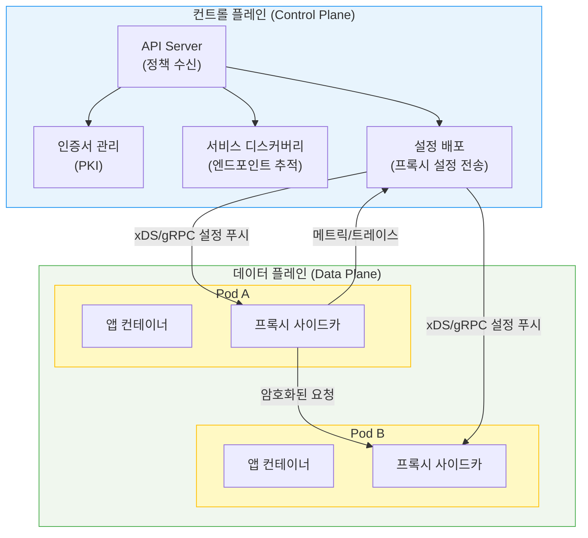
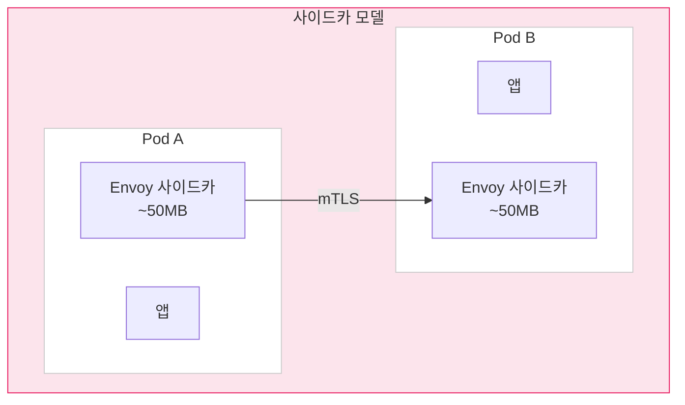
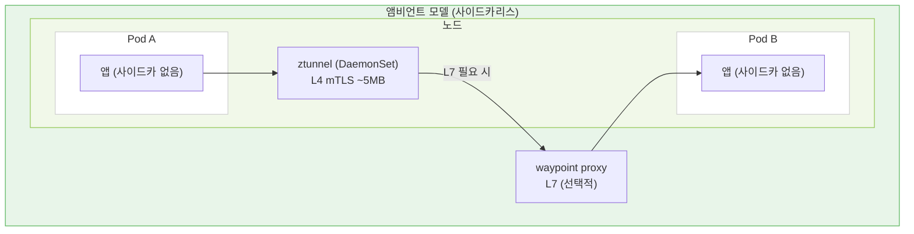
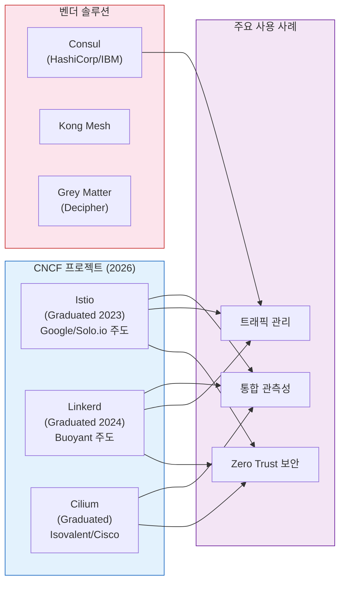

# Ch01. Service Mesh 기초와 2026 지형도

> **📌 핵심 요약**
> 서비스 메시는 마이크로서비스 간 통신 문제(보안, 신뢰성, 관측성)를 애플리케이션 코드가 아닌 인프라 계층에서 해결하는 전용 네트워크 레이어다. 2026년 기준 시장 규모는 약 6.2억 달러이며 연평균 41.3%로 성장 중이다. Istio(2023 CNCF 졸업)와 Linkerd(2024 CNCF 졸업)가 생태계를 주도하고, Cilium의 eBPF 기반 접근이 사이드카 오버헤드 문제에 새로운 대안을 제시하고 있다.


## 🎯 학습 목표

1. 마이크로서비스 환경에서 서비스 메시가 등장한 이유를 네트워크 복잡도 관점에서 설명할 수 있다
2. 데이터 플레인과 컨트롤 플레인의 역할 분리를 구체적인 예시로 설명할 수 있다
3. 사이드카 모델과 사이드카리스(앰비언트) 모델의 트레이드오프를 비교할 수 있다
4. 2026년 CNCF 서비스 메시 지형도에서 주요 플레이어와 포지셔닝을 파악할 수 있다
5. "서비스 메시가 필요한 상황"과 "필요하지 않은 상황"을 판단하는 기준을 세울 수 있다


## 1. 왜 서비스 메시가 필요한가

### 마이크로서비스의 통신 복잡도 문제

모놀리스 애플리케이션에서 함수 호출은 단순하다. 호출자와 피호출자가 같은 프로세스 내에 있어서 에러 처리, 성능 측정, 보안 모두 단일 컨텍스트 안에서 해결된다. 그러나 마이크로서비스로 전환하면 이 단순한 함수 호출이 네트워크 요청으로 바뀐다. 네트워크는 신뢰할 수 없다. 패킷이 손실되고, 지연이 발생하며, 서비스가 간헐적으로 응답하지 않는다.

서비스가 10개일 때 서비스 간 가능한 통신 경로는 최대 90개(n*(n-1))다. 서비스가 50개로 늘어나면 2,450개가 된다. 각 경로마다 타임아웃 설정, 재시도 로직, 서킷 브레이커, mTLS 인증서 관리를 개발자가 직접 구현해야 한다면 — 그리고 그 로직이 Java, Go, Python, Node.js로 각각 다르게 구현된다면 — 운영팀의 악몽이 시작된다.

실제로 Netflix가 2010년대 초반 마이크로서비스로 전환할 때 이 문제를 직접 겪었다. 그들의 해결책은 Hystrix(서킷 브레이커), Ribbon(로드 밸런싱), Eureka(서비스 디스커버리) 같은 라이브러리를 만드는 것이었다. 하지만 이 라이브러리들은 JVM 위에서만 동작했다. Python이나 Go로 작성된 서비스에는 적용할 수 없었고, 라이브러리 버전 관리는 또 다른 운영 부담이 됐다.

서비스 메시는 이 문제를 다른 방향에서 접근한다. **"애플리케이션 코드가 네트워크 신뢰성 문제를 해결하는 게 아니라, 인프라가 해결해야 한다"**는 관점이다. 언어에 무관하게, 코드 변경 없이, 네트워크 계층에서 이 모든 기능을 제공한다.

### 서비스 메시가 해결하는 세 가지 핵심 문제

**보안(Security)**: 기본적으로 클러스터 내부 서비스 간 통신은 암호화되지 않는다. Pod A가 Pod B에게 HTTP 요청을 보낼 때 중간에서 트래픽을 가로채면 내용을 그대로 읽을 수 있다. 서비스 메시는 mutual TLS(mTLS)를 자동으로 제공한다. 각 서비스에 자동으로 인증서를 발급하고, 모든 서비스 간 통신을 암호화하며, "이 서비스가 저 서비스와 통신할 자격이 있는가"를 인증서 기반으로 검증한다.

**신뢰성(Reliability)**: 타임아웃, 재시도, 서킷 브레이커, 헬스 체크 기반 로드 밸런싱을 애플리케이션 코드 수정 없이 정책으로 선언한다. "주문 서비스가 결제 서비스에 요청할 때 3초 타임아웃, 실패 시 2번 재시도, 5번 연속 실패 시 30초 차단"을 YAML로 정의하면 메시가 이를 실행한다.

**관측성(Observability)**: 모든 서비스 간 통신이 프록시를 거치므로, 요청 수, 지연 시간, 에러율, 트래픽 경로를 코드 변경 없이 자동으로 측정한다. "서비스 A → B → C 경로에서 C가 느린가, B가 느린가"를 분산 추적으로 정확히 파악할 수 있다.


## 2. 데이터 플레인과 컨트롤 플레인

> 서비스 메시는 논리적으로 두 레이어로 분리된다. 이 분리를 이해하면 서비스 메시의 작동 원리가 명확해진다.
>
> 1. 컨트롤 플레인
> 2. 데이터 플레인



**컨트롤 플레인**은 "무엇을 해야 하는가"를 결정하는 두뇌다. 

- 운영자가 정의한 정책(트래픽 규칙, 보안 정책, 관측성 설정)을 받아서 데이터 플레인의 모든 프록시에 설정을 배포한다. 
- 인증서를 발급하고, 서비스가 어디에 있는지(IP, 포트) 추적하며, 이 정보를 프록시에 실시간으로 전달한다. 컨트롤 플레인 자체는 실제 트래픽을 처리하지 않는다.

**데이터 플레인**은 "실제로 한다"의 영역이다. 

- 각 서비스 Pod 옆에 사이드카 프록시가 배치되어, Pod로 들어오고 나가는 모든 트래픽을 가로챈다. 프록시는 컨트롤 플레인에서 받은 설정에 따라 트래픽을 라우팅하고, mTLS를 적용하고, 메트릭을 수집한다. 실제 네트워크 패킷을 처리하는 주체가 바로 데이터 플레인이다.

이 분리의 핵심 이점은 확장성이다. 컨트롤 플레인은 클러스터 전체에서 보통 몇 개의 인스턴스만 실행되지만, 데이터 플레인 프록시는 모든 Pod마다 실행된다. 컨트롤 플레인이 다운되어도 데이터 플레인은 마지막으로 받은 설정으로 계속 트래픽을 처리한다. 뇌가 잠시 응답하지 않아도 몸이 기억한 대로 움직이는 것과 비슷하다.


## 3. 사이드카 모델 vs 사이드카리스(앰비언트) 모델

### 사이드카 모델

> 사이드카 모델은 각 애플리케이션 Pod에 프록시 컨테이너를 함께 배치하는 방식이다. 
>
> - 마치 오토바이 사이드카처럼 애플리케이션 옆에 딱 붙어서 동행한다.




쿠버네티스의 Init Container가 먼저 실행되어 iptables 규칙을 설정한다. 이 규칙은 Pod의 모든 인바운드/아웃바운드 트래픽을 프록시 포트(보통 15001/15006)로 리다이렉트한다. 이후 애플리케이션 컨테이너와 프록시 컨테이너가 동시에 실행된다. 애플리케이션은 자신이 프록시를 통해 통신한다는 사실조차 모른다.

사이드카 모델의 장점은 격리성이다. 

1. 각 Pod는 자신만의 프록시를 가지므로, 프록시 정책을 Pod 수준에서 세밀하게 제어할 수 있다. 
2. 한 서비스의 트래픽 폭증이 다른 서비스의 프록시에 영향을 주지 않는다. 

단점은 오버헤드다. 

1. Envoy 사이드카는 Pod당 약 50MB 메모리를 소비한다. 
2. 1,000개 Pod 클러스터라면 사이드카만으로 50GB 메모리가 사용된다.

### 사이드카리스(앰비언트) 모델

> 앰비언트 모델은 사이드카 없이 서비스 메시 기능을 제공한다. Istio가 2022년부터 개발 중인 이 모드는 두 개의 레이어로 기능을 분리한다.



첫 번째 레이어는 **ztunnel**이다. 노드당 하나씩 DaemonSet으로 실행되는 Rust 기반 프록시로, L4(TCP) 수준의 보안만 담당한다. mTLS 암호화와 기본 접근 제어를 처리하지만, HTTP 라우팅이나 헤더 기반 정책 같은 L7 기능은 다루지 않는다.

두 번째 레이어는 **waypoint proxy**이다. L7 기능이 필요한 서비스에만 선택적으로 배포하는 Envoy 기반 프록시다. 네임스페이스 또는 서비스 단위로 배포하며, 그 범위의 L7 트래픽을 처리한다.

앰비언트 모델의 핵심 이점은 단계적 채택이다. 

1. 사이드카 주입 없이 먼저 L4 보안을 얻고, L7 기능이 필요한 서비스에만 waypoint를 추가한다. 
2. 메모리 오버헤드도 대폭 줄어든다. 1,000개 Pod 클러스터에서 ztunnel이 노드당 하나씩만 실행되므로 프록시 오버헤드가 노드 수에 비례하지 Pod 수에 비례하지 않는다.

**모델 비교 요약**:

| 항목 | 사이드카 | 앰비언트(사이드카리스) |
|------|---------|----------------------|
| 프록시 위치 | Pod 내 컨테이너 | 노드(ztunnel) + 선택적 waypoint |
| 메모리 오버헤드 | Pod 수 × ~50MB | 노드 수 × ~5MB |
| L7 기능 | 기본 제공 | waypoint 추가 시만 |
| 성숙도(2026) | 프로덕션 표준 | Istio 1.22+ 안정화 |
| 격리성 | Pod 수준 | 공유 ztunnel |


## 4. 2026년 서비스 메시 지형도

>  서비스 메시 시장은 2026년 약 6.2억 달러 규모로, 연평균 성장률 41.3%가 예측된다. 이는 마이크로서비스와 쿠버네티스 도입이 엔터프라이즈 영역으로 확산되면서 네트워크 보안과 관측성 요구가 급증한 결과다.

CNCF(Cloud Native Computing Foundation)는 2023년 Istio를, 2024년 Linkerd를 Graduated 프로젝트로 승격시켰다. Graduated 지위는 "프로덕션 사용에 충분히 성숙했음"을 CNCF가 공식 인증하는 것으로, 두 프로젝트 모두 가장 높은 성숙도 단계에 있다.



### 주요 플레이어 상세

**Istio**: 구글이 2017년 론칭하고 현재 Solo.io가 엔터프라이즈 지원을 주도한다. 

- 데이터 플레인으로 Envoy 프록시를 사용하며, 기능 집합이 가장 풍부하다. 
- 트래픽 관리의 세밀한 제어, 다양한 관측성 도구 통합, 멀티클러스터 지원에서 강점이 있다. 
- 2022년부터 개발 중인 앰비언트 모드가 2024년 Istio 1.22에서 안정화 단계에 진입했다. 학습 곡선이 가파르고 운영 복잡도가 높다는 평가를 받지만, 기능 범위에서는 경쟁자가 없다.

**Linkerd**: Buoyant가 개발하며, "단순함(simplicity)"을 핵심 철학으로 삼는다. 

- 자체 개발한 Rust 기반 linkerd2-proxy를 데이터 플레인으로 사용한다. 
- Envoy 대비 메모리 사용량이 약 5배 낮고 지연 시간 오버헤드도 작다. 기능 범위가 Istio보다 좁지만 그만큼 운영이 단순하다. 
- Linkerd의 철학은 "서비스 메시가 눈에 띄어서는 안 된다"는 것으로, 운영자가 메시 자체를 관리하는 데 시간을 쓰지 않도록 설계됐다.

**Cilium**: eBPF 기반 쿠버네티스 네트워킹으로 시작해 서비스 메시 기능으로 확장했다. 

- Isovalent가 개발하고 2023년 Cisco가 인수했다. 기존 서비스 메시가 iptables에 의존하는 것과 달리, Cilium은 eBPF를 사용해 커널 수준에서 네트워킹을 처리한다. 
- 사이드카 없이 서비스 메시 기능을 제공할 수 있어 오버헤드가 낮다. 단, L7 기능을 위해 Envoy를 여전히 사용하며 Sidecarless는 L4에 주로 적용된다.

**Consul**: HashiCorp(현 IBM)의 서비스 메시로, 쿠버네티스 외에 VM, 베어메탈 환경도 지원한다. 하이브리드 클라우드 환경에서 강점이 있다. Envoy를 데이터 플레인으로 사용한다.


## 5. 서비스 메시 채택 판단 기준

### 필요한 상황

서비스 수가 10개를 넘어서고, 서비스 간 mTLS 설정을 수동으로 관리하기 시작할 때가 서비스 메시를 고려할 시점이다. 특히 다음 상황에서 효과가 명확하다.

규제 준수가 필요한 환경은 서비스 메시의 명확한 적용 대상이다. PCI-DSS, HIPAA 같은 규정에서 서비스 간 암호화와 접근 제어 감사 로그를 요구할 때, 서비스 메시는 이를 자동화하는 가장 현실적인 방법이다. 개별 서비스에서 mTLS를 구현하는 대신 메시 레이어에서 일관되게 적용할 수 있다.

폴리글랏(polyglot) 환경, 즉 여러 언어로 작성된 서비스가 혼재할 때도 메시가 빛난다. 서킷 브레이커를 Java에서는 Resilience4j로, Python에서는 Tenacity로, Go에서는 직접 구현하는 대신 메시 정책으로 한 번만 정의하면 된다.

### 필요하지 않은 상황

서비스가 5개 미만이고 팀이 소규모라면 서비스 메시의 운영 복잡도가 이득을 상쇄할 수 있다. 서비스 메시 자체가 또 하나의 운영 대상이 된다는 점을 간과해선 안 된다. 컨트롤 플레인 업그레이드, 인증서 만료 관리, 프록시 버전 관리가 새로운 운영 부담이 된다.

트래픽이 대부분 단방향(클라이언트 → 서버)이고 서비스 간 내부 통신이 거의 없는 경우에도 메시의 이점이 제한적이다. 또한 팀에 서비스 메시 운영 경험이 전혀 없다면, 장애 발생 시 디버깅 복잡도가 크게 높아진다.

실용적인 판단 기준은 이렇다. "우리 팀이 현재 네트워크 보안, 신뢰성, 관측성 문제를 수동으로 해결하는 데 얼마나 시간을 쓰고 있는가?" 이 시간이 팀 역량의 10% 이상이라면 서비스 메시 도입이 투자 대비 가치가 있다.


## 6. 서비스 메시와 관련 기술 비교

서비스 메시와 혼동되는 기술들이 있다. 정확한 구분이 중요하다.

**API Gateway vs 서비스 메시**: 

- API Gateway는 외부 클라이언트(브라우저, 모바일)와 백엔드 서비스 사이의 진입점이다. 인증, 속도 제한, API 버전 관리가 주요 기능이다. 
- 서비스 메시는 서비스 간(east-west) 통신을 다룬다. 두 기술은 상호 보완적으로 함께 사용하는 경우가 많다.

**쿠버네티스 NetworkPolicy vs 서비스 메시**: 

- NetworkPolicy는 IP/포트 수준의 L3/L4 접근 제어다. "Pod A는 Port 8080으로만 Pod B에 접근 가능"을 IP 테이블로 구현한다. 
- 서비스 메시는 이보다 상위 수준에서 HTTP 헤더, JWT, 서비스 아이덴티티 기반 정책을 적용한다.

**서비스 메시 인터페이스(SMI)**: 서비스 메시 구현을 표준화하기 위한 API 명세다. 이론적으로는 Istio에서 Linkerd로 교체할 때 YAML 수정을 최소화할 수 있지만, 실제로는 각 구현체의 고유 기능을 사용하면 이식성이 제한된다.


## 7. 서비스 메시의 핵심 기능 상세

### 7.1 트래픽 관리 (Traffic Management)

트래픽 관리는 서비스 메시의 가장 직접적인 가치 영역이다. 쿠버네티스 기본 Service는 라운드로빈 로드 밸런싱만 제공한다. 서비스 메시는 이를 훨씬 정교하게 확장한다.

**카나리 배포(Canary Deployment)**: 새 버전을 전체 트래픽의 5%에만 노출하고, 에러율과 지연 시간을 관찰한 뒤 점진적으로 트래픽을 늘리는 방식이다. 쿠버네티스 Deployment만으로는 Pod 수 비율로만 분산이 가능하지만, 서비스 메시는 트래픽 가중치를 Pod 수와 독립적으로 제어한다. 1개 Pod에 5% 트래픽, 19개 Pod에 95% 트래픽을 보낼 수 있다.

```yaml
# Istio VirtualService 예시 — 카나리 배포
apiVersion: networking.istio.io/v1beta1
kind: VirtualService
metadata:
  name: payment-service
spec:
  http:
  - match:
    - headers:
        x-canary-user:
          exact: "true"
    route:
    - destination:
        host: payment-service
        subset: v2
  - route:
    - destination:
        host: payment-service
        subset: v1
      weight: 95
    - destination:
        host: payment-service
        subset: v2
      weight: 5
```

- **서킷 브레이커**: 다운스트림 서비스가 느리거나 오류를 반환할 때, 계속 요청을 보내면 스레드 풀이 고갈되어 업스트림 서비스 전체가 연쇄 장애를 겪는다. 서킷 브레이커는 실패 임계치를 넘으면 즉시 차단하고, 빠른 실패(fail-fast)로 응답해 cascading failure를 방지한다.

- **재시도와 타임아웃**: 일시적 네트워크 장애에서 자동으로 재시도하되, 멱등하지 않은 요청(POST)에는 재시도를 하지 않도록 HTTP 메서드 수준에서 제어한다. 타임아웃은 업스트림 서비스가 느릴 때 전체 호출 체인이 블로킹되는 것을 막는다.

### 7.2 보안 (Security) — SPIFFE와 SPIRE

서비스 메시의 보안 기반은 **SPIFFE(Secure Production Identity Framework For Everyone)**다. SPIFFE는 워크로드 아이덴티티를 표준화하는 사양이고, **SPIRE**는 이를 구현하는 소프트웨어다.

전통적인 IP 기반 보안의 문제는 컨테이너 환경에서 IP가 유동적이라는 점이다. Pod가 재스케줄링되면 IP가 바뀐다. 방화벽 규칙을 IP로 관리하면 지속적인 업데이트가 필요하다. SPIFFE는 이를 "어디에 있느냐(IP)"가 아닌 "무엇이냐(워크로드 아이덴티티)"로 접근한다.

각 워크로드는 SPIFFE ID를 부여받는다. 형태는 `spiffe://cluster.local/ns/production/sa/payment-service`처럼 URI 형식이다. 이 ID가 X.509 인증서에 포함되어 mTLS 핸드셰이크에 사용된다. 서비스 A가 서비스 B에 연결할 때, B는 A의 SPIFFE ID를 보고 "이 서비스가 나에게 접근할 자격이 있는가"를 인증서 기반으로 판단한다. IP 주소는 무관하다.

인증서는 수명이 짧다. Linkerd는 기본 24시간, Istio는 기본 24시간이다. 수명이 짧으면 인증서 유출 시 피해 범위가 시간적으로 제한된다. 메시가 자동으로 갱신하므로 운영 부담은 없다.

### 7.3 관측성 (Observability) — 황금 신호

서비스 메시는 모든 서비스 간 통신을 프록시가 중계하므로, 코드 한 줄 수정 없이 **황금 신호(Golden Signals)**를 자동으로 수집한다. 황금 신호는 Google SRE 책에서 정의한 네 가지 핵심 메트릭이다.

- **지연(Latency)**: 요청 처리 시간. 성공 요청과 실패 요청의 지연을 분리해야 한다. 느린 오류가 평균을 왜곡할 수 있기 때문이다.
- **트래픽(Traffic)**: 초당 요청 수(RPS). 시스템의 부하 수준을 나타낸다.
- **에러(Errors)**: 요청 실패율. HTTP 5xx 기준이지만, HTTP 200이어도 비즈니스 레벨 실패일 수 있어 주의가 필요하다.
- **포화도(Saturation)**: CPU, 메모리, 큐 깊이 등 자원이 얼마나 찼는가.

분산 추적(Distributed Tracing)은 한 요청이 여러 서비스를 거칠 때 전체 경로와 각 구간 소요 시간을 시각화한다. 서비스 메시는 B3 propagation 또는 W3C Trace Context 헤더를 자동으로 전파해 Jaeger나 Tempo 같은 추적 백엔드로 전송한다. "사용자 요청이 느린데 어느 서비스가 병목인가"를 로그 파싱 없이 즉시 파악할 수 있다.


## 8. 서비스 메시 도입 로드맵

### 단계적 도입 전략

서비스 메시를 한 번에 전체 클러스터에 도입하는 것은 위험하다. 단계적으로 접근해야 한다.

**1단계 — 관측성 확보**: 가장 위험 부담이 낮은 시작점이다. 먼저 메시를 설치하되, 실제 트래픽 정책은 적용하지 않는다. 메트릭과 분산 추적만 활성화해 현재 서비스 간 통신 패턴을 파악한다. 이 단계에서 "몰랐던 서비스 간 의존성"이 발견되는 경우가 많다.

**2단계 — mTLS 활성화**: 관측성으로 충분히 파악한 뒤 mTLS를 점진적으로 활성화한다. Istio의 경우 먼저 `PERMISSIVE` 모드(암호화 연결과 평문 연결 모두 허용)로 시작하고, 안정화 후 `STRICT` 모드(암호화만 허용)로 전환한다. Linkerd는 설치 시점부터 mTLS가 기본 활성화된다.

**3단계 — 트래픽 정책 적용**: mTLS가 안정화되면 서킷 브레이커, 재시도, 타임아웃을 서비스별로 적용한다. 한 서비스씩 정책을 추가하고 관측성 데이터로 검증한다.

**4단계 — 접근 제어 (AuthorizationPolicy)**: 마지막으로 "어떤 서비스가 어떤 서비스에 접근할 수 있는가"를 명시적으로 정의한다. 기본 거부(default-deny) 정책을 적용하고 필요한 경로만 허용하는 방식이 Zero Trust의 완성이다.

### 흔한 실수

**인증서 만료 미비 대응**: 서비스 메시가 인증서를 자동 갱신하지만, 컨트롤 플레인 자체의 루트 인증서는 별도 관리가 필요하다. Istio의 기본 루트 인증서 유효기간은 10년이지만, 실제 운영에서 교체 절차를 미리 테스트해두지 않으면 만료 시점에 큰 장애가 발생한다.

**사이드카 버전 불일치**: 사이드카 프록시는 컨트롤 플레인과 버전이 맞아야 한다. 메시 업그레이드 후 기존 Pod를 재시작하지 않으면 구버전 사이드카가 남는다. 롤링 업그레이드 계획이 필요하다.

**메시가 애플리케이션 타임아웃과 충돌**: 애플리케이션이 자체 타임아웃(예: 30초)을 설정했는데 메시도 타임아웃(예: 10초)을 설정하면, 메시가 먼저 연결을 끊어 애플리케이션 입장에서 예상치 못한 오류가 발생한다. 두 타임아웃의 관계를 명확히 해야 한다.


## 9. 서비스 메시 운영 패턴과 안티패턴

### 9.1 멀티클러스터 서비스 메시

단일 클러스터 서비스 메시가 안정화되면 자연스럽게 멀티클러스터 요구사항이 등장한다. 재해 복구(DR), 지역별 레이턴시 최적화, 팀별 클러스터 분리 등이 이유가 된다.

Istio의 멀티클러스터 모델은 두 가지다. **단일 컨트롤 플레인(Single Mesh/Single Control Plane)**: 하나의 Istiod가 여러 클러스터의 프록시를 관리한다. 관리가 단순하지만 컨트롤 플레인이 단일 장애점(SPOF)이 된다. **복수 컨트롤 플레인(Multiple Meshes/Multiple Control Planes)**: 각 클러스터가 독립 컨트롤 플레인을 가지고, 공유 루트 CA로 신뢰를 연결한다. 클러스터 간 서비스 디스커버리는 Istio의 `ServiceEntry`와 DNS를 통해 구현한다.

Linkerd의 멀티클러스터는 **미러링(mirroring)** 방식을 사용한다. 클러스터 B의 서비스를 클러스터 A에 미러링하면, 클러스터 A의 서비스가 로컬 서비스처럼 클러스터 B의 서비스에 접근할 수 있다. 연결은 게이트웨이를 통해 이루어지며, mTLS로 보호된다.

### 9.2 서비스 메시와 GitOps

서비스 메시 정책(VirtualService, DestinationRule, AuthorizationPolicy)은 YAML로 선언되므로 GitOps 패턴과 자연스럽게 통합된다. Argo CD나 Flux로 메시 정책을 버전 관리하고 자동 적용하면 "누가 언제 어떤 정책을 바꿨는가"를 추적할 수 있다.

카나리 배포도 GitOps로 자동화할 수 있다. Argo Rollouts는 Istio VirtualService를 직접 업데이트해 트래픽 가중치를 점진적으로 변경하고, 메트릭(에러율, 지연 시간)이 임계치를 벗어나면 자동으로 롤백한다. 사람이 개입하지 않는 자동 카나리 분석이 가능해진다.

### 9.3 주요 안티패턴

**모든 것에 메시 정책 적용**: 서비스 메시가 있다고 모든 서비스에 복잡한 트래픽 정책을 적용하는 것은 안티패턴이다. 대부분의 서비스는 기본 mTLS와 기본 재시도 정책으로 충분하다. 복잡한 정책은 실제로 필요한 서비스에만 적용해야 한다.

**메시를 통한 외부 API 호출**: 클러스터 외부 API(결제 게이트웨이, 외부 SaaS)를 메시 내부 서비스처럼 취급하면 문제가 생긴다. 외부 서비스는 SPIFFE 아이덴티티가 없으므로 mTLS 상호 인증이 불가능하다. `ServiceEntry`로 외부 서비스를 메시에 등록하되, 기대치를 명확히 해야 한다.

**타임아웃 없는 재시도**: 재시도는 반드시 타임아웃과 함께 설정해야 한다. 타임아웃 없는 재시도는 느린 서비스에 요청을 계속 쌓아 시스템 전체를 과부하시킬 수 있다. 재시도 예산(retry budget) — 전체 요청의 몇 %까지만 재시도를 허용 — 개념을 활용하면 이 문제를 완화할 수 있다. Linkerd는 기본적으로 재시도 예산(20%)을 강제한다.


## 면접 대비

**Q1. 서비스 메시가 필요한 이유를 한 문장으로 설명하면?**

마이크로서비스 환경에서 서비스 간 통신의 보안(mTLS), 신뢰성(서킷 브레이커, 재시도), 관측성(분산 추적)을 애플리케이션 코드 변경 없이 인프라 레이어에서 일관되게 제공하기 위해서다.

**Q2. 데이터 플레인과 컨트롤 플레인의 차이는?**

컨트롤 플레인은 정책을 정의하고 프록시에 설정을 배포하는 관리 레이어로, 실제 트래픽은 처리하지 않는다. 데이터 플레인은 실제 네트워크 패킷을 처리하는 프록시(사이드카) 집합이다. 컨트롤 플레인이 다운되어도 데이터 플레인은 마지막 설정으로 계속 동작한다.

**Q3. 사이드카 모델과 앰비언트 모델의 트레이드오프는?**

사이드카 모델은 Pod 수준 격리성과 즉각적인 L7 기능을 제공하지만, Pod당 프록시 오버헤드(Envoy는 약 50MB)가 발생한다. 앰비언트 모델은 노드당 ztunnel 하나로 L4 보안을 제공해 오버헤드를 줄이고, L7 기능은 waypoint를 선택적으로 추가한다. 앰비언트 모델은 2026년 기준 Istio에서 안정화됐지만 사이드카 모델보다 역사가 짧다.

**Q4. Linkerd와 Istio 중 어느 것을 선택해야 하는가?**

기능 요구사항과 운영 역량에 따라 다르다. 세밀한 트래픽 관리(가중치 기반 라우팅, 헤더 기반 라우팅), 멀티클러스터, 다양한 프로토콜 지원이 필요하면 Istio가 적합하다. 빠른 도입, 낮은 오버헤드, 단순한 운영이 우선이라면 Linkerd가 유리하다. Linkerd의 linkerd2-proxy는 Envoy 대비 메모리가 약 5배 적고 지연 시간 오버헤드가 낮다.

**Q5. 서비스 메시 없이 mTLS를 구현하는 것과의 차이는?**

서비스 메시 없이 mTLS를 구현하면 각 서비스가 인증서 발급, 갱신, 검증 로직을 직접 구현해야 한다. 인증서 만료 관리가 수동이 되고, 언어별로 구현이 달라진다. 서비스 메시는 SPIFFE/SPIRE 기반으로 워크로드 아이덴티티를 자동 발급하고, 인증서 갱신을 자동화하며, 모든 서비스에 일관되게 적용한다.


## 체크리스트

- [ ] 서비스 메시 없는 마이크로서비스에서 발생하는 세 가지 통신 문제를 설명할 수 있다
- [ ] 데이터 플레인과 컨트롤 플레인의 역할을 구분하고, 컨트롤 플레인 장애 시 동작을 설명할 수 있다
- [ ] 사이드카 모델에서 iptables 리다이렉트가 어떻게 동작하는지 설명할 수 있다
- [ ] 앰비언트 모델의 ztunnel과 waypoint 역할 차이를 설명할 수 있다
- [ ] Istio, Linkerd, Cilium의 데이터 플레인 기술 스택 차이를 설명할 수 있다
- [ ] 서비스 메시가 필요한 상황과 불필요한 상황을 판단하는 기준을 제시할 수 있다
- [ ] CNCF Graduated 프로젝트와 Incubating 프로젝트의 의미 차이를 설명할 수 있다

---

## 참고 자료

- `docs/03_CloudNative/04_Linkerd/Chapter_01_Service_Mesh_101.md` — 서비스 메시 기초 개념
- `docs/03_CloudNative/04_Linkerd/Chapter_02_Intro_to_Linkerd.md` — Linkerd 소개
- [CNCF Service Mesh Landscape](https://landscape.cncf.io/card-mode?category=service-mesh) — 최신 지형도
- [Istio Ambient Mesh Docs](https://istio.io/latest/docs/ambient/) — 앰비언트 모드 공식 문서
- [Linkerd Architecture](https://linkerd.io/2-edge/reference/architecture/) — Linkerd 아키텍처 참조
- [Service Mesh Comparison 2024](https://servicemesh.es/) — 기능 비교 매트릭스
- [SPIFFE/SPIRE 공식 문서](https://spiffe.io/docs/) — 워크로드 아이덴티티 표준
- [Google SRE Book — Monitoring Distributed Systems](https://sre.google/sre-book/monitoring-distributed-systems/) — 황금 신호 원출처
- `03-service-mesh/learning/02-proxy-architectures/LEARN.md` — 데이터 플레인 프록시 상세 비교 (다음 챕터)
- [Istio Performance and Scalability](https://istio.io/latest/docs/ops/deployment/performance-and-scalability/) — 공식 성능 벤치마크
