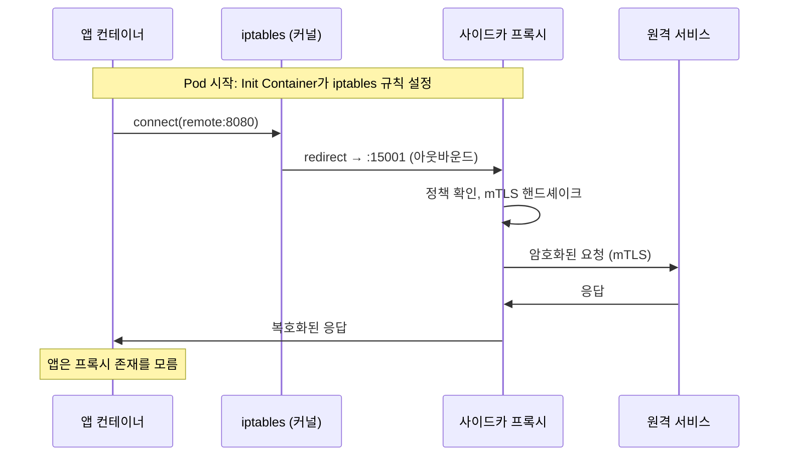
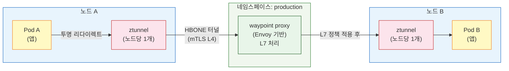
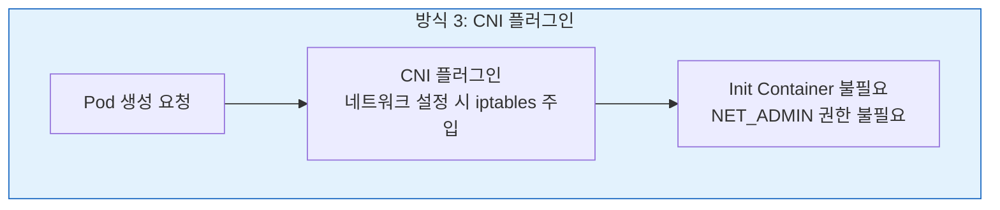

# Ch02. 프록시 아키텍처 비교

> **📌 핵심 요약**
> 서비스 메시의 데이터 플레인은 프록시가 실행한다. 어떤 프록시를 선택하느냐가 메모리 오버헤드, 지연 시간, 확장성을 결정한다. 
>
> - Envoy(C++)는 기능이 풍부하지만 무겁고, linkerd2-proxy(Rust)는 경량이지만 범용성이 낮다. 
> - Istio의 앰비언트 모드는 ztunnel(L4)과 waypoint(L7)로 역할을 분리해 오버헤드를 줄였다. 
> - 쿠버네티스 1.28+의 네이티브 사이드카는 사이드카 수명주기 문제를 해결하는 새로운 접근이다.

---

## 🎯 학습 목표

1. 서비스 프록시가 필요한 이유와 트래픽 인터셉트 원리를 설명할 수 있다
2. Envoy의 xDS API 구조와 WASM 필터 확장성을 설명할 수 있다
3. linkerd2-proxy의 설계 철학과 Envoy 대비 트레이드오프를 비교할 수 있다
4. ztunnel과 waypoint proxy의 역할 분리가 앰비언트 모드에서 갖는 의미를 설명할 수 있다
5. 사이드카 주입 방식(Init Container, K8s 1.28+ 네이티브, CNI 플러그인)의 차이를 설명할 수 있다
6. 프록시별 성능 특성(p50/p99 지연, 메모리)을 수치 기반으로 비교할 수 있다


## 1. 서비스 프록시란 무엇인가

> **프록시는 두 엔드포인트 사이에서 트래픽을 중계하는 소프트웨어다.** 
>
> - 서비스 메시 맥락에서 프록시는 단순한 중계를 넘어 관찰자이자 집행자 역할을 한다. 
> - 모든 요청이 프록시를 통과하므로, 프록시는 "무슨 요청이 왔는가", "얼마나 걸렸는가", "성공했는가"를 측정하고, "이 요청이 허용된 것인가", "어느 인스턴스로 보낼 것인가"를 결정한다.

비유로 이해하면 — 대형 건물의 로비 안내 데스크와 비슷하다. 

- 건물 입주자(서비스)들은 외부 방문객(요청)을 직접 만나지 않는다. 모든 방문객은 안내 데스크(프록시)를 거친다. 
- 안내 데스크는 방문 기록을 남기고(관측성), 신분을 확인하고(인증), 방문 가능 층을 제한하며(접근 제어), 엘리베이터 배정을 최적화한다(로드 밸런싱). 입주자는 이 과정을 신경 쓸 필요가 없다.

### 트래픽 인터셉트의 원리

서비스 메시에서 프록시가 모든 트래픽을 가로채는 방법은 애플리케이션을 수정하지 않는다. **대신 네트워크 계층에서 가로챈다.**

- 사이드카 패턴에서는 Init Container가 Pod 시작 시 **iptables 규칙을 설정**한다. 이 규칙은 Pod 네트워크 네임스페이스 내에서 "모든 인바운드 TCP 트래픽은 포트 15006으로, 모든 아웃바운드 TCP 트래픽은 포트 15001로 리다이렉트하라"고 지시한다. 
- 이후 애플리케이션이 `localhost:8080`으로 요청을 보내면, 커널 네트워킹 스택이 이 요청을 프록시의 15001 포트로 투명하게 전달한다. 애플리케이션 코드는 아무것도 바꾸지 않아도 된다.




## 2. Envoy — 범용 고성능 프록시

>  **Envoy는 Lyft가 2016년 오픈소스로 공개한 C++ 기반 L7 프록시다.** 
>
> - "단일 관찰 가능한 메시 내의 모든 서비스를 위한 보편적인 데이터 플레인"을 목표로 설계됐다. 
> - 현재 CNCF Graduated 프로젝트이며, Istio의 기본 데이터 플레인이자 AWS App Mesh, Google Cloud Traffic Director 등 다수의 서비스 메시가 채택했다.

Envoy의 핵심 설계 원칙은 세 가지다. 

1. 모든 기능은 API를 통해 동적으로 구성된다 — 재시작 없이 라우팅 규칙을 변경할 수 있다. 
2. 관측성이 내장 기능이다 — 모든 서브시스템에서 메트릭을 내보낸다. 
3. 확장 가능하다 — WASM 필터로 사용자 정의 로직을 삽입할 수 있다.

### xDS API — 동적 설정의 핵심

xDS(eXtensible Discovery Service)는 Envoy가 컨트롤 플레인과 통신하는 gRPC 기반 API 집합이다. 이 API가 있어서 Envoy는 재시작 없이 설정을 실시간으로 업데이트할 수 있다.

- **LDS (Listener Discovery Service)**: 어느 포트에서 트래픽을 받을지
- **RDS (Route Discovery Service)**: 받은 트래픽을 어느 클러스터로 라우팅할지
- **CDS (Cluster Discovery Service)**: 업스트림 서비스 목록과 로드 밸런싱 설정
- **EDS (Endpoint Discovery Service)**: 각 클러스터의 실제 IP:포트 목록
- **SDS (Secret Discovery Service)**: TLS 인증서와 키

컨트롤 플레인(Istio의 Pilot, 이전 이름 istiod)은 쿠버네티스 API 서버에서 서비스/엔드포인트 변경을 감지하면, 영향받는 Envoy 인스턴스에 xDS를 통해 새 설정을 푸시한다. 새 Pod가 배포되어 엔드포인트가 추가되는 순간, 수십 초 안에 클러스터 전체 Envoy가 이를 인식한다.

### WASM 필터 확장성

Envoy의 강력한 기능 중 하나는 WebAssembly(WASM) 기반 필터 확장이다. 사용자가 Go, Rust, C++ 등으로 커스텀 로직을 작성하고 WASM으로 컴파일해 Envoy에 로드할 수 있다. 이는 "Envoy를 재컴파일하거나 업그레이드하지 않고 기능을 추가한다"는 의미다.

실제 사용 사례로는 커스텀 인증 로직(내부 JWT 검증 서비스 호출), 특정 헤더 변환, API 사용량 과금 로직 삽입 등이 있다. Solo.io의 Gloo Platform은 이 WASM 확장성을 활용한 상용 제품이다.

### Envoy의 리소스 오버헤드

Envoy의 주요 약점은 리소스 소비다. 초기화 후 최소 메모리 사용량은 약 50MB이며, 트래픽이 많은 서비스에서는 100MB 이상 사용하는 경우도 흔하다. CPU 오버헤드는 상대적으로 낮지만(일반적으로 서비스 CPU의 5-10%), 1,000개 Pod 클러스터에서 사이드카만으로 50-100GB 메모리가 필요하다는 계산이 나온다.

Envoy는 범용 프록시이기 때문에 서비스 메시에 필요하지 않은 기능(Redis 프록시, MongoDB 프록시 등)도 포함한다. 이 "필요하지 않은 기능들"이 바이너리 크기와 메모리 기저 사용량을 높이는 원인 중 하나다.


## 3. linkerd2-proxy — 목적 지향 경량 프록시

> Linkerd의 창업자 William Morgan은 "Envoy는 범용 프록시다. Linkerd는 서비스 메시만을 위한 프록시가 필요했다"고 설명했다. 
>
> 이 철학에서 linkerd2-proxy가 탄생했다.

linkerd2-proxy는 Rust로 작성됐다. 이는 우연이 아니다. Rust는 GC(Garbage Collection)가 없어 예측 가능한 지연 시간을 제공하고, 메모리 안전성을 컴파일 타임에 보장한다. C++로 작성된 Envoy가 메모리 관련 버그에 취약할 수 있는 영역을 Rust의 소유권 시스템이 원천 차단한다.

### 경량성과 성능

linkerd2-proxy의 메모리 사용량은 약 10MB로, Envoy의 1/5 수준이다. 같은 1,000개 Pod 클러스터에서 약 10GB 메모리가 필요하다는 계산이 나온다 — Envoy 대비 80% 절감이다.

지연 시간 오버헤드도 낮다. Linkerd의 공식 벤치마크에 따르면, linkerd2-proxy는 Envoy 대비 p99 지연 시간이 30-50% 낮은 결과를 보인다. 이는 단순한 아키텍처(서비스 메시 기능만 구현)와 Rust의 async I/O(Tokio 기반) 덕분이다.

### 범용성의 제한

linkerd2-proxy는 의도적으로 범용 기능을 배제한다. WASM 필터 지원이 없고, Redis/MongoDB 같은 비HTTP 프로토콜 프록시 기능도 없으며, xDS API도 지원하지 않는다(Linkerd는 자체 컨트롤 플레인 프로토콜을 사용한다). 이는 단점이기도 하지만, Linkerd의 관점에서는 "서비스 메시에 필요하지 않은 기능을 배제해 단순성을 달성하는" 의도된 선택이다.

커스텀 확장이 필요하거나 Envoy 생태계(Envoy 기반 API Gateway 등)와의 통합이 중요한 경우, linkerd2-proxy의 제한이 실질적인 장애물이 된다.


## 4. ztunnel — 앰비언트 모드의 L4 레이어

### ztunnel의 등장 배경

Istio 앰비언트 모드는 "사이드카 없이 서비스 메시를"이라는 목표에서 시작했다. 그 핵심 컴포넌트가 ztunnel이다. "ztunnel"의 z는 zero-trust에서 왔다 — L4 수준의 zero-trust 터널링을 담당한다.

ztunnel은 노드당 하나씩 DaemonSet으로 실행된다. Rust로 작성됐으며, 해당 노드의 모든 워크로드 트래픽을 처리한다. 사이드카 모델에서는 Pod 1,000개마다 1,000개의 프록시가 필요했다면, ztunnel은 노드 50개 클러스터에서 50개만 실행된다.

### ztunnel의 기능 범위

ztunnel은 의도적으로 L4만 처리한다. 그 이유는 L4 처리가 상태를 거의 유지하지 않아 노드 전체 워크로드를 대신 처리해도 격리 문제가 적기 때문이다. ztunnel이 처리하는 것들:

- **mTLS 암호화**: SPIFFE 워크로드 아이덴티티 기반으로 서비스 간 암호화
- **L4 접근 제어**: "서비스 A는 서비스 B의 포트 8080에 접근 가능"
- **기본 텔레메트리**: TCP 연결 수, 바이트 전송량

ztunnel이 처리하지 않는 것들: HTTP 헤더 검사, JWT 검증, HTTP 레벨 트래픽 분할, gRPC 라우팅. 이런 L7 기능은 waypoint proxy의 영역이다.


## 5. waypoint proxy — 앰비언트 모드의 L7 레이어

>  waypoint proxy는 앰비언트 모드에서 L7 기능이 필요한 곳에만 배포한다. 
>
> - 기본적으로 클러스터에 배포되지 않는다. 운영자가 특정 네임스페이스나 서비스에 대해 명시적으로 waypoint를 생성해야 한다.

```bash
# 네임스페이스에 waypoint 배포
istioctl waypoint apply --namespace production

# 특정 서비스에만 waypoint 배포
istioctl waypoint apply --name payment-waypoint --for service
```

- 이 선택적 배포가 핵심 가치다. "결제 서비스는 L7 헤더 기반 라우팅과 JWT 검증이 필요하지만, 단순한 내부 캐시 서비스는 L4 mTLS만으로 충분하다"는 판단을 인프라 레벨에서 표현할 수 있다. 필요한 곳에만 오버헤드를 지불한다.

### waypoint proxy의 구현

waypoint proxy는 Envoy 기반이다. 사이드카 Envoy와 달리 네임스페이스/서비스 단위로 배포되어 해당 범위의 모든 트래픽을 처리한다. ztunnel이 L4 터널로 트래픽을 waypoint로 전달하고, waypoint가 L7 처리 후 목적지로 전달하는 구조다.



- HBONE(HTTP-Based Overlay Network Encapsulation)은 앰비언트 모드에서 ztunnel 간 터널링에 사용하는 프로토콜이다. HTTP/2 CONNECT 메서드를 사용해 mTLS 터널을 설정한다.


## 6. 사이드카 주입 방식 비교

### 방식 1: Init Container + iptables (전통적 방식)


가장 오래되고 널리 사용되는 방식이다. 쿠버네티스 MutatingWebhook이 Pod 생성 시 Init Container를 자동으로 주입한다. Init Container(`istio-init` 또는 `linkerd-init`)가 iptables 규칙을 설정하고 종료된다. 이후 앱 컨테이너와 프록시 컨테이너가 병렬로 시작된다.

주요 문제점은 수명주기다. Pod 종료 시 쿠버네티스는 컨테이너 종료 순서를 보장하지 않는다. 프록시가 먼저 종료되면 앱 컨테이너가 아직 실행 중인데 네트워크가 끊기는 상황이 발생한다. Job이나 CronJob처럼 완료 후 종료하는 워크로드에서 이 문제가 특히 두드러진다 — 프록시가 살아있어서 Pod가 Completed 상태로 전환되지 않는 케이스도 있었다.

### 방식 2: K8s 1.28+ 네이티브 사이드카


쿠버네티스 1.28(2023년 8월)부터 사이드카 컨테이너를 네이티브로 지원한다. `initContainers`에 `restartPolicy: Always`를 설정하면 해당 Init Container가 사이드카로 동작한다.

```yaml
initContainers:
- name: linkerd-proxy
  image: cr.l5d.io/linkerd/proxy:stable-2.14.0
  restartPolicy: Always  # 이것이 네이티브 사이드카로 만드는 키
```

- 네이티브 사이드카의 핵심 이점은 수명주기 보장이다. 쿠버네티스가 사이드카를 앱 컨테이너보다 먼저 시작하고, 앱 컨테이너 종료 후에 사이드카를 종료한다. 
- Job 워크로드에서 앱이 완료되면 사이드카도 함께 종료된다. 전통적 방식의 핵심 문제가 해결된다.

### 방식 3: CNI 플러그인 주입



- Istio CNI 플러그인 방식은 Init Container를 완전히 제거한다. 대신 CNI(Container Network Interface) 플러그인이 Pod 네트워크 설정 시 iptables 규칙을 주입한다. 
- Init Container 방식은 Pod가 `NET_ADMIN` capability를 요구하지만, CNI 플러그인 방식은 이 권한이 필요 없다.

보안에 민감한 환경에서 컨테이너에 `NET_ADMIN` 권한 부여를 거부하는 정책이 있을 때, CNI 플러그인 방식이 해결책이 된다.


## 7. 성능 비교

### 지연 시간 오버헤드

서비스 메시 프록시는 요청 경로에 두 개의 프록시 홉을 추가한다(발신자 측 사이드카 + 수신자 측 사이드카). 이 추가 홉이 지연 시간에 미치는 영향은 프록시 구현에 따라 다르다.

Kinvolk(현 Microsoft)의 벤치마크와 Linkerd의 공개 벤치마크를 종합하면 다음과 같은 경향이 있다. 단, 벤치마크 결과는 워크로드 특성, 클러스터 크기, 설정에 따라 크게 달라지므로 참고 수치로만 활용해야 한다.

| 프록시 | p50 추가 지연 | p99 추가 지연 | 메모리/인스턴스 |
|--------|--------------|--------------|----------------|
| Envoy (Istio 사이드카) | ~1ms | ~5-10ms | ~50-100MB |
| linkerd2-proxy | ~0.5ms | ~2-5ms | ~10-20MB |
| ztunnel (앰비언트 L4) | ~0.3ms | ~1-2ms | ~5MB/노드 |
| 메시 없음 (베이스라인) | — | — | 0 |

- p99 지연 시간이 중요한 실시간 서비스(금융 트랜잭션, 게임 서버)에서는 프록시 선택이 실질적 차이를 만든다. p50(중앙값)만 보면 차이가 작아 보이지만, p99 꼬리 지연(tail latency)은 사용자 경험에 직접 영향을 미친다.

### 메모리 오버헤드 계산

운영 비용 관점에서 메모리 오버헤드를 직접 계산해보면 의사결정에 도움이 된다.

100개 노드, 노드당 평균 20개 Pod = 2,000개 Pod 클러스터:

- **Envoy 사이드카**: 2,000 × 50MB = 100GB (프록시만)
- **linkerd2-proxy**: 2,000 × 10MB = 20GB (프록시만)
- **ztunnel**: 100 × 5MB = 0.5GB (노드당 하나)

AWS에서 메모리 1GB 비용을 월 약 $5로 계산하면(t3 계열 기준), Envoy와 linkerd2-proxy의 메모리 차이(80GB)는 월 약 $400의 비용 차이를 만든다. 대규모 클러스터에서는 이 차이가 크게 벌어진다.


## 8. 프록시 선택 가이드

> 어떤 프록시를 선택할지는 결국 "어떤 서비스 메시를 선택하는가"와 연결된다. 각 메시는 프록시를 직접 지정하기 때문이다.

**Envoy가 적합한 경우**: 세밀한 트래픽 제어(헤더 기반 라우팅, 가중치 분할), WASM 필터를 통한 커스텀 확장, Envoy 기반 API Gateway와의 통합(Istio + Envoy Gateway), 풍부한 생태계 활용이 우선순위일 때.

**linkerd2-proxy가 적합한 경우**: 메모리/비용 최적화가 중요하고, 서비스 메시 기능이 상대적으로 단순하며, 운영 단순성을 최우선으로 삼을 때. Linkerd의 철학이 "메시가 눈에 보이지 않아야 한다"인 만큼, 메시 운영에 최소한의 노력을 쓰고 싶을 때 유리하다.

**ztunnel + waypoint가 적합한 경우**: 기존 Istio 사용자가 사이드카 오버헤드를 줄이고 싶거나, 점진적으로 L7 기능을 추가하고 싶을 때. 앰비언트 모드는 2024년 Istio 1.22에서 안정화됐으므로, 2026년 기준으로는 프로덕션 고려 대상이다.


## 9. Envoy 내부 구조 심화

### 필터 체인 아키텍처

Envoy의 강력함은 필터 체인(filter chain)에서 나온다. 각 리스너(Listener)는 순서가 있는 필터 목록을 가진다. 요청이 들어오면 필터 체인을 순서대로 통과하며, 각 필터가 요청을 검사하거나 수정하거나 차단할 수 있다.

네트워크 필터(L3/L4 수준)는 TCP 연결 자체를 처리한다. `tcp_proxy`는 단순 TCP 프록시를, `http_connection_manager(HCM)`는 HTTP 파싱을 담당한다. HTTP 연결 관리자(HCM) 내부에는 또 HTTP 필터 체인이 있다. 라우터 필터(`router`)는 항상 마지막에 위치하며 실제 업스트림으로 요청을 전달한다.

```
Listener :15001
└─ FilterChain
   ├─ HttpConnectionManager (네트워크 필터)
   │  ├─ jwt_authn       (JWT 검증)
   │  ├─ ext_authz       (외부 인가 서비스 호출)
   │  ├─ lua             (Lua 스크립트)
   │  ├─ wasm            (WASM 필터)
   │  └─ router          (업스트림 라우팅, 항상 마지막)
   └─ TLS Inspector
```

이 필터 체인 구조 덕분에 Envoy는 코드 변경 없이 새 기능을 삽입할 수 있다. Istio가 JWT 인증을 추가할 때 애플리케이션 코드를 건드리지 않고 `jwt_authn` 필터를 체인에 추가하는 것으로 충분하다.

### 클러스터와 엔드포인트 관리

Envoy에서 "클러스터(Cluster)"는 업스트림 서비스를 나타낸다. 쿠버네티스 Service와 대응된다고 이해하면 쉽다. 각 클러스터는 여러 엔드포인트(실제 Pod IP:포트)를 가지며, 로드 밸런싱 알고리즘으로 요청을 분산한다.

Envoy가 지원하는 로드 밸런싱 알고리즘은 단순 라운드로빈을 훨씬 넘어선다. 

- **최소 요청(Least Request)** 알고리즘은 현재 처리 중인 요청이 가장 적은 엔드포인트로 보낸다. 느린 인스턴스에 요청이 쌓이는 것을 방지해 지연 시간 편차를 줄인다. 
- **링 해시(Ring Hash)**는 특정 클라이언트가 항상 같은 업스트림 인스턴스로 가도록 한다. 캐시를 활용하는 서비스에서 캐시 히트율을 높이는 데 유용하다.

### Envoy 관리 인터페이스

Envoy는 관리 포트(기본 9901)를 통해 런타임 상태를 확인할 수 있다. 이는 프로덕션 디버깅에 유용하다.

```bash
# 현재 적용된 클러스터 목록
curl localhost:9901/clusters

# 현재 리스너 설정
curl localhost:9901/listeners

# 통계 메트릭 (Prometheus 형식)
curl localhost:9901/stats/prometheus

# 설정 덤프 (xDS로 받은 전체 설정)
curl localhost:9901/config_dump
```

실제 운영에서 "왜 이 요청이 특정 서비스로 라우팅되지 않는가"를 조사할 때 `/config_dump`로 Envoy가 실제로 어떤 라우팅 규칙을 가지고 있는지 확인하는 것이 첫 번째 디버깅 단계다.


## 10. 프록시 성능 최적화 패턴

### 연결 풀링 (Connection Pooling)

매 요청마다 새 TCP 연결을 생성하면 3-way handshake 오버헤드가 누적된다. TLS를 사용하면 핸드셰이크 비용이 더 크다. Envoy는 업스트림 서비스에 대한 연결 풀을 유지해 이 오버헤드를 제거한다.

연결 풀 설정은 서비스 특성에 맞게 튜닝해야 한다. 요청량이 많은 서비스에는 풀 크기를 늘리고(`maxConnections`), 장기 연결이 많은 gRPC 서비스에는 최대 요청 수(`maxRequestsPerConnection`)를 높인다.

```yaml
# Istio DestinationRule — 연결 풀 설정
apiVersion: networking.istio.io/v1beta1
kind: DestinationRule
metadata:
  name: payment-service
spec:
  host: payment-service
  trafficPolicy:
    connectionPool:
      tcp:
        maxConnections: 100
        connectTimeout: 30ms
      http:
        http2MaxRequests: 1000
        maxRequestsPerConnection: 10
    outlierDetection:
      consecutive5xxErrors: 5
      interval: 30s
      baseEjectionTime: 30s
```

### HTTP/2와 gRPC 처리

Envoy는 HTTP/1.1과 HTTP/2를 모두 지원하며, 업스트림 연결에 HTTP/2를 사용하면 단일 TCP 연결에서 다중 요청을 병렬 처리할 수 있다(multiplexing). Istio의 사이드카 간 통신은 기본적으로 HTTP/2를 사용한다.

gRPC는 HTTP/2 위에서 동작하므로 Envoy가 자연스럽게 gRPC를 프록시할 수 있다. 또한 gRPC-Web(브라우저용)과 gRPC 간 변환(transcoding)도 Envoy 필터로 처리 가능하다.

### 프록시 오버헤드 측정 방법

프록시 오버헤드를 측정하려면 메시 없는 상태와 메시가 있는 상태를 직접 비교해야 한다. `fortio` 도구를 사용한 간단한 벤치마크 방법이다.

```bash
# 메시 없는 직접 통신 (베이스라인)
fortio load -qps 1000 -t 30s http://service-b:8080/api

# 메시를 통한 통신
fortio load -qps 1000 -t 30s http://service-b.production.svc.cluster.local:8080/api
```

p99 지연 시간 차이가 5ms 이하라면 프록시 오버헤드가 허용 가능한 수준이다. 10ms를 넘어간다면 프록시 설정(연결 풀, 로드 밸런싱 알고리즘)이나 리소스 제한(CPU throttling)을 점검해야 한다.


## 11. 실제 운영 시 주의사항

### 헤드-오브-라인 블로킹 (Head-of-Line Blocking)

HTTP/1.1은 단일 연결에서 요청을 순차 처리한다. 느린 요청 하나가 뒤따르는 모든 요청을 블로킹한다(Head-of-Line Blocking). Envoy가 업스트림과 HTTP/1.1로 연결하면 이 문제가 발생할 수 있다. 해결책은 업스트림과의 연결을 HTTP/2로 업그레이드하거나, HTTP/1.1 연결 풀 크기를 충분히 늘리는 것이다.

### iptables 우회 예외 처리

프록시 자신의 트래픽은 iptables 리다이렉트에서 제외해야 한다. 그렇지 않으면 프록시 → iptables → 프록시 무한 루프가 발생한다. Istio와 Linkerd 모두 프록시 프로세스의 UID를 기반으로 예외 규칙을 설정한다. Istio는 UID 1337을 프록시에 부여하고, iptables 규칙에서 UID 1337의 트래픽은 리다이렉트에서 제외한다.

### 프록시 재시작과 트래픽 드레이닝

프록시를 업데이트하거나 재시작할 때, 진행 중인 요청이 끊기지 않도록 드레이닝(draining)이 필요하다. Envoy는 종료 신호(SIGTERM)를 받으면 즉시 종료하지 않고 새 연결 수락을 중지한 채 기존 연결이 완료될 때까지 대기한다. 이 대기 시간은 `--drain-time-s` 옵션으로 설정한다(기본 45초). 쿠버네티스의 `terminationGracePeriodSeconds`가 드레이닝 시간보다 길어야 한다.


## 면접 대비

**Q1. 사이드카 프록시가 애플리케이션 코드 변경 없이 트래픽을 가로채는 원리는?**

Pod 시작 시 Init Container가 iptables 규칙을 설정한다. 이 규칙은 Pod 네트워크 네임스페이스 안에서 모든 인바운드/아웃바운드 TCP 트래픽을 프록시 포트(Istio는 15001/15006)로 리다이렉트한다. 애플리케이션이 `remote:8080`으로 TCP 연결을 시도하면, 커널이 이를 프록시 포트로 투명하게 전달한다. 앱은 프록시 존재를 알지 못한다.

**Q2. Envoy의 xDS API가 왜 중요한가?**

xDS API는 Envoy가 재시작 없이 설정을 동적으로 받는 메커니즘이다. LDS(리스너), RDS(라우팅), CDS(클러스터), EDS(엔드포인트), SDS(인증서)로 구성된 gRPC 스트림을 통해 컨트롤 플레인이 변경 사항을 즉시 푸시한다. 이 덕분에 새 서비스 배포, 인증서 갱신, 트래픽 정책 변경이 트래픽 중단 없이 이루어진다.

**Q3. linkerd2-proxy가 Envoy 대비 메모리가 적은 이유는?**

두 가지 이유가 있다. 첫째, linkerd2-proxy는 서비스 메시 기능만 구현하는 목적 지향 설계로, Envoy가 포함하는 Redis/MongoDB 프록시 등 범용 기능이 없어 바이너리와 기저 메모리가 작다. 둘째, Rust의 소유권 기반 메모리 관리로 GC 힙 오버헤드가 없다. 결과적으로 Envoy 약 50MB 대비 linkerd2-proxy는 약 10MB다.

**Q4. ztunnel과 waypoint proxy의 역할 분리가 왜 효율적인가?**

ztunnel은 L4만 처리해 노드당 하나로 모든 워크로드를 대신할 수 있다. L4 처리는 상태가 거의 없어 여러 서비스를 하나의 프록시가 처리해도 격리 문제가 적다. waypoint는 L7이 필요한 서비스에만 선택적으로 배포해 오버헤드를 지불하는 서비스를 최소화한다. 1,000개 Pod 클러스터에서 모든 Pod에 Envoy 사이드카를 붙이는 대신, 50개 ztunnel과 L7이 필요한 일부 waypoint만 운영하면 된다.

**Q5. K8s 1.28+ 네이티브 사이드카가 기존 Init Container 방식과 다른 점은?**

핵심은 수명주기 보장이다. 기존 방식은 Pod 종료 시 프록시와 앱 컨테이너 종료 순서가 보장되지 않아, 프록시가 먼저 종료되면 앱이 네트워크를 잃는 문제가 있었다. 네이티브 사이드카(`restartPolicy: Always`로 선언된 initContainer)는 쿠버네티스가 앱보다 먼저 시작하고 앱 종료 후에 종료하는 것을 보장한다. Job/CronJob 워크로드에서 앱이 완료되면 사이드카도 함께 종료되어 Pod가 정상적으로 Completed 상태가 된다.

---

## 체크리스트

- [ ] iptables를 이용한 투명 트래픽 인터셉트 원리를 설명할 수 있다
- [ ] Envoy xDS의 5가지 API(LDS, RDS, CDS, EDS, SDS)와 각 역할을 설명할 수 있다
- [ ] WASM 필터가 Envoy에서 어떻게 사용되는지 구체적 예시를 들 수 있다
- [ ] linkerd2-proxy의 메모리 효율이 높은 이유를 설계와 언어 선택 관점에서 설명할 수 있다
- [ ] ztunnel이 L4만 처리하는 이유와 waypoint와의 역할 분리를 설명할 수 있다
- [ ] HBONE 프로토콜이 앰비언트 모드에서 어떤 역할을 하는지 설명할 수 있다
- [ ] 세 가지 사이드카 주입 방식의 차이와 각각의 적합한 상황을 설명할 수 있다
- [ ] 주어진 클러스터 크기(Pod 수, 노드 수)에서 프록시별 메모리 오버헤드를 계산할 수 있다

---

## 참고 자료

- `docs/03_CloudNative/04_Linkerd/Chapter_02_Intro_to_Linkerd.md` — Linkerd 아키텍처 상세
- [Envoy Proxy 공식 문서](https://www.envoyproxy.io/docs) — xDS API, 필터 체인
- [linkerd2-proxy GitHub](https://github.com/linkerd/linkerd2-proxy) — Rust 구현 상세
- [Istio Ambient Mode Design](https://istio.io/latest/docs/ops/ambient/getting-started/) — ztunnel + waypoint
- [Kubernetes Native Sidecar KEP](https://github.com/kubernetes/enhancements/issues/753) — 1.28+ 네이티브 사이드카
- [Linkerd Benchmarks](https://linkerd.io/2021/05/27/linkerd-vs-istio-benchmarks-2021/) — linkerd2-proxy vs Envoy 성능 비교
