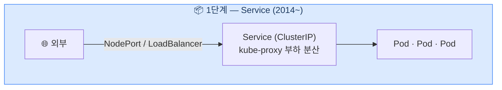
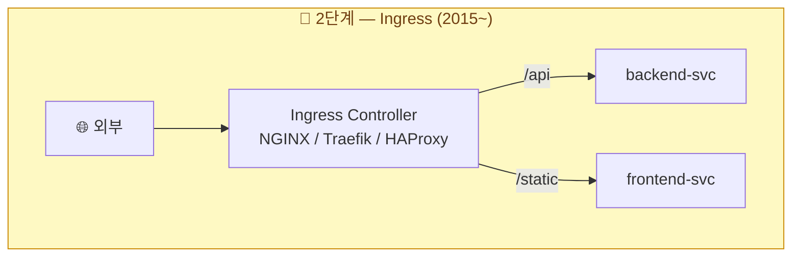
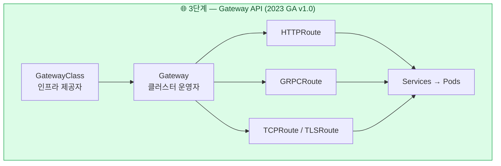
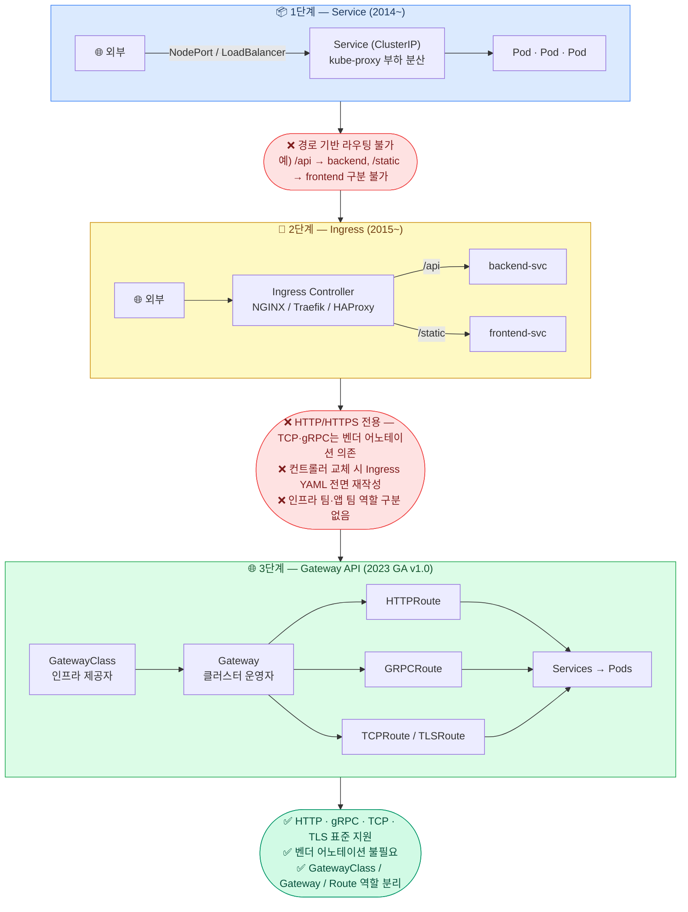
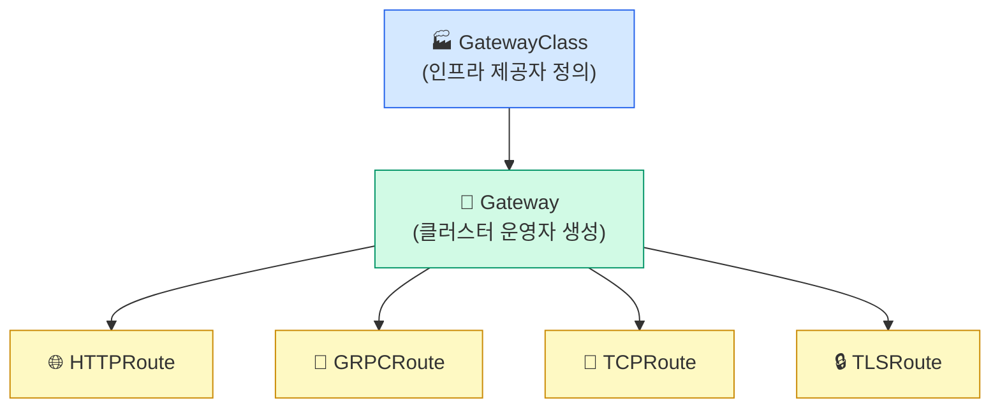
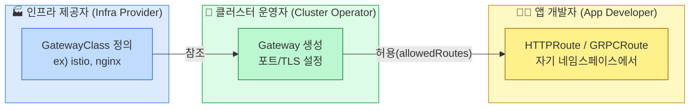
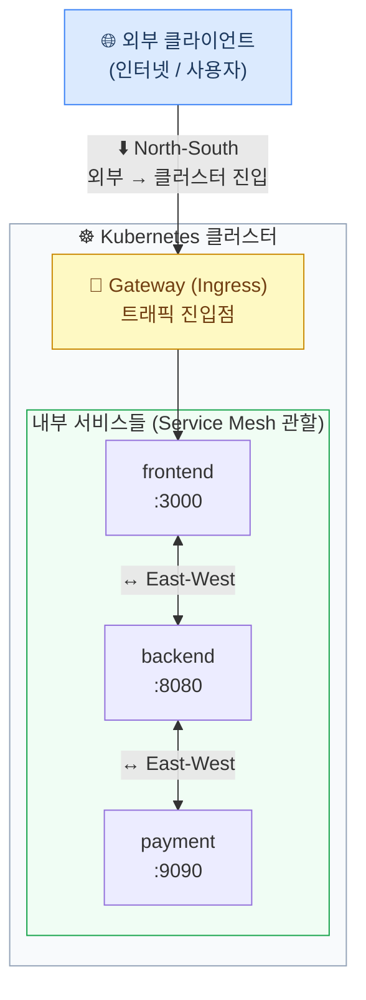
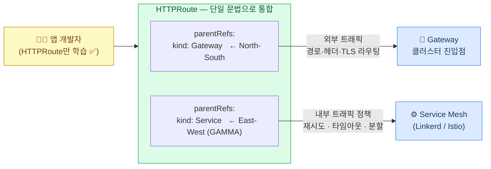
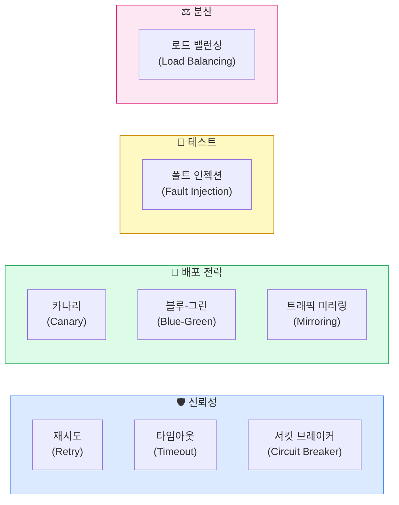

<!-- migrated: write/09_cloud/service-mesh/03-01.Gateway API와 트래픽.md (2026-04-19) -->

# Ch03. Gateway API와 트래픽 관리

> **📌 핵심 요약**
>
> Kubernetes 네트워킹은 Service → Ingress → Gateway API 순으로 진화했다. Gateway API는 역할 분리(인프라 제공자 / 클러스터 운영자 / 앱 개발자)를 설계 철학으로 삼아, 기존 Ingress의 한계(HTTP 전용, 벤더 어노테이션 난립)를 극복한다. 
>
> 2025년 기준 v1.4에서는 GRPCRoute, TCPRoute 등 다양한 프로토콜을 공식 지원하며, GAMMA 이니셔티브를 통해 서비스 메시 내부(east-west) 트래픽 관리까지 영역을 확장하고 있다.

---

## 🎯 학습 목표

1. Kubernetes 네트워킹의 진화 과정(Service → Ingress → Gateway API)을 설명할 수 있다
2. Ingress의 구조적 한계 세 가지를 구체적인 예시와 함께 나열할 수 있다
3. Gateway API의 핵심 리소스(GatewayClass, Gateway, HTTPRoute 등)와 역할 분리 모델을 그림으로 설명할 수 있다
4. GAMMA 이니셔티브가 서비스 메시와 Gateway API를 연결하는 방식을 이해한다
5. Linkerd와 Istio 각각이 Gateway API를 어떻게 활용하는지 비교할 수 있다
6. 트래픽 관리의 핵심 패턴(카나리, 서킷 브레이커, 폴트 인젝션 등)을 목적과 함께 설명할 수 있다
7. Ingress, Gateway API, Istio VirtualService의 표현력 차이를 비교할 수 있다


## 1. Kubernetes 네트워킹의 진화

### 1.1 Service: 기초 단계

Kubernetes에서 네트워킹의 출발점은 `Service`다. 



- Service는 파드 집합에 안정적인 IP(ClusterIP)를 부여하고, `kube-proxy`가 iptables 또는 IPVS 규칙을 통해 부하 분산을 처리한다. 
- 하지만 Service만으로는 클러스터 외부에서 들어오는 HTTP 트래픽을 경로(path) 기반으로 다른 서비스에 라우팅하는 일이 불가능하다. 
- ex) `/api`는 백엔드 서비스로, `/static`은 프론트엔드 서비스로 보내려면 Service 레이어 위에 별도의 무언가가 필요하다.

### 1.2 Ingress: 과도기적 해결책

`Ingress`는 이 문제를 해결하기 위해 Kubernetes 1.1(2015년)에 도입됐다. 



- NGINX, Traefik, HAProxy 등 다양한 컨트롤러가 Ingress 스펙을 구현한다. 
- 규칙을 YAML로 선언하면 컨트롤러가 이를 읽어 실제 L7 라우팅 설정으로 변환한다.

하지만 Ingress는 설계상의 한계를 안고 태어났다. 

1. , **HTTP와 HTTPS만 지원**한다. TCP나 UDP, gRPC 트래픽을 처리하려면 컨트롤러 벤더마다 다른 어노테이션을 붙여야 한다. 
2. **어노테이션 지옥**이 발생한다. `nginx.ingress.kubernetes.io/rewrite-target`, `traefik.ingress.kubernetes.io/router.middlewares` 처럼 벤더마다 다른 어노테이션을 사용하기 때문에, NGINX 컨트롤러에서 Traefik으로 교체하면 Ingress YAML을 전부 다시 써야 한다. 
3. **역할 분리가 없다**. 누가 어떤 설정을 담당하는지 스펙상 구분이 없어, 앱 개발자가 TLS 인증서 설정을 직접 Ingress에 쓰거나 인프라 운영자의 설정과 충돌하는 일이 잦다.

### 1.3 Gateway API: 표준의 재정립

Gateway API는 2019년 SIG-Network에서 시작된 프로젝트로, Ingress의 구조적 한계를 처음부터 다시 설계한 결과물이다. 



- 2023년 v1.0에서 GA(Generally Available)를 선언했고, 2025년 v1.4에서는 gRPC, TCP, TLS 라우팅을 표준에 포함시켰다.

핵심 설계 철학은 두 가지다. 

1. **표현력(expressiveness)**: 벤더 어노테이션 없이도 고급 라우팅 기능을 스펙 내에서 표현할 수 있어야 한다. 
2. **역할 분리(role-orientation)**: 인프라 제공자, 클러스터 운영자, 앱 개발자가 각자 담당하는 리소스를 명확히 구분한다.

### 1.4 진화 흐름 요약




## 2. Gateway API 핵심 리소스 모델

### 2.1 리소스 계층 구조

Gateway API는 세 계층의 리소스로 구성된다.



**GatewayClass**는 로드 밸런서 구현체를 정의한다. AWS Load Balancer Controller, Istio, Envoy Gateway 등이 각자의 GatewayClass를 제공한다. 클러스터에서 "어떤 종류의 게이트웨이를 쓸 수 있는지"를 선언하는 카탈로그 역할이다.

**Gateway**는 특정 GatewayClass를 참조해 실제 게이트웨이 인스턴스를 생성한다. 어떤 포트에서, 어떤 프로토콜로, 어떤 TLS 인증서를 사용할지를 여기서 결정한다. 클러스터 운영자가 관리한다.

**Route 리소스들**(HTTPRoute, GRPCRoute, TCPRoute, TLSRoute)은 트래픽이 실제로 어느 백엔드로 흘러가야 하는지를 기술한다. 앱 개발자가 자신의 네임스페이스에서 직접 관리할 수 있다.

### 2.2 역할 분리 모델

Gateway API의 가장 중요한 설계 원칙은 **세 가지 페르소나(persona)** 의 역할을 명확히 분리한다는 점이다.



- 비유하자면, GatewayClass는 "택시 회사의 차종 카탈로그", Gateway는 "배차된 특정 차량", HTTPRoute는 "승객이 기사에게 건네는 목적지 메모"와 같다. 차종 선택은 회사가, 배차는 운전 팀장이, 목적지 입력은 승객이 각각 담당한다.

- 이 분리는 실용적인 이점을 가져온다. 앱 팀이 Route를 수정해도 인프라 팀의 Gateway 설정에 영향을 주지 않는다. 반대로 인프라 팀이 로드 밸런서를 교체해도 앱 팀의 HTTPRoute는 그대로 유효하다.

### 2.3 GatewayClass

`GatewayClass`는 공통된 설정과 동작을 가진 Gateway들의 종류를 정의하는 클러스터 범위 리소스입니다

```yaml
apiVersion: gateway.networking.k8s.io/v1
kind: GatewayClass
metadata:
  name: istio 
spec:
  controllerName: istio.io/gateway-controller
```

- isitio 이름의 Gateway 종류를 만들며, 이 종류는 isitio.io/gateway-conroller가 처리한다.

### 2.4 Gateway

Gateway는 어떤 포트를 열지, 어떤 리스너를 둘지, 어떤 Route를 붙일 수 있는지를 정합니다. 

공식 문서는 Gateway를 “트래픽이 클러스터 안의 Service로 번역되는 지점”으로 설명하고, `allowedRoutes`는 어떤 종류의 Route와 어떤 네임스페이스의 Route를 붙일 수 있는지 제한하는 필드라고 설명합니다.

```yaml
apiVersion: gateway.networking.k8s.io/v1
kind: Gateway
metadata:
  name: shared-gateway    # 이름 설정 
  namespace: infra        # infra 네임스페이스 생성
spec:
  gatewayClassName: istio # GatewayClass를 사용하는 실제 Gateway 생성
  listeners:
    - name: http
      protocol: HTTP
      port: 80
      allowedRoutes:
        namespaces:
          from: Same
```

- 80 포트의 HTTP 리스너를 연다
- `allowedRoutes.namespaces.from: Same` 이므로  **이 Gateway와 같은 네임스페이스에 있는 Route만 붙을 수 있다**

### 2.5 HTTPRoute

HTTPRoute는 한마디로,**“HTTP 요청이 들어왔을 때, 어떤 조건이면 어디로 보낼지 적는 규칙서”**입니다.

즉, Gateway나 Service가 “문”이나 “창구”라면, HTTPRoute는 그 문 옆에 붙은 **안내판**입니다.

```yaml
apiVersion: gateway.networking.k8s.io/v1
kind: HTTPRoute
metadata:
  name: checkout-route
  namespace: infra
spec:
  parentRefs:
    - name: shared-gateway                 # shared-route에 붙는다.
  rules:
    - matches:
        - path:
            type: PathPrefix
            value: /checkout
      backendRefs:
        - name: checkout-service
          port: 8080
```

- Route는 `app-gateway`에 붙어 있다.
- `/checkout` 경로로 들어온 요청은 `checkout-service:80` 으로 보내라

```yaml
apiVersion: gateway.networking.k8s.io/v1
kind: HTTPRoute
metadata:
  name: payment-route
  namespace: payments
spec:
  parentRefs:
    - name: checkout-route           # shared-route에 붙는다.
      namespace: infra
  rules:
    - matches:
        - path:
            type: PathPrefix
            value: /api/v1/payment
        - headers:
            - name: x-version
              value: beta
      filters:
        - type: RequestHeaderModifier
          requestHeaderModifier:
            add:
              - name: x-routed-by
                value: gateway-api
      backendRefs:
        - name: payment-service
          port: 8080
          weight: 90
        - name: payment-service-v2
          port: 8080
          weight: 10        # 카나리: 신버전 10%
```

- 이 예시는 벤더 어노테이션 없이 순수 스펙만으로 경로 매칭, 헤더 추가, 가중치 기반 트래픽 분할(카나리)을 모두 표현한다. 
- Ingress에서 동일한 기능을 구현하려면 컨트롤러별로 다른 어노테이션을 수십 줄 추가해야 했다.


## 3. GAMMA 이니셔티브: 메시 내부까지 확장

### 3.1 east-west vs north-south 트래픽

Kubernetes 클러스터에서 트래픽은 두 방향으로 흐른다. 

1. **north-south**는 클러스터 외부에서 내부로(또는 내부에서 외부로) 이동하는 트래픽이다. Ingress와 Gateway가 전통적으로 이 영역을 담당한다. 
2. **east-west**는 클러스터 내부에서 서비스 간에 오가는 트래픽이다. 서비스 메시가 이 영역을 책임진다.

문제는 두 영역이 오랫동안 서로 다른 API 체계를 사용했다는 점이다. 

- north-south는 Gateway API, east-west는 메시마다 다른 CRD(Linkerd의 `ServiceProfile`, Istio의 `VirtualService`)를 사용했다. 
- 개발자 입장에서는 두 API를 모두 배워야 했다.




### 3.2 GAMMA의 해답

서비스 메시에서는 “클러스터 입구”인 Gateway보다,  **호출 대상 서비스 자체**가 더 자연스러운 기준점이 됩니다.

 그래서 GAMMA는 mesh에서는 `Gateway`/`GatewayClass` 대신 **Service를 Route의 부착 지점으로 삼는다**고 설명합

```yaml
apiVersion: gateway.networking.k8s.io/v1
kind: Gateway
metadata:
  name: app-gateway
  namespace: default
spec:
  gatewayClassName: example-gateway-class
  listeners:
    - name: http
      protocol: HTTP
      port: 80
      allowedRoutes:
        namespaces:
          from: Same
---
# “이 HTTPRoute는 app-gateway에 붙는다.”
# 외부에서 Gateway로 들어온 요청을 이 Route가 처리하겠다.
apiVersion: gateway.networking.k8s.io/v1
kind: HTTPRoute
metadata:
  name: checkout-north-south
  namespace: default
spec:
  parentRefs:
    - group: gateway.networking.k8s.io
      kind: Gateway
      name: app-gateway
  hostnames:
    - checkout.example.com
  rules:
    - matches:
        - path:
            type: PathPrefix
            value: /checkout
      backendRefs:
        - name: checkout-service
          port: 8080
---
# “이 HTTPRoute는 Gateway가 아니라 checkout-service 자체에 붙는다.”
# 이제 기준점이 “입구(Gateway)”가 아니라 “목적지 서비스(checkout-service)”가 됩니다.
apiVersion: gateway.networking.k8s.io/v1
kind: HTTPRoute
metadata:
  name: checkout-east-west
  namespace: default
spec:
  parentRefs:
    - group: ""
      kind: Service           # 서비스
      name: checkout-service
      port: 8080
  rules:
    - matches:
        - path:
            type: PathPrefix
            value: /
      backendRefs:
        - name: checkout-service
          port: 8080
```

- 이렇게 하면 메시 내부에서 `checkout-service`를 호출하는 모든 트래픽에 재시도 정책이 적용된다. 
- 앱 개발자는 어디서 오는 트래픽이든 동일한 HTTPRoute 문법으로 정책을 표현할 수 있다.

***\*****GAMMA 적용 후*****\*** — `parentRefs`의 `kind` 하나만 바꿔 north-south와 east-west를 동일한 HTTPRoute 문법으로 제어한다.




## 4. Linkerd와 Istio의 Gateway API 활용

### 4.1 Linkerd의 접근법

Linkerd는 Gateway API를 메시 정책의 **기본 인터페이스**로 채택했다. 기존의 `ServiceProfile` CRD를 레거시로 유지하면서, 신규 기능은 모두 HTTPRoute 기반으로 구현한다.

Linkerd에서 HTTPRoute로 할 수 있는 것들:

- **트래픽 분할(traffic splitting)**: `backendRefs`의 `weight` 필드로 카나리 배포 구현
- **재시도(retries)**: `retry` 필터로 특정 상태 코드에 대한 재시도 조건 정의
- **타임아웃(timeouts)**: `timeouts.request`로 요청 전체 타임아웃 설정

```yaml
# Linkerd: HTTPRoute로 카나리 + 재시도
apiVersion: gateway.networking.k8s.io/v1
kind: HTTPRoute
metadata:
  name: orders-v2-canary
  namespace: shop
spec:
  parentRefs:
    - kind: Service
      name: orders
      port: 8080
  rules:
    - backendRefs:
        - name: orders-v1
          port: 8080
          weight: 80
        - name: orders-v2
          port: 8080
          weight: 20
```

### 4.2 Istio의 전환 과정

Istio는 자체 CRD(VirtualService, DestinationRule)를 수년간 사용해왔다. Gateway API가 GA를 선언한 이후 Istio는 점진적으로 Gateway API를 지원하기 시작했고, 2025년 현재는 Gateway API를 **권장(preferred)** 인터페이스로 안내하고 있다.

Istio의 VirtualService와 Gateway API HTTPRoute의 기능 대응:

| Istio VirtualService | Gateway API HTTPRoute |
|---|---|
| `http.route.destination.weight` | `backendRefs[].weight` |
| `http.retries` | `rules[].retry` |
| `http.timeout` | `rules[].timeouts` |
| `http.fault.delay` | HTTPRoute 필터(구현체 의존) |
| `http.mirror` | `filters[].type: RequestMirror` |

- VirtualService는 Istio 전용이지만 HTTPRoute는 다른 메시나 인그레스 컨트롤러에서도 동작한다. 
- 이식성(portability)이 필요한 환경이라면 Gateway API로 마이그레이션이 합리적이다.


## 5. 트래픽 관리 핵심 패턴

### 5.1 패턴 개요

서비스 메시가 제공하는 트래픽 관리 패턴은 크게 여섯 가지로 나눌 수 있다.



### 5.2 재시도(Retry)와 타임아웃(Timeout)

**재시도**는 일시적인 오류(5xx, 연결 실패)에 대해 자동으로 요청을 다시 시도하는 기능이다. 단, 재시도가 **멱등성(idempotent)** 이 보장되는 작업에만 안전하게 적용된다. `GET /products/123`은 몇 번 호출해도 같은 결과를 반환하므로 재시도가 안전하다. 반면 `POST /orders`(주문 생성)는 재시도 시 중복 주문이 생길 수 있어 주의가 필요하다.

**타임아웃**은 응답이 오지 않을 때 언제까지 기다릴지를 정의한다. 타임아웃이 없으면 하나의 느린 서비스가 커넥션 풀을 고갈시켜 연쇄 장애(cascading failure)를 유발한다. 타임아웃과 재시도를 함께 쓸 때는 `전체 타임아웃 > (재시도 횟수 × 단건 타임아웃)`이 되도록 설정해야 의도한 대로 동작한다.

### 5.3 서킷 브레이커(Circuit Breaker)

서킷 브레이커는 전기 차단기에서 따온 이름이다. 전선에 과부하가 걸리면 차단기가 열려(open) 전류를 차단하듯, 서비스 호출 실패율이 임계치를 초과하면 해당 서비스로의 요청을 일시적으로 차단한다.

상태는 세 가지다. **Closed**(정상 동작, 요청 허용) → **Open**(차단, 요청 즉시 실패 반환) → **Half-Open**(일부 요청 허용해 복구 여부 탐색) → Closed로 복귀.

```
실패율 > 임계치 → Open 전환 (fast-fail, 연쇄 장애 방지)
일정 시간 후    → Half-Open 전환 (복구 탐색)
성공률 회복 시  → Closed 복귀
```

Istio는 `DestinationRule.trafficPolicy.outlierDetection`으로 이를 구현하고, Linkerd는 현재 서킷 브레이커보다 재시도 + 타임아웃 조합으로 유사 효과를 낸다.

### 5.4 카나리와 블루-그린 배포

**카나리 배포**는 신버전을 소수의 사용자에게만 먼저 노출하는 전략이다. 금광 탄광에서 유독가스를 탐지하기 위해 카나리아 새를 먼저 들여보내던 관행에서 유래했다. 예를 들어 v2 버전을 전체 트래픽의 5%에만 라우팅하고, 에러율이 정상이면 10% → 50% → 100%로 점진적으로 올린다. 문제가 생기면 즉시 `weight: 0`으로 롤백한다.

**블루-그린 배포**는 구버전(blue)과 신버전(green) 환경을 모두 운영하다가 스위치를 전환하듯 한 번에 라우팅을 바꾸는 전략이다. 롤백이 빠르다는 장점이 있지만, 두 버전 환경을 동시에 운영하는 비용이 든다.

### 5.5 폴트 인젝션(Fault Injection)

폴트 인젝션은 **의도적으로** 오류를 발생시켜 시스템의 내결함성을 검증하는 기법이다. 카오스 엔지니어링의 핵심 도구다. 예를 들어 결제 서비스 응답에 3초 지연을 주입했을 때 프론트엔드 타임아웃이 올바르게 동작하는지, 에러 UI가 제대로 표시되는지를 프로덕션 환경과 동일한 조건에서 테스트할 수 있다.

```yaml
# Istio: 30% 확률로 500 에러 주입
fault:
  abort:
    percentage:
      value: 30
    httpStatus: 500
```

### 5.6 트래픽 미러링(Traffic Mirroring)

트래픽 미러링은 실제 트래픽을 복제해 새 버전 서비스에도 동시에 보내는 기법이다. 복제된 트래픽의 응답은 클라이언트에게 반환되지 않고 버려진다. 실제 사용자에게 영향 없이 신버전의 동작을 실프로덕션 데이터로 검증할 수 있다.

예를 들어, 새로 개발한 AI 추천 엔진을 실제 사용자 요청 미러로 검증한 뒤 카나리로 전환하는 순서가 일반적이다.

### 5.7 로드 밸런싱 알고리즘 비교

| 알고리즘 | 동작 방식 | 적합한 경우 |
|---|---|---|
| Round Robin | 순서대로 돌아가며 분배 | 처리 시간이 균일한 서비스 |
| Least Request | 현재 요청 수 가장 적은 파드에 분배 | 처리 시간 편차가 큰 서비스 |
| Random | 무작위 선택 | 상태 없는 단순 서비스 |
| Ring Hash | 키 기반 일관된 해싱 | 세션 친화성(sticky session) 필요 시 |
| MAGLEV | 구글 개발, 연결 유지 강점 | Envoy 기본 일관 해싱 |

Linkerd는 기본적으로 EWMA(Exponentially Weighted Moving Average) 알고리즘으로 최근 지연시간이 낮은 파드를 선호한다. 이를 **Latency-aware load balancing**이라 부른다.


## 6. 세 API의 비교

| 기능 | Ingress | Gateway API HTTPRoute | Istio VirtualService |
|---|---|---|---|
| HTTP 라우팅 | O | O | O |
| gRPC 라우팅 | 어노테이션 의존 | O (GRPCRoute) | O |
| TCP/UDP | 어노테이션 의존 | O (TCPRoute) | O |
| 가중치 기반 분할 | 어노테이션 의존 | O (weight 필드) | O |
| 재시도 | 어노테이션 의존 | O | O |
| 폴트 인젝션 | X | 구현체 의존 | O |
| east-west 트래픽 | X | O (GAMMA) | O |
| 이식성 | 낮음 | 높음 | 낮음 (Istio 전용) |
| 역할 분리 | X | O | X |

결론적으로 Gateway API는 표준화된 API로 높은 이식성을 제공하면서도 Istio VirtualService에 근접한 표현력을 가지도록 설계됐다. 다만 폴트 인젝션처럼 일부 기능은 아직 구현체(implementation)가 지원 여부를 결정한다.


## 면접 대비

**Q1. Ingress와 Gateway API의 가장 큰 차이점은 무엇인가요?**

Ingress는 HTTP/HTTPS만 지원하고, 고급 기능은 벤더별 어노테이션에 의존한다. 이로 인해 컨트롤러를 교체하면 설정을 전면 재작성해야 한다. Gateway API는 TCP, UDP, gRPC까지 스펙에 포함하고, 역할 기반 리소스 분리(GatewayClass/Gateway/Route)로 인프라 팀과 앱 팀의 설정을 독립적으로 관리할 수 있다.

**Q2. Gateway API의 역할 분리 모델에서 세 페르소나가 각각 담당하는 리소스는 무엇인가요?**

인프라 제공자가 `GatewayClass`를 정의해 "어떤 구현체를 쓸 수 있는지" 카탈로그를 제공한다. 클러스터 운영자가 `Gateway`를 생성해 포트, 프로토콜, TLS 설정을 담당한다. 앱 개발자가 자신의 네임스페이스에서 `HTTPRoute` 등을 생성해 트래픽 라우팅 규칙을 정의한다. 이 분리 덕분에 앱 개발자가 Route를 수정해도 Gateway 설정에 영향을 주지 않는다.

**Q3. GAMMA 이니셔티브란 무엇이며, 왜 필요한가요?**

GAMMA는 Gateway API를 서비스 메시 내부(east-west) 트래픽 관리에도 적용하기 위한 이니셔티브다. 기존에는 north-south 트래픽에는 Gateway API, east-west 트래픽에는 메시별 CRD(VirtualService 등)를 써야 했다. GAMMA는 HTTPRoute의 `parentRefs`를 Service로 지정해 메시 내부 트래픽에도 동일한 Route 문법을 적용할 수 있게 한다.

**Q4. 카나리 배포와 블루-그린 배포의 차이점, 그리고 각각 어떤 상황에 적합한지 설명해 주세요.**

카나리는 신버전을 소수 트래픽(예: 5%)에 점진적으로 노출하며 문제를 조기 발견하는 전략이다. 블루-그린은 구버전과 신버전을 모두 유지하다 한 번에 스위칭한다. 카나리는 점진적 검증이 필요하고 장시간 병행 운영 비용을 허용할 때, 블루-그린은 즉시 전환이 필요하거나 롤백 속도가 중요할 때 적합하다.

**Q5. 서킷 브레이커의 세 가지 상태를 설명하고, Open 상태의 목적을 설명해 주세요.**

Closed(정상 동작, 모든 요청 허용), Open(장애 감지 후 요청 즉시 거절), Half-Open(복구 탐색을 위해 일부 요청 허용)의 세 상태가 있다. Open 상태의 목적은 **fast-fail**이다. 이미 장애 중인 서비스에 계속 요청을 보내면 호출자 측의 스레드/커넥션 자원이 고갈되어 연쇄 장애로 이어진다. Open 상태에서 즉시 거절함으로써 장애 전파를 차단하고, 다운스트림 서비스가 복구할 시간을 확보한다.

---

## 체크리스트

- [ ] Gateway API의 세 리소스(GatewayClass, Gateway, HTTPRoute)를 직접 YAML로 작성할 수 있다
- [ ] Ingress에서 Gateway API로 마이그레이션 시 달라지는 부분을 설명할 수 있다
- [ ] GAMMA 이니셔티브의 핵심 개념(parentRefs에 Service 참조)을 이해했다
- [ ] 재시도-타임아웃 설정에서 전체 타임아웃과 단건 타임아웃의 관계를 설명할 수 있다
- [ ] 서킷 브레이커 Open 상태가 왜 시스템 안정성에 도움이 되는지 설명할 수 있다
- [ ] 트래픽 미러링이 폴트 인젝션과 어떻게 다른지 구분할 수 있다
- [ ] Linkerd EWMA 로드 밸런싱의 장점을 설명할 수 있다


## 7. Ingress에서 Gateway API로 마이그레이션 전략

### 7.1 점진적 전환의 원칙

Ingress와 Gateway API는 동시에 클러스터에 공존할 수 있다. 따라서 전체를 한 번에 전환하지 않고, 도메인이나 팀 단위로 나눠서 점진적으로 이동하는 전략이 현실적이다. 두 API는 별도의 컨트롤러가 처리하므로 충돌하지 않는다. 예를 들어 NGINX Ingress Controller가 기존 Ingress를 계속 처리하는 동안, Envoy Gateway나 Istio가 새 Gateway API 리소스를 처리하도록 병행 운영할 수 있다.

### 7.2 마이그레이션 체크리스트

**준비 단계**

1. 현재 사용 중인 Ingress 어노테이션 목록화 — 어떤 기능이 표준 HTTPRoute로 대체 가능한지 파악한다
2. Gateway API CRD 설치: `kubectl apply -f https://github.com/kubernetes-sigs/gateway-api/releases/download/v1.2.0/standard-install.yaml`
3. GatewayClass 선택 — Istio, Envoy Gateway, NGINX Gateway Fabric 중 환경에 맞는 구현체를 결정한다

**전환 단계**

```yaml
# 기존 Ingress
apiVersion: networking.k8s.io/v1
kind: Ingress
metadata:
  name: shop-ingress
  annotations:
    nginx.ingress.kubernetes.io/rewrite-target: /
spec:
  rules:
    - host: shop.example.com
      http:
        paths:
          - path: /api
            pathType: Prefix
            backend:
              service:
                name: api-service
                port:
                  number: 8080
```

```yaml
# 대응하는 Gateway API HTTPRoute
apiVersion: gateway.networking.k8s.io/v1
kind: HTTPRoute
metadata:
  name: shop-route
spec:
  parentRefs:
    - name: prod-gateway
  hostnames:
    - shop.example.com
  rules:
    - matches:
        - path:
            type: PathPrefix
            value: /api
      backendRefs:
        - name: api-service
          port: 8080
```

`rewrite-target` 어노테이션은 HTTPRoute의 `URLRewrite` 필터로 대체된다. 어노테이션 한 줄이 명시적인 필터 블록으로 바뀌지만, 의도가 훨씬 분명해진다는 이점이 있다.

### 7.3 공통 함정

첫째, **TLS 인증서 위치가 바뀐다.** Ingress에서는 `tls.secretName`으로 인증서를 지정했지만, Gateway API에서는 Gateway 리소스의 `listeners[].tls.certificateRefs`로 이동한다. 앱 팀이 아닌 클러스터 운영자가 TLS를 관리하는 구조로 바뀐다.

둘째, **allowedRoutes 설정이 필요하다.** Gateway는 기본적으로 같은 네임스페이스의 Route만 허용한다. 다른 네임스페이스의 HTTPRoute를 연결하려면 `allowedRoutes.namespaces.from: All` 또는 라벨 셀렉터로 명시적으로 허용해야 한다.

셋째, **gRPC는 GRPCRoute를 써야 한다.** HTTPRoute로 gRPC 트래픽을 라우팅하면 Content-Type 매칭이 제대로 동작하지 않을 수 있다. Gateway API v1.1부터 GA된 GRPCRoute를 별도로 생성하는 것이 올바른 방법이다.

---

## 참고 자료

- [Gateway API 공식 문서](https://gateway-api.sigs.k8s.io/)
- [GAMMA Initiative](https://gateway-api.sigs.k8s.io/mesh/)
- [Linkerd HTTPRoute 가이드](https://linkerd.io/2.15/tasks/configuring-timeouts/)
- [Istio Gateway API 마이그레이션 가이드](https://istio.io/latest/docs/tasks/traffic-management/ingress/gateway-api/)
- `../02-observability-and-debugging/LEARN.md` — 메시 관측성 (트래픽 관리 결과 확인)
- `../05-linkerd-deep-dive/LEARN.md` — Linkerd 구현 세부 사항
