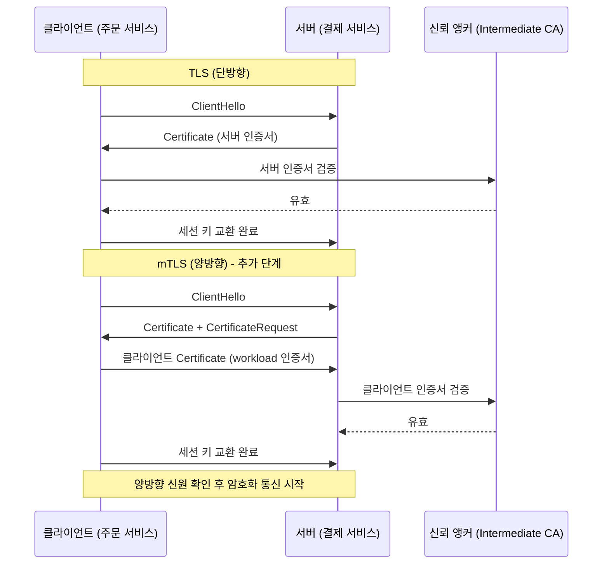
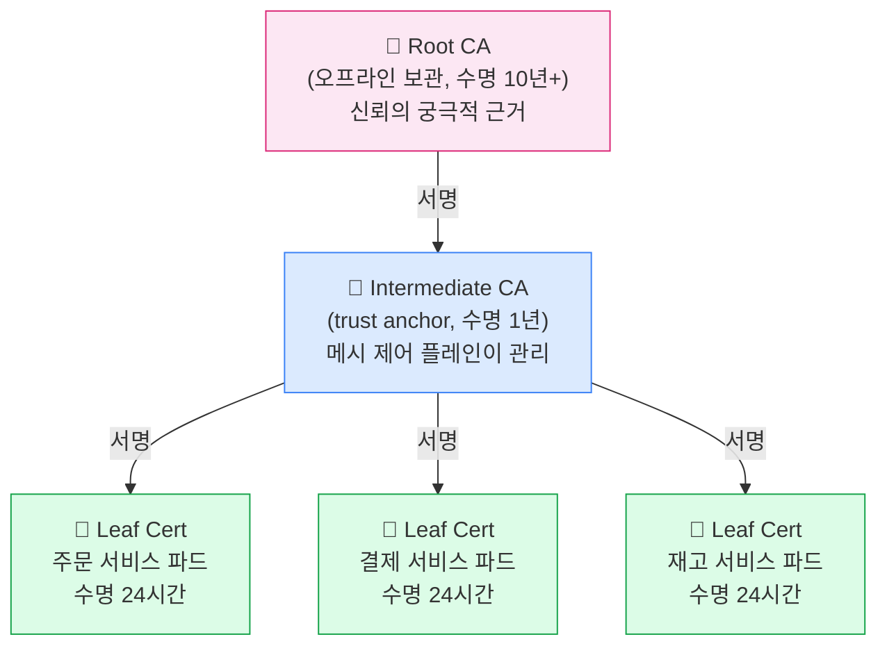
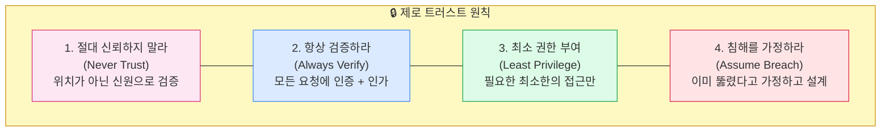
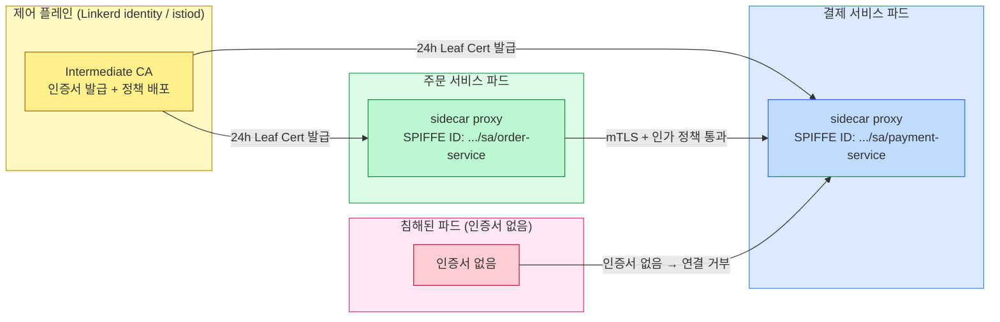

# Ch04. mTLS와 제로 트러스트

> **📌 핵심 요약**
>
> 서비스 메시에서 mTLS(mutual TLS)는 단순한 암호화를 넘어 **워크로드 신원 인증**을 담당한다. IP 주소가 아닌 암호학적으로 검증된 SPIFFE ID를 신원으로 삼아, 클러스터 내부에서도 "절대 신뢰하지 말고, 항상 검증하라"는 제로 트러스트 원칙을 실현한다. 2025년 현재 Linkerd 2.19는 포스트 양자 암호화(ML-KEM-768)를 지원해, 미래의 양자 컴퓨터 위협에도 대비한다.

---

## 🎯 학습 목표

1. TLS와 mTLS의 구조적 차이를 핸드셰이크 과정을 통해 설명할 수 있다
2. 서비스 메시에서 mTLS가 IP 기반 신뢰를 대체해야 하는 이유를 설명할 수 있다
3. 인증서 계층 구조(Root CA → Intermediate CA → Leaf)와 각 계층의 역할을 이해한다
4. 단기 인증서(24시간)와 자동 갱신이 보안에서 왜 중요한지 설명할 수 있다
5. SPIFFE ID 형식과 SPIRE의 역할을 설명할 수 있다
6. 제로 트러스트의 네 가지 원칙을 서비스 메시 맥락에서 구체적으로 설명할 수 있다
7. Linkerd와 Istio의 auto-mTLS 동작 방식을 비교할 수 있다
8. 포스트 양자 암호화가 필요한 이유와 ML-KEM의 기본 개념을 이해한다

---

## 1. TLS vs mTLS: 인증의 방향

### 1.1 TLS: 단방향 인증

TLS(Transport Layer Security)는 인터넷에서 가장 널리 쓰이는 암호화 프로토콜이다. HTTPS가 TLS를 사용하는 대표적 예다. 브라우저로 `https://bank.example.com`에 접속할 때 일어나는 일을 생각해보자. 브라우저는 서버(은행)의 인증서를 검증한다. 반대로 서버는 브라우저(클라이언트)가 누구인지 **확인하지 않는다**. 은행 웹사이트는 누구나 접속할 수 있어야 하므로 이 설계는 합리적이다.

TLS 핸드셰이크를 단순화하면 이렇다:

```
클라이언트 → 서버: "안녕, 암호화 통신하자 (ClientHello)"
서버 → 클라이언트: "내 인증서야 (ServerHello + Certificate)"
클라이언트: [CA 루트로 서버 인증서 검증]
클라이언트 → 서버: "세션 키 교환 완료, 이제 암호화 통신"
```

핵심은 클라이언트가 서버를 인증하지만, **서버는 클라이언트를 인증하지 않는다**는 점이다.

### 1.2 mTLS: 양방향 인증

mTLS(mutual TLS)는 핸드셰이크에 한 단계를 추가한다. 서버도 클라이언트의 인증서를 요구하고 검증한다. 이름에서 "mutual(상호)"이 의미하는 바가 바로 이것이다.



비유하자면 TLS는 음식점 입장 시 직원 배지(서버 신원)만 확인하는 것이고, mTLS는 직원도 배지를 보여주면서 동시에 손님의 사원증도 확인하는 사내 구내식당과 같다. 양쪽 모두 신원을 증명해야만 대화가 시작된다.

### 1.3 왜 서비스 메시에서 mTLS인가

쿠버네티스 클러스터 내부에서 서비스 A가 서비스 B를 호출한다고 하자. 전통적인 네트워크 보안 모델은 "같은 클러스터 안에 있으면 신뢰한다"고 가정한다. 그러나 이 가정은 세 가지 문제를 안고 있다.

첫째, **파드 IP는 신뢰할 수 없는 신원이다.** 파드가 재시작되면 IP가 바뀐다. 공격자가 특정 IP를 가진 파드를 탈취하면 그 IP를 신뢰하는 모든 서비스에 접근할 수 있다. 둘째, **내부망 침해(lateral movement) 가능성이다.** 공격자가 클러스터 내 파드 하나를 장악하면 내부 네트워크 신뢰 모델 하에서 다른 모든 서비스에 자유롭게 접근한다. 셋째, **암호화 부재다.** TLS 없이 통신하면 클러스터 네트워크를 모니터링하는 공격자가 서비스 간 데이터를 평문으로 볼 수 있다.

mTLS는 이 세 문제를 동시에 해결한다. 모든 통신이 암호화되고, 각 서비스는 암호학적 인증서로 신원을 증명하며, IP 주소가 아닌 인증서의 SPIFFE ID가 신원의 기준이 된다.

---

## 2. 인증서 계층 구조

### 2.1 신뢰의 사슬(Chain of Trust)

PKI(Public Key Infrastructure)에서 신뢰는 계층적으로 구성된다. 최상위 기관이 하위 기관을 인증하고, 하위 기관이 최종 개체를 인증하는 방식이다.



**Root CA**는 신뢰의 출발점이다. 이 인증서 자체는 자가 서명(self-signed)되어 있으며, 물리적으로 안전한 장소에 오프라인으로 보관하는 것이 권장된다. Root CA가 침해되면 그 아래 모든 인증서가 신뢰를 잃으므로, 가능한 한 사용 빈도를 줄인다. Linkerd와 Istio에서는 `step` CLI나 Vault로 생성해 HSM(Hardware Security Module)에 보관하는 사례가 일반적이다.

**Intermediate CA**는 Root CA의 서명을 받아 생성된다. 실제 워크로드 인증서에 서명하는 역할을 담당하며, 서비스 메시의 제어 플레인이 이를 관리한다. Linkerd에서는 `identity` 컴포넌트가, Istio에서는 `istiod`가 Intermediate CA 역할을 수행한다. 수명이 길어도 1년 정도로 Root CA보다 짧다.

**Leaf Certificate**는 각 파드(워크로드)에 발급되는 최종 인증서다. SPIFFE ID를 포함하며, 수명은 기본 24시간이다. 단기 수명의 이유는 다음 절에서 설명한다.

### 2.2 단기 인증서와 자동 갱신

"왜 24시간짜리 인증서를 쓰는가?"라는 질문을 자주 받는다. 핵심 이유는 **인증서 폐기(revocation)의 어려움**이다.

인증서가 침해되었을 때 이를 무효화하는 표준 방법으로 CRL(Certificate Revocation List)과 OCSP(Online Certificate Status Protocol)가 있다. 그러나 CRL은 파일 크기가 커지고, OCSP는 실시간 조회 지연이 발생한다. 대규모 마이크로서비스 환경에서 수백 개의 인증서를 실시간으로 폐기 관리하는 것은 운영 부담이 크다.

단기 인증서는 이 문제를 근본적으로 우회한다. 인증서 수명이 24시간이라면, 침해된 인증서는 폐기 처리 없이도 하루 안에 자연 만료된다. 공격자가 인증서를 탈취해도 활용할 수 있는 시간이 극도로 제한된다.

물론 이 전략은 자동 갱신 없이는 동작하지 않는다. 메시 제어 플레인(Linkerd의 `identity` 서비스)이 만료 전 자동으로 새 인증서를 각 파드에 배포한다. 이 과정은 앱 개발자에게 완전히 투명하게(transparent) 이루어진다.

---

## 3. SPIFFE와 SPIRE: 워크로드 신원 표준

### 3.1 IP 주소의 한계

쿠버네티스에서 파드 IP는 파드 생명주기와 함께 바뀐다. 파드가 재스케줄링되거나 오토스케일링으로 추가될 때마다 새로운 IP가 할당된다. IP를 신원의 기준으로 삼으면 방화벽 정책은 항상 뒤처진다. "IP 주소 192.168.1.50을 가진 파드만 결제 서비스에 접근 허용"이라는 규칙은 파드가 재시작되는 순간 의미를 잃는다.

### 3.2 SPIFFE: 워크로드 신원의 표준화

SPIFFE(Secure Production Identity Framework For Everyone)는 CNCF 프로젝트로, 클라우드 네이티브 환경에서 워크로드 신원을 표준화하기 위해 만들어졌다. 핵심은 **SPIFFE ID**라는 URI 형식의 신원 식별자다.

```
spiffe://{trust-domain}/{workload-identifier}

예시:
spiffe://cluster.local/ns/payments/sa/payment-service
spiffe://prod.mycompany.com/ns/orders/sa/order-processor
```

- `trust-domain`: 신뢰 도메인. 같은 trust domain 내의 워크로드는 동일한 Intermediate CA로 발급된 인증서를 공유한다
- `workload-identifier`: 워크로드를 고유하게 식별하는 경로. 쿠버네티스에서는 주로 네임스페이스와 ServiceAccount 조합을 사용한다

SPIFFE ID는 인증서의 SAN(Subject Alternative Name) 필드에 URI로 삽입된다. mTLS 핸드셰이크 시 상대방의 인증서에서 SPIFFE ID를 추출해 "이 워크로드가 신뢰 도메인 내의 올바른 신원을 가지는가"를 검증한다.

### 3.3 SPIRE: SPIFFE의 참조 구현

SPIRE(SPIFFE Runtime Environment)는 SPIFFE 표준을 구현한 프로덕션 수준의 소프트웨어다. SPIRE는 두 컴포넌트로 구성된다.

**SPIRE Server**는 신원 레지스트리 역할이다. "어떤 파드가 어떤 SPIFFE ID를 받을 수 있는가"를 정의하는 등록 항목(registration entries)을 관리하고, Intermediate CA로서 SVID(SPIFFE Verifiable Identity Document)를 발급한다.

**SPIRE Agent**는 각 노드에서 데몬셋으로 실행된다. 파드가 워크로드 API를 통해 자신의 SVID를 요청하면, Agent가 해당 파드의 쿠버네티스 ServiceAccount를 검증하고 SPIRE Server로부터 SVID를 받아 파드에 전달한다.

Linkerd와 Istio는 자체 identity 컴포넌트로 SPIFFE 호환 신원을 발급한다. SPIRE를 별도로 배포하지 않아도 SPIFFE ID가 동작하지만, 멀티클러스터나 멀티클라우드 환경에서 단일 신뢰 앵커가 필요하다면 SPIRE를 공용으로 사용하는 것이 현실적이다.

---

## 4. 제로 트러스트 아키텍처

### 4.1 전통적 경계 보안 모델의 붕괴

전통적인 네트워크 보안은 성벽 모델이다. 방화벽이라는 성벽 안으로 들어오면 신뢰하고, 밖에서 오는 것은 차단한다. 이 모델은 세 가지 가정 위에 세워진다. 첫째, 내부 네트워크는 안전하다. 둘째, 사용자는 회사 사무실에서 일한다. 셋째, 모든 앱이 사내 데이터센터에 있다. 그런데 클라우드 전환, 원격 근무, 마이크로서비스 도입으로 이 세 가정이 모두 무너졌다.

특히 쿠버네티스 환경에서 "내부 네트워크는 안전하다"는 가정은 위험하다. 컨테이너 탈출(container escape) 취약점, 공급망 공격(supply chain attack)으로 인한 악성 이미지, 내부자 위협 등으로 클러스터 내부도 이미 침해된 상황을 가정해야 한다.

### 4.2 제로 트러스트의 네 가지 원칙



**Never Trust**: 요청자의 위치(IP, 네트워크 세그먼트)가 아닌 암호학적으로 검증된 신원을 기준으로 신뢰를 결정한다. "같은 클러스터 안에 있으니 믿는다"는 없다. SPIFFE ID로 검증된 워크로드만 신뢰한다.

**Always Verify**: 모든 요청에 인증(Authentication)과 인가(Authorization)가 따른다. mTLS가 인증을 담당하고, 메시의 AuthorizationPolicy(Istio) 또는 Server(Linkerd)가 인가를 담당한다.

**Least Privilege**: 서비스 A가 서비스 B의 모든 엔드포인트에 접근할 필요가 없다면, `GET /health`만 허용하고 나머지는 차단한다. 정책은 "기본 거부(default deny)" 상태에서 시작해 필요한 것만 명시적으로 허용한다.

**Assume Breach**: 이미 내부가 침해됐다고 가정하고 설계한다. 모든 트래픽 암호화, 서비스 간 최소 권한 통신, 이상 트래픽 감지(관측성)가 이 원칙의 실천이다. 만약 파드 하나가 침해되더라도 mTLS와 인가 정책 덕분에 공격자는 인증서 없이 다른 서비스를 호출할 수 없다.

### 4.3 서비스 메시에서의 제로 트러스트 구현



실제로 파드에서 보안은 이렇게 동작한다. 파드가 시작될 때 사이드카 프록시(Linkerd proxy 또는 Envoy)가 제어 플레인으로부터 Leaf 인증서를 받는다. 이후 모든 서비스 간 통신은 사이드카 프록시를 통해 mTLS로 자동 암호화된다. 앱 코드는 여전히 `http://payment-service`로 일반 HTTP 요청을 보내지만, 프록시가 이를 가로채 mTLS로 변환한다. 이를 **auto-mTLS**라고 부른다.

---

## 5. Linkerd와 Istio의 auto-mTLS

### 5.1 Linkerd의 auto-mTLS

Linkerd는 auto-mTLS를 설계 철학의 핵심으로 삼는다. 별도의 설정 없이 메시에 합류한 모든 파드 사이의 트래픽은 자동으로 mTLS가 적용된다. Linkerd 설치 시 생성되는 `identity` 서비스가 Intermediate CA 역할을 하며, 파드 시작 시 SPIFFE ID 기반의 24시간 인증서를 자동 발급한다.

Linkerd에서는 `linkerd viz` 대시보드의 잠금 아이콘으로 mTLS 적용 여부를 시각적으로 확인할 수 있다. CLI로는:

```bash
linkerd viz edges deployment -n payments
# NAME               SRC                  DST                  SECURED
# order-service  →   payment-service      ✔ (mTLS)
```

**Permissive 모드 vs Strict 모드**는 마이그레이션 시 중요하다. Permissive 모드에서는 mTLS 클라이언트와 plain HTTP 클라이언트 모두 연결을 허용한다. Strict 모드에서는 mTLS 인증된 클라이언트만 허용한다. 점진적 마이그레이션 시 Permissive로 시작해 모든 서비스가 메시에 합류한 뒤 Strict로 전환하는 전략이 안전하다.

### 5.2 Istio의 auto-mTLS

Istio도 auto-mTLS를 지원한다. `istiod`가 Intermediate CA 역할을 하고, Envoy 사이드카가 인증서를 보유한다. Istio에서는 `PeerAuthentication` 리소스로 mTLS 모드를 제어한다.

```yaml
# Istio: 네임스페이스 단위 Strict mTLS 적용
apiVersion: security.istio.io/v1beta1
kind: PeerAuthentication
metadata:
  name: default
  namespace: payments
spec:
  mtls:
    mode: STRICT
```

STRICT 모드에서는 메시 외부(레거시 서비스 등)에서 오는 plain HTTP 요청이 거부된다. PERMISSIVE 모드에서는 mTLS와 plain HTTP를 모두 허용해 마이그레이션 기간에 활용한다. DISABLE은 mTLS를 끈다.

### 5.3 비교 요약

| 항목 | Linkerd | Istio |
|---|---|---|
| 기본 mTLS 모드 | Permissive (자동 적용) | Permissive |
| 설정 리소스 | (별도 CRD 없음, 자동) | PeerAuthentication |
| 인증서 수명 | 24시간 (기본) | 24시간 (기본) |
| CA 구현 | identity 서비스 | istiod |
| SPIFFE 지원 | 완전 지원 | 완전 지원 |
| 외부 CA 연동 | cert-manager 지원 | cert-manager, Vault 지원 |

---

## 6. 포스트 양자 암호화

### 6.1 왜 지금 양자 내성 암호화인가

현재 mTLS에서 가장 널리 쓰이는 키 교환 알고리즘은 ECDH(Elliptic Curve Diffie-Hellman)이고, 서명에는 ECDSA나 RSA가 사용된다. 이 알고리즘들의 보안은 타원 곡선 이산 로그 문제와 정수 인수분해 문제의 계산 난이도에 기반한다. 일반적인 컴퓨터로는 풀기 사실상 불가능하지만, **Shor 알고리즘**을 구현한 충분히 강력한 양자 컴퓨터가 등장하면 이 문제들을 다항 시간에 풀 수 있다.

"현재 양자 컴퓨터는 아직 그 수준이 아닌데 왜 지금 준비하나?"라는 질문이 나올 수 있다. 여기에는 **"지금 수집해서 나중에 복호화(harvest now, decrypt later)"** 공격 모델이 있다. 공격자가 오늘의 암호화된 트래픽을 저장해두었다가, 10년 후 양자 컴퓨터가 충분히 발달했을 때 복호화하는 시나리오다. 민감한 의료 기록이나 금융 데이터처럼 수십 년간 기밀성이 유지되어야 하는 데이터는 지금 양자 내성 암호화로 보호하지 않으면 미래에 노출될 수 있다.

### 6.2 ML-KEM (Kyber)

NIST(미국 표준기술연구소)는 2024년에 포스트 양자 암호 표준을 발표했다. 그 중 키 캡슐화 메커니즘(KEM)으로 채택된 것이 **ML-KEM**(FIPS 203, 이전 명칭 CRYSTALS-Kyber)이다. ML-KEM은 격자 기반(lattice-based) 암호화로, 격자 문제(Learning With Errors)는 양자 컴퓨터로도 효율적으로 풀 수 없다고 현재까지 알려져 있다.

ML-KEM은 세 가지 보안 수준을 제공한다. ML-KEM-512는 AES-128에 상응하는 보안을, ML-KEM-768은 AES-192에, ML-KEM-1024는 AES-256에 상응한다.

### 6.3 Linkerd 2.19의 ML-KEM-768 지원

Linkerd 2.19는 TLS 핸드셰이크에서 **X25519 + ML-KEM-768 하이브리드 키 교환**을 지원한다. 하이브리드 방식을 사용하는 이유는 두 가지다.

첫째, **하위 호환성**이다. ML-KEM 단독은 아직 모든 클라이언트가 지원하지 않는다. X25519(기존 방식)와 하이브리드로 결합하면 한쪽이 실패해도 다른 쪽으로 세션을 보호한다.

둘째, **방어 심층화(defense in depth)** 다. X25519는 고전 컴퓨터 공격에 강하고, ML-KEM은 양자 컴퓨터 공격에 강하다. 두 알고리즘 모두를 깨야만 세션 키를 복구할 수 있으므로 하이브리드가 단독 방식보다 강하다.

```
# Linkerd 2.19 핸드셰이크에서 실제로 협상되는 키 교환
TLS_AES_256_GCM_SHA384 with X25519MLKEM768
```

이는 Linkerd 프록시 설정에서 자동으로 활성화되며, 앱이나 운영자가 별도 설정할 필요가 없다. Istio는 2025년 현재 포스트 양자 암호화를 아직 공식 지원하지 않으므로, 양자 내성이 요구사항인 환경에서는 Linkerd가 차별점을 가진다.

---

## 7. 인증서 관리 실습 관점

### 7.1 Linkerd 인증서 설정 흐름

실제 프로덕션에서 Linkerd 인증서를 설정할 때는 세 단계를 거친다.

**1단계: Root CA 생성** (오프라인에서, 한 번만)

```bash
# step CLI로 Root CA 생성 (10년 수명)
step certificate create root.linkerd.cluster.local ca.crt ca.key \
  --profile root-ca \
  --no-password \
  --insecure \
  --not-after=87600h
```

**2단계: Intermediate CA 생성** (Root CA로 서명)

```bash
step certificate create identity.linkerd.cluster.local issuer.crt issuer.key \
  --profile intermediate-ca \
  --not-after=8760h \  # 1년
  --ca ca.crt \
  --ca-key ca.key \
  --no-password \
  --insecure
```

**3단계: Linkerd 설치 시 인증서 지정**

```bash
linkerd install \
  --identity-trust-anchors-file ca.crt \
  --identity-issuer-certificate-file issuer.crt \
  --identity-issuer-key-file issuer.key \
  | kubectl apply -f -
```

Intermediate CA(`issuer.crt`)의 수명(1년)이 다가오면 cert-manager와 연동해 자동 갱신하도록 설정하는 것이 프로덕션 권장 사항이다.

### 7.2 인증서 상태 확인

```bash
# 메시 인증서 상태 전체 확인
linkerd check --proxy

# 특정 파드의 mTLS 인증서 정보
linkerd viz stat pod/<pod-name> -n <namespace>

# 인증서 만료 시간 확인 (Linkerd)
kubectl get secret linkerd-identity-issuer -n linkerd -o jsonpath='{.data.crt\.pem}' \
  | base64 -d | openssl x509 -noout -dates
```

---

## 면접 대비

**Q1. TLS와 mTLS의 차이점을 설명하고, 서비스 메시에서 mTLS가 필요한 이유를 말해주세요.**

TLS는 서버만 인증서를 제시하는 단방향 인증으로, 클라이언트는 서버가 진짜인지 확인하지만 서버는 클라이언트가 누구인지 확인하지 않는다. mTLS는 클라이언트도 인증서를 제시하는 양방향 인증이다. 서비스 메시에서는 쿠버네티스 파드 IP가 재시작마다 바뀌기 때문에 IP 기반 신뢰가 불가능하다. mTLS는 SPIFFE ID가 담긴 인증서로 워크로드 신원을 암호학적으로 증명해, IP에 의존하지 않고도 "이 요청이 인가된 서비스에서 온 것인가"를 검증한다.

**Q2. 왜 Linkerd는 기본적으로 24시간 단기 인증서를 사용하나요? 장기 인증서 대비 장점은 무엇인가요?**

단기 인증서의 핵심 이점은 CRL(인증서 폐기 목록)이나 OCSP 없이도 침해된 인증서의 위험을 제한한다는 점이다. 인증서가 탈취되어도 최대 24시간 후면 자연 만료된다. 대규모 마이크로서비스 환경에서 수백 개의 인증서를 실시간으로 폐기 관리하는 것은 운영 복잡도가 높다. Linkerd의 `identity` 서비스가 만료 전 자동 갱신을 처리하므로 앱에 영향 없이 이 이점을 얻을 수 있다.

**Q3. SPIFFE ID란 무엇이며, 왜 IP 주소보다 워크로드 신원으로 적합한가요?**

SPIFFE ID는 `spiffe://{trust-domain}/{workload-identifier}` 형식의 URI로, 인증서의 SAN 필드에 포함된다. 예를 들어 `spiffe://cluster.local/ns/payments/sa/payment-service`는 `payments` 네임스페이스의 `payment-service` ServiceAccount 워크로드를 고유하게 식별한다. IP 주소와 달리 파드가 재시작되거나 다른 노드에 스케줄링되어도 SPIFFE ID는 변하지 않는다. 신원이 암호학적 인증서에 묶여 있어 위조가 불가능하며, 멀티클러스터 환경에서도 trust domain 단위로 신뢰 경계를 명확히 설정할 수 있다.

**Q4. 제로 트러스트의 "Assume Breach" 원칙이 서비스 메시 설계에 어떤 영향을 주나요?**

Assume Breach는 클러스터 내부가 이미 침해됐다고 가정하고 설계하라는 원칙이다. 이 원칙이 서비스 메시 설계에 미치는 영향은 세 가지다. 첫째, 모든 서비스 간 트래픽을 암호화(mTLS)해 내부망 스니핑 공격에 대비한다. 둘째, 기본 거부(default deny) 인가 정책을 적용해 침해된 파드가 다른 서비스에 접근하지 못하도록 최소 권한을 부여한다. 셋째, 서비스 간 트래픽 관측성을 확보해 비정상 트래픽 패턴을 조기에 감지한다. 하나의 파드가 침해되어도 나머지 서비스는 mTLS와 인가 정책으로 보호된다.

**Q5. 포스트 양자 암호화(ML-KEM)가 필요한 이유와, Linkerd가 X25519와 하이브리드로 사용하는 이유를 설명해 주세요.**

RSA와 ECDSA는 정수 인수분해와 이산 로그 문제의 계산 난이도에 의존한다. 충분히 강력한 양자 컴퓨터가 Shor 알고리즘을 실행하면 이 문제들을 효율적으로 풀어 현재 암호화가 깨질 수 있다. "지금 수집해서 나중에 복호화" 공격처럼 현재 트래픽을 저장해두고 미래에 복호화하는 위협도 실재한다. ML-KEM(Kyber)은 격자 문제 기반으로 양자 내성을 제공한다. Linkerd가 X25519와 하이브리드로 사용하는 이유는, 아직 모든 환경이 ML-KEM을 지원하지 않기 때문에 하위 호환성을 유지하면서, 동시에 두 알고리즘 모두를 깨야만 세션이 노출되는 더 강한 보안을 확보하기 위해서다.

---

## 체크리스트

- [ ] TLS와 mTLS 핸드셰이크 차이를 직접 그림으로 설명할 수 있다
- [ ] Root CA, Intermediate CA, Leaf 인증서 각각의 역할과 적절한 수명을 설명할 수 있다
- [ ] SPIFFE ID 형식을 보고 trust-domain과 workload-identifier를 구분할 수 있다
- [ ] `linkerd check --proxy`로 mTLS 상태를 확인하는 방법을 안다
- [ ] 제로 트러스트 네 원칙을 쿠버네티스 시나리오로 설명할 수 있다
- [ ] Permissive와 Strict mTLS 모드의 차이와 마이그레이션 전략을 설명할 수 있다
- [ ] "harvest now, decrypt later" 공격 모델을 설명하고 ML-KEM이 왜 대응책인지 설명할 수 있다

---

## 참고 자료

- [SPIFFE 공식 문서](https://spiffe.io/docs/latest/spiffe-about/overview/)
- [SPIRE 아키텍처](https://spiffe.io/docs/latest/spire-about/spire-concepts/)
- [Linkerd mTLS 문서](https://linkerd.io/2.15/features/automatic-mtls/)
- [Istio PeerAuthentication](https://istio.io/latest/docs/reference/config/security/peer_authentication/)
- [NIST ML-KEM 표준 (FIPS 203)](https://csrc.nist.gov/pubs/fips/203/final)
- [Linkerd 2.19 ML-KEM 릴리즈 노트](https://linkerd.io/2.19/releases/)
- `docs/03_CloudNative/04_Linkerd/Chapter_07_mTLS_Linkerd_and_Certificates.md` — Linkerd 인증서 상세
- `../03-gateway-api-and-traffic/LEARN.md` — 트래픽 관리 (mTLS 위에서 동작하는 정책)
