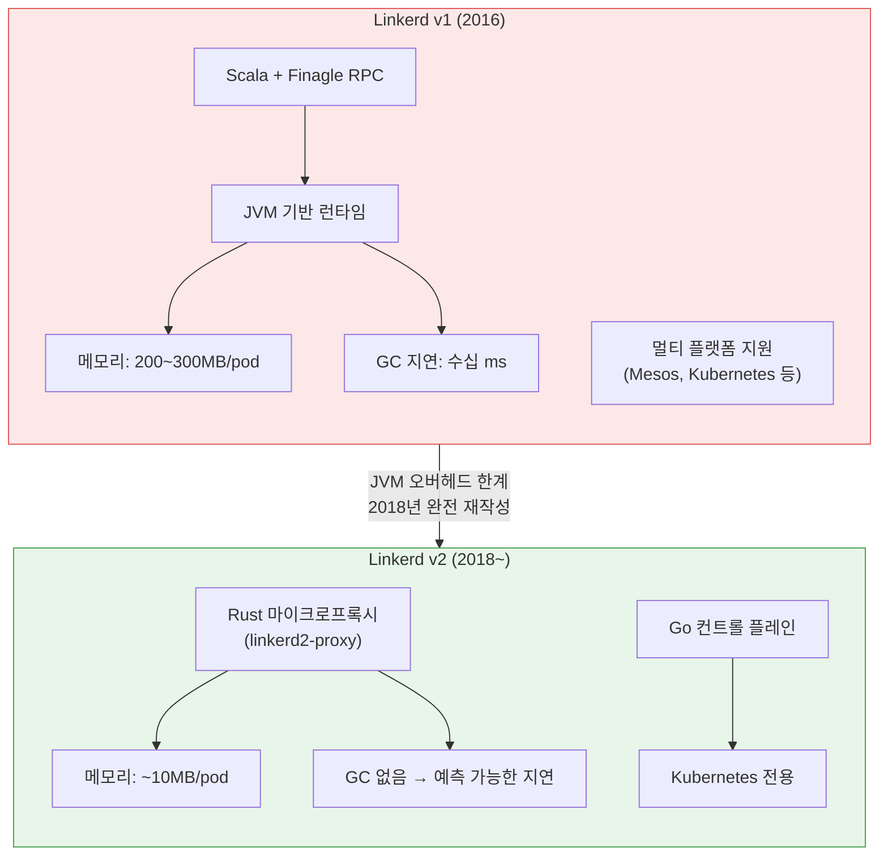
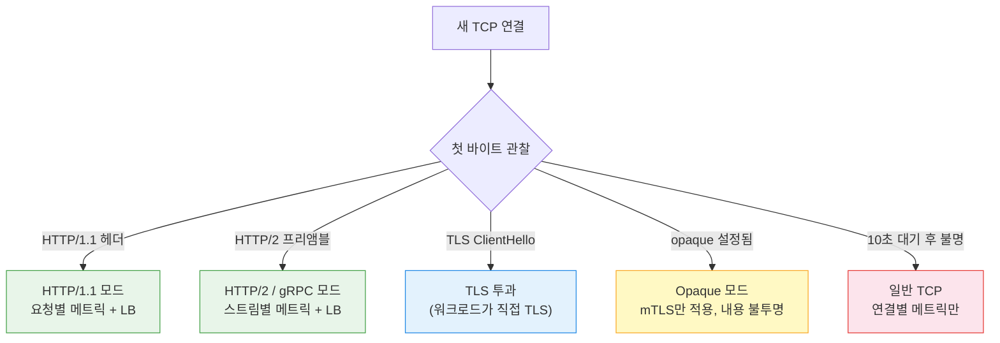
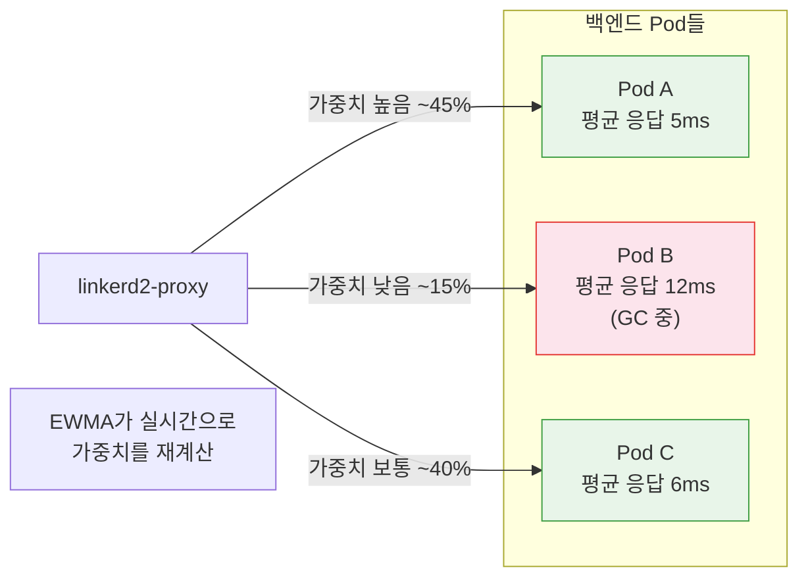
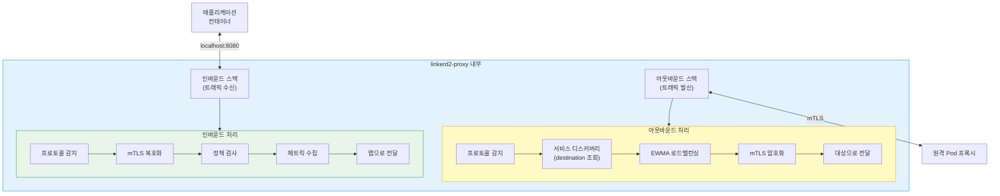
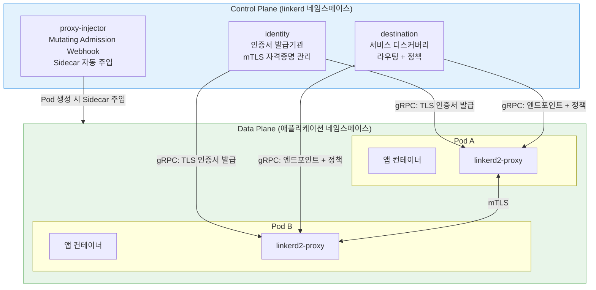
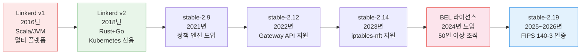
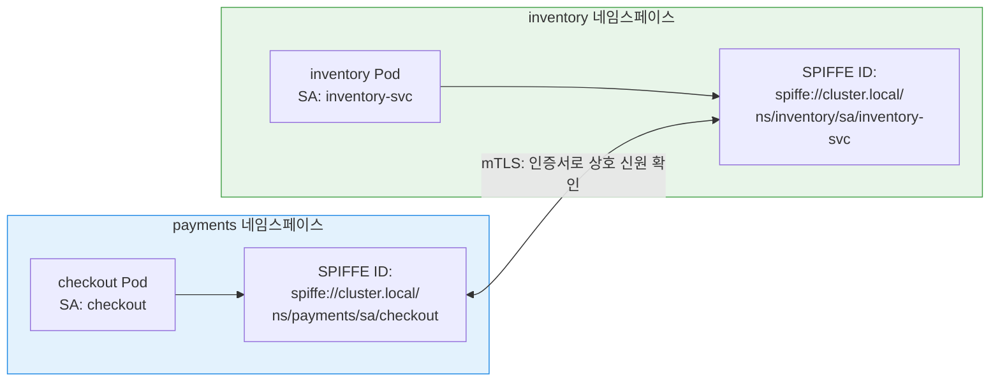
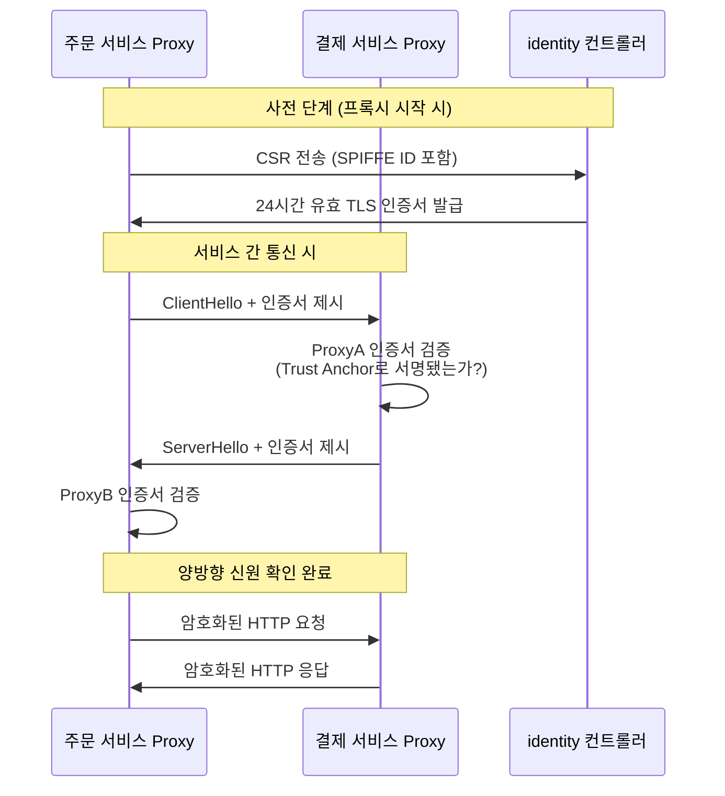

<!-- migrated: write/09_cloud/service-mesh/05-01.Linkerd 아키텍처.md (2026-04-19) -->

# Ch05. Linkerd 아키텍처

> **핵심 요약**
>
> Linkerd는 "운영 단순성(Operational Simplicity)"을 최우선 설계 원칙으로 삼은 Service Mesh다. Scala/JVM 기반의 v1을 완전히 버리고 Rust 마이크로프록시 + Go 컨트롤 플레인으로 재작성한 v2는, 바이너리 크기 ~10MB라는 수치가 상징하듯 서비스 메시에 꼭 필요한 기능만 담는다. 2024년부터는 50인 이상 조직에 BEL(Buoyant Enterprise for Linkerd) 라이선스가 필요하지만, 소스 코드는 여전히 Apache 2.0이다.

---

## 🎯 학습 목표

1. Linkerd v1에서 v2로 완전 재작성된 이유와 기술 결정 배경을 설명할 수 있다
2. Control Plane 3개 구성요소(destination, identity, proxy-injector)의 역할을 구분할 수 있다
3. linkerd2-proxy가 Rust로 작성된 이유와 Envoy 대비 장단점을 말할 수 있다
4. EWMA 로드밸런싱이 Round-Robin과 어떻게 다른지 설명할 수 있다
5. BEL 라이선스 모델의 핵심 조건과 우회 방법을 파악할 수 있다
6. Linkerd와 Istio 아키텍처를 비교해 각각의 적합한 상황을 판단할 수 있다

---

## 1. 역사: v1의 실패와 v2의 탄생

### 1.1 서비스 메시라는 단어를 처음 만든 프로젝트

2016년, Buoyant의 William Morgan과 Oliver Gould가 "서비스 메시(Service Mesh)"라는 개념을 처음 명명하고 Linkerd를 출시했다. 당시 Twitter 내부에서 사용하던 Finagle RPC 라이브러리를 바탕으로 만들었기 때문에, Linkerd v1은 자연스럽게 Scala와 JVM 위에서 동작했다.

문제는 시작부터 내재되어 있었다. JVM은 범용 런타임으로는 훌륭하지만, 수천 개의 Pod에 Sidecar로 붙이기에는 지나치게 무거웠다. 각 Sidecar가 최소 200~300MB의 힙 메모리를 점유하고, 가비지 컬렉션이 발생할 때마다 수십 밀리초의 예측 불가한 지연이 생겼다. 1,000개의 Pod 클러스터라면 Sidecar만을 위해 200GB 이상의 메모리가 필요한 셈이다.



### 1.2 세 가지 핵심 결정

2018년 재작성 당시 팀이 내린 결정은 세 가지였다. 첫째, Kubernetes 외의 플랫폼 지원을 포기했다. Linkerd v1은 Mesos, Kubernetes, Docker Swarm 등 여러 오케스트레이터를 지원하려 했지만, 그 범용성이 오히려 복잡성의 원인이었다. Kubernetes 하나에 집중함으로써 Mutating Webhook, CRD, RBAC 같은 Kubernetes 네이티브 기능을 적극 활용할 수 있게 됐다.

둘째, 컨트롤 플레인은 Go로 작성하기로 했다. Go는 Kubernetes 자체와 같은 언어라 생태계와 운영 도구 호환성이 좋고, 정적 바이너리로 빌드되어 배포가 단순하다. 컨트롤 플레인은 성능보다 Kubernetes와의 통합이 더 중요하므로 합리적인 선택이었다.

셋째이자 가장 대담한 결정은 데이터 플레인 프록시를 Envoy 대신 Rust로 직접 작성하는 것이었다. Envoy가 이미 존재했음에도 자체 제작한 이유는 다음 절에서 자세히 다룬다.

---

## 2. 데이터 플레인: linkerd2-proxy의 설계

### 2.1 왜 Rust인가

Linkerd 팀이 Rust를 선택한 이유는 단순히 유행을 쫓은 것이 아니다. 네트워크 프록시에는 상충되는 두 가지 요구사항이 있다. 메모리 관리가 자동화되어야 하는 동시에, GC에 의한 지연 없이 예측 가능한 레이턴시를 보장해야 한다.

C/C++는 GC가 없어 지연이 예측 가능하지만, 메모리 버그(use-after-free, buffer overflow)가 끊이지 않는다. Java/Go는 메모리 안전하지만 GC가 지연을 유발한다. Rust는 소유권(Ownership) 시스템으로 컴파일 타임에 메모리 안전성을 보장하면서 런타임 GC가 없다. 두 가지를 동시에 달성하는 유일한 선택지였다.

> **비유**: Rust의 소유권 시스템은 "체크아웃 카운터가 있는 도서관"과 같다. 책(메모리)을 빌릴 때 언제 반납할지 미리 정해야 하고, 반납 기한이 지나면 컴파일러가 에러를 낸다. 직원(GC)이 중간에 책을 수거하러 돌아다니지 않으니 업무(요청 처리)가 끊기지 않는다.

실제로 linkerd2-proxy의 바이너리는 약 10MB다. Envoy는 약 50MB에 달한다. 메모리 사용량도 idle 상태에서 Envoy가 40~50MB인 반면 linkerd2-proxy는 10MB 미만이다. 수천 개 Pod 규모에서 이 차이는 클러스터 노드 수로 직결된다.

### 2.2 프로토콜 감지

linkerd2-proxy는 연결이 맺어지면 첫 바이트를 기다렸다가 프로토콜을 자동 감지한다. 이를 "Client-speaks-first" 프로토콜 감지라 한다. HTTP/1.1, HTTP/2, gRPC는 클라이언트가 먼저 요청을 보내기 때문에 자동 감지가 가능하다.

반면 MySQL, Redis, SMTP처럼 서버가 먼저 인사를 건네는 "Server-speaks-first" 프로토콜은 자동 감지가 불가능하다. 연결은 됐지만 클라이언트가 아무것도 보내지 않아서 프록시가 대기하다 10초 후 타임아웃을 낸다. 이런 프로토콜에는 반드시 `opaque-ports` 어노테이션으로 수동 설정이 필요하다.



### 2.3 EWMA 로드밸런싱

linkerd2-proxy가 일반 프록시와 가장 차별화되는 부분 중 하나가 EWMA(Exponentially Weighted Moving Average) 기반 로드밸런싱이다.

Round-Robin은 백엔드 Pod를 순서대로 돌아가며 요청을 분배한다. 모든 Pod가 동일한 응답 속도라면 이상적이지만, 현실에서는 그렇지 않다. GC가 발생 중인 Pod, 메모리 압박을 받는 Pod, 처리 중인 요청이 많은 Pod는 응답이 느리다. Round-Robin은 이를 구분하지 않고 계속 요청을 보낸다.

EWMA는 각 백엔드의 최근 응답 지연을 지수 이동 평균으로 추적한다. 최근 응답이 느린 Pod에는 가중치를 낮춰 요청을 덜 보낸다. "Least Loaded" 방식으로도 불린다. 결과적으로 전체 p99 지연이 줄어들고 처리량이 늘어난다.

> **비유**: 마트 계산대를 고를 때 줄이 짧은 곳만 보는 게 Round-Robin이라면, EWMA는 줄 길이뿐 아니라 계산원 속도까지 보고 고르는 것이다. 줄이 짧아도 계산원이 느리면 결국 더 오래 기다린다.



### 2.4 내부 구조 개요



---

## 3. 컨트롤 플레인: 세 개의 구성요소

Linkerd의 컨트롤 플레인은 고의적으로 단순하게 설계됐다. Istio가 수십 개의 컨트롤 플레인 컴포넌트로 시작했던 것과 달리, Linkerd v2의 컨트롤 플레인은 세 개의 컴포넌트로 구성된다.



### 3.1 destination — 서비스 디스커버리와 라우팅

destination 컴포넌트는 프록시에게 "이 서비스로 요청을 보내려면 어디로 가야 하는가"를 알려준다. Kubernetes의 Service, Endpoint, EndpointSlice 리소스를 감시하다가, 프록시가 gRPC로 질의하면 실시간으로 엔드포인트 목록을 스트리밍한다.

단순한 주소 변환에 그치지 않는다. HTTPRoute, TCPRoute 같은 Kubernetes Gateway API 리소스와 Linkerd의 ServiceProfile 리소스를 해석해 라우팅 규칙과 재시도 정책을 프록시에 전달한다. 또한 Server, AuthorizationPolicy 같은 Linkerd 정책 리소스도 해석해 어떤 트래픽이 허용/거부되는지를 프록시가 알 수 있게 한다.

메모리 사용량에 주의가 필요하다. destination은 클러스터의 모든 Endpoint를 메모리에 유지한다. 클러스터가 클수록 메모리 사용량이 비례해 늘어나기 때문에, 프로덕션에서는 메모리 리소스 제한을 보수적으로 낮게 설정하지 않도록 해야 한다.

### 3.2 identity — 인증서 발급기관

identity 컴포넌트는 클러스터의 내부 CA(Certificate Authority) 역할을 한다. 새 프록시가 시작되면 identity에 CSR(Certificate Signing Request)을 보내고, identity는 Issuer 인증서로 서명한 단기 TLS 인증서(기본 24시간)를 발급한다. 프록시는 이 인증서로 자신의 신원(SPIFFE ID)을 증명하고, 다른 프록시와 mTLS 핸드셰이크를 수행한다.

24시간이라는 짧은 유효 기간은 의도적 설계다. 인증서가 유출되더라도 최대 24시간 후에는 무효화된다. 프록시가 만료 전에 자동으로 갱신 요청을 보내기 때문에 운영자가 따로 관리할 필요가 없다.

### 3.3 proxy-injector — Sidecar 자동 주입

proxy-injector는 Kubernetes의 Mutating Admission Webhook으로 동작한다. Pod 생성 요청이 API 서버에 도달하면, API 서버가 proxy-injector를 호출한다. proxy-injector는 Pod 또는 상위 Namespace에 `linkerd.io/inject: enabled` 어노테이션이 있는지 확인하고, 있으면 Pod 정의에 두 가지를 추가해 반환한다.

첫 번째는 init 컨테이너다. `linkerd-init`이라는 이름의 이 컨테이너는 Pod가 시작되기 전에 iptables 규칙을 설정해, 모든 인바운드/아웃바운드 트래픽이 프록시를 거치도록 강제한다. 두 번째는 프록시 컨테이너 자체다. `linkerd-proxy`라는 이름으로 앱 컨테이너와 함께 사이드카로 실행된다.

---

## 4. 버전 역사와 BEL 라이선스

### 4.1 Linkerd 버전 타임라인



### 4.2 BEL 라이선스 모델

2024년부터 Buoyant는 BEL(Buoyant Enterprise for Linkerd) 라이선스 모델을 도입했다. 이 변화가 커뮤니티에 상당한 논란을 일으켰기 때문에, 정확히 이해해 두어야 한다.

소스 코드는 여전히 Apache 2.0이다. 변경된 것은 stable 릴리스 바이너리다. 직원 수 50명 이상의 조직이 stable 바이너리를 프로덕션에서 사용하려면 BEL 라이선스가 필요하다. 가격은 클러스터당 월 약 $2,000 수준이다.

우회 방법은 두 가지다. 첫째, edge 채널 릴리스는 여전히 무료다. edge는 주 단위 릴리스이며, stable로 올라오기 전의 최신 변경사항이 포함된다. 둘째, 소스에서 직접 빌드하면 된다. Apache 2.0 소스 코드를 빌드한 바이너리는 라이선스 제약을 받지 않는다. 단, 두 방법 모두 Buoyant의 공식 지원을 받지 못한다.

FIPS 140-3 준수 빌드는 BEL 엔터프라이즈 구독에서만 제공된다. 금융, 의료, 정부 등 규정 준수가 요구되는 환경에서는 이것이 BEL 구독의 주요 동기가 된다.

---

## 5. mTLS와 SPIFFE 신원 모델

### 5.1 mTLS가 서비스 메시에서 필요한 이유

Kubernetes 클러스터 내부 네트워크는 기본적으로 평문(plaintext)이다. 같은 클러스터에 있는 악의적인 Pod가 네트워크 패킷을 스니핑하거나, 결제 서비스인 척 요청을 보내는 것을 막을 수단이 없다. "클러스터 내부는 안전하다"는 가정은 제로 트러스트 보안 원칙에 어긋난다.

Linkerd는 메시에 포함된 모든 통신을 자동으로 mTLS(mutual TLS)로 보호한다. 일반 TLS는 클라이언트가 서버의 신원만 검증한다. HTTPS로 은행 웹사이트에 접속할 때 브라우저가 서버 인증서를 확인하는 것처럼. mTLS는 서버도 클라이언트의 신원을 검증한다. 결제 서비스가 주문 서비스로부터 요청을 받을 때, "이 요청이 정말 주문 서비스에서 왔는가"를 인증서로 확인한다.

> **비유**: 일반 TLS는 건물 입구에서 경비원이 방문자에게 "여기가 진짜 ○○회사 건물이 맞습니까?"라고 확인받는 것이다. mTLS는 거기에 더해 방문자도 사원증을 제시해야 한다. 회사 건물과 방문자 양쪽 모두 신원을 증명해야 출입이 허용된다.

Linkerd의 mTLS는 애플리케이션 코드 변경 없이 적용된다. 앱은 여전히 plain HTTP로 localhost 프록시와 통신하고, 프록시가 외부로 나가는 트래픽을 mTLS로 암호화한다. 들어오는 트래픽은 프록시가 mTLS를 복호화한 뒤 plain HTTP로 앱에 전달한다.

### 5.2 SPIFFE 신원

각 프록시는 SPIFFE(Secure Production Identity Framework For Everyone) 형식의 신원을 가진다. SPIFFE ID는 다음 형식을 따른다.

```
spiffe://<trust-domain>/ns/<namespace>/sa/<service-account>
```

예를 들어 `payments` 네임스페이스의 `checkout` 서비스 어카운트를 사용하는 Pod의 SPIFFE ID는 다음과 같다.

```
spiffe://cluster.local/ns/payments/sa/checkout
```

이 신원은 Kubernetes Service Account와 연결된다. 같은 Service Account를 사용하는 모든 Pod는 같은 SPIFFE ID를 가지며, 인증서에 이 ID가 SAN(Subject Alternative Name)으로 포함된다. 서비스 간 정책을 "어떤 IP에서 왔는가"가 아니라 "어떤 신원을 가졌는가"로 정의할 수 있어, IP가 바뀌어도 정책이 유지된다.



### 5.3 mTLS 핸드셰이크 흐름



---

## 6. 연결 풀링과 네이티브 사이드카

### 6.1 연결 풀링

linkerd2-proxy는 각 백엔드 Pod와 연결 풀을 유지한다. HTTP/1.1은 요청당 새 연결을 맺거나 Keep-Alive로 재사용하는데, 연결 생성 비용이 높다(TCP 핸드셰이크 + TLS 핸드셰이크). 프록시가 연결을 미리 열어두고 재사용하면 이 비용이 제거된다.

HTTP/2는 하나의 연결에 여러 스트림을 다중화(multiplexing)한다. 프록시는 단 하나의 HTTP/2 연결로 수백 개의 동시 요청을 처리할 수 있어, 연결 수가 드라마틱하게 줄어든다. gRPC는 HTTP/2 위에서 동작하므로 같은 이점을 누린다.

이 연결 풀링은 애플리케이션에 투명하다. 앱은 매번 새 연결을 여는 것처럼 코드를 작성해도, 프록시가 내부적으로 풀링을 적용한다.

### 6.2 Native Sidecar (KEP-753)

Kubernetes 1.28에서 공식 Sidecar 컨테이너 타입이 도입됐다(KEP-753). 이전에는 Sidecar가 개념적으로만 존재했고, 실제로는 일반 컨테이너와 구분이 없었다. 그 결과 두 가지 문제가 있었다.

첫 번째는 시작 순서다. Kubernetes는 컨테이너 시작 순서를 보장하지 않는다. 앱 컨테이너가 프록시보다 먼저 시작되면, 아직 프록시가 준비되지 않은 상태에서 앱이 트래픽을 받는 상황이 생겼다. 두 번째는 종료 순서다. Job이나 CronJob에서 앱 컨테이너가 완료되어도 Sidecar가 살아있어 Pod가 종료되지 않는 문제가 있었다.

Native Sidecar는 이 두 문제를 해결한다. Sidecar로 지정된 컨테이너는 앱 컨테이너보다 먼저 시작하고 나중에 종료된다. Linkerd는 edge-23.11.4부터 이 기능을 지원한다.

```yaml
# Native Sidecar 사용 시 프록시 컨테이너 형태 (자동 주입 시 생성)
initContainers:
- name: linkerd-proxy   # init 컨테이너로 선언되지만 restartPolicy: Always
  image: cr.l5d.io/linkerd/proxy:stable-2.19.x
  restartPolicy: Always  # 이것이 Native Sidecar를 만드는 핵심
  # ... 나머지 설정
```

---

## 8. Linkerd vs Istio 아키텍처 비교

두 솔루션 모두 서비스 메시지만, 설계 철학이 근본적으로 다르다. Linkerd는 단순성과 경량성을 추구하고, Istio는 기능 완결성을 추구한다.

| 항목 | Linkerd | Istio |
|------|---------|-------|
| 프록시 | linkerd2-proxy (Rust, ~10MB) | Envoy (C++, ~50MB) |
| 컨트롤 플레인 | Go, 3개 컴포넌트 | Go, istiod 단일 바이너리 (내부 복잡) |
| 트래픽 관리 | HTTPRoute 기반, 기능 제한적 | VirtualService 등 풍부한 CRD |
| 설정 복잡도 | 낮음 (어노테이션 중심) | 높음 (다수의 CRD) |
| 리소스 사용 | 낮음 (프록시 ~10MB) | 보통~높음 (프록시 ~50MB) |
| 앰비언트 메시 | 미지원 (Sidecar 전용) | Istio Ambient (Sidecar 선택적) |
| WASM 확장 | 미지원 | Envoy WASM 필터 지원 |
| 라이선스 | Apache 2.0 (소스), BEL (50인↑ 바이너리) | Apache 2.0 |

> **비유**: Linkerd는 맞춤 제작 수술용 메스이고, Istio는 다목적 스위스 아미 나이프다. 수술에는 메스가 낫지만, 야외에서 다양한 상황을 대처해야 한다면 아미 나이프가 유용하다. 팀의 요구사항과 운영 역량에 따라 선택이 달라진다.

Linkerd가 유리한 상황은 다음과 같다. 팀이 서비스 메시 운영 경험이 없어 학습 곡선을 최소화하고 싶을 때, 클러스터 리소스 여유가 적을 때, mTLS/관측성/기본 로드밸런싱만 필요할 때가 해당된다. 반면 Istio는 세밀한 트래픽 제어(카나리아 가중치, 헤더 기반 라우팅), WASM으로 프록시 확장, 복잡한 멀티클러스터 페더레이션이 필요할 때 강점을 발휘한다.

---

## 9. 면접 대비

**Q1. Linkerd v1이 실패한 이유와 v2가 Rust를 선택한 이유를 설명해 보세요.**

v1은 Scala/JVM 기반이었는데, JVM은 Pod당 200~300MB 메모리를 점유하고 GC 지연이 불규칙하게 발생해 수천 개의 Sidecar 운영에 부적합했다. v2에서 Rust를 선택한 이유는 소유권 시스템으로 컴파일 타임에 메모리 안전성을 보장하면서 런타임 GC가 없기 때문이다. 결과적으로 linkerd2-proxy는 ~10MB의 바이너리 크기와 예측 가능한 레이턴시를 달성했다.

**Q2. linkerd2-proxy와 Envoy의 핵심 차이는 무엇인가요?**

설계 목적이 다르다. Envoy는 범용 프록시로 HTTP, gRPC, TCP, Redis, MongoDB 등 다양한 프로토콜 필터를 지원하고 WASM으로 확장 가능하다. 바이너리 크기는 약 50MB다. linkerd2-proxy는 서비스 메시에 필요한 기능(mTLS, 프로토콜 감지, EWMA 로드밸런싱, 메트릭)만 담아 약 10MB다. Linkerd는 운영 단순성을 위해 Envoy의 기능 풍부함을 의도적으로 포기했다.

**Q3. EWMA 로드밸런싱이 Round-Robin보다 나은 점은 무엇인가요?**

Round-Robin은 모든 백엔드가 동일한 처리 속도를 가진다고 가정한다. 실제로는 GC 중인 Pod, 메모리 압박 중인 Pod가 있어 응답 속도가 다르다. EWMA는 각 백엔드의 최근 응답 지연을 지수 이동 평균으로 추적해, 응답이 느린 Pod에는 적은 요청을 보낸다. 특히 HTTP/2와 gRPC처럼 하나의 연결에 여러 요청이 흐르는 경우에 중요하다.

**Q4. BEL 라이선스가 도입된 후 오픈소스 사용자의 선택지는 무엇인가요?**

세 가지다. 첫째, edge 채널 릴리스를 사용한다(무료지만 stable 보장 없음). 둘째, Apache 2.0 소스에서 직접 빌드한다(라이선스 제약 없음, 공식 지원 없음). 셋째, BEL 구독을 구매한다(클러스터당 월 ~$2,000, stable 바이너리 + 지원 + FIPS 140-3). 소규모 조직(50인 미만)이나 개인 사용자는 stable 바이너리도 무료로 사용 가능하다.

**Q5. destination 컴포넌트가 메모리를 많이 사용하는 이유는 무엇이고, 어떻게 대응해야 하나요?**

destination은 클러스터 내 모든 Service의 Endpoint 정보를 메모리에 유지한다. 클러스터 규모가 커질수록 Endpoint 수가 비례해 늘어나므로 메모리 사용도 늘어난다. 대응 방법은 두 가지다. 첫째, 메모리 제한을 여유있게 설정한다(너무 낮으면 OOMKilled 루프). 둘째, destination Pod의 메모리 사용량을 Prometheus로 모니터링해 추이를 파악한다.

---

## 체크리스트

- [ ] Linkerd v1이 JVM Sidecar로 실패한 구체적 수치(메모리, GC 지연)를 설명할 수 있는가?
- [ ] v2 재작성 시 세 가지 핵심 결정(Kubernetes 전용, Go CP, Rust DP)을 말할 수 있는가?
- [ ] destination, identity, proxy-injector 각각의 역할을 한 문장으로 설명할 수 있는가?
- [ ] Client-speaks-first와 Server-speaks-first의 차이와 각각의 처리 방법을 아는가?
- [ ] EWMA 로드밸런싱이 Round-Robin보다 나은 상황을 구체적 예시로 설명할 수 있는가?
- [ ] BEL 라이선스 조건(50인 기준, 가격)과 우회 방법을 알고 있는가?
- [ ] Linkerd와 Istio 중 어떤 상황에서 어느 쪽을 선택할지 근거를 들어 설명할 수 있는가?

---

## 참고 자료

- Linkerd 공식 문서: [linkerd.io/docs](https://linkerd.io/docs/)
- linkerd2-proxy 소스 코드: [github.com/linkerd/linkerd2-proxy](https://github.com/linkerd/linkerd2-proxy)
- BEL 라이선스 안내: [buoyant.io/buoyant-enterprise-linkerd](https://buoyant.io/buoyant-enterprise-linkerd)
- EWMA 알고리즘 설명: Linkerd blog — "Beyond Round Robin"
- SPIFFE/SPIRE 신원 표준: [spiffe.io](https://spiffe.io/)
- 로컬 참조: `docs/03_CloudNative/04_Linkerd/Chapter_02_Intro_to_Linkerd.md`
