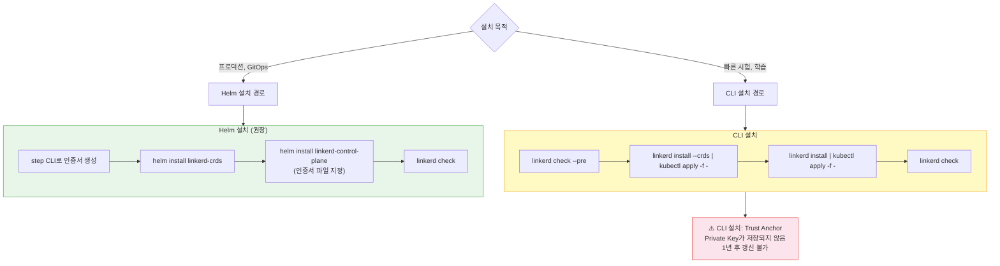
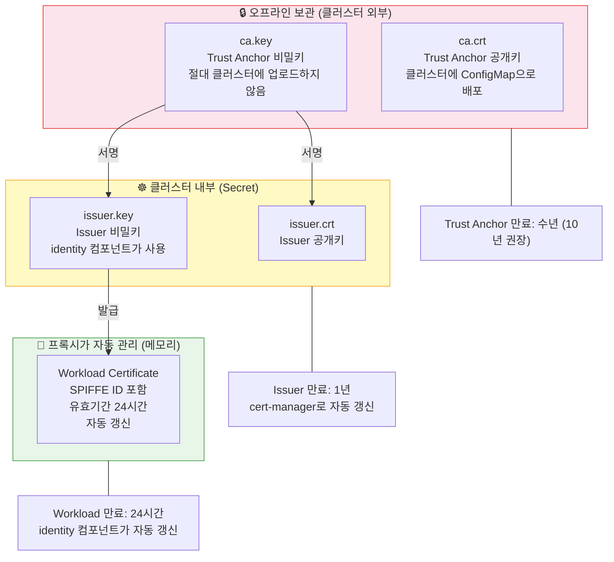
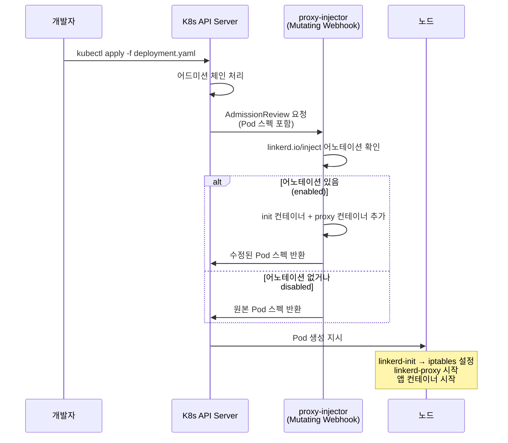
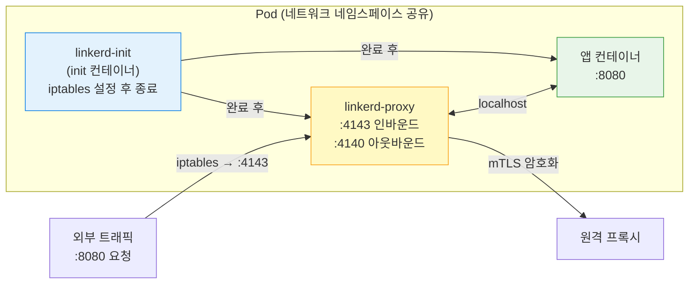
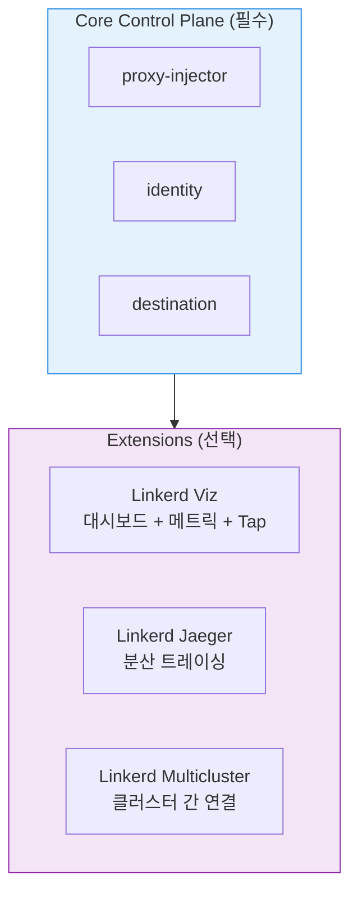

<!-- migrated: write/09_cloud/service-mesh/06-01.Linkerd 설치.md (2026-04-19) -->

# Ch06. Linkerd 설치와 메시 구성

> **핵심 요약**
>
> Linkerd 설치는 두 단계로 나뉜다. 첫째, 인증서 계획이다. 기본 CLI 설치가 자동 생성하는 Trust Anchor의 Private Key는 어디에도 저장되지 않아, 나중에 인증서를 갱신할 방법이 없다. 프로덕션에서는 반드시 `step` CLI로 인증서를 직접 생성한 뒤 Helm으로 설치해야 한다. 둘째, 워크로드 주입이다. Namespace 또는 Deployment에 `linkerd.io/inject: enabled` 어노테이션을 추가하면 Mutating Webhook이 나머지를 처리한다.

---

## 🎯 학습 목표

1. Linkerd 설치의 CLI 방식과 Helm 방식 차이를 인증서 관점에서 설명할 수 있다
2. Trust Anchor와 Issuer 인증서를 `step` CLI로 직접 생성할 수 있다
3. cert-manager를 이용한 인증서 자동 갱신 흐름을 이해할 수 있다
4. `linkerd check`의 세 가지 실행 모드(--pre, 기본, --proxy)를 구분해 사용할 수 있다
5. Sidecar 주입 시 init 컨테이너와 proxy 컨테이너가 각각 무슨 일을 하는지 설명할 수 있다
6. Viz, Jaeger, Multicluster Extension의 용도와 설치 방법을 안다

---

## 1. 설치 전 체크리스트

### 1.1 사전 요구사항

Linkerd 2.x는 Kubernetes 1.24 이상을 요구한다. 이는 단순한 권장사항이 아니라 실제 동작 조건이다. EndpointSlice API와 Server-Side Apply가 안정화된 버전부터 Linkerd가 의존하는 API가 갖춰지기 때문이다.

클러스터 DNS가 올바르게 동작하는지 먼저 확인해야 한다. Linkerd 컨트롤 플레인 컴포넌트들이 서로를 DNS로 찾기 때문에, CoreDNS가 정상 상태가 아니라면 설치 직후부터 문제가 발생한다. `linkerd check --pre` 명령이 이를 포함해 설치 가능 여부를 사전에 점검해 준다.

kubectl 버전은 서버 버전과 최대 1 minor 차이까지 허용된다. Linkerd CLI 역시 설치된 컨트롤 플레인과 1 major 버전 차이까지 지원하므로, 업그레이드 시 CLI와 컨트롤 플레인 버전을 동시에 올리는 것이 권장된다.

### 1.2 인증서를 미리 계획해야 하는 이유

많은 팀이 Linkerd를 빠르게 시험해보고 싶어 `linkerd install | kubectl apply -f -`로 시작한다. 이 방법은 수분 안에 Linkerd가 동작하게 해주지만, 숨겨진 함정이 있다.

자동 설치 시 Trust Anchor의 Private Key는 메모리에서 생성되고 사용된 뒤 어디에도 저장되지 않는다. Issuer 인증서는 기본 1년 유효기간으로 설정된다. 1년 후 Issuer가 만료되면 새 Issuer를 Trust Anchor로 서명해야 하는데, Private Key가 없으니 새 Issuer를 만들 수 없다. 결국 Linkerd 전체를 재설치해야 하는 상황이 된다.

> **비유**: Trust Anchor의 Private Key는 아파트 마스터키와 같다. 마스터키 없이도 각 세대 열쇠(Issuer)로 일상적인 출입은 가능하다. 그러나 세대 열쇠를 새로 만들려면 반드시 마스터키가 있어야 한다. 처음부터 마스터키를 안전하게 보관하지 않으면 나중에 대공사가 된다.

---

## 2. 설치 방법 선택



### 2.1 CLI 설치 (빠른 시작용)

```bash
# 1. 사전 점검 — Linkerd가 없는 상태에서 실행하는 유일한 check 옵션
linkerd check --pre

# 2. CRD 먼저 설치 (Server, AuthorizationPolicy 등)
linkerd install --crds | kubectl apply -f -

# 3. 컨트롤 플레인 설치
linkerd install | kubectl apply -f -

# 4. 설치 완료 확인 — 모든 항목이 ✓ 이어야 한다
linkerd check

# 5. (선택) Viz Extension 설치
linkerd viz install | kubectl apply -f -
```

CLI 설치의 장점은 명확하다. 명령 네 줄로 끝난다. 데모, 로컬 개발 환경, 개념 검증(PoC) 단계에서는 충분하다. 단, 앞서 설명한 인증서 문제 때문에 프로덕션에는 적합하지 않다.

### 2.2 Helm 설치 (프로덕션 권장)

Helm 설치의 핵심은 인증서를 설치 전에 직접 생성한다는 점이다. 이 과정이 번거롭게 느껴질 수 있지만, 그 번거로움이 나중의 운영 안정성을 보장한다.

**1단계: step CLI 설치**

```bash
# macOS
brew install step

# Linux
curl -fsSL https://dl.smallstep.com/install-step/script | bash
```

**2단계: Trust Anchor(Root CA) 생성**

```bash
step certificate create root.linkerd.cluster.local ca.crt ca.key \
  --profile root-ca \
  --no-password \
  --insecure
```

이 명령은 `ca.crt`(공개키)와 `ca.key`(비밀키)를 생성한다. `--no-password --insecure` 옵션은 자동화 목적으로 패스프레이즈 없이 생성하는 것이다. 생성 후 `ca.key`는 절대 클러스터에 저장하지 않고 오프라인 저장소(HSM, 오프라인 볼트 등)에 보관한다.

**3단계: Issuer 인증서 생성**

```bash
step certificate create identity.linkerd.cluster.local issuer.crt issuer.key \
  --profile intermediate-ca \
  --not-after 8760h \
  --no-password \
  --insecure \
  --ca ca.crt \
  --ca-key ca.key
```

`--not-after 8760h`는 1년을 의미한다. Issuer는 Trust Anchor와 달리 클러스터에 저장되므로, cert-manager를 사용해 자동 갱신하는 것을 권장한다(뒤에서 설명).

**4단계: Helm으로 설치**

```bash
# Helm repo 추가
helm repo add linkerd https://helm.linkerd.io/stable
helm repo update

# CRD 설치 (별도 차트)
helm install linkerd-crds linkerd/linkerd-crds \
  -n linkerd --create-namespace

# 컨트롤 플레인 설치 (인증서 파일 지정)
helm install linkerd-control-plane \
  -n linkerd \
  --set-file identityTrustAnchorsPEM=ca.crt \
  --set-file identity.issuer.tls.crtPEM=issuer.crt \
  --set-file identity.issuer.tls.keyPEM=issuer.key \
  linkerd/linkerd-control-plane

# 설치 확인
linkerd check
```

---

## 3. Trust Anchor 인증서 계층

### 3.1 세 계층의 역할



Trust Anchor는 최상위 인증서다. 유효기간을 10년 이상 길게 설정하고, Private Key는 오프라인 환경에 보관한다. 일상적인 운영에서는 쓸 일이 없어야 하는 키다.

Issuer 인증서는 identity 컨트롤러가 매일 수천 개의 Workload 인증서를 발급하는 데 사용한다. 클러스터 Secret에 저장되므로 유출 위험이 Trust Anchor보다 높다. 그래서 유효기간을 1년 정도로 설정하고, cert-manager로 만료 전에 자동 갱신하는 것이 표준 패턴이다.

Workload 인증서는 각 프록시가 보유하는 단기 인증서다. 기본 24시간 유효기간으로 발급되고, 만료 전 프록시가 identity에 자동으로 갱신 요청을 보낸다. 운영자가 신경 쓸 필요가 없다.

### 3.2 cert-manager로 Issuer 자동 갱신

수동으로 관리하면 Issuer가 만료될 때 클러스터 전체의 mTLS가 깨진다. cert-manager를 사용하면 이 위험을 제거할 수 있다.

```bash
# cert-manager 설치 (이미 있다면 생략)
helm install cert-manager jetstack/cert-manager \
  --namespace cert-manager --create-namespace \
  --set installCRDs=true

# Trust Anchor를 Secret으로 저장 (ca.crt와 ca.key 모두 필요)
kubectl create secret tls linkerd-trust-anchor \
  --cert=ca.crt \
  --key=ca.key \
  --namespace cert-manager

# ClusterIssuer: Trust Anchor를 CA로 사용
cat <<EOF | kubectl apply -f -
apiVersion: cert-manager.io/v1
kind: ClusterIssuer
metadata:
  name: linkerd-trust-anchor
spec:
  ca:
    secretName: linkerd-trust-anchor
EOF

# Certificate: Issuer 인증서를 자동 갱신
cat <<EOF | kubectl apply -f -
apiVersion: cert-manager.io/v1
kind: Certificate
metadata:
  name: linkerd-identity-issuer
  namespace: linkerd
spec:
  secretName: linkerd-identity-issuer
  duration: 48h       # 48시간 유효
  renewBefore: 25h    # 만료 25시간 전에 갱신
  issuerRef:
    name: linkerd-trust-anchor
    kind: ClusterIssuer
  commonName: identity.linkerd.cluster.local
  dnsNames:
  - identity.linkerd.cluster.local
  isCA: true
  privateKey:
    algorithm: ECDSA
  usages:
  - cert sign
  - crl sign
  - server auth
  - client auth
EOF
```

이 구성에서 ca.key를 cert-manager Secret에 저장한다는 점은 순수한 오프라인 보관보다 보안 수준이 낮다. 엄격한 보안이 필요하다면 Vault PKI나 AWS ACM 같은 외부 CA를 사용하고, cert-manager의 `vault` 또는 `awspca` issuer를 활용한다.

---

## 4. Sidecar 주입 메커니즘

### 4.1 주입 흐름



### 4.2 주입으로 추가되는 두 컨테이너

**linkerd-init (init 컨테이너)**

앱 컨테이너와 프록시 컨테이너가 시작되기 전에 실행된다. 역할은 단 하나, iptables 규칙을 설정하는 것이다. 구체적으로는 인바운드 트래픽(기본 포트 제외)을 `4143` 포트로, 아웃바운드 트래픽을 `4140` 포트로 리다이렉트한다. 이 두 포트가 linkerd2-proxy가 리슨하는 포트다.

CNI 플러그인 모드를 사용하면 init 컨테이너 대신 노드 레벨의 CNI 플러그인이 이 역할을 한다. 권한 제약이 있는 환경(NET_ADMIN capability 없음)에서 유용하다.

**linkerd-proxy (sidecar 컨테이너)**

앱 컨테이너와 동일한 네트워크 네임스페이스에서 실행되므로 `localhost`로 통신한다. 앱은 평소처럼 `localhost:8080`으로 바인딩하면 되고, 외부에서 들어오는 트래픽은 iptables가 자동으로 `4143`으로 리다이렉트해 프록시를 거치게 된다.



### 4.3 어노테이션 기반 주입 제어

주입은 네임스페이스와 Pod 레벨 두 곳에서 제어할 수 있다. Pod 레벨 어노테이션이 네임스페이스 어노테이션보다 우선한다.

```yaml
# 네임스페이스 전체에 주입 활성화
apiVersion: v1
kind: Namespace
metadata:
  name: production
  annotations:
    linkerd.io/inject: enabled

---
# 특정 Deployment만 제외 (네임스페이스 설정 무시)
apiVersion: apps/v1
kind: Deployment
metadata:
  name: legacy-app
  namespace: production
spec:
  template:
    metadata:
      annotations:
        linkerd.io/inject: disabled   # 이 Pod는 주입 제외
```

`linkerd.io/inject` 어노테이션 값:
- `enabled`: 일반 모드로 Sidecar 주입
- `ingress`: Ingress 컨트롤러 모드 (외부 트래픽 진입점에 사용)
- `disabled`: 주입 명시적 거부

### 4.4 메시에 추가하지 말아야 할 것

`kube-system` 네임스페이스의 구성요소들은 절대 메시에 추가하지 않는다. CoreDNS, kube-proxy 같은 인프라 컴포넌트는 Linkerd가 의존하는 기반 시스템이다. 이들에 Sidecar를 주입하면 Linkerd 자체가 동작하기 위해 필요한 DNS와 네트워킹이 깨질 수 있다. 닭이 먼저냐 달걀이 먼저냐 같은 순환 의존성 문제다.

CNI 플러그인, Kubernetes Conversion Webhook도 마찬가지로 제외 대상이다.

---

## 5. linkerd check: 상태 진단 도구

`linkerd check`는 Linkerd를 운영하며 가장 자주 쓰는 명령이다. 세 가지 모드로 동작한다.

```mermaid
flowchart LR
    subgraph pre["설치 전"]
        pre_cmd["linkerd check --pre"]
        pre_what["클러스터 요구사항 충족 여부<br>필요 권한 확인<br>Kubernetes 버전 확인"]
        pre_cmd --> pre_what
    end

    subgraph default["설치 후 전체 점검"]
        def_cmd["linkerd check"]
        def_what["컨트롤 플레인 상태<br>인증서 유효성<br>설치된 모든 Extension"]
        def_cmd --> def_what
    end

    subgraph proxy["데이터 플레인 점검"]
        prx_cmd["linkerd check --proxy"]
        prx_what["각 프록시 버전 확인<br>프록시 인증서 유효성<br>특정 네임스페이스 지정 가능"]
        prx_cmd --> prx_what
    end

    pre --> default --> proxy

    style pre fill:#e3f2fd,stroke:#1e88e5,color:#333
    style default fill:#e8f5e9,stroke:#43a047,color:#333
    style proxy fill:#fff9c4,stroke:#f9a825,color:#333
```

주요 옵션:

| 옵션 | 용도 |
|------|------|
| `--pre` | 설치 전 사전 점검 (Linkerd 없이 실행 가능한 유일한 모드) |
| `--proxy` | Data Plane 프록시 상태 점검 |
| `--namespace <ns>` | 특정 네임스페이스의 프록시만 점검 |
| `--output json` | JSON 출력 (CI 파이프라인 연동용) |
| `--wait 2m` | 타임아웃 변경 (기본 5분) |
| `--linkerd-cni-enabled` | CNI 플러그인 사용 시 `--pre`와 함께 사용 |

버그 리포트를 작성하거나 지원을 요청할 때 `linkerd check` 결과를 첨부하는 것이 표준 관행이다. 오류 메시지에 일반적으로 힌트가 포함되어 있어 셀프 진단이 가능하다.

---

## 6. 업그레이드 전략

### 6.1 In-place 업그레이드

가장 단순한 방법이다. 기존 컨트롤 플레인을 그대로 두고 새 버전으로 교체한다.

```bash
# Helm 업그레이드
helm upgrade linkerd-control-plane \
  -n linkerd \
  --set-file identityTrustAnchorsPEM=ca.crt \
  --set-file identity.issuer.tls.crtPEM=issuer.crt \
  --set-file identity.issuer.tls.keyPEM=issuer.key \
  linkerd/linkerd-control-plane

linkerd check
```

컨트롤 플레인 업그레이드 후 Data Plane의 프록시는 자동으로 새 버전이 되지 않는다. 프록시 업그레이드는 Deployment를 재시작해야 한다.

```bash
# 특정 네임스페이스의 Deployment 재시작
kubectl rollout restart deployment -n my-namespace

# 업그레이드 후 Data Plane 확인
linkerd check --proxy -n my-namespace
```

### 6.2 주의사항: CLI와 컨트롤 플레인 버전 동기화

CLI 버전과 컨트롤 플레인 버전이 1 major를 초과해 차이 나면 지원되지 않는다. 업그레이드 시 CLI도 함께 올린다.

```bash
# 현재 버전 확인
linkerd version
# Client version: stable-2.14.6
# Server version: stable-2.14.6  ← 일치해야 함
```

---

## 7. Extensions

Linkerd의 핵심 컨트롤 플레인은 최소한의 기능만 제공한다. 추가 기능은 Extension으로 분리되어 있어 필요한 것만 설치할 수 있다. 이 설계 덕분에 대시보드가 필요 없는 팀은 설치하지 않아도 되고, 리소스 낭비를 줄일 수 있다.



### 7.1 Linkerd Viz

```bash
# CLI로 설치
linkerd viz install | kubectl apply -f -

# 또는 Helm
helm install linkerd-viz linkerd/linkerd-viz \
  -n linkerd-viz --create-namespace

# 대시보드 접속 (포트포워딩)
linkerd viz dashboard &
```

Viz는 서비스 메시의 상태를 시각적으로 확인하는 대시보드와, 실시간 요청 메타데이터를 조회하는 Tap 기능을 제공한다. 내부에 Prometheus를 포함하고 있는데, 기본 설치는 영구 볼륨이 없어 Pod 재시작 시 메트릭이 사라진다. 프로덕션에서는 반드시 외부 Prometheus와 연동해야 한다.

또 하나의 주의사항은 인증이 없다는 점이다. `linkerd viz dashboard` 명령은 기본적으로 localhost로만 바인딩되지만, Ingress로 외부에 노출할 경우 API Gateway나 OAuth proxy를 앞에 두어야 한다.

**Tap 사용 예시:**

```bash
# emojivoto 네임스페이스의 web Deployment 트래픽 실시간 조회
linkerd viz tap deploy/web -n emojivoto

# 특정 경로만 필터링
linkerd viz tap deploy/web -n emojivoto --path /api/vote
```

Tap은 요청의 경로, 헤더, 상태 코드, 지연 시간을 실시간으로 보여주지만, 요청 본문(body)은 볼 수 없다. mTLS로 암호화되어 있기도 하고, 성능상 이유로 본문까지 캡처하지 않는 것이 원칙이다.

### 7.2 Linkerd Jaeger

```bash
linkerd jaeger install | kubectl apply -f -
```

Jaeger Extension은 Linkerd 프록시가 OpenTelemetry 형식의 span을 Jaeger 백엔드로 전송할 수 있게 한다. 한 가지 중요한 전제가 있다. 애플리케이션이 먼저 분산 트레이싱을 구현하고 `b3` 헤더(또는 `traceparent`)를 전파해야 한다. Linkerd가 자동으로 애플리케이션에 트레이싱 코드를 심어주지는 않는다. Linkerd는 프록시 레벨에서 span을 추가하고 헤더를 전파하지만, 서비스 간 연결이 의미 있는 트레이스가 되려면 앱 코드의 협조가 필요하다.

### 7.3 Linkerd Multicluster

```bash
linkerd multicluster install | kubectl apply -f -
linkerd multicluster link --cluster-name west | kubectl apply -f - --context east
```

여러 Kubernetes 클러스터를 연결한다. 각 클러스터에 게이트웨이(LoadBalancer Service)를 두고, 다른 클러스터의 서비스를 미러링해 로컬 서비스처럼 접근할 수 있게 한다. mTLS는 클러스터 경계를 넘어서도 유지된다.

---

## 8. 면접 대비

**Q1. CLI 설치와 Helm 설치의 가장 중요한 차이는 무엇인가요?**

인증서 관리 방식이다. CLI 설치는 Trust Anchor의 Private Key를 자동 생성 후 어디에도 저장하지 않는다. Issuer 인증서가 만료(기본 1년)되면 새 Issuer를 서명할 수 없어 전체 재설치가 필요하다. Helm 설치는 인증서를 명시적으로 제공하므로, 운영자가 Private Key를 안전하게 보관하고 나중에 갱신할 수 있다.

**Q2. Trust Anchor의 Private Key를 클러스터에 저장하면 안 되는 이유는 무엇인가요?**

Trust Anchor의 Private Key가 유출되면 공격자가 임의의 Issuer 인증서를 만들 수 있고, 이 Issuer로 발급된 Workload 인증서를 가진 가짜 서비스가 클러스터 내 mTLS 신뢰 체계에 침투할 수 있다. Trust Anchor는 오프라인에 보관하고, 클러스터에는 공개키(ca.crt)와 Issuer의 키쌍만 저장한다. cert-manager 사용 시에도 Trust Anchor의 키를 cert-manager Secret에 저장하는 것이 보안상 타협이 된다. 더 안전한 방법은 Vault PKI나 AWS ACM 같은 외부 HSM을 issuer로 사용하는 것이다.

**Q3. Sidecar 주입 시 init 컨테이너가 하는 일은 무엇인가요?**

`linkerd-init` init 컨테이너는 iptables 규칙을 설정한다. 구체적으로는 인바운드 트래픽을 프록시의 `:4143` 포트로, 아웃바운드 트래픽을 `:4140` 포트로 리다이렉트하도록 설정한다. 이 설정이 완료된 후 앱 컨테이너와 proxy 컨테이너가 시작된다. 앱 컨테이너는 iptables 규칙을 인식하지 못하고 평소처럼 동작하지만, 실제 트래픽은 항상 프록시를 거친다.

**Q4. `linkerd check --pre`와 `linkerd check`의 차이는 무엇인가요?**

`--pre`는 Linkerd가 설치되지 않은 상태에서 실행할 수 있는 유일한 check 모드다. 클러스터가 Linkerd를 설치할 수 있는 상태인지(Kubernetes 버전, 필요 권한, DNS 동작 여부 등)를 사전 점검한다. 반면 기본 `linkerd check`는 Linkerd가 설치된 후 컨트롤 플레인 상태, 인증서 유효성, Extension 상태 등을 종합 점검한다.

**Q5. Linkerd Viz의 Prometheus를 프로덕션에서 그대로 사용하면 안 되는 이유는 무엇인가요?**

기본 설치되는 Prometheus는 영구 볼륨(PV)이 없다. Pod가 재시작되거나 노드가 교체되면 모든 메트릭 데이터가 사라진다. 장애 발생 후 원인을 분석하려는 시점에 메트릭이 없는 상황이 된다. 프로덕션에서는 PV가 있는 외부 Prometheus(또는 Thanos, Cortex 같은 장기 보관 솔루션)를 구축하고 Linkerd가 생성하는 메트릭을 스크레이핑하도록 설정해야 한다.

---

## 체크리스트

- [ ] CLI 설치와 Helm 설치의 차이를 인증서 관점에서 설명할 수 있는가?
- [ ] `step certificate create`로 Trust Anchor와 Issuer를 생성하는 명령을 기억하는가?
- [ ] Trust Anchor의 Private Key를 클러스터에 저장하지 않는 이유를 설명할 수 있는가?
- [ ] cert-manager를 이용한 Issuer 자동 갱신 흐름을 이해하는가?
- [ ] `linkerd-init` init 컨테이너가 하는 일을 구체적으로 말할 수 있는가?
- [ ] 네임스페이스 어노테이션과 Pod 어노테이션의 우선순위를 아는가?
- [ ] `linkerd check --pre`, `linkerd check`, `linkerd check --proxy` 세 모드의 차이를 구분할 수 있는가?
- [ ] Viz Extension의 두 가지 주의사항(인증 없음, Prometheus 비영구)을 기억하는가?
- [ ] Linkerd Jaeger Extension을 설치해도 앱 코드 수정 없이는 완전한 트레이싱이 안 되는 이유를 아는가?

---

## 참고 자료

- Linkerd Getting Started: [linkerd.io/getting-started](https://linkerd.io/getting-started/)
- Helm 설치 가이드: [linkerd.io/docs/tasks/install-helm](https://linkerd.io/docs/tasks/install-helm/)
- Smallstep step CLI: [smallstep.com/docs/step-cli](https://smallstep.com/docs/step-cli/)
- cert-manager 연동: [linkerd.io/docs/tasks/automatically-rotating-control-plane-tls-credentials](https://linkerd.io/docs/tasks/automatically-rotating-control-plane-tls-credentials/)
- 로컬 참조: `docs/03_CloudNative/04_Linkerd/Chapter_03_Deploying_Linkerd.md`
- 로컬 참조: `docs/03_CloudNative/04_Linkerd/Chapter_04_Adding_Workloads_to_the_Mesh.md`
- 로컬 참조: `docs/03_CloudNative/04_Linkerd/Chapter_06_The_Linkerd_CLI.md`
