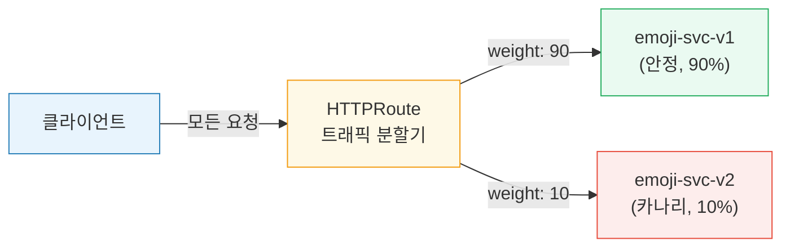
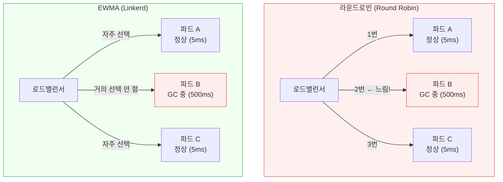
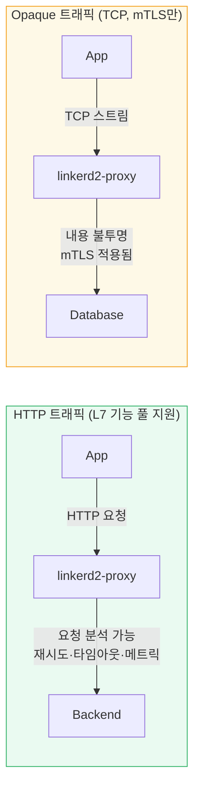

<!-- migrated: write/09_cloud/service-mesh/07-01.Linkerd 트래픽.md @2026-04-19 -->

# Ch07. Linkerd 트래픽 관리

> **핵심 요약**
>
> Linkerd의 트래픽 관리는 "단순함이 기본값이 되어야 한다"는 철학 위에 세워진다. 복잡한 설정 없이도 지능형 로드밸런싱과 자동 재시도가 동작하고, Gateway API 표준인 HTTPRoute로 카나리 배포·타임아웃·재시도 예산을 선언적으로 제어할 수 있다. 외부 트래픽은 어떤 Ingress Controller와도 조합할 수 있고, HTTP가 아닌 TCP 트래픽은 Opaque 모드로 mTLS 보호를 그대로 받는다.

---

## 🎯 학습 목표

1. Linkerd의 "단순함 우선" 철학이 Istio와 어떻게 다른지 설명할 수 있다
2. HTTPRoute로 카나리 배포(트래픽 분할)를 구성하는 YAML을 작성할 수 있다
3. 재시도 예산(Retry Budget) 개념과 기본값(20%)의 의미를 설명할 수 있다
4. EWMA 알고리즘이 라운드로빈보다 마이크로서비스에 유리한 이유를 설명할 수 있다
5. NGINX Ingress + Linkerd 조합 시 필요한 설정을 나열할 수 있다
6. Opaque 포트가 필요한 상황과 그 제약을 설명할 수 있다
7. Service Profile이 HTTPRoute로 대체되는 맥락을 이해한다

---

## 1. Linkerd의 철학: 단순함이 기본값이다

Istio를 처음 접한 사람은 VirtualService, DestinationRule, EnvoyFilter 등 수십 개의 CRD에 압도되는 경험을 한다. Linkerd는 다른 방향을 선택했다. "올바른 기본값이 존재한다면, 사용자는 기본값을 건드릴 이유가 없어야 한다"는 것이다.

이 철학은 세 가지 형태로 드러난다. 첫째, 사이드카 주입만 하면 mTLS·로드밸런싱·메트릭이 즉시 동작한다. 별도 설정 파일이 필요 없다. 둘째, 고급 기능(카나리 배포, 재시도 정책)은 표준 Kubernetes API인 Gateway API HTTPRoute로 추가한다. Linkerd 전용 CRD를 최소화하겠다는 의지다. 셋째, 문제 발생 시 디버깅이 쉬워야 한다. Linkerd의 데이터 플레인은 Rust로 작성된 경량 프록시(linkerd2-proxy)로 Envoy에 비해 훨씬 단순하다.

> 비유: Istio가 "모든 기능을 갖춘 항공기 조종석"이라면, Linkerd는 "안전 장치가 충분히 내장된 자동차"다. 일반 주행은 자동차가 훨씬 편하고, 예외적인 특수 임무에서만 항공기가 필요하다.

이 철학이 트래픽 관리에서 가장 잘 드러나는 영역이 로드밸런싱이다. 사용자가 설정하지 않아도 Linkerd는 EWMA 알고리즘으로 지연 시간 기반 스마트 로드밸런싱을 수행한다. 재시도도 마찬가지다. HTTPRoute에서 retry를 선언하면 Linkerd는 재시도 예산(Retry Budget)을 통해 자동으로 재시도 폭풍(retry storm)을 방지한다.

---

## 2. HTTPRoute 기반 트래픽 관리

### 2.1 Gateway API와 Linkerd

Linkerd 2.12부터 Kubernetes SIG-Network가 표준화한 Gateway API를 지원한다. 이는 Ingress API의 후계자로, HTTPRoute·GRPCRoute·TCPRoute 등으로 구성된다. Linkerd가 Gateway API를 채택한 이유는 특정 메시 구현에 종속되지 않는 이식 가능한 설정을 원하기 때문이다.

HTTPRoute는 `parentRefs`로 어떤 서비스에 적용할지 지정하고, `rules`로 매칭 조건과 백엔드를 정의한다. Linkerd는 이 HTTPRoute를 읽어서 트래픽 분할, 헤더 기반 라우팅, 타임아웃, 재시도를 적용한다.

### 2.2 트래픽 분할: 카나리 배포

카나리 배포는 새 버전에 일부 트래픽만 먼저 보내어 위험을 줄이는 기법이다. 예를 들어 90%의 요청은 안정 버전(v1)에, 10%는 새 버전(v2)에 보내다가 문제가 없으면 점진적으로 비율을 높인다.



```yaml
# HTTPRoute로 카나리 배포 구성
apiVersion: gateway.networking.k8s.io/v1beta1
kind: HTTPRoute
metadata:
  name: emoji-canary
  namespace: emojivoto
spec:
  parentRefs:
    - name: emoji-svc          # 원본 서비스에 연결
      kind: Service
      group: ""
      port: 8080
  rules:
    - backendRefs:
        - name: emoji-svc-v1   # 기존 안정 버전
          port: 8080
          weight: 90           # 90%의 트래픽
        - name: emoji-svc-v2   # 카나리 버전
          port: 8080
          weight: 10           # 10%의 트래픽
```

weight 합이 100일 필요는 없다. Linkerd는 비율로 계산한다. 즉 `weight: 9`와 `weight: 1`도 동일한 90/10 분할을 의미한다. 배포가 안정적으로 진행되면 weight를 조정해 점진적으로 v2 비율을 높이고, 최종적으로 v1을 제거한다.

### 2.3 재시도(Retries)와 재시도 예산

네트워크 요청은 일시적 오류로 실패할 수 있다. 그래서 재시도는 유용하지만, 무분별한 재시도는 시스템을 더 악화시킨다. 이미 과부하 상태인 서비스에 재시도가 쏟아지면 연쇄 장애(cascade failure)로 이어진다.

Linkerd는 **재시도 예산(Retry Budget)** 으로 이 문제를 해결한다. 재시도 예산은 "전체 요청 중 몇 퍼센트까지 재시도를 허용할 것인가"를 제한하는 개념이다. 기본값은 **20%** 다. 예를 들어 초당 100개의 요청이 들어오면 최대 20개의 재시도만 허용된다. 재시도가 예산을 소진하면 Linkerd는 즉시 실패를 반환한다.

```yaml
# HTTPRoute에 재시도 정책 설정
apiVersion: gateway.networking.k8s.io/v1beta1
kind: HTTPRoute
metadata:
  name: backend-retry
  namespace: myapp
spec:
  parentRefs:
    - name: backend-svc
      kind: Service
      group: ""
      port: 8080
  rules:
    - backendRefs:
        - name: backend-svc
          port: 8080
      filters:
        - type: ExtensionRef
          extensionRef:
            group: policy.linkerd.io
            kind: HTTPLocalRateLimitPolicy
      # Linkerd retry annotation (서비스 프로파일 또는 annotation 기반)
```

재시도는 **멱등(idempotent) 요청에만** 안전하다. GET이나 HEAD는 멱등이지만, POST는 같은 요청을 두 번 보내면 중복 처리가 발생할 수 있다. Linkerd는 기본적으로 GET/HEAD에만 자동 재시도를 적용하고, POST 재시도는 명시적으로 `isRetryable: true`를 설정해야 한다.

### 2.4 타임아웃

타임아웃 없는 분산 시스템은 느린 서비스 하나가 전체 서비스를 멈춰 세울 수 있다. Linkerd에서 타임아웃은 HTTPRoute의 `timeouts` 필드로 설정한다.

```yaml
apiVersion: gateway.networking.k8s.io/v1beta1
kind: HTTPRoute
metadata:
  name: backend-timeout
  namespace: myapp
spec:
  parentRefs:
    - name: backend-svc
      kind: Service
      group: ""
      port: 8080
  rules:
    - backendRefs:
        - name: backend-svc
          port: 8080
      timeouts:
        request: 10s           # 전체 요청 타임아웃 (재시도 포함)
        backendRequest: 2s     # 개별 백엔드 요청 타임아웃
```

`request`와 `backendRequest`의 차이를 이해하는 것이 중요하다. `backendRequest`는 단일 시도의 타임아웃이고, `request`는 재시도를 포함한 전체 타임아웃이다. 재시도 3번에 각 2초 타임아웃이라면, `request`는 최소 6초 이상이어야 한다.

---

## 3. EWMA 로드밸런싱: 왜 라운드로빈을 넘어서는가

### 3.1 라운드로빈의 한계

전통적인 라운드로빈은 단순하다. 요청 1번은 파드 A, 2번은 파드 B, 3번은 파드 C... 이렇게 순서대로 분배한다. 모든 파드의 처리 능력이 동일하다고 가정할 때는 잘 동작한다. 그러나 마이크로서비스 환경에서는 이 가정이 깨진다.

가비지 컬렉션이 동작 중인 JVM 파드는 일시적으로 느려진다. 캐시가 콜드 상태인 새로 시작된 파드는 처음 요청들을 느리게 처리한다. 같은 노드에서 다른 파드가 CPU를 많이 사용하면 해당 파드도 영향을 받는다. 라운드로빈은 이런 상황을 전혀 모른다.



### 3.2 EWMA 알고리즘

EWMA(Exponentially Weighted Moving Average, 지수 가중 이동 평균)는 각 엔드포인트의 응답 시간을 지속적으로 측정하고, 최근 데이터에 더 큰 가중치를 부여해 평균을 계산한다. "이동 평균"이기 때문에 과거보다 최근 측정값이 더 중요하다. GC 일시 중지가 끝나면 파드 B의 EWMA 지연 시간은 빠르게 회복되어 다시 트래픽을 받기 시작한다.

Linkerd는 여기에 **Peak EWMA** 변형을 사용한다. 최소값 대신 피크(최대값)를 사용해 최악의 시나리오에 더 보수적으로 반응한다. 느린 엔드포인트를 더 빠르게 회피하는 효과가 있다.

로드밸런서는 각 요청마다 현재 진행 중인 요청 수(in-flight requests)도 함께 고려한다. 지연 시간이 낮더라도 이미 많은 요청이 처리 중이라면 덜 선호한다. 이것이 **백프레셔(back-pressure)** 처리다. 실제로 P2C(Power of Two Choices) 알고리즘과 결합해, 무작위로 2개의 엔드포인트를 선택하고 그 중 EWMA 점수가 더 나은 것을 선택하는 방식으로 동작한다.

> 비유: EWMA 로드밸런싱은 마트 계산대를 고르는 것과 같다. 줄이 가장 짧은 계산대를 선택하되, 앞 사람의 장바구니가 넘치면(느린 엔드포인트) 그 줄을 피한다. 라운드로빈은 줄 길이를 보지 않고 순서대로 배정하는 것이다.

EWMA의 실질적 효과는 P99 지연 시간 감소로 나타난다. 라운드로빈은 느린 파드에 요청이 고르게 분배되므로 일부 요청이 필연적으로 늦어진다. EWMA는 느린 파드를 회피하므로 전체 시스템의 꼬리 지연 시간(tail latency)이 개선된다.

---

## 4. 서비스 프로파일: 레거시 트래픽 관리 방식

### 4.1 서비스 프로파일이란

HTTPRoute가 등장하기 전, Linkerd는 **ServiceProfile** CRD로 경로별 설정을 제공했다. ServiceProfile은 각 경로에 대한 재시도 설정과 메트릭 레이블을 지정할 수 있었다.

```yaml
# ServiceProfile 예시 (레거시)
apiVersion: linkerd.io/v1alpha2
kind: ServiceProfile
metadata:
  name: emoji-svc.emojivoto.svc.cluster.local
  namespace: emojivoto
spec:
  routes:
    - name: EmojiService.ListAll
      condition:
        method: GET
        pathRegex: /emojivoto.v1.EmojiService/ListAll
      isRetryable: true         # 이 경로는 재시도 허용
    - name: VotingService.VoteDoughnut
      condition:
        method: POST
        pathRegex: /emojivoto.v1.VotingService/Vote.*
      isRetryable: false        # POST는 재시도 금지
      timeout: 500ms
```

### 4.2 HTTPRoute로의 전환

ServiceProfile은 여전히 동작하지만, Linkerd 팀은 HTTPRoute를 권장하는 방향으로 전환하고 있다. 이유는 이식성이다. HTTPRoute는 Kubernetes 표준이므로, 향후 다른 메시로 전환해도 설정을 그대로 쓸 수 있다. ServiceProfile은 Linkerd 전용이라 종속성이 발생한다.

실무에서는 기존에 ServiceProfile을 사용하는 클러스터는 점진적으로 HTTPRoute로 마이그레이션하고, 신규 설정은 HTTPRoute를 사용하는 것을 권장한다. 두 방식은 공존할 수 있으므로 한 번에 전환할 필요는 없다.

---

## 5. Ingress 연동: 외부 트래픽을 메시로

### 5.1 Ingress와 Linkerd의 관계

Linkerd는 자체 Ingress Controller를 제공하지 않는다. 대신 어떤 Ingress Controller든 Linkerd 메시의 워크로드로 취급한다. 이 접근법의 강점은 이미 NGINX, Emissary, Envoy Gateway 등을 사용하는 팀이 Linkerd를 추가할 때 Ingress를 교체할 필요가 없다는 점이다.


핵심 원칙이 두 가지다. 첫째, Ingress Controller에서 백엔드 파드로의 연결은 **평문(cleartext)** 이어야 한다. Ingress Controller가 TLS를 직접 시작하면 Linkerd 프록시가 HTTP 헤더를 읽을 수 없어 요청별 로드밸런싱과 메트릭이 비활성화된다. mTLS는 Linkerd 프록시가 담당하므로 실제로는 암호화된다. 둘째, 백엔드에 **Service IP**로 라우팅해야 한다. Endpoint IP(파드 IP)로 직접 라우팅하면 Linkerd의 로드밸런싱을 우회한다.

### 5.2 NGINX Ingress + Linkerd

NGINX Ingress Controller는 기본적으로 Endpoint IP로 라우팅하므로 추가 설정이 필요하다.

```yaml
# 1. NGINX Ingress Controller에 Linkerd 사이드카 주입
apiVersion: apps/v1
kind: Deployment
metadata:
  name: nginx-ingress-controller
  namespace: ingress-nginx
  annotations:
    linkerd.io/inject: enabled  # 사이드카 주입

---
# 2. Ingress 리소스: Service IP 라우팅 활성화
apiVersion: networking.k8s.io/v1
kind: Ingress
metadata:
  name: my-app-ingress
  namespace: myapp
  annotations:
    # Service IP로 라우팅하도록 설정 (Endpoint IP 우회 비활성화)
    nginx.ingress.kubernetes.io/service-upstream: "true"
    # 클라이언트 IP가 필요한 경우에만 추가
    # config.linkerd.io/skip-inbound-ports: "80,443"
spec:
  rules:
    - host: myapp.example.com
      http:
        paths:
          - path: /
            pathType: Prefix
            backend:
              service:
                name: my-app-svc
                port:
                  number: 8080
```

`nginx.ingress.kubernetes.io/service-upstream: "true"`가 핵심이다. 이 어노테이션이 없으면 NGINX는 쿠버네티스 엔드포인트 슬라이스를 읽어 파드 IP로 직접 연결하고, Linkerd의 로드밸런싱이 작동하지 않는다.

### 5.3 Emissary(Ambassador) + Linkerd

Emissary는 기본적으로 Service IP로 라우팅하므로 별도 설정 없이 Linkerd와 잘 동작한다. 사이드카만 주입하면 된다.

```yaml
# Emissary 네임스페이스에 자동 주입 활성화
apiVersion: v1
kind: Namespace
metadata:
  name: ambassador
  annotations:
    linkerd.io/inject: enabled
```

### 5.4 Gateway API + Linkerd

Gateway API를 사용하면 Ingress와 Linkerd의 트래픽 관리를 일관된 API로 통합할 수 있다. Gateway 리소스가 진입점을 정의하고, HTTPRoute가 라우팅 규칙을 정의한다.

```yaml
# Gateway: 외부 트래픽 진입점
apiVersion: gateway.networking.k8s.io/v1
kind: Gateway
metadata:
  name: prod-gateway
  namespace: myapp
spec:
  gatewayClassName: nginx        # 사용할 Gateway 구현체
  listeners:
    - name: http
      port: 80
      protocol: HTTP

---
# HTTPRoute: 라우팅 규칙
apiVersion: gateway.networking.k8s.io/v1
kind: HTTPRoute
metadata:
  name: myapp-route
  namespace: myapp
spec:
  parentRefs:
    - name: prod-gateway
      namespace: myapp
  hostnames:
    - "myapp.example.com"
  rules:
    - matches:
        - path:
            type: PathPrefix
            value: /
      backendRefs:
        - name: my-app-svc
          port: 8080
          weight: 90
        - name: my-app-svc-v2
          port: 8080
          weight: 10             # 카나리 10%
```

Gateway API는 외부 트래픽 진입(Gateway)과 내부 트래픽 분배(HTTPRoute)를 단일 API 체계로 통합한다. Linkerd는 이 HTTPRoute를 읽어 트래픽 분할을 처리한다.

---

## 6. Opaque 트래픽: HTTP가 아닌 트래픽 처리

### 6.1 Opaque란 무엇인가

Linkerd는 기본적으로 HTTP/1.1과 HTTP/2 트래픽을 분석해 요청별 로드밸런싱, 재시도, 타임아웃을 적용한다. 그러나 모든 트래픽이 HTTP는 아니다. MySQL, PostgreSQL, Redis, Kafka 같은 데이터베이스 프로토콜은 HTTP가 아닌 바이너리 TCP 프로토콜이다.

Linkerd가 이런 TCP 트래픽을 만나면 "Opaque(불투명)" 모드로 처리한다. L7 기능(재시도, 타임아웃, 요청별 메트릭)은 동작하지 않지만, **mTLS는 그대로 적용**된다. 즉, 보안은 유지되지만 고급 트래픽 관리는 불가능하다.



### 6.2 Opaque 포트 설정

Linkerd는 포트 번호를 보고 프로토콜을 추론하려 하지만, 잘못된 추론이 발생할 수 있다. 이를 방지하려면 `config.linkerd.io/opaque-ports` 어노테이션으로 명시적으로 지정한다.

```yaml
# MySQL 파드를 opaque로 처리
apiVersion: apps/v1
kind: Deployment
metadata:
  name: mysql
  namespace: db
spec:
  template:
    metadata:
      annotations:
        config.linkerd.io/opaque-ports: "3306"   # MySQL 포트
    spec:
      containers:
        - name: mysql
          image: mysql:8.0
          ports:
            - containerPort: 3306

---
# Service에도 동일하게 적용 (클라이언트 측 프록시에서도 opaque 처리)
apiVersion: v1
kind: Service
metadata:
  name: mysql
  namespace: db
  annotations:
    config.linkerd.io/opaque-ports: "3306"
spec:
  selector:
    app: mysql
  ports:
    - port: 3306
      targetPort: 3306
```

Service에도 어노테이션을 추가하는 것이 중요하다. 클라이언트 측 프록시가 Service를 찾을 때 어노테이션을 확인하고, 해당 포트를 Opaque로 처리할지 결정하기 때문이다.

### 6.3 Linkerd가 기본으로 처리하는 Opaque 포트

Linkerd는 잘 알려진 비-HTTP 포트를 자동으로 Opaque로 처리한다. SMTP(25, 587), MySQL(3306), PostgreSQL(5432), Redis(6379), Elasticsearch(9200, 9300) 등이 여기에 해당한다. 이 포트들은 별도 설정 없이도 mTLS가 적용된다.

---

## 7. 면접 대비

**Q1. Linkerd의 EWMA 로드밸런싱이 라운드로빈보다 마이크로서비스에 유리한 이유는?**

라운드로빈은 모든 파드를 동등하게 취급하지만, 마이크로서비스 환경에서는 파드의 상태가 지속적으로 변한다. GC 일시 중지, 콜드 캐시, 리소스 경합 등으로 일부 파드가 일시적으로 느려진다. EWMA는 각 엔드포인트의 응답 시간을 지수 가중 이동 평균으로 추적하여 느린 파드를 자동으로 회피한다. 이를 통해 특히 P99 꼬리 지연 시간이 개선된다.

**Q2. 재시도 예산(Retry Budget) 20%의 의미는?**

초당 100개의 요청이 들어올 때 최대 20개(20%)의 추가 재시도만 허용한다는 의미다. 재시도가 예산을 소진하면 Linkerd는 즉시 실패를 반환한다. 이 제한이 없으면 재시도가 재시도를 낳는 "재시도 폭풍"이 발생해 이미 과부하 상태인 서비스를 더 악화시킬 수 있다. 재시도는 일시적 오류에 유용하지만, 시스템 장애 상황에서는 오히려 장애를 증폭시킨다.

**Q3. NGINX Ingress와 Linkerd를 함께 사용할 때 `service-upstream: "true"` 가 필요한 이유는?**

NGINX Ingress는 기본적으로 Kubernetes 엔드포인트 슬라이스를 읽어 파드 IP에 직접 연결(Endpoint IP 라우팅)한다. Linkerd가 로드밸런싱을 하려면 Service IP를 통해 요청이 전달되어야 한다. `nginx.ingress.kubernetes.io/service-upstream: "true"`는 NGINX가 파드 IP 대신 Service ClusterIP로 연결하도록 변경한다. 이후 Linkerd 프록시가 Service IP를 가로채어 EWMA 기반 로드밸런싱을 수행한다.

**Q4. Opaque 포트에서 어떤 기능이 동작하고 어떤 기능이 동작하지 않는가?**

동작하는 기능: mTLS(암호화), 연결 수준 메트릭, TCP 수준 로드밸런싱. 동작하지 않는 기능: 요청별 메트릭, 재시도, 타임아웃, 헤더 기반 라우팅, 트래픽 분할. Opaque 모드는 프로토콜을 알 수 없는 TCP 스트림을 다루므로 L7 기능은 불가능하지만, 연결 자체는 mTLS로 보호된다.

**Q5. ServiceProfile과 HTTPRoute의 차이는?**

ServiceProfile은 Linkerd 전용 CRD로, 경로별 재시도 설정과 메트릭 레이블을 제공한다. HTTPRoute는 Kubernetes SIG-Network가 표준화한 Gateway API의 일부로 이식 가능하다. 향후 다른 메시나 Ingress Controller로 전환해도 HTTPRoute 설정은 재사용 가능하지만, ServiceProfile은 Linkerd 의존성이 있다. Linkerd 팀은 신규 설정에 HTTPRoute를 권장한다.

---

## 체크리스트

- [ ] Linkerd의 "단순함 우선" 철학과 Istio와의 차이를 설명할 수 있는가
- [ ] HTTPRoute로 90/10 트래픽 분할 YAML을 작성할 수 있는가
- [ ] 재시도 예산 기본값(20%)의 의미와 왜 이 제한이 필요한지 설명할 수 있는가
- [ ] EWMA가 라운드로빈보다 꼬리 지연 시간을 줄이는 원리를 설명할 수 있는가
- [ ] NGINX Ingress + Linkerd 조합에서 `service-upstream: "true"` 가 필요한 이유를 아는가
- [ ] Opaque 포트 어노테이션을 Service와 Deployment 양쪽에 설정해야 하는 이유를 아는가
- [ ] ServiceProfile이 HTTPRoute로 대체되고 있는 맥락을 이해하는가

---

## 참고 자료

- Linkerd HTTPRoute Documentation: [linkerd.io/docs/features/http-routes](https://linkerd.io/docs/)
- Gateway API: [gateway-api.sigs.k8s.io](https://gateway-api.sigs.k8s.io/)
- EWMA 알고리즘 설명: [linkerd.io/blog/beyond-round-robin](https://linkerd.io/2016/03/16/beyond-round-robin-load-balancing-for-latency/)
- 레퍼런스 문서: `docs/03_CloudNative/04_Linkerd/Chapter_05_Ingress_and_Linkerd.md`
