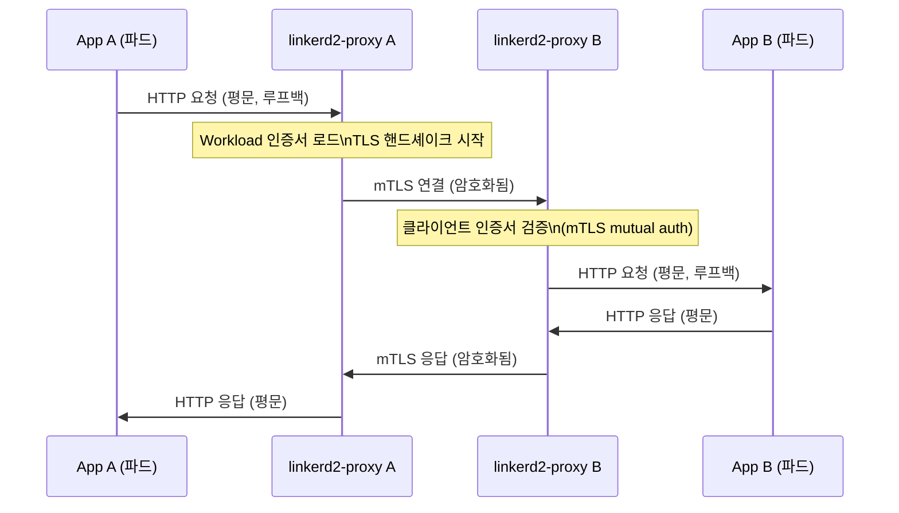
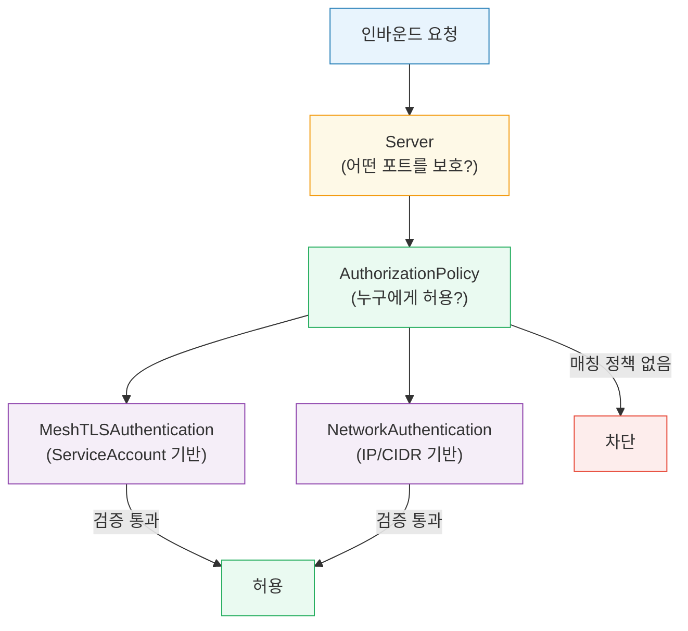
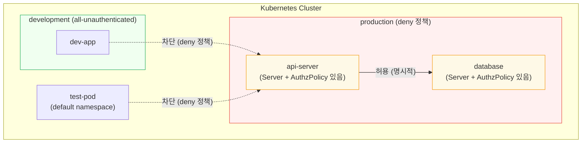
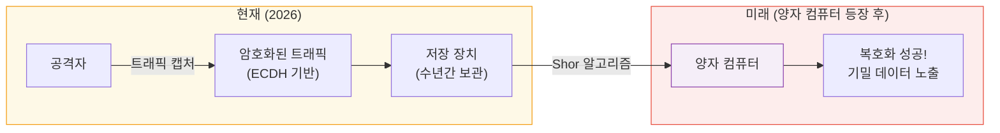
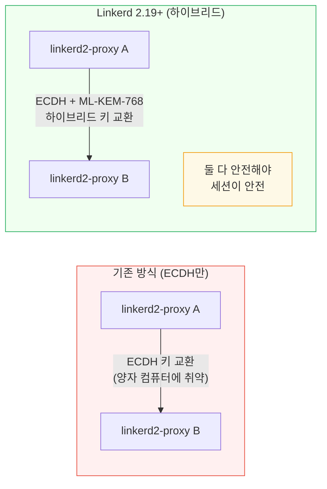
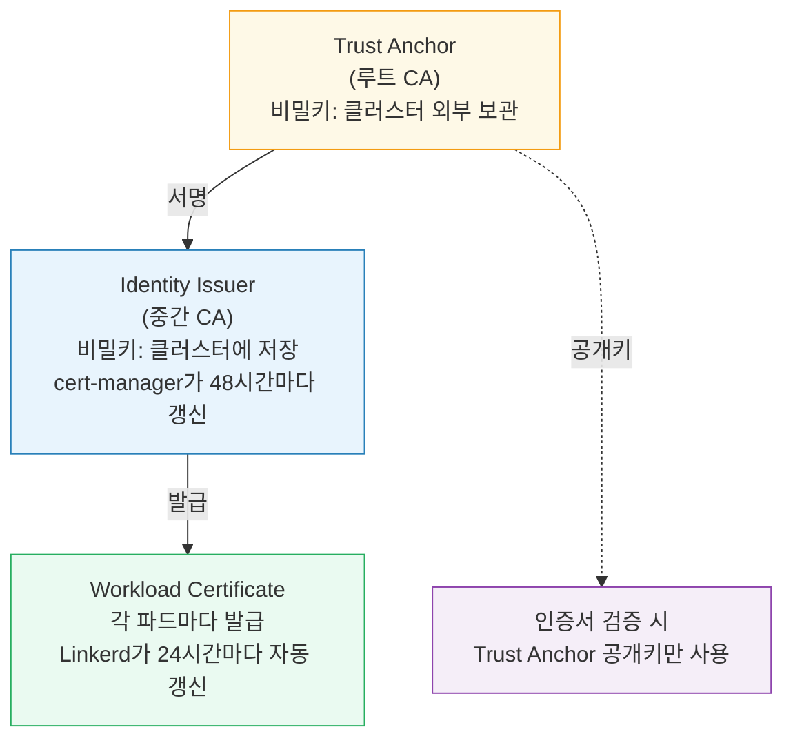

<!-- migrated: write/09_cloud/service-mesh/08-01.Linkerd 보안.md @2026-04-19 -->

# Ch08. Linkerd 보안과 정책

> **핵심 요약**
>
> Linkerd의 보안은 "설정하지 않아도 안전해야 한다"는 원칙에서 시작한다. 사이드카를 주입하는 순간 자동 mTLS가 활성화되어 모든 메시 내 통신이 암호화된다. 여기에 Server + AuthorizationPolicy를 추가하면 "누가 누구와 통신할 수 있는가"를 세밀하게 제어할 수 있다. 그리고 Linkerd 2.19부터는 양자 컴퓨터 공격에 대비한 후양자 암호화(Post-Quantum Cryptography)를 업계 최초로 서비스 메시에 도입했다.

---

## 🎯 학습 목표

1. Linkerd의 자동 mTLS가 설정 없이 동작하는 원리를 설명할 수 있다
2. `linkerd viz edges`로 mTLS 상태를 확인할 수 있다
3. Server 리소스를 정의하고 AuthorizationPolicy로 접근 제어를 구성할 수 있다
4. 5가지 기본 정책(default policy) 모드와 적절한 사용 시점을 선택할 수 있다
5. MeshTLSAuthentication과 NetworkAuthentication의 차이를 설명할 수 있다
6. "Harvest now, decrypt later" 공격 시나리오와 ML-KEM-768의 역할을 설명할 수 있다
7. 외부 워크로드(External Workload)를 메시에 편입하는 방법을 이해한다

---

## 1. 자동 mTLS: 설정 없이 시작되는 암호화

### 1.1 왜 자동 mTLS인가

마이크로서비스 보안의 현실은 가혹하다. 개발팀마다 TLS를 직접 구성하라고 하면, 일부는 자체 서명 인증서를 사용하고, 일부는 인증서 갱신을 잊어 서비스가 중단되고, 일부는 그냥 평문으로 통신한다. 보안 수준이 가장 약한 서비스가 전체 시스템의 취약점이 된다.

Linkerd는 이 문제를 인프라 계층에서 해결한다. 사이드카(linkerd2-proxy)를 주입하는 순간, 해당 파드의 모든 인바운드·아웃바운드 트래픽에 자동으로 mTLS가 적용된다. 애플리케이션 코드는 변경하지 않아도 된다. TLS 인증서 관리도 Linkerd가 담당한다.

> 비유: 자동 mTLS는 건물의 중앙 공조 시스템과 같다. 각 방에 별도 에어컨을 설치하는 대신, 건물 전체에 균일한 온도를 제공한다. 개별 방(서비스)은 에어컨 설치를 신경 쓸 필요가 없다.

### 1.2 자동 mTLS 동작 원리



핵심은 애플리케이션이 "자신이 mTLS를 사용한다"는 사실을 전혀 모른다는 점이다. 앱은 로컬 루프백(127.0.0.1)을 통해 프록시와 평문으로 통신하고, 프록시가 외부로 나가는 순간 mTLS 암호화를 적용한다. TLS 종료와 시작은 모두 프록시 계층에서 투명하게 처리된다.

### 1.3 mTLS 상태 확인

`linkerd viz edges` 명령으로 메시 내 연결의 mTLS 상태를 확인할 수 있다.

```bash
# 네임스페이스 내 모든 연결의 mTLS 상태 확인
linkerd viz edges -n emojivoto

# 출력 예시
SRC                      DST                      SRC_NS        DST_NS    SECURED
vote-bot                 web-svc                  emojivoto     emojivoto ✔
web-svc                  emoji-svc                emojivoto     emojivoto ✔
web-svc                  voting-svc               emojivoto     emojivoto ✔
prometheus               linkerd-proxy             linkerd-viz   emojivoto ✔

# 특정 배포의 연결 확인
linkerd viz edges -n emojivoto deploy/web
```

`✔` 표시는 mTLS가 적용된 연결이다. 비메시 워크로드에서 오는 연결은 `✘`로 표시된다. 이 명령은 보안 감사와 문제 진단에 모두 유용하다.

---

## 2. Server 리소스: 정책의 시작점

### 2.1 Server란 무엇인가

mTLS는 암호화를 보장하지만, 접근 제어는 별개다. "결제 서비스가 암호화된 연결로 데이터베이스에 접근한다"는 것은 좋은 일이다. 하지만 "어떤 서비스든 암호화된 연결로 데이터베이스에 접근할 수 있다"는 보안상 문제다. 이를 해결하는 것이 Server 리소스다.

Server는 "이 포드의 이 포트를 정책으로 보호한다"고 선언하는 리소스다. Server를 생성한 순간부터 해당 포트는 기본 정책을 무시하고, 명시적인 AuthorizationPolicy가 없는 모든 트래픽을 차단한다.

```yaml
# Server 리소스 예시
apiVersion: policy.linkerd.io/v1beta3
kind: Server
metadata:
  name: backend-http
  namespace: myapp
spec:
  podSelector:
    matchLabels:
      app: backend              # 어떤 파드에 적용할지
  port: 8080                    # 보호할 포트 (번호 또는 이름)
  proxyProtocol: HTTP/1.1       # 트래픽 프로토콜
```

`proxyProtocol`은 Linkerd가 해당 포트의 트래픽을 어떻게 처리할지 결정한다. `HTTP/1.1`, `HTTP/2`, `gRPC`는 L7 기능(재시도, 타임아웃, 경로별 정책)을 사용할 수 있고, `opaque`는 TCP 수준만 지원한다.

### 2.2 Server 생성 후 즉시 차단된다

이것이 가장 중요한 운영 주의사항이다. Server를 만들면 AuthorizationPolicy 없이는 아무도 접근할 수 없다. 프로덕션 환경에서 Server를 먼저 만들고 AuthorizationPolicy를 나중에 만들면 서비스 중단이 발생한다.

안전한 순서는 다음과 같다. 먼저 AuthorizationPolicy를 작성하고 검토한다. 그런 다음 Server와 AuthorizationPolicy를 동시에 또는 역순(AuthorizationPolicy 먼저)으로 적용한다. 이 순서를 지키면 트래픽이 끊기는 순간이 없다.

---

## 3. AuthorizationPolicy: 세밀한 접근 제어

### 3.1 AuthorizationPolicy 구조

AuthorizationPolicy는 Server(또는 HTTPRoute)와 인증 조건(MeshTLSAuthentication 또는 NetworkAuthentication)을 연결해 최종 접근 허용 규칙을 만든다.



### 3.2 MeshTLSAuthentication: 서비스 신원 기반 제어

MeshTLSAuthentication은 mTLS 인증서에 포함된 **서비스 신원(identity)** 을 기반으로 접근을 제어한다. Linkerd는 각 파드의 Kubernetes ServiceAccount를 암호학적으로 인증서에 바인딩한다. 인증서 이름 형식은 다음과 같다.

```
{serviceAccountName}.{namespace}.serviceaccount.identity.linkerd.{clusterDomain}
```

예를 들어, `emojivoto` 네임스페이스의 `web` ServiceAccount를 사용하는 파드의 인증서 이름은 다음과 같다.

```
web.emojivoto.serviceaccount.identity.linkerd.cluster.local
```

```yaml
# MeshTLSAuthentication: frontend만 허용
apiVersion: policy.linkerd.io/v1alpha1
kind: MeshTLSAuthentication
metadata:
  name: frontend-authn
  namespace: myapp
spec:
  identities:
    - "frontend.myapp.serviceaccount.identity.linkerd.cluster.local"
    # 와일드카드로 네임스페이스 전체 허용도 가능
    # - "*.myapp.serviceaccount.identity.linkerd.cluster.local"

---
# AuthorizationPolicy: frontend-authn을 backend-http Server에 연결
apiVersion: policy.linkerd.io/v1alpha1
kind: AuthorizationPolicy
metadata:
  name: allow-frontend-to-backend
  namespace: myapp
spec:
  targetRef:
    group: policy.linkerd.io
    kind: Server
    name: backend-http          # 위에서 만든 Server
  requiredAuthenticationRefs:
    - name: frontend-authn
      kind: MeshTLSAuthentication
      group: policy.linkerd.io
```

이 설정이 적용되면 `frontend` ServiceAccount를 사용하는 파드만 `backend`의 8080 포트에 접근할 수 있다. 다른 서비스는 mTLS 인증서가 있어도 차단된다.

### 3.3 NetworkAuthentication: IP 기반 제어

NetworkAuthentication은 소스 IP 또는 CIDR 범위를 기반으로 접근을 제어한다. mTLS가 없는 레거시 시스템이나 외부 서비스를 허용해야 할 때 사용한다.

```yaml
# NetworkAuthentication: 내부 네트워크 대역만 허용
apiVersion: policy.linkerd.io/v1alpha1
kind: NetworkAuthentication
metadata:
  name: internal-network-authn
  namespace: myapp
spec:
  networks:
    - cidr: 10.0.0.0/8          # 사내 내부 네트워크
    - cidr: 192.168.0.0/16      # 클러스터 파드 네트워크
```

그러나 IP 기반 인증은 mTLS보다 보안이 낮다. IP 주소는 스푸핑이 가능하고, 파드의 IP는 재시작할 때마다 바뀐다. NetworkAuthentication은 레거시 시스템과의 과도기 연동에만 사용하고, 가능한 한 MeshTLSAuthentication으로 전환해야 한다.

### 3.4 실전 예시: frontend → backend 전용 허용

"frontend 서비스만 backend에 접근할 수 있고, 다른 모든 서비스는 차단한다"를 구현한다.

```yaml
# Step 1: backend 포트를 Server로 보호
apiVersion: policy.linkerd.io/v1beta3
kind: Server
metadata:
  name: backend-http
  namespace: myapp
spec:
  podSelector:
    matchLabels:
      app: backend
  port: 8080
  proxyProtocol: HTTP/1.1

---
# Step 2: frontend의 mTLS 신원 정의
apiVersion: policy.linkerd.io/v1alpha1
kind: MeshTLSAuthentication
metadata:
  name: frontend-authn
  namespace: myapp
spec:
  identities:
    - "frontend.myapp.serviceaccount.identity.linkerd.cluster.local"

---
# Step 3: frontend에게만 backend 접근 허용
apiVersion: policy.linkerd.io/v1alpha1
kind: AuthorizationPolicy
metadata:
  name: allow-frontend-to-backend
  namespace: myapp
spec:
  targetRef:
    group: policy.linkerd.io
    kind: Server
    name: backend-http
  requiredAuthenticationRefs:
    - name: frontend-authn
      kind: MeshTLSAuthentication
      group: policy.linkerd.io
```

이 세 가지 리소스가 함께 작동해 Zero Trust 접근 제어를 구현한다. `linkerd diagnostics policy` 명령으로 정책이 올바르게 적용됐는지 확인할 수 있다.

```bash
# 정책 진단: backend-svc의 8080 포트에 어떤 정책이 적용되는지 확인
linkerd diagnostics policy -n myapp svc/backend-svc 8080
```

---

## 4. 정책 모드: 기본 동작 설정

### 4.1 5가지 기본 정책

Linkerd는 클러스터 또는 네임스페이스 수준에서 기본 정책을 설정한다. 명시적인 Server/AuthorizationPolicy가 없는 트래픽에 이 정책이 적용된다.

| 모드 | 메시 외부(미인증) | 메시 내부(mTLS) | 사용 시점 |
|------|-----------------|----------------|----------|
| `all-unauthenticated` | 허용 | 허용 | 기본값. 점진적 도입 시작 |
| `all-authenticated` | 차단 | 허용 | 외부 비메시 트래픽 차단 |
| `cluster-unauthenticated` | 클러스터 내부만 허용 | 허용 | 클러스터 외부 차단 |
| `cluster-authenticated` | 클러스터 내부만 허용 | 허용 | 클러스터 내부 mTLS 필수 |
| `deny` | 차단 | 차단 | Zero Trust. 모든 것 명시 필요 |

`all-unauthenticated`가 기본값인 이유는 Linkerd의 점진적 도입 원칙 때문이다. 기존 클러스터에 Linkerd를 도입할 때 처음부터 `deny`로 시작하면 기존 서비스가 모두 중단된다. `all-unauthenticated`로 시작해 메트릭과 mTLS를 먼저 확보한 후, 단계적으로 정책을 강화하는 것이 실용적이다.

### 4.2 정책 모드 설정

```yaml
# Helm values.yaml: 클러스터 전체 기본 정책 설정
proxy:
  defaultInboundPolicy: all-authenticated

---
# 네임스페이스별 오버라이드
apiVersion: v1
kind: Namespace
metadata:
  name: production
  annotations:
    config.linkerd.io/default-inbound-policy: deny  # 이 네임스페이스는 deny

---
# 특정 파드만 오버라이드
apiVersion: apps/v1
kind: Deployment
metadata:
  name: public-api
spec:
  template:
    metadata:
      annotations:
        config.linkerd.io/default-inbound-policy: all-unauthenticated  # 공개 API
```

정책은 계층적으로 적용된다. 파드 어노테이션 > 네임스페이스 어노테이션 > 클러스터 기본값 순으로 우선순위가 있다.

### 4.3 Default Deny 패턴

가장 강력한 보안은 `deny`를 기본값으로 설정하고 필요한 통신만 명시적으로 허용하는 Zero Trust 모델이다.



`deny` 모드로 전환하기 전에 반드시 모든 필요한 통신 경로에 Server와 AuthorizationPolicy를 설정해야 한다. `linkerd viz stat`으로 현재 트래픽 흐름을 파악하고, `linkerd diagnostics policy`로 정책이 올바른지 검증한 후 전환하는 것이 안전하다.

---

## 5. 후양자 암호화: 미래의 위협에 대비하다

### 5.1 양자 컴퓨터가 위협이 되는 이유

현재 TLS/mTLS는 ECDH(Elliptic Curve Diffie-Hellman)나 RSA 같은 알고리즘으로 키 교환을 한다. 이 알고리즘들의 보안은 "큰 수의 인수분해"나 "이산 로그 문제"가 현실적인 시간 내에 풀기 어렵다는 수학적 가정에 근거한다. 고전 컴퓨터로는 이 가정이 성립한다. 그러나 충분히 강력한 양자 컴퓨터는 Shor 알고리즘을 사용해 이 문제를 다항식 시간에 풀 수 있다. 즉, 현재의 암호화가 무력화된다.

### 5.2 "Harvest Now, Decrypt Later" 공격

양자 컴퓨터가 아직 충분히 강력하지 않더라도 지금 위협이 시작됐다. 공격자가 오늘 암호화된 트래픽을 저장해두었다가, 나중에 강력한 양자 컴퓨터가 등장했을 때 복호화하는 시나리오다. 이것이 "지금 수확하고 나중에 복호화한다(Harvest Now, Decrypt Later)"는 공격이다.



금융 기록, 의료 데이터, 국가 기밀처럼 수십 년간 기밀을 유지해야 하는 데이터가 특히 위험하다. 오늘 암호화된 데이터라도 양자 컴퓨터가 등장하는 날 노출될 수 있다.

### 5.3 ML-KEM-768: Linkerd의 후양자 대응

Linkerd 2.19는 서비스 메시 중 업계 최초로 **ML-KEM-768**(이전 이름: Kyber)을 키 교환에 도입했다. ML-KEM은 NIST(미국 국립표준기술원)가 2024년에 표준화한 격자(lattice) 기반 후양자 키 캡슐화 메커니즘이다. 격자 기반 암호는 양자 컴퓨터로도 효율적으로 풀기 어렵다는 것이 현재의 수학적 이해다.



"하이브리드" 방식을 사용하는 이유가 있다. ML-KEM 자체가 아직 검증 기간이 짧으므로, 혹시 취약점이 발견되더라도 기존 ECDH가 안전을 보장한다. 두 알고리즘 중 하나라도 안전하면 세션이 안전하다. 새 알고리즘으로 완전히 전환하는 것보다 보수적이고 안전한 접근이다.

Linkerd 2.19 이상을 사용하면 추가 설정 없이 자동으로 하이브리드 키 교환이 적용된다. "단순함이 기본값"이라는 철학이 후양자 암호화에도 동일하게 적용된 것이다.

---

## 6. 외부 워크로드: Kubernetes 밖의 서비스를 메시로

### 6.1 외부 워크로드의 필요성

실제 엔터프라이즈 환경에서는 모든 워크로드가 Kubernetes에 있지 않다. 레거시 VM, 베어메탈 서버, 관리형 데이터베이스 등이 Kubernetes 클러스터와 통신해야 한다. Linkerd의 외부 워크로드(External Workload) 기능은 이런 비-Kubernetes 서비스를 메시에 편입할 수 있게 한다.

```yaml
# ExternalWorkload 리소스: K8s 외부 워크로드를 메시에 등록
apiVersion: workload.linkerd.io/v1beta1
kind: ExternalWorkload
metadata:
  name: legacy-db-server
  namespace: myapp
spec:
  meshTLS:
    identity: "legacy-db.myapp.serviceaccount.identity.linkerd.cluster.local"
    serverName: "legacy-db.myapp.serviceaccount.identity.linkerd.cluster.local"
  ports:
    - name: postgres
      port: 5432
  workloadIPs:
    - ip: 192.168.10.50          # 외부 서버의 실제 IP
```

외부 워크로드에는 linkerd2-proxy를 직접 설치해야 한다. 이 프록시가 Linkerd Control Plane과 통신해 인증서를 발급받고, mTLS 연결을 처리한다. Kubernetes 파드처럼 사이드카가 자동 주입되지는 않으므로 수동 설치가 필요하다.

### 6.2 외부 워크로드의 정책 적용

외부 워크로드도 Server와 AuthorizationPolicy를 사용해 접근 제어를 설정할 수 있다. mTLS 인증서가 있으므로 MeshTLSAuthentication으로 신원 기반 제어가 가능하다.

---

## 7. 인증서 계층 복습: 보안의 기반

mTLS의 보안은 올바른 인증서 관리에 달려 있다. Linkerd는 세 단계 인증서 계층을 사용한다.



Trust Anchor의 비밀키를 클러스터에 저장하지 않는 이유가 중요하다. 클러스터가 침해되더라도 Trust Anchor 비밀키가 외부(Vault 등)에 있으면 공격자는 새로운 인증서를 발급할 수 없다. 인증서 계층의 신뢰가 유지된다.

---

## 8. 면접 대비

**Q1. Linkerd의 자동 mTLS가 애플리케이션 코드 변경 없이 동작하는 원리는?**

linkerd2-proxy가 파드의 모든 네트워크 트래픽을 투명하게 가로챈다. 애플리케이션은 로컬 루프백(127.0.0.1)을 통해 프록시와 평문으로 통신하고, 프록시가 실제 네트워크로 나가는 순간 mTLS를 적용한다. 반대 방향도 마찬가지로, 수신 측 프록시가 mTLS를 종료하고 애플리케이션에 평문으로 전달한다. 애플리케이션 관점에서는 평범한 HTTP 통신처럼 보인다.

**Q2. Server 리소스를 생성하면 왜 즉시 트래픽이 차단되는가?**

Linkerd의 정책 모델은 "기본값 허용"에서 "명시적 허용"으로 전환된다. Server가 없으면 기본 정책(보통 `all-unauthenticated`)이 적용되어 트래픽이 흐른다. Server를 생성하는 순간 해당 포트는 "이 포트는 정책으로 보호된다"고 선언하는 것이다. 이 선언과 동시에 "정책이 없으면 차단"이 적용된다. 따라서 AuthorizationPolicy가 없으면 아무도 접근할 수 없다.

**Q3. MeshTLSAuthentication과 NetworkAuthentication은 각각 언제 사용하는가?**

MeshTLSAuthentication은 메시에 포함된 워크로드 간 통신에 사용한다. Kubernetes ServiceAccount에 암호학적으로 바인딩된 mTLS 인증서로 신원을 확인하므로 IP 스푸핑 공격에 내성이 있다. NetworkAuthentication은 메시에 포함되지 않은 레거시 시스템이나 외부 서비스를 허용할 때 사용한다. 그러나 IP 기반이므로 보안이 낮고, 과도기에만 사용하는 것이 바람직하다.

**Q4. "Harvest Now, Decrypt Later" 공격이란 무엇이고, ML-KEM-768은 어떻게 이를 방어하는가?**

공격자가 오늘 암호화된 트래픽을 저장해두었다가, 미래에 강력한 양자 컴퓨터가 등장하면 Shor 알고리즘으로 복호화하는 공격이다. 현재의 ECDH 기반 키 교환은 양자 컴퓨터에 취약하다. ML-KEM-768은 격자(lattice) 기반 키 캡슐화 메커니즘으로, 양자 컴퓨터로도 효율적으로 풀기 어렵다. Linkerd 2.19는 ECDH와 ML-KEM-768을 결합한 하이브리드 방식을 사용해, 둘 중 하나라도 안전하면 세션이 안전하도록 설계했다.

**Q5. Linkerd의 기본 정책 `all-unauthenticated`와 `deny`의 차이는 무엇이고, 실무에서 어떻게 전환하는가?**

`all-unauthenticated`는 메시 내외부 모든 트래픽을 허용하는 가장 관대한 정책이다. `deny`는 모든 트래픽을 차단하고 명시적 AuthorizationPolicy가 있는 통신만 허용하는 Zero Trust 정책이다. 실무 전환 순서는 다음과 같다. `linkerd viz stat`으로 현재 트래픽 흐름을 파악한다. 각 통신 경로에 Server와 AuthorizationPolicy를 미리 작성한다. 스테이징 환경에서 검증 후 `linkerd diagnostics policy`로 확인한다. 프로덕션에 적용 시 네임스페이스 단위로 점진적으로 `deny`로 전환한다.

---

## 체크리스트

- [ ] `linkerd viz edges`로 mTLS 상태를 확인할 수 있는가
- [ ] Server 리소스 생성이 즉시 트래픽 차단을 유발하는 이유를 설명할 수 있는가
- [ ] frontend → backend 전용 허용 정책을 위한 3가지 리소스(Server, MeshTLSAuthentication, AuthorizationPolicy)를 작성할 수 있는가
- [ ] 5가지 기본 정책 모드와 각각의 사용 시점을 선택할 수 있는가
- [ ] "Harvest Now, Decrypt Later" 공격 시나리오를 설명할 수 있는가
- [ ] ML-KEM-768 하이브리드 방식이 왜 ECDH만 사용하는 것보다 안전한지 설명할 수 있는가
- [ ] Trust Anchor 비밀키를 클러스터 외부에 보관해야 하는 이유를 아는가

---

## 참고 자료

- Linkerd Security Features: [linkerd.io/docs/features/automatic-mtls](https://linkerd.io/docs/)
- Linkerd Policy Reference: [linkerd.io/reference/authorization-policy](https://linkerd.io/reference/authorization-policy/)
- NIST ML-KEM 표준 (FIPS 203): [csrc.nist.gov/pubs/fips/203/final](https://csrc.nist.gov/pubs/fips/203/final)
- Post-Quantum Linkerd 블로그: [buoyant.io/blog/post-quantum-linkerd](https://buoyant.io/blog/)
- 레퍼런스 문서: `docs/03_CloudNative/04_Linkerd/Chapter_07_mTLS_Linkerd_and_Certificates.md`
- 레퍼런스 문서: `docs/03_CloudNative/04_Linkerd/Chapter_08_Linkerd_Policy_Overview_and_Server_Based_Policy.md`
