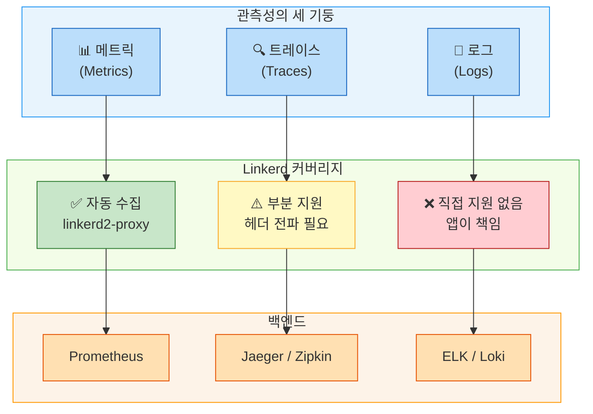
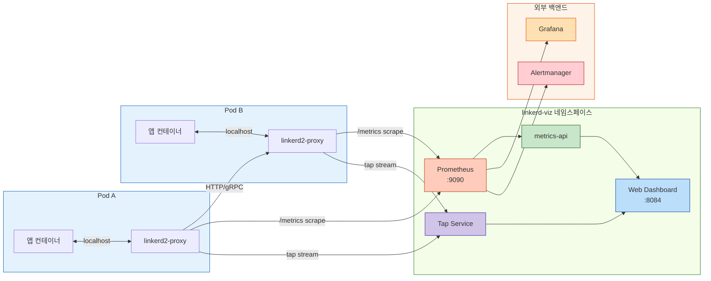
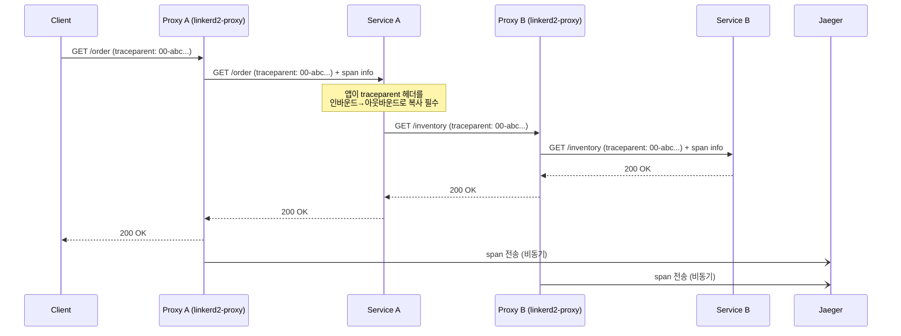
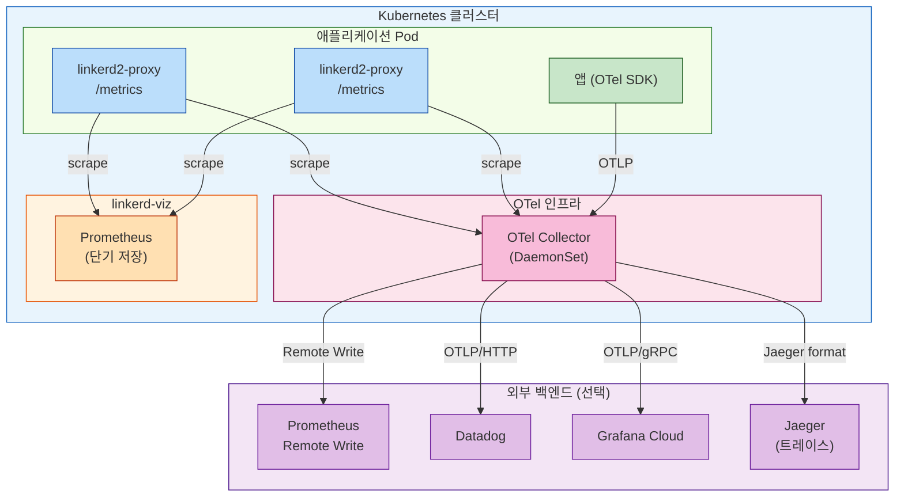

# Ch09. Linkerd 관측성

> **핵심 요약**
> 관측성(Observability)은 시스템 내부 상태를 외부 출력만으로 추론하는 능력이다. Linkerd는 애플리케이션 코드 수정 없이 프록시 수준에서 메트릭을 자동 수집한다. Rate·Error·Duration이라는 세 가지 황금 메트릭(RED Method)을 기반으로, 서비스 메시는 기존 모니터링이 풀지 못한 "서비스 간 통신"의 블랙박스를 투명하게 만든다.

---

## 🎯 학습 목표

1. 관측성의 세 기둥(메트릭, 트레이스, 로그)이 서비스 메시에서 어떻게 달라지는지 설명할 수 있다
2. RED Method(Rate, Error, Duration)의 각 항목이 무엇을 측정하는지, 왜 황금 메트릭인지 설명할 수 있다
3. Linkerd Viz 확장의 설치 방법과 구성 요소를 열거할 수 있다
4. `linkerd viz stat`, `top`, `tap`, `edges` 명령어의 차이와 용도를 구분할 수 있다
5. Linkerd가 분산 트레이싱을 직접 구현하지 않는 철학적 이유를 설명할 수 있다
6. OpenTelemetry를 통해 Linkerd 메트릭을 다양한 백엔드로 연동하는 구조를 도식화할 수 있다
7. SLO 기반 알림의 개념과 에러 버짓 소진 알림 설정 방법을 이해할 수 있다

---

## 1. 왜 서비스 메시 관측성인가

전통적인 모니터링은 애플리케이션이 스스로 메트릭을 노출하도록 설계되었다. Spring Actuator, Micrometer, Prometheus Java 클라이언트 등 수많은 라이브러리가 그 역할을 담당한다. 그러나 이 방식에는 구조적 한계가 있다. 서비스가 50개라면 50곳에 계측 코드를 심어야 하고, 언어가 다르면 라이브러리도 달라지며, 레거시 서비스에는 코드 수정 자체가 불가능할 수 있다.

서비스 메시는 이 문제를 다른 층위에서 해결한다. 모든 트래픽이 사이드카 프록시(linkerd2-proxy)를 통과하기 때문에, 프록시가 통신의 모든 특성을 측정할 수 있다. 애플리케이션은 자신이 관찰되고 있다는 사실조차 모른다. 마치 도로 위의 자동차들이 도로 곳곳에 설치된 교통량 센서를 의식하지 않고 달리는 것과 같다. 센서는 차에 아무것도 부착하지 않은 채로 속도, 밀도, 흐름을 측정한다.

이 접근법의 핵심 장점은 **일관성**이다. 언어나 프레임워크에 관계없이 동일한 메트릭 형식과 레이블이 수집된다. Java 서비스와 Go 서비스, Python 서비스의 지연시간을 동일한 기준으로 비교할 수 있다.

---

## 2. 관측성의 세 기둥과 서비스 메시의 커버리지

관측성을 논할 때 흔히 세 기둥(Three Pillars)을 이야기한다. 메트릭(Metrics), 트레이스(Traces), 로그(Logs)가 그것이다. 각 기둥이 서비스 메시에서 어떤 역할을 하는지 살펴보자.



**메트릭**은 Linkerd가 가장 잘 지원하는 영역이다. linkerd2-proxy가 모든 HTTP/gRPC 요청에 대해 요청 수, 성공/실패 여부, 응답 지연시간을 자동으로 기록한다. 애플리케이션 변경이 전혀 필요 없다.

**분산 트레이스**는 부분 지원이다. Linkerd는 서비스 토폴로지(어떤 서비스가 어떤 서비스를 호출하는지)를 파악할 수 있지만, 단일 요청이 여러 서비스를 거치는 전체 경로를 추적하는 완전한 분산 트레이싱은 별도 작업이 필요하다. 구체적으로, 애플리케이션이 `b3` 또는 `traceparent` 헤더를 인바운드에서 아웃바운드로 전파(propagate)해야 한다.

**로그**는 Linkerd의 관심 밖이다. 각 서비스가 구조화된 로그를 출력하고, 이를 Loki나 Elasticsearch로 수집하는 것은 애플리케이션과 운영팀의 책임이다. 이는 단일 책임 원칙의 실천이기도 하다.

---

## 3. RED Method: 황금 메트릭

구글의 SRE 핸드북과 Tom Wilkie가 제안한 RED Method는 서비스 상태를 파악하는 세 가지 핵심 질문을 담고 있다.

### 3.1 Rate (요청률)

Rate는 초당 처리되는 요청 수(Requests Per Second, RPS)다. 이 수치는 서비스의 현재 부하를 나타낸다. 갑자기 Rate가 0에 수렴한다면 서비스가 트래픽을 받지 못하는 것이고, 평소보다 10배 높다면 트래픽 급증이나 재시도 폭풍(retry storm)을 의심해볼 수 있다.

Linkerd에서 Rate는 `linkerd_request_total` 카운터로 수집된다. Prometheus의 `rate()` 함수로 분당 평균 요청률을 계산한다.

```promql
# 서비스별 초당 요청률
sum(rate(request_total{direction="inbound"}[1m])) by (deployment)
```

### 3.2 Error (오류율)

Error는 전체 요청 중 실패한 요청의 비율이다. HTTP에서는 5xx 응답이 오류로 분류된다. 4xx는 클라이언트 오류이므로 서비스 자체의 문제가 아닐 수 있어, 상황에 따라 분리해서 본다.

오류율 1%와 0.1%는 수치로는 큰 차이처럼 보이지 않지만, 하루 100만 건의 요청을 처리하는 서비스라면 각각 1만 건, 1천 건의 실패를 의미한다. SLO(서비스 수준 목표)를 99.9%로 정했다면 오류율 0.1%가 한계선이 된다.

```promql
# 서비스별 성공률 (1 - 오류율)
sum(rate(response_total{classification="success"}[1m])) by (deployment)
/
sum(rate(response_total[1m])) by (deployment)
```

### 3.3 Duration (지연시간)

Duration은 요청이 처리되는 데 걸리는 시간이다. 평균(mean)이 아닌 백분위수(percentile)로 봐야 한다. p50(중앙값), p95, p99가 표준적인 관찰 지점이다. 평균은 극단값에 민감하기 때문에 실제 사용자 경험을 왜곡할 수 있다.

p99가 p50보다 10배 이상 높다면, 소수의 요청이 극단적으로 느리게 처리되고 있다는 신호다. 이른바 "긴 꼬리 지연(long tail latency)" 문제다. Linkerd는 히스토그램(histogram) 형태로 응답 시간을 기록하므로, 어느 백분위수든 계산할 수 있다.

```promql
# p99 지연시간 (밀리초)
histogram_quantile(0.99,
  sum(rate(response_latency_ms_bucket[1m])) by (le, deployment)
)
```

---

## 4. Linkerd Viz 확장

Linkerd의 관측성 기능 대부분은 `viz`라는 확장 컴포넌트를 통해 제공된다. 코어 Linkerd는 프록시와 컨트롤 플레인만 포함하고, 시각화와 메트릭 저장소는 선택적으로 설치하는 설계다.

### 4.1 설치

```bash
# Viz 확장 설치 (Prometheus + 대시보드 포함)
linkerd viz install | kubectl apply -f -

# 설치 검증
linkerd viz check

# 대시보드 열기 (로컬 포트 포워딩)
linkerd viz dashboard
```

설치 후 `linkerd-viz` 네임스페이스에 다음 컴포넌트가 배포된다.

| 컴포넌트 | 역할 |
|---|---|
| `prometheus` | 메트릭 수집·저장소 (15일 보존) |
| `web` | 웹 대시보드 UI |
| `metrics-api` | Prometheus 쿼리를 REST로 추상화 |
| `tap` | 실시간 요청 스트림 백엔드 |
| `grafana` (선택) | 고급 대시보드 |

### 4.2 Viz 데이터 흐름



각 Pod의 프록시는 `/metrics` 엔드포인트를 HTTP로 노출하고, Prometheus가 주기적으로 스크래핑한다. Web 대시보드는 Prometheus를 직접 쿼리하지 않고 metrics-api를 통해 데이터를 받는다. 이는 대시보드가 특정 Prometheus 쿼리 구문에 종속되지 않도록 하는 설계다.

---

## 5. CLI 관측성 도구 네 가지

Linkerd Viz는 터미널에서 즉시 사용할 수 있는 네 가지 관측성 명령어를 제공한다. 각각의 용도가 명확하게 구분된다.

### 5.1 `linkerd viz stat` — 집계 메트릭 테이블

`stat`는 배포(Deployment), 데몬셋(DaemonSet), 네임스페이스 단위로 RED 메트릭을 표로 보여준다. 특정 시간 창의 평균값이므로, 현재 상태를 스냅샷으로 파악하기에 적합하다.

```bash
# emojivoto 네임스페이스의 모든 배포 메트릭
linkerd viz stat deploy -n emojivoto

# 출력 예시
NAME            MESHED   SUCCESS      RPS   LATENCY_P50   LATENCY_P95   LATENCY_P99   TCP_CONN
emoji           1/1      100.00%    2.0rps         1ms           2ms           3ms          4
vote-bot        1/1       97.73%    2.1rps         1ms           2ms           2ms          2
voting          1/1      100.00%    2.0rps         1ms           1ms           1ms          3
web             1/1       95.24%    2.1rps         4ms           7ms           8ms          6

# 특정 서비스로 향하는 트래픽만 보기 (--to 플래그)
linkerd viz stat deploy/web --to deploy/emoji -n emojivoto

# 특정 서비스에서 오는 트래픽만 보기 (--from 플래그)
linkerd viz stat deploy/voting --from deploy/web -n emojivoto
```

`--to`와 `--from` 플래그를 조합하면 특정 서비스 쌍 간의 통신만 골라서 볼 수 있다. 마이크로서비스 환경에서 장애 전파 경로를 추적할 때 유용하다.

### 5.2 `linkerd viz top` — 실시간 요청 스트림

`top`은 Unix의 `top` 명령어처럼 실시간으로 갱신되는 요청 목록을 보여준다. 어떤 경로(path)로 얼마나 많은 요청이 오는지, 각 요청의 성공/실패와 지연시간이 실시간으로 표시된다.

```bash
# 특정 배포로 들어오는 요청을 실시간 관찰
linkerd viz top deploy/web -n emojivoto

# 출력 예시 (계속 갱신됨)
(press q to quit)

Source                    Destination             Method      Path                       Count    Best   Worst    Last  Success      RPS
vote-bot.emojivoto        web.emojivoto:80        GET         /api/list                      2    1ms     2ms     2ms   100.00%   0.3rps
vote-bot.emojivoto        web.emojivoto:80        POST        /api/vote                      1    3ms     3ms     3ms    66.67%   0.2rps
```

성공률이 낮은 경로를 빠르게 찾아낼 수 있고, 특정 엔드포인트의 트래픽 패턴을 실시간으로 관찰하기에 적합하다.

### 5.3 `linkerd viz tap` — HTTP 요청/응답 내부 검사

`tap`은 서비스 메시의 tcpdump라고 할 수 있다. mTLS로 암호화된 트래픽이지만, 프록시 수준에서 복호화 후 검사하므로 요청 헤더, HTTP 메서드, 경로, 응답 코드까지 볼 수 있다. 단, 요청·응답 바디(body)는 보이지 않는다.

```bash
# web 배포로 들어오는 모든 요청 감청
linkerd viz tap deploy/web -n emojivoto

# 응답코드 필터링 (5xx만)
linkerd viz tap deploy/web -n emojivoto \
  --method GET \
  --path /api/vote \
  --scheme https

# 출력 예시
req id=0:1 proxy=in  src=10.0.0.2:52150 dst=10.0.0.3:8080 tls=true :method=GET :authority=web:80 :path=/api/list
rsp id=0:1 proxy=in  src=10.0.0.2:52150 dst=10.0.0.3:8080 tls=true :status=200 latency=1462µs
end id=0:1 proxy=in  src=10.0.0.2:52150 dst=10.0.0.3:8080 tls=true duration=93µs response-length=231B
```

`tap`은 강력한 도구지만 주의가 필요하다. 프로덕션 환경에서 모든 요청을 탭하면 프록시에 추가 부하가 걸린다. 특정 기간, 특정 경로에 한정해서 사용하는 것이 바람직하다.

### 5.4 `linkerd viz edges` — mTLS 연결 상태

`edges`는 서비스 간 mTLS 연결 현황을 보여준다. 어떤 서비스 쌍이 어떤 인증서 ID로 통신하는지, 암호화 여부를 한눈에 확인할 수 있다.

```bash
linkerd viz edges deploy -n emojivoto

# 출력 예시
SRC                    DST                    SRC_NS        DST_NS      SECURED
vote-bot               web                    emojivoto     emojivoto   √
web                    emoji                  emojivoto     emojivoto   √
web                    voting                 emojivoto     emojivoto   √
```

`SECURED` 열에 `√`가 표시되면 mTLS가 활성화된 상태다. `✗`는 평문 통신을 의미하는데, 이는 대개 대상 Pod가 메시에 포함되지 않았거나(un-meshed) 인증서에 문제가 있는 경우다.

---

## 6. Grafana 대시보드

Linkerd Viz에 포함된 Grafana(또는 별도 Grafana 인스턴스)는 미리 구성된 대시보드 세트를 제공한다.

| 대시보드 | 내용 |
|---|---|
| **Top Line** | 클러스터 전체 성공률, RPS, 지연시간 개요 |
| **Deployment** | 배포별 상세 RED 메트릭 |
| **Pod** | 개별 Pod 수준 메트릭 |
| **Route** | 경로별 메트릭 (ServiceProfile이 설정된 경우) |
| **Health** | Linkerd 컨트롤 플레인 컴포넌트 상태 |

커스텀 대시보드를 만들 때는 Linkerd가 Prometheus에 노출하는 메트릭 이름 규칙을 알아야 한다.

```
# 주요 메트릭 이름
request_total                          # 전체 요청 수 (카운터)
response_total                         # 전체 응답 수, classification 레이블 포함
response_latency_ms_bucket             # 지연시간 히스토그램
tcp_open_connections                   # 현재 열린 TCP 연결 수
tcp_read_bytes_total                   # 읽은 바이트 수
tcp_write_bytes_total                  # 쓴 바이트 수

# 공통 레이블
namespace, deployment, pod             # 소스/목적지 식별
direction                              # inbound | outbound
tls                                    # true | false | disabled
```

ServiceProfile을 정의하면 경로(route) 수준의 메트릭이 추가된다. 예를 들어 `/api/vote`와 `/api/list`를 별도로 모니터링할 수 있다. 이 기능은 특히 특정 엔드포인트가 SLA를 지키는지 검증할 때 유용하다.

---

## 7. 분산 트레이싱: Linkerd의 철학적 선택

Linkerd는 완전한 분산 트레이싱을 내장하지 않는다. 이는 기술적 한계가 아니라 철학적 선택이다. Linkerd 팀은 "프록시는 가능한 한 단순하고 가벼워야 한다"는 원칙을 고수한다. 분산 트레이싱 구현은 상당한 복잡성과 성능 오버헤드를 수반한다.

대신 Linkerd는 Jaeger, Zipkin, Tempo 같은 전문 분산 트레이싱 시스템과 통합하는 방식을 택했다.

### 7.1 헤더 전파의 역할

분산 트레이싱이 동작하려면, 하나의 요청이 여러 서비스를 거칠 때 "나는 같은 트랜잭션의 일부"라는 문맥 정보를 헤더에 실어 전달해야 한다. 이를 헤더 전파(header propagation)라고 한다.

```
# B3 헤더 형식 (Zipkin 계열)
x-b3-traceid: 80f198ee56343ba864fe8b2a57d3eff7
x-b3-parentspanid: 05e3ac9a4f6e3b90
x-b3-spanid: e457b5a2e4d86bd1
x-b3-sampled: 1

# W3C Trace Context 형식 (표준)
traceparent: 00-0af7651916cd43dd8448eb211c80319c-b7ad6b7169203331-01
```

Linkerd의 프록시는 이 헤더를 인식하고 자신의 스팬(span) 정보를 덧붙일 수 있지만, 애플리케이션이 인바운드 헤더를 아웃바운드 요청에 복사해야 한다는 조건이 있다. 프록시는 헤더를 만들거나 수정할 수 없기 때문이다.



### 7.2 OpenTelemetry와의 통합

OpenTelemetry(OTel)는 관측성 데이터(메트릭, 트레이스, 로그)의 수집·처리·내보내기를 표준화하는 CNCF 프로젝트다. Linkerd 메트릭을 OTel을 통해 원하는 백엔드로 전송하는 구조를 구성할 수 있다.



OTel Collector는 다양한 소스에서 데이터를 받아 여러 백엔드로 라우팅하는 게이트웨이 역할을 한다. 백엔드를 변경할 때 애플리케이션이나 프록시를 수정할 필요 없이 Collector 설정만 바꾸면 된다.

```yaml
# otel-collector-config.yaml (핵심 구조)
receivers:
  prometheus:
    config:
      scrape_configs:
        - job_name: 'linkerd-proxy'
          kubernetes_sd_configs:
            - role: pod
          relabel_configs:
            - source_labels: [__meta_kubernetes_pod_annotation_linkerd_io_inject]
              action: keep
              regex: enabled

processors:
  batch:
    timeout: 10s

exporters:
  prometheusremotewrite:
    endpoint: "https://prometheus-remote:9090/api/v1/write"
  otlp:
    endpoint: "jaeger-collector:4317"

service:
  pipelines:
    metrics:
      receivers: [prometheus]
      processors: [batch]
      exporters: [prometheusremotewrite]
    traces:
      receivers: [otlp]
      processors: [batch]
      exporters: [otlp]
```

---

## 8. 알림 패턴: SLO 기반 접근

전통적인 알림은 임계값(threshold) 기반이다. "CPU가 80%를 넘으면 알림"처럼 단순하고 직관적이지만, 노이즈가 많고 실제 사용자 영향과 연결이 약하다.

SLO(Service Level Objective) 기반 알림은 에러 버짓(error budget)의 소진 속도를 기준으로 삼는다. "이 속도로 실패가 계속되면 30일 SLO를 X일 안에 소진한다"는 논리로 알림을 발생시킨다.

### 8.1 에러 버짓 계산

SLO가 99.9%(일별 허용 다운타임 약 86.4초)라면, 에러 버짓은 0.1%다. 하루 100만 건의 요청에서 1,000건까지 실패를 허용한다는 뜻이다.

```promql
# 현재 에러율이 SLO 허용치의 몇 배인지 계산
# (번인(burn) 속도: 1.0 = SLO 정확히 소진 중, 2.0 = 2배 속도로 소진)
(
  sum(rate(response_total{classification!="success"}[1h]))
  /
  sum(rate(response_total[1h]))
) / 0.001  -- 0.1% SLO 기준
```

### 8.2 지연시간 저하 알림

p99 지연시간이 SLO 기준(예: 200ms)을 넘으면 알림을 발생시키는 규칙이다.

```yaml
# Prometheus alerting rule
groups:
  - name: linkerd-latency
    rules:
      - alert: HighP99Latency
        expr: |
          histogram_quantile(0.99,
            sum(rate(response_latency_ms_bucket{
              direction="inbound",
              deployment="payment-service"
            }[5m])) by (le)
          ) > 500
        for: 5m
        labels:
          severity: warning
        annotations:
          summary: "payment-service p99 지연시간 500ms 초과"
          description: "현재 p99: {{ $value }}ms"

      - alert: HighErrorRate
        expr: |
          (
            sum(rate(response_total{classification!="success", direction="inbound"}[5m]))
            /
            sum(rate(response_total{direction="inbound"}[5m]))
          ) > 0.05
        for: 2m
        labels:
          severity: critical
        annotations:
          summary: "오류율 5% 초과 (SLO 위반 임박)"
```

---

## 9. 프로덕션 관측성 스택

Linkerd만으로는 완전한 관측성 스택을 구성할 수 없다. 다음은 프로덕션에서 검증된 구성 패턴이다.

| 계층 | 도구 | 역할 |
|---|---|---|
| **메트릭 수집** | Linkerd Viz (Prometheus) | 프록시 수준 RED 메트릭 |
| **메트릭 장기 저장** | Thanos / Cortex | 수개월 보존, 고가용성 |
| **시각화** | Grafana | 대시보드, 탐색 |
| **트레이스** | Jaeger / Tempo | 분산 트레이싱 |
| **로그** | Loki / ELK | 구조화 로그 저장 |
| **데이터 파이프라인** | OTel Collector | 수집·변환·라우팅 |
| **알림** | Alertmanager + PagerDuty | SLO 위반 알림·에스컬레이션 |

Linkerd Viz에 포함된 Prometheus는 기본적으로 6시간 보존을 권장 설정으로 사용하고, 장기 저장은 외부 Prometheus나 Thanos로 위임하는 것이 일반적이다. Linkerd Viz 자체는 "단기 조회 전용"으로 운영하고, 장기 트렌드 분석은 별도 스택이 담당하는 구조다.

---

## 면접 대비

**Q1. Linkerd의 관측성이 기존 APM 도구와 다른 점은 무엇인가요?**

기존 APM(Application Performance Monitoring)은 애플리케이션 코드에 에이전트나 SDK를 삽입해 메트릭을 수집한다. Linkerd는 사이드카 프록시(linkerd2-proxy)가 모든 네트워크 트래픽을 처리하는 시점에 메트릭을 수집하므로, 애플리케이션 코드 수정이 전혀 필요 없다. 또한 언어나 프레임워크에 무관하게 동일한 메트릭 형식을 제공하므로 다언어 환경에서 일관성이 보장된다.

**Q2. RED Method의 세 지표를 설명하고, 각각 어떤 장애 시나리오에서 유용한가요?**

Rate(초당 요청 수)는 부하 변화를 감지한다. 갑자기 0이 되면 트래픽이 끊긴 것이고, 급격히 증가하면 재시도 폭풍이나 DDoS를 의심할 수 있다. Error(오류율)는 서비스의 정상성을 나타낸다. 5xx 비율이 SLO 기준을 넘으면 즉시 조치가 필요하다. Duration(지연시간)은 p99를 중심으로 보며, 평균이 정상이어도 p99가 치솟으면 일부 요청이 극단적으로 느린 상태다. 데이터베이스 락 경합이나 GC 중단 같은 문제가 p99에 먼저 나타난다.

**Q3. `linkerd viz tap`과 `linkerd viz top`의 차이는 무엇인가요? 언제 각각을 사용해야 하나요?**

`top`은 집계된 실시간 통계를 보여준다. 어떤 경로가 얼마나 많이 호출되는지, 성공률이 어떤지를 한 화면에서 볼 수 있어 문제 경로를 빠르게 특정할 때 적합하다. `tap`은 개별 요청을 실시간으로 스트리밍한다. 특정 요청의 헤더, 메서드, 경로, 응답 코드를 한 건씩 확인할 수 있어 재현 어려운 간헐적 오류 디버깅에 적합하다. 단, `tap`은 프록시 부하를 유발하므로 프로덕션에서는 짧은 시간, 특정 필터 조건을 걸어 사용해야 한다.

**Q4. Linkerd가 완전한 분산 트레이싱을 내장하지 않는 이유는 무엇인가요?**

Linkerd의 설계 철학은 "프록시는 가능한 한 단순하고 가벼워야 한다"는 것이다. 완전한 분산 트레이싱 구현은 복잡한 헤더 파싱, 스팬 생성, 외부 트레이싱 시스템과의 통신을 필요로 하며, 이는 프록시의 지연시간과 자원 소비를 증가시킨다. 대신 Linkerd는 표준 헤더(b3, traceparent)를 인식하고 전달하는 수준에서 지원하며, 완전한 트레이싱은 Jaeger/Zipkin/Tempo 같은 전문 시스템에 위임한다.

**Q5. SLO 기반 알림이 임계값 기반 알림보다 나은 이유를 설명해 보세요.**

임계값 기반 알림(예: CPU 80%)은 실제 사용자 영향과 직접적인 연관이 없어 노이즈가 많다. 새벽 3시에 트래픽이 거의 없는 상태에서 오류율 10%는 심각해 보이지만, 절대적인 실패 건수는 10건에 불과할 수 있다. 반면 SLO 기반 알림은 에러 버짓 소진 속도를 기준으로 삼는다. "현재 속도로 가면 30일 SLO를 2일 안에 소진한다"는 경보는 실제 비즈니스 영향과 직결된다. 또한 에러 버짓이 있으면 팀이 언제 신중하게 배포할지, 언제 신속하게 배포해도 되는지를 데이터 기반으로 판단할 수 있다.

---

## 체크리스트

- [ ] `linkerd viz install`로 Viz 확장 설치 및 `linkerd viz check`로 검증
- [ ] `linkerd viz dashboard`를 열어 서비스 토폴로지 확인
- [ ] `linkerd viz stat deploy -n <namespace>`로 RED 메트릭 확인
- [ ] `linkerd viz top deploy/<name>`로 실시간 요청 스트림 관찰
- [ ] `linkerd viz tap deploy/<name> --method GET`으로 특정 요청 감청
- [ ] `linkerd viz edges deploy`로 mTLS 연결 상태 확인
- [ ] Grafana에서 Linkerd Top Line 대시보드 접근
- [ ] ServiceProfile 정의 후 route 수준 메트릭이 수집되는지 확인
- [ ] Alertmanager에 HighErrorRate 알림 규칙 추가
- [ ] OTel Collector를 통해 Prometheus 메트릭을 외부 백엔드로 전송 테스트

---

## 참고 자료

- [Linkerd Viz 공식 문서](https://linkerd.io/2.15/reference/cli/viz/)
- [Linkerd 메트릭 레퍼런스](https://linkerd.io/2.15/reference/proxy-metrics/)
- [RED Method (Tom Wilkie)](https://grafana.com/blog/2018/08/02/the-red-method-how-to-instrument-your-services/)
- [Google SRE Book - Monitoring Distributed Systems](https://sre.google/sre-book/monitoring-distributed-systems/)
- [OpenTelemetry Collector 문서](https://opentelemetry.io/docs/collector/)
- [SLO 기반 알림 (Google)](https://sre.google/workbook/alerting-on-slos/)
- [Linkerd 분산 트레이싱 가이드](https://linkerd.io/2.15/tasks/distributed-tracing/)
