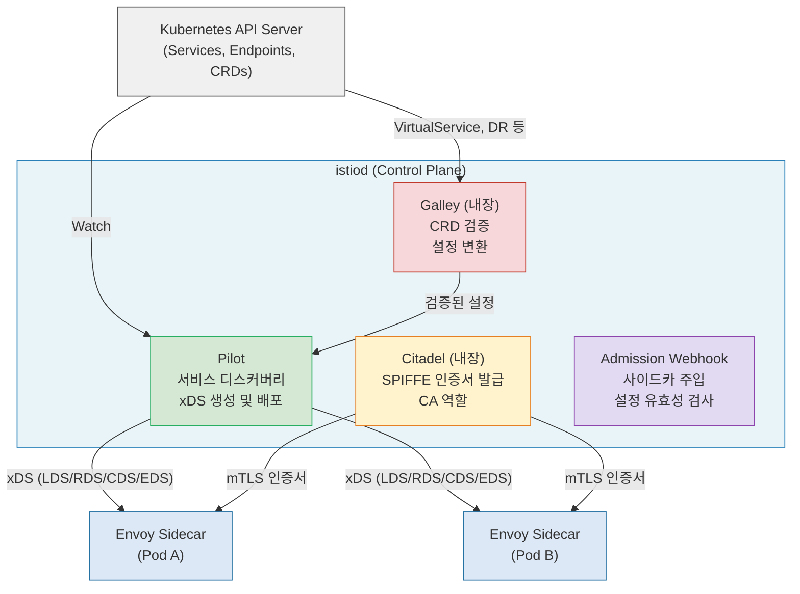
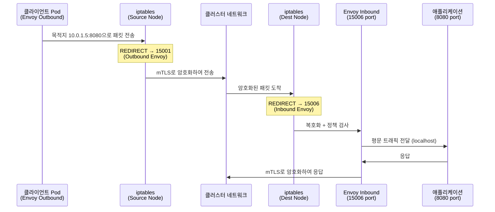
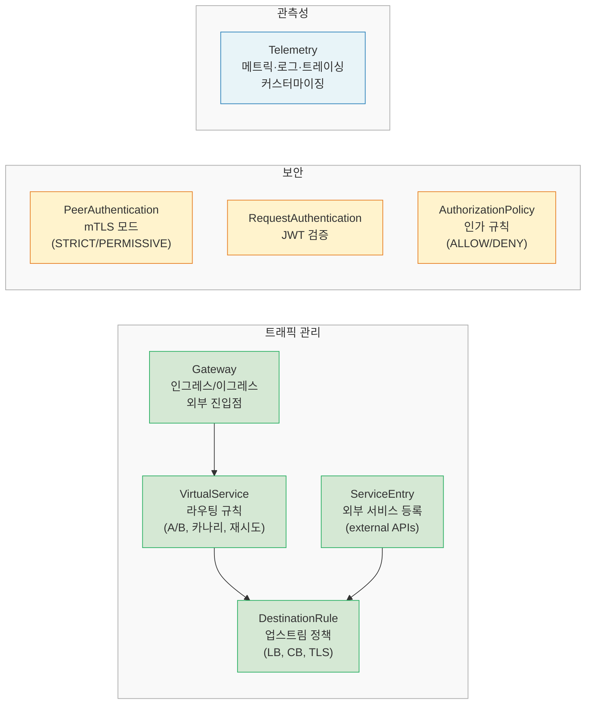

<!-- migrated: write/09_cloud/service-mesh/10-01.Istio 아키텍처.md @2026-04-19 -->

# Ch10. Istio 아키텍처 (v1.29)

> **핵심 요약**
> Istio는 "기능이 풍부한 서비스 메시"의 대표 주자다. Control plane은 istiod 단일 바이너리로 통합되어 있고, Data plane은 Envoy 사이드카가 담당한다. CRD 기반 선언형 설정 모델 덕분에 트래픽 제어·보안·관측성을 코드 변경 없이 적용할 수 있다. 2023년 CNCF 졸업은 엔터프라이즈 도입의 신뢰 기준점이 되었다.

---

## 🎯 학습 목표

1. Istio의 주요 버전별 진화 흐름(v1.0 → istiod → Ambient)을 설명할 수 있다
2. istiod 내부의 Pilot·Citadel·Galley 역할을 구분하고, xDS 프로토콜 흐름을 추적할 수 있다
3. Envoy 사이드카가 iptables를 통해 트래픽을 가로채는 원리를 그림으로 설명할 수 있다
4. 주요 CRD(VirtualService, DestinationRule, AuthorizationPolicy 등)의 용도를 구분할 수 있다
5. Istio와 Linkerd의 철학적 차이를 트레이드오프 관점에서 비교할 수 있다

---

## 1. Istio는 어떻게 탄생했나

Istio는 2017년 Google·IBM·Lyft가 공동 발표했다. Lyft는 이미 Envoy 프록시를 사내에서 운영하고 있었고, Google과 IBM은 Kubernetes 기반 마이크로서비스 플랫폼에 네트워크 정책을 코드 없이 주입할 방법을 찾고 있었다. 세 회사의 이해관계가 맞물리면서 Istio 프로젝트가 시작됐다.

### 1.1 버전별 진화: 단순화의 역사

**Istio v1.0 (2018)**: 최초 프로덕션 릴리스. Control plane이 네 개의 독립 컴포넌트로 분리되어 있었다.

- **Pilot**: 서비스 디스커버리, xDS 설정 생성·배포
- **Citadel**: 인증서 발급·갱신, mTLS 인증
- **Galley**: 설정 검증·변환·배포
- **Mixer**: 정책 체크와 텔레메트리 수집 (Envoy가 요청마다 Mixer를 호출)

Mixer는 치명적인 성능 병목이었다. 매 요청마다 동기 RPC를 Mixer에 보내야 했으므로 레이턴시가 증가하고 Mixer 자체가 단일 장애점이 됐다. 운영자들은 Mixer 튜닝에 상당한 시간을 쏟아야 했다.

**Istio v1.5 (2020) — istiod 통합**: Pilot·Citadel·Galley를 `istiod`라는 단일 바이너리로 병합했다. Mixer는 폐기됐고, 텔레메트리는 Envoy 내장 기능으로 이전됐다. 이 변화로 Control plane 운영 복잡도가 대폭 줄었다. 예를 들어 HA 설정 시 이전에는 네 개 Deployment를 각각 관리해야 했지만, v1.5부터는 istiod 하나만 신경 쓰면 된다.

**Istio v1.24 (2024) — Ambient Mesh GA**: 사이드카 없이 동작하는 Ambient 모드가 정식 출시됐다(Ch11에서 상세 다룸). 사이드카 모델의 리소스 오버헤드 문제를 근본적으로 해결하는 접근이다.

**Istio v1.29 (2025)**: Ambient 모드의 멀티클러스터 지원 강화, Gateway API 통합 성숙도 향상, Envoy 기반 waypoint 프록시 안정화가 주요 변화다.

### 1.2 CNCF 졸업 (2023): 왜 중요한가

2023년 CNCF(Cloud Native Computing Foundation) 졸업은 단순한 행정 절차가 아니다. Kubernetes(2018)·Prometheus(2018)·Envoy(2018) 등이 졸업한 경로를 Istio도 밟았다는 뜻이다. CNCF 졸업 기준에는 보안 감사 통과, 다양한 공급업체 기여, 거버넌스 문서화가 포함된다.

엔터프라이즈 관점에서 졸업 프로젝트는 "단일 벤더 종속 리스크 없음"을 의미한다. 실제로 CNCF 졸업 이후 금융·통신 분야 도입 사례가 증가했다. Red Hat(OpenShift Service Mesh), Google(Anthos Service Mesh), Tetrate(TSE) 등 상용 배포판이 Istio를 기반으로 구축된다는 점도 신뢰의 근거가 된다.

---

## 2. Control Plane — istiod 해부

istiod는 하나의 바이너리지만 내부에 세 가지 논리적 역할이 공존한다. 마치 스위스 아미 나이프처럼, 하나의 도구 안에 여러 기능이 담긴 구조다.



### 2.1 Pilot: 신경계

Pilot은 istiod의 핵심이다. Kubernetes API Server를 지속적으로 Watch하면서 Service·Endpoint·VirtualService·DestinationRule 등의 변화를 감지한다. 변화가 감지되면 이를 Envoy가 이해할 수 있는 **xDS 설정**으로 변환해 각 사이드카에 푸시한다.

xDS는 "x Discovery Service"의 약자로, Envoy의 동적 설정 프로토콜이다. 파일 기반 설정이 아니라 gRPC 스트림으로 실시간 업데이트를 주고받는다. 구체적으로 네 가지 API로 구성된다.

- **LDS (Listener Discovery Service)**: 어떤 포트에서 리스닝할지
- **RDS (Route Discovery Service)**: 어떤 URL을 어디로 라우팅할지
- **CDS (Cluster Discovery Service)**: 어떤 업스트림 서비스가 있는지
- **EDS (Endpoint Discovery Service)**: 각 서비스의 실제 IP:Port 목록

이 네 가지를 조합하면 Envoy는 "pod-a의 /api/orders 요청을 order-service의 살아있는 인스턴스 중 하나로 라우팅하라"는 동적 규칙을 파일 재시작 없이 적용할 수 있다.

### 2.2 Citadel: 신뢰의 뿌리

Citadel은 PKI(Public Key Infrastructure) 역할을 담당한다. 모든 워크로드에 **SPIFFE(Secure Production Identity Framework for Everyone)** 형식의 인증서를 발급한다.

SPIFFE ID는 `spiffe://cluster.local/ns/default/sa/productpage`처럼 생긴 URI다. 이 URI에는 클러스터·네임스페이스·서비스어카운트가 인코딩되어 있어, "이 인증서를 가진 서비스가 정확히 어떤 워크로드인지"를 암호학적으로 증명할 수 있다.

운영 시나리오를 하나 들어보자. `payment-service`가 `order-service`에 요청을 보낼 때, 두 Envoy는 mTLS 핸드셰이크를 한다. payment-service의 Envoy는 SPIFFE 인증서를 제시하고, order-service의 Envoy는 "이 인증서가 Istio CA가 서명한 것인가?"를 검증한다. 이 과정이 성공해야 연결이 수립된다.

### 2.3 Galley: 게이트키퍼

Galley는 Kubernetes Admission Webhook으로 동작하면서 CRD 설정이 istiod에 반영되기 전에 유효성을 검사한다. 예를 들어 VirtualService의 `host` 필드가 실제 존재하지 않는 서비스를 가리키거나, DestinationRule의 subset 이름이 VirtualService에서 참조한 이름과 다르면 Galley가 API Server 수준에서 거부한다.

이 검증이 없으면 잘못된 설정이 클러스터에 적용되고, 트래픽이 갑자기 블랙홀에 빠지는 상황이 발생한다. Galley는 그런 실수를 조기에 차단하는 역할이다.

### 2.4 Admission Webhook: 사이드카 주입의 마법

파드가 생성될 때 Kubernetes는 `MutatingAdmissionWebhook`을 호출한다. istiod는 이 Webhook을 구현해, 네임스페이스에 `istio-injection: enabled` 레이블이 있으면 파드 Spec에 두 개의 컨테이너를 자동으로 추가한다.

- `istio-init`: iptables 규칙을 설정하는 Init Container (트래픽을 Envoy로 리다이렉트)
- `istio-proxy`: Envoy 사이드카 본체

애플리케이션 개발자는 이 과정을 전혀 인식하지 못한다. Dockerfile에 아무것도 추가할 필요가 없다. Istio의 핵심 가치 중 하나인 "애플리케이션 투명성"이 이 Webhook 덕분에 구현된다.

---

## 3. Data Plane — Envoy 사이드카

Envoy는 Lyft가 C++로 작성한 고성능 L7 프록시다. Istio는 Envoy를 그대로 가져다 쓰되, istiod가 생성한 xDS 설정으로 동적 제어한다. Nginx나 HAProxy가 파일 기반 설정을 쓰는 것과 달리, Envoy는 파일 없이도 완전히 동작할 수 있다.

### 3.1 트래픽 가로채기: iptables의 역할

사이드카 방식의 핵심은 애플리케이션이 프록시의 존재를 모르는 상태에서 모든 트래픽이 프록시를 통과하게 만드는 것이다. 이를 위해 `istio-init` Init Container가 iptables 규칙을 설정한다.



인바운드 포트 15006, 아웃바운드 포트 15001, 관리 포트 15000이 Istio 사이드카의 고정 포트다. 애플리케이션은 localhost:8080에만 바인딩하면 되고, Envoy와의 통신은 Pod 내부 loopback에서 일어난다.

### 3.2 Envoy의 기능 범위

Envoy는 단순한 리버스 프록시가 아니다. 다음 프로토콜을 L7 수준에서 파싱할 수 있다.

- HTTP/1.1, HTTP/2, gRPC (헤더 기반 라우팅, 재시도, Circuit Breaker)
- TCP (L4 수준 mTLS, 연결 풀링)
- MongoDB, Redis (프로토콜 인식 기반 통계)
- WebSocket (업그레이드 처리)

이 다양한 프로토콜 지원 덕분에 Istio는 마이크로서비스가 어떤 통신 방식을 쓰든 동일한 관측성·보안 정책을 적용할 수 있다.

### 3.3 확장성: WASM과 ext_authz

Envoy의 기본 기능으로 부족할 때 확장하는 방법이 두 가지다.

**WASM (WebAssembly) 필터**: OPA 정책 평가, 커스텀 인증 로직, 요청 변환 등을 Envoy 프로세스 내부에서 실행한다. 추가 네트워크 홉 없이 동작하므로 레이턴시 영향이 작다. 단, WASM 모듈 배포·버전 관리가 추가 운영 부담이 된다.

**ext_authz (External Authorization)**: HTTP 요청을 외부 인가 서비스(OPA, Casbin 등)에 전달해 허용/거부 결정을 받는다. 인가 로직이 복잡하거나 중앙 집중식 정책 관리가 필요할 때 선택한다. 외부 RPC 비용이 있으므로 p99 레이턴시에 영향을 줄 수 있다.

### 3.4 리소스 오버헤드

각 Envoy 사이드카는 대략 다음의 리소스를 소비한다.

| 항목 | 기본값 | 비고 |
|------|--------|------|
| 메모리 | ~50MB | xDS 설정 규모에 따라 증가 |
| CPU | ~100m (idle 시) | 트래픽 증가에 비례 상승 |
| 시작 시간 | ~0.5초 | Init Container 포함 ~2초 |

서비스가 100개라면 Envoy 사이드카만으로 ~5GB 메모리가 추가 소비된다. 수천 개 파드를 운영하는 대규모 클러스터에서는 이 오버헤드가 비용 문제로 이어진다. Ambient Mesh가 등장한 배경이 바로 여기에 있다.

---

## 4. CRD 기반 설정 모델

Istio의 설정은 전부 Kubernetes CRD(Custom Resource Definition)로 표현된다. `kubectl apply -f` 한 번으로 클러스터 전체의 트래픽 정책, 보안 정책, 관측성 설정을 바꿀 수 있다. 이 선언형 모델이 GitOps와 궁합이 좋은 이유다.



### 4.1 트래픽 관리 CRD

**VirtualService**: "어디서 온 트래픽을 어디로 보낼 것인가"를 정의한다. 헤더 값에 따라 다른 버전으로 라우팅하거나, 특정 비율로 트래픽을 분할하거나, 인위적인 지연·오류를 주입할 수 있다.

```yaml
# 카나리 배포 예시: v2에 10% 트래픽
apiVersion: networking.istio.io/v1
kind: VirtualService
metadata:
  name: reviews
spec:
  hosts:
  - reviews
  http:
  - route:
    - destination:
        host: reviews
        subset: v1
      weight: 90
    - destination:
        host: reviews
        subset: v2
      weight: 10
```

**DestinationRule**: "선택된 업스트림에 어떻게 연결할 것인가"를 정의한다. 로드밸런싱 알고리즘(ROUND_ROBIN·LEAST_CONN·RANDOM), Circuit Breaker 임계값, TLS 설정, subset 정의가 여기에 속한다.

**Gateway**: Istio Ingress/Egress Gateway 파드에 적용되는 L4/L7 설정이다. 어떤 포트를 열고 어떤 TLS 인증서를 쓸지 결정한다. VirtualService가 Gateway를 참조해야 외부 트래픽이 내부로 들어올 수 있다.

**ServiceEntry**: Kubernetes 외부의 서비스(외부 API, 데이터베이스, 레거시 서버)를 Istio 레지스트리에 등록한다. 등록된 외부 서비스에도 VirtualService·DestinationRule을 적용할 수 있어, 외부 API 호출에도 Circuit Breaker와 재시도를 걸 수 있다.

### 4.2 보안 CRD

**PeerAuthentication**: Pod 간 mTLS 모드를 설정한다. `STRICT`는 mTLS만 허용하고, `PERMISSIVE`는 평문과 mTLS를 모두 허용한다. 마이그레이션 중에는 PERMISSIVE로 시작해서 모든 서비스가 사이드카를 달고 나면 STRICT로 전환하는 방식을 쓴다.

**RequestAuthentication**: JWT 토큰 검증 규칙을 정의한다. issuer, jwksUri를 지정하면 Envoy가 토큰 서명을 검증한다. 단, 이 CRD 단독으로는 토큰이 없는 요청을 막지 않는다. 차단은 AuthorizationPolicy가 담당한다.

**AuthorizationPolicy**: "누가 무엇을 할 수 있는가"를 L7 수준에서 정의한다. source(from), operation(to), condition(when) 세 축으로 규칙을 구성한다. 예를 들어 "payment-service 서비스어카운트만 order-service의 /api/pay에 POST할 수 있다"는 규칙을 표현할 수 있다.

### 4.3 관측성 CRD: Telemetry

Telemetry CRD는 메트릭·액세스 로그·분산 트레이싱의 수집 방식을 세밀하게 제어한다. 특정 네임스페이스는 고해상도 메트릭을 수집하고, 덜 중요한 네임스페이스는 샘플링 비율을 낮추는 식으로 관측성 비용을 조율할 수 있다.

---

## 5. Istio vs Linkerd: 철학의 차이

두 서비스 메시는 같은 문제를 다른 철학으로 푼다. 어느 쪽이 낫다기보다, 팀의 운영 역량과 요구사항에 따라 선택이 달라진다.

| 항목 | Istio | Linkerd |
|------|-------|---------|
| 프록시 | Envoy (C++) | linkerd2-proxy (Rust) |
| Control Plane | istiod (Go) | Linkerd Control Plane (Go) |
| 설정 CRD 수 | ~15개 | ~5개 |
| mTLS | 기본 옵션 (PERMISSIVE) | 기본 자동 (always-on) |
| 트래픽 관리 | 풍부 (헤더, 가중치, 결함 주입 등) | 기본 기능 중심 |
| 관측성 | 풍부 (Kiali, Jaeger, Prometheus 통합) | 내장 대시보드 |
| 학습 곡선 | 가파름 (CRD 조합 복잡) | 완만 (opinionated 설계) |
| 사이드카 메모리 | ~50MB/pod | ~10MB/pod |
| 확장성 | WASM·ext_authz·Lua | 제한적 |
| 엔터프라이즈 지원 | Red Hat, Google, Tetrate 등 | Buoyant (상용 지원) |
| 철학 | 기능 완전성 우선 | 단순성·안전성 우선 |

**Istio를 선택해야 할 때**: 복잡한 카나리 배포 전략, 다양한 인증 방식(JWT·mTLS 혼용), 정교한 Circuit Breaker 튜닝, WASM을 통한 커스텀 정책이 필요한 경우다. 금융·이커머스처럼 트래픽 제어 요구사항이 세밀한 도메인에 적합하다.

**Linkerd를 선택해야 할 때**: 팀이 작고 운영 복잡도를 낮추고 싶은 경우, 또는 mTLS와 기본 관측성만으로 충분한 경우다. SRE 인력이 부족한 스타트업에서 메시의 빠른 도입을 원할 때 Linkerd가 더 현실적인 선택이 된다.

---

## 6. 설치와 운영 기초

### 6.1 프로파일 기반 설치

Istio는 설치 프로파일로 기능 범위를 조절한다.

```bash
# minimal: Control plane만, 데모용
istioctl install --set profile=minimal

# default: 권장, Ingress Gateway 포함
istioctl install --set profile=default

# demo: 모든 기능 + 고관측성, 리소스 많이 사용
istioctl install --set profile=demo

# 설치 검증
istioctl verify-install
```

### 6.2 사이드카 주입 활성화

```bash
# 네임스페이스 단위 자동 주입
kubectl label namespace default istio-injection=enabled

# 파드 단위 수동 주입
kubectl annotate pod mypod sidecar.istio.io/inject="true"

# 주입 제외
kubectl annotate pod mypod sidecar.istio.io/inject="false"
```

### 6.3 상태 진단

```bash
# Envoy 설정 덤프 (xDS 수신 내용 확인)
istioctl proxy-config listeners <pod-name> -n <namespace>
istioctl proxy-config routes <pod-name> -n <namespace>
istioctl proxy-config clusters <pod-name> -n <namespace>

# Control plane 상태 분석
istioctl analyze

# mTLS 상태 확인
istioctl x describe pod <pod-name>
```

---

## 면접 대비

**Q1. Istio v1.5에서 Mixer를 제거한 이유는 무엇인가?**

Mixer는 Envoy가 요청마다 동기 RPC로 호출해야 했다. 이 구조에서 Mixer가 단일 장애점이자 성능 병목이 됐다. 텔레메트리는 Envoy 내장 통계로, 정책 체크는 Envoy 자체 필터(ext_authz·OPA)로 이전하면서 별도 컴포넌트가 불필요해졌다.

**Q2. xDS 프로토콜의 LDS·RDS·CDS·EDS가 각각 무엇을 담당하는가?**

LDS는 Envoy가 리스닝할 포트와 필터 체인, RDS는 HTTP 라우팅 규칙, CDS는 업스트림 서비스(cluster) 목록, EDS는 각 cluster의 실제 엔드포인트(IP:Port)를 담당한다. 네 API가 조합되어 Envoy의 전체 런타임 설정을 구성한다.

**Q3. SPIFFE 인증서에 인코딩되는 정보는 무엇이며, 왜 중요한가?**

`spiffe://cluster.local/ns/{namespace}/sa/{serviceaccount}` 형식으로 클러스터·네임스페이스·서비스어카운트가 담긴다. IP 기반 인증은 NAT·프록시 환경에서 신뢰할 수 없지만, SPIFFE 인증서는 암호학적으로 워크로드 신원을 증명하므로 Zero Trust 보안의 기반이 된다.

**Q4. VirtualService와 DestinationRule의 역할 분리 이유는 무엇인가?**

VirtualService는 "어떤 트래픽을 어디로"(라우팅 결정), DestinationRule은 "선택된 대상에 어떻게"(연결 방식)를 담당한다. 관심사 분리 원칙이다. 예를 들어 카나리 비율은 VirtualService에서만 바꾸고, Circuit Breaker 임계값은 DestinationRule에서만 조정할 수 있다.

**Q5. Istio가 애플리케이션 투명성을 달성하는 핵심 메커니즘은 무엇인가?**

두 가지가 결합된다. 첫째, MutatingAdmissionWebhook으로 파드 생성 시 자동으로 sidecar를 주입한다. 둘째, `istio-init` Init Container가 iptables 규칙으로 모든 인바운드(15006)/아웃바운드(15001) 트래픽을 Envoy로 리다이렉트한다. 애플리케이션은 localhost 소켓만 사용하면 되고, 프록시의 존재를 인식할 필요가 없다.

---

## 체크리스트

- [ ] Istio v1.0의 4개 컴포넌트를 열거하고 각 역할을 설명할 수 있다
- [ ] istiod가 v1.5에서 통합된 이유와 이점을 말할 수 있다
- [ ] xDS 4개 API(LDS/RDS/CDS/EDS)의 역할을 구분할 수 있다
- [ ] iptables를 통한 사이드카 트래픽 가로채기 흐름을 그림으로 그릴 수 있다
- [ ] PeerAuthentication STRICT vs PERMISSIVE 차이를 설명할 수 있다
- [ ] VirtualService와 DestinationRule을 조합해 카나리 배포를 설정할 수 있다
- [ ] AuthorizationPolicy로 서비스 간 접근 제어 규칙을 작성할 수 있다
- [ ] `istioctl proxy-config` 명령으로 Envoy xDS 수신 내용을 확인할 수 있다
- [ ] Istio와 Linkerd를 프로젝트 요구사항에 따라 선택 기준을 제시할 수 있다

---

## 9. 흔한 실수와 트러블슈팅

### 9.1 VirtualService와 DestinationRule의 subset 불일치

가장 자주 발생하는 설정 오류다. VirtualService에서 `subset: v2`를 참조하는데 DestinationRule에 `v2` subset이 정의되지 않으면, Envoy는 해당 트래픽을 드롭하고 503을 반환한다. 에러 메시지가 불명확해서 원인 파악이 늦어지는 경우가 많다.

```bash
# subset 불일치 탐지
istioctl analyze -n <namespace>
# "VirtualService references a subset that doesn't exist" 경고 출력
```

`istioctl analyze`는 CRD 간 참조 무결성을 검사해주므로, 설정 변경 후 반드시 실행하는 습관을 들여야 한다.

### 9.2 사이드카 주입이 안 되는 경우

파드에 사이드카가 주입되지 않는 원인은 세 가지다. 첫째, 네임스페이스에 `istio-injection=enabled` 레이블이 없는 경우다. 둘째, 파드에 `sidecar.istio.io/inject: "false"` 어노테이션이 명시된 경우다. 셋째, 파드가 `kube-system`이나 `kube-public` 같이 주입 제외 네임스페이스에 있는 경우다.

```bash
# 현재 주입 상태 확인
kubectl get pod <pod-name> -o jsonpath='{.spec.containers[*].name}'
# istio-proxy 가 있으면 주입됨

# 네임스페이스 레이블 확인
kubectl get namespace <ns> --show-labels
```

### 9.3 mTLS STRICT 전환 시 503 폭증

PERMISSIVE에서 STRICT로 전환할 때 일부 서비스가 503을 반환하는 상황이 생긴다. 원인은 사이드카가 없는 파드(헬스체크, Job, 레거시 서비스)가 평문으로 요청을 보내는 경우다. STRICT 모드는 평문 트래픽을 거부하므로 연결이 끊긴다.

전환 전에 `istioctl x describe pod`로 모든 파드의 mTLS 상태를 점검하고, 사이드카가 없는 파드를 먼저 정리한 뒤 STRICT로 전환하는 것이 안전하다.

### 9.4 Ingress Gateway와 VirtualService 연결 누락

외부 트래픽이 내부 서비스에 도달하지 못할 때 가장 먼저 확인해야 할 것은 Gateway와 VirtualService의 `gateways` 필드 연결 여부다. VirtualService에 `gateways: [my-gateway]`가 없으면 Gateway를 통해 들어온 트래픽이 라우팅 규칙을 찾지 못한다.

```bash
# Gateway 설정 확인
kubectl get gateway -n istio-system
istioctl proxy-config listeners <ingress-pod> -n istio-system
```

---

## 참고 자료

- [Istio 공식 문서 - Architecture](https://istio.io/latest/docs/ops/deployment/architecture/)
- [Istio 공식 문서 - xDS](https://www.envoyproxy.io/docs/envoy/latest/api-docs/xds_protocol)
- [CNCF Istio 졸업 발표 (2023)](https://www.cncf.io/announcements/2023/07/12/cloud-native-computing-foundation-celebrates-istio-graduation/)
- [SPIFFE 표준 명세](https://spiffe.io/docs/latest/spiffe-about/overview/)
- [Envoy 프록시 공식 문서](https://www.envoyproxy.io/docs/envoy/latest/)
- [Istio Release Notes 1.29](https://istio.io/latest/news/releases/1.29.x/)
