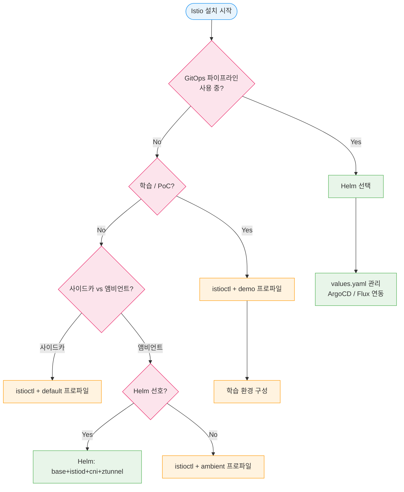
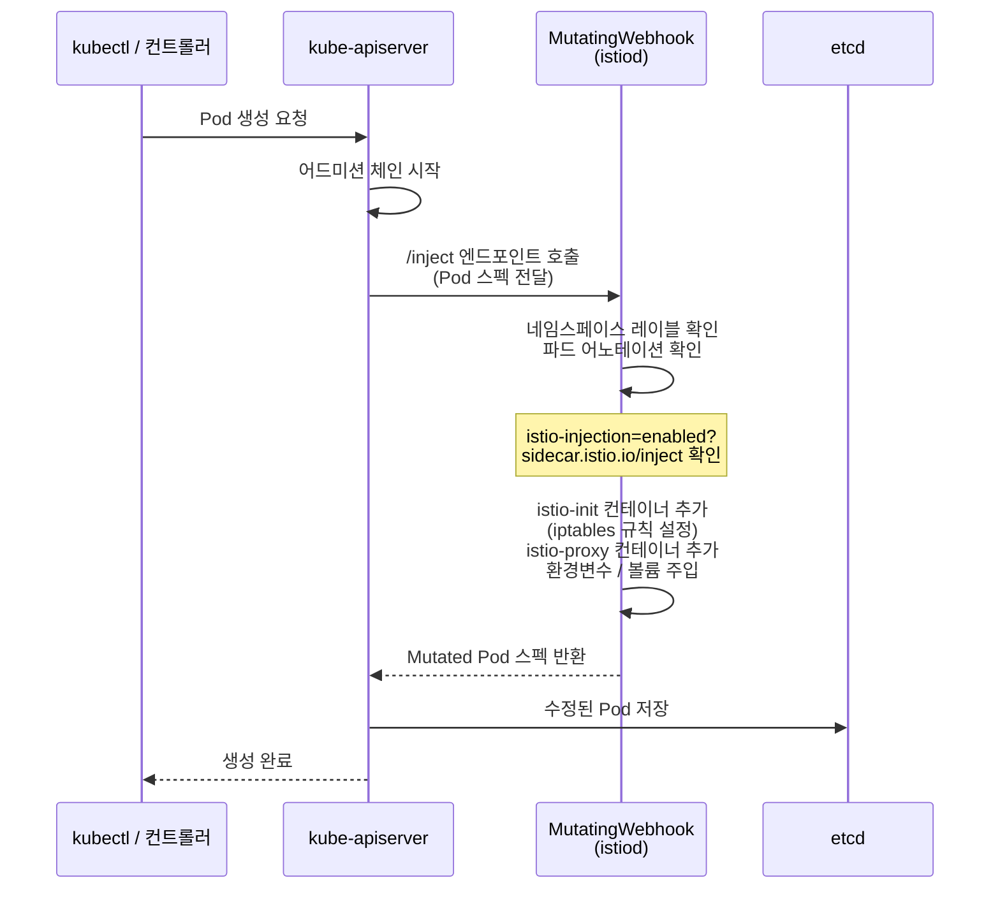

# Ch11. Istio 설치와 메시 구성

> 📌 **핵심 요약**: Istio 설치는 방법 선택부터 시작된다. istioctl, Helm, 그리고 (이제는 사용하지 말아야 할) IstioOperator 세 가지 경로가 있으며, 각각 적합한 상황이 다르다. 사이드카 모드와 앰비언트 모드의 인젝션 방식도 근본적으로 다르고, 프로덕션 업그레이드는 리비전 기반 카나리 전략으로 무중단 처리해야 한다.

---

## 🎯 학습 목표

1. istioctl, Helm 설치 방법의 차이와 각 방법이 적합한 상황을 설명할 수 있다
2. 설치 프로파일(minimal / default / demo / ambient)의 구성 요소 차이를 말할 수 있다
3. 앰비언트 모드 설치 절차와 네임스페이스 등록 방법을 실행할 수 있다
4. Mutating Webhook 기반 사이드카 인젝션 흐름을 그림으로 설명할 수 있다
5. 리비전 기반 카나리 업그레이드로 제어 플레인을 무중단 교체하는 절차를 이해한다
6. `istioctl analyze`로 설정 오류를 진단할 수 있다
7. 게이트웨이 배포 모델(공유 / 네임스페이스 / 자동화)의 트레이드오프를 비교할 수 있다

---

## 1. 설치 방법 비교

Istio를 클러스터에 올리는 방법은 크게 세 가지다. 어떤 방법을 선택하느냐는 팀의 운영 성숙도, GitOps 파이프라인 유무, 그리고 얼마나 빠르게 시작하고 싶은지에 따라 달라진다.

### 1-1. istioctl

`istioctl`은 Istio 공식 CLI 도구로, 가장 빠르게 클러스터에 Istio를 올릴 수 있는 방법이다. 단일 명령으로 프로파일 기반 설치가 가능하고, `istioctl analyze`와 같은 진단 도구도 함께 제공된다.

```bash
# 가장 빠른 시작: demo 프로파일 (학습/PoC용)
istioctl install --set profile=demo -y

# 프로덕션 기본값
istioctl install --set profile=default -y

# 특정 버전 지정
istioctl install --set profile=default \
  --set hub=gcr.io/istio-release \
  --set tag=1.21.0 -y
```

장점은 명령 한 줄로 설치가 끝나고, 사전 검증(`--dry-run`)이 내장되어 있다는 점이다. 단점은 GitOps 파이프라인에서 선언적으로 관리하기 어렵다는 것으로, IaC 철학을 따르는 팀에는 Helm이 더 적합하다.

### 1-2. Helm

Helm은 쿠버네티스 생태계의 표준 패키지 관리 도구다. Istio를 Helm으로 설치하면 GitOps 파이프라인(ArgoCD, Flux)과 자연스럽게 통합되고, values 파일로 설정을 선언적으로 관리할 수 있다.

설치는 세 단계로 이루어진다. 첫째로 CRD와 클러스터 수준 리소스를 담당하는 `istio-base`를 설치하고, 둘째로 제어 플레인인 `istiod`를 설치한 뒤, 선택적으로 `istio-cni`와 게이트웨이를 추가한다.

```bash
# 1단계: Helm 레포 추가
helm repo add istio https://istio-release.storage.googleapis.com/charts
helm repo update

# 2단계: CRD + 클러스터 수준 리소스
helm install istio-base istio/base \
  -n istio-system \
  --create-namespace \
  --set defaultRevision=default

# 3단계: 제어 플레인 (istiod)
helm install istiod istio/istiod \
  -n istio-system \
  --wait

# 4단계 (선택): 인그레스 게이트웨이
helm install istio-ingress istio/gateway \
  -n istio-ingress \
  --create-namespace

# 5단계 (앰비언트 모드 선택): CNI + ztunnel
helm install istio-cni istio/cni -n istio-system
helm install ztunnel istio/ztunnel -n istio-system
```

### 1-3. IstioOperator (사용 중단)

IstioOperator는 쿠버네티스 오퍼레이터 패턴으로 Istio를 관리하던 방식이다. Istio 1.23부터 deprecated 되었고 향후 버전에서 완전히 제거될 예정이므로, **새 배포에는 사용하지 않아야 한다.** 기존에 IstioOperator를 사용하고 있다면 Helm 기반으로 마이그레이션을 계획해야 한다.

### 1-4. 방법별 비교표

| 항목 | istioctl | Helm |
|------|----------|------|
| 시작 속도 | 빠름 (단일 명령) | 보통 (3단계) |
| GitOps 통합 | 어려움 | 자연스러움 |
| 버전 관리 | CLI 버전에 종속 | values 파일로 선언 |
| 설정 유연성 | `--set` 플래그 | values.yaml |
| 진단 도구 | `istioctl analyze` 내장 | 별도 설치 필요 |
| 프로덕션 추천 | PoC / 빠른 시작 | 프로덕션 |
| 멀티클러스터 | 지원 | 지원 |



---

## 2. 설치 프로파일

Istio는 프로파일(profile)이라는 개념으로 설치 구성 요소를 미리 묶어놓았다. 요리로 비유하면 정식 메뉴(demo), 기본 정식(default), 밥만 나오는 세트(minimal), 새로운 식단(ambient)처럼 목적에 따라 선택한다.

### 2-1. 프로파일별 구성 요소

| 구성 요소 | minimal | default | demo | ambient |
|-----------|---------|---------|------|---------|
| istiod | ✅ | ✅ | ✅ | ✅ |
| istio-ingress-gateway | ❌ | ✅ | ✅ | ❌ |
| istio-egress-gateway | ❌ | ❌ | ✅ | ❌ |
| ztunnel | ❌ | ❌ | ❌ | ✅ |
| istio-cni | ❌ | ❌ | ❌ | ✅ |

**minimal**: istiod만 설치한다. 제어 플레인만 필요하고 게이트웨이는 별도로 관리하고 싶을 때, 또는 멀티클러스터 환경에서 원격 클러스터용으로 적합하다.

**default**: istiod + 인그레스 게이트웨이를 포함한다. 프로덕션 사이드카 메시의 출발점으로, 공식적으로 프로덕션 추천 프로파일이다.

**demo**: 모든 구성 요소를 포함하고 리소스 제한도 느슨하다. 기능을 빠르게 탐색하거나 튜토리얼을 따라하기에 좋다. 프로덕션에 demo 프로파일을 그대로 사용하면 egress 게이트웨이가 불필요하게 실행되고 리소스 설정이 과도하게 허용적이므로 주의해야 한다.

**ambient**: 사이드카 없이 ztunnel(레이어 4)과 웨이포인트(레이어 7, 선택)로 메시를 구성하는 새 아키텍처다. CNI 플러그인이 필수이고 사이드카 인젝션이 없으므로 기존 앱 파드를 재시작하지 않아도 메시에 참여할 수 있다.

---

## 3. 앰비언트 모드 설치

앰비언트 모드는 사이드카를 파드에 주입하는 대신, 노드 레벨의 ztunnel이 레이어 4 트래픽을 처리하고, 선택적으로 네임스페이스 수준의 웨이포인트가 레이어 7 정책을 담당한다. 아파트 건물에 비유하면 각 세대(파드)에 경비원(사이드카)을 두는 게 아니라, 건물 로비(노드)에 공통 경비 시스템(ztunnel)을 두는 방식이다.

### 3-1. istioctl로 앰비언트 설치

```bash
# 앰비언트 프로파일로 설치
istioctl install --set profile=ambient -y

# 설치 검증
kubectl get pods -n istio-system
# istiod, istio-cni-node(DaemonSet), ztunnel(DaemonSet) 확인
```

### 3-2. Helm으로 앰비언트 설치

```bash
# base → istiod → cni → ztunnel 순서 중요
helm install istio-base istio/base -n istio-system --create-namespace
helm install istiod istio/istiod -n istio-system --wait
helm install istio-cni istio/cni -n istio-system --wait
helm install ztunnel istio/ztunnel -n istio-system --wait
```

### 3-3. 네임스페이스 등록

앱 파드를 앰비언트 메시에 참여시키려면 네임스페이스에 레이블을 붙이면 된다. 파드 재시작이 필요 없다는 점이 사이드카 모드와 가장 큰 차이다.

```bash
# 네임스페이스를 앰비언트 모드로 등록
kubectl label namespace default istio.io/dataplane-mode=ambient

# 등록 후 ztunnel이 해당 네임스페이스 파드의 트래픽을 자동 처리
kubectl get namespace default --show-labels
```

### 3-4. 웨이포인트 배포 (레이어 7 정책)

레이어 7 기능(HTTP 라우팅, 헤더 기반 정책, JWT 검증 등)이 필요하면 웨이포인트 프록시를 네임스페이스에 배포한다.

```bash
# 네임스페이스용 웨이포인트 생성
istioctl waypoint apply --namespace default

# 웨이포인트 상태 확인
istioctl waypoint status --namespace default
kubectl get gateway -n default

# 서비스 계정 수준 웨이포인트 (더 세밀한 제어)
istioctl waypoint apply --namespace default \
  --name reviews-waypoint \
  --for service-account reviews
```

---

## 4. 사이드카 인젝션

사이드카 모드에서는 파드가 생성될 때 Istio가 `istio-init` 초기화 컨테이너와 `istio-proxy` 사이드카 컨테이너를 자동으로 추가한다. 이 과정은 쿠버네티스의 Mutating Webhook을 통해 투명하게 이루어진다.

### 4-1. 네임스페이스 수준 인젝션

```bash
# 네임스페이스 전체에 자동 인젝션 활성화
kubectl label namespace default istio-injection=enabled

# 비활성화
kubectl label namespace default istio-injection=disabled --overwrite

# 현재 상태 확인
kubectl get namespace default --show-labels
```

### 4-2. 파드 수준 인젝션

네임스페이스 기본값과 반대로 설정하고 싶을 때 파드 어노테이션을 사용한다.

```yaml
apiVersion: v1
kind: Pod
metadata:
  name: myapp
  annotations:
    # 네임스페이스가 disabled여도 이 파드에는 인젝션
    sidecar.istio.io/inject: "true"
spec:
  containers:
  - name: myapp
    image: myapp:latest
---
apiVersion: v1
kind: Pod
metadata:
  name: job-runner
  annotations:
    # 네임스페이스가 enabled여도 이 파드는 인젝션 제외
    sidecar.istio.io/inject: "false"
spec:
  containers:
  - name: job
    image: job:latest
```

### 4-3. Mutating Webhook 인젝션 흐름



`istio-init` 컨테이너는 파드 시작 시 iptables 규칙을 설정해 모든 인바운드/아웃바운드 트래픽을 `istio-proxy`(Envoy)로 리다이렉트한다. 이 과정은 애플리케이션 코드를 전혀 수정하지 않고 투명하게 이루어진다는 것이 핵심이다.

```bash
# 인젝션 결과 확인
kubectl describe pod myapp | grep -A5 "Init Containers"
kubectl describe pod myapp | grep "istio-proxy"

# 수동 인젝션 (Dry-run으로 결과 미리보기)
kubectl get deployment myapp -o yaml | istioctl kube-inject -f - | less
```

---

## 5. 리비전 기반 카나리 업그레이드

Istio 제어 플레인을 업그레이드할 때 가장 큰 위험은 업그레이드 중 서비스 중단이다. 리비전(revision) 기반 카나리 업그레이드는 새 버전의 istiod를 기존 버전과 **나란히** 실행하고, 네임스페이스를 점진적으로 이동하는 방식으로 이 위험을 제거한다.

비유하자면 고속도로의 차선 변경과 같다. 차를 멈추고 타이어를 갈지 않고, 새 차선(새 istiod)을 먼저 열고 차량(네임스페이스)을 하나씩 옮긴 뒤, 구 차선(구 istiod)을 폐쇄한다.

### 5-1. 업그레이드 절차

```bash
# 1단계: 현재 리비전 확인
istioctl version
kubectl get pods -n istio-system

# 2단계: 새 리비전으로 istiod 설치 (기존과 공존)
istioctl install --revision=1-21 --set profile=default -y
# 이제 istiod-1-21이 istio-system에 추가됨

# 3단계: 기존 리비전 확인
kubectl get pods -n istio-system
# istiod (기존), istiod-1-21 (신규) 둘 다 실행 중

# 4단계: 일부 네임스페이스를 새 리비전으로 이동 (카나리)
kubectl label namespace default \
  istio-injection- \
  istio.io/rev=1-21 \
  --overwrite
# 기존 레이블 제거, 새 리비전 레이블 추가

# 5단계: 해당 네임스페이스 파드 롤링 재시작
kubectl rollout restart deployment -n default
# 파드가 재시작되며 새 istiod-1-21에서 인젝션됨

# 6단계: 트래픽 / 에러 모니터링 (Prometheus, Kiali)
# 문제 없으면 다음 네임스페이스로 진행

# 7단계: 모든 네임스페이스 이동 완료 후 구 istiod 제거
istioctl uninstall --revision=default -y
```

### 5-2. 롤백

문제 발생 시 네임스페이스 레이블을 원래대로 되돌리고 파드를 재시작하면 된다.

```bash
# 롤백: 기존 리비전으로 복귀
kubectl label namespace default \
  istio.io/rev- \
  istio-injection=enabled \
  --overwrite
kubectl rollout restart deployment -n default
```

### 5-3. 리비전 카나리 업그레이드 흐름

```mermaid
flowchart LR
    subgraph BEFORE["업그레이드 전"]
        direction TB
        ISTIOD_OLD["istiod\n(v1.20)"]
        NS_A["namespace: default\nrev: default"]
        NS_B["namespace: production\nrev: default"]
        ISTIOD_OLD --> NS_A
        ISTIOD_OLD --> NS_B
    end

    subgraph CANARY["카나리 단계"]
        direction TB
        ISTIOD_OLD2["istiod\n(v1.20)"]
        ISTIOD_NEW["istiod-1-21\n(v1.21)"]
        NS_A2["namespace: default\nrev: 1-21 ← 이동"]
        NS_B2["namespace: production\nrev: default"]
        ISTIOD_OLD2 --> NS_B2
        ISTIOD_NEW --> NS_A2
    end

    subgraph AFTER["업그레이드 완료"]
        direction TB
        ISTIOD_NEW2["istiod-1-21\n(v1.21)"]
        NS_A3["namespace: default\nrev: 1-21"]
        NS_B3["namespace: production\nrev: 1-21"]
        ISTIOD_NEW2 --> NS_A3
        ISTIOD_NEW2 --> NS_B3
    end

    BEFORE -->|"새 istiod 설치"| CANARY
    CANARY -->|"모든 NS 이동\n구 istiod 제거"| AFTER

    style BEFORE fill:#fff3e0,stroke:#FF9800,color:#333
    style CANARY fill:#e8f4fd,stroke:#2196F3,color:#333
    style AFTER fill:#e8f5e9,stroke:#4CAF50,color:#333
    style ISTIOD_OLD fill:#ffccbc,stroke:#E64A19,color:#333
    style ISTIOD_OLD2 fill:#ffccbc,stroke:#E64A19,color:#333
    style ISTIOD_NEW fill:#c8e6c9,stroke:#388E3C,color:#333
    style ISTIOD_NEW2 fill:#c8e6c9,stroke:#388E3C,color:#333
    style NS_A fill:#e3f2fd,stroke:#1565C0,color:#333
    style NS_B fill:#e3f2fd,stroke:#1565C0,color:#333
    style NS_A2 fill:#c8e6c9,stroke:#388E3C,color:#333
    style NS_B2 fill:#e3f2fd,stroke:#1565C0,color:#333
    style NS_A3 fill:#c8e6c9,stroke:#388E3C,color:#333
    style NS_B3 fill:#c8e6c9,stroke:#388E3C,color:#333
```



---

## 6. istioctl analyze: 설정 검증

`istioctl analyze`는 클러스터의 Istio 설정을 정적으로 분석해 잠재적 문제를 찾아준다. 마치 컴파일러의 정적 분석 도구처럼, 실제 트래픽이 흐르기 전에 설정 오류를 잡아낸다.

```bash
# 현재 클러스터 전체 분석
istioctl analyze

# 특정 네임스페이스만 분석
istioctl analyze -n default

# 적용 전 YAML 파일 분석 (dry-run)
istioctl analyze virtualservice.yaml

# 모든 네임스페이스 분석
istioctl analyze --all-namespaces

# 출력 예시
# Info [IST0102] (VirtualService default/myapp) DestinationRule 없이 VirtualService 정의됨
# Warning [IST0108] (Namespace default) 이 네임스페이스의 파드가 메시에 없음
# Error [IST0101] (VirtualService default/myapp) 존재하지 않는 서비스를 참조함
```

자주 나타나는 경고로는 VirtualService가 참조하는 Service가 없는 경우, DestinationRule 없이 VirtualService의 subset을 참조하는 경우, 그리고 네임스페이스에 사이드카 인젝션이 비활성화된 경우 등이 있다.

---

## 7. 게이트웨이 배포 모델

Istio 게이트웨이는 메시의 진입점이다. 어떻게 게이트웨이를 배포하느냐에 따라 운영 복잡성, 보안 격리 수준, 비용이 달라진다.

### 7-1. 공유 게이트웨이 (클러스터당 1개)

가장 단순한 모델이다. 하나의 게이트웨이가 클러스터의 모든 트래픽을 처리한다. 운영 오버헤드가 낮고 비용이 효율적이지만, 하나의 팀이 게이트웨이 설정을 관리하므로 변경이 느릴 수 있다. 소규모 팀이나 단일 테넌트 환경에 적합하다.

```yaml
apiVersion: networking.istio.io/v1
kind: Gateway
metadata:
  name: shared-gateway
  namespace: istio-system
spec:
  selector:
    istio: ingressgateway
  servers:
  - port:
      number: 80
      name: http
      protocol: HTTP
    hosts:
    - "*.example.com"  # 모든 서비스
```

### 7-2. 네임스페이스별 게이트웨이

팀마다 독립적인 게이트웨이를 갖는다. 보안 격리가 강하고 팀이 자율적으로 게이트웨이를 관리할 수 있다. 다만 게이트웨이마다 로드밸런서가 생성되어 비용이 증가하고, 관리 포인트가 늘어난다. 멀티테넌트 환경이나 팀 자율성을 우선시할 때 선택한다.

```yaml
apiVersion: networking.istio.io/v1
kind: Gateway
metadata:
  name: team-a-gateway
  namespace: team-a   # 팀 A 전용
spec:
  selector:
    app: team-a-gateway  # 팀 A 전용 게이트웨이 파드
  servers:
  - port:
      number: 443
      name: https
      protocol: HTTPS
    tls:
      mode: SIMPLE
      credentialName: team-a-cert
    hosts:
    - "api.team-a.example.com"
```

### 7-3. 자동화된 게이트웨이 (Gateway API)

Kubernetes Gateway API를 사용하면 `Gateway` 리소스 정의 시 게이트웨이 파드가 자동으로 생성된다. 선언적 관리가 가능하고 GitOps와 자연스럽게 통합된다. 새 배포에서 권장하는 방식이다.

```yaml
apiVersion: gateway.networking.k8s.io/v1
kind: Gateway
metadata:
  name: auto-gateway
  namespace: default
  annotations:
    networking.istio.io/service-type: ClusterIP  # 또는 LoadBalancer
spec:
  gatewayClassName: istio
  listeners:
  - name: http
    port: 80
    protocol: HTTP
    allowedRoutes:
      namespaces:
        from: Same
---
apiVersion: gateway.networking.k8s.io/v1
kind: HTTPRoute
metadata:
  name: myapp-route
  namespace: default
spec:
  parentRefs:
  - name: auto-gateway
  rules:
  - backendRefs:
    - name: myapp
      port: 8080
```

---

## 면접 대비

**Q1. Istio를 Helm으로 설치할 때 istio-base, istiod, cni를 각각 분리 설치하는 이유는 무엇인가요?**

istio-base는 클러스터 수준 CRD와 ClusterRole을 담당하고, istiod는 네임스페이스 범위 제어 플레인이며, cni는 DaemonSet으로 각 노드에 설치된다. 분리함으로써 각 컴포넌트의 업그레이드 주기를 독립적으로 관리할 수 있고, RBAC 권한도 최소 권한 원칙에 따라 분리 적용할 수 있다.

**Q2. demo 프로파일을 프로덕션에 사용하면 안 되는 이유를 구체적으로 설명해주세요.**

demo 프로파일은 세 가지 문제가 있다. 첫째, egress 게이트웨이가 포함되어 불필요한 리소스가 실행된다. 둘째, CPU/메모리 요청과 제한이 없거나 느슨하게 설정되어 노드 리소스를 예측 없이 소비한다. 셋째, `PILOT_ENABLE_PROTOCOL_SNIFFING_FOR_INBOUND` 같은 디버그용 설정이 활성화되어 성능에 영향을 줄 수 있다.

**Q3. 리비전 기반 카나리 업그레이드에서 롤백은 어떻게 수행하나요?**

네임스페이스에서 새 리비전 레이블(`istio.io/rev=1-21`)을 제거하고 기존 레이블(`istio-injection=enabled`)을 복원한 뒤, 해당 네임스페이스의 Deployment를 롤링 재시작한다. 파드가 재시작되면서 기존 istiod에서 인젝션을 받아 구 버전 사이드카로 복귀한다. 새 istiod는 아직 살아있으므로 다른 네임스페이스는 영향받지 않는다.

**Q4. 사이드카 모드와 앰비언트 모드에서 네임스페이스 레이블이 다른 이유는 무엇인가요?**

사이드카 모드는 `istio-injection=enabled` 레이블을 보고 Mutating Webhook이 파드 생성 시 사이드카를 주입한다. 앰비언트 모드는 `istio.io/dataplane-mode=ambient` 레이블을 보고 ztunnel(CNI 플러그인이 설치한 노드 에이전트)이 해당 네임스페이스 파드의 트래픽을 가로채도록 설정한다. 앰비언트는 파드를 수정하지 않으므로 재시작이 필요 없다는 점이 핵심 차이다.

**Q5. `istioctl analyze`가 유용한 상황을 예를 들어 설명해주세요.**

VirtualService를 먼저 배포하고 DestinationRule을 나중에 배포하는 실수가 흔히 발생한다. 이 경우 트래픽이 흘러도 에러가 즉시 나타나지 않을 수 있다. `istioctl analyze`를 CI 파이프라인에 포함하면 배포 전에 "VirtualService의 subset 'v2'가 DestinationRule에 정의되지 않음" 같은 경고를 잡을 수 있다. YAML 파일에 대해 직접 실행(`istioctl analyze -f .`)해 GitOps 파이프라인의 PR 단계에서 검증하는 것이 권장 패턴이다.

---

## 체크리스트

- [ ] `istioctl install --set profile=demo -y` 실행 후 istio-system 파드 상태 확인
- [ ] `kubectl label namespace default istio-injection=enabled` 후 파드 재시작해 사이드카 확인
- [ ] `kubectl describe pod` 에서 `istio-init`, `istio-proxy` 컨테이너 존재 확인
- [ ] 앰비언트 모드: `kubectl label namespace default istio.io/dataplane-mode=ambient` 후 파드 재시작 없이 동작 확인
- [ ] `istioctl waypoint apply --namespace default` 후 `kubectl get gateway` 확인
- [ ] 리비전 설치: `istioctl install --revision=1-21` 실행 후 두 개의 istiod 공존 확인
- [ ] 네임스페이스 리비전 이동: `kubectl label namespace default istio.io/rev=1-21` 후 파드 재시작
- [ ] `istioctl analyze` 실행해 경고/에러 없는 상태 확인
- [ ] Helm 설치: `helm install istio-base` → `istiod` → `gateway` 순서 완료
- [ ] 게이트웨이 배포 모델 세 가지(공유/네임스페이스/자동화)의 트레이드오프 설명

---

## 참고 자료

- [Istio 공식 설치 가이드](https://istio.io/latest/docs/setup/install/)
- [Helm 설치 가이드](https://istio.io/latest/docs/setup/install/helm/)
- [앰비언트 모드 시작하기](https://istio.io/latest/docs/ambient/getting-started/)
- [리비전 기반 카나리 업그레이드](https://istio.io/latest/docs/setup/upgrade/canary/)
- [Gateway API 마이그레이션](https://istio.io/latest/docs/tasks/traffic-management/ingress/gateway-api/)
- [istioctl analyze 레퍼런스](https://istio.io/latest/docs/reference/commands/istioctl/#istioctl-analyze)
