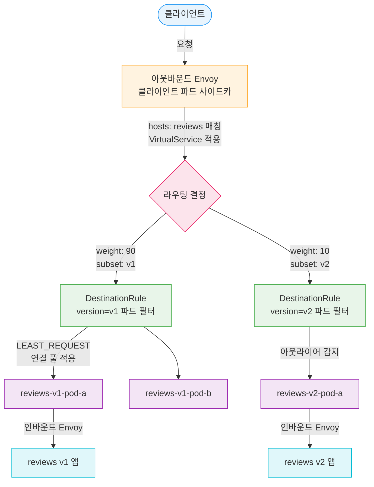
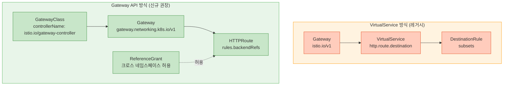
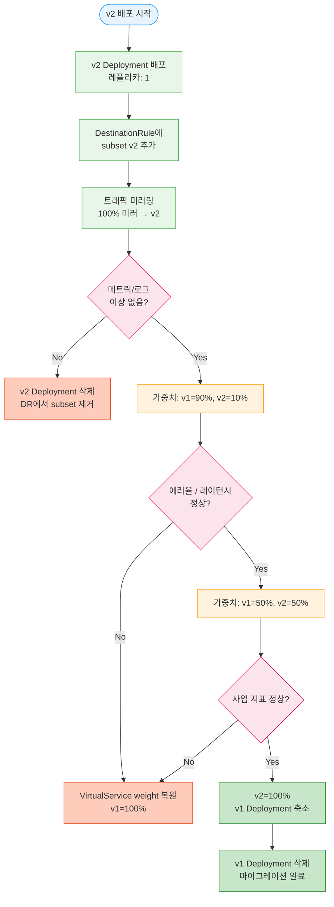

# Ch13. Istio 트래픽 관리

> 📌 **핵심 요약**: 트래픽 관리는 Istio의 핵심 가치다. VirtualService와 DestinationRule로 코드 한 줄 바꾸지 않고 카나리 배포, 장애 주입, 서킷 브레이킹을 구현할 수 있다. Gateway API로의 전환이 진행 중이므로, 두 방식을 함께 이해하는 것이 현실적인 접근이다.

---

## 🎯 학습 목표

1. VirtualService의 HTTP 라우팅 매칭 규칙(URI, 헤더, 메서드)을 작성할 수 있다
2. DestinationRule로 subset을 정의하고 VirtualService에서 가중치 기반 카나리를 구현한다
3. 장애 주입(delay, abort)으로 복원력 테스트 시나리오를 설계할 수 있다
4. 아웃라이어 감지(outlier detection)로 서킷 브레이킹이 동작하는 원리를 설명한다
5. Gateway API의 HTTPRoute가 VirtualService를 어떻게 대체하는지 매핑할 수 있다
6. 트래픽 미러링으로 프로덕션 트래픽을 복사해 새 버전을 검증하는 패턴을 이해한다
7. ServiceEntry로 외부 서비스를 메시에 등록하는 이유와 방법을 설명할 수 있다

---

## 1. VirtualService — 트래픽 라우팅의 중심

VirtualService는 Istio의 가장 중요한 리소스 중 하나다. 쿠버네티스 Service가 "어디로 가야 하는가"를 정의한다면, VirtualService는 "어떻게, 어떤 조건으로 가야 하는가"를 정의한다. 고속도로 나들목에서 목적지 표지판(Service)과 달리, VirtualService는 교통 경찰관처럼 실시간으로 조건을 보고 차량을 분류한다.

### 1-1. 기본 구조와 HTTP 라우팅

```yaml
apiVersion: networking.istio.io/v1
kind: VirtualService
metadata:
  name: reviews-vs
  namespace: default
spec:
  hosts:
  - reviews          # 쿠버네티스 Service 이름 (또는 FQDN)
  http:
  - match:           # 조건 매칭 (없으면 모든 트래픽)
    - uri:
        prefix: /api/v2
      headers:
        x-api-version:
          exact: "v2"
      method:
        exact: GET
    route:
    - destination:
        host: reviews
        subset: v2   # DestinationRule에 정의된 subset
      weight: 100
  - route:           # 기본 라우트 (매칭 없을 때)
    - destination:
        host: reviews
        subset: v1
      weight: 100
```

`match` 조건은 AND 연산이다. 위 예시는 URI가 `/api/v2`로 시작하고, 헤더에 `x-api-version: v2`가 있으며, GET 메서드인 요청만 v2로 보낸다. 나머지는 모두 v1으로 간다. 여러 `match` 블록을 나열하면 OR 조건이 된다.

### 1-2. 가중치 기반 트래픽 분할 (카나리)

```yaml
apiVersion: networking.istio.io/v1
kind: VirtualService
metadata:
  name: reviews-canary
spec:
  hosts:
  - reviews
  http:
  - route:
    - destination:
        host: reviews
        subset: v1
      weight: 90      # 90% → 안정 버전
    - destination:
        host: reviews
        subset: v2
      weight: 10      # 10% → 카나리 버전
```

weight 합계는 반드시 100이어야 한다. 카나리 배포는 보통 5% → 10% → 25% → 50% → 100% 순으로 단계적으로 높인다. 각 단계에서 에러율, 레이턴시, 사업 지표를 확인한 뒤 다음 단계로 진행한다.

### 1-3. 장애 주입 (Fault Injection)

장애 주입은 카오스 엔지니어링의 핵심 도구다. 실제 의존 서비스에 장애를 일으키지 않고 특정 서비스가 느려지거나 실패할 때 시스템이 어떻게 반응하는지 안전하게 테스트할 수 있다.

```yaml
apiVersion: networking.istio.io/v1
kind: VirtualService
metadata:
  name: ratings-fault
spec:
  hosts:
  - ratings
  http:
  # 지연 주입: 10% 요청에 5초 지연
  - match:
    - headers:
        x-test-delay:
          exact: "true"
    fault:
      delay:
        percentage:
          value: 10.0
        fixedDelay: 5s
    route:
    - destination:
        host: ratings
        subset: v1
  # 중단 주입: 5% 요청에 HTTP 500 응답
  - fault:
      abort:
        percentage:
          value: 5.0
        httpStatus: 500
    route:
    - destination:
        host: ratings
        subset: v1
```

지연 주입(`delay`)은 타임아웃과 재시도 정책을 테스트할 때 유용하다. 중단 주입(`abort`)은 의존 서비스 장애 시 서킷 브레이커나 폴백 로직이 제대로 동작하는지 확인할 때 사용한다. 두 가지를 조합하면 복합 장애 시나리오도 만들 수 있다.

### 1-4. 재시도 정책

```yaml
apiVersion: networking.istio.io/v1
kind: VirtualService
metadata:
  name: productpage-retry
spec:
  hosts:
  - productpage
  http:
  - route:
    - destination:
        host: productpage
        subset: v1
    retries:
      attempts: 3              # 최대 3회 재시도
      perTryTimeout: 2s        # 각 시도당 타임아웃
      retryOn: "5xx,reset,connect-failure,retriable-4xx"
    timeout: 10s               # 전체 요청 타임아웃 (재시도 포함)
```

`retryOn` 필드는 어떤 조건에서 재시도할지 결정한다. `5xx`는 서버 에러, `reset`은 연결 리셋, `connect-failure`는 연결 실패, `retriable-4xx`는 재시도 가능한 4xx(예: 409 Conflict)다. 주의할 점은 전체 타임아웃(`timeout`)이 `attempts × perTryTimeout`보다 넉넉해야 재시도가 의미있다는 것이다.

### 1-5. 트래픽 미러링 (Shadow Traffic)

미러링은 프로덕션 트래픽의 복사본을 새 버전으로 보내는 기법이다. 원본 요청의 응답은 클라이언트에게 정상 반환되고, 미러 요청의 응답은 무시된다. 새 버전이 실제 트래픽 패턴에서 어떻게 동작하는지 리스크 없이 검증할 수 있다.

```yaml
apiVersion: networking.istio.io/v1
kind: VirtualService
metadata:
  name: httpbin-mirror
spec:
  hosts:
  - httpbin
  http:
  - route:
    - destination:
        host: httpbin
        subset: v1
      weight: 100
    mirror:
      host: httpbin
      subset: v2        # 트래픽 복사본을 v2로 전송
    mirrorPercentage:
      value: 100.0      # 100% 미러링 (일부만 할 때는 낮춤)
```

---

## 2. DestinationRule — 목적지 동작 정의

VirtualService가 "어디로 보낼지"를 결정한다면, DestinationRule은 "목적지에서 어떻게 연결할지"를 정의한다. 로드밸런싱 알고리즘, 연결 풀 크기, 서킷 브레이킹, TLS 설정이 모두 여기에 들어간다.

### 2-1. Subset 정의

```yaml
apiVersion: networking.istio.io/v1
kind: DestinationRule
metadata:
  name: reviews-dr
  namespace: default
spec:
  host: reviews
  subsets:
  - name: v1
    labels:
      version: v1      # 파드 레이블과 매칭
  - name: v2
    labels:
      version: v2
  - name: v3
    labels:
      version: v3
```

VirtualService에서 `subset: v1`을 참조하면, DestinationRule이 `version: v1` 레이블을 가진 파드들로만 트래픽을 보낸다. **VirtualService의 subset 참조는 반드시 해당 DestinationRule이 먼저 존재해야 동작한다.** 순서를 잘못 배포하면 503 에러가 발생하는 흔한 실수다.

### 2-2. 로드밸런서 설정

```yaml
apiVersion: networking.istio.io/v1
kind: DestinationRule
metadata:
  name: reviews-lb
spec:
  host: reviews
  trafficPolicy:
    loadBalancer:
      simple: LEAST_REQUEST   # 가장 활성 요청이 적은 파드로
  subsets:
  - name: v1
    labels:
      version: v1
    trafficPolicy:
      loadBalancer:
        simple: ROUND_ROBIN   # subset별 개별 설정 가능
```

| 알고리즘 | 설명 | 적합한 상황 |
|---------|------|------------|
| `ROUND_ROBIN` | 순서대로 균등 분배 | 동질적인 파드 집합 |
| `LEAST_REQUEST` | 활성 요청 가장 적은 파드 | 처리 시간이 다양할 때 |
| `RANDOM` | 무작위 선택 | 간단한 부하 분산 |
| `PASSTHROUGH` | 클라이언트 연결을 그대로 전달 | 직접 연결이 필요할 때 |

### 2-3. 연결 풀 설정

```yaml
apiVersion: networking.istio.io/v1
kind: DestinationRule
metadata:
  name: reviews-pool
spec:
  host: reviews
  trafficPolicy:
    connectionPool:
      tcp:
        maxConnections: 100       # 최대 TCP 연결 수
        connectTimeout: 30ms      # 연결 타임아웃
      http:
        http1MaxPendingRequests: 50   # HTTP/1.1 대기 최대 요청
        http2MaxRequests: 1000        # HTTP/2 최대 동시 요청
        maxRequestsPerConnection: 10  # 연결당 최대 요청 (재사용 제한)
```

연결 풀은 업스트림 서비스가 받을 수 있는 부하를 제한한다. `maxConnections`를 넘으면 새 연결이 거부되고, `http1MaxPendingRequests`를 넘으면 대기 요청이 거부된다. 이 거부가 바로 서킷 브레이킹의 첫 번째 층이다.

### 2-4. 아웃라이어 감지 (Outlier Detection / 서킷 브레이킹)

서킷 브레이킹은 전기 회로 차단기에서 온 비유다. 특정 파드가 반복적으로 실패하면 일정 시간 동안 그 파드로의 트래픽을 차단(이젝션)하고, 시간이 지나면 조금씩 복구를 시도한다.

```yaml
apiVersion: networking.istio.io/v1
kind: DestinationRule
metadata:
  name: reviews-circuit-breaker
spec:
  host: reviews
  trafficPolicy:
    outlierDetection:
      consecutiveGatewayErrors: 5    # 연속 5회 게이트웨이 에러
      consecutive5xxErrors: 5        # 또는 연속 5회 5xx 에러
      interval: 10s                  # 분석 인터벌
      baseEjectionTime: 30s          # 첫 이젝션 지속 시간
      maxEjectionPercent: 50         # 최대 이젝션 비율 (50%)
      minHealthPercent: 30           # 최소 건강 파드 비율
```

동작 방식을 단계별로 살펴보면 다음과 같다. 10초 인터벌 동안 파드가 5회 연속 실패하면 해당 파드를 30초 동안 이젝션(로드밸런서 풀에서 제외)한다. 30초 후 파드를 다시 풀에 넣어 요청을 보내보고, 여전히 실패하면 이젝션 시간이 두 배(`60s`)로 늘어난다. `maxEjectionPercent`는 전체 파드 중 이젝션 가능한 최대 비율로, 너무 많은 파드가 동시에 이젝션되어 서비스 전체가 다운되는 것을 방지한다.

---

## 3. VirtualService + DestinationRule 전체 흐름



---

## 4. 고급 트래픽 패턴

### 4-1. 헤더 기반 카나리 (프로덕션 테스트)

가중치 기반 카나리는 무작위로 사용자를 분산시키지만, 헤더 기반 라우팅은 특정 요청(QA팀, 내부 사용자, 베타 테스터)만 새 버전으로 보낼 수 있다. 프로덕션에서 정해진 사용자 집단을 대상으로 새 버전을 검증하는 것이 가능해진다.

```yaml
apiVersion: networking.istio.io/v1
kind: VirtualService
metadata:
  name: reviews-header-canary
spec:
  hosts:
  - reviews
  http:
  # QA 팀 → v2로 라우팅
  - match:
    - headers:
        x-user-group:
          exact: "qa"
    route:
    - destination:
        host: reviews
        subset: v2
      weight: 100
  # 베타 사용자 → 50:50 분할
  - match:
    - headers:
        x-beta-user:
          exact: "true"
    route:
    - destination:
        host: reviews
        subset: v1
      weight: 50
    - destination:
        host: reviews
        subset: v2
      weight: 50
  # 나머지 → v1
  - route:
    - destination:
        host: reviews
        subset: v1
      weight: 100
```

### 4-2. 블루-그린 배포

블루-그린은 두 개의 동일한 환경(블루=현재, 그린=새 버전)을 유지하고, 순간적으로 전환하는 방식이다. VirtualService의 weight를 바꾸는 것만으로 즉각적인 전환과 즉각적인 롤백이 가능하다.

```yaml
# 전환 전: 블루(v1) 100%
http:
- route:
  - destination:
      host: myapp
      subset: blue    # v1 파드
    weight: 100

# 전환 후: 그린(v2) 100% (kubectl apply 한 번으로 전환)
http:
- route:
  - destination:
      host: myapp
      subset: green   # v2 파드
    weight: 100
```

### 4-3. 쿠키 기반 A/B 테스트

```yaml
apiVersion: networking.istio.io/v1
kind: VirtualService
metadata:
  name: frontend-ab
spec:
  hosts:
  - frontend
  http:
  - match:
    - headers:
        cookie:
          regex: ".*experiment=B.*"   # 쿠키로 실험군 구분
    route:
    - destination:
        host: frontend
        subset: variant-b
  - route:
    - destination:
        host: frontend
        subset: variant-a
```

실험 그룹 배정은 애플리케이션 레이어에서 쿠키를 설정하고, Istio는 그 쿠키를 보고 라우팅만 담당한다. 이렇게 역할을 분리하면 Istio 설정 변경 없이 실험 대상 변경이 가능하다.

### 4-4. 지역 인식 라우팅 (Locality-Aware Routing)

같은 존(zone) 또는 리전(region)의 파드를 우선 사용하도록 설정해 레이턴시를 줄이고 데이터 전송 비용을 낮출 수 있다.

```yaml
apiVersion: networking.istio.io/v1
kind: DestinationRule
metadata:
  name: reviews-locality
spec:
  host: reviews
  trafficPolicy:
    loadBalancer:
      localityLbSetting:
        enabled: true
        failover:
        - from: us-east1       # us-east1 파드 없으면
          to: us-central1      # us-central1으로 페일오버
```

지역 인식 라우팅이 동작하려면 `outlierDetection`도 함께 설정해야 한다. 로컬 파드가 건강하지 않을 때만 다른 지역으로 페일오버하기 때문이다.

### 4-5. 트래픽 미러링으로 프로덕션 검증

```mermaid
flowchart LR
    CLIENT([클라이언트]) -->|실제 요청| VS[VirtualService]
    VS -->|"weight: 100<br/>정상 응답 반환"| V1[reviews v1]
    VS -->|"mirror: v2<br/>응답 무시"| V2[reviews v2]
    V1 -->|응답| CLIENT
    V2 -->|응답 무시됨| NOWHERE[/dev/null]

    style CLIENT fill:#e8f4fd,stroke:#2196F3,color:#333
    style VS fill:#fff3e0,stroke:#FF9800,color:#333
    style V1 fill:#e8f5e9,stroke:#4CAF50,color:#333
    style V2 fill:#f3e5f5,stroke:#9C27B0,color:#333
    style NOWHERE fill:#eceff1,stroke:#607D8B,color:#333
```

미러링의 실제 사용 시나리오는 다음과 같다. v2 배포 후 10%의 프로덕션 트래픽을 미러링해 로그와 메트릭을 비교한다. v2의 응답 시간, 에러율, 비즈니스 로직 결과가 v1과 동일한지 확인한 뒤 실제 가중치를 조정한다. 이 과정에서 실제 사용자는 전혀 영향을 받지 않는다.

---

## 5. Gateway API — 새로운 표준

Kubernetes Gateway API는 Ingress의 후계자로, Istio의 VirtualService와 DestinationRule을 점진적으로 대체하고 있다. 새 배포에서 Istio가 공식적으로 Gateway API를 권장하는 이유는 세 가지다. 첫째, 표준 쿠버네티스 API이므로 Istio 외 다른 메시 구현체와도 호환된다. 둘째, 역할 기반 설계(인프라 관리자 / 애플리케이션 개발자)가 명확하다. 셋째, 크로스 네임스페이스 라우팅이 ReferenceGrant로 안전하게 제어된다.

### 5-1. VirtualService → HTTPRoute 매핑



### 5-2. HTTPRoute 기본 예시

```yaml
apiVersion: gateway.networking.k8s.io/v1
kind: HTTPRoute
metadata:
  name: reviews-route
  namespace: default
spec:
  parentRefs:
  - name: my-gateway        # 어느 Gateway에 연결할지
    namespace: istio-system
  hostnames:
  - "reviews.example.com"
  rules:
  # 헤더 기반 라우팅 (v2로)
  - matches:
    - headers:
      - name: x-user-group
        value: qa
    backendRefs:
    - name: reviews-v2
      port: 9080
      weight: 100
  # 가중치 기반 카나리
  - backendRefs:
    - name: reviews-v1
      port: 9080
      weight: 90
    - name: reviews-v2
      port: 9080
      weight: 10
```

VirtualService와 비교하면 `http.route.destination.host + subset`이 `backendRefs.name + port`로 바뀌었고, subset 개념이 사라진 대신 각 버전별로 별도의 쿠버네티스 Service를 만드는 패턴을 사용한다.

### 5-3. ReferenceGrant — 크로스 네임스페이스 라우팅

Gateway가 `istio-system` 네임스페이스에 있고 HTTPRoute가 `default` 네임스페이스에 있다면, 기본적으로 HTTPRoute가 그 Gateway를 참조할 수 없다. ReferenceGrant로 명시적으로 허용해야 한다.

```yaml
apiVersion: gateway.networking.k8s.io/v1beta1
kind: ReferenceGrant
metadata:
  name: allow-default-to-gateway
  namespace: istio-system       # Gateway가 있는 네임스페이스
spec:
  from:
  - group: gateway.networking.k8s.io
    kind: HTTPRoute
    namespace: default          # HTTPRoute가 있는 네임스페이스
  to:
  - group: gateway.networking.k8s.io
    kind: Gateway
    name: my-gateway
```

### 5-4. 마이그레이션 전략: 병행 실행

VirtualService와 HTTPRoute를 동시에 실행할 수 있다. 같은 Service에 두 리소스가 모두 적용되면 Gateway API가 우선시된다. 이를 활용해 새 서비스는 HTTPRoute로 추가하고, 기존 서비스는 안정적으로 VirtualService를 유지하면서 점진적으로 이전할 수 있다.

```bash
# 마이그레이션 상태 확인
istioctl analyze --all-namespaces
kubectl get httproute,virtualservice -A
```

---

## 6. ServiceEntry — 외부 서비스를 메시에 등록

Istio의 기본 동작은 아웃바운드 트래픽 정책에 따라 메시 외부 서비스(외부 API, 데이터베이스 등)를 허용하거나 차단한다. `REGISTRY_ONLY` 모드에서는 ServiceEntry에 등록된 서비스만 허용되므로, 어떤 외부 서비스를 사용하는지 명시적으로 관리할 수 있다.

```yaml
# 외부 HTTPS API 등록
apiVersion: networking.istio.io/v1
kind: ServiceEntry
metadata:
  name: external-payment-api
spec:
  hosts:
  - api.payment-provider.com
  ports:
  - number: 443
    name: https
    protocol: HTTPS
  location: MESH_EXTERNAL    # 메시 외부
  resolution: DNS            # DNS로 IP 해석
```

```yaml
# 외부 데이터베이스 (TCP)
apiVersion: networking.istio.io/v1
kind: ServiceEntry
metadata:
  name: external-mysql
spec:
  hosts:
  - mysql.prod.internal
  addresses:
  - 10.0.0.50/32             # IP 기반 매칭
  ports:
  - number: 3306
    name: mysql
    protocol: TCP
  location: MESH_EXTERNAL
  resolution: STATIC
  endpoints:
  - address: 10.0.0.50
```

ServiceEntry를 등록하면 외부 서비스에도 Istio의 트래픽 관리(재시도, 타임아웃, 서킷 브레이킹)와 보안(mTLS, 인증 정책) 기능을 적용할 수 있다. 또한 메트릭과 트레이싱도 자동으로 수집되어 외부 의존성을 메시 내부처럼 관찰할 수 있게 된다.

```yaml
# ServiceEntry + DestinationRule 조합: 외부 서비스에 TLS 오리지네이션
apiVersion: networking.istio.io/v1
kind: DestinationRule
metadata:
  name: external-payment-tls
spec:
  host: api.payment-provider.com
  trafficPolicy:
    tls:
      mode: SIMPLE            # 단방향 TLS (일반 HTTPS)
      # mode: MUTUAL         # mTLS (클라이언트 인증서 필요)
```

---

## 7. 카나리 배포 전체 시나리오

현실적인 카나리 배포 과정은 다음과 같다.



---

## 면접 대비

**Q1. VirtualService와 DestinationRule의 역할 분리가 왜 중요한가요?**

두 리소스는 각각 독립적인 관심사를 담당한다. VirtualService는 트래픽 라우팅 결정(어디로 보낼지, 어떤 조건으로)을 담당하고, DestinationRule은 목적지의 동작(로드밸런싱, 연결 풀, 서킷 브레이킹)을 담당한다. 이 분리 덕분에 동일한 DestinationRule을 여러 VirtualService가 재사용할 수 있고, 라우팅 정책 변경이 연결 풀 설정에 영향을 주지 않는다. 단, VirtualService에서 subset을 참조하려면 반드시 DestinationRule이 먼저 존재해야 한다는 배포 순서 의존성이 있다.

**Q2. 아웃라이어 감지(outlier detection)와 연결 풀(connection pool)은 어떻게 다른 서킷 브레이킹 메커니즘인가요?**

연결 풀은 요청이 목적지에 도달하기 전에 차단하는 사전 제한이다. `maxConnections`나 `http1MaxPendingRequests`를 초과하면 새 요청이 즉시 거부된다. 반면 아웃라이어 감지는 요청이 목적지에 도달한 후 결과를 분석하는 사후 반응이다. 특정 파드가 반복적으로 실패하면 그 파드를 로드밸런서 풀에서 빼는 방식이다. 두 메커니즘은 보완적으로 함께 사용한다.

**Q3. 트래픽 미러링과 가중치 기반 카나리의 차이와 각각 적합한 시점을 설명해주세요.**

미러링은 실제 응답을 클라이언트에게 v1에서 반환하면서 v2에도 복사본을 보내는 방식으로, 사용자는 전혀 v2를 인식하지 못한다. 기능적 정확성, 성능, 부작용 없는 동작을 검증할 때 적합하다. 단, 데이터 변경(DB write)이 있는 엔드포인트에는 중복 쓰기가 발생하므로 주의해야 한다. 가중치 기반 카나리는 실제 사용자 트래픽의 일부가 v2로 간다. 미러링 검증 후 실제 사용자 반응(전환율, 장바구니 등 비즈니스 지표)을 측정해야 할 때 사용한다.

**Q4. Gateway API로 전환할 때 VirtualService와 HTTPRoute를 동시에 유지하면 어떤 문제가 생길 수 있나요?**

같은 호스트에 VirtualService와 HTTPRoute가 모두 존재하면 Gateway API가 우선 적용되어 VirtualService는 무시된다. 이 우선순위를 모르고 두 리소스를 동시에 수정하면 의도치 않은 동작이 발생할 수 있다. 마이그레이션 중에는 `istioctl analyze`로 충돌을 확인하고, 한 서비스에 대해 두 리소스가 동시에 활성화되지 않도록 명확한 전환 시점을 정해야 한다.

**Q5. ServiceEntry의 `REGISTRY_ONLY` 아웃바운드 정책이 보안적으로 중요한 이유는 무엇인가요?**

기본 모드(`ALLOW_ANY`)에서는 파드가 클러스터 외부 어디든 자유롭게 통신할 수 있다. 악성 코드가 심어진 파드가 외부 C2(Command & Control) 서버와 통신하는 것을 막을 수 없다. `REGISTRY_ONLY`로 설정하면 ServiceEntry에 명시적으로 등록된 외부 서비스만 허용되므로, 허용된 외부 통신 목록이 코드로 관리된다. 이는 제로 트러스트 네트워크의 화이트리스트 방식 원칙과 일치하며, 공급망 공격(supply chain attack) 대응에도 효과적이다.

---

## 체크리스트

- [ ] VirtualService를 배포하기 전 DestinationRule의 subset이 먼저 존재하는지 확인
- [ ] 가중치 기반 카나리: weight 합계가 100인지 `istioctl analyze`로 검증
- [ ] 장애 주입: `x-test-delay: true` 헤더로 특정 요청에만 지연 적용 테스트
- [ ] 아웃라이어 감지 설정 후 `kubectl exec`로 일부 파드에 의도적 실패 유발해 이젝션 확인
- [ ] 트래픽 미러링: v2에 요청이 들어오는지 로그로 확인, 클라이언트 응답은 v1에서 오는지 확인
- [ ] HTTPRoute로 간단한 가중치 라우팅 구성 (VirtualService 없이)
- [ ] ReferenceGrant: 크로스 네임스페이스 HTTPRoute 참조 허용 설정
- [ ] ServiceEntry로 외부 API 등록 후 메시 내 파드에서 접근 테스트
- [ ] `REGISTRY_ONLY` 설정 후 미등록 외부 URL 차단 확인
- [ ] 연결 풀 제한 초과 시 503 응답 확인 (Fortio 같은 부하 테스트 도구 사용)

---

## 참고 자료

- [VirtualService 공식 레퍼런스](https://istio.io/latest/docs/reference/config/networking/virtual-service/)
- [DestinationRule 공식 레퍼런스](https://istio.io/latest/docs/reference/config/networking/destination-rule/)
- [트래픽 관리 개념 가이드](https://istio.io/latest/docs/concepts/traffic-management/)
- [Gateway API 마이그레이션 가이드](https://istio.io/latest/docs/tasks/traffic-management/ingress/gateway-api/)
- [ServiceEntry 레퍼런스](https://istio.io/latest/docs/reference/config/networking/service-entry/)
- [카나리 배포 가이드](https://istio.io/latest/docs/tasks/traffic-management/traffic-shifting/)
- [장애 주입 태스크](https://istio.io/latest/docs/tasks/traffic-management/fault-injection/)
- [서킷 브레이킹 태스크](https://istio.io/latest/docs/tasks/traffic-management/circuit-breaking/)
