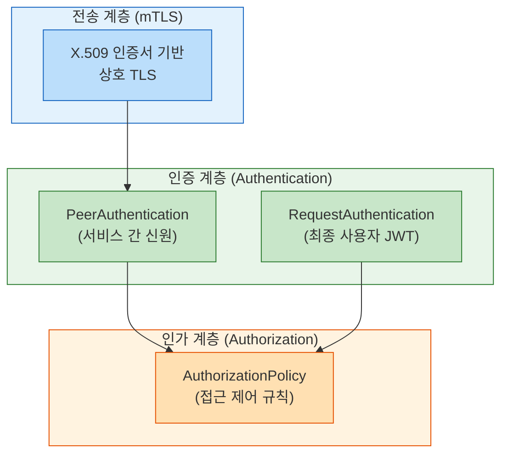
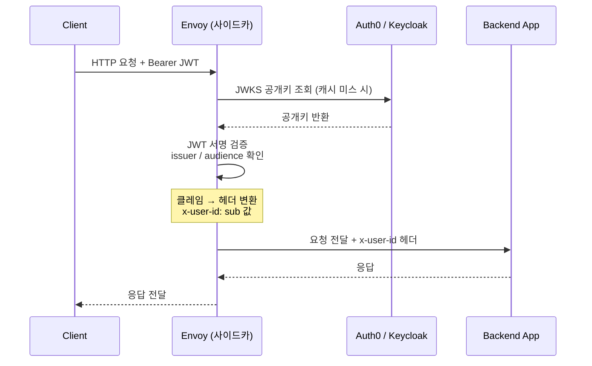
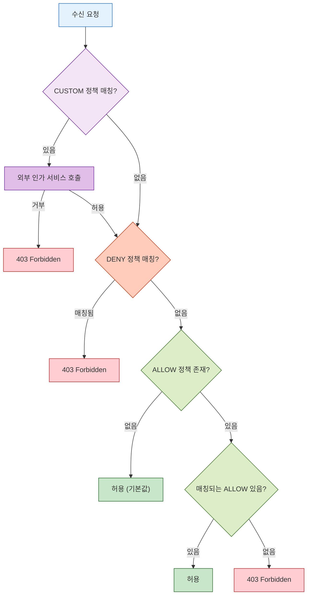
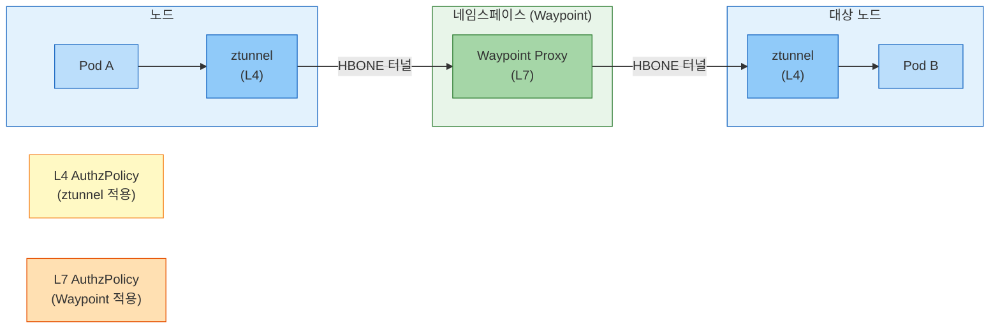

# Ch15. Istio 보안

> **📌 핵심 요약**
>
> Istio 보안은 "심층 방어(Defense in Depth)"를 서비스 메시 수준에서 구현한다. 애플리케이션 코드 한 줄 수정 없이 전송 암호화(mTLS), 신원 인증(Authentication), 접근 제어(Authorization) 세 겹을 자동으로 제공한다. 마치 건물 보안이 외벽 → 카드 리더 → 각 방 잠금장치로 계층화되듯, Istio는 네트워크 계층부터 요청 속성까지 단계적으로 검증한다.

---

## 🎯 학습 목표

1. Istio 보안의 세 축(전송 보안, 인증, 인가)이 어떻게 상호 보완하는지 설명할 수 있다
2. PeerAuthentication의 네 가지 모드와 적용 범위(scope) 우선순위를 이해한다
3. RequestAuthentication으로 JWT를 검증하고 클레임을 업스트림에 전달하는 흐름을 설명할 수 있다
4. AuthorizationPolicy의 액션 유형과 평가 순서를 정확히 기술할 수 있다
5. CUSTOM 액션과 외부 인가 서비스(OPA)를 연동하는 패턴을 이해한다
6. Ambient Mesh에서 L4/L7 보안 정책이 어떻게 분리 적용되는지 설명할 수 있다
7. PERMISSIVE → STRICT 마이그레이션 전략을 실무 절차로 설명할 수 있다

---

## 1. Istio 보안 아키텍처: 심층 방어

Istio 보안의 목표는 단순히 "트래픽을 암호화하는 것"이 아니다. 실행 중인 서비스가 누구인지 증명하고(Authentication), 증명된 신원에 기반해 어떤 작업을 허용할지 결정하며(Authorization), 그 전제 조건으로 통신 자체를 안전하게 보호한다(Transport Security). 이 세 계층이 맞물려야 진정한 제로 트러스트 네트워크가 성립한다.

전통적인 경계 보안(Perimeter Security)은 방화벽 안에 들어온 트래픽은 신뢰한다는 가정에 기댄다. 하지만 내부 공격자나 컨테이너 탈출 시나리오에서는 이 가정이 무너진다. Istio는 각 Pod가 자신만의 X.509 인증서를 가지고 통신하도록 강제함으로써, "네트워크 위치가 아닌 신원"으로 신뢰를 판단하는 패러다임을 도입한다.



---

## 2. PeerAuthentication: 서비스 간 신원 검증

### 2.1 mTLS의 동작 원리

일반 TLS는 서버만 인증서를 제시한다(클라이언트는 서버를 믿는다). 반면 mTLS(Mutual TLS)는 서버와 클라이언트 모두 인증서를 교환한다. Istio에서는 istiod가 SPIFFE(Secure Production Identity Framework For Everyone) 표준에 따라 각 Pod에 인증서를 자동 발급하며, 형식은 `spiffe://<trust-domain>/ns/<namespace>/sa/<service-account>`다.

Envoy 사이드카는 이 인증서를 사용해 피어 간 TLS 핸드셰이크를 수행한다. 애플리케이션은 평문 HTTP로 통신하고, Envoy가 투명하게 암호화와 복호화를 처리하는 것이다.

### 2.2 네 가지 모드

`PeerAuthentication`의 `mtls.mode` 필드는 네 가지 값을 가진다.

- **STRICT**: mTLS만 허용한다. 평문 트래픽은 즉시 거부된다. 완전한 제로 트러스트 환경에서 사용하며, 모든 클라이언트가 Istio 사이드카를 가져야 한다.
- **PERMISSIVE**: mTLS와 평문 모두 허용한다. 마이그레이션 과도기에 유용하다. 사이드카가 없는 레거시 클라이언트도 계속 통신할 수 있어 무중단 전환이 가능하다.
- **DISABLE**: 사이드카가 있어도 mTLS를 사용하지 않는다. 사이드카를 우회해야 하는 특수 상황에서 쓰이지만 권장되지 않는다.
- **UNSET**: 상위 범위(부모 정책)의 설정을 상속한다. 명시적 설정이 없을 때의 기본값이다.

### 2.3 적용 범위와 우선순위

PeerAuthentication은 세 가지 범위로 적용할 수 있고, 가장 좁은 범위가 우선한다.

```
메시 전체 (istio-system 네임스페이스, selector 없음)
    ↓ 상속
네임스페이스 전체 (해당 네임스페이스, selector 없음)
    ↓ 상속
워크로드별 (selector 지정)  ← 이 정책이 최종 적용
```

메시 전체를 STRICT으로 설정하더라도 특정 워크로드는 PERMISSIVE로 예외 처리할 수 있다. 헬스체크나 메트릭 엔드포인트처럼 평문 접근이 필요한 경우 포트 레벨 예외를 적용한다.

```yaml
apiVersion: security.istio.io/v1beta1
kind: PeerAuthentication
metadata:
  name: default
  namespace: production
spec:
  mtls:
    mode: STRICT
  portLevelMtls:
    9090:              # Prometheus /metrics 포트
      mode: PERMISSIVE
    8086:              # Health check 포트
      mode: DISABLE
```

이렇게 하면 9090과 8086 포트는 평문을 허용하고 나머지는 mTLS를 요구하는 세밀한 제어가 가능하다.

### 2.4 PERMISSIVE → STRICT 마이그레이션 전략

프로덕션 환경에서 갑자기 STRICT 모드로 전환하면 사이드카가 없는 클라이언트의 트래픽이 단절된다. 안전한 마이그레이션은 다음 순서를 따른다.

1. **전체를 PERMISSIVE로 설정**: 기존 트래픽 영향 없이 mTLS를 활성화한다.
2. **Kiali 또는 메트릭 확인**: `connection_security_policy` 레이블로 평문 트래픽이 남아 있는지 식별한다.
3. **네임스페이스 단위로 STRICT 전환**: 하나씩 전환하며 문제를 국소화한다.
4. **메시 전체 STRICT 적용**: 모든 트래픽이 mTLS로 전환된 것을 확인한 후 적용한다.

---

## 3. RequestAuthentication: 최종 사용자 JWT 검증

### 3.1 역할과 한계

`PeerAuthentication`이 "이 서비스가 신뢰할 수 있는 서비스인가?"를 검증한다면, `RequestAuthentication`은 "이 요청을 보낸 최종 사용자가 누구인가?"를 검증한다. JWT(JSON Web Token)를 파싱해 서명의 유효성을 확인하는 것이다.

중요한 점은 `RequestAuthentication` 단독으로는 접근을 거부하지 않는다는 것이다. 유효하지 않은 JWT는 거부하지만, JWT가 없는 요청은 통과시킨다. JWT 없는 요청을 차단하려면 반드시 `AuthorizationPolicy`와 함께 사용해야 한다.

### 3.2 JWT 검증 설정

```yaml
apiVersion: security.istio.io/v1beta1
kind: RequestAuthentication
metadata:
  name: jwt-auth
  namespace: production
spec:
  selector:
    matchLabels:
      app: api-gateway
  jwtRules:
  - issuer: "https://auth.example.com"           # iss 클레임 검증
    jwksUri: "https://auth.example.com/.well-known/jwks.json"  # 공개키 엔드포인트
    audiences:
    - "api.example.com"                           # aud 클레임 검증
    forwardOriginalToken: true                    # 원본 토큰을 업스트림에 전달
    outputClaimToHeaders:
    - header: x-user-id
      claim: sub                                  # sub 클레임을 헤더로 전달
    - header: x-user-role
      claim: role                                 # 커스텀 클레임 전달
```

Auth0나 Keycloak 같은 외부 IdP와 연동할 때 `jwksUri`는 JWKS(JSON Web Key Set) 엔드포인트를 가리킨다. Envoy는 이 엔드포인트에서 공개키를 자동으로 가져와 캐시하고 서명을 검증한다. 키 로테이션도 자동으로 처리되어 애플리케이션에서 직접 처리할 필요가 없다.

`outputClaimToHeaders`는 JWT 클레임을 HTTP 헤더로 변환해 업스트림 서비스에 전달한다. 이를 통해 백엔드 서비스는 JWT 파싱 없이 `x-user-id` 헤더를 읽어 사용자를 식별할 수 있다.



---

## 4. AuthorizationPolicy: 접근 제어

### 4.1 네 가지 액션 유형

`AuthorizationPolicy`의 `action` 필드는 규칙 매칭 시 수행할 동작을 정의한다.

- **ALLOW**: 매칭된 요청을 허용한다. 규칙이 하나라도 있으면 기본적으로 나머지는 모두 거부된다.
- **DENY**: 매칭된 요청을 명시적으로 거부한다. ALLOW보다 우선한다.
- **CUSTOM**: 외부 인가 서비스(OPA, 커스텀 웹훅)에 인가 판단을 위임한다.
- **AUDIT**: 트래픽을 허용하되 감사 로그를 기록한다. 규정 준수 목적으로 사용한다.

### 4.2 평가 순서

같은 워크로드에 여러 `AuthorizationPolicy`가 적용될 때의 평가 순서는 아래와 같다.



핵심은 "ALLOW 정책이 하나라도 존재하면, 매칭되지 않는 요청은 모두 거부된다"는 점이다. 빈 `spec`(규칙 없음)의 ALLOW 정책은 아무것도 허용하지 않아 기본 거부(Default Deny)를 구현하는 표준 패턴이다.

### 4.3 조건 구성 요소

AuthorizationPolicy의 `rules`는 세 가지 조건의 AND 조합이다.

```yaml
apiVersion: security.istio.io/v1beta1
kind: AuthorizationPolicy
metadata:
  name: frontend-to-backend
  namespace: production
spec:
  selector:
    matchLabels:
      app: backend
  action: ALLOW
  rules:
  - from:                                         # 소스 조건
    - source:
        principals:
        - "cluster.local/ns/production/sa/frontend"
        namespaces:
        - "production"
    to:                                           # 대상 작업 조건
    - operation:
        methods: ["GET", "POST"]
        paths: ["/api/*"]
        ports: ["8080"]
    when:                                         # 추가 속성 조건
    - key: request.auth.claims[role]
      values: ["admin", "editor"]
    - key: request.headers[x-api-version]
      values: ["v2"]
```

**source 조건**은 발신자를 특정한다. `principals`는 SPIFFE ID(서비스 어카운트), `namespaces`는 발신 네임스페이스, `ipBlocks`는 IP 범위를 지정한다.

**operation 조건**은 요청의 속성을 검사한다. HTTP 메서드, 경로, 포트, 호스트를 지정할 수 있다. 경로는 접두사(`/api/*`), 접미사(`*.json`), 정확 매칭을 지원한다.

**when 조건**은 JWT 클레임, 헤더, 소스 IP 등 임의 속성을 검사한다. `request.auth.claims[role]` 같은 표현식으로 JWT 클레임을 직접 참조할 수 있어, `RequestAuthentication`과 결합하면 역할 기반 접근 제어(RBAC)를 구현할 수 있다.

### 4.4 실전 패턴

**기본 거부(Default Deny)**: 아무 규칙도 없는 ALLOW 정책

```yaml
apiVersion: security.istio.io/v1beta1
kind: AuthorizationPolicy
metadata:
  name: deny-all
  namespace: production
spec: {}     # 규칙 없음 = 아무것도 허용 안 함
```

**JWT 역할 기반 접근 제어**:

```yaml
apiVersion: security.istio.io/v1beta1
kind: AuthorizationPolicy
metadata:
  name: require-admin
  namespace: production
spec:
  selector:
    matchLabels:
      app: admin-api
  action: ALLOW
  rules:
  - from:
    - source:
        requestPrincipals: ["https://auth.example.com/*"]  # 유효한 JWT 발급자
    when:
    - key: request.auth.claims[role]
      values: ["admin"]
```

`requestPrincipals`는 JWT의 `iss/sub` 조합을 검사한다. JWT 없는 요청은 `requestPrincipals`를 만족시킬 수 없으므로 자연스럽게 거부된다.

---

## 5. CUSTOM 액션과 외부 인가 서비스

### 5.1 OPA와의 연동

복잡한 인가 로직(시간대 제한, 조직 계층 기반 접근, 외부 DB 조회 등)은 Istio의 선언적 정책만으로 표현하기 어렵다. CUSTOM 액션은 이런 경우 외부 인가 서비스(ext_authz)에 판단을 위임한다.

OPA(Open Policy Agent) + Envoy 플러그인 조합이 가장 일반적이다. Envoy가 체크 요청을 OPA 사이드카로 보내면 OPA가 Rego 정책을 평가해 허용/거부를 반환한다.

```yaml
# ExtensionProvider 등록 (MeshConfig)
extensionProviders:
- name: opa-authz
  envoyExtAuthzGrpc:
    service: opa.opa.svc.cluster.local
    port: 9191

---
# CUSTOM 액션 정책
apiVersion: security.istio.io/v1beta1
kind: AuthorizationPolicy
metadata:
  name: opa-policy
  namespace: production
spec:
  selector:
    matchLabels:
      app: sensitive-api
  action: CUSTOM
  provider:
    name: opa-authz
  rules:
  - to:
    - operation:
        paths: ["/admin/*"]
```

CUSTOM 정책이 매칭되면 Envoy는 요청을 즉시 처리하지 않고 OPA 서비스에 gRPC 체크 요청을 보낸다. OPA가 허용하면 원래 요청을 진행하고, 거부하면 403을 반환한다.

---

## 6. Ambient Mesh 보안 모델

### 6.1 사이드카 없는 보안의 구조

Ambient Mesh는 사이드카 없이 ztunnel(노드별 L4 프록시)과 Waypoint(네임스페이스별 L7 프록시)로 보안을 구현한다. 사이드카 모델과 비교하면 정책이 적용되는 위치가 다르다.



### 6.2 L4 vs L7 정책

**ztunnel(L4)에서 적용되는 정책**은 네임스페이스와 서비스 어카운트(SPIFFE ID) 기반 조건만 사용할 수 있다. HTTP 메서드나 경로 같은 L7 속성은 사용할 수 없다.

```yaml
# L4 정책 예시 (ztunnel에서 처리)
apiVersion: security.istio.io/v1beta1
kind: AuthorizationPolicy
metadata:
  name: l4-allow
  namespace: production
spec:
  action: ALLOW
  rules:
  - from:
    - source:
        principals: ["cluster.local/ns/production/sa/frontend"]
```

**Waypoint(L7)에서 적용되는 정책**은 `targetRef`로 Waypoint를 명시적으로 지정해야 한다. 이를 통해 HTTP 경로, 메서드, 헤더, JWT 클레임 등 L7 속성을 조건으로 사용할 수 있다.

```yaml
# L7 정책 예시 (Waypoint에서 처리)
apiVersion: security.istio.io/v1beta1
kind: AuthorizationPolicy
metadata:
  name: l7-allow
  namespace: production
spec:
  targetRef:                         # Waypoint 명시
    group: gateway.networking.k8s.io
    kind: Gateway
    name: production-waypoint
  action: ALLOW
  rules:
  - from:
    - source:
        principals: ["cluster.local/ns/production/sa/frontend"]
    to:
    - operation:
        methods: ["GET"]
        paths: ["/api/read/*"]
```

Waypoint를 사용하면 성능 비용이 추가되지만 L7 수준의 세밀한 제어가 가능하다. 네임스페이스 단위로 선택적으로 Waypoint를 활성화할 수 있어 필요한 곳에만 비용을 지불하는 구조다.

---

## 7. 보안 모범 사례

### 7.1 단계적 적용 원칙

보안 정책을 한 번에 전체에 적용하는 것은 위험하다. 다음 원칙을 따르면 안전하게 운영할 수 있다.

첫째, **항상 PERMISSIVE로 시작한다**. 기존 트래픽을 끊지 않고 mTLS를 활성화해 현황을 파악한다. Kiali의 보안 그래프 뷰에서 어떤 연결이 아직 평문인지 확인할 수 있다.

둘째, **네임스페이스 정책을 기준선으로 삼는다**. 네임스페이스 수준에서 기본 정책(ALLOW 없음 = 기본 거부)을 적용하고, 워크로드 수준 정책으로 예외를 처리한다. 새 서비스를 배포할 때마다 별도 정책 없이 기본 거부가 적용되어 실수로 노출되는 상황을 방지한다.

셋째, **`istioctl analyze`로 정책 오류를 사전 감지한다**. 잘못된 셀렉터나 존재하지 않는 서비스 어카운트를 참조하는 정책은 적용되어도 조용히 실패한다. 배포 전 `istioctl analyze` 실행을 CI 파이프라인에 포함해야 한다.

### 7.2 정책 검증 명령어

```bash
# 네임스페이스의 인가 정책 확인
kubectl get authorizationpolicy -n production

# 특정 Pod에 적용된 정책 확인
istioctl x authz check <pod-name> -n production

# 정책 오류 분석
istioctl analyze -n production

# mTLS 상태 확인
istioctl x describe pod <pod-name> -n production
```

---

## 면접 대비

**Q1. PeerAuthentication의 PERMISSIVE 모드와 STRICT 모드의 차이를 설명하고, 언제 각각을 사용하나요?**

PERMISSIVE는 mTLS와 평문 트래픽을 모두 허용한다. 사이드카가 없는 레거시 클라이언트와 공존해야 하거나 mTLS 전환 과도기에 사용한다. STRICT는 mTLS만 허용하고 평문을 거부한다. 모든 클라이언트가 Istio 사이드카를 가진 상태에서 완전한 제로 트러스트를 구현할 때 사용한다. 프로덕션 전환 전략은 메시 전체 PERMISSIVE → 네임스페이스별 STRICT → 메시 전체 STRICT 순서를 따른다.

**Q2. RequestAuthentication만으로는 JWT 없는 요청을 차단할 수 없는 이유를 설명하세요.**

`RequestAuthentication`은 JWT가 있을 때 유효성을 검증하는 역할만 담당한다. JWT가 없는 요청은 "검증 대상 없음"으로 처리되어 통과된다. JWT가 없는 요청을 차단하려면 `AuthorizationPolicy`에서 `requestPrincipals`를 조건으로 추가해야 한다. `requestPrincipals: ["*"]`는 유효한 JWT를 가진 요청만 허용하므로, JWT 없는 요청은 이 조건을 충족하지 못해 거부된다.

**Q3. AuthorizationPolicy 평가 순서(CUSTOM → DENY → ALLOW)에서 ALLOW 정책이 하나라도 있는 경우 기본 동작이 어떻게 바뀌나요?**

ALLOW 정책이 없으면 기본적으로 모든 요청이 허용된다. 그러나 ALLOW 정책이 하나라도 존재하면, 매칭되는 ALLOW 규칙이 없는 요청은 모두 거부된다(Implicit Deny). 이것이 빈 `spec`의 `AuthorizationPolicy`가 기본 거부 역할을 하는 이유다. 빈 ALLOW 정책이 있으면 아무 요청도 ALLOW 규칙에 매칭되지 않아 전체가 거부된다.

**Q4. Ambient Mesh에서 L7 AuthorizationPolicy를 적용하려면 사이드카 모드와 어떻게 다른가요?**

사이드카 모드에서는 `selector`로 대상 워크로드를 지정하면 그 Pod의 사이드카에서 L7 정책이 처리된다. Ambient Mesh에서는 L7 처리가 Waypoint 프록시에서 담당하므로, `targetRef`로 Waypoint를 명시적으로 지정해야 한다. 또한 Waypoint가 활성화된 네임스페이스에서만 L7 정책이 동작하며, Waypoint가 없는 네임스페이스의 정책은 ztunnel(L4 수준)에서만 처리된다.

**Q5. JWT 클레임 기반 접근 제어를 구현할 때 RequestAuthentication과 AuthorizationPolicy를 어떻게 조합하나요?**

두 단계로 구현한다. 먼저 `RequestAuthentication`에서 JWT 발급자, JWKS URI, 대상자(audiences)를 설정해 토큰 서명을 검증하고 클레임을 파싱한다. 그다음 `AuthorizationPolicy`의 `when` 조건에서 `request.auth.claims[role]`과 같은 표현식으로 특정 클레임 값을 검사한다. 예를 들어 `values: ["admin"]`으로 role 클레임이 admin인 요청만 허용할 수 있다. `outputClaimToHeaders`로 클레임을 헤더로 변환하면 백엔드 서비스도 JWT 파싱 없이 사용자 정보를 활용할 수 있다.

---

## 체크리스트

- [ ] `PeerAuthentication`의 네 가지 모드(STRICT/PERMISSIVE/DISABLE/UNSET)를 각각 설명할 수 있다
- [ ] 포트 레벨 mTLS 예외를 헬스체크 포트에 적용하는 YAML을 작성할 수 있다
- [ ] `RequestAuthentication`으로 Auth0 JWT를 검증하고 클레임을 헤더로 전달하는 설정을 작성할 수 있다
- [ ] `AuthorizationPolicy`의 CUSTOM → DENY → ALLOW 평가 순서를 그림으로 설명할 수 있다
- [ ] 기본 거부(Default Deny)를 구현하는 `AuthorizationPolicy` YAML을 작성할 수 있다
- [ ] JWT 역할 기반 접근 제어를 RequestAuthentication + AuthorizationPolicy 조합으로 구현할 수 있다
- [ ] Ambient Mesh에서 L4 정책(ztunnel)과 L7 정책(Waypoint)의 차이를 설명할 수 있다
- [ ] `istioctl analyze`와 `istioctl x authz check`로 정책을 검증할 수 있다
- [ ] PERMISSIVE → STRICT 마이그레이션 4단계를 순서대로 설명할 수 있다

---

## 참고 자료

- [Istio Security Concepts](https://istio.io/latest/docs/concepts/security/)
- [PeerAuthentication API Reference](https://istio.io/latest/docs/reference/config/security/peer_authentication/)
- [RequestAuthentication API Reference](https://istio.io/latest/docs/reference/config/security/request_authentication/)
- [AuthorizationPolicy API Reference](https://istio.io/latest/docs/reference/config/security/authorization-policy/)
- [SPIFFE Standard](https://spiffe.io/docs/latest/spiffe-about/spiffe-concepts/)
- [OPA Envoy Plugin](https://www.openpolicyagent.org/docs/latest/envoy-introduction/)
- [Istio Ambient Security](https://istio.io/latest/docs/ambient/usage/authz-l7/)
