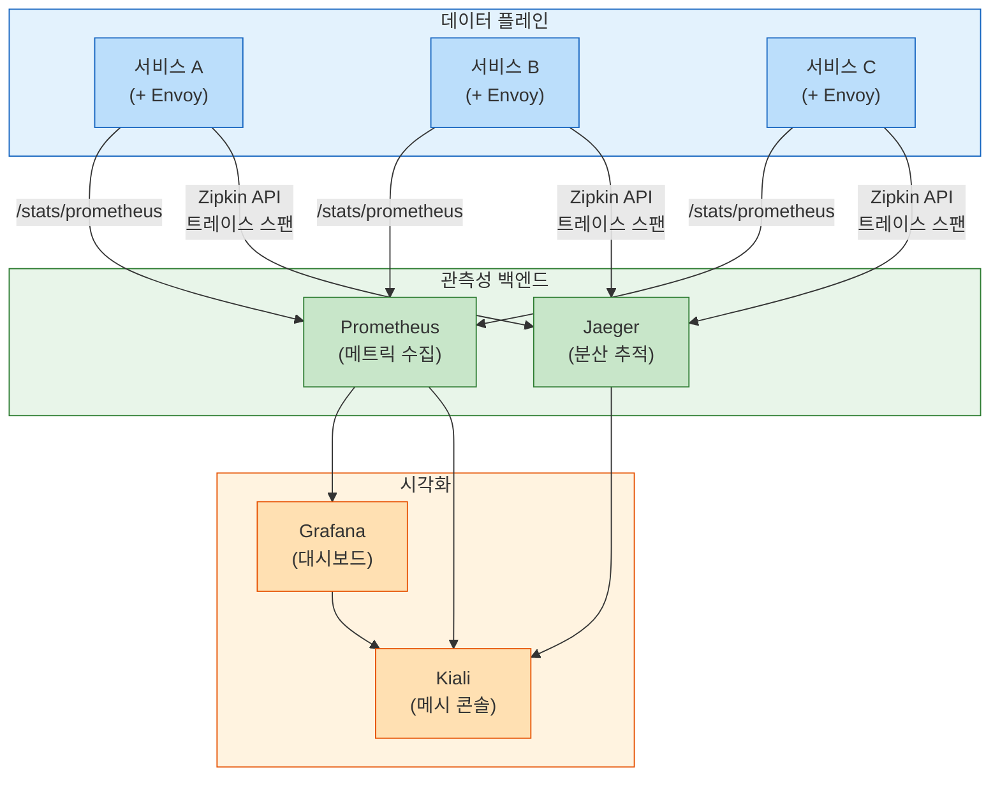
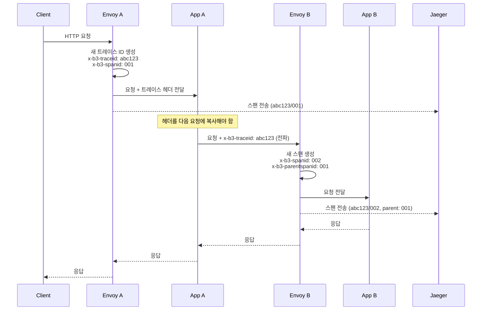
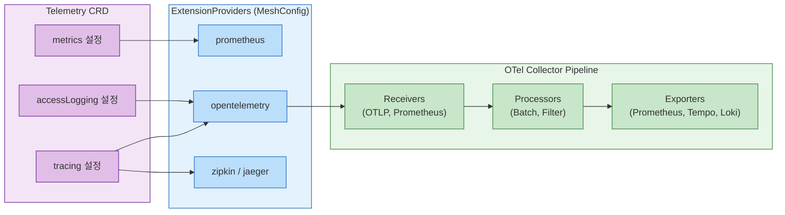

# Ch16. Istio 관측성

> **📌 핵심 요약**
>
> Istio 관측성의 핵심은 "애플리케이션이 아닌 인프라가 텔레메트리를 생성한다"는 점이다. Envoy 프록시가 모든 트래픽을 가로채어 메트릭, 분산 추적, 액세스 로그를 자동으로 생성한다. 그 결과 개발자는 코드를 수정하지 않고도 서비스 간 통신의 전모를 관찰할 수 있다. 단, 분산 추적에서 트레이스 헤더 전파는 애플리케이션의 몫으로 남는다.

---

## 🎯 학습 목표

1. Istio 관측성 스택(Prometheus, Grafana, Jaeger, Kiali)의 역할 분담을 설명할 수 있다
2. Istio 표준 메트릭의 레이블 구조와 주요 PromQL 쿼리를 작성할 수 있다
3. 분산 추적에서 애플리케이션이 반드시 처리해야 하는 헤더 전파를 이해한다
4. Kiali 그래프 뷰에서 트래픽 흐름과 설정 오류를 해석할 수 있다
5. Telemetry API로 추적 샘플링 비율과 액세스 로그를 설정할 수 있다
6. OpenTelemetry Collector를 Istio 텔레메트리 파이프라인에 통합하는 방법을 이해한다
7. Istio와 Linkerd 관측성의 트레이드오프를 비교해 설명할 수 있다

---

## 1. Istio 관측성의 구조

### 1.1 "무료" 텔레메트리의 의미와 한계

Istio가 "무료 관측성"을 제공한다는 말은 정확히 절반만 맞다. Envoy 사이드카가 모든 인바운드/아웃바운드 트래픽을 가로채 메트릭과 스팬을 자동 생성하는 것은 사실이다. 그러나 분산 추적이 의미 있게 동작하려면 애플리케이션이 트레이스 헤더를 다음 서비스로 전달해야 한다. 이 부분은 자동화되지 않는다.

비유하자면 국도에 자동 속도 측정 카메라를 설치한 것과 같다. 카메라가 각 지점의 속도를 측정하지만(Envoy가 스팬 생성), 차량 번호판을 추적해 경로를 재구성하려면(분산 추적) 번호판 자체가 일관된 추적 ID를 가져야 한다(헤더 전파).

### 1.2 관측성 스택 전체 구조



---

## 2. 표준 메트릭

### 2.1 메트릭의 종류

Istio는 Envoy의 통계를 Prometheus 형식으로 노출한다. 핵심 메트릭은 두 범주로 나뉜다.

**HTTP/gRPC 메트릭**은 요청 단위 통계를 추적한다. `istio_requests_total`은 요청 수를 카운트하며, `response_code` 레이블로 HTTP 상태 코드를 구분한다. `istio_request_duration_milliseconds`는 히스토그램 형식으로 레이턴시 분포를 기록한다. `istio_request_bytes`와 `istio_response_bytes`는 페이로드 크기를 추적한다.

**TCP 메트릭**은 연결 단위 통계를 제공한다. `istio_tcp_sent_bytes_total`과 `istio_tcp_received_bytes_total`은 바이트 전송량을, `istio_tcp_connections_opened_total`과 `istio_tcp_connections_closed_total`은 연결 수명을 추적한다.

### 2.2 레이블 구조

메트릭의 진정한 가치는 레이블에 있다. 동일한 `istio_requests_total`이라도 레이블 조합으로 세밀한 분석이 가능하다.

| 레이블 | 설명 | 예시 |
|--------|------|------|
| `reporter` | 메트릭 보고 주체 | `source` (발신측 Envoy), `destination` (수신측 Envoy) |
| `source_workload` | 발신 워크로드 이름 | `frontend` |
| `source_namespace` | 발신 네임스페이스 | `production` |
| `destination_service` | 대상 서비스 FQDN | `backend.production.svc.cluster.local` |
| `destination_workload` | 대상 워크로드 이름 | `backend-v2` |
| `response_code` | HTTP 응답 코드 | `200`, `500`, `503` |
| `response_flags` | Envoy 응답 플래그 | `UH` (업스트림 비정상), `UT` (업스트림 타임아웃) |
| `connection_security_policy` | 보안 정책 | `mutual_tls`, `none` |

`response_flags`는 특히 유용하다. HTTP 500은 애플리케이션 에러와 인프라 에러를 구분하지 못하지만, `response_flags`가 `UO`(업스트림 오버플로, 서킷브레이커 발동)라면 애플리케이션 버그가 아닌 부하 관련 문제임을 즉시 알 수 있다.

### 2.3 핵심 PromQL 쿼리

```promql
# 서비스별 에러율 (5xx 비율)
sum(rate(istio_requests_total{
  reporter="destination",
  destination_service="backend.production.svc.cluster.local",
  response_code=~"5.*"
}[5m]))
/
sum(rate(istio_requests_total{
  reporter="destination",
  destination_service="backend.production.svc.cluster.local"
}[5m]))

# p99 레이턴시 (밀리초)
histogram_quantile(0.99,
  sum(rate(istio_request_duration_milliseconds_bucket{
    reporter="destination",
    destination_workload="backend"
  }[5m])) by (le)
)

# 워크로드별 초당 요청 수 (RPS)
sum(rate(istio_requests_total{
  reporter="destination"
}[1m])) by (destination_workload, destination_namespace)
```

`reporter="destination"`으로 필터링하면 수신측 관점의 메트릭만 집계된다. 같은 요청을 발신측과 수신측 모두에서 기록하기 때문에, 이를 구분하지 않으면 수치가 두 배로 계산된다.

---

## 3. Prometheus 연동

### 3.1 스크래핑 구조

Istio는 Prometheus 스크래핑을 위해 두 가지 방식을 지원한다. 기본 방식은 Envoy가 노출하는 `/stats/prometheus` 엔드포인트를 istiod가 Prometheus에 알려주는 서비스 디스커버리 기반이다.

각 Pod에는 Prometheus 어노테이션이 자동으로 추가되어 있다.

```yaml
annotations:
  prometheus.io/scrape: "true"
  prometheus.io/port: "15090"    # Envoy 프록시 메트릭 포트
  prometheus.io/path: "/stats/prometheus"
```

Prometheus는 이 어노테이션을 발견해 15090 포트의 `/stats/prometheus`에서 메트릭을 수집한다. 애플리케이션 자체 메트릭(예: 15020 포트)도 같은 방식으로 통합된다.

### 3.2 메트릭 병합

Istio 1.6부터 `meshConfig.enablePrometheusMerge: true`(기본값)가 활성화되면 Envoy 메트릭과 애플리케이션 메트릭이 단일 엔드포인트(포트 15020)로 병합된다. Prometheus가 Pod당 한 번만 스크래핑하면 되어 수집 오버헤드가 줄어든다.

---

## 4. Grafana 대시보드

### 4.1 공식 제공 대시보드

Istio는 Grafana 대시보드를 사전 구성해 제공한다. 각 대시보드는 관점이 다르다.

**Istio Mesh Dashboard**는 메시 전체의 요약을 보여준다. 전체 RPS, 전역 에러율, 서비스 목록과 각 서비스의 건강 상태를 한눈에 확인할 수 있다. 인시던트 감지의 첫 번째 확인 지점이다.

**Istio Service Dashboard**는 단일 서비스에 집중한다. 인바운드/아웃바운드 트래픽을 구분해 보여주며, 클라이언트별 레이턴시 분포와 에러 현황을 분석할 수 있다. "어떤 클라이언트가 이 서비스에 가장 많은 에러를 유발하는가?"를 파악하는 데 유용하다.

**Istio Workload Dashboard**는 Pod 수준까지 내려간다. 개별 워크로드의 CPU/메모리 대비 요청 처리량을 비교할 수 있어 오토스케일링 임계값 설정에 참고할 수 있다.

### 4.2 핵심 패널 해석

- **Success Rate**: `(1 - 에러율) × 100`. SLO(예: 99.9%)와 대비해 SLI로 활용한다.
- **p50/p90/p99 Latency**: 중앙값(p50), 상위 10%(p90), 상위 1%(p99) 레이턴시. 꼬리 레이턴시(p99)가 평균과 크게 다르면 노이지 네이버(Noisy Neighbor) 문제나 가비지 컬렉션 이슈를 의심한다.
- **Request Volume**: 트래픽 급증이 에러율 증가와 동기화되는지 확인한다. 트래픽 없이 에러가 발생하면 외부 요인(데이터베이스 연결 실패 등)을 의심한다.

---

## 5. Kiali — 서비스 메시 콘솔

### 5.1 역할과 차별점

Kiali는 단순한 메트릭 대시보드가 아니다. Prometheus(메트릭), Jaeger(추적), Grafana(대시보드), istiod(설정)를 모두 통합해 서비스 메시를 단일 창으로 관리하는 콘솔이다. 특히 설정 유효성 검사 기능이 차별화된다. Grafana는 트래픽이 "얼마나 느린지"를 알려주지만, Kiali는 "왜 느린지"를 설정 오류 관점에서 추론하는 데 도움을 준다.

### 5.2 그래프 뷰

Kiali 그래프는 실시간 서비스 토폴로지를 시각화한다. 각 노드는 워크로드, 서비스, 또는 가상 노드(외부 트래픽 진입점)를 나타내고, 엣지는 트래픽 흐름을 보여준다.

엣지 색상은 건강 상태를 나타낸다. 초록색은 정상(에러율 낮음), 노란색은 경고(에러율 20% 이상), 빨간색은 위험(에러율 높음)이다. 엣지 굵기는 상대적 트래픽 양을 나타낸다.

노드에 표시되는 아이콘도 중요하다. 자물쇠 아이콘은 mTLS 적용 여부를, 경고 삼각형은 설정 오류를 나타낸다. 경고 삼각형을 클릭하면 구체적인 오류 메시지와 수정 방법을 제안한다.

### 5.3 유효성 검사 기능

Kiali는 Istio 설정의 일반적인 실수를 자동으로 감지한다.

- `VirtualService`가 존재하지 않는 `DestinationRule` 서브셋을 참조하는 경우
- `AuthorizationPolicy`의 셀렉터가 어떤 Pod와도 매칭되지 않는 경우
- `Gateway`가 연결된 `VirtualService` 없이 독립적으로 존재하는 경우
- `PeerAuthentication`이 STRICT이지만 mTLS가 아닌 연결이 감지되는 경우

### 5.4 Wizard를 통한 설정

Kiali는 복잡한 YAML 없이 UI 마법사로 트래픽 정책을 설정하는 기능을 제공한다. 트래픽 분할(Canary), 서킷 브레이커, 재시도 정책을 클릭 몇 번으로 생성할 수 있다. 내부적으로는 `VirtualService`와 `DestinationRule` YAML을 생성하므로, 생성된 YAML을 GitOps 저장소에 커밋하는 워크플로우와 잘 맞는다.

---

## 6. 분산 추적

### 6.1 Envoy의 자동 스팬 생성

Envoy는 서비스에 들어오는 요청마다 새로운 스팬을 자동으로 생성한다. 스팬에는 요청 시작/종료 시각, HTTP 메서드/경로/응답 코드, 업스트림 클러스터 정보가 포함된다. 이 스팬은 Zipkin 호환 API를 통해 Jaeger 같은 백엔드로 전송된다.

### 6.2 헤더 전파: 개발자의 의무

분산 추적의 핵심 요구사항은 "한 서비스에 도착한 트레이스 헤더를 다음 서비스 호출 시 그대로 전달해야 한다"는 것이다. Envoy는 자신이 처리하는 요청의 스팬은 생성하지만, A → B → C 호출 체인에서 A의 트레이스 ID가 C까지 이어지게 하려면 B 애플리케이션이 수신한 헤더를 C로의 요청에 포함시켜야 한다.



전파해야 하는 헤더는 사용하는 추적 형식에 따라 다르다.

- **B3 형식(Zipkin)**: `x-b3-traceid`, `x-b3-spanid`, `x-b3-parentspanid`, `x-b3-sampled`, `x-b3-flags`
- **W3C TraceContext**: `traceparent`, `tracestate`

Spring Boot라면 Spring Cloud Sleuth(또는 Micrometer Tracing)가, Go라면 go.opentelemetry.io/otel 라이브러리가 이 전파를 자동으로 처리한다. 언어별 OpenTelemetry SDK를 도입하는 것이 현재 권장 방식이다.

### 6.3 샘플링 설정

모든 요청을 추적하면 성능 부하와 저장 비용이 크다. 기본 샘플링 비율은 1%(0.01)다. 이를 변경하려면 `Telemetry` CRD를 사용한다.

```yaml
apiVersion: telemetry.istio.io/v1alpha1
kind: Telemetry
metadata:
  name: tracing-config
  namespace: production
spec:
  tracing:
  - providers:
    - name: jaeger
    randomSamplingPercentage: 5.0    # 5%로 증가
```

프로덕션에서는 낮은 샘플링 비율(0.1~1%)을 유지하되, 에러가 발생한 요청은 반드시 추적하도록 헤드 기반 샘플링(Head-based)과 테일 기반 샘플링(Tail-based)을 조합하는 전략이 권장된다.

---

## 7. OpenTelemetry 연동

### 7.1 Telemetry API 개요

Istio 1.12에서 도입된 `Telemetry` CRD는 Envoy의 텔레메트리 동작을 선언적으로 제어한다. 이전에는 `EnvoyFilter`로 직접 Envoy 설정을 패치해야 했지만, Telemetry API는 훨씬 간결하고 안전하다.



### 7.2 OTel Collector를 통한 통합 파이프라인

OpenTelemetry Collector는 메트릭, 추적, 로그를 단일 파이프라인으로 처리하는 벤더 중립 수집기다. Istio에서 OTel Collector를 활용하면 다음과 같은 이점이 생긴다.

첫째, 백엔드를 변경해도 애플리케이션 설정을 건드릴 필요가 없다. Jaeger에서 Tempo로 마이그레이션한다면 OTel Collector의 Exporter 설정만 바꾸면 된다.

둘째, 데이터 처리를 중앙에서 제어할 수 있다. 민감한 헤더를 필터링하거나, 특정 서비스의 데이터를 다른 저장소로 라우팅하거나, 배치 처리로 네트워크 비용을 줄이는 것이 가능하다.

```yaml
# MeshConfig에 OTel Provider 등록
extensionProviders:
- name: otel-collector
  opentelemetry:
    service: otel-collector.monitoring.svc.cluster.local
    port: 4317    # gRPC OTLP

---
# Telemetry CRD로 OTel 추적 활성화
apiVersion: telemetry.istio.io/v1alpha1
kind: Telemetry
metadata:
  name: otel-tracing
  namespace: istio-system    # 메시 전체 적용
spec:
  tracing:
  - providers:
    - name: otel-collector
    randomSamplingPercentage: 1.0
```

### 7.3 액세스 로깅

Envoy는 처리한 모든 요청의 액세스 로그를 생성할 수 있다. 기본적으로는 비활성화되어 있으며, 활성화 시 성능 비용(CPU, I/O)이 발생한다. 프로덕션에서는 전체 활성화보다 특정 네임스페이스나 문제 있는 워크로드에만 선택적으로 활성화하는 것이 바람직하다.

```yaml
apiVersion: telemetry.istio.io/v1alpha1
kind: Telemetry
metadata:
  name: access-log
  namespace: production
spec:
  accessLogging:
  - providers:
    - name: otel-collector
  - disabled: false
    match:
      mode: CLIENT_AND_SERVER    # 발신/수신 양쪽 모두
```

JSON 형식의 액세스 로그는 Loki 같은 로그 백엔드에 저장하고 Grafana에서 Tempo(추적)와 상관관계(Correlation)를 맺어 트레이스 ID로 로그를 조회하는 워크플로우가 최근 많이 활용된다.

---

## 8. Istio vs Linkerd 관측성 비교

두 서비스 메시 모두 강력한 관측성을 제공하지만 철학이 다르다. 어느 쪽이 "더 좋다"고 단정할 수 없고, 팀의 성숙도와 요구사항에 따라 선택이 달라진다.

| 항목 | Istio | Linkerd |
|------|-------|---------|
| 전용 UI | Kiali (별도 설치) | 내장 대시보드 |
| 메트릭 세밀도 | 높음 (레이블 다양) | 기본적 (간결) |
| 분산 추적 | 자동 스팬 + 헤더 전파 필요 | 동일 |
| CLI 관측 | `istioctl` | `linkerd viz top/tap/stat` |
| 초기 설정 비용 | 높음 (Prometheus+Grafana+Jaeger+Kiali) | 낮음 (내장) |
| Ambient 관측성 | Kiali 지원 추가 중 | 해당 없음 |

Linkerd의 `linkerd viz tap`은 실시간으로 개별 요청을 터미널에서 스트리밍한다. Kubectl logs와 유사하지만 HTTP 요청 수준이다. 디버깅 시 직관적이다. Istio의 Kiali는 UI 기반으로 더 많은 정보를 제공하지만 설정과 유지보수 부담이 있다.

팀 규모가 작고 빠르게 시작해야 한다면 Linkerd의 단순한 관측성이 유리하다. 반면 다중 클러스터, 세밀한 메트릭, 풍부한 시각화가 필요한 엔터프라이즈 환경이라면 Istio + Kiali 조합이 적합하다.

---

## 면접 대비

**Q1. Istio에서 분산 추적이 자동으로 동작하지 않는 이유와 애플리케이션이 해야 할 일을 설명하세요.**

Envoy는 인바운드 요청마다 스팬을 생성하지만 서비스 간 호출 체인을 자동으로 연결하지는 않는다. 트레이스 ID(`x-b3-traceid`)는 서비스 A에서 서비스 B로 자동 전달되지 않기 때문에, 서비스 A 애플리케이션이 수신한 트레이스 헤더를 서비스 B로의 아웃바운드 요청에 포함시켜야 한다. 전파해야 하는 헤더는 B3 형식(`x-b3-traceid`, `x-b3-spanid` 등) 또는 W3C TraceContext(`traceparent`)다. OpenTelemetry SDK를 사용하면 이 전파를 자동으로 처리할 수 있다.

**Q2. Kiali가 Grafana와 다른 차별점은 무엇인가요?**

Grafana는 시계열 데이터 시각화 도구로, 이미 수집된 메트릭을 대시보드로 보여준다. Kiali는 서비스 메시 전용 콘솔로 메트릭(Prometheus), 추적(Jaeger), Istio 설정(istiod)을 통합한다. 가장 중요한 차별점은 설정 유효성 검사다. Kiali는 `VirtualService`가 존재하지 않는 서브셋을 참조하거나, 셀렉터가 어떤 Pod와도 매칭되지 않는 `AuthorizationPolicy`를 감지해 경고를 표시한다. 또한 실시간 서비스 토폴로지 그래프로 트래픽 흐름을 시각화하는 기능은 Grafana에 없다.

**Q3. `reporter="source"`와 `reporter="destination"`의 차이를 설명하고, 에러율 계산 시 어떤 것을 사용해야 하나요?**

`reporter="source"`는 발신측 Envoy가 보고한 메트릭으로, 클라이언트 관점의 레이턴시와 에러를 반영한다. `reporter="destination"`은 수신측 Envoy가 보고한 메트릭으로, 실제 서비스가 처리한 결과를 반영한다. 에러율 계산에는 `reporter="destination"`을 권장한다. 발신측은 네트워크 타임아웃, 서킷브레이커 발동 같은 Envoy 수준의 에러를 포함하지만 수신측은 실제 HTTP 응답 코드를 기록하기 때문에 더 정확하다. 두 값의 차이가 크다면 네트워크 계층 문제를 의심한다.

**Q4. Telemetry CRD가 도입되기 전에 Istio 텔레메트리를 설정하던 방식과 비교해 장점을 설명하세요.**

Telemetry CRD 이전에는 `EnvoyFilter`로 Envoy 설정을 직접 패치해야 했다. EnvoyFilter는 Envoy 내부 구조를 알아야 하고, 잘못 작성하면 파악하기 어려운 방식으로 실패한다. 또한 Istio 버전 업그레이드 시 Envoy 내부 구조가 바뀌면 EnvoyFilter가 깨지는 경우가 많다. Telemetry API는 선언적 추상화 계층을 제공해 이런 문제를 해결한다. 네임스페이스나 워크로드 수준으로 샘플링 비율, 액세스 로깅, 메트릭 제공자를 독립적으로 설정할 수 있어 GitOps 방식의 운영에도 적합하다.

**Q5. 고트래픽 프로덕션 환경에서 분산 추적 샘플링 전략을 어떻게 설계하나요?**

단일 고정 비율 샘플링(예: 1%)은 트래픽이 적을 때는 충분한 데이터를 수집하지 못하고, 트래픽이 많을 때는 불필요하게 많은 스토리지를 사용한다. 권장 전략은 두 단계 샘플링이다. 첫 번째는 헤드 기반 샘플링(Head-based)으로 요청 시작 시점에 비율로 결정한다. Istio의 `randomSamplingPercentage`가 이에 해당한다. 두 번째는 테일 기반 샘플링(Tail-based)으로 요청이 완료된 후 에러 여부, 레이턴시 임계값 초과 등을 기준으로 저장 여부를 결정한다. OTel Collector의 Tail Sampling Processor가 이 역할을 담당하며, "에러가 있는 요청은 100% 저장, 정상 요청은 1% 저장" 같은 정책을 선언적으로 설정할 수 있다.

---

## 체크리스트

- [ ] `istio_requests_total`의 주요 레이블(reporter, response_code, response_flags)을 설명할 수 있다
- [ ] 에러율과 p99 레이턴시를 계산하는 PromQL 쿼리를 작성할 수 있다
- [ ] Kiali 그래프 뷰에서 설정 오류 경고를 식별하고 원인을 파악할 수 있다
- [ ] B3와 W3C TraceContext 헤더 형식의 차이를 설명할 수 있다
- [ ] 서비스 A → B → C 추적 체인에서 B 애플리케이션이 해야 하는 헤더 전파를 구현할 수 있다
- [ ] Telemetry CRD로 샘플링 비율을 변경하는 YAML을 작성할 수 있다
- [ ] OTel Collector를 Istio 텔레메트리 파이프라인에 통합하는 설정을 이해한다
- [ ] `reporter="source"`와 `reporter="destination"`의 차이를 설명하고 올바른 사용 상황을 구분할 수 있다
- [ ] Istio와 Linkerd 관측성의 트레이드오프를 팀 규모와 요구사항 관점에서 비교할 수 있다
- [ ] 액세스 로깅이 기본 비활성화인 이유와 선택적 활성화 전략을 설명할 수 있다

---

## 참고 자료

- [Istio Observability Concepts](https://istio.io/latest/docs/concepts/observability/)
- [Istio Metrics Reference](https://istio.io/latest/docs/reference/config/metrics/)
- [Telemetry API Reference](https://istio.io/latest/docs/reference/config/telemetry/)
- [Kiali Documentation](https://kiali.io/docs/)
- [Jaeger Distributed Tracing](https://www.jaegertracing.io/docs/)
- [OpenTelemetry Collector](https://opentelemetry.io/docs/collector/)
- [Istio Distributed Tracing](https://istio.io/latest/docs/tasks/observability/distributed-tracing/)
- [Prometheus Istio Integration](https://istio.io/latest/docs/ops/integrations/prometheus/)
