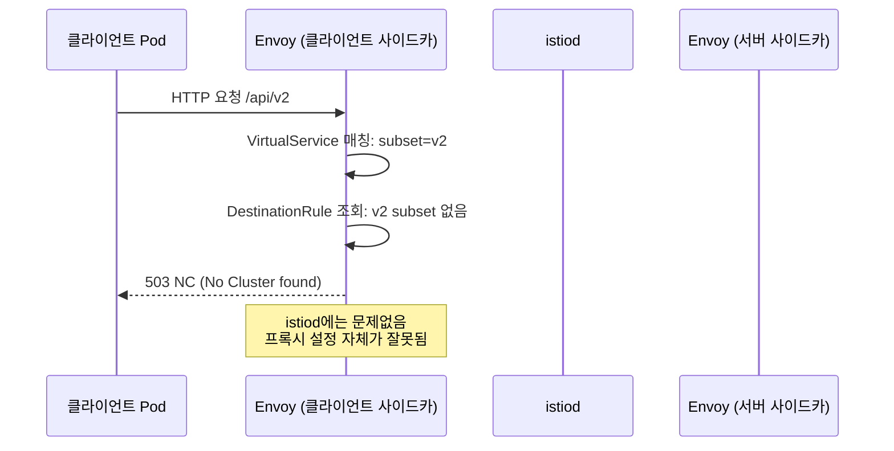

# Ch17. Istio 트러블슈팅

> 📌 **핵심 요약**: Istio 트러블슈팅은 "데이터 플레인 문제인가, 컨트롤 플레인 문제인가"를 먼저 구분하는 것에서 시작한다. `istioctl proxy-status`로 동기화 상태를 확인하고, Envoy Admin Interface와 `istioctl proxy-config` 명령어 체계로 설정 불일치를 추적한다. 텔레메트리(Grafana 클라이언트/서버 관점 비교, Prometheus `response_flags` 쿼리)는 문제의 범위를 좁히는 데 쓰고, Envoy Access Log와 Response Flag는 최종 원인을 확정하는 데 활용한다.

---

## 🎯 학습 목표

1. 데이터 플레인과 컨트롤 플레인 문제를 `istioctl proxy-status`로 구분할 수 있다
2. `istioctl analyze`와 `istioctl describe`로 설정 오류를 정적·런타임 두 단계에서 탐지할 수 있다
3. Envoy Admin Interface와 `istioctl proxy-config` 명령어 체계를 통해 Listener → Route → Cluster → Endpoint 흐름으로 문제를 추적할 수 있다
4. Envoy Response Flag(UT, UO, UC, NR, DC)의 의미를 해석하고 대응 방향을 결정할 수 있다
5. Grafana 클라이언트/서버 관점 실패율 비교와 Prometheus `irate` 쿼리로 문제 범위를 좁힐 수 있다
6. Istio 구성 요소의 디버그 엔드포인트(`/debug/adsz`, `/debug/syncz` 등)를 활용해 컨트롤 플레인 문제를 진단할 수 있다
7. 503 NC, 504 UT, 503 UO 세 가지 실전 시나리오를 단계적 절차로 해결할 수 있다

---

## 1. 트러블슈팅 접근 방법론

### 1.1 데이터 플레인 vs 컨트롤 플레인 문제 구분

Istio 트러블슈팅에서 가장 먼저 해야 할 질문은 "문제가 데이터 플레인(Envoy 프록시)에 있는가, 컨트롤 플레인(istiod)에 있는가"다. 이 구분 없이 바로 로그를 뒤지기 시작하면 수십 분을 엉뚱한 곳에서 보내게 된다.

데이터 플레인 문제는 주로 트래픽 처리 단계에서 드러난다. 특정 서비스로의 요청이 503이나 504를 반환하거나, 연결이 갑자기 끊기거나, 타임아웃이 빈번하게 발생한다. 애플리케이션 로그에는 아무 이상이 없는데 네트워크 레이어에서 실패가 반복된다면 데이터 플레인을 먼저 의심한다.

컨트롤 플레인 문제는 설정 변경 이후에 나타난다. VirtualService나 DestinationRule을 배포했는데 반영이 안 되거나, 새 서비스를 배포했는데 메시에서 인식하지 못한다. 또는 `istioctl proxy-status`에서 STALE 상태가 여러 프록시에 걸쳐 나타날 때다.

두 레이어의 문제가 동시에 나타나는 경우도 있다. 컨트롤 플레인이 잘못된 설정을 프록시에 배포했고, 그 잘못된 설정이 데이터 플레인 에러를 유발하는 경우다. 이때는 컨트롤 플레인부터 수정해야 데이터 플레인 문제도 함께 해결된다.

### 1.2 istioctl proxy-status로 동기화 상태 확인

`istioctl proxy-status`는 컨트롤 플레인이 각 Envoy 프록시에 설정을 성공적으로 배포했는지를 확인하는 첫 번째 진단 도구다. 출력에는 각 프록시별로 CDS(Cluster Discovery Service), LDS(Listener Discovery Service), EDS(Endpoint Discovery Service), RDS(Route Discovery Service)의 동기화 상태가 표시된다.

```bash
istioctl proxy-status
```

상태값은 세 가지다. `SYNCED`는 컨트롤 플레인의 최신 설정이 프록시에 정상 반영된 상태다. `STALE`은 istiod가 설정을 전송했지만 프록시가 아직 ACK를 돌려보내지 않은 상태로, 일시적이라면 정상이지만 오래 지속되면 네트워크 문제나 프록시 과부하를 의심한다. `NOT SENT`는 istiod가 아직 해당 프록시에 설정을 전송하지 않은 상태다.

```bash
NAME                                      CDS        LDS        EDS        RDS
productpage-v1-xxxx.default               SYNCED     SYNCED     SYNCED     SYNCED
ratings-v1-xxxx.default                   STALE      SYNCED     SYNCED     SYNCED
```

특정 프록시의 상세 동기화 상태를 보려면 `istioctl proxy-status <pod-name>.<namespace>`를 실행한다. STALE 상태가 특정 서비스에서만 반복된다면 해당 프록시의 리소스 상태(메모리, CPU 스로틀링)를 확인한다.

---

## 2. 설정 오류 탐지

### 2.1 istioctl analyze — 정적 분석

`istioctl analyze`는 클러스터에 배포된 Istio 설정 리소스를 정적으로 분석해 오류와 경고를 보고하는 도구다. 실제 트래픽을 발생시키지 않고도 설정 오류를 사전에 찾을 수 있어 CI/CD 파이프라인에 통합하기 좋다.

```bash
# 현재 클러스터 전체 분석
istioctl analyze

# 특정 네임스페이스
istioctl analyze -n production

# 로컬 파일 분석 (배포 전 검증)
istioctl analyze my-virtualservice.yaml
```

가장 자주 마주치는 오류 코드는 `IST0101`이다. "Referenced selector not found in namespace" 메시지와 함께 출력되며, VirtualService가 참조하는 서비스나 DestinationRule의 subset이 실제로 존재하지 않을 때 발생한다. DestinationRule에 `v2` subset을 정의했는데 해당 레이블을 가진 Pod가 없는 경우가 대표적이다.

```
Warning [IST0101] (VirtualService bookinfo.default) Referenced host+subset in destinationrule
not found: "reviews"+"v2"
```

`analyze` 결과를 항상 배포 전에 확인하는 습관을 들이면 런타임에서 503 NC 에러를 마주치는 경우를 크게 줄일 수 있다.

### 2.2 istioctl describe — 런타임 상태 확인

`istioctl analyze`가 설정 파일의 문법과 참조 관계를 검사한다면, `istioctl describe`는 특정 Pod가 실제로 어떤 Istio 정책 아래에 놓여 있는지를 런타임 관점에서 보여준다. 이 명령어는 해당 Pod에 적용된 VirtualService, DestinationRule, AuthorizationPolicy, PeerAuthentication을 한눈에 확인할 수 있다.

```bash
istioctl describe pod <pod-name> -n <namespace>
```

출력 예시를 보면 "This pod is NOT on the mesh" 같은 메시지가 나올 때 사이드카가 주입되지 않은 상태임을 바로 알 수 있다. 또한 적용된 VirtualService의 라우팅 규칙 요약, mTLS 모드(STRICT/PERMISSIVE/DISABLED), 적용 중인 AuthorizationPolicy도 같이 표시된다. `proxy-status`가 전체 그림을 보여준다면, `describe`는 특정 Pod에 집중한 진단이다.

### 2.3 Kiali 설정 검증

Kiali는 Istio 설정 오류를 시각적으로 표시하는 서비스 그래프 도구다. 좌측 패널의 "Istio Config" 메뉴에서 경고와 오류를 확인할 수 있으며, 특히 `KIA1107` 경고가 중요하다.

`KIA1107`은 "Subset not found" 경고로, DestinationRule에 정의된 subset이 VirtualService에서 참조되지만 실제로 매칭되는 Pod가 없을 때 발생한다. `istioctl analyze`의 `IST0101`과 같은 문제를 UI에서 시각적으로 보여주는 것이다. Kiali 서비스 그래프에서 빨간색으로 표시된 엣지나 노드는 현재 오류가 있는 통신 경로를 나타내므로, 장애 발생 시 Kiali 그래프를 가장 먼저 열어보면 영향 범위를 빠르게 파악할 수 있다.

---

## 3. Envoy 프록시 디버깅

### 3.1 Envoy Admin Interface (포트 15000)

각 Envoy 프록시는 포트 15000에 Admin Interface를 노출한다. 이 인터페이스는 프록시의 현재 상태, 설정, 통계, 로그 수준을 직접 조회하고 변경할 수 있는 HTTP API다.

```bash
# 포트 포워딩으로 접근
kubectl port-forward <pod-name> 15000:15000 -n <namespace>
```

포트 포워딩 후 브라우저나 curl로 `http://localhost:15000`에 접근하면 사용 가능한 엔드포인트 목록이 표시된다. 주요 엔드포인트는 다음과 같다.

- `/config_dump`: 현재 프록시에 로드된 전체 Envoy 설정을 JSON으로 출력한다
- `/stats/prometheus`: Prometheus 형식의 메트릭을 반환한다
- `/clusters`: 현재 알려진 업스트림 클러스터와 각 엔드포인트의 헬스 상태를 보여준다
- `/listeners`: 현재 바인딩된 리스너 목록을 출력한다
- `/logging`: 로그 레벨을 조회하거나 동적으로 변경한다

`/config_dump`는 Envoy가 실제로 어떤 설정으로 동작하는지 확인하는 가장 확실한 방법이다. istiod에서 배포한 설정이 의도대로 프록시에 반영됐는지 비교할 때 사용한다.

### 3.2 istioctl proxy-config 명령어 체계 (listener → route → cluster → endpoint)

`istioctl proxy-config`는 Envoy Admin Interface의 설정 데이터를 사람이 읽기 편한 형태로 가공해서 보여주는 CLI 래퍼다. 문제 추적의 순서는 Listener → Route → Cluster → Endpoint다. 이 순서를 따르는 이유는 요청이 처리되는 실제 흐름과 일치하기 때문이다.

**Listener 확인**: 요청이 처음 도달하는 곳이다. 특정 포트에서 리스너가 존재하는지 확인한다.

```bash
istioctl proxy-config listener <pod-name>.<namespace>
istioctl proxy-config listener <pod-name>.<namespace> --port 9080
```

**Route 확인**: 리스너가 요청을 어느 클러스터로 보내는지 라우팅 규칙을 확인한다. VirtualService의 규칙이 제대로 반영됐는지 여기서 검증한다.

```bash
istioctl proxy-config route <pod-name>.<namespace>
istioctl proxy-config route <pod-name>.<namespace> --name 9080
```

**Cluster 확인**: 라우트가 참조하는 업스트림 클러스터가 존재하는지, 어떤 로드밸런싱 정책을 사용하는지 확인한다. DestinationRule의 subset 설정이 여기 반영된다.

```bash
istioctl proxy-config cluster <pod-name>.<namespace>
istioctl proxy-config cluster <pod-name>.<namespace> --fqdn reviews.default.svc.cluster.local
```

**Endpoint 확인**: 클러스터가 알고 있는 실제 백엔드 엔드포인트(Pod IP)를 확인한다. 엔드포인트가 비어 있다면 서비스 디스커버리 문제다.

```bash
istioctl proxy-config endpoint <pod-name>.<namespace>
istioctl proxy-config endpoint <pod-name>.<namespace> --cluster "outbound|9080|v2|reviews.default.svc.cluster.local"
```

이 네 단계를 순서대로 밟으면 "어느 레이어에서 요청이 막히는지"를 정확히 찾을 수 있다.

### 3.3 config_dump 분석

`istioctl proxy-config`로 해결되지 않는 경우 `config_dump`를 직접 분석한다. `config_dump`는 Envoy가 현재 보유한 모든 설정(Static Resources + Dynamic Resources)을 원시 JSON으로 출력하므로 데이터 양이 매우 많다.

```bash
kubectl exec <pod-name> -c istio-proxy -- curl -s localhost:15000/config_dump | python3 -m json.tool | less
```

특정 정보를 찾을 때는 `jq`로 필터링한다.

```bash
# 특정 클러스터만 추출
kubectl exec <pod-name> -c istio-proxy -- curl -s localhost:15000/config_dump \
  | jq '.configs[] | select(."@type" | contains("ClustersConfigDump"))'
```

istiod가 배포한 설정과 `config_dump`의 Dynamic Resources를 비교하면 동기화 지연이나 부분 적용 문제를 확인할 수 있다.

---

## 4. 애플리케이션 문제 트러블슈팅

### 4.1 VirtualService 타임아웃 설정과 503/504 분석

VirtualService에 타임아웃을 설정하면 업스트림 서비스가 해당 시간 안에 응답하지 못할 경우 Envoy가 요청을 중단하고 `504 Gateway Timeout`을 반환한다. 이때 Access Log에는 Response Flag `UT`(Upstream request Timeout)가 기록된다.

```yaml
apiVersion: networking.istio.io/v1alpha3
kind: VirtualService
metadata:
  name: reviews
spec:
  hosts:
  - reviews
  http:
  - route:
    - destination:
        host: reviews
        subset: v1
    timeout: 0.5s   # 500ms 타임아웃
```

타임아웃을 너무 짧게 설정하면 정상적인 요청도 504로 실패한다. 반대로 너무 길게 설정하면 장애 서비스에 커넥션이 쌓여 전체 레이턴시가 높아진다. 적절한 타임아웃 값은 해당 서비스의 p99 레이턴시 * 1.5 정도가 시작점이다.

503 에러는 다양한 원인에서 발생하지만, Istio 환경에서 503의 특수한 원인은 DestinationRule subset 불일치(Response Flag: `NC`)다. VirtualService가 `v2` subset으로 라우팅하도록 설정됐는데 해당 subset을 DestinationRule에서 정의하지 않았거나, 정의된 subset에 매칭되는 Pod가 없을 때 발생한다.

### 4.2 Envoy Access Log (TEXT vs JSON)

기본적으로 Envoy Access Log는 TEXT 형식으로 출력된다. 이 형식은 읽기는 편하지만 로그 파이프라인에서 파싱하기 어렵다. 프로덕션에서는 JSON 형식으로 전환하는 것이 좋다.

MeshConfig에서 전역으로 JSON 형식을 활성화한다.

```yaml
apiVersion: v1
kind: ConfigMap
metadata:
  name: istio
  namespace: istio-system
data:
  mesh: |-
    accessLogEncoding: JSON
    accessLogFile: /dev/stdout
```

JSON Access Log의 주요 필드는 다음과 같다.

- `response_code`: HTTP 상태 코드
- `response_flags`: Envoy Response Flag (예: `UO`, `UT`, `NR`)
- `upstream_cluster`: 요청이 전달된 클러스터명
- `duration`: 요청 처리 총 시간(ms)
- `upstream_service_time`: 업스트림 처리 시간(ms)
- `x-forwarded-for`: 원본 클라이언트 IP
- `route_name`: 매칭된 라우트 이름

JSON 형식은 Elasticsearch나 Loki로 수집할 때 자동 파싱이 가능해 대시보드 구성이 쉬워진다.

### 4.3 Envoy Response Flags (UO, UC, UT, NR, DC 등)

Response Flag는 Envoy가 요청을 처리하는 중 발생한 이벤트의 원인을 나타내는 짧은 코드다. 503이나 504가 발생했을 때 Access Log에서 이 코드를 확인하면 "왜 실패했는가"를 바로 알 수 있다.

| Flag | 의미 | 주요 원인 |
|------|------|----------|
| `UO` | Upstream Overflow (서킷 브레이커 트리거) | DestinationRule의 connectionPool 임계값 초과 |
| `UC` | Upstream Connection termination | 업스트림이 연결을 먼저 종료 |
| `UT` | Upstream request Timeout | VirtualService timeout 초과 |
| `NR` | No Route found | VirtualService 라우팅 규칙에 매칭되는 라우트 없음 |
| `DC` | Downstream Connection termination | 클라이언트가 연결을 먼저 종료 |
| `NC` | No Cluster found | DestinationRule subset이 존재하지 않음 |
| `URX` | Upstream retry limit exceeded | 재시도 횟수 초과 |
| `UH` | No healthy Upstream host | 헬스체크를 통과한 업스트림 없음 |

`NR`은 VirtualService에 매칭되는 라우트가 없을 때 발생하므로, 라우팅 규칙의 헤더 조건이나 경로 설정을 재확인한다. `UO`는 서킷 브레이커가 열린 것이므로 업스트림 서비스의 실제 상태를 먼저 점검한다.

### 4.4 로그 레벨 조정 (connection, http, router, pool)

기본 로그 레벨에서는 요청의 개요만 기록되어 상세 원인 파악이 어렵다. Envoy Admin Interface를 통해 특정 컴포넌트의 로그 레벨을 동적으로 `debug`로 올릴 수 있다.

```bash
# 특정 Pod의 Envoy 로그 레벨을 debug로 변경
kubectl exec <pod-name> -c istio-proxy -- curl -X POST \
  "localhost:15000/logging?connection=debug&http=debug&router=debug&pool=debug"
```

- `connection`: TCP 연결 수립·종료 과정의 상세 로그
- `http`: HTTP 요청·응답 헤더, 상태 코드 상세 로그
- `router`: 라우팅 매칭 과정 상세 로그 (어떤 라우트에 매칭됐는지)
- `pool`: 커넥션 풀 상태, 커넥션 재사용 여부 로그

디버그 로그는 매우 많은 양이 생성되므로 문제 재현 후 빠르게 `info` 수준으로 되돌린다.

```bash
kubectl exec <pod-name> -c istio-proxy -- curl -X POST \
  "localhost:15000/logging?level=info"
```

---

## 5. 텔레메트리 기반 진단

### 5.1 Grafana에서 클라이언트/서버 관점 실패율 비교

Istio의 메트릭은 요청자(클라이언트 사이드카)와 수신자(서버 사이드카) 양쪽 모두에서 수집된다. 같은 요청에 대해 두 관점의 성공률이 다르게 나타날 수 있으며, 이 차이가 문제의 위치를 알려준다.

Grafana의 Istio Service Dashboard에서 "Incoming Requests Success Rate"(서버 관점)와 "Outgoing Requests Success Rate"(클라이언트 관점)를 비교한다.

```
클라이언트 실패 > 서버 실패: 클라이언트와 서버 사이 네트워크/프록시 문제
클라이언트 실패 = 서버 실패: 서버 애플리케이션 자체 문제
클라이언트 성공, 서버 실패 없음: 불가능 (보통 메트릭 수집 문제)
```

클라이언트 관점에서는 실패로 기록되지만 서버 관점에서는 정상으로 기록된다면, Envoy 프록시 자체(타임아웃, 서킷 브레이커, 재시도)가 요청을 처리하는 과정에서 실패가 발생한 것이다. 반대로 두 관점 모두 동일한 실패율이라면 서버 애플리케이션이나 서버 사이드 프록시에서 문제가 발생하고 있다.

### 5.2 Prometheus로 영향받는 파드 쿼리 (istio_requests_total + irate + sort_desc)

Prometheus에서 특정 실패 패턴이 어느 Pod에서 가장 많이 발생하는지 쿼리로 찾을 수 있다.

```promql
# 지난 5분간 초당 에러율이 높은 Pod 순서대로
sort_desc(
  irate(
    istio_requests_total{
      response_code!="200",
      destination_service_namespace="production"
    }[5m]
  )
)
```

`irate`는 즉각적인 변화율을 계산하므로 갑자기 에러가 급증하는 순간을 잡는 데 적합하다. `rate`는 평균이라 스파이크를 부드럽게 만들어버린다.

특정 Response Flag만 필터링하는 쿼리도 유용하다.

```promql
# DC(Downstream Connection termination) 플래그 발생률
sum by (source_workload, destination_workload) (
  irate(
    istio_requests_total{
      response_flags="DC",
      destination_service_namespace="production"
    }[5m]
  )
)
```

이 쿼리로 `DC` 플래그(클라이언트 연결 종료)가 특정 서비스 쌍에 집중되어 있다면 해당 클라이언트 서비스의 타임아웃 설정이나 네트워크 문제를 먼저 조사한다.

### 5.3 Envoy response_flags 기반 원인 분류

Prometheus의 `response_flags` 레이블을 기반으로 에러 원인을 자동 분류하는 쿼리를 만들 수 있다.

```promql
# Response Flag별 에러 분포
sum by (response_flags) (
  irate(
    istio_requests_total{
      response_code=~"5..",
      destination_service_namespace="production"
    }[5m]
  )
)
```

이 쿼리의 결과를 Grafana 파이 차트로 시각화하면 "현재 5xx 에러의 주요 원인"을 한눈에 파악할 수 있다. `UO`(서킷 브레이커)가 지배적이라면 업스트림 과부하 문제, `UT`(타임아웃)가 지배적이라면 성능 저하 문제로 방향을 잡는다.

---

## 6. Istio 구성 요소 디버깅

### 6.1 데이터 플레인 포트 정리 (15000, 15001, 15006, 15020, 15021, 15090)

Istio 사이드카는 여러 포트를 사용한다. 각 포트의 역할을 이해하면 네트워크 정책이나 방화벽 설정 문제를 빠르게 파악할 수 있다.

| 포트 | 컴포넌트 | 역할 |
|------|---------|------|
| 15000 | Envoy | Admin Interface (config_dump, stats, logging 조작) |
| 15001 | Envoy | Outbound 트래픽 처리 (iptables REDIRECT 목적지) |
| 15006 | Envoy | Inbound 트래픽 처리 (iptables REDIRECT 목적지) |
| 15020 | Pilot-agent | Prometheus 메트릭 집계 (Envoy + Pilot-agent 메트릭 병합) |
| 15021 | Pilot-agent | 헬스체크 엔드포인트 (`/healthz/ready`) |
| 15090 | Envoy | Prometheus 메트릭 직접 노출 |

Pod의 헬스체크가 실패한다면 15021 포트의 `/healthz/ready`가 응답하는지 확인한다. Prometheus가 메트릭을 수집하지 못한다면 15020 포트를 확인한다.

### 6.2 Pilot Agent 디버그 엔드포인트

Pilot-agent(Pod 내 `istio-proxy` 컨테이너의 메인 프로세스)는 Envoy를 관리하는 프로세스로, 자체 디버그 엔드포인트를 제공한다.

```bash
# Pilot-agent 상태 확인
kubectl exec <pod-name> -c istio-proxy -- curl localhost:15020/debug/pprof/
```

`/debug/pprof`는 Go 표준 pprof 엔드포인트로, CPU 프로파일링이나 메모리 사용 분석이 필요할 때 활용한다. Pilot-agent가 높은 CPU를 사용하거나 메모리 누수가 의심될 때 수집한다.

```bash
# 30초 CPU 프로파일 수집
kubectl exec <pod-name> -c istio-proxy -- curl -s "localhost:15020/debug/pprof/profile?seconds=30" > cpu.pprof
go tool pprof cpu.pprof
```

### 6.3 컨트롤 플레인 ControlZ (포트 9876)

ControlZ는 istiod 프로세스의 내부 상태를 웹 UI로 제공하는 진단 인터페이스다. 포트 9876에서 접근할 수 있으며, 로그 레벨 변경, 메모리 상태 확인, 활성 고루틴 확인 등이 가능하다.

```bash
kubectl port-forward deployment/istiod 9876:9876 -n istio-system
# 브라우저에서 http://localhost:9876 접근
```

ControlZ의 "Logging" 탭에서 istiod의 특정 컴포넌트 로그 레벨을 동적으로 변경할 수 있다. 예를 들어 xDS 배포 문제를 추적하려면 `ads` 컴포넌트를 `debug`로 올리면 istiod가 각 프록시에 설정을 배포하는 과정의 상세 로그를 볼 수 있다.

### 6.4 istiod 디버그 엔드포인트 (/debug/adsz, /debug/syncz 등)

istiod는 포트 8080(HTTP)과 15014(HTTPS)에서 다양한 디버그 엔드포인트를 제공한다.

```bash
kubectl port-forward deployment/istiod 8080:8080 -n istio-system
```

주요 엔드포인트는 다음과 같다.

- `/debug/adsz`: 현재 연결된 모든 프록시와 각 프록시에 배포된 xDS 리소스 목록. 특정 프록시가 istiod에 연결돼 있는지 확인한다
- `/debug/edsz`: Endpoint Discovery Service 상태. 각 서비스의 엔드포인트 목록을 확인한다
- `/debug/syncz`: 각 프록시의 동기화 상태 요약. `proxy-status`와 유사하지만 더 상세한 타임스탬프 정보가 포함된다
- `/debug/authorizationz`: 현재 적용 중인 AuthorizationPolicy를 파싱된 형태로 보여준다. 정책이 의도대로 해석됐는지 검증할 때 사용한다
- `/debug/configz`: istiod가 처리한 Kubernetes 리소스의 스냅샷. 직접 파싱한 결과이므로 CRD 문법 오류를 확인할 수 있다

```bash
# 특정 프록시의 동기화 상태 확인
curl http://localhost:8080/debug/syncz | jq '.[] | select(.proxy | contains("productpage"))'
```

---

## 7. 실전 트러블슈팅 시나리오

### 7.1 DestinationRule 누락으로 503 NC 에러

**증상**: 서비스 배포 후 특정 경로에서 503 에러가 발생한다. Access Log에 `response_flags: NC` 기록.

**원인**: VirtualService가 `subset: v2`로 라우팅하도록 설정됐는데, DestinationRule에 `v2` subset이 정의되지 않았다.



**해결 절차**:

1단계: Access Log에서 `NC` 플래그 확인.

```bash
kubectl logs <client-pod> -c istio-proxy | grep '"response_flags":"NC"'
```

2단계: `istioctl analyze`로 설정 오류 확인.

```bash
istioctl analyze -n <namespace>
# Warning [IST0101] Referenced host+subset not found: "reviews"+"v2"
```

3단계: DestinationRule에 누락된 subset 추가.

```yaml
apiVersion: networking.istio.io/v1alpha3
kind: DestinationRule
metadata:
  name: reviews
spec:
  host: reviews
  subsets:
  - name: v1
    labels:
      version: v1
  - name: v2
    labels:
      version: v2   # 이 subset이 누락되어 있었음
```

4단계: 배포 후 `istioctl proxy-status`로 동기화 확인, Access Log에서 `NC` 사라짐 검증.

### 7.2 간헐적 지연으로 인한 504 타임아웃

**증상**: 특정 서비스 호출이 간헐적으로 504 에러를 반환한다. Access Log에 `response_flags: UT` 기록.

**원인**: VirtualService에 500ms 타임아웃이 설정되어 있는데, 해당 서비스의 p99 레이턴시가 600ms를 넘는 순간에 타임아웃이 발생한다.

**해결 절차**:

1단계: Prometheus에서 서비스의 실제 레이턴시 분포 확인.

```promql
histogram_quantile(0.99,
  sum by (le, destination_workload) (
    irate(istio_request_duration_milliseconds_bucket{
      destination_service="reviews.default.svc.cluster.local"
    }[5m])
  )
)
```

2단계: VirtualService의 타임아웃 값과 p99 레이턴시 비교. 타임아웃 < p99라면 타임아웃 값 조정.

3단계: 타임아웃을 늘리는 것이 근본 해결책이 아닐 수 있다. 업스트림 서비스의 느린 처리 원인(DB 슬로우 쿼리, 외부 API 호출 지연)을 함께 조사한다.

### 7.3 서킷 브레이커 트리거로 인한 503 UO

**증상**: 특정 서비스에 부하가 높을 때 503 에러가 급증한다. Access Log에 `response_flags: UO` 기록.

**원인**: DestinationRule의 `connectionPool` 설정(최대 동시 연결 수, 최대 대기 요청 수)이 현재 트래픽을 감당하지 못해 서킷 브레이커가 트리거되고 있다.

```yaml
apiVersion: networking.istio.io/v1alpha3
kind: DestinationRule
metadata:
  name: reviews
spec:
  host: reviews
  trafficPolicy:
    connectionPool:
      http:
        http1MaxPendingRequests: 10   # 이 값이 너무 낮음
        http2MaxRequests: 100
    outlierDetection:
      consecutive5xxErrors: 5
      interval: 30s
      baseEjectionTime: 30s
```

**해결 절차**:

1단계: Prometheus에서 `UO` 플래그 발생 빈도 확인.

```promql
sum(irate(istio_requests_total{response_flags="UO"}[5m])) by (destination_workload)
```

2단계: Envoy Admin Interface에서 현재 커넥션 풀 상태 확인.

```bash
kubectl exec <client-pod> -c istio-proxy -- curl localhost:15000/stats \
  | grep "reviews.*overflow"
```

3단계: 트래픽 패턴 분석 후 `connectionPool` 임계값 상향 조정. 동시에 업스트림 서비스의 스케일 아웃 필요 여부를 판단한다. `UO`는 근본 원인을 치료하지 않고 임계값만 높이면 같은 문제가 더 큰 규모에서 반복된다.

---

## 📝 핵심 정리

Istio 트러블슈팅의 핵심 흐름은 "범위 좁히기 → 레이어 특정 → 원인 확정" 세 단계다. `istioctl proxy-status`로 컨트롤/데이터 플레인 문제를 구분하고, `istioctl analyze`로 설정 오류를 사전에 잡고, `proxy-config` 명령어 체계로 Listener → Route → Cluster → Endpoint를 순서대로 추적한다.

Envoy Access Log의 Response Flag는 원인을 확정하는 결정적 단서다. `NC`는 DestinationRule 설정 문제, `UT`는 타임아웃 설정 문제, `UO`는 서킷 브레이커 트리거를 각각 의미한다. 이 플래그를 알면 로그를 보는 즉시 어디를 수정해야 하는지 방향이 잡힌다.

Grafana와 Prometheus를 활용한 텔레메트리 기반 진단은 "어디서"의 문제를 찾는 데 강하고, Envoy Admin Interface와 `config_dump`는 "왜"의 문제를 파고드는 데 강하다. 두 접근법을 상황에 따라 조합하는 것이 실무 트러블슈팅의 핵심이다.
