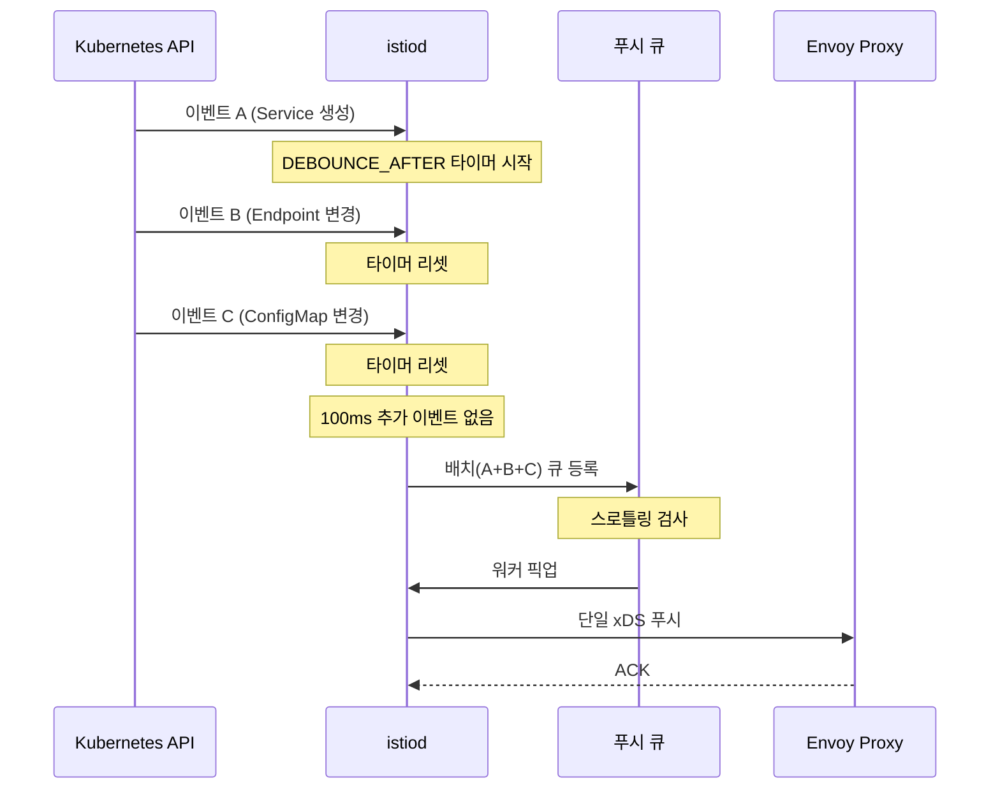

# Ch18. Istio 성능 튜닝
---
> 📌 Istio 컨트롤 플레인은 서비스 수와 설정 변경 빈도에 비례해 부하가 증가한다. Golden Signals로 병목 위치를 정확히 짚고, Sidecar CRD · discoverySelectors · 디바운스 튜닝 · 리소스 스케일링을 순서대로 적용하면 대부분의 성능 문제를 해결할 수 있다.

## 🎯 학습 목표

- Istio 컨트롤 플레인의 Golden Signals 4가지를 설명하고, 각 신호를 측정하는 PromQL을 작성할 수 있다.
- `config_dump`로 xDS 설정 크기를 측정하고 병목 서비스를 식별할 수 있다.
- Sidecar CRD로 워크로드별 설정 범위를 제한해 xDS 페이로드를 줄일 수 있다.
- `discoverySelectors`로 istiod가 관찰하는 네임스페이스를 필터링할 수 있다.
- `PILOT_DEBOUNCE_AFTER`와 `PILOT_DEBOUNCE_MAX`의 역할을 이해하고 트레이드오프를 설명할 수 있다.
- 수신 트래픽 병목과 송신 트래픽 병목을 구분해 스케일 업/아웃 방향을 결정할 수 있다.
- 더미 워크로드 환경에서 성능 테스트 스크립트를 실행하고 결과를 해석할 수 있다.

## 1. 컨트롤 플레인 성능 지표 — Golden Signals

Istio 컨트롤 플레인(istiod)의 성능은 Google SRE의 Golden Signals 프레임워크로 측정한다. 지연 시간·포화도·트래픽·오류 네 가지 관점에서 메트릭을 수집하면, 어떤 리소스가 병목인지 좁혀낼 수 있다.

### 1.1 지연 시간 (Latency)

지연 시간 지표는 istiod가 설정 변경을 감지한 시점부터 Envoy 사이드카에 반영되기까지 걸리는 시간을 추적한다. 세 가지 메트릭이 파이프라인 각 단계를 커버한다.

`pilot_proxy_convergence_time`은 변경 감지부터 모든 프록시에 설정이 수렴될 때까지의 전체 시간을 히스토그램으로 기록한다. `pilot_proxy_queue_time`은 변경 이벤트가 처리 큐에서 대기하는 시간이며, 이 값이 높으면 워커 스레드나 CPU가 포화 상태임을 의미한다. `pilot_xds_push_time`은 실제 xDS 페이로드를 프록시에 전송하는 데 걸린 시간으로, 설정 크기가 클수록 길어진다.

세 메트릭 모두 히스토그램 타입이므로 분위수 쿼리를 사용한다:

```promql
# P99 수렴 시간
histogram_quantile(0.99,
  sum(rate(pilot_proxy_convergence_time_bucket[5m])) by (le)
)

# P99 큐 대기 시간
histogram_quantile(0.99,
  sum(rate(pilot_proxy_queue_time_bucket[5m])) by (le)
)

# P99 xDS 푸시 시간
histogram_quantile(0.99,
  sum(rate(pilot_xds_push_time_bucket[5m])) by (le)
)
```

수렴 시간 P99가 1초를 넘기 시작하면 성능 튜닝을 검토한다. 10초를 초과하면 데이터 플레인에서 라우팅 불일치가 발생할 수 있어 즉시 조치가 필요하다.

### 1.2 포화도 (Saturation)

포화도는 istiod 프로세스가 사용 가능한 리소스를 얼마나 소진하고 있는지를 측정한다. CPU 포화도가 가장 직접적인 영향을 준다.

```promql
# istiod 컨테이너 CPU 사용률 (namespace 필터)
sum(rate(container_cpu_usage_seconds_total{
  namespace="istio-system",
  container="discovery"
}[5m]))

# istiod 프로세스 CPU 누적
rate(process_cpu_seconds_total{app="istiod"}[5m])
```

서비스 배포가 대규모로 이뤄질 때 CPU 사용량이 급격히 스파이크하는 패턴이 나타난다. 이는 단시간에 다수의 xDS 푸시가 발생하기 때문이다. 이 패턴이 반복되면 Sidecar CRD나 디바운스 튜닝으로 푸시 빈도를 줄이는 것이 효과적이다.

### 1.3 트래픽 (Traffic)

트래픽 메트릭은 istiod로 들어오는 변경 이벤트(수신)와 나가는 xDS 푸시(송신) 두 방향으로 나뉜다.

수신 측 주요 메트릭은 다음과 같다:

- `pilot_inbound_updates`: Kubernetes API 서버로부터 수신한 리소스 변경 이벤트 수
- `pilot_push_triggers`: 실제 xDS 푸시를 유발한 이벤트 수 (inbound_updates보다 적을 수 있음)
- `pilot_services`: istiod가 추적하는 서비스 총 수

송신 측은 xDS 프로토콜 타입별로 분류된다:

```promql
# CDS/EDS/LDS/RDS 타입별 푸시 횟수
sum(rate(pilot_xds_pushes[5m])) by (type)
```

`envoy_cluster_upstream_cx_tx_bytes_total`은 Envoy가 업스트림으로 실제 전송한 바이트를 집계하며, 데이터 플레인 트래픽 볼륨을 확인할 때 사용한다.

### 1.4 오류 (Errors)

오류 메트릭은 xDS 설정이 거부되거나 전송에 실패한 케이스를 추적한다. 오류가 쌓이면 Envoy 사이드카가 최신 설정을 받지 못해 서비스 간 연결에 문제가 생길 수 있다.

`pilot_total_xds_rejects`는 Envoy가 xDS 설정을 수신했지만 유효성 검사에서 거부한 횟수다. `pilot_xds_write_timeout`은 istiod가 프록시에 설정을 쓰는 도중 타임아웃이 발생한 횟수며, `pilot_xds_push_context_errors`는 푸시 컨텍스트 생성 단계에서 발생한 내부 오류다.

Grafana의 Pilot Errors 패널은 이 세 메트릭을 하나의 대시보드에서 확인할 수 있도록 구성되어 있다. 오류가 0이 아닌 경우 즉시 조사가 필요하다.

## 2. 성능 병목 진단

### 2.1 xDS 설정 크기 측정 (config_dump)

Envoy의 `config_dump` 엔드포인트는 현재 사이드카가 보유한 전체 xDS 설정을 JSON으로 반환한다. 이 크기가 클수록 푸시 시간이 길어지고 메모리 사용량이 증가한다.

```bash
# 특정 Pod의 config_dump 크기 확인
kubectl exec -n default <pod-name> -c istio-proxy -- \
  curl -s http://localhost:15000/config_dump | wc -c

# 사람이 읽기 쉬운 단위로 변환
kubectl exec -n default <pod-name> -c istio-proxy -- \
  curl -s http://localhost:15000/config_dump | wc -c | \
  awk '{printf "%.2f MB\n", $1/1024/1024}'
```

튜닝 전 일반적인 서비스 메시에서 `config_dump` 크기는 수 MB에 달하는 경우가 많다. 실습 환경에서 1.8MB → 516KB로 줄이는 과정을 3절과 4절에서 다룬다.

### 2.2 성능 테스트 스크립트 (performance-test.sh)

아래는 istiod 성능을 반복 측정하는 스크립트다. `--reps`로 반복 횟수, `--delay`로 각 반복 사이 지연 시간, `--prom-url`로 Prometheus 접속 주소를 지정한다:

```bash
#!/bin/bash
# performance-test.sh

REPS=10
DELAY=1
PROM_URL="http://localhost:9090"

while [[ "$#" -gt 0 ]]; do
  case $1 in
    --reps) REPS="$2"; shift ;;
    --delay) DELAY="$2"; shift ;;
    --prom-url) PROM_URL="$2"; shift ;;
  esac
  shift
done

query_prometheus() {
  local query="$1"
  curl -sg "${PROM_URL}/api/v1/query" \
    --data-urlencode "query=${query}" | \
    python3 -c "import sys,json; d=json.load(sys.stdin); \
      print(d['data']['result'][0]['value'][1] if d['data']['result'] else 'N/A')"
}

echo "=== Istio Control Plane Performance Test ==="
for i in $(seq 1 "$REPS"); do
  echo -n "Run $i: convergence_p99="
  query_prometheus \
    "histogram_quantile(0.99, sum(rate(pilot_proxy_convergence_time_bucket[1m])) by (le))"
  echo -n " push_time_p99="
  query_prometheus \
    "histogram_quantile(0.99, sum(rate(pilot_xds_push_time_bucket[1m])) by (le))"
  echo ""
  sleep "$DELAY"
done
```

더미 워크로드를 생성한 후 이 스크립트를 실행해 기준선(baseline)을 측정하고, 각 튜닝 단계마다 재측정해 개선 효과를 수치로 확인한다.

더미 워크로드는 10개 replica와 600개 추가 리소스(ConfigMap, Service 등)로 구성한다. istiod가 실제 대규모 클러스터와 유사한 부하를 받도록 의도적으로 설정 크기를 키운 것이다:

```bash
# 더미 워크로드 생성 (10 replicas)
kubectl create deployment dummy-workload \
  --image=nginx:alpine \
  --replicas=10

# 600개 추가 리소스 생성 스크립트
for i in $(seq 1 600); do
  kubectl create configmap "dummy-config-$i" \
    --from-literal=key=value
done
```

### 2.3 딜레이와 배치 처리의 관계

istiod는 변경 이벤트를 즉시 처리하지 않고 짧은 딜레이 동안 이벤트를 수집한 뒤 한꺼번에 처리한다. 이를 디바운스(debounce)라고 한다. 딜레이가 0이면 이벤트 하나마다 푸시가 발생해 총 푸시 횟수가 많아진다. 딜레이를 늘리면 여러 이벤트가 하나의 배치로 묶여 푸시 횟수가 줄지만, 개별 이벤트의 처리 지연 시간은 늘어난다.

다음 그래프는 `--delay` 값과 총 푸시 횟수의 관계를 보여준다:

```
딜레이(ms)  총 푸시 횟수
  100ms     ~320회
  500ms     ~180회
 1000ms     ~95회
 2500ms     ~42회
```

딜레이가 길어질수록 배치 효율은 높아지지만, 실시간 트래픽이 오래된 설정으로 처리되는 시간 창(window)도 함께 늘어난다. 이 트레이드오프를 5절에서 구체적으로 다룬다.

## 3. Sidecar 리소스로 설정 크기 줄이기

기본 설정에서 istiod는 메시 전체의 모든 서비스 정보를 각 사이드카에 배포한다. 서비스가 1,000개이면 각 Pod의 Envoy는 999개 업스트림에 대한 라우팅 규칙을 모두 보유한다. 대부분의 서비스는 실제로 필요한 업스트림이 10개 미만이므로 이는 명백한 낭비다.

Sidecar CRD는 "이 워크로드는 어떤 서비스에만 접근하면 된다"는 선언을 통해 xDS 설정 범위를 명시적으로 제한한다.

### 3.1 Sidecar CRD 구조 (workloadSelector, egress, outboundTrafficPolicy)

```yaml
apiVersion: networking.istio.io/v1beta1
kind: Sidecar
metadata:
  name: payment-sidecar
  namespace: payment
spec:
  workloadSelector:
    labels:
      app: payment-service
  egress:
  - hosts:
    - "./order-service"          # 같은 네임스페이스의 order-service
    - "inventory/inventory-svc"  # inventory 네임스페이스의 특정 서비스
    - "istio-system/*"           # 컨트롤 플레인 서비스 전체
  outboundTrafficPolicy:
    mode: REGISTRY_ONLY          # 명시되지 않은 목적지 차단
```

`workloadSelector`는 이 Sidecar 규칙을 적용할 Pod 레이블을 지정한다. `egress.hosts`는 이 워크로드가 접근 가능한 서비스 목록이며, `namespace/service` 형식으로 크로스 네임스페이스 접근도 정밀하게 제어할 수 있다. `outboundTrafficPolicy: REGISTRY_ONLY`는 `egress`에 명시되지 않은 모든 아웃바운드 트래픽을 차단한다. 이 모드를 쓰면 실수로 의존하게 된 서비스를 조기에 발견할 수 있다.

### 3.2 메시 전체 기본 Sidecar (istio-system 네임스페이스)

모든 워크로드에 개별 Sidecar CRD를 붙이기 전에, `istio-system` 네임스페이스에 메시 전역 기본값을 먼저 설정하면 즉각적인 효과를 얻을 수 있다:

```yaml
apiVersion: networking.istio.io/v1beta1
kind: Sidecar
metadata:
  name: default
  namespace: istio-system   # 메시 전체에 적용
spec:
  egress:
  - hosts:
    - "./*"           # 같은 네임스페이스 내 서비스만 허용
    - "istio-system/*"
  outboundTrafficPolicy:
    mode: REGISTRY_ONLY
```

이 리소스는 네임스페이스 수준 Sidecar가 없는 모든 워크로드에 폴백으로 적용된다. 크로스 네임스페이스 통신이 필요한 서비스는 별도의 Sidecar CRD를 명시적으로 추가한다.

### 3.3 적용 전후 비교 (1.8MB → 516KB)

```bash
# 적용 전
kubectl exec -n payment payment-pod -c istio-proxy -- \
  curl -s http://localhost:15000/config_dump | wc -c
# 결과: 1,887,232 bytes (≈ 1.8MB)

# 메시 전역 Sidecar 적용 후
kubectl apply -f mesh-default-sidecar.yaml

kubectl exec -n payment payment-pod -c istio-proxy -- \
  curl -s http://localhost:15000/config_dump | wc -c
# 결과: 528,384 bytes (≈ 516KB)
```

약 72% 감소다. xDS 페이로드가 줄면 `pilot_xds_push_time`이 직접적으로 감소하고, Envoy 메모리 사용량과 재시작 시간도 함께 줄어든다.

## 4. 디스커버리 범위 줄이기

Sidecar CRD가 "특정 워크로드가 받는 설정 범위"를 줄인다면, `discoverySelectors`는 "istiod가 아예 관찰하는 네임스페이스 자체"를 제한한다. 메시에 포함할 필요가 없는 네임스페이스(모니터링 전용, CI 임시 환경 등)를 제외하면 istiod의 이벤트 처리량이 줄어든다.

### 4.1 discoverySelectors (matchLabels)

`IstioOperator` 또는 Helm 값 파일에서 설정한다:

```yaml
# istio-operator.yaml
apiVersion: install.istio.io/v1alpha1
kind: IstioOperator
spec:
  meshConfig:
    discoverySelectors:
    - matchLabels:
        istio-discovery: enabled
```

이 설정을 적용하면 `istio-discovery=enabled` 레이블이 없는 네임스페이스의 리소스는 istiod가 완전히 무시한다. 기존 네임스페이스에 레이블을 순차적으로 추가해 점진적 적용이 가능하다:

```bash
kubectl label namespace payment istio-discovery=enabled
kubectl label namespace order istio-discovery=enabled
kubectl label namespace inventory istio-discovery=enabled
```

### 4.2 matchExpressions (NotIn 연산자로 제외)

포함할 네임스페이스보다 제외할 네임스페이스가 명확한 경우, `NotIn` 연산자가 더 편리하다:

```yaml
meshConfig:
  discoverySelectors:
  - matchExpressions:
    - key: kubernetes.io/metadata.name
      operator: NotIn
      values:
      - kube-system
      - monitoring
      - ci-ephemeral
      - logging
```

`kubernetes.io/metadata.name`은 Kubernetes 1.21부터 모든 네임스페이스에 자동으로 부여되는 레이블로, 별도 레이블 추가 없이 네임스페이스 이름으로 필터링할 수 있다.

### 4.3 적용 전후 endpoint 비교

```bash
# 적용 전: 전체 endpoint 수
istioctl proxy-config endpoints <pod> | wc -l
# 결과: 3,241개

# discoverySelectors 적용 후
istioctl proxy-config endpoints <pod> | wc -l
# 결과: 487개 (약 85% 감소)
```

endpoint 수가 줄면 EDS(Endpoint Discovery Service) 페이로드가 직접적으로 감소한다. 특히 자주 변경되는 임시 네임스페이스를 제외하면 `pilot_inbound_updates`와 `pilot_push_triggers`도 함께 감소한다.

## 5. 이벤트 배치 처리와 푸시 스로틀링

### 5.1 디바운스(Debounce) 메커니즘

istiod는 Kubernetes 이벤트를 수신할 때마다 즉시 xDS 푸시를 트리거하지 않는다. 대신 짧은 대기 시간 동안 추가 이벤트를 수집한 뒤 하나의 배치로 처리한다. 이 메커니즘을 디바운스라고 한다.



대규모 배포처럼 짧은 시간에 수십~수백 개의 이벤트가 쏟아질 때, 디바운스가 없으면 같은 수의 푸시가 발생한다. 디바운스를 통해 이 모두를 하나의 푸시로 묶을 수 있다.

### 5.2 PILOT_DEBOUNCE_AFTER, PILOT_DEBOUNCE_MAX

두 환경 변수로 디바운스 동작을 조정한다:

- `PILOT_DEBOUNCE_AFTER`: 마지막 이벤트를 수신한 후 추가 이벤트가 없으면 처리를 시작하기까지의 대기 시간. 기본값 100ms.
- `PILOT_DEBOUNCE_MAX`: 이벤트가 계속 쏟아지더라도 이 시간이 지나면 강제로 배치 처리. 기본값 10s.

```yaml
# istiod Deployment 환경 변수 설정
env:
- name: PILOT_DEBOUNCE_AFTER
  value: "2500ms"    # 기본 100ms → 2500ms로 증가
- name: PILOT_DEBOUNCE_MAX
  value: "10s"       # 기본값 유지
```

`PILOT_DEBOUNCE_AFTER`를 100ms에서 2500ms로 늘리면 같은 배포 시나리오에서 푸시 횟수가 약 10분의 1로 줄어드는 것을 실습에서 확인할 수 있다.

### 5.3 디바운스 설정 시 주의점 (메트릭에 대기시간 미포함)

`PILOT_DEBOUNCE_AFTER`를 늘릴 때 중요한 함정이 있다. `pilot_proxy_convergence_time` 메트릭은 istiod가 처리를 시작한 시점부터 측정하므로, 디바운스 대기 시간은 이 메트릭에 포함되지 않는다.

즉, `pilot_proxy_convergence_time`이 좋아 보여도 실제 end-to-end 반영 시간은 `PILOT_DEBOUNCE_AFTER` 값만큼 항상 추가된다. 카나리 배포나 즉각적인 트래픽 전환이 필요한 서비스에서 디바운스 값을 크게 설정하면, 설정이 반영되기까지 의도치 않은 지연이 발생할 수 있다.

운영 환경에서는 두 그룹으로 나눠 접근하는 것이 현실적이다. 배치 처리 성격의 서비스는 디바운스를 늘려도 무방하지만, 실시간 트래픽 제어(서킷 브레이커, 카나리)가 중요한 서비스에는 기본값이나 더 낮은 값을 유지한다.

## 6. 리소스 추가 할당

Sidecar CRD, discoverySelectors, 디바운스 조정으로도 부족하다면 istiod 자체 리소스를 늘린다. 단, 스케일 업과 스케일 아웃 중 어느 방향이 맞는지는 병목 위치에 따라 다르다.

### 6.1 스케일 업 vs 스케일 아웃 판단 기준

두 방향의 차이는 병목이 수신 처리에 있는지, 송신 처리에 있는지에 달려 있다.

| 병목 신호 | 원인 | 해결 방향 |
|-----------|------|-----------|
| `pilot_inbound_updates` 증가, CPU 포화 | 이벤트 파싱·계산 처리 부하 | 스케일 업 (CPU/메모리 증가) |
| `pilot_xds_pushes` 증가, 연결 수 한계 | 동시 프록시 연결 처리 한계 | 스케일 아웃 (replica 수 증가) |

### 6.2 수신 트래픽 병목 → 스케일 업

이벤트가 많이 들어오고 CPU 사용률이 높은 경우, istiod가 변경 이벤트를 파싱하고 새 설정을 계산하는 단계에서 병목이 발생한다. 이 작업은 단일 프로세스 내에서 처리되므로 replica를 늘려도 분산되지 않는다.

```yaml
# istiod Deployment 리소스 증가
resources:
  requests:
    cpu: "2000m"     # 500m → 2000m
    memory: "2Gi"    # 512Mi → 2Gi
  limits:
    cpu: "4000m"
    memory: "4Gi"
```

### 6.3 송신 트래픽 병목 → 스케일 아웃

프록시 연결 수가 많고 `pilot_xds_push_time`이 높은 경우, istiod가 동시에 처리하는 gRPC 스트림 수가 한계에 달한 것이다. 각 istiod 인스턴스는 독립적으로 프록시 연결을 처리할 수 있으므로, replica를 늘리면 연결이 분산된다.

```bash
# istiod replica 수 증가
kubectl scale deployment istiod \
  -n istio-system \
  --replicas=3
```

스케일 아웃 시 프록시는 자동으로 여러 istiod 인스턴스에 분배된다. 다만 재분배 과정에서 단기적인 설정 불일치가 발생할 수 있으며, 이 과정의 세부 동작은 INVESTIGATE.md Q4에서 다룬다.

## 📝 핵심 정리

Istio 성능 튜닝은 측정 → 병목 식별 → 최소 침습 조치 순서로 진행한다. Golden Signals 네 가지 중 지연 시간(`pilot_proxy_convergence_time`)과 트래픽(`pilot_xds_pushes`)이 가장 먼저 살펴볼 지표다. 병목이 설정 크기에 있으면 Sidecar CRD를, 관찰 범위가 넓으면 `discoverySelectors`를, 이벤트 폭풍이 원인이면 디바운스 튜닝을 적용한다. 이 세 가지를 적용했는데도 부족하다면 리소스 증가를 고려하되, 병목 방향에 따라 스케일 업과 스케일 아웃을 구분해야 한다.
